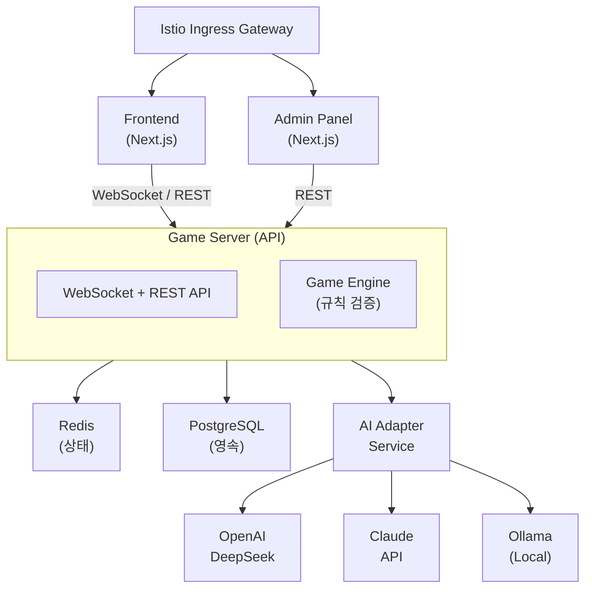
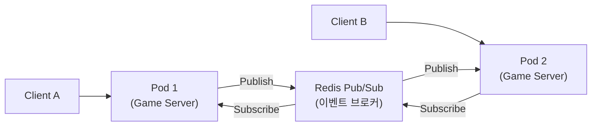
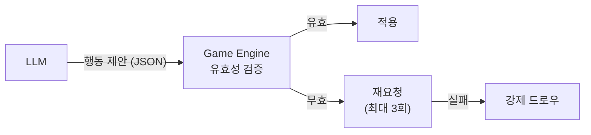
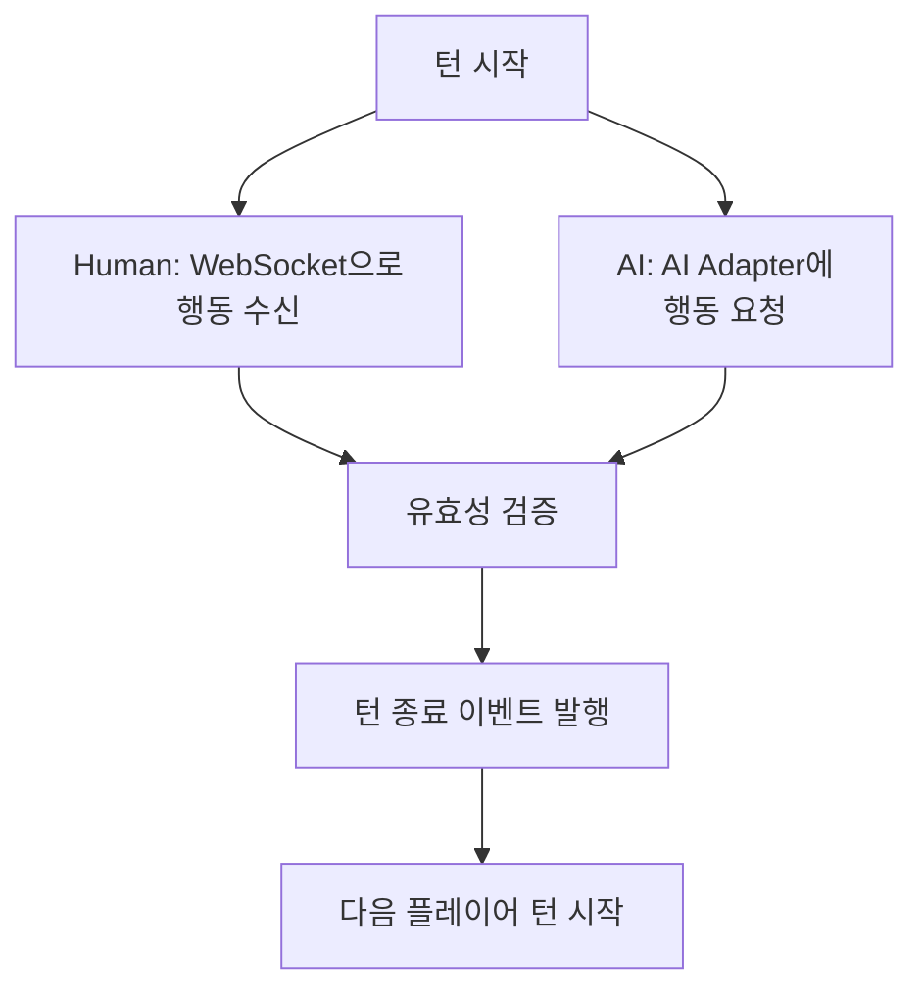
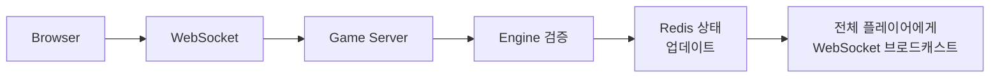
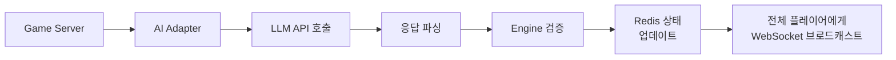
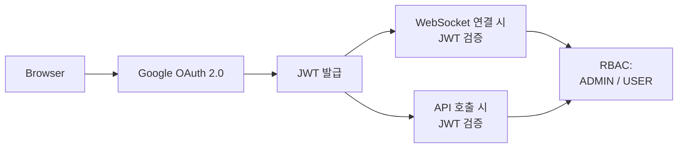
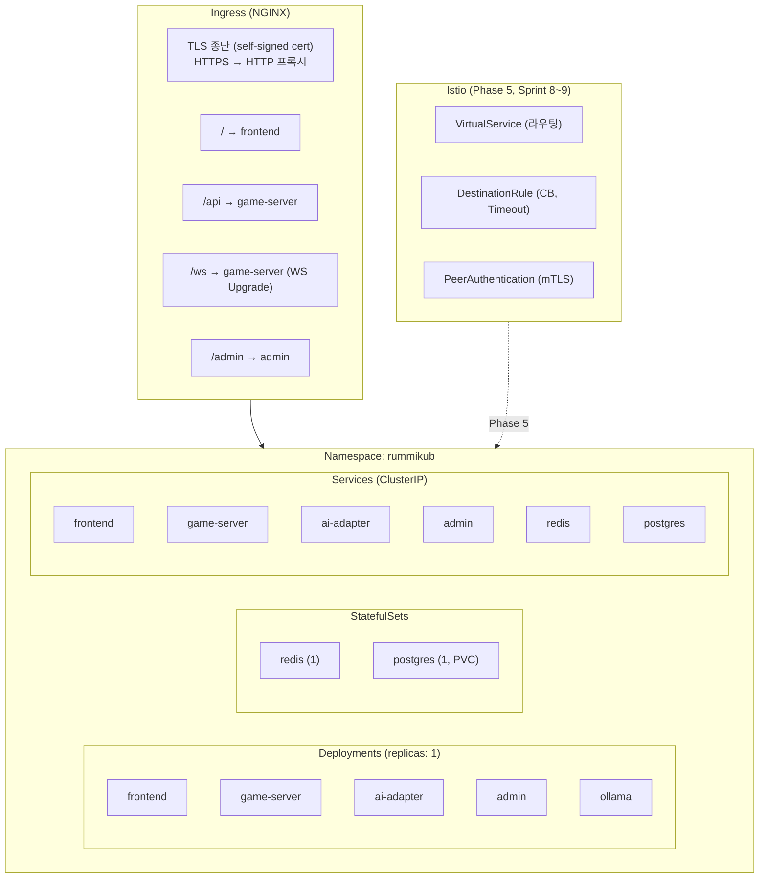
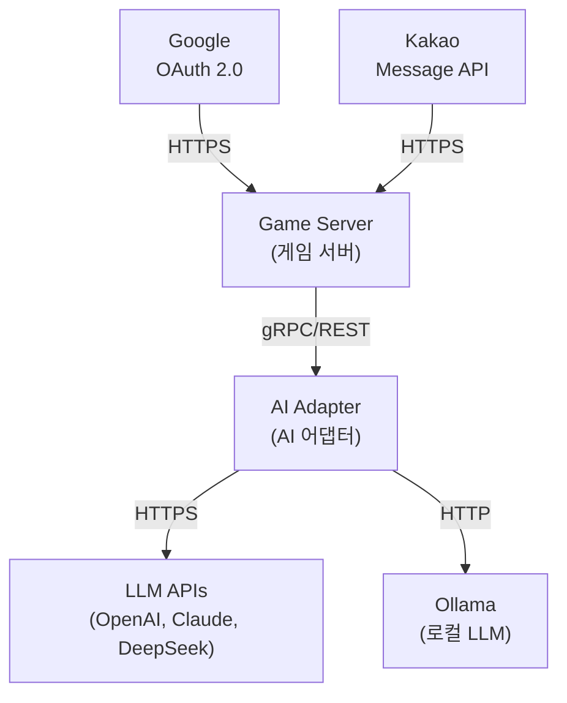

# 시스템 아키텍처 설계 (System Architecture)

## 1. 전체 아키텍처 개요

## 2. 서비스 구성

| 서비스 | 역할 | 포트 | 기술 |
|--------|------|------|------|
| frontend | 게임 UI | 3000 | Next.js |
| game-server | 게임 로직, API, WebSocket | 8080 | NestJS or Go |
| ai-adapter | LLM 호출 추상화 | 8081 | NestJS or Go |
| admin | 관리자 대시보드 | 3001 | Next.js |
| redis | 게임 상태 캐시 | 6379 | Redis 7 |
| postgres | 유저, 전적, 로그 영속 저장 | 5432 | PostgreSQL 16 |
| ollama | 로컬 LLM 서빙 | 11434 | Ollama |

## 3. 핵심 설계 원칙

### 3.1 Stateless Game Server
- 게임 상태는 Redis에 저장
- Pod 재시작 시에도 게임 유지
- 수평 확장 가능
- **수평 확장 시 WebSocket 전략**: 현재 replicas:1이므로 단일 인스턴스에서 모든 WebSocket 연결을 처리한다. 수평 확장(replicas > 1) 시에는 Redis Pub/Sub 기반 메시지 브로커를 도입하여 인스턴스 간 WebSocket 이벤트를 동기화해야 한다.

### 3.2 LLM 신뢰 금지 원칙

### 3.3 AI Adapter 분리
- Game Engine은 특정 LLM에 의존하지 않음
- 공통 인터페이스를 통해 모델 교체 가능
- Istio VirtualService로 모델별 트래픽 분배 가능

### 3.4 이벤트 기반 턴 관리

## 4. 데이터 흐름

### 4.1 Human 플레이어 턴

### 4.2 AI 플레이어 턴

## 5. 인증/인가 아키텍처

## 6. Kubernetes 배포 아키텍처

## 7. 외부 시스템 연동

> **참고**: LLM API 호출은 Game Server가 직접 수행하지 않는다. 반드시 AI Adapter를 경유하여 모델 무관 인터페이스로 통신한다.

## 8. 게임 상태 Enum

모든 서비스에서 동일한 게임 상태 값을 사용한다.

| 상태 | 설명 |
|------|------|
| WAITING | Room 생성 후 플레이어 입장 대기 |
| PLAYING | 게임 진행 중 |
| FINISHED | 정상 종료 (승자 확정) |
| CANCELLED | 비정상 종료 (강제 종료, 인원 부족) |

> CREATED 상태는 사용하지 않는다. Room 생성 시 즉시 WAITING 상태로 진입한다.
