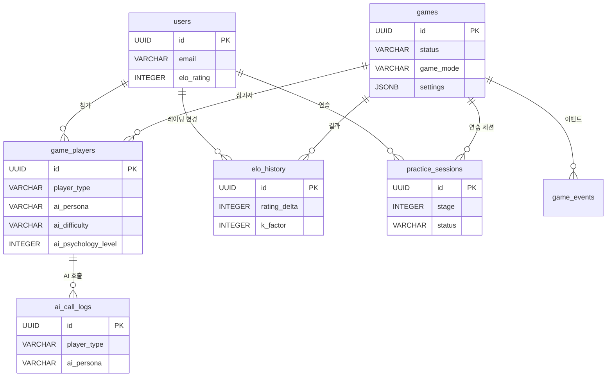

# 데이터베이스 설계 (Database Design)

## 1. 저장소 전략

| 저장소 | 용도 | 데이터 특성 |
|--------|------|-------------|
| PostgreSQL | 유저, 전적, AI 호출 로그, 설정 | 영속, 관계형 |
| Redis | 게임 상태, 세션, 턴 정보 | 휘발성, 고속 |

## 2. PostgreSQL 테이블 설계

### 2.1 users (사용자)
```sql
CREATE TABLE users (
    id            UUID PRIMARY KEY DEFAULT gen_random_uuid(),
    email         VARCHAR(255) UNIQUE NOT NULL,
    display_name  VARCHAR(100) NOT NULL,
    avatar_url    TEXT,
    role          VARCHAR(20) DEFAULT 'ROLE_USER',  -- ROLE_ADMIN, ROLE_USER
    elo_rating    INTEGER DEFAULT 1000,
    is_blocked    BOOLEAN DEFAULT FALSE,
    created_at    TIMESTAMPTZ DEFAULT NOW(),
    updated_at    TIMESTAMPTZ DEFAULT NOW()
);
```

### 2.2 games (게임 기록)
```sql
CREATE TABLE games (
    id            UUID PRIMARY KEY DEFAULT gen_random_uuid(),
    room_code     VARCHAR(10) UNIQUE NOT NULL,
    status        VARCHAR(20) NOT NULL,  -- WAITING, PLAYING, FINISHED, CANCELLED
    game_mode     VARCHAR(20) NOT NULL DEFAULT 'NORMAL',  -- NORMAL, PRACTICE
    player_count  INTEGER NOT NULL CHECK (player_count BETWEEN 2 AND 4),
    winner_id     UUID REFERENCES users(id),
    turn_count    INTEGER DEFAULT 0,
    settings      JSONB DEFAULT '{}',    -- 게임 설정 (아래 설명 참조)
    started_at    TIMESTAMPTZ,
    finished_at   TIMESTAMPTZ,
    created_at    TIMESTAMPTZ DEFAULT NOW()
);
```

**settings JSONB 구조 예시**:
```json
{
  "turnTimeoutSec": 60,
  "initialMeldThreshold": 30,
  "maxDrawPileExhaustedRounds": 3,
  "practiceStage": null
}
```

| 필드 | 타입 | 기본값 | 설명 |
|------|------|--------|------|
| turnTimeoutSec | integer | 60 | 턴 타임아웃 (30~120초) |
| initialMeldThreshold | integer | 30 | 최초 등록 최소 점수 |
| maxDrawPileExhaustedRounds | integer | 3 | 드로우 파일 소진 후 교착 판정 라운드 수 |
| practiceStage | integer/null | null | 연습 모드 스테이지 번호 (1~6, NORMAL이면 null) |

### 2.3 game_players (게임 참가자)
```sql
CREATE TABLE game_players (
    id                    UUID PRIMARY KEY DEFAULT gen_random_uuid(),
    game_id               UUID NOT NULL REFERENCES games(id),
    user_id               UUID REFERENCES users(id),       -- NULL이면 AI
    player_type           VARCHAR(20) NOT NULL,             -- HUMAN, AI_OPENAI, AI_CLAUDE, AI_DEEPSEEK, AI_LLAMA
    ai_persona            VARCHAR(30),                      -- rookie, calculator, shark, fox, wall, wildcard (AI일 때)
    ai_difficulty         VARCHAR(20),                      -- beginner, intermediate, expert (AI일 때)
    ai_psychology_level   INTEGER CHECK (ai_psychology_level BETWEEN 0 AND 3),  -- 심리전 레벨 (AI일 때)
    seat_order            INTEGER NOT NULL CHECK (seat_order BETWEEN 0 AND 3),
    initial_tiles         INTEGER DEFAULT 14,
    final_tiles           INTEGER,
    score                 INTEGER,
    is_winner             BOOLEAN DEFAULT FALSE,
    UNIQUE(game_id, seat_order)
);
```

### 2.4 ai_call_logs (AI 호출 로그)
```sql
CREATE TABLE ai_call_logs (
    id                    UUID PRIMARY KEY DEFAULT gen_random_uuid(),
    game_id               UUID NOT NULL REFERENCES games(id),
    player_id             UUID NOT NULL REFERENCES game_players(id),
    player_type           VARCHAR(20) NOT NULL,             -- AI_OPENAI, AI_CLAUDE, AI_DEEPSEEK, AI_LLAMA (game_players.player_type과 동일 컨벤션)
    model_name            VARCHAR(100),                     -- gpt-4o, claude-sonnet-4-20250514, deepseek-chat, llama3.2 등
    ai_persona            VARCHAR(30),                      -- rookie, calculator, shark, fox, wall, wildcard
    ai_difficulty         VARCHAR(20),                      -- beginner, intermediate, expert
    ai_psychology_level   INTEGER,                          -- 0~3
    turn_number           INTEGER NOT NULL,
    prompt_tokens         INTEGER,
    completion_tokens     INTEGER,
    latency_ms            INTEGER,
    is_valid_move         BOOLEAN,
    retry_count           INTEGER DEFAULT 0,
    error_message         TEXT,
    created_at            TIMESTAMPTZ DEFAULT NOW()
);
```

> **네이밍 컨벤션**: `player_type`은 game_players 테이블과 동일한 값(AI_OPENAI, AI_CLAUDE 등)을 사용한다. 기존 `model_type` 필드는 `player_type`으로 통일하여 조인 및 집계 쿼리의 일관성을 확보한다.

### 2.5 game_events (게임 이벤트 로그)
```sql
CREATE TABLE game_events (
    id            UUID PRIMARY KEY DEFAULT gen_random_uuid(),
    game_id       UUID NOT NULL REFERENCES games(id),
    turn_number   INTEGER NOT NULL,
    player_id     UUID NOT NULL REFERENCES game_players(id),
    event_type    VARCHAR(30) NOT NULL,             -- PLACE_TILES, DRAW_TILE, REARRANGE, TIMEOUT
    event_data    JSONB,                            -- 상세 행동 데이터
    created_at    TIMESTAMPTZ DEFAULT NOW()
);
CREATE INDEX idx_game_events_game ON game_events(game_id, turn_number);
```

### 2.6 system_config (시스템 설정)
```sql
CREATE TABLE system_config (
    key           VARCHAR(100) PRIMARY KEY,
    value         TEXT NOT NULL,
    description   TEXT,
    updated_at    TIMESTAMPTZ DEFAULT NOW()
);

-- 초기 데이터
INSERT INTO system_config (key, value, description) VALUES
('turn_timeout_sec', '60', '턴 타임아웃(초)'),
('ai_max_retries', '3', 'AI 무효 수 재시도 횟수'),
('ai_timeout_ms', '10000', 'AI 응답 타임아웃(ms)'),
('initial_meld_threshold', '30', '최초 등록 최소 점수'),
('max_rooms', '10', '최대 동시 게임 수');
```

### 2.7 elo_history (ELO 레이팅 변경 이력)
```sql
CREATE TABLE elo_history (
    id            UUID PRIMARY KEY DEFAULT gen_random_uuid(),
    user_id       UUID NOT NULL REFERENCES users(id),
    game_id       UUID NOT NULL REFERENCES games(id),
    rating_before INTEGER NOT NULL,
    rating_after  INTEGER NOT NULL,
    rating_delta  INTEGER NOT NULL,              -- 변동량 (+/-)
    k_factor      INTEGER NOT NULL DEFAULT 32,   -- K-factor (기본 32)
    opponent_avg_rating INTEGER,                 -- 상대 평균 레이팅
    created_at    TIMESTAMPTZ DEFAULT NOW()
);
CREATE INDEX idx_elo_history_user ON elo_history(user_id, created_at DESC);
```

### 2.8 practice_sessions (1인 연습 모드)

1인 연습 모드는 games 테이블의 `game_mode = 'PRACTICE'`로 구분하되, 연습 전용 진행 정보를 별도 테이블에 저장한다.

```sql
CREATE TABLE practice_sessions (
    id            UUID PRIMARY KEY DEFAULT gen_random_uuid(),
    user_id       UUID NOT NULL REFERENCES users(id),
    game_id       UUID NOT NULL REFERENCES games(id),  -- games.game_mode = 'PRACTICE'
    stage         INTEGER NOT NULL CHECK (stage BETWEEN 1 AND 6),
    status        VARCHAR(20) NOT NULL DEFAULT 'ACTIVE',  -- ACTIVE, COMPLETED, ABANDONED
    objectives    JSONB NOT NULL,                  -- 스테이지별 목표 조건
    result        JSONB,                           -- 완료 시 결과 (클리어 여부, 점수 등)
    started_at    TIMESTAMPTZ DEFAULT NOW(),
    completed_at  TIMESTAMPTZ
);
CREATE INDEX idx_practice_user ON practice_sessions(user_id, stage);
```

**연습 모드 스테이지 (Stage 1~6)**:

| Stage | 목표 | 설명 |
|-------|------|------|
| 1 | 최초 등록 (Initial Meld) | 30점 이상 조합을 만들어 첫 배치 연습 |
| 2 | 런(Run) 만들기 | 같은 색상 연속 숫자 3개 이상 |
| 3 | 그룹(Group) 만들기 | 같은 숫자 다른 색상 3~4개 |
| 4 | 테이블 재배치 | 기존 테이블 타일을 활용한 재배치 |
| 5 | 조커 활용 | 조커를 전략적으로 사용 |
| 6 | 종합 실전 | AI 1명 상대 자유 대전 |

## 3. Redis 데이터 구조

### 3.1 게임 상태
```
Key: game:{gameId}:state
Type: Hash
Fields:
  - status: "PLAYING"
  - currentTurn: 2
  - currentPlayer: 0
  - drawPileCount: 52
  - consecutiveDrawCount: 0         -- 교착 상태 판정용: 연속 드로우/패스 횟수
  - tableState: JSON (테이블 위 타일 세트들)
TTL: 7200 (2시간, 게임 최대 시간 기준)
```

### 3.2 플레이어 타일 (비공개)
```
Key: game:{gameId}:player:{seatOrder}:tiles
Type: List
Value: ["R1a", "B5a", "Y13b", "JK1", ...]
TTL: 게임 상태와 동일 (7200초)
```

> **타일 인코딩**: 반드시 `{Color}{Number}{Set}` 형식을 사용한다. 예: `R1a` (빨강 1 세트a), `B5a` (파랑 5 세트a), `Y13b` (노랑 13 세트b), `JK1` (조커 1), `JK2` (조커 2).

### 3.3 드로우 파일
```
Key: game:{gameId}:drawpile
Type: List
Value: ["K7a", "R12b", "Y3a", "JK2", ...]  -- 셔플된 타일 목록
TTL: 게임 상태와 동일 (7200초)
```

### 3.4 세션 관리
```
Key: session:{sessionId}
Type: Hash
Fields:
  - userId: UUID
  - gameId: UUID (현재 참가 중인 게임)
TTL: 1800 (30분)
```

### 3.5 교착 상태 판정 데이터
```
Key: game:{gameId}:stalemate
Type: Hash
Fields:
  - consecutiveDrawCount: 0          -- 전체 플레이어 연속 드로우/패스 횟수
  - lastPlaceTurn: 0                 -- 마지막으로 타일 배치가 있었던 턴 번호
  - drawPileExhaustedSince: null     -- 드로우 파일 소진 시점 턴 번호
TTL: 게임 상태와 동일 (7200초)
```

> **교착 상태 판정 기준**: 드로우 파일 소진 후 전체 플레이어가 1라운드(= player_count 턴) 동안 모두 배치 불가 시, 남은 타일 합산 점수로 승자를 결정한다.

### 3.6 턴 타이머
```
Key: game:{gameId}:timer
Type: String
Value: 턴 만료 시각 (Unix timestamp ms)
TTL: turnTimeoutSec (30~120초, 게임 설정에 따라)
```

### 3.7 Redis TTL 관리 정책

| 키 패턴 | 기본 TTL | 갱신 규칙 |
|---------|----------|-----------|
| game:{gameId}:state | 7200초 (2시간) | 매 턴 종료 시 TTL 갱신 |
| game:{gameId}:player:*:tiles | 7200초 | game:state TTL과 동기화 |
| game:{gameId}:drawpile | 7200초 | game:state TTL과 동기화 |
| game:{gameId}:stalemate | 7200초 | game:state TTL과 동기화 |
| game:{gameId}:timer | 30~120초 | 매 턴 시작 시 재설정 |
| session:{sessionId} | 1800초 (30분) | WebSocket heartbeat 시 갱신 |

> **TTL 갱신**: 게임 진행 중 매 턴 종료 시 모든 game:{gameId}:* 키의 TTL을 7200초로 갱신한다. 게임 종료(FINISHED/CANCELLED) 후에는 TTL을 600초(10분)로 단축하여 자원을 회수한다.

## 4. 타일 인코딩 규칙

| 코드 | 의미 |
|------|------|
| R | Red (빨강) |
| B | Blue (파랑) |
| Y | Yellow (노랑) |
| K | Black (검정) |
| 1~13 | 숫자 |
| a/b | 동일 타일 구분 (세트 1/세트 2) |
| JK1, JK2 | 조커 1, 조커 2 |

예시: `R7a` = 빨강 7 (세트 a), `B13b` = 파랑 13 (세트 b)

## 5. ER 다이어그램


