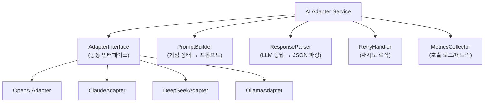
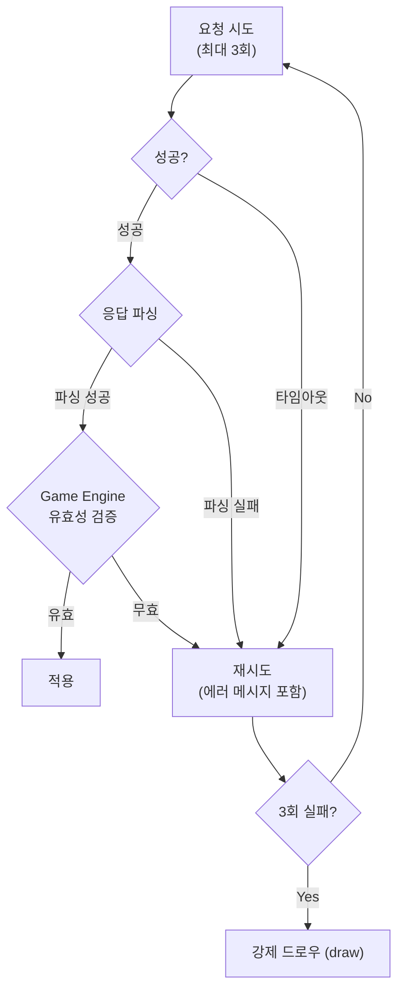
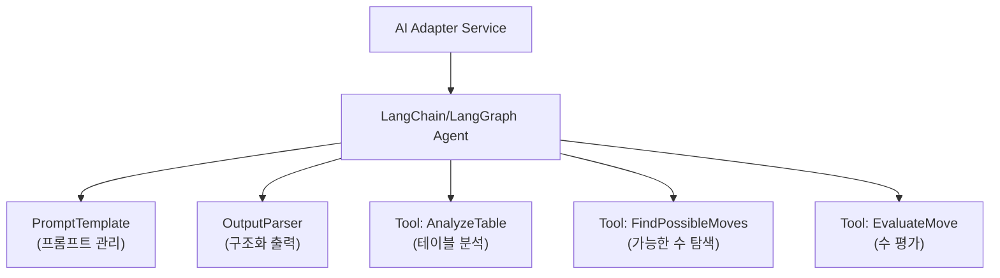

# AI Adapter 설계 (AI Adapter Design)

## 1. 설계 원칙

1. **Game Engine과 완전 분리**: AI는 행동을 제안만 하고, 검증은 Engine이 담당
2. **모델 무관 인터페이스**: 어떤 LLM이든 동일한 인터페이스로 호출
3. **실패 허용 설계**: 타임아웃, 파싱 실패, 불법 수에 대한 fallback 로직
4. **관측 가능**: 모든 호출에 대해 지연시간, 토큰, 유효성 결과 기록

## 2. Adapter 구조



## 3. 공통 인터페이스

```typescript
interface AIAdapter {
  generateMove(request: MoveRequest): Promise<MoveResponse>;
  getModelInfo(): ModelInfo;
  healthCheck(): Promise<boolean>;
}

interface MoveRequest {
  gameId: string;
  gameState: GameState;
  persona: 'rookie' | 'calculator' | 'shark' | 'fox' | 'wall' | 'wildcard';
  difficulty: 'beginner' | 'intermediate' | 'expert';
  psychologyLevel: 0 | 1 | 2 | 3;
  maxRetries: number;
  timeoutMs: number;
}

interface MoveResponse {
  action: 'place' | 'draw';
  tableGroups?: TileGroup[];    // 배치할 때
  tilesFromRack?: string[];     // 랙에서 사용한 타일
  reasoning?: string;           // AI 사고 과정
  metadata: {
    modelType: string;
    modelName: string;
    latencyMs: number;
    promptTokens: number;
    completionTokens: number;
    retryCount: number;
  };
}
```

## 4. 프롬프트 설계

### 4.1 시스템 프롬프트
```
당신은 루미큐브 게임 AI 플레이어입니다.
주어진 게임 상태를 분석하고, 최적의 수를 JSON 형식으로 응답하세요.

## 타일 인코딩 규칙
타일은 {Color}{Number}{Set} 형식으로 표현됩니다.
- Color: R(빨강), B(파랑), Y(노랑), K(검정)
- Number: 1~13
- Set: a 또는 b (동일 타일 구분, 각 타일은 2장씩 존재)
- 조커: JK1, JK2 (총 2장)
- 예시: R7a = 빨강 7 (세트a), B13b = 파랑 13 (세트b)
- 전체 타일: 4색 x 13숫자 x 2세트 + 조커 2장 = 106장

## 게임 규칙
- 그룹(Group): 같은 숫자, 서로 다른 색상 3~4개 (예: [R7a, B7a, K7b])
- 런(Run): 같은 색상, 연속 숫자 3개 이상 (예: [Y3a, Y4a, Y5a])
- 조커(JK1, JK2)는 어떤 타일이든 대체 가능
- 테이블의 기존 타일을 재배치할 수 있음
- 모든 그룹/런은 3개 이상의 타일로 구성되어야 함
- 최초 등록(Initial Meld): 첫 배치 시 자신의 타일만으로 합계 30점 이상을 내려놓아야 함.
  최초 등록 전에는 테이블 재배치가 불가함.

## 응답 형식
반드시 아래 JSON 형식으로만 응답하세요.
{
  "action": "place" | "draw",
  "tableGroups": [...],
  "tilesFromRack": [...],
  "reasoning": "..."
}
```

### 4.2 게임 상태 전달 형식
```
현재 테이블:
  그룹1: [R7a, B7a, K7b]
  런1: [Y3a, Y4a, Y5a, Y6b]

내 타일: [R1a, R5b, B3a, B8a, Y7a, K2b, K9a, JK1]

상대 정보:
  Player 1: 타일 8개
  Player 2: 타일 3개 (주의: 거의 승리)

드로우 파일: 28장 남음
턴: 15
최초 등록 완료 여부: 완료

캐릭터: shark (공격적, 압박형)
난이도: expert
```

### 4.3 캐릭터(persona) 기반 프롬프트 변형

기존 `strategy` 필드(aggressive/balanced/defensive)는 캐릭터 시스템으로 대체한다. 서버는 `persona`와 `difficulty` 조합에 따라 프롬프트를 자동 구성한다.

**캐릭터 -> 프롬프트 매핑**:

| 캐릭터 | 프롬프트 톤 + 지시 |
|--------|-------------------|
| rookie | "초보자처럼 플레이하세요. 단순한 그룹/런만 만드세요. 테이블 재배치는 하지 마세요. 가끔 최적 수를 놓쳐도 됩니다." |
| calculator | "효율적으로 확률 기반으로 플레이하세요. 남은 타일 확률을 고려하고, 조커는 아껴두세요." |
| shark | "공격적으로 상대를 압박하세요. 가능한 한 많은 타일을 내려놓고, 상대가 필요한 타일을 선점하세요." |
| fox | "교활하게 상대를 속이세요. 낼 수 있는 타일도 전략적으로 보류하고, 한 턴에 대량 배치를 노리세요." |
| wall | "방어적으로 끈질기게 플레이하세요. 최소한의 타일만 내려놓고, 장기전을 유도하세요." |
| wildcard | "예측불가하게 플레이하세요. 매 턴 다른 전략을 섞어 상대를 혼란시키세요." |

**난이도 -> 정보 제한 매핑**:

| 난이도 | 모델 선택 | 제공 정보 | 재배치 허용 |
|--------|-----------|-----------|------------|
| beginner | 경량 (gpt-4o-mini, llama3.2:1b) | 내 타일 + 테이블만 | 불가 |
| intermediate | 중급 (gpt-4o-mini, deepseek-chat) | + 상대 남은 타일 수 | 기본 |
| expert | 최상위 (gpt-4o, claude-sonnet, deepseek-r1) | + 행동 히스토리 + 미출현 타일 | 적극 |

## 5. 모델별 Adapter 구현 노트

### 5.1 OpenAI Adapter
- 모델: gpt-4o (기본)
- Structured Output (JSON mode) 활용
- Function calling으로 응답 구조 강제 가능

### 5.2 Claude Adapter
- 모델: claude-sonnet-4-20250514 (기본)
- Tool use로 응답 구조 강제
- 긴 컨텍스트 활용 가능 (게임 히스토리 전달)

### 5.3 DeepSeek Adapter
- 모델: deepseek-chat
- OpenAI 호환 API
- 비용 효율적

### 5.4 Ollama Adapter
- 모델: llama3.2 (기본, 변경 가능)
- 로컬 실행, 비용 없음
- 응답 속도/품질 변동 가능성

## 6. 재시도 및 Fallback 로직



## 7. 메트릭 수집 항목

| 메트릭 | 설명 |
|--------|------|
| ai_request_total | 모델별 총 요청 수 |
| ai_request_latency_ms | 모델별 응답 지연시간 |
| ai_request_errors | 모델별 에러 수 |
| ai_invalid_moves | 모델별 불법 수 제안 횟수 |
| ai_tokens_used | 모델별 토큰 사용량 |
| ai_retry_count | 모델별 재시도 횟수 |
| ai_fallback_draws | 강제 드로우 횟수 |

## 8. AI 호출 비용 제어 (Quota)

### 8.1 비용 제한 정책

| 제한 항목 | 기본값 | 설명 |
|-----------|--------|------|
| 사용자당 일일 AI 호출 횟수 | 500회 | 비정상 사용 방지 |
| 게임당 AI 호출 횟수 | 200회 | 단일 게임 과도 호출 방지 |
| 일일 API 비용 한도 | $10 | 전체 시스템 일일 비용 상한 |
| 모델별 일일 호출 한도 | 모델별 설정 | 고비용 모델(GPT-4o 등) 제한 |

### 8.2 비용 추적 구조
```
Redis Key: quota:daily:{date}
Type: Hash
Fields:
  - totalCalls: 150
  - totalCost: 2.45
  - openai:calls: 50
  - openai:cost: 1.80
  - claude:calls: 40
  - claude:cost: 0.55
  - deepseek:calls: 30
  - deepseek:cost: 0.05
  - ollama:calls: 30
  - ollama:cost: 0.00
TTL: 172800 (48시간)
```

### 8.3 한도 초과 시 동작
1. 사용자당 한도 초과 -> AI 플레이어 추가 불가, 기존 게임의 AI는 강제 드로우로 전환
2. 일일 비용 한도 초과 -> 외부 API 모델 비활성화, Ollama(로컬)만 허용
3. 관리자에게 카카오톡 알림 발송

## 9. 게임 히스토리 토큰 제한 전략

LLM 프롬프트에 게임 히스토리를 포함할 때, 토큰 수가 과도하게 증가하는 것을 방지한다.

### 9.1 전략

| 전략 | 적용 조건 | 설명 |
|------|-----------|------|
| 최근 N턴만 포함 | 기본 전략 | 최근 5턴의 행동만 프롬프트에 포함 (난이도별 조정) |
| 요약 전략 | 20턴 이상 | 초반/중반은 요약, 최근 5턴은 상세 포함 |
| 난이도별 차등 | 항상 | beginner: 0턴, intermediate: 3턴, expert: 5턴 |

### 9.2 토큰 예산

| 프롬프트 구성 요소 | 예상 토큰 | 비고 |
|-------------------|-----------|------|
| 시스템 프롬프트 (규칙) | ~300 | 고정 |
| 캐릭터 지시 | ~100 | 고정 |
| 현재 게임 상태 | ~200~400 | 테이블 크기에 비례 |
| 내 타일 | ~50~100 | 보유 타일 수에 비례 |
| 상대 정보 | ~50~150 | 난이도에 따라 |
| 게임 히스토리 | ~100~500 | N턴 제한 적용 |
| **합계** | **~800~1,550** | 2,000 토큰 이내 목표 |

> **최대 프롬프트 토큰 한도**: 2,000 토큰을 초과하면 히스토리 항목을 오래된 것부터 제거한다.

## 10. LangChain/LangGraph 도입 검토

### 10.1 도입 시 구조 변경


### 10.2 LangGraph 장점 (이 프로젝트 기준)
- 타일 재배치 탐색을 다단계 그래프로 모델링 가능
- 상태 기반 워크플로우로 "분석 → 후보 생성 → 평가 → 선택" 파이프라인 구성
- 재시도/분기 로직을 그래프로 시각화

### 10.3 결정 기준
| 기준 | 직접 구현 | LangChain/LangGraph |
|------|-----------|---------------------|
| 단순 프롬프트 → JSON | 충분 | 과도 |
| 다단계 추론 필요 | 구현 복잡 | 적합 |
| 의존성 관리 | 가벼움 | 무거움 |
| 디버깅 | 직관적 | 추상화 레이어 |

**Sprint 4 시작 전 PoC로 결정.**

## 11. 심리전 시뮬레이션 (Psychological Play)

### 11.1 개요
실제 루미큐브에서 인간 플레이어는 심리전을 활용한다.
AI도 이를 시뮬레이션하여 보다 인간적이고 전략적인 플레이를 수행한다.

### 11.2 심리전 전략 유형

| 전략 | 설명 | 구현 방식 |
|------|------|-----------|
| **블러핑 (Bluffing)** | 낼 수 있는 타일을 일부러 보류하여 약한 척 | 프롬프트에 "전략적 보류" 지시 |
| **상대 관찰 (Opponent Reading)** | 상대 드로우/패스 패턴으로 보유 타일 추론 | 상대 행동 히스토리를 프롬프트에 포함 |
| **압박 (Pressure Play)** | 상대가 필요로 할 숫자를 선점하여 견제 | 상대 남은 타일 수 + 테이블 분석 |
| **페이크 드로우 (Fake Weakness)** | 드로우를 선택해 약한 척 하다가 한 턴에 대량 배치 | 다단계 전략 (LangGraph 적합) |
| **템포 제어 (Tempo Control)** | 의도적으로 턴 시간을 조절하여 자신감/불안 연출 | AI 응답에 의도적 딜레이 추가 (선택) |
| **카운팅 (Tile Counting)** | 나온 타일 기반으로 남은 타일 확률 계산 | 테이블 + 자신 타일로 미출현 타일 목록 전달 |

### 11.3 상대 행동 히스토리 전달 형식
```
상대 플레이어 행동 히스토리:
  Player 1 (AI_OPENAI, Shark/Expert, 남은 8장):
    - Turn 3: 드로우 (배치 가능했을 수 있음)
    - Turn 7: 그룹 [R5a, B5a, K5b] 배치
    - Turn 11: 드로우
    - 패턴: 보수적, 5번대 숫자 선호
  Player 2 (HUMAN, 남은 3장):
    - Turn 4: 런 [Y1a, Y2a, Y3a] 배치
    - Turn 8: 테이블 재배치 후 대량 배치 (5장)
    - Turn 12: 배치 (2장)
    - 패턴: 공격적, 곧 승리 가능성 높음
```

### 11.4 심리전 수준 설정

| 수준 | 설명 | 프롬프트 복잡도 |
|------|------|----------------|
| Level 0 | 심리전 없음. 최적 수만 계산 | 기본 |
| Level 1 | 상대 남은 타일 수 고려 | 낮음 |
| Level 2 | 상대 행동 패턴 분석 + 견제 | 중간 |
| Level 3 | 블러핑 + 페이크 드로우 + 템포 조절 | 높음 |

### 11.5 관련 메트릭
| 메트릭 | 설명 |
|--------|------|
| ai_bluff_count | 블러핑(의도적 보류) 횟수 |
| ai_pressure_moves | 견제 수 횟수 |
| ai_opponent_read_accuracy | 상대 추론 정확도 (사후 분석) |
| psychology_level_win_rate | 심리전 수준별 승률 |

## 12. AI 캐릭터 시스템 (AI Personas)

### 12.1 난이도 등급

| 등급 | 이름 | 설명 |
|------|------|------|
| 하수 (Beginner) | 초보 AI | 단순 규칙 기반, 실수 포함, 심리전 없음 |
| 중수 (Intermediate) | 숙련 AI | 기본 전략, 상대 관찰, 재배치 활용 |
| 고수 (Expert) | 마스터 AI | 최적 수 탐색, 심리전 Level 3, 카운팅 |

### 12.2 캐릭터 프리셋

| 캐릭터 | 난이도 | 성격 | 전략 특성 | 프롬프트 톤 |
|--------|--------|------|-----------|-------------|
| **루키 (Rookie)** | 하수 | 순진, 실수 잦음 | 단순 매칭만, 재배치 안 함, 가끔 최적 수 놓침 | "초보자처럼, 가끔 실수하며" |
| **칼큘레이터 (Calculator)** | 중수 | 논리적, 차분 | 수학적 최적화, 감정 없음 | "효율적으로, 확률 기반으로" |
| **샤크 (Shark)** | 고수 | 공격적, 압박형 | 상대 견제, 빠른 클리어, 블러핑 | "공격적으로, 상대를 압박하며" |
| **폭스 (Fox)** | 고수 | 교활, 전략형 | 블러핑 마스터, 페이크 드로우, 역심리 | "교활하게, 상대를 속이며" |
| **월 (Wall)** | 중수 | 수비적, 끈질김 | 최소 배치, 상대 방해, 장기전 | "방어적으로, 절대 서두르지 않으며" |
| **와일드카드 (Wildcard)** | 중수 | 예측불가, 즉흥적 | 랜덤 전략 혼합, 상대 혼란 유발 | "예측불가하게, 일관성 없이" |

### 12.3 난이도별 구현 차이

#### 하수 (Beginner)
```
- LLM 모델: 경량 모델 (gpt-4o-mini, llama3.2:1b)
- 프롬프트: 단순, 제한된 정보만 전달
- 의도적 실수: 10~20% 확률로 최적 수 대신 차선 수 선택
- 재배치: 사용 안 함
- 심리전: Level 0
- 상대 정보: 제공 안 함
```

#### 중수 (Intermediate)
```
- LLM 모델: 중급 모델 (gpt-4o-mini, deepseek-chat)
- 프롬프트: 테이블 상태 + 자신 타일 + 상대 남은 수
- 재배치: 기본 활용
- 심리전: Level 1~2
- 상대 정보: 남은 타일 수만
```

#### 고수 (Expert)
```
- LLM 모델: 최상위 모델 (gpt-4o, claude-sonnet, deepseek-r1)
- 프롬프트: 전체 상태 + 행동 히스토리 + 미출현 타일 목록
- 재배치: 적극 활용, 복잡한 체인 재배치
- 심리전: Level 2~3
- 상대 정보: 전체 행동 히스토리 분석
- 카운팅: 나온 타일 기반 확률 추론
```

### 12.4 Room 생성 시 AI 설정 예시
```json
{
  "aiPlayers": [
    {
      "type": "AI_OPENAI",
      "persona": "shark",
      "difficulty": "expert",
      "psychologyLevel": 3
    },
    {
      "type": "AI_CLAUDE",
      "persona": "fox",
      "difficulty": "expert",
      "psychologyLevel": 3
    },
    {
      "type": "AI_LLAMA",
      "persona": "rookie",
      "difficulty": "beginner",
      "psychologyLevel": 0
    }
  ]
}
```

### 12.5 캐릭터별 UI 표현

| 요소 | 표현 |
|------|------|
| 아바타 | 캐릭터별 고유 아이콘 (상어, 여우, 벽 등) |
| 사고 중 메시지 | 캐릭터 성격 반영 ("음... 뭘 내지?" vs "흥, 이건 쉽군") |
| 배치 애니메이션 | 하수: 느리고 망설이듯 / 고수: 빠르고 자신감 있게 |
| 턴 종료 리액션 | 캐릭터 성격에 맞는 한 마디 (선택) |

### 12.6 실험 관점

캐릭터 시스템은 AI 실험 플랫폼 관점에서 핵심 가치:

| 실험 주제 | 설명 |
|-----------|------|
| 모델 × 캐릭터 조합별 승률 | GPT-4o + Shark vs Claude + Fox 등 |
| 난이도별 Human 승률 | 사용자 실력 측정 도구 |
| 심리전 효과 검증 | 심리전 유무에 따른 승률 차이 |
| 최적 캐릭터 발견 | 어떤 성격이 가장 강한지 통계적 검증 |
