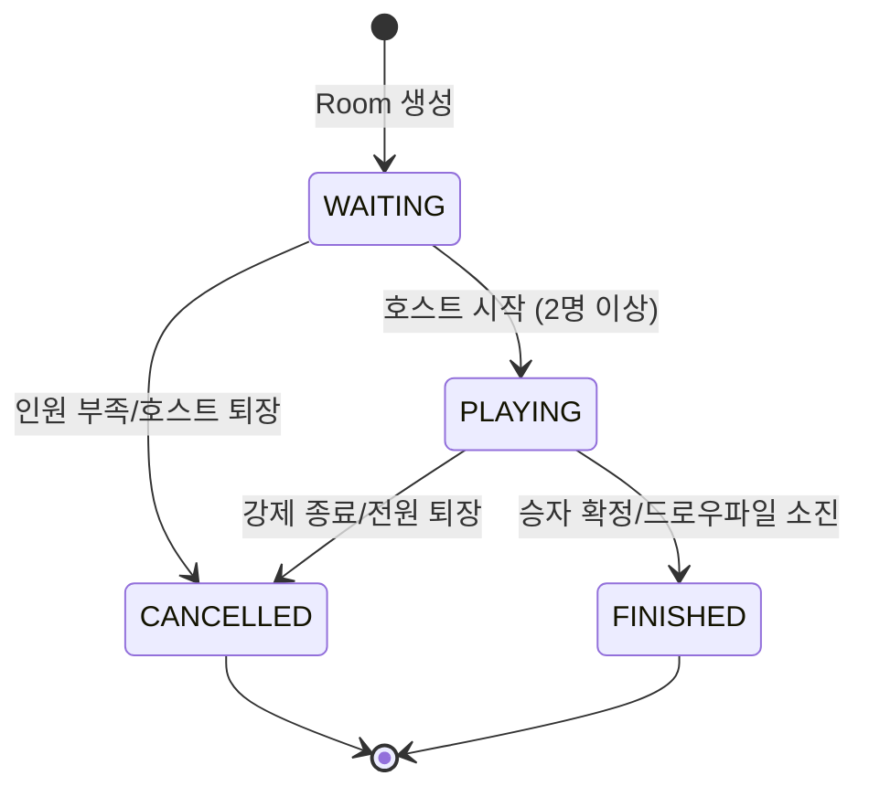
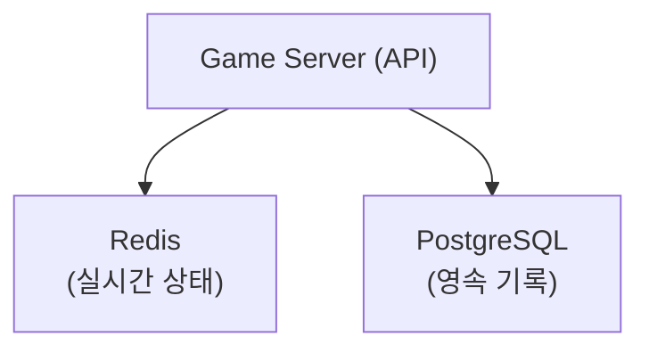
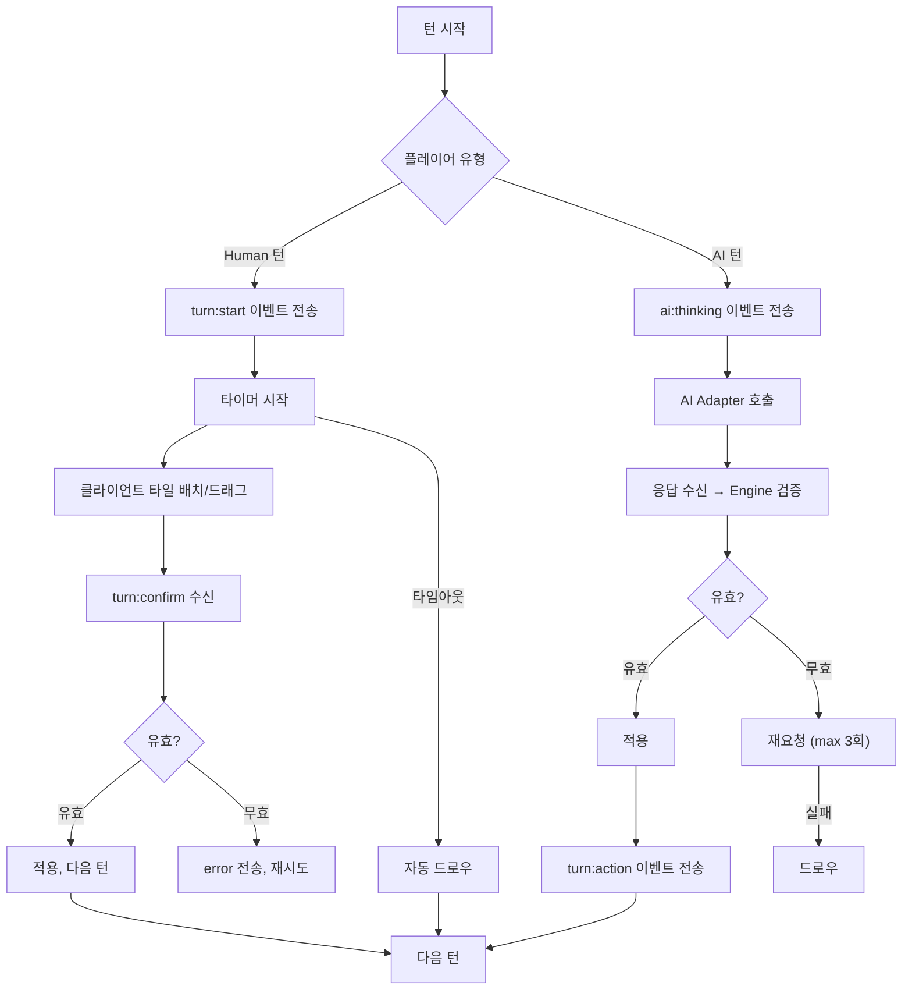
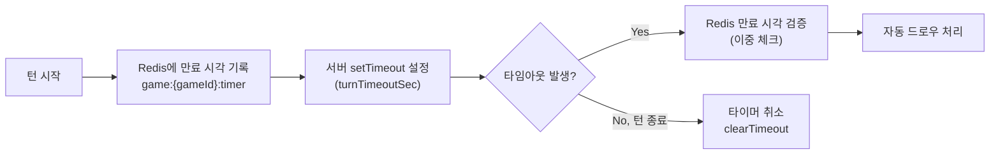
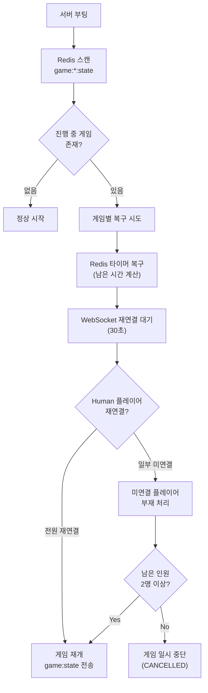
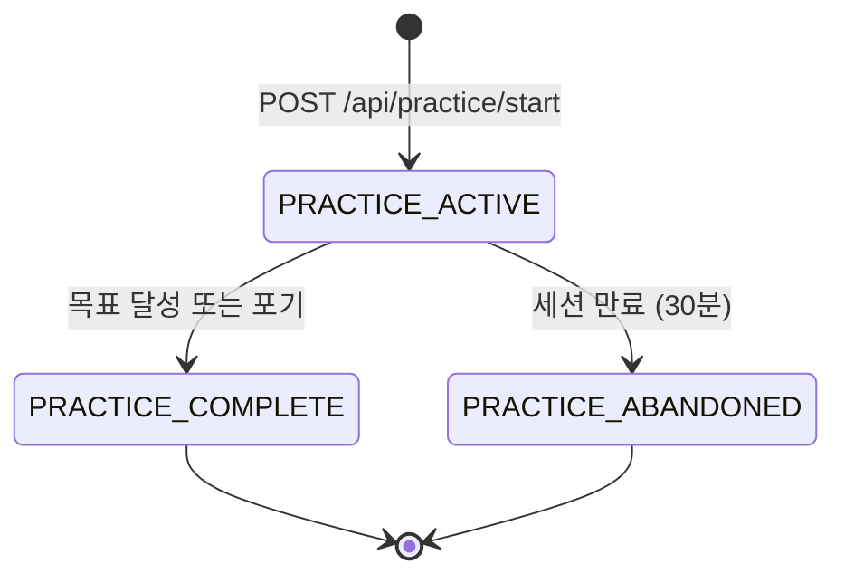
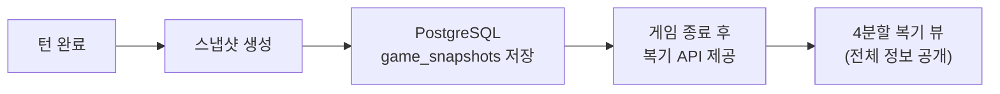

# 게임 세션 관리 설계 (Game Session Design)

## 1. 세션 생명주기



| 상태 | 설명 | 전이 조건 |
|------|------|-----------|
| WAITING | Room 생성, 플레이어 입장 대기 | Room 생성 API 호출 시 즉시 WAITING |
| PLAYING | 게임 진행 중 | 호스트가 시작, 2명 이상 |
| FINISHED | 정상 종료 | 한 명이 타일 0개 / 드로우 파일 소진 후 교착 |
| CANCELLED | 비정상 종료 | 강제 종료 / 인원 부족 / 전원 퇴장 |

> **참고**: CREATED 상태는 사용하지 않는다. Room 생성 시 즉시 WAITING 상태로 진입하며, 호스트가 자동으로 seat 0에 배정된다.

## 2. 세션 구조

```
GameSession
├── sessionId (UUID)
├── roomCode (사용자 표시용, e.g. "ABCD")
├── status
├── hostUserId
├── settings
│   ├── playerCount (2~4)
│   ├── turnTimeoutSec (30~120)
│   └── initialMeldThreshold (30)
├── players[] (순서 보장)
│   ├── seat 0: { userId, type: HUMAN, status: CONNECTED }
│   ├── seat 1: { type: AI_OPENAI, status: READY }
│   ├── seat 2: { type: AI_CLAUDE, status: READY }
│   └── seat 3: { userId, type: HUMAN, status: CONNECTED }
├── gameState
│   ├── currentTurn (turnNumber)
│   ├── currentPlayerSeat (0~3)
│   ├── tableGroups[] (테이블 위 타일 세트들)
│   ├── drawPile[] (남은 타일)
│   └── turnStartedAt (타이머용)
└── metadata
    ├── createdAt
    ├── startedAt
    └── finishedAt
```

## 3. 저장소별 역할 분담



| 데이터 | Redis | PostgreSQL |
|--------|-------|------------|
| 현재 게임 상태 | O (primary) | X |
| 플레이어 타일 (비공개) | O | X |
| 드로우 파일 | O | X |
| 턴 타이머 | O | X |
| WebSocket 세션 매핑 | O | X |
| 게임 결과/전적 | X | O (게임 종료 시) |
| AI 호출 로그 | X | O |
| 게임 이벤트 로그 | X | O |
| 사용자 정보 | X | O |

## 4. 세션 생성 및 참가 플로우

### 4.1 Room 생성
```
1. 호스트가 POST /api/rooms 호출
2. roomCode 생성 (4자리 영문 대문자)
3. Redis에 세션 상태 저장
4. 호스트 자동 seat 0 배정
5. AI 플레이어 설정 시 해당 seat에 AI 배정
6. 상태: WAITING
```

### 4.2 플레이어 참가
```
1. POST /api/rooms/:id/join
2. 빈 seat에 배정 (순서대로)
3. WebSocket 연결
4. 기존 참가자에게 player:joined 이벤트
5. 전원 입장 완료 시 호스트에게 시작 가능 알림
```

### 4.3 게임 시작
```
1. 호스트가 POST /api/rooms/:id/start
2. 조건 확인: 2명 이상, 호스트만 시작 가능
3. 타일 풀 생성 및 셔플
4. 각 플레이어에게 14개 타일 분배
5. 상태: PLAYING
6. 전체 플레이어에게 game:started 이벤트
7. 첫 번째 플레이어 턴 시작
```

## 5. 턴 관리

### 5.1 턴 플로우


### 5.2 턴 타이머

턴 타임아웃은 30~120초 범위에서 게임 설정에 따라 결정된다.

**구현 방식**: setTimeout/setInterval 기반 + Redis에 만료 시간 기록



```
Redis Key: game:{gameId}:timer
  - 턴 시작 시 SET: 만료 Unix timestamp (ms)
  - 서버 메모리에 setTimeout 등록 (turnTimeoutSec * 1000 ms)
  - 타임아웃 발생 시 Redis 만료 시각과 대조하여 이중 검증
  - 턴 정상 종료 시 clearTimeout으로 타이머 취소
  - 서버 재시작 시: Redis의 만료 시각을 읽어 남은 시간으로 setTimeout 재설정
```

> **주의**: 1초 폴링 방식은 사용하지 않는다. setTimeout 기반이 CPU 효율적이며, Redis 만료 시각을 이중 체크하여 정확성을 보장한다.

### 5.3 턴 순서
```
seat 0 → seat 1 → seat 2 → seat 3 → seat 0 → ...
(빈 seat / 퇴장 플레이어는 스킵)
```

## 6. 연결 끊김 / 재연결

### 6.1 Human 플레이어 연결 끊김
```
1. WebSocket 끊김 감지 (heartbeat 실패)
2. 30초 대기 (재연결 유예)
3. 30초 내 재연결
   -> 게임 상태 재동기화 (game:state 전송)
   -> 자신의 턴이면 남은 시간부터 계속
4. 30초 초과
   -> 해당 플레이어 턴은 자동 드로우
   -> 3턴 연속 부재 시 게임에서 제외
5. 제외 후 남은 인원이 2명 미만
   -> 게임 자동 종료 (CANCELLED)
   -> 남은 1명에게 game:ended 이벤트 전송
```

> **3턴 연속 부재 + 2명 미만 처리**: 연결 끊김으로 제외된 플레이어를 차감한 후 참가 인원이 2명 미만이면, 게임을 정상 진행할 수 없으므로 자동으로 CANCELLED 처리한다. 남은 1명이 있으면 해당 플레이어를 승자로 처리할 수도 있으나, CANCELLED로 처리하고 ELO 변동은 적용하지 않는다.

### 6.2 AI 플레이어 장애
```
1. AI Adapter 호출 실패
2. 재시도 (max 3회)
3. 전부 실패 → 강제 드로우
4. 연속 5회 강제 드로우 → 해당 AI 비활성화, 관리자 알림
```

## 7. 게임 종료

### 7.1 정상 종료 조건
- 한 플레이어의 타일이 0개 → 해당 플레이어 승리
- 드로우 파일 소진 + 아무도 배치 못함 → 타일 적은 사람 승리

### 7.2 종료 처리
```
1. 승자 판정
2. 점수 계산 (남은 타일 합산, 조커는 30점)
3. ELO 레이팅 업데이트 (아래 7.3 참조)
4. PostgreSQL에 게임 결과 저장 (games, game_players, elo_history)
5. AI 호출 통계 집계 저장
6. game:ended 이벤트 전송
7. Redis 게임 상태 TTL을 600초(10분)로 단축
8. (선택) 카카오톡 결과 알림
```

### 7.3 ELO 레이팅 업데이트

**기본 공식**: 표준 ELO 계산 (K-factor 기반)

```
새 레이팅 = 현재 레이팅 + K * (실제 결과 - 기대 결과)
기대 결과 = 1 / (1 + 10^((상대 평균 레이팅 - 내 레이팅) / 400))
```

| 항목 | 값 | 설명 |
|------|------|------|
| K-factor (기본) | 32 | 일반 사용자 |
| K-factor (신규) | 40 | 총 게임 수 < 30 (빠른 수렴) |
| K-factor (고랭크) | 24 | ELO >= 1800 (안정화) |
| 초기 레이팅 | 1000 | 신규 사용자 |
| AI 포함 게임 | 적용 | AI와의 대전도 ELO에 반영 |
| CANCELLED 게임 | 미적용 | 비정상 종료 시 ELO 변동 없음 |
| 연습 모드 | 미적용 | 연습 모드는 ELO에 영향 없음 |

**다인전(3~4인) ELO 처리**: 승자 vs 나머지 각각에 대해 1:1 ELO 변동을 계산하고 평균한다.

> 모든 ELO 변동은 `elo_history` 테이블에 기록되어 변동 추이를 추적할 수 있다.

### 7.4 비정상 종료
- 호스트 퇴장 (WAITING 상태) -> CANCELLED
- 관리자 강제 종료 -> CANCELLED
- 플레이어 전원 퇴장 -> CANCELLED
- 서버 재시작 -> 아래 복구 절차 수행

### 7.5 서버 재시작 시 복구 절차



1. 서버 부팅 시 Redis에서 `game:*:state` 패턴으로 진행 중(status=PLAYING) 게임을 스캔한다.
2. 각 게임의 턴 타이머를 Redis 만료 시각 기준으로 재설정한다.
3. Human 플레이어의 WebSocket 재연결을 30초간 대기한다.
4. 30초 내 재연결한 플레이어에게 `game:state` 이벤트로 전체 상태를 동기화한다.
5. 미연결 플레이어는 부재 처리하고, 남은 인원이 2명 미만이면 게임을 CANCELLED 처리한다.

## 8. 동시성 제어

### 8.1 턴 동시성
- 한 번에 한 플레이어만 행동 가능 (턴 기반)
- 서버에서 currentPlayerSeat 검증
- 다른 플레이어의 행동 요청은 거부

### 8.2 테이블 재배치 충돌
- 턴 내에서만 재배치 가능
- 턴 시작 시 테이블 상태 스냅샷 저장
- confirm 실패 시 스냅샷으로 롤백

### 8.3 Redis 원자성
- 게임 상태 업데이트는 Redis Transaction (MULTI/EXEC) 또는 Lua Script 사용
- Race condition 방지

## 9. 1인 연습 모드 세션 관리

### 9.1 연습 모드 생명주기



### 9.2 연습 모드 특성

| 항목 | 일반 게임 | 연습 모드 |
|------|-----------|-----------|
| WebSocket | 필요 (실시간 대전) | 불필요 (REST API만) |
| 턴 타임아웃 | 30~120초 (강제) | 무제한 (사용자 자유) |
| ELO 반영 | O | X |
| AI 플레이어 | 0~3명 | Stage 6에서만 1명 |
| 게임 상태 저장 | Redis (실시간) | Redis (간소화) |
| 세션 TTL | 7200초 (2시간) | 1800초 (30분, 비활동 기준) |

### 9.3 연습 모드 데이터 흐름
```
1. POST /api/practice/start → 게임 초기화 (games.game_mode = 'PRACTICE')
2. Redis에 간소화된 게임 상태 저장
3. POST /api/practice/:id/action → 액션 검증 + 상태 업데이트
4. 목표 달성 시 → practice_sessions.status = 'COMPLETED', 결과 저장
5. Redis 상태 정리
```

> **Stage 6 (종합 실전)**: AI 1명과 대전하지만 WebSocket은 사용하지 않는다. 사용자 액션 후 서버가 AI 턴을 즉시 처리하고 응답에 포함하여 반환하는 동기 방식이다.

## 10. 게임 복기 (Replay) 설계

### 10.1 턴 스냅샷 저장

게임 진행 중 매 턴 완료 시 스냅샷을 PostgreSQL에 저장하여 게임 종료 후 복기를 지원한다.



**스냅샷 구조**:
```
GameSnapshot
├── snapshotId (UUID)
├── gameId (FK → games)
├── turnNumber
├── actingPlayerSeat (0~3)
├── action (PLACE_TILES / DRAW / REARRANGE / TIMEOUT)
├── actionDetail (JSON: 수행한 액션 상세)
│   ├── placedTiles[] (배치한 타일 코드)
│   ├── drawnTile (드로우한 타일, 복기 시만 공개)
│   └── rearrangement (재배치 전후 상태)
├── playerHands[] (각 플레이어의 패 - 복기 시 공개)
│   ├── seat0: ["R1a", "B3b", ...]
│   ├── seat1: ["K7a", "Y11b", ...]
│   ├── seat2: ["R13a", "JK1", ...]
│   └── seat3: ["B5a", "Y9b", ...]
├── tableState[] (테이블 위 세트들)
├── drawPileCount (남은 드로우 파일 수)
├── aiDecisionLog (AI 턴인 경우, 판단 근거 요약)
└── createdAt
```

### 10.2 복기 뷰 모드

| 항목 | 실시간 플레이 (1인칭 뷰) | 복기 (4분할 뷰) |
|------|-------------------------|----------------|
| 내 패 | 공개 | 공개 |
| 상대 패 | 비공개 (타일 수만 표시) | **전체 공개** |
| 드로우 타일 | 본인만 확인 | **전체 공개** |
| AI 판단 근거 | 비공개 | **오버레이로 공개** |
| 테이블 상태 | 공개 | 공개 |

### 10.3 복기 API

```
GET /api/games/:gameId/replay
  → 게임 메타 정보 + 전체 스냅샷 목록

GET /api/games/:gameId/replay/turns/:turnNumber
  → 특정 턴의 스냅샷 상세

GET /api/games/:gameId/replay/summary
  → 복기 요약 (턴 수, AI별 전략 통계, 핵심 전환점)
```

### 10.4 저장소 영향

| 데이터 | 저장소 | 설명 |
|--------|--------|------|
| game_snapshots | PostgreSQL | 턴당 1행, 게임당 평균 30~80행 |
| AI 판단 로그 | PostgreSQL | ai_move_logs에 이미 저장, 복기 시 JOIN |
| 스냅샷 보관 기간 | 90일 | 이후 자동 아카이브/삭제 |

> **참고**: 스냅샷 저장은 턴 완료 시 비동기로 수행하여 게임 진행 성능에 영향을 주지 않는다.

## 11. 세션 정리 정책

| 조건 | 처리 |
|------|------|
| WAITING 상태 30분 경과 | 자동 CANCELLED |
| PLAYING 상태 2시간 경과 | 경고 알림, 3시간 시 강제 종료 |
| FINISHED 후 Redis 데이터 | 10분 후 삭제 |
| 고아 세션 (서버 재시작) | 부팅 시 Redis 스캔, 복구 또는 정리 |
