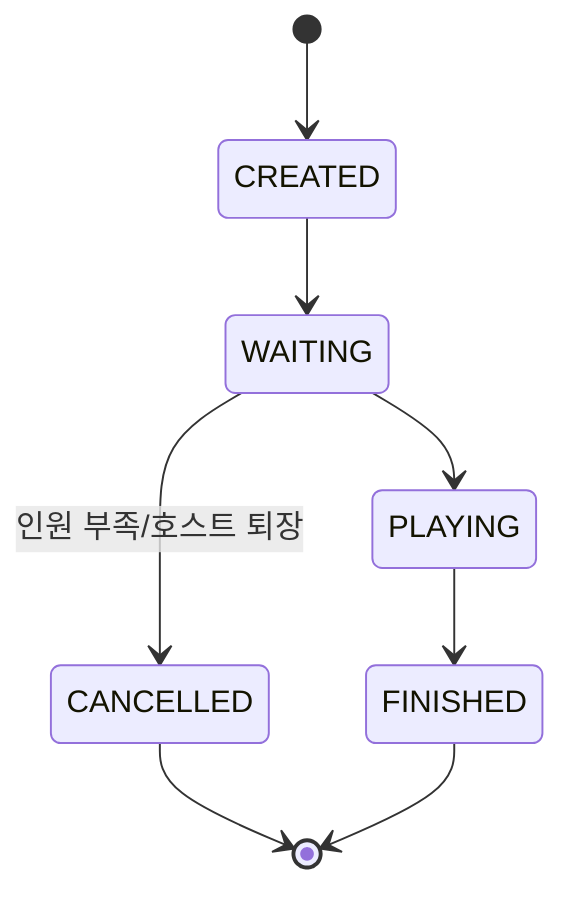
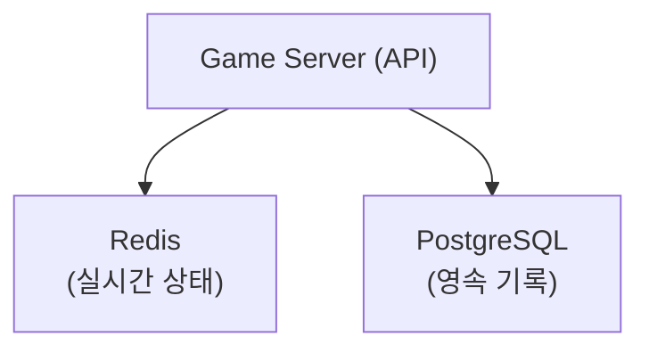

# 게임 세션 관리 설계 (Game Session Design)

## 1. 세션 생명주기



| 상태 | 설명 | 전이 조건 |
|------|------|-----------|
| CREATED | Room 생성됨 | Room 생성 API 호출 |
| WAITING | 플레이어 입장 대기 | 최소 1명 입장 |
| PLAYING | 게임 진행 중 | 호스트가 시작, 2명 이상 |
| FINISHED | 정상 종료 | 한 명이 타일 0개 / 드로우 파일 소진 |
| CANCELLED | 비정상 종료 | 강제 종료 / 인원 부족 |

## 2. 세션 구조

```
GameSession
├── sessionId (UUID)
├── roomCode (사용자 표시용, e.g. "ABCD")
├── status
├── hostUserId
├── settings
│   ├── playerCount (2~4)
│   ├── turnTimeoutSec (30~120)
│   └── initialMeldThreshold (30)
├── players[] (순서 보장)
│   ├── seat 0: { userId, type: HUMAN, status: CONNECTED }
│   ├── seat 1: { type: AI_OPENAI, status: READY }
│   ├── seat 2: { type: AI_CLAUDE, status: READY }
│   └── seat 3: { userId, type: HUMAN, status: CONNECTED }
├── gameState
│   ├── currentTurn (turnNumber)
│   ├── currentPlayerSeat (0~3)
│   ├── tableGroups[] (테이블 위 타일 세트들)
│   ├── drawPile[] (남은 타일)
│   └── turnStartedAt (타이머용)
└── metadata
    ├── createdAt
    ├── startedAt
    └── finishedAt
```

## 3. 저장소별 역할 분담



| 데이터 | Redis | PostgreSQL |
|--------|-------|------------|
| 현재 게임 상태 | O (primary) | X |
| 플레이어 타일 (비공개) | O | X |
| 드로우 파일 | O | X |
| 턴 타이머 | O | X |
| WebSocket 세션 매핑 | O | X |
| 게임 결과/전적 | X | O (게임 종료 시) |
| AI 호출 로그 | X | O |
| 게임 이벤트 로그 | X | O |
| 사용자 정보 | X | O |

## 4. 세션 생성 및 참가 플로우

### 4.1 Room 생성
```
1. 호스트가 POST /api/rooms 호출
2. roomCode 생성 (4자리 영문 대문자)
3. Redis에 세션 상태 저장
4. 호스트 자동 seat 0 배정
5. AI 플레이어 설정 시 해당 seat에 AI 배정
6. 상태: WAITING
```

### 4.2 플레이어 참가
```
1. POST /api/rooms/:id/join
2. 빈 seat에 배정 (순서대로)
3. WebSocket 연결
4. 기존 참가자에게 player:joined 이벤트
5. 전원 입장 완료 시 호스트에게 시작 가능 알림
```

### 4.3 게임 시작
```
1. 호스트가 POST /api/rooms/:id/start
2. 조건 확인: 2명 이상, 호스트만 시작 가능
3. 타일 풀 생성 및 셔플
4. 각 플레이어에게 14개 타일 분배
5. 상태: PLAYING
6. 전체 플레이어에게 game:started 이벤트
7. 첫 번째 플레이어 턴 시작
```

## 5. 턴 관리

### 5.1 턴 플로우

```mermaid
flowchart TB
    Start["턴 시작"] --> Type{플레이어 유형}

    Type -->|Human 턴| H1["turn:start 이벤트 전송"]
    H1 --> H2["타이머 시작"]
    H2 --> H3["클라이언트 타일 배치/드래그"]
    H3 --> H4["turn:confirm 수신"]
    H4 --> HV{유효?}
    HV -->|유효| Apply["적용, 다음 턴"]
    HV -->|무효| HE["error 전송, 재시도"]
    H2 -->|타임아웃| HD["자동 드로우"]

    Type -->|AI 턴| A1["ai:thinking 이벤트 전송"]
    A1 --> A2["AI Adapter 호출"]
    A2 --> A3["응답 수신 → Engine 검증"]
    A3 --> AV{유효?}
    AV -->|유효| AApply["적용"]
    AV -->|무효| AR["재요청 (max 3회)"]
    AR -->|실패| AD["드로우"]
    AApply --> A4["turn:action 이벤트 전송"]
    A4 --> Next["다음 턴"]
    Apply --> Next
    HD --> Next
```


### 5.2 턴 타이머
```
Redis Key: game:{gameId}:timer
  - 턴 시작 시 타이머 SET (TTL = turnTimeoutSec)
  - 서버에서 주기적 체크 (1초) 또는 Redis Keyspace Notification
  - 만료 시 자동 드로우 처리
```

### 5.3 턴 순서
```
seat 0 → seat 1 → seat 2 → seat 3 → seat 0 → ...
(빈 seat / 퇴장 플레이어는 스킵)
```

## 6. 연결 끊김 / 재연결

### 6.1 Human 플레이어 연결 끊김
```
1. WebSocket 끊김 감지 (heartbeat 실패)
2. 30초 대기 (재연결 유예)
3. 30초 내 재연결
   → 게임 상태 재동기화 (game:state 전송)
   → 자신의 턴이면 남은 시간부터 계속
4. 30초 초과
   → 해당 플레이어 턴은 자동 드로우
   → 3턴 연속 부재 시 게임에서 제외
```

### 6.2 AI 플레이어 장애
```
1. AI Adapter 호출 실패
2. 재시도 (max 3회)
3. 전부 실패 → 강제 드로우
4. 연속 5회 강제 드로우 → 해당 AI 비활성화, 관리자 알림
```

## 7. 게임 종료

### 7.1 정상 종료 조건
- 한 플레이어의 타일이 0개 → 해당 플레이어 승리
- 드로우 파일 소진 + 아무도 배치 못함 → 타일 적은 사람 승리

### 7.2 종료 처리
```
1. 승자 판정
2. 점수 계산 (남은 타일 합산)
3. ELO 레이팅 업데이트
4. PostgreSQL에 게임 결과 저장
5. AI 호출 통계 집계 저장
6. game:ended 이벤트 전송
7. Redis 게임 상태 정리 (TTL 설정 후 삭제)
8. (선택) 카카오톡 결과 알림
```

### 7.3 비정상 종료
- 호스트 퇴장 (WAITING 상태) → CANCELLED
- 관리자 강제 종료 → CANCELLED
- 플레이어 전원 퇴장 → CANCELLED
- 서버 재시작 → Redis 상태로 복구 시도

## 8. 동시성 제어

### 8.1 턴 동시성
- 한 번에 한 플레이어만 행동 가능 (턴 기반)
- 서버에서 currentPlayerSeat 검증
- 다른 플레이어의 행동 요청은 거부

### 8.2 테이블 재배치 충돌
- 턴 내에서만 재배치 가능
- 턴 시작 시 테이블 상태 스냅샷 저장
- confirm 실패 시 스냅샷으로 롤백

### 8.3 Redis 원자성
- 게임 상태 업데이트는 Redis Transaction (MULTI/EXEC) 또는 Lua Script 사용
- Race condition 방지

## 9. 세션 정리 정책

| 조건 | 처리 |
|------|------|
| WAITING 상태 30분 경과 | 자동 CANCELLED |
| PLAYING 상태 2시간 경과 | 경고 알림, 3시간 시 강제 종료 |
| FINISHED 후 Redis 데이터 | 10분 후 삭제 |
| 고아 세션 (서버 재시작) | 부팅 시 Redis 스캔, 복구 또는 정리 |
