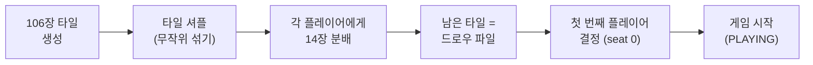
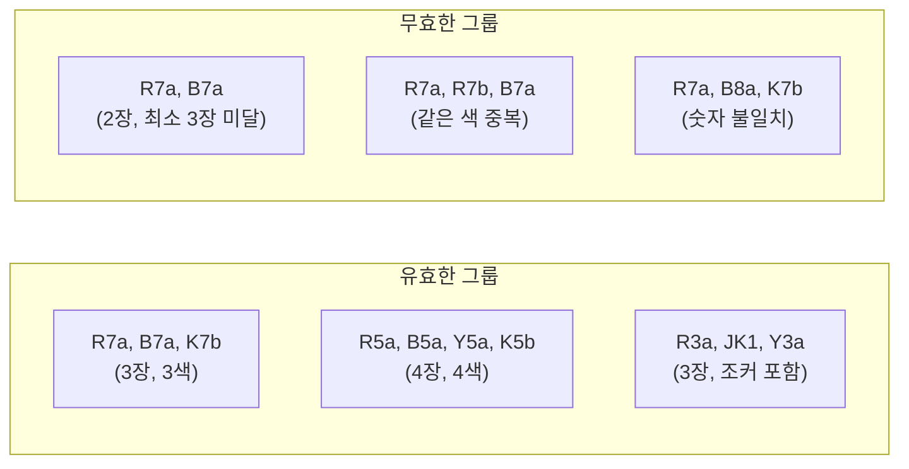
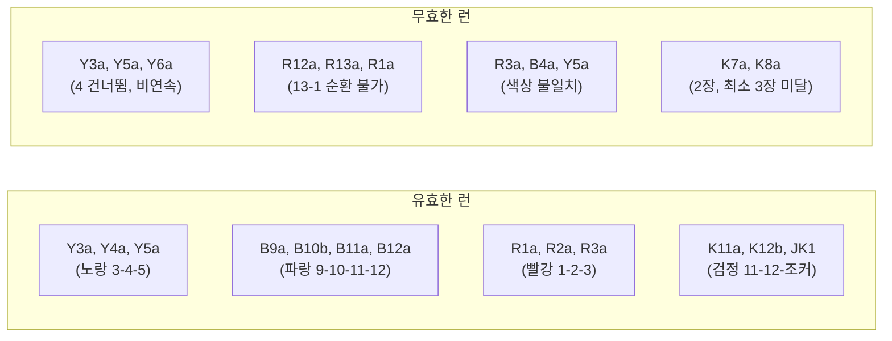
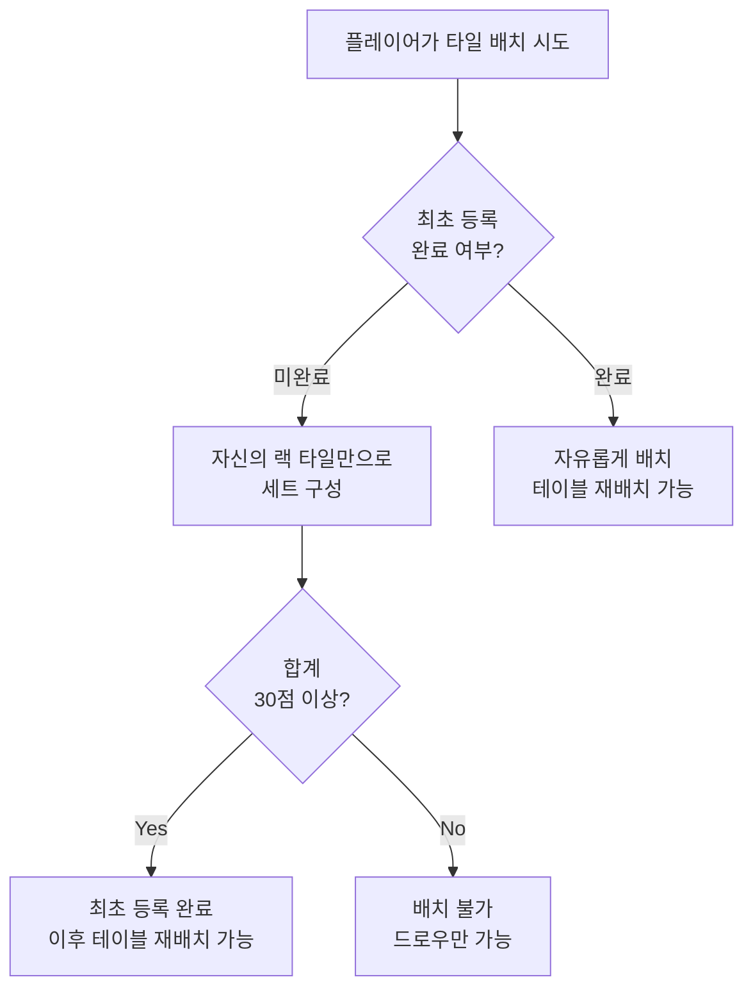
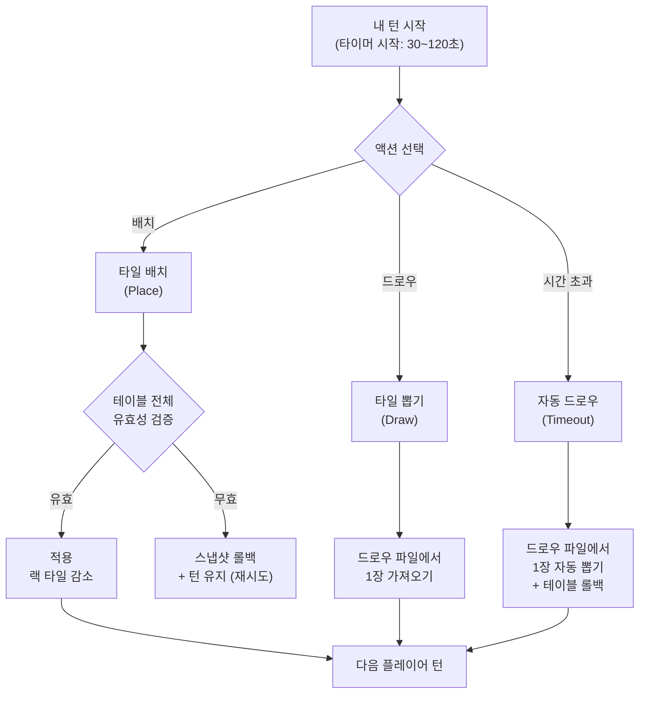
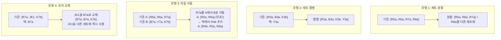
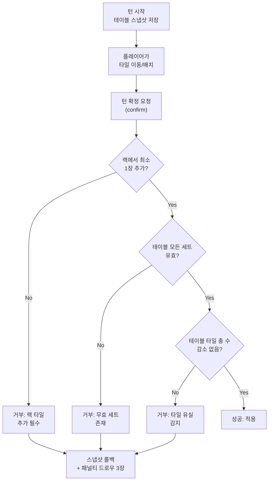
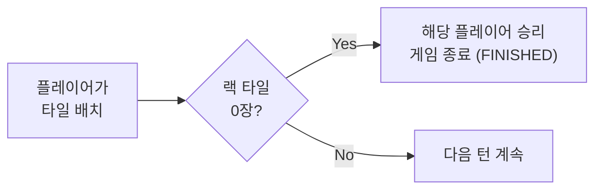
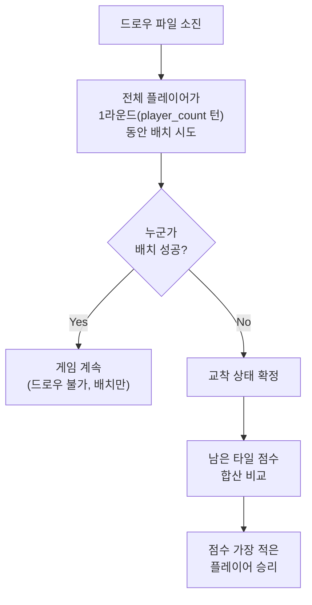

# 게임 규칙 설계 (Game Rules Design)

이 문서는 Game Engine이 검증해야 할 루미큐브(Rummikub) 게임 규칙의 정의서이다.
모든 유효성 판정, 승리 조건, 점수 계산의 근거 문서이며, 구현 시 이 문서를 기준으로 한다.

## 1. 타일 구성

### 1.1 전체 타일 (총 106장)

| 구분 | 색상 | 숫자 | 세트 | 수량 |
|------|------|------|------|------|
| 숫자 타일 | R(빨강), B(파랑), Y(노랑), K(검정) | 1~13 | a, b | 4 x 13 x 2 = 104장 |
| 조커 | - | - | - | JK1, JK2 = 2장 |
| **합계** | | | | **106장** |

### 1.2 타일 인코딩 규칙

```
형식: {Color}{Number}{Set}
```

| 요소 | 값 | 설명 |
|------|------|------|
| Color | R, B, Y, K | Red, Blue, Yellow, Black |
| Number | 1~13 | 타일 숫자 |
| Set | a, b | 동일 타일 구분 (각 타일은 2장씩 존재) |
| 조커 | JK1, JK2 | 조커 2장 (세트 구분 없음) |

**예시**:
- `R7a` = 빨강 7 (세트 a)
- `B13b` = 파랑 13 (세트 b)
- `Y1a` = 노랑 1 (세트 a)
- `K10b` = 검정 10 (세트 b)
- `JK1` = 조커 1

### 1.3 타일 점수

| 타일 | 점수 |
|------|------|
| 숫자 타일 | 해당 숫자 값 (1점~13점) |
| 조커 | 30점 |

> 점수는 최초 등록 조건 판정, 교착 상태 시 승자 결정, 패자 점수 계산에 사용된다.

## 2. 게임 준비



| 단계 | 설명 | 검증 사항 |
|------|------|-----------|
| 타일 생성 | 104장 숫자 타일 + 2장 조커 = 106장 | 정확히 106장인지 확인 |
| 셔플 | Fisher-Yates 등 균등 분포 알고리즘 | 편향 없는 셔플 |
| 분배 | 각 플레이어에게 14장 | 2인: 78장 남음, 3인: 64장, 4인: 50장 |
| 턴 순서 | seat 0 → 1 → 2 → 3 → 0 → ... | 빈 seat은 스킵 |

## 3. 유효한 타일 세트

테이블에 놓인 모든 타일은 반드시 아래 두 가지 세트 중 하나에 속해야 한다.

### 3.1 그룹 (Group)

**정의**: 같은 숫자, 서로 다른 색상 3~4장



**검증 규칙**:
1. 타일 수: 3장 이상 4장 이하
2. 모든 타일의 숫자가 동일 (조커 제외)
3. 모든 타일의 색상이 서로 다름 (같은 색 중복 불가)
4. 최대 4장 (R, B, Y, K 각 1장씩)

### 3.2 런 (Run)

**정의**: 같은 색상, 연속 숫자 3장 이상



**검증 규칙**:
1. 타일 수: 3장 이상 (상한 없음, 최대 13장)
2. 모든 타일의 색상이 동일 (조커 제외)
3. 숫자가 연속 (조커로 빈 자리 대체 가능)
4. 1과 13은 순환하지 않음 (12-13-1 불가)
5. 숫자 범위: 1~13

### 3.3 조커 규칙

| 규칙 | 설명 |
|------|------|
| 대체 | 조커는 그룹/런에서 어떤 타일이든 대체 가능 |
| 위치 | 세트 내 어느 위치든 사용 가능 (처음, 중간, 끝) |
| 복수 | 하나의 세트에 조커 여러 장 가능 (단, 세트 유효성 유지) |
| 교체 | 테이블 위 조커를 해당 타일로 교체하고 조커를 회수하여 다른 세트에 사용 가능 |
| 점수 | 최초 등록 시 조커는 대체하는 타일의 숫자 값으로 계산 |

**조커 교체 예시**:
```
테이블: [R7a, JK1, K7b]  (JK1이 B7 또는 Y7 대체 중)
내 랙에 B7a 보유

→ JK1을 B7a로 교체
→ 테이블: [R7a, B7a, K7b]
→ JK1이 랙으로 돌아옴
→ JK1을 즉시 다른 세트에 사용해야 함 (보류 불가)
```

> **Engine 검증**: 조커 교체 시, 교체 후 원래 세트가 여전히 유효한지 확인하고, 회수한 조커가 같은 턴 내에 사용되었는지 확인해야 한다.

## 4. 최초 등록 (Initial Meld)

게임에서 처음으로 타일을 테이블에 내려놓을 때의 특별 규칙이다.

### 4.1 조건



| 조건 | 설명 |
|------|------|
| 타일 출처 | 반드시 자신의 랙 타일만 사용 |
| 최소 점수 | 내려놓는 세트의 숫자 합계 >= 30점 |
| 복수 세트 | 여러 세트를 동시에 내려놓아 합산 가능 |
| 테이블 활용 | 불가 (기존 테이블 타일을 재배치할 수 없음) |
| 조커 점수 | 대체하는 타일의 숫자 값으로 계산 |

**예시**:

| 배치 | 점수 | 판정 |
|------|------|------|
| `[R10a, B10a, K10b]` | 10+10+10 = 30 | 통과 |
| `[Y1a, Y2a, Y3a]` | 1+2+3 = 6 | 부족 |
| `[R10a, B10a, K10b]` + `[Y1a, Y2a, Y3a]` | 30 + 6 = 36 | 통과 |
| `[R8a, JK1, R10a]` | 8+9+10 = 27 | 부족 (JK1은 R9 대체, 9점) |
| `[R11a, JK1, R13a]` | 11+12+13 = 36 | 통과 (JK1은 R12 대체, 12점) |

### 4.2 최초 등록 상태 관리

```
Redis: game:{gameId}:state
  - players[seatOrder].hasInitialMeld: true/false
```

- `hasInitialMeld = false`: 해당 플레이어는 테이블 재배치 불가, 최초 등록 조건 검증 적용
- `hasInitialMeld = true`: 자유롭게 배치 및 재배치 가능

## 5. 턴 진행

### 5.1 턴 액션

플레이어는 자기 턴에 다음 중 하나를 수행한다.



### 5.2 타일 배치 (Place)

| 단계 | 설명 | Engine 검증 |
|------|------|-------------|
| 1 | 턴 시작 시 테이블 상태 스냅샷 저장 | - |
| 2 | 플레이어가 랙에서 타일을 테이블에 배치 | - |
| 3 | 기존 테이블 타일 재배치 (선택, 최초 등록 완료 시) | - |
| 4 | 턴 확정 (confirm) 요청 | 아래 전체 검증 수행 |
| 5 | 검증 통과 → 적용, 실패 → 스냅샷 롤백 | - |

**Engine 검증 체크리스트** (턴 확정 시):
1. 테이블 위 모든 세트가 유효한 그룹 또는 런인가?
2. 각 세트가 3장 이상인가?
3. 랙에서 최소 1장 이상 타일이 테이블에 추가되었는가?
4. 최초 등록 미완료 시: 자신의 랙 타일만 사용했는가? 합계 30점 이상인가?
5. 조커 교체 시: 회수한 조커가 같은 턴 내에 사용되었는가?
6. 테이블에서 사라진 타일이 없는가? (타일을 랙으로 가져오기 불가, 조커 교체 제외)

### 5.3 드로우 (Draw)

| 조건 | 동작 |
|------|------|
| 드로우 파일에 타일이 있음 | 1장을 가져와 랙에 추가, 턴 종료 |
| 드로우 파일이 비어 있음 | 패스 (아무 동작 없이 턴 종료) |

> 드로우 후에는 타일 배치 불가 (드로우와 배치는 동일 턴에 병행 불가).

### 5.4 턴 타임아웃

| 항목 | 값 |
|------|------|
| 범위 | 30~120초 (게임 생성 시 설정) |
| 기본값 | 60초 |
| 타임아웃 시 | 테이블을 턴 시작 스냅샷으로 롤백 + 자동 드로우 1장 |

### 5.5 턴 순서

```
seat 0 → seat 1 → seat 2 → seat 3 → seat 0 → ...
```

- 빈 seat 또는 퇴장/제외된 플레이어는 스킵
- AI와 Human이 동일한 턴 순서 규칙을 따른다

## 6. 테이블 재배치 (Rearrangement)

루미큐브의 핵심 전략 요소. 최초 등록을 완료한 플레이어만 수행 가능.

### 6.1 규칙

| 규칙 | 설명 |
|------|------|
| 전제 조건 | `hasInitialMeld = true` |
| 분리 | 기존 세트에서 타일을 떼어내 다른 세트로 이동 가능 |
| 추가 필수 | 반드시 자신의 랙에서 최소 1장 이상 추가 |
| 최종 유효성 | 턴 종료 시 테이블의 모든 세트가 유효해야 함 |
| 실패 시 | 스냅샷으로 복원 + 패널티 드로우 3장 |
| 타일 보존 | 테이블 타일 총 수가 줄어들면 안 됨 (타일을 랙으로 가져오기 불가, 조커 교체 제외) |

### 6.2 재배치 유형



### 6.3 재배치 예시 (복합)

**상황**:
- 테이블: `[R5a, R6a, R7a]`, `[B7a, Y7a, K7b]`
- 랙: `B7b`, `Y7b`, `R4b`

**재배치 과정**:
1. 런 `[R5a, R6a, R7a]`에서 `R7a`를 분리
2. `R7a` + 랙의 `B7b` + 랙의 `Y7b`로 새 그룹 `[R7a, B7b, Y7b]` 생성
3. 기존 런이 `[R5a, R6a]`로 무효 → 랙에서 `R4b` 추가 → `[R4b, R5a, R6a]`

**결과**:
- 테이블: `[R4b, R5a, R6a]`, `[B7a, Y7a, K7b]`, `[R7a, B7b, Y7b]`
- 모든 세트 유효, 랙에서 3장 사용 → 성공

### 6.4 재배치 검증 플로우



## 7. 승리 조건

### 7.1 정상 승리



- 자신의 랙 타일을 **모두** 유효한 세트로 내려놓은 플레이어가 승리
- 마지막 타일도 반드시 유효한 세트에 포함되어야 함

### 7.2 교착 상태 (Stalemate)



**교착 상태 판정 조건**:
1. 드로우 파일이 소진됨
2. 전체 플레이어가 1라운드(= player_count 턴) 동안 모두 배치 불가 (패스만)
3. 남은 타일 숫자 합산이 가장 적은 플레이어가 승리

**동점 처리**:
1. 숫자 합산 동점 → 타일 수가 적은 쪽 승리
2. 타일 수도 동점 → 무승부 (양쪽 모두 승리 처리하지 않음)

### 7.3 점수 계산

게임 종료 시 각 플레이어의 점수를 계산한다.

| 항목 | 계산 |
|------|------|
| 승자 점수 | 0 (타일 없음) 또는 교착 시 남은 타일 합산 |
| 패자 점수 | 남은 타일 숫자 합산 (조커는 30점) |
| 교착 시 승자 | 합산 점수가 가장 낮은 플레이어 |

**점수 계산 예시**:
```
Player A (승리): 타일 0장 → 0점
Player B: [R3a, K8b, JK1] → 3 + 8 + 30 = 41점
Player C: [Y1a, B2a, R4b] → 1 + 2 + 4 = 7점
```

## 8. 특수 상황 처리

### 8.1 AI 플레이어 규칙

| 상황 | 처리 |
|------|------|
| AI가 무효 수를 제안 | Game Engine이 거부, 재요청 (최대 3회) |
| 3회 모두 무효 | 강제 드로우 처리 |
| 5턴 연속 강제 드로우 | 해당 AI 비활성화, 관리자 알림 |

> AI는 행동을 "제안"만 하고, Game Engine이 Human과 동일한 규칙으로 유효성을 검증한다.

### 8.2 연결 끊김

| 상황 | 처리 |
|------|------|
| 끊김 후 30초 이내 재연결 | 게임 상태 재동기화, 남은 시간부터 계속 |
| 끊김 후 30초 초과 | 해당 턴 자동 드로우 |
| 3턴 연속 부재 | 게임에서 제외 |
| 제외 후 남은 인원 < 2명 | 게임 자동 종료 (CANCELLED) |

### 8.3 게임 취소

| 상황 | 결과 |
|------|------|
| 호스트 퇴장 (WAITING) | CANCELLED |
| 관리자 강제 종료 | CANCELLED |
| 전원 퇴장 | CANCELLED |
| 인원 2명 미만 | CANCELLED |

> CANCELLED된 게임은 ELO 레이팅에 반영되지 않는다.

## 9. 연습 모드 (Practice Mode)

### 9.1 개요

1인 플레이어가 루미큐브 규칙을 단계적으로 학습하는 모드.

| 항목 | 일반 게임 | 연습 모드 |
|------|-----------|-----------|
| 인원 | 2~4명 | 1명 (Stage 6에서 AI 1명) |
| 턴 타임아웃 | 30~120초 | 무제한 |
| ELO 반영 | O | X |
| 게임 기록 | games + game_players | games + practice_sessions |

### 9.2 스테이지 상세

| Stage | 목표 | 초기 조건 | 클리어 조건 |
|-------|------|-----------|------------|
| 1 | 최초 등록 | 30점 이상 세트를 만들 수 있는 타일 14장 분배 | 30점 이상 세트를 테이블에 배치 |
| 2 | 런 만들기 | 런을 만들 수 있는 타일 포함 분배 | 유효한 런 1개 이상 배치 |
| 3 | 그룹 만들기 | 그룹을 만들 수 있는 타일 포함 분배 | 유효한 그룹 1개 이상 배치 |
| 4 | 테이블 재배치 | 테이블에 기존 세트 배치 + 재배치용 타일 분배 | 재배치를 활용하여 랙 타일 배치 성공 |
| 5 | 조커 활용 | 조커 포함 분배 + 테이블에 조커 포함 세트 | 조커를 활용/교체하여 배치 성공 |
| 6 | 종합 실전 | 일반 게임과 동일 (14장 분배) | AI 1명과 대전하여 승리 |

### 9.3 연습 모드 검증 규칙

- Stage 1~5: 일반 게임 규칙의 **부분집합**만 검증 (해당 스테이지 목표에 집중)
- Stage 6: 일반 게임과 **동일한 규칙** 적용 (AI 1명과 동기 방식 대전)
- 모든 스테이지에서 Game Engine의 세트 유효성 검증은 동일하게 적용

## 10. 규칙 검증 매트릭스

Game Engine이 검증해야 할 모든 규칙의 요약표.

| ID | 검증 항목 | 검증 시점 | 실패 시 처리 |
|----|-----------|-----------|-------------|
| V-01 | 세트가 유효한 그룹 또는 런인가 | 턴 확정 시 | 배치 거부, 스냅샷 롤백 |
| V-02 | 세트가 3장 이상인가 | 턴 확정 시 | 배치 거부 |
| V-03 | 랙에서 최소 1장 추가했는가 | 턴 확정 시 | 배치 거부 |
| V-04 | 최초 등록 30점 이상인가 | 최초 배치 시 | 배치 거부 |
| V-05 | 최초 등록 시 랙 타일만 사용했는가 | 최초 배치 시 | 배치 거부 |
| V-06 | 테이블 타일이 유실되지 않았는가 | 턴 확정 시 | 배치 거부 |
| V-07 | 조커 교체 후 즉시 사용했는가 | 턴 확정 시 | 배치 거부 |
| V-08 | 자기 턴인가 (currentPlayerSeat 확인) | 액션 수신 시 | 액션 거부 |
| V-09 | 턴 타임아웃 초과인가 | 타이머 만료 시 | 자동 드로우 |
| V-10 | 드로우 파일이 비어있는가 | 드로우 시 | 패스 처리 |
| V-11 | 교착 상태인가 (드로우 파일 소진 + 전원 패스) | 매 턴 종료 시 | 점수 비교 후 게임 종료 |
| V-12 | 승리 조건 달성인가 (랙 타일 0장) | 배치 적용 후 | 게임 종료 (FINISHED) |
| V-13 | 재배치 권한이 있는가 (hasInitialMeld) | 재배치 시도 시 | 재배치 거부 |
| V-14 | 그룹에서 같은 색상이 중복되지 않는가 | 턴 확정 시 | 배치 거부 |
| V-15 | 런에서 숫자가 연속인가 (13-1 순환 불가) | 턴 확정 시 | 배치 거부 |
