# UI 와이어프레임 설계 (UI Wireframe Design)

이 문서는 RummiArena 프론트엔드의 화면 구성, 컴포넌트 설계, 인터랙션 흐름을 정의한다.
`docs/simulation/` 의 HTML 프로토타입 3종(관전뷰, 4분할뷰, 1인칭뷰)을 기준으로 하며,
Next.js + TailwindCSS + Framer Motion + dnd-kit 스택에 맞게 상세화한다.

---

## 1. 디자인 토큰

### 1.1 색상 시스템

타일 4색은 게임의 핵심 시각 언어이므로 UI 전반에 일관되게 적용한다.
색약 접근성을 위해 색상과 함께 형태(아이콘/패턴)를 이중 인코딩한다.

| 역할 | 토큰 이름 | HEX | 용도 |
|------|-----------|-----|------|
| Red 타일 | `--tile-red` | `#E74C3C` | 빨강 타일 배경, 강조 액션 |
| Blue 타일 | `--tile-blue` | `#3498DB` | 파랑 타일 배경 |
| Yellow 타일 | `--tile-yellow` | `#F1C40F` | 노랑 타일 배경, 현재 턴 강조 |
| Black 타일 | `--tile-black` | `#2C3E50` | 검정 타일 배경 |
| 조커 그라데이션 | `--tile-joker` | 무지개 (#c39bff~#f3c623) | 조커 타일 |
| 보드 배경 | `--board-bg` | `#1A3328` | 게임 테이블 펠트 |
| 보드 테두리 | `--board-border` | `#2A5A3A` | 테이블 영역 경계 |
| 앱 배경 | `--app-bg` | `#0D1117` | 전체 배경 |
| 패널 배경 | `--panel-bg` | `#161B22` | 사이드패널, 랙 영역 |
| 카드 배경 | `--card-bg` | `#1C2128` | 플레이어 카드, 모달 |
| 경계선 | `--border` | `#30363D` | 일반 구분선 |
| 활성 경계 | `--border-active` | `#F3C623` | 현재 턴 플레이어 강조 |
| 텍스트 주 | `--text-primary` | `#F0F6FC` | 본문 텍스트 |
| 텍스트 부 | `--text-secondary` | `#8B949E` | 보조 텍스트, 레이블 |
| 성공 | `--color-success` | `#3FB950` | 유효 배치, 최초 등록 완료 |
| 경고 | `--color-warning` | `#F3C623` | 턴 타이머 경고 |
| 위험 | `--color-danger` | `#F85149` | 무효 배치, 최초 등록 미완료 |
| AI 보라 | `--color-ai` | `#9B59B6` | AI 사고 중 표시 |

#### 색약 접근성 보조 패턴

타일 색상만으로 구별이 어려운 사용자를 위해 추가 시각 단서를 제공한다.

| 타일 색상 | 보조 패턴 | 아이콘 심볼 |
|-----------|-----------|-------------|
| Red (R) | 대각선 해치 | 다이아몬드 |
| Blue (B) | 수평선 | 원형 |
| Yellow (Y) | 점 패턴 | 삼각형 |
| Black (K) | 무지 (단색) | 사각형 |
| Joker | 무지개 테두리 | 별 |

### 1.2 타이포그래피

```
Font Family:
  Primary: 'Pretendard Variable', -apple-system, 'Malgun Gothic', sans-serif
  Mono (타일 번호): 'D2Coding', 'Consolas', monospace

Type Scale:
  --text-xs:   10px  (타일 세트ID, 미니 레이블)
  --text-sm:   12px  (로그 엔트리, 보조 정보)
  --text-base: 14px  (기본 본문)
  --text-lg:   16px  (플레이어 이름, 섹션 제목)
  --text-xl:   20px  (타일 숫자 - 랙)
  --text-2xl:  24px  (타일 숫자 - 테이블)
  --text-3xl:  30px  (모달 제목)

Line Height: 1.6 (한글 최적화)
Letter Spacing: -0.01em
Word Break: keep-all
```

### 1.3 스페이싱 & 타일 크기

| 컨텍스트 | 타일 가로 | 타일 세로 | 용도 |
|----------|-----------|-----------|------|
| 내 랙 (1인칭) | 42px | 58px | 드래그 가능한 내 타일 |
| 테이블 세트 | 34px | 46px | 테이블에 놓인 타일 |
| 미니 (상대 뒷면) | 10px | 16px | 상대 타일 수 시각화 |
| 4분할 랙 | 28px | 38px | 복기/관전 4분할 뷰 |
| 아이콘 타일 | 20px | 26px | UI 썸네일, 미리보기 |

---

## 2. 사용자 플로우 전체 개요

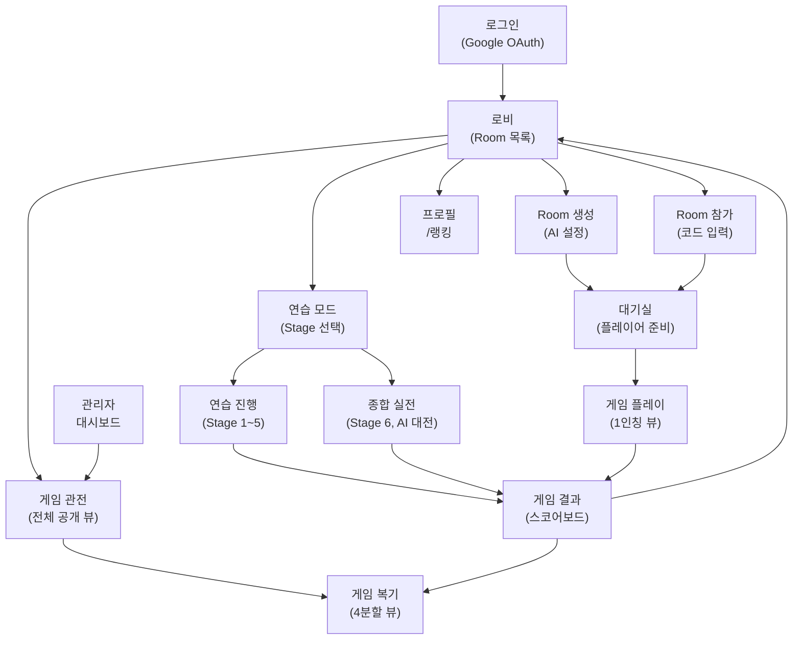
```mermaid
flowchart TB
    Login["로그인\n(Google OAuth)"]
    Lobby["로비\n(Room 목록)"]
    CreateRoom["Room 생성\n(AI 설정)"]
    JoinRoom["Room 참가\n(코드 입력)"]
    WaitingRoom["대기실\n(플레이어 준비)"]
    PracticeSelect["연습 모드\n(Stage 선택)"]
    PracticePlay["연습 진행\n(Stage 1~5)"]
    PracticeAI["종합 실전\n(Stage 6, AI 대전)"]
    GamePlay["게임 플레이\n(1인칭 뷰)"]
    Spectate["게임 관전\n(전체 공개 뷰)"]
    Replay["게임 복기\n(4분할 뷰)"]
    Result["게임 결과\n(스코어보드)"]
    Profile["프로필\n/랭킹"]
    Admin["관리자\n대시보드"]

    Login --> Lobby
    Lobby --> CreateRoom
    Lobby --> JoinRoom
    Lobby --> PracticeSelect
    Lobby --> Spectate
    Lobby --> Profile
    CreateRoom --> WaitingRoom
    JoinRoom --> WaitingRoom
    WaitingRoom --> GamePlay
    PracticeSelect --> PracticePlay
    PracticeSelect --> PracticeAI
    PracticePlay --> Result
    PracticeAI --> Result
    GamePlay --> Result
    Spectate --> Replay
    Result --> Replay
    Result --> Lobby
    Admin --> Spectate
```

---

## 3. 화면 상세: 로그인

### 3.1 레이아웃

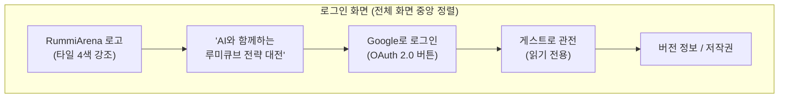
```mermaid
flowchart TB
    subgraph Login["로그인 화면 (전체 화면 중앙 정렬)"]
        Logo["RummiArena 로고\n(타일 4색 강조)"]
        Tagline["'AI와 함께하는\n루미큐브 전략 대전'"]
        OAuthBtn["Google로 로그인\n(OAuth 2.0 버튼)"]
        GuestBtn["게스트로 관전\n(읽기 전용)"]
        Footer["버전 정보 / 저작권"]
    end
    Logo --> Tagline --> OAuthBtn --> GuestBtn --> Footer
```

### 3.2 동작 설명

- Google OAuth 버튼 클릭 시 `/api/auth/google` 리다이렉트
- 콜백 성공 시 JWT 발급, 로비로 이동
- 게스트 모드: 관전 및 복기만 허용, 게임 참가 불가
- 배경: 앱 배경(`#0D1117`) 위에 반투명 카드 (`backdrop-filter: blur`)

---

## 4. 화면 상세: 로비 및 매칭

### 4.1 레이아웃 구조

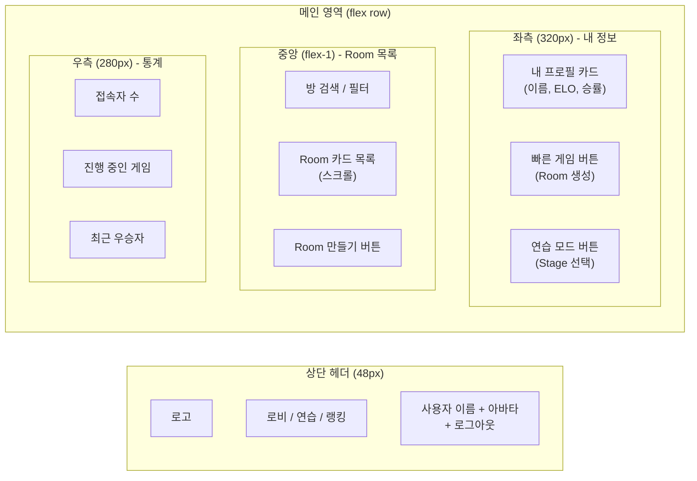
```mermaid
flowchart LR
    subgraph Header["상단 헤더 (48px)"]
        LogoH["로고"]
        NavMenu["로비 / 연습 / 랭킹"]
        UserInfo["사용자 이름 + 아바타\n+ 로그아웃"]
    end

    subgraph Main["메인 영역 (flex row)"]
        subgraph Left["좌측 (320px) - 내 정보"]
            MyProfile["내 프로필 카드\n(이름, ELO, 승률)"]
            QuickAction["빠른 게임 버튼\n(Room 생성)"]
            PracticeBtn["연습 모드 버튼\n(Stage 선택)"]
        end

        subgraph Center["중앙 (flex-1) - Room 목록"]
            SearchBar["방 검색 / 필터"]
            RoomList["Room 카드 목록\n(스크롤)"]
            CreateRoomBtn["Room 만들기 버튼"]
        end

        subgraph Right["우측 (280px) - 통계"]
            OnlineCount["접속자 수"]
            ActiveGames["진행 중인 게임"]
            RecentWinners["최근 우승자"]
        end
    end
```

### 4.2 Room 카드 컴포넌트

각 Room 카드는 다음 정보를 표시한다.

| 정보 요소 | 표시 방법 |
|-----------|-----------|
| Room 코드 | 4자리 대문자 (예: ABCD) |
| 현재 인원 / 최대 인원 | 아이콘 + 숫자 (예: 2/4) |
| AI 플레이어 구성 | AI 캐릭터 아이콘 (Rookie, Shark 등) |
| 게임 상태 | 배지: WAITING(초록) / PLAYING(노랑) |
| 턴 타임아웃 설정 | 시계 아이콘 + 초 |
| 호스트 이름 | 텍스트 |

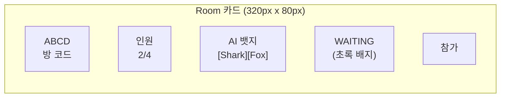
```mermaid
flowchart LR
    subgraph RoomCard["Room 카드 (320px x 80px)"]
        Code["ABCD\n방 코드"]
        Players["인원\n2/4"]
        AIBadges["AI 뱃지\n[Shark][Fox]"]
        Status["WAITING\n(초록 배지)"]
        JoinBtn["참가"]
    end
```

### 4.3 Room 생성 모달

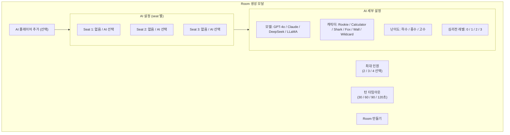
```mermaid
flowchart TB
    subgraph CreateModal["Room 생성 모달"]
        MaxPlayers["최대 인원\n(2 / 3 / 4 선택)"]
        TurnTimeout["턴 타임아웃\n(30 / 60 / 90 / 120초)"]
        AISection["AI 플레이어 추가 (선택)"]
        subgraph AIConfig["AI 설정 (seat 별)"]
            Seat1["Seat 1: 없음 / AI 선택"]
            Seat2["Seat 2: 없음 / AI 선택"]
            Seat3["Seat 3: 없음 / AI 선택"]
        end
        subgraph AIDetail["AI 세부 설정"]
            Model["모델: GPT-4o / Claude / DeepSeek / LLaMA"]
            Persona["캐릭터: Rookie / Calculator / Shark / Fox / Wall / Wildcard"]
            Difficulty["난이도: 하수 / 중수 / 고수"]
            PsyLevel["심리전 레벨: 0 / 1 / 2 / 3"]
        end
        CreateBtn["Room 만들기"]
    end
    AISection --> AIConfig --> AIDetail
```

### 4.4 대기실 화면

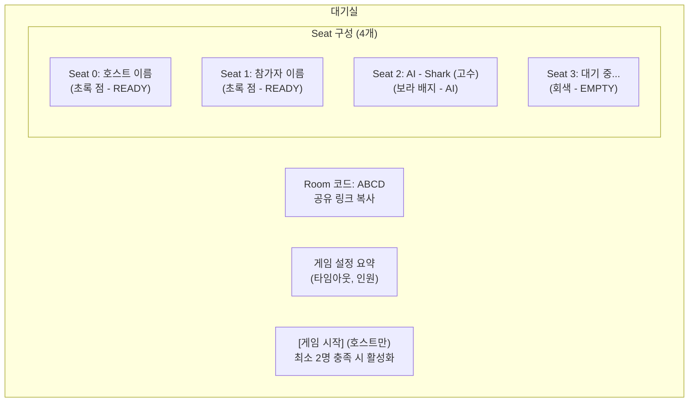
```mermaid
flowchart TB
    subgraph WaitingRoom["대기실"]
        RoomInfo["Room 코드: ABCD\n공유 링크 복사"]
        subgraph Seats["Seat 구성 (4개)"]
            S0["Seat 0: 호스트 이름\n(초록 점 - READY)"]
            S1["Seat 1: 참가자 이름\n(초록 점 - READY)"]
            S2["Seat 2: AI - Shark (고수)\n(보라 배지 - AI)"]
            S3["Seat 3: 대기 중...\n(회색 - EMPTY)"]
        end
        Settings["게임 설정 요약\n(타임아웃, 인원)"]
        HostControl["[게임 시작] (호스트만)\n최소 2명 충족 시 활성화"]
    end
```

---

## 5. 화면 상세: 게임 플레이 (1인칭 뷰)

실제 플레이 중인 플레이어 본인의 시점. HTML 시뮬레이션 `rummikub-firstperson.html` 을 기반으로 한다.

### 5.1 레이아웃 구조

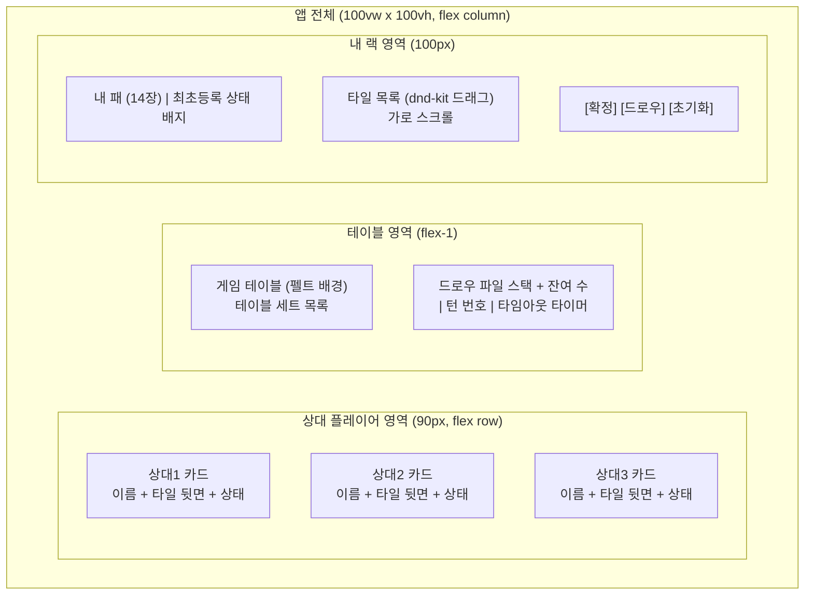
```mermaid
flowchart TB
    subgraph App["앱 전체 (100vw x 100vh, flex column)"]
        subgraph Opponents["상대 플레이어 영역 (90px, flex row)"]
            Opp1["상대1 카드\n이름 + 타일 뒷면 + 상태"]
            Opp2["상대2 카드\n이름 + 타일 뒷면 + 상태"]
            Opp3["상대3 카드\n이름 + 타일 뒷면 + 상태"]
        end

        subgraph TableArea["테이블 영역 (flex-1)"]
            TableFelt["게임 테이블 (펠트 배경)\n테이블 세트 목록"]
            TableInfo["드로우 파일 스택 + 잔여 수\n| 턴 번호 | 타임아웃 타이머"]
        end

        subgraph MyRack["내 랙 영역 (100px)"]
            RackHeader["내 패 (14장) | 최초등록 상태 배지"]
            RackTiles["타일 목록 (dnd-kit 드래그)\n가로 스크롤"]
            ActionBtns["[확정] [드로우] [초기화]"]
        end
    end
```

### 5.2 상대 플레이어 카드

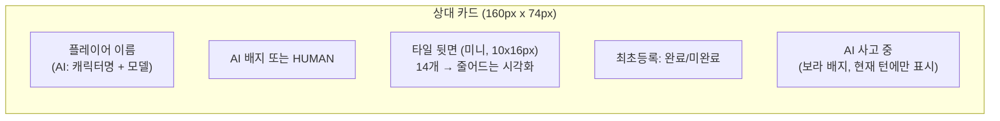
```mermaid
flowchart LR
    subgraph OppCard["상대 카드 (160px x 74px)"]
        OppName["플레이어 이름\n(AI: 캐릭터명 + 모델)"]
        OppType["AI 배지 또는 HUMAN"]
        OppMiniTiles["타일 뒷면 (미니, 10x16px)\n14개 → 줄어드는 시각화"]
        OppMeldBadge["최초등록: 완료/미완료"]
        ThinkingBadge["AI 사고 중\n(보라 배지, 현재 턴에만 표시)"]
    end
```

### 5.3 테이블 영역 상세

테이블에 놓인 세트들을 그룹(Group)과 런(Run)으로 구분하여 배치한다.

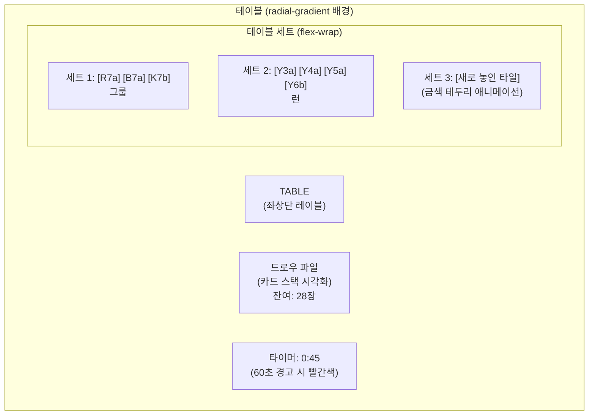
```mermaid
flowchart TB
    subgraph TableFelt["테이블 (radial-gradient 배경)"]
        TableLabel["TABLE\n(좌상단 레이블)"]
        subgraph Sets["테이블 세트 (flex-wrap)"]
            Set1["세트 1: [R7a] [B7a] [K7b]\n그룹"]
            Set2["세트 2: [Y3a] [Y4a] [Y5a] [Y6b]\n런"]
            Set3["세트 3: [새로 놓인 타일]\n(금색 테두리 애니메이션)"]
        end
        DrawPile["드로우 파일\n(카드 스택 시각화)\n잔여: 28장"]
        Timer["타이머: 0:45\n(60초 경고 시 빨간색)"]
    end
```

### 5.4 내 랙 영역 상세

dnd-kit을 사용하여 타일 드래그 앤 드롭을 구현한다.

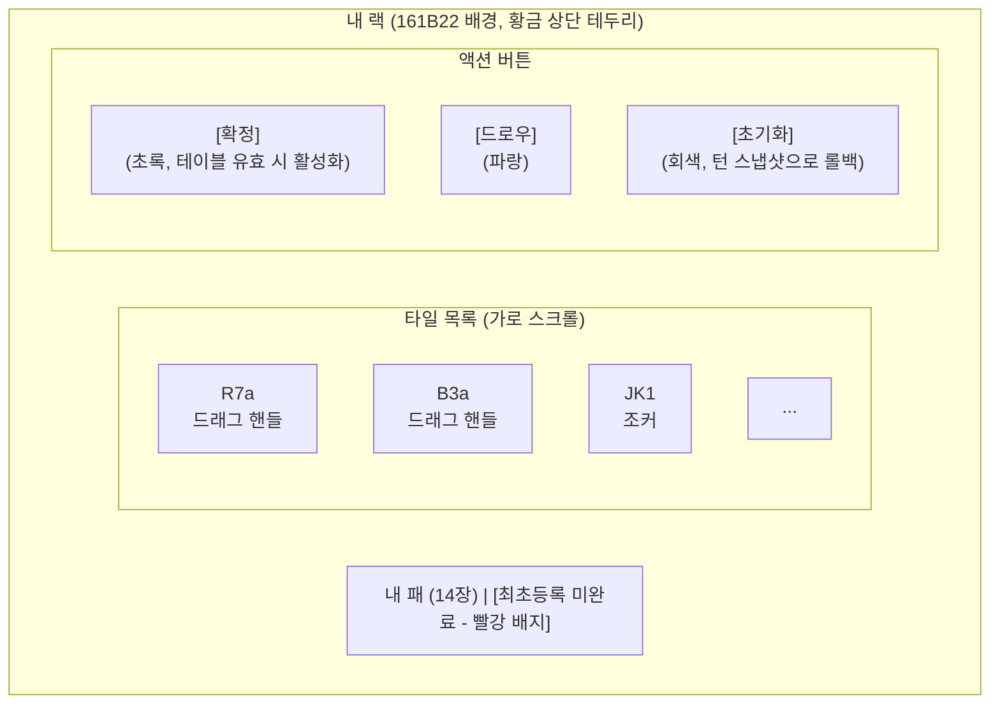
```mermaid
flowchart TB
    subgraph MyRackArea["내 랙 (161B22 배경, 황금 상단 테두리)"]
        RackHeader2["내 패 (14장) | [최초등록 미완료 - 빨강 배지]"]
        subgraph Tiles["타일 목록 (가로 스크롤)"]
            T1["R7a\n드래그 핸들"]
            T2["B3a\n드래그 핸들"]
            T3["JK1\n조커"]
            Dots["..."]
        end
        subgraph Actions["액션 버튼"]
            Confirm["[확정]\n(초록, 테이블 유효 시 활성화)"]
            Draw["[드로우]\n(파랑)"]
            Reset["[초기화]\n(회색, 턴 스냅샷으로 롤백)"]
        end
    end
```

### 5.5 드래그 앤 드롭 인터랙션 (dnd-kit)

| 드래그 소스 | 드롭 대상 | 결과 |
|------------|-----------|------|
| 내 랙의 타일 | 테이블 빈 공간 | 새 세트 생성 시작 (임시 배치) |
| 내 랙의 타일 | 기존 테이블 세트 | 해당 세트에 타일 추가 |
| 테이블 세트의 타일 | 다른 테이블 세트 | 테이블 재배치 (hasInitialMeld 필요) |
| 테이블 세트의 타일 | 테이블 빈 공간 | 세트 분리 시작 |

드래그 중 표시: 반투명 타일 고스트, 드롭 가능 영역 강조(초록 테두리)

### 5.6 AI 사고 중 표시

AI가 현재 턴인 경우 다음 요소를 표시한다.

```
상대 카드 우측 상단: 보라색 "사고 중" 배지 (펄스 애니메이션)
테이블 영역 중앙: "AI (Shark) 이 생각하고 있습니다..." 오버레이 텍스트
타이머: 그대로 진행 (AI도 타임아웃 적용)
```

### 5.7 무효 배치 피드백

Game Engine이 배치를 거부하면:

```
1. 테이블이 턴 시작 스냅샷으로 롤백 (애니메이션)
2. 토스트 메시지: "유효하지 않은 배치입니다. (오류 코드)"
3. 무효 세트에 빨간 테두리 0.5초 표시 후 롤백
4. 랙 타일이 원래 위치로 복귀 (Framer Motion spring 애니메이션)
```

---

## 6. 화면 상세: 게임 관전 뷰

관리자 또는 게스트가 진행 중인 게임을 보는 화면. `rummikub-simulation.html` 기반.

### 6.1 레이아웃 구조

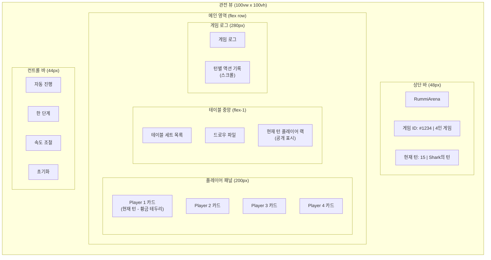
```mermaid
flowchart LR
    subgraph SpectateLayout["관전 뷰 (100vw x 100vh)"]
        subgraph TopBar["상단 바 (48px)"]
            TBLogo["RummiArena"]
            TBInfo["게임 ID: #1234 | 4인 게임"]
            TBTurn["현재 턴: 15 | Shark의 턴"]
        end

        subgraph MainArea["메인 영역 (flex row)"]
            subgraph PlayerPanel["플레이어 패널 (200px)"]
                PC1["Player 1 카드\n(현재 턴 - 황금 테두리)"]
                PC2["Player 2 카드"]
                PC3["Player 3 카드"]
                PC4["Player 4 카드"]
            end

            subgraph TableCenter["테이블 중앙 (flex-1)"]
                TableSets["테이블 세트 목록"]
                DrawPileV["드로우 파일"]
                MyRackV["현재 턴 플레이어 랙\n(공개 표시)"]
            end

            subgraph LogPanel["게임 로그 (280px)"]
                LogHeader["게임 로그"]
                LogEntries["턴별 액션 기록\n(스크롤)"]
            end
        end

        subgraph Controls["컨트롤 바 (44px)"]
            PlayBtn["자동 진행"]
            StepBtn["한 단계"]
            SpeedBtn["속도 조절"]
            ResetBtn["초기화"]
        end
    end
```

### 6.2 플레이어 패널 카드

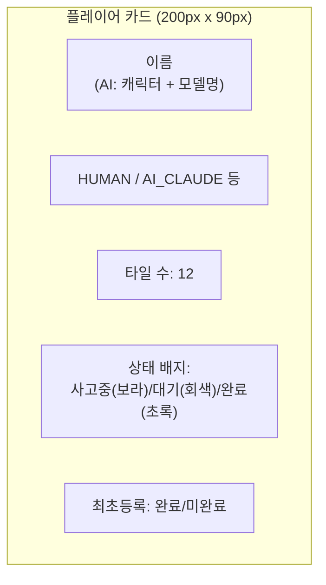
```mermaid
flowchart TB
    subgraph PlayerCard["플레이어 카드 (200px x 90px)"]
        PCName["이름\n(AI: 캐릭터 + 모델명)"]
        PCType["HUMAN / AI_CLAUDE 등"]
        PCTileCount["타일 수: 12"]
        PCStatus["상태 배지:\n사고중(보라)/대기(회색)/완료(초록)"]
        PCInitial["최초등록: 완료/미완료"]
    end
```

### 6.3 게임 로그 항목

```
[턴 15] Shark (Claude): 타일 3장 배치 → [R7a, B7b, Y7a]
[턴 15] 테이블 검증: 유효
[턴 16] Fox (GPT-4o): 드로우
[턴 17] Wall (LLaMA): 타일 5장 배치 (재배치 포함)
```

---

## 7. 화면 상세: 게임 복기 (4분할 뷰)

게임 종료 후 또는 관전 중 복기 모드. `rummikub-4split.html` 기반.
4명의 플레이어 패를 동시에 공개하여 각 턴의 판단 근거를 오버레이로 확인한다.

### 7.1 레이아웃 구조

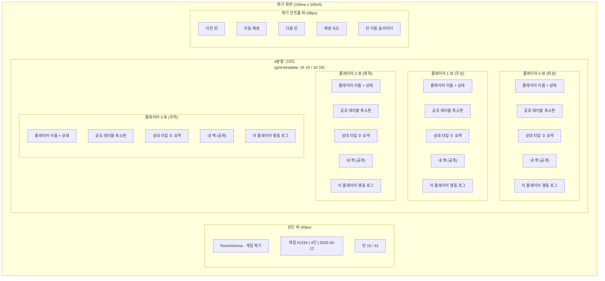
```mermaid
flowchart TB
    subgraph ReplayLayout["복기 화면 (100vw x 100vh)"]
        subgraph TopBar4["상단 바 (40px)"]
            TB4Title["RummiArena - 게임 복기"]
            TB4Info["게임 #1234 | 4인 | 2026-03-12"]
            TB4Turn["턴 15 / 42"]
        end

        subgraph Grid["4분할 그리드\n(grid-template: 1fr 1fr / 1fr 1fr)"]
            subgraph P0["플레이어 0 뷰 (좌상)"]
                P0Header["플레이어 이름 + 상태"]
                P0Table["공유 테이블 축소판"]
                P0OppInfo["상대 타일 수 요약"]
                P0Rack["내 랙 (공개)"]
                P0Log["이 플레이어 행동 로그"]
            end
            subgraph P1["플레이어 1 뷰 (우상)"]
                P1Header["플레이어 이름 + 상태"]
                P1Table["공유 테이블 축소판"]
                P1OppInfo["상대 타일 수 요약"]
                P1Rack["내 랙 (공개)"]
                P1Log["이 플레이어 행동 로그"]
            end
            subgraph P2["플레이어 2 뷰 (좌하)"]
                P2Header["플레이어 이름 + 상태"]
                P2Table["공유 테이블 축소판"]
                P2OppInfo["상대 타일 수 요약"]
                P2Rack["내 랙 (공개)"]
                P2Log["이 플레이어 행동 로그"]
            end
            subgraph P3["플레이어 3 뷰 (우하)"]
                P3Header["플레이어 이름 + 상태"]
                P3Table["공유 테이블 축소판"]
                P3OppInfo["상대 타일 수 요약"]
                P3Rack["내 랙 (공개)"]
                P3Log["이 플레이어 행동 로그"]
            end
        end

        subgraph ReplayControls["복기 컨트롤 바 (48px)"]
            RC_Prev["이전 턴"]
            RC_Play["자동 재생"]
            RC_Next["다음 턴"]
            RC_Speed["재생 속도"]
            RC_Jump["턴 이동 슬라이더"]
        end
    end
```

### 7.2 AI 판단 근거 오버레이

현재 턴이 AI의 턴일 때, 해당 플레이어 뷰에 오버레이를 표시한다.

```
┌─────────────────────────────────┐
│ AI 판단 근거 (Shark - Claude)    │
├─────────────────────────────────┤
│ 선택한 액션: 타일 3장 배치        │
│ 사용 타일: R7a, B7b, Y7a        │
│                                 │
│ Reasoning:                      │
│ "상대(Fox)가 타일 3개 남음.      │
│ 공격적으로 그룹 배치하여         │
│ 랙 소진을 가속화."              │
├─────────────────────────────────┤
│ 지연시간: 1.2s | 토큰: 847      │
│ 재시도: 0회                     │
└─────────────────────────────────┘
```

- 오버레이는 해당 뷰 우측 하단에 반투명 패널로 표시
- 오버레이 표시 여부: 토글 버튼 제공 (기본: 표시)

### 7.3 4분할 개별 뷰 내부 상세

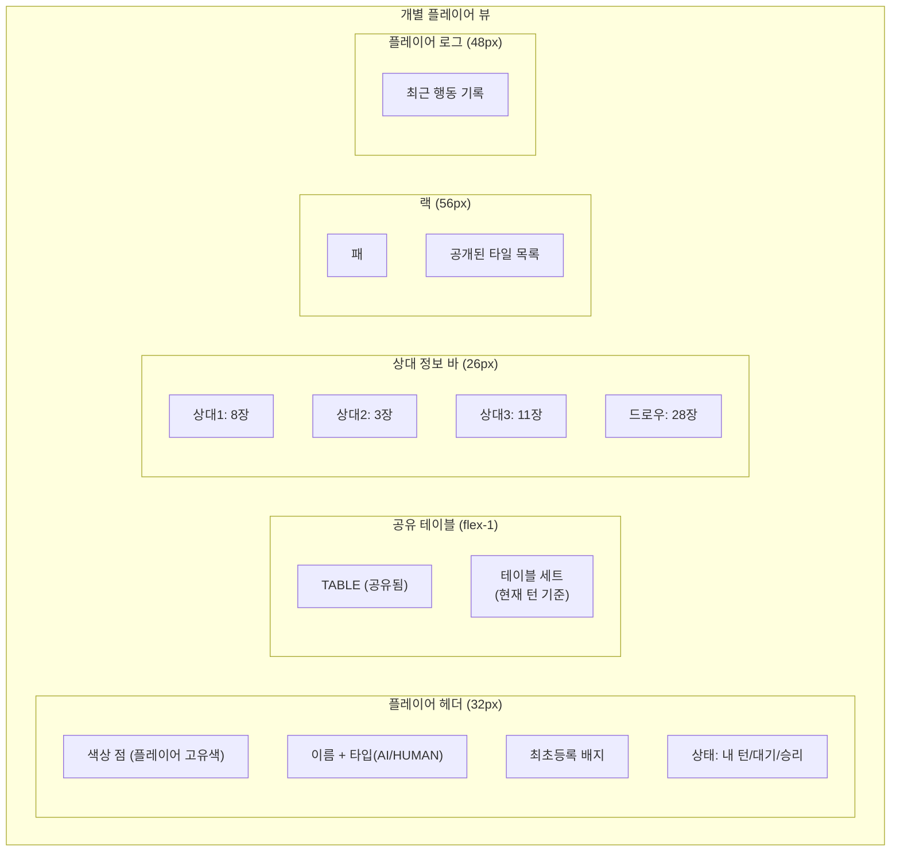
```mermaid
flowchart TB
    subgraph PlayerView["개별 플레이어 뷰"]
        subgraph PVHeader["플레이어 헤더 (32px)"]
            PVDot["색상 점 (플레이어 고유색)"]
            PVName["이름 + 타입(AI/HUMAN)"]
            PVMeld["최초등록 배지"]
            PVStatus["상태: 내 턴/대기/승리"]
        end
        subgraph PVTable["공유 테이블 (flex-1)"]
            PVTableLabel["TABLE (공유됨)"]
            PVTableSets["테이블 세트\n(현재 턴 기준)"]
        end
        subgraph PVOppBar["상대 정보 바 (26px)"]
            OppChip1["상대1: 8장"]
            OppChip2["상대2: 3장"]
            OppChip3["상대3: 11장"]
            DrawInfo["드로우: 28장"]
        end
        subgraph PVRack["랙 (56px)"]
            PVRackLabel["패"]
            PVRackTiles["공개된 타일 목록"]
        end
        subgraph PVLog["플레이어 로그 (48px)"]
            PVLogEntry["최근 행동 기록"]
        end
    end
```

---

## 8. 화면 상세: 연습 모드

### 8.1 Stage 선택 화면

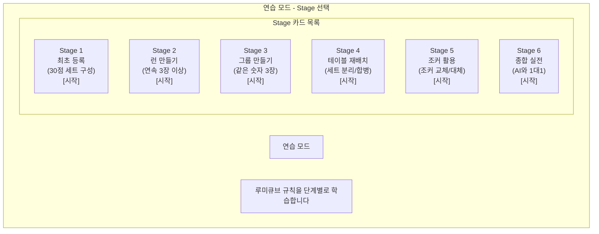
```mermaid
flowchart TB
    subgraph PracticeSelect["연습 모드 - Stage 선택"]
        Title["연습 모드"]
        Desc["루미큐브 규칙을 단계별로 학습합니다"]
        subgraph Stages["Stage 카드 목록"]
            S1Card["Stage 1\n최초 등록\n(30점 세트 구성)\n[시작]"]
            S2Card["Stage 2\n런 만들기\n(연속 3장 이상)\n[시작]"]
            S3Card["Stage 3\n그룹 만들기\n(같은 숫자 3장)\n[시작]"]
            S4Card["Stage 4\n테이블 재배치\n(세트 분리/합병)\n[시작]"]
            S5Card["Stage 5\n조커 활용\n(조커 교체/대체)\n[시작]"]
            S6Card["Stage 6\n종합 실전\n(AI와 1대1)\n[시작]"]
        end
    end
```

각 Stage 카드에는 클리어 여부(체크마크), 최고 기록, 설명을 표시한다.

### 8.2 연습 진행 화면 (Stage 1~5)

1인칭 뷰와 동일하나 다음 차이점이 있다.

| 항목 | 일반 게임 | 연습 모드 (Stage 1~5) |
|------|-----------|----------------------|
| 턴 타이머 | 30~120초 | 없음 (무제한) |
| 상대 영역 | 3명 상대 | 없음 |
| 힌트 버튼 | 없음 | 있음 (유효한 세트 하이라이트) |
| 목표 표시 | 없음 | 상단에 현재 Stage 목표 표시 |
| 클리어 감지 | 랙 0장 | Stage별 조건 |

### 8.3 Stage 클리어 모달

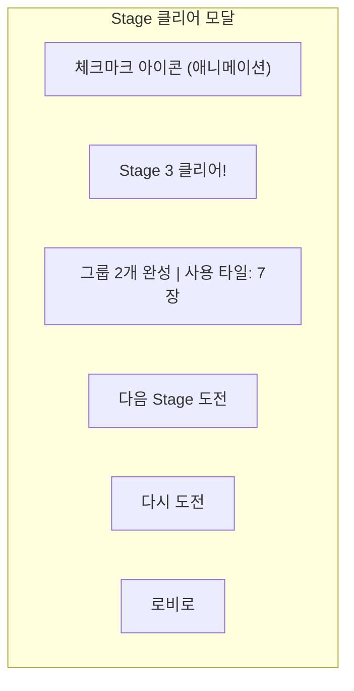
```mermaid
flowchart TB
    subgraph ClearModal["Stage 클리어 모달"]
        ClearIcon["체크마크 아이콘 (애니메이션)"]
        ClearTitle["Stage 3 클리어!"]
        ClearStat["그룹 2개 완성 | 사용 타일: 7장"]
        NextBtn["다음 Stage 도전"]
        RetryBtn["다시 도전"]
        LobbyBtn["로비로"]
    end
```

---

## 9. 화면 상세: 게임 결과

### 9.1 스코어보드 모달

게임 종료 시 전체 화면 위 오버레이로 표시된다.

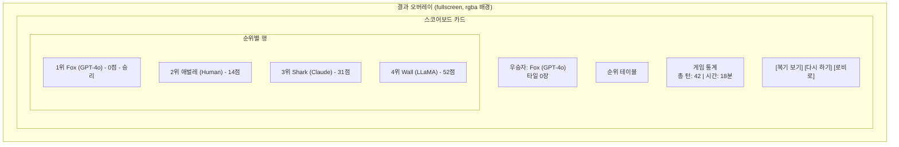
```mermaid
flowchart TB
    subgraph ResultOverlay["결과 오버레이 (fullscreen, rgba 배경)"]
        subgraph Scoreboard["스코어보드 카드"]
            Winner["우승자: Fox (GPT-4o)\n타일 0장"]
            Table2["순위 테이블"]
            subgraph Rows["순위별 행"]
                R1["1위 Fox (GPT-4o) - 0점 - 승리"]
                R2["2위 애벌레 (Human) - 14점"]
                R3["3위 Shark (Claude) - 31점"]
                R4["4위 Wall (LLaMA) - 52점"]
            end
            GameStat["게임 통계\n총 턴: 42 | 시간: 18분"]
            Buttons2["[복기 보기] [다시 하기] [로비로]"]
        end
    end
```

### 9.2 ELO 변동 표시

Human 플레이어에게만 ELO 변동을 표시한다.

```
애벌레: 1,247 → 1,239 (-8) [2위]
```

---

## 10. 화면 상세: 관리자 대시보드

### 10.1 전체 레이아웃

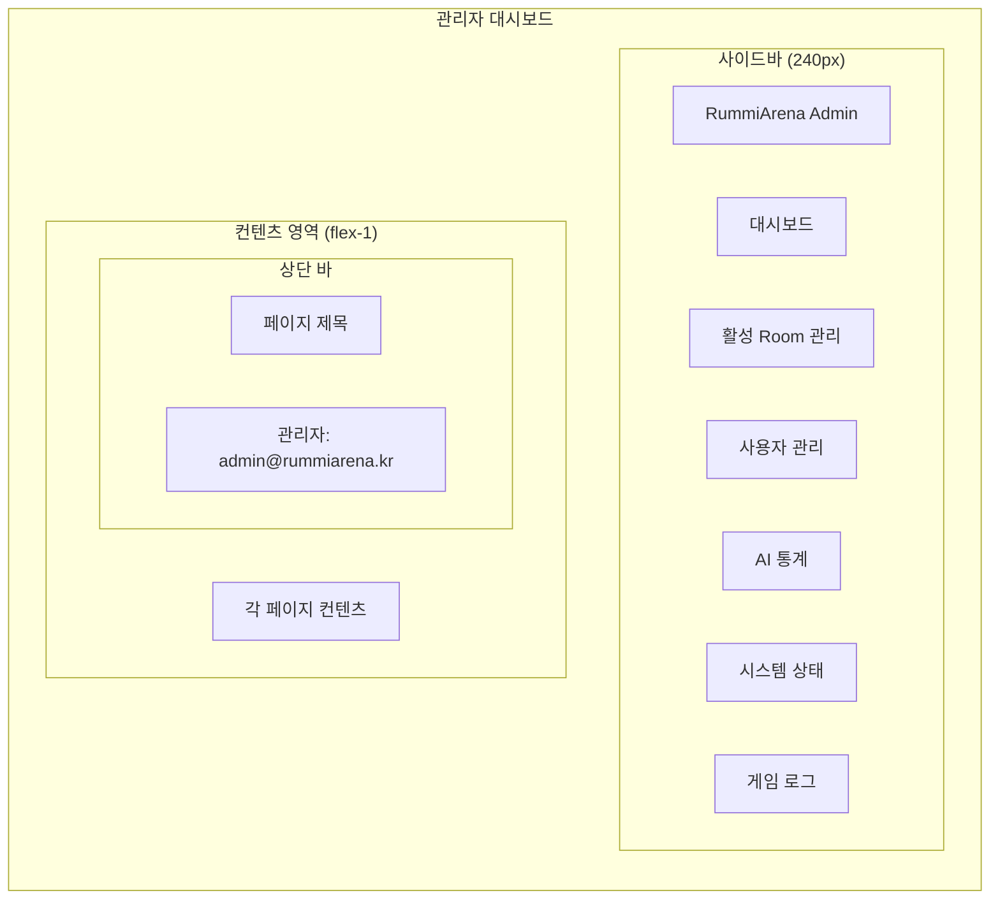
```mermaid
flowchart LR
    subgraph AdminLayout["관리자 대시보드"]
        subgraph AdminSidebar["사이드바 (240px)"]
            AdminLogo["RummiArena Admin"]
            NavDash["대시보드"]
            NavRooms["활성 Room 관리"]
            NavUsers["사용자 관리"]
            NavAI["AI 통계"]
            NavSystem["시스템 상태"]
            NavLogs["게임 로그"]
        end

        subgraph AdminContent["컨텐츠 영역 (flex-1)"]
            subgraph AdminTopBar["상단 바"]
                PageTitle["페이지 제목"]
                AdminUser["관리자: admin@rummiarena.kr"]
            end
            ContentArea["각 페이지 컨텐츠"]
        end
    end
```

### 10.2 대시보드 메인 페이지

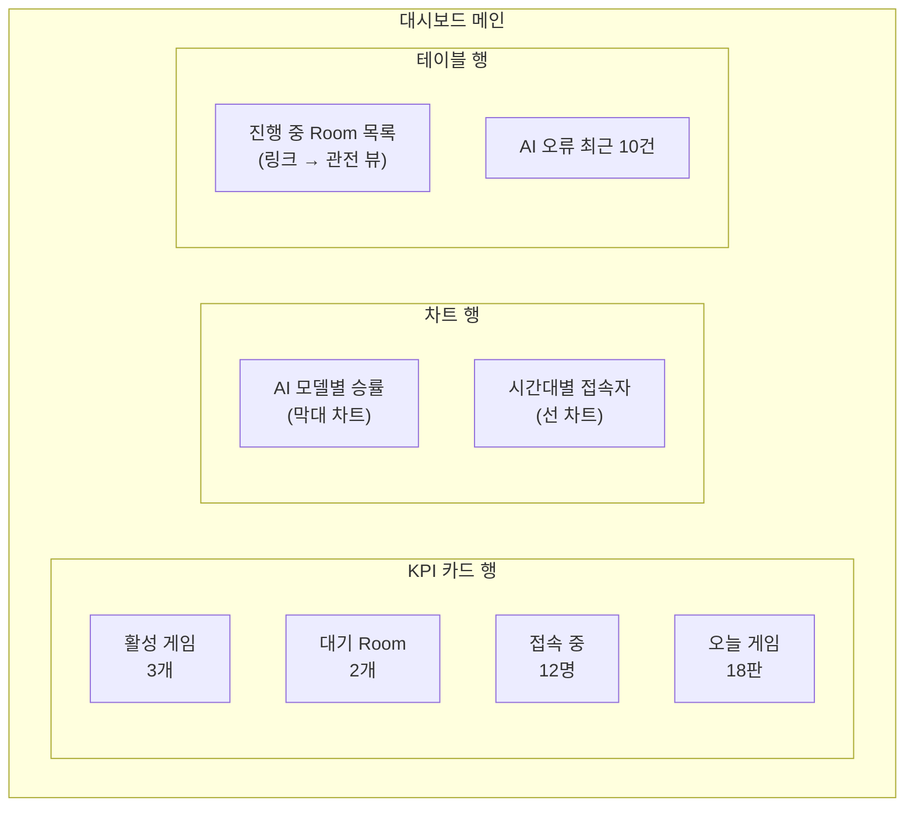
```mermaid
flowchart TB
    subgraph DashMain["대시보드 메인"]
        subgraph KPIRow["KPI 카드 행"]
            KPI1["활성 게임\n3개"]
            KPI2["대기 Room\n2개"]
            KPI3["접속 중\n12명"]
            KPI4["오늘 게임\n18판"]
        end

        subgraph Charts["차트 행"]
            Chart1["AI 모델별 승률\n(막대 차트)"]
            Chart2["시간대별 접속자\n(선 차트)"]
        end

        subgraph Tables["테이블 행"]
            RoomTable["진행 중 Room 목록\n(링크 → 관전 뷰)"]
            AIErrTable["AI 오류 최근 10건"]
        end
    end
```

### 10.3 활성 Room 관리 페이지

| 컬럼 | 표시 내용 |
|------|-----------|
| Room 코드 | 4자리 코드 |
| 상태 | WAITING / PLAYING 배지 |
| 인원 | 현재/최대 (Human/AI 분리) |
| 턴 수 | 현재 진행 턴 |
| 시작 시간 | 상대 시간 (예: 18분 전) |
| 액션 | [관전] [강제 종료] |

### 10.4 AI 통계 페이지

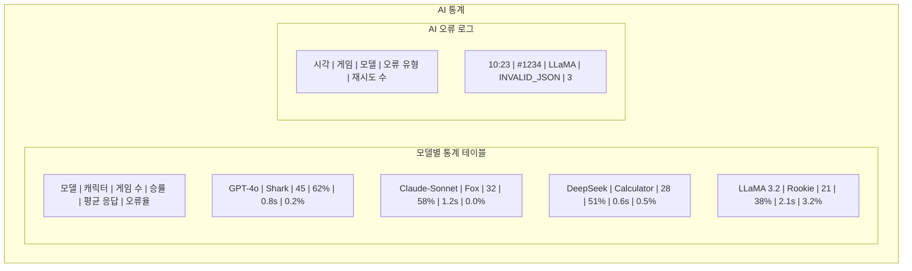
```mermaid
flowchart TB
    subgraph AIStats["AI 통계"]
        subgraph ModelTable["모델별 통계 테이블"]
            MT_Header["모델 | 캐릭터 | 게임 수 | 승률 | 평균 응답 | 오류율"]
            MT_R1["GPT-4o | Shark | 45 | 62% | 0.8s | 0.2%"]
            MT_R2["Claude-Sonnet | Fox | 32 | 58% | 1.2s | 0.0%"]
            MT_R3["DeepSeek | Calculator | 28 | 51% | 0.6s | 0.5%"]
            MT_R4["LLaMA 3.2 | Rookie | 21 | 38% | 2.1s | 3.2%"]
        end
        subgraph ErrorLog["AI 오류 로그"]
            EL_Header["시각 | 게임 | 모델 | 오류 유형 | 재시도 수"]
            EL_R1["10:23 | #1234 | LLaMA | INVALID_JSON | 3"]
        end
    end
```

### 10.5 시스템 상태 페이지

```mermaid
flowchart LR
    subgraph SystemStatus["시스템 상태"]
        subgraph ServiceHealth["서비스 헬스"]
            SH1["Game Server: 정상 (초록)"]
            SH2["AI Adapter: 정상 (초록)"]
            SH3["Redis: 정상 (초록)"]
            SH4["PostgreSQL: 정상 (초록)"]
        end
        subgraph Metrics["메트릭"]
            M1["CPU: 34%"]
            M2["메모리: 6.2GB / 10GB"]
            M3["Redis 키: 1,234개"]
            M4["DB 연결: 8/20"]
        end
    end
```

---

## 11. 프로필 및 랭킹 페이지

### 11.1 프로필 페이지

```mermaid
flowchart TB
    subgraph ProfilePage["프로필 페이지"]
        subgraph ProfileHeader["프로필 헤더"]
            Avatar["Google 프로필 이미지"]
            UserName["애벌레"]
            ELO["ELO: 1,247"]
            Rank["랭킹: #23"]
        end

        subgraph Stats["통계 카드"]
            TotalGames["총 게임: 142"]
            WinRate["승률: 54.2%"]
            AvgTiles["평균 잔여 타일: 3.1장"]
            BestStreak["최장 연승: 5"]
        end

        subgraph History["최근 게임 이력 (10건)"]
            H_Header["날짜 | 결과 | 상대 | 점수 | ELO 변동"]
            H_R1["2026-03-12 | 2위 | AI x3 | 14점 | -8"]
            H_R2["2026-03-11 | 1위 | Human x1 + AI x2 | 0점 | +24"]
        end
    end
```

### 11.2 랭킹 페이지

```mermaid
flowchart TB
    subgraph RankingPage["랭킹 페이지"]
        Filter["기간 필터: 전체 / 이번 달 / 이번 주"]
        subgraph RankTable["랭킹 테이블"]
            RH["순위 | 이름 | ELO | 승률 | 게임 수"]
            RR1["#1 | Player A | 1,842 | 71% | 203"]
            RR2["#2 | Player B | 1,744 | 65% | 181"]
            MyRow["#23 | 애벌레 (본인) | 1,247 | 54% | 142\n(강조 표시)"]
        end
    end
```

---

## 12. 컴포넌트 설계

### 12.1 TileComponent

타일 하나를 표현하는 기본 컴포넌트.

```
Props:
  code: string          // "R7a", "B13b", "JK1"
  size: 'sm'|'md'|'lg' // sm=미니, md=테이블, lg=랙
  draggable: boolean    // dnd-kit DraggableItem으로 래핑 여부
  highlighted: boolean  // 금색 테두리 강조
  showPattern: boolean  // 색약 보조 패턴 표시 여부

Visual:
  - 색상: code[0] 기준 (R/B/Y/K/JK)
  - 숫자: code[1..] 기준 (1~13, 조커는 "JK")
  - 세트ID: code[-1] 기준 (a/b), xs 크기로 우하단
  - 조커: 무지개 그라데이션 테두리, 별 아이콘
  - 색약 패턴: size가 md 이상일 때만 표시

States:
  - default: 기본 배경 + 흰색 숫자
  - hover (랙): translateY(-3px), z-index 상승
  - dragging: 반투명 (opacity 0.5), 그림자
  - highlighted: #F3C623 테두리 + glow shadow
  - invalid: #F85149 테두리 (무효 배치 피드백 후 롤백)
```

### 12.2 TileRack

내 랙을 표현하는 컨테이너. dnd-kit DroppableContainer 래핑.

```
Props:
  tiles: string[]        // 타일 코드 배열
  draggable: boolean     // 드래그 허용 여부
  onTileClick: (code) => void

Layout:
  - 가로 flex, overflow-x: auto
  - 타일 간격: 3px
  - 하단 스크롤바: thin, 브랜드 색상
  - 타일 수 변경 시 Framer Motion layout animation

Accessibility:
  - 각 타일: role="button", aria-label="빨강 7 (세트 a)"
  - 키보드: Tab 이동, Space/Enter로 선택
  - 선택 후 방향키로 위치 이동 (키보드 드래그 대체)
```

### 12.3 TableBoard

게임 테이블 전체를 표현하는 컴포넌트.

```
Props:
  groups: TileGroup[]    // [{id, tiles: string[]}]
  editable: boolean      // true이면 드래그 앤 드롭 허용
  highlightGroupId: string | null

Layout:
  - background: radial-gradient 펠트 효과
  - border: 2px solid #2A5A3A
  - border-radius: 12px
  - padding: 16px
  - overflow-y: auto

Group 렌더링:
  - flex-wrap: wrap, gap: 8px
  - 각 group: 배경 rgba(0,0,0,0.35), 1px solid #2A5A3A
  - 새 group 등장: setGlow 애니메이션 (금색 → 투명)
```

### 12.4 PlayerInfo

플레이어 상태 카드 컴포넌트.

```
Props:
  player: {
    name: string
    type: 'HUMAN' | 'AI_OPENAI' | 'AI_CLAUDE' | 'AI_DEEPSEEK' | 'AI_OLLAMA'
    tileCount: number
    hasInitialMeld: boolean
    status: 'thinking' | 'waiting' | 'done' | 'disconnected'
    isCurrentTurn: boolean
    persona?: string        // AI 캐릭터
    difficulty?: string     // AI 난이도
  }

Visual:
  - isCurrentTurn: 황금 테두리, 배경 약간 밝게
  - type=AI: 보라색 캐릭터 배지
  - status=thinking: 보라 배지 + 펄스 애니메이션
  - hasInitialMeld=false: 빨간 "미등록" 배지
  - tileCount 변화: 숫자 카운트업/다운 애니메이션

미니 타일 표시 (1인칭 뷰):
  - 타일 수만큼 뒷면 미니 타일 렌더링
  - 타일 사용 시: 해당 미니 타일 opacity 0 + width 0 (축소 애니메이션)
```

### 12.5 TurnTimer

남은 시간을 표시하는 타이머 컴포넌트.

```
Props:
  totalSec: number      // 설정된 턴 타임아웃
  remainSec: number     // 남은 시간
  onTimeout: () => void

Visual:
  - remainSec > 30: 흰색 텍스트
  - remainSec 10~30: 노란색 (#F3C623)
  - remainSec < 10: 빨간색 (#F85149), 펄스 애니메이션
  - 원형 프로그레스 바 (CSS conic-gradient)

Format: "M:SS" (예: "0:45", "1:30")
```

### 12.6 DrawPileVisual

드로우 파일을 시각적으로 표현하는 컴포넌트.

```
Props:
  count: number    // 남은 타일 수

Visual:
  - 카드 3장 스택 시각화 (절대 위치 오프셋으로 쌓인 효과)
  - count = 0: 빈 슬롯 표시, "드로우 불가" 텍스트
  - count <= 10: 빨간 텍스트로 숫자 강조
  - count > 10: 회색 텍스트
  - 카드 뒷면: #1C2128 배경, #30363D 테두리
```

### 12.7 AIThinkingIndicator

AI가 현재 턴에 사고 중임을 표시하는 컴포넌트.

```
Props:
  playerName: string    // AI 플레이어 이름
  persona: string       // 캐릭터 (Shark, Fox 등)
  elapsedMs: number     // 경과 시간

Visual:
  - 보라색 배경 배지 (#9B59B6)
  - 점 3개 애니메이션 (... 로딩 효과)
  - 경과 시간 표시 (0.8s, 1.2s ...)
  - 전체 화면: 테이블 위 반투명 오버레이 (선택적)

위치:
  - 플레이어 카드 우측 상단
  - 테이블 영역 중앙 텍스트 (1인칭 뷰)
```

---

## 13. WebSocket 이벤트와 UI 연동

`docs/02-design/03-api-design.md` 의 WebSocket 이벤트를 기반으로 UI 업데이트를 정의한다.

| WebSocket 이벤트 | UI 반응 |
|-----------------|---------|
| `turn:started` | 현재 턴 플레이어 카드 강조, 타이머 시작 |
| `turn:placed` | 테이블 세트 업데이트, 랙 타일 감소 (애니메이션) |
| `turn:drawn` | 해당 플레이어 타일 수 +1 (미니 타일 추가) |
| `turn:timeout` | 자동 드로우, 타이머 만료 표시 |
| `turn:invalid` | 빨간 테두리 + 토스트 + 롤백 애니메이션 |
| `ai:thinking` | AIThinkingIndicator 활성화 |
| `game:finished` | 결과 모달 표시 |
| `player:disconnected` | 해당 카드에 "연결 끊김" 배지 |

---

## 14. 반응형 레이아웃

### 14.1 브레이크포인트 정의

| 브레이크포인트 | 범위 | 대상 기기 |
|---------------|------|-----------|
| `sm` | 320px ~ 639px | 모바일 (세로) |
| `md` | 640px ~ 1023px | 태블릿 |
| `lg` | 1024px ~ 1439px | 노트북 (기본) |
| `xl` | 1440px 이상 | 데스크톱 |

게임 플레이 화면은 데스크톱 우선(Desktop-First)으로 설계한다.
모바일에서는 관전/복기는 지원하나, 실제 플레이는 태블릿 이상 권장.

### 14.2 화면별 반응형 처리

```mermaid
flowchart TB
    subgraph Responsive["반응형 처리 규칙"]
        subgraph Desktop["lg / xl (기본)"]
            D1["1인칭 뷰: 상대 90px + 테이블 flex-1 + 랙 100px"]
            D2["관전 뷰: 좌 패널 200px + 중앙 flex-1 + 로그 280px"]
            D3["4분할 뷰: 2x2 그리드 균등 분할"]
            D4["로비: 좌 320px + 중앙 flex-1 + 우 280px"]
        end
        subgraph Tablet["md (640px~1023px)"]
            T1["1인칭 뷰: 상대 70px + 테이블 flex-1 + 랙 80px"]
            T2["관전 뷰: 로그 패널 접힘 (토글 버튼)"]
            T3["4분할 뷰: 2x2 유지, 각 뷰 내 정보 축소"]
            T4["로비: 우측 패널 숨김"]
        end
        subgraph Mobile["sm (320px~639px)"]
            M1["1인칭 뷰: 제공 (세로 레이아웃 재구성)"]
            M2["관전 뷰: 1열 (플레이어 카드 + 테이블 + 로그)"]
            M3["4분할 뷰: 1x4 세로 스크롤 또는 탭 전환"]
            M4["로비: 단일 컬럼, Room 카드 목록"]
        end
    end
```

### 14.3 타일 크기 반응형

```css
/* TailwindCSS 기반 예시 */
.tile {
  /* 기본(lg): 랙 타일 */
  @apply w-[42px] h-[58px];

  /* 태블릿: 약간 축소 */
  @screen md {
    @apply w-[36px] h-[50px];
  }

  /* 모바일: 터치 타겟 44px 이상 유지 */
  @screen sm {
    @apply w-[44px] h-[60px];  /* 터치 친화적 크기 */
  }
}

.tile-table {
  /* 테이블 타일: 항상 랙보다 작게 */
  @apply w-[34px] h-[46px];

  @screen sm {
    @apply w-[28px] h-[38px];
  }
}
```

---

## 15. 다크 모드 지원

RummiArena는 기본적으로 다크 테마를 사용한다. 게임 테이블의 펠트 색감과 타일의 진한 색상이 다크 배경에서 최적화되어 있기 때문이다.

라이트 모드는 로비, 프로필, 관리자 대시보드 등 게임 외 화면에서 선택적으로 지원한다.

| 화면 | 다크 | 라이트 |
|------|------|-------|
| 게임 플레이 | 기본 (고정) | 미지원 |
| 관전/복기 | 기본 (고정) | 미지원 |
| 로비 | 기본 | 선택적 지원 |
| 프로필/랭킹 | 기본 | 선택적 지원 |
| 관리자 대시보드 | 기본 | 선택적 지원 |

```css
/* CSS 변수로 테마 분리 */
:root[data-theme="dark"] {
  --app-bg: #0D1117;
  --panel-bg: #161B22;
  --card-bg: #1C2128;
  --text-primary: #F0F6FC;
  --text-secondary: #8B949E;
  --border: #30363D;
}

:root[data-theme="light"] {
  --app-bg: #F6F8FA;
  --panel-bg: #FFFFFF;
  --card-bg: #F0F6FC;
  --text-primary: #1F2937;
  --text-secondary: #6B7280;
  --border: #D0D7DE;
}
```

---

## 16. 접근성 가이드라인

### 16.1 타일 색상 이중 인코딩

색맹/색약 사용자를 위해 색상 외 추가 시각 단서를 제공한다.

```
Red 타일:   배경색(#E74C3C) + 대각선 해치 패턴 + 다이아몬드 심볼
Blue 타일:  배경색(#3498DB) + 수평선 패턴 + 원형 심볼
Yellow 타일: 배경색(#F1C40F) + 점 패턴 + 삼각형 심볼
Black 타일:  배경색(#2C3E50) + 무지 + 사각형 심볼
Joker:      무지개 테두리 + 별 심볼
```

패턴과 심볼은 타일 크기가 `md`(34px x 46px) 이상일 때만 표시한다.
미니 타일(10px x 16px)에는 패턴 없이 색상만 사용한다.

### 16.2 ARIA 레이블

```html
<!-- 타일 컴포넌트 -->
<div
  role="button"
  aria-label="빨강 7 (세트 a)"
  aria-pressed="false"
  tabIndex="0"
>

<!-- 드래그 가능한 타일 -->
<div
  role="button"
  aria-label="빨강 7 (세트 a), 드래그하여 테이블에 놓기"
  aria-grabbed="false"
>

<!-- 테이블 세트 -->
<div
  role="group"
  aria-label="그룹 세트: 빨강 7, 파랑 7, 검정 7"
>

<!-- 타이머 -->
<div
  role="timer"
  aria-label="남은 시간 45초"
  aria-live="polite"
>
```

### 16.3 키보드 네비게이션

| 키 | 동작 |
|----|------|
| `Tab` | 랙 타일 간 이동 |
| `Space` / `Enter` | 타일 선택 (드래그 대신 클릭 모드) |
| `화살표 키` | 선택된 타일을 테이블 방향으로 이동 |
| `Escape` | 현재 선택/드래그 취소 |
| `Ctrl + Z` | 마지막 배치 취소 (턴 내 되돌리기) |
| `Enter` | 턴 확정 (Confirm) |

### 16.4 색상 대비 비율

| 요소 | 전경 | 배경 | 대비비 | WCAG |
|------|------|------|-------|------|
| Red 타일 숫자 | #FF6B6B | #8B2020 | 3.2:1 | AA Large |
| Blue 타일 숫자 | #6BA3FF | #1A3A6B | 3.8:1 | AA Large |
| Yellow 타일 숫자 | #F3C623 | #6B5A10 | 4.5:1 | AA |
| Black 타일 숫자 | #CCCCCC | #333333 | 5.7:1 | AA |
| 본문 텍스트 | #F0F6FC | #0D1117 | 16.8:1 | AAA |
| 보조 텍스트 | #8B949E | #0D1117 | 5.9:1 | AA |

타일 숫자는 `font-size: 18~24px`(Large Text)이므로 3:1 이상이면 AA 기준 충족.

---

## 17. 애니메이션 가이드

Framer Motion을 활용하여 게임 상태 변화를 자연스럽게 표현한다.

### 17.1 타이밍 토큰

```typescript
const motionTokens = {
  instant: 0.05,   // 즉각 반응 (버튼 클릭)
  fast: 0.15,      // 빠른 피드백 (타일 hover)
  normal: 0.3,     // 일반 전환 (타일 이동)
  slow: 0.5,       // 강조 전환 (턴 변경)
  slower: 0.7,     // 모달 등장
};
```

### 17.2 핵심 애니메이션

| 이벤트 | 애니메이션 | 라이브러리 |
|--------|-----------|-----------|
| 타일 드래그 시작 | scale(1.1) + shadow | dnd-kit overlay |
| 타일 테이블 착지 | spring + scale(1.0) | Framer Motion |
| 새 세트 등장 | glow(#F3C623) → transparent | CSS animation |
| 타일 드로우 | translateY(-40px) → 0 | Framer Motion |
| 무효 배치 롤백 | shake + 빨간 테두리 | Framer Motion |
| 턴 변경 | 황금 테두리 fade-in | Framer Motion |
| AI 사고 중 | 점 3개 bounce | CSS animation |
| 게임 종료 모달 | scale(0.8)→1 + fade | Framer Motion |
| Stage 클리어 | 체크마크 draw + confetti | Framer Motion |

### 17.3 Reduced Motion 지원

```css
@media (prefers-reduced-motion: reduce) {
  /* 애니메이션 비활성화, 즉각 전환 */
  .tile, .tile-set, .player-card {
    transition-duration: 0.01ms !important;
    animation-duration: 0.01ms !important;
  }
}
```

---

## 18. Next.js 라우팅 구조

```
pages/ (또는 app/ router)
├── page.tsx                     → 로비
├── login/page.tsx               → 로그인
├── rooms/
│   ├── page.tsx                 → Room 목록 (로비와 동일)
│   └── [roomId]/
│       ├── waiting/page.tsx     → 대기실
│       └── play/page.tsx        → 게임 플레이 (1인칭 뷰)
├── spectate/
│   └── [gameId]/page.tsx        → 관전 뷰
├── replay/
│   └── [gameId]/page.tsx        → 4분할 복기 뷰
├── practice/
│   ├── page.tsx                 → Stage 선택
│   └── [stage]/page.tsx         → 연습 진행
├── profile/
│   ├── page.tsx                 → 내 프로필
│   └── ranking/page.tsx         → 랭킹
└── admin/
    ├── page.tsx                 → 대시보드 메인
    ├── rooms/page.tsx           → Room 관리
    ├── users/page.tsx           → 사용자 관리
    ├── ai/page.tsx              → AI 통계
    └── system/page.tsx          → 시스템 상태
```

---

## 19. 컴포넌트 디렉토리 구조 (참고)

```
src/frontend/
├── components/
│   ├── game/
│   │   ├── TileComponent.tsx         # 타일 기본 컴포넌트
│   │   ├── TileRack.tsx              # 내 랙
│   │   ├── TableBoard.tsx            # 게임 테이블
│   │   ├── PlayerInfo.tsx            # 플레이어 카드
│   │   ├── TurnTimer.tsx             # 턴 타이머
│   │   ├── DrawPileVisual.tsx        # 드로우 파일 시각화
│   │   ├── AIThinkingIndicator.tsx   # AI 사고 중
│   │   └── GameLog.tsx               # 게임 로그
│   ├── lobby/
│   │   ├── RoomCard.tsx              # Room 카드
│   │   └── CreateRoomModal.tsx       # Room 생성 모달
│   ├── replay/
│   │   ├── ReplayControls.tsx        # 복기 컨트롤
│   │   └── AIReasoningOverlay.tsx    # AI 판단 근거
│   └── ui/
│       ├── Badge.tsx                  # 상태 배지
│       ├── Modal.tsx                  # 모달 기반
│       └── Toast.tsx                  # 토스트 메시지
├── hooks/
│   ├── useGameState.ts               # WebSocket 게임 상태
│   ├── useTurnTimer.ts               # 타이머 훅
│   └── useDragAndDrop.ts             # dnd-kit 래퍼
└── styles/
    ├── tokens.css                    # 디자인 토큰 CSS 변수
    └── tiles.css                     # 타일 색상/패턴
```

---

## 20. 참조 문서 및 이력

| 참조 문서 | 관계 |
|-----------|------|
| `docs/02-design/01-architecture.md` | 시스템 구성, 서비스 경계 |
| `docs/02-design/03-api-design.md` | REST API, WebSocket 이벤트 |
| `docs/02-design/04-ai-adapter-design.md` | AI 캐릭터/심리전 시스템 |
| `docs/02-design/05-game-session-design.md` | 세션 상태, 플레이어 구조 |
| `docs/02-design/06-game-rules.md` | 타일 구성, 유효성 규칙, 턴 진행 |
| `docs/simulation/rummikub-firstperson.html` | 1인칭 뷰 프로토타입 |
| `docs/simulation/rummikub-simulation.html` | 관전 뷰 프로토타입 |
| `docs/simulation/rummikub-4split.html` | 4분할 복기 뷰 프로토타입 |
| `.claude/skills/web-design-system/SKILL.md` | 디자인 시스템 가이드 |

| 버전 | 날짜 | 변경 내용 |
|------|------|-----------|
| v1.0 | 2026-03-12 | 최초 작성. 5종 핵심 화면 + 컴포넌트 설계 + 반응형/접근성/애니메이션 가이드 포함 |
