# 게임 엔진 상세설계 (Game Engine Detail Design)

이 문서는 RummiArena의 Game Engine 내부 모듈을 코드 수준으로 설계한 문서이다.
게임 규칙 설계(`06-game-rules.md`)에서 정의한 V-01~V-15 검증 규칙의 구현 설계를 다룬다.

## 1. 엔진 개요

### 1.1 역할과 책임

Game Engine은 game-server 내부에 위치한 **순수 검증 모듈**이다.
외부 의존성(DB, 네트워크, Redis) 없이 입력 데이터만으로 규칙을 판정한다.

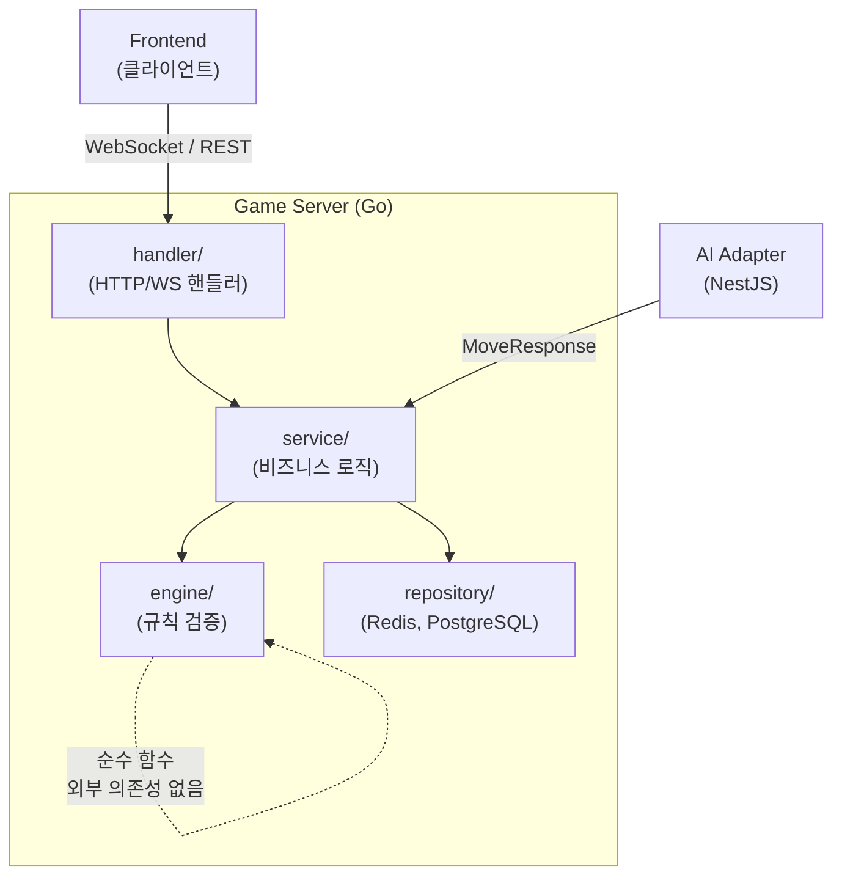

| 항목 | 설명 |
|------|------|
| 위치 | `src/game-server/internal/engine/` |
| 언어 | Go |
| 의존성 | 없음 (표준 라이브러리만 사용) |
| 성격 | 순수 함수 집합 -- 동일 입력이면 항상 동일 출력 |
| 테스트 | 외부 의존성이 없으므로 단위 테스트만으로 100% 검증 가능 |

### 1.2 입출력 경계

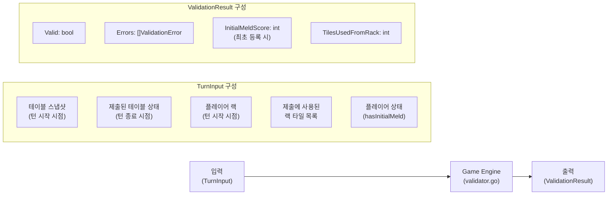

### 1.3 디렉토리 구조

```
src/game-server/internal/engine/
├── tile.go              # 타일 도메인 모델, 인코딩/디코딩, TilePool
├── tile_test.go         # 타일 모듈 테스트
├── group.go             # 그룹(Group) 검증
├── group_test.go        # 그룹 검증 테스트
├── run.go               # 런(Run) 검증
├── run_test.go          # 런 검증 테스트
├── validator.go         # 유효성 검증 총괄 (V-01~V-15)
├── validator_test.go    # 검증기 테스트
├── score.go             # 점수 계산, ELO 레이팅
├── score_test.go        # 점수 계산 테스트
├── snapshot.go          # 스냅샷 비교, 타일 보존 검증
├── snapshot_test.go     # 스냅샷 테스트
└── errors.go            # 검증 에러 코드 정의
```

---

## 2. 타일 모듈 (tile.go) 상세설계

### 2.1 Tile 구조체

```go
package engine

// Color 타일 색상을 나타내는 타입
type Color string

const (
    Red    Color = "R"
    Blue   Color = "B"
    Yellow Color = "Y"
    Black  Color = "K"
)

// AllColors 가능한 모든 색상 (순서 보장)
var AllColors = []Color{Red, Blue, Yellow, Black}

// Set 동일 타일 구분용 세트 식별자
type Set string

const (
    SetA Set = "a"
    SetB Set = "b"
)

// Tile 게임 타일을 나타내는 도메인 모델
type Tile struct {
    Color   Color  // R, B, Y, K (조커이면 빈 문자열)
    Number  int    // 1~13 (조커이면 0)
    Set     Set    // a, b (조커이면 빈 문자열)
    IsJoker bool   // true이면 조커
    Code    string // 원본 인코딩 문자열 (예: "R7a", "JK1")
}
```

### 2.2 타일 인코딩/디코딩

타일 코드 문자열과 Tile 구조체 사이의 변환을 담당한다.

```go
// ParseTile 문자열 코드를 Tile 구조체로 변환한다.
// 유효하지 않은 코드이면 error를 반환한다.
//
// 예시:
//   ParseTile("R7a")  -> Tile{Color: Red, Number: 7, Set: SetA, Code: "R7a"}
//   ParseTile("JK1")  -> Tile{IsJoker: true, Code: "JK1"}
//   ParseTile("X99z") -> error
func ParseTile(code string) (Tile, error)

// EncodeTile Tile 구조체를 문자열 코드로 변환한다.
// 조커이면 "JK1" 또는 "JK2"를 반환한다.
func EncodeTile(t Tile) string

// ParseTiles 문자열 코드 슬라이스를 Tile 슬라이스로 변환한다.
// 하나라도 유효하지 않으면 error를 반환한다.
func ParseTiles(codes []string) ([]Tile, error)
```

**인코딩 규칙 정규표현식**:

```
숫자 타일: ^[RBYK](1[0-3]|[1-9])[ab]$
조커:     ^JK[12]$
```

**파싱 로직 순서도**:

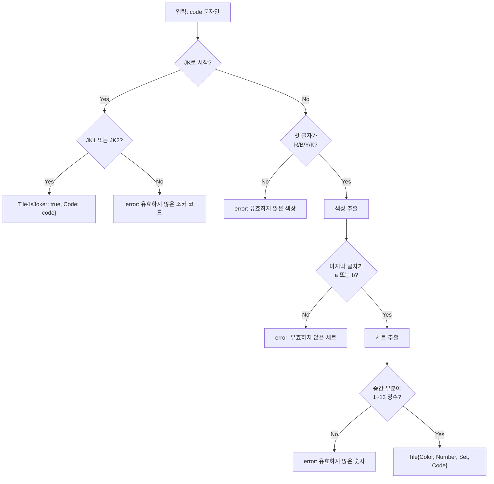

### 2.3 TilePool -- 타일 풀 관리

게임 시작 시 106장의 타일을 생성하고 셔플하여 플레이어에게 분배한다.

```go
// TilePool 전체 타일 풀(106장)을 관리한다.
type TilePool struct {
    tiles []Tile // 현재 남은 타일 (셔플된 상태)
}

// NewTilePool 106장의 타일을 생성한다.
// 4색 x 13숫자 x 2세트(a,b) = 104장 + 조커 2장 = 106장
func NewTilePool() *TilePool

// Shuffle Fisher-Yates 알고리즘으로 타일을 무작위 섞는다.
// 시드는 crypto/rand 기반으로 설정하여 편향 없는 셔플을 보장한다.
func (p *TilePool) Shuffle()

// Deal 지정 수만큼 타일을 풀에서 꺼내 반환한다.
// 풀에 남은 타일이 부족하면 가능한 만큼만 반환한다.
func (p *TilePool) Deal(count int) []Tile

// DrawOne 풀에서 타일 1장을 꺼낸다.
// 풀이 비어있으면 nil과 함께 ErrDrawPileEmpty를 반환한다.
func (p *TilePool) DrawOne() (*Tile, error)

// Remaining 남은 타일 수를 반환한다.
func (p *TilePool) Remaining() int
```

**타일 생성 과정**:

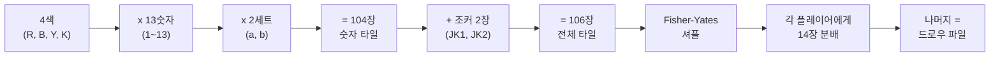

**Fisher-Yates 셔플 의사 코드**:

```go
// Fisher-Yates (Knuth) Shuffle
// 시간 복잡도: O(n), 공간 복잡도: O(1) in-place
func (p *TilePool) Shuffle() {
    n := len(p.tiles)
    for i := n - 1; i > 0; i-- {
        j := cryptoRandInt(i + 1) // [0, i] 범위의 균등 분포 난수
        p.tiles[i], p.tiles[j] = p.tiles[j], p.tiles[i]
    }
}
```

### 2.4 점수 계산 메서드

```go
// Score 타일의 점수 값을 반환한다.
// 숫자 타일: 해당 숫자 (1~13)
// 조커: 30
func (t Tile) Score() int

// ScoreAs 조커가 특정 타일을 대체할 때의 점수를 반환한다.
// 조커가 아니면 자기 점수를 반환한다.
// 최초 등록 시 조커의 점수 계산에 사용한다.
func (t Tile) ScoreAs(representedNumber int) int

// SumScore 타일 슬라이스의 총 점수를 계산한다.
func SumScore(tiles []Tile) int
```

---

## 3. 그룹 검증 (group.go) 상세설계

### 3.1 인터페이스

```go
// ValidateGroup 타일 세트가 유효한 그룹인지 검증한다.
//
// 그룹 조건:
//   - 타일 수: 3장 이상 4장 이하 (V-02)
//   - 조커를 제외한 모든 타일의 숫자가 동일 (V-01)
//   - 모든 타일의 색상이 서로 다름 -- 같은 색 중복 불가 (V-14)
//
// 반환값:
//   - valid: 유효한 그룹이면 true
//   - score: 그룹의 합산 점수 (최초 등록 판정용)
//   - err: 검증 실패 사유 (ValidationError)
func ValidateGroup(tiles []Tile) (valid bool, score int, err *ValidationError)
```

### 3.2 검증 로직 플로우

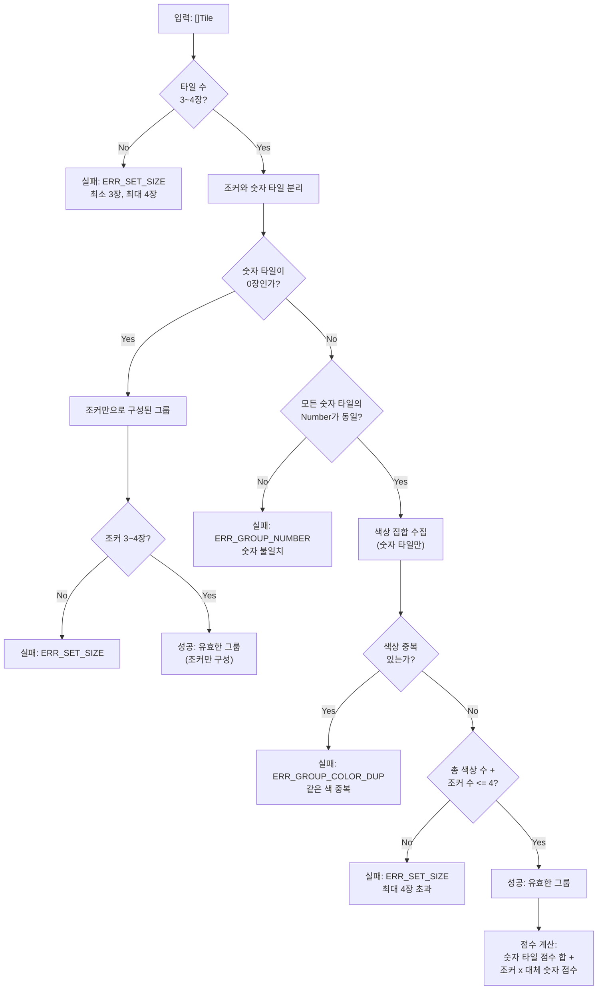

### 3.3 조커 처리 상세

그룹에서 조커는 **아직 사용되지 않은 색상**의 같은 숫자 타일을 대체한다.

```go
// resolveGroupJokers 그룹 내 조커가 대체하는 숫자를 결정한다.
// 그룹에서 조커는 해당 숫자의 미사용 색상을 대체하므로,
// 대체 숫자는 그룹의 기본 숫자와 동일하다.
// 반환: 각 조커가 대체하는 숫자 값
func resolveGroupJokers(tiles []Tile) []int
```

**점수 계산 예시**:

| 그룹 | 조커 대체 | 점수 |
|------|-----------|------|
| `[R7a, B7a, K7b]` | - | 7+7+7 = 21 |
| `[R5a, B5a, Y5a, K5b]` | - | 5+5+5+5 = 20 |
| `[R3a, JK1, Y3a]` | JK1 -> 3점 (B3 or K3 대체) | 3+3+3 = 9 |
| `[JK1, JK2, R10a]` | JK1 -> 10점, JK2 -> 10점 | 10+10+10 = 30 |

### 3.4 에지 케이스

| 케이스 | 입력 | 판정 | 사유 |
|--------|------|------|------|
| 2장 그룹 | `[R7a, B7a]` | 무효 | 최소 3장 미달 |
| 5장 그룹 | `[R7a, B7a, Y7a, K7b, JK1]` | 무효 | 최대 4장 초과 |
| 같은 색 2장 | `[R7a, R7b, B7a]` | 무효 | 같은 색(R) 중복 |
| 숫자 불일치 | `[R7a, B8a, K7b]` | 무효 | 숫자가 7, 8로 다름 |
| 조커만 3장 | `[JK1, JK2, ...]` | 특수 | 조커 2장 + 숫자 1장 이상 필요 (조커만은 유효하지 않음) |
| 조커 + 1색 | `[R7a, JK1, JK2]` | 유효 | R7 + 미사용 2색 대체 |

> **설계 결정**: 조커만으로 구성된 세트는 **무효**로 처리한다. 조커가 대체할 구체적인 숫자를 결정할 수 없으므로, 최소 1장 이상의 숫자 타일이 포함되어야 한다. 이는 런에도 동일하게 적용된다.

---

## 4. 런 검증 (run.go) 상세설계

### 4.1 인터페이스

```go
// ValidateRun 타일 세트가 유효한 런인지 검증한다.
//
// 런 조건:
//   - 타일 수: 3장 이상 (상한 없음, 최대 13장) (V-02)
//   - 조커를 제외한 모든 타일의 색상이 동일 (V-01)
//   - 숫자가 연속 (조커로 빈 자리 대체 가능) (V-15)
//   - 1과 13은 순환하지 않음 (V-15)
//   - 숫자 범위: 1~13 (V-15)
//
// 반환값:
//   - valid: 유효한 런이면 true
//   - score: 런의 합산 점수 (최초 등록 판정용, 조커 위치 기준)
//   - err: 검증 실패 사유 (ValidationError)
func ValidateRun(tiles []Tile) (valid bool, score int, err *ValidationError)
```

### 4.2 검증 로직 플로우

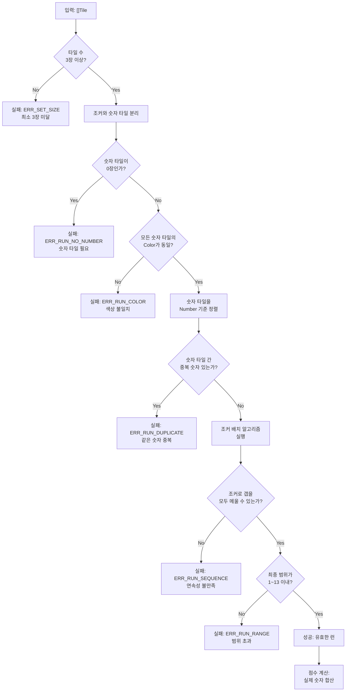

### 4.3 조커 위치 결정 알고리즘

런에서 조커가 들어갈 위치를 결정하는 알고리즘이다. 핵심은 **조커를 갭(gap)에 배치**하고, 남은 조커는 양 끝에 배치하는 것이다.

```go
// resolveRunJokerPositions 런에서 조커의 위치(숫자)를 결정한다.
//
// 알고리즘:
//   1. 숫자 타일을 오름차순 정렬
//   2. 인접 숫자 타일 사이의 갭을 계산
//   3. 갭을 조커로 메운다 (갭 > 조커 수이면 실패)
//   4. 남은 조커는 양 끝에 배치 (앞쪽 우선, 1 미만 불가이면 뒤쪽)
//   5. 최종 범위가 1~13 이내인지 확인
//
// 반환:
//   - positions: 조커가 대체하는 숫자 목록
//   - valid: 조커 배치가 가능하면 true
func resolveRunJokerPositions(numberTiles []Tile, jokerCount int) (positions []int, valid bool)
```

**알고리즘 상세 순서도**:

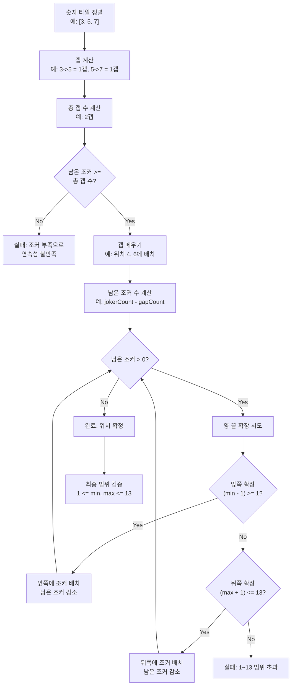

**조커 위치 결정 예시**:

| 런 | 숫자 타일 | 조커 수 | 갭 | 조커 위치 | 최종 런 | 점수 |
|----|-----------|---------|-----|-----------|---------|------|
| `[R3a, R4a, R5a]` | [3,4,5] | 0 | 없음 | - | 3-4-5 | 12 |
| `[R3a, JK1, R5a]` | [3,5] | 1 | 1 (위치4) | [4] | 3-4-5 | 12 |
| `[R3a, JK1, R5a, JK2]` | [3,5] | 2 | 1 (위치4) | [4, 6] | 3-4-5-6 | 18 |
| `[K11a, K12b, JK1]` | [11,12] | 1 | 0 | [13] | 11-12-13 | 36 |
| `[JK1, R1a, R2a]` | [1,2] | 1 | 0 | [3] | 1-2-3 | 6 |
| `[R12a, R13a, JK1]` | [12,13] | 1 | 0 | [11] | 11-12-13 | 36 |

> **설계 결정 -- 조커 양 끝 배치 우선순위**: 갭을 모두 메운 후 남은 조커는 뒤쪽(큰 숫자 방향)에 먼저 배치한다. 뒤쪽이 13을 초과하면 앞쪽(작은 숫자 방향)에 배치한다. 이는 최초 등록 점수를 최대화하기 위한 것이 아니라, 단순히 유효성 판정만을 위한 것이다. 점수는 확정된 위치 기반으로 계산한다.

### 4.4 에지 케이스

| 케이스 | 입력 | 판정 | 사유 |
|--------|------|------|------|
| 2장 런 | `[R3a, R4a]` | 무효 | 최소 3장 미달 |
| 13-1 순환 | `[R12a, R13a, R1a]` | 무효 | 순환 불가 (V-15) |
| 색상 혼합 | `[R3a, B4a, R5a]` | 무효 | 색상 불일치 |
| 비연속 | `[R3a, R5a, R7a]` | 무효 | 갭 2개, 조커 0개 |
| 13장 풀런 | `[R1a, R2a, ..., R13a]` | 유효 | 최대 길이 런 |
| 조커 2개 갭 | `[R3a, JK1, JK2, R6a]` | 유효 | 4, 5 위치에 조커 |
| 범위 초과 | `[R12a, R13a, JK1, JK2]` | 무효* | 14, 15는 존재하지 않음 |
| 같은 숫자 중복 | `[R3a, R3b, R4a]` | 무효 | 런에서 같은 숫자 불가 |

> *범위 초과 케이스에서 `[R12a, R13a, JK1, JK2]`는 조커를 앞쪽에 배치하면 `[10, 11, 12, 13]`으로 유효할 수 있다. 알고리즘은 뒤쪽 배치가 불가능하면 앞쪽에 배치를 시도한다.

---

## 5. 유효성 검증기 (validator.go) 상세설계

### 5.1 핵심 구조체

```go
// TileSet 테이블 위의 타일 세트 하나를 나타낸다.
type TileSet struct {
    ID    string // 세트 식별자 (예: "group-1", "run-3")
    Tiles []Tile // 세트에 포함된 타일들
    Type  string // "group" 또는 "run" (클라이언트 힌트, 서버가 재검증)
}

// TurnInput 턴 검증에 필요한 모든 입력 데이터
type TurnInput struct {
    // 턴 시작 시점의 테이블 스냅샷
    SnapshotTableSets []TileSet

    // 플레이어가 제출한 테이블 최종 상태
    SubmittedTableSets []TileSet

    // 플레이어가 랙에서 사용했다고 선언한 타일 목록
    TilesFromRack []Tile

    // 턴 시작 시점의 플레이어 랙
    PlayerRack []Tile

    // 최초 등록 완료 여부
    HasInitialMeld bool

    // 게임 설정
    InitialMeldThreshold int // 최초 등록 최소 점수 (기본 30)
}

// ValidationResult 검증 결과
type ValidationResult struct {
    Valid            bool              // 전체 유효 여부
    Errors           []ValidationError // 검증 실패 목록
    InitialMeldScore int              // 최초 등록 시 합산 점수 (해당 시에만)
    TilesUsedFromRack int             // 랙에서 사용된 타일 수
}

// ValidationError 개별 검증 오류
type ValidationError struct {
    Code    string // 에러 코드 (예: "ERR_INVALID_SET")
    Message string // 사람이 읽을 수 있는 메시지
    SetID   string // 문제가 된 세트 ID (해당 시)
    Details map[string]interface{} // 추가 정보
}
```

### 5.2 ValidateTurn -- 턴 전체 검증

턴 확정(confirm) 시 호출되는 최상위 검증 함수이다. V-01~V-15를 순차 적용한다.

```go
// ValidateTurn 턴 전체를 검증한다.
// 모든 검증을 수행하고, 하나라도 실패하면 Valid=false를 반환한다.
// 복수의 에러가 있을 수 있으며, 모든 에러를 수집하여 반환한다.
func ValidateTurn(input TurnInput) ValidationResult
```

**검증 순서와 V-규칙 매핑**:

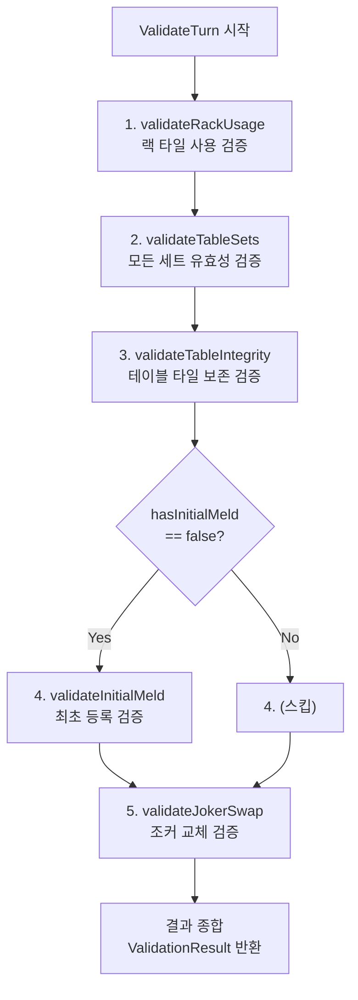

### 5.3 V-규칙과 함수 매핑 표

| ID | 검증 항목 | 담당 함수 | 검증 시점 | 에러 코드 |
|----|-----------|-----------|-----------|-----------|
| V-01 | 세트가 유효한 그룹 또는 런인가 | `validateTableSets` -> `ValidateGroup` / `ValidateRun` | 턴 확정 | `ERR_INVALID_SET` |
| V-02 | 세트가 3장 이상인가 | `ValidateGroup` / `ValidateRun` | 턴 확정 | `ERR_SET_SIZE` |
| V-03 | 랙에서 최소 1장 추가했는가 | `validateRackUsage` | 턴 확정 | `ERR_NO_RACK_TILE` |
| V-04 | 최초 등록 30점 이상인가 | `validateInitialMeld` | 최초 배치 | `ERR_INITIAL_MELD_SCORE` |
| V-05 | 최초 등록 시 랙 타일만 사용했는가 | `validateInitialMeld` | 최초 배치 | `ERR_INITIAL_MELD_SOURCE` |
| V-06 | 테이블 타일이 유실되지 않았는가 | `validateTableIntegrity` | 턴 확정 | `ERR_TABLE_TILE_MISSING` |
| V-07 | 조커 교체 후 즉시 사용했는가 | `validateJokerSwap` | 턴 확정 | `ERR_JOKER_NOT_USED` |
| V-08 | 자기 턴인가 | `turn_service.go` (엔진 외부) | 액션 수신 | `ERR_NOT_YOUR_TURN` |
| V-09 | 턴 타임아웃 초과인가 | `turn_service.go` (엔진 외부) | 타이머 만료 | (자동 드로우) |
| V-10 | 드로우 파일이 비어있는가 | `turn_service.go` (엔진 외부) | 드로우 시 | (패스 처리) |
| V-11 | 교착 상태인가 | `game_service.go` (엔진 외부) | 매 턴 종료 | (점수 비교) |
| V-12 | 승리 조건 달성인가 | `game_service.go` (엔진 외부) | 배치 적용 후 | (게임 종료) |
| V-13 | 재배치 권한이 있는가 | `validateInitialMeld` | 재배치 시도 | `ERR_NO_REARRANGE_PERM` |
| V-14 | 그룹에서 같은 색상 중복 | `ValidateGroup` | 턴 확정 | `ERR_GROUP_COLOR_DUP` |
| V-15 | 런에서 숫자 연속/순환 불가 | `ValidateRun` | 턴 확정 | `ERR_RUN_SEQUENCE` |

> **V-08~V-12**는 Game Engine이 아닌 service 레이어에서 처리한다. Engine은 순수 규칙 검증만 담당하고, 턴 순서, 타이머, 게임 상태 전이 등 런타임 로직은 service에서 관리한다.

### 5.4 validateTableSets -- 세트 유효성 검증

```go
// validateTableSets 제출된 테이블의 모든 세트가 유효한지 검증한다.
// 각 세트는 그룹 또는 런 중 하나여야 한다.
// 클라이언트가 type 힌트를 보내지만, 서버는 양쪽 모두 검증하여 판정한다.
func validateTableSets(sets []TileSet) []ValidationError
```

**세트 타입 판정 로직**:

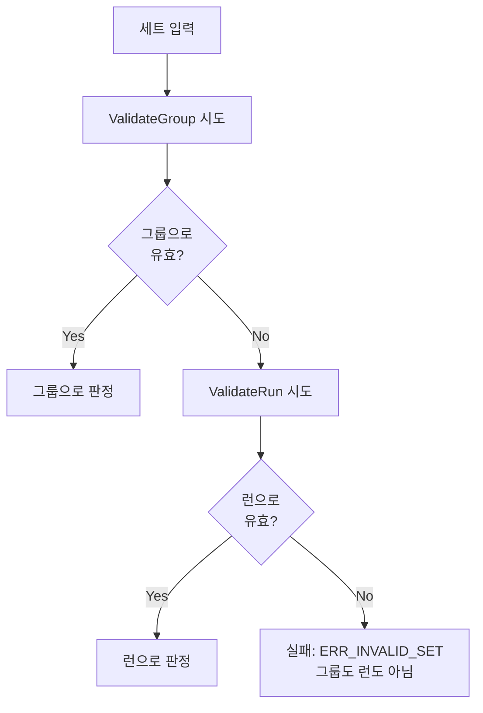

> **클라이언트 힌트 무시**: 클라이언트가 `type: "group"`으로 보내도 서버는 그룹과 런 양쪽 모두 시도한다. 하나라도 통과하면 유효한 세트로 인정한다. 이는 LLM 신뢰 금지 원칙과 일맥상통한다.

### 5.5 validateInitialMeld -- 최초 등록 검증

```go
// validateInitialMeld 최초 등록 조건을 검증한다.
//
// 조건:
//   - 모든 제출 타일이 플레이어 랙에서 온 것인가 (V-05)
//   - 테이블 기존 타일 재배치 없이 순수 랙 타일만 사용 (V-05, V-13)
//   - 제출된 세트들의 점수 합산이 threshold 이상인가 (V-04)
//
// 반환: 에러 목록, 합산 점수
func validateInitialMeld(input TurnInput) ([]ValidationError, int)
```

**최초 등록 검증 플로우**:

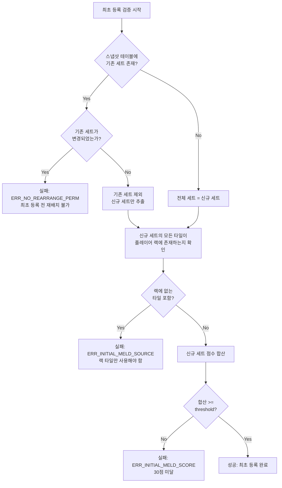

### 5.6 validateTableIntegrity -- 테이블 타일 보존 검증

```go
// validateTableIntegrity 턴 전후 테이블 타일이 보존되는지 검증한다.
//
// 규칙:
//   - 스냅샷 테이블에 있던 모든 타일이 제출 테이블에도 존재해야 한다 (V-06)
//   - 타일은 세트 간 이동할 수 있지만, 테이블에서 사라지면 안 된다
//   - 예외: 조커 교체 시 조커가 테이블에서 랙으로 이동할 수 있다 (V-07과 연계)
//
// 비교 방식: 타일 코드 기반 multiset 비교
func validateTableIntegrity(snapshot, submitted []TileSet) []ValidationError
```

**multiset 비교 알고리즘**:

```go
// 의사 코드
func validateTableIntegrity(snapshot, submitted []TileSet) []ValidationError {
    // 1. 스냅샷의 모든 타일 코드를 multiset(map[string]int)으로 수집
    snapshotCounts := collectTileCounts(snapshot)

    // 2. 제출의 모든 타일 코드를 multiset으로 수집
    submittedCounts := collectTileCounts(submitted)

    // 3. 스냅샷에 있지만 제출에 없는 타일 = 유실 타일
    for code, count := range snapshotCounts {
        if submittedCounts[code] < count {
            // 유실 감지 (조커 교체 예외는 validateJokerSwap에서 처리)
            missing = append(missing, code)
        }
    }

    // 4. 유실 타일이 있으면 에러
    return errors
}
```

### 5.7 validateJokerSwap -- 조커 교체 검증

```go
// validateJokerSwap 조커 교체 규칙을 검증한다.
//
// 조건:
//   - 스냅샷 테이블에 있던 조커가 제출 테이블에서 사라졌다면,
//     해당 조커는 반드시 제출 테이블의 다른 세트에서 사용되어야 한다 (V-07)
//   - 조커가 랙에 보류된 채로 턴이 끝나면 안 된다
//
// 검증 방식:
//   1. 스냅샷에서 조커가 있던 위치 추적
//   2. 제출에서 해당 조커가 어디에 사용되었는지 확인
//   3. 조커가 랙에 남아있는지 (tilesFromRack에 조커가 없지만 테이블에서 사라진 경우) 확인
func validateJokerSwap(input TurnInput) []ValidationError
```

**조커 교체 검증 시나리오**:

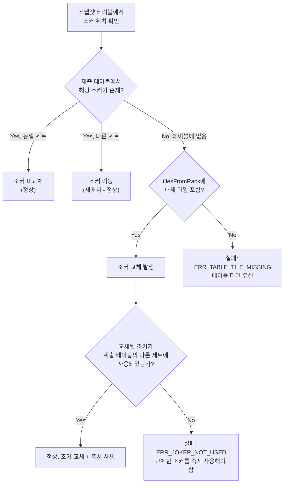

---

## 6. 턴 관리 모듈 (turn_service.go 연계)

턴 관리는 Engine 외부의 service 레이어에서 처리하며, Engine을 호출하여 검증을 수행한다.

### 6.1 턴 시작/종료 플로우

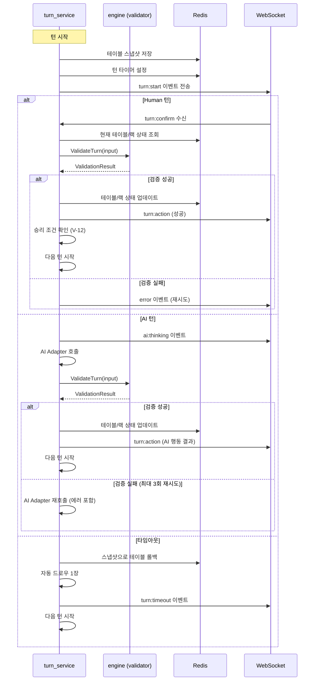

### 6.2 턴 타이머 처리

턴 타이머는 Go의 `time.AfterFunc`를 사용하여 구현한다. Redis에 만료 시각을 기록하여 서버 재시작 시 복구한다.

```go
// TurnTimer 턴 타이머 관리
type TurnTimer struct {
    gameID    string
    timer     *time.Timer
    expiresAt time.Time
}

// StartTurnTimer 턴 타이머를 시작한다.
// 1. Redis에 만료 시각(Unix ms) 저장
// 2. time.AfterFunc로 콜백 등록
// 3. 타임아웃 시 onTimeout 콜백 실행
func (s *TurnService) StartTurnTimer(gameID string, timeoutSec int, onTimeout func())

// CancelTurnTimer 턴이 정상 종료되면 타이머를 취소한다.
func (s *TurnService) CancelTurnTimer(gameID string)

// RestoreTurnTimer 서버 재시작 시 Redis의 만료 시각을 읽어 타이머를 복구한다.
func (s *TurnService) RestoreTurnTimer(gameID string, onTimeout func())
```

### 6.3 AI 턴 vs Human 턴 분기

```go
// ProcessTurn 현재 플레이어의 턴을 처리한다.
func (s *TurnService) ProcessTurn(gameID string, seatOrder int) {
    player := s.getPlayer(gameID, seatOrder)

    switch {
    case player.IsHuman():
        // Human: WebSocket으로 turn:start 이벤트 전송 후 입력 대기
        s.broadcastTurnStart(gameID, seatOrder)
        s.StartTurnTimer(gameID, s.settings.TurnTimeoutSec, func() {
            s.handleTimeout(gameID, seatOrder)
        })

    case player.IsAI():
        // AI: AI Adapter에 행동 요청
        s.broadcastAIThinking(gameID, seatOrder)
        s.requestAIMove(gameID, seatOrder, 0) // retryCount = 0
    }
}
```

### 6.4 재배치 실패 시 패널티 처리

```go
// handleRearrangeFailure 재배치 검증 실패 시 패널티를 적용한다.
//
// 처리 순서:
//   1. 테이블을 턴 시작 스냅샷으로 롤백
//   2. 드로우 파일에서 3장 패널티 드로우
//   3. 턴 강제 종료
//   4. 패널티 이벤트 전송
func (s *TurnService) handleRearrangeFailure(gameID string, seatOrder int)
```

> **패널티 드로우 조건**: 게임 규칙 설계(06-game-rules.md) 6.1항에 따라 재배치 실패 시 패널티 드로우 3장을 부과한다. 드로우 파일에 3장 미만이면 가능한 만큼만 드로우한다.

---

## 7. 점수 계산 모듈 (score.go)

### 7.1 게임 종료 점수 계산

```go
// GameResult 게임 종료 시 각 플레이어의 결과
type GameResult struct {
    Players []PlayerResult
    Winner  int // 승자 seat order (-1이면 무승부)
    EndType string // "NORMAL", "STALEMATE", "CANCELLED"
}

// PlayerResult 개별 플레이어 결과
type PlayerResult struct {
    SeatOrder    int
    RemainingTiles []Tile
    Score        int    // 남은 타일 점수 합산 (승자는 0)
    IsWinner     bool
}

// CalculateGameResult 게임 종료 시 결과를 계산한다.
//
// 정상 종료: 랙 타일 0장인 플레이어가 승자 (점수 0)
// 교착 상태: 남은 타일 점수 합이 가장 적은 플레이어가 승자
// 패자 점수: 남은 타일 숫자 합산 (조커는 30점)
func CalculateGameResult(players []PlayerState, endType string) GameResult
```

**점수 계산 플로우**:

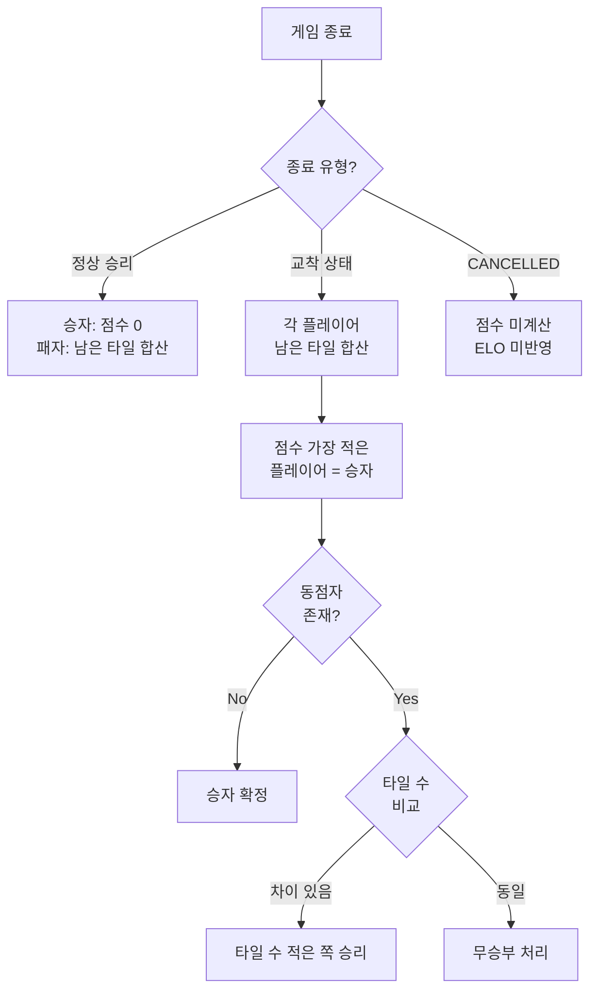

### 7.2 ELO 레이팅 업데이트

```go
// ELOUpdate ELO 변동 정보
type ELOUpdate struct {
    UserID          string
    RatingBefore    int
    RatingAfter     int
    RatingDelta     int
    KFactor         int
    OpponentAvgRating int
}

// CalculateELO ELO 레이팅 변동을 계산한다.
//
// 공식: 새 레이팅 = 현재 레이팅 + K * (실제 결과 - 기대 결과)
// 기대 결과 = 1 / (1 + 10^((상대 평균 - 내 레이팅) / 400))
//
// K-factor 결정:
//   - 총 게임 수 < 30: K=40 (신규, 빠른 수렴)
//   - ELO >= 1800: K=24 (고랭크, 안정화)
//   - 그 외: K=32 (기본)
//
// 다인전(3~4인) 처리:
//   승자 vs 각 패자에 대해 1:1 ELO 변동을 계산하고 평균한다.
func CalculateELO(players []ELOPlayer, winnerSeat int) []ELOUpdate

// determineKFactor K-factor를 결정한다.
func determineKFactor(currentRating int, totalGames int) int

// expectedScore 기대 결과를 계산한다.
func expectedScore(myRating, opponentRating int) float64
```

**ELO 계산 예시 (2인전)**:

```
Player A: ELO 1200, 총 게임 50회 -> K=32
Player B: ELO 1000, 총 게임 10회 -> K=40

기대 결과 (A 관점): 1 / (1 + 10^((1000-1200)/400)) = 0.76
기대 결과 (B 관점): 1 / (1 + 10^((1200-1000)/400)) = 0.24

A 승리 시:
  A: 1200 + 32 * (1.0 - 0.76) = 1200 + 7.68 = 1208
  B: 1000 + 40 * (0.0 - 0.24) = 1000 - 9.60 = 990

B 승리 시 (이변):
  A: 1200 + 32 * (0.0 - 0.76) = 1200 - 24.32 = 1176
  B: 1000 + 40 * (1.0 - 0.24) = 1000 + 30.40 = 1030
```

**ELO 계산 예시 (4인전, A 승리)**:

```
A(1200) vs B(1000): delta_AB = +7.68
A(1200) vs C(1100): delta_AC = +5.44
A(1200) vs D(1300): delta_AD = +12.16

A 최종 delta = (7.68 + 5.44 + 12.16) / 3 = +8.43
-> A: 1200 + 8 = 1208 (반올림)
```

### 7.3 교착 상태 판정

```go
// StalemateChecker 교착 상태를 판정한다.
type StalemateChecker struct {
    DrawPileExhausted    bool // 드로우 파일 소진 여부
    ConsecutivePassCount int  // 연속 패스/드로우 횟수
    PlayerCount          int  // 현재 활성 플레이어 수
}

// IsStalemate 교착 상태인지 판정한다.
//
// 조건: 드로우 파일 소진 + 전체 플레이어가 1라운드(playerCount 턴) 동안 모두 패스
func (c *StalemateChecker) IsStalemate() bool {
    return c.DrawPileExhausted && c.ConsecutivePassCount >= c.PlayerCount
}

// ResetOnPlacement 타일 배치가 발생하면 연속 패스 카운터를 초기화한다.
func (c *StalemateChecker) ResetOnPlacement()
```

---

## 8. 스냅샷 관리 (snapshot.go)

### 8.1 턴 스냅샷

```go
// TableSnapshot 턴 시작 시점의 테이블 상태 스냅샷
type TableSnapshot struct {
    GameID    string
    TurnNumber int
    TableSets []TileSet // 테이블 위 세트들의 복사본
    CapturedAt time.Time
}

// CaptureSnapshot 현재 테이블 상태를 깊은 복사하여 스냅샷을 생성한다.
func CaptureSnapshot(gameID string, turnNumber int, tableSets []TileSet) TableSnapshot

// RestoreSnapshot 스냅샷으로 테이블 상태를 복원한다.
// 검증 실패 시 롤백에 사용한다.
func RestoreSnapshot(snapshot TableSnapshot) []TileSet
```

### 8.2 스냅샷 비교 -- 타일 보존 검증

```go
// CompareTileSets 두 타일 세트 집합의 타일 구성을 비교한다.
//
// 반환:
//   - added: 제출에만 있는 타일 (랙에서 추가된 타일)
//   - removed: 스냅샷에만 있는 타일 (유실된 타일, 조커 교체 제외)
//   - unchanged: 양쪽 모두 있는 타일
func CompareTileSets(snapshot, submitted []TileSet) (added, removed, unchanged []string)
```

### 8.3 복기용 스냅샷 (game_snapshots 테이블)

턴 완료 시 복기용 스냅샷을 PostgreSQL에 비동기 저장한다.

```go
// GameSnapshotRecord 복기용 스냅샷 레코드 (PostgreSQL 저장용)
type GameSnapshotRecord struct {
    ID            string    // UUID
    GameID        string    // FK -> games
    TurnNumber    int
    ActingSeat    int       // 행동한 플레이어 seat (0~3)
    ActionType    string    // PLACE_TILES, DRAW_TILE, REARRANGE, TIMEOUT
    ActionDetail  map[string]interface{} // 수행 액션 상세
    PlayerHands   map[int][]string       // seat -> 타일 코드 목록
    TableState    []TileSet              // 테이블 세트 상태
    DrawPileCount int                    // 남은 드로우 파일 수
    AIDecisionLog string                 // AI 판단 근거 (AI 턴인 경우)
}

// SaveGameSnapshot 복기용 스냅샷을 비동기로 PostgreSQL에 저장한다.
// 게임 진행 성능에 영향을 주지 않도록 goroutine으로 실행한다.
func (r *PostgresRepo) SaveGameSnapshot(record GameSnapshotRecord)
```

**비동기 저장 플로우**:

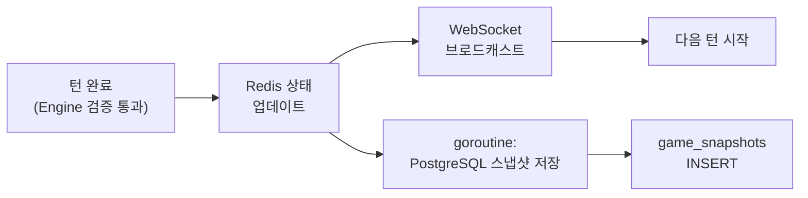

> **goroutine 에러 처리**: PostgreSQL 저장 실패 시 로그를 남기되 게임 진행은 중단하지 않는다. 복기 데이터는 best-effort로 수집한다.

---

## 9. 에러 처리 (errors.go)

### 9.1 검증 에러 코드 정의

```go
package engine

// 검증 에러 코드 상수
const (
    // 세트 유효성 관련
    ErrInvalidSet     = "ERR_INVALID_SET"      // 그룹도 런도 아닌 세트
    ErrSetSize        = "ERR_SET_SIZE"          // 세트 크기 규칙 위반
    ErrGroupNumberMismatch = "ERR_GROUP_NUMBER" // 그룹 내 숫자 불일치
    ErrGroupColorDup  = "ERR_GROUP_COLOR_DUP"   // 그룹 내 같은 색 중복
    ErrRunColor       = "ERR_RUN_COLOR"         // 런 내 색상 불일치
    ErrRunSequence    = "ERR_RUN_SEQUENCE"      // 런 숫자 비연속
    ErrRunRange       = "ERR_RUN_RANGE"         // 런 숫자 범위 초과 (1~13)
    ErrRunDuplicate   = "ERR_RUN_DUPLICATE"     // 런 내 같은 숫자 중복
    ErrRunNoNumber    = "ERR_RUN_NO_NUMBER"     // 런에 숫자 타일 없음

    // 턴 규칙 관련
    ErrNoRackTile     = "ERR_NO_RACK_TILE"      // 랙에서 타일 미추가
    ErrTableTileMissing = "ERR_TABLE_TILE_MISSING" // 테이블 타일 유실
    ErrJokerNotUsed   = "ERR_JOKER_NOT_USED"    // 교체한 조커 미사용

    // 최초 등록 관련
    ErrInitialMeldScore  = "ERR_INITIAL_MELD_SCORE"  // 30점 미달
    ErrInitialMeldSource = "ERR_INITIAL_MELD_SOURCE"  // 랙 외 타일 사용
    ErrNoRearrangePerm   = "ERR_NO_REARRANGE_PERM"   // 재배치 권한 없음

    // 턴 순서 관련 (service 레이어)
    ErrNotYourTurn    = "ERR_NOT_YOUR_TURN"     // 자기 턴이 아님
    ErrDrawPileEmpty  = "ERR_DRAW_PILE_EMPTY"   // 드로우 파일 비어있음
    ErrTurnTimeout    = "ERR_TURN_TIMEOUT"      // 턴 타임아웃

    // 타일 파싱 관련
    ErrInvalidTileCode = "ERR_INVALID_TILE_CODE" // 유효하지 않은 타일 코드
)
```

### 9.2 에러 메시지 한글 매핑

```go
// ErrorMessages 에러 코드 -> 사용자 표시용 한글 메시지
var ErrorMessages = map[string]string{
    ErrInvalidSet:         "유효하지 않은 타일 조합입니다. 그룹 또는 런을 확인하세요.",
    ErrSetSize:            "세트는 최소 3장 이상이어야 합니다.",
    ErrGroupNumberMismatch: "그룹의 모든 타일은 같은 숫자여야 합니다.",
    ErrGroupColorDup:      "그룹에 같은 색상의 타일이 중복됩니다.",
    ErrRunColor:           "런의 모든 타일은 같은 색상이어야 합니다.",
    ErrRunSequence:        "런의 숫자가 연속적이지 않습니다.",
    ErrRunRange:           "런의 숫자가 1~13 범위를 벗어났습니다.",
    ErrRunDuplicate:       "런에 같은 숫자의 타일이 중복됩니다.",
    ErrRunNoNumber:        "런에 숫자 타일이 최소 1장 이상 필요합니다.",
    ErrNoRackTile:         "랙에서 최소 1장 이상의 타일을 내려놓아야 합니다.",
    ErrTableTileMissing:   "테이블에서 타일이 유실되었습니다.",
    ErrJokerNotUsed:       "교체한 조커를 같은 턴 내에 사용해야 합니다.",
    ErrInitialMeldScore:   "최초 등록은 합계 30점 이상이어야 합니다.",
    ErrInitialMeldSource:  "최초 등록은 자신의 랙 타일만 사용해야 합니다.",
    ErrNoRearrangePerm:    "최초 등록 전에는 테이블 재배치가 불가합니다.",
    ErrNotYourTurn:        "자신의 턴이 아닙니다.",
    ErrDrawPileEmpty:      "드로우 파일이 비어있습니다.",
    ErrTurnTimeout:        "턴 시간이 초과되었습니다.",
    ErrInvalidTileCode:    "유효하지 않은 타일 코드입니다.",
}
```

### 9.3 패널티 드로우 정책

| 상황 | 패널티 | 처리 |
|------|--------|------|
| 재배치 검증 실패 | 패널티 드로우 3장 | 스냅샷 롤백 + 3장 드로우 + 턴 종료 |
| AI 3회 연속 무효 수 | 강제 드로우 1장 | 드로우 1장 + 턴 종료 |
| 턴 타임아웃 | 자동 드로우 1장 | 스냅샷 롤백 + 1장 드로우 + 턴 종료 |
| AI 5턴 연속 강제 드로우 | AI 비활성화 | 관리자 카카오톡 알림 |

---

## 10. Go 인터페이스/구조체 종합 정의

### 10.1 전체 패키지 구조

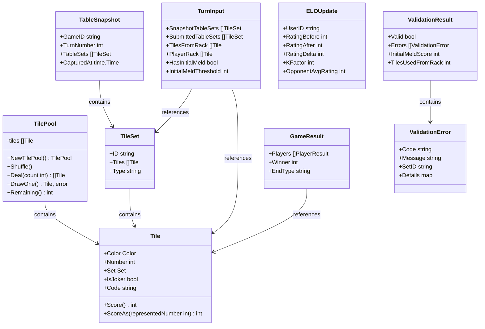

### 10.2 Engine 공개 함수 목록

```go
package engine

// ── tile.go ──
func ParseTile(code string) (Tile, error)
func EncodeTile(t Tile) string
func ParseTiles(codes []string) ([]Tile, error)
func NewTilePool() *TilePool
func SumScore(tiles []Tile) int

// ── group.go ──
func ValidateGroup(tiles []Tile) (valid bool, score int, err *ValidationError)

// ── run.go ──
func ValidateRun(tiles []Tile) (valid bool, score int, err *ValidationError)

// ── validator.go ──
func ValidateTurn(input TurnInput) ValidationResult

// ── score.go ──
func CalculateGameResult(players []PlayerState, endType string) GameResult
func CalculateELO(players []ELOPlayer, winnerSeat int) []ELOUpdate

// ── snapshot.go ──
func CaptureSnapshot(gameID string, turnNumber int, tableSets []TileSet) TableSnapshot
func RestoreSnapshot(snapshot TableSnapshot) []TileSet
func CompareTileSets(snapshot, submitted []TileSet) (added, removed, unchanged []string)
```

### 10.3 Engine과 Service 레이어 경계

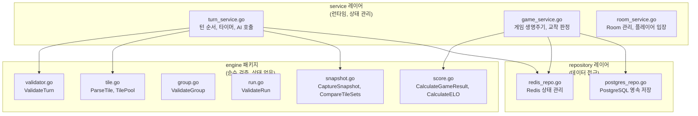

| 역할 | Engine (순수 함수) | Service (런타임) |
|------|-------------------|-----------------|
| V-01~V-07, V-14~V-15 | 담당 | 호출 |
| V-08 (턴 순서) | - | 담당 |
| V-09 (타임아웃) | - | 담당 |
| V-10 (드로우 파일) | - | 담당 |
| V-11 (교착 상태) | - | 담당 |
| V-12 (승리 조건) | - | 담당 |
| V-13 (재배치 권한) | 담당 | 호출 |
| Redis 접근 | 절대 안 함 | 담당 |
| PostgreSQL 접근 | 절대 안 함 | 담당 |
| 테스트 용이성 | mock 불필요 | mock 필요 |

---

## 부록 A. 검증 시나리오 매트릭스

### A.1 그룹 검증 시나리오

| # | 입력 | 기대 결과 | 에러 코드 | 점수 |
|---|------|-----------|-----------|------|
| G-01 | `[R7a, B7a, K7b]` | 유효 | - | 21 |
| G-02 | `[R5a, B5a, Y5a, K5b]` | 유효 | - | 20 |
| G-03 | `[R3a, JK1, Y3a]` | 유효 | - | 9 |
| G-04 | `[R7a, B7a]` | 무효 | ERR_SET_SIZE | - |
| G-05 | `[R7a, R7b, B7a]` | 무효 | ERR_GROUP_COLOR_DUP | - |
| G-06 | `[R7a, B8a, K7b]` | 무효 | ERR_GROUP_NUMBER | - |
| G-07 | `[R7a, B7a, Y7a, K7b, JK1]` | 무효 | ERR_SET_SIZE | - |
| G-08 | `[JK1, JK2, JK1]` | 무효 | ERR_INVALID_TILE_CODE | - |
| G-09 | `[R10a, B10a, K10b]` | 유효 | - | 30 |
| G-10 | `[JK1, R7a, JK2]` | 유효 | - | 21 |

### A.2 런 검증 시나리오

| # | 입력 | 기대 결과 | 에러 코드 | 점수 |
|---|------|-----------|-----------|------|
| R-01 | `[Y3a, Y4a, Y5a]` | 유효 | - | 12 |
| R-02 | `[B9a, B10b, B11a, B12a]` | 유효 | - | 42 |
| R-03 | `[R1a, R2a, R3a]` | 유효 | - | 6 |
| R-04 | `[K11a, K12b, JK1]` | 유효 | - | 36 |
| R-05 | `[R3a, JK1, R5a]` | 유효 | - | 12 |
| R-06 | `[Y3a, Y5a, Y6a]` | 무효 | ERR_RUN_SEQUENCE | - |
| R-07 | `[R12a, R13a, R1a]` | 무효 | ERR_RUN_SEQUENCE | - |
| R-08 | `[R3a, B4a, Y5a]` | 무효 | ERR_RUN_COLOR | - |
| R-09 | `[K7a, K8a]` | 무효 | ERR_SET_SIZE | - |
| R-10 | `[R1a, R2a, ..., R13a]` | 유효 | - | 91 |
| R-11 | `[R3a, R3b, R4a]` | 무효 | ERR_RUN_DUPLICATE | - |

### A.3 턴 검증 종합 시나리오

| # | 시나리오 | hasInitialMeld | 기대 결과 | 관련 V 규칙 |
|---|---------|----------------|-----------|-------------|
| T-01 | 유효 그룹 배치 (최초 등록 30점) | false | 성공 | V-01~V-05 |
| T-02 | 유효 런 배치 (최초 등록 25점) | false | 실패 | V-04 |
| T-03 | 테이블 재배치 + 랙 추가 | true | 성공 | V-01, V-03, V-06 |
| T-04 | 재배치만 (랙 미추가) | true | 실패 | V-03 |
| T-05 | 테이블 타일 유실 | true | 실패 | V-06 |
| T-06 | 최초 등록 전 재배치 시도 | false | 실패 | V-05, V-13 |
| T-07 | 조커 교체 + 즉시 사용 | true | 성공 | V-07 |
| T-08 | 조커 교체 + 미사용 | true | 실패 | V-07 |
| T-09 | 복합 재배치 (분할+합병) | true | 성공 | V-01, V-03, V-06 |
| T-10 | 무효 세트 포함 배치 | true | 실패 | V-01 |

---

## 부록 B. 설계 결정 근거 (ADR)

### B.1 Engine을 순수 함수로 설계한 이유

**결정**: Engine 패키지는 Redis, PostgreSQL 등 외부 의존성을 갖지 않는 순수 함수 집합으로 구현한다.

**근거**:
1. **테스트 용이성**: mock 없이 입력-출력만으로 단위 테스트가 가능하다
2. **성능**: IO 대기 없이 CPU-bound 로직만 수행하므로 빠르다
3. **재사용성**: 서버 외부(CLI 도구, 테스트 유틸)에서도 engine 패키지를 그대로 사용할 수 있다
4. **Go 관례**: 표준 라이브러리의 `encoding/json`, `regexp` 등과 같은 패턴

### B.2 클라이언트 세트 타입 힌트를 신뢰하지 않는 이유

**결정**: 클라이언트가 보낸 `type: "group"` / `type: "run"` 힌트에 관계없이, 서버는 양쪽 모두 시도한다.

**근거**:
1. **LLM 신뢰 금지 원칙**: AI가 잘못된 타입을 지정할 수 있다
2. **Human 입력 오류**: 사용자가 드래그 앤 드롭 과정에서 잘못된 힌트가 생성될 수 있다
3. **관대한 검증**: 하나라도 통과하면 유효한 세트로 인정하여 사용자 경험을 보호한다

### B.3 조커만으로 구성된 세트를 무효로 처리하는 이유

**결정**: 조커만으로 구성된 세트(예: `[JK1, JK2]`, `[JK1, JK2, ...]`)는 무효로 처리한다.

**근거**:
1. 조커가 대체하는 구체적인 숫자와 색상을 결정할 수 없다
2. 점수 계산이 불확정적이다 (최초 등록 시 문제)
3. 실제 루미큐브 규칙에서도 조커만으로 세트를 구성하는 것은 허용되지 않는다

### B.4 ELO 다인전 처리 방식

**결정**: 승자 vs 각 패자에 대해 1:1 ELO 변동을 계산하고 평균한다.

**근거**:
1. 표준 ELO 공식은 1:1 대전 기준이다
2. 다인전을 여러 1:1 대전으로 분해하면 기존 공식을 그대로 활용할 수 있다
3. 평균을 취함으로써 상대 수에 따른 변동폭 차이를 정규화한다
