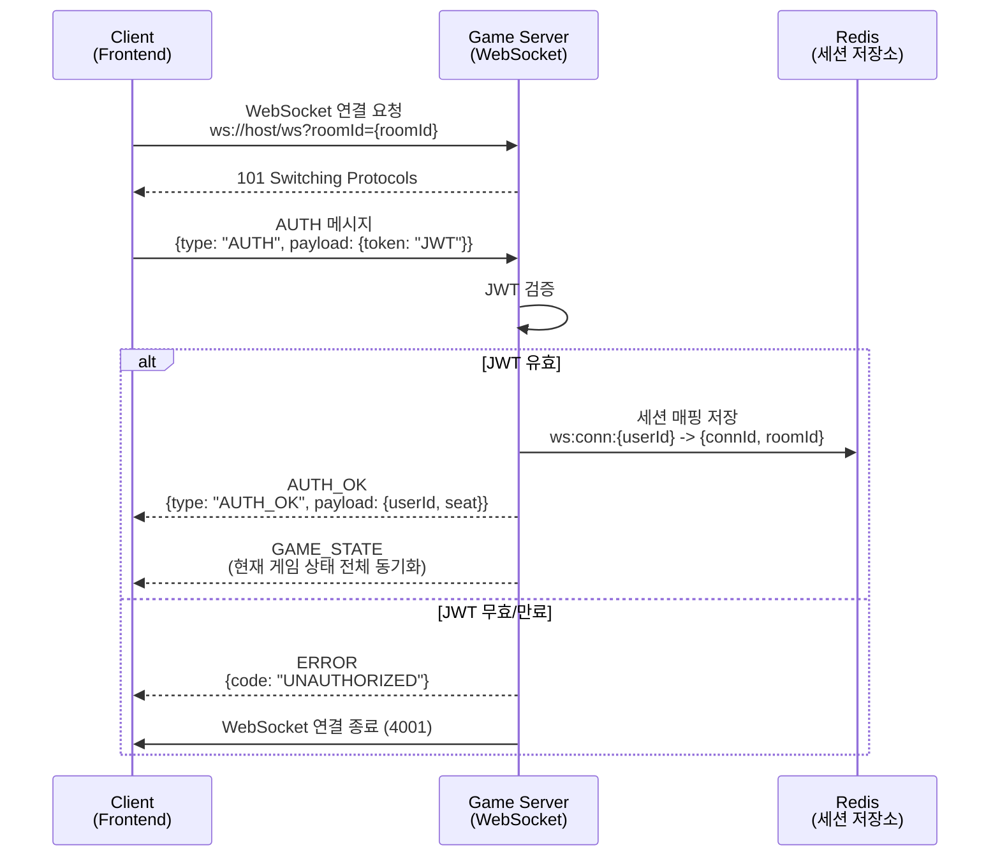
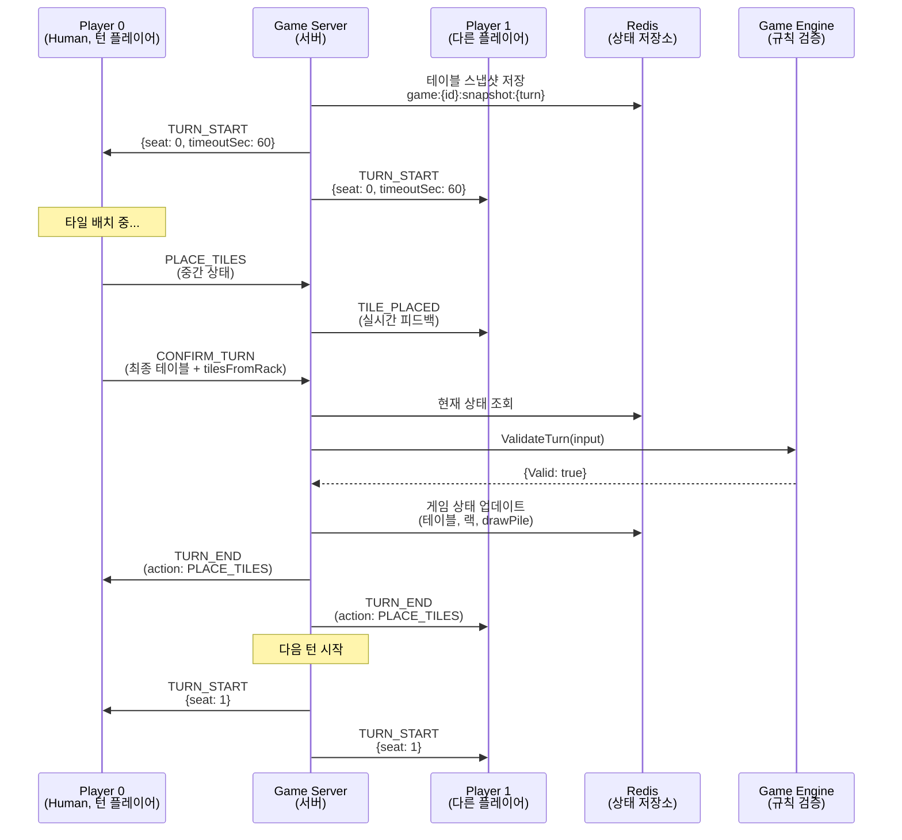
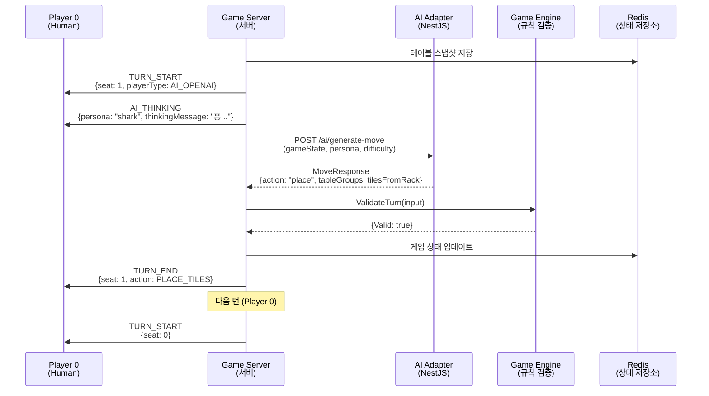
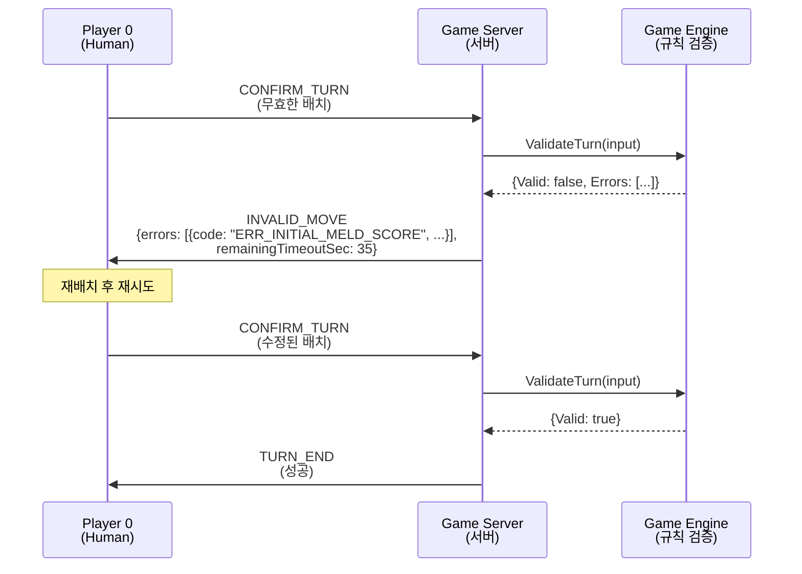
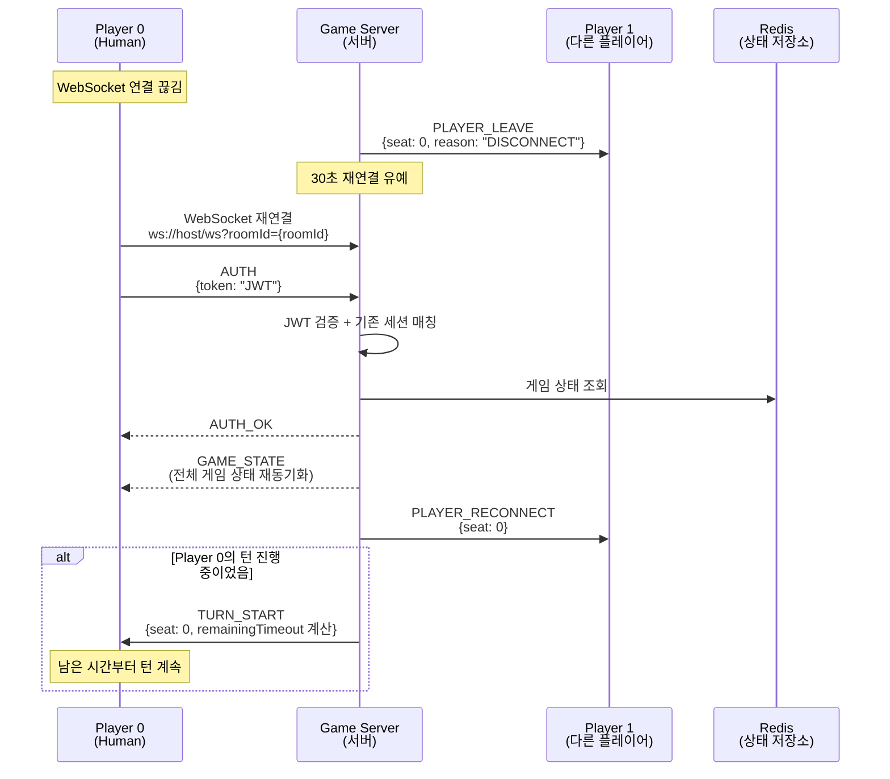
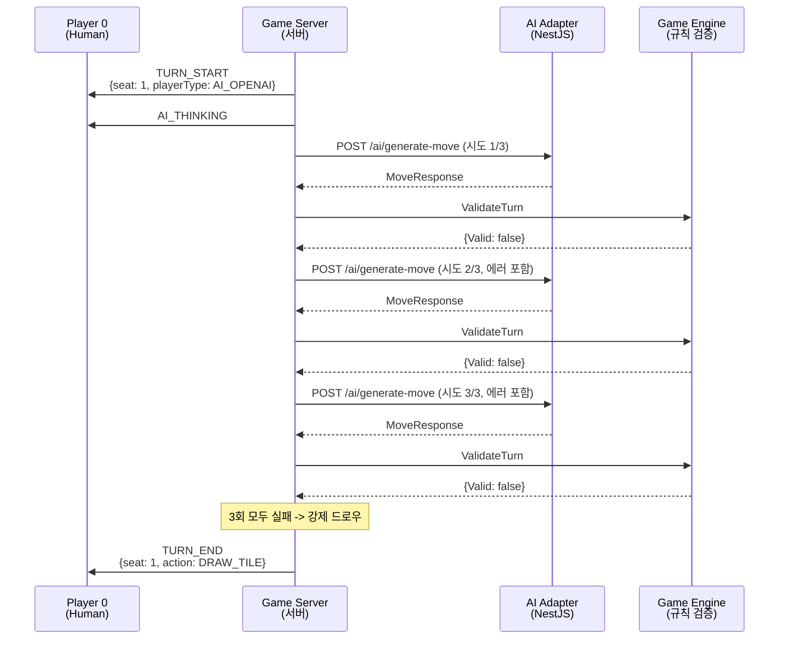
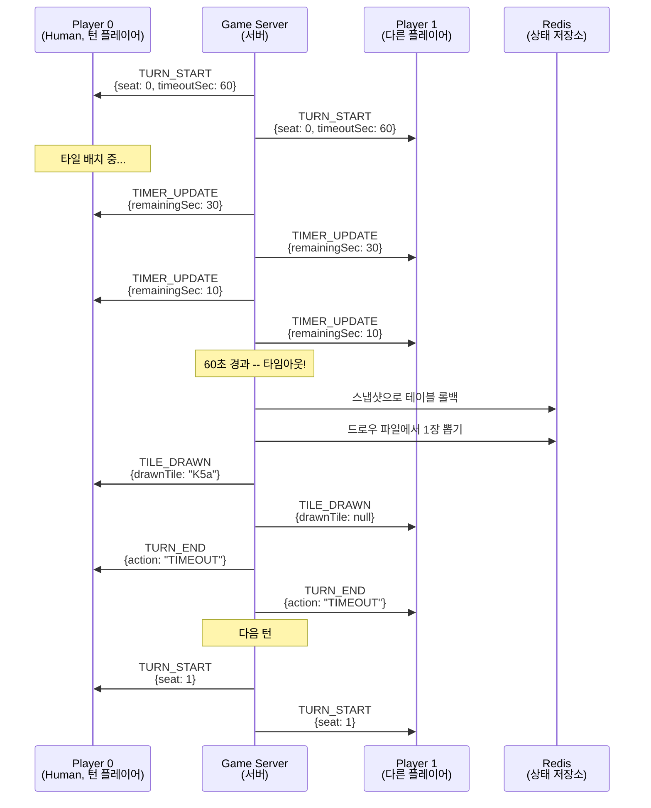
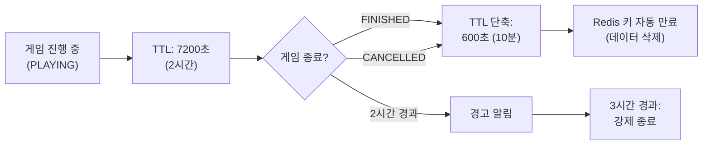
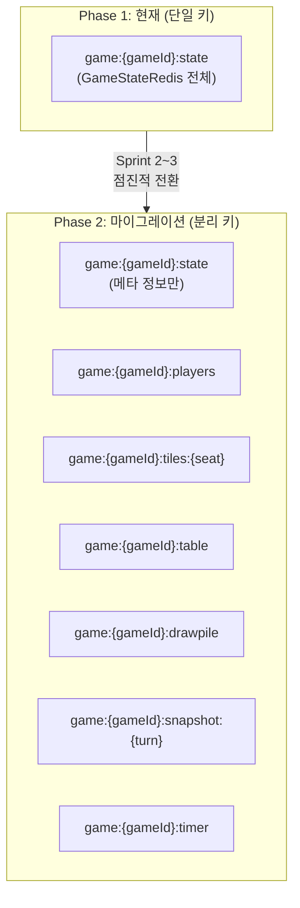

# WebSocket 메시지 프로토콜 및 Redis 게임 상태 직렬화 설계

이 문서는 클라이언트-서버 간 WebSocket 메시지 규격과 Redis에 저장되는 게임 상태 직렬화 포맷을 정의한다.
`03-api-design.md`의 WebSocket 프로토콜 개요를 상세화하고, `05-game-session-design.md`의 Redis 저장소 역할 분담을 구체적인 키/스키마로 구현한다.

---

## 1. WebSocket 연결 관리

### 1.1 연결 수립



**연결 URL**: `ws://host/ws?roomId={roomId}`

- JWT는 URL query가 아닌 첫 번째 메시지(`AUTH`)로 전달한다 (보안 권장 방식, `03-api-design.md` 2.1절 방법 B)
- AUTH 메시지 미수신 시 **5초 후 연결 종료** (4003 Auth Timeout)
- 하위 호환을 위해 URL query 방식도 지원하되, 클라이언트는 AUTH 메시지 방식을 기본으로 사용한다

### 1.2 Heartbeat

```
Client -> Server: PING (30초 간격)
Server -> Client: PONG (즉시 응답)
```

- 클라이언트는 30초 간격으로 `PING`을 전송한다
- 서버는 `PONG`으로 즉시 응답한다
- 서버가 45초간 클라이언트로부터 아무 메시지도 수신하지 못하면 연결 끊김으로 판단한다
- 끊김 후 30초 재연결 유예 (`05-game-session-design.md` 6.1절)

### 1.3 WebSocket 종료 코드

| 코드 | 의미 | 설명 |
|------|------|------|
| 1000 | 정상 종료 | 게임 종료 또는 클라이언트 퇴장 |
| 4001 | 인증 실패 | JWT 무효/만료 |
| 4002 | 방 없음 | roomId에 해당하는 방이 없음 |
| 4003 | 인증 타임아웃 | AUTH 메시지 5초 미수신 |
| 4004 | 중복 연결 | 동일 사용자 중복 접속 (기존 연결 종료) |
| 4005 | 강제 종료 | 관리자 강제 종료 |
| 4006 | 서버 유지보수 | 서버 재시작/배포 |

---

## 2. 메시지 공통 포맷 (Envelope)

모든 WebSocket 메시지는 아래 JSON envelope을 따른다.

```json
{
  "type": "MESSAGE_TYPE",
  "payload": { },
  "seq": 42,
  "timestamp": "2026-03-13T10:30:00.123Z"
}
```

| 필드 | 타입 | 필수 | 설명 |
|------|------|------|------|
| type | string | O | 메시지 타입 (아래 상세 정의) |
| payload | object | O | 메시지 본문 (타입별 상이) |
| seq | integer | O | 메시지 시퀀스 번호 (연결 내 단조 증가, 중복/순서 검증용) |
| timestamp | string (ISO 8601) | O | 메시지 생성 시각 (서버: 서버 시각, 클라이언트: 클라이언트 시각) |

> **seq 규칙**: 클라이언트 전송 메시지의 seq는 클라이언트가 관리한다. 서버 전송 메시지의 seq는 서버가 관리한다. 각각 연결 수립 시 1부터 시작하여 단조 증가한다.

---

## 3. 클라이언트 -> 서버 메시지 (Client-to-Server)

### 3.1 AUTH -- 인증

연결 후 첫 번째로 전송해야 하는 메시지.

```json
{
  "type": "AUTH",
  "payload": {
    "token": "eyJhbGciOiJIUzI1NiIs..."
  },
  "seq": 1,
  "timestamp": "2026-03-13T10:30:00.000Z"
}
```

| 필드 | 타입 | 필수 | 설명 |
|------|------|------|------|
| token | string | O | JWT 액세스 토큰 |

### 3.2 PLACE_TILES -- 타일 배치 (턴 내 중간 상태 전송)

플레이어가 랙에서 타일을 테이블에 올려놓거나 테이블 타일을 재배치할 때 전송한다.
이 메시지는 **턴 내 중간 상태**를 서버에 전달하며, 다른 플레이어에게 실시간 시각 피드백을 제공한다.
최종 적용은 `CONFIRM_TURN`에서 이루어진다.

```json
{
  "type": "PLACE_TILES",
  "payload": {
    "tableGroups": [
      {
        "id": "group-1",
        "tiles": ["R7a", "B7a", "K7b"],
        "type": "group"
      },
      {
        "id": "run-1",
        "tiles": ["Y5a", "Y6a", "Y7b", "Y8a"],
        "type": "run"
      }
    ],
    "tilesFromRack": ["R7a", "Y8a"]
  },
  "seq": 5,
  "timestamp": "2026-03-13T10:31:15.200Z"
}
```

| 필드 | 타입 | 필수 | 설명 |
|------|------|------|------|
| tableGroups | TileGroup[] | O | 현재 테이블의 전체 세트 상태 |
| tableGroups[].id | string | O | 세트 식별자 (예: "group-1", "run-3") |
| tableGroups[].tiles | string[] | O | 세트에 포함된 타일 코드 목록 |
| tableGroups[].type | string | O | 클라이언트 힌트 ("group" 또는 "run"). 서버가 재검증 |
| tilesFromRack | string[] | O | 이번 턴에 랙에서 꺼낸 타일 코드 목록 |

> **서버 측 처리**: PLACE_TILES는 서버 메모리에 임시 저장되며, 게임 상태(Redis)에는 반영하지 않는다. 다른 플레이어에게 `TILE_PLACED` 이벤트로 브로드캐스트하여 실시간 시각 피드백을 제공한다.

### 3.3 DRAW_TILE -- 드로우 요청

플레이어가 타일을 뽑겠다고 선언한다. 드로우와 배치는 동일 턴에 병행 불가.

```json
{
  "type": "DRAW_TILE",
  "payload": {},
  "seq": 6,
  "timestamp": "2026-03-13T10:31:30.000Z"
}
```

payload는 빈 객체. 서버가 드로우 파일에서 1장을 뽑아 결과를 응답한다.

### 3.4 CONFIRM_TURN -- 턴 확정

플레이어가 현재 턴의 배치를 확정한다. 서버는 Game Engine을 호출하여 유효성을 검증한다.

```json
{
  "type": "CONFIRM_TURN",
  "payload": {
    "tableGroups": [
      {
        "id": "group-1",
        "tiles": ["R7a", "B7a", "K7b"],
        "type": "group"
      },
      {
        "id": "run-1",
        "tiles": ["Y5a", "Y6a", "Y7b", "Y8a"],
        "type": "run"
      }
    ],
    "tilesFromRack": ["R7a", "Y8a"]
  },
  "seq": 7,
  "timestamp": "2026-03-13T10:32:00.000Z"
}
```

| 필드 | 타입 | 필수 | 설명 |
|------|------|------|------|
| tableGroups | TileGroup[] | O | 최종 테이블 세트 상태 |
| tilesFromRack | string[] | O | 랙에서 사용한 타일 코드 목록 |

> **서버 측 처리**: `engine.ValidateTurn()`을 호출하여 V-01~V-15 검증을 수행한다. 유효하면 Redis 상태를 업데이트하고 `TURN_END`를 브로드캐스트한다. 무효하면 `INVALID_MOVE`를 전송한다.

### 3.5 RESET_TURN -- 턴 초기화

플레이어가 현재 턴의 배치를 포기하고 턴 시작 상태로 되돌린다.

```json
{
  "type": "RESET_TURN",
  "payload": {},
  "seq": 8,
  "timestamp": "2026-03-13T10:32:10.000Z"
}
```

서버는 Redis의 턴 시작 스냅샷(`game:{gameId}:snapshot:{turnNum}`)으로 테이블을 롤백하고, 랙을 원복한다.

### 3.6 CHAT -- 채팅

```json
{
  "type": "CHAT",
  "payload": {
    "message": "잘 뒀다!"
  },
  "seq": 9,
  "timestamp": "2026-03-13T10:32:30.000Z"
}
```

| 필드 | 타입 | 필수 | 설명 |
|------|------|------|------|
| message | string | O | 채팅 메시지 (최대 200자) |

### 3.7 PING -- 헬스체크

```json
{
  "type": "PING",
  "payload": {},
  "seq": 10,
  "timestamp": "2026-03-13T10:33:00.000Z"
}
```

---

## 4. 서버 -> 클라이언트 메시지 (Server-to-Client)

### 4.1 AUTH_OK -- 인증 성공

```json
{
  "type": "AUTH_OK",
  "payload": {
    "userId": "550e8400-e29b-41d4-a716-446655440001",
    "seat": 0,
    "displayName": "애벌레"
  },
  "seq": 1,
  "timestamp": "2026-03-13T10:30:00.100Z"
}
```

### 4.2 GAME_STATE -- 전체 게임 상태 동기화

연결 수립 시, 재접속 시, 게임 시작 시 전체 게임 상태를 전송한다. 해당 플레이어의 1인칭 관점(자신의 타일만 공개, 상대는 타일 수만 표시).

```json
{
  "type": "GAME_STATE",
  "payload": {
    "gameId": "550e8400-e29b-41d4-a716-446655440000",
    "status": "PLAYING",
    "currentSeat": 1,
    "turnNumber": 12,
    "tableGroups": [
      {
        "id": "group-1",
        "tiles": ["R7a", "B7a", "K7b"],
        "type": "group"
      },
      {
        "id": "run-1",
        "tiles": ["Y5a", "Y6a", "Y7b"],
        "type": "run"
      }
    ],
    "myRack": ["R1a", "B5b", "K9a", "Y11a", "JK1"],
    "players": [
      {
        "seat": 0,
        "userId": "550e8400-...0001",
        "displayName": "애벌레",
        "playerType": "HUMAN",
        "tileCount": 5,
        "hasInitialMeld": true,
        "isConnected": true
      },
      {
        "seat": 1,
        "displayName": "Shark (GPT-4o)",
        "playerType": "AI_OPENAI",
        "persona": "shark",
        "difficulty": "expert",
        "tileCount": 8,
        "hasInitialMeld": true,
        "isConnected": true
      },
      {
        "seat": 2,
        "userId": "550e8400-...0003",
        "displayName": "Player2",
        "playerType": "HUMAN",
        "tileCount": 3,
        "hasInitialMeld": true,
        "isConnected": false
      }
    ],
    "drawPileCount": 30,
    "turnTimeoutSec": 60,
    "turnStartedAt": "2026-03-13T10:30:00.000Z",
    "settings": {
      "turnTimeoutSec": 60,
      "initialMeldThreshold": 30
    }
  },
  "seq": 2,
  "timestamp": "2026-03-13T10:30:00.150Z"
}
```

| 필드 | 타입 | 설명 |
|------|------|------|
| gameId | string (UUID) | 게임 식별자 |
| status | string | 게임 상태 ("WAITING", "PLAYING", "FINISHED", "CANCELLED") |
| currentSeat | integer | 현재 턴인 플레이어의 seat (0~3) |
| turnNumber | integer | 현재 턴 번호 (1부터 시작) |
| tableGroups | TileGroup[] | 테이블 위 세트 목록 |
| myRack | string[] | **요청한 플레이어 본인**의 타일 코드 목록 |
| players | PlayerInfo[] | 모든 플레이어 공개 정보 (상대 타일은 count만) |
| drawPileCount | integer | 남은 드로우 파일 수 |
| turnTimeoutSec | integer | 턴 타임아웃 (초) |
| turnStartedAt | string (ISO 8601) | 현재 턴 시작 시각 (클라이언트 타이머 동기화용) |
| settings | object | 게임 설정 |

> **1인칭 뷰**: `myRack`에는 요청한 플레이어 본인의 타일만 포함된다. 상대 플레이어의 타일은 `tileCount`로만 표시된다. 이는 게임 공정성을 보장한다.

### 4.3 TURN_START -- 턴 시작

```json
{
  "type": "TURN_START",
  "payload": {
    "seat": 1,
    "turnNumber": 13,
    "playerType": "HUMAN",
    "displayName": "애벌레",
    "timeoutSec": 60,
    "turnStartedAt": "2026-03-13T10:33:00.000Z"
  },
  "seq": 15,
  "timestamp": "2026-03-13T10:33:00.000Z"
}
```

| 필드 | 타입 | 설명 |
|------|------|------|
| seat | integer | 턴이 시작된 플레이어의 seat |
| turnNumber | integer | 턴 번호 |
| playerType | string | "HUMAN" 또는 "AI_OPENAI" 등 |
| displayName | string | 표시 이름 |
| timeoutSec | integer | 이 턴의 타임아웃 (초) |
| turnStartedAt | string (ISO 8601) | 턴 시작 시각 |

### 4.4 TURN_END -- 턴 종료

턴이 정상적으로 완료되었을 때 모든 플레이어에게 브로드캐스트.

```json
{
  "type": "TURN_END",
  "payload": {
    "seat": 1,
    "turnNumber": 13,
    "action": "PLACE_TILES",
    "tableGroups": [
      {
        "id": "group-1",
        "tiles": ["R7a", "B7a", "K7b"],
        "type": "group"
      },
      {
        "id": "run-1",
        "tiles": ["Y5a", "Y6a", "Y7b", "Y8a"],
        "type": "run"
      }
    ],
    "tilesPlacedCount": 2,
    "playerTileCount": 6,
    "hasInitialMeld": true,
    "drawPileCount": 30,
    "nextSeat": 2,
    "nextTurnNumber": 14
  },
  "seq": 16,
  "timestamp": "2026-03-13T10:34:00.000Z"
}
```

| 필드 | 타입 | 설명 |
|------|------|------|
| seat | integer | 턴을 수행한 플레이어의 seat |
| turnNumber | integer | 완료된 턴 번호 |
| action | string | 수행한 액션: "PLACE_TILES", "DRAW_TILE", "TIMEOUT" |
| tableGroups | TileGroup[] | 턴 종료 후 테이블 상태 |
| tilesPlacedCount | integer | 랙에서 배치한 타일 수 (PLACE_TILES 시) |
| playerTileCount | integer | 해당 플레이어의 남은 타일 수 |
| hasInitialMeld | boolean | 최초 등록 완료 여부 (이번 턴에 완료 시 true로 변경) |
| drawPileCount | integer | 남은 드로우 파일 수 |
| nextSeat | integer | 다음 턴 플레이어의 seat |
| nextTurnNumber | integer | 다음 턴 번호 |

### 4.5 TILE_PLACED -- 타일 배치 실시간 브로드캐스트

`PLACE_TILES` 메시지에 대한 브로드캐스트. 다른 플레이어에게 현재 플레이어의 배치 상황을 실시간으로 보여준다.

```json
{
  "type": "TILE_PLACED",
  "payload": {
    "seat": 0,
    "tableGroups": [
      {
        "id": "group-1",
        "tiles": ["R7a", "B7a", "K7b"],
        "type": "group"
      }
    ],
    "tilesFromRackCount": 1
  },
  "seq": 17,
  "timestamp": "2026-03-13T10:34:05.000Z"
}
```

| 필드 | 타입 | 설명 |
|------|------|------|
| seat | integer | 배치 중인 플레이어의 seat |
| tableGroups | TileGroup[] | 현재 테이블 상태 (중간 상태) |
| tilesFromRackCount | integer | 랙에서 사용한 타일 수 (상대 타일 코드는 비공개) |

> **상대 비공개**: `TILE_PLACED`에서 `tilesFromRack`의 **타일 코드**는 전송하지 않는다. 타일 **수**만 전송하여 상대가 어떤 타일을 배치했는지 모르게 한다. 테이블 위의 세트에는 자연스럽게 타일이 포함되므로, 테이블 타일은 공개 정보이다.

### 4.6 TILE_DRAWN -- 드로우 브로드캐스트

```json
{
  "type": "TILE_DRAWN",
  "payload": {
    "seat": 0,
    "drawnTile": "R7a",
    "drawPileCount": 29,
    "playerTileCount": 6
  },
  "seq": 18,
  "timestamp": "2026-03-13T10:34:30.000Z"
}
```

| 필드 | 타입 | 설명 |
|------|------|------|
| seat | integer | 드로우한 플레이어의 seat |
| drawnTile | string / null | 뽑은 타일 코드. **본인에게만** 전송. 다른 플레이어에게는 `null` |
| drawPileCount | integer | 남은 드로우 파일 수 |
| playerTileCount | integer | 드로우 후 해당 플레이어의 타일 수 |

> **1인칭 원칙**: `drawnTile`은 드로우한 본인에게만 실제 타일 코드가 전송된다. 다른 플레이어에게는 `null`로 전송되어, 드로우가 발생했다는 사실과 타일 수 변화만 알 수 있다.

### 4.7 INVALID_MOVE -- 무효 배치

`CONFIRM_TURN`에 대한 Game Engine 검증 실패 시 해당 플레이어에게만 전송.

```json
{
  "type": "INVALID_MOVE",
  "payload": {
    "errors": [
      {
        "code": "ERR_INITIAL_MELD_SCORE",
        "message": "최초 등록은 합계 30점 이상이어야 합니다.",
        "setId": "group-1",
        "details": {
          "currentScore": 21,
          "requiredScore": 30
        }
      }
    ],
    "remainingTimeoutSec": 35
  },
  "seq": 19,
  "timestamp": "2026-03-13T10:34:45.000Z"
}
```

| 필드 | 타입 | 설명 |
|------|------|------|
| errors | ValidationError[] | 검증 실패 목록 (`09-game-engine-detail.md` 에러 코드) |
| errors[].code | string | 에러 코드 (예: ERR_INVALID_SET) |
| errors[].message | string | 사용자 표시용 한글 메시지 |
| errors[].setId | string | 문제가 된 세트 ID (해당 시) |
| errors[].details | object | 추가 상세 정보 |
| remainingTimeoutSec | integer | 남은 턴 시간 (초). 재시도 가능 |

### 4.8 GAME_OVER -- 게임 종료

```json
{
  "type": "GAME_OVER",
  "payload": {
    "endType": "NORMAL",
    "winnerId": "550e8400-...0001",
    "winnerSeat": 0,
    "winnerDisplayName": "애벌레",
    "results": [
      {
        "seat": 0,
        "displayName": "애벌레",
        "playerType": "HUMAN",
        "remainingTiles": [],
        "score": 0,
        "isWinner": true,
        "eloChange": 8
      },
      {
        "seat": 1,
        "displayName": "Shark (GPT-4o)",
        "playerType": "AI_OPENAI",
        "remainingTiles": ["R3a", "K8b", "JK1"],
        "score": -41,
        "isWinner": false,
        "eloChange": null
      },
      {
        "seat": 2,
        "displayName": "Player2",
        "playerType": "HUMAN",
        "remainingTiles": ["Y1a", "B2a"],
        "score": -3,
        "isWinner": false,
        "eloChange": -5
      }
    ],
    "totalTurns": 28,
    "gameDurationSec": 720
  },
  "seq": 50,
  "timestamp": "2026-03-13T10:42:00.000Z"
}
```

| 필드 | 타입 | 설명 |
|------|------|------|
| endType | string | "NORMAL" (정상 승리), "STALEMATE" (교착), "CANCELLED" (취소) |
| winnerId | string / null | 승자 userId (AI는 null) |
| winnerSeat | integer / null | 승자 seat (-1이면 무승부) |
| winnerDisplayName | string | 승자 표시 이름 |
| results | PlayerResult[] | 각 플레이어 결과 |
| results[].remainingTiles | string[] | 남은 타일 목록 (게임 종료 후 **전체 공개**) |
| results[].score | integer | 점수 (승자 0, 패자 음수) |
| results[].eloChange | integer / null | ELO 변동 (CANCELLED 시 null, AI null) |
| totalTurns | integer | 총 턴 수 |
| gameDurationSec | integer | 게임 총 소요 시간 (초) |

> **게임 종료 시 전체 공개**: 게임이 끝나면 모든 플레이어의 남은 타일이 공개된다. 이는 결과 화면에서 점수 근거를 보여주기 위함이다.

### 4.9 PLAYER_JOIN -- 플레이어 입장

```json
{
  "type": "PLAYER_JOIN",
  "payload": {
    "seat": 2,
    "userId": "550e8400-...0003",
    "displayName": "Player2",
    "playerType": "HUMAN",
    "totalPlayers": 3,
    "maxPlayers": 4
  },
  "seq": 3,
  "timestamp": "2026-03-13T10:28:00.000Z"
}
```

### 4.10 PLAYER_LEAVE -- 플레이어 퇴장

```json
{
  "type": "PLAYER_LEAVE",
  "payload": {
    "seat": 2,
    "userId": "550e8400-...0003",
    "displayName": "Player2",
    "reason": "DISCONNECT",
    "totalPlayers": 2
  },
  "seq": 20,
  "timestamp": "2026-03-13T10:35:00.000Z"
}
```

| 필드 | 타입 | 설명 |
|------|------|------|
| reason | string | "DISCONNECT" (연결 끊김), "LEAVE" (자발적 퇴장), "KICKED" (강퇴), "AFK" (3턴 부재) |

### 4.11 PLAYER_RECONNECT -- 플레이어 재접속

```json
{
  "type": "PLAYER_RECONNECT",
  "payload": {
    "seat": 2,
    "userId": "550e8400-...0003",
    "displayName": "Player2"
  },
  "seq": 21,
  "timestamp": "2026-03-13T10:35:25.000Z"
}
```

### 4.12 AI_THINKING -- AI 사고 중 표시

AI 턴이 시작되면 모든 플레이어에게 전송. AI 턴 종료 시 자동으로 `TURN_END`가 전송되어 사고 중 상태가 해제된다.

```json
{
  "type": "AI_THINKING",
  "payload": {
    "seat": 1,
    "playerType": "AI_OPENAI",
    "persona": "shark",
    "displayName": "Shark (GPT-4o)",
    "thinkingMessage": "흥, 이 정도는 식은 죽 먹기지..."
  },
  "seq": 22,
  "timestamp": "2026-03-13T10:35:30.000Z"
}
```

| 필드 | 타입 | 설명 |
|------|------|------|
| seat | integer | AI 플레이어의 seat |
| playerType | string | AI 모델 타입 |
| persona | string | 캐릭터 ("shark", "fox" 등) |
| displayName | string | 표시 이름 |
| thinkingMessage | string | 캐릭터 성격 반영 사고 중 메시지 (UI 표시용) |

### 4.13 TIMER_UPDATE -- 타이머 업데이트

서버가 주기적으로(10초 간격 또는 잔여 시간 30초 이하에서 5초 간격) 타이머 상태를 브로드캐스트.

```json
{
  "type": "TIMER_UPDATE",
  "payload": {
    "seat": 0,
    "remainingSec": 25,
    "totalSec": 60
  },
  "seq": 23,
  "timestamp": "2026-03-13T10:35:35.000Z"
}
```

| 필드 | 타입 | 설명 |
|------|------|------|
| seat | integer | 현재 턴인 플레이어의 seat |
| remainingSec | integer | 남은 시간 (초) |
| totalSec | integer | 총 타임아웃 (초) |

> **클라이언트 타이머**: 클라이언트는 `TURN_START`의 `turnStartedAt`과 `timeoutSec`으로 자체 카운트다운을 실행한다. `TIMER_UPDATE`는 보정 목적이며, 네트워크 지연으로 인한 오차를 방지한다.

### 4.14 CHAT_BROADCAST -- 채팅 브로드캐스트

```json
{
  "type": "CHAT_BROADCAST",
  "payload": {
    "seat": 0,
    "displayName": "애벌레",
    "message": "잘 뒀다!",
    "sentAt": "2026-03-13T10:32:30.000Z"
  },
  "seq": 24,
  "timestamp": "2026-03-13T10:32:30.050Z"
}
```

### 4.15 ERROR -- 일반 에러

```json
{
  "type": "ERROR",
  "payload": {
    "code": "NOT_YOUR_TURN",
    "message": "자신의 턴이 아닙니다.",
    "details": {
      "currentSeat": 1,
      "yourSeat": 0
    }
  },
  "seq": 25,
  "timestamp": "2026-03-13T10:33:10.000Z"
}
```

| 필드 | 타입 | 설명 |
|------|------|------|
| code | string | 에러 코드 (`03-api-design.md` 에러 코드 + WS 전용 코드) |
| message | string | 한글 에러 메시지 |
| details | object | 추가 정보 (선택) |

**WebSocket 전용 에러 코드**:

| 코드 | 설명 |
|------|------|
| UNAUTHORIZED | 인증 실패 |
| NOT_YOUR_TURN | 자신의 턴이 아님 |
| GAME_NOT_STARTED | 게임 미시작 상태 |
| GAME_ALREADY_ENDED | 이미 종료된 게임 |
| INVALID_MESSAGE | 메시지 형식 오류 |
| RATE_LIMITED | 메시지 빈도 초과 |

### 4.16 PONG -- 헬스체크 응답

```json
{
  "type": "PONG",
  "payload": {
    "serverTime": "2026-03-13T10:33:00.050Z"
  },
  "seq": 26,
  "timestamp": "2026-03-13T10:33:00.050Z"
}
```

---

## 5. 메시지 타입 요약표

### 5.1 클라이언트 -> 서버

| 타입 | 설명 | 게임 상태 변경 | Rate Limit |
|------|------|:-----------:|-----------|
| AUTH | 인증 | X | 1회/연결 |
| PLACE_TILES | 타일 배치 (중간 상태) | X (임시) | 10/sec |
| DRAW_TILE | 드로우 요청 | O | 1/턴 |
| CONFIRM_TURN | 턴 확정 | O | 1/턴 |
| RESET_TURN | 턴 초기화 | X (롤백) | 5/턴 |
| CHAT | 채팅 | X | 5/sec |
| PING | 헬스체크 | X | 1/30sec |

### 5.2 서버 -> 클라이언트

| 타입 | 설명 | 수신 대상 |
|------|------|----------|
| AUTH_OK | 인증 성공 | 해당 클라이언트 |
| GAME_STATE | 전체 상태 동기화 | 해당 클라이언트 |
| TURN_START | 턴 시작 | 전체 브로드캐스트 |
| TURN_END | 턴 종료 | 전체 브로드캐스트 |
| TILE_PLACED | 배치 실시간 피드백 | 전체 브로드캐스트 (본인 제외) |
| TILE_DRAWN | 드로우 결과 | 전체 (본인만 타일 코드 포함) |
| INVALID_MOVE | 무효 배치 | 해당 클라이언트 |
| GAME_OVER | 게임 종료 | 전체 브로드캐스트 |
| PLAYER_JOIN | 플레이어 입장 | 전체 브로드캐스트 |
| PLAYER_LEAVE | 플레이어 퇴장 | 전체 브로드캐스트 |
| PLAYER_RECONNECT | 플레이어 재접속 | 전체 브로드캐스트 |
| AI_THINKING | AI 사고 중 | 전체 브로드캐스트 |
| TIMER_UPDATE | 타이머 보정 | 전체 브로드캐스트 |
| CHAT_BROADCAST | 채팅 전달 | 전체 브로드캐스트 (본인 포함) |
| ERROR | 에러 | 해당 클라이언트 |
| PONG | Ping 응답 | 해당 클라이언트 |

---

## 6. 시퀀스 다이어그램

### 6.1 일반 턴 (Human 타일 배치)



### 6.2 AI 턴



### 6.3 무효 배치 및 재시도



### 6.4 재접속



### 6.5 AI 무효 수 재시도 및 강제 드로우



### 6.6 턴 타임아웃



---

## 7. Redis 게임 상태 직렬화 포맷

### 7.1 키 구조 개요

```mermaid
flowchart TB
    subgraph GameKeys["game:{gameId}:*"]
        direction TB
        K1["game:{gameId}:state\n(전체 게임 메타 상태)"]
        K2["game:{gameId}:players\n(플레이어 목록)"]
        K3["game:{gameId}:tiles:{seat}\n(각 플레이어 타일/랙)"]
        K4["game:{gameId}:table\n(테이블 세트)"]
        K5["game:{gameId}:drawpile\n(드로우 파일)"]
        K6["game:{gameId}:snapshot:{turnNum}\n(턴 시작 스냅샷)"]
        K7["game:{gameId}:timer\n(타이머 상태)"]
    end

    subgraph WSKeys["ws:*"]
        direction TB
        W1["ws:conn:{userId}\n(WebSocket 세션 매핑)"]
        W2["ws:room:{roomId}\n(방 WebSocket 목록)"]
    end

    subgraph QuotaKeys["quota:*"]
        direction TB
        Q1["quota:daily:{date}\n(AI 호출 비용 추적)"]
    end
```



> **키 분리 근거**: 기존 `redis_repo.go`의 `game:{gameId}:state` 단일 키 방식을 세분화한다. 단일 JSON blob은 매 조작마다 전체 직렬화/역직렬화가 필요하여 비효율적이다. 키를 분리하면 필요한 데이터만 선택적으로 읽고 쓸 수 있으며, Redis Transaction(MULTI/EXEC)으로 원자성을 보장한다.

### 7.2 game:{gameId}:state -- 게임 메타 상태

**Redis Type**: STRING (JSON)
**TTL**: PLAYING 중 7200초 (2시간), FINISHED 후 600초 (10분)

```json
{
  "gameId": "550e8400-e29b-41d4-a716-446655440000",
  "roomCode": "ABCD",
  "status": "PLAYING",
  "gameMode": "NORMAL",
  "currentSeat": 1,
  "turnNumber": 12,
  "maxPlayers": 4,
  "turnTimeoutSec": 60,
  "initialMeldThreshold": 30,
  "consecutivePassCount": 0,
  "drawPileExhausted": false,
  "hostUserId": "550e8400-...0001",
  "startedAt": "2026-03-13T10:05:00Z",
  "updatedAt": "2026-03-13T10:30:00Z"
}
```

| 필드 | 타입 | 설명 |
|------|------|------|
| gameId | string (UUID) | 게임 식별자 |
| roomCode | string | 방 코드 (4자리 영문 대문자) |
| status | string | "WAITING", "PLAYING", "FINISHED", "CANCELLED" |
| gameMode | string | "NORMAL", "PRACTICE" |
| currentSeat | integer | 현재 턴 플레이어의 seat (0~3) |
| turnNumber | integer | 현재 턴 번호 (1~) |
| maxPlayers | integer | 최대 플레이어 수 (2~4) |
| turnTimeoutSec | integer | 턴 타임아웃 (초) |
| initialMeldThreshold | integer | 최초 등록 최소 점수 |
| consecutivePassCount | integer | 연속 패스/드로우 횟수 (교착 판정용) |
| drawPileExhausted | boolean | 드로우 파일 소진 여부 |
| hostUserId | string (UUID) | 호스트 사용자 ID |
| startedAt | string (ISO 8601) | 게임 시작 시각 |
| updatedAt | string (ISO 8601) | 마지막 상태 변경 시각 |

### 7.3 game:{gameId}:players -- 플레이어 목록

**Redis Type**: STRING (JSON Array)
**TTL**: state 키와 동일

```json
[
  {
    "seat": 0,
    "userId": "550e8400-...0001",
    "displayName": "애벌레",
    "playerType": "HUMAN",
    "hasInitialMeld": true,
    "tileCount": 5,
    "isConnected": true,
    "isActive": true,
    "consecutiveAbsence": 0,
    "consecForceDraw": 0
  },
  {
    "seat": 1,
    "userId": null,
    "displayName": "Shark (GPT-4o)",
    "playerType": "AI_OPENAI",
    "aiModel": "gpt-4o",
    "persona": "shark",
    "difficulty": "expert",
    "psychologyLevel": 3,
    "hasInitialMeld": true,
    "tileCount": 8,
    "isConnected": true,
    "isActive": true,
    "consecutiveAbsence": 0,
    "consecForceDraw": 0
  },
  {
    "seat": 2,
    "userId": "550e8400-...0003",
    "displayName": "Player2",
    "playerType": "HUMAN",
    "hasInitialMeld": false,
    "tileCount": 14,
    "isConnected": false,
    "isActive": true,
    "consecutiveAbsence": 1,
    "consecForceDraw": 0
  }
]
```

| 필드 | 타입 | 설명 |
|------|------|------|
| seat | integer | 좌석 번호 (0~3) |
| userId | string / null | 사용자 ID (AI는 null) |
| displayName | string | 표시 이름 |
| playerType | string | "HUMAN", "AI_OPENAI", "AI_CLAUDE", "AI_DEEPSEEK", "AI_LLAMA" |
| aiModel | string | AI 모델명 (AI일 때만, 예: "gpt-4o") |
| persona | string | AI 캐릭터 (AI일 때만) |
| difficulty | string | AI 난이도 (AI일 때만) |
| psychologyLevel | integer | 심리전 레벨 0~3 (AI일 때만) |
| hasInitialMeld | boolean | 최초 등록 완료 여부 |
| tileCount | integer | 현재 보유 타일 수 |
| isConnected | boolean | WebSocket 연결 상태 |
| isActive | boolean | 게임 참가 활성 상태 (3턴 부재 시 false) |
| consecutiveAbsence | integer | 연속 부재 턴 수 |
| consecForceDraw | integer | 연속 강제 드로우 횟수 (AI용, 5회 시 비활성화) |

### 7.4 game:{gameId}:tiles:{seat} -- 플레이어 타일(랙)

**Redis Type**: STRING (JSON Array of tile codes)
**TTL**: state 키와 동일

```json
["R1a", "R5b", "B3a", "B8a", "Y7a", "K2b", "K9a", "JK1"]
```

- 각 seat(0~3)별로 별도 키
- 타일 코드 문자열 배열 (`{Color}{Number}{Set}` 형식)
- 예: `game:550e8400-...:tiles:0` -> Player 0의 랙

> **보안**: 타일 키는 Redis 내부에서만 접근한다. WebSocket을 통해 전송 시 해당 플레이어 본인에게만 전체 타일을 보내고, 다른 플레이어에게는 `tileCount`만 노출한다.

### 7.5 game:{gameId}:table -- 테이블 세트

**Redis Type**: STRING (JSON Array of TileGroup)
**TTL**: state 키와 동일

```json
[
  {
    "id": "group-1",
    "tiles": ["R7a", "B7a", "K7b"],
    "type": "group"
  },
  {
    "id": "run-1",
    "tiles": ["Y5a", "Y6a", "Y7b"],
    "type": "run"
  },
  {
    "id": "run-2",
    "tiles": ["B9a", "B10b", "B11a", "B12a"],
    "type": "run"
  }
]
```

| 필드 | 타입 | 설명 |
|------|------|------|
| id | string | 세트 식별자 (유니크, 예: "group-1", "run-3") |
| tiles | string[] | 세트에 포함된 타일 코드 목록 (순서 보존) |
| type | string | "group" 또는 "run" (서버 검증 결과 기준) |

- 테이블 세트는 공개 정보이므로 GAME_STATE에 포함되어 모든 플레이어에게 전송된다

### 7.6 game:{gameId}:drawpile -- 드로우 파일

**Redis Type**: STRING (JSON Array of tile codes)
**TTL**: state 키와 동일

```json
["R2a", "B4b", "K11a", "Y9b", "JK2", "R13a", "B1a", "..."]
```

- 셔플된 상태의 타일 코드 배열
- 배열의 **앞(index 0)**에서 꺼낸다 (FIFO)
- 드로우 시 앞에서 1장 pop, 나머지는 그대로 유지

> **드로우 순서 보장**: Redis의 단일 키로 관리하므로 동시성 문제 없음. 상태 업데이트는 MULTI/EXEC 트랜잭션으로 원자적으로 처리.

### 7.7 game:{gameId}:snapshot:{turnNum} -- 턴 시작 스냅샷

**Redis Type**: STRING (JSON)
**TTL**: 다음 턴 시작 시 이전 스냅샷 삭제 (현재 턴 + 직전 턴만 유지)

```json
{
  "turnNumber": 12,
  "actingSeat": 0,
  "capturedAt": "2026-03-13T10:30:00Z",
  "table": [
    {
      "id": "group-1",
      "tiles": ["R7a", "B7a", "K7b"],
      "type": "group"
    }
  ],
  "rack": ["R1a", "R5b", "B3a", "B8a", "Y7a", "K2b", "K9a", "JK1"]
}
```

| 필드 | 타입 | 설명 |
|------|------|------|
| turnNumber | integer | 턴 번호 |
| actingSeat | integer | 이 턴의 플레이어 seat |
| capturedAt | string (ISO 8601) | 스냅샷 생성 시각 |
| table | TileGroup[] | 턴 시작 시 테이블 상태 |
| rack | string[] | 턴 시작 시 해당 플레이어의 랙 |

**사용 시점**:
- `RESET_TURN` 수신 시: 스냅샷의 table/rack으로 롤백
- `CONFIRM_TURN` 검증 시: `engine.ValidateTurn()`의 `SnapshotTableSets` 입력으로 사용
- 타임아웃 시: 스냅샷으로 롤백 후 자동 드로우

> **스냅샷 보존 정책**: 현재 턴(N)의 스냅샷만 유지한다. 턴 N+1 시작 시 `game:{gameId}:snapshot:{N-1}` 키를 삭제한다. 복기용 전체 스냅샷은 PostgreSQL의 `game_snapshots` 테이블에 비동기 저장한다 (`09-game-engine-detail.md` 8.3절).

### 7.8 game:{gameId}:timer -- 타이머 상태

**Redis Type**: STRING (JSON)
**TTL**: state 키와 동일

```json
{
  "turnNumber": 12,
  "seat": 0,
  "startedAt": 1741856400000,
  "expiresAt": 1741856460000,
  "timeoutSec": 60
}
```

| 필드 | 타입 | 설명 |
|------|------|------|
| turnNumber | integer | 턴 번호 |
| seat | integer | 현재 턴 플레이어 seat |
| startedAt | integer (Unix ms) | 턴 시작 시각 (밀리초) |
| expiresAt | integer (Unix ms) | 턴 만료 시각 (밀리초) |
| timeoutSec | integer | 타임아웃 설정 (초) |

**사용 시점**:
- 턴 시작 시 SET
- 타임아웃 처리 시 이중 검증 (서버 `time.AfterFunc` + Redis 만료 시각 비교)
- 서버 재시작 시 복구: `expiresAt - now()`로 남은 시간 계산하여 타이머 재설정

### 7.9 ws:conn:{userId} -- WebSocket 세션 매핑

**Redis Type**: STRING (JSON)
**TTL**: 3600초 (1시간, 연결 중 갱신)

```json
{
  "connId": "ws-conn-abc123",
  "roomId": "550e8400-...room",
  "gameId": "550e8400-...game",
  "seat": 0,
  "connectedAt": "2026-03-13T10:28:00Z",
  "lastPingAt": "2026-03-13T10:33:00Z"
}
```

| 필드 | 타입 | 설명 |
|------|------|------|
| connId | string | 서버 내부 연결 식별자 |
| roomId | string (UUID) | 연결된 방 ID |
| gameId | string (UUID) | 진행 중인 게임 ID |
| seat | integer | 배정된 좌석 |
| connectedAt | string (ISO 8601) | 연결 시각 |
| lastPingAt | string (ISO 8601) | 마지막 PING 수신 시각 |

### 7.10 ws:room:{roomId} -- 방 WebSocket 연결 목록

**Redis Type**: SET (userId 집합)
**TTL**: 7200초 (2시간)

```
SMEMBERS ws:room:550e8400-...room
-> ["550e8400-...0001", "550e8400-...0003"]
```

- 방에 연결된 Human 플레이어의 userId 집합
- PLAYER_JOIN 시 SADD, PLAYER_LEAVE 시 SREM
- 브로드캐스트 대상 결정에 사용

---

## 8. Redis 키 TTL 정책



| 키 패턴 | PLAYING 중 TTL | FINISHED 후 TTL | 비고 |
|---------|:-----------:|:------------:|------|
| game:{id}:state | 7200초 | 600초 | 메타 상태 |
| game:{id}:players | 7200초 | 600초 | 플레이어 목록 |
| game:{id}:tiles:{seat} | 7200초 | 600초 | 랙 타일 |
| game:{id}:table | 7200초 | 600초 | 테이블 세트 |
| game:{id}:drawpile | 7200초 | 600초 | 드로우 파일 |
| game:{id}:snapshot:{turn} | 턴 교체 시 삭제 | - | 최근 1개만 유지 |
| game:{id}:timer | 7200초 | 삭제 | 타이머 |
| ws:conn:{userId} | 3600초 (갱신) | 삭제 | 세션 매핑 |
| ws:room:{roomId} | 7200초 | 600초 | 방 연결 목록 |
| quota:daily:{date} | 172800초 (48시간) | 자동 만료 | AI 비용 추적 |

---

## 9. Redis 트랜잭션 패턴

### 9.1 턴 확정 시 상태 업데이트 (MULTI/EXEC)

턴 확정 시 여러 키를 원자적으로 업데이트해야 한다.

```go
// 의사 코드: 턴 확정 시 Redis 트랜잭션
func (r *RedisRepo) ApplyTurnResult(ctx context.Context, gameID string, result TurnResult) error {
    pipe := r.client.TxPipeline()

    // 1. 테이블 상태 업데이트
    tableJSON, _ := json.Marshal(result.NewTable)
    pipe.Set(ctx, fmt.Sprintf("game:%s:table", gameID), tableJSON, gameTTL)

    // 2. 플레이어 랙 업데이트
    rackJSON, _ := json.Marshal(result.NewRack)
    pipe.Set(ctx, fmt.Sprintf("game:%s:tiles:%d", gameID, result.Seat), rackJSON, gameTTL)

    // 3. 드로우 파일 업데이트 (드로우 발생 시)
    if result.DrawPileChanged {
        dpJSON, _ := json.Marshal(result.NewDrawPile)
        pipe.Set(ctx, fmt.Sprintf("game:%s:drawpile", gameID), dpJSON, gameTTL)
    }

    // 4. 메타 상태 업데이트 (currentSeat, turnNumber 등)
    stateJSON, _ := json.Marshal(result.NewState)
    pipe.Set(ctx, fmt.Sprintf("game:%s:state", gameID), stateJSON, gameTTL)

    // 5. 플레이어 목록 업데이트 (tileCount, hasInitialMeld 등)
    playersJSON, _ := json.Marshal(result.NewPlayers)
    pipe.Set(ctx, fmt.Sprintf("game:%s:players", gameID), playersJSON, gameTTL)

    // 6. 현재 턴 스냅샷 삭제
    pipe.Del(ctx, fmt.Sprintf("game:%s:snapshot:%d", gameID, result.TurnNumber))

    _, err := pipe.Exec(ctx)
    return err
}
```

### 9.2 게임 종료 시 TTL 단축

```go
func (r *RedisRepo) ShortenGameTTL(ctx context.Context, gameID string) error {
    pipe := r.client.TxPipeline()
    finishedTTL := 10 * time.Minute

    keys := []string{
        fmt.Sprintf("game:%s:state", gameID),
        fmt.Sprintf("game:%s:players", gameID),
        fmt.Sprintf("game:%s:table", gameID),
        fmt.Sprintf("game:%s:drawpile", gameID),
    }
    // tiles:{seat} 키도 포함 (0~3)
    for seat := 0; seat < 4; seat++ {
        keys = append(keys, fmt.Sprintf("game:%s:tiles:%d", gameID, seat))
    }

    for _, key := range keys {
        pipe.Expire(ctx, key, finishedTTL)
    }

    // 타이머/스냅샷은 즉시 삭제
    pipe.Del(ctx, fmt.Sprintf("game:%s:timer", gameID))

    _, err := pipe.Exec(ctx)
    return err
}
```

---

## 10. 기존 코드와의 호환성

### 10.1 model.GameStateRedis 마이그레이션

현재 `src/game-server/internal/model/tile.go`의 `GameStateRedis` 구조체는 단일 JSON blob으로 모든 상태를 저장한다. 이 설계에서는 키를 분리하지만, 기존 인터페이스와의 호환성을 위해 단계적으로 마이그레이션한다.



**마이그레이션 전략**:

1. **Phase 1** (현재): `GameStateRedis` 단일 키 유지
2. **Phase 2** (Sprint 2~3): 신규 키 구조로 전환. `GameStateRepository` 인터페이스를 확장하여 키 분리 방식의 메서드를 추가한다
3. 기존 `SaveGameState` / `GetGameState`는 deprecated 처리하고, 분리 키 방식의 개별 메서드로 대체한다

### 10.2 새 Repository 인터페이스 (제안)

```go
type GameStateRepository interface {
    // --- Phase 1 호환 (deprecated) ---
    SaveGameState(ctx context.Context, state *model.GameStateRedis) error
    GetGameState(ctx context.Context, gameID string) (*model.GameStateRedis, error)
    DeleteGameState(ctx context.Context, gameID string) error

    // --- Phase 2 분리 키 ---
    SaveGameMeta(ctx context.Context, meta *GameMeta) error
    GetGameMeta(ctx context.Context, gameID string) (*GameMeta, error)

    SavePlayers(ctx context.Context, gameID string, players []PlayerRedis) error
    GetPlayers(ctx context.Context, gameID string) ([]PlayerRedis, error)

    SavePlayerRack(ctx context.Context, gameID string, seat int, tiles []string) error
    GetPlayerRack(ctx context.Context, gameID string, seat int) ([]string, error)

    SaveTable(ctx context.Context, gameID string, groups []TileGroupRedis) error
    GetTable(ctx context.Context, gameID string) ([]TileGroupRedis, error)

    SaveDrawPile(ctx context.Context, gameID string, tiles []string) error
    GetDrawPile(ctx context.Context, gameID string) ([]string, error)
    PopDrawPile(ctx context.Context, gameID string) (string, error) // 1장 pop

    SaveSnapshot(ctx context.Context, gameID string, snap *TurnSnapshot) error
    GetSnapshot(ctx context.Context, gameID string, turnNum int) (*TurnSnapshot, error)
    DeleteSnapshot(ctx context.Context, gameID string, turnNum int) error

    SaveTimer(ctx context.Context, gameID string, timer *TurnTimer) error
    GetTimer(ctx context.Context, gameID string) (*TurnTimer, error)
    DeleteTimer(ctx context.Context, gameID string) error

    // 트랜잭션 복합 조작
    ApplyTurnResult(ctx context.Context, gameID string, result *TurnResult) error
    ShortenGameTTL(ctx context.Context, gameID string) error
}
```

---

## 11. 메시지 크기 및 성능 고려사항

### 11.1 메시지 크기 추정

| 메시지 | 예상 크기 | 빈도 | 비고 |
|--------|----------|------|------|
| GAME_STATE | 1~3 KB | 연결 시 1회 | 전체 동기화 |
| TURN_START | 100~200 B | 턴당 1회 | 경량 |
| TURN_END | 500 B ~ 2 KB | 턴당 1회 | 테이블 상태 포함 |
| TILE_PLACED | 500 B ~ 2 KB | 턴당 0~5회 | 중간 상태 |
| TILE_DRAWN | 100~200 B | 턴당 0~1회 | 경량 |
| TIMER_UPDATE | 80~100 B | 10초 간격 | 경량 |
| PING/PONG | 50~80 B | 30초 간격 | 경량 |

### 11.2 Redis 메모리 추정

| 키 | 예상 크기 | 게임당 키 수 | 비고 |
|----|----------|:----------:|------|
| state | 300~500 B | 1 | 메타 정보 |
| players | 500 B ~ 1.5 KB | 1 | 2~4명 |
| tiles:{seat} | 100~300 B | 2~4 | seat별 |
| table | 200 B ~ 3 KB | 1 | 세트 수에 비례 |
| drawpile | 200 B ~ 1 KB | 1 | 남은 타일 수에 비례 |
| snapshot | 500 B ~ 2 KB | 1 | 현재 턴만 |
| timer | 100~150 B | 1 | 고정 |
| **게임당 합계** | **~2 KB ~ 9 KB** | **8~11** | 16GB 제약에서 충분 |

> **16GB RAM 제약**: 동시 100게임 기준 약 1 MB 이하로, Redis 메모리 사용량은 전혀 문제가 되지 않는다.

---

## 12. 설계 결정 근거 (ADR)

### ADR-10-01: 단일 키 vs 분리 키

**결정**: 게임 상태를 여러 Redis 키로 분리 저장한다.

**대안**: 기존 `GameStateRedis`처럼 단일 JSON blob에 전체 상태를 저장.

**근거**:
1. 단일 키 방식은 매 조작마다 전체 JSON을 역직렬화/직렬화해야 하므로 CPU 낭비
2. 드로우 1장을 처리하기 위해 drawPile(수십 장) + table + players를 모두 읽고 다시 써야 함
3. 키 분리 시 필요한 데이터만 선택적 접근 가능
4. Redis MULTI/EXEC로 원자성은 여전히 보장

**위험**: 키가 많아지면 관리 복잡도 증가 -> 네이밍 컨벤션과 TTL 정책으로 완화

### ADR-10-02: 타일 코드 문자열 vs 구조체 저장

**결정**: Redis에는 타일 코드 문자열 배열(`["R7a", "B13b"]`)로 저장한다.

**근거**:
1. 문자열 배열이 JSON 크기가 작다 (구조체 대비 1/3~1/5)
2. 타일 파싱(`engine.ParseTile`)은 O(1)이므로 필요 시 구조체로 변환해도 성능 영향 없음
3. 디버깅 시 Redis에서 직접 읽어도 사람이 해석 가능
4. `model.GameStateRedis`의 기존 `DrawPile []string` 패턴과 일관

### ADR-10-03: PLACE_TILES를 중간 상태로 처리

**결정**: `PLACE_TILES`는 서버 상태를 변경하지 않고, 시각 피드백용 브로드캐스트만 수행한다. 실제 상태 변경은 `CONFIRM_TURN`에서만 발생한다.

**근거**:
1. 드래그 앤 드롭 중에 매번 서버 상태를 변경하면 롤백이 복잡해짐
2. 중간 상태를 Redis에 저장하면 불필요한 IO 발생
3. `CONFIRM_TURN`에서 한 번에 검증하고 적용하면 트랜잭션이 단순해짐
4. 다른 플레이어에게는 시각 피드백만 제공하면 충분

### ADR-10-04: drawnTile 1인칭 원칙

**결정**: `TILE_DRAWN` 메시지에서 `drawnTile` 필드는 드로우한 본인에게만 실제 값을, 다른 플레이어에게는 `null`을 전송한다.

**근거**:
1. 드로우한 타일은 비공개 정보 (실제 보드게임에서도 다른 사람이 뭘 뽑았는지 모름)
2. 서버에서 수신자별로 payload를 분기하여 전송
3. 게임 공정성 보장

---

## 부록 A. TileGroup 공통 스키마

WebSocket 메시지와 Redis 저장소에서 공통으로 사용하는 타일 세트 구조.

```typescript
interface TileGroup {
  id: string;       // 세트 식별자 (유니크)
  tiles: string[];  // 타일 코드 배열 (예: ["R7a", "B7a", "K7b"])
  type: string;     // "group" 또는 "run"
}
```

Go 구조체:
```go
type TileGroupRedis struct {
    ID    string   `json:"id"`
    Tiles []string `json:"tiles"`
    Type  string   `json:"type"`
}
```

## 부록 B. Go 구조체 정의 (제안)

Redis 직렬화용 구조체 정의. `src/game-server/internal/model/` 에 추가.

```go
// GameMeta Redis game:{gameId}:state 직렬화 구조체
type GameMeta struct {
    GameID               string `json:"gameId"`
    RoomCode             string `json:"roomCode"`
    Status               string `json:"status"`
    GameMode             string `json:"gameMode"`
    CurrentSeat          int    `json:"currentSeat"`
    TurnNumber           int    `json:"turnNumber"`
    MaxPlayers           int    `json:"maxPlayers"`
    TurnTimeoutSec       int    `json:"turnTimeoutSec"`
    InitialMeldThreshold int    `json:"initialMeldThreshold"`
    ConsecutivePassCount int    `json:"consecutivePassCount"`
    DrawPileExhausted    bool   `json:"drawPileExhausted"`
    HostUserId           string `json:"hostUserId"`
    StartedAt            string `json:"startedAt"`
    UpdatedAt            string `json:"updatedAt"`
}

// PlayerRedis Redis game:{gameId}:players 직렬화 구조체
type PlayerRedis struct {
    Seat                int    `json:"seat"`
    UserID              string `json:"userId,omitempty"`
    DisplayName         string `json:"displayName"`
    PlayerType          string `json:"playerType"`
    AIModel             string `json:"aiModel,omitempty"`
    Persona             string `json:"persona,omitempty"`
    Difficulty          string `json:"difficulty,omitempty"`
    PsychologyLevel     int    `json:"psychologyLevel,omitempty"`
    HasInitialMeld      bool   `json:"hasInitialMeld"`
    TileCount           int    `json:"tileCount"`
    IsConnected         bool   `json:"isConnected"`
    IsActive            bool   `json:"isActive"`
    ConsecutiveAbsence  int    `json:"consecutiveAbsence"`
    ConsecForceDraw     int    `json:"consecForceDraw"`
}

// TileGroupRedis Redis game:{gameId}:table 직렬화 구조체
type TileGroupRedis struct {
    ID    string   `json:"id"`
    Tiles []string `json:"tiles"`
    Type  string   `json:"type"`
}

// TurnSnapshot Redis game:{gameId}:snapshot:{turnNum} 직렬화 구조체
type TurnSnapshot struct {
    TurnNumber int              `json:"turnNumber"`
    ActingSeat int              `json:"actingSeat"`
    CapturedAt string           `json:"capturedAt"`
    Table      []TileGroupRedis `json:"table"`
    Rack       []string         `json:"rack"`
}

// TurnTimerRedis Redis game:{gameId}:timer 직렬화 구조체
type TurnTimerRedis struct {
    TurnNumber int   `json:"turnNumber"`
    Seat       int   `json:"seat"`
    StartedAt  int64 `json:"startedAt"`
    ExpiresAt  int64 `json:"expiresAt"`
    TimeoutSec int   `json:"timeoutSec"`
}

// WSConnection Redis ws:conn:{userId} 직렬화 구조체
type WSConnection struct {
    ConnID      string `json:"connId"`
    RoomID      string `json:"roomId"`
    GameID      string `json:"gameId"`
    Seat        int    `json:"seat"`
    ConnectedAt string `json:"connectedAt"`
    LastPingAt  string `json:"lastPingAt"`
}
```
