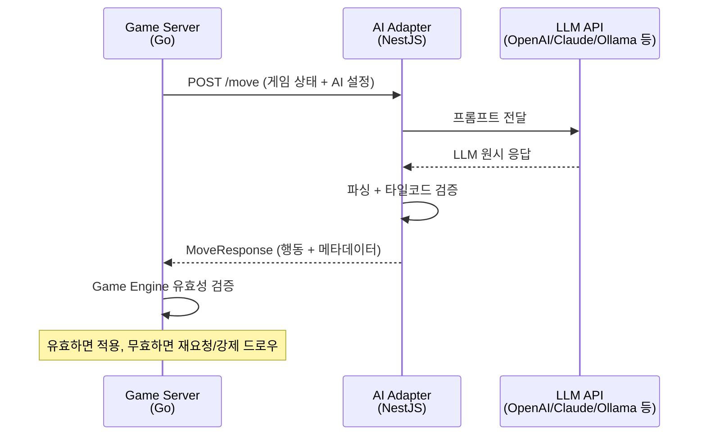
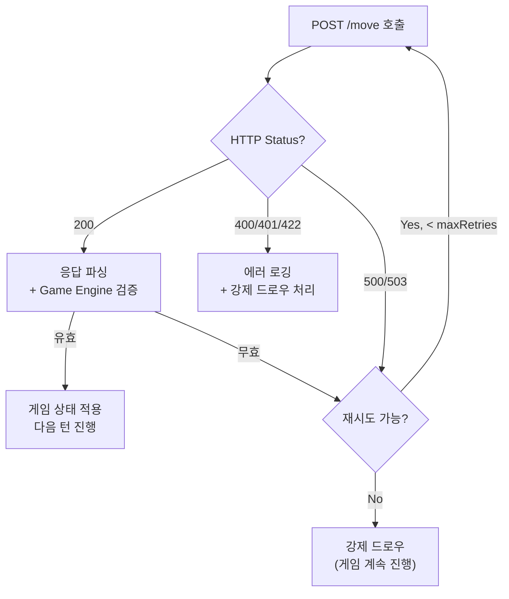
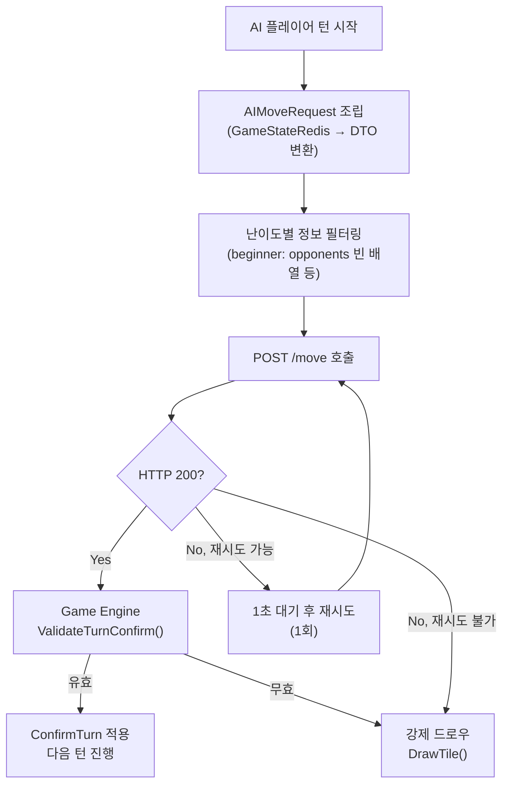
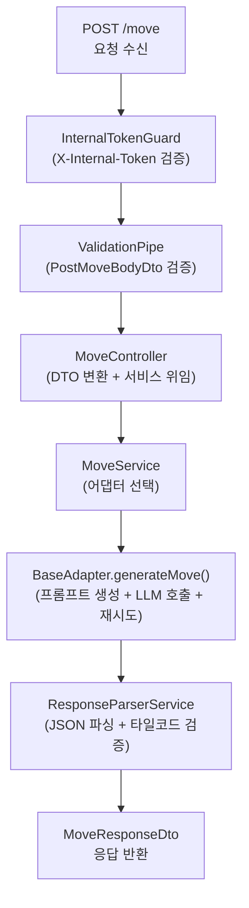

# AI Move API 인터페이스 계약서

> **문서 번호**: 02-design/11
> **작성일**: 2026-03-21
> **상태**: 확정 (Sprint 2 개발 기준)
> **참여자**: 아키텍트(진행), Go 개발자(game-server), Node 개발자(ai-adapter)

---

## 1. 개요

### 1.1 목적

game-server(Go)에서 ai-adapter(NestJS)를 호출하는 **내부 서비스 간 HTTP API 인터페이스**를 정의한다.
이 문서는 양쪽 서비스 개발자가 독립적으로 구현을 진행할 수 있도록 요청/응답 형식, 에러 처리, 타임아웃 정책을 완전히 확정한다.

### 1.2 서비스 관계



### 1.3 핵심 원칙

| 원칙 | 설명 |
|------|------|
| **LLM 신뢰 금지** | ai-adapter는 타일 코드 형식만 검증한다. 게임 규칙 유효성은 game-server의 Game Engine이 최종 판단한다. |
| **Stateless 통신** | ai-adapter는 게임 상태를 저장하지 않는다. 매 요청마다 전체 컨텍스트를 전달받는다. |
| **실패 허용** | LLM 실패 시 ai-adapter 내부에서 최대 N회 재시도 후 강제 드로우를 반환한다. game-server는 항상 유효한 응답을 받는다. |

---

## 2. 엔드포인트 목록

| 메서드 | 경로 | 설명 | 호출 주체 |
|--------|------|------|-----------|
| `POST` | `/move` | AI 플레이어의 다음 수 생성 | game-server |
| `GET` | `/health` | 서비스 기본 헬스체크 (liveness) | game-server, K8s |
| `GET` | `/health/adapters` | LLM 어댑터별 연결 상태 (readiness) | game-server, K8s |

> **Base URL**: `http://ai-adapter:3001` (K8s 서비스명 기준. 로컬 개발 시 `http://localhost:3001`)

---

## 3. POST /move -- AI 수 생성

### 3.1 요청 헤더

| 헤더 | 값 | 필수 | 설명 |
|------|----|------|------|
| `Content-Type` | `application/json` | Y | JSON 형식 |
| `X-Request-Id` | UUID v4 | N | 추적용 요청 ID. game-server에서 생성하여 전달. 미전송 시 ai-adapter가 자체 생성. |
| `X-Internal-Token` | `<환경변수>` | Y | 내부 서비스 인증 토큰 (Phase 1: 공유 비밀키, Phase 5: Istio mTLS로 대체) |

### 3.2 요청 DTO (JSON Body)

```json
{
  "gameId": "550e8400-e29b-41d4-a716-446655440000",
  "playerId": "ai-player-seat-1",
  "model": "ollama",
  "persona": "shark",
  "difficulty": "expert",
  "psychologyLevel": 3,
  "gameState": {
    "tableGroups": [
      { "tiles": ["R7a", "B7a", "K7b"] },
      { "tiles": ["Y3a", "Y4a", "Y5a", "Y6b"] }
    ],
    "myTiles": ["R1a", "R5b", "B3a", "B8a", "Y7a", "K2b", "K9a", "JK1"],
    "opponents": [
      {
        "playerId": "user-abc-123",
        "remainingTiles": 8
      },
      {
        "playerId": "ai-player-seat-2",
        "remainingTiles": 3,
        "actionHistory": ["Turn 10: draw", "Turn 12: place 2 tiles"]
      }
    ],
    "drawPileCount": 28,
    "turnNumber": 15,
    "initialMeldDone": true,
    "unseenTiles": ["R2a", "R3b", "B11a", "K1b", "JK2"]
  },
  "maxRetries": 3,
  "timeoutMs": 30000
}
```

### 3.3 요청 필드 상세

| 필드 | 타입 | 필수 | 제약 | 설명 |
|------|------|------|------|------|
| `gameId` | string | Y | UUID, not empty | 게임 세션 ID |
| `playerId` | string | Y | not empty | AI 플레이어 식별자 (seat 기반) |
| `model` | string (enum) | Y | `openai` \| `claude` \| `deepseek` \| `ollama` | LLM 어댑터 선택 |
| `persona` | string (enum) | Y | `rookie` \| `calculator` \| `shark` \| `fox` \| `wall` \| `wildcard` | AI 캐릭터 페르소나 |
| `difficulty` | string (enum) | Y | `beginner` \| `intermediate` \| `expert` | 난이도 등급 |
| `psychologyLevel` | number | Y | 0~3 | 심리전 레벨 |
| `gameState` | object | Y | - | 현재 게임 상태 (아래 참조) |
| `maxRetries` | number | N | 1~5, 기본값 3 | 최대 LLM 재시도 횟수 |
| `timeoutMs` | number | N | 5000~60000, 기본값 30000 | LLM 개별 호출 타임아웃(ms) |

### 3.4 gameState 필드 상세

| 필드 | 타입 | 필수 | 제약 | 설명 |
|------|------|------|------|------|
| `tableGroups` | TileGroup[] | Y | - | 현재 테이블에 놓인 그룹/런 목록 |
| `tableGroups[].tiles` | string[] | Y | 3~13개 | 타일 코드 배열 (인코딩 규칙 참조) |
| `myTiles` | string[] | Y | 0~14개 | AI 플레이어의 현재 랙 |
| `opponents` | OpponentInfo[] | Y | - | 상대 플레이어 정보 |
| `opponents[].playerId` | string | Y | not empty | 상대 식별자 |
| `opponents[].remainingTiles` | number | Y | >= 0 | 상대 남은 타일 수 |
| `opponents[].actionHistory` | string[] | N | - | 상대 행동 히스토리 (expert 난이도, psychologyLevel >= 2) |
| `drawPileCount` | number | Y | >= 0 | 드로우 파일 남은 장수 |
| `turnNumber` | number | Y | >= 1 | 현재 턴 번호 |
| `initialMeldDone` | boolean | Y | - | AI 플레이어의 최초 등록(30점) 완료 여부 |
| `unseenTiles` | string[] | N | - | 미출현 타일 목록 (expert 난이도에서만 제공) |

### 3.5 난이도별 전송 정보 범위

game-server는 난이도에 따라 전송하는 정보의 범위를 조절한다.

| 필드 | beginner | intermediate | expert |
|------|----------|--------------|--------|
| `tableGroups` | O | O | O |
| `myTiles` | O | O | O |
| `opponents[].remainingTiles` | X (빈 배열) | O | O |
| `opponents[].actionHistory` | X | X | O (psychologyLevel >= 2) |
| `unseenTiles` | X | X | O |
| `drawPileCount` | O | O | O |

> **game-server 책임**: beginner 난이도에서는 `opponents`를 빈 배열로, `unseenTiles`를 생략하여 전송한다. ai-adapter는 전달받은 정보를 그대로 프롬프트에 반영한다.

### 3.6 응답 DTO

```json
{
  "action": "place",
  "tableGroups": [
    { "tiles": ["R7a", "B7a", "K7b"] },
    { "tiles": ["Y3a", "Y4a", "Y5a", "Y6b"] },
    { "tiles": ["R1a", "B1a", "K1b"] }
  ],
  "tilesFromRack": ["R1a"],
  "reasoning": "상대 타일이 3장이라 공격적 배치. R1a를 활용한 새 그룹 생성.",
  "metadata": {
    "modelType": "ollama",
    "modelName": "gemma3:4b",
    "latencyMs": 2450,
    "promptTokens": 850,
    "completionTokens": 120,
    "retryCount": 0,
    "isFallbackDraw": false
  }
}
```

### 3.7 응답 필드 상세

| 필드 | 타입 | 필수 | 설명 |
|------|------|------|------|
| `action` | string (enum) | Y | `place` (타일 배치) \| `draw` (드로우) |
| `tableGroups` | TileGroup[] | action=place 시 Y | 배치 후 테이블 전체 그룹/런 구성 |
| `tableGroups[].tiles` | string[] | Y | 그룹/런을 구성하는 타일 코드 (3~13개) |
| `tilesFromRack` | string[] | action=place 시 Y | 이번 턴에 랙에서 사용한 타일 코드 |
| `reasoning` | string | N | AI의 사고 과정 (디버깅/UI 표시용) |
| `metadata` | object | Y | 호출 메타데이터 |
| `metadata.modelType` | string | Y | 사용된 LLM 공급자 타입 |
| `metadata.modelName` | string | Y | 실제 모델명 (예: `gemma3:4b`, `gpt-4o`) |
| `metadata.latencyMs` | number | Y | LLM 응답 지연시간 (ms) |
| `metadata.promptTokens` | number | Y | 프롬프트 토큰 수 |
| `metadata.completionTokens` | number | Y | 완성 토큰 수 |
| `metadata.retryCount` | number | Y | 실제 재시도 횟수 (0 = 첫 시도 성공) |
| `metadata.isFallbackDraw` | boolean | Y | 강제 드로우 여부 (maxRetries 소진 시 true) |

### 3.8 action별 응답 예시

**action: place (배치)**
```json
{
  "action": "place",
  "tableGroups": [
    { "tiles": ["R3a", "B3a", "K3b"] },
    { "tiles": ["Y5a", "Y6a", "Y7b", "Y8a"] }
  ],
  "tilesFromRack": ["R3a", "Y8a"],
  "reasoning": "R3a로 새 그룹 생성, Y8a로 기존 런 확장",
  "metadata": { "modelType": "ollama", "modelName": "gemma3:4b", "latencyMs": 3200, "promptTokens": 920, "completionTokens": 95, "retryCount": 1, "isFallbackDraw": false }
}
```

**action: draw (드로우)**
```json
{
  "action": "draw",
  "reasoning": "배치 가능한 조합이 없어 드로우 선택",
  "metadata": { "modelType": "openai", "modelName": "gpt-4o", "latencyMs": 1100, "promptTokens": 780, "completionTokens": 40, "retryCount": 0, "isFallbackDraw": false }
}
```

**action: draw (강제 드로우 -- maxRetries 소진)**
```json
{
  "action": "draw",
  "reasoning": "유효한 수를 생성하지 못하여 강제 드로우를 선택합니다.",
  "metadata": { "modelType": "ollama", "modelName": "gemma3:4b", "latencyMs": 15200, "promptTokens": 0, "completionTokens": 0, "retryCount": 3, "isFallbackDraw": true }
}
```

---

## 4. GET /health -- 기본 헬스체크

### 4.1 설명

ai-adapter 프로세스의 기본 생존 여부를 확인한다. K8s liveness probe 및 game-server 시작 시 의존 서비스 확인용.

### 4.2 요청

```
GET /health
```

헤더 불필요. 인증 없음.

### 4.3 응답 (200 OK)

```json
{
  "status": "ok",
  "timestamp": "2026-03-21T14:30:00.000Z"
}
```

---

## 5. GET /health/adapters -- 어댑터 상태 확인

### 5.1 설명

등록된 모든 LLM 어댑터의 연결 상태를 병렬 확인한다. K8s readiness probe 및 game-server의 모델 가용성 판단용.

### 5.2 요청

```
GET /health/adapters
```

헤더 불필요. 인증 없음.

### 5.3 응답 (200 OK)

```json
{
  "status": "ok",
  "adapters": {
    "openai": true,
    "claude": true,
    "deepseek": false,
    "ollama": true
  },
  "timestamp": "2026-03-21T14:30:00.000Z"
}
```

| `status` 값 | 의미 |
|-------------|------|
| `ok` | 모든 어댑터가 정상 |
| `degraded` | 일부 어댑터 비정상 (서비스는 가용) |

> **game-server 활용**: game-server는 이 엔드포인트로 특정 모델의 가용 여부를 확인한 후, 비가용 모델에 대해 사용자에게 안내하거나 대체 모델을 선택할 수 있다.

---

## 6. 에러 응답 형식

### 6.1 공통 에러 구조

ai-adapter의 모든 에러 응답은 NestJS 표준 에러 형식을 따른다.

```json
{
  "statusCode": 400,
  "message": "에러 설명",
  "error": "Bad Request"
}
```

### 6.2 에러 코드 목록

| HTTP Status | 상황 | message 예시 | 재시도 가능 |
|-------------|------|-------------|-------------|
| **400** | 요청 DTO 검증 실패 (필수 필드 누락, enum 범위 초과) | `"model must be one of: openai, claude, deepseek, ollama"` | N (요청 수정 필요) |
| **400** | 지원하지 않는 모델 타입 | `"지원하지 않는 모델입니다: \"gemini\""` | N |
| **401** | 내부 서비스 인증 실패 (`X-Internal-Token` 불일치) | `"Unauthorized"` | N (토큰 확인 필요) |
| **408** | 전체 처리 타임아웃 (maxRetries x timeoutMs 초과) | 발생하지 않음 -- 강제 드로우로 처리 | - |
| **422** | 타일 코드 형식 오류 (검증 통과 but 파싱 불가) | `"유효하지 않은 타일 코드: \"X7a\""` | N (요청 수정 필요) |
| **500** | ai-adapter 내부 오류 (NestJS 미핸들 예외) | `"Internal server error"` | Y (재시도 가능) |
| **503** | 선택된 LLM 어댑터 서비스 불가 | `"ollama 서비스에 연결할 수 없습니다"` | Y (일시적) |

### 6.3 game-server 에러 처리 전략



> **핵심**: game-server는 ai-adapter 호출 실패 시 게임을 중단시키지 않는다. 항상 강제 드로우로 대체하여 게임 흐름을 유지한다.

---

## 7. 타임아웃 및 재시도 정책

### 7.1 타임아웃 계층 구조

```
game-server HTTP Client Timeout (전체)
  = maxRetries * timeoutMs + 여유 5초
  예: 3 * 30000 + 5000 = 95초

  ai-adapter 내부
    LLM 개별 호출 타임아웃 = timeoutMs (기본 30초)
    최대 재시도 = maxRetries (기본 3회)
```

### 7.2 타임아웃 설정 표

| 항목 | 기본값 | 최소 | 최대 | 비고 |
|------|--------|------|------|------|
| `timeoutMs` (LLM 개별 호출) | 30,000ms | 5,000ms | 60,000ms | Ollama 로컬 모델은 최대 30초 소요 가능 |
| `maxRetries` (ai-adapter 내부) | 3 | 1 | 5 | Ollama 소형 모델은 내부에서 최소 5회로 override |
| game-server HTTP client timeout | 95,000ms | - | - | maxRetries * timeoutMs + 5000ms |
| Health check timeout | 5,000ms | - | - | /health/adapters 개별 어댑터 |

### 7.3 재시도 정책

| 항목 | 정책 | 설명 |
|------|------|------|
| **ai-adapter 내부 재시도** | 즉시 재시도, 백오프 없음 | LLM 파싱 실패/불법 수 시 에러 피드백 포함 프롬프트로 즉시 재시도 |
| **game-server -> ai-adapter 재시도** | 1회 재시도, 1초 대기 | HTTP 500/503 시 1회만 재시도. 실패 시 강제 드로우 |
| **game-server Game Engine 검증 실패** | 재호출 없음 | ai-adapter 응답이 Game Engine 검증 실패 시 즉시 강제 드로우 |

### 7.4 모델별 권장 timeoutMs

| 모델 | 권장 timeoutMs | 비고 |
|------|---------------|------|
| `openai` (gpt-4o) | 15,000ms | 빠른 API 응답 |
| `claude` (claude-sonnet) | 20,000ms | 중간 속도 |
| `deepseek` (deepseek-chat) | 20,000ms | OpenAI 호환 |
| `ollama` (gemma3:4b) | 30,000ms | 로컬 실행, 하드웨어 의존 (16GB RAM) |

---

## 8. 내부 서비스 인증

### 8.1 미팅 논의 내용

```
아키텍트: Istio mTLS가 Phase 5에서 도입되므로, Phase 1~4에서는 간단한 공유 비밀키 방식이
  적절하다. 과도한 인증 체계는 오버엔지니어링이다.
Go 개발자: 환경변수로 주입 가능한 단일 토큰이면 구현이 간단하다.
Node 개발자: NestJS Guard로 헤더 검증 구현이 쉽다. Health 엔드포인트는 인증 제외해야 한다.
합의: X-Internal-Token 헤더 + 환경변수 공유 비밀키 방식 채택.
```

### 8.2 구현 사양

| 항목 | 값 |
|------|-----|
| 헤더 이름 | `X-Internal-Token` |
| 토큰 저장 | 환경변수 `AI_ADAPTER_INTERNAL_TOKEN` (양쪽 서비스 동일) |
| 적용 범위 | `POST /move` 에만 적용 |
| 미적용 | `GET /health`, `GET /health/adapters` -- K8s probe 접근 허용 |
| Phase 5 이후 | Istio mTLS로 대체. `X-Internal-Token` 검증을 optional로 전환 |

### 8.3 인증 실패 시

```json
HTTP 401
{
  "statusCode": 401,
  "message": "Unauthorized",
  "error": "Unauthorized"
}
```

---

## 9. 타일 인코딩 규칙

game-server와 ai-adapter 간 타일 코드는 아래 규칙을 따른다. CLAUDE.md 및 코드베이스 전체에서 동일한 규칙이 적용된다.

### 9.1 일반 타일

**형식**: `{Color}{Number}{Set}`

| 요소 | 값 | 설명 |
|------|----|------|
| Color | `R` \| `B` \| `Y` \| `K` | Red, Blue, Yellow, Black |
| Number | `1` ~ `13` | 타일 숫자 (정수, 앞에 0 붙이지 않음) |
| Set | `a` \| `b` | 동일 타일 구분 (각 타일은 2장씩 존재) |

**예시**: `R7a` (빨강 7 세트a), `B13b` (파랑 13 세트b), `K1a` (검정 1 세트a)

### 9.2 조커

**형식**: `JK1` 또는 `JK2` (총 2장)

### 9.3 전체 타일 수

4색 x 13숫자 x 2세트 + 조커 2장 = **106장**

### 9.4 정규식 (양쪽 동일 적용)

```
^([RBYK](?:[1-9]|1[0-3])[ab]|JK[12])$
```

---

## 10. game-server 구현 가이드 (Go)

### 10.1 Config 확장

```go
// config.go에 추가
type AIAdapterConfig struct {
    BaseURL       string // 기본값: "http://ai-adapter:3001"
    InternalToken string // 환경변수: AI_ADAPTER_INTERNAL_TOKEN
    TimeoutMs     int    // 기본값: 95000 (전체 HTTP timeout)
}
```

### 10.2 AI Client 서비스 구조

```go
// internal/client/ai_client.go (신규)
type AIClient interface {
    RequestMove(ctx context.Context, req *AIMoveRequest) (*AIMoveResponse, error)
    HealthCheck(ctx context.Context) (*AIHealthResponse, error)
}

type AIMoveRequest struct {
    GameID          string           `json:"gameId"`
    PlayerID        string           `json:"playerId"`
    Model           string           `json:"model"`            // "openai"|"claude"|"deepseek"|"ollama"
    Persona         string           `json:"persona"`
    Difficulty      string           `json:"difficulty"`
    PsychologyLevel int              `json:"psychologyLevel"`
    GameState       AIGameStateDTO   `json:"gameState"`
    MaxRetries      int              `json:"maxRetries,omitempty"`  // 기본 3
    TimeoutMs       int              `json:"timeoutMs,omitempty"`   // 기본 30000
}

type AIGameStateDTO struct {
    TableGroups   []AITileGroup    `json:"tableGroups"`
    MyTiles       []string         `json:"myTiles"`
    Opponents     []AIOpponentInfo `json:"opponents"`
    DrawPileCount int              `json:"drawPileCount"`
    TurnNumber    int              `json:"turnNumber"`
    InitialMeldDone bool           `json:"initialMeldDone"`
    UnseenTiles   []string         `json:"unseenTiles,omitempty"`
}

type AITileGroup struct {
    Tiles []string `json:"tiles"`
}

type AIOpponentInfo struct {
    PlayerID       string   `json:"playerId"`
    RemainingTiles int      `json:"remainingTiles"`
    ActionHistory  []string `json:"actionHistory,omitempty"`
}
```

### 10.3 HTTP Client 설정 권장사항

```go
httpClient := &http.Client{
    Timeout: time.Duration(cfg.AIAdapter.TimeoutMs) * time.Millisecond,
    Transport: &http.Transport{
        MaxIdleConns:        10,
        MaxIdleConnsPerHost: 5,
        IdleConnTimeout:     90 * time.Second,
    },
}
```

- Connection pooling으로 TCP 핸드셰이크 오버헤드 감소
- MaxIdleConnsPerHost = 5: AI 턴이 동시에 여러 게임에서 발생할 수 있음
- Timeout은 `maxRetries * timeoutMs + 5000ms`로 설정

### 10.4 game-server에서의 호출 흐름



### 10.5 model 필드 매핑

game-server의 `PlayerType`(model/player.go)에서 ai-adapter의 `model` 필드로 변환한다.

| PlayerType (Go) | model (ai-adapter) |
|------------------|--------------------|
| `AI_OPENAI` | `"openai"` |
| `AI_CLAUDE` | `"claude"` |
| `AI_DEEPSEEK` | `"deepseek"` |
| `AI_LLAMA` | `"ollama"` |

---

## 11. ai-adapter 구현 가이드 (NestJS)

### 11.1 현재 구현 상태 (Sprint 1 완료)

| 구성 요소 | 파일 | 상태 |
|-----------|------|------|
| MoveController | `src/move/move.controller.ts` | 구현 완료 |
| MoveService | `src/move/move.service.ts` | 구현 완료 |
| PostMoveBodyDto | `src/move/move.controller.ts` | 구현 완료 |
| MoveRequestDto | `src/common/dto/move-request.dto.ts` | 구현 완료 |
| MoveResponseDto | `src/common/dto/move-response.dto.ts` | 구현 완료 |
| BaseAdapter (재시도 로직) | `src/adapter/base.adapter.ts` | 구현 완료 |
| OllamaAdapter | `src/adapter/ollama.adapter.ts` | 구현 완료 |
| PromptBuilderService | `src/prompt/prompt-builder.service.ts` | 구현 완료 |
| ResponseParserService | `src/common/parser/response-parser.service.ts` | 구현 완료 |
| HealthController | `src/health/health.controller.ts` | 구현 완료 |
| HealthService | `src/health/health.service.ts` | 구현 완료 |

### 11.2 Sprint 2에서 추가 구현 필요 사항

| 항목 | 설명 |
|------|------|
| **InternalTokenGuard** | `X-Internal-Token` 헤더 검증 NestJS Guard. `/move` 에만 적용. |
| **X-Request-Id 전파** | 요청 ID를 로그에 포함. NestJS Interceptor로 구현. |
| **에러 응답 표준화** | 현재 NestJS 기본 에러 형식 사용 중. 추가 커스텀 불필요. |

### 11.3 NestJS Controller/Service 계층 구조



---

## 12. Sprint 2 추가 엔드포인트 검토

### 12.1 미팅 논의 내용

```
아키텍트: POST /move 외에 Sprint 2에서 필요한 엔드포인트가 있는가?
Go 개발자: 게임 시작 시 ai-adapter에 사전 워밍업 호출이 필요할 수 있다. Ollama 첫 호출이 느리다.
Node 개발자: Ollama 모델 로드에 최초 30~60초 걸릴 수 있다. /health/adapters로 사전 확인은 가능하다.
아키텍트: 워밍업은 /health/adapters 호출로 대체하자. 전용 엔드포인트는 오버엔지니어링.
합의: Sprint 2에서는 POST /move, GET /health, GET /health/adapters 세 개만 사용. 추가 필요 시 Sprint 3에서 검토.
```

### 12.2 향후 검토 대상 (Sprint 3+)

| 엔드포인트 | 용도 | 검토 시점 |
|-----------|------|-----------|
| `GET /models` | 사용 가능한 모델 목록 + 상태 | Sprint 3 (Room 생성 UI에서 모델 선택 시) |
| `POST /ai/analyze` | 게임 복기용 AI 분석 | Sprint 4 (복기 기능) |
| `GET /metrics` | Prometheus 메트릭 | Phase 5 (Observability) |

---

## 13. 미팅 상세 논의 기록

### 안건 1: 요청 DTO 설계

**아키텍트**: 게임 상태 전체를 넘길 것인지, 필요한 정보만 넘길 것인지 결정이 필요하다. 보안상 DrawPile(드로우 파일 내용)은 절대 넘기면 안 된다. AI가 다음에 뽑을 타일을 알면 치팅이 된다.

**Go 개발자**: GameStateRedis에는 DrawPile 전체 코드가 있다. AI에게는 drawPileCount(남은 장수)만 넘겨야 한다. PlayerState.Rack도 해당 AI 플레이어의 것만 넘기고 다른 플레이어의 랙은 제외해야 한다.

**Node 개발자**: 현재 MoveRequestDto와 PostMoveBodyDto가 이미 이 구조로 되어 있다. myTiles(내 랙)와 opponents(상대 정보, 타일 수만)로 분리되어 있다.

**합의**: 현재 ai-adapter의 DTO 구조를 그대로 유지한다. game-server에서 GameStateRedis를 AIGameStateDTO로 변환할 때 DrawPile 내용과 다른 플레이어 랙을 제외한다. 난이도에 따른 정보 필터링은 game-server 책임이다.

### 안건 2: 응답 DTO 설계

**아키텍트**: 현재 ai-adapter의 MoveResponseDto는 action이 `place`와 `draw` 두 가지다. `pass`(턴 넘기기)가 필요한가?

**Go 개발자**: 루미큐브 규칙상 배치하거나 드로우하거나 둘 중 하나다. 패스는 없다. draw가 사실상 패스 역할이다.

**Node 개발자**: 현재 action enum은 `place | draw`로 충분하다. 강제 드로우(isFallbackDraw)로 LLM 실패 케이스도 처리된다.

**합의**: action은 `place | draw` 유지. `pass`는 추가하지 않는다.

### 안건 3: 에러 응답 형식

**아키텍트**: ai-adapter에서 LLM이 실패하더라도 HTTP 200 + 강제 드로우를 반환하는 것이 맞는가, HTTP 에러를 반환해야 하는가?

**Go 개발자**: game-server 입장에서는 항상 200을 받는 것이 처리가 단순하다. 내부 재시도 후에도 실패하면 강제 드로우(isFallbackDraw=true)로 반환해주면 game-server는 그냥 DrawTile()을 호출하면 된다.

**Node 개발자**: BaseAdapter가 이미 이 방식으로 구현되어 있다. maxRetries 소진 시 buildFallbackDraw()가 항상 200으로 응답한다. HTTP 에러는 요청 자체가 잘못된 경우(400)나 서비스 장애(500)에만 발생한다.

**합의**: LLM 실패는 HTTP 200 + isFallbackDraw=true. HTTP 에러는 요청 오류/서비스 장애에만 사용.

### 안건 4: 타임아웃/재시도 정책

**아키텍트**: Ollama gemma3:4b 모델이 16GB RAM 환경에서 최대 30초 걸릴 수 있다. 재시도 3회면 최대 90초. game-server HTTP timeout은?

**Go 개발자**: Go의 http.Client.Timeout은 전체 요청에 대한 것이다. maxRetries * timeoutMs + 여유분으로 설정해야 한다. 95초가 적절하다.

**Node 개발자**: Ollama는 4B 모델의 JSON 파싱 오류율이 높아서 OllamaAdapter에서 maxRetries를 최소 5회로 override한다. game-server가 timeoutMs=30000, maxRetries=3을 보내도 Ollama 어댑터는 내부적으로 5회까지 재시도한다.

**아키텍트**: 그러면 game-server timeout은 Ollama의 경우 5 * 30000 + 5000 = 155초까지 걸릴 수 있다. 너무 긴가?

**Go 개발자**: 유저 턴 타임아웃(30~120초)과 별개로 AI 턴은 비동기로 처리되므로 대기 시간이 길어도 다른 플레이어에게 "AI 사고 중" 메시지를 표시하면 된다.

**합의**: game-server HTTP timeout은 넉넉하게 설정(180초). 실제 시간 제어는 ai-adapter 내부의 timeoutMs * maxRetries로 한다. Ollama의 내부 override는 허용한다.

### 안건 5: 내부 서비스 인증

**아키텍트**: Phase 5에서 Istio mTLS가 도입되면 서비스 간 인증이 자동화된다. 그 전에는?

**Go 개발자**: 환경변수로 주입되는 공유 토큰이면 충분하다. Helm values.yaml에서 시크릿으로 관리 가능.

**Node 개발자**: NestJS CanActivate Guard로 구현이 간단하다. 헬스체크 엔드포인트는 Guard에서 제외해야 한다.

**합의**: `X-Internal-Token` 헤더 + 환경변수 `AI_ADAPTER_INTERNAL_TOKEN` 방식. Health 엔드포인트는 인증 제외.

### 안건 6: Health Check 활용

**아키텍트**: game-server에서 ai-adapter 상태 확인은 언제 하는가?

**Go 개발자**: 두 가지 시점이 있다. (1) game-server 시작 시 ai-adapter 연결 확인, (2) AI 플레이어가 포함된 Room 생성 시 해당 모델 가용 확인.

**Node 개발자**: /health/adapters 응답의 adapters 맵에서 특정 모델의 상태를 확인할 수 있다.

**합의**: game-server 시작 시 /health 호출(실패 시 경고 로그, 서버는 시작). Room에 AI 추가 시 /health/adapters로 해당 모델 가용 여부 확인. 비가용 시 사용자에게 안내.

### 안건 7: 추가 엔드포인트

상기 12절 참조. Sprint 2에서는 세 엔드포인트만 사용하기로 합의.

---

## 부록 A: 타일 인코딩 예시 (전체 106장)

| 색상 | 범위 | 예시 |
|------|------|------|
| Red (R) | R1a ~ R13a, R1b ~ R13b | R1a, R7b, R13a |
| Blue (B) | B1a ~ B13a, B1b ~ B13b | B1a, B5b, B13b |
| Yellow (Y) | Y1a ~ Y13a, Y1b ~ Y13b | Y1a, Y9a, Y12b |
| Black (K) | K1a ~ K13a, K1b ~ K13b | K1a, K3b, K13a |
| Joker | JK1, JK2 | JK1, JK2 |

**합계**: (4색 x 13숫자 x 2세트) + 2조커 = 104 + 2 = **106장**

---

## 부록 B: 문서 변경 이력

| 날짜 | 변경 내용 | 작성자 |
|------|-----------|--------|
| 2026-03-21 | 최초 작성 (Sprint 2 사전 인터페이스 설계 미팅) | 아키텍트 |
