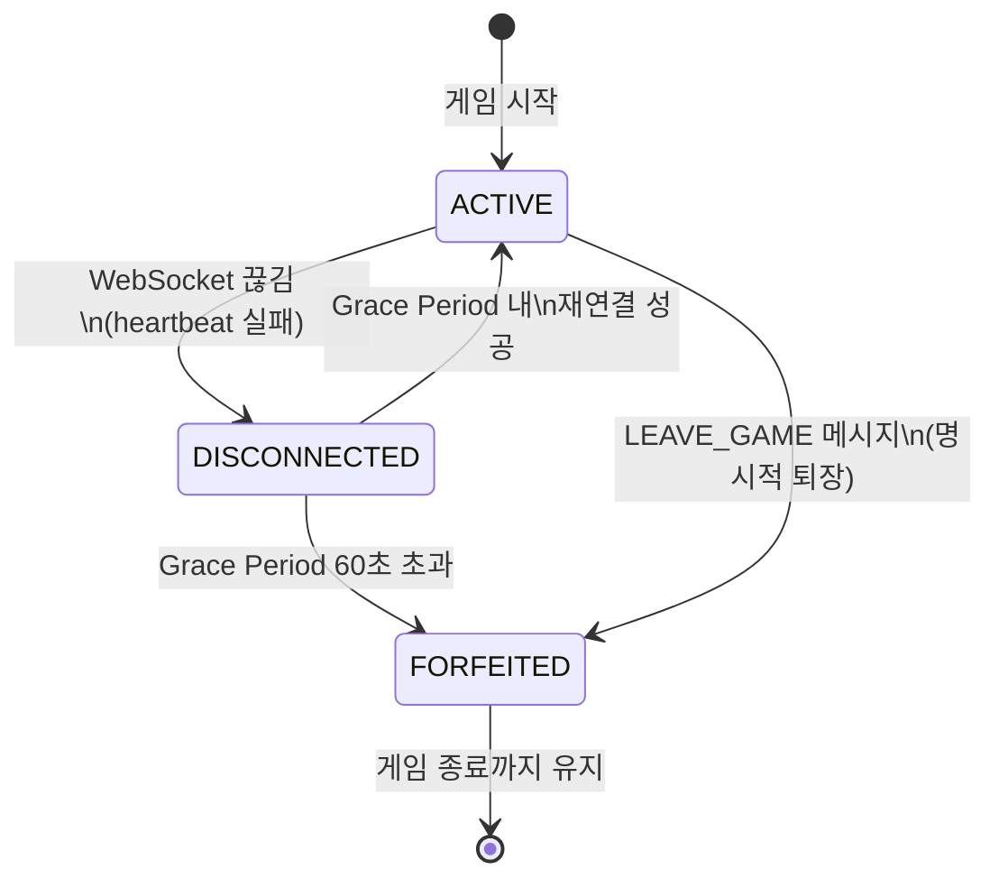
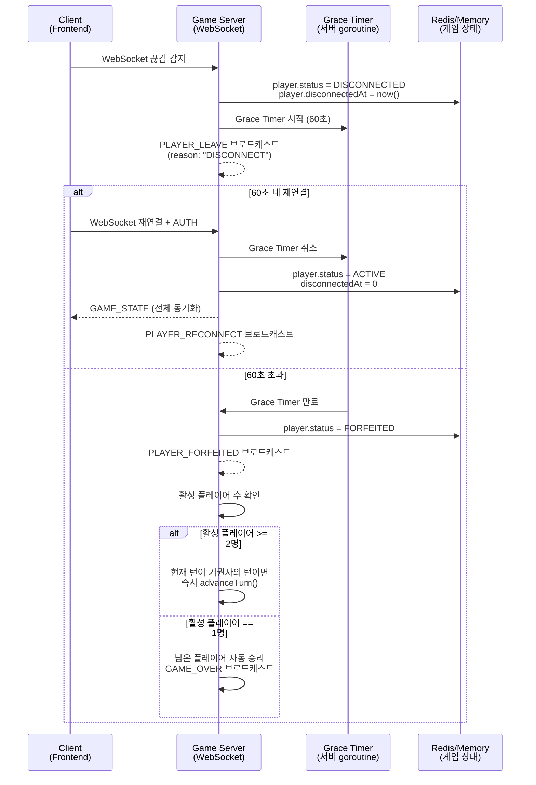
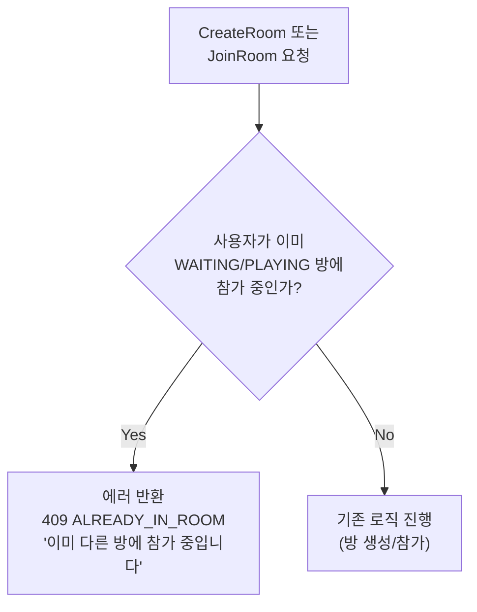
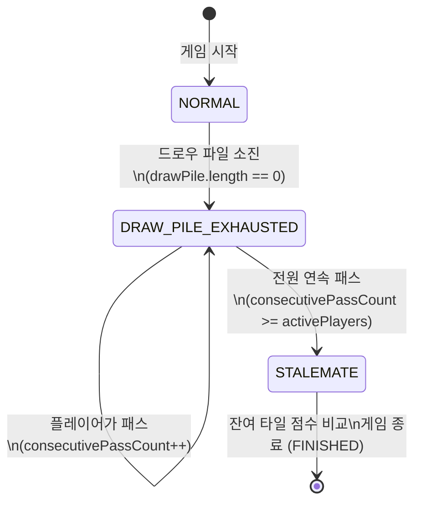
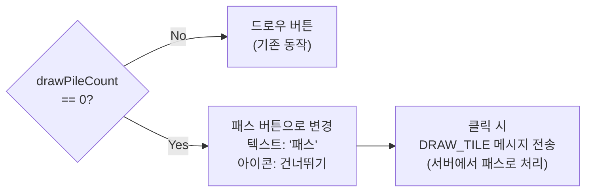
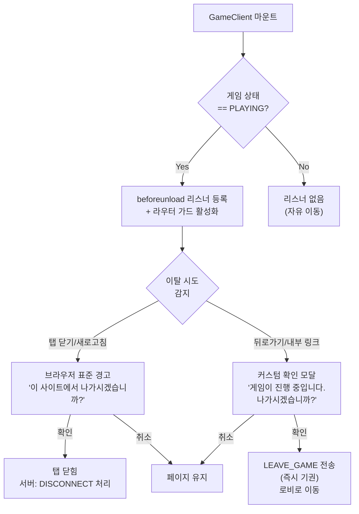

# 플레이어 생명주기 및 예외 처리 설계

이 문서는 게임 진행 중 플레이어 이탈, 중복 참가, 교착 상태, 브라우저 이탈 경고에 대한 상세 설계를 정의한다.
기존 설계(`05-game-session-design.md`, `06-game-rules.md`, `10-websocket-protocol.md`)에서 미비했던 4건의 설계 GAP을 해소한다.

**관련 문서**:
- `05-game-session-design.md` -- 세션 생명주기, 연결 끊김/재연결 (6절)
- `06-game-rules.md` -- 교착 상태 판정 규칙 (7.2절)
- `10-websocket-protocol.md` -- WebSocket 메시지 프로토콜
- `02-database-design.md` -- Redis/PostgreSQL 데이터 구조

---

## 1. 게임 중 퇴장/기권 정책

### 1.1 문제 정의

현재 구현에서 플레이어가 게임 도중 탭을 닫거나 네트워크 끊김이 발생하면, `handleDisconnect()`가 `PLAYER_LEAVE`를 브로드캐스트할 뿐 게임 로직에는 영향을 주지 않는다. 해당 플레이어의 턴이 돌아오면 타임아웃(30~120초)이 매번 소진될 때까지 대기하며, 이 과정이 무한 반복된다. `PlayerState`에 활성/비활성 상태 필드가 없고, `advanceTurn()`이 비활성 플레이어를 건너뛰지도 않는다.

### 1.2 설계 결정

| 항목 | 결정 | 근거 |
|------|------|------|
| Grace Period | 60초 | 웹 환경에서 Wi-Fi 전환, 일시적 네트워크 끊김을 고려. 30초는 너무 짧고(모바일 환경) 120초는 다른 플레이어 대기 시간이 과도. 60초는 WebSocket heartbeat 2회(30초 x 2)와 일치하여 확실한 이탈 판정 가능 |
| Grace 초과 시 | 자동 기권(FORFEITED) | 빈 자리 턴마다 타임아웃을 소진하면 3인 게임 기준 1라운드에 60~120초가 낭비됨. 자동 기권으로 게임 흐름을 보존 |
| 명시적 LEAVE_GAME | 즉시 기권 | 플레이어가 의도적으로 나간 경우 Grace Period 없이 즉시 처리. 대기 시간 제로 |
| 기권 플레이어 턴 | advanceTurn에서 건너뛰기 | 기권자의 턴을 실행할 이유가 없음. 건너뛰기로 게임 속도 유지 |
| 남은 활성 플레이어 1명 | 자동 승리 | 2인 이상이 게임 조건이므로 1명만 남으면 계속 진행 불가. 남은 1명을 승자로 처리 |
| ELO 처리 | 기권자는 최하위 | 기권은 패배보다 나쁜 행위. 남은 플레이어 중 순위를 매긴 후 기권자를 최하위에 배치하여 ELO 계산 |

### 1.3 PlayerState 상태 모델



**PlayerState 필드 추가**:

```go
// PlayerState holds per-player in-memory state cached in Redis.
type PlayerState struct {
    // ... 기존 필드 유지 ...
    Status         PlayerConnectionStatus `json:"status"`          // ACTIVE, DISCONNECTED, FORFEITED
    DisconnectedAt int64                  `json:"disconnectedAt"`  // Unix timestamp (ms), DISCONNECTED 전환 시각
}

// PlayerConnectionStatus 플레이어 연결 상태
type PlayerConnectionStatus string

const (
    PlayerStatusActive       PlayerConnectionStatus = "ACTIVE"
    PlayerStatusDisconnected PlayerConnectionStatus = "DISCONNECTED"
    PlayerStatusForfeited    PlayerConnectionStatus = "FORFEITED"
)
```

### 1.4 Grace Period 타이머 흐름



### 1.5 advanceTurn 수정

기존 `advanceTurn()`은 플레이어 인덱스를 순차적으로 순환할 뿐 상태를 확인하지 않는다. FORFEITED 플레이어를 건너뛰도록 수정한다.

```go
// advanceTurn 다음 활성(ACTIVE) 플레이어 seat을 반환한다.
// FORFEITED 상태의 플레이어는 건너뛴다.
func advanceTurn(state *model.GameStateRedis) int {
    n := len(state.Players)
    if n == 0 {
        return 0
    }
    currentIdx := -1
    for i, p := range state.Players {
        if p.SeatOrder == state.CurrentSeat {
            currentIdx = i
            break
        }
    }
    if currentIdx < 0 {
        return state.Players[0].SeatOrder
    }
    // 최대 n번 탐색 (전원 FORFEITED 방지)
    for i := 1; i <= n; i++ {
        nextIdx := (currentIdx + i) % n
        if state.Players[nextIdx].Status != model.PlayerStatusForfeited {
            return state.Players[nextIdx].SeatOrder
        }
    }
    return state.Players[currentIdx].SeatOrder // fallback
}
```

### 1.6 LEAVE_GAME 처리 (명시적 기권)

기존 `handleLeaveGame()`는 `PLAYER_LEAVE` 브로드캐스트와 연결 종료만 수행한다. 게임 상태를 변경하고 승리 조건을 확인하도록 보강한다.

```
handleLeaveGame(conn):
  1. state = getGameState(conn.gameID)
  2. state.players[conn.seat].status = FORFEITED
  3. saveGameState(state)
  4. broadcast PLAYER_FORFEITED {seat, displayName, reason: "LEAVE"}
  5. activeCount = count(status == ACTIVE || status == DISCONNECTED)
  6. if activeCount == 1:
       broadcast GAME_OVER {endType: "FORFEIT", winner: 남은 1명}
  7. else if currentSeat == conn.seat:
       advanceTurn() + broadcast TURN_START
  8. close WebSocket (1000)
```

### 1.7 ELO 처리

기권자는 최하위 순위로 처리한다. 기존 `05-game-session-design.md` 7.3절의 다인전 ELO 공식에 추가 규칙을 적용한다.

| 시나리오 | ELO 처리 |
|----------|---------|
| 정상 종료 (FINISHED) | 기존 규칙대로 승자 vs 각 패자 1:1 ELO 계산 |
| 기권 종료 (FORFEIT) | 기권자를 최하위로 배치. 남은 플레이어 간 잔여 타일 점수로 순위 결정. CANCELLED와 달리 ELO 적용 |
| 전원 기권 (이론적) | CANCELLED 처리, ELO 미적용 |

### 1.8 새로운 WebSocket 메시지

**S2C: PLAYER_FORFEITED**

```json
{
  "type": "PLAYER_FORFEITED",
  "payload": {
    "seat": 2,
    "displayName": "Player3",
    "reason": "DISCONNECT_TIMEOUT" | "LEAVE",
    "activePlayers": 2,
    "isGameOver": false
  }
}
```

| 필드 | 타입 | 설명 |
|------|------|------|
| seat | integer | 기권한 플레이어의 seat |
| displayName | string | 기권한 플레이어 표시 이름 |
| reason | string | "DISCONNECT_TIMEOUT" (Grace Period 초과) 또는 "LEAVE" (명시적 퇴장) |
| activePlayers | integer | 남은 활성 플레이어 수 |
| isGameOver | boolean | 이 기권으로 게임이 종료되었는지 여부 |

### 1.9 GameOverPayload endType 확장

기존 `endType`에 `"FORFEIT"`을 추가한다.

| endType | 설명 | ELO 적용 |
|---------|------|----------|
| NORMAL | 정상 승리 (랙 0장) | O |
| STALEMATE | 교착 상태 (전원 패스) | O |
| FORFEIT | 기권으로 인한 종료 | O (기권자 최하위) |
| CANCELLED | 비정상 종료 | X |

---

## 2. 중복 방 참가 제한

### 2.1 문제 정의

현재 `JoinRoom()`과 `CreateRoom()`은 해당 방 내부에서의 중복 참가만 확인한다(`ALREADY_JOINED`). 동일 사용자가 다른 방에 이미 참가 중인지는 확인하지 않으므로, 1인이 여러 방에 동시에 참여할 수 있다. 이는 게임 무결성을 해치고, 동일 사용자가 두 게임에서 동시에 턴을 진행하는 비정상 상황을 만든다.

### 2.2 설계 결정

| 항목 | 결정 | 근거 |
|------|------|------|
| 검증 범위 | WAITING 또는 PLAYING 상태의 방 | FINISHED/CANCELLED 방은 이미 종료되었으므로 제약 불필요 |
| 검증 시점 | JoinRoom, CreateRoom 양쪽 | 방 생성도 호스트가 seat 0에 자동 배정되므로 동일한 검증 필요 |
| 에러 메시지 | "이미 다른 방에 참가 중입니다" | 사용자에게 명확한 이유 전달 |
| 구현 방식 | Redis 키 또는 인메모리 인덱스 | 단일 Pod: 인메모리 인덱스, Multi-Pod: Redis 키 |

### 2.3 검증 흐름



### 2.4 구현 방식: Redis 기반 사용자-방 매핑

단일 Pod(현재 MVP)에서는 인메모리로도 충분하지만, Multi-Pod 확장을 고려하여 Redis 키를 사용한다. 이미 `session:{sessionId}` 키에 `gameId`가 저장되고 있으나, 방 참가 단계(WAITING)에서는 게임이 시작 전이므로 별도 키가 필요하다.

```
Key: user:{userId}:active_room
Type: String
Value: roomId
TTL: 7200초 (방 TTL과 동일)
```

**설정/해제 시점**:

| 이벤트 | 동작 |
|--------|------|
| CreateRoom 성공 | SET user:{userId}:active_room = roomId |
| JoinRoom 성공 | SET user:{userId}:active_room = roomId |
| LeaveRoom | DEL user:{userId}:active_room |
| 게임 종료 (FINISHED/CANCELLED) | DEL user:{userId}:active_room (전체 참가자) |
| FORFEITED | DEL user:{userId}:active_room |

**검증 의사 코드**:

```
func checkDuplicateRoom(userID string) error:
    existingRoomID = redis.GET("user:{userID}:active_room")
    if existingRoomID == "":
        return nil  // 참가 중인 방 없음
    room = getRoom(existingRoomID)
    if room == nil || room.status in [FINISHED, CANCELLED]:
        redis.DEL("user:{userID}:active_room")  // 정리
        return nil
    return ServiceError{Code: "ALREADY_IN_ROOM", Status: 409}
```

### 2.5 인메모리 대안 (MVP 단계)

Redis를 사용하지 않는 MVP 단계에서는 `MemoryRoomRepository`에 역인덱스를 추가한다.

```go
// MemoryRoomRepository에 추가
type memoryRoomRepo struct {
    // ... 기존 필드 ...
    userRooms map[string]string // userId -> roomId (활성 방만)
}

func (r *memoryRoomRepo) GetActiveRoomForUser(userID string) (string, error)
func (r *memoryRoomRepo) SetActiveRoomForUser(userID, roomID string) error
func (r *memoryRoomRepo) ClearActiveRoomForUser(userID string) error
```

---

## 3. 교착(Stalemate) 처리 규칙 개선

### 3.1 문제 정의

현재 구현에서 드로우 파일이 소진되면 `DrawTile()`이 즉시 `finishGameStalemate()`를 호출하여 게임을 종료한다. 그러나 루미큐브 규칙상 드로우 파일이 비어도 테이블 재배치를 통해 랙 타일을 내려놓을 수 있다. 현재 코드는 배치 가능성을 무시하고 바로 종료하므로 규칙에 어긋난다.

```go
// 현재 코드 (game_service.go DrawTile)
if len(state.DrawPile) == 0 {
    return s.finishGameStalemate(state) // 즉시 종료 -- 문제
}
```

### 3.2 설계 결정

| 항목 | 결정 | 근거 |
|------|------|------|
| 드로우 파일 소진 후 | "배치 또는 패스" 모드 전환 | 공식 루미큐브 규칙: 드로우 파일이 비어도 배치가 가능하면 게임 계속 |
| 드로우 버튼 동작 변경 | 패스(턴 넘기기)로 전환 | 드로우할 타일이 없으므로 드로우 = 패스. UI에서 "패스" 버튼으로 표시 |
| 교착 확정 조건 | 전원 연속 패스(1라운드) | 모든 플레이어가 배치 없이 패스하면 더 이상 진전 불가 = 교착 |
| 교착 시 승자 | 잔여 타일 점수 비교 | 기존 `finishGameStalemate()` 로직 재활용 |

### 3.3 교착 판정 상태 다이어그램



### 3.4 DrawTile 수정

드로우 파일이 비어 있을 때 즉시 종료하지 않고, 패스로 처리한다.

```go
// DrawTile 수정안
func (s *gameService) DrawTile(gameID string, seat int) (*GameActionResult, error) {
    // ... 기존 검증 로직 ...

    if len(state.DrawPile) == 0 {
        // 드로우 파일 소진: 패스 처리 (턴 넘기기)
        state.ConsecutivePassCount++

        // 교착 판정: 전원(활성 플레이어)이 연속으로 패스
        activePlayerCount := countActivePlayers(state)
        if state.ConsecutivePassCount >= activePlayerCount {
            return s.finishGameStalemate(state)
        }

        // 다음 턴으로 진행
        return s.advanceToNextTurn(state)
    }

    // ... 기존 드로우 로직 (타일이 있을 때) ...
}
```

### 3.5 ConfirmTurn과의 연동

배치 성공 시 교착 카운터를 리셋하는 기존 로직은 유지한다. 이로써 드로우 파일 소진 후에도 누군가 배치에 성공하면 교착 카운터가 0으로 돌아간다.

```go
// ConfirmTurn 내부 (기존 코드, 변경 불필요)
state.ConsecutivePassCount = 0 // 배치 성공: 교착 카운터 리셋
```

### 3.6 프론트엔드 UI 변경

드로우 파일이 소진되면 드로우 버튼의 외형과 동작을 변경한다.



| 상태 | 버튼 텍스트 | 동작 | 시각 피드백 |
|------|-------------|------|-------------|
| drawPileCount > 0 | "드로우" | DRAW_TILE 전송 -> 타일 1장 뽑기 | 기존 드로우 파일 시각화 |
| drawPileCount == 0 | "패스" | DRAW_TILE 전송 -> 서버에서 패스 처리 | 드로우 파일 "비어 있음" 표시 + "배치하거나 패스하세요" 안내 |

**타임아웃 동작**: 드로우 파일 소진 후에도 턴 타임아웃은 동일하게 적용된다. 타임아웃 시 자동 패스(기존 자동 드로우 대신)로 처리한다.

### 3.7 GameStateRedis 필드 활용

기존 `ConsecutivePassCount`와 `IsStalemate` 필드를 그대로 활용한다. 추가 필드는 불필요하다.

```go
// 기존 GameStateRedis (변경 없음)
type GameStateRedis struct {
    // ...
    ConsecutivePassCount int  `json:"consecutivePassCount"`
    IsStalemate          bool `json:"isStalemate,omitempty"`
}
```

프론트엔드에서 드로우 파일 소진 여부는 기존 `drawPileCount == 0` 조건으로 판단한다. 별도 플래그 불필요.

### 3.8 countActivePlayers 헬퍼

기권자를 제외한 활성 플레이어 수를 세는 함수가 필요하다. GAP 1(기권 정책)과 연동된다.

```go
// countActivePlayers FORFEITED가 아닌 플레이어 수를 반환한다.
func countActivePlayers(state *model.GameStateRedis) int {
    count := 0
    for _, p := range state.Players {
        if p.Status != model.PlayerStatusForfeited {
            count++
        }
    }
    return count
}
```

---

## 4. 브라우저 뒤로가기/탭 닫기 경고

### 4.1 문제 정의

현재 프론트엔드에서 게임 진행 중(`GameClient` 페이지) 사용자가 브라우저 뒤로가기, 탭 닫기, URL 직접 입력 등으로 이탈할 때 아무런 경고가 표시되지 않는다. 실수로 나간 경우 Grace Period(60초) 동안 재연결할 수 있지만, 사용자가 이탈 사실을 인지하지 못하면 기권 처리된다.

### 4.2 설계 결정

| 항목 | 결정 | 근거 |
|------|------|------|
| beforeunload | GameClient에서만 활성화 | 게임 중이 아닌 페이지(로비, 설정)에서는 경고 불필요 |
| Next.js 라우터 가드 | routeChangeStart 이벤트 처리 | Next.js App Router에서는 `beforeunload`만으로 내부 라우팅(뒤로가기, 링크 클릭)을 차단할 수 없음 |
| 경고 메시지 | "게임이 진행 중입니다. 나가시겠습니까?" | 브라우저 표준 confirm 다이얼로그 사용 (beforeunload는 커스텀 메시지 미지원, 표준 경고) |
| 활성화 조건 | 게임 상태가 PLAYING일 때만 | WAITING, FINISHED 등에서는 경고 불필요 |

### 4.3 구현 설계



### 4.4 React Hook 설계: useGameLeaveGuard

```typescript
// hooks/useGameLeaveGuard.ts

import { useEffect, useCallback } from "react";
import { useRouter } from "next/navigation";

interface UseGameLeaveGuardOptions {
  isPlaying: boolean;          // 게임 상태가 PLAYING인지
  onLeaveConfirmed?: () => void; // 사용자가 나가기를 확인했을 때 콜백
}

export function useGameLeaveGuard({ isPlaying, onLeaveConfirmed }: UseGameLeaveGuardOptions) {
  // 1. beforeunload: 탭 닫기, 새로고침, 외부 URL 이동
  useEffect(() => {
    if (!isPlaying) return;

    const handler = (e: BeforeUnloadEvent) => {
      e.preventDefault();
      // 최신 브라우저는 returnValue를 무시하고 표준 경고를 표시한다.
      // 그래도 호환성을 위해 설정한다.
      e.returnValue = "게임이 진행 중입니다. 나가시겠습니까?";
      return e.returnValue;
    };

    window.addEventListener("beforeunload", handler);
    return () => window.removeEventListener("beforeunload", handler);
  }, [isPlaying]);

  // 2. Next.js App Router: 내부 라우팅 차단
  //    App Router에서는 router.events가 없으므로
  //    popstate(뒤로가기) + 커스텀 네비게이션 가드를 사용한다.
  useEffect(() => {
    if (!isPlaying) return;

    const handlePopState = (e: PopStateEvent) => {
      const confirmed = window.confirm("게임이 진행 중입니다. 나가시겠습니까?");
      if (!confirmed) {
        // 뒤로가기 취소: history를 앞으로 밀어넣어 현재 페이지 유지
        window.history.pushState(null, "", window.location.href);
      } else {
        onLeaveConfirmed?.();
      }
    };

    // 현재 상태를 history에 추가하여 popstate를 가로챌 수 있게 한다.
    window.history.pushState(null, "", window.location.href);
    window.addEventListener("popstate", handlePopState);

    return () => window.removeEventListener("popstate", handlePopState);
  }, [isPlaying, onLeaveConfirmed]);
}
```

### 4.5 GameClient 적용

```typescript
// app/game/[roomId]/GameClient.tsx 내부

import { useGameLeaveGuard } from "@/hooks/useGameLeaveGuard";

function GameClient({ roomId }: GameClientProps) {
  const { sendMessage, gameState } = useWebSocket(/* ... */);
  const isPlaying = gameState?.status === "PLAYING";

  const handleLeaveConfirmed = useCallback(() => {
    sendMessage({ type: "LEAVE_GAME", payload: {} });
  }, [sendMessage]);

  useGameLeaveGuard({
    isPlaying,
    onLeaveConfirmed: handleLeaveConfirmed,
  });

  // ... 기존 렌더링 ...
}
```

### 4.6 경고가 표시되지 않는 경우 (의도적)

| 상황 | 경고 | 이유 |
|------|------|------|
| 게임 종료 후 (FINISHED) | X | 게임이 이미 끝남 |
| 대기 중 (WAITING) | X | 게임 시작 전, 자유 이동 |
| 취소됨 (CANCELLED) | X | 방이 이미 해산 |
| 연습 모드 | X | 1인 연습은 이탈해도 영향 없음 (TTL로 자동 정리) |

---

## 5. 코드 변경 목록

### 5.1 Backend (game-server)

| 파일 | 변경 유형 | 설명 | 관련 GAP |
|------|-----------|------|----------|
| `internal/model/tile.go` | 수정 | `PlayerState`에 `Status`, `DisconnectedAt` 필드 추가. `PlayerConnectionStatus` 상수 정의 | GAP 1 |
| `internal/service/game_service.go` | 수정 | `advanceTurn()` FORFEITED 건너뛰기 로직 추가. `DrawTile()` 드로우 파일 소진 시 패스 모드 전환. `countActivePlayers()` 헬퍼 추가. `finishGameForfeit()` 신규 메서드 | GAP 1, 3 |
| `internal/service/room_service.go` | 수정 | `CreateRoom()`, `JoinRoom()`에 중복 방 참가 검증 추가. `LeaveRoom()`에서 `active_room` 키 삭제 | GAP 2 |
| `internal/handler/ws_handler.go` | 수정 | `handleDisconnect()` Grace Period 타이머 시작. `handleLeaveGame()` 즉시 기권 처리. Grace Timer goroutine 관리 (`graceTimers map[string]*graceTimer`) | GAP 1 |
| `internal/handler/ws_message.go` | 수정 | `S2CPlayerForfeited` 상수 추가. `PlayerForfeitedPayload` 구조체 추가. `GameOverPayload.EndType`에 `"FORFEIT"` 추가 | GAP 1 |
| `internal/repository/memory_repo.go` | 수정 | `userRooms` 역인덱스 추가. `GetActiveRoomForUser()`, `SetActiveRoomForUser()`, `ClearActiveRoomForUser()` 메서드 추가 | GAP 2 |

### 5.2 Frontend (Next.js)

| 파일 | 변경 유형 | 설명 | 관련 GAP |
|------|-----------|------|----------|
| `src/hooks/useGameLeaveGuard.ts` | 신규 | `beforeunload` + `popstate` 가드 훅 | GAP 4 |
| `src/app/game/[roomId]/GameClient.tsx` | 수정 | `useGameLeaveGuard` 훅 적용. 드로우 버튼 조건부 렌더링 (패스 모드) | GAP 3, 4 |
| `src/components/game/ActionBar.tsx` | 수정 | `drawPileCount == 0`일 때 드로우 버튼 -> 패스 버튼 전환 | GAP 3 |
| `src/types/websocket.ts` | 수정 | `PLAYER_FORFEITED` 타입 추가. `PlayerForfeitedPayload` 인터페이스 추가. `S2CMessageType`에 추가 | GAP 1 |
| `src/hooks/useWebSocket.ts` (또는 해당 메시지 핸들러) | 수정 | `PLAYER_FORFEITED` 메시지 수신 처리. 기권 알림 토스트 표시 | GAP 1 |

### 5.3 설계 문서

| 파일 | 변경 유형 | 설명 |
|------|-----------|------|
| `docs/02-design/05-game-session-design.md` | 수정 | 6.1절 연결 끊김: Grace Period 30초 -> 60초 변경, 기권 정책 추가 참조 |
| `docs/02-design/10-websocket-protocol.md` | 수정 | PLAYER_FORFEITED 메시지 규격 추가, GameOver endType 확장 |

---

## 6. Redis 키 변경 요약

| 키 | 용도 | TTL | 관련 GAP |
|----|------|-----|----------|
| `user:{userId}:active_room` | 사용자별 활성 방 매핑 (중복 참가 방지) | 7200초 | GAP 2 |
| `game:{gameId}:state` (기존) | Players[].Status 필드 추가 | 기존 유지 | GAP 1 |

---

## 7. 기존 설계와의 차이 요약

### 7.1 `05-game-session-design.md` 6.1절과의 변경 사항

| 항목 | 기존 설계 | 변경 후 |
|------|-----------|---------|
| 재연결 유예 | 30초 | 60초 (Grace Period) |
| 유예 초과 시 | 해당 턴 자동 드로우 | 자동 기권(FORFEITED) |
| 3턴 연속 부재 | 게임에서 제외 | 폐지 -- Grace Period 1회로 즉시 기권 판정 |
| 제외 후 1명 | CANCELLED (ELO 미적용) | 남은 1명 자동 승리, FORFEIT (ELO 적용) |

**변경 근거**: 기존 "3턴 연속 부재" 정책은 매 턴마다 타임아웃(최대 120초)이 소진되어 다른 플레이어가 최대 6분(120초 x 3턴) 대기하게 된다. 60초 Grace Period 1회로 단축하여 총 대기 시간을 60초로 제한한다.

### 7.2 `06-game-rules.md` 7.2절과의 정합성

기존 규칙 문서의 교착 상태 판정과 이번 설계는 일치한다:
- "드로우 파일 소진 후 전체 플레이어가 1라운드 동안 배치 불가 시 교착"
- "남은 타일 합산 점수로 승자 결정"

다만 기존 코드(`DrawTile`)가 이 규칙을 올바르게 구현하지 않았을 뿐이다. 이번 수정으로 코드가 규칙 문서와 일치하게 된다.

---

## 8. 예상 Story Point

| GAP | 항목 | Backend SP | Frontend SP | 합계 |
|-----|------|-----------|-------------|------|
| 1 | 게임 중 퇴장/기권 정책 | 5 | 2 | **7** |
| 2 | 중복 방 참가 제한 | 3 | 0 | **3** |
| 3 | 교착(Stalemate) 처리 규칙 | 3 | 2 | **5** |
| 4 | 브라우저 뒤로가기/탭 닫기 경고 | 0 | 2 | **2** |
| | **합계** | **11** | **6** | **17** |

**SP 산정 근거**:
- GAP 1 (7 SP): PlayerState 모델 변경 + advanceTurn 수정 + Grace Timer goroutine 관리 + ELO 기권 처리 + 프론트엔드 기권 알림. 변경 범위가 가장 넓고 동시성 제어가 필요
- GAP 2 (3 SP): 검증 로직 추가 + 역인덱스 관리. 단순하지만 모든 방 생성/참가/퇴장 경로에 적용 필요
- GAP 3 (5 SP): DrawTile 핵심 로직 변경 + 패스 모드 UI 전환. 기존 테스트 케이스 수정 필요
- GAP 4 (2 SP): 프론트엔드 전용, 표준 브라우저 API 활용. 훅 1개 신규 + 적용 1곳

---

## 9. 규칙 검증 매트릭스 추가 항목

기존 `06-game-rules.md` 10절의 검증 매트릭스에 추가한다.

| ID | 검증 항목 | 검증 시점 | 실패 시 처리 |
|----|-----------|-----------|-------------|
| V-16 | 기권 플레이어의 턴을 건너뛰는가 | advanceTurn 호출 시 | FORFEITED 플레이어 스킵 |
| V-17 | 활성 플레이어가 1명이면 자동 승리인가 | 기권 발생 시 | GAME_OVER (FORFEIT) 브로드캐스트 |
| V-18 | 드로우 파일 소진 후 패스가 정상 동작하는가 | DrawTile 호출 시 | 패스 처리 + 교착 카운터 증가 |
| V-19 | 중복 방 참가가 차단되는가 | CreateRoom, JoinRoom 시 | 409 ALREADY_IN_ROOM |
