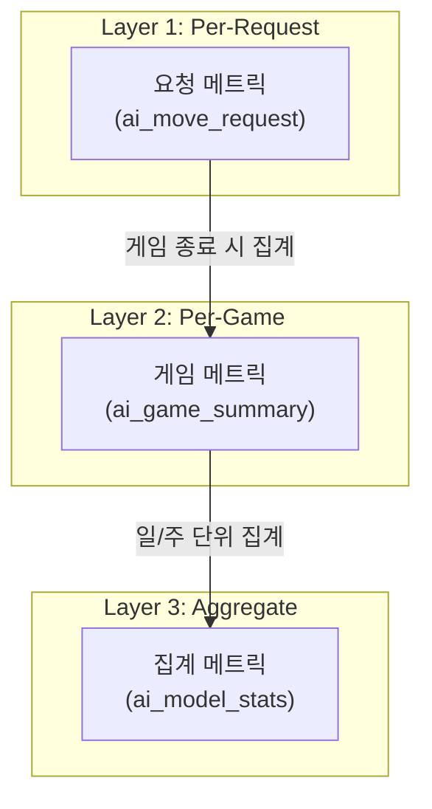
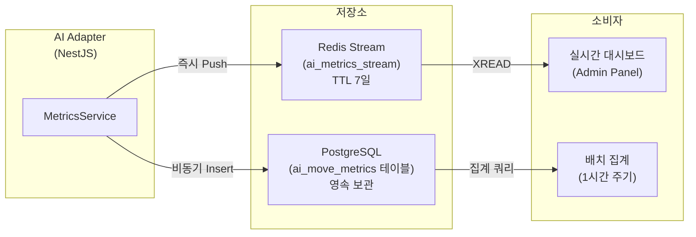
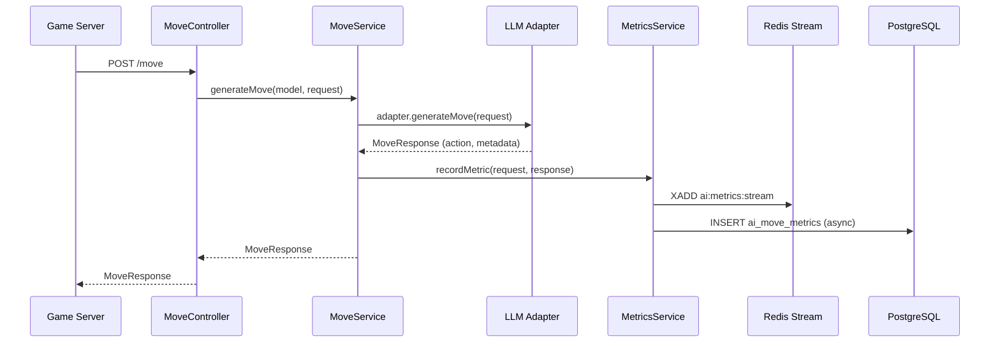
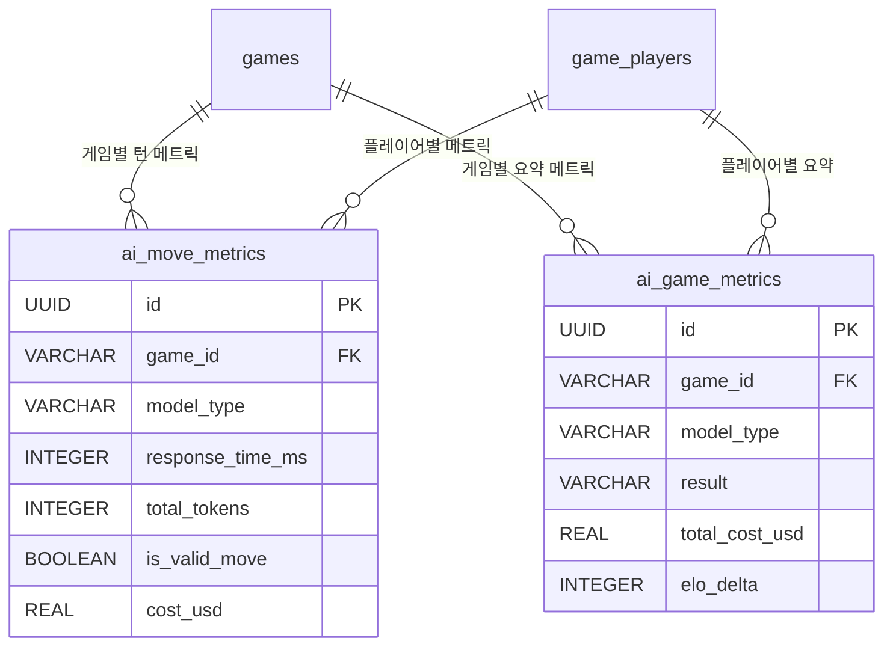

# LLM 성능 메트릭 스키마 설계 (LLM Performance Metrics Schema)

**작성일**: 2026-03-30
**상태**: 설계 완료 -- Sprint 5 구현 대상
**관련 백로그**: BL-S4-006 (모델별 성능 비교 메트릭 수집), BL-S4-007 (AI 호출 로그/메트릭 수집)
**담당**: AI Engineer

---

## 1. 목적

AI vs AI 100판 토너먼트 및 모델별 전략 비교를 위한 정량적 메트릭 수집 체계를 설계한다.
수집 데이터는 다음 질문에 답할 수 있어야 한다.

- 어떤 모델이 가장 빠르고 정확한가? (응답 시간, JSON 성공률)
- 어떤 모델이 가장 강한가? (승률, ELO 변화)
- 어떤 캐릭터-모델 조합이 최적인가? (전략 품질)
- 운영 비용은 얼마인가? (토큰, 달러)

---

## 2. 메트릭 계층 구조



---

## 3. Layer 1: Per-Request 메트릭 (턴 단위)

### 3.1 스키마

| 필드 | 타입 | 설명 | 소스 |
|------|------|------|------|
| `id` | UUID | PK | 서버 생성 |
| `game_id` | string | 게임 세션 ID | MoveRequest.gameId |
| `player_id` | string | AI 플레이어 ID | MoveRequest.playerId |
| `model_type` | string | 모델 공급자 (openai/claude/deepseek/ollama) | MoveResponse.metadata.modelType |
| `model_name` | string | 실제 모델명 (gpt-4o-mini, gemma3:1b 등) | MoveResponse.metadata.modelName |
| `persona` | string | AI 캐릭터 (rookie/calculator/shark/fox/wall/wildcard) | MoveRequest.persona |
| `difficulty` | string | 난이도 (beginner/intermediate/expert) | MoveRequest.difficulty |
| `psych_level` | integer | 심리전 레벨 (0~3) | MoveRequest.psychologyLevel |
| `turn_number` | integer | 현재 턴 번호 | MoveRequest.gameState.turnNumber |
| `action` | string | 최종 행동 (place/draw) | MoveResponse.action |
| `response_time_ms` | integer | LLM 응답 지연시간 (ms) | MoveResponse.metadata.latencyMs |
| `prompt_tokens` | integer | 입력 토큰 수 | MoveResponse.metadata.promptTokens |
| `completion_tokens` | integer | 출력 토큰 수 | MoveResponse.metadata.completionTokens |
| `total_tokens` | integer | 합계 토큰 (prompt + completion) | 계산 |
| `is_valid_move` | boolean | 유효한 수 여부 (Game Engine 검증 결과) | Engine 검증 후 |
| `retry_count` | integer | 재시도 횟수 (0 = 첫 시도 성공) | MoveResponse.metadata.retryCount |
| `is_fallback_draw` | boolean | 강제 드로우 여부 | MoveResponse.metadata.isFallbackDraw |
| `tiles_placed_count` | integer | 이번 턴에 배치한 타일 수 | tilesFromRack.length |
| `temperature` | float | 사용된 temperature 값 | 난이도별 매핑 |
| `cost_usd` | float | 이번 호출의 예상 비용 (USD) | 토큰 기반 계산 |
| `error_message` | string (nullable) | 실패 시 에러 메시지 | 파싱/검증 에러 |
| `reasoning` | text (nullable) | AI 사고 과정 (디버깅용) | MoveResponse.reasoning |
| `created_at` | timestamp | 기록 시각 | 서버 시각 |

### 3.2 비용 계산 공식

```typescript
// 모델별 비용 (per 1K tokens, 2026-03 공시)
const COST_TABLE: Record<string, { input: number; output: number }> = {
  'gpt-4o':              { input: 2.50 / 1000, output: 10.00 / 1000 },
  'gpt-4o-mini':         { input: 0.15 / 1000, output: 0.60 / 1000 },
  'claude-sonnet-4-20250514': { input: 3.00 / 1000, output: 15.00 / 1000 },
  'deepseek-chat':       { input: 0.14 / 1000, output: 0.28 / 1000 },
  'gemma3:1b':           { input: 0, output: 0 },  // 로컬 실행
};

function calculateCost(modelName: string, promptTokens: number, completionTokens: number): number {
  const rate = COST_TABLE[modelName] ?? { input: 0, output: 0 };
  return (promptTokens * rate.input) + (completionTokens * rate.output);
}
```

### 3.3 TypeScript 인터페이스

```typescript
interface AiMoveMetric {
  id: string;
  gameId: string;
  playerId: string;
  modelType: 'openai' | 'claude' | 'deepseek' | 'ollama';
  modelName: string;
  persona: string;
  difficulty: string;
  psychLevel: number;
  turnNumber: number;
  action: 'place' | 'draw';
  responseTimeMs: number;
  promptTokens: number;
  completionTokens: number;
  totalTokens: number;
  isValidMove: boolean;
  retryCount: number;
  isFallbackDraw: boolean;
  tilesPlacedCount: number;
  temperature: number;
  costUsd: number;
  errorMessage?: string;
  reasoning?: string;
  createdAt: Date;
}
```

---

## 4. Layer 2: Per-Game 메트릭 (게임 단위)

### 4.1 스키마

게임 종료(FINISHED) 시 Layer 1 데이터를 집계하여 생성한다.

| 필드 | 타입 | 설명 | 집계 방법 |
|------|------|------|-----------|
| `id` | UUID | PK | 서버 생성 |
| `game_id` | string | 게임 세션 ID | 고유 |
| `model_type` | string | 모델 공급자 | 그룹 키 |
| `model_name` | string | 실제 모델명 | 그룹 키 |
| `persona` | string | AI 캐릭터 | 그룹 키 |
| `difficulty` | string | 난이도 | 그룹 키 |
| `psych_level` | integer | 심리전 레벨 | 그룹 키 |
| `total_turns` | integer | AI가 플레이한 총 턴 수 | COUNT(*) |
| `place_count` | integer | 배치(place) 횟수 | COUNT(action='place') |
| `draw_count` | integer | 드로우(draw) 횟수 | COUNT(action='draw') |
| `total_tokens` | integer | 사용 총 토큰 | SUM(total_tokens) |
| `total_cost_usd` | float | 사용 총 비용 | SUM(cost_usd) |
| `avg_response_time_ms` | float | 평균 응답 시간 | AVG(response_time_ms) |
| `max_response_time_ms` | integer | 최대 응답 시간 | MAX(response_time_ms) |
| `total_retry_count` | integer | 총 재시도 횟수 | SUM(retry_count) |
| `fallback_draw_count` | integer | 강제 드로우 횟수 | COUNT(is_fallback_draw=true) |
| `invalid_move_count` | integer | 무효 수 횟수 | COUNT(is_valid_move=false) |
| `invalid_move_ratio` | float | 무효 수 비율 (0.0~1.0) | invalid / total |
| `total_tiles_placed` | integer | 배치한 총 타일 수 | SUM(tiles_placed_count) |
| `result` | string | 게임 결과 (win/loss/draw/stalemate) | 게임 종료 시 판정 |
| `final_tile_count` | integer | 종료 시 남은 타일 수 | 게임 상태 |
| `final_score` | integer | 종료 시 남은 타일 점수 합 | 계산 |
| `elo_delta` | integer | ELO 변동량 | ELO 서비스 |
| `game_duration_sec` | integer | 게임 총 소요 시간 (초) | 시작~종료 시각 차 |
| `created_at` | timestamp | 기록 시각 | 서버 시각 |

---

## 5. Layer 3: Aggregate 메트릭 (모델/기간 단위)

### 5.1 집계 쿼리 뷰

주기적 배치(1시간/1일)로 집계하거나 Admin API에서 실시간 쿼리한다.

| 메트릭 | SQL 예시 | 용도 |
|--------|---------|------|
| **모델별 p50/p95 응답 시간** | `PERCENTILE_CONT(0.5/0.95) WITHIN GROUP (ORDER BY response_time_ms)` | SLA 모니터링 |
| **JSON 파싱 성공률** | `1 - (SUM(CASE WHEN is_fallback_draw THEN 1 ELSE 0 END) / COUNT(*))` | 모델 품질 |
| **유효 수 비율** | `SUM(CASE WHEN is_valid_move THEN 1 ELSE 0 END) / COUNT(*)` | 프롬프트 품질 |
| **모델별 승률** | `COUNT(result='win') / COUNT(*)` per model_type | 전략 비교 |
| **평균 게임 길이** | `AVG(total_turns)` per model_type | 캐릭터 특성 확인 |
| **비용 효율** | `SUM(cost_usd) / COUNT(result='win')` | 비용 대비 승률 |
| **캐릭터별 승률** | `COUNT(result='win') / COUNT(*)` per persona | 캐릭터 밸런스 |

### 5.2 집계 결과 인터페이스

```typescript
interface AiModelAggregateStats {
  modelType: string;
  modelName: string;
  period: string;              // '2026-03-30' or '2026-W14'
  totalGames: number;
  totalRequests: number;

  // 응답 시간
  responseTimeP50Ms: number;
  responseTimeP95Ms: number;
  responseTimeP99Ms: number;
  responseTimeAvgMs: number;

  // 정확도
  jsonParseSuccessRate: number; // 0.0~1.0
  validMoveRate: number;        // 0.0~1.0
  fallbackDrawRate: number;     // 0.0~1.0
  avgRetryCount: number;

  // 전략
  winRate: number;              // 0.0~1.0
  avgGameTurns: number;
  placeToDrawRatio: number;     // place / draw
  avgTilesPlacedPerTurn: number;

  // 비용
  totalTokens: number;
  totalCostUsd: number;
  costPerGame: number;
  costPerWin: number;
}
```

---

## 6. 저장소 아키텍처

### 6.1 이중 저장 전략 (Redis Stream + PostgreSQL)



### 6.2 Redis Stream 구조

```
Stream Key: ai:metrics:stream
Entry Fields:
  game_id, player_id, model_type, model_name, persona, difficulty,
  psych_level, turn_number, action, response_time_ms,
  prompt_tokens, completion_tokens, is_valid_move, retry_count,
  is_fallback_draw, tiles_placed_count, cost_usd, created_at

Consumer Groups:
  - dashboard_consumer: Admin Panel 실시간 표시용
  - flush_consumer: PostgreSQL 플러시용 (5분 배치)

TTL: 604800 (7일) - MAXLEN ~10000으로 메모리 보호
```

### 6.3 PostgreSQL 테이블 DDL

```sql
-- Per-Request 메트릭 (Layer 1)
CREATE TABLE ai_move_metrics (
    id                  UUID PRIMARY KEY DEFAULT gen_random_uuid(),
    game_id             VARCHAR(100) NOT NULL,
    player_id           VARCHAR(100) NOT NULL,
    model_type          VARCHAR(20) NOT NULL,
    model_name          VARCHAR(100) NOT NULL,
    persona             VARCHAR(30) NOT NULL,
    difficulty          VARCHAR(20) NOT NULL,
    psych_level         INTEGER NOT NULL DEFAULT 0,
    turn_number         INTEGER NOT NULL,
    action              VARCHAR(10) NOT NULL,
    response_time_ms    INTEGER NOT NULL,
    prompt_tokens       INTEGER NOT NULL DEFAULT 0,
    completion_tokens   INTEGER NOT NULL DEFAULT 0,
    total_tokens        INTEGER GENERATED ALWAYS AS (prompt_tokens + completion_tokens) STORED,
    is_valid_move       BOOLEAN NOT NULL DEFAULT true,
    retry_count         INTEGER NOT NULL DEFAULT 0,
    is_fallback_draw    BOOLEAN NOT NULL DEFAULT false,
    tiles_placed_count  INTEGER NOT NULL DEFAULT 0,
    temperature         REAL,
    cost_usd            REAL NOT NULL DEFAULT 0,
    error_message       TEXT,
    reasoning           TEXT,
    created_at          TIMESTAMPTZ NOT NULL DEFAULT NOW()
);

CREATE INDEX idx_ai_move_metrics_game ON ai_move_metrics(game_id);
CREATE INDEX idx_ai_move_metrics_model ON ai_move_metrics(model_type, created_at);
CREATE INDEX idx_ai_move_metrics_persona ON ai_move_metrics(persona, difficulty);
CREATE INDEX idx_ai_move_metrics_time ON ai_move_metrics(created_at);

-- Per-Game 메트릭 (Layer 2)
CREATE TABLE ai_game_metrics (
    id                  UUID PRIMARY KEY DEFAULT gen_random_uuid(),
    game_id             VARCHAR(100) NOT NULL,
    player_id           VARCHAR(100) NOT NULL,
    model_type          VARCHAR(20) NOT NULL,
    model_name          VARCHAR(100) NOT NULL,
    persona             VARCHAR(30) NOT NULL,
    difficulty          VARCHAR(20) NOT NULL,
    psych_level         INTEGER NOT NULL DEFAULT 0,
    total_turns         INTEGER NOT NULL,
    place_count         INTEGER NOT NULL DEFAULT 0,
    draw_count          INTEGER NOT NULL DEFAULT 0,
    total_tokens        INTEGER NOT NULL DEFAULT 0,
    total_cost_usd      REAL NOT NULL DEFAULT 0,
    avg_response_time_ms REAL NOT NULL DEFAULT 0,
    max_response_time_ms INTEGER NOT NULL DEFAULT 0,
    total_retry_count   INTEGER NOT NULL DEFAULT 0,
    fallback_draw_count INTEGER NOT NULL DEFAULT 0,
    invalid_move_count  INTEGER NOT NULL DEFAULT 0,
    invalid_move_ratio  REAL NOT NULL DEFAULT 0,
    total_tiles_placed  INTEGER NOT NULL DEFAULT 0,
    result              VARCHAR(20) NOT NULL,    -- win, loss, draw, stalemate
    final_tile_count    INTEGER,
    final_score         INTEGER,
    elo_delta           INTEGER,
    game_duration_sec   INTEGER,
    created_at          TIMESTAMPTZ NOT NULL DEFAULT NOW()
);

CREATE INDEX idx_ai_game_metrics_model ON ai_game_metrics(model_type, result);
CREATE INDEX idx_ai_game_metrics_persona ON ai_game_metrics(persona, result);
CREATE INDEX idx_ai_game_metrics_time ON ai_game_metrics(created_at);

-- 보관 정책: 90일 이전 데이터 자동 아카이브
-- CRON: DELETE FROM ai_move_metrics WHERE created_at < NOW() - INTERVAL '90 days';
```

---

## 7. 수집 구현 설계

### 7.1 MetricsService (AI Adapter 내부)



### 7.2 MetricsService 인터페이스

```typescript
@Injectable()
export class MetricsService {
  /**
   * Per-Request 메트릭을 기록한다.
   * Redis Stream에 즉시 Push하고, PostgreSQL에 비동기 Insert한다.
   */
  async recordMoveMetric(
    request: MoveRequestDto,
    response: MoveResponseDto,
    isValidMove: boolean,
  ): Promise<void>;

  /**
   * 게임 종료 시 Per-Game 메트릭을 집계하여 기록한다.
   */
  async recordGameMetric(
    gameId: string,
    playerId: string,
    result: 'win' | 'loss' | 'draw' | 'stalemate',
    finalTileCount: number,
    finalScore: number,
    eloDelta: number,
    gameDurationSec: number,
  ): Promise<void>;

  /**
   * Admin API: 모델별 집계 통계를 반환한다.
   */
  async getModelStats(
    period?: string,
    modelType?: string,
  ): Promise<AiModelAggregateStats[]>;

  /**
   * Admin API: 특정 게임의 턴별 메트릭을 반환한다.
   */
  async getGameMetrics(gameId: string): Promise<AiMoveMetric[]>;
}
```

### 7.3 MoveService 연동 포인트

```typescript
// move.service.ts 수정 포인트 (설계)
async generateMove(model: ModelType, request: MoveRequestDto): Promise<MoveResponseDto> {
  const adapter = this.selectAdapter(model);
  const response = await adapter.generateMove(request);

  // [추가] 메트릭 기록 (비동기, 게임 진행에 영향 없음)
  this.metricsService.recordMoveMetric(request, response, !response.metadata.isFallbackDraw)
    .catch(err => this.logger.error(`메트릭 기록 실패: ${err.message}`));

  return response;
}
```

---

## 8. Admin API 확장

### 8.1 신규 엔드포인트

| 메서드 | 경로 | 설명 |
|--------|------|------|
| GET | `/admin/stats/ai/metrics` | 모델별 집계 통계 (period, modelType 필터) |
| GET | `/admin/stats/ai/metrics/:gameId` | 특정 게임의 턴별 AI 메트릭 |
| GET | `/admin/stats/ai/leaderboard` | AI 모델 승률 순위 |
| GET | `/admin/stats/ai/cost` | 일별 비용 추이 |

### 8.2 응답 예시: GET /admin/stats/ai/metrics?period=2026-03-30

```json
[
  {
    "modelType": "openai",
    "modelName": "gpt-4o-mini",
    "period": "2026-03-30",
    "totalGames": 25,
    "totalRequests": 312,
    "responseTimeP50Ms": 1250,
    "responseTimeP95Ms": 3100,
    "responseTimeP99Ms": 4500,
    "responseTimeAvgMs": 1480,
    "jsonParseSuccessRate": 0.994,
    "validMoveRate": 0.962,
    "fallbackDrawRate": 0.006,
    "avgRetryCount": 0.08,
    "winRate": 0.40,
    "avgGameTurns": 18.5,
    "placeToDrawRatio": 1.8,
    "avgTilesPlacedPerTurn": 2.4,
    "totalTokens": 156000,
    "totalCostUsd": 0.45,
    "costPerGame": 0.018,
    "costPerWin": 0.045
  }
]
```

---

## 9. 기존 테이블과의 관계

### 9.1 ai_call_logs와의 차이

기존 `ai_call_logs` 테이블(DB 설계 2.4절)은 game-server 측에서 기록하는 기본 로그이다.
신규 `ai_move_metrics` 테이블은 AI Adapter 내부에서 수집하는 상세 메트릭으로, 역할이 다르다.

| 비교 | ai_call_logs (기존) | ai_move_metrics (신규) |
|------|--------------------|-----------------------|
| 기록 위치 | game-server | ai-adapter |
| 비용 계산 | 없음 | cost_usd 포함 |
| 유효 수 검증 | is_valid_move | is_valid_move + retry_count |
| 배치 타일 수 | 없음 | tiles_placed_count |
| 게임 결과 | 없음 | ai_game_metrics로 분리 |
| 집계 뷰 | 없음 | Layer 3 집계 |

향후 `ai_call_logs`를 `ai_move_metrics`로 마이그레이션하여 단일 소스로 통합할 수 있다.

### 9.2 ER 관계



---

## 10. 구현 우선순위

| 순서 | 항목 | 예상 SP | 선행 조건 |
|------|------|---------|-----------|
| 1 | MetricsService 클래스 + ai_move_metrics PostgreSQL 테이블 생성 | 2 | - |
| 2 | MoveService -> MetricsService 연동 (비동기 기록) | 1 | 1 |
| 3 | Redis Stream XADD + Consumer Group 설정 | 2 | 1 |
| 4 | Admin API GET /admin/stats/ai/metrics 엔드포인트 | 2 | 1, 2 |
| 5 | ai_game_metrics 게임 종료 시 집계 로직 | 2 | 1, 2 |
| 6 | Layer 3 집계 배치 + 대시보드 연동 | 3 | 4, 5 |

**총 예상**: 12 SP (Sprint 5 배분)

---

## 11. 모니터링 알림 기준

| 지표 | 경고 조건 | 알림 채널 |
|------|----------|-----------|
| 응답 시간 p95 | > 10,000ms | 카카오톡 |
| Fallback Draw 비율 | > 20% (1시간 윈도우) | 카카오톡 |
| 일일 비용 | > $8 (cap $10의 80%) | 카카오톡 |
| JSON 파싱 실패율 | > 10% (1시간 윈도우) | 카카오톡 |

---

## 관련 문서

| 파일 | 설명 |
|------|------|
| `docs/02-design/04-ai-adapter-design.md` | AI Adapter 설계 (메트릭 수집 항목 원본) |
| `docs/02-design/02-database-design.md` | DB 설계 (ai_call_logs 기존 테이블) |
| `docs/04-testing/12-llm-model-comparison.md` | LLM 모델별 성능 비교 (실측 데이터 갱신 대상) |
| `docs/04-testing/21-ai-vs-ai-tournament-test-plan.md` | AI vs AI 100판 테스트 시나리오 |
| `src/ai-adapter/src/adapter/base.adapter.ts` | 공통 재시도/fallback 로직 |
| `src/ai-adapter/src/common/dto/move-response.dto.ts` | MoveMetadataDto (메트릭 소스) |
