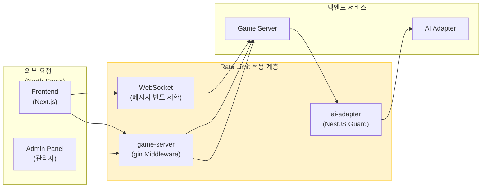
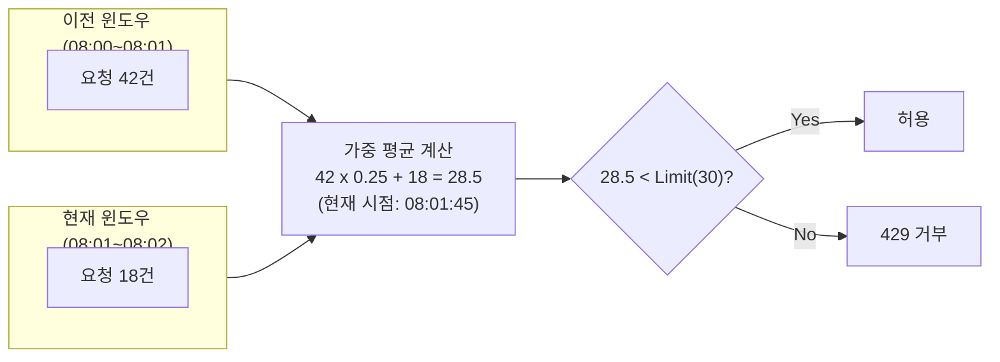
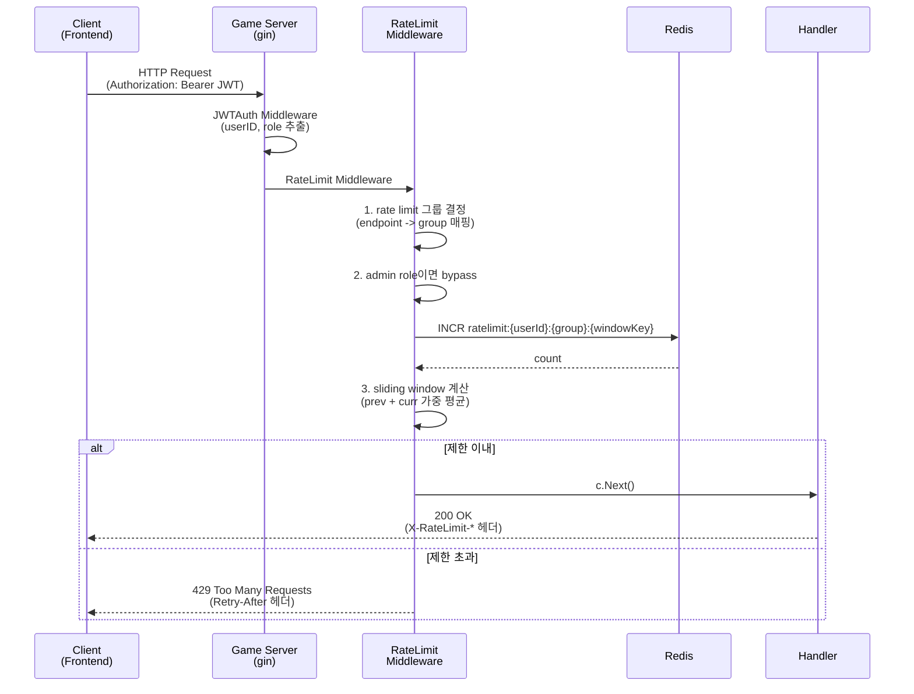
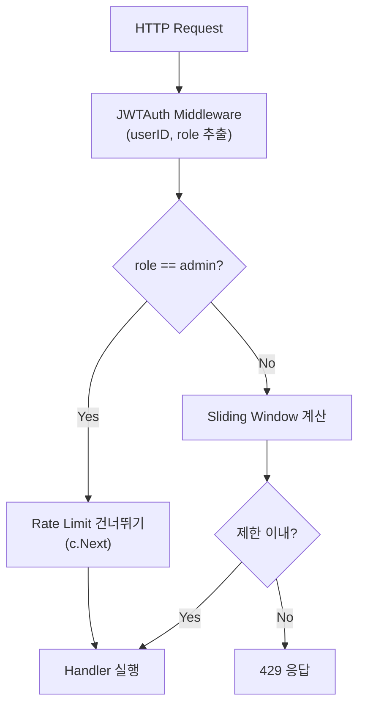
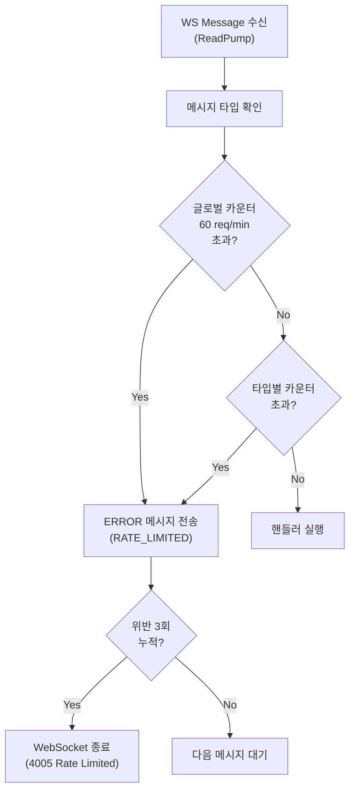

# Rate Limit 설계 (Rate Limiting Architecture)

**작성일**: 2026-04-04
**상태**: 설계 완료 -- Sprint 5 구현 대상
**관련 백로그**: Security Review P1 (API Rate Limit 미구현)
**담당**: Architect, Go Developer, Node Developer

---

## 1. 개요

### 1.1 필요성

RummiArena는 인증된 사용자와 내부 서비스 간 통신이 혼재하는 플랫폼이다. 현재 다음 위협에 노출되어 있다.

| 위협 | 영향 | 현재 상태 |
|------|------|-----------|
| 무차별 인증 시도 | OAuth 토큰 탈취 | 미보호 |
| Room 생성 남용 | 메모리 리소스 고갈 | 미보호 |
| 게임 액션 폭주 | Game Engine CPU 부하 | 미보호 |
| AI Adapter 반복 호출 | LLM API 비용 폭증 | CostLimitGuard만 존재 (일일 한도) |
| WebSocket 메시지 폭탄 | 서버 이벤트 루프 블로킹 | maxMessageSize(8KB)만 존재 |

### 1.2 범위



**적용 대상**:
- game-server: REST API 전체 + WebSocket 메시지
- ai-adapter: POST /move 엔드포인트 (내부 서비스 호출이나, game-server 버그로 인한 무한 루프 방어)

**비적용 대상**:
- `/health`, `/ready` 헬스체크 엔드포인트 (K8s probe)
- ai-adapter의 `/health`, `/stats/*` 조회 엔드포인트 (내부 모니터링 전용)

---

## 2. 알고리즘 선택

### 2.1 후보 비교

| 알고리즘 | 원리 | 장점 | 단점 | Redis 연산 |
|----------|------|------|------|------------|
| Fixed Window Counter | 고정 시간 창(예: 1분)마다 카운터 초기화 | 구현 단순, 메모리 최소 | 경계 시점에 2배 허용 (burst) | INCR + EXPIRE |
| Sliding Window Log | 요청마다 타임스탬프 기록, 윈도우 내 개수 계산 | 정확한 제한 | 메모리 사용 높음 (요청별 기록) | ZADD + ZRANGEBYSCORE + ZCARD |
| **Sliding Window Counter** | Fixed Window 2개를 가중 평균으로 혼합 | 정확도/메모리 균형, 경계 burst 완화 | 근사치 (완전 정밀하지 않음) | INCR + EXPIRE (2키) |
| Token Bucket | 토큰이 일정 속도로 충전, 요청 시 소비 | 버스트 허용, 유연한 속도 제어 | 상태 관리 복잡 (잔여 토큰+마지막 충전 시각) | GET + SET (Lua script) |
| Leaky Bucket | 큐에 넣고 고정 속도로 처리 | 출력 속도 일정 | 큐 관리 필요, 지연 발생 | 복잡 |

### 2.2 결정: Sliding Window Counter

**선택 근거**:

1. **정확성**: Fixed Window의 경계 burst 문제를 해결 (2배 초과 방지)
2. **단순성**: Redis `INCR` + `EXPIRE` 2회로 구현 가능 (Lua script 불필요)
3. **메모리 효율**: Sliding Window Log 대비 요청별 기록 불필요 (카운터 2개로 충분)
4. **16GB RAM 제약**: 최소 Redis 메모리 사용 (사용자당 키 2개 x 엔드포인트 그룹 수)
5. **실용성**: Cloudflare, GitHub API 등 대규모 서비스에서 검증된 알고리즘

**동작 원리**:



현재 시각이 윈도우의 75% 지점(08:01:45)이라면:
- 이전 윈도우 가중치: `1 - 0.75 = 0.25`
- 추정 요청 수: `prev_count * 0.25 + curr_count = 42 * 0.25 + 18 = 28.5`
- 제한값(30) 이내이므로 허용

---

## 3. 아키텍처

### 3.1 전체 흐름



### 3.2 game-server (Go/gin) 구현

#### 미들웨어 체인 순서

```
Recovery -> ZapLogger -> CORS -> JWTAuth -> RateLimit -> Handler
```

RateLimit 미들웨어는 **JWTAuth 이후**에 배치한다. JWT에서 추출한 `userID`와 `role`을 사용하기 때문이다.

#### 미들웨어 인터페이스

```go
// middleware/ratelimit.go

// RateLimitConfig rate limit 설정
type RateLimitConfig struct {
    RedisClient *redis.Client
    Logger      *zap.Logger
}

// RateLimitGroup 엔드포인트 그룹별 제한 설정
type RateLimitGroup struct {
    Name     string        // 그룹명 (Redis key에 사용)
    Limit    int           // 윈도우당 최대 요청 수
    Window   time.Duration // 윈도우 크기
}

// RateLimit gin 미들웨어를 반환한다.
// group 파라미터로 엔드포인트 그룹별 제한을 적용한다.
func RateLimit(cfg RateLimitConfig, group RateLimitGroup) gin.HandlerFunc {
    return func(c *gin.Context) {
        // 1. admin role이면 bypass
        role, _ := RoleFromContext(c)
        if role == "admin" {
            c.Next()
            return
        }

        // 2. userID 추출 (미인증 요청은 IP 기반)
        userID, ok := UserIDFromContext(c)
        if !ok {
            userID = c.ClientIP()
        }

        // 3. sliding window 계산 + Redis INCR
        allowed, retryAfter := checkRateLimit(
            c.Request.Context(), cfg.RedisClient,
            userID, group,
        )

        // 4. 응답 헤더 설정
        setRateLimitHeaders(c, group, allowed, retryAfter)

        if !allowed {
            cfg.Logger.Warn("rate limit exceeded",
                zap.String("user", userID),
                zap.String("group", group.Name),
            )
            c.AbortWithStatusJSON(http.StatusTooManyRequests, gin.H{
                "error": gin.H{
                    "code":    "RATE_LIMITED",
                    "message": "요청 빈도 제한을 초과했습니다. 잠시 후 다시 시도하세요.",
                    "retryAfterSec": retryAfter,
                },
            })
            return
        }

        c.Next()
    }
}
```

#### 라우터 등록 예시

```go
// main.go - registerAPIRoutes

rlCfg := middleware.RateLimitConfig{
    RedisClient: redisClient,
    Logger:      logger,
}

// 인증 엔드포인트: IP 기반 (JWT 없음)
auth := api.Group("/auth")
auth.Use(middleware.RateLimit(rlCfg, middleware.RateLimitGroup{
    Name: "auth", Limit: 10, Window: time.Minute,
}))

// Room 생성: 사용자 기반
rooms := api.Group("/rooms")
rooms.Use(middleware.JWTAuth(cfg.JWT.Secret))
rooms.POST("", middleware.RateLimit(rlCfg, middleware.RateLimitGroup{
    Name: "room-create", Limit: 5, Window: time.Minute,
}), roomHandler.CreateRoom)

// Room 조회: 사용자 기반 (높은 한도)
rooms.GET("", middleware.RateLimit(rlCfg, middleware.RateLimitGroup{
    Name: "room-read", Limit: 60, Window: time.Minute,
}), roomHandler.ListRooms)
```

### 3.3 ai-adapter (NestJS) 구현

ai-adapter는 game-server에서만 호출되는 내부 서비스이다. 이미 InternalTokenGuard와 CostLimitGuard가 적용되어 있으므로, Rate Limit은 **방어적 계층**으로 추가한다.

#### NestJS Guard 인터페이스

```typescript
// common/guards/rate-limit.guard.ts

@Injectable()
export class RateLimitGuard implements CanActivate {
  constructor(
    @Inject(REDIS_CLIENT) private readonly redis: Redis,
    private readonly configService: ConfigService,
  ) {}

  async canActivate(context: ExecutionContext): Promise<boolean> {
    const request = context.switchToHttp().getRequest<Request>();

    // 식별자: X-Internal-Token + 요청 gameId 기반
    const gameId = request.body?.gameId ?? 'unknown';
    const key = `ratelimit:ai:move:${gameId}`;

    // 게임당 분당 8회 (4인 게임 x 2배 여유)
    const allowed = await this.checkSlidingWindow(key, 8, 60);

    if (!allowed) {
      throw new HttpException(
        {
          statusCode: HttpStatus.TOO_MANY_REQUESTS,
          error: 'Rate Limit Exceeded',
          message: 'AI move 요청 빈도 한도를 초과했습니다.',
        },
        HttpStatus.TOO_MANY_REQUESTS,
      );
    }

    return true;
  }
}
```

#### Guard 체인 순서

```
InternalTokenGuard -> RateLimitGuard -> CostLimitGuard -> Controller
```

### 3.4 Redis Key 설계

#### Key 네임스페이스

```
ratelimit:{scope}:{identifier}:{group}:{windowKey}
```

| 필드 | 설명 | 예시 |
|------|------|------|
| scope | 서비스 구분 | `gs` (game-server), `ai` (ai-adapter) |
| identifier | 사용자 ID 또는 IP | `user-abc123`, `192.168.1.1` |
| group | 엔드포인트 그룹 | `auth`, `room-create`, `game-action` |
| windowKey | 윈도우 타임스탬프 (분 단위) | `202604041530` |

#### 예시 키

```
ratelimit:gs:user-abc123:room-create:202604041530    # 현재 윈도우 카운터
ratelimit:gs:user-abc123:room-create:202604041529    # 이전 윈도우 카운터
ratelimit:gs:192.168.1.1:auth:202604041530           # 미인증 IP 기반
ratelimit:ai:move:game-xyz789:202604041530           # AI move 게임별
```

#### 기존 Redis Key 네임스페이스와의 공존

| Prefix | 용도 | 소유 서비스 |
|--------|------|-------------|
| `game:{id}:state` | 게임 상태 | game-server |
| `game:{id}:timer` | 턴 타이머 | game-server |
| `ws:session:{userId}:{roomId}` | WS 세션 | game-server |
| `ranking:global` | ELO 랭킹 | game-server |
| `ranking:tier:{tier}` | 티어별 랭킹 | game-server |
| `quota:daily:{date}` | LLM 비용 추적 | ai-adapter |
| **`ratelimit:gs:*`** | **REST/WS Rate Limit** | **game-server (신규)** |
| **`ratelimit:ai:*`** | **AI Move Rate Limit** | **ai-adapter (신규)** |

#### TTL 전략

| 키 패턴 | TTL | 근거 |
|---------|-----|------|
| `ratelimit:gs:*` | 윈도우 크기 x 2 | 이전+현재 윈도우 모두 필요. 1분 윈도우 -> TTL 120초 |
| `ratelimit:ai:*` | 윈도우 크기 x 2 | 동일 |

- `INCR` 시 키가 새로 생성되면 `EXPIRE`로 TTL 설정 (최초 1회)
- TTL이 윈도우 크기보다 길어야 이전 윈도우 카운터를 참조할 수 있다

---

## 4. Rate Limit 정책 테이블

### 4.1 game-server REST API

| 엔드포인트 | 그룹 | Limit | Window | 식별자 | 근거 |
|-----------|------|-------|--------|--------|------|
| `POST /api/auth/google` | auth | 10 req | 1분 | IP | OAuth 브루트포스 방지 |
| `POST /api/auth/google/token` | auth | 10 req | 1분 | IP | 동일 |
| `POST /api/auth/dev-login` | auth | 20 req | 1분 | IP | 개발 환경 여유 부여 |
| `POST /api/rooms` | room-create | 5 req | 1분 | userID | Room 남용 방지 (5분에 25개면 과다) |
| `GET /api/rooms` | room-read | 60 req | 1분 | userID | 목록 조회 (폴링 고려) |
| `GET /api/rooms/:id` | room-read | 60 req | 1분 | userID | 상세 조회 |
| `POST /api/rooms/:id/join` | room-action | 10 req | 1분 | userID | 입장 빈도 제한 |
| `POST /api/rooms/:id/leave` | room-action | 10 req | 1분 | userID | 퇴장 빈도 제한 |
| `POST /api/rooms/:id/start` | room-action | 5 req | 1분 | userID | 게임 시작은 낮게 |
| `DELETE /api/rooms/:id` | room-action | 10 req | 1분 | userID | 삭제 빈도 제한 |
| `GET /api/games/:id` | game-read | 60 req | 1분 | userID | 게임 상태 조회 |
| `POST /api/games/:id/place` | game-action | 30 req | 1분 | userID | 타일 배치 (드래그 빈도 고려) |
| `POST /api/games/:id/confirm` | game-action | 30 req | 1분 | userID | 턴 확인 |
| `POST /api/games/:id/draw` | game-action | 30 req | 1분 | userID | 타일 드로우 |
| `POST /api/games/:id/reset` | game-action | 30 req | 1분 | userID | 턴 리셋 |
| `POST /api/practice/progress` | practice | 20 req | 1분 | userID | 연습 저장 |
| `GET /api/practice/progress` | practice-read | 30 req | 1분 | userID | 연습 조회 |
| `GET /api/rankings` | public-read | 30 req | 1분 | IP | 공개 API (인증 불필요) |
| `GET /api/rankings/tier/:tier` | public-read | 30 req | 1분 | IP | 공개 API |
| `GET /api/users/:id/rating` | public-read | 30 req | 1분 | IP | 공개 API |
| `GET /api/users/:id/rating/history` | user-read | 30 req | 1분 | userID | ELO 이력 |
| `GET /admin/*` | admin | **면제** | - | - | 관리자 역할 전체 면제 |

### 4.2 game-server WebSocket

| 메시지 타입 | Limit | Window | 식별자 | 근거 |
|------------|-------|--------|--------|------|
| AUTH | 3 req | 1분 | 커넥션 | 인증 재시도 제한 |
| PLACE_TILES | 20 req | 1분 | userID | 드래그 앤 드롭 빈도 (실시간 피드백) |
| CONFIRM_TURN | 10 req | 1분 | userID | 턴 확인은 낮게 |
| DRAW_TILE | 10 req | 1분 | userID | 드로우 빈도 |
| RESET_TURN | 10 req | 1분 | userID | 리셋 빈도 |
| CHAT | 10 req | 1분 | userID | 채팅 스팸 방지 |
| PING | 5 req | 1분 | 커넥션 | 하트비트 (25초 주기 = 약 2.4회/분) |
| **전체 메시지** | **60 req** | **1분** | 커넥션 | 글로벌 상한 (모든 타입 합산) |

### 4.3 ai-adapter

| 엔드포인트 | Limit | Window | 식별자 | 근거 |
|-----------|-------|--------|--------|------|
| `POST /move` | 8 req | 1분 | gameId | 4인 게임 x 2배 여유 (4인이 매 턴 AI면 분당 ~4회) |
| `POST /move` (글로벌) | 30 req | 1분 | 전체 | 서비스 전체 LLM 호출 상한 (동시 게임 고려) |

---

## 5. 응답 형식

### 5.1 Rate Limit 응답 헤더 (모든 응답)

```
X-RateLimit-Limit: 30          # 윈도우당 최대 요청 수
X-RateLimit-Remaining: 22      # 남은 요청 수 (추정치)
X-RateLimit-Reset: 1743782520  # 윈도우 리셋 Unix timestamp (초)
```

### 5.2 429 Too Many Requests 응답

#### REST API

```http
HTTP/1.1 429 Too Many Requests
Content-Type: application/json
Retry-After: 35
X-RateLimit-Limit: 30
X-RateLimit-Remaining: 0
X-RateLimit-Reset: 1743782520

{
  "error": {
    "code": "RATE_LIMITED",
    "message": "요청 빈도 제한을 초과했습니다. 35초 후에 다시 시도하세요.",
    "retryAfterSec": 35
  }
}
```

- `Retry-After` 헤더: 현재 윈도우 종료까지 남은 초 (RFC 7231 Section 7.1.3)
- `retryAfterSec`: 응답 body에도 동일 값 포함 (프론트엔드 편의)

#### WebSocket

```json
{
  "type": "ERROR",
  "payload": {
    "code": "RATE_LIMITED",
    "message": "메시지 전송 빈도 제한을 초과했습니다. 잠시 후 다시 시도하세요.",
    "retryAfterSec": 10
  },
  "seq": 42,
  "timestamp": "2026-04-04T15:30:00.000Z"
}
```

- WebSocket은 HTTP 상태 코드가 없으므로 `ERROR` 메시지 타입으로 전달
- 과도한 위반 (1분 내 3회 이상 제한 초과) 시 WebSocket 연결 종료 (Close Code 4005)

### 5.3 에러 코드 등록

기존 `03-api-design.md`의 에러 코드 테이블에 추가:

| 코드 | HTTP Status | 설명 |
|------|-------------|------|
| RATE_LIMITED | 429 | 요청 빈도 제한 초과 |

---

## 6. 관리자(Admin) Bypass

### 6.1 정책

- JWT의 `role` 클레임이 `"admin"`인 경우 Rate Limit을 적용하지 않는다
- 기존 `middleware.RequireRole("admin")`과 동일한 클레임 기반 검증
- Bypass 시에도 `X-RateLimit-*` 헤더는 설정하지 않는다 (불필요한 정보 노출 방지)

### 6.2 구현 위치



- RateLimit 미들웨어 최상단에서 role 확인 후 즉시 bypass
- `/admin/*` 라우트는 이미 `RequireRole("admin")`이 적용되어 있으므로 Rate Limit 미들웨어 자체를 등록하지 않아도 무방하나, 방어적으로 middleware 내부에서도 bypass 처리

---

## 7. WebSocket Rate Limiting 전략

WebSocket은 HTTP와 다른 접근이 필요하다. 단일 TCP 연결 위에서 다수의 메시지가 오가므로, **연결 수 제한**과 **메시지 빈도 제한** 두 가지를 모두 적용한다.

### 7.1 연결 수 제한

| 제한 | 값 | 근거 |
|------|-----|------|
| 사용자당 동시 WebSocket 연결 | 2개 | 탭 2개 (기존 CloseDuplicate 정책과 연계) |
| IP당 동시 WebSocket 연결 | 10개 | 같은 네트워크의 다수 사용자 허용 |
| Room당 최대 연결 | 4개 | 게임 최대 인원 |

- 현재 `ws_hub.go`의 Register 로직에서 이미 동일 userID 중복 연결을 CloseDuplicate(4004)로 처리하고 있으므로, **사용자당 2개** 제한은 기존 로직 확장으로 구현

### 7.2 메시지 빈도 제한 (In-Memory)

WebSocket 메시지 rate limit은 **Redis가 아닌 in-memory**로 구현한다.

**근거**:
- WS 메시지는 초당 수십 건 발생 가능 -- 매 메시지마다 Redis RTT 추가는 성능 저하
- 각 WS 연결은 단일 서버 Pod에 고정 (sticky) -- Pod 간 공유 불필요
- 연결 종료 시 카운터 자동 해제 (메모리 누수 없음)



#### 구현: Connection 레벨 카운터

```go
// ws_connection.go 추가 필드

type wsRateLimiter struct {
    mu          sync.Mutex
    globalCount int       // 글로벌 카운터
    typeCount   map[string]int // 메시지 타입별 카운터
    windowStart time.Time // 현재 윈도우 시작
    violations  int       // 연속 위반 횟수
}
```

- `ReadPump`에서 메시지 디스패치 전에 카운터 확인
- 1분 윈도우가 만료되면 카운터 초기화 (Fixed Window, WS는 단순하게)
- 위반 3회 누적 시 연결 강제 종료 (Close Code 4005)

### 7.3 새로운 WebSocket Close Code

| 코드 | 이름 | 설명 |
|------|------|------|
| 4005 | CloseRateLimited | 메시지 빈도 제한 초과로 연결 종료 |

기존 Close Code에 추가:

```go
const (
    CloseNormal      = 1000
    CloseAuthFail    = 4001
    CloseNoRoom      = 4002
    CloseAuthTimeout = 4003
    CloseDuplicate   = 4004
    CloseRateLimited = 4005  // 신규
)
```

---

## 8. Redis Fallback 전략

### 8.1 Redis 장애 시 동작

Redis 연결 실패 시 **요청을 허용**한다 (가용성 우선, Fail-Open).

**근거**:
- Rate Limit은 보안 보완 계층이지 핵심 비즈니스 로직이 아니다
- 게임 진행이 Rate Limit 장애로 중단되면 안 된다
- CostLimitGuard도 동일한 정책을 사용하고 있다 (Redis 실패 시 허용)

```go
func checkRateLimit(ctx context.Context, rdb *redis.Client, ...) (bool, int) {
    if rdb == nil {
        return true, 0  // Redis 없으면 무조건 허용
    }

    _, err := rdb.Ping(ctx).Result()
    if err != nil {
        return true, 0  // Redis 연결 실패 시 허용 (fail-open)
    }

    // ... sliding window 계산
}
```

### 8.2 WebSocket 메시지 Rate Limit

in-memory 구현이므로 Redis 장애 영향 없음.

---

## 9. 모니터링

### 9.1 로그

Rate Limit 초과 시 structured log를 남긴다.

```json
{
  "level": "warn",
  "msg": "rate limit exceeded",
  "user": "user-abc123",
  "group": "room-create",
  "ip": "192.168.1.100",
  "currentCount": 6,
  "limit": 5,
  "windowSec": 60,
  "endpoint": "POST /api/rooms"
}
```

### 9.2 Redis 메트릭 키 (선택, Phase 6+)

향후 대시보드 연동 시 일별 Rate Limit 히트 카운터를 별도 Redis 키에 기록할 수 있다.

```
ratelimit:stats:{YYYY-MM-DD}:hits       # 일별 총 차단 횟수
ratelimit:stats:{YYYY-MM-DD}:by_group   # 그룹별 차단 횟수 (Hash)
```

현재 Phase에서는 로그만으로 충분하며, 필요 시 ELK/Loki에서 집계한다.

### 9.3 Admin 대시보드 연동 (향후)

`GET /admin/stats/ratelimit` 엔드포인트를 추가하여 실시간 Rate Limit 현황을 조회할 수 있다. 현 Sprint에서는 범위 외.

---

## 10. 구현 계획

### 10.1 파일 구조

```
src/game-server/
  internal/
    middleware/
      auth.go              # 기존 (변경 없음)
      role_middleware.go    # 기존 (변경 없음)
      ratelimit.go         # 신규: Sliding Window Counter 미들웨어
      ratelimit_test.go    # 신규: 단위 테스트
    handler/
      ws_connection.go     # 수정: wsRateLimiter 추가
      ws_handler.go        # 수정: 메시지 디스패치 전 rate limit 확인
      ws_message.go        # 수정: CloseRateLimited 추가
  cmd/server/
    main.go                # 수정: 라우트에 RateLimit 미들웨어 등록

src/ai-adapter/
  src/
    common/
      guards/
        internal-token.guard.ts   # 기존 (변경 없음)
        rate-limit.guard.ts       # 신규: AI Move Rate Limit Guard
    move/
      move.controller.ts          # 수정: @UseGuards에 RateLimitGuard 추가
```

### 10.2 단계별 구현

| 단계 | 작업 | 예상 공수 |
|------|------|-----------|
| 1 | game-server `ratelimit.go` Sliding Window 구현 + 단위 테스트 | 3h |
| 2 | game-server `main.go` 라우트 그룹별 미들웨어 등록 | 1h |
| 3 | game-server WS 메시지 in-memory rate limiter 구현 | 2h |
| 4 | ai-adapter `rate-limit.guard.ts` 구현 + 단위 테스트 | 2h |
| 5 | 통합 테스트 (429 응답, Retry-After 헤더, admin bypass) | 2h |
| 6 | 문서 업데이트 (`03-api-design.md` 에러 코드, `10-websocket-protocol.md` Close Code) | 0.5h |
| **합계** | | **10.5h** |

---

## 11. ADR (Architecture Decision Record)

### ADR-014: Rate Limiting 알고리즘으로 Sliding Window Counter 채택

**상태**: 승인됨

**맥락**: Security 리뷰에서 API Rate Limit 미구현이 P1으로 지적됨. REST API, WebSocket, 내부 서비스 호출 모두 보호 필요.

**결정**:
1. 알고리즘: Sliding Window Counter (Fixed Window 2개 가중 평균)
2. 저장소: REST는 Redis, WebSocket 메시지는 in-memory
3. 식별자: 인증 API는 IP, 나머지는 JWT userID
4. 장애 대응: Fail-Open (Redis 장애 시 허용)
5. 관리자: admin role 전면 면제

**근거**:
- Token Bucket 대비 구현 단순 (Lua script 불필요)
- Fixed Window 대비 경계 burst 문제 해결
- Sliding Window Log 대비 메모리 효율 (16GB RAM 제약)
- WS 메시지는 Pod-local이므로 Redis 불필요 (RTT 절약)

**결과**:
- game-server에 gin 미들웨어 1개 추가
- ai-adapter에 NestJS Guard 1개 추가
- Redis 키 네임스페이스 `ratelimit:*` 신규 사용
- WebSocket Close Code 4005 추가
