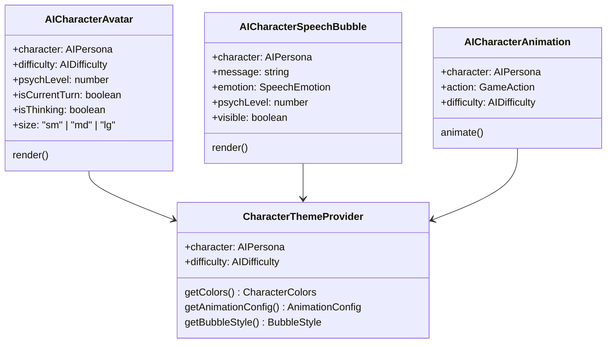
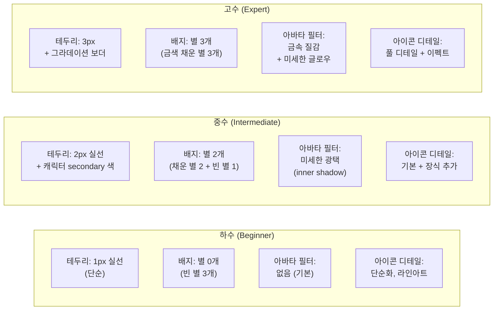
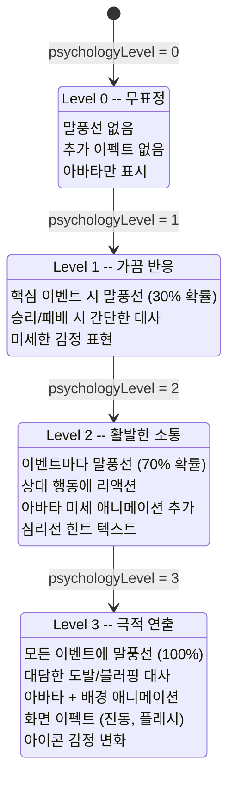
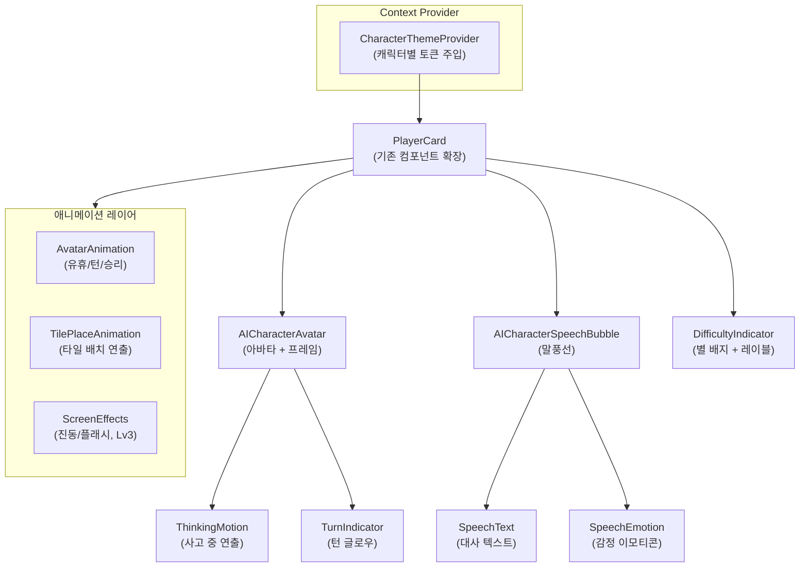

# AI 캐릭터 비주얼 아이덴티티 설계 (AI Character Visual Identity Spec)

이 문서는 RummiArena의 6종 AI 캐릭터에 대한 시각적 정체성(Visual Identity)을 정의한다.
캐릭터별 색상 팔레트, 아바타, 말풍선, 애니메이션, 난이도별 외형 변화, 심리전 레벨별 연출을 포함하며,
Frontend Dev가 Next.js + TailwindCSS + Framer Motion 스택으로 구현할 때 참조하는 설계서이다.

> **선행 문서**: [06-game-rules.md](./06-game-rules.md), [07-ui-wireframe.md](./07-ui-wireframe.md), [08-ai-prompt-templates.md](./08-ai-prompt-templates.md)

---

## 1. 설계 원칙

### 1.1 디자인 목표

| 목표 | 설명 |
|------|------|
| 즉각적 인지 | 캐릭터를 보는 즉시 성격을 직감할 수 있어야 한다 |
| 게임 몰입 | 물리적 루미큐브의 대면 긴장감을 디지털로 재현 |
| 정보 계층 | 가장 중요한 정보(턴, 타일 수)가 가장 먼저 보여야 한다 |
| 접근성 | 색상 외에 형태, 아이콘, 텍스트로 캐릭터를 구분 가능해야 한다 |
| 일관성 | 기존 디자인 토큰(`07-ui-wireframe.md`)과 충돌 없이 확장 |

### 1.2 색약 접근성 보조

모든 캐릭터 색상은 아이콘 실루엣 + 텍스트 레이블과 이중 인코딩하여 색각 이상자도 구분 가능하도록 한다.
아바타 프레임에 캐릭터 고유 패턴(대각선, 점, 파동 등)을 적용한다.

---

## 2. 캐릭터 비주얼 프로파일

### 2.1 컴포넌트 계층 구조



### 2.2 공통 디자인 토큰 구조

모든 캐릭터는 아래 구조를 공유하며, 값만 캐릭터별로 다르다.

```typescript
interface CharacterDesignTokens {
  // 색상
  colors: {
    primary: string;      // 아바타 배경, 주 색상
    secondary: string;    // 보조 장식, 테두리
    accent: string;       // 강조, CTA, 승리 연출
    glow: string;         // 턴 표시 글로우 색상
    bubbleBg: string;     // 말풍선 배경
    bubbleText: string;   // 말풍선 텍스트
  };

  // 아바타
  avatar: {
    icon: string;         // 아이콘 심볼 (이모지 대체 텍스트)
    silhouette: string;   // SVG 실루엣 키
    framePattern: string; // 테두리 패턴 (접근성)
  };

  // 애니메이션
  animation: {
    speed: "slow" | "medium" | "fast" | "chaotic";
    durationMs: number;
    easing: string;       // cubic-bezier 값
    thinkingPulse: string; // 사고 중 펄스 스타일
  };

  // 말풍선
  bubble: {
    shape: "round" | "sharp" | "angular" | "cloud" | "spiky" | "glitch";
    tailPosition: "left" | "center" | "right";
    fontWeight: number;
    fontSize: string;
  };

  // 성격 키워드
  keywords: string[];
}
```

---

### 2.3 Rookie (루키)

**성격 키워드**: 순수함, 호기심, 서투름, 따뜻함, 실수도 매력

#### 색상 팔레트

| 역할 | 토큰 | HEX | 설명 |
|------|------|-----|------|
| Primary | `characters.rookie.primary` | `#60A5FA` | 하늘색 -- 편안하고 친근한 느낌 |
| Secondary | `characters.rookie.secondary` | `#93C5FD` | 연한 하늘 -- 부드러운 테두리 |
| Accent | `characters.rookie.accent` | `#FBBF24` | 밝은 노란색 -- 응원하는 느낌 |
| Glow | `characters.rookie.glow` | `#60A5FA40` | 반투명 하늘색 글로우 |
| Bubble BG | `characters.rookie.bubbleBg` | `#EFF6FF` | 매우 연한 하늘 |
| Bubble Text | `characters.rookie.bubbleText` | `#1E3A5F` | 진한 남색 |

#### 아바타 콘셉트

- **아이콘**: 병아리 실루엣 (알에서 막 나온 형태)
- **프레임 패턴**: 점선(dashed) 테두리 -- 아직 완성되지 않은 느낌
- **크기**: 다른 캐릭터보다 눈이 크고 머리가 큰 비율 (귀여움 강조)
- **난이도별 변화**: 하수는 알 껍질 조각이 머리 위에, 중수는 깃털이 자라남, 고수는 날개 펼침

#### 애니메이션 스타일

| 항목 | 값 | 설명 |
|------|-----|------|
| 속도 | `slow` | 300ms |
| 이징 | `cubic-bezier(0.34, 1.56, 0.64, 1)` | 약간 통통 튀는 느낌 |
| 사고 중 | 머리 위에 `?` 물음표가 좌우로 흔들림 | 당황하는 표현 |
| 타일 배치 | 타일이 살짝 비틀어지며 놓임 (rotation: +-3deg) | 서투른 손놀림 |
| 턴 표시 | 부드러운 페이드 펄스 (opacity 0.6-1.0) | 조용한 존재감 |
| 승리 | 깡충깡충 점프 (translateY -8px, 3회 반복) | 기뻐서 뛰어다님 |

#### 말풍선 스타일

- **형태**: `round` -- 둥글둥글한 구름형
- **꼬리 위치**: `center`
- **폰트 굵기**: 400 (Regular)
- **폰트 크기**: `--text-sm` (12px)
- **특이 사항**: 말풍선에 작은 물음표 장식

#### 대사 예시

| 상황 | 대사 |
|------|------|
| 배치 시 | "이거... 맞나? 여기 놓으면 되는 거지?" |
| 드로우 시 | "음... 잘 모르겠어. 하나 뽑을게!" |
| 승리 시 | "어?! 내가 이긴 거야?! 와아!" |
| 패배 시 | "아... 다음엔 더 잘할 수 있을 거야!" |
| 생각 중 | "으음... 이건 어떻게 하지..." |

---

### 2.4 Calculator (계산기)

**성격 키워드**: 정밀함, 냉철함, 효율, 데이터, 수학적 아름다움

#### 색상 팔레트

| 역할 | 토큰 | HEX | 설명 |
|------|------|-----|------|
| Primary | `characters.calculator.primary` | `#0EA5E9` | 시안 블루 -- 논리와 지성 |
| Secondary | `characters.calculator.secondary` | `#0284C7` | 진한 시안 -- 깊이 있는 분석 |
| Accent | `characters.calculator.accent` | `#22D3EE` | 밝은 시안 -- 계산 결과 강조 |
| Glow | `characters.calculator.glow` | `#0EA5E940` | 반투명 시안 글로우 |
| Bubble BG | `characters.calculator.bubbleBg` | `#0C1929` | 진한 다크 블루 (터미널 느낌) |
| Bubble Text | `characters.calculator.bubbleText` | `#67E8F9` | 밝은 시안 텍스트 (코드 느낌) |

#### 아바타 콘셉트

- **아이콘**: 렌즈/돋보기 안에 숫자가 보이는 형태, 또는 계산기 실루엣
- **프레임 패턴**: 얇은 실선 + 눈금자 해시 마크 (측정과 정밀의 상징)
- **특징**: 아바타 주변에 미세한 격자(grid) 오버레이
- **난이도별 변화**: 하수는 단순 계산기, 중수는 과학용 계산기, 고수는 뉴럴 네트워크 노드 시각화

#### 애니메이션 스타일

| 항목 | 값 | 설명 |
|------|-----|------|
| 속도 | `medium` | 250ms |
| 이징 | `cubic-bezier(0.25, 0.1, 0.25, 1)` | 정확하고 예측 가능한 움직임 |
| 사고 중 | 숫자/수식이 아바타 주변에 떠다님 (fade in/out) | 계산 과정 시각화 |
| 타일 배치 | 정확한 직선 경로로 이동, 정렬된 착지 | 기계적 정밀함 |
| 턴 표시 | 디지털 스캔라인 효과 (top-to-bottom sweep) | 스캐닝 느낌 |
| 승리 | 데이터 그래프가 올라가는 애니메이션 + "100%" 텍스트 | 계산 완료 |

#### 말풍선 스타일

- **형태**: `sharp` -- 직각 모서리 (코드 블록 느낌)
- **꼬리 위치**: `left`
- **폰트 굵기**: 500 (Medium)
- **폰트 크기**: `--text-sm` (12px)
- **특이 사항**: 모노스페이스 폰트(`D2Coding`) 사용, 말풍선에 `>` 프롬프트 접두사

#### 대사 예시

| 상황 | 대사 |
|------|------|
| 배치 시 | "> 기대값 +12.3pt. 최적해 실행." |
| 드로우 시 | "> 배치 EV < 0. 드로우 확률 68%. 대기." |
| 승리 시 | "> 게임 종료. 승률 예측 정확도: 94.7%." |
| 패배 시 | "> 오차 범위 내. 다음 시행에서 보정." |
| 생각 중 | "> 경우의 수 탐색 중... 247가지 분석 중..." |

---

### 2.5 Shark (상어)

**성격 키워드**: 공격성, 압박감, 속도, 포식자, 지배

#### 색상 팔레트

| 역할 | 토큰 | HEX | 설명 |
|------|------|-----|------|
| Primary | `characters.shark.primary` | `#DC2626` | 강렬한 빨강 -- 공격성과 위험 |
| Secondary | `characters.shark.secondary` | `#991B1B` | 어두운 빨강 -- 심해의 깊이 |
| Accent | `characters.shark.accent` | `#FCA5A5` | 연한 핑크 레드 -- 날카로운 이빨 |
| Glow | `characters.shark.glow` | `#DC262650` | 반투명 빨강 글로우 (위협적) |
| Bubble BG | `characters.shark.bubbleBg` | `#1C0A0A` | 극도로 어두운 빨강 |
| Bubble Text | `characters.shark.bubbleText` | `#FCA5A5` | 밝은 빨강 텍스트 |

#### 아바타 콘셉트

- **아이콘**: 상어 지느러미 실루엣 (수면 위로 돌출)
- **프레임 패턴**: 톱니 모양(zigzag) 테두리 -- 상어 이빨 연상
- **특징**: 아바타 배경에 어두운 파도 패턴
- **난이도별 변화**: 하수는 작은 상어, 중수는 백상아리, 고수는 눈이 빨갛게 빛나는 메갈로돈

#### 애니메이션 스타일

| 항목 | 값 | 설명 |
|------|-----|------|
| 속도 | `fast` | 150ms |
| 이징 | `cubic-bezier(0.16, 1, 0.3, 1)` | 급격한 시작, 날카로운 감속 |
| 사고 중 | 지느러미가 좌우로 빠르게 진동 | 먹이를 찾는 초조함 |
| 타일 배치 | 타일이 빠르게 슬라이드-인 + 착지 시 미세한 흔들림 | 공격적 내려놓기 |
| 턴 표시 | 빨간 펄스 글로우 (빠른 심장박동 리듬, 0.6s 주기) | 위협적 존재감 |
| 승리 | 화면 테두리에 빨간 플래시 + 아바타 확대 후 복귀 | 포식 완료 |

#### 말풍선 스타일

- **형태**: `spiky` -- 뾰족한 말풍선 (만화 분노 표현)
- **꼬리 위치**: `right`
- **폰트 굵기**: 700 (Bold)
- **폰트 크기**: `--text-base` (14px) -- 다른 캐릭터보다 큰 텍스트
- **특이 사항**: 말풍선 테두리가 두껍고 약간 기울어져 있음 (transform: rotate(-1deg))

#### 대사 예시

| 상황 | 대사 |
|------|------|
| 배치 시 | "한 번에 5장! 따라올 수 있겠어?" |
| 드로우 시 | "잠깐 숨 고르는 거야. 곧 끝내줄게." |
| 승리 시 | "게임 끝. 처음부터 결과는 정해져 있었지." |
| 패배 시 | "...다음엔 반드시. 기억해둬." |
| 생각 중 | "어디를 물어볼까..." |

---

### 2.6 Fox (여우)

**성격 키워드**: 교활함, 기만, 인내, 반전, 전략적 유연성

#### 색상 팔레트

| 역할 | 토큰 | HEX | 설명 |
|------|------|-----|------|
| Primary | `characters.fox.primary` | `#D97706` | 호박색 -- 여우의 모피 |
| Secondary | `characters.fox.secondary` | `#92400E` | 짙은 갈색 -- 숲 속 그림자 |
| Accent | `characters.fox.accent` | `#FDE68A` | 연한 노란색 -- 꼬리 끝 |
| Glow | `characters.fox.glow` | `#D9770640` | 반투명 호박색 글로우 |
| Bubble BG | `characters.fox.bubbleBg` | `#1C1207` | 어두운 호박색 |
| Bubble Text | `characters.fox.bubbleText` | `#FDE68A` | 밝은 노란색 텍스트 |

#### 아바타 콘셉트

- **아이콘**: 여우 얼굴 실루엣 (가늘게 뜬 눈, 뾰족한 귀)
- **프레임 패턴**: 곡선 파동(wave) 테두리 -- 교활하게 흔들리는 꼬리 연상
- **특징**: 한쪽 눈이 살짝 감겨 있는 윙크 표현
- **난이도별 변화**: 하수는 순진한 눈의 아기 여우, 중수는 교활한 눈매의 여우, 고수는 아홉 꼬리 여우 (구미호 모티프)

#### 애니메이션 스타일

| 항목 | 값 | 설명 |
|------|-----|------|
| 속도 | `medium` | 400ms |
| 이징 | `cubic-bezier(0.37, 0, 0.63, 1)` | 부드럽고 예측 불가능한 곡선 |
| 사고 중 | 아바타가 미세하게 좌우로 기울어짐 (rotation: +-5deg) | 무엇을 꾸미는 중 |
| 타일 배치 | 타일이 곡선 경로로 이동 (arc trajectory) | 직선이 아닌 우회 경로 |
| 턴 표시 | 호박색 글로우가 시계방향으로 회전 (border animation) | 무엇인가 감추는 느낌 |
| 승리 | 아바타 주변에 별/반짝임 파티클 + 윙크 애니메이션 | 계획대로 |

#### 말풍선 스타일

- **형태**: `cloud` -- 생각 풍선형 (실제 의도를 숨기는 느낌)
- **꼬리 위치**: `center`
- **폰트 굵기**: 400 (Regular), 이탤릭 적용
- **폰트 크기**: `--text-sm` (12px)
- **특이 사항**: 말풍선 불투명도 85% (완전히 보여주지 않는 느낌), 말줄임표(`...`) 빈번 사용

#### 대사 예시

| 상황 | 대사 |
|------|------|
| 배치 시 | "아, 별거 아니야... 그냥 조금만 놓을게." |
| 드로우 시 | "이번엔 뽑는 게 나을 것 같아... 아마도?" |
| 승리 시 | "계획대로야. 처음부터 이렇게 될 줄 알았지." |
| 패배 시 | "흥... 다음엔 더 깊이 숨어야겠어." |
| 생각 중 | "후후... 재미있는 걸 발견했어..." |

---

### 2.7 Wall (벽)

**성격 키워드**: 견고함, 인내, 수비, 절제, 요새

#### 색상 팔레트

| 역할 | 토큰 | HEX | 설명 |
|------|------|-----|------|
| Primary | `characters.wall.primary` | `#6B7280` | 스톤 그레이 -- 견고한 돌벽 |
| Secondary | `characters.wall.secondary` | `#4B5563` | 짙은 그레이 -- 깊은 방어 |
| Accent | `characters.wall.accent` | `#9CA3AF` | 밝은 그레이 -- 미세한 빛 |
| Glow | `characters.wall.glow` | `#6B728030` | 반투명 그레이 (미미한 글로우) |
| Bubble BG | `characters.wall.bubbleBg` | `#1F2937` | 어두운 슬레이트 |
| Bubble Text | `characters.wall.bubbleText` | `#D1D5DB` | 밝은 그레이 텍스트 |

#### 아바타 콘셉트

- **아이콘**: 방패/성벽 실루엣 (벽돌 패턴 포함)
- **프레임 패턴**: 이중선(double-border) 테두리 -- 이중 방어벽
- **특징**: 아바타가 다른 캐릭터보다 약간 넓고 안정적인 비율 (1:1.1 가로형)
- **난이도별 변화**: 하수는 나무 울타리, 중수는 돌벽, 고수는 강철 요새 (금속 질감)

#### 애니메이션 스타일

| 항목 | 값 | 설명 |
|------|-----|------|
| 속도 | `slow` | 500ms |
| 이징 | `cubic-bezier(0.22, 1, 0.36, 1)` | 무거움을 느끼는 감속 |
| 사고 중 | 미동 없음, 아바타 테두리만 미세하게 두꺼워짐 | 미동도 않는 벽 |
| 타일 배치 | 타일이 천천히 내려앉듯 놓임 (gravity feel) | 무게감 있는 배치 |
| 턴 표시 | 바깥 테두리에 느린 회색 펄스 (2s 주기) | 묵직한 존재감 |
| 승리 | 아바타 주변에 금이 가는 효과 후 빛이 새어나옴 | 벽 너머의 빛 |

#### 말풍선 스타일

- **형태**: `angular` -- 사각형에 가까운 말풍선 (벽돌처럼)
- **꼬리 위치**: `left`
- **폰트 굵기**: 600 (SemiBold)
- **폰트 크기**: `--text-sm` (12px)
- **특이 사항**: 말풍선 배경에 미세한 벽돌 패턴(CSS repeating-linear-gradient)

#### 대사 예시

| 상황 | 대사 |
|------|------|
| 배치 시 | "하나만 놓겠다. 그것으로 충분하다." |
| 드로우 시 | "서두를 필요 없다. 기다리는 것도 전략이다." |
| 승리 시 | "결국 마지막까지 서 있는 쪽이 이긴다." |
| 패배 시 | "...방어가 부족했다. 더 단단해져야 한다." |
| 생각 중 | "..." |

---

### 2.8 Wildcard (와일드카드)

**성격 키워드**: 예측불가, 혼돈, 창의성, 변화무쌍, 에너지

#### 색상 팔레트

| 역할 | 토큰 | HEX | 설명 |
|------|------|-----|------|
| Primary | `characters.wildcard.primary` | `#A855F7` | 보라 -- 신비와 혼돈 |
| Secondary | `characters.wildcard.secondary` | `#7C3AED` | 짙은 보라 -- 예측 불가의 깊이 |
| Accent | `characters.wildcard.accent` | `#E879F9` | 밝은 핑크 퍼플 -- 번뜩이는 아이디어 |
| Glow | `characters.wildcard.glow` | `#A855F740` | 반투명 보라 글로우 |
| Bubble BG | `characters.wildcard.bubbleBg` | `#1A0A2E` | 어두운 퍼플 |
| Bubble Text | `characters.wildcard.bubbleText` | `#E879F9` | 밝은 핑크 텍스트 |

**특수**: Wildcard의 primary 색상은 턴마다 변경될 수 있다 (아래 색상 풀에서 순환).

```
wildcardColorPool: ["#A855F7", "#EC4899", "#14B8A6", "#F59E0B", "#EF4444", "#06B6D4"]
```

#### 아바타 콘셉트

- **아이콘**: 만화경/프리즘 실루엣 (또는 물음표 + 느낌표가 합쳐진 형태)
- **프레임 패턴**: 무지개 그라데이션 테두리 (게임 내 조커 타일과 시각적 연결)
- **특징**: 아바타 배경색이 매 턴마다 `wildcardColorPool`에서 순환
- **난이도별 변화**: 하수는 단색 물음표, 중수는 2색 그라데이션, 고수는 6색 풀 그라데이션 + 글리치 효과

#### 애니메이션 스타일

| 항목 | 값 | 설명 |
|------|-----|------|
| 속도 | `chaotic` | 100~500ms (턴마다 랜덤) |
| 이징 | `cubic-bezier(0.68, -0.55, 0.265, 1.55)` | 예측 불가한 바운스 |
| 사고 중 | 아바타 색상이 빠르게 순환 (hue-rotate 애니메이션) | 무엇을 할지 자기도 모름 |
| 타일 배치 | 타일이 회전하면서 착지 (rotation: 0-360deg) | 예측 불가한 놓기 |
| 턴 표시 | 무지개 글로우 순환 (conic-gradient rotation) | 화려한 존재감 |
| 승리 | 화면 전체에 색종이(confetti) 파티클 폭발 | 축제 분위기 |

#### 말풍선 스타일

- **형태**: `glitch` -- 약간 어긋난 이중 테두리 (RGB shift 느낌)
- **꼬리 위치**: 매번 랜덤 (`left` | `center` | `right`)
- **폰트 굵기**: 400~700 (랜덤)
- **폰트 크기**: `--text-sm` ~ `--text-base` (랜덤)
- **특이 사항**: 텍스트 색상이 문장 내에서 단어별로 다른 색

#### 대사 예시

| 상황 | 대사 |
|------|------|
| 배치 시 | "이번엔 공격이다! ...아니면 아닐 수도?" |
| 드로우 시 | "뽑는 것도 전략이야! ...라고 해두자." |
| 승리 시 | "나도 놀랐어! 계획 같은 건 없었는데!" |
| 패배 시 | "이것도 내 계획의 일부... 일 수 있어." |
| 생각 중 | "주사위를 굴려볼까... 아, 여긴 루미큐브지." |

---

## 3. 난이도별 비주얼 인디케이터

난이도(difficulty)는 캐릭터 고유 색상 위에 오버레이 장식으로 표현하며,
캐릭터 정체성을 해치지 않으면서 숙련도 차이를 시각적으로 전달한다.

### 3.1 오버레이 장식 체계



### 3.2 난이도별 상세

| 요소 | 하수 (Beginner) | 중수 (Intermediate) | 고수 (Expert) |
|------|-----------------|---------------------|---------------|
| 테두리 굵기 | 1px solid | 2px solid | 3px gradient |
| 테두리 색상 | `colors.secondary` | `colors.secondary` | `colors.primary` to `colors.accent` |
| 별 배지 | 빈 별 3개 (outline) | 채운 별 2 + 빈 별 1 | 금색 별 3개 |
| 아바타 크기 보정 | 없음 | 없음 | +2px padding (약간 확대 느낌) |
| 그림자 | 없음 | `0 0 8px colors.glow` | `0 0 16px colors.glow, 0 0 32px colors.glow` (이중 글로우) |
| 배경 질감 | 무지 (flat) | 미세한 노이즈 텍스처 | 금속/크리스탈 질감 (CSS gradient) |
| 이름 옆 태그 | `[하수]` 회색 텍스트 | `[중수]` 흰색 텍스트 | `[고수]` 금색 텍스트 |

### 3.3 디자인 토큰

```
// 하수
difficulty.beginner.borderWidth: "1px"
difficulty.beginner.borderStyle: "solid"
difficulty.beginner.shadow: "none"
difficulty.beginner.starCount: 0
difficulty.beginner.label.color: "#8B949E"  // text-secondary

// 중수
difficulty.intermediate.borderWidth: "2px"
difficulty.intermediate.borderStyle: "solid"
difficulty.intermediate.shadow: "0 0 8px var(--character-glow)"
difficulty.intermediate.starCount: 2
difficulty.intermediate.label.color: "#F0F6FC"  // text-primary

// 고수
difficulty.expert.borderWidth: "3px"
difficulty.expert.borderStyle: "gradient"
difficulty.expert.shadow: "0 0 16px var(--character-glow), 0 0 32px var(--character-glow)"
difficulty.expert.starCount: 3
difficulty.expert.label.color: "#F3C623"  // warning (금색)
```

---

## 4. 심리전 레벨별 비주얼 큐

심리전 레벨(psychologyLevel)은 캐릭터의 행동 빈도와 연출 강도를 결정한다.
레벨이 올라갈수록 캐릭터가 더 "살아있는" 느낌으로 변한다.

### 4.1 레벨별 연출 체계



### 4.2 상세 연출 매트릭스

| 연출 요소 | Level 0 | Level 1 | Level 2 | Level 3 |
|-----------|---------|---------|---------|---------|
| **말풍선 표시 확률** | 0% | 30% | 70% | 100% |
| **말풍선 지속 시간** | - | 2초 | 3초 | 4초 |
| **대사 카테고리** | 없음 | 배치/드로우만 | + 상대 반응 | + 도발/블러핑 |
| **아바타 유휴 모션** | 정지 | 호흡 (scale 1.0-1.02) | + 시선 이동 | + 감정 변화 |
| **타일 배치 이펙트** | 기본 이동만 | + 착지 파티클 | + 궤적 잔상 | + 화면 진동(shake) |
| **턴 시작 연출** | 테두리 색 변경만 | + 글로우 펄스 | + 아바타 줌인 | + 배경 컬러 플래시 |
| **상대 턴 반응** | 없음 | 없음 | 고개 끄덕/갸우뚱 | + 리액션 말풍선 |
| **위기 상황 반응** | 없음 | 없음 | 타일 3장 이하 시 긴장 | + 땀방울 이펙트 |
| **CSS 클래스 접미사** | `.psych-0` | `.psych-1` | `.psych-2` | `.psych-3` |

### 4.3 Level 3 전용 특수 이펙트

Level 3에서만 활성화되는 극적 연출. 사용자가 `설정 > 연출 강도`에서 비활성화 가능.

| 이펙트 | 트리거 | 설명 | 캐릭터별 차이 |
|--------|--------|------|---------------|
| 화면 진동 | 5장 이상 대량 배치 | `transform: translate(random)` 0.3초 | Shark만 적용 |
| 배경 플래시 | 승리 직전 (타일 1장 남음) | 캐릭터 glow색으로 배경 순간 밝아짐 | 전 캐릭터 |
| 도발 말풍선 | 상대가 드로우했을 때 | "포기하는 거야?" 등 | Fox, Shark |
| 가짜 고민 | 사실 배치 가능하나 드로우 시 | "음... 어렵네..." 표시 후 드로우 | Fox 전용 |
| 이모티콘 폭발 | 승리 시 | 아바타에서 파티클 방사 | Wildcard만 confetti |

### 4.4 디자인 토큰

```
// Level 0
psychology.level0.bubbleProbability: 0
psychology.level0.idleMotion: "none"
psychology.level0.effectIntensity: 0

// Level 1
psychology.level1.bubbleProbability: 0.3
psychology.level1.bubbleDurationMs: 2000
psychology.level1.idleMotion: "breathe"
psychology.level1.effectIntensity: 0.3

// Level 2
psychology.level2.bubbleProbability: 0.7
psychology.level2.bubbleDurationMs: 3000
psychology.level2.idleMotion: "breathe+gaze"
psychology.level2.effectIntensity: 0.6

// Level 3
psychology.level3.bubbleProbability: 1.0
psychology.level3.bubbleDurationMs: 4000
psychology.level3.idleMotion: "breathe+gaze+emotion"
psychology.level3.effectIntensity: 1.0
psychology.level3.screenShake: true
psychology.level3.backgroundFlash: true
```

---

## 5. 컴포넌트 아키텍처

Frontend Dev를 위한 컴포넌트 명세. Next.js + TailwindCSS + Framer Motion 기반.

### 5.1 컴포넌트 트리



### 5.2 AICharacterAvatar

```typescript
interface AICharacterAvatarProps {
  /** AI 캐릭터 페르소나 */
  character: AIPersona;
  /** 난이도 (테두리, 별, 질감에 영향) */
  difficulty: AIDifficulty;
  /** 심리전 레벨 (유휴 모션 강도에 영향) */
  psychLevel: 0 | 1 | 2 | 3;
  /** 현재 이 캐릭터의 턴인지 */
  isCurrentTurn: boolean;
  /** AI가 사고 중인지 */
  isThinking: boolean;
  /** 아바타 크기 */
  size: "sm" | "md" | "lg";
  /** 추가 CSS 클래스 */
  className?: string;
}

// 크기별 기준 (px)
// sm: 32x32  -- 미니 표시, 채팅 아이콘
// md: 48x48  -- PlayerCard 내 기본
// lg: 64x64  -- 게임 결과, 프로필
```

**렌더링 구조**:

```
<div className="avatar-container" data-character={character} data-difficulty={difficulty}>
  <!-- 외부 프레임 (난이도별 테두리) -->
  <div className="avatar-frame {difficultyBorderClass}">
    <!-- 캐릭터 아이콘 (SVG 또는 아이콘) -->
    <div className="avatar-icon" style="background: {characterPrimary}">
      <CharacterIcon character={character} difficulty={difficulty} />
    </div>
    <!-- 턴 글로우 오버레이 -->
    {isCurrentTurn && <TurnGlow color={characterGlow} />}
    <!-- 사고 중 오버레이 -->
    {isThinking && <ThinkingOverlay character={character} />}
  </div>
  <!-- 난이도 별 배지 (외부 하단) -->
  <DifficultyStars count={starCount} />
</div>
```

### 5.3 AICharacterSpeechBubble

```typescript
type SpeechEmotion =
  | "neutral"    // 기본
  | "happy"      // 배치 성공, 승리
  | "confused"   // 드로우, 실패
  | "aggressive" // 도발, 공격
  | "cunning"    // 기만, 블러핑
  | "stoic"      // 무표정, 방어
  | "chaotic";   // 예측 불가

interface AICharacterSpeechBubbleProps {
  /** 캐릭터 (말풍선 스타일 결정) */
  character: AIPersona;
  /** 표시할 대사 */
  message: string;
  /** 감정 상태 (말풍선 색조 변화) */
  emotion: SpeechEmotion;
  /** 심리전 레벨 (표시 확률/지속시간 결정) */
  psychLevel: 0 | 1 | 2 | 3;
  /** 표시 여부 */
  visible: boolean;
  /** 사라진 후 콜백 */
  onDismiss?: () => void;
}
```

**말풍선 형태별 CSS 가이드**:

| 형태 | border-radius | 특수 스타일 | 사용 캐릭터 |
|------|--------------|-------------|-------------|
| `round` | 16px | 부드러운 그림자 | Rookie |
| `sharp` | 2px | 1px solid border, mono font | Calculator |
| `spiky` | 0 | clip-path: 톱니 폴리곤 | Shark |
| `cloud` | 20px | opacity: 0.85, 점선 꼬리 | Fox |
| `angular` | 4px | 두꺼운 border, 벽돌 패턴 bg | Wall |
| `glitch` | 8px | box-shadow: RGB offset | Wildcard |

### 5.4 AICharacterAnimation

```typescript
type GameAction =
  | "idle"          // 대기 중
  | "thinking"      // 사고 중
  | "placing"       // 타일 배치
  | "drawing"       // 드로우
  | "turnStart"     // 턴 시작
  | "turnEnd"       // 턴 종료
  | "winning"       // 승리
  | "losing";       // 패배

interface AICharacterAnimationProps {
  /** 캐릭터 (애니메이션 스타일 결정) */
  character: AIPersona;
  /** 현재 게임 액션 */
  action: GameAction;
  /** 난이도 (고수일수록 연출 정교) */
  difficulty: AIDifficulty;
  /** 심리전 레벨 (Lv3에서 추가 이펙트) */
  psychLevel: 0 | 1 | 2 | 3;
}
```

---

## 6. Framer Motion 애니메이션 상세 명세

### 6.1 타일 배치 애니메이션

캐릭터별로 타일이 테이블에 놓이는 모션이 다르다.

```typescript
const tilePlaceVariants: Record<AIPersona, Variants> = {
  rookie: {
    initial: { opacity: 0, y: -20, rotate: -5 },
    animate: {
      opacity: 1, y: 0, rotate: [-3, 2, 0],
      transition: { duration: 0.3, ease: [0.34, 1.56, 0.64, 1] }
    }
  },
  calculator: {
    initial: { opacity: 0, x: -30 },
    animate: {
      opacity: 1, x: 0,
      transition: { duration: 0.25, ease: [0.25, 0.1, 0.25, 1] }
    }
  },
  shark: {
    initial: { opacity: 0, scale: 1.3 },
    animate: {
      opacity: 1, scale: [1.1, 0.95, 1],
      transition: { duration: 0.15, ease: [0.16, 1, 0.3, 1] }
    }
  },
  fox: {
    initial: { opacity: 0, x: -20, y: -10 },
    animate: {
      opacity: 1, x: [10, -5, 0], y: [5, -3, 0],
      transition: { duration: 0.4, ease: [0.37, 0, 0.63, 1] }
    }
  },
  wall: {
    initial: { opacity: 0, y: -40 },
    animate: {
      opacity: 1, y: [0, -3, 0],
      transition: { duration: 0.5, ease: [0.22, 1, 0.36, 1] }
    }
  },
  wildcard: {
    initial: { opacity: 0, rotate: 180, scale: 0.5 },
    animate: {
      opacity: 1, rotate: [90, -45, 0], scale: [0.8, 1.1, 1],
      transition: { duration: 0.3, ease: [0.68, -0.55, 0.265, 1.55] }
    }
  }
};
```

### 6.2 턴 인디케이터 (글로우/펄스)

캐릭터별 턴 표시 글로우 스타일.

```typescript
const turnGlowVariants: Record<AIPersona, Variants> = {
  rookie: {
    animate: {
      boxShadow: [
        "0 0 0 2px #60A5FA40",
        "0 0 12px 4px #60A5FA60",
        "0 0 0 2px #60A5FA40"
      ],
      transition: { duration: 2, repeat: Infinity, ease: "easeInOut" }
    }
  },
  calculator: {
    animate: {
      backgroundPosition: ["0% 0%", "0% 100%", "0% 0%"],
      // 스캔라인 효과: linear-gradient가 위에서 아래로 sweep
      transition: { duration: 1.5, repeat: Infinity, ease: "linear" }
    }
  },
  shark: {
    animate: {
      boxShadow: [
        "0 0 4px 2px #DC262650",
        "0 0 20px 8px #DC262680",
        "0 0 4px 2px #DC262650"
      ],
      transition: { duration: 0.6, repeat: Infinity, ease: "easeInOut" }
      // 빠른 심장박동 리듬
    }
  },
  fox: {
    animate: {
      // 시계방향 회전 그라데이션 (CSS conic-gradient + rotation)
      rotate: [0, 360],
      transition: { duration: 3, repeat: Infinity, ease: "linear" }
    }
  },
  wall: {
    animate: {
      boxShadow: [
        "0 0 0 3px #6B728020",
        "0 0 8px 3px #6B728040",
        "0 0 0 3px #6B728020"
      ],
      transition: { duration: 2.5, repeat: Infinity, ease: "easeInOut" }
      // 느리고 묵직한 펄스
    }
  },
  wildcard: {
    animate: {
      // 무지개 글로우 순환
      boxShadow: [
        "0 0 12px 4px #A855F760",
        "0 0 12px 4px #EC489960",
        "0 0 12px 4px #14B8A660",
        "0 0 12px 4px #F59E0B60",
        "0 0 12px 4px #A855F760"
      ],
      transition: { duration: 2, repeat: Infinity, ease: "linear" }
    }
  }
};
```

### 6.3 승리 축하 애니메이션

```typescript
const victoryVariants: Record<AIPersona, Variants> = {
  rookie: {
    // 깡충깡충 3번 점프
    animate: {
      y: [0, -12, 0, -8, 0, -4, 0],
      transition: { duration: 1.2, ease: "easeOut" }
    }
  },
  calculator: {
    // 정확한 스케일업 + "100%" 텍스트 오버레이
    animate: {
      scale: [1, 1.15, 1],
      transition: { duration: 0.8, ease: [0.25, 0.1, 0.25, 1] }
    }
  },
  shark: {
    // 급격한 줌인 + 화면 테두리 빨간 플래시
    animate: {
      scale: [1, 1.3, 1],
      transition: { duration: 0.5, ease: [0.16, 1, 0.3, 1] }
    }
    // 별도: 화면 테두리 flash 컴포넌트 트리거
  },
  fox: {
    // 윙크 + 주변에 별 파티클
    animate: {
      rotate: [0, -5, 5, 0],
      scale: [1, 1.1, 1],
      transition: { duration: 1, ease: "easeInOut" }
    }
  },
  wall: {
    // 금이 가는 효과 후 내부에서 빛 방사
    animate: {
      boxShadow: [
        "inset 0 0 0 0 #9CA3AF00",
        "inset 0 0 20px 10px #9CA3AF80",
        "0 0 30px 15px #9CA3AF40",
        "0 0 0 0 #9CA3AF00"
      ],
      transition: { duration: 1.5, ease: "easeOut" }
    }
  },
  wildcard: {
    // confetti 파티클 폭발 (외부 라이브러리 또는 canvas)
    animate: {
      rotate: [0, 360],
      scale: [1, 1.2, 0.9, 1.1, 1],
      transition: { duration: 1, ease: [0.68, -0.55, 0.265, 1.55] }
    }
    // 별도: canvas-confetti 트리거
  }
};
```

### 6.4 사고 중(Thinking) 애니메이션

```typescript
const thinkingVariants: Record<AIPersona, Variants> = {
  rookie: {
    // 물음표가 좌우로 흔들림
    animate: {
      rotate: [-10, 10, -10],
      transition: { duration: 1.5, repeat: Infinity, ease: "easeInOut" }
    }
  },
  calculator: {
    // 숫자/수식 텍스트가 fade in/out
    animate: {
      opacity: [0.3, 1, 0.3],
      transition: { duration: 1, repeat: Infinity, ease: "linear" }
    }
  },
  shark: {
    // 빠른 좌우 진동 (먹이 탐색)
    animate: {
      x: [-2, 2, -2],
      transition: { duration: 0.3, repeat: Infinity, ease: "linear" }
    }
  },
  fox: {
    // 미세한 기울임
    animate: {
      rotate: [-3, 3, -3],
      transition: { duration: 2, repeat: Infinity, ease: "easeInOut" }
    }
  },
  wall: {
    // 거의 정지, 테두리만 미세하게 두꺼워짐
    animate: {
      borderWidth: ["2px", "3px", "2px"],
      transition: { duration: 2, repeat: Infinity, ease: "easeInOut" }
    }
  },
  wildcard: {
    // hue-rotate 색상 순환
    animate: {
      filter: ["hue-rotate(0deg)", "hue-rotate(360deg)"],
      transition: { duration: 2, repeat: Infinity, ease: "linear" }
    }
  }
};
```

### 6.5 Reduced Motion 대응

사용자가 `prefers-reduced-motion`을 설정한 경우 모든 애니메이션을 정적 상태로 대체한다.

```typescript
// 모든 캐릭터 공통
const reducedMotionFallback: Variants = {
  initial: { opacity: 1 },
  animate: { opacity: 1 },
  // 턴 표시는 테두리 색상 변경만 (애니메이션 없이)
  // 사고 중은 정적 "..." 텍스트만
  // 승리는 배경색 변경만
};
```

---

## 7. 전체 디자인 토큰 요약

### 7.1 캐릭터별 토큰 테이블

| 토큰 경로 | Rookie | Calculator | Shark | Fox | Wall | Wildcard |
|-----------|--------|------------|-------|-----|------|----------|
| `.primary` | `#60A5FA` | `#0EA5E9` | `#DC2626` | `#D97706` | `#6B7280` | `#A855F7` |
| `.secondary` | `#93C5FD` | `#0284C7` | `#991B1B` | `#92400E` | `#4B5563` | `#7C3AED` |
| `.accent` | `#FBBF24` | `#22D3EE` | `#FCA5A5` | `#FDE68A` | `#9CA3AF` | `#E879F9` |
| `.glow` | `#60A5FA40` | `#0EA5E940` | `#DC262650` | `#D9770640` | `#6B728030` | `#A855F740` |
| `.bubbleBg` | `#EFF6FF` | `#0C1929` | `#1C0A0A` | `#1C1207` | `#1F2937` | `#1A0A2E` |
| `.bubbleText` | `#1E3A5F` | `#67E8F9` | `#FCA5A5` | `#FDE68A` | `#D1D5DB` | `#E879F9` |
| `.animation.speed` | `slow` | `medium` | `fast` | `medium` | `slow` | `chaotic` |
| `.animation.durationMs` | 300 | 250 | 150 | 400 | 500 | 100-500 |
| `.bubble.shape` | `round` | `sharp` | `spiky` | `cloud` | `angular` | `glitch` |
| `.bubble.fontWeight` | 400 | 500 | 700 | 400 | 600 | 400-700 |
| `.avatar.icon` | 병아리 | 계산기 | 상어 지느러미 | 여우 얼굴 | 방패/성벽 | 만화경 |
| `.avatar.framePattern` | 점선 | 눈금자 | 톱니 | 파동 | 이중선 | 무지개 |

### 7.2 TailwindCSS 확장 설정 (tailwind.config.js 추가분)

```javascript
// tailwind.config.js에 추가할 커스텀 설정
module.exports = {
  theme: {
    extend: {
      colors: {
        'char-rookie': {
          primary: '#60A5FA',
          secondary: '#93C5FD',
          accent: '#FBBF24',
        },
        'char-calculator': {
          primary: '#0EA5E9',
          secondary: '#0284C7',
          accent: '#22D3EE',
        },
        'char-shark': {
          primary: '#DC2626',
          secondary: '#991B1B',
          accent: '#FCA5A5',
        },
        'char-fox': {
          primary: '#D97706',
          secondary: '#92400E',
          accent: '#FDE68A',
        },
        'char-wall': {
          primary: '#6B7280',
          secondary: '#4B5563',
          accent: '#9CA3AF',
        },
        'char-wildcard': {
          primary: '#A855F7',
          secondary: '#7C3AED',
          accent: '#E879F9',
        },
      },
      keyframes: {
        'heartbeat': {
          '0%, 100%': { transform: 'scale(1)' },
          '50%': { transform: 'scale(1.05)' },
        },
        'scan': {
          '0%': { backgroundPosition: '0% 0%' },
          '100%': { backgroundPosition: '0% 100%' },
        },
        'hue-cycle': {
          '0%': { filter: 'hue-rotate(0deg)' },
          '100%': { filter: 'hue-rotate(360deg)' },
        },
      },
      animation: {
        'heartbeat-fast': 'heartbeat 0.6s ease-in-out infinite',
        'heartbeat-slow': 'heartbeat 2.5s ease-in-out infinite',
        'scan': 'scan 1.5s linear infinite',
        'hue-cycle': 'hue-cycle 2s linear infinite',
      },
    },
  },
};
```

---

## 8. 색상 대비 및 접근성 검증

### 8.1 말풍선 텍스트 대비비 (WCAG 2.1 AA 기준: 4.5:1 이상)

| 캐릭터 | BG | Text | 대비비 | AA 판정 |
|--------|-----|------|--------|---------|
| Rookie | `#EFF6FF` | `#1E3A5F` | 10.2:1 | PASS |
| Calculator | `#0C1929` | `#67E8F9` | 9.8:1 | PASS |
| Shark | `#1C0A0A` | `#FCA5A5` | 8.4:1 | PASS |
| Fox | `#1C1207` | `#FDE68A` | 11.3:1 | PASS |
| Wall | `#1F2937` | `#D1D5DB` | 8.7:1 | PASS |
| Wildcard | `#1A0A2E` | `#E879F9` | 7.1:1 | PASS |

### 8.2 캐릭터 간 구별성

색각 이상(적록색맹, 청황색맹) 시나리오에서도 캐릭터를 구분할 수 있도록 다중 채널을 사용한다.

| 구분 채널 | 설명 |
|-----------|------|
| 색상 (Color) | 각 캐릭터 고유 Primary 색상 (6색 모두 다른 색상 계열) |
| 형태 (Shape) | 아바타 아이콘 실루엣이 완전히 다름 |
| 패턴 (Pattern) | 프레임 테두리 패턴이 모두 다름 (점선, 눈금, 톱니, 파동, 이중선, 무지개) |
| 텍스트 (Label) | 항상 캐릭터 이름 텍스트 표시 (루키, 계산기, 샤크, 폭스, 벽, 와일드카드) |
| 모션 (Motion) | 애니메이션 속도/패턴이 고유함 |

---

## 9. 대사 데이터 구조

Frontend에서 대사를 관리하기 위한 JSON 데이터 구조.

### 9.1 대사 카테고리

```typescript
type SpeechCategory =
  | "place"      // 타일 배치 시
  | "draw"       // 드로우 시
  | "win"        // 승리 시
  | "lose"       // 패배 시
  | "thinking"   // 사고 중
  | "react_opponent_place"   // 상대 배치 반응 (Lv2+)
  | "react_opponent_draw"    // 상대 드로우 반응 (Lv2+)
  | "taunt"      // 도발 (Lv3)
  | "bluff"      // 블러핑 (Lv3)
  | "crisis";    // 위기 상황 (상대 타일 3장 이하)

interface SpeechLine {
  text: string;
  emotion: SpeechEmotion;
  minPsychLevel: 0 | 1 | 2 | 3;
}

type CharacterSpeechData = Record<SpeechCategory, SpeechLine[]>;
```

### 9.2 대사 선택 로직

```
1. 현재 게임 이벤트에 해당하는 SpeechCategory 결정
2. 해당 카테고리에서 minPsychLevel <= 현재 psychLevel 인 대사만 필터
3. 필터된 대사 중 랜덤 선택
4. psychology.levelN.bubbleProbability 확률로 실제 표시 여부 결정
5. 표시 시 psychology.levelN.bubbleDurationMs 동안 노출 후 fade out
```

---

## 10. 구현 우선순위

### Phase 1 (MVP) -- 기본 비주얼 차별화

| 항목 | 설명 |
|------|------|
| 캐릭터별 색상 | Primary/Secondary를 PlayerCard에 적용 |
| 텍스트 레이블 | 캐릭터 이름 + 난이도 표시 |
| 기본 턴 글로우 | 캐릭터 Primary 색상으로 글로우 |
| 사고 중 표시 | 기존 펄스 애니메이션에 캐릭터 색상 적용 |

### Phase 2 -- 아바타 및 말풍선

| 항목 | 설명 |
|------|------|
| 아바타 아이콘 | SVG 아이콘 6종 제작 및 적용 |
| 프레임 패턴 | 난이도별 테두리 스타일 |
| 말풍선 컴포넌트 | 기본 대사 (배치/드로우/승리/패배) |
| 난이도 별 배지 | DifficultyIndicator 컴포넌트 |

### Phase 3 -- 애니메이션 및 심리전

| 항목 | 설명 |
|------|------|
| 캐릭터별 타일 배치 모션 | Framer Motion variants 적용 |
| 심리전 Level별 연출 | 확률 기반 말풍선 + 리액션 |
| 승리 축하 애니메이션 | 캐릭터별 고유 승리 연출 |
| Level 3 특수 이펙트 | 화면 진동, 배경 플래시 등 |

### Phase 4 -- 고급 연출

| 항목 | 설명 |
|------|------|
| Wildcard 색상 순환 | 턴마다 색상 변경 |
| confetti 파티클 | Wildcard 승리 전용 |
| Reduced Motion | `prefers-reduced-motion` 대응 |
| 사용자 설정 연동 | 연출 강도 ON/OFF 옵션 |

---

## 부록 A. 캐릭터별 아이콘 SVG 가이드라인

모든 아이콘은 24x24 viewBox 기준으로 제작하며, `currentColor`를 사용하여 색상 변경 가능하도록 한다.

| 캐릭터 | 아이콘 | 핵심 조형 요소 | 스트로크 | 필 |
|--------|--------|---------------|---------|-----|
| Rookie | 병아리 | 동글동글, 큰 눈, 작은 부리 | 2px round | O |
| Calculator | 계산기 | 직선 위주, 격자 버튼, 디스플레이 | 1.5px square | O |
| Shark | 지느러미 | 날카로운 곡선, 삼각형 꼴 | 2px sharp | O |
| Fox | 여우 얼굴 | 뾰족한 귀, 가는 눈, 윙크 | 1.5px round | O |
| Wall | 방패 | 대칭, 벽돌 패턴, 두꺼운 외곽 | 2.5px square | O |
| Wildcard | 만화경 | 방사형, 비대칭, 물음표+느낌표 | 1.5px round | 부분 |

---

## 부록 B. 기존 PlayerCard 통합 계획

현재 `src/frontend/src/components/game/PlayerCard.tsx`의 AI 표시 로직을 확장한다.

**현재 상태** (As-Is):
- AI 플레이어: `AI_TYPE_LABEL + AI_PERSONA_LABEL` 텍스트만 표시
- 아이콘: 단순 원형 배지에 "A" 텍스트
- 턴 표시: 모든 플레이어 동일한 `#F3C623` 글로우

**목표 상태** (To-Be):
- AI 플레이어: `AICharacterAvatar` 컴포넌트로 교체
- 아이콘: 캐릭터별 고유 SVG + 프레임
- 턴 표시: 캐릭터 `glow` 색상 + 고유 펄스 패턴
- 말풍선: `AICharacterSpeechBubble` 오버레이

**변경 영향 범위**:
- `PlayerCard.tsx` -- AICharacterAvatar 삽입
- `GameClient.tsx` -- 말풍선 상태 관리 훅 추가
- `types/game.ts` -- 변경 없음 (기존 `AIPersona`, `AIDifficulty` 타입 활용)
- `tailwind.config.ts` -- 캐릭터 색상 토큰 추가

---

## 변경 이력

| 버전 | 날짜 | 변경 내용 |
|------|------|-----------|
| v1.0 | 2026-04-04 | 초기 작성. 6종 캐릭터 비주얼 프로파일, 난이도/심리전 연출, 컴포넌트 명세, Framer Motion 상세 |
