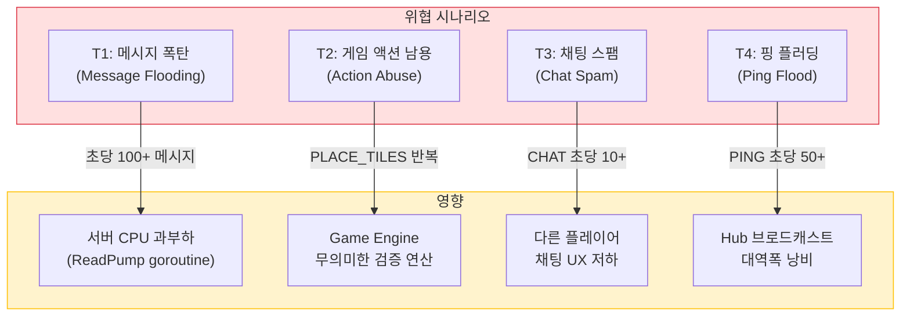
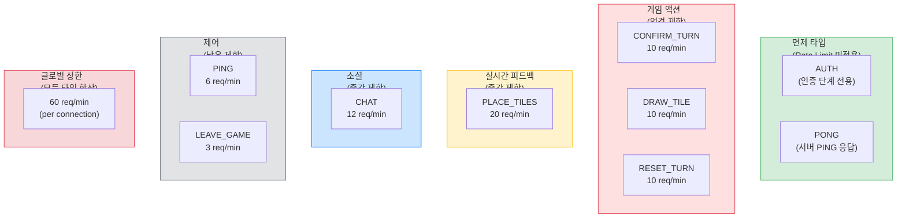
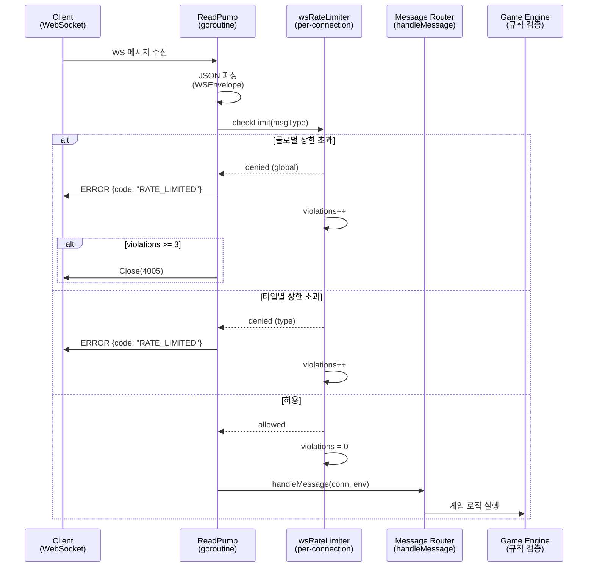
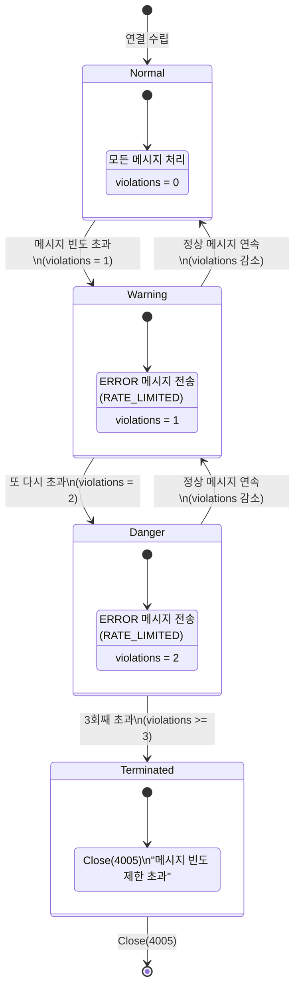
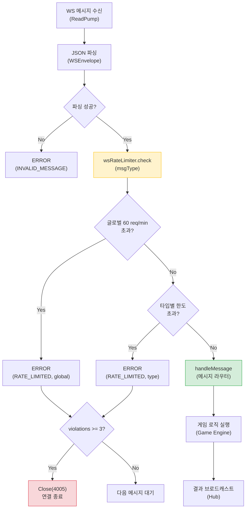
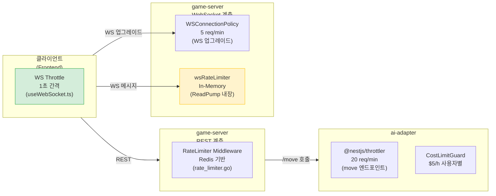

# WebSocket 서버측 메시지 빈도 제한 설계 (SEC-RL-003)

**작성일**: 2026-04-05
**상태**: 설계 완료 -- 구현 대기
**보안 ID**: SEC-RL-003 (P1-High)
**관련 문서**: `14-rate-limit-design.md`, `10-websocket-protocol.md`, `31-security-ratelimit-review.md`
**담당**: Architect, Go Developer

---

## 1. 문제 정의

### 1.1 현재 상태

RummiArena의 Rate Limit 체계는 REST API(Redis Sliding Window)와 ai-adapter(@nestjs/throttler)에 적용되어 있으나, **WebSocket 메시지 빈도 제한이 서버측에 존재하지 않는다.**

| 계층 | 보호 상태 | 비고 |
|------|-----------|------|
| REST API (game-server) | 구현 완료 | Redis 기반 Fixed Window, 5개 정책 |
| ai-adapter (NestJS) | 구현 완료 | @nestjs/throttler + CostLimitGuard |
| Frontend WS 발신 | 구현 완료 | `useWebSocket.ts` 1초 간격 throttle, AUTH/PONG 면제 |
| **WS 서버측 수신** | **미보호** | `maxMessageSize(8KB)`만 존재 |

프론트엔드 throttle은 정상적인 브라우저 클라이언트에만 유효하다. 악의적인 클라이언트(curl, wscat, 봇 스크립트 등)는 프론트엔드 throttle을 우회하여 초당 수십~수백 건의 WebSocket 메시지를 전송할 수 있다.

### 1.2 위협 시나리오



**T1 -- 메시지 폭탄**: 단일 WS 연결에서 초당 100건 이상의 메시지를 전송하면 해당 연결의 `ReadPump` goroutine이 CPU를 과도하게 점유한다. 같은 Pod의 다른 게임 방 성능에도 영향을 미칠 수 있다.

**T2 -- 게임 액션 남용**: PLACE_TILES, CONFIRM_TURN 등 게임 액션 메시지를 빠르게 반복하면 Game Engine의 규칙 검증 로직이 불필요하게 반복 실행되어 CPU를 소모한다. 정상적인 턴에서 초당 1회 이상의 CONFIRM_TURN은 발생하지 않는다.

**T3 -- 채팅 스팸**: CHAT 메시지를 빠르게 전송하면 Hub가 방 전체에 브로드캐스트하므로, 다른 플레이어의 UX가 저하된다.

**T4 -- 핑 플러딩**: PING 메시지를 빠르게 전송하면 서버가 매 PING마다 PONG 응답을 생성하여 불필요한 쓰기 부하가 발생한다.

### 1.3 공격 난이도

| 공격 | 난이도 | 전제 조건 |
|------|--------|-----------|
| WS 메시지 폭탄 | **낮음** | 유효한 JWT + roomId만 있으면 wscat으로 즉시 실행 가능 |
| 미인증 연결 폭주 | **중간** | WS 업그레이드 자체는 가능하나, AUTH 실패 시 5초 내 종료 |
| 다중 연결 | **중간** | Hub의 CloseDuplicate(4004) 정책으로 사용자당 1연결 제한 |

미인증 연결 폭주는 WS 연결 업그레이드 자체에 대한 Rate Limit(`WSConnectionPolicy` 5 req/min)이 이미 적용되어 있으므로, 이 문서에서는 **인증 완료 후 메시지 빈도 제한**에 집중한다.

---

## 2. 설계 원칙

### 2.1 핵심 원칙

| 원칙 | 설명 |
|------|------|
| **정상 플레이어 보호** | 정상적인 게임 플레이에서 절대 rate limit에 걸리지 않아야 한다 |
| **서버 자원 보호** | 단일 연결이 Pod 전체 성능에 영향을 줄 수 없어야 한다 |
| **즉각적 피드백** | 제한 초과 시 클라이언트에게 ERROR 메시지로 즉시 통보한다 |
| **점진적 제재** | 경고 -> 메시지 무시 -> 연결 종료의 3단계 에스컬레이션 |
| **In-Memory 처리** | WS 메시지 rate limit은 Redis 없이 연결 단위 메모리로 처리한다 (RTT 절약) |

### 2.2 Redis 사용하지 않는 이유

`14-rate-limit-design.md` 7.2절에서 이미 결정한 사항을 재확인한다.

1. **성능**: WS 메시지는 초당 수십 건 발생 가능하며, 매 메시지마다 Redis 왕복(~0.5ms)을 추가하면 전체 지연이 누적된다
2. **Pod 고정**: gorilla/websocket 연결은 단일 Pod에 고정(sticky)되므로 Pod 간 카운터 공유가 불필요하다
3. **자동 해제**: 연결 종료 시 해당 카운터가 GC 대상이 되어 메모리 누수가 없다
4. **16GB RAM 제약**: Redis에 WS 메시지 카운터를 저장하면 키 수가 급증하여 메모리 압박이 가중된다

---

## 3. 메시지 타입별 정책

### 3.1 정상 빈도 분석

현재 WS 프로토콜의 C2S(Client-to-Server) 메시지 타입은 8가지다.

| 메시지 타입 | 정상 사용 패턴 | 정상 최대 빈도 | 비고 |
|------------|---------------|---------------|------|
| AUTH | 연결당 1회 | 1회/연결 | 인증 단계에서만 사용 |
| PLACE_TILES | 타일 드래그 앤 드롭 | ~10회/분 | 턴 중 실시간 배치 피드백 |
| CONFIRM_TURN | 턴 확정 버튼 클릭 | ~3회/분 | 턴당 1회, 무효 시 재시도 |
| DRAW_TILE | 드로우 버튼 클릭 | ~3회/분 | 턴당 1회 |
| RESET_TURN | 초기화 버튼 클릭 | ~5회/분 | 배치 실패 시 재시도 |
| CHAT | 채팅 입력 | ~10회/분 | 일반 대화 빈도 |
| PING | 하트비트 | 2~3회/분 | 25초 간격 (프론트엔드 기준) |
| LEAVE_GAME | 퇴장 버튼 | 1회/연결 | 게임 종료 시 1회 |

**산출 근거**:
- 루미큐브 턴 타임아웃: 60~120초. 턴당 PLACE_TILES는 타일 수(최대 14개 초기 랙)만큼 발생 가능하나, 드래그 앤 드롭은 인간 속도 한계로 초당 2회가 최대
- CONFIRM_TURN/DRAW_TILE: 턴당 1회. 무효 응답 후 재시도를 감안하면 분당 3회가 상한
- CHAT: 타이핑 속도 한계로 분당 10회가 일반적

### 3.2 Rate Limit 정책 테이블



| 메시지 타입 | Limit | Window | 면제 | 근거 |
|------------|-------|--------|------|------|
| AUTH | - | - | **면제** | 인증 단계에서만 사용. ReadPump 진입 전에 처리되므로 rate limiter 범위 밖 |
| PLACE_TILES | 20 req | 1분 | - | 드래그 앤 드롭 실시간 피드백. 정상 최대 ~10회의 2배 여유 |
| CONFIRM_TURN | 10 req | 1분 | - | 턴당 1회. 무효 재시도 감안하여 여유 부여 |
| DRAW_TILE | 10 req | 1분 | - | 턴당 1회. 동일 근거 |
| RESET_TURN | 10 req | 1분 | - | 배치 실패 후 재시도 감안 |
| CHAT | 12 req | 1분 | - | 일반 대화 빈도 + 20% 여유 |
| PING | 6 req | 1분 | - | 25초 간격 = 2.4회/분. 2.5배 여유 |
| LEAVE_GAME | 3 req | 1분 | - | 정상적으로 1회만 발생. 재연결 시나리오 대비 |
| **전체 합산** | **60 req** | **1분** | - | 모든 타입 합산 글로벌 상한 |

### 3.3 면제 사유

- **AUTH**: `ReadPump` 시작 전 `authenticate()` 메서드에서 별도 처리된다. Rate limiter는 `ReadPump` 내부에서 동작하므로 AUTH는 범위 밖이다.
- **PONG**: gorilla/websocket의 `PongHandler`가 프레임 레벨에서 처리하는 응답이며, 애플리케이션 레벨 메시지가 아니다. `ReadPump`의 `PongHandler`에서 처리되므로 `handleMessage` 디스패처에 도달하지 않는다.

---

## 4. 구현 설계

### 4.1 전체 아키텍처



### 4.2 wsRateLimiter 구조체

```go
// ws_rate_limiter.go

package handler

import (
    "sync"
    "time"
)

// wsRateLimitPolicy 메시지 타입별 rate limit 정책
type wsRateLimitPolicy struct {
    MaxRequests int           // 윈도우당 최대 허용 수
    Window      time.Duration // 윈도우 크기
}

// 기본 정책 테이블
var defaultWSRateLimits = map[string]wsRateLimitPolicy{
    C2SPlaceTiles:  {MaxRequests: 20, Window: time.Minute},
    C2SConfirmTurn: {MaxRequests: 10, Window: time.Minute},
    C2SDrawTile:    {MaxRequests: 10, Window: time.Minute},
    C2SResetTurn:   {MaxRequests: 10, Window: time.Minute},
    C2SChat:        {MaxRequests: 12, Window: time.Minute},
    C2SPing:        {MaxRequests: 6,  Window: time.Minute},
    C2SLeaveGame:   {MaxRequests: 3,  Window: time.Minute},
}

// 글로벌 상한 (모든 타입 합산)
var globalWSRateLimit = wsRateLimitPolicy{
    MaxRequests: 60,
    Window:      time.Minute,
}

// wsRateLimiter 커넥션 단위 메시지 빈도 제한기
type wsRateLimiter struct {
    mu          sync.Mutex
    globalCount int               // 글로벌 카운터 (모든 타입 합산)
    typeCount   map[string]int    // 메시지 타입별 카운터
    windowStart time.Time         // 현재 윈도우 시작 시각
    violations  int               // 연속 위반 횟수
    policies    map[string]wsRateLimitPolicy // 타입별 정책 참조
}

// newWSRateLimiter 새 rate limiter 생성
func newWSRateLimiter() *wsRateLimiter {
    return &wsRateLimiter{
        globalCount: 0,
        typeCount:   make(map[string]int),
        windowStart: time.Now(),
        violations:  0,
        policies:    defaultWSRateLimits,
    }
}

// checkResult rate limit 검사 결과
type checkResult struct {
    Allowed      bool   // 허용 여부
    Reason       string // 거부 사유 ("global" | "type:{msgType}" | "")
    RetryAfterMs int    // 남은 윈도우 시간 (밀리초)
    ShouldClose  bool   // 연결 종료 필요 여부 (violations >= 3)
}

// check 메시지 빈도를 검사한다.
// 윈도우 만료 시 카운터를 자동 초기화한다.
func (rl *wsRateLimiter) check(msgType string) checkResult {
    rl.mu.Lock()
    defer rl.mu.Unlock()

    now := time.Now()

    // 윈도우 만료 시 전체 카운터 초기화
    if now.Sub(rl.windowStart) >= globalWSRateLimit.Window {
        rl.globalCount = 0
        rl.typeCount = make(map[string]int)
        rl.windowStart = now
    }

    retryAfterMs := int(globalWSRateLimit.Window.Milliseconds() -
        now.Sub(rl.windowStart).Milliseconds())
    if retryAfterMs < 0 {
        retryAfterMs = 0
    }

    // 1. 글로벌 상한 검사
    rl.globalCount++
    if rl.globalCount > globalWSRateLimit.MaxRequests {
        rl.violations++
        return checkResult{
            Allowed:      false,
            Reason:       "global",
            RetryAfterMs: retryAfterMs,
            ShouldClose:  rl.violations >= 3,
        }
    }

    // 2. 타입별 상한 검사
    if policy, exists := rl.policies[msgType]; exists {
        rl.typeCount[msgType]++
        if rl.typeCount[msgType] > policy.MaxRequests {
            rl.violations++
            return checkResult{
                Allowed:      false,
                Reason:       "type:" + msgType,
                RetryAfterMs: retryAfterMs,
                ShouldClose:  rl.violations >= 3,
            }
        }
    }

    // 허용: violations 카운터 감소 (0 이하로 내려가지 않음)
    if rl.violations > 0 {
        rl.violations--
    }

    return checkResult{
        Allowed:      true,
        RetryAfterMs: retryAfterMs,
    }
}

// reset 카운터를 초기화한다 (테스트용).
func (rl *wsRateLimiter) reset() {
    rl.mu.Lock()
    defer rl.mu.Unlock()
    rl.globalCount = 0
    rl.typeCount = make(map[string]int)
    rl.windowStart = time.Now()
    rl.violations = 0
}
```

### 4.3 Connection에 Rate Limiter 통합

`ws_connection.go`의 `Connection` 구조체에 `rateLimiter` 필드를 추가한다.

```go
// ws_connection.go 수정

type Connection struct {
    conn   *websocket.Conn
    send   chan []byte
    hub    *Hub
    logger *zap.Logger

    // Identity (set after AUTH)
    userID        string
    roomID        string
    gameID        string
    seat          int
    displayName   string
    authenticated bool

    // Outgoing sequence counter
    seqMu  sync.Mutex
    seqNum int

    // Ensure Close is called only once
    closeOnce sync.Once

    // Rate limiter (per-connection, in-memory)
    rateLimiter *wsRateLimiter  // 신규 추가
}
```

`NewConnection`에서 rate limiter를 초기화한다.

```go
func NewConnection(ws *websocket.Conn, roomID string, hub *Hub, logger *zap.Logger) *Connection {
    return &Connection{
        conn:        ws,
        send:        make(chan []byte, sendBufferSize),
        hub:         hub,
        logger:      logger,
        roomID:      roomID,
        rateLimiter: newWSRateLimiter(),  // 신규 추가
    }
}
```

### 4.4 ReadPump에 Rate Limit 검사 삽입

`ReadPump`의 메시지 디스패치 직전에 rate limit 검사를 추가한다.

```go
// ws_connection.go ReadPump 수정

func (c *Connection) ReadPump(handler func(*Connection, *WSEnvelope)) {
    defer func() {
        c.hub.Unregister(c)
        c.Close()
    }()

    c.conn.SetReadLimit(maxMessageSize)
    _ = c.conn.SetReadDeadline(time.Now().Add(pongWait))

    c.conn.SetPongHandler(func(string) error {
        _ = c.conn.SetReadDeadline(time.Now().Add(pongWait))
        return nil
    })

    for {
        _, data, err := c.conn.ReadMessage()
        if err != nil {
            if websocket.IsUnexpectedCloseError(err, websocket.CloseGoingAway, websocket.CloseNormalClosure) {
                c.logger.Debug("ws: read error", zap.String("user", c.userID), zap.Error(err))
            }
            return
        }

        _ = c.conn.SetReadDeadline(time.Now().Add(pongWait))

        var env WSEnvelope
        if err := json.Unmarshal(data, &env); err != nil {
            c.SendError("INVALID_MESSAGE", "메시지 형식이 올바르지 않습니다.")
            continue
        }

        // ---- Rate Limit 검사 (신규) ----
        result := c.rateLimiter.check(env.Type)
        if !result.Allowed {
            c.Send(&WSMessage{
                Type: S2CError,
                Payload: ErrorPayload{
                    Code:    "RATE_LIMITED",
                    Message: fmt.Sprintf(
                        "메시지 전송 빈도 제한을 초과했습니다 (%s). %d초 후에 다시 시도하세요.",
                        result.Reason, result.RetryAfterMs/1000,
                    ),
                },
            })

            c.logger.Warn("ws: rate limit exceeded",
                zap.String("user", c.userID),
                zap.String("room", c.roomID),
                zap.String("msgType", env.Type),
                zap.String("reason", result.Reason),
            )

            if result.ShouldClose {
                c.logger.Warn("ws: closing connection due to repeated violations",
                    zap.String("user", c.userID),
                    zap.String("room", c.roomID),
                )
                c.CloseWithReason(CloseRateLimited, "메시지 빈도 제한 초과")
                return
            }
            continue
        }
        // ---- Rate Limit 검사 끝 ----

        handler(c, &env)
    }
}
```

### 4.5 Close Code 추가

`ws_message.go`에 새 Close Code를 추가한다.

```go
// ws_message.go WebSocket Close Codes

const (
    CloseNormal      = 1000
    CloseAuthFail    = 4001
    CloseNoRoom      = 4002
    CloseAuthTimeout = 4003
    CloseDuplicate   = 4004
    CloseRateLimited = 4005  // 신규: 메시지 빈도 제한 초과
)
```

`10-websocket-protocol.md`의 Close Code 테이블에도 추가한다.

| 코드 | 의미 | 설명 |
|------|------|------|
| 4005 | 빈도 제한 초과 | 1분 내 3회 이상 메시지 빈도 제한 위반으로 연결 종료 |

### 4.6 위반 에스컬레이션 상태 다이어그램



**에스컬레이션 규칙**:

1. **1회 위반**: ERROR 메시지 전송, violations = 1. 이후 정상 메시지가 오면 violations 감소
2. **2회 위반**: ERROR 메시지 전송, violations = 2. 마지막 경고
3. **3회 위반**: 연결 즉시 종료 (Close Code 4005)
4. **감쇠(decay)**: 정상 메시지가 허용될 때마다 violations가 1 감소 (최소 0). 이를 통해 일시적 burst 후 정상 복귀한 클라이언트를 불이익 없이 수용

### 4.7 메시지 흐름 전체도



---

## 5. 프론트엔드 연동

### 5.1 기존 프론트엔드 WS throttle과의 관계

`useWebSocket.ts`에는 이미 클라이언트측 throttle이 구현되어 있다.

| 항목 | 프론트엔드 (기존) | 서버 (신규) |
|------|------------------|-------------|
| 위치 | `useWebSocket.ts` | `ws_connection.go ReadPump` |
| 트리거 | 서버 ERROR(RATE_LIMITED) 수신 시 | 메시지 수신 시마다 |
| 동작 | 1초 간격 throttle (10초간) | ERROR 응답 + 3회 위반 시 종료 |
| 면제 | AUTH, PONG | AUTH (ReadPump 밖), PONG (PongHandler) |
| 우회 가능 | 봇/커스텀 클라이언트 우회 가능 | **서버측 강제 -- 우회 불가** |

두 계층은 상호 보완적이다.
- **프론트엔드**: 정상 클라이언트가 서버 rate limit에 걸리지 않도록 선제적으로 발신 속도를 조절
- **서버**: 악의적/비정상 클라이언트로부터 서버 자원을 보호

### 5.2 프론트엔드 변경 사항

기존 `useWebSocket.ts`의 ERROR 핸들러에서 `RATE_LIMITED` 코드를 이미 감지하고 있으므로, 서버측 구현만으로 프론트엔드 연동이 완료된다. 추가 변경 불필요.

```typescript
// useWebSocket.ts (기존 코드, 변경 없음)
case "ERROR": {
    const payload = msg.payload as WSErrorPayload;
    if (payload.code === "RATE_LIMIT" || payload.code === "ERR_RATE_LIMIT") {
        // ... throttle 활성화
    }
}
```

서버가 전송하는 ERROR 코드를 `RATE_LIMITED`로 통일하되, 프론트엔드의 기존 감지 로직(`RATE_LIMIT`, `ERR_RATE_LIMIT`)도 호환성을 위해 유지한다. 향후 프론트엔드 리팩터링 시 `RATE_LIMITED`로 통일을 권장한다.

---

## 6. 기존 Rate Limit 체계와의 관계



| 계층 | 대상 | 알고리즘 | 저장소 | 신규 여부 |
|------|------|---------|--------|-----------|
| Frontend WS Throttle | WS 발신 | Cooldown (1초 간격) | In-Memory (Ref) | 기존 |
| REST Rate Limit | HTTP API | Fixed Window Counter | Redis | 기존 |
| WS Connection Limit | WS 업그레이드 | Fixed Window Counter | Redis | 기존 |
| **WS Message Rate Limit** | **WS 메시지** | **Fixed Window Counter** | **In-Memory (연결 단위)** | **신규** |
| AI Adapter Throttle | /move API | NestJS Throttler | In-Memory | 기존 |
| Cost Limit | LLM 비용 | 시간당 합산 | Redis | 기존 |

---

## 7. 메모리 영향 분석

### 7.1 연결당 메모리 사용량

```
wsRateLimiter 구조체:
  - mu (sync.Mutex):         8 bytes
  - globalCount (int):       8 bytes
  - typeCount (map, 8 entries): ~256 bytes (map overhead + 8 * (string key + int value))
  - windowStart (time.Time): 24 bytes
  - violations (int):        8 bytes
  - policies (map pointer):  8 bytes (공유 참조)
  ─────────────────────────────────
  합계:                      ~312 bytes/connection
```

### 7.2 최대 동시 연결 시 추가 메모리

| 시나리오 | 동시 연결 | 추가 메모리 |
|---------|-----------|-------------|
| 일반 운영 (5게임, 4인) | 20 | ~6 KB |
| 피크 시간 (20게임, 4인) | 80 | ~24 KB |
| 스트레스 테스트 (100게임) | 400 | ~122 KB |

**결론**: 16GB RAM 제약 하에서 전혀 문제없는 수준이다. 기존 gorilla/websocket 연결의 버퍼(ReadBuffer 4KB + WriteBuffer 8KB = 12KB/connection)에 비해 ~2.5%의 미미한 추가 오버헤드.

---

## 8. 테스트 전략

### 8.1 단위 테스트

`ws_rate_limiter_test.go`에 다음 테스트 케이스를 작성한다.

| 테스트 케이스 | 설명 | 기대 결과 |
|-------------|------|-----------|
| `TestWSRateLimiter_AllowsNormal` | 정상 빈도 메시지 | 모두 Allowed |
| `TestWSRateLimiter_GlobalLimit` | 글로벌 60 req/min 초과 | 61번째부터 Denied, reason="global" |
| `TestWSRateLimiter_TypeLimit_PlaceTiles` | PLACE_TILES 20 req/min 초과 | 21번째부터 Denied, reason="type:PLACE_TILES" |
| `TestWSRateLimiter_TypeLimit_Chat` | CHAT 12 req/min 초과 | 13번째부터 Denied |
| `TestWSRateLimiter_TypeLimit_Ping` | PING 6 req/min 초과 | 7번째부터 Denied |
| `TestWSRateLimiter_WindowReset` | 윈도우 만료 후 카운터 초기화 | 새 윈도우에서 다시 Allowed |
| `TestWSRateLimiter_ViolationEscalation` | 3회 연속 위반 | ShouldClose=true |
| `TestWSRateLimiter_ViolationDecay` | 위반 후 정상 메시지 | violations 감소 |
| `TestWSRateLimiter_UnknownType` | 정의되지 않은 메시지 타입 | 글로벌 카운터만 적용 |
| `TestWSRateLimiter_ConcurrentAccess` | goroutine 10개 동시 check | race condition 없음 |

```go
// ws_rate_limiter_test.go (핵심 테스트 예시)

func TestWSRateLimiter_GlobalLimit(t *testing.T) {
    rl := newWSRateLimiter()

    // 60회 허용
    for i := 0; i < 60; i++ {
        result := rl.check(C2SPlaceTiles)
        assert.True(t, result.Allowed, "message %d should be allowed", i+1)
    }

    // 61번째 거부
    result := rl.check(C2SPlaceTiles)
    assert.False(t, result.Allowed)
    assert.Equal(t, "global", result.Reason)
}

func TestWSRateLimiter_ViolationEscalation(t *testing.T) {
    rl := newWSRateLimiter()

    // 글로벌 한도 소진
    for i := 0; i < 60; i++ {
        rl.check(C2SChat)
    }

    // 위반 1회
    r1 := rl.check(C2SChat)
    assert.False(t, r1.Allowed)
    assert.False(t, r1.ShouldClose)

    // 위반 2회
    r2 := rl.check(C2SChat)
    assert.False(t, r2.Allowed)
    assert.False(t, r2.ShouldClose)

    // 위반 3회 -> 연결 종료
    r3 := rl.check(C2SChat)
    assert.False(t, r3.Allowed)
    assert.True(t, r3.ShouldClose)
}
```

### 8.2 통합 테스트

기존 WS 통합 테스트(`ws_test.go`)에 rate limit 시나리오를 추가한다.

| 테스트 케이스 | 설명 |
|-------------|------|
| `TestWS_RateLimit_ChatSpam` | 인증 후 CHAT 13회 연속 전송 -> 13번째에 ERROR(RATE_LIMITED) 수신 |
| `TestWS_RateLimit_GlobalFlood` | 61회 메시지 전송 -> ERROR 수신 |
| `TestWS_RateLimit_CloseOnRepeatedViolation` | 63회+ 메시지 전송 -> Close(4005) 수신 |
| `TestWS_RateLimit_NormalPlayNotAffected` | 정상 게임 플레이 시나리오 (60초 턴, PLACE 5회 + CONFIRM 1회) -> 전부 Allowed |

### 8.3 부하 테스트 시나리오

스크립트 기반 부하 테스트로 서버 안정성을 검증한다.

```
도구: wscat 또는 Go websocket 클라이언트 스크립트
시나리오:
  1. 정상 4인 게임 x 5방 = 20 연결, 각 연결이 분당 30 메시지 전송
     -> 기대: 모든 메시지 처리, ERROR 0건
  2. 악성 클라이언트 1개가 초당 10 메시지 전송 (분당 600)
     -> 기대: 60 이후 ERROR 응답, 3회 위반 후 Close(4005)
  3. 악성 클라이언트 5개 동시 공격
     -> 기대: 각각 독립적으로 rate limit 적용, 정상 연결 영향 없음
```

---

## 9. 구현 계획

### 9.1 파일 구조

```
src/game-server/internal/handler/
    ws_rate_limiter.go       # 신규: wsRateLimiter 구현
    ws_rate_limiter_test.go  # 신규: 단위 테스트 (10+ 케이스)
    ws_connection.go         # 수정: rateLimiter 필드 추가, ReadPump에 검사 삽입
    ws_message.go            # 수정: CloseRateLimited = 4005 추가
```

### 9.2 단계별 구현

| 단계 | 작업 | 예상 공수 | 의존성 |
|------|------|-----------|--------|
| 1 | `ws_rate_limiter.go` 구조체 및 check 로직 구현 | 1h | 없음 |
| 2 | `ws_rate_limiter_test.go` 단위 테스트 10건 | 1.5h | 단계 1 |
| 3 | `ws_connection.go` 수정 (rateLimiter 필드 + ReadPump 통합) | 1h | 단계 1 |
| 4 | `ws_message.go` 수정 (CloseRateLimited 추가) | 0.25h | 없음 |
| 5 | WS 통합 테스트 4건 추가 | 1.5h | 단계 3 |
| 6 | 문서 업데이트 (`10-websocket-protocol.md` Close Code) | 0.25h | 단계 4 |
| **합계** | | **5.5h** | |

### 9.3 롤백 계획

rate limiter 정책을 환경 변수로 조정 가능하게 설계한다.

```go
// 환경 변수 기반 비활성화 (긴급 시)
if os.Getenv("WS_RATE_LIMIT_DISABLED") == "true" {
    // rateLimiter.check()를 항상 Allowed로 반환
}
```

이를 통해 K8s ConfigMap 패치만으로 rate limiter를 비활성화할 수 있다.

---

## 10. ADR (Architecture Decision Record)

### ADR-017: WebSocket 메시지 빈도 제한을 In-Memory Fixed Window로 구현

**상태**: 승인됨

**맥락**: SEC-RL-003 (P1-High) -- 보안 감사에서 WS 서버측 메시지 빈도 제한 부재가 지적됨. 프론트엔드 throttle만 존재하여 악성 클라이언트가 서버 자원을 과도하게 소모할 수 있었다.

**결정**:
1. **알고리즘**: Fixed Window Counter (WS 메시지 특성상 Sliding Window의 정밀도가 불필요)
2. **저장소**: In-Memory (연결 단위, Redis 불사용)
3. **정책**: 메시지 타입별 개별 한도 + 글로벌 합산 한도(60 req/min)
4. **삽입 지점**: `ReadPump` 내부, JSON 파싱 직후 + `handleMessage` 직전
5. **에스컬레이션**: ERROR 응답 -> 3회 위반 시 연결 종료(Close 4005)
6. **면제**: AUTH (ReadPump 밖), PONG (PongHandler)

**대안 검토**:

| 대안 | 기각 사유 |
|------|-----------|
| Redis 기반 Sliding Window | WS 메시지 빈도에 Redis RTT 추가는 과도한 지연. Pod-local 연결에 불필요 |
| Token Bucket | 구현 복잡도 대비 이점 미미. 게임 메시지는 burst 허용보다 절대 빈도 제한이 중요 |
| Middleware 계층 분리 | WS는 HTTP middleware chain을 거치지 않음. ReadPump 내장이 자연스러운 위치 |
| Leaky Bucket | 큐 관리 오버헤드. 메시지를 지연 처리하면 게임 실시간성 저하 |

**근거**:
- Fixed Window는 WS 메시지 빈도 제한에 충분한 정밀도를 제공한다. 경계 burst가 2배까지 허용되나, 글로벌 상한(60)이 이를 억제한다
- In-Memory 처리로 Redis 의존성을 추가하지 않아 장애점이 줄어든다
- 연결당 ~312 bytes의 메모리 오버헤드는 무시할 수 있는 수준이다
- `ReadPump` 내장으로 기존 코드 변경을 최소화한다 (ws_handler.go 변경 없음)

**결과**:
- `ws_rate_limiter.go` 신규 파일 1개
- `ws_connection.go` 수정 (rateLimiter 필드 + ReadPump 검사 삽입)
- `ws_message.go` 수정 (CloseRateLimited = 4005)
- 단위 테스트 10건 + 통합 테스트 4건 추가
- REST Rate Limit(Redis)과 WS Rate Limit(In-Memory)의 이중 구조 확립
