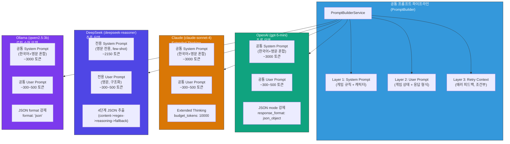
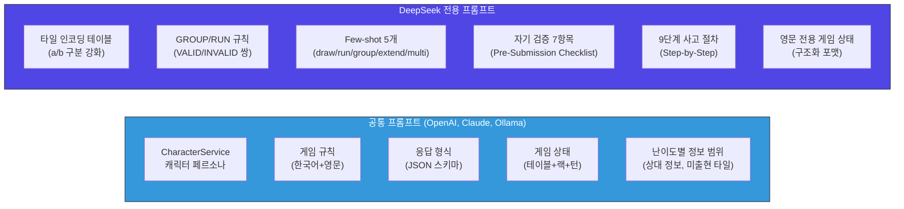
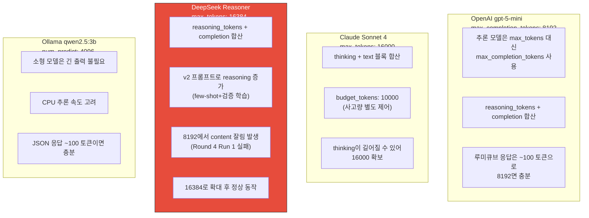
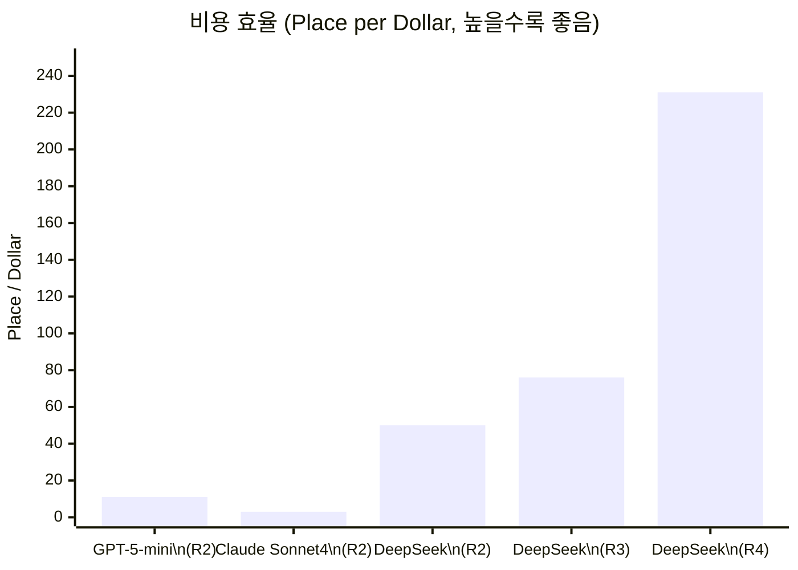
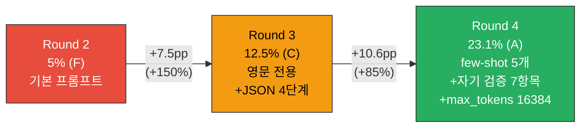
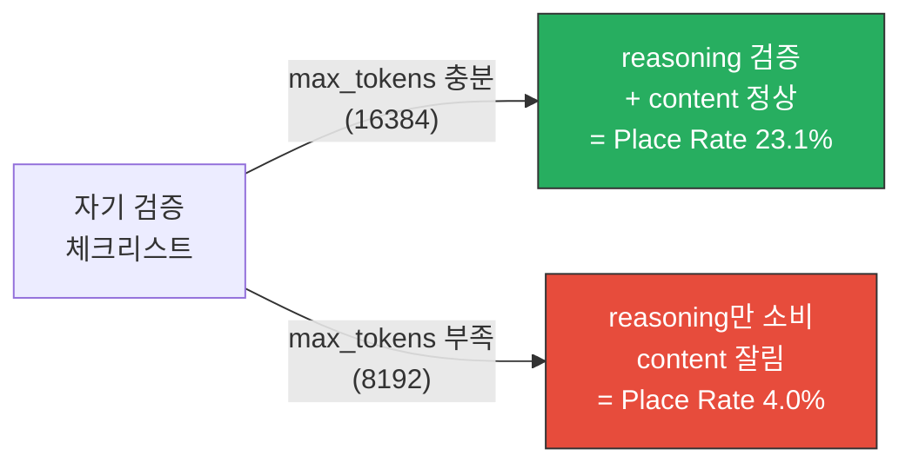
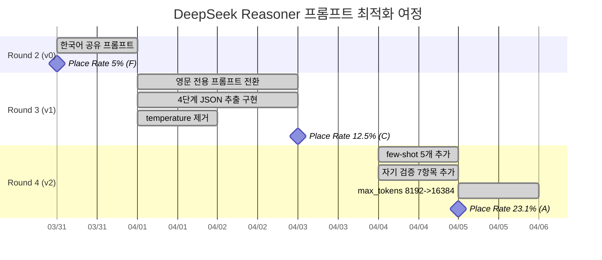
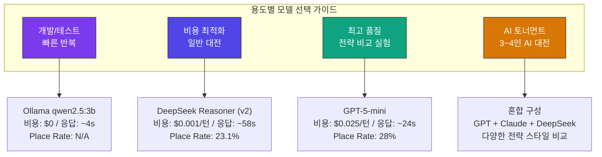

# 모델별 프롬프트 정책 (Model-Specific Prompt Policy)

- **작성일**: 2026-04-05
- **작성자**: 애벌레 (AI Engineer)
- **목적**: RummiArena에 통합된 4종 LLM의 프롬프트 전략, 설정 파라미터, 대전 결과, 최적화 교훈을 통합 정리하여 운영/개발 시 참조 기준으로 활용
- **선행 문서**: `04-ai-adapter-design.md`, `08-ai-prompt-templates.md`, `15-deepseek-prompt-optimization.md`
- **대전 데이터**: `docs/04-testing/26-deepseek-optimization-report.md`, `docs/04-testing/32-deepseek-round4-ab-test-report.md`
- **코드 위치**: `src/ai-adapter/src/adapter/` (openai, claude, deepseek, ollama)

---

## 1. 모델별 프롬프트 전략 비교표

### 1.1 프롬프트 아키텍처 전체 흐름



### 1.2 모델별 프롬프트 전략 상세

| 항목 | OpenAI (gpt-5-mini) | Claude (claude-sonnet-4) | DeepSeek (deepseek-reasoner) | Ollama (qwen2.5:3b) |
|------|---------------------|--------------------------|------------------------------|----------------------|
| **프롬프트 언어** | 한국어+영문 혼합 | 한국어+영문 혼합 | 영문 전용 | 한국어+영문 혼합 |
| **System Prompt** | 공통 (PromptBuilder) | 공통 (PromptBuilder) | **전용** (DEEPSEEK_REASONER_SYSTEM_PROMPT) | 공통 (PromptBuilder) |
| **System 토큰** | ~3000 | ~3000 | ~2150 | ~3000 |
| **User Prompt** | 공통 (buildUserPrompt) | 공통 (buildUserPrompt) | **전용** (buildReasonerUserPrompt) | 공통 (buildUserPrompt) |
| **JSON 강제 방식** | `response_format: json_object` | 프롬프트 지시 + thinking | 프롬프트 지시 (미지원) | `format: 'json'` |
| **Few-shot 예시** | 공유 4개 (시스템 프롬프트) | 공유 4개 (시스템 프롬프트) | **전용 5개** (VALID/INVALID 쌍) | 공유 4개 (시스템 프롬프트) |
| **자기 검증** | 없음 | thinking이 암묵적 검증 | **7항목 체크리스트** | 없음 |
| **재시도 프롬프트** | 공통 (buildRetryUserPrompt) | 공통 (buildRetryUserPrompt) | **전용** (buildReasonerRetryPrompt) | 공통 (buildRetryUserPrompt) |
| **특수 처리** | 추론 모델 감지 (gpt-5*) | Extended thinking 블록 파싱 | 4단계 JSON 추출 + JSON 수리 | thinking 모드 JSON 추출 |

### 1.3 프롬프트 계층 비교



---

## 2. 모델별 설정 파라미터

### 2.1 핵심 파라미터 비교표

| 파라미터 | OpenAI (gpt-5-mini) | Claude (claude-sonnet-4) | DeepSeek (deepseek-reasoner) | Ollama (qwen2.5:3b) |
|---------|---------------------|--------------------------|------------------------------|----------------------|
| **max_tokens** | 8192 (max_completion_tokens) | 16000 (thinking 포함) | **16384** | 4096 (num_predict) |
| **temperature** | 고정 1 (추론 모델 불변) | 비활성 (thinking 시) | 0 (추론 모델 고정) | min(설정값, 0.7) |
| **timeout (ms)** | 120,000 (최소 보장) | 120,000 (최소 보장) | **150,000** (최소 보장) | 120,000 (최소 보장) |
| **maxRetries** | 3 (기본값) | 3 (기본값) | 3 (기본값) | **5** (JSON 오류율 대응) |
| **비용/턴** | ~$0.025 | ~$0.074 | ~$0.001 | $0 (로컬) |
| **API 방식** | REST (OpenAI Chat) | REST (Messages API) | REST (OpenAI 호환) | 로컬 HTTP (Chat) |

### 2.2 max_tokens 설정 근거



**DeepSeek max_tokens 8192 -> 16384 변경 사유**:

Round 4 Run 1에서 v2 프롬프트(few-shot 5개 + 자기 검증 7항목) 적용 후, DeepSeek Reasoner의 내부 추론(reasoning)이 길어져 8192 토큰의 `max_tokens` 한도 내에서 실제 응답(content)까지 도달하지 못하는 현상이 발생했다. `finish_reason: "length"`로 content가 빈 문자열로 잘리며, Place Rate 4.0%(F 등급)까지 하락했다. 16384로 확대 후 reasoning ~3000~5000 토큰 + content ~100 토큰이 정상 출력되어 Place Rate 23.1%(A 등급)을 달성했다.

### 2.3 난이도별 Temperature 매핑

| 난이도 | 일반 모델 | 추론 모델 (OpenAI/DeepSeek) | Claude (thinking) |
|--------|---------|---------------------------|-------------------|
| beginner | 0.9 | 고정 (조절 불가) | 비활성 (thinking 시) |
| intermediate | 0.7 | 고정 (조절 불가) | 비활성 (thinking 시) |
| expert | 0.3 | 고정 (조절 불가) | 비활성 (thinking 시) |

> **핵심**: 추론 모델(gpt-5-mini, deepseek-reasoner)과 Claude Extended Thinking은 temperature 파라미터를 지원하지 않거나 무시한다. 난이도별 행동 차이는 프롬프트(캐릭터 페르소나 + 정보 범위)로 구현한다.

### 2.4 타임아웃 설정 근거

| 모델 | 타임아웃 | 근거 |
|------|---------|------|
| OpenAI gpt-5-mini | 120s | 추론 모델은 최소 60s, 복잡한 게임 상태에서 ~30s 소요 |
| Claude Sonnet 4 | 120s | Extended thinking으로 ~15~30s, 여유 확보 |
| DeepSeek Reasoner | **150s** | 평균 응답 58.6s, 복잡한 상태에서 90s+ 가능 |
| Ollama qwen2.5:3b | 120s | CPU 추론 ~4s(WSL2), ~25s(K8s), thinking 모드 대비 |

---

## 3. 대전 결과 요약 (Round 1~4)

### 3.1 전체 라운드 결과 추이

```mermaid
---
config:
  theme: default
---
xychart-beta
  title "모델별 Place Rate 추이 (Round 2~4)"
  x-axis ["Round 2\n(2026-03-31)", "Round 3\n(2026-04-03)", "Round 4\n(2026-04-05)"]
  y-axis "Place Rate (%)" 0 --> 35
  bar [28, 28, 28]
  bar [23, 23, 23]
  bar [5, 12.5, 23.1]
  line [15, 15, 15]
```



> Round 2 이후 GPT-5-mini와 Claude는 추가 대전을 실시하지 않았으므로 동일 값으로 표시. 목표선(15%)은 점선으로 표현.

### 3.2 라운드별 상세 결과표

| 지표 | gpt-5-mini (R2) | Claude Sonnet 4 (R2) | DeepSeek (R2) | DeepSeek (R3) | DeepSeek (R4) |
|------|:---:|:---:|:---:|:---:|:---:|
| **Place Rate** | **28%** | **23%** | 5% | 12.5% | **23.1%** |
| Place 횟수 | 11 | 9 | 2 | 5 | 3 |
| 타일 배치 수 | 27 | 29 | 14 | 22 | 14 |
| 평균 배치 타일/회 | 2.5 | 3.2 | 7.0 | 4.4 | **4.7** |
| 총 턴 수 | 80 | 80 | 80 | 80 | 28 (timeout) |
| AI 턴 수 | 40 | 40 | 40 | 40 | 13 |
| Fallback | 0 | 0 | 0 | 0 | 8 |
| 소요 시간 | 1,876s | 2,076s | 1,995s | 2,450s | 942s |
| **비용** | **$1.00** | **$2.96** | $0.040 | $0.066 | **$0.013** |
| **비용/턴** | $0.025 | $0.074 | $0.001 | $0.002 | $0.001 |
| 등급 | A | B+ | F | C | **A** |

### 3.3 비용 효율 비교



| 모델 (라운드) | 비용 | Place Rate | Place/Dollar | GPT 대비 배율 |
|---------------|:---:|:---:|:---:|:---:|
| GPT-5-mini (R2) | $1.00 | 28% | 11 | 1x |
| Claude Sonnet 4 (R2) | $2.96 | 23% | 3 | 0.3x |
| DeepSeek (R2) | $0.040 | 5% | 50 | 4.5x |
| DeepSeek (R3) | $0.066 | 12.5% | 76 | 6.9x |
| **DeepSeek (R4)** | **$0.013** | **23.1%** | **231** | **21x** |

> DeepSeek v2 프롬프트는 GPT-5-mini와 동등한 Place Rate(23% vs 28%)를 달성하면서, 비용 효율은 **21배** 우수하다.

### 3.4 DeepSeek Place Rate 진화



---

## 4. 프롬프트 최적화 교훈

### 4.1 모델별 최적화 전략 효과 매트릭스

| 최적화 전략 | OpenAI | Claude | DeepSeek | Ollama | 설명 |
|------------|:---:|:---:|:---:|:---:|------|
| **JSON mode 강제** | 필수 | N/A | 미지원 | 필수 | API 수준 JSON 강제가 파싱 실패율을 극적으로 낮춤 |
| **Few-shot 예시** | 낮은 효과 | 낮은 효과 | **매우 높음** | 중간 효과 | JSON mode 없는 모델에서 패턴 학습 효과 극대화 |
| **자기 검증 체크리스트** | 낮은 효과 | 중간 효과 | **높음** | 낮은 효과 | 추론 모델의 reasoning에서 검증 단계 유도 |
| **Extended Thinking** | N/A | **높음** | N/A | N/A | 별도 사고 블록으로 깊은 전략 분석 |
| **영문 전용 프롬프트** | 불필요 | 불필요 | **필수** | 불필요 | DeepSeek는 영문 프롬프트에서 규칙 이해도 향상 |
| **max_tokens 확대** | 불필요 | 조건부 | **필수** | 불필요 | 추론 모델의 reasoning truncation 방지 |
| **Temperature 조정** | 불가 (추론) | 불가 (thinking) | 불가 (추론) | 제한적 | 추론 모델은 temperature 제어 불가, 프롬프트로 대응 |
| **재시도 에러 피드백** | 중간 효과 | 중간 효과 | **높음** | 중간 효과 | 전용 재시도 프롬프트로 오류 유형별 가이드 제공 |

### 4.2 핵심 교훈

#### 교훈 1: Few-shot은 JSON mode가 없는 모델에서 핵심

OpenAI와 Ollama는 API 수준에서 JSON 구조를 강제(`response_format: json_object`, `format: 'json'`)할 수 있어 파싱 실패율이 극히 낮다. 반면 DeepSeek Reasoner는 이 기능을 지원하지 않으므로, 프롬프트 수준에서 few-shot 예시를 통해 "올바른 JSON이 어떤 모습인지"를 학습시켜야 한다. Round 4에서 5개 few-shot 추가 후 Place Rate가 12.5% -> 23.1%로 대폭 개선된 것이 이를 증명한다.

#### 교훈 2: 자기 검증 체크리스트는 양날의 검

자기 검증 7항목은 유효 배치율을 높이지만, 동시에 reasoning을 더 길게 만든다. max_tokens가 부족하면(Run 1: 8192) 오히려 content가 잘려 성능이 급락한다(4.0% F등급). **반드시 충분한 max_tokens와 함께 사용해야 한다.**



#### 교훈 3: max_tokens는 추론 모델의 가장 중요한 파라미터

DeepSeek Reasoner와 같은 추론(reasoning) 모델에서 `max_tokens`는 `reasoning_tokens + completion_tokens`의 합계 상한이다. 프롬프트가 복잡해질수록 내부 추론이 길어지므로, 충분한 여유를 확보해야 한다. 이는 비추론 모델에서는 발생하지 않는 고유한 문제이다.

| 모델 유형 | max_tokens 의미 | 위험 |
|-----------|---------------|------|
| 비추론 (gpt-4o, deepseek-chat) | completion만 | 낮음 (응답 ~100 토큰) |
| 추론 (gpt-5-mini) | reasoning + completion | 중간 (자체 최적화) |
| 추론 (deepseek-reasoner) | reasoning + completion | **높음** (reasoning 길어지면 content 잘림) |
| Thinking (Claude) | thinking + text | 낮음 (budget_tokens로 별도 제어) |

#### 교훈 4: 추론 모델은 필수

Round 2에서 비추론 모델(Opus, deepseek-chat 등)은 루미큐브 타일 조합 탐색에 부적합했다. Claude Opus는 5%에 불과했으나, Claude Sonnet + Extended Thinking은 23%를 달성했다. 루미큐브처럼 조합론적 탐색이 필요한 게임에서는 **추론/thinking 능력이 필수**이다.

#### 교훈 5: 프롬프트 언어는 모델 학습 데이터에 맞춰야 한다

OpenAI와 Claude는 다국어 프롬프트에서도 안정적이지만, DeepSeek Reasoner는 영문 전용 프롬프트에서 규칙 이해도가 크게 향상되었다. 모델의 주요 학습 언어에 맞추는 것이 최적의 성능을 끌어낸다.

### 4.3 최적화 히스토리 타임라인



---

## 5. 권장 설정 (Production)

### 5.1 ConfigMap 권장값

```yaml
# helm/charts/ai-adapter/values.yaml
env:
  # --- 모델 ---
  OPENAI_DEFAULT_MODEL: "gpt-5-mini"
  CLAUDE_DEFAULT_MODEL: "claude-sonnet-4-20250514"
  CLAUDE_EXTENDED_THINKING: "true"
  DEEPSEEK_DEFAULT_MODEL: "deepseek-reasoner"
  OLLAMA_DEFAULT_MODEL: "qwen2.5:3b"

  # --- 비용 ---
  DAILY_COST_LIMIT_USD: "20"

  # --- DeepSeek 프롬프트 ---
  # v2가 기본값 (코드에 내장, ConfigMap 오버라이드 불필요)
```

### 5.2 모델별 운영 권장 시나리오



### 5.3 모델-캐릭터 권장 매핑

| 캐릭터 | 전략 스타일 | 권장 모델 | 이유 |
|--------|-----------|---------|------|
| **Rookie** | 단순, 실수 빈번 | Ollama (qwen2.5:3b) | 단순 행동 패턴이 소형 모델과 일치, 무료 |
| **Calculator** | 확률 계산, 최적화 | DeepSeek Reasoner | 추론 모델의 조합 탐색 + 극강 비용 효율 |
| **Shark** | 공격적, 빠른 배치 | GPT-5-mini | 빠른 의사결정(~24s) + 최고 Place Rate |
| **Fox** | 기만, 심리전 | Claude Sonnet 4 | 200K 컨텍스트로 상대 패턴 분석, thinking으로 전략 구상 |
| **Wall** | 수비, 버티기 | Claude Sonnet 4 | 게임 전체 히스토리 기반 방어 전략 |
| **Wildcard** | 무작위, 창의적 | DeepSeek Reasoner | 비용 효율 + 다양한 응답 패턴 |

### 5.4 AI 토너먼트 추천 구성

```json
{
  "players": [
    {
      "type": "AI_OPENAI",
      "persona": "Shark",
      "difficulty": "expert",
      "psychologyLevel": 2,
      "note": "공격형 - 빠른 배치, 높은 Place Rate"
    },
    {
      "type": "AI_CLAUDE",
      "persona": "Fox",
      "difficulty": "expert",
      "psychologyLevel": 3,
      "note": "심리전 - 상대 패턴 분석, 200K 컨텍스트"
    },
    {
      "type": "AI_DEEPSEEK",
      "persona": "Calculator",
      "difficulty": "expert",
      "psychologyLevel": 2,
      "note": "최적화형 - 비용 효율 최강, 조합 탐색"
    }
  ]
}
```

예상 대전 비용: ~$2.00/판 (80턴 기준, GPT $1.00 + Claude $2.96 + DeepSeek $0.04)

---

## 6. 모델별 프롬프트 상세 스펙

### 6.1 OpenAI (gpt-5-mini)

| 항목 | 값 |
|------|-----|
| API 엔드포인트 | `https://api.openai.com/v1/chat/completions` |
| 프롬프트 소스 | `PromptBuilderService.buildSystemPrompt()` + `buildUserPrompt()` |
| JSON 강제 | `response_format: { type: 'json_object' }` |
| max_completion_tokens | 8192 |
| temperature | 고정 (추론 모델 자체 제어) |
| timeout | min(request.timeoutMs, 120,000ms) |
| 추론 모델 감지 | `this.defaultModel.startsWith('gpt-5')` |
| 특이사항 | `max_tokens` 대신 `max_completion_tokens` 사용, temperature 파라미터 미전송 |

### 6.2 Claude (claude-sonnet-4)

| 항목 | 값 |
|------|-----|
| API 엔드포인트 | `https://api.anthropic.com/v1/messages` |
| 프롬프트 소스 | `PromptBuilderService.buildSystemPrompt()` + `buildUserPrompt()` |
| JSON 강제 | 프롬프트 지시 (API 수준 미지원) |
| max_tokens | 16000 (thinking 모드 시) / 1024 (비 thinking) |
| thinking | `{ type: 'enabled', budget_tokens: 10000 }` |
| temperature | 비활성 (thinking 모드 시) / 설정값 (비 thinking) |
| timeout | min(request.timeoutMs, 120,000ms) |
| 응답 파싱 | contentBlocks에서 `type: 'text'` 블록 추출 |
| 특이사항 | `anthropic-version: '2023-06-01'` 헤더 필수, system은 body 필드 |

### 6.3 DeepSeek (deepseek-reasoner)

| 항목 | 값 |
|------|-----|
| API 엔드포인트 | `https://api.deepseek.com/v1/chat/completions` |
| 프롬프트 소스 | **전용** `DEEPSEEK_REASONER_SYSTEM_PROMPT` + `buildReasonerUserPrompt()` |
| JSON 강제 | 프롬프트 지시만 (API 미지원, Reasoner 모드) |
| max_tokens | **16384** (Reasoner) / 1024 (chat) |
| temperature | 미전송 (Reasoner) / 설정값 (chat) |
| timeout | min(request.timeoutMs, 150,000ms) |
| JSON 추출 | 4단계: content 직접 -> content 정규식 -> reasoning 마지막 -> 원본 |
| JSON 수리 | trailing comma 제거, 코드블록 제거, 중괄호 매칭 |
| 재시도 프롬프트 | 전용 `buildReasonerRetryPrompt()` (오류 유형별 가이드 포함) |
| 특이사항 | Reasoner는 `generateMove()` 완전 오버라이드, chat은 BaseAdapter 사용 |

### 6.4 Ollama (qwen2.5:3b)

| 항목 | 값 |
|------|-----|
| API 엔드포인트 | `http://ollama:11434/api/chat` (K8s) / `http://localhost:11434/api/chat` (로컬) |
| 프롬프트 소스 | `PromptBuilderService.buildSystemPrompt()` + `buildUserPrompt()` |
| JSON 강제 | `format: 'json'` |
| num_predict | 4096 |
| temperature | min(설정값, 0.7) |
| timeout | min(request.timeoutMs, 120,000ms) |
| maxRetries | min(request.maxRetries, 5) (소형 모델 JSON 오류율 대응) |
| stop tokens | `['```']` |
| thinking 파싱 | Qwen3 thinking 모드 대응: content 비었을 때 thinking에서 JSON 추출 |
| 특이사항 | `generateMove()` 오버라이드하여 retries/timeout 최소값 보장 |

---

## 7. 프롬프트 버전 관리

### 7.1 현재 버전 현황

| 모델 | 프롬프트 버전 | 마지막 업데이트 | 성과 |
|------|-------------|---------------|------|
| OpenAI | v1 (공통) | 2026-03-23 | Place Rate 28% |
| Claude | v1 (공통) | 2026-03-23 | Place Rate 23% |
| DeepSeek | **v2 (전용)** | 2026-04-05 | Place Rate 23.1% |
| Ollama | v1 (공통) | 2026-03-31 | 게임 흐름 검증용 |

### 7.2 변경 이력 (DeepSeek)

| 버전 | 날짜 | 핵심 변경 | Place Rate |
|------|------|----------|:---:|
| v0 | 2026-03-31 | 한국어 공유 프롬프트 | 5% (F) |
| v1 | 2026-04-03 | 영문 전용, 4단계 JSON 추출, temperature 제거 | 12.5% (C) |
| **v2** | **2026-04-05** | few-shot 5개, 자기 검증 7항목, max_tokens 16384 | **23.1% (A)** |

---

## 8. 다음 단계

### 8.1 즉시 (Sprint 5 Week 2)

- [ ] **3모델 Round 4 비교 대전**: GPT-5-mini / Claude / DeepSeek 동일 조건 80턴 완주
- [ ] **DeepSeek Round 4 재실행**: WS 타임아웃 300초 + 80턴 완주하여 통계적 유의성 확보
- [ ] **INVALID_MOVE 상세 분석**: Round 4 5건의 규칙 위반 유형별 분류 + v3 프롬프트 반영

### 8.2 중기 (Sprint 6)

- [ ] **OpenAI/Claude 프롬프트 개별 최적화**: DeepSeek에서 검증된 few-shot/검증 전략의 이식 검토
- [ ] **max_tokens 동적 조정**: 게임 상태 복잡도에 따라 16384~32768 자동 조절
- [ ] **A/B 테스트 자동화**: 동일 게임 상태에서 프롬프트 버전별 병렬 실행
- [ ] **v3 프롬프트**: INVALID_MOVE 분석 결과 기반 추가 최적화

### 8.3 장기 (Phase 6)

- [ ] **AI 토너먼트 정기 실행**: 4종 모델 Round Robin, ELO 변동 추적
- [ ] **프롬프트 A/B 테스트 프레임워크**: ConfigMap 기반 자동 전환 + 메트릭 수집
- [ ] **모델 핫스왑**: 게임 중 모델 교체 없이, 캐릭터-모델 매핑만으로 전략 다양성 확보

---

## 관련 문서

| 파일 | 설명 |
|------|------|
| `docs/02-design/04-ai-adapter-design.md` | AI Adapter 전체 설계 |
| `docs/02-design/08-ai-prompt-templates.md` | 프롬프트 템플릿 상세 설계 (7 레이어) |
| `docs/02-design/15-deepseek-prompt-optimization.md` | DeepSeek 전용 프롬프트 최적화 설계 |
| `docs/04-testing/12-llm-model-comparison.md` | LLM 모델 성능 비교 (Sprint 4 초기) |
| `docs/04-testing/26-deepseek-optimization-report.md` | Round 2->3 최적화 보고서 |
| `docs/04-testing/32-deepseek-round4-ab-test-report.md` | Round 4 A/B 테스트 결과 |
| `src/ai-adapter/src/adapter/openai.adapter.ts` | OpenAI 어댑터 구현 |
| `src/ai-adapter/src/adapter/claude.adapter.ts` | Claude 어댑터 구현 |
| `src/ai-adapter/src/adapter/deepseek.adapter.ts` | DeepSeek 어댑터 구현 (전용 프롬프트 포함) |
| `src/ai-adapter/src/adapter/ollama.adapter.ts` | Ollama 어댑터 구현 |
| `src/ai-adapter/src/prompt/prompt-builder.service.ts` | 공통 프롬프트 빌더 |
| `helm/charts/ai-adapter/values.yaml` | ConfigMap 설정값 |
