# Rate Limit 에러 UX 설계

**작성일**: 2026-04-06
**상태**: 설계 완료 -- 구현 대기
**담당**: Designer, Frontend Developer
**관련 문서**: `14-rate-limit-design.md`, `17-ws-rate-limit-design.md`, `07-ui-wireframe.md`

---

## 1. 설계 원칙

### 1.1 "징벌이 아닌 안내"

Rate Limit은 서버 보호 메커니즘이지만, 사용자 입장에서는 **갑자기 동작이 안 되는 경험**이다. 다음 원칙으로 사용자 불안을 최소화한다.

| 원칙 | 설명 | 나쁜 예 | 좋은 예 |
|------|------|---------|---------|
| 사유 투명성 | 왜 제한되었는지 한 문장으로 설명 | "오류가 발생했습니다" | "요청이 너무 빨랐습니다" |
| 시간 가시성 | 언제 다시 가능한지 카운트다운 | "잠시 후 시도" | "12초 후 다시 가능" |
| 행동 유도 | 사용자가 다음에 뭘 해야 하는지 명확 | (아무 안내 없음) | "잠시 기다린 후 버튼을 눌러주세요" |
| 비차단 피드백 | 게임 화면을 가리지 않는 토스트/배너 | 풀스크린 모달 | 상단 배너/토스트 |
| 단계적 긴장감 | 심각도에 따라 시각적 강도 조절 | 모두 빨간색 | 노란(경고) -> 주황(위험) -> 빨간(종료) |

### 1.2 기존 디자인 시스템과의 일관성

현재 게임 UI에서 사용 중인 토스트/배너 스택을 유지한다.

| 컴포넌트 | 위치 | 배경색 | z-index | 자동 소멸 |
|---------|------|--------|---------|-----------|
| ConnectionStatus (배너) | `top-4` | warning/danger 10% | z-50 | 상태 복구 시 |
| ReconnectToast | `top-16` | `bg-emerald-600` | z-50 | 3초 |
| RateLimitToast | `top-28` | `bg-warning/90` | z-50 | 6초 |
| ErrorToast | `top-4` | `bg-danger` | z-50 | 5초 |

신규 컴포넌트는 이 스택에 자연스럽게 통합되어야 한다. 기존 토스트와 동일한 모션(spring, stiffness: 400, damping: 30), 크기(max-w-sm), 폰트(text-tile-sm) 토큰을 사용한다.

### 1.3 접근성 요구사항

- **색약 대응**: 색상만으로 상태를 구분하지 않는다. 아이콘 형태 + 텍스트 라벨로 보조
- **스크린 리더**: `role="alert"` + `aria-live="polite"` (비긴급) 또는 `aria-live="assertive"` (긴급)
- **키보드 접근**: 재시도 버튼은 Tab으로 포커스 가능
- **모션 축소**: `prefers-reduced-motion` 시 카운트다운 애니메이션 비활성화

---

## 2. 시나리오별 UX 설계

### 2.1 REST 429 응답 UX

#### 2.1.1 발생 조건

사용자가 REST API(Room 생성, 게임 시작 등)를 너무 빠르게 호출할 때 서버가 HTTP 429를 반환한다.

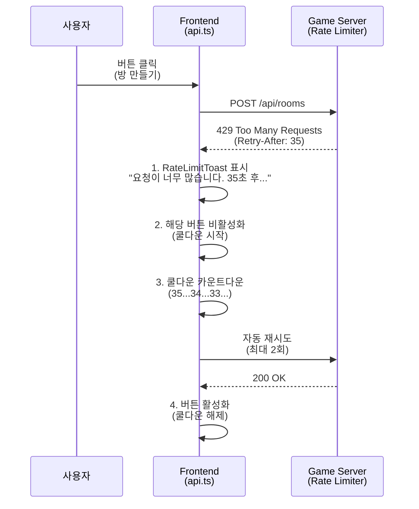

#### 2.1.2 현재 구현 분석

현재 `api.ts`의 `apiFetch`에는 다음이 이미 구현되어 있다.

- `Retry-After` 헤더 파싱 (정수, HTTP-date, 기본값 5초)
- `showRateLimitToast()`: rateLimitStore에 메시지 설정
- 자동 재시도: 최대 2회, `Retry-After` 초 대기 후 재요청

현재 **미구현** 사항:

- 쿨다운 카운트다운 표시 (잔여 시간 시각화)
- 해당 버튼의 일시 비활성화
- 재시도 진행 중 상태 표시

#### 2.1.3 강화 설계: RateLimitToast v2

기존 `RateLimitToast`를 확장하여 쿨다운 카운트다운을 추가한다.

**Store 확장** (`rateLimitStore.ts`):

```typescript
interface RateLimitStore {
  message: string | null;
  setMessage: (msg: string | null) => void;
  wsThrottled: boolean;
  setWsThrottled: (v: boolean) => void;

  // --- 신규 ---
  /** 쿨다운 잔여 초 (0이면 쿨다운 해제) */
  cooldownSec: number;
  setCooldownSec: (sec: number) => void;
  /** 쿨다운 총 초 (원형 프로그레스 비율 계산용) */
  cooldownTotalSec: number;
  setCooldownTotalSec: (sec: number) => void;
  /** 자동 재시도 중 여부 */
  isRetrying: boolean;
  setIsRetrying: (v: boolean) => void;
}
```

**UI 상태 정의**:

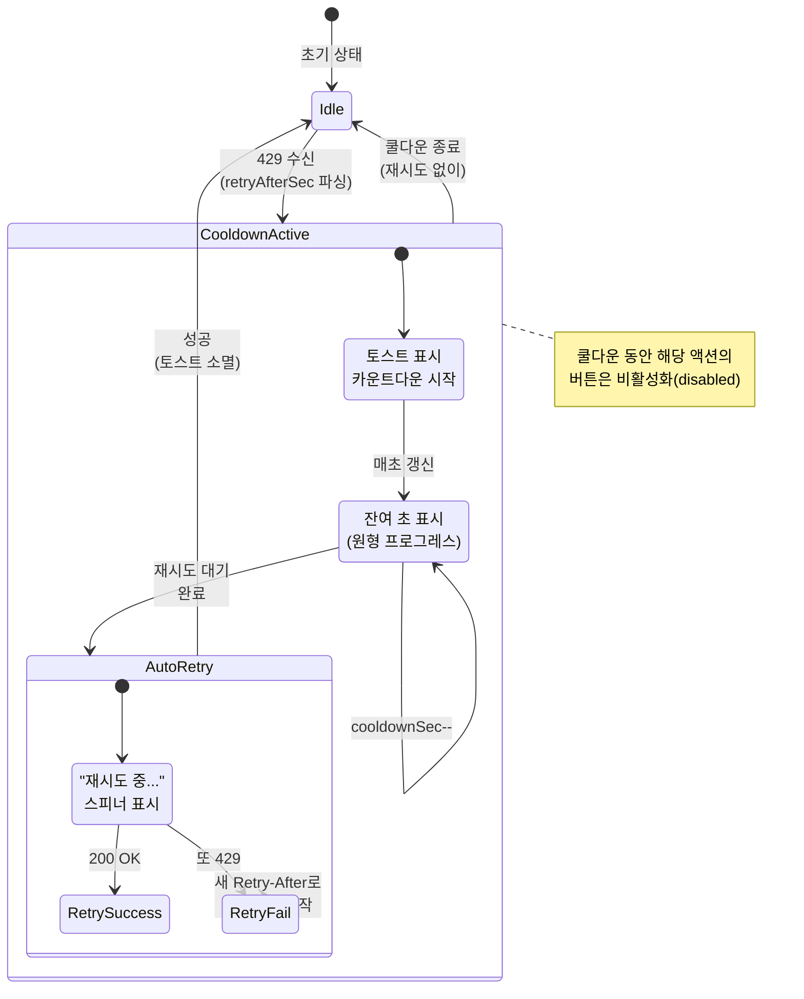

**RateLimitToast v2 레이아웃**:

```
+-------------------------------------------------------+
| [시계 아이콘]  요청이 너무 빨랐습니다         [12초]    |
|                                              (원형    |
|                잠시 후 자동으로 다시 시도합니다   프로    |
|                                              그레스)  |
+-------------------------------------------------------+
```

**원형 프로그레스(Circular Progress) 컴포넌트 명세**:

| 속성 | 값 | 비고 |
|------|-----|------|
| 크기 | 28x28px | 토스트 높이에 맞춤 |
| 색상 | `text-warning` (#F3C623) | 기존 토스트 테마 |
| 배경 | `text-warning/20` | 반투명 트랙 |
| 두께 | 3px (stroke-width) | |
| 내부 텍스트 | 잔여 초 (숫자) | text-tile-xs, font-mono |
| 애니메이션 | SVG stroke-dashoffset 전이 | 1초 간격 stepwise |
| reduced-motion | 프로그레스 바 숨김, 텍스트만 표시 | |

**Tailwind 클래스 구성**:

```
토스트 컨테이너:
  fixed top-28 left-1/2 -translate-x-1/2 z-50
  flex items-center gap-3
  bg-warning/90 text-gray-900
  rounded-xl shadow-lg
  px-4 py-3
  max-w-md w-max

원형 프로그레스:
  relative w-7 h-7 flex-shrink-0

카운트다운 숫자:
  absolute inset-0 flex items-center justify-center
  text-tile-xs font-mono font-bold
```

#### 2.1.4 버튼 비활성화 패턴

429를 유발한 액션의 버튼(예: "방 만들기")에 쿨다운 오버레이를 적용한다.

| 상태 | 버튼 외관 | 접근성 |
|------|----------|--------|
| 정상 | 기본 스타일 | 클릭 가능 |
| 쿨다운 중 | `opacity-50 cursor-not-allowed` + 잔여 초 표시 | `aria-disabled="true"`, `aria-label="N초 후 사용 가능"` |
| 재시도 중 | 스피너 + "재시도 중..." | `aria-busy="true"` |

이 패턴은 범용 `useRateLimitButton` 훅으로 추출할 수 있다.

```typescript
// 사용 예시 (개념적)
const { disabled, label } = useRateLimitButton("room-create");
// disabled: true/false, label: "방 만들기" | "12초 후 가능"
```

---

### 2.2 WS Rate Limit 에러 UX (서버 ERROR 메시지)

#### 2.2.1 발생 조건

WS 메시지 빈도가 서버 한도를 초과하면 서버가 `ERROR { code: "RATE_LIMITED" }` 메시지를 전송한다. 3회 연속 위반 시 `Close(4005)` 연결 종료.

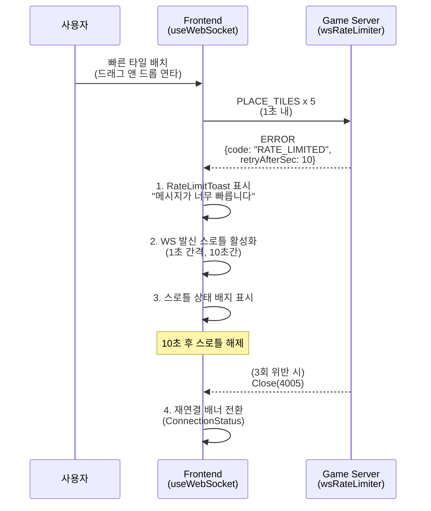

#### 2.2.2 현재 구현 분석

`useWebSocket.ts`의 ERROR 핸들러에 이미 구현된 것:

- `RATE_LIMIT` / `ERR_RATE_LIMIT` 코드 감지
- 토스트 메시지 표시 (`rateLimitStore.setMessage`)
- WS 발신 스로틀 활성화 (`wsThrottledRef`, 1초 간격, 10초 쿨다운)

현재 **미구현** 사항:

- 스로틀 활성 상태의 시각적 표시 (사용자가 왜 입력이 무시되는지 모름)
- 위반 에스컬레이션 단계별 시각적 차이 (1회 vs 2회 경고)
- Close(4005) 후 특화된 재연결 UX

#### 2.2.3 WS 스로틀 상태 배지

스로틀이 활성화되면 게임 헤더에 작은 배지를 표시하여 "왜 입력이 느린지" 사용자가 인지할 수 있게 한다.

**배치 위치**: 게임 헤더 좌측, Room 번호 옆

```
+-----------------------------------------------------------+
| Room a1b2c3d4  [느린 전송 모드]    TurnTimer     턴 #15    |
+-----------------------------------------------------------+
```

| 속성 | 값 |
|------|-----|
| 배경 | `bg-warning/20 border border-warning/40` |
| 텍스트 | `text-warning text-tile-xs` |
| 아이콘 | 시계(동일) + "느린 전송 모드" |
| 표시 조건 | `rateLimitStore.wsThrottled === true` |
| 소멸 | 스로틀 해제 시 fade-out |
| 접근성 | `role="status"`, `aria-live="polite"` |

#### 2.2.4 에스컬레이션 단계별 토스트

서버의 위반 에스컬레이션(17-ws-rate-limit-design.md 섹션 4.6)에 대응하는 클라이언트 UI:

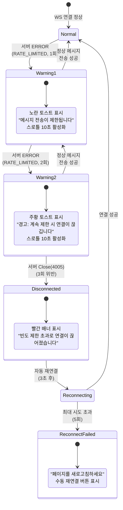

**단계별 시각 차이**:

| 단계 | 배경색 | 아이콘 | 메시지 | 자동 소멸 |
|------|--------|--------|--------|-----------|
| 1회 위반 | `bg-warning/90` (노란) | 시계 | "메시지 전송 속도가 제한되었습니다. 조금 천천히 진행해주세요." | 6초 |
| 2회 위반 | `bg-orange-500/90` (주황) | 경고 삼각형 | "주의: 계속 빠른 전송 시 연결이 끊어질 수 있습니다." | 8초 (더 오래) |
| 3회 (종료) | `bg-danger/10 border-danger` (빨간 배너) | 끊어진 연결 | "빈도 제한 초과로 연결이 끊어졌습니다. 자동으로 재연결합니다." | 상태 복구 시 |

**위반 횟수 추적**: 클라이언트도 RATE_LIMITED 에러 수신 횟수를 추적하여 토스트 색상/메시지를 단계별로 변경한다.

```typescript
// rateLimitStore 추가 필드
wsViolationCount: number;  // 0, 1, 2 (3이면 서버가 종료하므로 2까지)
incrementWsViolation: () => void;
resetWsViolation: () => void;  // 정상 메시지 성공 시 또는 재연결 시
```

#### 2.2.5 Close(4005) 재연결 UX

4005로 연결이 종료되면 기존 `ConnectionStatus` 배너가 "재연결 시도 중..."을 표시하되, **왜 끊어졌는지** 추가 설명을 제공한다.

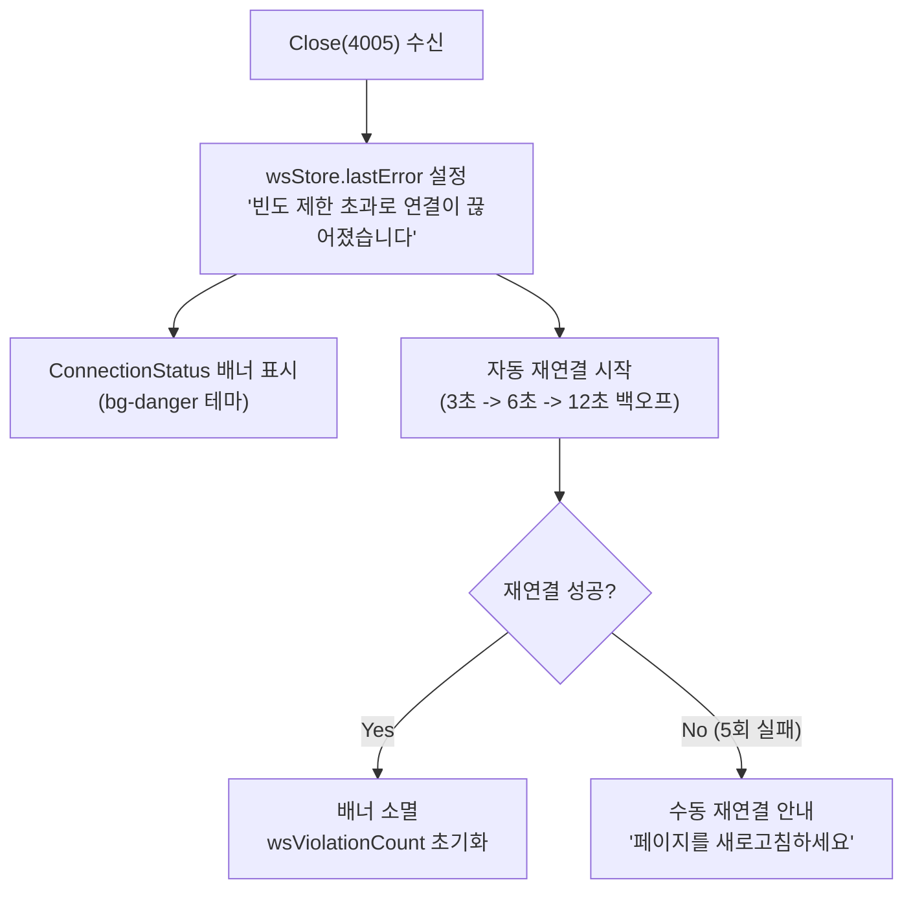

**기존 `ConnectionStatus` 확장**: `lastError`에 4005 관련 메시지가 설정되면, 배너에 아래와 같은 추가 정보를 표시한다.

```
+---------------------------------------------------------------+
| [스피너]  빈도 제한 초과로 연결이 끊어졌습니다 (재연결 3/5)     |
|           다음 시도까지 6초...                                 |
+---------------------------------------------------------------+
```

추가 표시 정보:
- 재연결 시도 횟수: `N/5`
- 다음 시도까지 남은 초: 백오프 타이머 카운트다운

이를 위해 `wsStore`에 다음 필드를 추가한다:

```typescript
// wsStore 추가 필드
reconnectAttemptCount: number;    // 현재 재연결 시도 횟수
reconnectNextDelaySec: number;    // 다음 시도까지 남은 초
```

---

### 2.3 WS 4005 전용 재연결 흐름 상세

#### 2.3.1 재연결 상태 3단계

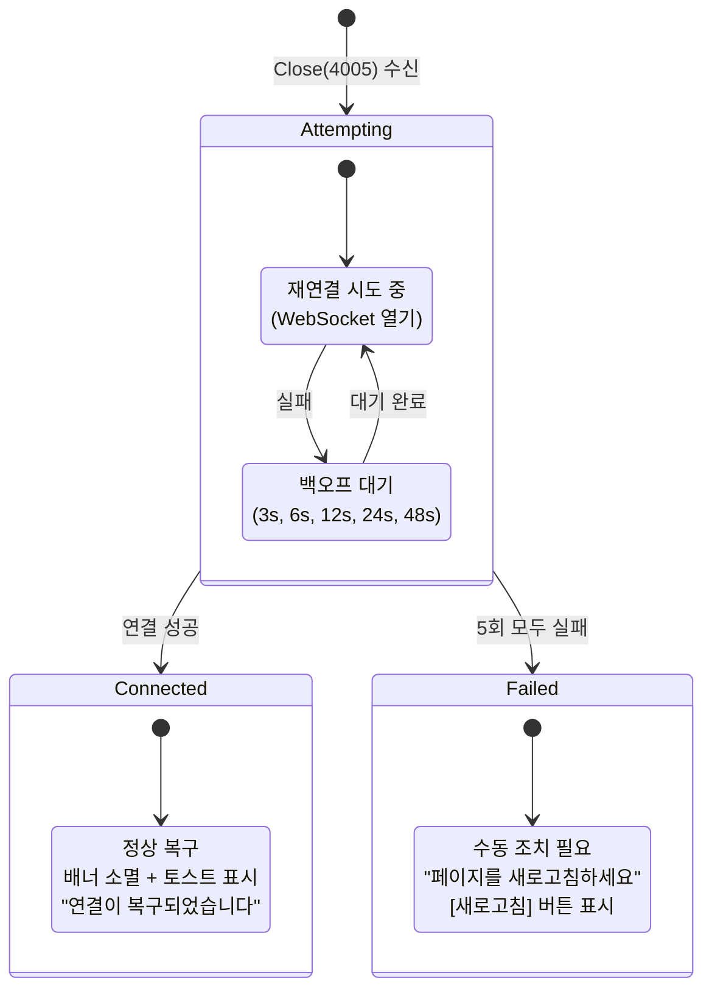

#### 2.3.2 단계별 배너 상태

| 단계 | 배경 | 텍스트 | 보조 요소 |
|------|------|--------|----------|
| 시도 중 (Attempting) | `bg-warning/10 border-warning/30` | "재연결 시도 중... (2/5)" | 스피너 + 카운트다운 |
| 대기 중 (WaitBackoff) | `bg-warning/10 border-warning/30` | "다음 시도까지 6초..." | 카운트다운 숫자 |
| 실패 (Failed) | `bg-danger/10 border-danger/30` | "연결에 실패했습니다" | [새로고침] 버튼 |
| 복구 (Connected) | `bg-success/10 border-success/30` | "연결이 복구되었습니다" | 체크 아이콘, 3초 후 소멸 |

#### 2.3.3 4005 사유 설명

ConnectionStatus 배너에 **사유 한 줄**을 추가한다:

- 일반 연결 끊김: "서버와 연결이 끊어졌습니다."
- 4005 (Rate Limit): "메시지를 너무 빠르게 보내서 연결이 제한되었습니다."
- 4001 (인증 실패): "인증이 만료되었습니다. 다시 로그인해주세요."
- 4004 (중복 연결): "다른 탭에서 같은 게임에 접속 중입니다."

이를 위해 `useWebSocket`의 `onclose` 핸들러에서 Close Code별 메시지를 설정한다:

```typescript
const WS_CLOSE_MESSAGES: Record<number, string> = {
  4001: "인증에 실패했습니다. 다시 로그인해주세요.",
  4002: "게임 방을 찾을 수 없습니다.",
  4003: "인증 시간이 초과되었습니다.",
  4004: "다른 탭에서 같은 게임에 접속 중입니다.",
  4005: "메시지를 너무 빠르게 보내서 연결이 제한되었습니다.",
};
```

---

### 2.4 AI 비용 한도 초과 UX

#### 2.4.1 발생 조건

ai-adapter의 `CostLimitGuard`가 일일 한도($20) 또는 시간당 사용자 한도를 초과하면 429를 반환한다. game-server가 이를 프론트엔드에 전달할 때 **AI 턴이 실패**하는 형태로 나타난다.

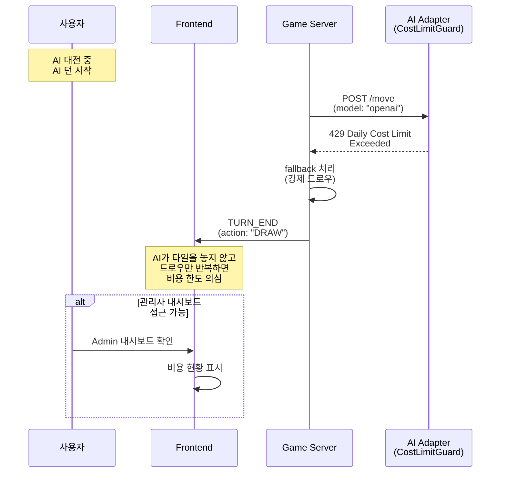

#### 2.4.2 UX 설계: 비용 한도 안내 배너

AI 비용 한도가 초과되면, **게임 생성 화면(로비)**에서 사전 안내를 제공한다. 게임 진행 중에는 game-server가 fallback(강제 드로우)으로 처리하므로 사용자에게 별도 에러를 보여줄 필요 없으나, **새 게임을 만들 때** 외부 LLM AI를 선택할 수 없음을 안내한다.

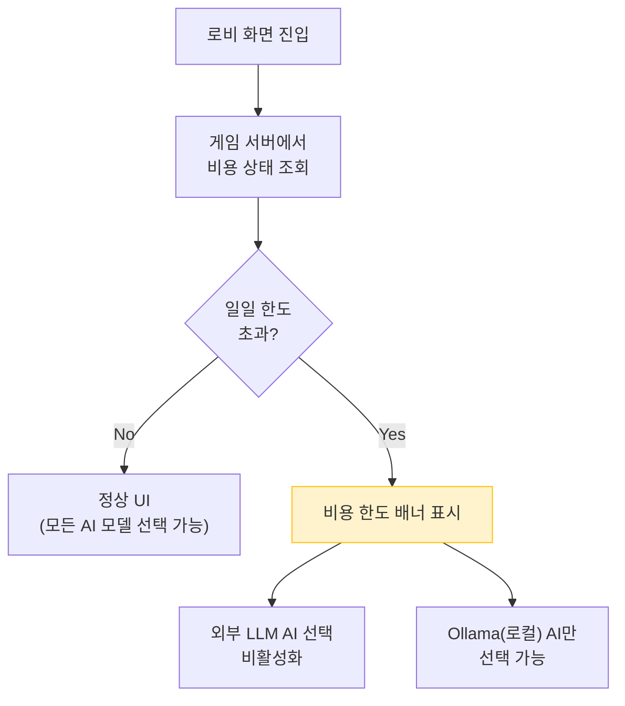

**비용 한도 배너 디자인**:

```
+---------------------------------------------------------------+
| [동전 아이콘]  오늘의 AI 비용 한도($20)에 도달했습니다          |
|               로컬 AI(Ollama)로만 대전할 수 있습니다.          |
|               내일 자정에 초기화됩니다.                         |
+---------------------------------------------------------------+
```

| 속성 | 값 |
|------|-----|
| 위치 | 로비 화면 상단, Room 생성 버튼 위 |
| 배경 | `bg-warning/10 border border-warning/30` |
| 텍스트 | `text-warning text-tile-sm` |
| 아이콘 | 동전/달러 아이콘 |
| 표시 조건 | 일일 비용 한도 초과 상태 |
| 소멸 | 한도 초기화(자정) 후 또는 수동 닫기 |
| 접근성 | `role="alert"`, `aria-live="polite"` |

**AI 모델 선택기 변경**:

| 상태 | OpenAI/Claude/DeepSeek | Ollama |
|------|----------------------|--------|
| 한도 이내 | 선택 가능 | 선택 가능 |
| 한도 초과 | `opacity-50 cursor-not-allowed` + 자물쇠 아이콘 | 정상 선택 가능 (강조) |

비활성화된 AI 모델에 호버하면 툴팁으로 사유를 표시한다:

```
"일일 비용 한도 초과로 사용할 수 없습니다. 내일 자정에 초기화됩니다."
```

#### 2.4.3 잔여 예산 표시 (선택 기능)

로비 또는 게임 생성 모달에 잔여 예산을 표시할 수 있다. 이는 Phase 6+ 선택 기능이다.

```
+-----------------------------------+
| 오늘 사용: $14.32 / $20.00       |
| [===========================   ] |
|                            71.6%  |
+-----------------------------------+
```

프로그레스 바 색상:
- 0~60%: `bg-success` (초록)
- 60~85%: `bg-warning` (노란)
- 85~100%: `bg-danger` (빨간)

---

## 3. 컴포넌트 목록 및 동작 명세

### 3.1 신규 컴포넌트

| 컴포넌트 | 파일 | 용도 | 우선순위 |
|---------|------|------|---------|
| `CooldownProgress` | `components/ui/CooldownProgress.tsx` | SVG 원형 쿨다운 카운트다운 | P1 |
| `ThrottleBadge` | `components/game/ThrottleBadge.tsx` | WS 스로틀 활성 상태 배지 | P1 |
| `CostLimitBanner` | `components/lobby/CostLimitBanner.tsx` | AI 비용 한도 초과 안내 배너 | P2 |
| `CostProgressBar` | `components/lobby/CostProgressBar.tsx` | 잔여 예산 프로그레스 바 | P3 (선택) |

### 3.2 수정 컴포넌트

| 컴포넌트 | 수정 내용 | 우선순위 |
|---------|----------|---------|
| `RateLimitToast` | 원형 프로그레스 추가, 단계별 색상 | P1 |
| `ConnectionStatus` | 4005 사유 메시지, 재연결 카운트다운 | P1 |
| `useWebSocket` | Close Code별 메시지 매핑, 위반 카운트 | P1 |
| `rateLimitStore` | cooldownSec, wsViolationCount 등 추가 | P1 |
| `wsStore` | reconnectAttemptCount, reconnectNextDelaySec 추가 | P1 |

### 3.3 CooldownProgress 상세 명세

```
Props:
  - remainingSec: number       // 남은 초
  - totalSec: number           // 전체 초 (비율 계산)
  - size?: number              // px (기본 28)
  - strokeWidth?: number       // px (기본 3)
  - className?: string

동작:
  1. SVG circle의 stroke-dashoffset으로 잔여 비율 표현
  2. 내부에 잔여 초 숫자 표시
  3. remainingSec이 0이 되면 체크 아이콘으로 전환 (0.3초간)
  4. prefers-reduced-motion 시 원형 애니메이션 제거, 숫자만 표시

접근성:
  - role="progressbar"
  - aria-valuenow={remainingSec}
  - aria-valuemin={0}
  - aria-valuemax={totalSec}
  - aria-label="쿨다운 잔여 시간"
```

### 3.4 ThrottleBadge 상세 명세

```
Props: 없음 (rateLimitStore 직접 구독)

동작:
  1. rateLimitStore.wsThrottled가 true이면 표시
  2. false가 되면 fade-out (300ms)
  3. "느린 전송 모드" 텍스트 + 시계 아이콘

스타일:
  bg-warning/20 border border-warning/40 rounded-md
  px-2 py-0.5
  text-warning text-tile-xs font-medium
  flex items-center gap-1

접근성:
  - role="status"
  - aria-live="polite"
  - aria-label="메시지 전송 속도가 제한되어 있습니다"
```

### 3.5 CostLimitBanner 상세 명세

```
Props:
  - isExceeded: boolean        // 한도 초과 여부
  - onDismiss?: () => void     // 닫기 콜백 (선택)

동작:
  1. isExceeded가 true이면 배너 표시
  2. 닫기 버튼으로 수동 dismiss 가능 (세션 내 유지)
  3. AI 모델 선택기에 비활성화 상태 전파

스타일:
  bg-warning/10 border border-warning/30 rounded-lg
  p-4 mx-4 mt-4
  flex items-start gap-3

접근성:
  - role="alert"
  - aria-live="polite"
```

---

## 4. 토스트/배너 레이어 스택 통합

### 4.1 z-index 및 위치 정리

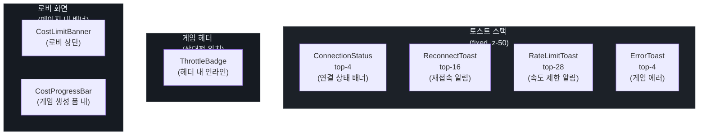

### 4.2 동시 표시 규칙

여러 알림이 동시에 발생할 수 있다. 다음 우선순위로 처리한다.

| 우선순위 | 알림 | 동시 표시 | 비고 |
|---------|------|----------|------|
| 1 (최고) | ConnectionStatus (disconnected) | 다른 모든 토스트 위에 표시 | 연결 끊김은 최우선 |
| 2 | RateLimitToast (2회 위반, 주황) | ConnectionStatus와 동시 가능 | 곧 연결이 끊길 수 있음을 경고 |
| 3 | RateLimitToast (1회 위반, 노란) | 단독 표시 | |
| 4 | ErrorToast (INVALID_MOVE) | RateLimitToast와 동시 가능 | 다른 top 위치 |
| 5 | ReconnectToast | 단독 표시 | 재접속 알림은 일시적 |

**충돌 처리**: ErrorToast(top-4)와 ConnectionStatus(top-4)가 동시에 필요한 경우, ConnectionStatus가 표시되면 ErrorToast는 억제한다 (연결 문제가 더 중요).

---

## 5. 사용자 흐름 다이어그램 (전체)

### 5.1 REST Rate Limit 사용자 흐름

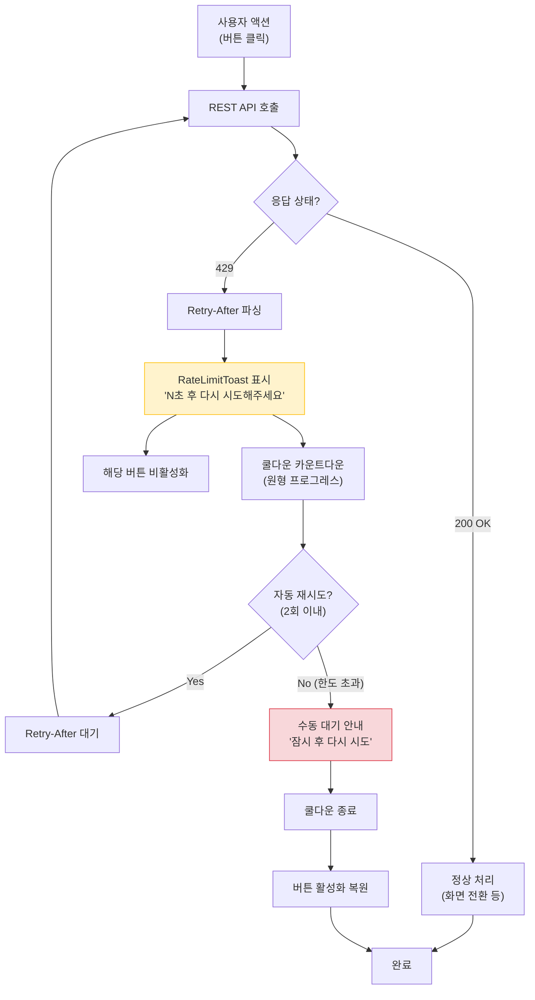

### 5.2 WS Rate Limit 사용자 흐름

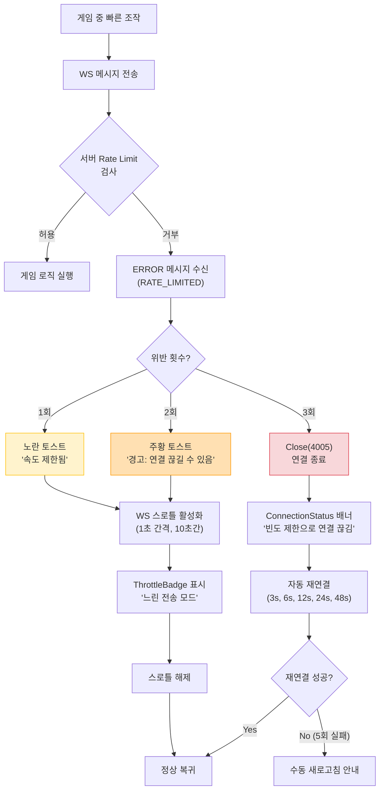

---

## 6. 색약 접근성 대응

### 6.1 색상만으로 구분하지 않는 보조 수단

| 상태 | 색상 | 아이콘 | 텍스트 라벨 | 패턴 |
|------|------|--------|------------|------|
| 경고 (1회 위반) | `#F3C623` (노란) | 시계 | "속도 제한" | 점선 테두리 |
| 위험 (2회 위반) | `#FF9800` (주황) | 삼각형 경고 | "연결 위험" | 실선 두꺼운 테두리 |
| 종료/실패 | `#F85149` (빨간) | X 또는 끊어진 연결 | "연결 끊김" | 실선 + 배경 패턴 |
| 복구 | `#3FB950` (초록) | 체크마크 | "복구됨" | 없음 |
| 비용 경고 | `#F3C623` (노란) | 동전 | "한도 초과" | 점선 테두리 |

### 6.2 아이콘 구분표

각 상태의 아이콘은 형태(shape)만으로 구별 가능하도록 설계한다.

- **시계**: 원형 + 시침 (시간 관련 제한)
- **삼각형 경고**: 삼각형 + 느낌표 (주의 필요)
- **끊어진 연결**: 번개 형태 끊김 (연결 문제)
- **체크마크**: V 형태 (성공/복구)
- **동전**: 원형 + $ 표시 (비용 관련)
- **자물쇠**: 사각형 + 고리 (사용 불가)

### 6.3 WCAG 대비비 검증

| 조합 | 전경 | 배경 | 대비비 | AA 충족 |
|------|------|------|--------|---------|
| 노란 토스트 텍스트 | `#1C2128` (gray-900) | `#F3C623/90` | 9.2:1 | 통과 |
| 주황 토스트 텍스트 | `#1C2128` | `#FF9800/90` | 5.8:1 | 통과 |
| 빨간 배너 텍스트 | `#F85149` | `#0D1117` | 4.8:1 | 통과 |
| 초록 복구 텍스트 | `#3FB950` | `#0D1117` | 5.4:1 | 통과 |
| 비용 배너 텍스트 | `#F3C623` | `#161B22` | 6.1:1 | 통과 |

---

## 7. 모션 명세

### 7.1 토스트 진입/퇴장

기존 Framer Motion 설정을 유지한다.

```typescript
// 모든 토스트 공통
initial={{ opacity: 0, y: -12 }}
animate={{ opacity: 1, y: 0 }}
exit={{ opacity: 0, y: -12 }}
transition={{ type: "spring", stiffness: 400, damping: 30 }}
```

### 7.2 원형 프로그레스 애니메이션

```css
/* CooldownProgress SVG */
.cooldown-circle {
  transition: stroke-dashoffset 1s linear;
}

/* reduced-motion 대응 */
@media (prefers-reduced-motion: reduce) {
  .cooldown-circle {
    transition: none;
  }
}
```

### 7.3 ThrottleBadge 진입/퇴장

```typescript
// ThrottleBadge
initial={{ opacity: 0, scale: 0.9 }}
animate={{ opacity: 1, scale: 1 }}
exit={{ opacity: 0, scale: 0.9 }}
transition={{ duration: 0.3, ease: "easeOut" }}
```

### 7.4 단계 전환 (노란 -> 주황)

위반 횟수가 증가하여 토스트 색상이 변경될 때, 기존 토스트가 퇴장한 후 새 토스트가 진입한다 (AnimatePresence key 변경).

```typescript
<AnimatePresence mode="wait">
  <motion.div key={`rate-limit-${violationLevel}`}>
    {/* violationLevel이 변경되면 자연스러운 전환 */}
  </motion.div>
</AnimatePresence>
```

---

## 8. 구현 우선순위

| 우선순위 | 항목 | 공수 | 의존성 |
|---------|------|------|--------|
| **P1** | rateLimitStore 확장 (cooldownSec, wsViolationCount) | 0.5h | 없음 |
| **P1** | RateLimitToast v2 (단계별 색상 + CooldownProgress) | 2h | rateLimitStore |
| **P1** | ThrottleBadge (WS 스로틀 상태 표시) | 1h | rateLimitStore |
| **P1** | useWebSocket 수정 (Close Code 메시지 매핑, 위반 추적) | 1h | rateLimitStore |
| **P1** | ConnectionStatus 확장 (4005 사유, 재연결 카운트다운) | 1.5h | wsStore |
| **P2** | CostLimitBanner (로비 비용 한도 안내) | 1.5h | 비용 API 필요 |
| **P2** | 버튼 비활성화 패턴 (useRateLimitButton 훅) | 1h | rateLimitStore |
| **P3** | CostProgressBar (잔여 예산 시각화) | 1h | 비용 API 필요 |
| **합계** | | **9.5h** | |

---

## 9. 테스트 시나리오

### 9.1 수동 테스트 체크리스트

| 시나리오 | 기대 결과 | 검증 포인트 |
|---------|----------|------------|
| REST 429 수신 시 | 노란 토스트 + 카운트다운 표시 | 잔여 초 정확히 감소 |
| 카운트다운 0 도달 | 토스트 소멸 + 버튼 활성화 | 자동 재시도 발생 확인 |
| WS RATE_LIMITED 1회 | 노란 토스트 + ThrottleBadge | 스로틀 10초간 유지 |
| WS RATE_LIMITED 2회 | 주황 토스트 (색상 변경) | "연결 끊길 수 있음" 메시지 |
| WS Close(4005) | 빨간 배너 + 재연결 시도 | 사유 메시지 표시 |
| 재연결 5회 실패 | "새로고침" 안내 + 버튼 | 버튼 클릭 시 새로고침 |
| AI 비용 한도 초과 | 로비에 경고 배너 | 외부 AI 선택 비활성화 |
| 색약 모드 확인 | 아이콘+텍스트로 구분 가능 | 색상 제거해도 의미 전달 |

### 9.2 E2E 테스트 포인트

| 테스트 | 검증 |
|--------|------|
| `rate-limit-toast-countdown` | CooldownProgress 컴포넌트 렌더링 + 숫자 감소 |
| `ws-throttle-badge` | wsThrottled 시 ThrottleBadge 표시/소멸 |
| `ws-4005-reconnect-banner` | Close(4005) 후 ConnectionStatus에 사유 표시 |
| `cost-limit-banner` | 한도 초과 시 CostLimitBanner 표시, AI 선택 비활성화 |

---

## 10. 관련 문서 업데이트 사항

| 문서 | 업데이트 내용 |
|------|-------------|
| `07-ui-wireframe.md` | Rate Limit 관련 토스트/배너 와이어프레임 추가 |
| `10-websocket-protocol.md` | Close Code 4005 클라이언트 UX 참조 링크 추가 |
| `14-rate-limit-design.md` | 섹션 5 응답 형식에 프론트엔드 UX 참조 추가 |
| `17-ws-rate-limit-design.md` | 섹션 5.2에 본 문서 참조 추가 |

---

## 변경 이력

| 날짜 | 버전 | 변경 내용 |
|------|------|----------|
| 2026-04-06 | v1.0 | 최초 작성 (REST 429, WS 4005, AI 비용 한도 UX) |
