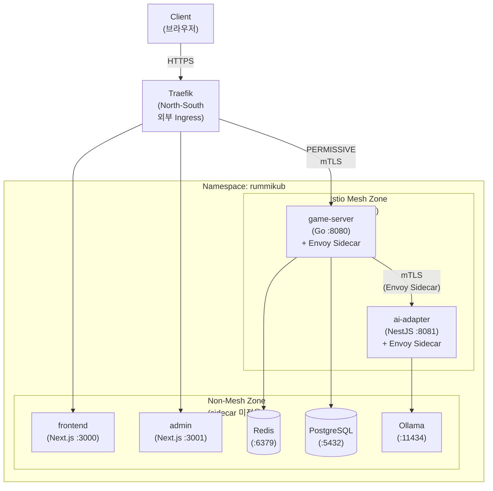
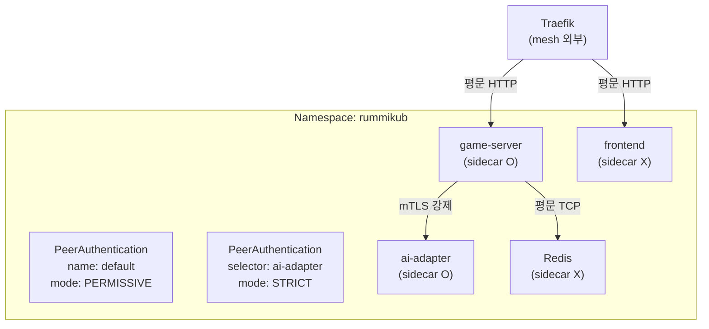
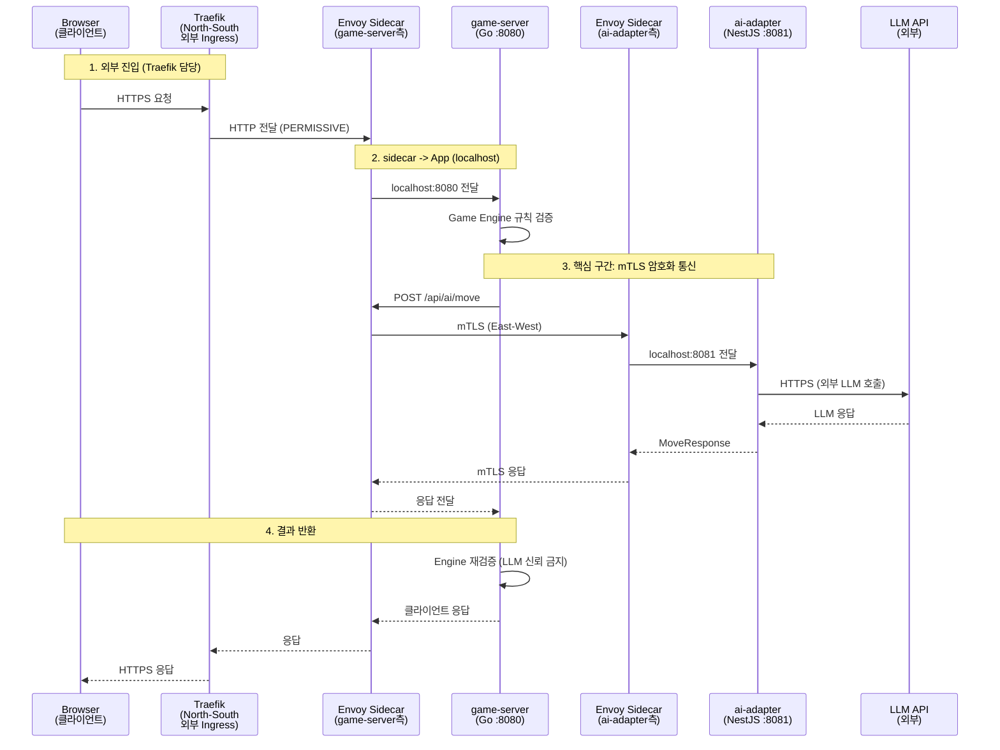
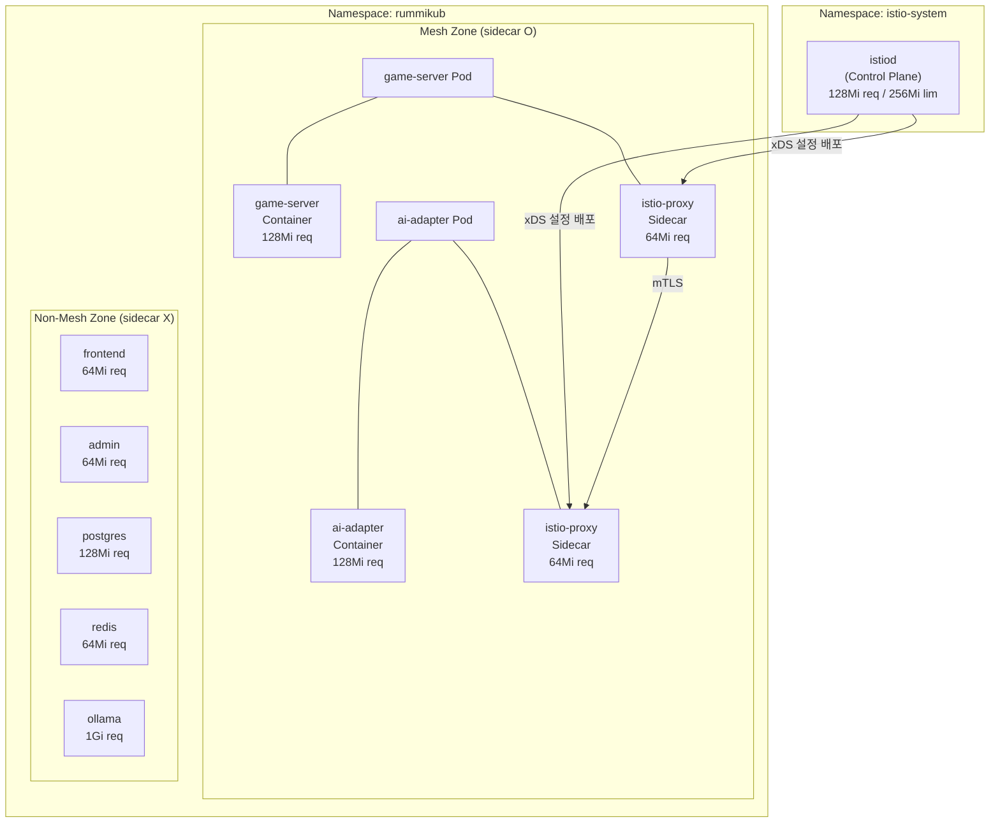
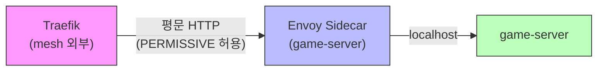
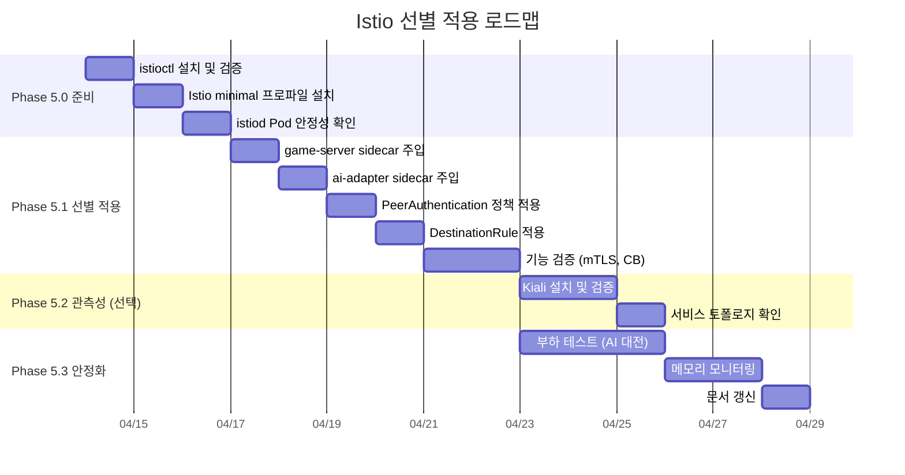
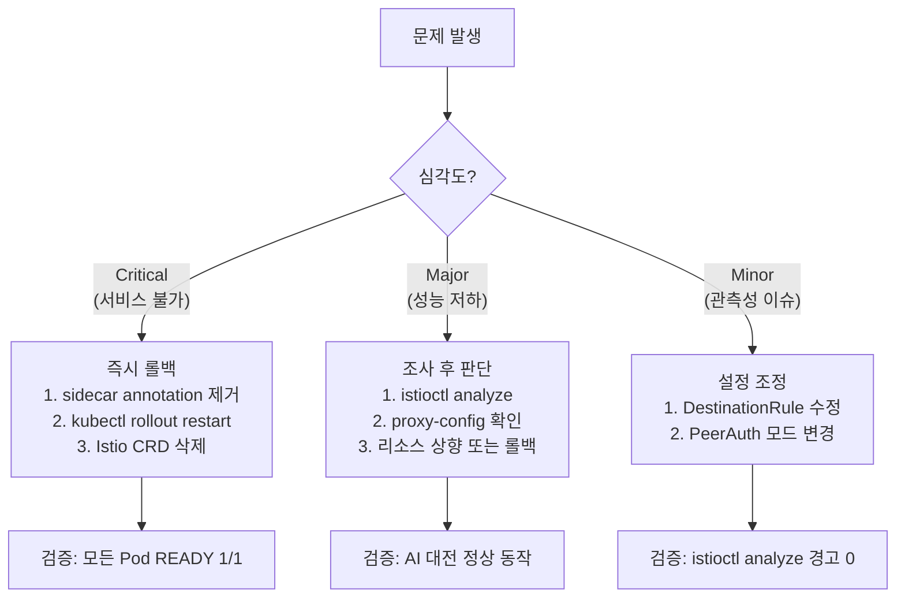

# Istio 선별 적용 Service Mesh 설계

## 1. 개요

### 1.1 목적

본 문서는 RummiArena 프로젝트에서 Istio Service Mesh를 **선별적으로** 적용하기 위한 상세 설계를 정의한다.
16GB RAM(WSL2 10GB) 제약 환경에서 Istio 도입의 실현 가능성을 메모리 프로파일링을 통해 검증하고, 비용 대비 이점이 확실한 구간만 적용하는 전략을 수립한다.

### 1.2 배경

- Phase 5(Sprint 5+)에서 서비스 메시 도입이 로드맵에 포함되어 있다 (`docs/05-deployment/02-gateway-architecture.md` Section 3.2)
- 기존 설계(`docs/00-tools/04-istio.md`)에서는 namespace 전체 sidecar injection을 전제했으나, 실측 메모리 분석 결과 **전체 적용은 메모리 예산 초과 위험**이 있다
- game-server <-> ai-adapter 구간이 LLM 호출의 핵심 경로이며, mTLS/관측성/서킷 브레이커의 실질적 수혜 대상이다

### 1.3 적용 범위

| 구분 | 값 |
|------|-----|
| 프로젝트 | RummiArena |
| 환경 | Docker Desktop Kubernetes (WSL2, 10GB) |
| 대상 서비스 | game-server, ai-adapter (선별 2개) |
| 제외 서비스 | frontend, admin, postgres, redis, ollama |
| Ingress 전략 | Traefik(North-South) + Istio(East-West) 공존 |

---

## 2. 현재 메모리 상황 분석

### 2.1 하드웨어 제약

| 항목 | 값 |
|------|-----|
| 물리 RAM | 16GB (LPDDR5) |
| WSL2 할당 | 10GB (.wslconfig) |
| K8s Node Allocatable | 13,878Mi (~13.6GB) |
| Swap | 4GB |

### 2.2 실측 Pod 메모리 사용량 (2026-04-06 기준)

`kubectl top pods` 실측값과 Helm values.yaml 설정값을 대조한 결과이다.

| 서비스 | 실측 사용량 | Request | Limit | 비고 |
|--------|-----------|---------|-------|------|
| game-server | **22Mi** | 128Mi | 256Mi | Go 바이너리, 경량 |
| ai-adapter | **81Mi** | 128Mi | 256Mi | NestJS, idle 기준 |
| frontend | **78Mi** | 64Mi | 256Mi | Next.js standalone |
| admin | **73Mi** | 64Mi | 256Mi | Next.js standalone |
| postgres | **23Mi** | 128Mi | 256Mi | idle |
| redis | **12Mi** | 64Mi | 192Mi | maxmemory 128mb |
| ollama | **12Mi** | 1Gi | 4Gi | 모델 미로드 시 |
| **rummikub 합계** | **301Mi** | **1,640Mi** | **5,728Mi** | |

### 2.3 전체 클러스터 메모리 현황

| Namespace | Pod 수 | 실측 합계 | Request 합계 | Limit 합계 |
|-----------|--------|----------|-------------|------------|
| rummikub | 7 | 301Mi | 1,640Mi | 5,728Mi |
| argocd | 4 | 204Mi | 288Mi | 832Mi |
| cicd | 1 | 57Mi | 64Mi | 256Mi |
| gitlab-runner | 1 | 50Mi | - | - |
| kube-system | 9 | 1,029Mi | 440Mi | 340Mi |
| **전체** | **22** | **1,641Mi** | **2,432Mi** | **7,156Mi** |

### 2.4 노드 수준 요약

```
Node: docker-desktop
Total Memory:     13,878Mi (Allocatable)
Current Used:      3,820Mi (kubectl top nodes 실측)
Requests Sum:      2,392Mi (17% of Allocatable)
Limits Sum:        6,996Mi (50% of Allocatable)
Estimated Free:   ~10,058Mi (Allocatable - Used)
```

> **핵심 수치**: 실측 기준 약 10GB 여유가 있으나, 이는 K8s 외부(Docker Engine, WSL2 커널, Claude Code 등)를 포함하지 않은 수치이다. WSL2 전체 기준으로는 아래 표가 더 정확하다.

### 2.5 WSL2 전체 메모리 예산

| 구성 요소 | 메모리 | 비고 |
|----------|--------|------|
| WSL2 커널 + systemd | ~300Mi | 고정 오버헤드 |
| Docker Engine | ~200Mi | 고정 오버헤드 |
| K8s 컴포넌트 (apiserver, etcd, scheduler 등) | ~1,000Mi | 실측 합계 |
| rummikub 7 Pod | ~301Mi | 실측 (idle) |
| ArgoCD 4 Pod | ~204Mi | 실측 |
| GitLab Runner 2 Pod | ~107Mi | 실측 |
| Claude Code + MCP | ~400Mi | 세션 활성 시 |
| **합계 (현재)** | **~2,512Mi** | idle 기준 |
| **WSL2 할당량** | **10,240Mi** | .wslconfig |
| **가용 여유** | **~7,728Mi** | idle 기준 |

> AI 실험 모드(Ollama 모델 로드 시 ~800Mi 추가)나 CI 빌드(SonarQube ~1Gi 추가) 시 여유가 줄어든다. Istio 추가 메모리는 **모든 모드에서의 worst case**를 기준으로 평가해야 한다.

---

## 3. Istio 컴포넌트별 메모리 요구사항

### 3.1 istiod (Control Plane)

| 프로파일 | Request | Limit | 비고 |
|----------|---------|-------|------|
| default | 2Gi | - | 프로덕션 권장, 로컬 불가 |
| demo | 128Mi | - | 학습/데모용 |
| **minimal** | **128Mi** | **256Mi** | 게이트웨이 없이 istiod만 |
| custom (본 설계) | **128Mi** | **256Mi** | minimal 기반 커스텀 |

### 3.2 Envoy Sidecar (istio-proxy)

| 설정 | Request | Limit | 비고 |
|------|---------|-------|------|
| Istio 기본값 | 100Mi | - | 상한 없음 |
| 경량 설정 | 64Mi | 128Mi | 로컬 환경 권장 |
| **본 설계 채택** | **64Mi** | **128Mi** | 2개 Pod에만 적용 |

> Envoy sidecar의 실제 메모리 사용량은 트래픽 볼륨과 연결 수에 비례한다. RummiArena의 game-server <-> ai-adapter 구간은 동시 게임 수가 적으므로(1~4게임) 64Mi 내에서 안정적으로 동작한다.

### 3.3 Istio Ingress Gateway

| 컴포넌트 | Request | Limit | 본 설계 |
|----------|---------|-------|---------|
| istio-ingressgateway | 100Mi | 256Mi | **사용하지 않음** |

> Traefik이 North-South 트래픽을 전담하므로 Istio Ingress Gateway는 설치하지 않는다. 이것만으로 ~256Mi를 절약한다.

### 3.4 관측성 애드온

| 애드온 | 메모리 | 본 설계 |
|--------|--------|---------|
| Kiali (서비스 토폴로지) | ~200Mi | Phase 5.2에서 선택 도입 |
| Jaeger (분산 트레이싱) | ~300Mi | 보류 (Prometheus로 대체) |
| Prometheus (메트릭) | ~300Mi | 기존 활용 검토 |
| Grafana (대시보드) | ~200Mi | 보류 |

> Phase 5.1(초기)에서는 애드온 없이 istiod + sidecar만 설치한다. 관측성은 `istioctl` CLI로 확인한다.

---

## 4. 선별 적용 전략 (핵심)

### 4.1 적용/제외 판단 매트릭스

| 서비스 | mTLS 필요성 | 서킷 브레이커 | 관측성 | sidecar 오버헤드 | **판정** |
|--------|------------|-------------|--------|-----------------|---------|
| game-server | **높음** (AI 호출 발신) | **높음** (LLM 장애 전파 차단) | **높음** (호출 지연 추적) | 64Mi (22Mi 대비 +291%) | **적용** |
| ai-adapter | **높음** (AI 호출 수신) | **높음** (LLM 타임아웃 관리) | **높음** (모델별 지연 분석) | 64Mi (81Mi 대비 +79%) | **적용** |
| frontend | 낮음 (Traefik 뒤) | 낮음 | 낮음 (브라우저 DevTools) | 64Mi (78Mi 대비 +82%) | **제외** |
| admin | 낮음 (Traefik 뒤) | 낮음 | 낮음 (관리자 전용) | 64Mi (73Mi 대비 +88%) | **제외** |
| postgres | 낮음 (ClusterIP) | 낮음 (자체 복제) | 낮음 (pg_stat) | 64Mi (23Mi 대비 +278%) | **제외** |
| redis | 낮음 (ClusterIP) | 낮음 (자체 sentinel) | 낮음 (redis-cli info) | 64Mi (12Mi 대비 +533%) | **제외** |
| ollama | 낮음 (로컬 추론) | 낮음 | 낮음 | 64Mi (성능 민감) | **제외** |

### 4.2 선별 적용 아키텍처



### 4.3 sidecar injection 구현 방법

namespace 전체에 `istio-injection=enabled` 라벨을 부여하지 **않는다**.
대신 Pod-level annotation으로 선별 주입한다.

**적용 대상 (game-server, ai-adapter)**:
```yaml
# helm/charts/game-server/templates/deployment.yaml
spec:
  template:
    metadata:
      labels:
        app: game-server
        sidecar.istio.io/inject: "true"    # Pod-level 선별 주입
      annotations:
        sidecar.istio.io/inject: "true"
        sidecar.istio.io/proxyCPU: "50m"
        sidecar.istio.io/proxyCPULimit: "200m"
        sidecar.istio.io/proxyMemory: "64Mi"
        sidecar.istio.io/proxyMemoryLimit: "128Mi"
```

**제외 대상 (명시적)**: namespace에 injection 라벨이 없으므로 별도 제외 annotation은 불필요하다. 만약 향후 namespace-level injection으로 전환 시:
```yaml
# helm/charts/frontend/templates/deployment.yaml (필요 시)
spec:
  template:
    metadata:
      annotations:
        sidecar.istio.io/inject: "false"
```

### 4.4 mTLS 정책 설계



**정책 계층**:

1. **Namespace 기본**: `PERMISSIVE` -- Traefik(mesh 외부)이 game-server에 접근 가능
2. **ai-adapter 전용**: `STRICT` -- game-server에서만 mTLS로 접근 가능. mesh 외부 직접 접근 차단

```yaml
# istio/peer-authentication-default.yaml
apiVersion: security.istio.io/v1
kind: PeerAuthentication
metadata:
  name: default
  namespace: rummikub
spec:
  mtls:
    mode: PERMISSIVE

---
# istio/peer-authentication-ai-adapter.yaml
apiVersion: security.istio.io/v1
kind: PeerAuthentication
metadata:
  name: ai-adapter-strict
  namespace: rummikub
spec:
  selector:
    matchLabels:
      app: ai-adapter
  mtls:
    mode: STRICT
```

### 4.5 서킷 브레이커 및 재시도 정책

```yaml
# istio/destination-rule-ai-adapter.yaml
apiVersion: networking.istio.io/v1
kind: DestinationRule
metadata:
  name: ai-adapter
  namespace: rummikub
spec:
  host: ai-adapter.rummikub.svc.cluster.local
  trafficPolicy:
    connectionPool:
      http:
        h2UpgradePolicy: UPGRADE
        maxRequestsPerConnection: 10
        http1MaxPendingRequests: 20
      tcp:
        maxConnections: 50
        connectTimeout: 10s
    outlierDetection:
      consecutive5xxErrors: 3
      interval: 30s
      baseEjectionTime: 30s
      maxEjectionPercent: 100    # Pod 1개이므로 100%
    tls:
      mode: ISTIO_MUTUAL

---
# istio/virtual-service-ai-adapter.yaml
apiVersion: networking.istio.io/v1
kind: VirtualService
metadata:
  name: ai-adapter
  namespace: rummikub
spec:
  hosts:
    - ai-adapter
  http:
    - timeout: 200s              # AI_ADAPTER_TIMEOUT_SEC과 일치
      retries:
        attempts: 1              # LLM 호출은 비용이 크므로 자동 재시도 1회
        retryOn: "5xx,reset"
        perTryTimeout: 200s
      route:
        - destination:
            host: ai-adapter
```

> **재시도 정책 근거**: LLM 호출은 비용이 발생하므로(gpt-5-mini $0.025/턴, Claude $0.074/턴) 무한 재시도는 위험하다. Istio 레벨에서는 네트워크 장애(5xx, reset)에 한해 1회만 재시도하고, 비즈니스 재시도(invalid move)는 Game Engine이 담당한다(최대 3회).

---

## 5. 메모리 프로파일링: 도입 전후 비교

### 5.1 시나리오별 메모리 영향 분석

#### 시나리오 A: 선별 적용 (본 설계 -- 권장)

| 추가 컴포넌트 | Request | Limit | 실측 예상 |
|--------------|---------|-------|----------|
| istiod (minimal) | 128Mi | 256Mi | ~180Mi |
| sidecar (game-server) | 64Mi | 128Mi | ~50Mi |
| sidecar (ai-adapter) | 64Mi | 128Mi | ~50Mi |
| **합계** | **256Mi** | **512Mi** | **~280Mi** |

#### 시나리오 B: 전체 적용 (기존 설계 -- 비권장)

| 추가 컴포넌트 | Request | Limit | 실측 예상 |
|--------------|---------|-------|----------|
| istiod (minimal) | 128Mi | 256Mi | ~180Mi |
| sidecar x 7 (모든 Pod) | 448Mi | 896Mi | ~350Mi |
| **합계** | **576Mi** | **1,152Mi** | **~530Mi** |

#### 시나리오 C: 전체 적용 + 관측성 애드온 (최대)

| 추가 컴포넌트 | Request | Limit | 실측 예상 |
|--------------|---------|-------|----------|
| istiod + sidecar x 7 | 576Mi | 1,152Mi | ~530Mi |
| Kiali | 128Mi | 256Mi | ~200Mi |
| Jaeger | 256Mi | 512Mi | ~300Mi |
| **합계** | **960Mi** | **1,920Mi** | **~1,030Mi** |

### 5.2 교대 실행 전략별 메모리 예산

| 모드 | 현재 | +시나리오 A (선별) | +시나리오 B (전체) | +시나리오 C (최대) |
|------|------|-------------------|-------------------|-------------------|
| 개발/테스트 | ~4.0Gi | **~4.3Gi** | ~4.5Gi | ~5.0Gi |
| CI 빌드 | ~6.0Gi | **~6.3Gi** | ~6.5Gi | ~7.0Gi |
| AI 실험 (Ollama) | ~4.8Gi | **~5.1Gi** | ~5.3Gi | ~5.8Gi |
| 전체 스택 | ~5.0Gi | **~5.3Gi** | ~5.5Gi | ~6.0Gi |
| **WSL2 한도** | **10.0Gi** | **10.0Gi** | **10.0Gi** | **10.0Gi** |
| **여유** | 5.0~6.0Gi | **4.7~5.7Gi** | 4.5~5.5Gi | 4.0~5.0Gi |

### 5.3 K8s Resource Quota 영향

| 측정 | 현재 | +시나리오 A (선별) | 증가율 |
|------|------|-------------------|--------|
| Total Requests (memory) | 2,392Mi | 2,648Mi | +10.7% |
| Total Limits (memory) | 6,996Mi | 7,508Mi | +7.3% |
| Allocatable 대비 Requests | 17% | 19% | +2%p |
| Allocatable 대비 Limits | 50% | 54% | +4%p |

> **결론**: 시나리오 A(선별 적용)는 Requests 기준 +256Mi(+10.7%)로 모든 교대 실행 모드에서 안전하다. Limits 기준으로도 54%로 overcommit 위험이 없다.

---

## 6. 대안 검토: 의사결정 매트릭스

### 6.1 후보 비교

| 기준 (가중치) | Istio 선별 (A) | Istio Ambient (B) | Linkerd (C) | 수동 구현 (D) |
|--------------|---------------|-------------------|-------------|-------------|
| **추가 메모리 (30%)** | ~280Mi | ~200Mi | ~180Mi | ~0Mi |
| **mTLS 지원 (20%)** | 자동 (STRICT/PERMISSIVE) | 자동 (L4 only) | 자동 | 수동 cert-manager |
| **서킷 브레이커 (15%)** | VirtualService + DestinationRule | L7 waypoint 필요 | ServiceProfile | 수동 Go 코드 |
| **관측성 (15%)** | Kiali, Jaeger 통합 | Kiali 부분 지원 | Linkerd Viz | Prometheus 수동 |
| **K8s 생태계 (10%)** | 사실상 표준, CNCF graduated | 신규 (Istio 1.22+) | CNCF graduated | - |
| **학습 곡선 (5%)** | 높음 (CRD 10+) | 중간 (ztunnel 신개념) | 낮음 (CRD 5개) | 낮음 |
| **롤백 용이성 (5%)** | annotation 제거로 즉시 | ztunnel DaemonSet 제거 | 어렵지 않음 | 코드 제거 |

### 6.2 정량 평가 (10점 만점)

| 기준 | 가중치 | Istio 선별 | Istio Ambient | Linkerd | 수동 |
|------|--------|-----------|---------------|---------|------|
| 추가 메모리 | 0.30 | 7 | 8 | 9 | 10 |
| mTLS | 0.20 | 10 | 8 | 9 | 5 |
| 서킷 브레이커 | 0.15 | 10 | 6 | 7 | 4 |
| 관측성 | 0.15 | 10 | 7 | 8 | 3 |
| K8s 생태계 | 0.10 | 10 | 7 | 8 | - |
| 학습 곡선 | 0.05 | 5 | 6 | 8 | 9 |
| 롤백 용이성 | 0.05 | 9 | 7 | 8 | 10 |
| **가중 합계** | 1.00 | **8.75** | **7.15** | **8.15** | **5.45** |

### 6.3 각 후보별 상세 검토

#### (B) Istio Ambient Mode

Istio 1.22+에서 도입된 sidecar 없는 메시 모드로, Node-level ztunnel이 L4 트래픽을 처리한다.

**장점**:
- sidecar 없이 mTLS 가능 (Pod당 메모리 오버헤드 제거)
- ztunnel은 DaemonSet으로 노드당 1개 (~100Mi)

**단점**:
- L7 기능(서킷 브레이커, 재시도, 트래픽 분할)에는 waypoint proxy 필요 (~100Mi 추가)
- 2026-04 기준 아직 GA 단계 초기, 안정성 검증 부족
- Kiali/Jaeger 통합이 sidecar 모드보다 미성숙
- Docker Desktop K8s에서의 ztunnel 호환성 미검증

**결론**: 메모리 이점은 있으나, L7 기능(서킷 브레이커)이 핵심 요구사항인 본 프로젝트에서는 waypoint까지 필요하여 결국 메모리 절약 효과가 제한적이다. 안정성 리스크도 감수해야 한다.

#### (C) Linkerd

CNCF graduated 경량 서비스 메시. Rust 기반 micro-proxy로 Envoy보다 가볍다.

**장점**:
- sidecar 메모리 ~20Mi (Envoy ~50Mi의 40%)
- 설치 간편 (`linkerd install | kubectl apply`)
- CRD 수가 적어 학습 곡선 완만

**단점**:
- Istio 대비 생태계/커뮤니티 규모 작음
- Kiali 같은 고급 토폴로지 도구 부재 (Linkerd Viz는 기본적)
- DestinationRule 수준의 세밀한 트래픽 정책 부족
- RummiArena의 기존 문서/설계가 모두 Istio 기반으로 작성됨

**결론**: 메모리 효율은 우수하나, 기존 설계 자산(docs/00-tools/04-istio.md, docs/05-deployment/02-gateway-architecture.md)과의 정합성, Istio 학습 목적을 고려하면 전환 비용이 이점을 상쇄한다.

#### (D) 수동 구현 (메시 없이)

mTLS는 cert-manager + 자체 인증서, 서킷 브레이커는 Go 코드(sony/gobreaker), 관측성은 Prometheus + 수동 계측.

**장점**:
- 추가 메모리 0
- 기존 인프라 변경 없음

**단점**:
- mTLS 인증서 관리(발급, 갱신, 로테이션) 직접 구현 필요
- 서킷 브레이커를 Go 코드에 내장하면 ai-adapter 교체 시 재구현 필요
- 관측성(분산 트레이싱)을 수동 구현하면 OpenTelemetry SDK 통합 작업 필요
- 인프라 관심사가 애플리케이션 코드에 침투 (관심사 분리 위반)

**결론**: 16GB 제약이 극단적이라면 유효한 선택이나, 현재 메모리 여유(~5Gi)가 충분하므로 인프라 레벨 해결이 더 건전하다.

---

## 7. 선별 적용 상세 아키텍처

### 7.1 트래픽 흐름 시퀀스



### 7.2 컴포넌트 배치도



### 7.3 Helm Chart 변경 사항

game-server와 ai-adapter의 Helm chart에 Istio sidecar annotation을 추가해야 한다. 이를 values.yaml의 조건부 설정으로 구현한다.

**game-server values.yaml 추가 항목**:
```yaml
# Istio sidecar injection (Phase 5)
istio:
  enabled: false    # Phase 5 활성화 시 true로 변경
  sidecar:
    proxyCPU: "50m"
    proxyCPULimit: "200m"
    proxyMemory: "64Mi"
    proxyMemoryLimit: "128Mi"
```

**deployment.yaml template 변경** (game-server, ai-adapter 공통):
```yaml
spec:
  template:
    metadata:
      labels:
        app: {{ .Chart.Name }}
      {{- if .Values.istio.enabled }}
      annotations:
        sidecar.istio.io/inject: "true"
        sidecar.istio.io/proxyCPU: {{ .Values.istio.sidecar.proxyCPU | quote }}
        sidecar.istio.io/proxyCPULimit: {{ .Values.istio.sidecar.proxyCPULimit | quote }}
        sidecar.istio.io/proxyMemory: {{ .Values.istio.sidecar.proxyMemory | quote }}
        sidecar.istio.io/proxyMemoryLimit: {{ .Values.istio.sidecar.proxyMemoryLimit | quote }}
      {{- end }}
```

---

## 8. Istio + Traefik 공존 설계

### 8.1 역할 분리 매트릭스

| 기능 | Traefik | Istio | 비고 |
|------|---------|-------|------|
| 외부 트래픽 수신 (North-South) | **담당** | - | 기존 유지 |
| TLS 종단 (외부 HTTPS) | **담당** | - | self-signed cert |
| URL/Host 기반 라우팅 | **담당** | - | /, /api, /ws, /admin |
| 서비스 간 mTLS (East-West) | - | **담당** | game-server <-> ai-adapter |
| 서킷 브레이커 | - | **담당** | DestinationRule |
| 트래픽 가중치 분배 | - | **담당** | VirtualService (카나리) |
| 분산 트레이싱 | - | **담당** (Phase 5.2) | istioctl proxy-config |
| Rate Limiting (외부) | **담당** | - | Traefik Middleware |
| Rate Limiting (내부) | - | 가능 (선택) | EnvoyFilter |

### 8.2 Traefik -> game-server 통신 경로

Traefik은 Istio mesh 외부에 있으므로 mTLS를 사용하지 않는다. game-server의 PeerAuthentication을 `PERMISSIVE`로 설정하여 Traefik의 평문 HTTP와 mesh 내부 mTLS를 모두 허용한다.



---

## 9. 구현 로드맵

### 9.1 Phase 5 세부 단계



### 9.2 단계별 상세

#### Phase 5.0: 준비 (1~3일)

```bash
# 1. istioctl 설치
curl -L https://istio.io/downloadIstio | ISTIO_VERSION=1.24.2 sh -
export PATH=$HOME/istio-1.24.2/bin:$PATH

# 2. 사전 검증
istioctl x precheck

# 3. Istio 최소 설치 (istiod만, gateway 없음)
istioctl install --set profile=minimal \
  --set values.pilot.resources.requests.memory=128Mi \
  --set values.pilot.resources.limits.memory=256Mi \
  --set values.pilot.resources.requests.cpu=50m \
  --set values.pilot.resources.limits.cpu=200m \
  -y

# 4. 설치 확인
kubectl get pods -n istio-system
kubectl top pods -n istio-system
```

#### Phase 5.1: 선별 sidecar 주입 (4~8일)

```bash
# 1. Helm values 변경 (istio.enabled: true)
# game-server, ai-adapter만

# 2. ArgoCD sync 또는 수동 배포
kubectl rollout restart deployment/game-server -n rummikub
kubectl rollout restart deployment/ai-adapter -n rummikub

# 3. sidecar 주입 확인 (READY 2/2)
kubectl get pods -n rummikub
# game-server-xxxxx   2/2   Running
# ai-adapter-xxxxx    2/2   Running

# 4. mTLS 정책 적용
kubectl apply -f istio/peer-authentication-default.yaml
kubectl apply -f istio/peer-authentication-ai-adapter.yaml
kubectl apply -f istio/destination-rule-ai-adapter.yaml

# 5. mTLS 동작 확인
istioctl proxy-config cluster game-server-xxxxx -n rummikub
istioctl authn tls-check game-server-xxxxx.rummikub ai-adapter.rummikub.svc.cluster.local
```

#### Phase 5.2: 관측성 (선택, 9~11일)

Kiali만 우선 도입하여 서비스 토폴로지를 시각화한다. Jaeger는 메모리 부담(~300Mi)이 크므로 보류한다.

```bash
# Kiali 설치 (경량 설정)
kubectl apply -f https://raw.githubusercontent.com/istio/istio/release-1.24/samples/addons/kiali.yaml

# 접속
kubectl port-forward svc/kiali -n istio-system 20001:20001
# http://localhost:20001
```

#### Phase 5.3: 안정화 (12~15일)

- AI 대전 스크립트 실행하여 mTLS 환경에서의 성능 영향 측정
- `kubectl top pods` 주기적 모니터링
- Envoy sidecar 추가 레이턴시 측정

### 9.3 Rollback 전략



**즉시 롤백 명령**:
```bash
# 1. sidecar 제거 (Helm values 변경)
# istio.enabled: false

# 2. Pod 재시작
kubectl rollout restart deployment/game-server -n rummikub
kubectl rollout restart deployment/ai-adapter -n rummikub

# 3. Istio 리소스 정리
kubectl delete peerauthentication --all -n rummikub
kubectl delete destinationrule --all -n rummikub
kubectl delete virtualservice --all -n rummikub

# 4. (필요 시) Istio 완전 제거
istioctl uninstall --purge -y
kubectl delete namespace istio-system
```

---

## 10. 검증 테스트 계획

### 10.1 기능 검증

| 테스트 | 방법 | 기대 결과 |
|--------|------|----------|
| sidecar 주입 | `kubectl get pods -n rummikub` | game-server, ai-adapter READY 2/2 |
| mTLS 동작 | `istioctl authn tls-check` | ai-adapter: mTLS STRICT |
| Traefik 접근 | `curl http://localhost:30080/health` | 200 OK (PERMISSIVE) |
| AI 호출 정상 | AI 대전 스크립트 실행 | 정상 완주, place rate 유지 |
| 서킷 브레이커 | ai-adapter 강제 종료 후 복구 | 30s 후 트래픽 재개 |
| WebSocket | 프론트엔드 게임 접속 | WS 연결 정상 |

### 10.2 성능 검증

| 측정 항목 | 기준 (sidecar 없음) | 허용 범위 | 측정 방법 |
|----------|-------------------|----------|----------|
| AI 호출 레이턴시 | ~120s (LLM 대기) | +1s 이내 | AI 대전 로그 |
| 메모리 증가 | 0 | +300Mi 이내 | `kubectl top pods` |
| Pod 시작 시간 | ~5s | +10s 이내 | `kubectl describe pod` |
| CPU 오버헤드 | 기준값 | +50m 이내 | `kubectl top pods` |

### 10.3 장애 시나리오 테스트

| 시나리오 | 조치 | 기대 |
|----------|------|------|
| istiod 다운 | `kubectl delete pod istiod-xxx` | 기존 sidecar 설정으로 계속 동작 (eventually consistent) |
| ai-adapter OOMKilled | Pod 메모리 한도 초과 유도 | 서킷 브레이커 작동, game-server에서 fallback draw |
| Traefik -> game-server 실패 | Traefik 재시작 | PERMISSIVE 모드로 복구 |

---

## 11. ArgoCD 연동

### 11.1 ignoreDifferences 설정

Istio sidecar가 주입되면 Pod spec에 `istio-proxy` 컨테이너가 자동 추가된다. ArgoCD가 이를 drift로 감지하지 않도록 설정해야 한다.

```yaml
# argocd/applications/game-server.yaml
spec:
  ignoreDifferences:
    - group: apps
      kind: Deployment
      jsonPointers:
        - /spec/template/metadata/annotations/sidecar.istio.io~1status
        - /spec/template/spec/initContainers
        - /spec/template/spec/containers/1    # istio-proxy sidecar
        - /spec/template/spec/volumes
```

### 11.2 Istio CRD 관리

Istio CRD(PeerAuthentication, DestinationRule, VirtualService)는 별도 ArgoCD Application으로 관리한다.

```yaml
# argocd/applications/istio-config.yaml
apiVersion: argoproj.io/v1alpha1
kind: Application
metadata:
  name: istio-config
  namespace: argocd
spec:
  project: default
  source:
    repoURL: <gitops-repo>
    path: istio/
    targetRevision: HEAD
  destination:
    server: https://kubernetes.default.svc
    namespace: rummikub
  syncPolicy:
    automated:
      prune: true
      selfHeal: true
```

---

## 12. ADR-020: Istio Service Mesh 선별 적용

### 상태
**제안됨** (Proposed) -- 2026-04-06

### 컨텍스트

RummiArena는 Docker Desktop Kubernetes(WSL2, 10GB RAM)에서 7개 서비스를 운영한다. Phase 5에서 서비스 메시 도입이 로드맵에 포함되어 있으며, game-server <-> ai-adapter 구간의 mTLS 암호화, 서킷 브레이커, 관측성이 필요하다. 그러나 16GB 물리 RAM 제약으로 인해 전체 서비스에 sidecar를 주입하면 메모리 예산이 빠듯해진다.

### 의사결정

**Istio를 game-server와 ai-adapter 2개 Pod에만 선별 적용한다.**

- namespace-level injection 대신 Pod-level annotation으로 선별 주입
- istiod(control plane)만 설치, Istio Ingress Gateway는 설치하지 않음 (Traefik 유지)
- 관측성 애드온은 Kiali만 선택 도입, Jaeger/Grafana는 보류

### 대안 검토

| 대안 | 점수 | 탈락 사유 |
|------|------|----------|
| Istio Ambient Mode | 7.15/10 | L7 기능에 waypoint 필요, GA 초기 안정성 우려 |
| Linkerd | 8.15/10 | 기존 Istio 기반 설계 자산과 불일치, 전환 비용 |
| 수동 구현 (메시 없음) | 5.45/10 | 인프라 관심사의 애플리케이션 코드 침투, 유지보수 부담 |

### 근거

1. **메모리 효율**: 선별 적용(~280Mi) vs 전체 적용(~530Mi)으로 약 250Mi 절약
2. **실질적 수혜**: mTLS/서킷 브레이커/관측성이 필요한 구간은 game-server <-> ai-adapter 단 하나
3. **롤백 용이**: Pod annotation 제거와 rollout restart로 즉시 원복 가능
4. **점진적 확장**: 향후 메모리 여유가 생기면 다른 서비스에도 확장 가능
5. **Traefik 공존**: North-South(Traefik) / East-West(Istio) 역할 분리가 명확

### 결과

- istiod + sidecar 2개로 총 ~280Mi 추가 (현재 대비 +11%)
- 모든 교대 실행 모드에서 WSL2 10GB 한도 내 안전 운용
- game-server <-> ai-adapter 구간에 mTLS, 서킷 브레이커, 재시도 정책 적용
- frontend, admin, postgres, redis, ollama는 기존과 동일하게 sidecar 없이 운용

### 참고

- `docs/00-tools/04-istio.md` -- Istio 기본 매뉴얼
- `docs/05-deployment/02-gateway-architecture.md` -- Traefik + Istio 공존 전략
- `docs/02-design/01-architecture.md` -- 시스템 아키텍처

---

## 13. 파일 구조

Istio 관련 K8s 매니페스트는 아래 구조로 관리한다.

```
istio/
  peer-authentication-default.yaml       # PERMISSIVE (namespace 기본)
  peer-authentication-ai-adapter.yaml    # STRICT (ai-adapter 전용)
  destination-rule-ai-adapter.yaml       # 서킷 브레이커 + 연결 풀
  virtual-service-ai-adapter.yaml        # 타임아웃 + 재시도
```

---

## 14. 위험 및 완화 방안

| 위험 | 영향 | 확률 | 완화 방안 |
|------|------|------|----------|
| istiod OOM | 메시 설정 배포 불가 | 낮음 | limit 256Mi, 모니터링 경보 설정 |
| sidecar 레이턴시 추가 | AI 턴 타임아웃 | 낮음 | VirtualService timeout을 AI_ADAPTER_TIMEOUT_SEC과 일치(200s) |
| Traefik-GS 연결 실패 | 외부 접근 불가 | 중간 | PERMISSIVE 모드 유지, 롤백 절차 숙지 |
| ArgoCD sync drift | 배포 실패 | 중간 | ignoreDifferences 설정 사전 적용 |
| 메모리 예산 초과 (AI 실험 + CI 동시) | WSL2 OOM | 낮음 | 교대 실행 전략 유지, Istio 추가분 +280Mi 반영 |

---

## 15. 요약

### 핵심 결정사항

| 항목 | 결정 |
|------|------|
| 적용 범위 | game-server + ai-adapter (2 Pod) 선별 |
| 설치 프로파일 | minimal (istiod only) |
| Ingress Gateway | 미설치 (Traefik 유지) |
| sidecar 주입 방식 | Pod-level annotation |
| mTLS 모드 | PERMISSIVE (기본) + STRICT (ai-adapter) |
| 추가 메모리 | ~280Mi (istiod 180Mi + sidecar 50Mi x 2) |
| 관측성 | Kiali 선택 도입, Jaeger 보류 |
| 롤백 | annotation 제거 + rollout restart |

### 메모리 요약

```
현재 WSL2 사용: ~2.5Gi (idle)
Istio 추가:     ~0.3Gi (선별 적용)
변경 후 합계:   ~2.8Gi
WSL2 한도:     10.0Gi
여유:          ~7.2Gi (안전)
```

---

> **문서 이력**
> | 버전 | 날짜 | 작성자 | 내용 |
> |------|------|--------|------|
> | 1.0 | 2026-04-06 | Architect Agent | 초안 작성 -- Istio 선별 적용 설계, 메모리 프로파일링, ADR-020 |
