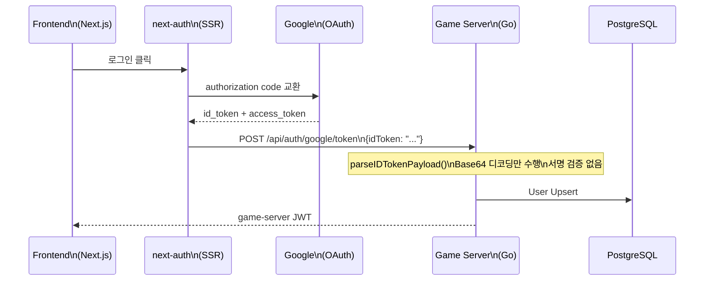
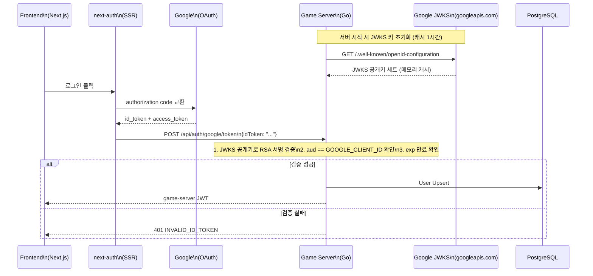

# JWKS 서명 검증 아키텍처 가이드 (SEC-ADD-001)

> **작성일**: 2026-04-07
> **작성자**: Software Architect
> **대상**: Go Dev (구현), QA (테스트)
> **상태**: 설계 완료 -- 구현 대기
> **관련 이슈**: SEC-ADD-001, SEC-004, C-2

---

## 1. 개요

### 1.1 문제

현재 `GoogleLoginByIDToken` 핸들러(`POST /api/auth/google/token`)는 next-auth가 전달한 Google `id_token`의 **서명을 검증하지 않는다**. `parseIDTokenPayload()` 함수는 JWT의 Base64url 페이로드만 디코딩하여 `sub`, `email`, `name` 클레임을 추출한다.

공격자가 임의로 조작한 `id_token`(예: `sub`를 다른 사용자 Google ID로 변조)을 `POST /api/auth/google/token`에 전송하면, 서명 검증 없이 해당 사용자로 인증된 game-server JWT가 발급된다.

### 1.2 영향 범위

| 엔드포인트 | 현재 상태 | 위험도 |
|-----------|----------|--------|
| `POST /api/auth/google/token` | **서명 미검증** -- id_token 페이로드만 파싱 | Medium (인증 우회) |
| `POST /api/auth/google` | Google Token Endpoint를 경유하므로 상대적 안전 | Low (TLS 의존) |
| `POST /api/auth/dev-login` | APP_ENV=dev 전용, JWKS 무관 | N/A |

### 1.3 목표

- Google `id_token`의 RSA 서명을 Google JWKS 공개키로 검증
- `aud` 클레임이 우리 `GOOGLE_CLIENT_ID`와 일치하는지 확인
- `exp` 만료 검증
- JWKS 키 캐싱으로 매 요청마다 Google에 키를 요청하지 않음

---

## 2. 현재 인증 흐름 vs 변경 후 흐름

### 2.1 현재 흐름 (서명 미검증)



### 2.2 변경 후 흐름 (JWKS 서명 검증)



---

## 3. 라이브러리 선정

### 3.1 후보 비교

| 라이브러리 | Stars | 특징 | 판단 |
|-----------|-------|------|------|
| `github.com/MicahParks/keyfunc/v3` | 1.2k+ | `golang-jwt/jwt/v5`와 네이티브 통합, 자동 키 리프레시 | **채택** |
| `google.golang.org/api/idtoken` | N/A | Google 공식이지만 GCP 의존성 무거움 | 기각 (overhead) |
| 자체 구현 (net/http + JWKS 파싱) | N/A | 종속성 최소화 가능 | 기각 (유지보수 부담) |

### 3.2 채택 근거: `keyfunc/v3`

1. **기존 의존성과 호환**: 프로젝트가 이미 `github.com/golang-jwt/jwt/v5`를 사용 중. `keyfunc`는 이 라이브러리의 `jwt.Keyfunc` 인터페이스를 직접 구현하므로 **기존 `ParseWithClaims` 패턴을 그대로 사용** 가능하다.
2. **자동 키 리프레시**: 백그라운드 고루틴으로 JWKS 엔드포인트를 주기적으로 폴링하여 키 로테이션에 자동 대응한다 (기본 1시간, Google 권장 주기와 일치).
3. **경량**: 추가 의존성이 거의 없다 (순수 Go, net/http만 사용).
4. **테스트 친화적**: `keyfunc.NewGivenCustom()`으로 정적 키를 주입하여 JWKS 서버 없이 단위 테스트 가능.

---

## 4. 변경 대상 파일/함수 목록

### 4.1 수정 대상

| 파일 | 함수/구조체 | 변경 내용 |
|------|-----------|----------|
| `go.mod` | -- | `github.com/MicahParks/keyfunc/v3` 의존성 추가 |
| `internal/config/config.go` | `Config`, `GoogleOAuthConfig` | `GoogleJWKSURL` 필드 추가 (기본값: Google OpenID Configuration URL) |
| `internal/handler/auth_handler.go` | `AuthHandler` 구조체 | `jwksKeyFunc jwt.Keyfunc` 필드 추가 |
| `internal/handler/auth_handler.go` | `NewAuthHandler()` 또는 새 메서드 | JWKS 클라이언트 초기화 메서드 `WithJWKS()` 추가 |
| `internal/handler/auth_handler.go` | `GoogleLoginByIDToken()` (L170-216) | `parseIDTokenPayload()` 대신 `verifyGoogleIDToken()` 호출 |
| `internal/handler/auth_handler.go` | `exchangeGoogleCode()` (L222-279) | Google Token Endpoint 경유 경로에도 서명 검증 추가 |
| `internal/handler/auth_handler.go` | 신규 함수 `verifyGoogleIDToken()` | JWKS 키로 `jwt.ParseWithClaims` + aud/exp 검증 |
| `internal/handler/auth_handler.go` | `googleIDTokenClaims` 구조체 (L105-109) | `jwt.RegisteredClaims` 임베딩으로 확장 (aud, exp 검증용) |
| `cmd/server/main.go` | 서버 초기화 블록 (L126-127) | `authHandler.WithJWKS(...)` 호출 추가 |
| `internal/handler/auth_handler_test.go` | 신규 테스트 케이스 추가 | 서명 검증 성공/실패 테스트 |

### 4.2 수정하지 않는 파일

| 파일 | 이유 |
|------|------|
| `internal/middleware/auth.go` | game-server 자체 JWT(HS256) 검증 미들웨어. Google id_token과 무관. 변경 없음 |
| `internal/handler/auth_handler.go` `DevLogin()` | 개발 전용 엔드포인트. JWKS 검증 대상 아님 |
| `internal/handler/auth_handler.go` `upsertUser()` | 인증 후 User Upsert 로직. 변경 없음 |

---

## 5. 상세 설계

### 5.1 JWKS 클라이언트 초기화 위치

**결정: Builder 패턴 + 서버 시작 시 1회 초기화 (싱글톤)**

```
cmd/server/main.go (서버 시작)
  |
  +-- authHandler := handler.NewAuthHandler(cfg.JWT.Secret)
  |     .WithGoogleOAuth(clientID, clientSecret)
  |     .WithJWKS(googleJWKSURL)     // <-- 신규
  |     .WithUserRepo(userRepo)
```

- `WithJWKS(jwksURL string) *AuthHandler` 메서드가 `keyfunc.NewDefault()` 를 호출하여 JWKS 클라이언트를 초기화한다.
- JWKS URL은 Google의 OpenID Configuration에서 제공하는 `https://www.googleapis.com/oauth2/v3/certs` 를 기본값으로 사용한다.
- 키 리프레시 주기: 1시간 (keyfunc 기본값, Google 권장).
- **JWKS 초기화 실패 시**: 서버 시작을 차단하지 않는다. 로그 경고 후 `jwksKeyFunc`를 nil로 유지하고, 요청 시 503을 반환한다. 이는 기존 `GOOGLE_CLIENT_ID` 미설정 시 503 반환 패턴과 일관된다.

### 5.2 `verifyGoogleIDToken` 함수 설계

```
func (h *AuthHandler) verifyGoogleIDToken(idToken string) (*googleIDTokenClaims, error)
```

**검증 단계:**

1. `jwt.ParseWithClaims(idToken, claims, h.jwksKeyFunc)` -- RSA 서명 검증
2. `claims.Audience` 에 `h.googleClientID` 포함 확인 -- 토큰 수신자 검증
3. `claims.ExpiresAt` 가 현재 시각 이후인지 확인 -- `golang-jwt/jwt/v5`가 자동 처리
4. `claims.Issuer` 가 `https://accounts.google.com` 또는 `accounts.google.com` 인지 확인
5. `claims.Sub` 가 비어있지 않은지 확인

**에러 처리:**
- 검증 실패 시 `error`를 반환하고, 호출자(`GoogleLoginByIDToken`)가 **401 INVALID_ID_TOKEN** 응답
- fallback 없음 -- 서명 검증 실패 = 인증 거부

### 5.3 `googleIDTokenClaims` 구조체 확장

현재:
```go
type googleIDTokenClaims struct {
    Sub   string `json:"sub"`
    Email string `json:"email"`
    Name  string `json:"name"`
}
```

변경 후:
```go
type googleIDTokenClaims struct {
    Sub   string `json:"sub"`
    Email string `json:"email"`
    Name  string `json:"name"`
    jwt.RegisteredClaims        // aud, exp, iss 등 표준 클레임 포함
}
```

`jwt.RegisteredClaims`를 임베딩하면 `jwt.ParseWithClaims`가 `aud`, `exp`, `iss` 등 표준 클레임을 자동으로 파싱하고 유효성을 검증한다.

### 5.4 `parseIDTokenPayload` 함수 처리

- **즉시 삭제하지 않는다.** 내부적으로 `exchangeGoogleCode()` 경로에서도 사용 중이다.
- `exchangeGoogleCode()` 경로도 JWKS 검증으로 전환한 뒤, `parseIDTokenPayload()`를 deprecated 처리한다.
- 최종적으로 두 경로 모두 `verifyGoogleIDToken()`을 사용하도록 통일한다.

### 5.5 dev-login 경로와의 공존

**dev-login은 전혀 영향받지 않는다.**

| 경로 | 인증 방식 | JWKS 검증 |
|------|----------|-----------|
| `POST /api/auth/dev-login` | 자체 JWT 발급 (HS256) | 해당 없음 |
| `POST /api/auth/google` | Google Token Endpoint + JWKS 검증 | 적용 |
| `POST /api/auth/google/token` | id_token JWKS 검증 | 적용 |

dev-login은 `APP_ENV=dev` 조건에서만 라우터에 등록되며, Google OAuth와 완전히 독립적인 경로이다.

### 5.6 K8s 환경 네트워크 고려

| 항목 | 값 | 비고 |
|------|-----|------|
| JWKS 엔드포인트 | `https://www.googleapis.com/oauth2/v3/certs` | 외부 HTTPS |
| Pod 외부 접근 | 가능 (Docker Desktop K8s) | CoreDNS 기본 설정으로 외부 DNS 해석 가능 |
| 네트워크 정책 | 미적용 (rummikub namespace) | Istio Phase 5에서 Egress 정책 추가 예정 |
| 초기화 실패 | 서버 시작 허용, 요청 시 503 | Pod 무한 재시작 방지 |

JWKS 키는 서버 시작 시 메모리에 캐시되므로, 런타임에 Google API에 대한 의존도는 낮다. 키 리프레시 실패 시에도 기존 캐시된 키를 계속 사용한다.

---

## 6. 인증/프로필 분리 원칙 준수 확인

`docs/03-development/06-coding-conventions.md` 섹션 5.5에 명시된 원칙을 이번 변경에서도 유지한다.

| 원칙 | 이번 변경에서의 준수 방법 |
|------|------------------------|
| OAuth 로그인 시 DisplayName 덮어쓰기 금지 | `verifyGoogleIDToken()`은 `sub`, `email`만 인증에 사용. `upsertUser()`의 기존 로직(L333: DisplayName 미변경) 그대로 유지 |
| JWT에 프로필 정보 포함 금지 | game-server JWT claims에 `sub`, `email`, `role`만 포함 (변경 없음) |
| 인증 핸들러에서 프로필 업데이트 금지 | `upsertUser()`에서 `email` 동기화만 수행 (변경 없음) |

---

## 7. Go Dev 구현 체크리스트

### Phase 1: 의존성 및 기반 (예상 30분)

- [ ] `go.mod`에 `github.com/MicahParks/keyfunc/v3` 추가 (`go get`)
- [ ] `internal/config/config.go`에 `GOOGLE_JWKS_URL` 환경변수 기본값 추가
  - 기본값: `https://www.googleapis.com/oauth2/v3/certs`
  - `GoogleOAuthConfig`에 `JWKSURL string` 필드 추가

### Phase 2: JWKS 클라이언트 초기화 (예상 30분)

- [ ] `internal/handler/auth_handler.go` -- `AuthHandler` 구조체에 `jwksKeyFunc jwt.Keyfunc` 필드 추가
- [ ] `WithJWKS(jwksURL string) *AuthHandler` 메서드 구현
  - `keyfunc.NewDefault([]string{jwksURL})` 호출
  - 실패 시 로그 경고 + `jwksKeyFunc = nil` 유지
- [ ] `cmd/server/main.go` -- `authHandler.WithJWKS(cfg.GoogleOAuth.JWKSURL)` 호출 추가 (L126-127 부근)

### Phase 3: 서명 검증 구현 (예상 1시간)

- [ ] `googleIDTokenClaims` 구조체에 `jwt.RegisteredClaims` 임베딩
- [ ] `verifyGoogleIDToken(idToken string) (*googleIDTokenClaims, error)` 함수 구현
  - `h.jwksKeyFunc == nil` 이면 `503 JWKS_UNAVAILABLE` 반환
  - `jwt.ParseWithClaims` + JWKS keyfunc로 서명 검증
  - `aud` 에 `h.googleClientID` 포함 확인
  - `iss` 가 `https://accounts.google.com` 또는 `accounts.google.com` 확인
  - `sub` 비어있지 않은지 확인
- [ ] `GoogleLoginByIDToken()` 에서 `parseIDTokenPayload()` 호출을 `verifyGoogleIDToken()` 으로 교체
- [ ] `exchangeGoogleCode()` 에서 `parseIDTokenPayload()` 호출을 `verifyGoogleIDToken()` 으로 교체

### Phase 4: 테스트 (예상 1시간)

- [ ] 유효 토큰 검증 성공 테스트 (RSA 키 직접 생성, `keyfunc.NewGivenCustom` 사용)
- [ ] 서명 변조 토큰 -- 401 반환
- [ ] 만료 토큰(`exp` < now) -- 401 반환
- [ ] `aud` 불일치 토큰 -- 401 반환
- [ ] `iss` 불일치 토큰 -- 401 반환
- [ ] `sub` 누락 토큰 -- 401 반환
- [ ] JWKS 미초기화(`jwksKeyFunc == nil`) -- 503 반환
- [ ] 기존 `DevLogin` 테스트 -- 변경 없이 통과 확인

### Phase 5: 정리

- [ ] `parseIDTokenPayload()` 가 더 이상 외부에서 호출되지 않으면 삭제 또는 `_test.go` 전용으로 이동
- [ ] 기존 테스트에서 `parseIDTokenPayload()` 직접 호출하는 케이스 정리

---

## 8. 테스트 전략

### 8.1 단위 테스트 -- RSA 키 모킹 패턴

```go
// 테스트에서 RSA 키 쌍을 동적 생성하여 사용한다.
// 실제 Google JWKS 서버에 의존하지 않는다.

func generateTestRSAKey(t *testing.T) (*rsa.PrivateKey, jwk.Key) {
    privateKey, err := rsa.GenerateKey(rand.Reader, 2048)
    require.NoError(t, err)
    // keyfunc.NewGivenCustom()으로 정적 JWKS 생성
    // jwt.NewWithClaims(jwt.SigningMethodRS256, claims)로 테스트 토큰 서명
}
```

### 8.2 검증 매트릭스

| 테스트 케이스 | 입력 | 기대 결과 |
|-------------|------|----------|
| 유효 토큰 | 올바른 RSA 서명 + 유효 aud/exp/iss/sub | 200 + game-server JWT |
| 서명 변조 | 다른 RSA 키로 서명 | 401 INVALID_ID_TOKEN |
| 만료 토큰 | exp = 1시간 전 | 401 INVALID_ID_TOKEN |
| aud 불일치 | aud = "wrong-client-id" | 401 INVALID_ID_TOKEN |
| iss 불일치 | iss = "https://evil.com" | 401 INVALID_ID_TOKEN |
| sub 누락 | sub = "" | 401 INVALID_ID_TOKEN |
| JWKS 미가용 | jwksKeyFunc = nil | 503 JWKS_UNAVAILABLE |
| dev-login | 기존 테스트 | 변경 없이 통과 |

---

## 9. 배포 고려사항

### 9.1 K8s 환경 변수

신규 환경 변수 추가 불필요. `GOOGLE_JWKS_URL`은 코드 내 기본값(`https://www.googleapis.com/oauth2/v3/certs`)을 사용한다. 별도 ConfigMap/Secret 변경 없음.

### 9.2 롤백 전략

`WithJWKS()` 호출을 제거하면 `jwksKeyFunc`가 nil이 되어 Google OAuth 엔드포인트가 503을 반환한다. 이는 의도적인 fail-closed 설계이다. 긴급 롤백 시 이전 이미지로 Pod를 되돌리면 된다.

### 9.3 키 로테이션 자동 대응

`keyfunc/v3`의 `NewDefault()`는 백그라운드 고루틴으로 JWKS를 주기적으로 리프레시한다. Google이 RSA 키를 로테이션하면 (약 6시간 주기) 자동으로 새 키를 가져온다. Sprint 6에서 별도 모니터링을 추가할 수 있으나, 현재 단계에서는 라이브러리 기본 동작으로 충분하다.

---

## 10. 미래 과제 (Sprint 6+)

| 항목 | 설명 | 우선순위 |
|------|------|---------|
| JWKS 리프레시 실패 모니터링 | Prometheus 메트릭으로 키 리프레시 실패 감지 | P3 |
| Graceful Shutdown | `keyfunc.Keyfunc.End()` 호출로 백그라운드 고루틴 정리 | P3 |
| id_token nonce 검증 | CSRF 방어 강화 (next-auth 연동 필요) | P3 |

---

## 부록 A. Google JWKS 엔드포인트 참조

| 항목 | URL |
|------|-----|
| OpenID Configuration | `https://accounts.google.com/.well-known/openid-configuration` |
| JWKS URI | `https://www.googleapis.com/oauth2/v3/certs` |
| 키 로테이션 주기 | ~6시간 (Cache-Control 헤더 기반) |
| 알고리즘 | RS256 |
| 키 타입 | RSA (2048-bit) |

### JWKS 응답 예시

```json
{
  "keys": [
    {
      "kty": "RSA",
      "alg": "RS256",
      "use": "sig",
      "kid": "abc123...",
      "n": "...",
      "e": "AQAB"
    }
  ]
}
```

---

## 부록 B. 아키텍처 결정 기록 (ADR)

**ADR-022: Google id_token JWKS 서명 검증 도입**

- **상태**: 채택
- **맥락**: SEC-ADD-001에서 식별된 id_token 서명 미검증 취약점. `POST /api/auth/google/token`에서 Base64 디코딩만 수행하여 토큰 위조로 임의 사용자 인증 가능.
- **결정**: `keyfunc/v3` 라이브러리를 사용하여 Google JWKS 공개키로 RSA 서명 검증. aud, exp, iss 클레임 추가 검증.
- **대안 기각**: (1) `google.golang.org/api/idtoken` -- GCP SDK 의존성 과중, (2) 자체 JWKS 파서 -- 유지보수 부담
- **결과**: 인증 우회 취약점 해소. 추가 의존성 1개(`keyfunc/v3`), 메모리 영향 무시할 수준(JWKS 키 세트 ~10KB).
