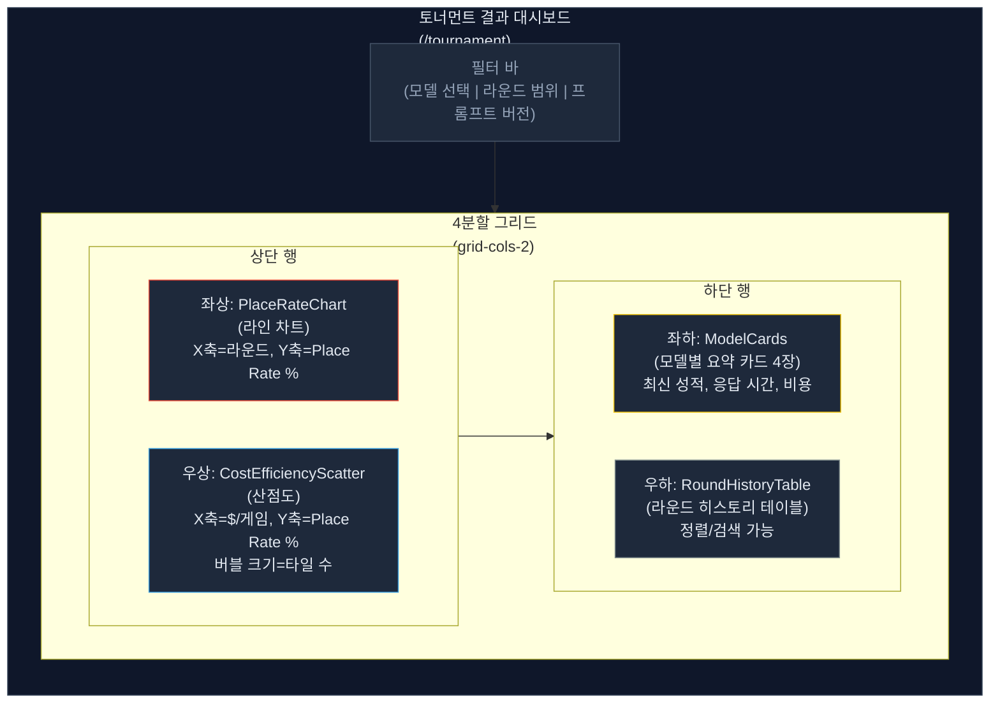
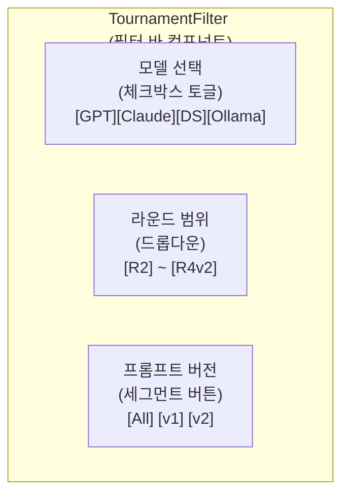
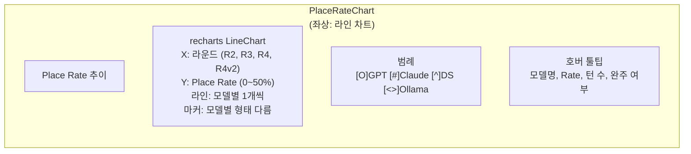
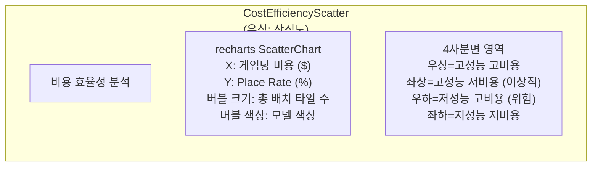
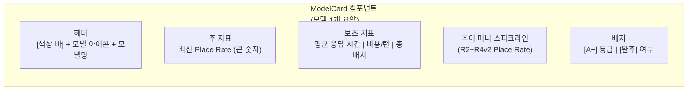
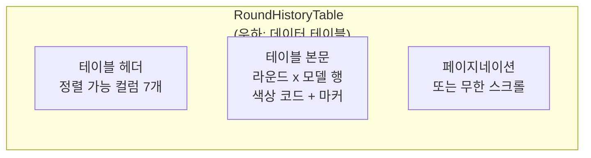
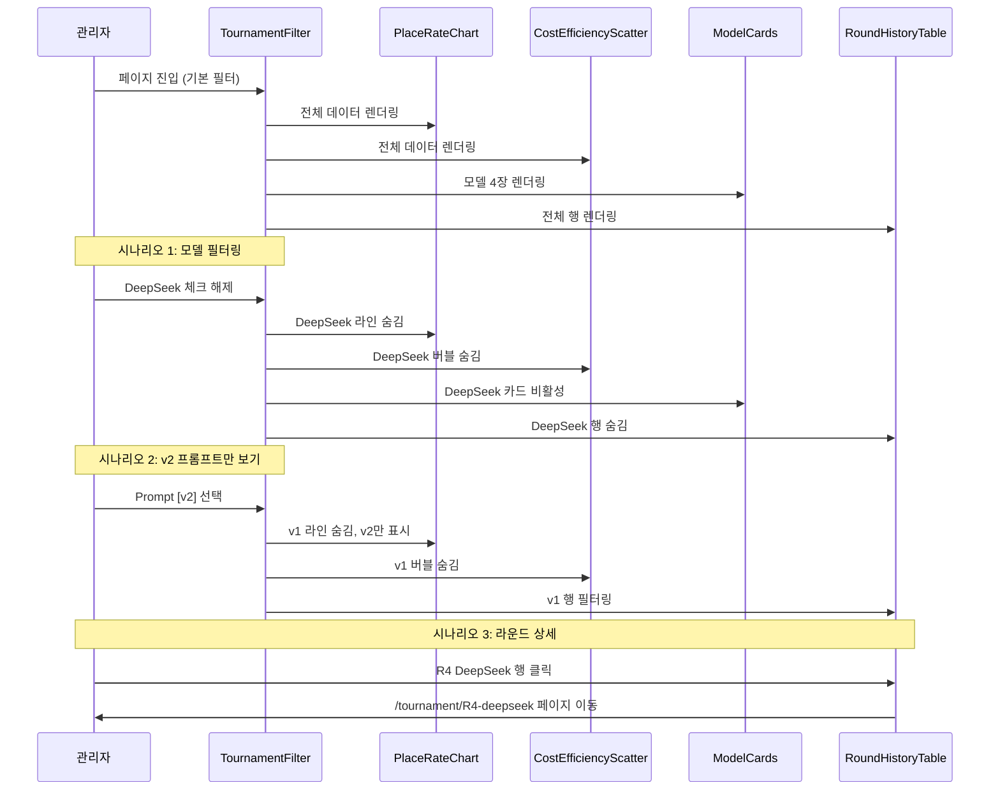
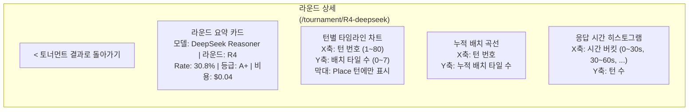

# AI 토너먼트 결과 시각화 대시보드 와이어프레임

**작성일**: 2026-04-07
**상태**: 설계 완료
**작성자**: Designer (UI/UX)
**관련 문서**: `02-design/13-llm-metrics-schema-design.md`, `04-testing/37-3model-round4-tournament-report.md`, `04-testing/38-v2-prompt-crossmodel-experiment.md`

---

## 1. 설계 목적

RummiArena의 LLM 모델별 토너먼트 대전 결과(Round 2~4, v1/v2 프롬프트)를 한눈에 파악할 수 있는 관리자 대시보드 페이지를 설계한다. 다음 질문에 즉시 답할 수 있어야 한다.

| 질문 | 시각화 영역 |
|------|-------------|
| 어떤 모델의 Place Rate가 가장 높은가? | PlaceRateChart |
| 비용 대비 성능이 가장 좋은 모델은? | CostEfficiencyScatter |
| 각 모델의 최신 상태 요약은? | ModelCard |
| 라운드별 상세 기록은? | RoundHistoryTable |
| 프롬프트 버전별 차이는? | 필터 + 차트 동적 갱신 |

---

## 2. 디자인 토큰 확장: 모델 색상 체계

기존 타일 색상(`07-ui-wireframe.md` 1.1절)을 LLM 모델 아이덴티티에 매핑한다.
색약 접근성을 위해 색상 + 마커 형태 + 패턴으로 삼중 인코딩한다.

### 2.1 모델-색상 매핑

| 모델 | 타일 계열 | 주색상 | 보조색상 | 차트 마커 | 패턴 (색약 보조) |
|------|-----------|--------|----------|-----------|-----------------|
| GPT-5-mini | Red (R) | `#E74C3C` | `#FF6B6B` | 원형 (circle) | 대각선 해치 (////) |
| Claude Sonnet 4 | Blue (B) | `#3498DB` | `#5DADE2` | 사각형 (square) | 수평선 (====) |
| DeepSeek Reasoner | Yellow (Y) | `#F1C40F` | `#F7DC6F` | 삼각형 (triangle) | 점 패턴 (....) |
| Ollama qwen2.5:3b | Black (K) | `#7F8C8D` | `#BDC3C7` | 다이아몬드 (diamond) | 무지 (solid) |

> **설계 근거**: 기존 게임 타일 4색 체계를 재활용하여 브랜드 일관성 확보.
> Ollama는 Black 타일의 `#2C3E50`이 다크 배경과 대비가 약하므로 `#7F8C8D`(회색)으로 조정.

### 2.2 CSS 변수 정의

```css
/* AI 토너먼트 대시보드 전용 색상 토큰 */
:root {
  --model-gpt:      #E74C3C;
  --model-gpt-light: #FF6B6B;
  --model-claude:    #3498DB;
  --model-claude-light: #5DADE2;
  --model-deepseek:  #F1C40F;
  --model-deepseek-light: #F7DC6F;
  --model-ollama:    #7F8C8D;
  --model-ollama-light: #BDC3C7;

  /* 프롬프트 버전 구분 (라인 스타일) */
  --prompt-v1-dash: 8 4;   /* 점선 */
  --prompt-v2-dash: none;  /* 실선 */
}
```

### 2.3 접근성 대비비 검증

| 조합 | 배경 | 전경 | 대비비 | WCAG AA |
|------|------|------|--------|---------|
| GPT 텍스트 | `#1e293b` | `#E74C3C` | 4.8:1 | 통과 |
| Claude 텍스트 | `#1e293b` | `#3498DB` | 4.5:1 | 통과 |
| DeepSeek 텍스트 | `#1e293b` | `#F1C40F` | 8.7:1 | 통과 |
| Ollama 텍스트 | `#1e293b` | `#BDC3C7` | 8.2:1 | 통과 |
| 차트 배경 위 GPT | `#0f172a` | `#E74C3C` | 5.2:1 | 통과 |
| 차트 배경 위 DeepSeek | `#0f172a` | `#F1C40F` | 9.5:1 | 통과 |

---

## 3. 페이지 구조: 관리자 사이드바 확장

### 3.1 네비게이션 추가

기존 Sidebar(`src/admin/src/components/Sidebar.tsx`)의 `NAV_ITEMS` 배열에 토너먼트 항목을 추가한다.

```typescript
const NAV_ITEMS: NavItem[] = [
  { href: "/",           label: "대시보드",       icon: "grid" },
  { href: "/games",      label: "활성 게임",      icon: "play" },
  { href: "/users",      label: "유저 목록",      icon: "users" },
  { href: "/stats",      label: "AI 통계",        icon: "bar-chart" },
  { href: "/tournament", label: "토너먼트 결과",   icon: "trophy-chart" },  // 신규
  { href: "/rankings",   label: "ELO 랭킹",       icon: "trophy" },
];
```

### 3.2 라우트 구조

```
src/admin/src/app/tournament/
  page.tsx             -- 메인 대시보드 (4분할 그리드)
  [roundId]/
    page.tsx           -- 라운드 상세 (턴별 타임라인)
  components/
    PlaceRateChart.tsx       -- 라인 차트
    CostEfficiencyScatter.tsx -- 산점도
    ModelCard.tsx             -- 모델 요약 카드
    RoundHistoryTable.tsx     -- 라운드 히스토리 테이블
    TournamentFilter.tsx      -- 필터 바
    ModelLegend.tsx           -- 모델 범례 (색상+마커+이름)
```

---

## 4. 메인 대시보드 레이아웃

### 4.1 전체 구조 (데스크탑 1280px+)



### 4.2 와이어프레임 상세

```
+----------------------------------------------------------------------+
| RummiArena Admin > 토너먼트 결과                                      |
+----------------------------------------------------------------------+
|                                                                      |
| [Filter Bar]                                                         |
| +------------------------------------------------------------------+ |
| | Models: [x]GPT  [x]Claude  [x]DeepSeek  [ ]Ollama                | |
| | Rounds: [R2 ▾] ~ [R4 ▾]   Prompt: [All ▾]  [v1] [v2]            | |
| +------------------------------------------------------------------+ |
|                                                                      |
| +-------------------------------+  +-------------------------------+ |
| |  Place Rate 추이 (라인 차트)   |  |  비용 효율성 (산점도)          | |
| |                               |  |                               | |
| |  40% |    .---*               |  |  40% |  (O)                   | |
| |      |   / Claude v2          |  |      |        (D)             | |
| |  30% |  *------.  GPT v2     |  |  30% |  (G)                   | |
| |      | /  DS v1  `----*       |  |      |             Rate       | |
| |  20% |*-------.               |  |  20% |                        | |
| |      |  Claude v1             |  |      |                        | |
| |  10% | .                      |  |  10% |                        | |
| |      |  DS v1                 |  |      |                        | |
| |   0% +----+----+----+----    |  |   0% +----+----+----+----     | |
| |       R2   R3   R4  R4v2     |  |      $0  $0.5  $1   $2        | |
| |                               |  |      Cost per Game ($)        | |
| |  [O] GPT  [#] Claude         |  |                               | |
| |  [^] DS   [<>] Ollama        |  |  Bubble size = Total Tiles    | |
| +-------------------------------+  +-------------------------------+ |
|                                                                      |
| +-------------------------------+  +-------------------------------+ |
| |  Model Cards (4장 가로 나열)   |  |  라운드 히스토리 테이블         | |
| |                               |  |                               | |
| | +---+ +---+ +---+ +---+      |  | Round | Model   |Rate |Cost   | |
| | |GPT| |CLD| |DSK| |OLL|      |  | ------+---------+-----+------| |
| | |   | |   | |   | |   |      |  | R4 v2 |GPT      |30.8%|$0.98 | |
| | |33%| |33%| |31%| | - |      |  | R4 v2 |Claude   |33.3%|$2.22 | |
| | |$25| |$74| |$1 | |$0 |      |  | R4 v2 |DeepSeek |17.9%|$0.04 | |
| | |21s| |64s| |132| | - |      |  | R4    |GPT      |33.3%|$0.15 | |
| | +---+ +---+ +---+ +---+      |  | R4    |Claude   |20.0%|$1.11 | |
| |  Avg$/turn  Avg response     |  | R4    |DeepSeek |30.8%|$0.04 | |
| |                               |  | R2    |GPT      |28.0%|$1.00 | |
| |                               |  | R2    |Claude   |23.0%|$2.96 | |
| |                               |  | R2    |DeepSeek | 5.0%|$0.04 | |
| +-------------------------------+  +-------------------------------+ |
+----------------------------------------------------------------------+
```

### 4.3 반응형 레이아웃

```mermaid
flowchart LR
    subgraph Desktop["데스크탑 1280px+\n(2열 그리드)"]
        direction TB
        D1["Filter Bar (전폭)"]
        D2["PlaceRateChart | CostEfficiencyScatter"]
        D3["ModelCards | RoundHistoryTable"]
    end

    subgraph Tablet["태블릿 768~1279px\n(2열 축소)"]
        direction TB
        T1["Filter Bar (전폭, 접기 가능)"]
        T2["PlaceRateChart | CostEfficiencyScatter"]
        T3["ModelCards (2열 x 2행)"]
        T4["RoundHistoryTable (전폭)"]
    end

    subgraph Mobile["모바일 ~767px\n(1열 스택)"]
        direction TB
        M1["Filter (드롭다운 축소)"]
        M2["PlaceRateChart"]
        M3["CostEfficiencyScatter"]
        M4["ModelCards (스와이프)"]
        M5["RoundHistoryTable (스크롤)"]
    end

    Desktop -.-> Tablet -.-> Mobile
```



| 뷰포트 | 그리드 | 차트 높이 | ModelCard 배치 | 필터 |
|---------|--------|-----------|----------------|------|
| Desktop 1280px+ | `grid-cols-2` | 360px | 4열 가로 나열 | 항상 펼침 |
| Tablet 768~1279px | `grid-cols-2` (차트), `grid-cols-1` (하단) | 300px | 2열 x 2행 | 접기 가능 |
| Mobile ~767px | `grid-cols-1` 스택 | 240px | 가로 스와이프 캐러셀 | 드롭다운 축소 |

---

## 5. 컴포넌트 명세

### 5.1 TournamentFilter (필터 바)

**위치**: 페이지 최상단, 차트 영역 위



| 속성 | 타입 | 기본값 | 설명 |
|------|------|--------|------|
| `selectedModels` | `string[]` | `['gpt', 'claude', 'deepseek']` | 선택된 모델 목록 |
| `roundRange` | `[string, string]` | `['R2', 'R4v2']` | 시작/끝 라운드 |
| `promptVersion` | `'all' \| 'v1' \| 'v2'` | `'all'` | 프롬프트 버전 필터 |
| `onChange` | `(filters) => void` | - | 필터 변경 콜백 |

**인터랙션**:
- 모델 체크박스 토글 시 해당 모델의 데이터가 모든 차트에서 동시에 표시/숨김
- 라운드 범위 변경 시 X축 범위 재조정
- 프롬프트 버전 선택 시 동일 라운드의 v1/v2 데이터 분기 표시
- URL 쿼리 파라미터와 양방향 동기화 (`?models=gpt,claude&rounds=R2-R4v2&prompt=v2`)

### 5.2 PlaceRateChart (라인 차트)

**위치**: 좌상 (grid 1,1)



| 속성 | 타입 | 설명 |
|------|------|------|
| `data` | `TournamentRoundData[]` | 라운드별 모델별 Place Rate 배열 |
| `selectedModels` | `string[]` | 표시할 모델 목록 (필터 연동) |
| `promptVersion` | `string` | 프롬프트 버전 필터 |

**데이터 구조**:

```typescript
interface TournamentRoundData {
  round: string;           // 'R2', 'R3', 'R4', 'R4v2'
  promptVersion: 'v1' | 'v2';
  models: {
    modelType: string;     // 'gpt', 'claude', 'deepseek', 'ollama'
    placeRate: number;     // 0~100
    totalTurns: number;
    completed: boolean;    // 80턴 완주 여부
    placeCount: number;
    drawCount: number;
  }[];
}
```

**시각 인코딩 규칙**:
- 라인 색상: 모델별 주색상 (`--model-gpt` 등)
- 마커 형태: 원형/사각/삼각/다이아 (색약 보조)
- 미완주 데이터: 마커를 빈 원형(stroke only)으로 표시, 툴팁에 "(14턴 / WS_CLOSED)" 표기
- v1 프롬프트: 점선 (`strokeDasharray="8 4"`)
- v2 프롬프트: 실선
- 데이터 없음: 라인 끊김 (연결하지 않음)

**실제 데이터 매핑 예시**:

```
X축: R2 -------- R3 -------- R4 -------- R4v2
GPT:  28.0% ---- (없음) ---- 33.3%* ---- 30.8%
                                ^미완주
Claude: 23.0% -- (없음) ---- 20.0%* ---- 33.3%*
                                ^미완주      ^미완주
DeepSeek: 5.0% - 12.5% ----- 30.8% ----- 17.9%
                                ^완주        ^완주
```

### 5.3 CostEfficiencyScatter (산점도)

**위치**: 우상 (grid 1,2)



| 속성 | 타입 | 설명 |
|------|------|------|
| `data` | `CostEfficiencyData[]` | 모델x라운드별 비용/성능 데이터 |
| `selectedModels` | `string[]` | 표시할 모델 목록 |

**데이터 구조**:

```typescript
interface CostEfficiencyData {
  modelType: string;
  round: string;
  promptVersion: 'v1' | 'v2';
  costPerGame: number;     // $ 단위
  placeRate: number;       // 0~100
  totalTilesPlaced: number; // 버블 크기 결정
  label: string;           // "GPT R4v2" 등
}
```

**시각 인코딩 규칙**:
- 버블 색상: 모델 주색상, 투명도 0.7 (겹침 시 식별)
- 버블 크기: `totalTilesPlaced` 에 비례 (min 8px, max 40px 반지름)
- 이상적 영역(좌상): 연한 초록 배경 오버레이 (`rgba(63, 185, 80, 0.05)`)
- 위험 영역(우하): 연한 빨강 배경 오버레이 (`rgba(248, 81, 73, 0.05)`)
- 호버 시 툴팁: 모델명, 라운드, Rate, 비용, 타일 수

**4사분면 레이블**:

```
          Low Cost          High Cost
High   +-------------------+-------------------+
Rate   | 효율적 (Efficient)  | 고비용 고성능      |
       | DeepSeek R4       | Claude R4v2       |
       +-------------------+-------------------+
Low    | 저비용 저성능       | 비효율 (Avoid)     |
Rate   | DeepSeek R2       |                   |
       +-------------------+-------------------+
```

### 5.4 ModelCard (모델 요약 카드)

**위치**: 좌하 (grid 2,1) -- 4장 가로 나열



**와이어프레임 상세 (1장)**:

```
+---------------------------------------+
| ======= (모델 색상 상단 바 4px) ======= |
|                                       |
|  [마커] GPT-5-mini              [A+]  |
|                                       |
|         30.8%                         |
|      최신 Place Rate                  |
|                                       |
|  .--..                               |
|  |    \__/\  <-- 스파크라인            |
|  '        \                           |
|                                       |
|  +-----------+-----------+---------+  |
|  | 응답 시간  |  비용/턴   | 총 타일  |  |
|  |  64.6s    | $0.025    |   29    |  |
|  +-----------+-----------+---------+  |
|                                       |
|  [80턴 완주] [v2 프롬프트]             |
+---------------------------------------+
```

| 속성 | 타입 | 설명 |
|------|------|------|
| `modelType` | `string` | 모델 식별자 |
| `modelName` | `string` | 표시 이름 (GPT-5-mini 등) |
| `latestRate` | `number` | 가장 최근 Place Rate |
| `grade` | `string` | 등급 (A+/A/B/C/D/F) |
| `avgResponseTime` | `number` | 평균 응답 시간 (초) |
| `costPerTurn` | `number` | 턴당 비용 ($) |
| `totalTilesPlaced` | `number` | 최근 라운드 총 배치 타일 |
| `sparklineData` | `number[]` | 라운드별 Place Rate 배열 |
| `completed` | `boolean` | 80턴 완주 여부 |
| `promptVersion` | `string` | 사용된 프롬프트 버전 |

**시각 인코딩 규칙**:
- 상단 바: 모델 주색상 4px 높이
- 등급 배지 색상: A+/A = `#3FB950`(녹색), B = `#F3C623`(노랑), C/D = `#F85149`(빨강), F = `#8B949E`(회색)
- 스파크라인: 모델 주색상, 면적 채우기 투명도 0.1
- 완주 배지: 초록 아웃라인 (`--color-success`)
- 미완주: 빨간 아웃라인 + "(N턴 / 사유)" 텍스트

### 5.5 RoundHistoryTable (라운드 히스토리 테이블)

**위치**: 우하 (grid 2,2)



**컬럼 정의**:

| # | 컬럼명 | 키 | 정렬 | 너비 | 설명 |
|---|--------|-----|------|------|------|
| 1 | 라운드 | `round` | 내림차순 기본 | 80px | R4v2, R4, R3, R2 |
| 2 | 모델 | `model` | 가능 | 140px | 색상 dot + 모델명 |
| 3 | Rate | `placeRate` | 가능 | 70px | Place Rate % |
| 4 | Place/Draw | `placeCount` | 가능 | 90px | "12P / 27D" 형식 |
| 5 | 비용 | `cost` | 가능 | 80px | $0.04 형식 |
| 6 | 응답 시간 | `avgResponseTime` | 가능 | 80px | 초 단위 avg |
| 7 | 상태 | `status` | 가능 | 100px | 완주/WS_CLOSED/WS_TIMEOUT |

**상태 배지 디자인**:

| 상태 | 배경색 | 텍스트 | 아이콘 |
|------|--------|--------|--------|
| 80턴 완주 | `rgba(63, 185, 80, 0.15)` | `#3FB950` | 체크마크 |
| WS_TIMEOUT | `rgba(243, 198, 35, 0.15)` | `#F3C623` | 시계 |
| WS_CLOSED | `rgba(248, 81, 73, 0.15)` | `#F85149` | X표시 |
| 미측정 | `rgba(139, 148, 158, 0.15)` | `#8B949E` | 대시 |

**인터랙션**:
- 헤더 클릭으로 정렬 토글 (ASC/DESC)
- 행 호버 시 배경 밝아짐 (`bg-slate-700`)
- 행 클릭 시 라운드 상세 페이지(`/tournament/[roundId]`)로 이동
- Rate 셀에 조건부 색상: >= 30% 녹색, >= 20% 노랑, < 20% 빨강

### 5.6 ModelLegend (공용 범례)

필터 바 하단 또는 차트 영역 하단에 배치되는 공용 범례.

```
 [O] GPT-5-mini    [#] Claude Sonnet 4    [^] DeepSeek Reasoner    [<>] Ollama qwen2.5:3b
  --- v1 프롬프트     ___ v2 프롬프트        (O) 미완주               (*) 완주
```

---

## 6. 데이터 소스 및 API 연동

### 6.1 기존 Admin API 확장

`13-llm-metrics-schema-design.md` 8.1절의 엔드포인트를 확장한다.

| 메서드 | 경로 | 용도 | 응답 |
|--------|------|------|------|
| GET | `/admin/stats/ai/tournament` | 토너먼트 요약 (전체 라운드 집계) | `TournamentSummary` |
| GET | `/admin/stats/ai/tournament/:roundId` | 라운드 상세 (턴별 메트릭) | `TournamentRoundDetail` |
| GET | `/admin/stats/ai/tournament/compare` | 모델 비교 (PlaceRateChart 데이터) | `TournamentCompareData[]` |

### 6.2 프론트엔드 API 클라이언트 추가

```typescript
// src/admin/src/lib/api.ts 에 추가
export async function getTournamentSummary(): Promise<TournamentSummary> {
  return fetchApi<TournamentSummary>('/admin/stats/ai/tournament', DEFAULT_TOURNAMENT);
}

export async function getTournamentRound(roundId: string): Promise<TournamentRoundDetail> {
  return fetchApi<TournamentRoundDetail>(`/admin/stats/ai/tournament/${roundId}`);
}

export async function getTournamentCompare(
  params?: { models?: string; promptVersion?: string }
): Promise<TournamentCompareData[]> {
  const qs = new URLSearchParams(params as Record<string, string>).toString();
  return fetchApi<TournamentCompareData[]>(
    `/admin/stats/ai/tournament/compare?${qs}`, []
  );
}
```

### 6.3 타입 정의

```typescript
// src/admin/src/lib/types.ts 에 추가

/** 토너먼트 라운드 데이터 (PlaceRateChart, RoundHistoryTable 공용) */
export interface TournamentRoundEntry {
  round: string;                 // 'R2', 'R3', 'R4', 'R4v2'
  promptVersion: 'v1' | 'v2';
  modelType: string;             // 'openai', 'claude', 'deepseek', 'ollama'
  modelName: string;
  placeRate: number;
  placeCount: number;
  drawCount: number;
  totalTiles: number;
  totalTurns: number;
  completed: boolean;
  status: 'COMPLETED' | 'WS_TIMEOUT' | 'WS_CLOSED' | 'UNKNOWN';
  totalCost: number;
  avgResponseTimeSec: number;
  p50ResponseTimeSec: number;
  minResponseTimeSec: number;
  maxResponseTimeSec: number;
  grade: string;
}

/** CostEfficiencyScatter 전용 */
export interface CostEfficiencyEntry {
  modelType: string;
  modelName: string;
  round: string;
  promptVersion: 'v1' | 'v2';
  costPerGame: number;
  placeRate: number;
  totalTilesPlaced: number;
}

/** ModelCard 전용 */
export interface ModelLatestStats {
  modelType: string;
  modelName: string;
  latestRound: string;
  latestRate: number;
  grade: string;
  avgResponseTimeSec: number;
  costPerTurn: number;
  totalTilesPlaced: number;
  completed: boolean;
  promptVersion: string;
  sparkline: number[];           // 라운드별 Rate 배열 (시계열 순)
}

/** 토너먼트 전체 요약 */
export interface TournamentSummary {
  rounds: TournamentRoundEntry[];
  modelStats: ModelLatestStats[];
  costEfficiency: CostEfficiencyEntry[];
  lastUpdated: string;
}
```

---

## 7. 인터랙션 흐름

### 7.1 사용자 시나리오



### 7.2 차트 호버 인터랙션

**PlaceRateChart 툴팁**:

```
+---------------------------+
|  DeepSeek Reasoner        |
|  Round 4 (v1)             |
|  -------------------------+
|  Place Rate: 30.8%        |
|  Place / Draw: 12 / 27    |
|  총 타일: 32              |
|  상태: 80턴 완주           |
|  등급: A+                 |
+---------------------------+
```

**CostEfficiencyScatter 툴팁**:

```
+---------------------------+
|  Claude Sonnet 4          |
|  Round 4 v2               |
|  -------------------------+
|  Place Rate: 33.3%        |
|  게임 비용: $2.22         |
|  배치 타일: 26개          |
|  Place/$: 4.5             |
+---------------------------+
```

### 7.3 데이터 로딩 상태

| 상태 | 표현 |
|------|------|
| 로딩 중 | 차트 영역에 스켈레톤 애니메이션 (slate-700 펄스) |
| 에러 | 차트 영역 중앙에 경고 아이콘 + "데이터 로드 실패" 메시지 + 재시도 버튼 |
| 데이터 없음 | "선택한 조건에 해당하는 데이터가 없습니다" 안내 문구 |

---

## 8. 차트 라이브러리 선택

### 8.1 recharts 채택 근거

| 기준 | recharts | nivo | victory |
|------|----------|------|---------|
| Next.js SSR 호환 | 우수 (`"use client"`) | 보통 | 보통 |
| 기존 사용 여부 | 이미 `StatsChart.tsx`에서 사용 | 미사용 | 미사용 |
| 번들 크기 | ~45KB (트리 셰이킹) | ~120KB | ~80KB |
| 커스텀 마커 | `<CustomizedDot>` | 제한적 | 가능 |
| ScatterChart 지원 | 네이티브 | 네이티브 | 네이티브 |
| 학습 비용 | 낮음 (기존 경험) | 중간 | 중간 |

**결론**: 기존 admin 프로젝트에서 recharts를 이미 사용 중이므로, 일관성과 번들 크기를 고려하여 recharts를 계속 사용한다.

### 8.2 필요 recharts 컴포넌트

```typescript
import {
  LineChart, Line, ScatterChart, Scatter,
  XAxis, YAxis, CartesianGrid, Tooltip,
  ResponsiveContainer, Legend, Cell,
  ZAxis  // ScatterChart 버블 크기용
} from 'recharts';
```

---

## 9. 실제 데이터 스냅샷 (2026-04-07 기준)

본 대시보드에 표시될 초기 데이터를 정리한다.

### 9.1 PlaceRateChart 데이터

| 라운드 | 프롬프트 | GPT-5-mini | Claude Sonnet 4 | DeepSeek Reasoner |
|--------|----------|:----------:|:---------------:|:-----------------:|
| R2 | v1 | 28.0% | 23.0% | 5.0% |
| R3 | v1 | - | - | 12.5% |
| R4 | v1 | 33.3%* | 20.0%* | 30.8% |
| R4v2 | v2 | 30.8% | 33.3%* | 17.9% |

`*` = 미완주 (WS_CLOSED 또는 WS_TIMEOUT)

### 9.2 CostEfficiencyScatter 데이터

| 모델 | 라운드 | Cost/Game | Rate | Tiles |
|------|--------|-----------|------|-------|
| GPT | R2 | $1.00 | 28.0% | 27 |
| GPT | R4 | $0.15 | 33.3% | 6 |
| GPT | R4v2 | $0.975 | 30.8% | 29 |
| Claude | R2 | $2.96 | 23.0% | 29 |
| Claude | R4 | $1.11 | 20.0% | 10 |
| Claude | R4v2 | $2.22 | 33.3% | 26 |
| DeepSeek | R2 | $0.04 | 5.0% | 14 |
| DeepSeek | R3 | $0.066 | 12.5% | 22 |
| DeepSeek | R4 | $0.04 | 30.8% | 32 |
| DeepSeek | R4v2 | $0.039 | 17.9% | 29 |

### 9.3 ModelCard 데이터 (최신 라운드 기준)

| 항목 | GPT-5-mini | Claude Sonnet 4 | DeepSeek Reasoner | Ollama |
|------|:----------:|:---------------:|:-----------------:|:------:|
| 최신 Rate | 30.8% | 33.3% | 17.9% | - |
| 등급 | A+ | A+ | B | - |
| 평균 응답 | 64.6s | 63.8s | 147.8s | - |
| 비용/턴 | $0.025 | $0.074 | $0.001 | $0 |
| 총 배치 타일 | 29 | 26 | 29 | - |
| 완주 | 80턴 완주 | WS_TIMEOUT (62턴) | 80턴 완주 | - |
| 스파크라인 | [28, null, 33.3, 30.8] | [23, null, 20, 33.3] | [5, 12.5, 30.8, 17.9] | [] |

---

## 10. 라운드 상세 페이지 (`/tournament/[roundId]`)

### 10.1 레이아웃

라운드 상세 페이지는 메인 대시보드에서 특정 라운드-모델을 클릭했을 때 진입하며, 턴별 타임라인을 표시한다.



---

## 11. 기술 구현 가이드

### 11.1 커스텀 차트 마커 (색약 접근성)

```tsx
// recharts CustomizedDot 컴포넌트
const MODEL_MARKERS: Record<string, string> = {
  gpt: 'circle',
  claude: 'square',
  deepseek: 'triangle',
  ollama: 'diamond',
};

function CustomizedDot(props: {
  cx: number; cy: number; modelType: string; completed: boolean;
}) {
  const { cx, cy, modelType, completed } = props;
  const size = 6;

  if (modelType === 'gpt') {
    return completed
      ? <circle cx={cx} cy={cy} r={size} fill="var(--model-gpt)" />
      : <circle cx={cx} cy={cy} r={size} fill="none" stroke="var(--model-gpt)" strokeWidth={2} />;
  }
  if (modelType === 'claude') {
    return completed
      ? <rect x={cx - size} y={cy - size} width={size * 2} height={size * 2} fill="var(--model-claude)" />
      : <rect x={cx - size} y={cy - size} width={size * 2} height={size * 2} fill="none" stroke="var(--model-claude)" strokeWidth={2} />;
  }
  if (modelType === 'deepseek') {
    const points = `${cx},${cy - size} ${cx + size},${cy + size} ${cx - size},${cy + size}`;
    return completed
      ? <polygon points={points} fill="var(--model-deepseek)" />
      : <polygon points={points} fill="none" stroke="var(--model-deepseek)" strokeWidth={2} />;
  }
  // ollama: diamond
  const dPoints = `${cx},${cy - size} ${cx + size},${cy} ${cx},${cy + size} ${cx - size},${cy}`;
  return completed
    ? <polygon points={dPoints} fill="var(--model-ollama)" />
    : <polygon points={dPoints} fill="none" stroke="var(--model-ollama)" strokeWidth={2} />;
}
```

### 11.2 TailwindCSS 클래스 매핑

```css
/* 관리자 대시보드 기존 스타일과 일관된 클래스 */
.tournament-grid {
  @apply grid grid-cols-1 lg:grid-cols-2 gap-6;
}
.tournament-card {
  @apply bg-slate-800 border border-slate-700 rounded-lg p-5;
}
.tournament-card-title {
  @apply text-sm font-semibold text-slate-300 mb-4 uppercase tracking-wide;
}
.model-dot {
  @apply w-3 h-3 rounded-sm flex-shrink-0;
}
.grade-badge {
  @apply text-xs font-bold px-2 py-0.5 rounded-full;
}
.status-badge {
  @apply text-xs font-medium px-2 py-1 rounded;
}
```

### 11.3 애니메이션

| 요소 | 트리거 | 효과 | 시간 |
|------|--------|------|------|
| ModelCard | 초기 로드 | fadeInUp (순차 100ms 딜레이) | 300ms |
| PlaceRateChart 라인 | 초기 로드 | 왼쪽에서 오른쪽 그리기 | 800ms |
| 필터 변경 시 차트 | 필터 체크박스 | 라인 fade-in/out | 200ms |
| 테이블 행 | 필터 변경 | 높이 축소/확장 | 150ms |
| 호버 툴팁 | 마우스 진입 | 즉시 표시 | 0ms |

---

## 12. 구현 우선순위

| 순서 | 컴포넌트 | 예상 SP | 선행 조건 | 비고 |
|------|---------|---------|-----------|------|
| 1 | TournamentFilter | 1 | - | 상태 관리 (useState + URL sync) |
| 2 | PlaceRateChart | 2 | 1 | recharts LineChart + CustomizedDot |
| 3 | ModelCard | 2 | - | 스파크라인 포함 |
| 4 | RoundHistoryTable | 2 | 1 | 정렬, 상태 배지, 행 클릭 |
| 5 | CostEfficiencyScatter | 2 | 1 | recharts ScatterChart + ZAxis |
| 6 | ModelLegend | 0.5 | - | 공용 범례 |
| 7 | API 연동 | 1 | 백엔드 API 준비 | fetchApi 확장 |
| 8 | 라운드 상세 페이지 | 3 | 7 | 턴별 타임라인 |
| 9 | 반응형 / 모바일 최적화 | 1 | 1~6 | 캐러셀, 접기 |

**총 예상**: 14.5 SP

---

## 13. 품질 체크리스트

### 접근성

- [x] 색상 + 마커 형태 + 패턴 삼중 인코딩 (색약 보조)
- [x] 모든 차트에 `role="img"` + `aria-label` 적용
- [x] 테이블에 `aria-label` + `aria-sort` 적용
- [x] WCAG AA 대비비 4.5:1 이상 검증 (6.3절)
- [x] 키보드 네비게이션: 필터 체크박스 Tab 이동, 테이블 행 Enter 진입
- [x] 스크린 리더: 차트 데이터를 sr-only 테이블로 제공

### 한글 최적화

- [x] Pretendard Variable 사용 (기존 admin과 일치)
- [x] 행간 1.6, 자간 -0.01em
- [x] `word-break: keep-all` 적용
- [x] 한글 레이블 (라운드, 비용, 응답 시간 등)

### 성능

- [x] recharts `ResponsiveContainer` 사용 (리사이즈 대응)
- [x] 초기 로드 시 모든 데이터 1회 fetch (탭 전환 없음)
- [x] 필터 변경은 클라이언트 사이드 필터링 (추가 API 호출 없음)
- [x] 스켈레톤 UI로 CLS 방지

### 일관성

- [x] 기존 admin 스타일과 동일한 카드/테이블 구조
- [x] bg-slate-800, border-slate-700 패턴 유지
- [x] text-sm/text-xs/text-3xl 기존 타입 스케일 준수
- [x] recharts 재사용 (StatsChart.tsx 스타일 참조)

---

## 관련 문서

| 파일 | 설명 |
|------|------|
| `docs/02-design/07-ui-wireframe.md` | 전체 UI 와이어프레임 (디자인 토큰 원본) |
| `docs/02-design/13-llm-metrics-schema-design.md` | 메트릭 수집 스키마 (API 원본) |
| `docs/02-design/16-ai-character-visual-spec.md` | AI 캐릭터 비주얼 설계 |
| `docs/04-testing/37-3model-round4-tournament-report.md` | Round 4 대전 결과 |
| `docs/04-testing/38-v2-prompt-crossmodel-experiment.md` | v2 프롬프트 크로스모델 실험 |
| `src/admin/src/components/StatsChart.tsx` | 기존 recharts 차트 (스타일 참조) |
| `src/admin/src/lib/types.ts` | 기존 타입 정의 (확장 대상) |
| `src/admin/src/lib/api.ts` | 기존 API 클라이언트 (확장 대상) |
