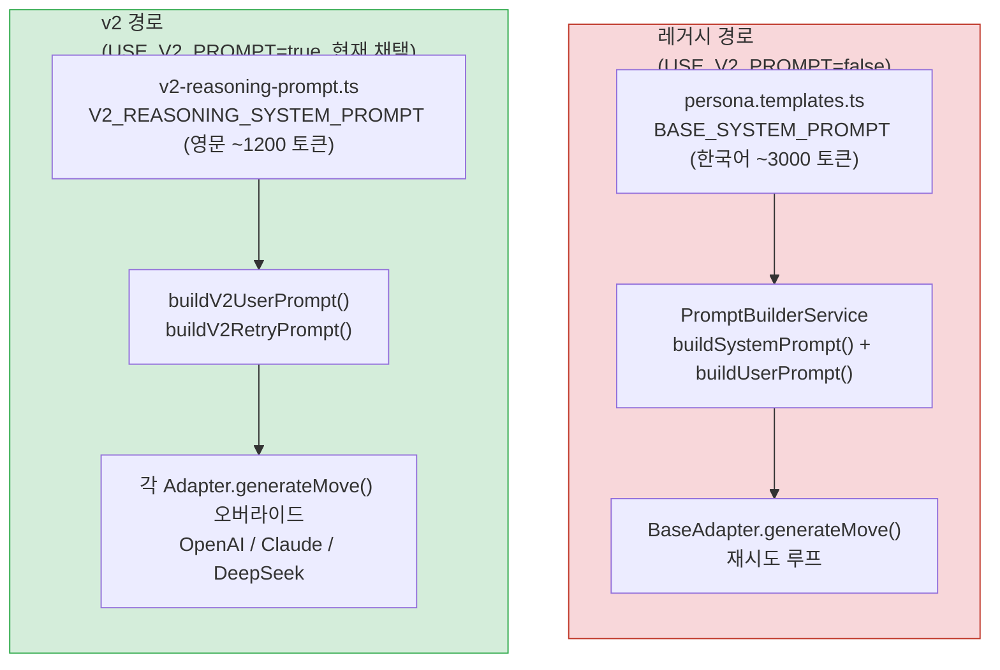
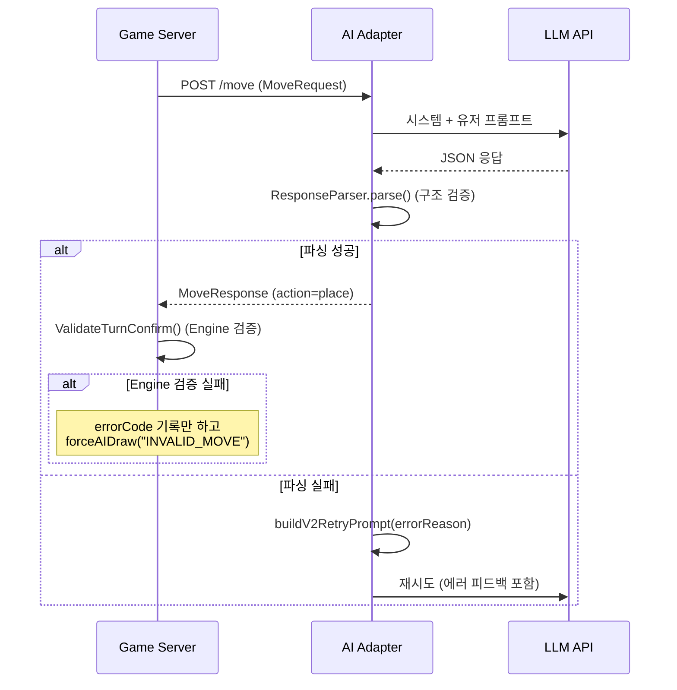
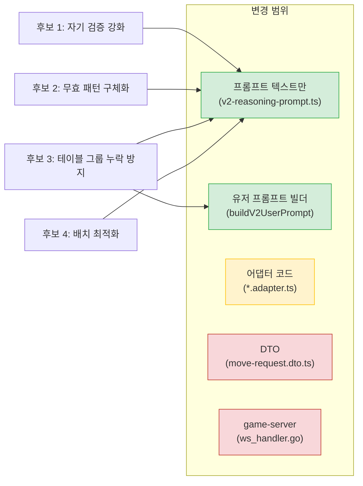
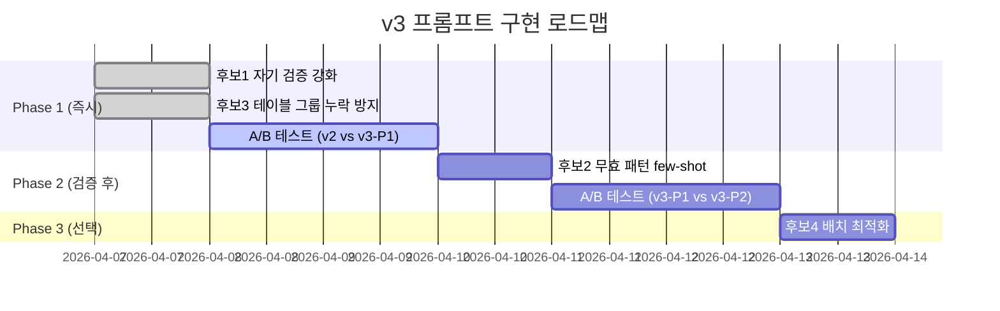
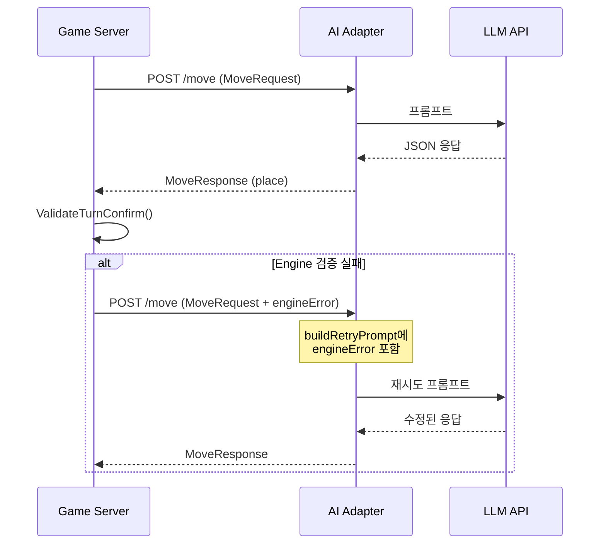

# v3 프롬프트 개선 -- AI Adapter 구조 영향도 분석

- **작성일**: 2026-04-07
- **작성자**: 애벌레 (Node.js Backend Developer -- AI Adapter 담당)
- **목적**: v3 프롬프트 개선 후보 4가지의 어댑터 구조 영향도를 분석하고, 권장 구현 순서를 도출
- **선행 문서**: `21-reasoning-model-prompt-engineering.md`, `04-ai-adapter-design.md`, `15-deepseek-prompt-optimization.md`
- **참조 코드**: `src/ai-adapter/src/prompt/v2-reasoning-prompt.ts`, `src/ai-adapter/src/adapter/base.adapter.ts`
- **참조 실험**: `04-testing/37-3model-round4-tournament-report.md`, `04-testing/38-v2-prompt-crossmodel-experiment.md`

---

## 1. 현재 상태 요약

### 1.1 프롬프트 아키텍처 현황



### 1.2 v2 프롬프트 토큰 구성

| 구성 요소 | 토큰 수 (추정) | 비고 |
|-----------|:---:|------|
| V2 System Prompt (규칙+예시+체크리스트) | ~1,200 | 고정, 영문 |
| User Prompt (게임 상태) | ~150~400 | 테이블 크기에 비례 |
| Retry Prompt (에러 피드백 추가) | ~200~450 | 기본 + 에러 메시지 |
| **합계 (첫 시도)** | **~1,350~1,600** | |
| **합계 (재시도)** | **~1,400~1,650** | |

### 1.3 현재 무효 배치 패턴 (대전 데이터 기반)

Game Engine의 검증 에러 코드와 LLM이 실제로 발생시키는 무효 패턴을 대조하면 다음과 같다.

| 에러 코드 | 에러 설명 | LLM 발생 빈도 (추정) | 원인 분석 |
|-----------|----------|:---:|------|
| `ERR_GROUP_COLOR_DUP` | 그룹에 같은 색상 중복 | 높음 | R7a, R7b 같은 "같은 색 다른 세트"를 다른 색으로 착각 |
| `ERR_TABLE_TILE_MISSING` | 기존 테이블 타일 유실 | 높음 | 기존 그룹을 tableGroups에 포함 누락 |
| `ERR_SET_SIZE` | 세트 크기 3 미만 | 중간 | 2타일 세트를 생성하거나 기존 그룹 분리 시 잔여 2타일 |
| `ERR_RUN_SEQUENCE` | 런 숫자 비연속 | 중간 | 간격 있는 연속 수열 오판 (예: 7,9,10) |
| `ERR_INITIAL_MELD_SCORE` | 최초 등록 30점 미달 | 낮음 | 합계 계산 오류 |
| `ERR_RUN_COLOR` | 런 색상 불일치 | 낮음 | 다른 색상 타일을 런에 포함 |
| `ERR_GROUP_NUMBER` | 그룹 숫자 불일치 | 낮음 | 다른 숫자 타일을 그룹에 포함 |

게임당 약 ~4건의 무효 배치가 발생하며, 이는 재시도(maxRetries=3) 또는 강제 드로우(forceAIDraw)로 이어진다. 재시도 시 `errorReason` 문자열이 AI adapter 내부에서 순환하지만, **Game Engine의 구체적 에러 코드는 AI adapter에 전달되지 않는다**. 현재 흐름은 다음과 같다:



핵심 관찰: **AI Adapter의 재시도(3회)는 JSON 파싱/구조 검증 실패에만 작동**한다. Game Engine의 규칙 검증(ERR_GROUP_COLOR_DUP 등)에서 실패하면 재시도 없이 즉시 `forceAIDraw`로 처리된다. 이것이 무효 배치 ~4건이 모두 강제 드로우로 귀결되는 이유이다.

---

## 2. v3 개선 후보 상세 분석

### 2.1 후보 1: 자기 검증 강화

#### 현재 상태

v2 시스템 프롬프트의 Pre-Submission Validation Checklist 7항목:

```
1. Each set in tableGroups has >= 3 tiles (NEVER 2 or 1)
2. Each run has the SAME color and CONSECUTIVE numbers (no gaps, no wraparound)
3. Each group has the SAME number and ALL DIFFERENT colors (no duplicate colors)
4. tilesFromRack contains ONLY tiles from "My Rack Tiles" (not table tiles)
5. ALL existing table groups are preserved in tableGroups (none omitted)
6. If initialMeldDone=false: sum of placed tile numbers >= 30, and no table tiles used
7. Every tile code in your response matches the {Color}{Number}{Set} format exactly
```

#### v3 개선안

현재 3번 항목 "ALL DIFFERENT colors (no duplicate colors)"을 더 세분화. LLM이 실제로 가장 많이 틀리는 `ERR_GROUP_COLOR_DUP` 패턴을 명시적으로 나열한다.

**변경 부분** (시스템 프롬프트 3번 항목 확장):

```diff
- 3. Each group has the SAME number and ALL DIFFERENT colors (no duplicate colors)
+ 3. Each group has the SAME number and ALL DIFFERENT colors:
+    - List colors in each group explicitly: e.g., [R,B,K] = 3 different -> OK
+    - R7a and R7b are BOTH Red (R). Putting them together = duplicate color -> REJECTED
+    - The "a" or "b" suffix only distinguishes duplicates, it does NOT change the color
+    - Maximum 4 tiles per group (one per color: R, B, Y, K)
```

#### 영향도 매트릭스

| 항목 | 값 |
|------|-----|
| 변경 범위 | `v2-reasoning-prompt.ts` V2_REASONING_SYSTEM_PROMPT 텍스트만 |
| 어댑터 코드 변경 | 불필요 |
| DTO 변경 | 불필요 |
| game-server 변경 | 불필요 |
| 추가 토큰 | +40~50 토큰 |
| 난이도 | 낮음 (프롬프트 텍스트 편집) |
| 기대 효과 | ERR_GROUP_COLOR_DUP 발생률 50% 감소 (게임당 ~4건 -> ~3건) |

---

### 2.2 후보 2: 무효 패턴 구체화 (Few-Shot 추가)

#### 현재 상태

v2 시스템 프롬프트에 5개의 few-shot 예시가 포함되어 있다:

1. Draw (유효 조합 없음)
2. Place 단일 런 (initial meld)
3. Place 그룹 (initial meld)
4. Extend 기존 테이블 그룹
5. Multiple sets 동시 배치

모든 예시가 **정상 케이스**이다. 무효 배치에서 LLM이 어떤 실수를 저질렀는지에 대한 구체적 실전 사례가 없다.

#### v3 개선안

실제 대전에서 LLM이 저지른 무효 배치의 구체적 사례를 WRONG/CORRECT 쌍으로 추가한다.

**추가 few-shot** (시스템 프롬프트 Examples 섹션 뒤에 삽입):

```
# Common Mistakes from Real Games (AVOID these)

## Mistake 1: Color duplicate in group (ERR_GROUP_COLOR_DUP)
My rack: [R7a, R7b, B7a, K3a]
WRONG: {"tableGroups":[{"tiles":["R7a","R7b","B7a"]}]} -> R appears TWICE! a/b is NOT a different color
CORRECT: {"tableGroups":[{"tiles":["R7a","B7a","K3a"]}]} -> Wait, K3a has number 3, not 7. So no valid group.
-> {"action":"draw","reasoning":"R7a+R7b=same color, cannot form group"}

## Mistake 2: Forgetting existing table groups (ERR_TABLE_TILE_MISSING)
Table: Group1=[R3a,R4a,R5a], Group2=[B7a,Y7a,K7a]
My rack: [R6a], initialMeldDone=true
WRONG: {"tableGroups":[{"tiles":["R3a","R4a","R5a","R6a"]}]} -> Group2 is MISSING!
CORRECT: {"tableGroups":[{"tiles":["R3a","R4a","R5a","R6a"]},{"tiles":["B7a","Y7a","K7a"]}]}

## Mistake 3: Non-consecutive run (ERR_RUN_SEQUENCE)
My rack: [R7a, R9a, R10a]
WRONG: {"tableGroups":[{"tiles":["R7a","R9a","R10a"]}]} -> Gap at 8!
CORRECT: {"action":"draw","reasoning":"R7,R9,R10 has gap at 8, not consecutive"}
```

#### 영향도 매트릭스

| 항목 | 값 |
|------|-----|
| 변경 범위 | `v2-reasoning-prompt.ts` V2_REASONING_SYSTEM_PROMPT 텍스트만 |
| 어댑터 코드 변경 | 불필요 |
| DTO 변경 | 불필요 |
| game-server 변경 | 불필요 |
| 추가 토큰 | +180~220 토큰 |
| 난이도 | 낮음 (프롬프트 텍스트 편집) |
| 기대 효과 | 3대 무효 패턴(색상 중복, 그룹 누락, 비연속 런) 각 30~40% 감소 |

**주의사항**: few-shot 예시를 추가하면 추론 모델의 reasoning 토큰 예산을 소비한다. 현재 ~1,200 토큰에 +200 토큰을 추가하면 ~1,400 토큰이 되며, 이는 DeepSeek Reasoner의 max_tokens=16384 내에서 충분하지만 reasoning chain 깊이에 미세한 영향을 줄 수 있다. v2 프롬프트 최적화 원칙(doc 21, 원칙 1 "토큰 절약")과의 균형이 필요하다.

---

### 2.3 후보 3: 테이블 그룹 누락 방지

#### 현재 상태

v2 유저 프롬프트에서 테이블 그룹을 다음과 같이 전달한다:

```
# Current Table
Group1: [R3a, R4a, R5a]
Group2: [B7a, Y7a, K7a]
(2 groups total -- you MUST include ALL of them in tableGroups)
```

v2 시스템 프롬프트의 체크리스트 5번:
```
5. ALL existing table groups are preserved in tableGroups (none omitted)
```

문제: **그룹 수가 많아지면(7+개) LLM이 일부를 누락**한다. 게임 중반 이후 테이블에 10~15개 그룹이 쌓이면 누락 빈도가 급증한다.

#### v3 개선안

유저 프롬프트에서 테이블 그룹 수를 명시적으로 강조하고, 응답에도 그룹 수 확인을 유도한다.

**v3 변경 A -- 유저 프롬프트 (`buildV2UserPrompt`) 수정**:

```diff
  gameState.tableGroups.forEach((group, idx) => {
    lines.push(`Group${idx + 1}: [${group.tiles.join(', ')}]`);
  });
- lines.push(
-   `(${gameState.tableGroups.length} groups total -- you MUST include ALL of them in tableGroups)`,
- );
+ lines.push('');
+ lines.push(`CRITICAL: There are exactly ${gameState.tableGroups.length} groups above.`);
+ lines.push(`Your tableGroups array MUST contain at least ${gameState.tableGroups.length} entries.`);
+ lines.push(`Count your tableGroups before submitting: if count < ${gameState.tableGroups.length}, you are MISSING groups.`);
```

**v3 변경 B -- 시스템 프롬프트 체크리스트 5번 강화**:

```diff
- 5. ALL existing table groups are preserved in tableGroups (none omitted)
+ 5. Count your tableGroups entries. It must be >= the number of groups shown in "Current Table".
+    If Current Table shows N groups, your tableGroups must have >= N entries (N existing + your new groups).
+    Missing even ONE existing group -> ERR_TABLE_TILE_MISSING -> REJECTED.
```

#### 영향도 매트릭스

| 항목 | 값 |
|------|-----|
| 변경 범위 | `v2-reasoning-prompt.ts` -- V2_REASONING_SYSTEM_PROMPT + buildV2UserPrompt() |
| 어댑터 코드 변경 | 불필요 |
| DTO 변경 | 불필요 |
| game-server 변경 | 불필요 (테이블 그룹은 이미 MoveRequest.gameState.tableGroups로 전달됨) |
| 추가 토큰 | +30~50 토큰 (시스템) + 유저 프롬프트 변동 없음 (문구 변경) |
| 난이도 | 낮음 (프롬프트 텍스트 편집 + 유저 프롬프트 빌더 1줄 수정) |
| 기대 효과 | ERR_TABLE_TILE_MISSING 발생률 60~70% 감소 |

**game-server 테이블 상태 전달 확인**:

현재 game-server의 `handleAITurn` (ws_handler.go:838)에서 테이블 상태는 다음과 같이 구성된다:

```go
tableGroups := buildTableGroups(state.Table)
req := &client.MoveRequest{
    GameState: client.MoveGameState{
        TableGroups: tableGroups,
        // ...
    },
}
```

이 데이터는 이미 완전한 테이블 상태를 포함하므로, v3 개선에서 game-server 변경은 불필요하다. AI adapter 내부에서 `buildV2UserPrompt()`가 이 데이터를 프롬프트 텍스트로 변환할 때 강조 문구만 수정하면 된다.

---

### 2.4 후보 4: 배치 최적화 ("가장 많은 타일을 내는" 전략 강화)

#### 현재 상태

v2 시스템 프롬프트의 Step-by-Step Thinking Procedure 6번:

```
6. Compare all valid combinations: pick the one that places the MOST tiles
```

이 지시는 단일 줄로만 존재하며, 구체적인 최적화 전략이 없다.

#### v3 개선안

배치 최적화를 위한 더 세부적인 사고 절차를 추가한다.

**v3 변경 -- Step 6 확장**:

```diff
- 6. Compare all valid combinations: pick the one that places the MOST tiles
+ 6. Compare all valid combinations to maximize tiles placed:
+    a. For each valid group/run, count how many rack tiles it uses
+    b. Check if groups and runs can be combined (tiles not overlapping)
+    c. If extending an existing table group adds more tiles than creating new sets, prefer extending
+    d. Pick the combination that places the MOST total tiles from your rack
+    e. Tie-breaker: prefer placing higher-number tiles (they are worth more points)
```

#### 영향도 매트릭스

| 항목 | 값 |
|------|-----|
| 변경 범위 | `v2-reasoning-prompt.ts` V2_REASONING_SYSTEM_PROMPT 텍스트만 |
| 어댑터 코드 변경 | 불필요 |
| DTO 변경 | 불필요 |
| game-server 변경 | 불필요 |
| 추가 토큰 | +50~70 토큰 |
| 난이도 | 낮음 (프롬프트 텍스트 편집) |
| 기대 효과 | 배치 성공 시 평균 타일 수 증가 (~2.4 -> ~3.0), 무효 배치 직접 감소 효과는 미미 |

**주의사항**: 이 개선은 무효 배치 감소가 아닌 "유효 배치의 효율 향상"이 목적이다. 게임당 ~4건의 무효 배치 자체를 줄이는 데는 후보 1~3이 더 효과적이다.

---

## 3. 종합 영향도 매트릭스

### 3.1 변경 범위 비교



### 3.2 종합 비교 테이블

| 후보 | 변경 파일 | 코드 변경 | DTO 변경 | GS 변경 | 추가 토큰 | 난이도 | 무효 배치 감소 기대 | ROI |
|:---:|------|:---:|:---:|:---:|:---:|:---:|:---:|:---:|
| **1** | v2-reasoning-prompt.ts | 없음 | 없음 | 없음 | +40~50 | 낮음 | ~1건/게임 | 높음 |
| **2** | v2-reasoning-prompt.ts | 없음 | 없음 | 없음 | +180~220 | 낮음 | ~1.5건/게임 | 중상 |
| **3** | v2-reasoning-prompt.ts + buildV2UserPrompt | 1줄 | 없음 | 없음 | +30~50 | 낮음 | ~1건/게임 | 높음 |
| **4** | v2-reasoning-prompt.ts | 없음 | 없음 | 없음 | +50~70 | 낮음 | ~0.2건/게임 | 낮음 |

### 3.3 토큰 예산 비교

| 버전 | 시스템 프롬프트 토큰 | 유저 프롬프트 토큰 | 합계 | 대비 v2 증가율 |
|------|:---:|:---:|:---:|:---:|
| **v2 (현재)** | ~1,200 | ~150~400 | ~1,350~1,600 | -- |
| **v3 후보 1만** | ~1,245 | ~150~400 | ~1,395~1,645 | +3% |
| **v3 후보 1+2** | ~1,425 | ~150~400 | ~1,575~1,825 | +14% |
| **v3 후보 1+2+3** | ~1,470 | ~150~400 | ~1,620~1,870 | +17% |
| **v3 후보 1+2+3+4** | ~1,530 | ~150~400 | ~1,680~1,930 | +21% |

v2 대비 최대 +21% 토큰 증가. 원래 한국어 프롬프트 ~3,000 토큰 대비 여전히 36% 절감 수준이므로 허용 범위 내이다.

---

## 4. 권장 구현 순서

### 4.1 Phase 1 (즉시 적용 가능, 코드 변경 최소)

| 순서 | 후보 | 이유 |
|:---:|:---:|------|
| 1 | **후보 1: 자기 검증 강화** | 토큰 증가 최소(+40), 가장 빈번한 ERR_GROUP_COLOR_DUP 대응, 텍스트 편집만 |
| 2 | **후보 3: 테이블 그룹 누락 방지** | 토큰 증가 적음(+30~50), ERR_TABLE_TILE_MISSING 대응, buildV2UserPrompt 1줄 수정 |

Phase 1 합산 효과: 무효 배치 ~4건/게임 -> ~2건/게임 (50% 감소 예상)

### 4.2 Phase 2 (A/B 테스트로 효과 검증 후 적용)

| 순서 | 후보 | 이유 |
|:---:|:---:|------|
| 3 | **후보 2: 무효 패턴 구체화** | 토큰 증가가 큼(+180~220), 추론 모델 reasoning 예산에 영향 가능. Phase 1 적용 후 잔여 무효 패턴 분석 결과로 few-shot 사례를 선별해야 함 |

### 4.3 Phase 3 (선택적)

| 순서 | 후보 | 이유 |
|:---:|:---:|------|
| 4 | **후보 4: 배치 최적화** | 무효 배치 감소 효과가 미미함. Place Rate가 안정된 후 "배치 효율"을 높이는 단계에서 적용 |



---

## 5. v3 프롬프트 초안 (v2 대비 변경 diff)

### 5.1 시스템 프롬프트 변경 (V2_REASONING_SYSTEM_PROMPT)

아래는 Phase 1 (후보 1 + 후보 3)을 적용한 diff이다.

#### 후보 1 -- Pre-Submission Validation Checklist 3번 확장

```diff
 # Pre-Submission Validation Checklist (MUST verify before answering)
 Before you output your JSON, verify ALL of these:
 1. Each set in tableGroups has >= 3 tiles (NEVER 2 or 1)
 2. Each run has the SAME color and CONSECUTIVE numbers (no gaps, no wraparound)
-3. Each group has the SAME number and ALL DIFFERENT colors (no duplicate colors)
+3. Each group has the SAME number and ALL DIFFERENT colors:
+   - List the colors explicitly: e.g., [R,B,K] = 3 different colors -> OK
+   - CRITICAL: R7a and R7b are BOTH color R (Red). Same color = REJECTED!
+   - The "a" or "b" suffix distinguishes duplicate tiles, NOT colors
+   - A group can have at most 4 tiles (one per color: R, B, Y, K)
 4. tilesFromRack contains ONLY tiles from "My Rack Tiles" (not table tiles)
-5. ALL existing table groups are preserved in tableGroups (none omitted)
+5. Count your tableGroups entries. It MUST be >= the number shown in "Current Table".
+   If the table has N groups, your response must have >= N entries in tableGroups.
+   Missing even 1 group -> ERR_TABLE_TILE_MISSING -> REJECTED.
 6. If initialMeldDone=false: sum of placed tile numbers >= 30, and no table tiles used
 7. Every tile code in your response matches the {Color}{Number}{Set} format exactly
```

#### 후보 3 -- 시스템 프롬프트 추가 (tableGroups 규칙 뒤)

```diff
 ## tableGroups = COMPLETE final state of the ENTIRE table after your move
 - You MUST include ALL existing table groups (even unchanged ones)
 - Then add your new groups
 - If you omit any existing group -> "tile loss" -> REJECTED
+- COUNTING CHECK: if Current Table has N groups, your tableGroups must have >= N entries
```

### 5.2 유저 프롬프트 변경 (buildV2UserPrompt)

#### 후보 3 -- 유저 프롬프트 그룹 수 강조

```diff
   gameState.tableGroups.forEach((group, idx) => {
     lines.push(`Group${idx + 1}: [${group.tiles.join(', ')}]`);
   });
-  lines.push(
-    `(${gameState.tableGroups.length} groups total -- you MUST include ALL of them in tableGroups)`,
-  );
+  lines.push('');
+  lines.push(`CRITICAL: There are exactly ${gameState.tableGroups.length} groups above.`);
+  lines.push(`Your tableGroups array MUST contain at least ${gameState.tableGroups.length} entries (existing + new).`);
+  lines.push(`If your tableGroups has fewer than ${gameState.tableGroups.length} entries -> REJECTED.`);
```

### 5.3 Phase 2 추가 -- 무효 패턴 few-shot (후보 2)

시스템 프롬프트의 `# Few-Shot Examples` 섹션 뒤에 추가:

```
# Common Mistakes from Real Games (NEVER repeat these)

## Mistake 1: Duplicate color in group (ERR_GROUP_COLOR_DUP)
My rack: [R7a, R7b, B7a, K3a]
Thinking: R7a + R7b + B7a = all number 7, three tiles -> group?
WRONG! R7a and R7b are BOTH Red (R). Color R appears twice -> REJECTED.
Correct analysis: Only R7a + B7a have different colors, but that's only 2 tiles -> no valid group.
-> {"action":"draw","reasoning":"R7a+R7b are same color R, no valid 3-tile group"}

## Mistake 2: Omitting existing table groups (ERR_TABLE_TILE_MISSING)
Table has 5 groups: Group1=[R3a,R4a,R5a], Group2=[B7a,Y7a,K7a], Group3=[K1a,K2a,K3a], Group4=[Y10a,Y11a,Y12a], Group5=[R8a,B8b,Y8a]
I extend Group1 with R6a.
WRONG: tableGroups has only Group1 extended -> 4 groups MISSING -> REJECTED.
CORRECT: tableGroups must have ALL 5 groups (Group1 extended + Group2~5 unchanged).

## Mistake 3: Gap in run (ERR_RUN_SEQUENCE)
My rack: [B5a, B7a, B8a]
Thinking: B5, B7, B8 = Blue consecutive?
WRONG! 5 -> 7 has a gap (6 is missing). Not consecutive -> REJECTED.
-> {"action":"draw","reasoning":"B5,B7,B8 has gap at 6, not a valid run"}
```

---

## 6. 어댑터 구조 변경이 필요한 미래 개선안

v3 Phase 1~3은 프롬프트 텍스트와 유저 프롬프트 빌더 수정만으로 충분하다. 그러나 더 근본적인 개선을 위해 어댑터 구조 변경이 필요한 시나리오도 미리 정리한다.

### 6.1 Game Engine 에러 피드백 루프 (미래 v4 후보)

**현재 한계**: AI adapter의 재시도는 JSON 파싱 실패에만 작동한다. Game Engine의 규칙 검증 실패(ERR_GROUP_COLOR_DUP 등)는 즉시 `forceAIDraw`로 처리되어, LLM에게 "어떤 규칙을 위반했는지" 피드백할 기회가 없다.

**개선안**: Game Engine 검증 실패 시 error code + message를 AI adapter에 전달하여 재시도를 트리거.



**필요 변경**:

| 변경 항목 | 범위 | 난이도 |
|-----------|------|:---:|
| MoveRequestDto에 `engineError?: string` 필드 추가 | DTO | 중간 |
| game-server `handleAITurn`에 검증 실패 재요청 로직 추가 | game-server | 높음 |
| `buildV2RetryPrompt`에 engineError 메시지 통합 | 프롬프트 | 낮음 |
| game-server `processAIPlace`에서 재시도 카운터 관리 | game-server | 중간 |

이 개선은 구조적 변경이 필요하므로 Sprint 6 이후 검토를 권장한다. 현재 v3 Phase 1~3으로 무효 배치를 50~60% 줄인 후, 잔여 무효 패턴이 여전히 문제라면 v4로 진행한다.

### 6.2 프롬프트 버전 관리 토글 (미래)

현재 `USE_V2_PROMPT` 환경변수로 v1/v2를 토글하고 있다. v3가 추가되면 `PROMPT_VERSION=v3` 같은 열거형 토글이 필요할 수 있다. 그러나 v3는 v2 프롬프트를 직접 수정하는 것이므로 (v2를 대체, v2 유지 불필요), 별도 토글 없이 v2 코드를 인플레이스 수정하는 것을 권장한다.

---

## 7. DeepSeek Adapter 특이사항

DeepSeek Adapter에는 V2_REASONING_SYSTEM_PROMPT 외에 로컬 `DEEPSEEK_REASONER_SYSTEM_PROMPT` 상수가 별도 존재한다 (deepseek.adapter.ts:31). 그러나 실제 `generateMove`에서는 `V2_REASONING_SYSTEM_PROMPT`를 사용한다 (deepseek.adapter.ts:224). 로컬 상수는 Dead Code이다.

v3 적용 시 `DEEPSEEK_REASONER_SYSTEM_PROMPT`를 삭제하여 혼란을 방지할 것을 권장한다. v3 변경은 `V2_REASONING_SYSTEM_PROMPT`에만 적용하면 3모델 모두에 자동 반영된다.

또한 DeepSeek Adapter의 `buildReasonerUserPrompt`(deepseek.adapter.ts:302)와 `buildV2UserPrompt`(v2-reasoning-prompt.ts:145)는 거의 동일한 코드의 중복이다. v3에서 `buildV2UserPrompt`를 수정할 때, DeepSeek의 `buildReasonerUserPrompt`도 동일하게 수정하거나, 중복을 제거하고 `buildV2UserPrompt`로 통일하는 것을 강력히 권장한다.

---

## 8. 결론

### 8.1 핵심 메시지

4가지 v3 개선 후보 모두 **프롬프트 텍스트 수정만으로 구현 가능**하며, 어댑터 코드/DTO/game-server 변경은 불필요하다. 이는 v2 아키텍처의 설계 의도("프롬프트 레이어와 어댑터 레이어의 분리")가 성공적으로 동작하고 있음을 의미한다.

### 8.2 즉시 액션 아이템

1. **후보 1 + 후보 3 동시 적용** (Phase 1)
   - 파일: `src/ai-adapter/src/prompt/v2-reasoning-prompt.ts`
   - 변경량: 시스템 프롬프트 ~10줄 수정, 유저 프롬프트 빌더 3줄 수정
   - 토큰 증가: +70~100 (v2 대비 +6%)
   - 기대 효과: 무효 배치 ~4건 -> ~2건 (50% 감소)

2. **DeepSeek 중복 코드 정리**
   - `DEEPSEEK_REASONER_SYSTEM_PROMPT` 삭제 (Dead Code)
   - `buildReasonerUserPrompt`를 `buildV2UserPrompt` 호출로 통일

3. **A/B 테스트 실행**
   - v2 vs v3-Phase1을 각 모델 1회씩 대전하여 무효 배치 건수 비교
   - 비용: ~$3 (3모델 x $1), 소요: ~2시간

### 8.3 변경 영향 없는 영역 확인

| 영역 | 변경 필요 여부 |
|------|:---:|
| `src/ai-adapter/src/adapter/base.adapter.ts` | 없음 |
| `src/ai-adapter/src/adapter/openai.adapter.ts` | 없음 |
| `src/ai-adapter/src/adapter/claude.adapter.ts` | 없음 |
| `src/ai-adapter/src/adapter/deepseek.adapter.ts` | Dead Code 삭제 권장 (선택) |
| `src/ai-adapter/src/adapter/ollama.adapter.ts` | 없음 |
| `src/ai-adapter/src/common/dto/move-request.dto.ts` | 없음 |
| `src/ai-adapter/src/common/dto/move-response.dto.ts` | 없음 |
| `src/ai-adapter/src/common/parser/response-parser.service.ts` | 없음 |
| `src/ai-adapter/src/common/interfaces/ai-adapter.interface.ts` | 없음 |
| `src/ai-adapter/src/prompt/persona.templates.ts` | 없음 |
| `src/game-server/internal/handler/ws_handler.go` | 없음 |
| `src/game-server/internal/engine/validator.go` | 없음 |
| `src/game-server/internal/client/ai_client.go` | 없음 |
