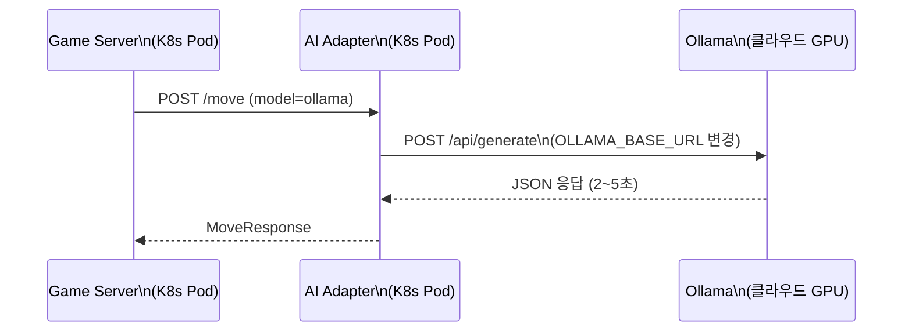
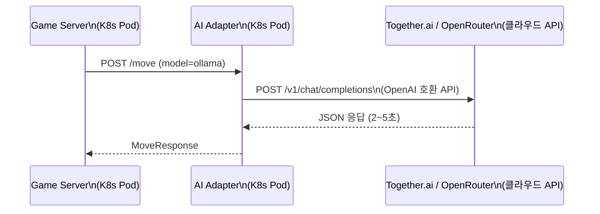
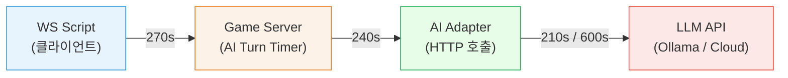

# 클라우드 로컬 LLM 연동 방안 (Qwen3 Thinking 모델)

- **작성일**: 2026-04-07
- **작성자**: 애벌레 + Architect
- **상태**: 검토 완료, 미착수
- **배경**: qwen3:4b thinking 모드가 CPU(i7-1360P)에서 턴당 600s+ 소요로 대전 불가

---

## 1. 문제

| 모델 | 크기 | CPU 추론 시간 | 대전 가능 |
|------|:---:|:---:|:---:|
| qwen2.5:3b (비추론) | 1.9GB | ~40~60s/턴 | O (Place Rate 0%) |
| qwen3:4b (추론, thinking) | 2.5GB | **>600s/턴** | **X** |
| qwen3:1.7b (추론, thinking) | 1.4GB | 미측정 | 시도 가능 |

LG Gram 15Z90R (i7-1360P, 내장 GPU만, 16GB RAM)에서 qwen3:4b thinking 모드는 CPU 추론으로 사실상 대전 불가.

---

## 2. 해결 방안

### 방안 A: 원격 Ollama (코드 수정 0)

클라우드 GPU 서버에 Ollama를 설치하고 `OLLAMA_BASE_URL`만 변경.



**적용 방법:**
```bash
kubectl set env deployment/ai-adapter -n rummikub \
  OLLAMA_BASE_URL=http://<cloud-gpu-ip>:11434
```

**클라우드 GPU 서비스:**

| 서비스 | GPU | 비용 | 특징 |
|--------|-----|------|------|
| RunPod | T4/A10 | ~$0.2/h | Ollama 템플릿 제공 |
| Vast.ai | 다양 | ~$0.1/h | 최저가 GPU 마켓 |
| Google Colab Pro | T4 | ~$10/월 | ngrok 터널 필요 |

**장점:** 코드 변경 없음, ConfigMap 한 줄
**단점:** 상시 비용 발생, 네트워크 지연, 서버 관리 필요

---

### 방안 B: OpenAI 호환 API 서비스 (추천)

Qwen3를 API로 제공하는 서비스 활용. OpenAI 호환 API라서 기존 어댑터 재활용 가능.



**서비스 비교:**

| 기준 | Together.ai (추천) | OpenRouter | Fireworks.ai | Alibaba DashScope |
|------|:---:|:---:|:---:|:---:|
| 구조 | 자체 GPU 인프라 | 중계 라우터 | 자체 인프라 | 네이티브 Qwen 제공자 |
| Qwen3 4B | O | O | O | O |
| 응답 속도 | 빠름 (직접) | 약간 느림 (라우팅) | 빠름 | 빠름 |
| 가격 | ~$0.02/1M tok | 제공자마다 다름 | ~$0.02/1M tok | ~$0.01/1M tok |
| 가입 크레딧 | $5 무료 | $1 무료 | $1 무료 | 일부 무료 |
| JSON mode | O | 제공자 의존 | O | O |
| 안정성 | 높음 | 제공자 의존 | 높음 | 높음 |
| Thinking 모드 | 직접 지원 | 제공자 위임 | 지원 | 네이티브 |

**1순위 추천: Alibaba DashScope (Qwen 네이티브 제공자)**
- Qwen 모델의 원작자 → thinking 모드 지원 가장 확실, 최신 모델 즉시 반영
- 최저 가격 (~$0.01/1M tok)
- OpenAI 호환 API 제공

**2순위: Together.ai**
- 자체 GPU 인프라 → 응답 시간 일관적 (대전 비교 실험에 중요)
- $5 무료 크레딧 → 약 100회+ 게임 테스트 가능
- JSON mode 지원 → 루미큐브 응답 파싱 안정성

**구현 방법:**

1. Ollama 어댑터에 원격 API 모드 추가 (또는 별도 어댑터 생성)
2. 환경변수로 전환:
   ```
   QWEN3_BASE_URL=https://api.together.xyz/v1
   QWEN3_API_KEY=sk-...
   QWEN3_MODEL=Qwen/Qwen3-4B
   ```
3. 기존 Ollama 로컬과 병행 가능

**장점:** 서버 관리 불필요, 종량제, 빠른 응답 (2~5s)
**단점:** API 키 관리, 외부 의존성, 비용 (미미)

---

### 방안 C: qwen3:1.7b 로컬 (절충안)

현재 CPU 환경에서 qwen3:1.7b (1.4GB) thinking 모드를 시도. 4B보다 파라미터가 적어 추론 시간 단축 예상.

**예상:** qwen2.5:3b 수준 (~60s/턴) 또는 약간 느린 정도
**리스크:** 1.7B로는 추론 능력이 부족하여 Place Rate 개선 미미할 수 있음
**장점:** 비용 $0, 기존 인프라 그대로

---

## 3. 비용 비교 (80턴 대전 1회 기준)

| 방안 | 턴당 비용 | 게임당 비용 | 비고 |
|------|:---:|:---:|------|
| A. 원격 Ollama (RunPod) | ~$0.003 | ~$0.01 + 서버 시간 | GPU 시간 별도 |
| B. Together.ai API | ~$0.001 | ~$0.001 | 종량제, DeepSeek 수준 |
| C. qwen3:1.7b 로컬 | $0 | $0 | CPU 속도 한계 |
| 참고: DeepSeek Reasoner | $0.001 | $0.04 | 현재 운영 중 |

---

## 4. 타임아웃 구간별 관리 (향후 과제)

현재 4단계 타임아웃 체인이 있으며, 로컬 추론 모델 지원을 위해 구간별 정리가 필요하다.



| 구간 | 현재 값 | 클라우드 모델 | 로컬 추론 (CPU) |
|------|:---:|:---:|:---:|
| WS Script | 270s | 270s (유지) | 모델별 동적 |
| Game Server AI Turn | 240s | 240s (유지) | 모델별 동적 |
| AI Adapter LLM 호출 | 210s (최소) | 210s (유지) | 600s (qwen3:4b) |
| DTO timeoutMs 상한 | 600000 | 300000 복원 가능 | 600000 유지 |

**개선 방향:** 모델 유형(cloud/local)에 따라 타임아웃을 동적으로 설정하는 구조 필요.

---

## 5. 결정 사항

- **현재**: qwen3:4b CPU 대전 불가 확인. qwen2.5:3b (비추론) 0% 베이스라인 확보
- **다음 단계**: Together.ai 연동 또는 qwen3:1.7b 로컬 시도 (Sprint 6 이후)
- **우선순위**: P3 (클라우드 3모델 비교가 우선)

---

## 6. 변경 이력

| 날짜 | 항목 |
|------|------|
| 2026-04-07 | DTO timeoutMs 상한 300000 → 600000 변경 (move-request.dto.ts, move.controller.ts) |
| 2026-04-07 | ConfigMap AI_ADAPTER_TIMEOUT_SEC: 200 → 600, OLLAMA_DEFAULT_MODEL: qwen2.5:3b → qwen3:4b |
| 2026-04-07 | qwen3:4b, qwen3:1.7b K8s Ollama Pod에 pull 완료 |
