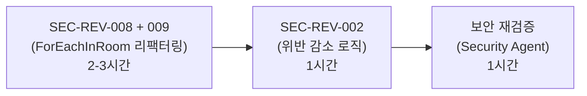

# SEC-REV Medium 3건 사전 영향도 분석

- **작성일**: 2026-04-08
- **Sprint**: Sprint 5 W2 Day 3 (Sprint 6 사전 분석)
- **작성자**: Security Agent

## 요약 테이블

| ID | 이슈명 | 파일 | 위험 분류 | 수정 난이도 | Sprint 6 우선순위 |
|----|--------|------|----------|------------|------------------|
| SEC-REV-002 | 위반 카운터 감소 로직 | `ws_rate_limiter.go:128-131` | Rate Limit 우회 | Small | 2순위 |
| SEC-REV-008 | Hub RLock 내 외부 호출 | `ws_hub.go:126-137`, `ws_handler.go:1813` | 가용성(DoS) | Medium | 1순위 |
| SEC-REV-009 | panic 전파 가능성 | `ws_hub.go:126-137` | 가용성(장애 전파) | Small | 3순위 |

## 상세 분석

### 1. SEC-REV-002: 위반 카운터 감소 로직

**파일**: `src/game-server/internal/handler/ws_rate_limiter.go` (lines 128-131)

**현재 코드** — 정상 메시지 허용 시마다 `violations`가 1 감소:

```go
if rl.violations > 0 {
    rl.violations--
}
```

**문제**: 공격자가 "위반 1회 → 정상 1회" 교대 패턴을 반복하면, violations가 절대 3에 도달하지 않아 연결 종료 메커니즘이 무력화된다.

**실제 영향**: 글로벌/타입별 메시지 거부 자체는 정상 동작하므로 서버 리소스 피해는 해당 연결에 국한. per-connection 격리로 다른 사용자 영향 없음. CVSS 4.3 (Medium).

**수정 방향**: `consecutiveAllowed` 카운터를 추가하여 연속 5회 정상 메시지 후에만 violations를 1 감소. 위반 발생 시 카운터 리셋.

**수정 난이도**: Small — `ws_rate_limiter.go` 1개 파일, ~10줄 변경 + 테스트 1건 추가. ~1시간.

---

### 2. SEC-REV-008: Hub RLock 내 외부 호출

**파일**: `src/game-server/internal/handler/ws_hub.go` (lines 126-137), `ws_handler.go` (line 1813)

**현재 코드** — `ForEachInRoom`은 RLock을 보유한 채 콜백을 실행:

```go
func (h *Hub) ForEachInRoom(roomID string, fn func(conn *Connection)) {
    h.mu.RLock()
    defer h.mu.RUnlock()
    for _, conn := range room {
        fn(conn)  // RLock 보유 상태에서 콜백 실행
    }
}
```

**핵심 문제**: `NotifyGameStarted`에서 콜백 내 `h.gameSvc.GetGameState()` 호출 → Redis GET I/O 수행. 4인 게임이면 Redis GET 4회가 순차 실행되며, 그 동안 Hub의 RLock 유지. `Register()`, `Unregister()` 등 Write Lock 작업이 전체 방에 걸쳐 차단됨.

**Istio 도입 시 위험 증가**: sidecar proxy 오버헤드로 Redis 응답 지연 시 Write Lock 기아 상태 심화.

**수정 방향**: Snapshot-then-iterate 패턴:

```go
func (h *Hub) ForEachInRoom(roomID string, fn func(conn *Connection)) {
    h.mu.RLock()
    room, ok := h.rooms[roomID]
    if !ok {
        h.mu.RUnlock()
        return
    }
    conns := make([]*Connection, 0, len(room))
    for _, conn := range room {
        conns = append(conns, conn)
    }
    h.mu.RUnlock()  // 락 즉시 해제

    for _, conn := range conns {
        fn(conn)
    }
}
```

**수정 난이도**: Medium — `ws_hub.go` 리팩터링 + 호출자 3곳 검증 + 벤치마크 테스트. ~2-3시간.

---

### 3. SEC-REV-009: panic 전파 가능성

**파일**: `src/game-server/internal/handler/ws_hub.go` (lines 126-137, ForEachInRoom 동일 함수)

**문제**: 콜백 내 panic 시 나머지 conn 미처리. 4인 방에서 conn 2 처리 중 panic → conn 3, 4는 콜백 미실행. `NotifyGameStarted` 경로에서 GAME_STATE 미수신 플레이어는 빈 화면.

**현재 상태**: codebase에 `recover()` 호출 없음. `gin.Recovery()` 미들웨어가 REST는 보호하지만 WS 브로드캐스트는 미보호.

**수정 방향**: SEC-REV-008과 동시에 각 콜백을 recover로 래핑:

```go
for _, conn := range conns {
    func() {
        defer func() {
            if r := recover(); r != nil {
                h.logger.Error("ws: panic in ForEachInRoom callback",
                    zap.String("room", roomID),
                    zap.String("user", conn.userID),
                    zap.Any("panic", r),
                )
            }
        }()
        fn(conn)
    }()
}
```

**수정 난이도**: Small — SEC-REV-008과 동시 수정 시 8줄 추가 + 테스트 1건. ~30분.

---

## Sprint 6 수정 순서 권장



| 순서 | ID | 근거 | 담당 | 소요 |
|------|-----|------|------|------|
| 1 | SEC-REV-008 + SEC-REV-009 | 같은 함수 동시 수정. Istio 도입 전 선제 수정 필요 | Go Dev | 2-3h + 테스트 1-2h |
| 2 | SEC-REV-002 | 독립 수정. 단일 커넥션 영향에 국한 | Go Dev | 1h |
| 3 | 보안 리뷰 재검증 | 수정 후 Security Agent 재검증 | Security | 1h |

**총 예상 소요**: ~1일 (리뷰 포함), Sprint 6 첫째 주(04-13~) 착수 권장.

## 기존 완화 요인 매트릭스

| 완화 요인 | SEC-REV-002 | SEC-REV-008 | SEC-REV-009 |
|----------|:-----------:|:-----------:|:-----------:|
| per-connection 격리 | O | - | - |
| 글로벌/타입별 메시지 거부 | O | - | - |
| 방당 최대 4인 (I/O 상한) | - | O | O |
| Redis 로컬 배포 (sub-ms) | - | O | - |
| gin.Recovery() 미들웨어 | - | - | O |
| Connection.Send() 방어 | - | O | - |
| 단일 Pod (네트워크 홉 없음) | - | O | - |

> **결론**: 3건 모두 현재 환경에서 Critical 격상 가능성은 낮다. 그러나 Istio sidecar 도입 후 SEC-REV-008 위험도가 상승하므로, **Istio 적용 전 선제 수정**을 권장한다.
