# Istio Phase 5.0 Sprint 6 사전 점검서

## 1. 개요

### 1.1 목적

본 문서는 Sprint 6(2026-04-13~)에서 Istio Service Mesh를 실제 적용하기 위한 **사전 점검 항목**을 정의한다. ADR-020(Istio 선별 적용)과 상세 설계서(`20-istio-selective-mesh-design.md`)를 기반으로, 구현 착수 전에 확인해야 할 전제 조건, 단계별 실행 계획, 리스크 대응 방안, 성공 기준을 정리한다.

### 1.2 참조 문서

| 문서 | 경로 |
|------|------|
| Istio 선별 적용 설계 | `docs/02-design/20-istio-selective-mesh-design.md` |
| 게이트웨이 아키텍처 | `docs/05-deployment/02-gateway-architecture.md` |
| Istio 매뉴얼 | `docs/00-tools/04-istio.md` |
| 시스템 아키텍처 | `docs/02-design/01-architecture.md` |

### 1.3 Sprint 6 Istio 로드맵 전체 조감

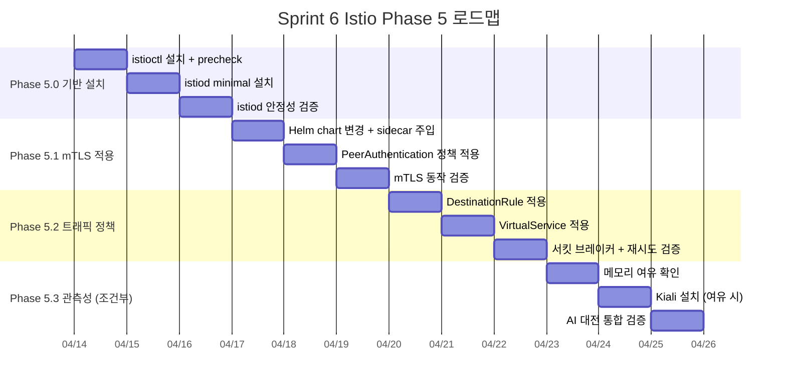

---

## 2. 전제 조건 체크리스트

### 2.1 Istio 버전 선정

| 항목 | 결정 | 근거 |
|------|------|------|
| 버전 | **Istio 1.24.2** | 2026-04 기준 최신 안정 릴리스, Docker Desktop K8s 호환 확인 |
| 프로파일 | **minimal** | istiod만 설치, Gateway 미포함 -- Traefik이 North-South 전담 |
| 대안 검토 | Ambient Mode 제외 | L7 기능(서킷 브레이커)에 waypoint 필요, GA 초기 안정성 우려 (ADR-020) |

**메모리 제약 기반 버전 선정 근거**:

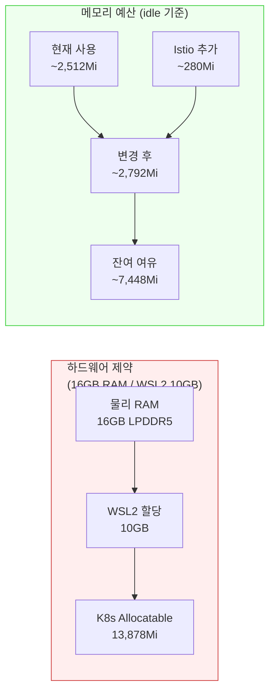

### 2.2 istiod minimal 프로파일 요구사항

| 요구사항 | 상태 | 비고 |
|----------|------|------|
| Docker Desktop K8s 활성화 | 확인 필요 | `kubectl get nodes` 로 docker-desktop 노드 확인 |
| kubectl 버전 호환 | 확인 필요 | Istio 1.24.x는 K8s 1.27~1.31 지원 |
| Helm 3 설치 | 완료 | 기존 Umbrella Chart 운용 중 |
| istioctl 바이너리 | 미설치 | Phase 5.0 첫 단계에서 설치 |
| istio-system namespace | 미존재 | istiod 설치 시 자동 생성 |
| CRD 사전 설치 | 불필요 | `istioctl install` 이 CRD를 자동 설치 |
| NetworkPolicy 충돌 | 확인 필요 | rummikub ns에 NetworkPolicy 존재 여부 확인 |

**istiod 리소스 설정 (최종)**:

```yaml
# istioctl install 파라미터
pilot:
  resources:
    requests:
      memory: 128Mi
      cpu: 50m
    limits:
      memory: 256Mi
      cpu: 200m
```

### 2.3 Namespace 라벨링 전략

**핵심 원칙**: namespace-level injection을 사용하지 않고 Pod-level annotation으로 선별 주입한다.

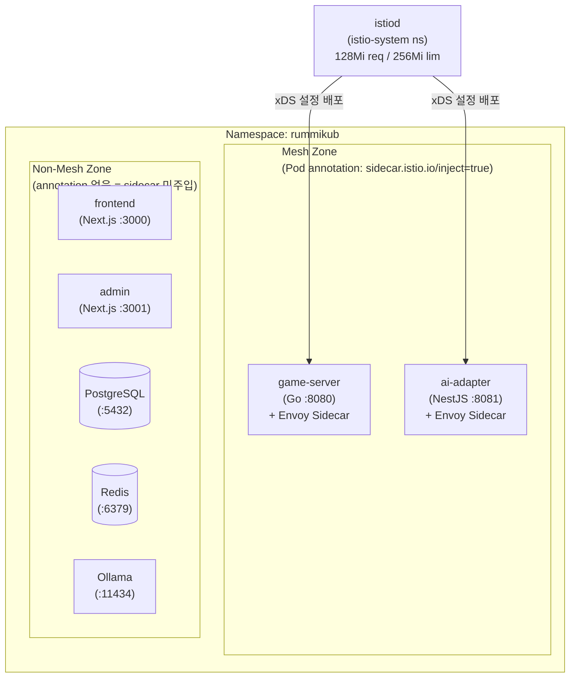

| 서비스 | sidecar 주입 | 방식 | 이유 |
|--------|-------------|------|------|
| game-server | O | Pod annotation | AI 호출 발신, mTLS/CB 필요 |
| ai-adapter | O | Pod annotation | AI 호출 수신, STRICT mTLS 필요 |
| frontend | X | 기본값(주입 안 됨) | Traefik 뒤, 브라우저 DevTools 충분 |
| admin | X | 기본값 | 관리자 전용, 낮은 트래픽 |
| postgres | X | 기본값 | ClusterIP, pg_stat 자체 모니터링 |
| redis | X | 기본값 | ClusterIP, redis-cli info 충분 |
| ollama | X | 기본값 | 성능 민감, sidecar 오버헤드 불허 |

### 2.4 리소스 예산: +280Mi 안전성 검증

| 구성 요소 | Request 추가 | Limit 추가 | 실측 예상 |
|-----------|-------------|------------|----------|
| istiod (minimal) | 128Mi | 256Mi | ~180Mi |
| Envoy sidecar (game-server) | 64Mi | 128Mi | ~50Mi |
| Envoy sidecar (ai-adapter) | 64Mi | 128Mi | ~50Mi |
| **합계** | **256Mi** | **512Mi** | **~280Mi** |

**Worst-case 시나리오별 안전 마진**:

| 시나리오 | 현재 | +Istio | WSL2 한도 | 여유 | 판정 |
|----------|------|--------|-----------|------|------|
| Idle (개발/테스트) | ~2.5Gi | ~2.8Gi | 10.0Gi | 7.2Gi | 안전 |
| AI 실험 (Ollama 로드) | ~3.3Gi | ~3.6Gi | 10.0Gi | 6.4Gi | 안전 |
| CI 빌드 (SonarQube) | ~6.0Gi | ~6.3Gi | 10.0Gi | 3.7Gi | 안전 |
| AI 실험 + CI 동시 | ~7.3Gi | ~7.6Gi | 10.0Gi | 2.4Gi | 주의 |

> **결론**: AI 실험 + CI 동시 실행만 주의 구간이며, 교대 실행 전략(기존 운영 원칙)을 유지하면 모든 시나리오에서 안전하다.

### 2.5 사전 점검 명령어

Phase 5.0 착수 전 반드시 실행할 검증 명령:

```bash
# 1. K8s 클러스터 상태 확인
kubectl get nodes -o wide
kubectl cluster-info

# 2. K8s 버전 호환 확인 (1.27~1.31 필요)
kubectl version --short

# 3. 현재 메모리 사용량 스냅샷
kubectl top nodes
kubectl top pods --all-namespaces --sort-by=memory

# 4. rummikub ns 현재 상태 확인
kubectl get pods -n rummikub
kubectl get all -n rummikub

# 5. NetworkPolicy 존재 여부
kubectl get networkpolicy -n rummikub

# 6. 기존 istio 잔존물 확인
kubectl get namespace istio-system 2>/dev/null || echo "istio-system 없음 (정상)"
kubectl get crd | grep istio 2>/dev/null || echo "Istio CRD 없음 (정상)"
```

---

## 3. 구현 단계 상세

### 3.1 Phase 5.0: istiod 설치 + 안정화 (Day 1~3)

**목표**: istiod control plane을 설치하고 기존 서비스에 영향이 없음을 확인한다.

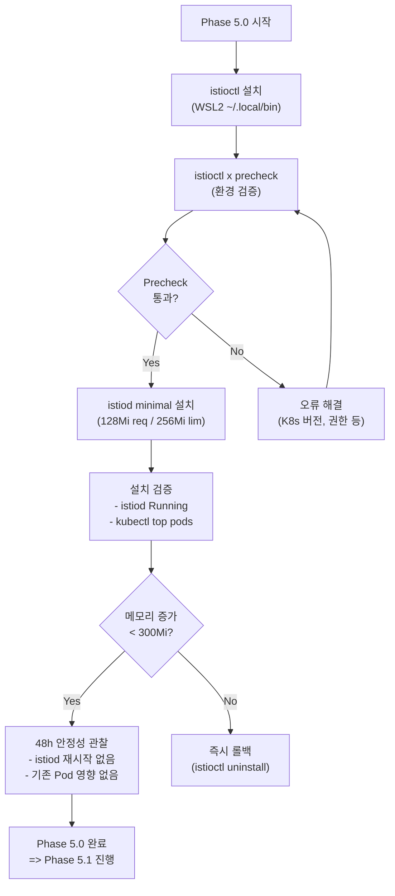

**실행 스크립트**:

```bash
# Step 1: istioctl 설치
curl -L https://istio.io/downloadIstio | ISTIO_VERSION=1.24.2 sh -
cp istio-1.24.2/bin/istioctl ~/.local/bin/
istioctl version

# Step 2: 환경 사전 검증
istioctl x precheck

# Step 3: minimal 프로파일 설치 (istiod만, gateway 없음)
istioctl install --set profile=minimal \
  --set values.pilot.resources.requests.memory=128Mi \
  --set values.pilot.resources.limits.memory=256Mi \
  --set values.pilot.resources.requests.cpu=50m \
  --set values.pilot.resources.limits.cpu=200m \
  -y

# Step 4: 설치 확인
kubectl get pods -n istio-system
kubectl top pods -n istio-system

# Step 5: 기존 서비스 무영향 확인
kubectl get pods -n rummikub
curl -s http://localhost:30080/health   # game-server
curl -s http://localhost:30081/health   # ai-adapter
```

**성공 기준 (Phase 5.0)**:

| 항목 | 기준 | 검증 방법 |
|------|------|----------|
| istiod 기동 | Running, READY 1/1 | `kubectl get pods -n istio-system` |
| istiod 메모리 | < 200Mi | `kubectl top pods -n istio-system` |
| 기존 서비스 무영향 | rummikub 7 Pod 모두 Running | `kubectl get pods -n rummikub` |
| Health check | game-server, ai-adapter 200 OK | `curl` 확인 |
| 클러스터 메모리 | 추가 < 300Mi | `kubectl top nodes` 전후 비교 |
| 48h 안정성 | istiod RESTARTS=0 | 48시간 후 재확인 |

---

### 3.2 Phase 5.1: mTLS 적용 (Day 4~6)

**목표**: game-server와 ai-adapter에 Envoy sidecar를 주입하고, 두 서비스 간 mTLS를 활성화한다.

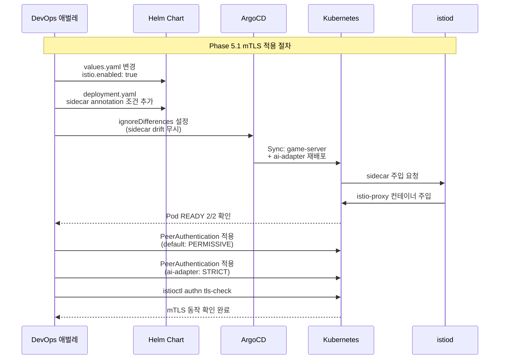

**Helm Chart 변경 사항**:

game-server `values.yaml` 추가:
```yaml
# Istio sidecar injection (Phase 5)
istio:
  enabled: false    # Phase 5.1에서 true로 변경
  sidecar:
    proxyCPU: "50m"
    proxyCPULimit: "200m"
    proxyMemory: "64Mi"
    proxyMemoryLimit: "128Mi"
```

game-server `deployment.yaml` 변경 (template.metadata 영역):
```yaml
spec:
  template:
    metadata:
      labels:
        app: game-server
        release: {{ .Release.Name }}
      {{- if .Values.istio.enabled }}
      annotations:
        sidecar.istio.io/inject: "true"
        sidecar.istio.io/proxyCPU: {{ .Values.istio.sidecar.proxyCPU | quote }}
        sidecar.istio.io/proxyCPULimit: {{ .Values.istio.sidecar.proxyCPULimit | quote }}
        sidecar.istio.io/proxyMemory: {{ .Values.istio.sidecar.proxyMemory | quote }}
        sidecar.istio.io/proxyMemoryLimit: {{ .Values.istio.sidecar.proxyMemoryLimit | quote }}
      {{- end }}
```

ai-adapter `deployment.yaml`도 동일 패턴 적용.

**ArgoCD ignoreDifferences 추가** (`argocd/application.yaml`):
```yaml
# Istio sidecar injection drift 무시
- group: apps
  kind: Deployment
  name: game-server
  namespace: rummikub
  jsonPointers:
    - /spec/template/metadata/annotations/sidecar.istio.io~1status
    - /spec/template/spec/initContainers
    - /spec/template/spec/containers/1
    - /spec/template/spec/volumes
- group: apps
  kind: Deployment
  name: ai-adapter
  namespace: rummikub
  jsonPointers:
    - /spec/template/metadata/annotations/sidecar.istio.io~1status
    - /spec/template/spec/initContainers
    - /spec/template/spec/containers/1
    - /spec/template/spec/volumes
```

**Istio 정책 매니페스트** (`istio/` 디렉터리 신규 생성):

| 파일 | 내용 |
|------|------|
| `peer-authentication-default.yaml` | namespace 기본 PERMISSIVE (Traefik 접근 허용) |
| `peer-authentication-ai-adapter.yaml` | ai-adapter STRICT (mesh 내부만 접근) |

**성공 기준 (Phase 5.1)**:

| 항목 | 기준 | 검증 방법 |
|------|------|----------|
| sidecar 주입 | game-server, ai-adapter READY 2/2 | `kubectl get pods -n rummikub` |
| mTLS 동작 | ai-adapter: STRICT mTLS | `istioctl authn tls-check` |
| Traefik 접근 | game-server: PERMISSIVE 통과 | `curl http://localhost:30080/health` |
| AI 호출 정상 | game-server -> ai-adapter 통신 | AI 대전 스크립트 1회 실행 |
| WebSocket 정상 | 프론트엔드 게임 접속 | 수동 플레이테스트 |
| 비mesh 서비스 | frontend/admin/redis/postgres 무영향 | `kubectl get pods -n rummikub` READY 1/1 유지 |
| 메모리 증가 | sidecar 추가 < 150Mi | `kubectl top pods -n rummikub` |

---

### 3.3 Phase 5.2: 트래픽 정책 -- 재시도 + 서킷 브레이커 (Day 7~9)

**목표**: ai-adapter에 대한 DestinationRule(서킷 브레이커)과 VirtualService(타임아웃/재시도)를 적용한다.

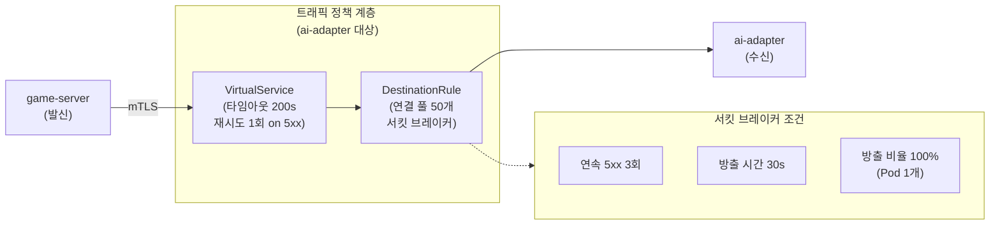

**Istio 매니페스트** (`istio/` 디렉터리):

| 파일 | 역할 |
|------|------|
| `destination-rule-ai-adapter.yaml` | 연결 풀 관리 + 서킷 브레이커(outlier detection) |
| `virtual-service-ai-adapter.yaml` | 타임아웃 200s + 재시도 1회(5xx, reset) |

**재시도 정책 설계 근거**:
- Istio 레벨: 네트워크 장애(5xx, reset)에 한해 1회 재시도
- Game Engine 레벨: 비즈니스 재시도(invalid move)는 최대 3회 -- LLM 신뢰 금지 원칙
- 비용 보호: LLM 호출 비용($0.001~$0.074/턴)이 발생하므로 무한 재시도 금지

**성공 기준 (Phase 5.2)**:

| 항목 | 기준 | 검증 방법 |
|------|------|----------|
| DestinationRule 적용 | CRD 생성 확인 | `kubectl get dr -n rummikub` |
| VirtualService 적용 | CRD 생성 확인 | `kubectl get vs -n rummikub` |
| 서킷 브레이커 동작 | ai-adapter 강제 종료 후 30s ejection | Pod 삭제 후 `istioctl proxy-config cluster` |
| 타임아웃 일치 | 200s (AI_ADAPTER_TIMEOUT_SEC과 동일) | `istioctl proxy-config route` |
| 재시도 동작 | 5xx 시 1회 재시도 | ai-adapter 일시 중단 후 game-server 로그 확인 |
| AI 대전 무영향 | place rate 기존과 동등 | AI 대전 스크립트 실행 (DeepSeek 1회) |

---

### 3.4 Phase 5.3: 관측성 -- Kiali (조건부, Day 10~12)

**목표**: 메모리 여유가 충분한 경우에만 Kiali를 설치하여 서비스 토폴로지를 시각화한다.

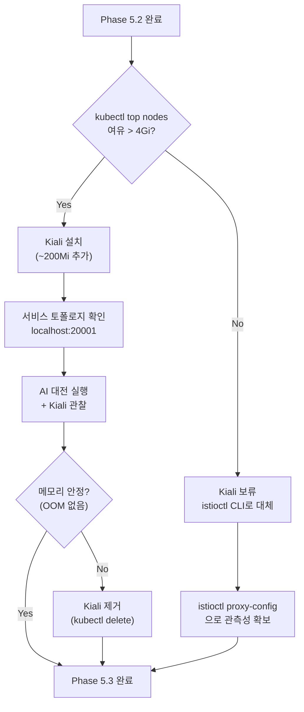

**Kiali vs istioctl CLI 비교**:

| 기능 | Kiali (GUI) | istioctl (CLI) |
|------|------------|----------------|
| 서비스 토폴로지 | 시각적 그래프 | `proxy-config cluster` (텍스트) |
| 트래픽 흐름 | 실시간 애니메이션 | `proxy-config route` (텍스트) |
| mTLS 상태 | 아이콘 표시 | `authn tls-check` (텍스트) |
| 추가 메모리 | ~200Mi | 0 (CLI 도구) |
| 설치 복잡도 | kubectl apply 1회 | 이미 설치됨 |

> **판단 기준**: 메모리 여유가 4Gi 이상이면 Kiali 설치, 아니면 istioctl CLI로 관측성을 확보하고 Kiali는 Sprint 7로 이월한다.

**애드온 설치 우선순위**:

| 애드온 | 메모리 | Sprint 6 | 사유 |
|--------|--------|----------|------|
| Kiali | ~200Mi | 조건부 | 토폴로지 시각화, 메모리 여유 시 |
| Jaeger | ~300Mi | 보류 | 메모리 부담 크고, Prometheus로 대체 가능 |
| Grafana | ~200Mi | 보류 | Kiali 내장 대시보드로 대체 |
| Prometheus | ~300Mi | 보류 | 기존 K8s metrics-server로 당분간 충분 |

**성공 기준 (Phase 5.3)**:

| 항목 | 기준 | 검증 방법 |
|------|------|----------|
| (Kiali 설치 시) 기동 | Kiali Running | `kubectl get pods -n istio-system` |
| (Kiali 설치 시) 토폴로지 | game-server -> ai-adapter 연결 표시 | `http://localhost:20001` |
| 관측성 확보 | mTLS 상태 + 트래픽 흐름 확인 가능 | Kiali 또는 istioctl |
| AI 대전 통합 | 3모델 대전 정상 완주 | `scripts/ai-battle-3model-r4.py` |
| 메모리 안정 | WSL2 OOM 없음 | `free -h` (WSL2), `kubectl top nodes` |

---

## 4. 리스크 평가

### 4.1 리스크 매트릭스

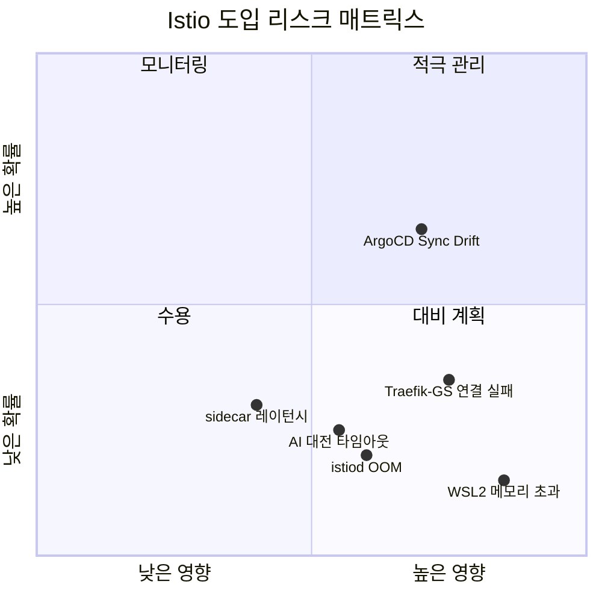

### 4.2 리스크 상세 + 완화 방안

| ID | 리스크 | 영향 | 확률 | 완화 방안 | 대응 담당 |
|----|--------|------|------|----------|----------|
| R1 | **ArgoCD Sync Drift** -- sidecar 주입으로 Deployment spec 변경 감지 | 배포 실패, selfHeal 무한 루프 | 중간 | `ignoreDifferences` 사전 설정 (Section 3.2 참조) | DevOps |
| R2 | **Traefik -> game-server 연결 실패** -- PERMISSIVE 설정 누락 | 외부 접근 불가 | 낮음 | PeerAuthentication default=PERMISSIVE 필수, 즉시 롤백 절차 숙지 | DevOps |
| R3 | **istiod OOM** -- 256Mi Limit 초과 | mesh 설정 배포 불가 (기존 sidecar는 유지) | 낮음 | Limit 256Mi, `kubectl top` 모니터링, 필요 시 384Mi로 상향 | Architect |
| R4 | **sidecar 레이턴시 추가** -- Envoy proxy 경유 추가 지연 | AI 턴 타임아웃 | 낮음 | VirtualService timeout=200s (AI_ADAPTER_TIMEOUT_SEC과 일치), sidecar 추가 지연은 ~1ms 수준 | Architect |
| R5 | **WSL2 메모리 초과** -- AI 실험 + CI + Istio 동시 실행 | WSL2 OOM → Pod eviction | 낮음 | 교대 실행 전략 유지, Istio +280Mi 예산 반영 | DevOps |
| R6 | **AI 대전 타임아웃** -- Envoy sidecar가 LLM 장기 응답을 조기 종료 | AI 턴 실패 | 낮음 | VirtualService timeout=200s, DestinationRule connectTimeout=10s | Go Dev |

### 4.3 롤백 계획

**3단계 롤백 전략** (심각도별):

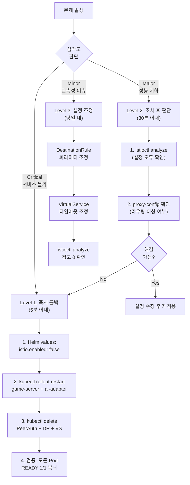

**Level 1 즉시 롤백 명령 (복사-붙여넣기 가능)**:

```bash
# === Istio 즉시 롤백 (5분 이내 완료) ===

# 1. sidecar annotation 제거 (Helm values 복원)
# game-server/values.yaml: istio.enabled: false
# ai-adapter/values.yaml: istio.enabled: false

# 2. Pod 재시작 (sidecar 제거)
kubectl rollout restart deployment/game-server -n rummikub
kubectl rollout restart deployment/ai-adapter -n rummikub

# 3. Istio CRD 리소스 정리
kubectl delete peerauthentication --all -n rummikub
kubectl delete destinationrule --all -n rummikub
kubectl delete virtualservice --all -n rummikub

# 4. 검증
kubectl get pods -n rummikub  # 모든 Pod READY 1/1
curl -s http://localhost:30080/health  # 200 OK
curl -s http://localhost:30081/health  # 200 OK

# 5. (선택) Istio 완전 제거
# istioctl uninstall --purge -y
# kubectl delete namespace istio-system
```

### 4.4 기존 Traefik Ingress 영향 분석

**핵심 원칙**: Traefik은 North-South 전담, Istio는 East-West 전담. 두 시스템은 독립적으로 동작한다.

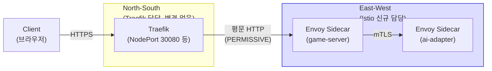

| 항목 | Traefik 변경 필요 여부 | 설명 |
|------|----------------------|------|
| IngressRoute 설정 | 변경 불필요 | 기존 라우팅 규칙 그대로 유지 |
| TLS 종단 | 변경 불필요 | Traefik이 외부 TLS 종단 유지 |
| NodePort | 변경 불필요 | 30000/30080/30081/30001 그대로 |
| Rate Limiting | 변경 불필요 | Traefik Middleware 유지 |
| game-server 접근 | PERMISSIVE 필수 | Traefik은 mesh 외부이므로 STRICT이면 차단됨 |

---

## 5. 의존성 및 차단 요인

### 5.1 Docker Desktop K8s 요구사항

| 요구사항 | 현재 상태 | 필요 조치 |
|----------|----------|----------|
| Docker Desktop K8s 활성화 | 완료 | 없음 |
| K8s 버전 1.27+ | 확인 필요 | `kubectl version` 실행 |
| CRI (containerd) | Docker Desktop 기본 | 없음 |
| kube-dns / CoreDNS | 기본 설치 | 없음 |
| RBAC 활성화 | Docker Desktop 기본 | 없음 |
| istioctl PATH | 미설치 | Phase 5.0에서 설치 |

**Docker Desktop 특이사항**:
- Docker Desktop K8s는 단일 노드 클러스터로, DaemonSet 기반 컴포넌트(Ambient Mode의 ztunnel 등)는 노드당 1개만 실행됨
- Docker Desktop은 WSL2 백엔드를 사용하며, `.wslconfig`의 memory 설정이 전체 리소스 상한
- Docker Desktop K8s 재시작 시 istiod Pod도 자동 재기동됨 (StatefulSet 아닌 Deployment)

### 5.2 ArgoCD 통합 접근법

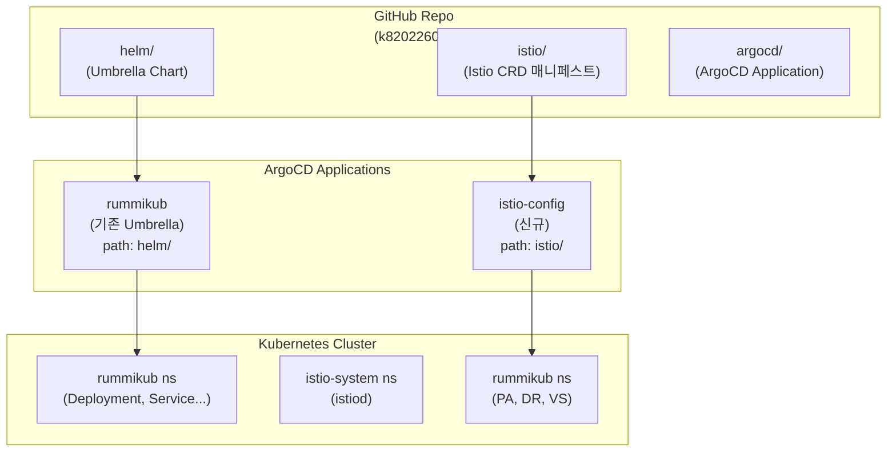

**접근법**: Istio CRD 리소스(PeerAuthentication, DestinationRule, VirtualService)는 Helm Umbrella Chart에 포함하지 않고, 별도 ArgoCD Application(`istio-config`)으로 관리한다.

**이유**:
1. Istio CRD는 istiod 설치 후에만 생성 가능 -- Helm chart 의존성 순서 문제 회피
2. Istio 정책 변경과 애플리케이션 배포를 독립적으로 관리 가능
3. 롤백 시 Istio CRD만 별도 삭제 가능

**신규 ArgoCD Application** (`argocd/istio-config.yaml`):

```yaml
apiVersion: argoproj.io/v1alpha1
kind: Application
metadata:
  name: istio-config
  namespace: argocd
spec:
  project: default
  source:
    repoURL: https://github.com/k82022603/RummiArena.git
    path: istio
    targetRevision: main
  destination:
    server: https://kubernetes.default.svc
    namespace: rummikub
  syncPolicy:
    automated:
      prune: true
      selfHeal: true
```

### 5.3 차단 요인 식별

| ID | 차단 요인 | 심각도 | 해결 방법 | 해결 시점 |
|----|----------|--------|----------|----------|
| B1 | K8s 버전이 1.27 미만 | Critical | Docker Desktop 업데이트 | Phase 5.0 전 |
| B2 | WSL2 메모리 10GB 미만 | Critical | `.wslconfig` 확인 | Phase 5.0 전 |
| B3 | istio CRD 잔존물 존재 | Medium | `kubectl delete crd` 정리 | Phase 5.0 |
| B4 | ArgoCD ignoreDifferences 누락 | High | application.yaml 사전 수정 | Phase 5.1 전 |
| B5 | game-server health probe 실패 | High | sidecar readiness 대기 시간 확인 | Phase 5.1 |

**B5 상세**: Envoy sidecar가 아직 준비되지 않은 상태에서 health probe가 실행되면 실패할 수 있다. `holdApplicationUntilProxyStarts: true` 설정을 MeshConfig에 적용하여 sidecar 준비 후 앱 컨테이너가 시작되도록 한다.

```yaml
# istioctl install 시 추가 옵션
--set meshConfig.defaultConfig.holdApplicationUntilProxyStarts=true
```

---

## 6. Phase별 성공 기준 요약

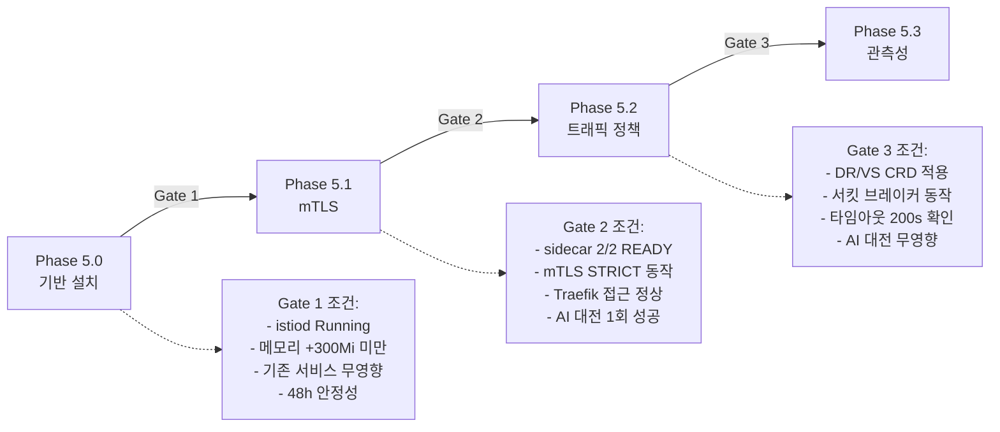

### 6.1 통합 성공 기준표

| Phase | 핵심 지표 | 기준값 | 측정 방법 | Gate 통과 조건 |
|-------|----------|--------|----------|--------------|
| **5.0** | istiod 안정성 | RESTARTS=0, 48h | `kubectl get pods -n istio-system` | 전 항목 충족 |
| **5.0** | 메모리 증가 | < 300Mi | `kubectl top nodes` 전후 비교 | 전 항목 충족 |
| **5.0** | 기존 서비스 | 7 Pod Running | `kubectl get pods -n rummikub` | 전 항목 충족 |
| **5.1** | sidecar 주입 | 2 Pod READY 2/2 | `kubectl get pods -n rummikub` | 전 항목 충족 |
| **5.1** | mTLS | ai-adapter STRICT | `istioctl authn tls-check` | 전 항목 충족 |
| **5.1** | Traefik 공존 | health 200 OK | `curl http://localhost:30080/health` | 전 항목 충족 |
| **5.1** | AI 대전 | 1회 정상 완주 | AI 대전 스크립트 | 전 항목 충족 |
| **5.2** | 서킷 브레이커 | ejection 30s 후 복구 | Pod 삭제 테스트 | 전 항목 충족 |
| **5.2** | 타임아웃 | 200s 일치 | `istioctl proxy-config route` | 전 항목 충족 |
| **5.2** | AI 대전 무영향 | place rate 기존 대비 +/-5% | AI 대전 스크립트 | 전 항목 충족 |
| **5.3** | 관측성 | 토폴로지 확인 가능 | Kiali 또는 istioctl | 최소 1가지 수단 확보 |
| **5.3** | 통합 대전 | 3모델 대전 정상 | `ai-battle-3model-r4.py` | 전 항목 충족 |

### 6.2 Sprint 6 완료 정의 (Definition of Done)

Sprint 6 종료 시점에서 아래 조건을 **모두** 만족해야 Istio Phase 5 완료로 간주한다:

1. istiod가 istio-system namespace에서 안정적으로 운영 중 (RESTARTS < 3)
2. game-server와 ai-adapter에 Envoy sidecar가 주입되어 2/2 READY 상태
3. game-server -> ai-adapter 구간에 mTLS STRICT가 동작
4. Traefik -> game-server 접근이 PERMISSIVE로 정상 동작
5. 서킷 브레이커(outlier detection)가 설정되어 장애 전파 차단 준비 완료
6. AI 대전 스크립트(3모델)가 Istio 환경에서 정상 완주
7. 전체 WSL2 메모리 사용이 Istio 추가 후에도 교대 실행 모드별 안전 마진 확보
8. 롤백 절차가 문서화되고 1회 이상 dry-run 검증 완료
9. ArgoCD가 Istio sidecar drift를 정상 무시 (ignoreDifferences 동작 확인)

---

## 7. 파일 구조 계획

Sprint 6 Istio 구현 후 추가/변경되는 파일 목록:

```
# 신규 생성
istio/
  peer-authentication-default.yaml       # PERMISSIVE (namespace 기본)
  peer-authentication-ai-adapter.yaml    # STRICT (ai-adapter 전용)
  destination-rule-ai-adapter.yaml       # 서킷 브레이커 + 연결 풀
  virtual-service-ai-adapter.yaml        # 타임아웃 + 재시도

argocd/istio-config.yaml                 # Istio CRD 전용 ArgoCD Application

# 변경
helm/charts/game-server/values.yaml      # istio.enabled + sidecar 설정 추가
helm/charts/game-server/templates/deployment.yaml  # sidecar annotation 조건부
helm/charts/ai-adapter/values.yaml       # istio.enabled + sidecar 설정 추가
helm/charts/ai-adapter/templates/deployment.yaml   # sidecar annotation 조건부
argocd/application.yaml                  # ignoreDifferences 추가 (sidecar drift)
```

---

## 8. 부록: 점검 일정 제안

| 날짜 | 활동 | 산출물 |
|------|------|--------|
| 04-13 (Sprint 6 시작) | 사전 점검 실행 (Section 2.5) | 점검 결과 로그 |
| 04-14 | Phase 5.0: istioctl + istiod 설치 | istiod Running |
| 04-15 | Phase 5.0: 안정성 관찰 시작 | 메모리 스냅샷 |
| 04-16 | Phase 5.0 Gate 통과 + Phase 5.1 착수 | Helm chart PR |
| 04-17 | Phase 5.1: sidecar 주입 + mTLS 적용 | 2/2 READY |
| 04-18 | Phase 5.1: AI 대전 검증 + Gate 통과 | 대전 결과 로그 |
| 04-19~20 | Phase 5.2: 트래픽 정책 적용 + 검증 | DR/VS CRD |
| 04-21~22 | Phase 5.3: 관측성 (조건부) + 통합 검증 | 최종 보고서 |

---

*작성일: 2026-04-08 | 작성자: Architect Agent | 근거: ADR-020, docs/02-design/20-istio-selective-mesh-design.md*
