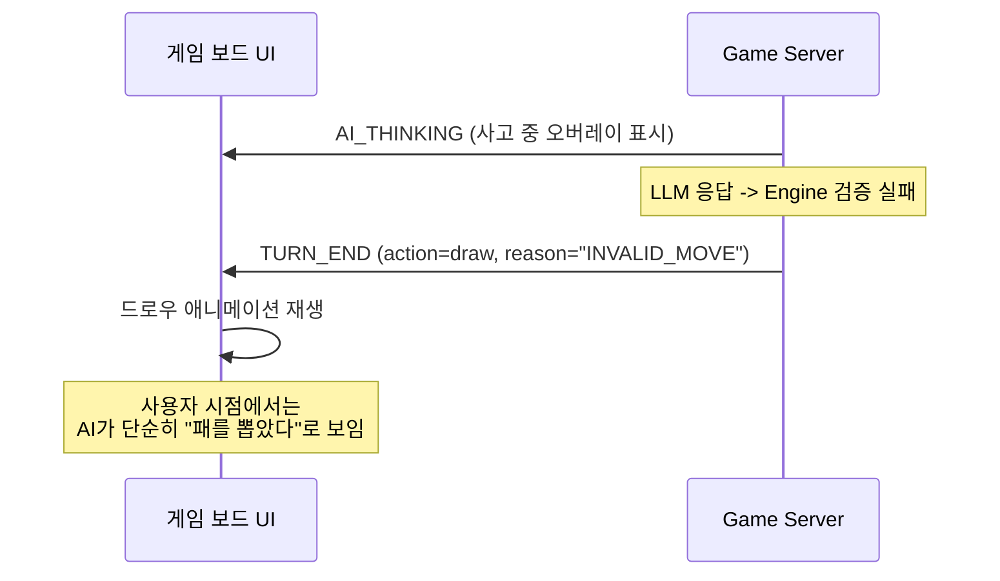
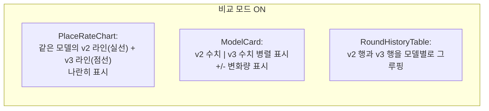
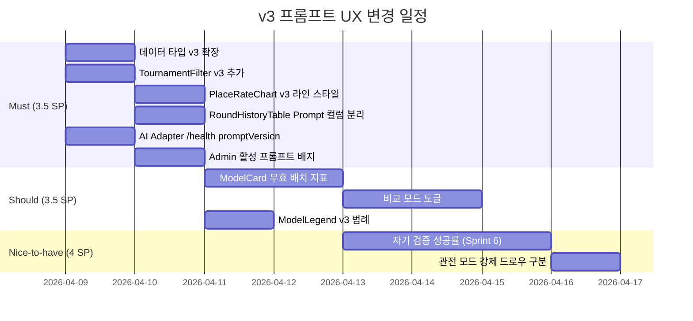

# v3 프롬프트 UX 영향도 리뷰

**작성일**: 2026-04-08
**작성자**: Designer (UI/UX)
**상태**: 리뷰 완료
**관련 문서**: `24-v3-prompt-adapter-impact.md`, `23-ai-tournament-dashboard-wireframe.md`, `07-ui-wireframe.md`

---

## 1. 리뷰 요약

v3 프롬프트는 v2를 기반으로 자기 검증 강화(후보 1), 테이블 그룹 누락 방지(후보 3), 무효 패턴 few-shot(후보 2), 배치 최적화(후보 4)의 4가지 개선을 적용한다. UX 관점에서 이 변경이 게임 보드, 토너먼트 대시보드, 관리자 경험에 미치는 영향을 분석한다.

### 핵심 판단

v3 프롬프트 변경의 영향은 **주로 관리자 대시보드 영역에 집중**되며, 실시간 게임 보드 UX에 대한 직접적 영향은 제한적이다. 다만, 무효 배치 감소로 인한 **간접적 UX 개선**(강제 드로우 빈도 감소, AI 턴 흐름 자연스러워짐)은 체감될 수 있다.

---

## 2. 영향도 종합 테이블

| 영역 | 영향 항목 | 영향도 | 우선순위 | 변경 범위 |
|------|-----------|:------:|:--------:|-----------|
| 게임 보드 | AI 강제 드로우 빈도 감소 | 중간 | Should | 프론트엔드 변경 없음 (서버 행위 변화) |
| 게임 보드 | AI 턴 응답 시간 미세 증가 (+21% 토큰) | 낮음 | Nice-to-have | 타이머 UX 변경 불필요 |
| 게임 보드 | 오류 메시지 노출 빈도 감소 | 낮음 | Nice-to-have | 프론트엔드 변경 없음 |
| 대시보드 | 프롬프트 버전 필터에 v3 추가 | 높음 | Must | `TournamentFilter` 컴포넌트 수정 |
| 대시보드 | v2 vs v3 비교 뷰 지원 | 높음 | Must | `PlaceRateChart` 라인 스타일 추가 |
| 대시보드 | 무효 배치 감소율 메트릭 신규 | 중간 | Should | `ModelCard` 보조 지표 추가 |
| 대시보드 | 자기 검증 성공률 메트릭 | 낮음 | Nice-to-have | 백엔드 로깅 선행 필요 |
| 관리자 | 활성 프롬프트 버전 표시 | 높음 | Must | `StatsOverview` 또는 사이드바 배지 |
| 관리자 | 대전 결과에 프롬프트 버전 태깅 | 높음 | Must | `RoundHistoryTable` 컬럼 확장 |

---

## 3. 게임 보드 UX 영향 분석

### 3.1 AI 배치 애니메이션 타이밍

**현재 흐름**: AI가 place 액션을 수행하면 서버에서 `TURN_END` 메시지와 함께 변경된 테이블 상태가 전송되고, 프론트엔드가 타일 이동 애니메이션을 재생한다.

**v3 영향**: v3 프롬프트는 v2 대비 토큰이 +21% 증가한다(~1,200 -> ~1,530). 이는 LLM의 입력 파싱 시간을 미세하게 늘린다. 그러나 실제 응답 시간은 reasoning chain(추론 모델의 사고 과정)이 지배적이므로, 프롬프트 토큰 증가가 체감 응답 시간에 미치는 영향은 무시할 수 있다.

| 모델 | v2 평균 응답 시간 | v3 예상 응답 시간 | 차이 |
|------|:-----------------:|:-----------------:|:----:|
| GPT-5-mini | 64.6s | ~65s | +0.4s (무시) |
| Claude Sonnet 4 | 63.8s | ~64s | +0.2s (무시) |
| DeepSeek Reasoner | 147.8s | ~148s | +0.2s (무시) |

**결론**: 턴 타이머(210s)나 AI_THINKING 오버레이의 UX 변경은 불필요하다.

### 3.2 강제 드로우(forceAIDraw) 빈도 변화

v3 Phase 1의 기대 효과는 무효 배치 ~4건/게임 -> ~2건/게임(50% 감소)이다. 이 변화가 사용자 경험에 미치는 영향은 다음과 같다.

**현재 UX 흐름(강제 드로우 시)**:



현재 구현에서 강제 드로우는 일반 드로우와 시각적으로 구분되지 않는다. 사용자(인간 플레이어)는 AI가 유효한 배치를 시도했다가 실패하여 드로우로 전환된 것인지, 원래 드로우를 선택한 것인지 알 수 없다.

**v3로 인한 변화**: 강제 드로우가 줄면 AI가 "아무것도 안 하고 패만 뽑는" 턴이 줄어, 게임이 더 역동적으로 느껴진다. 이는 긍정적 간접 효과이다.

**UX 권장 사항 (Should)**: 향후 관전 모드에서 AI의 강제 드로우를 시각적으로 구분하는 것을 고려할 수 있다(예: 드로우 로그에 "AI 배치 실패 -> 드로우" 표기). 단, 이는 v3 프롬프트와 무관한 별도 UX 개선이므로 이 리뷰의 범위를 벗어난다.

### 3.3 오류 메시지 표시

프론트엔드의 `INVALID_MOVE_MESSAGES` 매핑(useWebSocket.ts:46~76)은 v3에서 변경이 필요 없다. 이유는 다음과 같다.

1. v3 프롬프트가 줄이려는 에러 코드(`ERR_GROUP_COLOR_DUP`, `ERR_TABLE_TILE_MISSING`, `ERR_RUN_SEQUENCE`)는 이미 프론트엔드에 매핑되어 있다
2. 에러 메시지는 Game Engine이 생성하며, 프롬프트 변경과 무관하다
3. v3는 새로운 에러 유형을 도입하지 않는다

**결론**: 프론트엔드 오류 메시지 코드 변경 불필요.

---

## 4. 토너먼트 대시보드 영향 분석 및 수정 제안

### 4.1 프롬프트 버전 필터 확장 (Must)

**현재 상태** (23-ai-tournament-dashboard-wireframe.md 5.1절):

```typescript
// TournamentFilter 현재 props
promptVersion: 'all' | 'v1' | 'v2'
```

**v3 필요 변경**: `promptVersion` 타입에 `'v3'`를 추가해야 한다.

```typescript
// 수정안
promptVersion: 'all' | 'v1' | 'v2' | 'v3'
```

**와이어프레임 수정**:

```
기존:
| Prompt: [All ▾]  [v1] [v2]            |

수정:
| Prompt: [All ▾]  [v1] [v2] [v3]       |
```

세그먼트 버튼이 4개로 늘어나면 모바일에서 줄바꿈이 발생할 수 있다. 768px 미만에서는 드롭다운으로 전환하는 기존 반응형 전략(4.3절)이 이를 커버한다.

### 4.2 PlaceRateChart 라인 스타일 확장 (Must)

**현재 상태** (23-ai-tournament-dashboard-wireframe.md CSS 변수):

```css
--prompt-v1-dash: 8 4;   /* 점선 */
--prompt-v2-dash: none;  /* 실선 */
```

**v3 추가**:

```css
--prompt-v1-dash: 8 4;           /* 점선 (v1: 레거시) */
--prompt-v2-dash: none;          /* 실선 (v2: 이전 표준) */
--prompt-v3-dash: 4 2;           /* 짧은 점선 (v3: 현재 표준) */
--prompt-v3-stroke-width: 2.5;   /* v3 라인 두께 강조 */
```

v3 라인은 v2 실선과 구별되도록 짧은 대시 패턴(`4 2`)에 두께를 약간 두껍게(2.5px) 하여 "현재 활성 버전"임을 시각적으로 강조한다.

**대안 검토**: v3가 v2를 대체하는 것이 확정이면(doc 24, 6.2절 "v2를 인플레이스 수정"), v2 데이터를 "이전 기준"으로 라벨링하고 v3를 실선으로 승격시키는 것이 더 깔끔하다. 그러나 A/B 테스트 기간 동안은 v2와 v3가 공존하므로, 구분 가능한 라인 스타일이 필요하다.

**범례 업데이트**:

```
기존:
 --- v1 프롬프트     ___ v2 프롬프트

수정:
 --- v1 프롬프트     ___ v2 프롬프트     -.- v3 프롬프트
```

### 4.3 데이터 타입 확장 (Must)

**현재 상태** (23-ai-tournament-dashboard-wireframe.md 6.3절):

```typescript
interface TournamentRoundEntry {
  promptVersion: 'v1' | 'v2';
  // ...
}
```

**v3 수정**:

```typescript
interface TournamentRoundEntry {
  promptVersion: 'v1' | 'v2' | 'v3';
  // ...
}

interface CostEfficiencyEntry {
  promptVersion: 'v1' | 'v2' | 'v3';
  // ...
}
```

모든 `promptVersion` 유니온 타입에 `'v3'`를 추가한다.

### 4.4 ModelCard 보조 지표: 무효 배치율 추가 (Should)

v3의 핵심 목표가 "무효 배치 감소"이므로, 이 메트릭을 ModelCard에 표시하면 v2 vs v3 효과를 직관적으로 비교할 수 있다.

**ModelCard 와이어프레임 수정안**:

```
+---------------------------------------+
| ======= (모델 색상 상단 바 4px) ======= |
|                                       |
|  [마커] GPT-5-mini              [A+]  |
|                                       |
|         30.8%                         |
|      최신 Place Rate                  |
|                                       |
|  .--..                               |
|  |    \__/\  <-- 스파크라인            |
|  '        \                           |
|                                       |
|  +---------+---------+---------+----+ |
|  | 응답시간 | 비용/턴  | 총 타일 |무효 | |
|  |  64.6s  | $0.025  |   29   | 2건 | |
|  +---------+---------+---------+----+ |
|                                       |
|  [80턴 완주] [v3 프롬프트]             |
+---------------------------------------+
```

변경 사항:
1. 보조 지표 행에 "무효 배치 건수" 컬럼 추가 (4열)
2. 배지 영역의 프롬프트 버전 표시를 v2 -> v3로 갱신

**데이터 구조 확장**:

```typescript
interface ModelLatestStats {
  // ... 기존 필드
  invalidMoveCount: number;  // 신규: 해당 라운드 무효 배치 건수
  fallbackDrawCount: number; // 신규: 강제 드로우 건수
}
```

**선행 조건**: game-server에서 무효 배치 건수를 라운드별로 집계하여 API로 노출해야 한다. 현재는 로그에만 기록되므로, 백엔드 작업이 필요하다.

### 4.5 자기 검증 성공률 메트릭 (Nice-to-have)

v3의 핵심 메커니즘인 "Pre-Submission Validation Checklist"의 효과를 측정하려면, AI adapter에서 다음을 로깅해야 한다.

- LLM의 첫 시도 성공률 (재시도 없이 Engine 검증 통과)
- 재시도 횟수 분포 (1회, 2회, 3회)
- 재시도 후 성공 vs 강제 드로우 비율

현재 이 데이터는 수집되지 않으므로, 대시보드에 표시하려면 백엔드 로깅 변경이 선행되어야 한다. Sprint 6 이후 검토를 권장한다.

---

## 5. 관리자 경험: A/B 테스트 UX

### 5.1 활성 프롬프트 버전 표시 (Must)

관리자가 현재 어떤 프롬프트 버전이 운영 중인지 즉시 파악할 수 있어야 한다. 현재는 `PROMPT_VERSION` 환경변수를 K8s ConfigMap에서 직접 확인해야 하는데, 이는 비효율적이다.

**제안 A: 사이드바 배지** (권장)

```
사이드바 항목:
  AI 통계        [v3]
```

사이드바의 "AI 통계" 항목 옆에 현재 활성 프롬프트 버전을 작은 배지로 표시한다.

**제안 B: 대시보드 헤더 배너**

```
+----------------------------------------------------------------------+
| RummiArena Admin > 토너먼트 결과                                      |
|                                                                      |
| [!] 현재 활성 프롬프트: v3 (Phase 1)   |   마지막 대전: 2026-04-08    |
+----------------------------------------------------------------------+
```

대시보드 상단에 정보 배너로 활성 프롬프트 버전과 마지막 대전 시간을 표시한다.

**구현 방법**: AI Adapter의 `/health` 엔드포인트 응답에 `promptVersion` 필드를 추가하고, Admin 대시보드가 이를 폴링한다.

```typescript
// ai-adapter /health 응답 확장
{
  "status": "ok",
  "promptVersion": "v3",
  "promptPhase": "Phase 1"
}
```

### 5.2 대전 결과 프롬프트 버전 태깅 (Must)

**현재 상태**: `RoundHistoryTable`(23-ai-tournament-dashboard-wireframe.md 5.5절)의 "라운드" 컬럼에 `R4v2`처럼 프롬프트 버전이 접미사로 붙어 있다.

**v3 적용 시 문제**: `R5v3`, `R5v2`처럼 라운드 이름이 길어지고, 어떤 v3 Phase인지도 구분이 필요하다.

**수정안**: 라운드 컬럼과 프롬프트 버전 컬럼을 분리한다.

```
기존:
| Round | Model   | Rate  | Cost  |
| R4 v2 | GPT     | 30.8% | $0.98 |

수정:
| Round | Prompt | Model   | Rate  | Cost  |
| R5    | v3-P1  | GPT     | 30.8% | $0.98 |
| R4    | v2     | GPT     | 30.8% | $0.98 |
```

Prompt 컬럼에 Phase 정보도 포함하여(`v3-P1`, `v3-P2`) A/B 테스트 결과를 정밀하게 추적할 수 있다.

**컬럼 정의 수정**:

| # | 컬럼명 | 키 | 정렬 | 너비 | 설명 |
|---|--------|-----|------|------|------|
| 1 | 라운드 | `round` | 내림차순 기본 | 60px | R5, R4, R3, R2 |
| 2 | 프롬프트 | `promptVersion` | 가능 | 70px | v3-P1, v2, v1 |
| 3 | 모델 | `model` | 가능 | 140px | 색상 dot + 모델명 |
| 4 | Rate | `placeRate` | 가능 | 70px | Place Rate % |
| 5 | Place/Draw | `placeCount` | 가능 | 90px | "12P / 27D" 형식 |
| 6 | 비용 | `cost` | 가능 | 80px | $0.04 형식 |
| 7 | 응답 시간 | `avgResponseTime` | 가능 | 80px | 초 단위 avg |
| 8 | 상태 | `status` | 가능 | 100px | 완주/WS_CLOSED/WS_TIMEOUT |

### 5.3 v2 vs v3 비교 뷰 (Should)

A/B 테스트 기간 동안 가장 빈번한 관리자 시나리오는 "v2와 v3의 성능 차이를 비교"하는 것이다.

**제안: 비교 모드 토글**

필터 바에 "비교 모드" 토글을 추가하여, 동일 모델의 v2/v3 데이터를 나란히 표시한다.



**ModelCard 비교 모드 와이어프레임**:

```
+---------------------------------------------------+
| ======= (모델 색상 상단 바 4px) =================== |
|                                                   |
|  [마커] GPT-5-mini                          [A+]  |
|                                                   |
|      v2: 30.8%    ->    v3: 33.5%   (+2.7%)      |
|                                                   |
|  +----------+----------+----------+----------+    |
|  |          | 응답시간  | 비용/턴   |  무효    |    |
|  |  v2      |  64.6s   | $0.025   |  4건    |    |
|  |  v3      |  65.1s   | $0.026   |  2건    |    |
|  |  변화    |  +0.5s   | +$0.001  |  -50%   |    |
|  +----------+----------+----------+----------+    |
|                                                   |
|  [80턴 완주] [v3-P1 활성]                          |
+---------------------------------------------------+
```

이 비교 모드는 A/B 테스트가 종료되면 비활성화하거나 "히스토리 뷰"로 전환할 수 있다.

---

## 6. CSS 변수 확장 제안

23-ai-tournament-dashboard-wireframe.md 2.2절의 CSS 변수에 다음을 추가한다.

```css
:root {
  /* 기존 유지 */
  --prompt-v1-dash: 8 4;
  --prompt-v2-dash: none;

  /* v3 신규 */
  --prompt-v3-dash: 4 2;
  --prompt-v3-stroke: 2.5;

  /* 비교 모드 색상 */
  --compare-positive: #3FB950;  /* 개선 */
  --compare-negative: #F85149;  /* 악화 */
  --compare-neutral: #8B949E;   /* 변화 없음 */

  /* 프롬프트 버전 배지 색상 */
  --badge-v1: #8B949E;     /* 회색: 레거시 */
  --badge-v2: #3498DB;     /* 파랑: 이전 표준 */
  --badge-v3: #3FB950;     /* 녹색: 현재 활성 */
}
```

---

## 7. 접근성 고려 사항

### 7.1 프롬프트 버전 구분: 삼중 인코딩 유지

기존 대시보드 설계에서 모델을 색상 + 마커 형태 + 패턴으로 삼중 인코딩한 것처럼, 프롬프트 버전도 다중 인코딩한다.

| 프롬프트 버전 | 라인 스타일 | 라인 두께 | 레이블 | 색약 보조 |
|:---:|:---:|:---:|:---:|:---:|
| v1 | 긴 점선 `8 4` | 1.5px | "v1" 텍스트 | 긴 간격 대시 |
| v2 | 실선 `none` | 2px | "v2" 텍스트 | 빈틈 없는 선 |
| v3 | 짧은 점선 `4 2` | 2.5px | "v3" 텍스트 | 짧고 두꺼운 대시 |

### 7.2 비교 모드의 변화량 표시

`+2.7%` 같은 변화량은 색상(녹색/빨강)에만 의존하지 않도록, 화살표 기호(`+`/`-`)와 텍스트 레이블을 함께 사용한다.

```
개선: +2.7% (녹색 + 상향 화살표)
악화: -1.2% (빨강 + 하향 화살표)
무변화: 0% (회색 + 대시)
```

---

## 8. 구현 우선순위 및 일정 제안

### 8.1 Must 항목 (v3 A/B 테스트 시작 전 완료)

| # | 항목 | 예상 SP | 담당 | 선행 조건 |
|---|------|:-------:|------|-----------|
| 1 | `TournamentFilter` promptVersion에 'v3' 추가 | 0.5 | Frontend Dev | v3 코드 머지 |
| 2 | `PlaceRateChart` v3 라인 스타일 추가 | 0.5 | Frontend Dev | 1번 |
| 3 | 데이터 타입 `promptVersion` 유니온 확장 | 0.5 | Frontend Dev | - |
| 4 | `RoundHistoryTable` Prompt 컬럼 분리 | 1 | Frontend Dev | 3번 |
| 5 | AI Adapter `/health`에 promptVersion 필드 추가 | 0.5 | Node Dev | v3 코드 머지 |
| 6 | Admin 사이드바/헤더에 활성 프롬프트 배지 | 0.5 | Frontend Dev | 5번 |

**Must 합계**: 3.5 SP

### 8.2 Should 항목 (A/B 테스트 결과 분석 시)

| # | 항목 | 예상 SP | 담당 | 선행 조건 |
|---|------|:-------:|------|-----------|
| 7 | `ModelCard` 무효 배치 건수 지표 추가 | 1 | Frontend Dev + Go Dev (API) | 무효 배치 집계 API |
| 8 | v2 vs v3 비교 모드 토글 | 2 | Frontend Dev | 7번 |
| 9 | ModelLegend v3 범례 항목 추가 | 0.5 | Frontend Dev | 2번 |

**Should 합계**: 3.5 SP

### 8.3 Nice-to-have 항목 (Sprint 6 이후)

| # | 항목 | 예상 SP | 담당 | 선행 조건 |
|---|------|:-------:|------|-----------|
| 10 | 자기 검증 성공률 메트릭 수집 + 시각화 | 3 | Node Dev + Frontend Dev | AI Adapter 로깅 변경 |
| 11 | 관전 모드 강제 드로우 시각적 구분 | 1 | Frontend Dev | v3 안정화 |

**Nice-to-have 합계**: 4 SP

### 8.4 일정 제안



---

## 9. 대시보드 와이어프레임 수정 요약 (23-ai-tournament-dashboard-wireframe.md 개정안)

아래는 v3 도입으로 인해 기존 대시보드 와이어프레임에서 수정이 필요한 부분의 요약이다.

| 섹션 | 변경 내용 | 영향도 |
|------|-----------|:------:|
| 2.2 CSS 변수 | `--prompt-v3-dash`, `--prompt-v3-stroke`, 비교 색상, 배지 색상 추가 | 추가 |
| 5.1 TournamentFilter | `promptVersion` 타입에 `'v3'` 추가, 세그먼트 버튼 4개 | 수정 |
| 5.2 PlaceRateChart | v3 라인 스타일(짧은 점선, 두꺼운 선) 추가, 범례 업데이트 | 수정 |
| 5.4 ModelCard | 보조 지표에 "무효 배치 건수" 추가, 프롬프트 배지 v3 대응 | 수정 |
| 5.5 RoundHistoryTable | "프롬프트" 컬럼 분리 (8컬럼 -> 9컬럼, 이후 최적화 시 8 유지 가능) | 수정 |
| 5.6 ModelLegend | v3 라인 스타일 범례 추가 | 수정 |
| 6.3 타입 정의 | 모든 `promptVersion` 유니온에 `'v3'` 추가 | 수정 |
| 7.1 사용자 시나리오 | "비교 모드" 시나리오 추가 | 추가 |

---

## 10. 결론

### 10.1 v3 프롬프트의 UX 영향은 제한적이지만 긍정적

- **게임 보드**: 프론트엔드 코드 변경 불필요. 무효 배치 감소에 의한 간접적 게임 흐름 개선만 존재.
- **토너먼트 대시보드**: 프롬프트 버전 필터/라인 스타일/데이터 타입에 `v3` 확장이 필요. Must 항목 3.5 SP.
- **관리자 경험**: 활성 프롬프트 버전 가시성 확보가 가장 중요한 UX 개선. A/B 테스트 효과 비교를 위한 비교 모드는 Should 수준.

### 10.2 디자이너 권장 우선순위

1. **즉시**: Must 6개 항목(3.5 SP) -- v3 A/B 테스트가 시작되기 전에 대시보드가 v3 데이터를 표시할 수 있어야 한다
2. **A/B 기간 중**: Should 3개 항목(3.5 SP) -- 비교 모드는 v2 vs v3 결과가 쌓인 후 의미가 있다
3. **Sprint 6**: Nice-to-have 2개 항목(4 SP) -- 검증 성공률 메트릭은 백엔드 로깅이 선행되어야 한다
