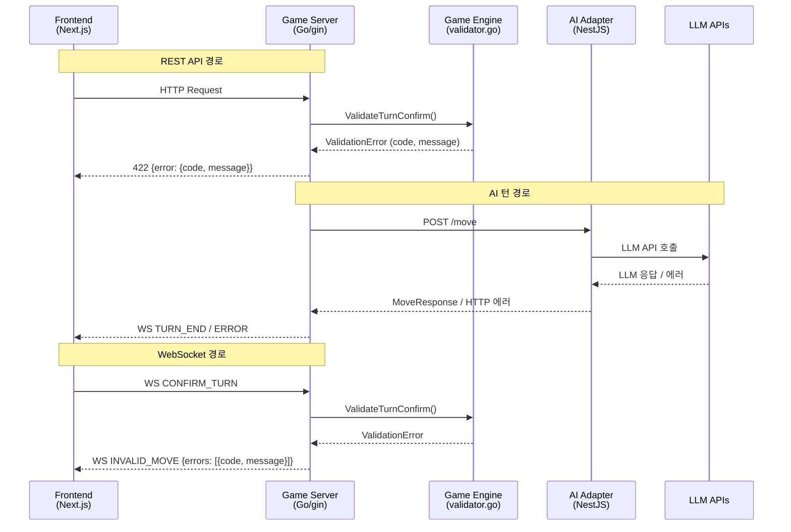
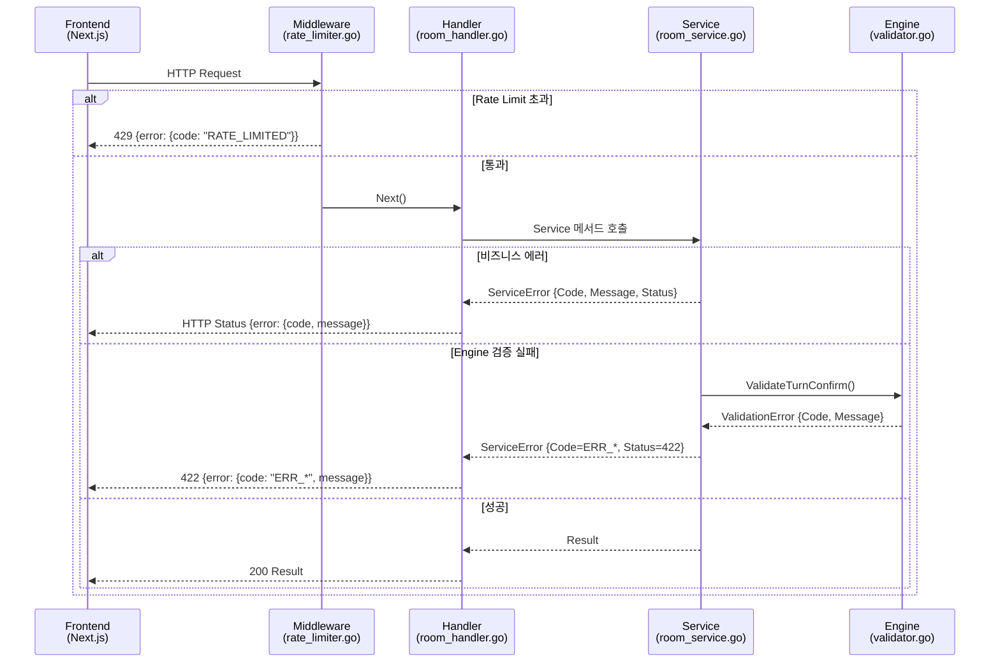
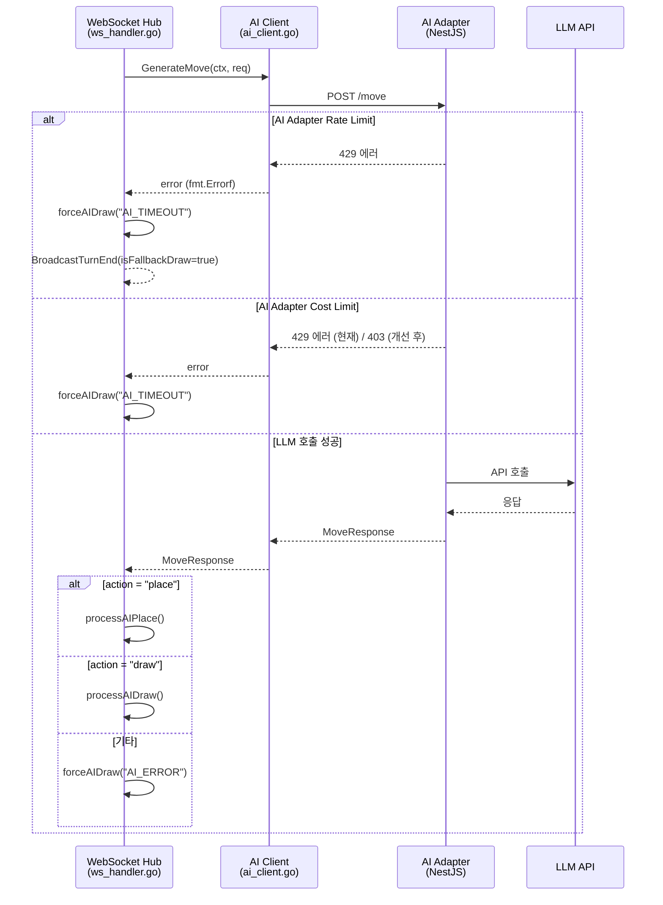
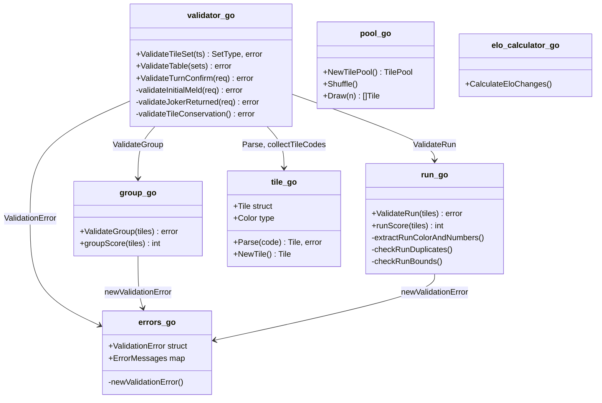
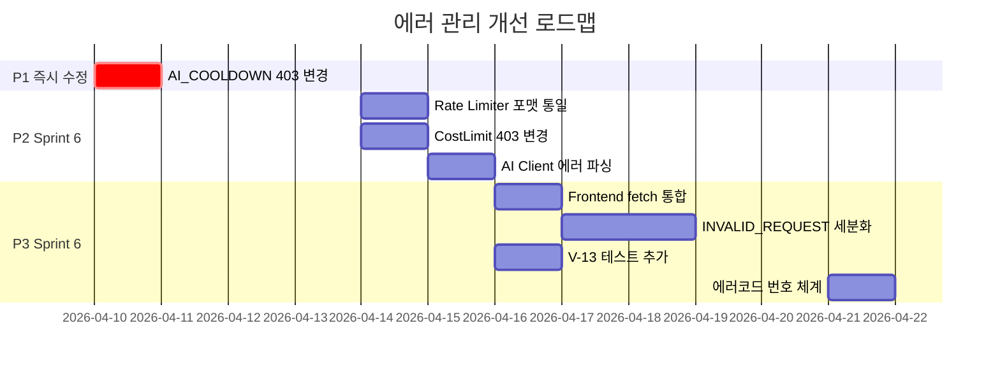

# 30. 에러 관리 정책 및 소스코드 리뷰 (Error Management Policy)

> **작성일**: 2026-04-10
> **근거**: AI_COOLDOWN 429 vs RATE_LIMITED 429 충돌 사건 (Sprint 5 W2)
> **범위**: game-server(Go), ai-adapter(NestJS), frontend(Next.js) 전 레이어
> **선행 문서**: 29-error-code-registry.md, 03-api-design.md, 09-game-engine-detail.md

---

## 1. 현재 상태 분석

### 1.1 에러코드 레지스트리 현황

29-error-code-registry.md에 등록된 에러코드를 레이어별로 분류하면 다음과 같다.

| 레이어 | 에러 코드 수 | 주요 코드 |
|--------|:----------:|-----------|
| Service Layer | 13 | `NOT_FOUND`, `INVALID_REQUEST`, `AI_COOLDOWN`, `ROOM_FULL` 등 |
| Handler Layer | 9 | `UNAUTHORIZED`, `INTERNAL_ERROR`, `OAUTH_DISABLED` 등 |
| Middleware Layer | 3 | `UNAUTHORIZED`, `FORBIDDEN`, `RATE_LIMITED` |
| WebSocket Layer | 2 | `RATE_LIMITED`, `INVALID_MESSAGE` |
| Engine Layer | 14 | `ERR_INVALID_SET`, `ERR_SET_SIZE`, `ERR_RUN_SEQUENCE` 등 |
| **합계** | **~38** (중복 포함) | |

### 1.2 현재 에러 전파 경로



### 1.3 현재 체계의 문제점

소스코드 전수 검토 결과, 다음 7가지 문제를 식별했다.

#### P1: CRITICAL -- HTTP 429 충돌

| 출처 | 코드 | HTTP Status | 파일 |
|------|------|:-----------:|------|
| `room_service.go:95` | `AI_COOLDOWN` | **429** | 비즈니스 쿨다운 |
| `rate_limiter.go:182` | `RATE_LIMITED` | **429** | 인프라 방어 |

프론트엔드가 HTTP status만으로 분기하면 AI 쿨다운이 Rate Limit으로 오인된다. `src/frontend/src/lib/api.ts:83`에서 429를 수신하면 body를 파싱하여 `AI_COOLDOWN`을 구분하는 임시 로직이 이미 존재하나(라인 99), `src/frontend/src/lib/rankings-api.ts:151`에서는 body 파싱 없이 429만 확인한다.

#### P2: 응답 포맷 불일치

```
// Service Layer (room_handler.go:297) -- 공통 포맷 준수
{"error": {"code": "AI_COOLDOWN", "message": "..."}}

// Rate Limiter (rate_limiter.go:182) -- flat 구조, 규격 위반
{"error": "RATE_LIMITED", "message": "...", "retryAfter": 60}

// AI Adapter Rate Limit (rate-limit.guard.ts:39) -- flat 구조
{"error": "RATE_LIMITED", "message": "...", "retryAfter": 30}

// AI Adapter Cost Limit (cost-limit.guard.ts:48) -- 독자 구조
{"statusCode": 429, "error": "Daily Cost Limit Exceeded", "message": "...", "allowedModels": [...]}
```

4곳에서 429를 반환하지만 **응답 포맷이 모두 다르다**. `03-api-design.md` 0.1절의 공통 에러 규격(`{error: {code, message}}`)을 준수하는 곳은 Service Layer뿐이다.

#### P3: INVALID_REQUEST 과다 사용

`INVALID_REQUEST` 코드가 10개 이상 파일에서 서로 다른 맥락으로 사용된다. 방 생성 파라미터 오류, JSON 파싱 실패, 타일 미포함 오류가 동일 코드다. 디버깅 시 message 문자열에 의존해야 한다.

| 파일 | 사용 횟수 | 맥락 |
|------|:---------:|------|
| `room_handler.go` | 6 | roomID 누락, JSON 파싱, 쿼리 파라미터 |
| `game_handler.go` | 6 | gameID 누락, seat 오류, JSON 파싱 |
| `practice_handler.go` | 3 | stage 파라미터, completedAt 형식 |
| `room_service.go` | 3 | playerCount 범위, timeout 범위, 종료된 방 |

#### P4: AI Adapter 에러가 game-server에서 불투명

`ai_client.go:131`에서 non-200 응답을 `fmt.Errorf("unexpected status %d")` 한 줄로 변환한다. AI Adapter의 구조화된 에러 body(429 cost limit, 400 bad request 등)가 game-server에 전달되지 않는다.

#### P5: WebSocket과 REST의 에러 코드 네임스페이스 미분리

`RATE_LIMITED`가 HTTP middleware(`rate_limiter.go`)와 WS handler(`ws_connection.go:204`)에서 동일 코드명을 사용한다. 전송 채널이 다르므로 현재는 충돌이 아니지만, 에러 모니터링/로깅에서 혼동 가능성이 있다.

#### P6: Frontend의 에러 처리 이중화

`api.ts`와 `rankings-api.ts`에 각각 별도의 `apiFetch` 함수가 존재한다. 429 처리 로직이 다르다.

| 파일 | 429 처리 | body 파싱 |
|------|---------|----------|
| `api.ts:83` | AI_COOLDOWN 구분, 재시도 2회 | O (`body.code ?? body.error`) |
| `rankings-api.ts:151` | 일률적 에러 메시지 | X (status만 확인) |

#### P7: Engine 에러 코드 체계가 비구조적

Engine의 에러 코드(`ERR_INVALID_SET`, `ERR_SET_SIZE` 등)는 플랫 문자열이다. V-01~V-15 규칙 ID와 1:1 매핑이 문서에만 존재하고 코드에는 주석으로만 남아 있다.

---

## 2. 통합 에러코드 체계

### 2.1 코드 분류 및 번호 체계

에러코드에 번호 체계를 도입한다. 기존 문자열 코드와 번호를 병행하며, 신규 코드부터 번호를 부여한다.

| 도메인 | 번호 범위 | 접두사 | 예시 |
|--------|:---------:|--------|------|
| Game Engine (규칙 검증) | 1000~1099 | `ERR_` | `ERR_INVALID_SET` (1001) |
| Game Service (비즈니스) | 1100~1199 | - | `NOT_YOUR_TURN` (1100), `AI_COOLDOWN` (1101) |
| Room/Lobby | 1200~1299 | - | `ROOM_FULL` (1200), `ALREADY_JOINED` (1201) |
| AI/LLM | 2000~2099 | `AI_` | `AI_TIMEOUT` (2001), `AI_COST_EXCEEDED` (2002) |
| Auth/Security | 3000~3099 | - | `UNAUTHORIZED` (3000), `FORBIDDEN` (3001) |
| WebSocket | 4000~4099 | `WS_` | `WS_RATE_LIMITED` (4000), `WS_INVALID_MESSAGE` (4001) |
| System/Infra | 5000~5099 | - | `INTERNAL_ERROR` (5000), `RATE_LIMITED` (5001) |

번호 체계는 Sprint 6에서 점진 도입한다. 현 단계에서는 문자열 코드의 **고유성 보장**과 **HTTP status 매핑 규칙 정립**이 우선이다.

### 2.2 표준 에러 응답 형식

모든 레이어(REST, WS, AI Adapter)가 동일한 구조를 사용한다. `03-api-design.md` 0.1절을 기반으로 확장한다.

**REST API 에러 응답**:

```json
{
  "error": {
    "code": "AI_COOLDOWN",
    "message": "AI 게임은 5분에 1회만 생성할 수 있습니다.",
    "details": {
      "retryAfterSec": 300
    }
  }
}
```

**WebSocket 에러 메시지**:

```json
{
  "type": "ERROR",
  "payload": {
    "code": "RATE_LIMITED",
    "message": "메시지 전송 빈도 제한을 초과했습니다.",
    "details": {
      "retryAfterMs": 45000
    }
  }
}
```

**공통 규칙**:
1. `error.code`는 항상 `UPPER_SNAKE_CASE` 문자열
2. `error.message`는 항상 한글 (사용자 표시용)
3. `error.details`는 선택적 -- 추가 메타데이터 (retryAfter, invalidGroups 등)
4. Rate Limit 관련 에러는 `retryAfterSec` (REST) / `retryAfterMs` (WS)를 details에 포함
5. `retryAfter` HTTP 헤더는 기존대로 유지 (RFC 7231 준수)

### 2.3 HTTP Status 매핑 규칙

| HTTP Status | 의미 | 사용 규칙 |
|:-----------:|------|-----------|
| 400 | Bad Request | 요청 형식/파라미터 오류 |
| 401 | Unauthorized | 인증 실패 (JWT 없음/만료) |
| 403 | Forbidden | 권한 부족 + **비즈니스 제약** (쿨다운 등) |
| 404 | Not Found | 리소스 미존재 |
| 409 | Conflict | 상태 충돌 (이미 참가, 방 가득 참 등) |
| 422 | Unprocessable Entity | 게임 엔진 유효성 검증 실패 |
| 429 | Too Many Requests | **인프라 Rate Limit 전용** (사용 주체: middleware만) |
| 500 | Internal Server Error | 서버 내부 오류 |
| 503 | Service Unavailable | 외부 서비스 미초기화 (OAuth, JWKS) |

**핵심 규칙**: HTTP 429는 Rate Limit middleware(`rate_limiter.go`, `rate-limit.guard.ts`)만 사용한다. 비즈니스 쿨다운/비용 한도는 403을 사용한다.

---

## 3. 레이어별 에러 관리 정책

### 3.1 Game Server (Backend)

Game Server는 에러의 **1차 생성 주체**다. 모든 에러는 `ServiceError` 또는 `engine.ValidationError`로 구조화되어야 한다.

**책임**:
1. Engine의 `ValidationError`를 HTTP 422 + 구조화된 에러로 변환 (`game_handler.go:123`)
2. Service의 `ServiceError`를 HTTP 응답으로 변환 (`room_handler.go:306`)
3. Rate Limiter의 429 응답을 공통 포맷으로 통일 (현재 미준수, P2)
4. AI Adapter 에러를 사용자 친화적 에러로 변환 (현재 미흡, P4)

**현재 잘 동작하는 패턴** (`room_handler.go:296-323`):

```go
// respondError -- 공통 포맷 준수
func respondError(c *gin.Context, status int, code, message string) {
    c.JSON(status, gin.H{
        "error": gin.H{"code": code, "message": message},
    })
}

// handleServiceError -- ServiceError를 자동 변환
func handleServiceError(c *gin.Context, err error) {
    if se, ok := service.IsServiceError(err); ok {
        c.JSON(se.Status, gin.H{
            "error": gin.H{"code": se.Code, "message": se.Message},
        })
        return
    }
    c.JSON(500, gin.H{
        "error": gin.H{"code": "INTERNAL_ERROR", "message": "서버 내부 오류가 발생했습니다."},
    })
}
```

**수정 필요 패턴** (`rate_limiter.go:182`):

```go
// AS-IS: flat 구조, 공통 포맷 위반
c.AbortWithStatusJSON(429, gin.H{
    "error": "RATE_LIMITED", "message": "Too many requests", "retryAfter": retryAfter,
})

// TO-BE: 공통 포맷 준수 + details에 retryAfter 이동
c.AbortWithStatusJSON(429, gin.H{
    "error": gin.H{
        "code": "RATE_LIMITED",
        "message": "요청이 너무 빈번합니다.",
        "details": gin.H{"retryAfterSec": retryAfter},
    },
})
```

### 3.2 AI Adapter

AI Adapter는 LLM 에러를 **표준 에러로 변환**하는 게이트웨이다.

**현재 에러 포인트 3곳**:

| 파일 | 에러 유형 | HTTP Status | 포맷 준수 |
|------|-----------|:-----------:|:---------:|
| `rate-limit.guard.ts:38` | 빈도 초과 | 429 | X (flat) |
| `cost-limit.guard.ts:47` | 일일 비용 한도 | 429 | X (독자 구조) |
| `cost-limit.guard.ts:72` | 시간당 비용 한도 | 429 | X (독자 구조) |

**정책**:
1. AI Adapter의 429 중 비용 한도(`cost-limit.guard.ts`)는 **403 + `AI_COST_EXCEEDED`** 로 변경
2. Rate Limit(`rate-limit.guard.ts`)은 429 유지하되 공통 포맷으로 통일
3. LLM API 에러(timeout, 500 등)는 어댑터 내부에서 재시도(BaseAdapter)를 수행하고, 최종 실패 시 `action: "draw"` + `isFallbackDraw: true`로 응답 -- 이 부분은 이미 잘 구현됨
4. 어댑터의 에러가 game-server에 전파될 때, `ai_client.go`에서 body를 파싱하여 구조화된 에러를 전달해야 한다 (P4 개선)

### 3.3 Frontend (UI)

Frontend는 `error.code` 필드를 기준으로 사용자 메시지를 결정한다.

**정책**:
1. **HTTP status로 1차 분류, `error.code`로 2차 분류** -- status만으로 판단하지 않는다
2. 기술 메시지(`error.message`)를 사용자에게 직접 노출하지 않는다 -- 코드별 한글 매핑 테이블 사용
3. 복구 가능한 에러(429, 409)에는 재시도 UX를 제공한다
4. `api.ts`와 `rankings-api.ts`의 fetch 래퍼를 **단일 모듈로 통합**한다 (P6 해소)

**에러 코드 -> 사용자 메시지 매핑 (프론트엔드 참조용)**:

| error.code | 사용자 메시지 | 복구 행동 |
|------------|-------------|-----------|
| `RATE_LIMITED` | "잠시 후 다시 시도해주세요." | 자동 재시도 (retryAfterSec 후) |
| `AI_COOLDOWN` | "AI 게임은 5분에 1회만 생성할 수 있습니다." | 쿨다운 타이머 표시 |
| `ROOM_FULL` | "방이 가득 찼습니다." | 로비로 이동 |
| `NOT_YOUR_TURN` | "아직 내 차례가 아닙니다." | 무시 (UX 블로킹 없음) |
| `ERR_INVALID_SET` | "올바른 조합이 아닙니다." | 타일 재배치 안내 |
| `UNAUTHORIZED` | "로그인이 필요합니다." | 로그인 페이지 이동 |
| `INTERNAL_ERROR` | "일시적 오류가 발생했습니다." | 페이지 새로고침 안내 |

---

## 4. 에러 전파 흐름

### 4.1 REST API 에러 전파



### 4.2 AI 턴 에러 전파



### 4.3 에러 변환 규칙 요약

| 경계 | 변환 규칙 |
|------|-----------|
| Engine -> Service | `ValidationError` -> `ServiceError{Code: extractErrCode(err), Status: 422}` |
| Service -> Handler | `ServiceError` -> HTTP `{status, error: {code, message}}` |
| AI Adapter -> Game Server | HTTP 에러 -> `fmt.Errorf` (현재) / 구조화 에러 (개선 후) |
| Game Server -> Frontend (REST) | `respondError()` / `handleServiceError()` 사용 |
| Game Server -> Frontend (WS) | `conn.SendError(code, message)` / `S2CInvalidMove` |
| **내부 에러 vs 외부 노출** | DB 에러, Redis 에러, LLM raw 에러는 `INTERNAL_ERROR`로 마스킹 |
| **로깅 vs 사용자 표시** | 상세 에러(stack trace, DB query)는 서버 로그에만. 사용자에게는 code + 한글 message만 전달 |

---

## 5. P1 수정 권고

### 5.1 AI_COOLDOWN 상태 코드 변경

**변경 근거**:
- RFC 6585에서 429는 "rate limiting" 전용으로 정의
- AI 쿨다운은 비즈니스 제약(LLM Cost Attack 방어)이므로 의미론적으로 403 Forbidden이 적절
- 403으로 변경하면 프론트엔드에서 HTTP status만으로도 인프라 Rate Limit(429)과 구분 가능

**수정 파일 및 라인**:

1. **`src/game-server/internal/service/room_service.go:97`**

```go
// AS-IS
Status: 429,

// TO-BE
Status: 403,
```

2. **`src/frontend/src/lib/api.ts:83-109`**: 429 분기 내의 AI_COOLDOWN 특별 처리를 제거하고, 403 분기에서 `error.code === "AI_COOLDOWN"` 처리로 이동

```typescript
// AS-IS: 429 블록 안에서 body 파싱으로 AI_COOLDOWN 구분
if (res.status === 429) {
  // body에서 에러 코드 확인 (AI_COOLDOWN vs RATE_LIMITED)
  ...
  if (errorCode === "AI_COOLDOWN") { ... }
}

// TO-BE: 403 블록 추가 (AI_COOLDOWN은 더 이상 429가 아님)
if (res.status === 403) {
  const body = await res.json() as ApiError;
  if (body?.error?.code === "AI_COOLDOWN") {
    // AI 쿨다운 처리
  }
  throw new Error(body?.error?.message ?? "접근이 거부되었습니다.");
}
// 429 블록은 순수 Rate Limit만 처리
if (res.status === 429) {
  const retrySec = parseRetryAfter(res);
  showRateLimitToast(retrySec);
  // 재시도 로직...
}
```

3. **`src/frontend/src/app/room/create/CreateRoomClient.tsx`**: 에러 메시지 표시가 `catch(err)` 블록에서 `err.message`를 사용하므로 추가 수정 불필요 (api.ts에서 throw하는 메시지가 동일)

4. **E2E 테스트**: `ai-cooldown` 관련 E2E 케이스에서 기대 status를 429 -> 403으로 변경

### 5.2 Rate Limiter 응답 포맷 통일

**수정 파일**:

1. **`src/game-server/internal/middleware/rate_limiter.go:182-186`**

```go
// AS-IS (flat 구조)
c.AbortWithStatusJSON(http.StatusTooManyRequests, gin.H{
    "error":      "RATE_LIMITED",
    "message":    "Too many requests",
    "retryAfter": retryAfter,
})

// TO-BE (공통 에러 포맷)
c.AbortWithStatusJSON(http.StatusTooManyRequests, gin.H{
    "error": gin.H{
        "code":    "RATE_LIMITED",
        "message": "요청이 너무 빈번합니다. 잠시 후 다시 시도해주세요.",
        "details": gin.H{"retryAfterSec": retryAfter},
    },
})
```

`Retry-After` HTTP 헤더(`rate_limiter.go:181`)는 그대로 유지한다 (RFC 준수).

2. **`src/ai-adapter/src/cost/cost-limit.guard.ts:47-56, 72-80`**: 일일/시간당 비용 한도를 429 -> 403으로 변경

```typescript
// AS-IS
throw new HttpException({
    statusCode: HttpStatus.TOO_MANY_REQUESTS,
    error: 'Daily Cost Limit Exceeded',
    ...
}, HttpStatus.TOO_MANY_REQUESTS);

// TO-BE
throw new HttpException({
    error: { code: 'AI_COST_EXCEEDED', message: '일일 LLM API 비용 한도를 초과했습니다.' },
    allowedModels: ['ollama'],
}, HttpStatus.FORBIDDEN);
```

3. **`src/ai-adapter/src/common/guards/rate-limit.guard.ts:38-45`**: 공통 포맷으로 통일

```typescript
// AS-IS
throw new HttpException({
    error: 'RATE_LIMITED',
    message: 'Too many requests',
    retryAfter: 30,
}, HttpStatus.TOO_MANY_REQUESTS);

// TO-BE
throw new HttpException({
    error: { code: 'RATE_LIMITED', message: '요청이 너무 빈번합니다.', details: { retryAfterSec: 30 } },
}, HttpStatus.TOO_MANY_REQUESTS);
```

### 5.3 기타 충돌 해소

| 항목 | 현재 | 변경 | 우선순위 |
|------|------|------|:--------:|
| AI Adapter CostLimit 429 | 429 | 403 + `AI_COST_EXCEEDED` | P1 |
| Rate Limiter flat 구조 | flat JSON | 공통 포맷 `{error: {code, message}}` | P2 |
| AI Client 에러 불투명 | `fmt.Errorf("status %d")` | body 파싱 후 구조화 에러 전달 | P2 |
| rankings-api.ts 429 미파싱 | status만 확인 | api.ts와 동일 로직 적용 또는 통합 | P3 |
| INVALID_REQUEST 세분화 | 10+ 맥락 공유 | 점진 세분화 | P3 (Sprint 6) |

---

## 6. 게임룰 아키텍처 리뷰

### 6.1 규칙 검증 모듈 구조

Game Engine은 `src/game-server/internal/engine/` 디렉토리에 8개 소스 파일 + 9개 테스트 파일로 구성된다.



**구조적 강점**:
1. **순수 함수 설계**: Engine은 외부 의존성(DB, Redis, 네트워크)이 없다. `validator.go`의 모든 public 함수는 입력만으로 결과를 결정한다.
2. **명확한 레이어 분리**: Handler -> Service -> Engine 단방향 호출. Engine이 Service나 Handler를 import하지 않는다.
3. **에러 구조화**: `ValidationError` 타입에 Code, Message, Tiles가 포함되어 디버깅이 용이하다.
4. **규칙 변경 유연성**: 그룹과 런 검증이 별도 파일(`group.go`, `run.go`)로 분리되어 독립 수정 가능하다.

**개선 가능 영역**:
- `validator.go`의 `ValidateTurnConfirm()` 함수가 8개 규칙(V-01~V-07, V-14, V-15)을 단일 함수에서 순차 검증한다. 현재 크기(~120줄)는 관리 가능하나, 규칙이 추가되면 Strategy pattern 도입을 검토할 수 있다.

### 6.2 LLM 신뢰 금지 준수 현황

CLAUDE.md의 핵심 원칙: "LLM 응답은 항상 Game Engine으로 유효성 검증. Invalid move -> 재요청 (max 3회) -> 실패 시 강제 드로우"

**소스코드 검증 결과: 원칙 완전 준수**

1. **AI 턴 흐름** (`ws_handler.go:822-884`):
   - `handleAITurn()` -> `aiClient.GenerateMove()` -> 응답에 따라 분기
   - `action == "place"` -> `processAIPlace()` -> `gameSvc.ConfirmTurn()` -> Engine 검증 수행
   - 검증 실패 -> `forceAIDraw()` (강제 드로우 + fallback 마킹)
   - 검증 성공 -> 정상 턴 진행

2. **재시도 로직**: AI Adapter 내부 `BaseAdapter`에서 최대 3회 재시도 수행. game-server는 최종 응답만 수신한다.

3. **Fallback 드로우**:
   - `ws_handler.go`의 `forceAIDraw()`: AI 에러/타임아웃 시 강제 드로우
   - `processAIDraw()`: AI가 자발적으로 draw 선택 (정상, fallback이 아님) -- BUG-GS-004 수정으로 구분 도입됨

4. **Engine이 LLM을 전혀 모른다**: `engine/` 패키지에 `ai`, `llm`, `client` 관련 import가 없다. 완전한 분리가 달성됨.

### 6.3 엣지 케이스 (조커, 테이블 조작)

#### 조커 처리

| 규칙 | 구현 파일 | 검증 결과 |
|------|-----------|-----------|
| 조커 대체 (그룹) | `group.go:19-21` | `t.IsJoker`일 때 skip -- 숫자/색상 검증 면제 |
| 조커 대체 (런) | `run.go:41-43` | `t.IsJoker`일 때 skip -- 색상 검증 면제 |
| 조커만 세트 불가 | `group.go:35-37`, `run.go:52-55` | `refNumber == 0` / `len(nonJokerNumbers) == 0`이면 에러 |
| 조커 교체 후 즉시 사용 (V-07) | `validator.go:166-176` | `JokerReturnedCodes`가 `TableAfter`에 존재하는지 확인 |
| 조커 점수 계산 | `group.go:47-51`, `run.go:109-153` | 그룹: 공유 숫자값, 런: 위치값으로 계산 |

**엣지 케이스 검토**:

1. **조커 2장 동시 사용**: `group.go`에서 조커를 단순 skip하므로, `[JK1, JK2, R7a]`는 `refNumber=7`이 설정되고 그룹으로 유효하다. 다만 색상이 1종(R)뿐이므로 그룹 규칙(서로 다른 색상)에는 위배 -- **이 경우 그룹 검증은 실패하지만 런 검증으로 fallthrough될 수 있다**. `ValidateTileSet()`이 그룹 실패 후 런도 시도하는 구조이므로, `[JK1, JK2, R7a]`가 런(`R5-R6-R7` 등)으로 해석될 가능성이 있다. 이는 **의도된 동작**이다. 조커의 위치가 명시적으로 지정되지 않으므로 Engine은 가장 유리한 해석을 채택한다.

2. **타일 보존 검증 (V-06)**: `validateTileConservation()` (`validator.go:181-202`)에서 코드 수준 빈도 비교를 수행한다. 단순 총 수 비교 + 코드별 빈도 비교로 이중 검증한다. `conservation_test.go`에 43개 테스트 함수(1,207줄)가 이를 검증한다.

3. **조커 교체 시 원래 세트 유효성**: 조커 교체 후 원래 세트의 유효성은 `ValidateTable()` (`validator.go:50-57`)에서 **턴 확정 시점에 전체 테이블을 재검증**하므로 자동으로 보장된다.

#### 테이블 조작 (재배치)

게임 규칙 `06-game-rules.md` 6절의 재배치 규칙이 Engine에 어떻게 구현되었는지 검증한다.

| 규칙 | 구현 | 파일:라인 |
|------|------|-----------|
| 재배치 전 hasInitialMeld 확인 (V-13) | `ERR_NO_REARRANGE_PERM` 코드 존재 | `errors.go:53` |
| 최소 1장 랙 타일 추가 (V-03) | `tilesAdded < 1` 검사 | `validator.go:86-89` |
| 테이블 타일 보존 (V-06) | 빈도 비교 + 총 수 비교 | `validator.go:94-96, 114` |
| 최종 테이블 유효성 (V-01, V-02) | `ValidateTable(TableAfter)` | `validator.go:81-83` |

**주의 사항**: `ERR_NO_REARRANGE_PERM`(V-13)은 `errors.go`에 코드가 정의되어 있으나, `validator.go`의 `ValidateTurnConfirm()`에서 직접 검증하지 않는다. 이 검증은 **Service 레이어**(`game_service.go`의 ConfirmTurn)에서 수행되어야 한다. 현재 Service 코드를 확인하면, `hasInitialMeld`가 false인 경우 `validateInitialMeld()` 경로를 타고 `ErrInitialMeldSource`(V-05)로 재배치가 거부된다. V-13과 V-05의 검증 범위가 겹치므로 현재 구현은 안전하다. 다만 에러 메시지가 "최초 등록은 자신의 랙 타일만 사용해야 합니다"로 표시되어, 사용자 관점에서 "재배치 권한 없음"보다 부정확할 수 있다.

### 6.4 테스트 커버리지

Engine 모듈의 테스트 현황:

| 테스트 파일 | 테스트 함수 수 | 라인 수 | 대상 |
|------------|:------------:|:------:|------|
| `tile_test.go` | 12 | 232 | 타일 파싱, 인코딩 |
| `group_test.go` | 9 | 173 | 그룹 유효성 검증 |
| `run_test.go` | 12 | 225 | 런 유효성 검증 |
| `validator_test.go` | 31 | 528 | 턴 확정 통합 검증 (V-01~V-15) |
| `game_rules_comprehensive_test.go` | 63 | 1,062 | 전면 규칙 검증 (모든 숫자/색상 조합) |
| `conservation_test.go` | 43 | 1,207 | 타일 보존 검증 (V-06) |
| `pool_test.go` | 14 | 198 | 타일풀 셔플, 드로우 |
| `elo_calculator_test.go` | 21 | 237 | ELO 레이팅 계산 |
| `errors_test.go` | 7 | 129 | 에러 타입, 메시지 매핑 |
| **합계** | **212** | **3,991** | |

**커버리지 평가**:
- **강점**: 212개 테스트 함수가 엔진의 모든 public 함수를 커버한다. `game_rules_comprehensive_test.go`가 모든 숫자(1~13) x 색상 조합을 테스트한다.
- **강점**: `conservation_test.go`가 타일 보존의 다양한 엣지 케이스(조커 교체, 동일 타일 교환 시도 등)를 1,207줄에 걸쳐 검증한다.
- **개선 가능**: V-13(재배치 권한) 전용 테스트가 Engine 레이어에 없다. Service 레이어(`turn_service_test.go`)에서 간접 검증되고 있으나, Engine 단위 테스트 추가가 바람직하다.

---

## 7. 개선 로드맵

### Sprint 5 W2 Day 5 (04-10) -- P1 즉시 수정

| 항목 | 파일 | 변경 내용 |
|------|------|-----------|
| AI_COOLDOWN 403 변경 | `room_service.go:97` | `Status: 429` -> `Status: 403` |
| Frontend 403 처리 | `api.ts:83-109` | 403 분기 추가, 429에서 AI_COOLDOWN 제거 |
| E2E 테스트 수정 | AI_COOLDOWN 관련 E2E | 기대 status 429 -> 403 |

### Sprint 6 (04-13~) -- P2/P3 점진 개선

| 항목 | 우선순위 | 예상 공수 |
|------|:--------:|:---------:|
| Rate Limiter 응답 포맷 통일 (game-server + ai-adapter) | P2 | 2h |
| AI Adapter CostLimit 429 -> 403 변경 + 테스트 | P2 | 3h |
| AI Client 에러 body 파싱 개선 | P2 | 2h |
| Frontend fetch 래퍼 통합 (api.ts + rankings-api.ts) | P3 | 2h |
| INVALID_REQUEST 세분화 (4개 코드 분리) | P3 | 4h |
| V-13 Engine 단위 테스트 추가 | P3 | 1h |
| 에러코드 번호 체계 도입 | P3 | 3h |
| 에러 모니터링 대시보드 (Grafana) | P3 | 4h |


