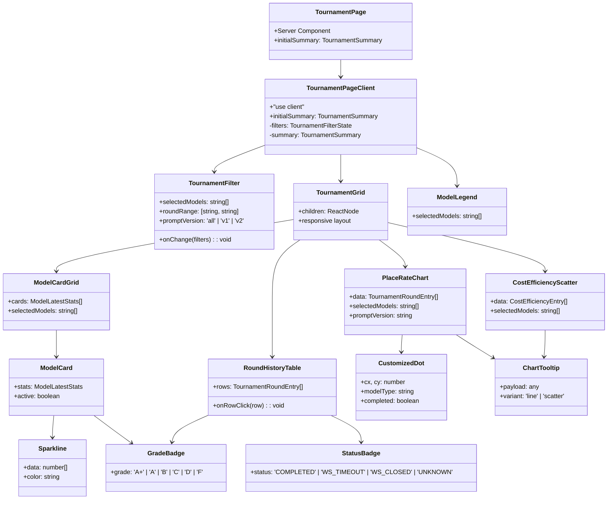

# AI 토너먼트 대시보드 컴포넌트 스펙 (초안)

- **작성일**: 2026-04-12
- **작성자**: designer (UI/UX)
- **기반 문서**: `docs/02-design/23-ai-tournament-dashboard-wireframe.md`
- **대상**: Sprint 6 Frontend Dev 구현 킥오프 (4/13~)
- **상태**: Draft v0.1 — 검토 대기
- **관련 문서**:
  - `docs/02-design/07-ui-wireframe.md` (디자인 토큰 원본)
  - `docs/02-design/13-llm-metrics-schema-design.md` (메트릭 스키마)
  - `docs/02-design/16-ai-character-visual-spec.md` (캐릭터 비주얼)
  - `docs/04-testing/37-3model-round4-tournament-report.md`
  - `docs/04-testing/38-v2-prompt-crossmodel-experiment.md`

---

## 0. 읽기 순서 가이드

이 문서는 Frontend Dev가 **읽고 그대로 구현할 수 있도록** 다음 순서로 구성되어 있다.

1. **1절 스코프** — 이번 스프린트에 포함/제외할 기능 확정
2. **2절 라우트/레이아웃** — Next.js app router에서 어디에 붙일지
3. **3절 컴포넌트 트리** — 전체 그림 (Mermaid classDiagram)
4. **4절 컴포넌트 명세** — Props/state/hook/API/a11y를 컴포넌트별로
5. **5절 타입** — `lib/types.ts`에 추가할 TypeScript 인터페이스
6. **6절 API 계약** — game-server가 구현해야 할 엔드포인트
7. **7~9절 디자인/애니메이션/상태 전환** — 시각 구현 상세
8. **10절 오픈 이슈** — 프론트 구현 착수 전에 결정해야 할 사항

---

## 1. 스코프 & 범위 외

### 1.1 Sprint 6 In-Scope

| # | 기능 | 근거 | 예상 SP |
|---|------|------|---------|
| 1 | `/tournament` 메인 대시보드 (4분할 그리드) | 와이어프레임 4.1 | 2 |
| 2 | TournamentFilter (모델/라운드/프롬프트 필터) | 와이어프레임 5.1 | 1 |
| 3 | PlaceRateChart (라인 차트 + 모델별 마커) | 와이어프레임 5.2 | 2 |
| 4 | CostEfficiencyScatter (산점도) | 와이어프레임 5.3 | 2 |
| 5 | ModelCard x 4 (GPT/Claude/DeepSeek/Ollama) | 와이어프레임 5.4 | 2 |
| 6 | RoundHistoryTable (정렬/행 클릭) | 와이어프레임 5.5 | 2 |
| 7 | ModelLegend (공용 범례) | 와이어프레임 5.6 | 0.5 |
| 8 | API 클라이언트 확장 (`getTournamentSummary`) | 와이어프레임 6.2 | 1 |
| 9 | 반응형 (desktop/tablet/mobile) | 와이어프레임 4.3 | 1 |

**총 13.5 SP**

### 1.2 Out-of-Scope (Sprint 7+)

- 라운드 상세 페이지 `/tournament/[roundId]` — 턴별 타임라인, 누적 곡선, 응답 시간 히스토그램 (와이어프레임 10절)
- 실시간 대전 스트리밍 (WebSocket 구독)
- CSV/PDF 리포트 익스포트
- AI 모델간 직접 대결 H2H 매트릭스
- 사용자 직접 토너먼트 트리거 버튼

### 1.3 결정 사항

- **프로젝트 위치**: `src/admin/` (관리자 대시보드) — `src/frontend/`가 아님
- **Next.js 버전**: 16.1.6 (app router, React 19)
- **차트 라이브러리**: recharts ^3.8.0 (이미 설치됨)
- **스타일**: Tailwind CSS v4 (`@tailwindcss/postcss`)
- **번들링**: 기존 admin 스타일(slate-800/slate-700)과 일관성 유지

---

## 2. 페이지 구조 (Route & Layout)

### 2.1 라우트

```
src/admin/src/app/
├── layout.tsx                    (기존: Sidebar + 메인)
├── page.tsx                      (기존: 대시보드)
├── games/                        (기존)
├── users/                        (기존)
├── stats/                        (기존)
├── rankings/                     (기존)
└── tournament/                   (신규)
    ├── page.tsx                  (메인 4분할 대시보드)
    ├── loading.tsx               (스켈레톤 UI)
    ├── error.tsx                 (에러 fallback)
    └── [roundId]/                (Sprint 7 예정, placeholder만)
        └── page.tsx
```

### 2.2 Next.js app router 규칙

- **Server Component (`page.tsx`)**: 초기 데이터 SSR 페치. `getTournamentSummary()` 호출.
- **Client Component**: 필터 상태, 차트 인터랙션 — `"use client"` 지시어. `TournamentPageClient.tsx`로 분리.
- **Streaming**: `Suspense` + `loading.tsx`로 초기 렌더링 블로킹 최소화.

```tsx
// src/admin/src/app/tournament/page.tsx (Server)
import { getTournamentSummary } from "@/lib/api";
import TournamentPageClient from "@/components/tournament/TournamentPageClient";

export const revalidate = 30; // 30초 ISR

export default async function TournamentPage() {
  const summary = await getTournamentSummary();
  return <TournamentPageClient initialSummary={summary} />;
}
```

### 2.3 사이드바 메뉴 추가

```tsx
// src/admin/src/components/Sidebar.tsx 수정
const NAV_ITEMS: NavItem[] = [
  { href: "/",           label: "대시보드",     icon: "grid" },
  { href: "/games",      label: "활성 게임",    icon: "play" },
  { href: "/users",      label: "유저 목록",    icon: "users" },
  { href: "/stats",      label: "AI 통계",      icon: "bar-chart" },
  { href: "/tournament", label: "토너먼트 결과", icon: "trophy-chart" }, // 신규
  { href: "/rankings",   label: "ELO 랭킹",     icon: "trophy" },
];
```

신규 `trophy-chart` 아이콘 SVG는 기존 `bar-chart` + `trophy`를 조합한 단순 outline.

---

## 3. 컴포넌트 트리



**총 13개 컴포넌트** (TournamentPage + 12 client 컴포넌트)

디렉토리 배치:

```
src/admin/src/components/tournament/
├── TournamentPageClient.tsx       (최상위 client wrapper)
├── TournamentFilter.tsx            (필터 바)
├── TournamentGrid.tsx              (4분할 responsive grid)
├── PlaceRateChart.tsx              (라인 차트)
├── CostEfficiencyScatter.tsx       (산점도)
├── ModelCardGrid.tsx               (카드 그리드 컨테이너)
├── ModelCard.tsx                   (개별 모델 카드)
├── RoundHistoryTable.tsx           (테이블)
├── ModelLegend.tsx                 (공용 범례)
├── shared/
│   ├── CustomizedDot.tsx           (recharts 커스텀 마커)
│   ├── ChartTooltip.tsx            (공통 툴팁)
│   ├── Sparkline.tsx               (모델 카드 내 미니 차트)
│   ├── GradeBadge.tsx              (A+/A/B/C/D/F)
│   └── StatusBadge.tsx             (COMPLETED / WS_* / UNKNOWN)
└── constants.ts                     (MODEL_COLORS, MODEL_MARKERS, GRADE_COLORS)
```

---

## 4. 컴포넌트별 명세

### 4.1 TournamentPageClient

- **경로**: `src/admin/src/components/tournament/TournamentPageClient.tsx`
- **책임**: 필터 상태 관리, 자식 컴포넌트에 필터 결과 전달, URL 쿼리 동기화
- **`"use client"`**: 필수

```typescript
// Props
interface TournamentPageClientProps {
  initialSummary: TournamentSummary;
}

// 내부 state
interface TournamentFilterState {
  selectedModels: ModelType[];          // default: ['openai', 'claude', 'deepseek']
  roundRange: [string, string];          // default: ['R2', 'R4v2']
  promptVersion: 'all' | 'v1' | 'v2';    // default: 'all'
}

// 파생 state (useMemo)
interface DerivedData {
  filteredRounds: TournamentRoundEntry[];
  filteredCostEff: CostEfficiencyEntry[];
  filteredCards: ModelLatestStats[];
}
```

**사용 hook**:
- `useState<TournamentFilterState>` — 필터 상태
- `useMemo` — 필터 적용 파생 데이터 3종
- `useSearchParams` / `useRouter` — URL 쿼리 동기화 (`?models=openai,claude&rounds=R2-R4v2&prompt=v2`)
- `useEffect` — 필터 변경 시 URL 업데이트 (debounce 200ms)

**API 호출**: 없음 (SSR에서 initialSummary 받음, 클라이언트 필터링만)

**ARIA**:
- 전체 페이지: `<main role="main" aria-labelledby="tournament-heading">`
- 영역: `<section aria-label="토너먼트 필터">`, `<section aria-label="성능 차트">` 등

**반응형**:
- 필터 변경 시 차트 리렌더링은 recharts `ResponsiveContainer`가 자동 처리
- 모바일에서는 필터 바를 `<details>` 로 접기

---

### 4.2 TournamentFilter

- **경로**: `src/admin/src/components/tournament/TournamentFilter.tsx`
- **책임**: 필터 UI 렌더링 + 변경 이벤트 상위 전달

```typescript
interface TournamentFilterProps {
  value: TournamentFilterState;
  onChange: (next: TournamentFilterState) => void;
  availableModels?: ModelType[];   // 기본 ['openai', 'claude', 'deepseek', 'ollama']
  availableRounds?: string[];      // 기본 ['R2', 'R3', 'R4', 'R4v2']
}
```

**내부 state**: 없음 (controlled component)

**레이아웃**:
```
+-------------------------------------------------------------+
| Models: [x]GPT [x]Claude [x]DeepSeek [ ]Ollama              |
| Rounds: [R2 ▾] ~ [R4v2 ▾]                                   |
| Prompt: [All][v1][v2]  (segmented control)                  |
+-------------------------------------------------------------+
```

**ARIA**:
- 모델 체크박스: `<label><input type="checkbox" aria-label="GPT-5-mini 표시" /></label>`
- 라운드 드롭다운: `<select aria-label="시작 라운드">`
- 프롬프트 버전 세그먼트: `<div role="radiogroup" aria-label="프롬프트 버전">` + 각 옵션 `role="radio"`

**키보드**:
- Tab 순서: 모델 체크박스 → 라운드 드롭다운 → 프롬프트 세그먼트
- 체크박스 Space 토글, 세그먼트 Arrow 좌우 이동

**반응형**:
- 1280px+: 한 줄 가로 배치
- 768~1279px: 2줄 (Models / Rounds+Prompt)
- ~767px: 3줄, 각 영역 전폭. `<details open>` 으로 접기 가능

---

### 4.3 TournamentGrid

- **경로**: `src/admin/src/components/tournament/TournamentGrid.tsx`
- **책임**: 4분할 responsive 그리드 레이아웃

```typescript
interface TournamentGridProps {
  topLeft: ReactNode;      // PlaceRateChart
  topRight: ReactNode;     // CostEfficiencyScatter
  bottomLeft: ReactNode;   // ModelCardGrid
  bottomRight: ReactNode;  // RoundHistoryTable
}
```

**Tailwind 클래스**:
```tsx
<div className="grid grid-cols-1 lg:grid-cols-2 gap-6 p-6">
  <div className="tournament-card">{topLeft}</div>
  <div className="tournament-card">{topRight}</div>
  <div className="tournament-card">{bottomLeft}</div>
  <div className="tournament-card lg:col-span-1 xl:col-span-1">{bottomRight}</div>
</div>
```

**브레이크포인트**:
| 너비 | 그리드 | 비고 |
|------|--------|------|
| `< 768px` | `grid-cols-1` | 세로 스택 |
| `768~1023px` | `grid-cols-1` | 차트가 너비를 요구해서 1열 유지 |
| `1024~1279px` | `grid-cols-2` | 상단 차트만 2열, 하단도 2열 |
| `1280px+` | `grid-cols-2` | full desktop |

---

### 4.4 PlaceRateChart

- **경로**: `src/admin/src/components/tournament/PlaceRateChart.tsx`
- **책임**: 라운드별 모델별 Place Rate 추이를 라인 차트로 표시

```typescript
interface PlaceRateChartProps {
  data: TournamentRoundEntry[];      // 필터 적용 후 데이터
  selectedModels: ModelType[];
  promptVersion: 'all' | 'v1' | 'v2';
  height?: number;                    // default 360 (desktop), 300 (tablet), 240 (mobile)
}
```

**내부 구현**:
- `recharts <LineChart>` 사용
- X축: `round` (category), Y축: `placeRate` (0~50)
- 모델별로 `<Line dataKey="placeRate" stroke={MODEL_COLORS[model]} />` 분리 렌더
- v1/v2 프롬프트 구분: `strokeDasharray="8 4"` (v1) vs `strokeDasharray="none"` (v2)
- 커스텀 마커: `<CustomizedDot>` (색약 보조)
- `<Tooltip content={<ChartTooltip variant="line" />} />`

**데이터 변환**:
```typescript
// TournamentRoundEntry[] → recharts 데이터 shape
// X: round, Y: { gpt: 30.8, claude: 33.3, deepseek: 17.9 }
function pivotData(rows: TournamentRoundEntry[]): PivotRow[] {
  const byRound = new Map<string, PivotRow>();
  for (const row of rows) {
    const key = `${row.round}-${row.promptVersion}`;
    if (!byRound.has(key)) {
      byRound.set(key, { round: key, __v: row.promptVersion });
    }
    byRound.get(key)![row.modelType] = row.placeRate;
    byRound.get(key)![`${row.modelType}_completed`] = row.completed;
  }
  return Array.from(byRound.values());
}
```

**Loading state**: `<div className="h-72 animate-pulse bg-slate-700 rounded" />`

**ARIA**:
- `<figure role="img" aria-labelledby="place-rate-title" aria-describedby="place-rate-desc">`
- `<figcaption id="place-rate-title">Place Rate 추이</figcaption>`
- `<p id="place-rate-desc" className="sr-only">` 로 스크린 리더용 텍스트 요약 ("GPT 30.8%, Claude 33.3%, DeepSeek 17.9% — R4v2 기준")
- 또는 `sr-only` 테이블로 동일 데이터 제공 (Grade AAA)

**호버 툴팁 내용** (와이어프레임 7.2):
```
DeepSeek Reasoner
Round 4 (v1)
───────────────────
Place Rate: 30.8%
Place / Draw: 12 / 27
총 타일: 32
상태: 80턴 완주
등급: A+
```

---

### 4.5 CostEfficiencyScatter

- **경로**: `src/admin/src/components/tournament/CostEfficiencyScatter.tsx`
- **책임**: 비용 vs 성능 산점도 (버블 크기 = 배치 타일 수)

```typescript
interface CostEfficiencyScatterProps {
  data: CostEfficiencyEntry[];
  selectedModels: ModelType[];
  height?: number;
}
```

**내부 구현**:
- `recharts <ScatterChart>` + `<ZAxis range={[64, 1600]}>` (버블 크기 범위)
- X축: `costPerGame` ($), Y축: `placeRate` (%), Z축: `totalTilesPlaced`
- 모델별 별도 `<Scatter>` 컴포넌트로 분리하여 색상/마커 다르게
- 4사분면 배경 오버레이: `<ReferenceArea>` (좌상 연한 녹색, 우하 연한 빨강)

**4사분면 기준선**:
- X 중앙값: `$1.0` (cost median)
- Y 중앙값: `25%` (rate median)
- `<ReferenceLine x={1.0} stroke="#475569" strokeDasharray="3 3" />`
- `<ReferenceLine y={25} stroke="#475569" strokeDasharray="3 3" />`

**호버 툴팁** (와이어프레임 7.2):
```
Claude Sonnet 4
Round 4 v2
───────────────────
Place Rate: 33.3%
게임 비용: $2.22
배치 타일: 26개
Place/$: 4.5
```

**ARIA**: PlaceRateChart와 동일 패턴 (figure + figcaption + sr-only)

---

### 4.6 ModelCardGrid & ModelCard

- **경로**: `src/admin/src/components/tournament/ModelCardGrid.tsx`, `ModelCard.tsx`

```typescript
interface ModelCardGridProps {
  cards: ModelLatestStats[];
  selectedModels: ModelType[];
}

interface ModelCardProps {
  stats: ModelLatestStats;
  active: boolean;   // 필터에서 선택 여부
}
```

**ModelCardGrid 레이아웃**:
- Desktop: `grid-cols-4 gap-4`
- Tablet: `grid-cols-2 gap-3`
- Mobile: 가로 스와이프 캐러셀 (`overflow-x-auto snap-x snap-mandatory`)

**ModelCard 내부 구조**:
```tsx
<article
  className={`relative bg-slate-800 border border-slate-700 rounded-lg p-5
             ${active ? '' : 'opacity-40 grayscale'}`}
  aria-label={`${stats.modelName} 모델 카드`}
>
  {/* 상단 색상 바 */}
  <div
    className="absolute top-0 left-0 right-0 h-1 rounded-t-lg"
    style={{ backgroundColor: MODEL_COLORS[stats.modelType] }}
  />
  {/* 헤더: 마커 아이콘 + 모델명 + 등급 배지 */}
  <header className="flex items-center justify-between mb-3">
    <div className="flex items-center gap-2">
      <ModelMarkerIcon type={stats.modelType} />
      <h3 className="text-sm font-semibold text-slate-200">{stats.modelName}</h3>
    </div>
    <GradeBadge grade={stats.grade} />
  </header>

  {/* 주 지표 */}
  <div className="mb-4">
    <p className="text-4xl font-bold text-white tabular-nums">
      {stats.latestRate.toFixed(1)}%
    </p>
    <p className="text-xs text-slate-400 mt-1">최신 Place Rate ({stats.latestRound})</p>
  </div>

  {/* 스파크라인 */}
  <Sparkline data={stats.sparkline} color={MODEL_COLORS[stats.modelType]} />

  {/* 보조 지표 3종 */}
  <dl className="grid grid-cols-3 gap-2 mt-4 text-center">
    <div>
      <dt className="text-xs text-slate-500">응답 시간</dt>
      <dd className="text-sm font-medium text-slate-200 tabular-nums">
        {stats.avgResponseTimeSec.toFixed(1)}s
      </dd>
    </div>
    <div>
      <dt className="text-xs text-slate-500">비용/턴</dt>
      <dd className="text-sm font-medium text-slate-200 tabular-nums">
        ${stats.costPerTurn.toFixed(3)}
      </dd>
    </div>
    <div>
      <dt className="text-xs text-slate-500">총 타일</dt>
      <dd className="text-sm font-medium text-slate-200 tabular-nums">
        {stats.totalTilesPlaced}
      </dd>
    </div>
  </dl>

  {/* 배지 */}
  <footer className="flex gap-2 mt-4">
    <StatusBadge status={stats.completed ? 'COMPLETED' : 'WS_TIMEOUT'} />
    <span className="text-xs px-2 py-1 rounded bg-slate-700 text-slate-300">
      {stats.promptVersion} 프롬프트
    </span>
  </footer>
</article>
```

**ARIA**:
- `<article aria-label>`
- 주 지표: `<p aria-label="최신 Place Rate 30.8 퍼센트">`
- `<dl>` 사용으로 지표-값 의미 명확화

---

### 4.7 Sparkline

- **경로**: `src/admin/src/components/tournament/shared/Sparkline.tsx`
- **책임**: 4개 포인트 이하의 초소형 라인 차트 (카드 내부용)

```typescript
interface SparklineProps {
  data: (number | null)[];           // null은 데이터 없음
  color: string;
  width?: number;                     // default 200
  height?: number;                    // default 40
  showFill?: boolean;                 // default true
}
```

**구현 방법**:
- recharts 오버헤드가 크므로 **순수 SVG path**로 직접 구현
- null 값은 라인을 끊고 gap 표시
- `<path fill={color} fillOpacity={0.1} d="..." />` 로 면적 채우기

```tsx
// 예시 path 생성 로직
function buildPath(data: (number | null)[], w: number, h: number): string {
  const max = Math.max(...data.filter((v): v is number => v !== null));
  const step = w / (data.length - 1);
  let d = '';
  data.forEach((v, i) => {
    if (v === null) { d += ' M'; return; }
    const x = i * step;
    const y = h - (v / max) * h;
    d += (d === '' || d.endsWith('M')) ? `M ${x} ${y}` : ` L ${x} ${y}`;
  });
  return d;
}
```

---

### 4.8 RoundHistoryTable

- **경로**: `src/admin/src/components/tournament/RoundHistoryTable.tsx`

```typescript
interface RoundHistoryTableProps {
  rows: TournamentRoundEntry[];
  onRowClick?: (row: TournamentRoundEntry) => void;
  initialSort?: { key: keyof TournamentRoundEntry; dir: 'asc' | 'desc' };
}

interface SortState {
  key: keyof TournamentRoundEntry;
  dir: 'asc' | 'desc';
}
```

**내부 state**:
- `useState<SortState>({ key: 'round', dir: 'desc' })`
- `useMemo` — 정렬된 rows

**컬럼 정의** (와이어프레임 5.5):

| # | 헤더 | 키 | 너비 | 정렬 | 셀 렌더 |
|---|------|-----|------|------|---------|
| 1 | 라운드 | `round` | 80px | O | 텍스트 (R4v2 등) |
| 2 | 모델 | `modelType` | 140px | O | `<ModelDot>` + 모델명 |
| 3 | Rate | `placeRate` | 70px | O | 조건부 색상 (>=30% 녹, >=20% 노, <20% 빨) |
| 4 | Place/Draw | `placeCount` | 90px | O | "12P / 27D" |
| 5 | 비용 | `totalCost` | 80px | O | `$0.04` |
| 6 | 응답시간 | `avgResponseTimeSec` | 80px | O | `64.6s` |
| 7 | 상태 | `status` | 100px | O | `<StatusBadge>` |

**정렬 인터랙션**:
- 헤더 버튼 클릭 → 같은 키면 dir 토글, 다른 키면 새 키 + `desc`
- 정렬 상태 표시: `aria-sort="ascending" / "descending" / "none"`
- 정렬 아이콘: `▲ / ▼ / -` (tailwind `after:`)

**행 클릭**:
- 행 전체가 `<button>` 또는 `<tr role="button" tabIndex={0}>`
- Enter/Space 키보드 접근
- `onClick={() => onRowClick?.(row)}`
- Sprint 6에서는 `onRowClick`이 alert 또는 비활성 (라운드 상세 페이지는 Sprint 7)

**ARIA**:
```tsx
<table aria-label="라운드 히스토리 테이블">
  <caption className="sr-only">
    모델별 라운드별 Place Rate와 비용 기록. 헤더 클릭으로 정렬.
  </caption>
  <thead>
    <tr>
      <th
        scope="col"
        aria-sort={sort.key === 'round' ? sort.dir === 'asc' ? 'ascending' : 'descending' : 'none'}
      >
        <button onClick={() => toggleSort('round')}>라운드</button>
      </th>
    </tr>
  </thead>
</table>
```

**반응형**:
- Desktop: 전체 7컬럼 표시
- Tablet: Place/Draw, 응답시간 숨김 (`hidden md:table-cell`)
- Mobile: 테이블을 카드 리스트로 변환 (`<ul>` + flex)

---

### 4.9 ModelLegend

- **경로**: `src/admin/src/components/tournament/ModelLegend.tsx`

```typescript
interface ModelLegendProps {
  selectedModels: ModelType[];
  showPromptVersion?: boolean;  // default true
  showCompletion?: boolean;     // default true
}
```

**렌더 내용** (와이어프레임 5.6):
```
⬤ GPT-5-mini    ▣ Claude Sonnet 4    △ DeepSeek Reasoner    ◆ Ollama qwen2.5:3b
--- v1 프롬프트   ___ v2 프롬프트      ○ 미완주              ● 완주
```

**구현**:
```tsx
<div
  role="group"
  aria-label="차트 범례"
  className="flex flex-wrap items-center gap-4 text-xs text-slate-400"
>
  {ACTIVE_MODELS.map(m => (
    <span key={m} className="flex items-center gap-1.5">
      <ModelMarkerIcon type={m} />
      <span>{MODEL_NAMES[m]}</span>
    </span>
  ))}
</div>
```

---

### 4.10 공용 컴포넌트

#### 4.10.1 CustomizedDot
- **경로**: `src/admin/src/components/tournament/shared/CustomizedDot.tsx`
- recharts `<Line dot={<CustomizedDot />} />` 용
- 와이어프레임 11.1절 코드 그대로 사용

```typescript
interface CustomizedDotProps {
  cx?: number;
  cy?: number;
  payload?: {
    modelType: ModelType;
    [model: `${string}_completed`]: boolean;
  };
  dataKey?: string;  // 현재 라인의 모델 타입
}
```

#### 4.10.2 ChartTooltip
- **경로**: `src/admin/src/components/tournament/shared/ChartTooltip.tsx`

```typescript
interface ChartTooltipProps {
  active?: boolean;
  payload?: Array<{ name: string; value: number; payload: any }>;
  label?: string;
  variant: 'line' | 'scatter';
}
```

#### 4.10.3 GradeBadge

```typescript
interface GradeBadgeProps {
  grade: 'A+' | 'A' | 'B' | 'C' | 'D' | 'F';
}

const GRADE_STYLES: Record<string, string> = {
  'A+': 'bg-emerald-500/15 text-emerald-400 border-emerald-500/30',
  'A':  'bg-emerald-500/15 text-emerald-400 border-emerald-500/30',
  'B':  'bg-yellow-500/15 text-yellow-400 border-yellow-500/30',
  'C':  'bg-orange-500/15 text-orange-400 border-orange-500/30',
  'D':  'bg-red-500/15 text-red-400 border-red-500/30',
  'F':  'bg-slate-500/15 text-slate-400 border-slate-500/30',
};
```

#### 4.10.4 StatusBadge

```typescript
interface StatusBadgeProps {
  status: 'COMPLETED' | 'WS_TIMEOUT' | 'WS_CLOSED' | 'UNKNOWN';
  turnCount?: number;  // WS_* 상태에서 "(62턴)" 표시
}
```

---

## 5. 데이터 모델 (TypeScript 타입)

`src/admin/src/lib/types.ts`에 추가할 타입 정의.

```typescript
// ------------------------------------------------------------------
// AI 토너먼트 대시보드 타입
// ------------------------------------------------------------------

/** 지원 모델 타입 (기존 PlayerType에서 HUMAN 제외) */
export type ModelType = 'openai' | 'claude' | 'deepseek' | 'ollama';

/** 프롬프트 버전 */
export type PromptVersion = 'v1' | 'v2' | 'v3';

/** 대전 상태 */
export type TournamentStatus =
  | 'COMPLETED'    // 80턴 완주
  | 'WS_TIMEOUT'   // WebSocket 타임아웃
  | 'WS_CLOSED'    // WebSocket 연결 종료
  | 'UNKNOWN';     // 측정 불가

/** 등급 */
export type ModelGrade = 'A+' | 'A' | 'B' | 'C' | 'D' | 'F';

/**
 * 단일 라운드 x 모델 결과 엔트리
 * PlaceRateChart, RoundHistoryTable 공통 사용
 */
export interface TournamentRoundEntry {
  /** 'R2' | 'R3' | 'R4' | 'R4v2' 등 */
  round: string;
  promptVersion: PromptVersion;
  modelType: ModelType;
  modelName: string;            // 'GPT-5-mini' 등
  placeRate: number;            // 0~100
  placeCount: number;           // 배치 횟수
  drawCount: number;            // 드로우 횟수
  totalTiles: number;           // 배치된 총 타일 수
  totalTurns: number;           // 진행된 총 턴 수
  completed: boolean;           // 80턴 완주 여부
  status: TournamentStatus;
  totalCost: number;            // 게임당 총 비용 ($)
  avgResponseTimeSec: number;
  p50ResponseTimeSec: number;
  minResponseTimeSec: number;
  maxResponseTimeSec: number;
  grade: ModelGrade;
}

/**
 * CostEfficiencyScatter 전용 (산점도 1점)
 */
export interface CostEfficiencyEntry {
  modelType: ModelType;
  modelName: string;
  round: string;
  promptVersion: PromptVersion;
  costPerGame: number;          // X축
  placeRate: number;            // Y축
  totalTilesPlaced: number;     // Z축 (버블 크기)
  placePerDollar: number;       // 툴팁 표시용 파생값
}

/**
 * ModelCard 전용 (최신 라운드 기준)
 */
export interface ModelLatestStats {
  modelType: ModelType;
  modelName: string;
  latestRound: string;
  latestRate: number;
  grade: ModelGrade;
  avgResponseTimeSec: number;
  costPerTurn: number;
  totalTilesPlaced: number;
  completed: boolean;
  promptVersion: PromptVersion;
  /**
   * 라운드별 Place Rate 시계열 (R2→R3→R4→R4v2 순)
   * 데이터 없음은 null
   */
  sparkline: (number | null)[];
}

/**
 * 토너먼트 전체 요약 (GET /admin/stats/ai/tournament 응답)
 */
export interface TournamentSummary {
  rounds: TournamentRoundEntry[];
  modelStats: ModelLatestStats[];
  costEfficiency: CostEfficiencyEntry[];
  /** ISO8601, 데이터 집계 시각 */
  lastUpdated: string;
  /** 전체 대전 횟수 */
  totalBattles: number;
  /** 총 누적 비용 */
  totalCostUsd: number;
}

/**
 * 필터 상태 (URL 쿼리 동기화 대상)
 */
export interface TournamentFilterState {
  selectedModels: ModelType[];
  roundRange: [string, string];
  promptVersion: 'all' | PromptVersion;
}

/**
 * 기본 필터 값
 */
export const DEFAULT_TOURNAMENT_FILTER: TournamentFilterState = {
  selectedModels: ['openai', 'claude', 'deepseek'],
  roundRange: ['R2', 'R4v2'],
  promptVersion: 'all',
};

/**
 * Empty fallback (API 실패 시)
 */
export const EMPTY_TOURNAMENT: TournamentSummary = {
  rounds: [],
  modelStats: [],
  costEfficiency: [],
  lastUpdated: new Date(0).toISOString(),
  totalBattles: 0,
  totalCostUsd: 0,
};
```

---

## 6. API 계약 (Game Server REST)

### 6.1 엔드포인트 목록

| # | 메서드 | 경로 | 용도 | 응답 타입 |
|---|--------|------|------|-----------|
| 1 | GET | `/admin/stats/ai/tournament` | 토너먼트 전체 요약 | `TournamentSummary` |
| 2 | GET | `/admin/stats/ai/tournament/rounds` | 라운드 목록 | `TournamentRoundEntry[]` |
| 3 | GET | `/admin/stats/ai/tournament/models` | 모델 최신 통계 | `ModelLatestStats[]` |
| 4 | GET | `/admin/stats/ai/tournament/cost-efficiency` | 비용 효율성 | `CostEfficiencyEntry[]` |
| 5 | GET | `/admin/stats/ai/tournament/:roundId` | 라운드 상세 | (Sprint 7) |

**MVP는 1번 엔드포인트 1개만**. 2~4는 1번의 서브셋. 1번 응답 캐시로 충분.

### 6.2 엔드포인트 #1 상세

**GET `/admin/stats/ai/tournament`**

**Query params** (옵셔널, 서버 사이드 필터링):
- `models=openai,claude,deepseek` (CSV)
- `rounds=R2-R4v2`
- `prompt=all|v1|v2`

**Response body** (200 OK):
```json
{
  "rounds": [
    {
      "round": "R4v2",
      "promptVersion": "v2",
      "modelType": "openai",
      "modelName": "GPT-5-mini",
      "placeRate": 30.8,
      "placeCount": 12,
      "drawCount": 27,
      "totalTiles": 29,
      "totalTurns": 80,
      "completed": true,
      "status": "COMPLETED",
      "totalCost": 0.975,
      "avgResponseTimeSec": 64.6,
      "p50ResponseTimeSec": 61.2,
      "minResponseTimeSec": 12.4,
      "maxResponseTimeSec": 240.0,
      "grade": "A+"
    }
    // ... 더 많은 라운드
  ],
  "modelStats": [
    {
      "modelType": "openai",
      "modelName": "GPT-5-mini",
      "latestRound": "R4v2",
      "latestRate": 30.8,
      "grade": "A+",
      "avgResponseTimeSec": 64.6,
      "costPerTurn": 0.025,
      "totalTilesPlaced": 29,
      "completed": true,
      "promptVersion": "v2",
      "sparkline": [28.0, null, 33.3, 30.8]
    }
  ],
  "costEfficiency": [
    {
      "modelType": "openai",
      "modelName": "GPT-5-mini",
      "round": "R4v2",
      "promptVersion": "v2",
      "costPerGame": 0.975,
      "placeRate": 30.8,
      "totalTilesPlaced": 29,
      "placePerDollar": 31.6
    }
  ],
  "lastUpdated": "2026-04-11T23:30:00+09:00",
  "totalBattles": 11,
  "totalCostUsd": 10.47
}
```

**Error cases**:
- `401 Unauthorized` — 관리자 토큰 누락/만료
- `500 Internal Server Error` — DB 조회 실패 → 프론트는 `EMPTY_TOURNAMENT` fallback

**캐시 전략**:
- `Cache-Control: public, max-age=30` (game-server)
- Next.js `revalidate: 30` (ISR)
- 30초 내 재조회는 Redis 캐시 (`tournament:summary`)

### 6.3 API 클라이언트 확장

`src/admin/src/lib/api.ts`에 추가:

```typescript
import type {
  TournamentSummary,
  TournamentFilterState,
} from "./types";
import { EMPTY_TOURNAMENT } from "./types";

export async function getTournamentSummary(
  filter?: Partial<TournamentFilterState>
): Promise<TournamentSummary> {
  const params = new URLSearchParams();
  if (filter?.selectedModels?.length) {
    params.set("models", filter.selectedModels.join(","));
  }
  if (filter?.roundRange) {
    params.set("rounds", `${filter.roundRange[0]}-${filter.roundRange[1]}`);
  }
  if (filter?.promptVersion && filter.promptVersion !== "all") {
    params.set("prompt", filter.promptVersion);
  }
  const qs = params.toString();
  const path = `/admin/stats/ai/tournament${qs ? `?${qs}` : ""}`;
  return fetchApi<TournamentSummary>(path, EMPTY_TOURNAMENT);
}
```

---

## 7. 디자인 토큰

### 7.1 루미큐브 4색 (모델 매핑)

와이어프레임 2.1절의 기존 매핑 그대로 사용.

```css
:root {
  /* 모델 주색상 (루미큐브 타일 4색 재활용) */
  --model-openai:   #E74C3C;  /* Red = GPT */
  --model-claude:   #3498DB;  /* Blue = Claude */
  --model-deepseek: #F1C40F;  /* Yellow = DeepSeek */
  --model-ollama:   #7F8C8D;  /* Gray (Black 계열에서 대비 조정) */

  /* 모델 보조색상 (차트 그라데이션, 호버 배경) */
  --model-openai-light:   #FF6B6B;
  --model-claude-light:   #5DADE2;
  --model-deepseek-light: #F7DC6F;
  --model-ollama-light:   #BDC3C7;
}
```

### 7.2 한복 팔레트 응용 (액센트/배경)

관리자 대시보드에 차분한 동양적 정체성을 부여. 루미큐브 4색이 게임 지표용이라면, 한복 팔레트는 **페이지 프레임/섹션 구분자**에 사용한다.

| 색상명 | HEX | 용도 | 적용 영역 |
|--------|-----|------|-----------|
| 자색(紫) | `#5B3A7C` | 헤더 상단 배경 (상위 네비게이션 힌트) | `<header>` 그라데이션 |
| 옥색(玉) | `#6BA892` | "완주" 성공 배지 (기존 emerald 대체 옵션) | GradeBadge A+/A, StatusBadge COMPLETED |
| 홍색(紅) | `#A83C3C` | 경고/위험 영역 (WS_CLOSED, F 등급) | StatusBadge WS_CLOSED, 산점도 우하 사분면 |
| 미색(米) | `#F5EBDC` | 인쇄/리포트 모드 배경 (Sprint 7+) | PDF export 시 배경 |
| 청자(靑磁) | `#8FB9AA` | 산점도 "효율 영역" 배경 오버레이 | ReferenceArea 좌상 |

```css
:root {
  /* 한복 팔레트 */
  --hanbok-ja:      #5B3A7C;  /* 자색 */
  --hanbok-ok:      #6BA892;  /* 옥색 */
  --hanbok-hong:    #A83C3C;  /* 홍색 */
  --hanbok-mi:      #F5EBDC;  /* 미색 */
  --hanbok-cheongja: #8FB9AA; /* 청자 */
}
```

**적용 원칙**:
- 루미큐브 4색은 "모델"을 나타냄 (데이터)
- 한복 팔레트는 "UI 프레임과 상태"를 나타냄 (시스템)
- 두 색 체계가 겹치지 않도록 분리하여 시각적 혼란 방지

### 7.3 중성톤 (기존 admin 스타일 준수)

| 용도 | Tailwind class | HEX |
|------|----------------|-----|
| 페이지 배경 | `bg-slate-900` | `#0F172A` |
| 카드 배경 | `bg-slate-800` | `#1E293B` |
| 카드 테두리 | `border-slate-700` | `#334155` |
| 본문 텍스트 | `text-slate-200` | `#E2E8F0` |
| 보조 텍스트 | `text-slate-400` | `#94A3B8` |
| 비활성 텍스트 | `text-slate-500` | `#64748B` |
| 차트 그리드 | `stroke-slate-700` | `#334155` |

### 7.4 타이포그래피

```css
:root {
  /* 한글 최적화 */
  --font-sans: 'Pretendard Variable', 'Pretendard', -apple-system,
               'Apple SD Gothic Neo', 'Noto Sans KR', sans-serif;
  /* 숫자 전용 (tabular-nums 강화) */
  --font-mono: 'JetBrains Mono', 'D2Coding', Consolas, monospace;
}

/* 한글 단어 보존 */
.tournament-content {
  word-break: keep-all;
  overflow-wrap: break-word;
  line-height: 1.7;
  letter-spacing: -0.01em;
}

/* 숫자 정렬 (카드 지표, 테이블 숫자) */
.metric-number {
  font-variant-numeric: tabular-nums;
  font-family: var(--font-sans);  /* Pretendard도 tabular 지원 */
  font-feature-settings: 'tnum';
}
```

**Type Scale**:
| 요소 | 크기 | Tailwind | 용도 |
|------|------|----------|------|
| 페이지 제목 | 24px/1.3 | `text-2xl font-bold` | `<h1>토너먼트 결과</h1>` |
| 카드 제목 | 14px/1.5 | `text-sm font-semibold uppercase tracking-wide` | PlaceRateChart 등 카드 헤더 |
| 카드 내 주 지표 | 36px/1.1 | `text-4xl font-bold` | ModelCard의 30.8% |
| 본문 | 14px/1.7 | `text-sm` | 설명문, 툴팁 |
| 보조 | 12px/1.5 | `text-xs` | 지표 라벨, 범례 |

### 7.5 간격 / Radius / Shadow

```css
:root {
  /* 간격 (Tailwind 기본값 활용) */
  --space-card-padding: 1.25rem;   /* p-5 */
  --space-grid-gap: 1.5rem;        /* gap-6 */
  --space-section: 2rem;           /* my-8 */

  /* Radius */
  --radius-card: 0.5rem;           /* rounded-lg */
  --radius-badge: 9999px;          /* rounded-full */
  --radius-button: 0.375rem;       /* rounded-md */

  /* Shadow (다크 모드 - 밝기로 깊이 표현) */
  --shadow-card: 0 0 0 1px rgba(51, 65, 85, 0.5);
  --shadow-card-hover: 0 0 0 1px rgba(100, 116, 139, 0.8);
  --shadow-tooltip: 0 10px 25px -5px rgba(0, 0, 0, 0.5);
}
```

---

## 8. 애니메이션 (Framer Motion)

### 8.1 사용 원칙

- **의미 있는 모션만**: 로딩, 상태 전환, 사용자 피드백
- **`prefers-reduced-motion` 지원 필수**: 모션 민감 사용자는 애니메이션 생략
- **타이밍 일관성**: 0.2s (fast), 0.3s (normal), 0.5s (slow)

### 8.2 구체 사용 케이스

#### 8.2.1 ModelCard 초기 로드 (stagger)

```tsx
import { motion } from 'framer-motion';

const container = {
  hidden: { opacity: 0 },
  show: {
    opacity: 1,
    transition: { staggerChildren: 0.08 }
  }
};
const item = {
  hidden: { opacity: 0, y: 12 },
  show: {
    opacity: 1,
    y: 0,
    transition: { duration: 0.3, ease: [0.4, 0, 0.2, 1] }
  }
};

<motion.div variants={container} initial="hidden" animate="show">
  {cards.map(c => <motion.div key={c.modelType} variants={item}><ModelCard ... /></motion.div>)}
</motion.div>
```

#### 8.2.2 PlaceRateChart 라인 그리기

- recharts의 기본 `animationDuration={800}` + `animationEasing="ease-out"` 사용
- 별도 Framer Motion 불필요

#### 8.2.3 리더보드 순위 교체 (Sprint 7, 실시간 업데이트 시)

```tsx
<motion.tr
  layout
  transition={{ type: 'spring', stiffness: 350, damping: 25 }}
/>
```

#### 8.2.4 툴팁 fade-in

```tsx
<motion.div
  initial={{ opacity: 0, y: 4 }}
  animate={{ opacity: 1, y: 0 }}
  exit={{ opacity: 0, y: 4 }}
  transition={{ duration: 0.15 }}
/>
```

#### 8.2.5 점수 증가 애니메이션 (ModelCard 주 지표)

- 0 → 실제 rate로 숫자 카운트업 (`useMotionValue` + `useTransform`)
- 600ms, `ease-out`

```tsx
import { animate, useMotionValue, useTransform } from 'framer-motion';

function AnimatedRate({ value }: { value: number }) {
  const count = useMotionValue(0);
  const rounded = useTransform(count, latest => `${latest.toFixed(1)}%`);

  useEffect(() => {
    const controls = animate(count, value, { duration: 0.6, ease: 'easeOut' });
    return controls.stop;
  }, [value]);

  return <motion.p className="text-4xl font-bold">{rounded}</motion.p>;
}
```

### 8.3 Reduced Motion 대응

```tsx
import { useReducedMotion } from 'framer-motion';

function ModelCard({ stats }: ModelCardProps) {
  const reduce = useReducedMotion();
  const variants = reduce
    ? { hidden: { opacity: 1 }, show: { opacity: 1 } }  // 애니메이션 생략
    : fullVariants;
  // ...
}
```

**참고**: admin 프로젝트는 현재 `framer-motion` 미설치.
- **설치 필요**: `npm install framer-motion` (package.json 수정)
- 또는 CSS `@keyframes` + `@media (prefers-reduced-motion: reduce)`로 대체 가능
- **결정 필요**: 10절 오픈 이슈 #3 참조

---

## 9. 상태 전환 (loading / empty / error / live)

각 컴포넌트는 다음 4가지 상태를 처리해야 한다.

### 9.1 Loading

| 컴포넌트 | 로딩 UI |
|----------|---------|
| 페이지 전체 | `loading.tsx` — 전체 4분할 스켈레톤 |
| PlaceRateChart | `h-72 animate-pulse bg-slate-700 rounded` |
| CostEfficiencyScatter | 동일 |
| ModelCardGrid | 4개 카드 모두 `animate-pulse` |
| RoundHistoryTable | 5개 행 스켈레톤 |

**`loading.tsx`** (Next.js Suspense fallback):
```tsx
// src/admin/src/app/tournament/loading.tsx
export default function Loading() {
  return (
    <div className="p-6 space-y-6">
      <div className="h-14 bg-slate-800 rounded animate-pulse" />
      <div className="grid grid-cols-1 lg:grid-cols-2 gap-6">
        {[0, 1, 2, 3].map(i => (
          <div key={i} className="h-80 bg-slate-800 rounded-lg animate-pulse" />
        ))}
      </div>
    </div>
  );
}
```

### 9.2 Empty (데이터 없음)

필터 결과가 비어 있을 때.

```tsx
<div className="flex flex-col items-center justify-center h-64 text-slate-400">
  <svg className="w-12 h-12 mb-3 opacity-50">...</svg>
  <p className="text-sm">선택한 조건에 해당하는 데이터가 없습니다.</p>
  <button
    onClick={() => onResetFilter()}
    className="mt-3 text-xs text-sky-400 hover:text-sky-300"
  >
    필터 초기화
  </button>
</div>
```

### 9.3 Error

API 실패 또는 클라이언트 에러.

- **Server error** (`/tournament/error.tsx`): Next.js error boundary
  ```tsx
  'use client';
  export default function Error({ error, reset }: { error: Error; reset: () => void }) {
    return (
      <div className="p-8 text-center">
        <h2 className="text-xl font-bold text-red-400 mb-2">데이터 로드 실패</h2>
        <p className="text-sm text-slate-400 mb-4">{error.message}</p>
        <button onClick={reset} className="px-4 py-2 bg-slate-700 rounded">
          재시도
        </button>
      </div>
    );
  }
  ```

- **Client partial error** (예: 차트 1개만 실패): 개별 카드 내 경고 UI + "재시도" 버튼

### 9.4 Live (실시간 업데이트)

Sprint 6 In-Scope 아님. 30초 ISR로 준라이브 제공.

Sprint 7 확장:
- WebSocket 구독 (`/ws/admin/tournament`)
- 새 라운드 완료 시 브라우저 알림 + 카드에 "NEW" 배지
- 순위 변경 시 테이블 행 layout 애니메이션

---

## 10. 오픈 이슈 (Frontend Dev 결정 필요)

### #1 `src/admin/` vs `src/frontend/` 위치 확정

**배경**: 와이어프레임 3.2절은 `src/admin/src/app/tournament/`를 지정하고 있으며, 기존 admin이 recharts를 이미 사용 중이다. 하지만 frontend 프로젝트도 `src/frontend/src/components/rankings/` 등을 보유하고 있어 일관성이 필요.

**질문**: 관리자 전용인가? 일반 유저도 볼 수 있게 `src/frontend/`에도 만드는가?

**Designer 권고**: **`src/admin/`만** 에 배치 (Sprint 6).
- Sprint 7에서 `src/frontend/rankings`에 요약 위젯만 추가 (ELO 랭킹 옆)
- 근거: 초기 목적은 LLM 성능 디버깅이며, 일반 유저에게는 "AI vs Human" 토너먼트가 준비된 후 공개

---

### #2 recharts 3.x vs 기존 admin 버전

**현재**: `src/admin/package.json`에 `"recharts": "^3.8.0"` 설치됨. React 19.2 호환.

**확인 필요**: recharts 3.x에서 `ZAxis` (버블 크기)와 `ReferenceArea`가 SSR 호환인지? Server Component에서 import하면 에러 발생 가능.

**권고**: 모든 차트 컴포넌트에 `"use client"` 지시어 추가. TournamentPage (server)에서 동적 import:
```tsx
import dynamic from 'next/dynamic';
const PlaceRateChart = dynamic(
  () => import('@/components/tournament/PlaceRateChart'),
  { ssr: false, loading: () => <ChartSkeleton /> }
);
```

---

### #3 framer-motion 설치 여부

**현재**: admin `package.json`에 framer-motion 미설치. frontend는 `^11.18.2` 설치됨.

**옵션 A**: admin에 framer-motion 추가 (번들 +30KB)
**옵션 B**: CSS `@keyframes` + Tailwind `animate-*`로 구현 (번들 증가 없음, 레이아웃 애니메이션 제한)
**옵션 C**: `framer-motion` 대신 `motion` 미니 빌드 사용 (React 19 호환 확인 필요)

**Designer 권고**: **옵션 A**. ModelCard stagger, 점수 카운트업, 툴팁 등 여러 군데에 사용. 30KB는 gzip 후 ~12KB로 감당 가능.

---

### #4 모바일 테이블 전환 방식

**배경**: RoundHistoryTable은 desktop에서 7컬럼이지만, 모바일에서는 화면에 맞지 않음.

**옵션 A**: 가로 스크롤 테이블 (`overflow-x-auto`) — 간단하지만 UX 나쁨
**옵션 B**: 카드 리스트로 변환 (`hidden md:table` / `md:hidden` 분기) — 구현 비용 높음
**옵션 C**: 주요 컬럼만 표시 + 행 탭으로 상세 펼치기 (`<details>`) — 권장

**Designer 권고**: **옵션 C**. 모바일에서 라운드/모델/Rate/상태 4개만 표시하고, 나머지는 `<details>`로 접기.

---

### #5 URL 쿼리 인코딩 규칙

**배경**: 필터 상태를 URL에 동기화할 때 인코딩 스키마 결정.

**옵션 A**: CSV — `?models=openai,claude&rounds=R2-R4v2&prompt=v2`
**옵션 B**: JSON (base64) — `?f=eyJtb2RlbHMiOlsib3BlbmFpIl19`
**옵션 C**: 반복 파라미터 — `?model=openai&model=claude`

**Designer 권고**: **옵션 A**. 가독성, SSR 친화성, 북마크 공유 편의. Next.js `URLSearchParams` 기본 지원.

---

### #6 라운드 ID 포맷 표준화

**배경**: 현재 와이어프레임은 `R2`, `R3`, `R4`, `R4v2` 형식. 하지만 Sprint 5 W2에서 multirun(Run 1/2/3)이 도입되어 `R5-DS-run1` 같은 패턴이 존재.

**질문**: 라운드 ID를 어떻게 구조화할 것인가?

**제안**: 계층 구조 `{round}/{model}/{run}`
- 예: `R5/deepseek/run3`, `R4v2/openai`, `R4/claude`
- URL: `/tournament/R5/deepseek/run3`
- API: `GET /admin/stats/ai/tournament/R5/deepseek/run3`

**결정 필요**: Backend (game-server) 팀과 협의하여 메트릭 DB 스키마에 반영.

---

### #7 비용/응답 시간 단위 표시 규칙

**배경**:
- 현재 비용: `$0.04` (소수점 2~3자리) vs `$0.039` vs `4¢`
- 응답 시간: `64.6s` vs `1m 4.6s` vs `64,600ms`

**권고**:
- 비용: `$X.XXX` (3자리 고정, 단 $1 이상은 `$X.XX`로)
- 응답 시간: 60초 미만은 `XX.Xs`, 60초 이상은 `Xm YZs`
- Intl.NumberFormat 사용:
  ```typescript
  const USD = new Intl.NumberFormat('en-US', {
    style: 'currency',
    currency: 'USD',
    minimumFractionDigits: 2,
    maximumFractionDigits: 3,
  });
  ```

---

### #8 Ollama 데이터 부재 시 처리

**배경**: Round 2~4v2 모든 라운드에서 Ollama 데이터가 없거나 0%. ModelCard를 보여줄지 말지?

**옵션 A**: 카드를 회색 처리 + "데이터 없음" 표시
**옵션 B**: 기본 필터에서 Ollama 제외, 필터 선택 시에만 표시
**옵션 C**: 카드 자체를 숨김

**Designer 권고**: **옵션 A**. 토너먼트 참가 모델 4개를 시각적으로 유지하면서, 데이터 없음을 명확히. 향후 Ollama 개선 시 즉시 반영.

---

### #9 접근성 테스트 도구 및 수준

**권고**:
- **개발 중**: axe DevTools (Chrome Extension)으로 매일 점검
- **PR 머지 조건**: Lighthouse Accessibility 점수 95 이상
- **수동 테스트**: NVDA 스크린 리더로 필터 → 차트 → 테이블 플로우 확인
- **WCAG 등급**: AA 필수, AAA는 색상 대비만

**결정 필요**: CI 파이프라인에 Lighthouse CI 추가할지 (현재 미설치)

---

### #10 국제화 (i18n) 준비

**배경**: 현재 UI 문구는 한글 하드코딩. 향후 영문 지원 가능성.

**권고**: Sprint 6에서는 한글만. 단, 문자열을 `constants.ts`로 분리하여 향후 i18n 전환 용이하게.

```typescript
// src/admin/src/components/tournament/constants.ts
export const TOURNAMENT_STRINGS = {
  pageTitle: '토너먼트 결과',
  filterLabel: {
    models: '모델',
    rounds: '라운드',
    prompt: '프롬프트 버전',
  },
  chartTitle: {
    placeRate: 'Place Rate 추이',
    costEfficiency: '비용 효율성 분석',
  },
  // ...
} as const;
```

---

## 11. 부록: 구현 체크리스트 (Frontend Dev용)

### 11.1 환경 준비
- [ ] `src/admin/package.json`에 `framer-motion` 추가 (#3 결정 후)
- [ ] `src/admin/src/components/tournament/` 디렉토리 생성
- [ ] `src/admin/src/lib/types.ts`에 타입 추가 (5절)
- [ ] `src/admin/src/lib/api.ts`에 `getTournamentSummary` 추가 (6.3)
- [ ] `src/admin/src/app/tournament/` 라우트 생성 (2.1)
- [ ] Sidebar에 메뉴 추가 (2.3)

### 11.2 컴포넌트 구현 순서
1. [ ] `constants.ts` — MODEL_COLORS, MODEL_NAMES, GRADE_STYLES
2. [ ] 공용 컴포넌트 — GradeBadge, StatusBadge, Sparkline, ChartTooltip
3. [ ] `CustomizedDot`
4. [ ] `TournamentFilter`
5. [ ] `ModelCard` → `ModelCardGrid`
6. [ ] `PlaceRateChart`
7. [ ] `RoundHistoryTable`
8. [ ] `CostEfficiencyScatter`
9. [ ] `ModelLegend`
10. [ ] `TournamentGrid` + `TournamentPageClient` 조립

### 11.3 품질 체크 (와이어프레임 13절 기준)
- [ ] 색상 + 마커 + 패턴 삼중 인코딩 (색약 보조)
- [ ] 모든 차트에 `role="img"` + `aria-label`
- [ ] 테이블 `aria-sort` 동적 업데이트
- [ ] WCAG AA 대비비 4.5:1 (axe DevTools 검증)
- [ ] 키보드 Tab 순서 확인
- [ ] 스크린 리더용 sr-only 텍스트 제공
- [ ] Pretendard Variable 적용
- [ ] `word-break: keep-all` 본문 전체
- [ ] `ResponsiveContainer` 사용 (recharts)
- [ ] `loading.tsx` 스켈레톤 제공 (CLS 방지)
- [ ] 모바일 360px까지 대응 (iPhone SE)

### 11.4 E2E 테스트 (Playwright)
- [ ] 페이지 로드 → 4개 카드 표시 확인
- [ ] 모델 필터 해제 → 차트에서 해당 모델 숨김 확인
- [ ] 테이블 헤더 클릭 → 정렬 방향 변경 확인
- [ ] 모바일 뷰포트 → 필터 `<details>` 접기/펼치기 확인
- [ ] 키보드 Tab → 모든 인터랙티브 요소 도달 확인

---

## 12. 변경 이력

| 날짜 | 버전 | 변경 내용 | 작성자 |
|------|------|-----------|--------|
| 2026-04-12 | v0.1 (Draft) | 초안 작성 — 13개 컴포넌트 명세, API 계약, 10개 오픈 이슈 | designer |

---

**다음 단계**:
1. Frontend Dev 리뷰 → 오픈 이슈 10건 결정 (4/13 킥오프 미팅)
2. Backend Dev와 API 스키마 확정 (6.2절)
3. v0.2에서 ASCII 와이어프레임 → Figma 프로토타입으로 업그레이드
4. Sprint 6 스프린트 플래닝 시 SP 확정 (현재 13.5 SP 예상)
