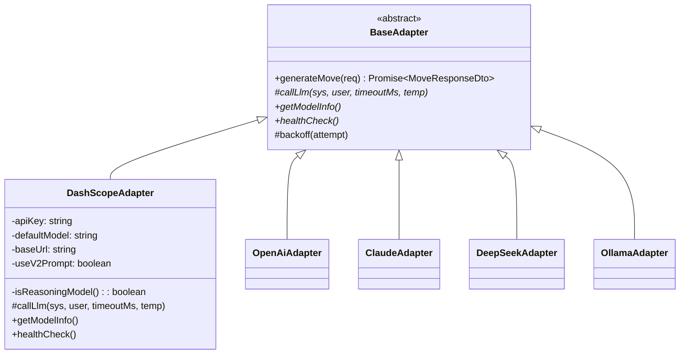

# DashScope Qwen3 Adapter 설계 초안

- **작성일**: 2026-04-13
- **작성자**: AI Engineer (애벌레)
- **상태**: 설계 초안 (Draft), 구현 미착수
- **연관 문서**: `04-ai-adapter-design.md`, `11-ai-move-api-contract.md`, `18-model-prompt-policy.md`, `21-reasoning-model-prompt-engineering.md`, `25-cloud-local-llm-integration.md`
- **TODO 출처**: MEMORY.md "Sprint 6 P2 — DashScope API 연동 — qwen3 클라우드 추론"

---

## 1. 목적 및 배경

### 1.1 목적

Alibaba Cloud DashScope의 Qwen3 계열 클라우드 추론 모델을 RummiArena AI Adapter에 다섯 번째 LLM 공급자로 통합한다. 기존 4개 모델(OpenAI / Claude / DeepSeek / Ollama)과 **동일한 인터페이스**로 동작하게 하여 Game Engine 쪽 코드 변경 없이 `model=dashscope`만 지정하면 대전이 가능하게 한다.

### 1.2 배경

1. **로컬 Qwen3 CPU 추론 불가** — `docs/02-design/25-cloud-local-llm-integration.md` §2에서 확인한 대로 `qwen3:4b` thinking 모드는 i7-1360P CPU 환경에서 턴당 600s+로 대전 불가. qwen2.5:3b(비추론)는 Place Rate 0% 확인.
2. **Qwen 네이티브 제공자 필요** — 25번 문서 §2 "방안 B" 비교표에서 DashScope가 "Qwen 네이티브 제공자, thinking 모드 지원 가장 확실, 최저가, 최신 모델 즉시 반영"으로 **1순위 추천**으로 명시되어 있음.
3. **4모델 → 5모델 확장** — Round 4/5 대전 결과(DeepSeek 30.8%, GPT 33.3%, Claude 30% 수준)와 Qwen3 클라우드 추론 성능을 동일 조건에서 비교할 수 있는 **다섯 번째 비교축**이 필요.
4. **추론 모델 다양성** — 현재 추론 모델은 OpenAI gpt-5-mini, Claude Sonnet 4 (Extended Thinking), DeepSeek Reasoner 3종. Qwen3는 네 번째 추론 모델로 "추론 모델 간 전략 차이" 실험의 샘플 수를 늘린다.

### 1.3 비목표 (Non-Goals)

- **본 문서는 설계 초안만 작성**. 실제 어댑터 코드 구현은 별도 작업으로 진행.
- DashScope의 비-Qwen 모델(예: Llama 계열 호스팅)은 대상이 아님.
- Qwen3 로컬(Ollama) 실행 최적화는 본 문서 범위 밖 (25번 문서 §방안 C에서 별도 논의).
- 영상/멀티모달 엔드포인트 지원은 대상이 아님 (텍스트 chat completion만).

---

## 2. 기존 4개 어댑터 구조 분석 (정합성 기준)

본 절은 DashScope 어댑터가 **정확히 따라야 할 기존 패턴**을 코드 위치와 함께 정리한다. 모든 수정은 이 기준에서 벗어나지 않아야 한다.

### 2.1 공통 인터페이스

- 정의: `src/ai-adapter/src/common/interfaces/ai-adapter.interface.ts`
- 핵심 계약
  ```ts
  interface AiAdapterInterface {
    generateMove(request: MoveRequestDto): Promise<MoveResponseDto>;
    getModelInfo(): ModelInfo;
    healthCheck(): Promise<boolean>;
  }
  interface ModelInfo { modelType: string; modelName: string; baseUrl: string; }
  ```
- DashScope 어댑터도 동일한 세 메서드만 외부로 노출한다.

### 2.2 BaseAdapter (공통 재시도/폴백 로직)

- 정의: `src/ai-adapter/src/adapter/base.adapter.ts`
- 각 어댑터는 `callLlm(systemPrompt, userPrompt, timeoutMs, temperature)` 한 메서드만 구현하면 된다.
- BaseAdapter가 제공하는 공통 기능
  1. 난이도별 temperature 매핑 (`DIFFICULTY_TEMPERATURE`: beginner 0.9 / intermediate 0.7 / expert 0.3)
  2. `maxRetries` 루프 + 지수 백오프(`backoff(attempt)`: 최대 10s)
  3. 재시도 시 에러 피드백 포함 프롬프트(`buildRetryUserPrompt`)
  4. 파싱 실패 시 강제 드로우 fallback (`responseParser.buildFallbackDraw`)
- DashScope 어댑터도 **BaseAdapter를 상속**하여 재시도/폴백을 공유한다.

### 2.3 어댑터별 특이사항 (참고 매트릭스)

| 어댑터 | 파일 | 추론 모델 여부 | 프롬프트 | 특수 처리 |
|--------|------|:---:|----------|-----------|
| OpenAI | `openai.adapter.ts` | gpt-5 시리즈만 | V2 옵션(`USE_V2_PROMPT`) | `max_completion_tokens=8192`, temperature 고정 1, `response_format: json_object`, **REASONING_MIN_TIMEOUT_MS=210_000** |
| Claude | `claude.adapter.ts` | Sonnet 4 Extended Thinking | V2 옵션 | `thinking={enabled, budget_tokens:10000}`, `max_tokens=16000`, `anthropic-version: 2023-06-01`, thinking block 파싱, min timeout 210s |
| DeepSeek | `deepseek.adapter.ts` | reasoner 모델만 | V2 공유 프롬프트 | `temperature` 파라미터 전송 금지, `max_tokens=16384`, `reasoning_content` 파싱, `extractBestJson()` 3단 폴백, **min timeout 500_000ms** |
| Ollama | `ollama.adapter.ts` | Qwen3 thinking 시도용 | 기본 (한국어) | `format: 'json'`, `MIN_RETRIES=5`, `MIN_TIMEOUT_MS=210_000`, thinking block에서 JSON 추출 폴백 |

### 2.4 DI / 팩토리

- 파일: `src/ai-adapter/src/move/move.module.ts`, `move/move.service.ts`
- `MoveService.selectAdapter(model)` 가 `ModelType` 문자열을 받아 4개 어댑터 중 하나를 반환한다.
- `ModelType`: `'openai' | 'claude' | 'deepseek' | 'ollama'` — DashScope 통합 시 **`'dashscope'` 추가 필수**.

### 2.5 POST /move DTO 검증

- 파일: `src/ai-adapter/src/move/move.controller.ts`
- `PostMoveBodyDto.model`에 `@IsEnum(['openai','claude','deepseek','ollama'])` 가 걸려 있음 → **`'dashscope'` 추가 필수**.

### 2.6 비용 계산

- 파일: `src/ai-adapter/src/cost/cost-tracking.service.ts`
- `MODEL_PRICING`: Record<modelType, {inputPer1M, outputPer1M}>
- `recordCost`는 `metadata.modelType`을 키로 `MODEL_PRICING`을 조회. 키가 없으면 Ollama(무료) 가격으로 폴백하므로 **DashScope 키를 추가하지 않으면 비용이 $0로 누락**된다.
- Redis 스키마: `quota:daily:{YYYY-MM-DD}` Hash의 `{model}:tokens_in / tokens_out / cost_usd / requests` 필드 (`cost_usd`는 1e6 스케일 정수).
- `getDailySummary()` 내부에서 `modelTypes = ['openai','claude','deepseek','ollama']` 배열을 **하드코딩 순회**하고 있음 → **`'dashscope'` 추가 필수**.
- 대시보드도 이 배열 기준으로 렌더링되므로(`docs/02-design/33-ai-tournament-dashboard-component-spec.md` 연동), 하드코딩 갱신이 반드시 함께 이루어져야 한다.

### 2.7 CostLimitGuard

- 파일: `src/ai-adapter/src/cost/cost-limit.guard.ts`
- `FREE_MODELS = new Set(['ollama'])` → DashScope는 유료이므로 기본 가드 동작 그대로 적용 (추가 작업 없음).
- 단, `DAILY_COST_LIMIT_USD=20` 안에서 DashScope가 차지하는 비중 고려 필요 (§6 참조).

### 2.8 Game Server ↔ AI Adapter 연결

- 파일: `src/game-server/internal/handler/ws_handler.go` `playerTypeToModel()` 함수, 라인 1831 부근
- PlayerType 문자열 → ai-adapter model 문자열 매핑:
  ```go
  case "AI_OPENAI":   return "openai"
  case "AI_CLAUDE":   return "claude"
  case "AI_DEEPSEEK": return "deepseek"
  case "AI_LLAMA":    return "ollama"
  ```
- PlayerType enum: `src/game-server/internal/model/player.go` (PlayerTypeHuman, PlayerTypeAIOpenAI 등 5개)
- DashScope 통합 시 **`PlayerTypeQwen = "AI_QWEN"` (또는 `AI_DASHSCOPE`) 추가 + 매핑 추가** 필수.

### 2.9 대전 스크립트

- 파일: `scripts/ai-battle-3model-r4.py` (이름은 3model이지만 Ollama 포함 4모델 지원)
- `MODELS` dict에 `aiType`, `persona`, `difficulty`, `ws_timeout`, `cost_per_turn` 키 5개를 갖는 모델 엔트리를 추가하면 `--models` 옵션으로 즉시 선택 가능.

---

## 3. DashScope API 개요 (공식 문서 참조 필요)

> **중요**: 본 절의 엔드포인트 URL, 모델명, 정확한 가격은 **구현 직전 DashScope 공식 문서에서 반드시 재검증**한다. 본 문서는 어댑터 구조 설계가 목적이며, 세부 숫자는 구현 단계에서 확정한다. 검증 필요 항목은 §9에 별도 표기했다.

### 3.1 알려진 사실 (기존 문서 및 MEMORY.md 기반)

- **제공자**: Alibaba Cloud DashScope (Qwen 네이티브 제공자)
- **인증**: API Key 기반 (환경변수: `DASHSCOPE_API_KEY`)
- **호환성**: DashScope는 OpenAI 호환 Chat Completion 엔드포인트를 제공한다 (`/compatible-mode/v1/chat/completions` 계열). 이 호환 모드를 사용하면 기존 `openai.adapter.ts` / `deepseek.adapter.ts`와 거의 동일한 axios 구조로 호출 가능.
- **대상 모델 후보** (MEMORY.md의 "qwen3 클라우드 추론" 기준)
  - `qwen3-*` (Qwen3 계열, thinking 모드 지원) — 본 어댑터의 **기본 대상**
  - `qwen-max`, `qwen-plus`, `qwen-turbo` — 일반 Qwen2.5 계열 (폴백 옵션)
- **지역 엔드포인트**: DashScope는 국제(싱가포르) 및 중국(베이징) 엔드포인트를 분리 제공 → **국제 엔드포인트**를 기본으로 삼는다 (한국 네트워크 레이턴시 / 규제 리스크 최소화).

### 3.2 구현 시 공식 문서에서 확정해야 할 항목

1. 정확한 **Base URL** (국제 호환 모드 엔드포인트)
2. Qwen3 추론 모델의 정확한 **모델 ID** (예: `qwen3-...-thinking` 형식 여부)
3. **thinking 파라미터 스펙** (`enable_thinking`, `thinking_budget` 등 플래그 이름)
4. **토큰 단가** (input / output / thinking 토큰 분리 여부)
5. **`response_format: json_object`** 지원 여부 (지원하지 않으면 DeepSeek Reasoner처럼 복구 파서 적용 필요)
6. **Rate Limit** 정책 (RPM / TPM, 동시 요청 한도)
7. **reasoning_content** 또는 동등 필드 응답 구조

---

## 4. 어댑터 설계

### 4.1 클래스 구조



### 4.2 파일 배치

| 역할 | 경로 | 비고 |
|------|------|------|
| 어댑터 구현 | `src/ai-adapter/src/adapter/dashscope.adapter.ts` | 신규 |
| 어댑터 테스트 | `src/ai-adapter/src/adapter/dashscope.adapter.spec.ts` | 신규 |
| 공통 인터페이스 | `src/ai-adapter/src/common/interfaces/ai-adapter.interface.ts` | 무변경 (공통 인터페이스 재사용) |
| DI 등록 | `src/ai-adapter/src/move/move.module.ts` | providers 배열에 `DashScopeAdapter` 추가 |
| ModelType enum | `src/ai-adapter/src/move/move.service.ts` | `ModelType` 유니온에 `'dashscope'` 추가 + `selectAdapter` 매핑 추가 |
| 컨트롤러 DTO | `src/ai-adapter/src/move/move.controller.ts` | `PostMoveBodyDto.model` `@IsEnum` 배열에 `'dashscope'` 추가 |
| 비용 가격표 | `src/ai-adapter/src/cost/cost-tracking.service.ts` | `MODEL_PRICING['dashscope']` 추가 + `modelTypes` 배열에 추가 |
| PlayerType | `src/game-server/internal/model/player.go` | `PlayerTypeQwen PlayerType = "AI_QWEN"` (또는 `AI_DASHSCOPE`) 추가 |
| 타입 매핑 | `src/game-server/internal/handler/ws_handler.go` `playerTypeToModel()` | `case "AI_QWEN": return "dashscope"` 추가 |
| Helm ConfigMap | `helm/charts/ai-adapter/templates/configmap.yaml` | `DASHSCOPE_DEFAULT_MODEL`, `DASHSCOPE_BASE_URL` 추가 |
| Helm Secret | `helm/charts/ai-adapter/templates/secret.yaml` | `DASHSCOPE_API_KEY` 추가 |
| Helm values | `helm/charts/ai-adapter/values.yaml` | env/secrets 섹션에 키 추가 |
| Secret 주입 | `scripts/inject-secrets.sh` | `DASHSCOPE_API_KEY` 주입 로직 추가 |
| 대전 스크립트 | `scripts/ai-battle-3model-r4.py` | `MODELS['dashscope']` 엔트리 추가 |

### 4.3 어댑터 인터페이스 스켈레톤 (설계용 예시)

> 아래는 **설계용 예시 스켈레톤**이며 실제 구현은 별도 작업. DeepSeek 어댑터(동일 OpenAI 호환 구조)를 기반으로 한다.

```ts
// src/ai-adapter/src/adapter/dashscope.adapter.ts (신규)
import { Injectable } from '@nestjs/common';
import { ConfigService } from '@nestjs/config';
import axios from 'axios';
import { BaseAdapter } from './base.adapter';
import { ModelInfo } from '../common/interfaces/ai-adapter.interface';
import { MoveRequestDto } from '../common/dto/move-request.dto';
import { MoveResponseDto } from '../common/dto/move-response.dto';
import { PromptBuilderService } from '../prompt/prompt-builder.service';
import { ResponseParserService } from '../common/parser/response-parser.service';
import {
  V2_REASONING_SYSTEM_PROMPT,
  buildV2UserPrompt,
  buildV2RetryPrompt,
} from '../prompt/v2-reasoning-prompt';

/**
 * Alibaba Cloud DashScope (Qwen3) 어댑터.
 * OpenAI 호환 Chat Completion 엔드포인트를 사용하므로 openai/deepseek 어댑터와 구조가 유사하다.
 *
 * 기본 모델: qwen3 추론 모델 (정확한 ID는 구현 시 공식 문서에서 확정).
 * 비추론 폴백: qwen-plus (빠른 응답이 필요할 때).
 *
 * 추론 모델 사용 시:
 * - V2 공유 프롬프트 적용 (DeepSeek Reasoner와 동일한 영문 reasoning 프롬프트)
 * - temperature 파라미터 미전송 (또는 0 고정) — 공식 문서 확인 필요
 * - thinking 모드 활성화 플래그 전송 — 공식 문서 확인 필요
 * - reasoning_content 필드 파싱 (DeepSeek extractBestJson 재사용 검토)
 * - 최소 타임아웃 210s (전 추론 모델 통일), 필요시 500s까지 확장
 */
@Injectable()
export class DashScopeAdapter extends BaseAdapter {
  /** 추론 모델 최소 타임아웃 (ms). 다른 추론 모델과 통일 */
  static readonly REASONING_MIN_TIMEOUT_MS = 210_000;

  private readonly apiKey: string;
  private readonly defaultModel: string;
  private readonly baseUrl: string;
  private readonly useV2Prompt: boolean;

  constructor(
    promptBuilder: PromptBuilderService,
    responseParser: ResponseParserService,
    private readonly configService: ConfigService,
  ) {
    super(promptBuilder, responseParser, 'DashScopeAdapter');
    this.apiKey = this.configService.get<string>('DASHSCOPE_API_KEY', '');
    // baseUrl은 국제 엔드포인트 기본값. 공식 문서에서 정확한 경로 확정 필요.
    this.baseUrl = this.configService.get<string>(
      'DASHSCOPE_BASE_URL',
      'https://dashscope-intl.aliyuncs.com/compatible-mode/v1',
    );
    this.defaultModel = this.configService.get<string>(
      'DASHSCOPE_DEFAULT_MODEL',
      'qwen3-...', // 구현 시 확정
    );
    this.useV2Prompt =
      this.configService.get<string>('USE_V2_PROMPT', 'false') === 'true';
  }

  private get isReasoningModel(): boolean {
    // 모델명에 thinking/reasoning/qwen3 키워드가 포함되면 추론 모델로 간주
    return /qwen3|thinking|reasoning/i.test(this.defaultModel);
  }

  getModelInfo(): ModelInfo {
    return {
      modelType: 'dashscope',
      modelName: this.defaultModel,
      baseUrl: this.baseUrl,
    };
  }

  async healthCheck(): Promise<boolean> {
    // OpenAI 호환 /models 엔드포인트 지원 여부 확인 필요.
    // 미지원 시 최소 토큰 chat completion 요청으로 대체.
    try {
      const response = await axios.get(`${this.baseUrl}/models`, {
        headers: { Authorization: `Bearer ${this.apiKey}` },
        timeout: 5000,
      });
      return response.status === 200;
    } catch {
      return false;
    }
  }

  /**
   * 추론 모델일 때는 generateMove를 오버라이드하여 V2 공유 프롬프트 사용.
   * 비추론 모델은 BaseAdapter의 기본 generateMove 흐름을 그대로 사용한다.
   */
  async generateMove(request: MoveRequestDto): Promise<MoveResponseDto> {
    if (!this.isReasoningModel && !this.useV2Prompt) {
      return super.generateMove(request);
    }
    // (DeepSeek/OpenAI의 V2 오버라이드 패턴과 동일)
    // - V2_REASONING_SYSTEM_PROMPT 사용
    // - buildV2UserPrompt / buildV2RetryPrompt 사용
    // - temperature = 0
    // - 실패 시 buildFallbackDraw
    return super.generateMove(request); // 스켈레톤: 실제 구현 시 확장
  }

  protected async callLlm(
    systemPrompt: string,
    userPrompt: string,
    timeoutMs: number,
    temperature: number,
  ): Promise<{ content: string; promptTokens: number; completionTokens: number }> {
    const body: Record<string, unknown> = {
      model: this.defaultModel,
      messages: [
        { role: 'system', content: systemPrompt },
        { role: 'user', content: userPrompt },
      ],
      max_tokens: this.isReasoningModel ? 16384 : 1024,
    };

    if (this.isReasoningModel) {
      // thinking 모드 플래그는 공식 문서에서 확정.
      // (body as any).enable_thinking = true;
      // (body as any).thinking_budget = 10000;
      // temperature는 전송하지 않거나 0으로 고정 (DeepSeek Reasoner 패턴 참조)
    } else {
      body.temperature = temperature;
      body.response_format = { type: 'json_object' }; // 지원 여부 확인 필요
    }

    const response = await axios.post(
      `${this.baseUrl}/chat/completions`,
      body,
      {
        headers: {
          Authorization: `Bearer ${this.apiKey}`,
          'Content-Type': 'application/json',
        },
        timeout: this.isReasoningModel
          ? Math.max(timeoutMs, DashScopeAdapter.REASONING_MIN_TIMEOUT_MS)
          : timeoutMs,
      },
    );

    const choice = response.data.choices?.[0];
    const usage = response.data.usage;
    const content = (choice?.message?.content as string) ?? '';
    // reasoning_content 필드명은 공식 문서 확인 (DashScope가 OpenAI 호환 모드에서
    // 동일한 필드를 노출하는지, 아니면 별도 필드인지 검증 필요)
    // const reasoning = (choice?.message?.reasoning_content as string) ?? '';

    return {
      content,
      promptTokens: usage?.prompt_tokens ?? 0,
      completionTokens: usage?.completion_tokens ?? 0,
    };
  }
}
```

### 4.4 기존 파일 수정 포인트 요약

| 파일 | 변경 내용 | 난이도 |
|------|----------|:---:|
| `move.service.ts` | `ModelType` 유니온 + `selectAdapter` 맵에 `dashscope` 추가, 생성자 파라미터 추가 | 낮음 |
| `move.module.ts` | providers에 `DashScopeAdapter` 등록 | 낮음 |
| `move.controller.ts` | `PostMoveBodyDto.model` `@IsEnum` 배열 갱신 | 낮음 |
| `cost-tracking.service.ts` | `MODEL_PRICING['dashscope']` 추가, `getDailySummary`의 `modelTypes` 배열 갱신 | 낮음 |
| `cost-limit.guard.ts` | 변경 없음 (유료 모델이므로 기본 가드 동작) | - |
| `metrics.service.ts` | modelType 기반 메트릭이므로 기본 동작 검증만 필요 | 낮음 |
| `player.go` | `PlayerTypeQwen = "AI_QWEN"` (또는 `AI_DASHSCOPE`) 상수 추가 | 낮음 |
| `ws_handler.go` | `playerTypeToModel` 매핑 추가 | 낮음 |
| `ai_client.go` | DTO 변경 없음 (model 필드는 문자열) | - |

---

## 5. 환경변수

### 5.1 ai-adapter ConfigMap 추가 키

| 변수명 | 타입 | 기본값 (제안) | 설명 |
|--------|------|--------------|------|
| `DASHSCOPE_BASE_URL` | string | `https://dashscope-intl.aliyuncs.com/compatible-mode/v1` (검증 필요) | OpenAI 호환 엔드포인트 |
| `DASHSCOPE_DEFAULT_MODEL` | string | `qwen3-*` (공식 문서 확인 필요) | 기본 모델 ID |
| `DASHSCOPE_REGION` | string | `intl` | `intl`(국제) 또는 `cn`(중국) — `DASHSCOPE_BASE_URL`에 통합 가능 |
| `DASHSCOPE_THINKING_BUDGET` | int | `10000` | thinking 모드 토큰 예산 (Claude 패턴 모방, 공식 플래그명 확인 필요) |

### 5.2 ai-adapter Secret 추가 키

| 변수명 | 설명 |
|--------|------|
| `DASHSCOPE_API_KEY` | DashScope API Key (Alibaba Cloud 콘솔에서 발급). Git 커밋 금지. |

### 5.3 주입 경로

- 개발 환경: `.env.local` → `scripts/inject-secrets.sh` 가 `kubectl patch` 로 `ai-adapter-secret` 에 주입.
- K8s 프로덕션(후속): ExternalSecrets Operator 또는 Sealed Secrets 경로로 전환 예정.
- Helm `values.yaml`에는 **절대 커밋하지 않는다** (기존 3개 API 키와 동일 정책).

### 5.4 타임아웃 체인 정합성

`docs/02-design/25-cloud-local-llm-integration.md` §4의 4단계 타임아웃 체인과 반드시 정합해야 한다.

| 구간 | 기본 값 | DashScope 시 |
|------|:------:|:------:|
| WS Script `ws_timeout` | 270s (추론 모델 공통) | 270s 또는 570s (응답 속도에 따라) |
| Game Server context | AI_ADAPTER_TIMEOUT_SEC + 60 = 560s | 동일 |
| Game Server → AI Adapter `TimeoutMs` | AI_ADAPTER_TIMEOUT_SEC × 1000 = 500_000 | 동일 |
| AI Adapter → DashScope axios | `Math.max(timeoutMs, 210_000)` | 초기 210s, 느리면 500s로 상향 |

**초기 값**: 추론 모델 공통인 **210s**로 시작. Round 1 대전 결과에서 fallback이 발생하면 DeepSeek처럼 500s로 상향.

---

## 6. 비용 계산

### 6.1 MODEL_PRICING 추가 엔트리 (잠정값, 검증 필요)

`cost-tracking.service.ts` `MODEL_PRICING` 상수에 다음 엔트리 추가:

```ts
export const MODEL_PRICING: Record<string, ModelPricing> = {
  openai:    { inputPer1M: 2.5,  outputPer1M: 10.0 },
  claude:    { inputPer1M: 3.0,  outputPer1M: 15.0 },
  deepseek:  { inputPer1M: 0.14, outputPer1M: 0.28 },
  ollama:    { inputPer1M: 0,    outputPer1M: 0 },
  dashscope: { inputPer1M: ?,    outputPer1M: ? }, // 공식 문서 확인 필요
};
```

### 6.2 단가 가정 (잠정)

- `docs/02-design/25-cloud-local-llm-integration.md` §2에서 DashScope 가격을 "~$0.01/1M tok" 수준으로 표기 → DeepSeek($0.14/$0.28)보다 저렴할 가능성.
- 그러나 **Qwen3 thinking 모델은 일반 Qwen2.5보다 고가**일 가능성이 높음 (OpenAI gpt-5-mini > gpt-4o 패턴). 실제 수치는 공식 문서에서 확인 필수.
- **thinking 토큰 별도 과금 여부** 확인 필요 (DeepSeek Reasoner는 reasoning 토큰을 completion 토큰에 포함, Claude Extended Thinking은 thinking 토큰 별도 과금).

### 6.3 턴당 예상 비용 계산 (Round 4 기준)

| 모델 | Prompt 평균 | Completion 평균 | 턴당 비용 (관측) |
|------|:---:|:---:|:---:|
| GPT-5-mini | ~3000 | ~3000 | $0.025 |
| Claude Sonnet 4 (thinking) | ~3000 | ~10000 (thinking 포함) | $0.074 |
| DeepSeek Reasoner | ~3000 | ~12000 | $0.001 |
| **DashScope Qwen3 (예상)** | **~3000** | **~10000 (thinking 포함)** | **$0.001 ~ $0.01 (잠정)** |

- 80턴 대전 1회 비용: **$0.08 ~ $0.80** (잠정).
- 일일 한도 `DAILY_COST_LIMIT_USD=20` 대비 25~250회 대전 가능 (충분).

### 6.4 비용 가드 동작

- DashScope는 유료 모델이므로 `CostLimitGuard.FREE_MODELS`에 포함되지 않음 → 일일/시간당 비용 한도 가드가 정상 적용된다.
- Daily Limit 초과 시 `DAILY_COST_LIMIT_EXCEEDED` 에러 반환, 클라이언트는 Ollama로만 폴백 가능 (기존 동작과 동일).

### 6.5 대시보드 반영

- `docs/02-design/33-ai-tournament-dashboard-component-spec.md`의 모델별 비용/성능 비교 컴포넌트에 **dashscope 색상/아이콘 추가** 필요.
- `cost-tracking.service.ts` `getDailySummary`의 `modelTypes` 배열에 `'dashscope'` 추가하지 않으면 대시보드가 DashScope 비용을 아예 표시하지 않는다 (**회귀 리스크**).

---

## 7. 에러 처리 전략

### 7.1 BaseAdapter가 이미 처리하는 것

- 파싱 실패 / 유효하지 않은 수 → `maxRetries`까지 재시도
- 재시도 간 지수 백오프 (최대 10s)
- 전체 실패 시 강제 드로우(`buildFallbackDraw`)
- DashScope 어댑터는 위 로직을 자동으로 상속받으며, 추가 작업 불필요.

### 7.2 DashScope 고유 에러 케이스

| 에러 상황 | 처리 전략 | 비고 |
|-----------|----------|------|
| **네트워크 타임아웃** | axios timeout 발생 → BaseAdapter가 catch 후 재시도 | 기존 패턴 동일 |
| **429 Rate Limit** | BaseAdapter의 지수 백오프 활용. 단, 429 응답 body에 `Retry-After` 헤더가 있으면 이를 존중하도록 `backoff()` 오버라이드 검토 | **구현 시 설계** |
| **401 Unauthorized** | API 키 오류 → 재시도해도 실패, 즉시 fallback draw. `logger.error` 로 명확히 남긴다. | `healthCheck()`로 사전 감지 가능 |
| **400 Invalid Request** | 프롬프트 포맷 문제 → 재시도해도 실패 가능성 높음. 에러 메시지를 `lastErrorReason` 에 넣어 재시도 프롬프트에 피드백. | 기존 패턴 동일 |
| **JSON 파싱 실패** | `isReasoningModel` 시 DeepSeek `extractBestJson()` 패턴 재사용 검토. | **구현 시 유틸 추출 고려** |
| **thinking 전용 응답 (content 빈 경우)** | Ollama 패턴처럼 thinking 블록에서 JSON 추출. | DeepSeek `reasoning_content` 패턴과 통합 가능 |
| **지역 장애 (intl → cn 전환)** | 설계 범위 밖 (운영 단계에서 ConfigMap 전환으로 대응) | - |
| **`response_format: json_object` 미지원** | 플래그 제거 후 프롬프트에서 "반드시 JSON만 응답" 명시 강화 + 복구 파서 적용 | **호환성 확인 필요** |

### 7.3 재시도 정책

- `maxRetries` 기본 3 (BaseAdapter 기본값)
- `timeoutMs` 기본 210_000 (추론 모델 최소) — ConfigMap `AI_ADAPTER_TIMEOUT_SEC` 연동은 game-server에서 500_000으로 주입
- 재시도마다 프롬프트에 이전 실패 사유 포함 (`buildRetryUserPrompt`, 이미 BaseAdapter에서 처리)

### 7.4 Fallback Draw

- 전체 재시도 실패 시 BaseAdapter가 `buildFallbackDraw`로 draw 행동을 반환.
- `metadata.isFallbackDraw = true` 로 마킹되어 대시보드에서 fallback rate 관찰 가능.
- Round 1 대전에서 fallback rate가 10% 초과하면 **설계 재검토 트리거** (timeout 상향, 프롬프트 조정, 모델 변경).

### 7.5 Prompt Injection 방어

- 기존 PromptBuilderService와 V2 프롬프트는 Injection 방어 고려. DashScope도 동일한 프롬프트 재사용 → 추가 방어 불필요.
- 단, DashScope가 system prompt 우선순위를 다르게 처리할 수 있으므로 **초기 smoke test**에서 rule injection 테스트 1회 실시.

---

## 8. 테스트 전략

### 8.1 단위 테스트 (Mock 기반)

파일: `src/ai-adapter/src/adapter/dashscope.adapter.spec.ts` (신규)

기존 4개 어댑터의 `.spec.ts` 구조를 그대로 모방한다 (axios mocking, PromptBuilder / ResponseParser mock 주입).

| 테스트 케이스 | 목적 |
|--------------|------|
| `getModelInfo` 반환값 검증 | `modelType: 'dashscope'` 확인 |
| `healthCheck` 정상/실패 분기 | 200 응답 → true, 예외 → false |
| `callLlm` 정상 응답 파싱 | content + usage 추출 확인 |
| `callLlm` reasoning_content 필드 파싱 | thinking 블록 → content 폴백 |
| `generateMove` 정상 파싱 → place 응답 | BaseAdapter 공통 재시도 경로 |
| `generateMove` 파싱 실패 3회 → fallback draw | `isFallbackDraw=true` 확인 |
| `generateMove` 추론 모델일 때 V2 프롬프트 사용 | 시스템 프롬프트 검증 |
| timeout 최소값 210s 보장 | `Math.max(timeoutMs, 210_000)` 확인 |
| `response_format` 지원 여부 분기 | 비추론 모델 JSON mode 활성 |

**목표**: 기존 어댑터 spec 파일(OpenAI 수준, 약 20~30 테스트)과 동급 커버리지.

### 8.2 통합 테스트 (실제 API)

조건부 실행 (`DASHSCOPE_API_KEY` 환경변수 존재 시에만, `describe.skip` 패턴).

| 테스트 케이스 | 목적 |
|--------------|------|
| 실제 API 최소 요청 ("ping") | 인증 / 네트워크 확인 |
| 최소 게임 상태로 generateMove 1회 | 전체 플로우 smoke test |
| 잘못된 모델명으로 400 확인 | 에러 경로 검증 |
| 잘못된 API 키로 401 확인 | 에러 경로 검증 |

### 8.3 E2E 대전 테스트

| 단계 | 내용 | 완료 기준 |
|------|------|-----------|
| **Phase 1: Dry Run** | `scripts/ai-battle-3model-r4.py --dry-run --models dashscope` | 설정 출력 확인 |
| **Phase 2: 10턴 Smoke** | `MAX_TURNS=10`으로 단일 실행 | 에러 없이 완주, metadata 기록 확인 |
| **Phase 3: 단독 80턴** | `--models dashscope` 단독 1회 | Place Rate, Fallback Rate, 턴당 비용 측정 |
| **Phase 4: 3회 Multi-run** | 동일 조건 3회 반복 | 분산 측정, 비교 기준값 확보 |
| **Phase 5: 5모델 토너먼트** | `--models openai,claude,deepseek,ollama,dashscope` | Round 6 공식 대전 |

### 8.4 성능 목표 (잠정)

| 지표 | 목표 | 참고 |
|------|:---:|------|
| Place Rate | ≥ 25% | DeepSeek 30.8%, GPT 33.3% 수준 |
| Fallback Rate | ≤ 5% | Round 4 기준 |
| 평균 Latency | ≤ 120s/turn | Claude 수준 |
| Max Latency | ≤ 210s/turn | timeout 안쪽 |
| 80턴 대전 총 비용 | ≤ $1.00 | DeepSeek $0.04 ~ Claude $5.92 사이 |
| 토큰당 비용 | ≤ $0.01/턴 | DeepSeek 수준 목표 |

---

## 9. 통합 체크리스트

### 9.1 코드 변경 체크리스트 (13개)

- [ ] **C1** `src/ai-adapter/src/adapter/dashscope.adapter.ts` 신규 작성 (BaseAdapter 상속)
- [ ] **C2** `src/ai-adapter/src/adapter/dashscope.adapter.spec.ts` 단위 테스트 신규 작성
- [ ] **C3** `src/ai-adapter/src/move/move.service.ts` `ModelType` 유니온 + `selectAdapter` 맵 + 생성자 파라미터 수정
- [ ] **C4** `src/ai-adapter/src/move/move.module.ts` providers 배열에 `DashScopeAdapter` 추가
- [ ] **C5** `src/ai-adapter/src/move/move.controller.ts` `PostMoveBodyDto.model` `@IsEnum` 배열 갱신
- [ ] **C6** `src/ai-adapter/src/cost/cost-tracking.service.ts` `MODEL_PRICING['dashscope']` 추가 + `getDailySummary`의 `modelTypes` 배열에 `'dashscope'` 추가
- [ ] **C7** `src/ai-adapter/src/cost/cost-tracking.service.spec.ts` DashScope 관련 테스트 추가
- [ ] **C8** `src/game-server/internal/model/player.go` `PlayerTypeQwen` 상수 추가
- [ ] **C9** `src/game-server/internal/handler/ws_handler.go` `playerTypeToModel()` 매핑 추가
- [ ] **C10** 관련 Go 테스트 업데이트 (player type 매핑, ws_handler AI)
- [ ] **C11** `docs/02-design/11-ai-move-api-contract.md` model enum 업데이트
- [ ] **C12** `docs/02-design/04-ai-adapter-design.md` 본 문서 링크 추가
- [ ] **C13** MoveService.spec / MoveController.spec 에서 dashscope case 커버

### 9.2 인프라/배포 체크리스트 (8개)

- [ ] **I1** `helm/charts/ai-adapter/templates/configmap.yaml` 에 `DASHSCOPE_BASE_URL`, `DASHSCOPE_DEFAULT_MODEL` 추가
- [ ] **I2** `helm/charts/ai-adapter/templates/secret.yaml` 에 `DASHSCOPE_API_KEY` 추가
- [ ] **I3** `helm/charts/ai-adapter/values.yaml` 에 env/secrets 기본값 추가 (API 키 빈 값)
- [ ] **I4** `scripts/inject-secrets.sh` 에 `DASHSCOPE_API_KEY` 주입 로직 추가 + `.env.local` 키 추가
- [ ] **I5** `kubectl patch secret ai-adapter-secret` 로 로컬 K8s에 실제 키 주입 (수동)
- [ ] **I6** `kubectl rollout restart deploy/ai-adapter -n rummikub` 로 재시작 후 로그 확인
- [ ] **I7** `scripts/secret-replacements.txt` 에 DashScope 키 마스킹 엔트리 추가
- [ ] **I8** ArgoCD sync 확인 (Helm chart 변경이 GitOps repo에 반영되는지)

### 9.3 운영/테스트 체크리스트 (6개)

- [ ] **O1** `scripts/ai-battle-3model-r4.py` `MODELS['dashscope']` 엔트리 추가 (aiType="AI_QWEN", ws_timeout, cost_per_turn)
- [ ] **O2** `scripts/ai-battle-3model-r4.py` 헤더 주석에 dashscope 사용법 추가
- [ ] **O3** Dry run → 10턴 Smoke → 단독 80턴 → 3회 Multirun → 5모델 토너먼트 (단계별 결과 docs/04-testing/ 에 리포트)
- [ ] **O4** DashScope API 잔액 확인 및 MEMORY.md API 잔액 섹션에 추가
- [ ] **O5** 대시보드(`docs/02-design/33-*`) 모델별 컴포넌트에 DashScope 카드 추가 (PR 5 이후)
- [ ] **O6** 일일 비용 한도($20) 대비 DashScope 사용 비중 모니터링 기준 설정

### 9.4 문서 체크리스트 (5개)

- [ ] **D1** 본 설계 문서 완성 (현재 문서)
- [ ] **D2** `docs/02-design/04-ai-adapter-design.md` 에 DashScope 항목 추가
- [ ] **D3** `docs/02-design/11-ai-move-api-contract.md` model enum 업데이트
- [ ] **D4** `docs/02-design/18-model-prompt-policy.md` 에 DashScope 프롬프트 정책 추가
- [ ] **D5** `docs/04-testing/` Round 6 대전 리포트에 DashScope 결과 포함

**총 체크리스트: 32개** (코드 13 + 인프라 8 + 운영 6 + 문서 5)

---

## 10. 구현 시 우선 검증 필요 항목 (공식 문서 조회 필수)

| # | 항목 | 영향 | 검증 방법 |
|---|------|------|----------|
| V1 | DashScope OpenAI 호환 모드 **정확한 base URL** (intl / cn) | 어댑터 동작 | DashScope 공식 문서 "Compatible Mode" 섹션 |
| V2 | Qwen3 추론 모델 **정확한 모델 ID** (`qwen3-...-thinking` 또는 `qwen-max-thinking` 등) | 기본 모델 설정 | DashScope 모델 목록 페이지 |
| V3 | Qwen3 thinking 모드 **활성화 플래그명** (`enable_thinking`, `extra_body` 등) | callLlm 구현 | Qwen3 API 레퍼런스 |
| V4 | `response_format: json_object` 호환 모드 **지원 여부** | JSON 파싱 전략 | 호환 모드 스펙 페이지 |
| V5 | Qwen3 **토큰 단가** (input / output / thinking 분리 여부) | MODEL_PRICING, 비용 계산 | DashScope 가격표 |
| V6 | **reasoning_content 응답 필드** 존재 여부 (DeepSeek Reasoner 호환) | 파싱 로직 | API 응답 샘플 |
| V7 | **Rate Limit** 정책 (RPM / TPM) | Throttler 설정 | DashScope 사용자 가이드 |
| V8 | **`/models` 엔드포인트** 지원 여부 (healthCheck 전략) | healthCheck 구현 | 호환 모드 스펙 |
| V9 | thinking 모드 시 **`temperature` 파라미터 허용 여부** | callLlm 분기 | API 레퍼런스 |
| V10 | **API 키 환경변수 관례** (`DASHSCOPE_API_KEY` 표준인지) | .env 키 이름 | DashScope SDK 예제 |

**권장 순서**: V1 → V2 → V3 → V4 → V5 (구현 가능 여부 판단) → 나머지.

---

## 11. 예상 소요 (Sprint Points)

| 작업 | SP | 비고 |
|------|:---:|------|
| 공식 문서 조사 + 검증 항목 V1~V10 해결 | 1 | DashScope 콘솔 계정 + API 키 발급 포함 |
| 어댑터 구현 (`dashscope.adapter.ts`) | 2 | DeepSeek 어댑터 기반 복제 + 커스터마이즈 |
| 단위 테스트 (`dashscope.adapter.spec.ts`) | 1.5 | 20~30 테스트 케이스 |
| move.service / module / controller / cost-tracking 갱신 | 0.5 | 기계적 수정 |
| Game Server 수정 (player.go, ws_handler.go) | 0.5 | 매핑 2줄 + 상수 1개 |
| Helm chart / Secret 주입 | 0.5 | 기존 패턴 복제 |
| 대전 스크립트 확장 | 0.5 | MODELS dict 엔트리 |
| Smoke test (10턴) | 0.5 | 1회 실행 + 로그 분석 |
| 단독 80턴 대전 1회 | 1 | 설정 확인, fallback 대응 |
| 3회 Multirun + 분석 | 1 | Place Rate 평균, 분산 |
| Round 6 5모델 토너먼트 | 1 | 공식 대전 리포트 |
| 관련 문서 갱신 (04, 11, 18 등) | 0.5 | 링크 + enum 갱신 |
| 총 | **10.5 SP** | Sprint 6 중~후반 1주 정도 |

**시간 환산**: 약 2~3일 순수 작업 (공식 문서 조사가 병목 요인).

---

## 12. 리스크 및 완화

| 리스크 | 영향 | 확률 | 완화 |
|--------|:---:|:---:|------|
| 공식 문서와 실제 API 동작 불일치 | H | M | Phase 2 Smoke 단계에서 조기 감지, 차이 문서화 |
| Qwen3 thinking 모드 응답 시간이 DeepSeek보다 길어 timeout 500s 필요 | M | M | 초기 210s → 필요 시 500s 상향 (ConfigMap으로 조정 가능) |
| DashScope 국제 엔드포인트 한국 네트워크 레이턴시 500ms 이상 | M | L | CN 엔드포인트와 비교 측정, 나쁘면 폴백 |
| Qwen3 thinking 토큰 별도 과금 $0.01 초과 | H | L | 턴당 비용 모니터링, 일일 한도 $20 내 제한 |
| `response_format: json_object` 미지원 → 파싱 오류율 상승 | M | M | DeepSeek `extractBestJson()` 패턴 재사용 |
| API Key 노출 (Git 커밋 사고) | H | L | `secret-replacements.txt` 에 패턴 추가, `scripts/inject-secrets.sh` 로만 주입 |
| 중국 전용 엔드포인트 사용 시 규제/차단 이슈 | H | L | **국제 엔드포인트(intl) 기본 사용**, CN은 명시적 전환 시에만 |
| DashScope 서비스 장애 시 전체 AI Adapter 영향 | M | L | CostLimitGuard 및 fallback draw로 게임 진행 자체는 유지, 재시도 무한 루프 방지 |
| `ModelType` 유니온 확장 시 프론트엔드 enum 미동기화 | L | M | 대시보드 스펙(33번 문서) 업데이트 체크리스트 D5 |

---

## 13. 향후 확장 방향 (Out of Scope)

- **Qwen 멀티모델 지원**: 같은 DashScope 키로 `qwen-max`, `qwen-plus`, `qwen-turbo`, `qwen3-thinking` 등 여러 모델을 동적 선택. 현 설계는 단일 `DASHSCOPE_DEFAULT_MODEL` 기반이므로, `MoveRequestDto` 에 `modelOverride` 필드 추가 검토.
- **Qwen3-coder / Qwen3-vision**: 루미큐브 이미지 분석 → 미래 멀티모달 실험.
- **DashScope Embedding API**: 게임 상태 임베딩 → 강화학습 feature vector 생성 (Phase 7+).
- **OpenRouter 비교**: 동일한 Qwen3 모델을 OpenRouter 경유로 호출하여 레이턴시/비용 비교.

---

## 14. 승인 및 다음 단계

### 14.1 승인 필요 항목

- [ ] PM 애벌레: DashScope API 키 발급 승인 + Sprint 6 일정 편성
- [ ] Architect: ModelType 확장 및 common 인터페이스 유지 확인
- [ ] DevOps: K8s Secret 주입 플로우 확인, Helm 변경 승인
- [ ] Security: API 키 관리 정책 검토 (inject-secrets.sh 패턴 재사용 가능 확인)

### 14.2 다음 단계 (본 설계 초안 → 구현)

1. **검증 필요 항목 V1~V10 해결** (§10) — DashScope 공식 문서 조사 1회차
2. **설계 리뷰** — 본 문서 팀 리뷰 + 피드백 반영
3. **구현 착수** — 체크리스트 C1~C13 순서로 진행
4. **인프라 준비** — I1~I8
5. **테스트 실행** — O1~O6
6. **Round 6 대전** — 5모델 토너먼트 공식 리포트

---

## 15. 변경 이력

| 날짜 | 내용 | 작성자 |
|------|------|--------|
| 2026-04-13 | 초안 작성 (v0.1, 설계만 / 구현 미착수) | AI Engineer (애벌레) |
