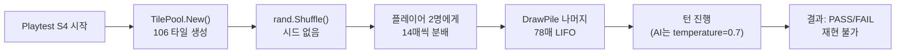
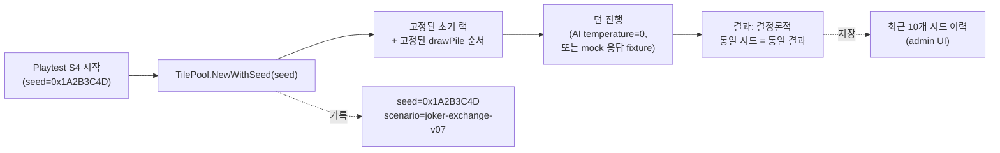
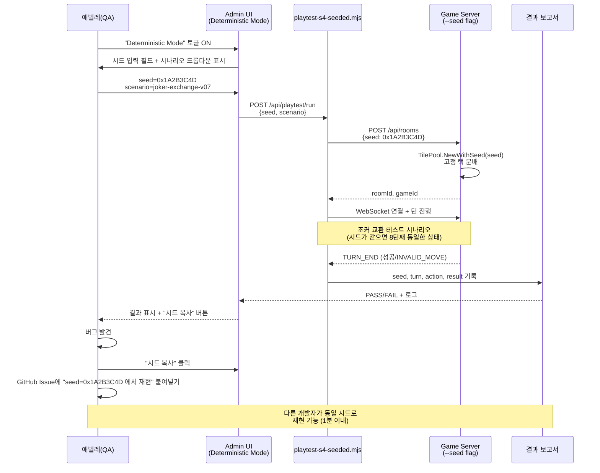
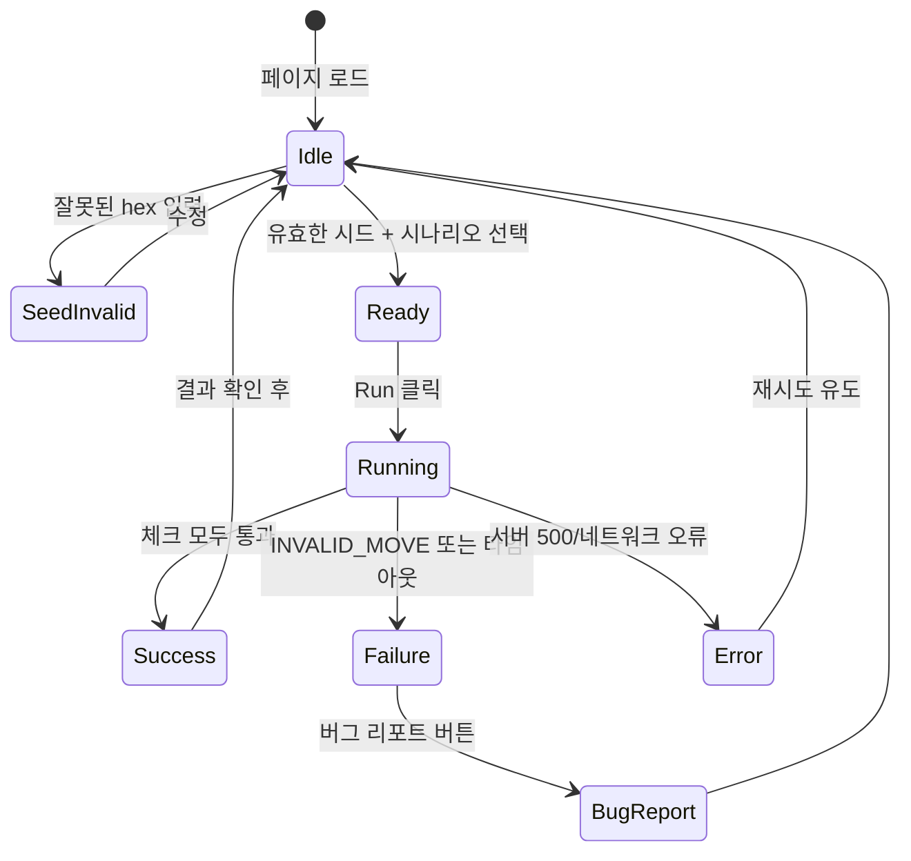

# 37. Playtest S4 결정론적 시드 UX 설계

**작성자**: designer-1
**작성일**: 2026-04-14 (Sprint 6 Day 3)
**상태**: Draft
**관련 작업**: Task #6 [B2] Playtest S4 결정론적 시드 UX + 색각 접근성
**Blocks**: Task #7 [B3] 시드 프레임워크 설계, Task #8 [B4] 시드 입력 admin UI
**관련 문서**: `docs/02-design/38-colorblind-safe-palette.md`, `docs/02-design/31-game-rule-traceability.md`

---

## 1. 배경과 문제 정의

### 1.1 Sprint 6 Day 1+2 회고에서 드러난 "조커 확률로 E2E 미발견"

Sprint 6 Day 1~2에서 V-13 재배치 4유형 UI 구현 중 발견된 BUG-UI-REARRANGE-002는 **기존 Playtest S4가 조커 관련 규칙을 확률적으로만 트리거**한다는 한계를 드러냈다. 구체적으로는 다음 네 가지 문제가 축적되어 있다.

1. **비결정론적 타일 분배** — `src/game-server/internal/engine/pool.go:27` 의 `TilePool.Shuffle()` 은 `math/rand.Shuffle` 을 시드 없이 호출한다. 매 실행마다 초기 랙(14매)과 draw pile 순서가 달라진다.
2. **조커(JK1, JK2) 출현 시점이 불확실** — Playtest S4는 "조커를 받았다면" 조커 셋을 배치하지만, 30턴 안에 조커를 받지 못하면 Phase C~D(조커 교환/재사용)이 단 한 번도 실행되지 않는다. Round 3 분석에서는 30턴 중 조커 셋 배치 성공률이 약 43% 에 불과했다.
3. **AI 행동도 비결정론적** — LLM은 temperature > 0 로 호출되며, 동일한 보드 상태에서도 다른 수를 둔다. 상대 AI의 행동이 달라지면 내 랙과 보드 상태가 갈라지고, 같은 버그를 재현할 수 없다.
4. **버그 리포트가 "운이 좋았다"** — BUG-UI-REARRANGE-002(그룹 5회 중복 렌더링), BUG-UI-CLASSIFY-001a/b(혼합 숫자 분류 오류) 모두 라이브 테스트에서 "우연히" 조건이 갖춰졌을 때 드러났다. 동일 버그를 재현하려면 다시 운이 좋아야 한다.

### 1.2 결정론적 시드가 해결하는 것

같은 64비트 시드를 입력하면 **초기 랙 분배, draw pile 순서, AI 호출 타이밍**이 동일하게 재현된다. 애벌레가 "시드 0x1A2B3C4D 에서 8턴째 조커 교환 시 그룹이 5개로 복제됩니다" 라고 리포트하면, QA·개발자·에이전트 누구든 동일한 시드를 넣고 동일한 버그를 눈으로 확인할 수 있다.

이는 다음을 가능케 한다.

- **CI 고정 회귀 테스트** — 과거에 버그가 났던 시드를 고정 목록(`seeds.yaml`)으로 저장하고, 매 PR마다 "이 시드들에서 예상 결과가 나오는가" 를 검증한다.
- **버그 리포트 → 시드 1개** — 스크린샷 + 턴 번호 + 시드 ID 세 가지로 완결된 재현 절차를 공유한다.
- **A/B 프롬프트 비교** — 같은 시드·같은 랙에서 GPT/Claude/DeepSeek가 어떻게 다르게 두는지 통제된 비교가 가능하다.

---

## 2. 아키텍처 개관

### 2.1 현재 구조 (비결정론)



### 2.2 목표 구조 (결정론)



### 2.3 결정론 보장 범위

| 영역 | 결정론? | 방법 |
|------|--------|------|
| 초기 랙 분배 | Yes | `TilePool.NewWithSeed(seed uint64)` — `rand.New(rand.NewSource(seed))` |
| DrawPile 순서 | Yes | 동일 시드로 섞은 결과가 순서 보존 |
| AI 행동 (테스트용) | Yes | `--ai-mode=fixture` 로 사전 녹화된 응답 재생 (또는 temperature=0 + seed 지원 LLM) |
| 턴 타임아웃 트리거 | Yes | 고정 `--turn-timeout=60s` + fake clock 주입 |
| WebSocket 메시지 순서 | Best-effort | 단일 클라이언트이므로 자연 결정론 |

**주의**: LLM API는 모델 쪽 가중치나 라우팅이 바뀌면 같은 프롬프트라도 응답이 달라질 수 있다. 완전한 결정론이 필요한 시나리오는 `--ai-mode=fixture` 로 고정 응답을 재생한다.

---

## 3. User Flow — 시드 기반 재현

### 3.1 전체 흐름 (Mermaid sequenceDiagram)



### 3.2 시나리오 드롭다운 구성

`scripts/playtest-s4/scenarios/` 디렉터리에 YAML 파일로 시나리오를 정의한다.

```yaml
# scripts/playtest-s4/scenarios/joker-exchange-v07.yaml
id: joker-exchange-v07
title: "V-07 조커 교환 후 같은 턴 재사용"
description: |
  조커 셋이 테이블에 있고 내 랙에 교체 타일이 있을 때,
  조커를 꺼내 같은 턴에 새 셋에서 재사용하는 플로우를 검증한다.
target_rule: V-07
required_conditions:
  - initial_meld_done: true
  - joker_on_table: true
  - replacement_tile_in_rack: true
expected_outcome: "TURN_END (accepted)"
seed_candidates:  # 이 시나리오에서 조건이 충족되는 알려진 시드들
  - 0x1A2B3C4D
  - 0xDEADBEEF
  - 0xCAFEBABE
```

---

## 4. Admin UI 와이어프레임

### 4.1 "Playtest S4 — Deterministic Runner" 페이지 레이아웃

```
╔══════════════════════════════════════════════════════════════════════════════╗
║  RummiArena Admin > Playtest > S4 Deterministic Runner          [애벌레] ▼   ║
╠══════════════════════════════════════════════════════════════════════════════╣
║                                                                              ║
║   [ ] Deterministic Mode (OFF → 기존 랜덤 방식)                              ║
║   [x] Deterministic Mode (ON)  ◀── 활성화됨                                  ║
║                                                                              ║
║  ┌─────────────────────────────────────┐  ┌─────────────────────────────┐    ║
║  │ 시드 입력 (64-bit hex)              │  │ 시나리오 선택                │    ║
║  │                                     │  │                              │    ║
║  │  0x[ 1A2B3C4D              ] [🎲]   │  │ ▼ joker-exchange-v07         │    ║
║  │                                     │  │   V-07 조커 교환 후 재사용   │    ║
║  │  ✓ 유효한 64-bit hex                │  │                              │    ║
║  │                                     │  │ 대상 규칙: V-07              │    ║
║  │  [📋 현재 시드 복사]                │  │ 예상 결과: TURN_END          │    ║
║  └─────────────────────────────────────┘  └─────────────────────────────┘    ║
║                                                                              ║
║  ┌─────────────────────────────────────────────────────────────────────┐    ║
║  │ AI 모드                                                              │    ║
║  │  ( ) live    — 실제 LLM 호출 (비결정론적)                            │    ║
║  │  (●) fixture — 사전 녹화된 응답 재생 (완전 결정론)                   │    ║
║  │  ( ) baseline — temperature=0 호출 (거의 결정론)                     │    ║
║  └─────────────────────────────────────────────────────────────────────┘    ║
║                                                                              ║
║                          [  ▶  실행 (Run)  ]                                 ║
║                                                                              ║
║  ┌──────────────────────── 실행 결과 ────────────────────────────────┐      ║
║  │ 상태: ● PASS (5.3s)                                               │      ║
║  │ 턴 수: 12 / 최대 30                                               │      ║
║  │ 재현 가능: ✓ (동일 시드 실행 시 같은 결과)                        │      ║
║  │                                                                    │      ║
║  │ 체크 항목:                                                         │      ║
║  │   ✓ initial_meld_done                                              │      ║
║  │   ✓ joker_set_placed (turn 5)                                      │      ║
║  │   ✓ joker_exchange_valid (turn 8)                                  │      ║
║  │   ✓ joker_reused_same_turn                                         │      ║
║  │   ✓ universe_conservation_106                                      │      ║
║  │                                                                    │      ║
║  │ [ 📄 전체 로그 ]  [ 🔗 공유 링크 복사 ]  [ 🐛 버그 리포트 ]        │      ║
║  └────────────────────────────────────────────────────────────────────┘      ║
║                                                                              ║
║  ┌──────────────────── 최근 시드 이력 (최근 10개) ─────────────────────┐    ║
║  │                                                                      │    ║
║  │  # │ 시드          │ 시나리오              │ 결과   │ 시각   │ 복사 │    ║
║  │ ───┼───────────────┼───────────────────────┼────────┼────────┼──── │    ║
║  │  1 │ 0x1A2B3C4D    │ joker-exchange-v07    │ ● PASS │ 10:32  │ 📋  │    ║
║  │  2 │ 0xDEADBEEF    │ rearrange-v13-type3   │ ● FAIL │ 10:18  │ 📋  │    ║
║  │  3 │ 0xCAFEBABE    │ initial-meld-30pt     │ ● PASS │ 09:55  │ 📋  │    ║
║  │  4 │ 0x8BADF00D    │ joker-exchange-v07    │ ● PASS │ 09:40  │ 📋  │    ║
║  │  5 │ 0xFEEDFACE    │ invalid-joker-v07     │ ● PASS │ 09:22  │ 📋  │    ║
║  │  6 │ 0x0BADF00D    │ rearrange-v13-type1   │ ● PASS │ 어제   │ 📋  │    ║
║  │  7 │ 0xBAADF00D    │ time-penalty-v16      │ ● FAIL │ 어제   │ 📋  │    ║
║  │  8 │ 0xDEADC0DE    │ conservation-106      │ ● PASS │ 어제   │ 📋  │    ║
║  │  9 │ 0xABAD1DEA    │ joker-exchange-v07    │ ● PASS │ 어제   │ 📋  │    ║
║  │ 10 │ 0x1DEA2BAD    │ run-merge-v04         │ ● PASS │ 어제   │ 📋  │    ║
║  │                                                                      │    ║
║  │ [ 전체 이력 보기 ]                                                   │    ║
║  └──────────────────────────────────────────────────────────────────────┘    ║
║                                                                              ║
╚══════════════════════════════════════════════════════════════════════════════╝
```

### 4.2 UI 요소 명세

| 요소 | 동작 | 검증 규칙 |
|------|------|----------|
| Deterministic Mode 토글 | ON 시 시드 입력/시나리오 드롭다운 활성화. OFF 시 기존 playtest-s4.mjs 호출 | — |
| 시드 입력 필드 | `0x` prefix + 16 hex chars(64-bit) | 정규식 `^0x[0-9a-fA-F]{1,16}$`. 비어있으면 현재 타임스탬프 기반 자동 생성 |
| 🎲 (주사위) 버튼 | `crypto.getRandomValues()` 로 신규 64-bit 시드 생성 | — |
| 시나리오 드롭다운 | `GET /api/playtest/scenarios` 결과로 populate | 선택 해제 가능. 미선택 시 generic run |
| AI 모드 라디오 | live / fixture / baseline 셋 중 택1 | fixture 선택 시 해당 시나리오의 녹화 파일 존재 확인 |
| 실행 버튼 | `POST /api/playtest/run` → SSE 로 로그 스트림 수신 | 이전 실행이 running 이면 disabled |
| 실행 결과 카드 | PASS(녹색)/FAIL(적색)/RUNNING(회색) + 체크 항목 리스트 | 색만 아닌 아이콘(✓/✗/⋯) 병기 (§38 색각 지침) |
| 공유 링크 복사 | `https://admin.../playtest/s4?seed=0x...&scenario=...` 형식 | clipboard API |
| 버그 리포트 | `gh issue create` 템플릿에 시드/시나리오/로그 자동 삽입 | — |
| 시드 이력 테이블 | Redis `playtest:history` LPUSH/LRANGE 0 10 | 서버 재시작 시 유지 |

### 4.3 상태 전이



---

## 5. 결정론적 재현이 필요한 시나리오 (B3 의존 전달용)

**이 섹션은 Task #7 [B3] qa-2 가 YAML 시나리오 파일을 작성할 때 기준으로 사용한다.** 아래 5개는 "조커 확률" 또는 "AI 의존성" 때문에 기존 Playtest S4 에서 놓치기 쉬운, 그리고 동시에 **라이브 QA 에서 실제로 버그가 났던** 시나리오다.

### 시나리오 1: V-07 조커 교환 후 같은 턴 재사용

- **ID**: `joker-exchange-v07`
- **대상 규칙**: V-07 (조커 교환 시 즉시 재사용 의무)
- **사전 조건**:
  - 플레이어가 initial meld 완료 (30+ 점)
  - 테이블에 조커 셋 1개 이상 존재
  - 내 랙에 해당 조커가 대표하는 타일 존재
- **결정론 필요 이유**: 조커(JK1/JK2) 가 초반 5턴 안에 내 랙에 들어올 확률은 14/106 × 2 ≈ 26%. 시드 없이는 30턴 중에서도 조커 셋 배치가 약 43% 만 성공. V-07 을 확실히 검증하려면 조커가 들어오는 시드가 필요.
- **예상 결과**: `TURN_END` (accepted) — 조커 교환 + 재사용 성공, conservation=106
- **실패 모드**: V-07 위반 시 `INVALID_MOVE` 반환 + 랙 원복
- **과거 버그 참조**: Sprint 6 Day 2 라이브 테스트에서 재배치와 조커 교환 동시 발생 시 그룹 중복 렌더링 목격 (BUG-UI-REARRANGE-002 인접 케이스)

### 시나리오 2: V-13 Type 3 재배치 (기존 셋 분리 + 랙 타일 추가)

- **ID**: `rearrange-v13-type3`
- **대상 규칙**: V-13 Type 3 (테이블 셋 분리 후 내 랙 타일로 재조합)
- **사전 조건**:
  - 테이블에 런(run) 4매 이상 존재 (예: R3,R4,R5,R6)
  - 내 랙에 해당 색상의 경계 숫자 타일 존재 (예: R7 또는 R2)
- **결정론 필요 이유**: BUG-UI-REARRANGE-002(그룹 5회 중복 렌더링) 은 바로 이 타입에서 발생했다. 확률적으로는 "런 4매 이상 + 경계 타일 내 랙에 존재" 조건이 30턴 중 약 18% 로만 충족됨. 시드 고정이 없으면 회귀 테스트 불가.
- **예상 결과**: `TURN_END` (accepted), 테이블 그룹 수가 정확히 +1 또는 분리 후 동일
- **실패 모드**: BUG-UI-REARRANGE-002 재현 시 그룹이 2개 이상 복제되어 conservation 깨짐
- **과거 버그 참조**: 커밋 `68203b6 fix(ui): 재배치 그룹 중복 렌더링`

### 시나리오 3: 혼합 숫자 런 분류 (Type 2 재배치 경계)

- **ID**: `rearrange-classify-mixed-numbers`
- **대상 규칙**: UI 분류 로직 (`classify`, `detectDuplicate`) — 혼합 숫자 자동 분리
- **사전 조건**:
  - 드래그로 그룹 타입(같은 숫자, 다른 색)을 만드려 했는데 숫자가 섞임 (예: R5, B5, Y6)
  - 또는 런 타입에서 false positive 중복 감지 발생
- **결정론 필요 이유**: BUG-UI-CLASSIFY-001a/b 는 라이브에서 "우연히" 혼합 숫자 드롭이 발생했을 때만 드러났다. 내 랙 구성에 의존하므로 시드 필수.
- **예상 결과**: UI 가 자동으로 그룹을 2개로 분리 (R5+B5 와 Y6) 또는 런 classify 통과
- **실패 모드**: false positive 중복 경고, 또는 그룹이 하나로 병합되어 classify 실패
- **과거 버그 참조**: 커밋 `68203b6` 동일 — classify/detectDuplicate false positive 수정

### 시나리오 4: V-16 초과 시간 페널티 + 강제 드로우

- **ID**: `time-penalty-v16`
- **대상 규칙**: V-16 (턴 제한시간 초과 시 자동 드로우)
- **사전 조건**:
  - 턴 제한 60초 설정
  - 내 턴에서 아무 액션도 취하지 않음
  - BUG-GS-005 연관: WS 끊김 + 타임아웃 동시 발생 시 cleanup 정상 동작 확인
- **결정론 필요 이유**: fake clock 주입(또는 `--turn-timeout=2s` 단축)을 써야 테스트 시간을 현실화할 수 있음. 또한 AI 호출 타이밍이 달라지면 타임아웃 트리거 턴 번호가 바뀜.
- **예상 결과**: 턴 종료 시 `isFallbackDraw=true`, `fallbackReason=TIMEOUT`, 랙 +1, 상대 차례
- **실패 모드**: BUG-GS-005 재발 시 Redis 에 고아 게임 상태 남음 (goroutine 정리 안됨)
- **과거 버그 참조**: Task #14 [BUG-GS-005 TIMEOUT cleanup 통합 테스트]

### 시나리오 5: 타일 보전 불변식 (Universe Conservation = 106)

- **ID**: `conservation-106`
- **대상 규칙**: 전역 불변식 (table + allRacks + drawPile = 106)
- **사전 조건**: 복수 재배치 + 조커 교환 + 드로우가 섞인 복잡한 12~20턴 시퀀스
- **결정론 필요 이유**: conservation 위반은 특정 조작 순서가 트리거. 랜덤 진행으로는 위반 경로에 도달하기까지 수백 턴 필요할 수 있음. 과거 conservation 버그는 모두 "특정 수 수열"에서만 재현됨.
- **예상 결과**: 매 턴 종료 후 conservation=106 유지
- **실패 모드**: 중복 타일 생성(중복 렌더링), 손실 타일(set-rack 누락), 조커 분실
- **CI 활용**: 이 시나리오는 매 PR 마다 10개 고정 시드로 실행 → 1개라도 FAIL 이면 PR 블로킹

### 시나리오 요약 (B3 에게 넘기는 체크리스트)

| # | ID | 대상 규칙 | 우선순위 | 예상 실행시간 |
|---|-----|---------|---------|-------------|
| 1 | `joker-exchange-v07` | V-07 | P0 | ~30s (fixture) / ~3min (live) |
| 2 | `rearrange-v13-type3` | V-13 | P0 | ~20s (fixture) |
| 3 | `rearrange-classify-mixed-numbers` | UI classify | P1 | ~15s (fixture) |
| 4 | `time-penalty-v16` | V-16 | P1 | ~10s (fake clock) |
| 5 | `conservation-106` | 전역 불변식 | P0 | ~40s (fixture) |

**P0 는 CI 고정 회귀 세트에 포함**, P1 은 nightly 또는 수동 실행.

---

## 6. API 계약 (B3, B4 참조용)

### 6.1 REST 엔드포인트

```yaml
# GET /api/playtest/scenarios
# → 사용 가능한 시나리오 목록
response:
  scenarios:
    - id: joker-exchange-v07
      title: "V-07 조커 교환 후 같은 턴 재사용"
      targetRule: V-07
      priority: P0
      estimatedSec: 30

# POST /api/playtest/run
# → 결정론적 실행 시작 (SSE 로 로그 스트림)
request:
  seed: "0x1A2B3C4D"            # 64-bit hex, required
  scenarioId: "joker-exchange-v07"  # optional
  aiMode: "fixture"              # live | fixture | baseline
response:
  runId: "run_abc123"
  sseUrl: "/api/playtest/runs/run_abc123/events"

# GET /api/playtest/runs/:runId
# → 실행 결과 조회
response:
  runId: "run_abc123"
  seed: "0x1A2B3C4D"
  scenarioId: "joker-exchange-v07"
  status: "PASS"                  # PASS | FAIL | RUNNING | ERROR
  durationMs: 5340
  checks:
    initial_meld_done: true
    joker_set_placed: true
    joker_exchange_valid: true
    universe_conservation_106: true
  logs: [ ... ]

# GET /api/playtest/history
# → 최근 10개 실행 이력
response:
  runs:
    - runId, seed, scenarioId, status, finishedAt
```

### 6.2 Game Server 변경 사항

**`POST /api/rooms`** 에 optional 필드 `seed: uint64` 추가.
- 미전달 시 기존 랜덤 동작 (하위 호환)
- 전달 시 `engine.NewTilePoolWithSeed(seed)` 호출

**`engine.TilePool`** 변경:
```go
// 기존
func NewTilePool() *TilePool { ... rand.Shuffle(...) }

// 신규
func NewTilePoolWithSeed(seed uint64) *TilePool {
    r := rand.New(rand.NewSource(int64(seed)))
    // r.Shuffle(...)
}
```

---

## 7. 접근성 요구사항 — §38 참조

이 문서와 함께 제출되는 **`docs/02-design/38-colorblind-safe-palette.md`** 는 admin UI 의 다음 요소에 적용된다.

- PASS/FAIL 상태 아이콘 (색 + 아이콘 병기)
- 재배치 pulse ring (녹색 단일 → Okabe-Ito 안전 팔레트)
- 실행 결과 카드의 체크 항목 (✓/✗ + 색상)

상세 팔레트와 pulse ring 스펙은 §38 에 정의되어 있다.

---

## 8. 다음 액션 (Task #7, #8)

### Task #7 [B3] qa-2 가 수행할 작업
1. §5 의 5개 시나리오를 YAML 로 정의 (`scripts/playtest-s4/scenarios/*.yaml`)
2. `engine.NewTilePoolWithSeed` 구현 (Go 테스트 포함)
3. `scripts/playtest-s4-seeded.mjs` — 기존 `playtest-s4.mjs` 포크 + `--seed` flag 추가
4. fixture 녹화 툴 (`scripts/playtest-s4/record-fixture.mjs`)

### Task #8 [B4] 가 수행할 작업
1. Admin UI 페이지 `src/admin/app/playtest/s4/page.tsx` 신규 작성
2. §4 와이어프레임을 TailwindCSS + shadcn/ui 로 구현
3. §6 REST API 와 SSE 스트림 연결
4. §38 색각 팔레트 적용 (아이콘 병기)

---

## 9. 참조

- **기존 Playtest S4 구현**: `scripts/playtest-s4.mjs` (1037 lines)
- **TilePool 비결정론 원인**: `src/game-server/internal/engine/pool.go:27`
- **재배치 pulse ring 구현**: `src/frontend/src/components/game/GameBoard.tsx:83-88`
- **게임 규칙 추적성**: `docs/02-design/31-game-rule-traceability.md`
- **색각 접근성 팔레트**: `docs/02-design/38-colorblind-safe-palette.md` (본 작업 함께 제출)
- **BUG-UI-REARRANGE-002 수정 커밋**: `68203b6`
- **BUG-GS-005 TIMEOUT cleanup**: Task #14
