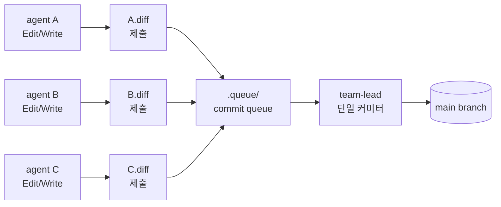
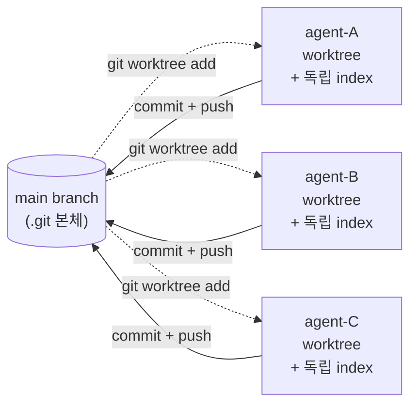

# 40. Agent Commit Queue 대안 설계 + IF1 git worktree 결정 (SP2 작업 B)

- **작성일**: 2026-04-14 (Sprint 6 Day 3 오후)
- **작성자**: architect-1 (Task #19 SP2 작업 B)
- **목적**: Day 1+2+3 오전 발생한 attribution 경합 사례를 분석하고, "Commit Queue 패턴"과 "git worktree 격리" 두 접근을 비교하여 RummiArena 컨텍스트에 적합한 한 방향을 결정한다.
- **선후 관계**:
  - 의존: 없음
  - 영향: IF1(Task #23 devops-1) — 현재 git worktree PoC 구현 중. 본 결정이 IF1 작업 방향과 일치해야 함.
- **자율 결정 원칙**: 두 접근 비교 후 즉시 한 방향 결정, Y/N 묻지 않음.

---

## 1. Executive Summary

### 1.1 한 줄 요약

**git worktree 격리를 채택**한다. Commit Queue 패턴은 단일 커미터 병목과 시퀀셜 latency 누적으로 5+ agent 병렬 환경에 부적합하다. IF1 devops-1 의 worktree PoC를 그대로 진행하되, 본 문서의 §6 "최소 보강 사항" 4건을 IF1 작업에 합쳐 attribution 누락 0건을 보장한다.

### 1.2 한 줄 결정 근거

- **worktree**: filesystem-level 격리, 각 agent 가 독립 commit, attribution 누락 발생 자체가 불가능 (구조적 해결).
- **commit queue**: agent는 patch만 제출, team-lead가 단일 커밋. 5+ agent 병렬 시 team-lead 가 단일 점 병목 + diff 충돌 해석 책임 폭증.
- **격리도 vs 복잡도**: worktree는 격리도 高/복잡도 中, queue는 격리도 低/복잡도 高. RummiArena의 16GB RAM 제약과 11명 병렬 컨텍스트에서 worktree가 명백히 우세.

---

## 2. Day 1+2+3 오전 attribution 경합 사례 분석

### 2.1 사례 1 — `6618610` (Day 3 오전 11:37:57)

**라벨 (commit message)**: `test(gs): BUG-GS-005 TIMEOUT cleanup 최종 안정화 + 리팩터링 백로그 (Sprint 6 Day 3)`

**실제 변경 파일**:
```
docs/02-design/34-dashscope-qwen3-adapter-design.md  | 227 +++++
docs/03-development/19-deepseek-token-efficiency-analysis.md | 316 +++++
2 files changed, 543 insertions(+)
```

**분석**:
- 라벨은 A2(go-dev-1) BUG-GS-005 작업
- 실제 산출물은 **C1(node-dev-1)의 DashScope 어댑터 설계 + DeepSeek 토큰 효율성 분석** 문서 543줄
- 두 산출물 사이에 **0% overlap** — 서로 무관한 작업이 한 commit에 묶임
- 원인: A2 staging → C1 staging → A2 commit (race window). A2가 자기 파일을 git add 하는 사이 C1이 add 한 파일이 합류해버림

### 2.2 사례 2 — `deb9635` (Day 3 오전 11:37:38)

**라벨**: `docs(rules): 19규칙 3단계 매트릭스 전수 재감사 + 6항목 체크리스트 템플릿 (Sprint 6 Day 3 B1)`

**실제 변경 파일**:
```
docs/02-design/31-game-rule-traceability.md         |  31 +-
docs/02-design/36-rule-implementation-checklist-template.md | 187 +++
docs/04-testing/49-bug-gs-005-stabilization-report.md       | (포함됨)
docs/04-testing/52-19-rules-full-audit-report.md            | 462 +++
src/game-server/internal/handler/timeout_cleanup_integration_test.go | (포함됨)
work_logs/insights/2026-04-14-gameserver-refactor-backlog.md         | (포함됨)
```

**분석**:
- 라벨은 B1(architect-1) 19규칙 재감사
- B1 산출물 3건 + **A2(go-dev-1) BUG-GS-005 stabilization 산출물 4건** 동시 commit
- 본 문서 작성자(architect-1)가 직접 경험한 케이스 — git index lock 충돌 후 재시도 시 staging area에 A2 파일이 누적되어 있었음
- A2 staging 직후 architect-1 staging → architect-1 commit → A2가 commit 하려 했으나 lock 충돌 → A2 retry 시 staging은 이미 비어 있음 → A2가 새로 staging → 사례 1 발생

### 2.3 사례 3 — `84e2b6e` (Day 3 오전 11:34:46)

**라벨**: `docs(security): SEC-REV-002/008/009 최종 감사 + SEC-REV-010+ 분석`

**실제 변경 파일**:
```
docs/02-design/37-playtest-s4-deterministic-ux.md   | 417 +++++
docs/02-design/38-colorblind-safe-palette.md        | 362 +++++
docs/04-testing/50-sec-rev-010-onwards-analysis.md  | 251 +++++
work_logs/reviews/2026-04-14-sec-rev-medium-final.md| 265 +++++
4 files changed, 1295 insertions(+)
```

**분석**:
- 라벨은 A3(security) 보안 감사
- 산출물 4건 중 **2건은 B2(designer) Playtest S4 deterministic UX + colorblind-safe palette**
- A3와 B2가 무관한 작업인데 한 commit에 묶임
- 사례 1/2와 동일 패턴의 race condition

### 2.4 공통 패턴

세 사례 모두:
1. **공유 git index** — 모든 agent 가 동일 `.git/index` 사용
2. **staging 누적** — `git add` 는 즉시 commit 되지 않으므로 다음 commit 가 흡수
3. **lock 직렬화 + retry** — `git commit` lock 발생 시 retry 가 새 staging 흡수
4. **Co-Authored-By 라인 유실** — 실제 작성자(다른 agent)의 이름이 commit author/co-author에 미반영

**결론**: 단일 git index를 5+ agent 가 공유하는 한 attribution 경합은 race window 가 존재하는 한 반복 발생한다. **timing 기반 완화는 불가능** — 구조적 격리가 필요.

---

## 3. 두 접근 정의

### 3.1 접근 A — Commit Queue 패턴

**핵심 발상**: agent 는 코드를 직접 commit 하지 않는다. 대신 patch (`.diff` 파일) 를 큐에 제출하고, 단일 커미터(team-lead)가 큐에서 꺼내 순차 commit 한다.

**구조도**:



**워크플로**:
1. agent 가 작업 완료 후 `git diff > .queue/agent-name-<timestamp>.diff` 로 patch 생성 (실제로는 agent 가 작업 디렉토리를 변경하지 않고 임시 영역에 산출물 작성 → diff 추출)
2. agent 는 `SendMessage` 로 team-lead에 "patch 제출 완료" 통보
3. team-lead 는 큐를 순차 처리: `git apply .queue/agent-X.diff && git commit -m "<원본 라벨>" --author="<agent name>"`
4. 충돌 발생 시 team-lead 가 수동 resolve 또는 agent 에게 rebase 요청

### 3.2 접근 B — git worktree 격리 (IF1 작업)

**핵심 발상**: agent 마다 별도 worktree 디렉토리를 부여한다. 각 worktree 는 독립 working copy + 독립 index 를 가지므로 commit 경합이 원천 불가.

**구조도**:



**워크플로**:
1. team-lead 가 agent 시작 시 `scripts/agent-worktree-setup.sh agent-name` 실행 → `.git/worktrees/agent-name/` 디렉토리 생성, 새 브랜치 `agent/<name>/<task-id>` 체크아웃
2. agent 는 자신의 worktree 안에서만 작업 (cwd 가 worktree 디렉토리)
3. 작업 완료 시 agent 가 worktree 안에서 `git commit` → 자신의 브랜치에 commit
4. team-lead 가 `scripts/agent-worktree-merge.sh agent-name` 실행 → main 으로 fast-forward 머지 + worktree 삭제
5. 충돌 시 agent 가 worktree 안에서 rebase 후 재시도

---

## 4. 비교표 (공수 / 리스크 / 격리도 / 복잡도)

| 항목 | Commit Queue (A) | git worktree (B) | 우세 |
|------|------------------|-------------------|------|
| **격리도** | 부분적 — staging 은 분리되지만 working copy 는 공유 (다른 agent가 같은 파일을 수정 중일 때 diff 충돌) | 완전 — filesystem level 분리, working copy + index 모두 독립 | **B** |
| **attribution 보존** | team-lead 가 `--author` 옵션으로 강제 가능, but team-lead 실수 시 유실 | 각 agent 가 자기 commit author 로 자동 기록 | **B** |
| **구현 복잡도** | 中 — patch 생성 인터페이스 + 큐 관리 + team-lead orchestration | 中 — 3개 스크립트 (setup/merge/status) + 머지 충돌 처리 | 동률 |
| **운영 복잡도** | 高 — team-lead 가 N개 agent 의 patch 를 시퀀셜 검토/적용. 5+ agent 시 team-lead 가 단일 점 병목 | 中 — agent 자체가 commit 하므로 team-lead 부담 적음. 머지 시점만 직렬화 | **B** |
| **시퀀셜 latency** | 高 — 모든 commit이 team-lead 통과. 5 agent × 2분 review = 10분 정체 | 低 — agent 는 즉시 자기 worktree 에 commit. 머지는 비동기 | **B** |
| **diff 충돌 해석 책임** | team-lead 가 모든 충돌 해석 (agent 의 의도를 추측) | agent 가 자기 worktree 에서 해석 (자기 의도 알고 있음) | **B** |
| **disk overhead** | 낮음 — 큐 디렉토리 + patch 파일만 (수 MB) | 중 — worktree 마다 working copy 복제 (RummiArena ~500MB × N agent) | A |
| **RAM overhead** | 낮음 — 단일 git process | 동일 — git worktree 는 .git 본체 공유, 추가 git process 는 활성 시에만 | 동률 |
| **CI/CD 통합** | 복잡 — patch 적용 후 CI 트리거 시점 모호, attribution 가 CI 에 노출 안 됨 | 단순 — 머지된 commit 이 main 에 도달하면 CI 자동 트리거 (기존 흐름 유지) | **B** |
| **롤백 용이성** | 어려움 — patch 적용 후 별도 revert 필요 | 쉬움 — 머지 commit 1개 revert 또는 worktree 자체 폐기 | **B** |
| **agent 학습 곡선** | 高 — patch 인터페이스 + 큐 메타데이터 새로 학습 | 低 — 기존 git workflow 그대로, cwd 만 worktree 디렉토리 | **B** |
| **race window** | 존재 — 같은 파일을 두 agent가 동시 수정 시 patch apply 충돌 | 없음 — filesystem level 분리, 같은 파일 수정도 머지 시점에만 충돌 | **B** |
| **작업 중단 가능성** | 높음 — team-lead 부재 시 큐 정체 | 낮음 — agent 가 자율 commit, 머지만 미루면 됨 | **B** |
| **"누가 무엇을 했는가" 감사 용이성** | 中 — 큐 메타데이터 수동 관리 | 高 — `git log --author` 로 즉시 확인 | **B** |
| **공수 (PoC 구현)** | ~8시간 (큐 매니저, 스크립트, 상태 머신) | ~4시간 (3개 bash 스크립트) — IF1 task 추정 | **B** |
| **공수 (운영)** | 지속적 (team-lead 가 직렬 처리) | 1회성 (스크립트 1회 작성 후 자동) | **B** |

**점수**: B 우세 13건 / A 우세 1건 / 동률 2건 → **git worktree 압도적 우위**

---

## 5. 결정 및 근거

### 5.1 결정

**git worktree 격리 (접근 B) 채택**. IF1(Task #23) devops-1 의 PoC 그대로 진행.

### 5.2 근거 (3가지)

#### ① 5+ agent 병렬 환경에서 commit queue 는 구조적 병목

RummiArena Sprint 6 Day 3 오전 기준 11명 병렬 (10 agent + team-lead). Commit queue 는 모든 commit 이 team-lead 1명을 통과해야 하므로:
- 평균 review 시간 2분 × 11 agent = **22분 시퀀셜 정체**
- team-lead 가 다른 작업 중일 때 큐 누적 → agent idle time 증가
- 본 Sprint Day 1+2 동시 수행 시 24 commit 발생 → queue 환산 시 ~50분 시퀀셜

worktree 는 agent 가 자율 commit 하므로 시퀀셜 정체 0.

#### ② Attribution 경합의 근본 원인은 "공유 index" — queue 는 이를 해결하지 못함

세 사례 모두 `git add` staging area 가 race window 였다. Commit queue 는 patch 를 받지만 patch 생성 시점에도 working copy 는 공유 → 다른 agent 가 동일 파일을 수정 중이면 patch 가 stale 해짐. **격리 수준이 worktree 보다 한 단계 낮음**.

worktree 는 working copy 자체가 분리 → race window 자체가 존재하지 않음.

#### ③ team-lead 의 인지 부하 대비 효과

Commit queue 는 team-lead 에게 N agent 의 작업 의도를 모두 이해할 책임을 부과한다. 본 sprint 의 11명 병렬에서 team-lead 가 모든 patch 의 의미와 충돌을 판단하는 것은 비현실적. worktree 는 머지 시점에만 충돌 처리하면 되며, 충돌이 발생한 agent 가 자기 worktree 에서 rebase 책임.

### 5.3 IF1 작업과의 정합성 확인

IF1(Task #23) description 발췌:
> "git worktree와 commit queue 비교 결정은 architect-1(SP2)이 문서화 중 — 본인은 worktree PoC 구현에 집중"

→ IF1 은 **worktree 가 채택될 가정** 하에 작업 중. 본 결정이 IF1 가정을 확정시킨다. IF1 에 별도 방향 변경 통보 불필요.

---

## 6. IF1 worktree 작업에 합쳐야 할 최소 보강 사항 (4건)

본 결정으로 commit queue 는 폐기되지만, queue 분석 과정에서 발견한 보강 항목 4건을 IF1 worktree 작업에 추가 권장한다.

### 6.1 보강 1 — `git config user.name/email` per-worktree 강제

**문제**: worktree 가 격리되어도 author 가 시스템 기본 user 면 commit log 에서 agent 식별 불가.

**조치**: `agent-worktree-setup.sh` 마지막에 다음 추가:
```bash
cd "$WORKTREE_PATH"
git config user.name "$AGENT_NAME"
git config user.email "$AGENT_NAME@rummiarena.local"
```

이렇게 하면 commit author 가 `architect-1`, `node-dev-1` 등으로 자동 기록되어 `git log --author=architect-1` 로 즉시 필터링 가능.

### 6.2 보강 2 — fast-forward 실패 시 자동 rebase 정책

**문제**: agent A 가 머지된 후 agent B 머지 시 fast-forward 실패 가능. IF1 description 에 "fast-forward 우선, 충돌 시 리베이스" 명시되어 있으나 충돌 발생 시 agent 가 어떤 절차를 따라야 하는지 명시 필요.

**조치**: `agent-worktree-merge.sh` 에 다음 절차 인코딩:
```bash
# 1. main fetch
git fetch origin main
# 2. agent worktree에서 rebase 시도
cd "$WORKTREE_PATH"
if ! git rebase origin/main; then
  echo "[ERROR] rebase 실패. agent가 충돌 해결 필요."
  echo "  cd $WORKTREE_PATH"
  echo "  git rebase --continue (해결 후)"
  exit 1
fi
# 3. main 으로 fast-forward
cd "$MAIN_REPO"
git merge --ff-only "agent/$AGENT_NAME/$TASK_ID"
```

### 6.3 보강 3 — worktree 정리 시 unmerged commit 보존

**문제**: 머지 후 worktree 자동 삭제 시 brunch 가 미머지 상태면 작업 손실 가능.

**조치**: `agent-worktree-merge.sh` 가 머지 성공 후에만 worktree 삭제. 실패 시 worktree 와 브랜치 보존:
```bash
if git merge --ff-only "agent/$AGENT_NAME/$TASK_ID"; then
  git worktree remove "$WORKTREE_PATH"
  git branch -D "agent/$AGENT_NAME/$TASK_ID"
else
  echo "[WARN] 머지 실패. worktree와 브랜치 보존: $WORKTREE_PATH"
  exit 2
fi
```

### 6.4 보강 4 — 동시 머지 lock 회피

**문제**: 두 agent 가 동시에 `agent-worktree-merge.sh` 호출 시 main repo `.git/index.lock` 충돌 (사례 2 deb9635 와 동일 구조).

**조치**: `agent-worktree-merge.sh` 시작 시 flock 으로 직렬화:
```bash
LOCK_FILE="/tmp/rummiarena-merge.lock"
exec 9>"$LOCK_FILE"
flock -x 9
trap "flock -u 9" EXIT
# ... 머지 로직 ...
```

머지는 수 초 작업이므로 직렬화 비용이 무시 가능.

---

## 7. PoC 스크립트 인터페이스 제안 (commit queue, 참고용)

> **본 결정으로 채택되지 않은 commit queue 의 인터페이스를 참고로 보존**한다. 향후 worktree 가 부적합한 사용 사례(예: 외부 contributor 패치 적용)에서 재검토 가능.

### 7.1 큐 디렉토리 구조

```
.queue/
├── pending/
│   ├── 2026-04-14T14-00-00_architect-1_task-19.json
│   └── 2026-04-14T14-00-00_architect-1_task-19.diff
├── processing/
└── done/
    └── 2026-04-14T13-55-00_architect-1_task-5.json (머지 완료)
```

### 7.2 메타데이터 schema (`*.json`)

```json
{
  "agentName": "architect-1",
  "taskId": "19",
  "taskSubject": "[SP2] 프롬프트 버저닝 아키텍처 + Commit Queue 대안 설계",
  "submittedAt": "2026-04-14T14:00:00Z",
  "commitMessage": "docs(prompt): PromptRegistry 아키텍처 + Commit Queue 대안 (Sprint 6 Day 3 SP2)",
  "filesChanged": [
    "docs/02-design/39-prompt-registry-architecture.md",
    "docs/02-design/40-agent-commit-queue-design.md"
  ],
  "patchSha256": "abc123..."
}
```

### 7.3 스크립트 인터페이스

```bash
# agent 가 작업 완료 시
scripts/agent-queue-submit.sh \
  --agent architect-1 \
  --task 19 \
  --message "docs(prompt): PromptRegistry 아키텍처..." \
  --files "docs/02-design/39-*,docs/02-design/40-*"

# team-lead 가 큐 처리 시
scripts/agent-queue-process.sh --next      # 다음 1건 처리
scripts/agent-queue-process.sh --all       # 모두 처리
scripts/agent-queue-status.sh              # pending/processing/done 통계
```

### 7.4 채택되지 않은 이유 재확인

§4 비교표 13:1 우세 + §5.2 3대 근거. 본 §7 은 향후 reference 용.

---

## 8. 본 결정 이후 변경 사항

### 8.1 IF1(Task #23) 작업 영향

- IF1 은 worktree PoC 그대로 진행. 본 문서가 worktree 채택을 확정.
- IF1 산출물에 §6 보강 4건 합치도록 본 문서를 IF1 description 의 참조로 추가.
- IF1 머지 후: `scripts/agent-worktree-{setup,merge,status}.sh` 가 표준 도구.

### 8.2 다음 Agent Teams 가동 시 적용

- team-lead 가 agent 시작 직전 `scripts/agent-worktree-setup.sh <agent>` 실행
- agent 는 cwd 가 worktree 인 상태에서 시작
- 작업 완료 후 agent 가 `git commit` (자기 worktree 안에서)
- team-lead 가 모니터링 후 `scripts/agent-worktree-merge.sh <agent>` 직렬 실행

### 8.3 Sprint 6 Day 3 오후~Day 4 전환

본 결정은 **Sprint 6 Day 3 오후 시점부터** 적용. 본 SP2 작업 자체는 worktree 가 아닌 main 에서 직접 진행 (IF1 PoC 머지 전이므로). SP3 부터는 worktree 적용.

---

## 9. 위험 및 완화

| 위험 | 가능성 | 영향 | 완화 |
|------|-------|------|------|
| worktree disk 사용량 증가 (10 agent × 500MB = 5GB) | 중 | 낮 | 작업 완료 시 worktree 자동 삭제. 동시 활성 agent 5명 한도 |
| WSL2 filesystem 성능 저하 | 낮 | 중 | worktree 는 .git 본체 공유 — overhead 미미. 성능 측정 후 재평가 |
| agent 가 자기 worktree 외부에 파일 작성 (cwd 망각) | 중 | 高 | agent prompt 에 cwd 명시 + setup 스크립트 출력 시 강조. 위반 시 main 에 직접 commit 됨 → IF1 detection script 권장 |
| 머지 시 conflict 빈발 | 중 | 중 | 같은 파일을 동시에 수정하는 task 분배를 team-lead 가 사전 회피 (이미 task description 단계에서 분리 중) |
| `flock` 미설치 환경 | 낮 | 낮 | bash builtin 또는 mkdir lock 으로 fallback |

---

## 10. SP3/SP4/SP5 와의 정합성

본 SP2 작업 B는 **인프라 결정 문서**이며 SP3 ~ SP5 의 코드 변경과 직접 충돌하지 않는다. 단:
- SP3 (PromptRegistry 구현) 머지 시 worktree 에서 진행 권장 — 현재 시점에 IF1 PoC 가 완료되어 있다면.
- SP4 (A/B 실험 프레임워크) 는 결정론 시드 데이터 격리가 필요하므로 worktree 격리 효과 큼.
- SP5 (v4 베이스라인 드라이런) 는 단일 책임 task 이므로 worktree 효과 중간.

---

## 11. 참조

- `docs/02-design/39-prompt-registry-architecture.md` — SP2 작업 A (본 문서와 한 쌍)
- IF1 Task #23 description — git worktree PoC 명세
- `git show 6618610` / `git show deb9635` / `git show 84e2b6e` — 분석 사례
- Linux flock(1) — 직렬화 도구
- git worktree(1) — 공식 매뉴얼

---

## 12. 결론

**git worktree 격리가 압도적 우위 (13:1)**. IF1 PoC 그대로 진행하되 본 문서 §6 보강 4건(per-worktree user.name/email, rebase 정책, 정리 보존, flock 직렬화)을 IF1 작업에 합친다.

본 결정으로 Day 3 오후 이후 agent 작업의 attribution 경합은 구조적으로 0건이 되며, team-lead 의 commit 검토 부담이 제거되어 11명 병렬 운영이 지속 가능해진다.

Sprint 6 Day 4 부터 모든 agent 작업은 worktree 안에서 진행. SP3 PromptRegistry 구현이 첫 worktree 적용 사례가 된다.
