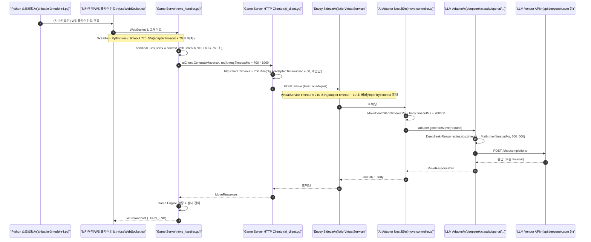

# 40. Game Server ↔ AI Adapter 타임아웃 체인 분해도

- 작성일: 2026-04-16 (Sprint 6 Day 4)
- 작성자: architect
- 상태: 정식 (Authoritative)
- 연관 문서:
  - `docs/02-design/20-istio-selective-mesh-design.md` §4.5 (VirtualService 설계 원본)
  - `docs/02-design/25-cloud-local-llm-integration.md` (타임아웃 체인 개념 도입)
  - `docs/02-design/34-dashscope-qwen3-adapter-design.md` §7 (DashScope 타임아웃 레이어)
  - `docs/02-design/36-istio-phase-5.2-verification.md` (Phase 5.2 검증 체크리스트)
  - `docs/01-planning/17-sprint6-kickoff-directives.md` I1/I4 (Istio VS 상향 지시 원본)

---

## 1. 이 문서를 만든 이유

Sprint 6 Day 4 Round 6 Phase 2 DeepSeek Run 3 대전 T68 턴에서 `DRAW (fallback: AI_TIMEOUT) [500.4s]` 가 발생했다. 직전 배포에서 `AI_ADAPTER_TIMEOUT_SEC` 를 500 → 700 초로 상향했지만, Istio VirtualService 의 `timeout` 이 여전히 `510s` 로 남아있어 **Envoy 사이드카가 500 초에 끊어 먹고 fallback 으로 오인**되었다. 3시간짜리 본 대전이 오염되었다.

근본 원인은 **"타임아웃 한 값을 바꿀 때 함께 바뀌어야 할 지점의 전수 목록이 존재하지 않았다"** 는 것이다. `AI_ADAPTER_TIMEOUT_SEC` ConfigMap 한 줄만 바꾸면 끝나는 것처럼 보이지만, 실제로는 최소 10 개 지점이 맞물려 있다. 이 문서가 그 맞물림을 명시적으로 고정한다.

---

## 2. 전체 타임아웃 체인 시퀀스



체인의 핵심은 **단 하나** — 가장 안쪽(LLM 쪽) 의 시한이 가장 짧고 바깥으로 갈수록 조금씩 길어져야 한다는 부등식이다. 이 부등식이 깨지면, 안쪽이 아직 성공할 수도 있는 상태에서 바깥쪽 타이머가 먼저 끊어 **정상 응답을 fallback 으로 오분류**한다. Sprint 6 Day 4 Run 3 이 바로 이 패턴이다.

---

## 3. 구간별 타임아웃 레지스트리

**기준일: 2026-04-27 (Sprint 7 W2). 기준값: `AI_ADAPTER_TIMEOUT_SEC = 1000` (DeepSeek Reasoner 체인 상향).**

| # | 구간 | 값 (2026-04-27 기준) | 위치 (파일 또는 리소스) | 소비 주체 | 역할 | 변경 공식 |
|---|------|---|---|---|---|---|
| 1 | Python recv_timeout (DeepSeek) | `1070` 초 | `scripts/ai-battle-3model-r4.py:77` (`ws_timeout`) | Python 스크립트 | 스크립트 쪽 WS recv poll 타임아웃. 가장 바깥 층 | `AI_ADAPTER_TIMEOUT_SEC + 70` |
| 2 | Game Server `handleAITurn` context | `1060` 초 | `src/game-server/internal/handler/ws_handler.go:874` | goroutine context | AI 턴 전체의 고수위 데드라인 | `aiTimeoutSec + 60` (코드 상 고정) |
| 3 | Game Server `MoveRequest.TimeoutMs` | `1_000_000` ms | `src/game-server/internal/handler/ws_handler.go:902` | ai-adapter 에 전달되는 DTO 필드 | 내부 LLM 호출용 시한 예산 | `aiAdapterTimeoutSec * 1000` |
| 4 | Game Server `http.Client.Timeout` | `1060` 초 | `src/game-server/cmd/server/main.go:123-124` | Go net/http 클라이언트 | POST /move 전체 HTTP 왕복 시한 | `cfg.AIAdapter.TimeoutSec + 60` |
| 5 | viper 기본값 (game-server) | `1000` | `src/game-server/internal/config/config.go:92` | env 없을 때의 fallback | 안전망 — env 누락 시 동작 보장 | "정상 운영값보다 크거나 같게" 또는 "음수로 실패" |
| 6 | Helm values game-server | `1000` | `helm/charts/game-server/values.yaml:33` | Helm rendering | ConfigMap `game-server-config` 시드값 | `AI_ADAPTER_TIMEOUT_SEC` 기준값과 **항상 동일** |
| 7 | ConfigMap `game-server-config` (live) | `1000` | `kubectl -n rummikub get cm game-server-config` | Pod envFrom | Helm 렌더 결과 또는 `kubectl patch` 결과 | (#6 과 반드시 동기) |
| 8 | Helm values ai-adapter | (없음) | `helm/charts/ai-adapter/values.yaml` | -- | -- | **해당 env 를 소비하지 않으므로 추가하지 말 것** |
| 9 | ConfigMap `ai-adapter-config` (live) | (없음) | `kubectl -n rummikub get cm ai-adapter-config` | -- | -- | **§8 위반 2 참조 — ai-adapter 는 req.timeoutMs 로 수신** |
| 10 | Istio `VirtualService` timeout | `1010` 초 | `istio/virtual-service-ai-adapter.yaml:16` + live VS | Envoy 사이드카 | East-West LLM 호출 전체 시한 | `AI_ADAPTER_TIMEOUT_SEC + 10` |
| 11 | Istio `VirtualService` perTryTimeout | `1010` 초 | `istio/virtual-service-ai-adapter.yaml:20` + live VS | Envoy 사이드카 | 재시도 1 회당 시한 | `AI_ADAPTER_TIMEOUT_SEC + 10` (timeout 과 동일) |
| 12 | Istio `DestinationRule` connectTimeout | `10` 초 | `istio/destination-rule-ai-adapter.yaml:20` | Envoy TCP 연결 | TCP handshake 시한 (응답 대기와 무관) | 고정 |
| 13 | NestJS `MoveRequestDto.timeoutMs` 기본값 | `30_000` ms | `src/ai-adapter/src/move/move.controller.ts:189` | MoveService | 호출자(game-server)가 안 보낼 때 방어값 | 고정 30 초 — game-server 에서 항상 주입되므로 실제 경로 미사용 |
| 14 | DeepSeek Reasoner min floor | `1_000_000` ms | `src/ai-adapter/src/adapter/deepseek.adapter.ts:271` | axios timeout | reasoner 전용 하한선 | `Math.max(timeoutMs, AI_ADAPTER_TIMEOUT_SEC * 1000)` |
| 15 | Claude thinking min floor | `210_000` ms | `src/ai-adapter/src/adapter/claude.adapter.ts:114` | axios timeout | extended thinking 전용 하한선 | 현 Claude 사고 실측이 낮으므로 `210_000` 유지. v4 측정 이후 재검토 |
| 16 | Ollama min floor | `210_000` ms | `src/ai-adapter/src/adapter/ollama.adapter.ts:29` | axios timeout | CPU 추론 하한선 | 유지 |
| 17 | OpenAI reasoning min floor | `210_000` ms | `src/ai-adapter/src/adapter/openai.adapter.ts:31,112` | axios timeout | gpt-5-mini reasoning 하한선 | 유지 |
| 18 | DashScope thinking-only min | `600_000` ms | `src/ai-adapter/src/adapter/dashscope/dashscope.service.ts:51` | axios timeout | qwen3 thinking-only 하한선 | 1_000_000 ms 로 상향 검토 (v4 Run 실측 기준 재평가 후) |
| 19 | Game Server `http.Server.ReadTimeout` | `15` 초 | `src/game-server/cmd/server/main.go:54` | HTTP 인바운드 | REST 본문 수신 시한 | 무관 (POST /move 는 내부 요청이 아니라 game-server 가 클라이언트) |
| 20 | Game Server `http.Server.WriteTimeout` | `0` | `src/game-server/cmd/server/main.go:60` | HTTP 인바운드 | WS Hijack 후 무제한 | 의도된 설정 — 변경 금지 |
| 21 | Game Server `http.Server.IdleTimeout` | `60` 초 | `src/game-server/cmd/server/main.go:61` | HTTP keep-alive | keep-alive idle 시한 | 무관 |

**§8 에서 현 drift 목록을 다룬다.**

---

## 4. 부등식 계약 (변경 금지)

모든 타임아웃은 다음 부등식을 **항상** 만족해야 한다. 바깥이 안쪽보다 짧으면, 안쪽의 정상 응답을 바깥이 끊어 fallback 오분류가 발생한다.

```
py_ws_timeout (1)
   >  handleAITurn_ctx (2)
      >  go_http_client (4)
         >  istio_vs_timeout (10) == istio_vs_perTry (11)
            >  adapter_internal_timeout (=request.timeoutMs, 3)
               >  llm_vendor_min_floor (14, 15, 16, 17, 18 중 해당 모델)
```

권장 마진:

| 인접 쌍 | 마진 |
|---|---|
| (1) - (2) | 10 초 (Python poll 여유) |
| (2) - (4) | 0 초 (둘 다 같은 공식 `adapter + 60`) |
| (4) - (10) | 50 초 (Istio 버퍼를 얇게, Go context 를 두껍게) |
| (10) - (3) | 10 초 (Istio 가 LLM 예산보다 10 초 넉넉) |
| (3) - (14~18) | 0 초 (adapter 는 `Math.max` 로 하한만 올림) |

### 2026-04-27 기준 수치 예 (`AI_ADAPTER_TIMEOUT_SEC = 1000`)

| 레이어 | 값 | 공식 |
|---|---|---|
| Python ws_timeout | 1070 초 | 1000 + 70 |
| handleAITurn ctx | 1060 초 | 1000 + 60 |
| Go http.Client | 1060 초 | 1000 + 60 |
| Istio VS timeout | 1010 초 | 1000 + 10 |
| Istio VS perTryTimeout | 1010 초 | 동일 |
| request.timeoutMs | 1_000_000 ms | 1000 * 1000 |
| DeepSeek adapter floor | 1_000_000 ms | `Math.max(timeoutMs, 1_000_000)` |

---

## 5. 변경 시 체크리스트 (재발 방지의 핵심)

`AI_ADAPTER_TIMEOUT_SEC` 값을 한 번이라도 건드리면 다음 지점을 **전부** 함께 수정·검증한다. 두 개 이상 빠지면 반드시 timeout drift 가 발생한다.

### 5.1 소스 레포 (커밋 대상)

| # | 파일 | 수정 내용 |
|---|---|---|
| 1 | `helm/charts/game-server/values.yaml:33` | `AI_ADAPTER_TIMEOUT_SEC` 새 값 |
| 2 | `src/game-server/internal/config/config.go:92` | viper SetDefault 새 값 (또는 "음수" 유지 정책 — §6 참조) |
| 3 | `istio/virtual-service-ai-adapter.yaml:16` | `timeout: (새 값 + 10)s` |
| 4 | `istio/virtual-service-ai-adapter.yaml:20` | `perTryTimeout: (새 값 + 10)s` |
| 5 | `istio/virtual-service-ai-adapter.yaml:5` | 파일 상단 주석 수식 (예: "ConfigMap 700s + 10s = 710s") |
| 6 | `src/game-server/cmd/server/main.go:123` | `time.Duration(cfg.AIAdapter.TimeoutSec + 60) * time.Second` (§8 위반 1 수정 후) |
| 7 | `scripts/ai-battle-3model-r4.py:77` | `ws_timeout = 새 값 + 70` (DeepSeek 전용 — Claude/GPT/Ollama 는 별도 정책) |
| 8 | `src/ai-adapter/src/adapter/deepseek.adapter.ts:220` | `Math.max(timeoutMs, 새 값 * 1000)` |
| 9 | `docs/02-design/40-timeout-chain-breakdown.md` | 본 문서 §3, §4 의 Day N 기준 수치 갱신 (footer 에 이력 남김) |
| 10 | `docs/02-design/20-istio-selective-mesh-design.md` §4.5 | YAML 블록 타임아웃 숫자 |
| 11 | `docs/02-design/25-cloud-local-llm-integration.md` | 타임아웃 표 값 |
| 12 | `docs/02-design/34-dashscope-qwen3-adapter-design.md` §7 | 표 값 |
| 13 | `docs/02-design/36-istio-phase-5.2-verification.md` | §2.2 검증 기준 |
| 14 | `docs/01-planning/17-sprint6-kickoff-directives.md` I1/I4 | 지시 정합 값 |
| 15 | `docs/03-development/01-dev-setup.md:208` | env 표 |
| 16 | `docs/02-design/11-ai-move-api-contract.md:415` | env 표 |
| 17 | `docs/05-deployment/07-secret-injection-guide.md:88` | env 표 |

### 5.2 라이브 클러스터 (kubectl)

| # | 리소스 | 명령 |
|---|---|---|
| 18 | `cm/game-server-config` | `kubectl -n rummikub patch cm game-server-config --type merge -p '{"data":{"AI_ADAPTER_TIMEOUT_SEC":"<새 값>"}}'` |
| 19 | `deploy/game-server` | `kubectl -n rummikub rollout restart deploy/game-server` (envFrom 변경은 자동 반영 안 됨) |
| 20 | `vs/ai-adapter` | `kubectl -n rummikub apply -f istio/virtual-service-ai-adapter.yaml` (또는 ArgoCD sync) |
| 21 | `deploy/ai-adapter` | `kubectl -n rummikub rollout restart deploy/ai-adapter` (envoy 설정 재적용 트리거) |

### 5.3 검증 (반드시 실행)

| # | 항목 | 명령 |
|---|---|---|
| 22 | 라이브 VS timeout | `kubectl -n rummikub get vs ai-adapter -o jsonpath='{.spec.http[0].timeout}'` → 새 값 +10 확인 |
| 23 | 라이브 CM | `kubectl -n rummikub get cm game-server-config -o jsonpath='{.data.AI_ADAPTER_TIMEOUT_SEC}'` → 새 값 확인 |
| 24 | game-server 런타임 env | `kubectl -n rummikub exec deploy/game-server -- printenv AI_ADAPTER_TIMEOUT_SEC` → 새 값 확인 |
| 25 | Envoy 실제 route timeout | `kubectl -n rummikub exec deploy/game-server -c istio-proxy -- pilot-agent request GET config_dump` 에서 `ai-adapter` 라우트 timeout 확인 |
| 26 | Go 빌드 | `cd src/game-server && go build ./...` |
| 27 | Go 유닛 테스트 | `cd src/game-server && go test ./internal/handler/... ./internal/config/...` |
| 28 | ai-adapter 유닛 테스트 | `cd src/ai-adapter && npm run test -- --testPathPattern='adapter/(deepseek|claude|openai|ollama|dashscope)'` |
| 29 | smoke 대전 | DeepSeek 1 판, 10 턴 제한, fallback 0 확인 |

---

## 6. viper default 정책

현재 `config.go:92` 는 `viper.SetDefault("AI_ADAPTER_TIMEOUT_SEC", 500)` 이다. 이 숫자의 존재 자체가 **"ConfigMap 이 누락되었을 때 500 초로 조용히 돌아간다"** 는 의미이며, 이번 사고처럼 ConfigMap 은 700 이지만 소스의 default 가 500 으로 갱신되지 않은 drift 를 유발한다.

두 가지 선택지가 있다.

### 선택지 A — default 를 안전값으로 유지 + 운영값과 항상 동기

- `config.go:92` 의 default 를 소스 레포의 Helm values 와 **항상 같은 숫자**로 유지
- 체크리스트 #2 가 이 동기화를 강제
- 장점: 로컬 dev 실행(`go run`) 시에도 정상 동작
- 단점: 사람이 까먹으면 drift 재발

### 선택지 B — default 를 제거하고 필수 env 로 강제

- `viper.SetDefault` 줄 삭제
- `Load()` 끝부분에 `if cfg.AIAdapter.TimeoutSec <= 0 { log.Fatal("AI_ADAPTER_TIMEOUT_SEC must be set") }` 추가
- 장점: drift 가 원천 차단됨 (ConfigMap 누락 = Pod CrashLoopBackOff)
- 단점: 로컬 dev 는 `export AI_ADAPTER_TIMEOUT_SEC=700` 을 매번 해줘야 함

**권장: 선택지 A + 선택지 B 혼합.** dev 환경에서는 300 등 작은 default 를 허용하되, production (`APP_ENV=production`) 에서는 `AI_ADAPTER_TIMEOUT_SEC` 미설정이면 fatal. `JWT_SECRET` 과 같은 패턴 (`config.go:159-164` 참조).

---

## 7. Sprint 5 → 6 값 변화 이력

| 시점 | 값 | 근거 |
|---|---|---|
| 초기 (Sprint 3) | `180` 초 | OpenAI 비추론 시절 기본값 |
| Sprint 4 | `200` 초 | Istio 사전 설계 당시 VS timeout 과 맞춤 (`docs/02-design/20-istio-selective-mesh-design.md:311` stale) |
| Sprint 5 Day 5 (2026-04-10) | `240 → 500` 초 | DeepSeek Reasoner Run 3 에서 356 초 관찰 → 500 으로 상향, fallback 9 → 0 달성 |
| Sprint 6 Day 4 (2026-04-15) | `500 → 700` 초 | v4 프롬프트 + Thinking Budget 허가로 사고 시간 자율 확장 → 500 초 한계 근접 (Run 5 T70/T76 435/434 s) |
| Sprint 6 Day 4 사고 (2026-04-16) | 소스 drift 발견 | game-server env 700 / Istio VS 510 / Helm values 500 drift — 본 문서 작성 계기 |
| Sprint 7 W2 (2026-04-27) | `700 → 1000` 초 | 체인 전수 상향. 새 부등식: script_ws(1070) > gs_ctx(1060) > http_client(1060) > istio_vs(1010) > adapter(1000) |

---

## 8. drift 이력 (해결 완료)

### 위반 1 — `http.Client.Timeout` 버퍼 없음 (2026-04-27 해결)

**위치**: `src/game-server/cmd/server/main.go:131`

**수정 완료**: `time.Duration(cfg.AIAdapter.TimeoutSec + 60) * time.Second` (= 1060 초). `handleAITurn` context 와 동일 공식. §4 부등식 `go_http_client(1060) > istio_vs(1010)` 준수.

### 위반 2 — `ai-adapter` 에 `AI_ADAPTER_TIMEOUT_SEC` 소비 없음 (문서화 완료)

ai-adapter 는 `AI_ADAPTER_TIMEOUT_SEC` env 를 소비하지 않는다. game-server 가 각 요청의 `body.timeoutMs` 필드로 주입한다. Helm values 와 ConfigMap 에 이 env 를 추가하지 말 것. (§3 #8, #9 항목에 명시)

### 위반 3 — Istio VS timeout drift (2026-04-27 해결)

**수정 완료**: `istio/virtual-service-ai-adapter.yaml` timeout/perTryTimeout = `1010s`. live VS 동기 확인.

---

## 9. 부록 — adapter 하한값 근거

각 LLM adapter 에 "최소 timeout floor" 가 있는 이유는, game-server 가 실수로 작은 `timeoutMs` 를 전달해도 reasoning 모델의 기본 응답 시간(수 초 ~ 수백 초) 을 보장하기 위함이다. 이 floor 는 **정상 응답의 하한선** 이지, **허용 최대치** 가 아니다.

| adapter | floor | 근거 |
|---|---|---|
| DeepSeek Reasoner | 500_000 → **700_000 ms** (변경 제안) | Run 5 T70/T76 에서 435/434 s 관찰, v4 Thinking Budget 정책 |
| Claude extended thinking | 210_000 ms | extended thinking budget_tokens=10000 의 실측 평균 ~120~180 s |
| OpenAI reasoning (gpt-5-mini) | 210_000 ms | reasoning_tokens ≤ 3k 기준 실측 평균 ~60~150 s |
| Ollama (qwen2.5:3b) | 210_000 ms | CPU 추론 평균 ~100~180 s |
| DashScope thinking-only (qwen3) | 600_000 → **700_000 ms** (검토) | 설계 문서 34 §7.2 "600 초 floor" 는 500 초 ConfigMap 기준이었음 |

DashScope 는 Round 6 Phase 2 에 실제 투입되는 모델이므로, v4 시나리오에서 DeepSeek 과 같은 시한 정책을 쓸지 여부를 대전 실측 이후 결정한다.

---

## §6. UX 타이머 레지스트리 (프론트엔드)

- 작성일: 2026-04-26 (Sprint 7 W2)
- 작성자: node-dev
- 대상: `src/frontend/src/` 전체 (node_modules, `__tests__` 제외)

프론트엔드 레이어에는 §3 서버/인프라 타임아웃과 별개로 동작하는 UX 타이머가 존재한다. 이 타이머들은 주로 **사용자에게 시각적 피드백을 주거나**, **재연결 로직을 실행하거나**, **폴링으로 서버 상태를 동기화**하는 역할을 한다. 서버 체인과 직접 부등식 관계를 맺는 항목(U-04, U-08)은 별도로 표기한다.

### 6.1 타이머 목록

| # | 타이머 ID | 위치 (파일:라인) | 기본값 | 단위 | 용도 | 관련 룰/이벤트 |
|---|-----------|----------------|--------|------|------|--------------|
| U-01 | 턴 타이머 카운트다운 | `hooks/useTurnTimer.ts:40` | 서버 전달값 (`timeoutSec`) | 1,000 ms tick | `remainingMs`를 1초 단위로 차감. 서버 `TURN_START` 수신 시 리셋 | UR-05 (턴 제한 시간) |
| U-02 | 에러 토스트 자동 소멸 | `components/game/ErrorToast.tsx:7,29` | 5,000 ms | ms | `INVALID_MOVE` 에러 메시지 상단 표시 후 자동 닫기 | `INVALID_MOVE` WS 이벤트 |
| U-03 | 초기 등록 잠금 토스트 자동 소멸 | `components/game/ExtendLockToast.tsx:6,34` | 4,000 ms | ms | UX-004 초기 등록 미완료 안내 토스트 4초 후 자동 소멸 | UR-21 (초기 등록 잠금) |
| U-04 | TURN_START 미전송 방어 fallback | `hooks/useWebSocket.ts:284` | 2,000 ms | ms | `TURN_END` 수신 후 2초 내 `TURN_START`가 미도달 시 클라이언트 자체 턴 시작 처리 (BUG-WS-001 방어 로직) | `TURN_END` WS 이벤트 |
| U-05 | WS 스로틀 쿨다운 해제 | `hooks/useWebSocket.ts:42,523` | 10,000 ms | ms | `RATE_LIMITED` 이벤트 수신 후 10초 동안 WS 발신 스로틀링 유지. 경과 후 스로틀 해제 | `ERROR(RATE_LIMITED)` WS 이벤트 |
| U-06 | Rate Limit 토스트 자동 소멸 (쿨다운 없음) | `components/game/RateLimitToast.tsx:9-11,79` | 6,000 ms (stage 0-1) / 8,000 ms (stage 2) | ms | HTTP 429 또는 WS RATE_LIMITED 위반 횟수(stage)에 따라 토스트 표시 시간 차등 | HTTP 429 / WS RATE_LIMITED |
| U-07 | Rate Limit 쿨다운 종료 후 토스트 지연 소멸 | `components/game/RateLimitToast.tsx:90` | 2,000 ms | ms | 쿨다운 카운트다운이 0이 된 직후 토스트를 바로 닫지 않고 2초 유예 후 소멸 | Rate Limit 쿨다운 완료 |
| U-08 | WS 재연결 지연 (지수 백오프) | `hooks/useWebSocket.ts:37,626,645` | 초기 3,000 ms (최대 48,000 ms) | ms | WS close 이벤트 발생 시 3초→6초→12초→24초→48초 순서로 지수 백오프 재연결. 최대 5회 | WS `onclose` (비재연결 불가 코드 제외) |
| U-09 | WS 재연결 카운트다운 tick | `hooks/useWebSocket.ts:635` | 1,000 ms | ms | 재연결 대기 중 남은 초를 화면에 표시하기 위한 1초 interval | WS `onclose` (재연결 대기 중) |
| U-10 | 재접속 알림 토스트 자동 소멸 | `components/game/ReconnectToast.tsx:7,27` | 3,000 ms | ms | 다른 플레이어 재접속 시 상단 토스트 3초 후 자동 소멸 | `PLAYER_RECONNECTED` WS 이벤트 |
| U-11 | 대기실 Room 상태 폴링 | `app/room/[roomId]/WaitingRoomClient.tsx:205` | 5,000 ms | ms | 대기실에서 방 상태(플레이어 목록, 게임 시작 여부)를 5초마다 REST GET으로 갱신 | WS 없는 대기실 구간 |
| U-12 | 로비 방 목록 폴링 | `app/lobby/LobbyClient.tsx:226` | 30,000 ms | ms | 로비 방 목록을 30초마다 자동 갱신 | 로비 페이지 상주 중 |
| U-13 | 초대 링크 복사 확인 표시 | `app/room/[roomId]/WaitingRoomClient.tsx:222` | 2,000 ms | ms | 초대 링크 복사 버튼 클릭 시 "복사됨" 피드백을 2초간 표시 후 원상복귀 | 사용자 복사 액션 |
| U-14 | 연결 끊김 플레이어 grace 카운트다운 tick | `app/game/[roomId]/GameClient.tsx:600,625` | 1,000 ms | ms | 연결 끊긴 플레이어의 `graceSec` 기반 복귀 유예 시간 잔여 초를 1초마다 갱신하여 화면에 표시 | `PLAYER_DISCONNECTED` WS 이벤트 |
| U-15 | HTTP Rate Limit 자동 재시도 지연 | `lib/api.ts:138` | 서버 Retry-After 헤더값 (초) | ms 변환 | HTTP 429 응답 수신 후 서버가 지정한 시간만큼 대기 후 최대 `MAX_RATE_LIMIT_RETRIES`회 자동 재시도 | HTTP 429 응답 |
| U-16 | Rate Limit 쿨다운 카운트다운 tick | `store/rateLimitStore.ts:71` | 1,000 ms | ms | `startCooldown(totalSec)` 호출 시 매초 `cooldownSec`을 차감. 0이 되면 interval 해제 | AI_COOLDOWN (300s) 또는 HTTP 429 |

### 6.2 서버 체인과의 부등식 관계

서버 §4의 부등식 체인과 직접 연결되는 UX 타이머는 두 항목이다.

**U-01 (턴 타이머) — 서버 `turnTimeoutSec` 종속**

```
서버 TURN_START.timeoutSec (예: 60초)
   --> useTurnTimer 초기값 = timeoutSec * 1000 ms
   --> 1초 tick으로 카운트다운
   --> 0 도달 시 interval 정지
```

U-01은 서버가 내려준 값(`payload.timeoutSec`)을 그대로 사용한다. 클라이언트 자체에 고정 상한은 없다. 서버가 바꾸면 자동 반영되므로 별도 수정 지점이 아니다.

**U-04 (TURN_START fallback) — 서버 이벤트 전달 지연 방어**

```
TURN_END 수신
   --> 2,000 ms 대기 (U-04)
   --> TURN_START 미도달 시 클라이언트 자체 턴 시작
```

U-04의 2,000 ms는 서버→클라이언트 WS 이벤트 전달 레이턴시 상한을 가정한 값이다. 네트워크 RTT가 2초를 넘는 환경에서는 정상 `TURN_START`가 fallback 이후에 도착해 이중 처리될 수 있다. 변경 시 네트워크 RTT P99를 기준으로 설정할 것.

### 6.3 변경 영향 범위 및 허용 범위

| # | 타이머 ID | 최솟값 (추정) | 최댓값 (추정) | 변경 시 영향 |
|---|-----------|-------------|-------------|-------------|
| U-01 | 턴 타이머 | 서버 결정 | 서버 결정 | 서버 `TURN_START.timeoutSec` SSOT — 프론트 코드 수정 불필요 |
| U-02 | 에러 토스트 | 2,000 ms | 10,000 ms | 너무 짧으면 사용자가 읽지 못함. 너무 길면 화면 방해 |
| U-03 | 초기 등록 잠금 토스트 | 2,000 ms | 8,000 ms | UX-004 카피 문서(`docs/02-design/53`) 검토 후 조정 |
| U-04 | TURN_START fallback | 1,000 ms | 5,000 ms | **너무 짧으면 정상 TURN_START가 떨어지기 전에 fallback 발동** — 네트워크 P99 RTT 기준으로 설정 |
| U-05 | WS 스로틀 쿨다운 | 3,000 ms | 30,000 ms | 짧으면 rate limit 반복 발생. 길면 사용자가 너무 오래 차단됨 |
| U-06 | Rate Limit 토스트 | 3,000 ms | 15,000 ms | stage별 차등 유지 권장 |
| U-07 | 쿨다운 종료 후 지연 소멸 | 500 ms | 4,000 ms | 너무 짧으면 사용자가 쿨다운 완료를 인지하지 못함 |
| U-08 | WS 재연결 초기값 | 1,000 ms | 10,000 ms | 초기값이 짧으면 서버 재시작 전에 시도해 실패 반복. 최대 5회×지수 백오프 = 최대 48초 |
| U-09 | 재연결 카운트다운 tick | 1,000 ms | 1,000 ms | 1초 고정 (UX 표시 용도) |
| U-10 | 재접속 알림 토스트 | 1,000 ms | 5,000 ms | 게임 중 표시되는 알림이므로 짧게 유지 권장 |
| U-11 | 대기실 폴링 | 2,000 ms | 15,000 ms | 짧으면 서버 부하 증가. 15초 이상이면 게임 시작 감지 지연이 체감됨 |
| U-12 | 로비 폴링 | 10,000 ms | 60,000 ms | 로비는 실시간성 요구가 낮음. 30초는 적정 |
| U-13 | 복사 확인 표시 | 1,000 ms | 5,000 ms | UX 피드백. 짧아도 무방 |
| U-14 | grace 카운트다운 tick | 1,000 ms | 1,000 ms | 1초 고정 (UX 표시 용도). grace 총 시간은 서버 `graceSec` 결정 |
| U-15 | HTTP Rate Limit 재시도 지연 | 서버 Retry-After | 서버 Retry-After | 서버 헤더 SSOT. 클라이언트 임의 변경 금지 |
| U-16 | Rate Limit 쿨다운 tick | 1,000 ms | 1,000 ms | 1초 고정. `cooldownTotalSec`(AI_COOLDOWN=300s 등)은 서버 응답 결정 |

### 6.4 변경 체크리스트 (UX 타이머)

UX 타이머 값을 변경할 때는 서버 §5 체크리스트와 달리 클러스터 반영이 필요하지 않지만, 아래 항목을 확인한다.

| # | 항목 |
|---|------|
| 1 | 변경 대상 타이머의 최솟값/최댓값 범위(§6.3)를 벗어나지 않는지 확인 |
| 2 | U-04(TURN_START fallback)를 변경할 경우 네트워크 RTT P99 실측값 근거 필수 |
| 3 | U-08(재연결 지연)을 변경할 경우 최대 재시도 횟수(`MAX_RECONNECT_ATTEMPTS=5`) 및 총 대기 시간 재계산 |
| 4 | 토스트 자동 소멸(U-02, U-03, U-06, U-07, U-10)은 a11y 검토 — aria-live 영역의 읽기 완료 시간 기준 |
| 5 | 폴링 주기(U-11, U-12) 변경 시 game-server REST API Rate Limit 설정과 충돌하지 않는지 확인 |
| 6 | jest 유닛 테스트(`useTurnTimer`, `useWebSocket`) 및 Playwright E2E 타이머 관련 케이스 통과 확인 |

---

## 10. 변경 이력 (footer)

| 날짜 | 편집자 | 변경 |
|---|---|---|
| 2026-04-16 | architect | 최초 작성 — Sprint 6 Day 4 Run 3 fallback 사고 원인 분석 결과 |
| 2026-04-26 | node-dev | §6 UX 타이머 레지스트리 추가 — Sprint 7 W2 W5 작업 |
| 2026-04-27 | devops | 700→1000초 체인 전수 상향. §3 레지스트리, §4 수치 예, §7 이력, §8 drift 해결 상태 갱신. 새 부등식: script_ws(1070)>gs_ctx(1060)>http_client(1060)>istio_vs(1010)>adapter(1000) |

