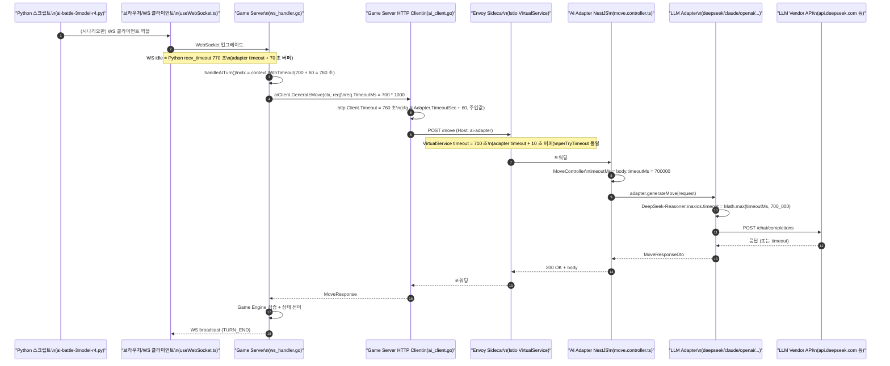

# 40. Game Server ↔ AI Adapter 타임아웃 체인 분해도

- 작성일: 2026-04-16 (Sprint 6 Day 4)
- 작성자: architect
- 상태: 정식 (Authoritative)
- 연관 문서:
  - `docs/02-design/20-istio-selective-mesh-design.md` §4.5 (VirtualService 설계 원본)
  - `docs/02-design/25-cloud-local-llm-integration.md` (타임아웃 체인 개념 도입)
  - `docs/02-design/34-dashscope-qwen3-adapter-design.md` §7 (DashScope 타임아웃 레이어)
  - `docs/02-design/36-istio-phase-5.2-verification.md` (Phase 5.2 검증 체크리스트)
  - `docs/01-planning/17-sprint6-kickoff-directives.md` I1/I4 (Istio VS 상향 지시 원본)

---

## 1. 이 문서를 만든 이유

Sprint 6 Day 4 Round 6 Phase 2 DeepSeek Run 3 대전 T68 턴에서 `DRAW (fallback: AI_TIMEOUT) [500.4s]` 가 발생했다. 직전 배포에서 `AI_ADAPTER_TIMEOUT_SEC` 를 500 → 700 초로 상향했지만, Istio VirtualService 의 `timeout` 이 여전히 `510s` 로 남아있어 **Envoy 사이드카가 500 초에 끊어 먹고 fallback 으로 오인**되었다. 3시간짜리 본 대전이 오염되었다.

근본 원인은 **"타임아웃 한 값을 바꿀 때 함께 바뀌어야 할 지점의 전수 목록이 존재하지 않았다"** 는 것이다. `AI_ADAPTER_TIMEOUT_SEC` ConfigMap 한 줄만 바꾸면 끝나는 것처럼 보이지만, 실제로는 최소 10 개 지점이 맞물려 있다. 이 문서가 그 맞물림을 명시적으로 고정한다.

---

## 2. 전체 타임아웃 체인 시퀀스



체인의 핵심은 **단 하나** — 가장 안쪽(LLM 쪽) 의 시한이 가장 짧고 바깥으로 갈수록 조금씩 길어져야 한다는 부등식이다. 이 부등식이 깨지면, 안쪽이 아직 성공할 수도 있는 상태에서 바깥쪽 타이머가 먼저 끊어 **정상 응답을 fallback 으로 오분류**한다. Sprint 6 Day 4 Run 3 이 바로 이 패턴이다.

---

## 3. 구간별 타임아웃 레지스트리

**기준일: 2026-04-16 (Sprint 6 Day 4). 기준값: `AI_ADAPTER_TIMEOUT_SEC = 700` (DeepSeek Reasoner v4 + Thinking Budget 대응).**

| # | 구간 | 값 (Day 4 기준) | 위치 (파일 또는 리소스) | 소비 주체 | 역할 | 변경 공식 |
|---|------|---|---|---|---|---|
| 1 | Python recv_timeout (DeepSeek) | `770` 초 | `scripts/ai-battle-3model-r4.py:77` (`ws_timeout`) | Python 스크립트 | 스크립트 쪽 WS recv poll 타임아웃. 가장 바깥 층 | `AI_ADAPTER_TIMEOUT_SEC + 70` |
| 2 | Game Server `handleAITurn` context | `760` 초 | `src/game-server/internal/handler/ws_handler.go:874` | goroutine context | AI 턴 전체의 고수위 데드라인 | `aiTimeoutSec + 60` (코드 상 고정) |
| 3 | Game Server `MoveRequest.TimeoutMs` | `700_000` ms | `src/game-server/internal/handler/ws_handler.go:902` | ai-adapter 에 전달되는 DTO 필드 | 내부 LLM 호출용 시한 예산 | `aiAdapterTimeoutSec * 1000` |
| 4 | Game Server `http.Client.Timeout` | `760` 초 | `src/game-server/cmd/server/main.go:123-124` | Go net/http 클라이언트 | POST /move 전체 HTTP 왕복 시한 | `cfg.AIAdapter.TimeoutSec + 60` 이 돼야 함. **현재 코드는 `cfg.AIAdapter.TimeoutSec` 만 주입 (`=700`) — 버퍼 없음. §8 위반 1 참조** |
| 5 | viper 기본값 (game-server) | `500` | `src/game-server/internal/config/config.go:92` | env 없을 때의 fallback | 안전망 — env 누락 시 동작 보장 | "정상 운영값보다 크거나 같게" 또는 "음수로 실패" |
| 6 | Helm values game-server | `500` | `helm/charts/game-server/values.yaml:33` | Helm rendering | ConfigMap `game-server-config` 시드값 | `AI_ADAPTER_TIMEOUT_SEC` 기준값과 **항상 동일** |
| 7 | ConfigMap `game-server-config` (live) | `700` | `kubectl -n rummikub get cm game-server-config` | Pod envFrom | Helm 렌더 결과 또는 `kubectl patch` 결과 | (#6 과 반드시 동기) |
| 8 | Helm values ai-adapter | (없음) | `helm/charts/ai-adapter/values.yaml` | -- | -- | **해당 env 를 소비하지 않으므로 추가하지 말 것** |
| 9 | ConfigMap `ai-adapter-config` (live) | (없음) | `kubectl -n rummikub get cm ai-adapter-config` | -- | -- | **§8 위반 2 참조** |
| 10 | Istio `VirtualService` timeout | `510` 초 (현재 drift) | `istio/virtual-service-ai-adapter.yaml:16` + live VS | Envoy 사이드카 | East-West LLM 호출 전체 시한 | `AI_ADAPTER_TIMEOUT_SEC + 10` → **710 초** |
| 11 | Istio `VirtualService` perTryTimeout | `510` 초 (현재 drift) | `istio/virtual-service-ai-adapter.yaml:20` + live VS | Envoy 사이드카 | 재시도 1 회당 시한 | `AI_ADAPTER_TIMEOUT_SEC + 10` → **710 초** (timeout 과 동일) |
| 12 | Istio `DestinationRule` connectTimeout | `10` 초 | `istio/destination-rule-ai-adapter.yaml:20` | Envoy TCP 연결 | TCP handshake 시한 (응답 대기와 무관) | 고정 |
| 13 | NestJS `MoveRequestDto.timeoutMs` 기본값 | `30_000` ms | `src/ai-adapter/src/move/move.controller.ts:189` | MoveService | 호출자(game-server)가 안 보낼 때 방어값 | 고정 30 초 — game-server 에서 항상 주입되므로 실제 경로 미사용 |
| 14 | DeepSeek Reasoner min floor | `500_000` ms (**drift**) | `src/ai-adapter/src/adapter/deepseek.adapter.ts:220` | axios timeout | reasoner 전용 하한선 | `Math.max(timeoutMs, AI_ADAPTER_TIMEOUT_SEC * 1000)` → **700_000 ms** |
| 15 | Claude thinking min floor | `210_000` ms | `src/ai-adapter/src/adapter/claude.adapter.ts:114` | axios timeout | extended thinking 전용 하한선 | 현 Claude 사고 실측이 낮으므로 `210_000` 유지. v4 측정 이후 재검토 |
| 16 | Ollama min floor | `210_000` ms | `src/ai-adapter/src/adapter/ollama.adapter.ts:29` | axios timeout | CPU 추론 하한선 | 유지 |
| 17 | OpenAI reasoning min floor | `210_000` ms | `src/ai-adapter/src/adapter/openai.adapter.ts:31,112` | axios timeout | gpt-5-mini reasoning 하한선 | 유지 |
| 18 | DashScope thinking-only min | `600_000` ms | `src/ai-adapter/src/adapter/dashscope/dashscope.service.ts:51` | axios timeout | qwen3 thinking-only 하한선 | **700_000 ms 로 상향 권장** (v4 Run 실측 기준 재평가 후) |
| 19 | Game Server `http.Server.ReadTimeout` | `15` 초 | `src/game-server/cmd/server/main.go:54` | HTTP 인바운드 | REST 본문 수신 시한 | 무관 (POST /move 는 내부 요청이 아니라 game-server 가 클라이언트) |
| 20 | Game Server `http.Server.WriteTimeout` | `0` | `src/game-server/cmd/server/main.go:60` | HTTP 인바운드 | WS Hijack 후 무제한 | 의도된 설정 — 변경 금지 |
| 21 | Game Server `http.Server.IdleTimeout` | `60` 초 | `src/game-server/cmd/server/main.go:61` | HTTP keep-alive | keep-alive idle 시한 | 무관 |

**§8 에서 현 drift 3 건을 다룬다.**

---

## 4. 부등식 계약 (변경 금지)

모든 타임아웃은 다음 부등식을 **항상** 만족해야 한다. 바깥이 안쪽보다 짧으면, 안쪽의 정상 응답을 바깥이 끊어 fallback 오분류가 발생한다.

```
py_ws_timeout (1)
   >  handleAITurn_ctx (2)
      >  go_http_client (4)
         >  istio_vs_timeout (10) == istio_vs_perTry (11)
            >  adapter_internal_timeout (=request.timeoutMs, 3)
               >  llm_vendor_min_floor (14, 15, 16, 17, 18 중 해당 모델)
```

권장 마진:

| 인접 쌍 | 마진 |
|---|---|
| (1) - (2) | 10 초 (Python poll 여유) |
| (2) - (4) | 0 초 (둘 다 같은 공식 `adapter + 60`) |
| (4) - (10) | 50 초 (Istio 버퍼를 얇게, Go context 를 두껍게) |
| (10) - (3) | 10 초 (Istio 가 LLM 예산보다 10 초 넉넉) |
| (3) - (14~18) | 0 초 (adapter 는 `Math.max` 로 하한만 올림) |

### Day 4 기준 수치 예 (`AI_ADAPTER_TIMEOUT_SEC = 700`)

| 레이어 | 값 | 공식 |
|---|---|---|
| Python ws_timeout | 770 초 | 700 + 70 |
| handleAITurn ctx | 760 초 | 700 + 60 |
| Go http.Client | 760 초 | 700 + 60 (`main.go` 수정 필요, §8 위반 1) |
| Istio VS timeout | 710 초 | 700 + 10 |
| Istio VS perTryTimeout | 710 초 | 동일 |
| request.timeoutMs | 700_000 ms | 700 * 1000 |
| DeepSeek adapter floor | 700_000 ms | `Math.max(timeoutMs, 700_000)` |

---

## 5. 변경 시 체크리스트 (재발 방지의 핵심)

`AI_ADAPTER_TIMEOUT_SEC` 값을 한 번이라도 건드리면 다음 지점을 **전부** 함께 수정·검증한다. 두 개 이상 빠지면 반드시 timeout drift 가 발생한다.

### 5.1 소스 레포 (커밋 대상)

| # | 파일 | 수정 내용 |
|---|---|---|
| 1 | `helm/charts/game-server/values.yaml:33` | `AI_ADAPTER_TIMEOUT_SEC` 새 값 |
| 2 | `src/game-server/internal/config/config.go:92` | viper SetDefault 새 값 (또는 "음수" 유지 정책 — §6 참조) |
| 3 | `istio/virtual-service-ai-adapter.yaml:16` | `timeout: (새 값 + 10)s` |
| 4 | `istio/virtual-service-ai-adapter.yaml:20` | `perTryTimeout: (새 값 + 10)s` |
| 5 | `istio/virtual-service-ai-adapter.yaml:5` | 파일 상단 주석 수식 (예: "ConfigMap 700s + 10s = 710s") |
| 6 | `src/game-server/cmd/server/main.go:123` | `time.Duration(cfg.AIAdapter.TimeoutSec + 60) * time.Second` (§8 위반 1 수정 후) |
| 7 | `scripts/ai-battle-3model-r4.py:77` | `ws_timeout = 새 값 + 70` (DeepSeek 전용 — Claude/GPT/Ollama 는 별도 정책) |
| 8 | `src/ai-adapter/src/adapter/deepseek.adapter.ts:220` | `Math.max(timeoutMs, 새 값 * 1000)` |
| 9 | `docs/02-design/40-timeout-chain-breakdown.md` | 본 문서 §3, §4 의 Day N 기준 수치 갱신 (footer 에 이력 남김) |
| 10 | `docs/02-design/20-istio-selective-mesh-design.md` §4.5 | YAML 블록 타임아웃 숫자 |
| 11 | `docs/02-design/25-cloud-local-llm-integration.md` | 타임아웃 표 값 |
| 12 | `docs/02-design/34-dashscope-qwen3-adapter-design.md` §7 | 표 값 |
| 13 | `docs/02-design/36-istio-phase-5.2-verification.md` | §2.2 검증 기준 |
| 14 | `docs/01-planning/17-sprint6-kickoff-directives.md` I1/I4 | 지시 정합 값 |
| 15 | `docs/03-development/01-dev-setup.md:208` | env 표 |
| 16 | `docs/02-design/11-ai-move-api-contract.md:415` | env 표 |
| 17 | `docs/05-deployment/07-secret-injection-guide.md:88` | env 표 |

### 5.2 라이브 클러스터 (kubectl)

| # | 리소스 | 명령 |
|---|---|---|
| 18 | `cm/game-server-config` | `kubectl -n rummikub patch cm game-server-config --type merge -p '{"data":{"AI_ADAPTER_TIMEOUT_SEC":"<새 값>"}}'` |
| 19 | `deploy/game-server` | `kubectl -n rummikub rollout restart deploy/game-server` (envFrom 변경은 자동 반영 안 됨) |
| 20 | `vs/ai-adapter` | `kubectl -n rummikub apply -f istio/virtual-service-ai-adapter.yaml` (또는 ArgoCD sync) |
| 21 | `deploy/ai-adapter` | `kubectl -n rummikub rollout restart deploy/ai-adapter` (envoy 설정 재적용 트리거) |

### 5.3 검증 (반드시 실행)

| # | 항목 | 명령 |
|---|---|---|
| 22 | 라이브 VS timeout | `kubectl -n rummikub get vs ai-adapter -o jsonpath='{.spec.http[0].timeout}'` → 새 값 +10 확인 |
| 23 | 라이브 CM | `kubectl -n rummikub get cm game-server-config -o jsonpath='{.data.AI_ADAPTER_TIMEOUT_SEC}'` → 새 값 확인 |
| 24 | game-server 런타임 env | `kubectl -n rummikub exec deploy/game-server -- printenv AI_ADAPTER_TIMEOUT_SEC` → 새 값 확인 |
| 25 | Envoy 실제 route timeout | `kubectl -n rummikub exec deploy/game-server -c istio-proxy -- pilot-agent request GET config_dump` 에서 `ai-adapter` 라우트 timeout 확인 |
| 26 | Go 빌드 | `cd src/game-server && go build ./...` |
| 27 | Go 유닛 테스트 | `cd src/game-server && go test ./internal/handler/... ./internal/config/...` |
| 28 | ai-adapter 유닛 테스트 | `cd src/ai-adapter && npm run test -- --testPathPattern='adapter/(deepseek|claude|openai|ollama|dashscope)'` |
| 29 | smoke 대전 | DeepSeek 1 판, 10 턴 제한, fallback 0 확인 |

---

## 6. viper default 정책

현재 `config.go:92` 는 `viper.SetDefault("AI_ADAPTER_TIMEOUT_SEC", 500)` 이다. 이 숫자의 존재 자체가 **"ConfigMap 이 누락되었을 때 500 초로 조용히 돌아간다"** 는 의미이며, 이번 사고처럼 ConfigMap 은 700 이지만 소스의 default 가 500 으로 갱신되지 않은 drift 를 유발한다.

두 가지 선택지가 있다.

### 선택지 A — default 를 안전값으로 유지 + 운영값과 항상 동기

- `config.go:92` 의 default 를 소스 레포의 Helm values 와 **항상 같은 숫자**로 유지
- 체크리스트 #2 가 이 동기화를 강제
- 장점: 로컬 dev 실행(`go run`) 시에도 정상 동작
- 단점: 사람이 까먹으면 drift 재발

### 선택지 B — default 를 제거하고 필수 env 로 강제

- `viper.SetDefault` 줄 삭제
- `Load()` 끝부분에 `if cfg.AIAdapter.TimeoutSec <= 0 { log.Fatal("AI_ADAPTER_TIMEOUT_SEC must be set") }` 추가
- 장점: drift 가 원천 차단됨 (ConfigMap 누락 = Pod CrashLoopBackOff)
- 단점: 로컬 dev 는 `export AI_ADAPTER_TIMEOUT_SEC=700` 을 매번 해줘야 함

**권장: 선택지 A + 선택지 B 혼합.** dev 환경에서는 300 등 작은 default 를 허용하되, production (`APP_ENV=production`) 에서는 `AI_ADAPTER_TIMEOUT_SEC` 미설정이면 fatal. `JWT_SECRET` 과 같은 패턴 (`config.go:159-164` 참조).

---

## 7. Sprint 5 → 6 값 변화 이력

| 시점 | 값 | 근거 |
|---|---|---|
| 초기 (Sprint 3) | `180` 초 | OpenAI 비추론 시절 기본값 |
| Sprint 4 | `200` 초 | Istio 사전 설계 당시 VS timeout 과 맞춤 (`docs/02-design/20-istio-selective-mesh-design.md:311` stale) |
| Sprint 5 Day 5 (2026-04-10) | `240 → 500` 초 | DeepSeek Reasoner Run 3 에서 356 초 관찰 → 500 으로 상향, fallback 9 → 0 달성 |
| Sprint 6 Day 4 (2026-04-15) | `500 → 700` 초 | v4 프롬프트 + Thinking Budget 허가로 사고 시간 자율 확장 → 500 초 한계 근접 (Run 5 T70/T76 435/434 s) |
| Sprint 6 Day 4 사고 (2026-04-16) | 소스 drift 발견 | game-server env 700 / Istio VS 510 / Helm values 500 drift — 본 문서 작성 계기 |

---

## 8. 현 drift 목록 (수정 계획서의 Phase 2 대상)

### 위반 1 — `http.Client.Timeout` 이 버퍼 없는 `TimeoutSec` 그대로

**위치**: `src/game-server/cmd/server/main.go:123`
```go
timeout := time.Duration(cfg.AIAdapter.TimeoutSec) * time.Second  // = 700s
aiClient = client.NewAIClient(cfg.AIAdapter.BaseURL, cfg.AIAdapter.Token, timeout)
```

**문제**: §4 부등식에서 `go_http_client > istio_vs_timeout` 이어야 한다. Istio VS 가 710 초이면 Go http.Client 도 최소 710 초 이상이어야 하는데, 현재는 700 초로 **Istio 보다 짧다**. Envoy 가 710 초에 끊기 전에 Go 쪽이 700 초에 먼저 끊어 CancelContext → Istio 입장에서는 client 가 먼저 닫은 것이므로 회고 로그에도 timeout 이 아닌 context canceled 로 남을 수 있다.

**수정**: `time.Duration(cfg.AIAdapter.TimeoutSec + 60) * time.Second` (= 760 초) — `handleAITurn` context 와 같은 공식으로 통일.

### 위반 2 — `ai-adapter` 에 `AI_ADAPTER_TIMEOUT_SEC` 가 실제로는 소비되지 않음

**증거**: `grep -r AI_ADAPTER_TIMEOUT_SEC src/ai-adapter/src` → 결과 0 건 (spec 파일 주석 1 건 제외). ai-adapter 는 이 env 를 읽지 않는다. 대신 각 요청의 `body.timeoutMs` 필드로 받는다.

**문제**: 애벌레가 "양쪽 다 700 으로 올렸다" 고 인식하는 원인. 라이브에는 런타임 set env 로 주입되어 보이지만:
1. 코드가 소비하지 않으므로 무의미
2. Helm values / ConfigMap 에 없으므로 rollout 또는 ArgoCD sync 시 자연 소멸
3. 소비 경로가 있는 것처럼 보여 혼동 유발

**수정**: ai-adapter 쪽 `AI_ADAPTER_TIMEOUT_SEC` env 를 명시적으로 **제거 또는 사용처 문서화**. 제거가 권장 — 완전 소거 후 설명 주석 1 줄만 남김.

### 위반 3 — Istio VS timeout 이 ConfigMap 과 불일치

**위치**: `istio/virtual-service-ai-adapter.yaml:5,16,20` (파일) + live cluster VS

**현재**:
- 파일 주석: `"500s + 10s=510s"` (stale)
- 파일 timeout: `510s` (stale)
- 파일 perTryTimeout: `510s` (stale)
- live VS: 510s / 510s (파일과 동기화됨, 둘 다 stale)
- ConfigMap: 700 (최신)

**수정**: `710s` 로 상향 + 주석 갱신.

---

## 9. 부록 — adapter 하한값 근거

각 LLM adapter 에 "최소 timeout floor" 가 있는 이유는, game-server 가 실수로 작은 `timeoutMs` 를 전달해도 reasoning 모델의 기본 응답 시간(수 초 ~ 수백 초) 을 보장하기 위함이다. 이 floor 는 **정상 응답의 하한선** 이지, **허용 최대치** 가 아니다.

| adapter | floor | 근거 |
|---|---|---|
| DeepSeek Reasoner | 500_000 → **700_000 ms** (변경 제안) | Run 5 T70/T76 에서 435/434 s 관찰, v4 Thinking Budget 정책 |
| Claude extended thinking | 210_000 ms | extended thinking budget_tokens=10000 의 실측 평균 ~120~180 s |
| OpenAI reasoning (gpt-5-mini) | 210_000 ms | reasoning_tokens ≤ 3k 기준 실측 평균 ~60~150 s |
| Ollama (qwen2.5:3b) | 210_000 ms | CPU 추론 평균 ~100~180 s |
| DashScope thinking-only (qwen3) | 600_000 → **700_000 ms** (검토) | 설계 문서 34 §7.2 "600 초 floor" 는 500 초 ConfigMap 기준이었음 |

DashScope 는 Round 6 Phase 2 에 실제 투입되는 모델이므로, v4 시나리오에서 DeepSeek 과 같은 시한 정책을 쓸지 여부를 대전 실측 이후 결정한다.

---

## 10. 변경 이력 (footer)

| 날짜 | 편집자 | 변경 |
|---|---|---|
| 2026-04-16 | architect | 최초 작성 — Sprint 6 Day 4 Run 3 fallback 사고 원인 분석 결과 |

