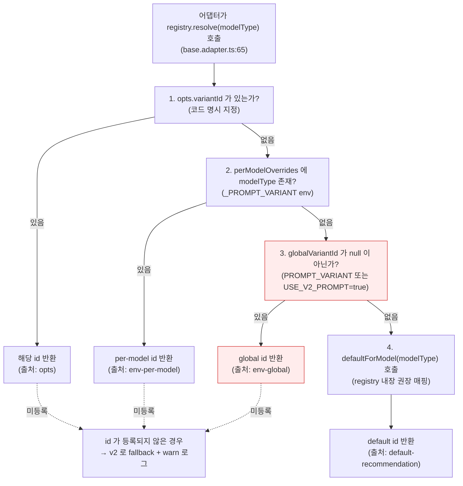

# 42. 프롬프트 변형(variant) 운영 표준 — SSOT

- 작성일: 2026-04-16 (Sprint 6 Day 4 자정)
- 작성자: qa
- 상태: 정식 (Authoritative, Single Source of Truth)
- 지시 근거: 애벌레 "v2/v3/v4 잠복 이슈 전수조사" (Day 4 자정)
- 연관 문서:
  - `docs/02-design/39-prompt-registry-architecture.md` (§4 resolve 로직, §5 권장 매핑)
  - `docs/02-design/41-timeout-chain-breakdown.md` (§5 체크리스트 구조 — 본 문서는 이 구조를 variant 에 이식)
  - `docs/03-development/20-common-system-prompt-v4-design.md` (§6.1 v4 core)
  - `docs/04-testing/57-v4-gpt-empirical-verification.md` (v4 → GPT empirical 검증)

---

## 1. TL;DR

2026-04-16 Day 4 기준 **라이브 ai-adapter 에 USE_V2_PROMPT=true 와 per-model v4 3건이 동시 설정**되어 있다. 코드 우선순위상 per-model 3건(DeepSeek-Reasoner/Claude/DashScope)은 v4 가 적용되고, per-model 미설정인 **OpenAI/Ollama/DeepSeek-chat 3건은 USE_V2_PROMPT 의 globalVariantId='v2' 경로로 v2 가 적용된다**. 이는 **stale 가 아닌 empirical 로 정당화된 의도된 운영 상태** — GPT 에 대해서는 2026-04-15 Day 4 오전에 별도 Node 스크립트(`src/ai-adapter/scripts/verify-v4-gpt-empirical.ts`) 로 v2 vs v4 N=3 반복 실험을 수행했고, 결과는 **V4_IGNORED (v4 역효과)** 였다:

- reasoning_tokens: v2 mean=4,224 → v4 mean=3,179 (**−25%**, Cohen d **−1.46** large negative)
- tiles_placed: v2 = v4 = 6.33 (동등 품질)
- latency_ms: v2 = 62,225 → v4 = 46,145

즉 v4 의 "reasoning budget 증가 + thinking 체계화" 지시가 GPT-5-mini 의 내부 RLHF 정체성과 **반대로 작동**하여 오히려 reasoning 을 줄이고 tiles_placed 는 그대로였다. GPT 는 `reasoning_tokens` 필드가 API 에 노출되어 있으나 그 값은 외부 프롬프트로 증가시킬 수 없는 **내부 고정 상한**에 묶여 있다. 이 empirical 결과가 "GPT 는 v2 유지" 결정의 1차 근거이며, SP3 의 "Round 4~5 가 사실 v2 였다" 발견(`docs/02-design/18` §3.4) 은 2차 근거(과거 데이터와 현재 운영의 일치)다. 집계 리포트는 `docs/04-testing/57-v4-gpt-empirical-verification.md`, LangSmith 단일 trace 샘플은 `docs/04-testing/58-langsmith-trace-gpt-v4-sample.md` (Run ID `67d37c3b-0460-40b3-b10a-b5dafb1ee19a`), 메커니즘 해석은 `docs/03-development/17-gpt5-mini-analysis.md` 부록 A 참조.

`defaultForModel()` 의 권장 매핑은 deepseek-reasoner→v3 등 일부가 있으나, per-model override(v4) 와 USE_V2_PROMPT(v2) 에 의해 대부분 live 에서 사용되지 않는 상태이며 이는 관찰가능성 이슈일 뿐 운영 결함은 아니다. USE_V2_PROMPT 는 Sprint 7 에 제거되지만, 제거 후에도 `defaultForModel('openai')=v2` 이므로 OpenAI 운영 variant 는 변하지 않는다(§7 dry-run 참조).

---

## 2. 현재 운영 기준 (표 B) — 2026-04-16 기준

> 이 표가 **다른 모든 문서·코드 주석·MEMORY.md 보다 우선**한다. 불일치 발견 시 본 표에 맞춘다.

**두 축의 분리 (2026-04-19 Day 9 추가)**: 프롬프트 구성은 **2축 orthogonal** 이다.
- **텍스트 축 (variant)** — v2 / v2-zh / v3 / v4 / v4.1 / v5 까지. **본 문서가 SSOT.**
- **구조 축 (shaper)** — Rack/Board/History 의 구조·힌트를 가공하는 축. passthrough / joker-hinter / pair-warmup 등. **`docs/02-design/44-context-shaper-v6-architecture.md` 가 별도 SSOT.**
- 두 축은 직교하므로, 새로운 구조 실험을 "v6" 이란 이름으로 variant 표에 추가하는 행위는 **금지** (ADR 44 Principle 3 "Registry Orthogonal" 위배). shaper 는 §3 표 A 와 무관하게 §6.1 의 compatible_shapers 컬럼으로만 기술한다.

| 모델 (ModelType) | 실제 운영 variant | 결정 출처 (resolve 우선순위) | env 변수 | Round 6 Phase 3 대조군 지정 | compatible_shapers | 비고 |
|---|---|---|---|---|---|---|
| `openai` (gpt-5-mini) | **v2** | 2단계 미설정 → 3단계 globalVariantId | `USE_V2_PROMPT=true` → `globalVariantId='v2'` (empirical 로 정당화된 의도된 고정) | **대조군 (v2 베이스라인 — 확정)** | passthrough (운영) / joker-hinter · pair-warmup (이론상 호환, 실험 미승인) | **empirical 근거**: `docs/04-testing/57` + `docs/04-testing/58` + `docs/03-development/17` 부록 A. 2026-04-15 v2 vs v4 N=3 실험에서 v4 가 reasoning_tokens 을 -25% 감소(Cohen d=-1.46), tiles_placed 동등. GPT-5-mini 는 내부 CoT RLHF 고정으로 **외부 v4 지시가 무시/역효과**. Sprint 6 Day 4 까지 v3 는 한 번도 운영/실험된 적 없음 (존재하지 않던 버전). 따라서 GPT 는 v2 고정이 **empirical + historical** 양면에서 정답. shaper 실험 대상 아님 (baseline 유지) |
| `claude` (claude-sonnet-4) | **v4** | 2단계 per-model override | `CLAUDE_PROMPT_VARIANT=v4` | 본대전 참가 | passthrough (운영) / joker-hinter · pair-warmup (이론상 호환, 실험 미승인) | v4 empirical 미검증 (Round 6 에서 최초 실측). shaper orthogonal 원칙상 병행 가능하나 Round 6 에서는 variant 축만 측정 |
| `deepseek` (deepseek-chat) | **v2** | 2단계 미설정 → 3단계 globalVariantId | `USE_V2_PROMPT=true` 강제 | 운영 제외 (deepseek-chat 은 현재 대전 미사용) | passthrough (운영) | deepseek-chat 사용 시 v2 에 고정됨 |
| `deepseek-reasoner` | **v4** (현행) / **v2** (ADR 44 shaper 실험 시) | 2단계 per-model override | `DEEPSEEK_REASONER_PROMPT_VARIANT=v4` (현행) | 본대전 주력 (Run × 3) | passthrough (현행) / **joker-hinter** (Phase 4 실험 타깃, v2 조합) / **pair-warmup** (Phase 5 실험 타깃, v2 조합) | Day 4 plan 핵심 변경사항. ADR 44 §6.2 에 따라 shaper 축 실험 시 **variant 는 v2 로 고정** (confound control, Principle 1 "v2 텍스트 불변") |
| `dashscope` (qwen3 thinking) | **v4** | 2단계 per-model override | `DASHSCOPE_PROMPT_VARIANT=v4` | 본대전 참가 (Run × 3) | passthrough (운영) / joker-hinter · pair-warmup (DashScope 실제 API 키 발급 후 결정) | DashScope API 키 발급 전까지 stub |
| `ollama` (qwen2.5:3b) | **v2** | 2단계 미설정 → 3단계 globalVariantId | `USE_V2_PROMPT=true` 강제 | 운영 제외 (클라우드 전용 대전) | passthrough (운영) | 로컬 전용, v4 적용 대상 아님 (소형 모델). joker-hinter/pair-warmup 은 토큰 예산 위험으로 **비권장** (ADR 44 §6.2) |

**핵심**: `defaultForModel()` 의 권장 매핑(openai→v2, deepseek-reasoner→v3, dashscope→v3 등)은 **현재 단 한 건도 live 에서 적용되지 않는다** — 이는 관찰가능성(observability) 이슈이지 운영 결함이 아니다. 이유:
- per-model override 가 있는 모델(claude/deepseek-reasoner/dashscope) = 2단계에서 v4 결정
- per-model override 가 없는 모델(openai/ollama/deepseek-chat) = 3단계 globalVariantId='v2' 에서 결정
- 4단계 defaultForModel 은 3단계가 null 이어야 도달하는데, USE_V2_PROMPT=true 가 globalVariantId 를 점유하고 있어 3단계가 항상 non-null

**Sprint 7 제거 시 영향 분석** (§7 에서 상세): `defaultForModel('openai')=v2` 이고 `defaultForModel('ollama')=v2` 이며 `defaultForModel('deepseek')=v2` 이므로, USE_V2_PROMPT 제거 후에도 이 3개 모델의 운영 variant 는 변하지 않는다. 즉 SSOT 관점에서 이 상태는 "관찰가능성은 줄었으나 운영상 안전한" 의도된 고정이다.

---

## 3. variant 레지스트리 (표 A) — 등록된 variant 전체

> `src/ai-adapter/src/prompt/registry/variants/` 에서 `PromptRegistry.registerBuiltinVariants()` 가 부팅 시 등록하는 7개.

| variant id | 파일 | version | recommendedModels | warnIfOffRecommendation | deprecated | 권장 용도 |
|---|---|---|---|---|---|---|
| `v2` | `variants/v2.variant.ts` | 1.0.0 | openai, claude, deepseek, ollama | false | 아님 (legacy 베이스라인) | 영문 reasoning 베이스라인, Round 4/5 검증됨, gpt-5-mini 기본 |
| `v2-zh` | `variants/v2-zh.variant.ts` | 1.0.0 | deepseek-reasoner | **true** | 아님 (2026-04-17 도입) | v2 Simplified Chinese 번역본. DeepSeek-R1 내부 reasoning 중국어 가설 검증. same few-shot/structure, 언어만 다른 single-variable A/B (v2 vs v2-zh). 타일 코드·JSON 필드명·에러 코드는 영문 보존 |
| `v3` | `variants/v3.variant.ts` | 1.0.0 | deepseek-reasoner, dashscope, openai, claude | false | 아님 | v2 + 무효 배치 감소 + 자기검증 (few-shot 5 + 체크리스트 7). DashScope 역사적 기본 |
| `v3-tuned` | `variants/v3-tuned.variant.ts` | 1.0.0 | deepseek-reasoner, dashscope | **true** | 아님 (A/B 실험용) | v3 + Thinking Budget + 5축 평가. Round 6 현재 미운영. 비권장 모델에 적용 시 warn |
| `v4` | `variants/v4.variant.ts` | 1.0.0 | deepseek-reasoner, claude, dashscope | **true** | 아님 (2026-04-14 도입) | reasoner 3모델 공통 body + Thinking Budget + 5축 평가 + Action Bias. Day 4 활성화 |
| `v4.1` | `variants/v4-1.variant.ts` | 1.0.0 | deepseek-reasoner, claude, dashscope | **true** | 아님 (2026-04-16 도입) | v4 − Thinking Budget 단일 제거 (single-variable A/B). Round 7 실증 20.5% |
| `v5` | `variants/v5.variant.ts` | 1.0.0 | deepseek-reasoner, claude, openai | **true** | 아님 (2026-04-17 도입) | Zero-shot reasoning (Nature 논문 준수). 규칙 + 상태 + JSON 포맷만. ~350 토큰 |
| `character-ko` | `variants/character-ko.variant.ts` | 1.0.0 | ollama | **true** | 아님 (legacy placeholder) | 한국어 페르소나 — 실제 생성은 `PromptBuilderService` 경로, variant 는 metrics 태깅용 |

**체크**: `v4.variant.ts` 의 recommendedModels 는 `openai` 를 포함하지 않으므로, Sprint 6 Day 5 이후 `OPENAI_PROMPT_VARIANT=v4` 로 강제 override 하면 `warnIfOffRecommendation=true` 에 의해 warn 로그가 발생한다. 이는 정상 동작 — GPT v4.1 branch 는 별도 variant 로 분리 예정(`docs/03-development/20` §6.3).

---

## 4. 환경변수 우선순위 (표 C) — `prompt-registry.service.ts` resolve() 5단계

### 4.1 각 단계 상세

| 단계 | 조건 | 코드 위치 | 영향 범위 |
|---|---|---|---|
| 1 | `opts.variantId` 인자 | `prompt-registry.service.ts:167` | 테스트 / SP4 A/B 실험 프레임워크가 런타임에 특정 variant 강제할 때만 사용. 운영 경로 미사용 |
| 2 | `perModelOverrides.has(modelType)` | `:168-170` | `OPENAI_PROMPT_VARIANT`, `CLAUDE_PROMPT_VARIANT`, `DEEPSEEK_PROMPT_VARIANT`, `DEEPSEEK_REASONER_PROMPT_VARIANT`, `DASHSCOPE_PROMPT_VARIANT`, `OLLAMA_PROMPT_VARIANT` (6개). **현재 3개(claude/deepseek-reasoner/dashscope)가 v4 로 설정됨** |
| 3 | `globalVariantId != null` | `:171-173` | `PROMPT_VARIANT` env 또는 `USE_V2_PROMPT=true` legacy (globalVariantId='v2' 강제). **현재 USE_V2_PROMPT=true 로 설정됨 → per-model 미설정 모델 3개가 여기서 잡힘** |
| 4 | `defaultForModel(modelType)` | `:174, :177-189` | openai→v2, claude→v2, deepseek→v2, deepseek-reasoner→v3, dashscope→v3, ollama→v2. **현재 이 경로에 도달하는 모델 0개** (globalVariantId 에 의해 차단) |
| 5 | variant 미등록 fallback | `:59-64` | 어떤 경로로든 반환된 id 가 `variants` Map 에 없으면 `v2` 반환 + warn. 정상 동작 중에는 발동하지 않음 |

### 4.2 USE_V2_PROMPT backward compatibility

- 코드: `prompt-registry.service.ts:131-139`
- 동작: `USE_V2_PROMPT=true` 감지 시 **`globalVariantId='v2'` 로 강제 설정** + 1회 deprecation warn
- 우선순위: `PROMPT_VARIANT` env 가 추가로 있으면 `PROMPT_VARIANT` 가 덮어씀 (unit test `prompt-registry.service.spec.ts:228-234` 고정)
- **deprecation 일정**: Sprint 7 에 제거 (docstring 명시). 제거 전 dry-run 필수 — §7 참조

---

## 5. stale 위험 지점 (표 D) — 즉시 조치 권고

| # | 위치 | stale 내용 | 영향 | 조치 권고 | 담당 |
|---|---|---|---|---|---|
| D1 | `helm/charts/ai-adapter/values.yaml:27-35` | 주석 "빈 값 = default-recommendation" — 실제로는 USE_V2_PROMPT=true secret/patch 에 의해 global override 가 걸려 있음 | 문서와 현실 괴리. values.yaml 만 보는 신규 개발자가 오판 | §2 표 B 를 참조하도록 주석 한 줄 추가 + USE_V2_PROMPT 가 live patch 로 주입되는 경로 명시 | devops |
| D2 | `src/ai-adapter/src/adapter/openai.adapter.ts:23` | 주석 "미설정 시 default-recommendation 'v2' 사용" — 실제 경로는 globalVariantId 경유 v2 | 디버깅 시 결정 출처 오인 가능 (로그에 `source: env-global` 나오는데 주석엔 default 로 써있음) | 주석을 "현재 USE_V2_PROMPT=true 로 globalVariantId='v2' 강제 적용 중 (docs/02-design/42 §2)" 로 교체 | node-dev |
| D3 | `src/ai-adapter/src/adapter/claude.adapter.ts:17` | 동일 (미설정 시 default 'v2') — 실제로는 per-model override 'v4' 적용 중 | 동일 | 주석을 "운영 기준 docs/02-design/42 §2 참조. 현재 CLAUDE_PROMPT_VARIANT=v4" 로 교체 | node-dev |
| D4 | `docs/01-planning/20-sprint6-day4-execution-plan.md` 원본 line 218 "Phase 3 대조군 GPT × 1, v3 유지" | line 121 "Day 4 실행 중 업데이트" 가 동일 문서 안에서 "OpenAI variant 는 v2 유지" 로 덮어썼으나 line 218 텍스트는 stale 상태로 남음 — **line 218 이 내부 모순**. GPT 는 Sprint 6 Day 4 기준 v3 를 한 번도 운영해본 적이 없으므로 "v3 대조군" 자체가 애초에 성립 불가 | 다른 세션에서 line 218 만 읽은 사람이 "OPENAI_PROMPT_VARIANT=v3 patch 필요" 로 오판할 위험 | **line 218/219 를 line 121 과 일치하도록 수정 (v2 유지, v2 vs v4 비교 명시)** — 2026-04-16 본 문서 작성 시 처리 완료. 코드/env 변경 없음 | qa/architect (완료) |
| D5 | `docs/02-design/39-prompt-registry-architecture.md:488-491` §5 권장 매핑 표 | defaultForModel 권장 매핑이 마치 운영 기준인 것처럼 기술됨 — 실제로는 USE_V2_PROMPT 때문에 아무도 이 표의 값을 받지 않음 | 설계 문서 독자가 "openai 는 v2, deepseek-reasoner 는 v3 로 운영 중" 으로 오독 | 39 번 §5 상단에 "본 표는 defaultForModel() 의 권장 매핑이며, 실제 운영 variant 는 `docs/02-design/42` §2 참조" 한 줄 추가 | architect |
| D6 | `scripts/ai-battle-3model-r4.py` | variant 관련 코드/주석 없음 — 스크립트는 variant 를 알지 못함 | (위험 아님, 정보성) 대전 결과 해석 시 스크립트 로그만 보면 variant 를 알 수 없음 | Round 6 실행 직후 대전 결과 JSON 에 `kubectl -n rummikub exec deploy/ai-adapter -- printenv | grep PROMPT_VARIANT` 스냅샷을 첨부하는 절차 추가 | qa |
| D7 | `MEMORY.md` "v4 활성화 env" 라인 | per-model 3개만 언급, USE_V2_PROMPT=true 잔존 사실 누락 | 세션 간 기억에서 USE_V2_PROMPT 잠복 이슈가 사라짐 | `feedback_prompt_variant_ssot.md` (본 세션 신설) 로 상시 참조 유도 | qa (본 문서에서 생성) |

**7개 stale 지점 확인.** 코드 수정은 본 문서 범위 밖. 애벌레 승인 후 각 담당이 처리.

---

## 6. 변경 시 체크리스트 (표 E)

**원칙**: 어떤 모델의 운영 variant 를 바꾸거나, variant 자체를 추가/폐기할 때 다음 지점을 **전부** 함께 검증한다. 이것이 Sprint 6 Day 4 타입의 잠복 이슈를 막는 유일한 경로다.

**shaper 축 변경 시**: 본 §6 체크리스트는 **텍스트(variant) 축 전용** 이다. 구조(shaper) 축 변경은 **ADR 44 §6 (Registry 확장) 및 §11 (구현 Phase)** 의 별도 체크리스트를 사용한다. 단, §2 표 B 의 `compatible_shapers` 컬럼에 영향이 있을 경우 본 문서도 함께 갱신한다 (ADR 44 §6.1 SSOT 정합성 요구).

### 6.1 모델 1개의 운영 variant 를 바꿀 때

| # | 위치 | 작업 |
|---|---|---|
| 1 | `docs/02-design/42-prompt-variant-standard.md` §2 표 B | 해당 모델 row 의 "실제 운영 variant" + "결정 출처" + "env 변수" 갱신, 변경 이력 footer 추가 |
| 2 | `helm/charts/ai-adapter/values.yaml:27-35` | 해당 `<MODEL>_PROMPT_VARIANT` 값 설정 (empty → 명시) |
| 3 | live cluster | `kubectl -n rummikub set env deployment/ai-adapter <MODEL>_PROMPT_VARIANT=<id>` 실행 + `kubectl rollout status` 확인 |
| 4 | live cluster 검증 | `kubectl -n rummikub exec deploy/ai-adapter -- printenv \| grep PROMPT_VARIANT` 결과와 §2 표 B 가 일치하는지 대조 |
| 5 | log 검증 | ai-adapter 재시작 후 `[PromptRegistry] 등록 변형=[...] 글로벌=... per-model-override=[<MODEL>:<id>...]` 로그 line 확인 |
| 6 | 어댑터 주석 | 해당 어댑터 파일 상단 주석 (`openai.adapter.ts:23` 등) 의 variant 기술 갱신 |
| 7 | 대전 실행 전 | 스크립트 실행 직전에 printenv 스냅샷을 결과 JSON 에 보존 (D6) |
| 8 | MEMORY.md | "AI 대전 테스트" 섹션 및 "Next TODO" 의 env 명령어 업데이트 |
| 9 | **shaper 축 교차 영향** | 변경 후 model × variant 조합이 §2 표 B 의 `compatible_shapers` 열과 일치하는지 재검토. 불일치 시 **ADR 44 §6 (ContextShaperRegistry)** 체크리스트 필수 참조 후 두 문서 동시 갱신 |

### 6.2 신규 variant 를 추가할 때 (예: v4.1-openai)

| # | 위치 | 작업 |
|---|---|---|
| 1 | `src/ai-adapter/src/prompt/registry/variants/<id>.variant.ts` | 파일 생성 (기존 v4.variant.ts 템플릿) + metadata.recommendedModels / warnIfOffRecommendation 명시 |
| 2 | `src/ai-adapter/src/prompt/registry/prompt-registry.service.ts:123-128` | `registerBuiltinVariants()` 에 `this.register(newVariant)` 추가 |
| 3 | `src/ai-adapter/src/prompt/registry/prompt-registry.service.spec.ts:22-34` | "5개 변형 등록" 테스트를 "6개" 로 갱신 + 신규 variant 개별 테스트 추가 |
| 4 | `docs/02-design/42-prompt-variant-standard.md` §3 표 A | 신규 row 추가 |
| 5 | 신규 variant 의 본문 파일 (`v<id>-reasoning-prompt.ts`) 생성 + import 정리 |
| 6 | 필요 시 `defaultForModel()` 매핑 갱신 (behavior change — Sprint 단위 결정 필요) |
| 7 | 드라이런 — `docs/03-development/` 에 dry-run 리포트 작성 (v4 의 21번 템플릿 참조) |

### 6.3 variant 를 폐기할 때

| # | 작업 |
|---|---|
| 1 | 모든 env 에서 해당 id 제거 (per-model / global / USE_V2_PROMPT 호환 레이어) |
| 2 | `recommendedModels` 를 빈 배열로 수정 + `deprecated: true` 플래그 추가 (types 갱신 필요 시) |
| 3 | 1 Sprint 소프트 디프리케이션 기간 경과 후 파일 삭제 + `registerBuiltinVariants()` 에서 제거 |
| 4 | 본 문서 §3 표 A 에서 행 삭제 + footer 이력 남김 |

---

## 7. Sprint 7 예정 작업 — USE_V2_PROMPT 제거

**목표**: `USE_V2_PROMPT=true` legacy 경로를 안전하게 제거하여 `defaultForModel()` 이 실제로 작동하도록 전환.

### 7.1 사전 조건

1. **dry-run**: 제거 전에 `PROMPT_VARIANT` 또는 per-model override 가 "현재 USE_V2_PROMPT 에 의해 v2 로 운영되던" 3개 모델(openai, deepseek-chat, ollama) 각각에 대해 명시적으로 설정되어야 한다. 그러지 않으면 제거 순간 defaultForModel 경로로 이동:
   - `openai` → v2 (매핑이 이미 v2 이므로 **무변화**)
   - `deepseek` (chat) → v2 (무변화)
   - `ollama` → v2 (무변화)
2. 결론: **이론상 제거 시 운영 variant 는 변하지 않는다**. 단 defaultForModel 의 deepseek-reasoner → v3 매핑이 per-model v4 override 로 가려져 있으므로, 제거 후에도 per-model v4 가 살아있는 한 안전.

### 7.2 위험

- 누군가 per-model override 를 삭제한 상태에서 USE_V2_PROMPT 도 함께 삭제하면, deepseek-reasoner/dashscope 가 **defaultForModel 경로의 v3 으로 암묵적 전환**된다. 이는 behavior change. §6.1 체크리스트 7 단계 모두 강제.

### 7.3 수행 절차 (Sprint 7 시점)

1. 본 문서 §2 표 B 를 "Sprint 7 post-removal" 컬럼으로 확장하여 사전에 미래 상태를 fix
2. `prompt-registry.service.ts:131-139` 블록 제거 + `legacyUseV2Detected` 필드 제거
3. spec 테스트 `prompt-registry.service.spec.ts:217-235` "Backward compatibility — USE_V2_PROMPT" describe 블록 삭제
4. values.yaml 과 live patch 에서 `USE_V2_PROMPT` 키 전부 제거 (`kubectl -n rummikub set env deployment/ai-adapter USE_V2_PROMPT-`)
5. 본 문서 footer 에 "Sprint 7 W? removed" 이력 추가

---

## 8. 변경 이력

| 일자 | 변경 | 담당 | 근거 |
|---|---|---|---|
| 2026-04-16 | 초판 작성 (SSOT 선언) — Day 4 자정 잠복 이슈 전수조사 결과 | qa | 애벌레 Day 4 자정 지시, 표 A/B/C/D/E 5종 + Mermaid 1 개, stale 7 건 |
| 2026-04-17 | §3 표 A 에 v4.1 + v5 행 추가, 등록 수 5→7 갱신 | ai-engineer | v5 zero-shot 구현 완료 (24/24 테스트 PASS) |
| 2026-04-17 | §3 표 A 에 v2-zh (DeepSeek-R1 전용 중문 variant) 행 추가, 등록 수 7→8 갱신 | node-dev | Day 7 A/B 실험 "DeepSeek reasoning 언어 가설" (v2 vs v2-zh single-variable) 착수 |
| 2026-04-19 | §2 표 B 에 `compatible_shapers` 컬럼 추가 + §2 상단에 "두 축의 분리" 설명문 추가 + §6.1 체크리스트 9 번 항목 (shaper 축 교차 영향) 추가 + §6 서문에 shaper 축 ADR 44 참조 지시 추가 | architect | ADR 44 (`docs/02-design/44-context-shaper-v6-architecture.md`) §6.1 SSOT 정합성 요구사항 이행. variant (텍스트 축) 과 shaper (구조 축) 를 orthogonal 로 명시하여 "v6 를 variant 표에 추가" 오류 방지 (ADR 44 Principle 3). AI Engineer Day 9 지적 반영. variant 정의·env 우선순위 규칙 변경 없음 (SSOT-safe 편집) |

---

> 이 문서는 프롬프트 변형의 **단일 진실 소스(SSOT)** 다. 다른 문서·코드 주석·MEMORY.md 가 본 문서와 충돌할 경우 본 문서가 우선하며, 충돌 지점은 §5 표 D 에 stale 로 기록하여 순차 해소한다.
