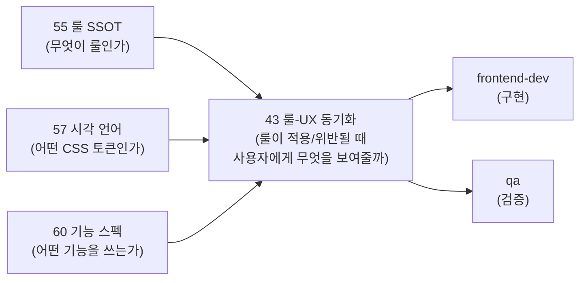
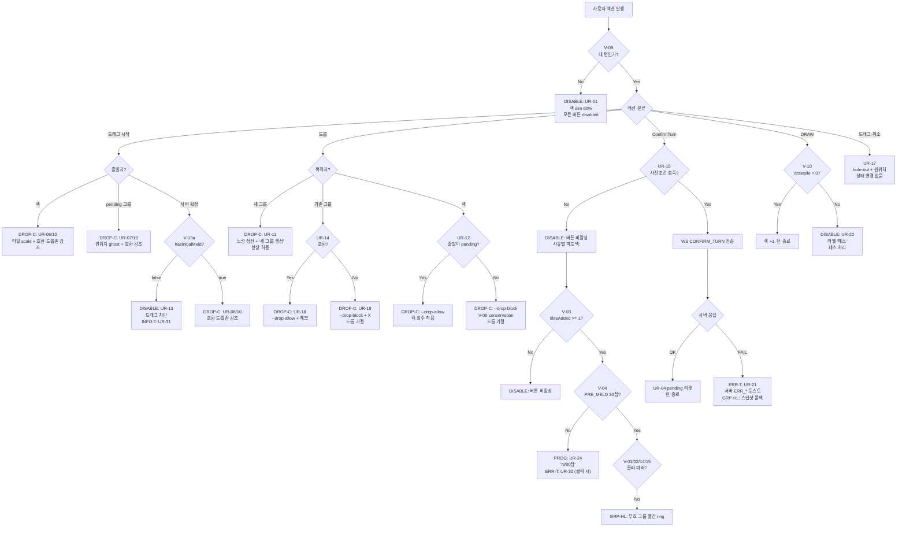

# 43 -- 룰-UX 동기화 SSOT

- **작성일**: 2026-04-26
- **작성자**: ai-engineer + designer
- **SSOT 참조**: `55-game-rules-enumeration.md` (활성 76 + 결번 1 = 명목 77), `57-game-rule-visual-language.md` (시각 언어), `60-ui-feature-spec.md` (기능 스펙 F-NN 25개)
- **변경 절차**: 본 문서 변경 시 ai-engineer + designer 합의 필수. 상위 SSOT (55/57/60) 변경 시 본 문서 동시 업데이트.
- **충돌 정책**: 본 문서와 55/57/60 충돌 시 55(룰) > 57(시각) > 60(기능) > 본 문서 순서로 상위가 우선한다. 본 문서는 "매핑" 만 정의하며 룰이나 시각 토큰 자체를 재정의하지 않는다.

---

## 1. 목적

게임룰 활성 76개(V-* 25 / UR-* 39 / D-* 12, 결번 UR-39 1) 가 위반 또는 적용될 때 사용자에게 전달하는 UX 피드백의 **단일 기준**을 정의한다.

현재 상황:
- 55번 문서는 "이 룰이 무엇인가"를 정의한다.
- 57번 문서는 "시각 토큰이 어떤 CSS 값인가"를 정의한다.
- 60번 문서는 "사용자가 어떤 기능을 쓰는가"를 정의한다.

그러나 **"룰 X가 위반되면 사용자에게 정확히 어떤 피드백을 줘야 하는가"** 를 한 곳에서 찾을 수 없다. 본 문서가 그 빈 자리를 채운다.

---

## 2. UX 피드백 유형 카탈로그

본 문서에서 사용하는 피드백 유형 7가지를 먼저 정의한다. 모든 매핑은 이 카탈로그의 유형 코드를 참조한다.

| 유형 코드 | 유형 | 설명 | 시각 토큰 (57 참조) | 지속시간 | 예시 |
|-----------|------|------|---------------------|---------|------|
| **ERR-T** | 에러 토스트 | 서버 거부 또는 클라 사전검증 실패 시 빨간 배경 토스트. 룰 ID 필수 포함 | `--toast-error: #C0392B` | 4초 자동 닫힘 | "[V-01] 유효하지 않은 타일 조합" |
| **INFO-T** | 정보 토스트 | 안내성 메시지. 파란 배경 | `--toast-info: #3498DB` | 3~5초 자동 닫힘 | "[V-13a] 최초 등록 후 보드 재배치 가능" |
| **WARN-T** | 경고 토스트 | 주의 필요 상황. 주황 배경 | `--toast-warn: #E67E22` | 6초 자동 닫힘 | "[UR-29] 통신 지연" |
| **PROG** | 진행 배너 | 상단 또는 버튼 하단 고정. 실시간 갱신 | `--timer-warn` (미달) / `--drop-allow` (달성) | 조건 소멸 | "15/30점" |
| **DROP-C** | 드롭존 색상 | 드래그 중 그룹/영역의 border와 bg 색 변화 | `--drop-allow` / `--drop-block` | 드래그 중 | 초록(호환) / 빨강(비호환) |
| **GRP-HL** | 그룹 하이라이트 | 특정 그룹 테두리 강조 (유효/무효 표시) | `--pending-border` / `--pending-invalid` | 3초 또는 조건 소멸 | 빨간 ring + shake (무효 세트) |
| **DISABLE** | 비활성화 | 버튼/영역 회색 처리, 커서 변경 | `opacity: 0.35~0.40` + `cursor: not-allowed` | 조건 소멸 | ConfirmTurn 비활성 |

### 2.1 피드백 유형별 band-aid 금지 기준

| 유형 | 허용 조건 | 금지 패턴 (UR-34/35/36) |
|------|----------|------------------------|
| ERR-T | 메시지에 `[V-NN]` 또는 `[UR-NN]` 포함 필수 | 룰 ID 없는 에러 토스트 |
| INFO-T | 메시지에 `[V-NN]` 또는 `[UR-NN]` 포함 필수 | "상태 이상 감지" 류 invariant 메시지 |
| WARN-T | 메시지에 `[UR-NN]` 포함 필수 | "소스 불일치" 류 source guard 메시지 |
| DROP-C | UR-10/14/18/19 명세 기반만 | 명세 외 사유 드롭 차단 |
| GRP-HL | UR-20/21 명세 기반만 | 명세 외 경고 하이라이트 |
| DISABLE | V-* / UR-* 명세 사전조건 기반만 | 명세 외 임의 비활성화 |

---

## 3. P0 룰-UX 매핑 (12개 F-NN 기준)

P0 12개 기능(F-01, F-02, F-03, F-04, F-05, F-06, F-09, F-11, F-13, F-15, F-17, F-21)에 직접 관여하는 룰을 중심으로 상세 매핑한다.

### 3.1 서버 검증 룰 (V-*) -- P0 관련

| 룰 ID | 룰 요약 | 트리거 시점 | UX 피드백 유형 | UX 메시지 / 동작 | F-NN | 57 토큰 | 구현 상태 |
|-------|---------|------------|---------------|-----------------|------|---------|----------|
| **V-01** | 세트 유효성 (그룹 또는 런) | ConfirmTurn 서버 응답 | ERR-T + GRP-HL | "[V-01] 유효하지 않은 타일 조합 -- 그룹 또는 런이어야 합니다" + 해당 그룹 빨간 ring + shake | F-09, F-13 | `--toast-error`, `--pending-invalid` | 미구현 |
| **V-02** | 세트 크기 3장 이상 | ConfirmTurn 서버 응답 + 클라 사전검증 | ERR-T + GRP-HL | "[V-02] 3장 이상이어야 합니다" + 해당 그룹 빨간 ring | F-09, F-13 | `--toast-error`, `--pending-invalid` | 미구현 |
| **V-03** | 랙에서 최소 1장 추가 | ConfirmTurn 버튼 사전조건 | DISABLE | ConfirmTurn 버튼 비활성화 (UR-15) | F-09 | `opacity: 0.40` | 진행중 |
| **V-04** | 최초 등록 30점 | 타일 배치 중 (실시간) + ConfirmTurn 시도 시 | PROG + ERR-T | 진행 배너 "현재 N점 / 30점" (UR-24) + 미달 시 "[V-04] 최초 등록은 30점 이상이어야 합니다" (UR-30) | F-17, F-09 | `--timer-warn` / `--drop-allow`, `--toast-error` | 미구현 |
| **V-05** | 최초 등록 시 랙 타일만 사용 | PRE_MELD 상태에서 서버 그룹 드래그 시도 시 | DISABLE + INFO-T | 서버 확정 그룹 드래그 차단 (UR-13) + "[V-13a] 최초 등록 후 보드 재배치 가능" (UR-31) | F-04, F-06 | `cursor: not-allowed`, `--toast-info` | 미구현 |
| **V-06** | 타일 보존 (Conservation) | 서버 확정 타일을 랙으로 회수 시도 시 | DROP-C | 랙 드롭존 `--drop-block` 표시 (UR-12). 서버 확정 출발 타일은 랙에 드롭 불가 | F-05 | `--drop-block` | 미구현 |
| **V-08** | 자기 턴 확인 | 다른 플레이어 턴에 액션 시도 시 | DISABLE | 전체 드래그/버튼 비활성화 (UR-01). 랙 dim 60% + 커서 not-allowed | F-01 | `opacity: 0.40`, `cursor: not-allowed` | 진행중 |
| **V-09** | 턴 타임아웃 | 타이머 만료 시 | PROG + ERR-T | 타이머 10초 이하 노랑 펄스 (UR-26) + 5초 이하 빨강 펄스 + 0초 시 shake + 자동 드로우 | F-15 | `--timer-warn`, `--timer-critical` | 진행중 |
| **V-10** | 드로우 파일 소진 | drawpile 0일 때 DRAW 시도 | DISABLE + INFO-T | 드로우 버튼 라벨 "패스"로 변경 (UR-22) + X 마크 (UR-23) | F-11 | `--toast-warn` | 미구현 |
| **V-12** | 승리 (랙 0장) | GAME_OVER 수신 | GRP-HL (오버레이) | 승리 오버레이 + ELO 변동 표시 (UR-27, UR-28) | F-09 (후속) | `--highlight-mine` | 미구현 |
| **V-13a** | 재배치 권한 (hasInitialMeld) | PRE_MELD 상태에서 서버 그룹 드래그 시도 | DISABLE + INFO-T | 서버 확정 그룹 드래그 비활성 (UR-13) + "[V-13a] 최초 등록 후 보드 재배치 가능" (UR-31) | F-04, F-06 | `cursor: not-allowed`, `--toast-info` | 미구현 |
| **V-13b** | 재배치: 세트 분할 (Split) | POST_MELD에서 서버 그룹 타일 드래그 시 | DROP-C | 드래그 허용 + 호환 드롭존 강조 (UR-10). 분할 후 양쪽 세트 < 3장이면 ConfirmTurn 비활성 | F-06 | `--drop-allow`, `--drop-block` | 미구현 |
| **V-13c** | 재배치: 세트 합병 (Merge) | POST_MELD에서 서버 그룹 타일을 다른 그룹에 드롭 시 | DROP-C | 합병 호환 그룹만 `--drop-allow` 표시 (UR-14) | F-06 | `--drop-allow-border` | 미구현 |
| **V-13d** | 재배치: 타일 이동 (Move) | POST_MELD에서 서버 그룹 타일을 다른 세트로 이동 | DROP-C | UR-13 권한 통과 시 허용. 잔여 < 3장이면 ConfirmTurn 비활성 | F-06 | `--drop-allow` | 미구현 |
| **V-14** | 그룹 동색 중복 불가 | 드롭 호환성 검사 시 (클라 실시간) + ConfirmTurn 서버 응답 | DROP-C + GRP-HL | 비호환 드롭존 `--drop-block` (UR-19) + 서버 거부 시 중복 타일 빨간 ring | F-21, F-09, F-13 | `--drop-block`, `--pending-invalid` | 미구현 |
| **V-15** | 런 숫자 연속 (순환 금지) | 드롭 호환성 검사 시 (클라 실시간) + ConfirmTurn 서버 응답 | DROP-C + GRP-HL | 비호환 드롭존 `--drop-block` (UR-19) + 서버 거부 시 그룹 전체 빨간 ring | F-21, F-09, F-13 | `--drop-block`, `--pending-invalid` | 미구현 |

### 3.2 UI 인터랙션 룰 (UR-*) -- P0 관련

| 룰 ID | 룰 요약 | 트리거 시점 | UX 피드백 유형 | UX 동작 | F-NN | 57 토큰 | 구현 상태 |
|-------|---------|------------|---------------|---------|------|---------|----------|
| **UR-01** | 다른 턴 전체 비활성 | `currentSeat != mySeat` | DISABLE | 랙 dim 60%, 커서 not-allowed, 버튼 disabled | F-01, F-14 | `opacity: 0.40`, `cursor: not-allowed` | 진행중 |
| **UR-02** | 내 턴 시작 활성화 | TURN_START 수신 | GRP-HL | 랙 1회 pulse (`--highlight-mine` 테두리 0.6s) | F-01 | `--highlight-mine` | 미구현 |
| **UR-04** | 턴 시작 pending 0 강제 | TURN_START 수신 | (자동) | `pendingTableGroups = []` 강제 리셋. 토스트 없음 (UR-34) | F-01 | 없음 (silent) | 미구현 |
| **UR-06** | 랙 타일 드래그 허용 | 내 턴에 드래그 시작 | DROP-C | 타일 `scale(1.08) y(-2px)` + DragOverlay | F-02 | spring 200ms | 진행중 |
| **UR-10** | 드래그 시작 시 호환 드롭존 강조 | onDragStart | DROP-C | 호환 그룹 `--drop-allow` 40% pulse, 비호환 `--drop-block` 20% | F-21 | `--drop-allow`, `--drop-block` | 미구현 |
| **UR-11** | 랙 -> 새 그룹 드롭존 | 드래그 중 새 그룹 영역 hover | DROP-C | 노랑 점선 border + "새 그룹 생성" 라벨. 항상 허용 | F-02 | `--pending-border` | 미구현 |
| **UR-12** | 보드 -> 랙 드롭 (pending만) | 보드 타일을 랙으로 드래그 시 | DROP-C | pending 출발: `--drop-allow` / 서버 확정 출발: `--drop-block` + 커서 not-allowed | F-05 | `--drop-allow`, `--drop-block` | 미구현 |
| **UR-13** | PRE_MELD 서버 그룹 드래그 차단 | PRE_MELD 상태에서 서버 확정 그룹 hover | DISABLE + INFO-T | 드래그 disabled + "[V-13a] 최초 등록 후 보드 재배치 가능" (UR-31) | F-04, F-06 | `cursor: not-allowed`, `--toast-info` | 미구현 |
| **UR-14** | 합병 가능 그룹만 드롭 허용 | 드래그 중 그룹 hover | DROP-C | 호환: ring-2 `--drop-allow` 70% + 체크 아이콘 / 비호환: `--drop-block` 70% + X 아이콘 | F-03, F-04, F-21 | `--drop-allow-border`, `--drop-block-border` | 미구현 |
| **UR-15** | ConfirmTurn 활성화 조건 | pending 변경 시 매번 평가 | DISABLE | (i) tilesAdded >= 1 AND (ii) V-01/V-02/V-14/V-15 클라 미러 통과 AND (iii) PRE_MELD이면 V-04 >= 30. 미충족 시 `opacity: 0.40` | F-09 | `opacity: 0.40` / `--drop-allow` ring pulse (활성 시) | 진행중 |
| **UR-16** | RESET_TURN 활성화 | pending > 0 또는 랙 변경 | DISABLE | pending 없으면 `opacity: 0.30` + not-allowed | F-09 (관련) | `opacity: 0.30` | 진행중 |
| **UR-18** | 호환 드롭존 색 | 드래그 중 hover | DROP-C | `ring-2 --drop-allow-border bg --drop-allow-bg` | F-21 | `--drop-allow`, `--drop-allow-bg` | 미구현 |
| **UR-19** | 비호환 드롭존 색 | 드래그 중 hover | DROP-C | `outline-dashed --drop-block-border bg --drop-block-bg` + 대각선 해칭 (색약 보조) | F-21 | `--drop-block`, `--drop-block-bg` | 미구현 |
| **UR-20** | pending 그룹 표시 | pending 그룹 존재 시 | GRP-HL | 노랑 점선 border `--pending-border` + "미확정" 라벨 + `opacity: 0.55` | F-02, F-03, F-05 | `--pending-border`, `--pending-bg` | 진행중 |
| **UR-21** | INVALID_MOVE 토스트 | 서버 INVALID_MOVE 수신 | ERR-T + GRP-HL | "[V-NN] {ERR_* 메시지}" 빨간 토스트 + 스냅샷 롤백 | F-13 | `--toast-error` | 미구현 |
| **UR-22** | 드로우 파일 0 버튼 | drawpile == 0 | DISABLE | 버튼 라벨 "드로우 (1장)" -> "패스" + 아이콘 변경 | F-11 | `--toast-warn` 계열 | 미구현 |
| **UR-24** | V-04 진행 표시 | PRE_MELD pending 변경 시 | PROG | ConfirmTurn 하단 가로 진척 바 "현재 N점 / 30점". 미달: `--timer-warn` / 달성: `--drop-allow` | F-17 | `--timer-warn`, `--drop-allow` | 미구현 |
| **UR-26** | 타이머 경고 | 타이머 10초 이하 | PROG | 10초 이하: `--timer-warn` 노랑 pulse 1.0s / 5초 이하: `--timer-critical` 빨강 pulse 0.5s / 0초: shake + 자동 드로우 | F-15 | `--timer-warn`, `--timer-critical` | 진행중 |
| **UR-30** | V-04 미달 ConfirmTurn 시도 | PRE_MELD에서 ConfirmTurn 클릭 시도 | ERR-T | "[V-04] 최초 등록은 30점 이상이어야 합니다 (현재 N점)" + ConfirmTurn shake 0.3s | F-17, F-09 | `--toast-error` | 미구현 |

### 3.3 데이터 무결성 룰 (D-*) -- P0 관련

D-* 룰은 코드 버그에 해당하며 **사용자 UX 피드백을 노출하지 않는다** (UR-34 준수). 아래 표는 코드 수정이 정답이며, 사용자에게는 silent하게 처리해야 하는 항목이다.

| 룰 ID | 룰 요약 | 위반 시 사용자 피드백 | 올바른 대응 | F-NN |
|-------|---------|---------------------|-----------|------|
| **D-01** | 그룹 ID 유니크 | 없음 (UR-34) | setter 단계에서 ID 충돌 감지 시 새 ID 발급. console.error | F-05, F-06 |
| **D-02** | 동일 tile code 보드 1회만 | 없음 (UR-34) | handleDragEnd atomic 이동 보장. console.error | F-05 |
| **D-03** | 빈 그룹 금지 | 없음 (UR-34) | tiles.length == 0 인 그룹 자동 제거 | F-05 |
| **D-04** | tile code 형식 검증 | 없음 (파싱 거부) | `ErrInvalidTileCode` 서버 반환. 클라는 이 tile을 생성하지 않음 | (전체) |
| **D-12** | pending -> server ID 매핑 | UR-20 보강: pending- 미매핑 그룹 dim 처리 ("서버 응답 대기") | V-17 서버 ID 할당 + WS 수신 시 매핑 | F-02, F-04 |

---

## 4. 전체 룰-UX 매핑 (활성 76 + 결번 1)

P0 상세 매핑(3장) 외 나머지 룰을 포함한 전체 매핑이다. 간략 형식으로 정리한다.

### 4.1 서버 검증 룰 (V-*) 전체 25개

| 룰 ID | 룰 요약 | UX 피드백 유형 | F-NN | 비고 |
|-------|---------|---------------|------|------|
| V-01 | 세트 유효성 (그룹/런) | ERR-T + GRP-HL | F-09, F-13 | P0 -- 3.1 상세 |
| V-02 | 세트 크기 3장 이상 | ERR-T + GRP-HL | F-09, F-13 | P0 -- 3.1 상세 |
| V-03 | 랙에서 최소 1장 추가 | DISABLE | F-09 | P0 -- UR-15 사전조건 |
| V-04 | 최초 등록 30점 | PROG + ERR-T | F-17, F-09 | P0 -- 3.1 상세 |
| V-05 | 최초 등록 랙 타일만 | DISABLE + INFO-T | F-04, F-06 | P0 -- V-13a와 동일 UX |
| V-06 | 타일 보존 (Conservation) | DROP-C | F-05 | P0 -- UR-12 드롭 거절 |
| V-07 | 조커 회수 후 즉시 사용 | GRP-HL + DISABLE | F-07, F-18 | P1 -- UR-25 조커 펄스 + ConfirmTurn 비활성 |
| V-08 | 자기 턴 확인 | DISABLE | F-01, F-14 | P0 -- UR-01 전체 비활성 |
| V-09 | 턴 타임아웃 | PROG | F-15 | P0 -- UR-26 타이머 경고 |
| V-10 | 드로우 파일 소진 | DISABLE | F-11, F-19 | P0 -- UR-22/23 패스 전환 |
| V-11 | 교착 상태 (Stalemate) | GRP-HL (오버레이) | F-16 | P1 -- UR-27 ALL_PASS 오버레이 |
| V-12 | 승리 (랙 0장) | GRP-HL (오버레이) | F-16 | P1 -- UR-27/28 WIN 오버레이 + ELO |
| V-13a | 재배치 권한 | DISABLE + INFO-T | F-04, F-06 | P0 -- UR-13/31 |
| V-13b | 세트 분할 (Split) | DROP-C | F-06 | P0 -- 드롭존 호환 강조 |
| V-13c | 세트 합병 (Merge) | DROP-C | F-06 | P0 -- UR-14 합병 호환 |
| V-13d | 타일 이동 (Move) | DROP-C | F-06 | P0 -- UR-13 권한 통과 시 허용 |
| V-13e | 조커 교체 (Joker Swap) | GRP-HL | F-07 | P1 -- UR-25 회수 조커 강조 |
| V-14 | 그룹 동색 중복 불가 | DROP-C + GRP-HL | F-21, F-13 | P0 -- 비호환 드롭존 표시 |
| V-15 | 런 숫자 연속 (순환 금지) | DROP-C + GRP-HL | F-21, F-13 | P0 -- 비호환 드롭존 표시 |
| V-16 | 색상 enum 정합성 | (없음) | (없음) | 코드 내부 검증. 사용자 노출 없음 |
| V-17 | 그룹 ID 서버측 발급 | (없음) | F-02, F-04 | 서버 내부. D-12와 연동 (pending dim 처리) |
| V-18 | 턴 스냅샷 무결성 | (없음) | F-13 | 서버 내부. INVALID_MOVE 시 롤백 기반 |
| V-19 | 메시지 시퀀스 단조성 | WARN-T | F-13 | UR-29 "통신 지연 -- 다시 시도해 주세요" |
| V-20 | 패널티 정책 (Human 3 / AI 1) | ERR-T + INFO-T | F-13 | 신규 2026-04-28. UR-21 + UR-40 (패널티 안내 토스트) |
| V-21 | 방 정원 충족 후 게임 시작 (재정의 2026-04-29) | DISABLE | (방 화면) | StartGame 버튼은 `len(activePlayers) === MaxPlayers` 일 때만 활성. 거부 시 `EMPTY_SLOTS_REMAINING (400)`. UR-* 신규 발행 없음 (방 화면 UX 범주 -- 별도 신규 룰 ID 부여 안 함) |

### 4.2 UI 인터랙션 룰 (UR-*) 전체 39개 (활성) + 결번 1 (UR-39)

| 룰 ID | 룰 요약 | UX 피드백 유형 | F-NN | 비고 |
|-------|---------|---------------|------|------|
| UR-01 | 다른 턴 전체 비활성 | DISABLE | F-01, F-14 | P0 -- 3.2 상세 |
| UR-02 | 내 턴 활성화 | GRP-HL (pulse) | F-01 | P0 -- 3.2 상세 |
| UR-03 | AI 사고 중 표시 | PROG (spinner) | F-14 | P1 -- "사고 중..." dot pulse |
| UR-04 | 턴 시작 pending 0 강제 | (silent) | F-01 | P0 -- 토스트 없음 |
| UR-05 | 턴 종료 다음 플레이어 안내 | INFO-T | F-01 | P1 -- "{name}님의 차례입니다" 5초 |
| UR-06 | 랙 타일 드래그 허용 | DROP-C (시작) | F-02 | P0 -- scale + shadow |
| UR-07 | pending 그룹 타일 드래그 | DROP-C (시작) | F-05 | P0 -- ghost 0.35 |
| UR-08 | 서버 확정 그룹 타일 드래그 | DROP-C (시작) | F-04, F-06 | P0 -- POST_MELD만 |
| UR-09 | 조커 드래그 | DROP-C (시작) | F-07 | P1 -- 무지개 ring 유지 |
| UR-10 | 호환 드롭존 강조 | DROP-C | F-21 | P0 -- 3.2 상세 |
| UR-11 | 랙 -> 새 그룹 드롭존 | DROP-C | F-02 | P0 -- 3.2 상세 |
| UR-12 | 보드 -> 랙 (pending만) | DROP-C | F-05 | P0 -- 3.2 상세 |
| UR-13 | PRE_MELD 서버 그룹 차단 | DISABLE + INFO-T | F-04, F-06 | P0 -- 3.2 상세 |
| UR-14 | 합병 가능 그룹 드롭 | DROP-C | F-03, F-04, F-21 | P0 -- 3.2 상세 |
| UR-15 | ConfirmTurn 활성화 조건 | DISABLE | F-09 | P0 -- 3.2 상세 |
| UR-16 | RESET_TURN 활성화 | DISABLE | F-10 | P1 |
| UR-17 | 드래그 취소 원위치 복구 | (animation) | F-12 | P1 -- fade-out + spring 복귀 |
| UR-18 | 호환 드롭존 색 토큰 | DROP-C | F-21 | P0 -- `--drop-allow` 계열 |
| UR-19 | 비호환 드롭존 색 토큰 | DROP-C | F-21 | P0 -- `--drop-block` 계열 |
| UR-20 | pending 그룹 시각 표현 | GRP-HL | F-02, F-03, F-05 | P0 -- 노랑 점선 |
| UR-21 | INVALID_MOVE 토스트 | ERR-T | F-13 | P0 -- 3.2 상세 |
| UR-22 | 드로우 파일 0 라벨 변경 | DISABLE | F-11 | P0 -- "패스" 라벨 |
| UR-23 | 드로우 파일 소진 X 마크 | GRP-HL | F-19 | P2 -- "타일 소진" |
| UR-24 | V-04 진행 표시 | PROG | F-17 | P0 -- "N점 / 30점" |
| UR-25 | 회수 조커 강조 | GRP-HL + DISABLE | F-18 | P1 -- 펄스 ring + ConfirmTurn 비활성 |
| UR-26 | 타이머 경고 | PROG | F-15 | P0 -- 색상 3단계 전환 |
| UR-27 | 게임 종료 오버레이 | GRP-HL (오버레이) | F-16 | P1 -- reason별 카피 분기 |
| UR-28 | 승리 ELO 변동 | GRP-HL (오버레이) | F-16 | P1 -- +N / -N fly-in |
| UR-29 | STALE_SEQ 안내 | WARN-T | F-13 | "[UR-29] 통신 지연 -- 다시 시도해 주세요" 6초 |
| UR-30 | V-04 미달 ConfirmTurn | ERR-T | F-17, F-09 | P0 -- 3.2 상세 |
| UR-31 | V-13a 위반 시도 | INFO-T | F-04, F-06 | P0 -- "[V-13a] 최초 등록 후..." 3초 |
| UR-32 | 재연결 진행 중 | WARN-T (bar) | F-20 | P1 -- "재연결 중..." dot 순차 fade |
| UR-33 | AI 강제 드로우 | INFO-T | F-14 | P1 -- "{aiName}이(가) 드로우합니다" 3초 |
| UR-34 | state 부패 토스트 금지 | (금지 정책) | (전체) | band-aid 검출용. 사용자 피드백 없음 |
| UR-35 | 드래그 false positive 금지 | (금지 정책) | (전체) | band-aid 검출용. 명세 외 차단 금지 |
| UR-36 | ConfirmTurn 사전검증 범위 제한 | (금지 정책) | F-09 | V-01~V-15 클라 미러만 허용 |
| UR-37 | PRE_MELD 시 서버 그룹 영역 드롭 안내 (fall-through to 새 pending) | INFO-T (turn 1회) | F-04, F-06 | 신규 2026-04-28. UR-31 카피 재사용, 빈도만 1회 한정 |
| UR-38 | RESET vs INVALID_MOVE 롤백 분리 | (정책) | (전체) | 신규 2026-04-28. `reset()` vs `rollbackToServerSnapshot()` 별개 경로. alias 금지 |
| UR-39 | (폐기, 2026-04-29) Mid-Game 진입자 첫 턴 안내 모달 | (없음) | (없음) | V-21 재정의로 trigger 영구 미발생. ID 결번 보존. 차후 신규 룰은 UR-41 부터 |
| UR-40 | 패널티 안내 토스트 (V-20 부속) | INFO-T | F-13 | 신규 2026-04-28. UR-21 토스트 위 append. "패널티로 N장을 드로우합니다" (N=Human 3 / AI 1) |

### 4.3 데이터 무결성 룰 (D-*) 전체 12개

D-* 룰은 모두 코드 버그에 해당하며 사용자에게 직접 UX 피드백을 노출하지 않는다 (UR-34).

| 룰 ID | 룰 요약 | 사용자 UX 피드백 | 개발자 대응 |
|-------|---------|----------------|-----------|
| D-01 | 그룹 ID 유니크 | 없음 | setter guard + console.error |
| D-02 | 동일 tile code 보드 1회만 | 없음 | atomic 이동 보장 + console.error |
| D-03 | 빈 그룹 금지 | 없음 | tiles.length == 0 그룹 자동 제거 |
| D-04 | tile code 형식 검증 | 없음 | `ErrInvalidTileCode` 서버 거부 |
| D-05 | 보드+랙+drawpile = 106 | 없음 | 서버 invariant alert |
| D-06 | 같은 tile code 게임 전체 1장 | 없음 | pool.go 보장 |
| D-07 | JK1, JK2 정확히 2장 | 없음 | pool.go 보장 |
| D-08 | 조커 wildcard + V-04 점수 추론 | 없음 (V-04 PROG으로 간접 표시) | engine 추론 로직 |
| D-09 | 색상 enum {R,B,Y,K} 만 | 없음 | "joker" 문자열 비교 금지 (V-16) |
| D-10 | tableGroup.type 힌트는 참고용 | 없음 | tiles 내용이 진실. 불일치 시 unknown 강등 |
| D-11 | WS envelope 4필드 필수 | 없음 | 서버 거부 |
| D-12 | pending -> server ID 매핑 | UR-20 보강: 미매핑 그룹 dim 처리 | V-17 서버 ID 할당 + WS 수신 매핑 |

---

## 5. 룰-UX 피드백 결정 트리

사용자 행동이 발생했을 때, 어떤 UX 피드백을 줄지 결정하는 흐름이다.

---

## 6. 서버 에러 코드 -> UX 메시지 매핑

서버가 INVALID_MOVE로 반환하는 ERR_* 코드를 사용자에게 보여줄 토스트 메시지로 변환하는 매핑이다. 모든 메시지에 룰 ID가 포함된다.

| 서버 ERR 코드 | 룰 ID | 사용자 메시지 (토스트) | 피드백 유형 |
|--------------|-------|---------------------|-----------|
| `ERR_INVALID_SET` | V-01 | "[V-01] 유효하지 않은 타일 조합 -- 그룹 또는 런이어야 합니다" | ERR-T |
| `ERR_SET_SIZE` | V-02 | "[V-02] 세트는 3장 이상이어야 합니다" | ERR-T |
| `ERR_NO_RACK_TILE` | V-03 | "[V-03] 랙에서 최소 1장을 추가해야 합니다" | ERR-T |
| `ERR_INITIAL_MELD_SCORE` | V-04 | "[V-04] 최초 등록은 30점 이상이어야 합니다 (현재 {N}점)" | ERR-T |
| `ERR_INITIAL_MELD_SOURCE` | V-05 | "[V-05] 최초 등록에는 랙 타일만 사용할 수 있습니다" | ERR-T |
| `ERR_TABLE_TILE_MISSING` | V-06 | "[V-06] 테이블 타일이 누락되었습니다 -- 보드 타일을 랙으로 가져올 수 없습니다" | ERR-T |
| `ERR_JOKER_NOT_USED` | V-07 | "[V-07] 회수한 조커를 이번 턴에 사용해야 합니다" | ERR-T |
| `ERR_NOT_YOUR_TURN` | V-08 | "[V-08] 지금은 다른 플레이어의 차례입니다" | ERR-T |
| `ERR_NO_REARRANGE_PERM` | V-13a | "[V-13a] 최초 등록 후에 보드 재배치가 가능합니다" | ERR-T |
| `ERR_GROUP_COLOR_DUP` | V-14 | "[V-14] 같은 색상의 타일이 그룹 안에 2장 이상 있을 수 없습니다" | ERR-T |
| `ERR_RUN_SEQUENCE` | V-15 | "[V-15] 런의 숫자가 연속되지 않습니다" | ERR-T |
| `ERR_RUN_RANGE` | V-15 | "[V-15] 런의 숫자 범위가 1~13을 벗어납니다" | ERR-T |
| `ERR_RUN_DUPLICATE` | V-15 | "[V-15] 런 안에 같은 숫자가 중복됩니다" | ERR-T |
| `STALE_SEQ` | V-19 | "[UR-29] 통신 지연 -- 다시 시도해 주세요" | WARN-T |

---

## 7. 미결 항목

구현 시 결정이 필요한 UX 질문 목록이다.

| 번호 | 항목 | 관련 룰 | 결정 필요 주체 | 상태 |
|------|------|---------|-------------|------|
| Q-01 | V-01/V-02 위반 시 어느 그룹을 하이라이트할 것인가? 서버가 그룹 인덱스를 반환하지 않으면 모든 pending 그룹에 적용할지, 클라 사전검증 결과를 활용할지 | V-01, V-02 | go-dev + frontend-dev | 미결 |
| Q-02 | V-04 진행 바를 ConfirmTurn 버튼 하단에 둘 것인가, 보드 상단에 둘 것인가? 57에서는 "버튼 하단"으로 정의했으나 레이아웃 개선(안 B) 적용 시 위치가 바뀔 수 있다 | V-04, UR-24 | designer | 미결 |
| Q-03 | UR-31 토스트("[V-13a] 최초 등록 후 보드 재배치 가능")를 드래그 시도 즉시 보여줄 것인가, 3초 딜레이 후 보여줄 것인가? 빈번한 드래그 시 토스트 과다 발생 우려 | V-13a, UR-31 | designer + pm | 미결 |
| Q-04 | INVALID_MOVE 후 롤백 시 shake 애니메이션과 동시에 pending 그룹이 사라지는 것을 어떻게 시각적으로 연결할 것인가? (fade-out 후 서버 스냅샷 fade-in vs 즉시 교체) | UR-21, V-18 | designer | 미결 |
| Q-05 | drawpile 잔여량을 숫자로 표시할 것인가? 현재 57에서는 0일 때만 X 마크로 정의했으나, 잔여 10장 이하일 때도 경고를 줄지 | V-10, UR-23 | pm | 미결 |
| Q-06 | 색약 보조 모드를 별도 설정으로 둘 것인가, 기본으로 항상 활성화할 것인가? 57에서 해칭 패턴과 심볼을 정의했으나 기본 on/off 정책 미정 | UR-18, UR-19 | pm + designer | 미결 |
| Q-07 | D-12 ghost group ("서버 응답 대기" dim 그룹) 이 5초 이상 지속되면 자동 제거할 것인가, 계속 남겨둘 것인가? | D-12, V-17 | architect + frontend-dev | 미결 |

---

## 8. 변경 이력

| 버전 | 일자 | 작성자 | 변경 |
|------|------|--------|------|
| v1.0 | 2026-04-26 | ai-engineer + designer | 초안 발행. UX 피드백 유형 7개 정의. P0 12개 F-NN 상세 매핑 (V-* 16개, UR-* 19개, D-* 5개). 전체 71개 간략 매핑. 서버 ERR -> UX 메시지 14개. 결정 트리 1개. 미결 항목 7개. |
| v1.1 | 2026-04-29 | game-analyst | SSOT 55 v1.2 동기화. §4.1 V-20 (패널티) / V-21 (방 정원 충족 후 게임 시작 -- 재정의) 추가, §4.2 UR-37/UR-38/UR-40 활성 + UR-39 결번 표기. 헤딩 룰 카운트 71 → 활성 76 + 결번 1 갱신. V-21 매핑은 DISABLE 만 (방 화면 UX 범주, 별도 UR 신설 안 함 -- SSOT 55 §2.25 결정 준수). |
