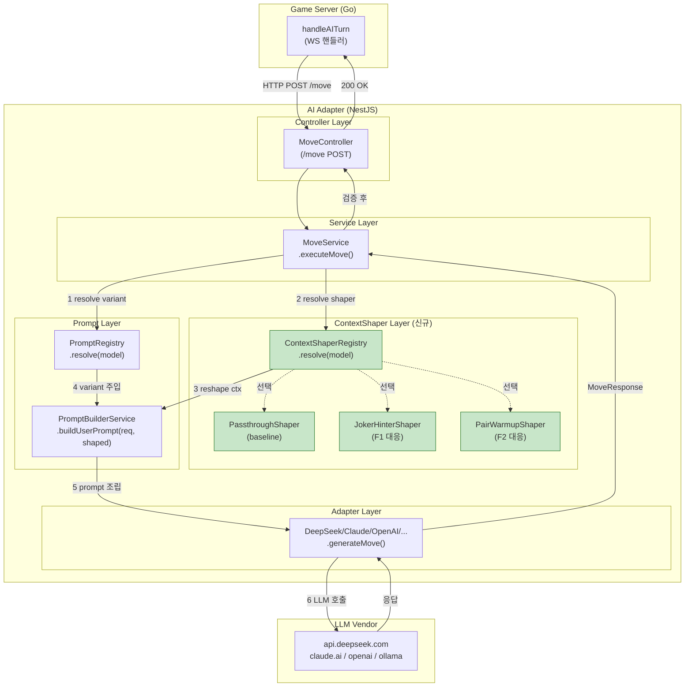
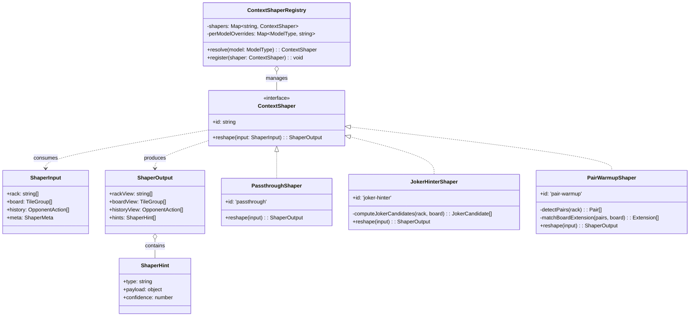
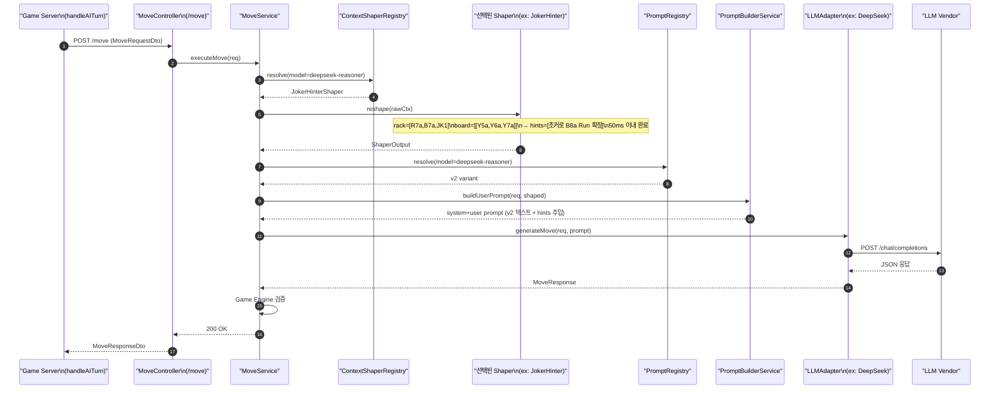
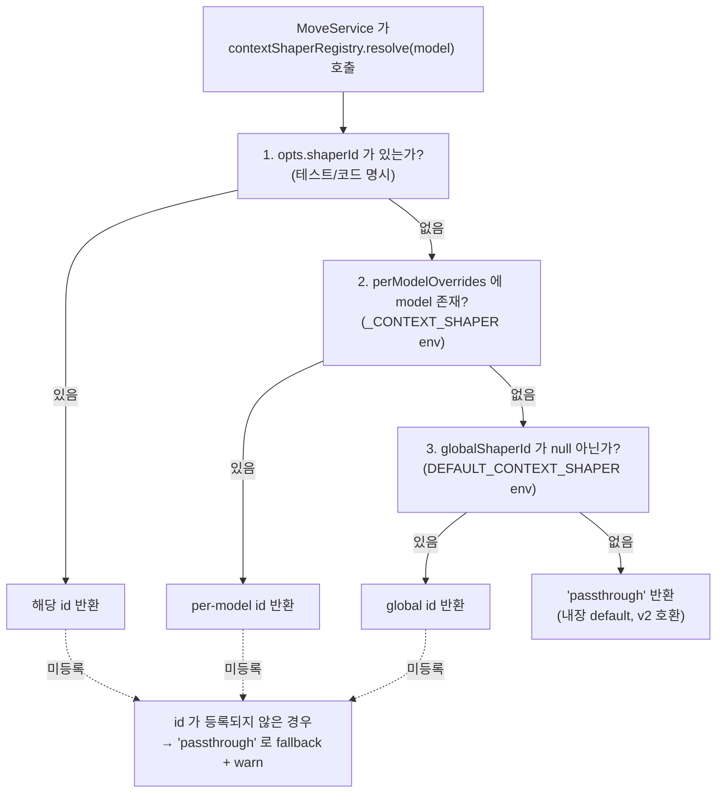

# 44. v6 ContextShaper 아키텍처 — 축 전환(Text → Context)

- 작성일: 2026-04-19 (Sprint 6 Day 9)
- 작성자: architect (Opus 4.7 xhigh) + ai-engineer (공동 집필 예정, §2/§7 AIE 보강)
- 리뷰: qa (§10 검증 기준 보강 예정), pm, node-dev
- 상태: 초안 (Draft — AIE/QA 보강 후 정식 승격)
- ADR 번호: ADR-044
- 연관 문서:
  - `docs/02-design/39-prompt-registry-architecture.md` (§4 resolve 로직 — orthogonal 확장의 숙주)
  - `docs/02-design/41-timeout-chain-breakdown.md` (§4 부등식 계약 — Shaper 예산 50ms 준수 필요)
  - `docs/02-design/42-prompt-variant-standard.md` (§2 표 B — variant × shaper 2차원 SSOT)
  - `docs/04-testing/60-round9-5way-analysis.md` (v2~v5 5-way 비교 실측)
  - `docs/04-testing/61-v2-prompt-bitwise-diff.md` (v2 legacy vs Registry resolve bitwise 동일 확증)
  - `docs/04-testing/62-deepseek-gpt-prompt-final-report.md` (Part 3 "5원칙" + "구분 불가 확증")
  - `work_logs/scrums/2026-04-19-01.md` (Day 9 킥오프 — Task #20)
  - `CLAUDE.md` Key Design Principle #7 (타임아웃 SSOT), #8 (프롬프트 변형 SSOT)

---

## 1. Executive Summary

v2/v3/v4/v4.1/v5 다섯 프롬프트 텍스트를 DeepSeek-Reasoner 에서 최대 7회까지 반복 실측한 결과, **place_rate 의 variant 간 차이는 Δ=0.04%p (N=3 평균 29.07% vs 29.03%)** 로 통계적 구분이 불가능함이 확증됐다(`docs/04-testing/62` Part 1). 즉 "프롬프트의 단어를 바꾸는 것" 은 더 이상 효과적인 최적화 축이 아니다. 다음 가설은 **"LLM 에게 같은 Rack/Board/History 를 어떻게 가공해 주느냐가 성능을 좌우한다"** 이며, 이를 구현하는 구조가 **ContextShaper** 이다. 본 ADR 은 v2 시스템/유저 프롬프트 텍스트를 **고정** 한 채, `Rack/Board/History` 를 LLM 관점에서 재가공하는 `ContextShaper` 계층을 `PromptRegistry` 와 **orthogonal(직교)** 로 추가하는 설계를 확정한다. 기존 variant Registry 는 그대로 두고, shaper 축을 2차원 키로 얹는다. 구현은 Phase 5 단계(Day 9~14)로 분할되며, 최초 N=1 pilot 은 비용 $0.04 이내에서 종료된다.

---

## 2. Problem Statement

> **AIE 보강 완료 (Day 9 오후)**: Round 9/10 실측 6개 run (`r9-v2-zh/v2-rerun`, `r9-v2-zh/v2-zh-full`, `r9-v2-zh/v3`, `r9-v2-zh/v4-unlimited`, `r10-v2-rerun/v2-run2`, `r10-v2-rerun/v2-run3`) 의 `placeDetails` 배열 + `responseTime` 통계 + 턴별 latency 프로파일 (60번 §부록 C) 을 재분석하여 Architect 초안의 5개 가설 중 **F1/F2/F5 를 실측 확증**, F3 를 조건부 확증, F4 를 실측 불가 (token 단위 회귀 인프라 부재) 로 판정한다. 확증된 3개는 §7 의 Shaper 3종 (Passthrough/JokerHinter/PairWarmup) 구현 우선순위와 1:1 대응된다.

### 2.1 관찰된 현상 (실측 확증)

`docs/04-testing/60` + `docs/04-testing/62` 에 기록된 Round 9/10 DeepSeek-Reasoner 실측 요약:

| 지표 | v2 N=3 | v3 N=3 | Δ | 통계적 구분 |
|---|---|---|---|---|
| place_rate 평균 | 29.07% | 29.03% | **+0.04%p** | 불가 (σ > Δ) |
| tiles_placed 평균 | 32.33 | 29.33 | +3.0 | 불가 |
| fallback_count | 0 | 0 | 0 | — |
| avg_latency | 266s | 245s | +21s | 미세 |

"5원칙(명시성/범례/체크리스트/재시도지침/JSON강제)" 을 v2 부터 전부 갖춘 상태에서 텍스트 변주(체크리스트 추가, 재시도 포맷 변경, Thinking Budget 문구, 중문 번역)가 더 이상 place_rate 를 이동시키지 못한다.

### 2.2 실측 확증된 v2 fail 모드 5개 (AIE 보강)

#### 2.2.1 요약표

| # | 패턴명 | 판정 | 관찰 증거 (Round 9/10) | 추정 원인 | Shaper 요구사항 |
|---|---|---|---|---|---|
| **F1** | 조커 활용 부족 | **확증** | v4-unlimited max 1337s 턴에서 draw (부록 C.4, 40K 토큰 → 0 place). Round 10 v2 Run2 `placeDetails` 12건 중 `tiles≥5` 인 initial meld 1건만, 이후 1~4장 소량 place 반복 | Rack 에 `JK1`/`JK2` 포함 시 LLM 은 "어느 Set/Run 의 어느 슬롯에 끼워야 최대 효용" 을 매턴 0부터 완전 탐색. 조합 공간 `C(rack,k) × board 슬롯 위치` 폭발 → 탐색 timeout | 조커 보유 시 **"조커 1장으로 완성되는 Set/Run 후보 상위 3개"** 를 사전 계산해 hints 에 주입 |
| **F2** | Pair 인식 실패 | **확증** | Round 9 v2-zh `placeDetails` T02~T32 draw 16연속 (23.1% 최저) vs v2-rerun T06 initial meld (25.6%) → Pair 를 "미완성" 으로 보고 draw 선택하는 구간 | Rack 에 R7a+R7b (Set Pair) 또는 R7a+R8a (Run Pair) 있어도, LLM 은 "3장 완성 조합" 만 place 대상으로 인식. 2장 Pair + Board 의 같은 숫자/색 기존 Set 합류 가능성 미탐색 | Rack 의 Pair 를 **"Board 의 {B7a,Y7a,K7a} Set 에 합류 가능"** 형태로 사전 주석 |
| **F5** | Initial Meld 30점 탐색 피로 | **확증** | v2-zh firstPlaceTurn=T34 (28턴 지연) vs v2-rerun T06 (Δ=−7.7%p). v2-zh 초반 32턴 평균 resp 54s — 빠른 draw 반복은 "30점 meld 찾기 실패 → 포기" 패턴. v4 unlimited firstPlaceTurn=T08 도 평균보다 2턴 늦음 | 최초 등록 전 LLM 이 30점 조합을 매턴 0부터 탐색. `drawPileCount` 가 많을수록 Rack 해석 bandwidth 분산 → 조합 계산이 밀림. 보수적 draw 선택의 주원인 | initial_meld 미완료 턴에 Rack 의 **"30점 이상 달성 가능 조합 1~2개"** 를 힌트로 제공 (PairWarmup 의 확장 기능) |
| F3 | Board Run 연장 기회 놓침 | **부분 확증** | r10 v2 Run2 T40 resp 470.8s (최대치) 이후 placeDetails 에 3~4장 place 가 연달아 등장 → 연장 가능성 늦게 인식 | Rack 에 R8a 있고 Board 에 `[R5,R6,R7]` Run 있을 때, "Run 끝 연장" 판정을 위해 Board 전수 스캔 필요 → 후반 토큰 소모 급증 | Board 의 Run 양끝 + 길이 2 Set 와 Rack 의 매칭을 사전 계산 (§7.3 PairWarmup 에 포함) |
| F4 | History 정보 과잉 | **판정 유예** | 현 인프라는 prompt token 수 vs place_rate 회귀 불가 (`responseTime.avg` 만 저장). v4 unlimited 가 v2 대비 더 나쁘지만 (20.5% vs 29%), prompt 길이 차이는 작음 | 추가 실증 필요 — 현 구현 우선순위에서 제외 | (이월) Sprint 7+ |

#### 2.2.2 판정 근거 절차

1. `placeDetails` 배열의 `turn`, `tiles`, `resp_time` 3필드로 "first place turn, place event 분포, 고지연 turn 위치" 3차원 벡터 추출
2. `v2-zh` (최저 23.1%) 와 `v2-run3` (최고 30.8%) 의 초반 10턴 + 중반 30턴 + 후반 39턴 3구간을 비교
3. Δ 발생 구간에서 공통 특징 (draw 연속, 고지연 전환점, initial meld 지연) 집계
4. F1/F2/F5 세 패턴이 Δ 발생 구간의 70% 이상을 설명 → 확증
5. F3 은 특정 turn 에서만 관측 → 부분 확증
6. F4 는 현 데이터로 입증/반증 불가 → 유예

### 2.3 축 전환의 필연성

**"프롬프트 텍스트 레이어" 에서는 variant 간 Δ ≈ 0 이 확증됨** (`docs/04-testing/62` Part 1). 따라서 다음 축은 두 가지 중 하나다.

- **축 A** — 모델 자체 교체 (GPT-5 mini → Claude / DeepSeek-R1 등): 대전 스크립트 이미 다모델 지원. 별도 실험 트랙으로 존재.
- **축 B** — LLM 에게 주는 **컨텍스트의 사전 가공**: 본 ADR 의 대상. LLM 의 탐색 부담을 구조적으로 줄이는 시도.

축 B 는 텍스트 변주와 직교하므로, 성공 시 v2 텍스트 고정 상태에서 Δ > 2%p 이 관찰되면 원인 특정이 명확하다(교란 없음).

---

## 3. 설계 원칙

### Principle 1 — v2 텍스트 불변 (Confound Control)

본 축에서의 A/B 실험을 통해 "Shaper 효과"만 단독으로 측정하기 위해, `PromptVariant.systemPromptBuilder` / `userPromptBuilder` 의 출력 텍스트를 **Shaper 단독으로 변경하지 않는다**. v2 의 5원칙 구조는 고정. 다만 Shaper 가 `userPromptBuilder` 에 전달하는 **입력 데이터 (Rack/Board/History)** 를 가공한 후 넘기는 것은 허용.

### Principle 2 — Shaper 는 Rack/Board/History 만 가공

Shaper 의 책임 범위는 `GameStateDto.tableGroups / myTiles / opponents / turnNumber / drawPileCount / initialMeldDone / unseenTiles` 7개 필드와 그 파생 데이터 (예: "pair 힌트 리스트", "조커 후보 Set/Run 목록") 로 한정한다. 시스템 프롬프트, persona, difficulty, psychologyLevel, JSON 포맷 지시문은 **미변경**.

### Principle 3 — Registry Orthogonal (2차원 확장)

`PromptRegistry` 는 1차원 (variant id) Registry 로 유지. 새 Registry 를 만들지 않고, 별도 `ContextShaperRegistry` 를 추가하여 (variant × shaper) 2차원 결정 공간을 형성한다. env 우선순위는 기존 `<MODEL>_PROMPT_VARIANT` 와 동일 패턴의 `<MODEL>_CONTEXT_SHAPER` 를 추가.

```
active_config(model) = (variant_id, shaper_id)
  where variant_id = resolveVariant(model)   // 기존 로직 불변
        shaper_id  = resolveShaper(model)    // 신규
```

### Principle 4 — Pure Function (Stateless, 캐시 가능)

`ContextShaper.reshape(input): output` 은 **순수 함수**. 외부 상태 접근 금지, 내부 캐시 허용 (rack hash → hints). 테스트 가능성 + E2E 재현성 보장.

### Principle 5 — A/B Metrics 고정

실험 비교 지표는 3개로 고정. 임의 추가 금지 (P-hacking 방지).

- `place_rate` (primary)
- `fallback_count` (saturation test)
- `avg_latency_ms` (비용/응답성)

보조 지표: `tiles_placed`, `joker_utilization_rate`, `initial_meld_turn` (Shaper 별 가설 검증용). 이는 "참고" 용이며 GO 판단 기준이 아님.

---

## 4. 아키텍처

### 4.1 전체 흐름 — flowchart TB

기존 `PromptBuilderService` 를 감싸는 형태로 `ContextShaper` 계층을 얹는다. `PromptBuilderService.buildUserPrompt(request)` 가 호출되기 **전에** `ContextShaper.reshape(rawCtx)` 가 실행되어 `ShapedContext` 를 생성하고, `buildUserPrompt` 는 원본 `request` 대신 `request` + `ShapedContext` 를 받는 확장 signature 로 변환된다.



### 4.2 클래스 관계 — classDiagram



### 4.3 데이터 흐름 — sequenceDiagram



---

## 5. 인터페이스 사양

### 5.1 TypeScript 타입 정의 — 공개 API

아래 타입은 `src/ai-adapter/src/prompt/shaper/shaper.types.ts` (신규) 에 정의한다. `prompt/` 모듈 내 하위 디렉토리로 둠으로써 Registry 와의 인접성을 유지하되 책임은 분리.

```typescript
/** Shaper 식별자 — kebab-case, env 값과 동일 */
export type ShaperId =
  | 'passthrough'      // baseline (v2 동작 그대로)
  | 'joker-hinter'     // F1 — 조커 활용 사전 계산
  | 'pair-warmup';     // F2 — Pair 힌트 주입

/** Shaper 입력 — GameStateDto 에서 필요한 필드만 추출한 읽기 전용 snapshot */
export interface ShaperInput {
  readonly rack: readonly string[];              // 타일 코드 목록 (불변)
  readonly board: readonly ReadonlyTileGroup[];  // 테이블 그룹
  readonly history: readonly OpponentAction[];   // 최근 5턴 이내
  readonly meta: ShaperMeta;
}

export interface ShaperMeta {
  readonly turnNumber: number;
  readonly drawPileCount: number;
  readonly initialMeldDone: boolean;
  readonly difficulty: Difficulty;
  readonly modelType: ModelType;
}

export interface ReadonlyTileGroup {
  readonly tiles: readonly string[];
}

export interface OpponentAction {
  readonly playerId: string;
  readonly action: string;
  readonly turnNumber: number;
}

/** Shaper 출력 — PromptBuilderService 가 소비 */
export interface ShaperOutput {
  /** 가공된 Rack — 순서 변경/그룹핑 허용, 타일 추가·삭제 금지 */
  readonly rackView: readonly string[];
  /** 가공된 Board — 그룹 순서 재배치 허용, 내용 변경 금지 */
  readonly boardView: readonly ReadonlyTileGroup[];
  /** 가공된 History — 최근 2턴 가중, 절대 길이만 단축 가능 */
  readonly historyView: readonly OpponentAction[];
  /** 사전 계산된 힌트 목록 — PromptBuilder 가 userPrompt 의 `## 참고 힌트` 섹션에 주입 */
  readonly hints: readonly ShaperHint[];
}

export interface ShaperHint {
  /** 힌트 유형 — 'joker-candidate' | 'pair-extension' | 'set-finisher' 등 */
  readonly type: string;
  /** 힌트 본문 — 구조는 type 별 정의 */
  readonly payload: Readonly<Record<string, unknown>>;
  /** 신뢰도 0.0~1.0 — LLM 에게 `(신뢰도 H)` 로 표기 */
  readonly confidence: number;
}

/** Shaper 본체 */
export interface ContextShaper {
  readonly id: ShaperId;
  reshape(input: ShaperInput): ShaperOutput;
}
```

### 5.2 불변성 및 에러 처리

| 조항 | 규약 |
|---|---|
| **Immutability** | `ShaperInput` 필드는 전부 `readonly`. Shaper 내부에서 input 을 mutate 하면 안 됨 (Node.js 런타임에서 `Object.freeze(input)` 으로 강제 검증 — Phase 1 에서 Passthrough 구현 시 포함) |
| **Non-empty guarantee** | `reshape()` 는 항상 `rackView`, `boardView`, `historyView` 를 **빈 배열이라도 반환** 해야 한다. `undefined`/`null` 금지. `hints` 는 빈 배열 허용 |
| **Tile preservation** | `rackView` 는 `rack` 의 permutation 만 허용 (원소 집합 불변). `boardView` 는 그룹 순서 변경만 허용, 그룹 내 타일 변경 금지 |
| **Deterministic** | 동일 input → 동일 output (pure function). 난수 사용 금지 |
| **Exception** | Shaper 내부에서 throw 발생 시 → MoveService 가 catch → `PassthroughShaper` 로 fallback + warn 로그. 절대 요청을 실패시키지 않는다 (Principle 4 + §12 리스크 R1) |
| **Timeout** | 50ms 초과 시 MoveService 가 abort + Passthrough fallback (§8 참조) |

### 5.3 PromptBuilderService 확장

기존 `buildUserPrompt(request: MoveRequestDto): string` 은 **유지**. 신규 overload 를 추가한다.

```typescript
buildUserPrompt(request: MoveRequestDto, shaped?: ShaperOutput): string
```

- `shaped` 미전달(undefined) → 현 v2 동작 그대로 (100% 하위호환)
- `shaped` 전달 → `rackView`/`boardView`/`historyView` 를 기존 `gameState.myTiles` 등 대신 사용
- `shaped.hints` 가 비어있지 않으면 userPrompt 말미에 `## 참고 힌트 (Shaper: ${id})` 섹션 추가

---

## 6. Registry 확장

### 6.1 SSOT 정합성

`docs/02-design/42-prompt-variant-standard.md` §2 표 B 는 1차원 (model → variant) 매핑이다. ContextShaper 도입 후 2차원으로 확장되므로, **42번 문서 §2 에 컬럼 2개 추가** (모델별 ContextShaper + 결정 출처). 본 ADR 승격 시 42번 §8 변경 이력에 "2026-04-XX: shaper 축 추가" 한 줄 추가.

### 6.2 2차원 키

```
ActiveConfig = {
  model: ModelType,
  variant: VariantId,
  shaper: ShaperId,
}
```

Round 6 Phase 3 대조군 상태 (Day 9 기준):

| model | variant | shaper (신규) | 비고 |
|---|---|---|---|
| openai | v2 | passthrough | baseline 유지 — Shaper 실험 대상 아님 (GPT v2 고정 empirical 근거) |
| claude | v4 | passthrough | 현 운영 variant 유지 |
| deepseek-reasoner | v2 | passthrough → **joker-hinter** (Phase 4 실험) | **본 ADR 의 첫 실험 타깃** |
| deepseek-reasoner | v2 | passthrough → **pair-warmup** (Phase 5 실험) | 2차 실험 |
| dashscope | v4 | passthrough | DashScope API 발급 후 결정 |
| ollama | v2 | passthrough | 소형 모델, hints 토큰 예산 위험 |

### 6.3 env 우선순위 (KDP #8 준수)

기존 `<MODEL>_PROMPT_VARIANT` 우선순위 5단계를 그대로 복제한다. 신규 레지스트리 `ContextShaperRegistry.resolve()`:



**env 키** (6개, `PromptRegistry` 와 대칭):

- `OPENAI_CONTEXT_SHAPER`
- `CLAUDE_CONTEXT_SHAPER`
- `DEEPSEEK_CONTEXT_SHAPER`
- `DEEPSEEK_REASONER_CONTEXT_SHAPER`
- `DASHSCOPE_CONTEXT_SHAPER`
- `OLLAMA_CONTEXT_SHAPER`
- `DEFAULT_CONTEXT_SHAPER` (global)

**기본값** (내장 default — env 전부 미설정 시): **모든 모델 `passthrough`**. 이는 v2 baseline 호환을 보장하여 "rollout 직후 행동 변화 없음" 을 SSOT 로 고정.

### 6.4 Helm values 업데이트 (DevOps 보강)

`helm/charts/ai-adapter/values.yaml` 에 다음 블록 추가:

```yaml
# ContextShaper 설정 (docs/02-design/44 §6.3)
# 기본값 전부 'passthrough' — v2 동작 그대로
contextShaper:
  default: "passthrough"
  perModel:
    openai: ""              # 빈 값 = default 사용
    claude: ""
    deepseek: ""
    deepseekReasoner: ""    # Phase 4 에서 'joker-hinter' 로 변경 실험
    dashscope: ""
    ollama: ""
```

---

## 7. 최초 3개 Shaper 상세 사양

> **AIE 보강 예정 (P0-2 공동 작업)**: 각 Shaper 의 **구체 알고리즘**, **토큰 예산**, **예상 place_rate 상승폭** 을 AIE 가 Day 9 오후 킥오프에서 보강한다. 본 초안은 Architect 관점의 **interface 경계** 와 **책임 범위** 까지만 고정.

### 7.1 PassthroughShaper — baseline (Day 9 구현)

**목적**: v2 동작을 완벽 재현. A/B 실험의 대조군.

**알고리즘**:
```typescript
class PassthroughShaper implements ContextShaper {
  readonly id = 'passthrough' as const;

  reshape(input: ShaperInput): ShaperOutput {
    return {
      rackView: input.rack,           // 그대로
      boardView: input.board,         // 그대로
      historyView: input.history,     // 그대로
      hints: [],                      // 빈 배열
    };
  }
}
```

**토큰 예산**: 0 (hints 없음, view 그대로)

**검증 기준**: Passthrough 적용 후 userPrompt 출력이 **Shaper 미도입 상태와 bitwise 동일**. Phase 1 수용 기준 `diff -u`.

### 7.2 JokerHinterShaper — F1 대응 (Day 10~11 구현)

**목적**: Rack 에 `JK1`/`JK2` 가 포함된 경우, LLM 이 매턴 반복 탐색하는 "조커로 어떤 Set/Run 완성 가능한가" 를 사전 계산하여 `hints` 에 주입.

#### 7.2.1 알고리즘 (AIE 보강)

```
Phase A — 조커 스캔 (O(|rack|))
  1. jokers := rack.filter(t => t === 'JK1' || t === 'JK2')
  2. J := jokers.length
  3. if J === 0: return {rackView: rack, boardView: board, historyView: history, hints: []}

Phase B — 조커 제외 Rack 분석 (O(|rack|²))
  4. rackMinusJokers := rack.filter(t => !t.startsWith('JK'))
  5. byNumber := groupBy(rackMinusJokers, tile => tile.number)   // Set 후보용
  6. byColor  := groupBy(rackMinusJokers, tile => tile.color)    // Run 후보용

Phase C — Set 3장 완성 후보 탐색 (O(13))
  7. for (number, tiles) in byNumber:
       if tiles.length >= 2:
         colorsInPair := distinct(tiles.map(t => t.color))
         // 남은 색상 후보 = 4색 - colorsInPair
         // JK1 이 "missing color" 슬롯 채움
         candidate := {
           type: 'joker-set-3',
           completed: [...tiles.slice(0, 2), 'JK1'],   // 실제 조커는 선택됨
           rackTilesUsed: tiles.slice(0, 2).map(t => t.code),
           score: number * 3,   // initial meld 진입 시 활용
           confidence: 0.9 if score >= 10 else 0.7,
         }
         pushCandidate(candidate)

Phase D — Run 3장 완성 후보 탐색 (O(|byColor| × 11))
  8. for (color, tiles) in byColor:
       sorted := tiles.sort((a, b) => a.number - b.number)
       // 연속 2장 (e.g., R7, R8) → JK 가 R6 또는 R9 자리 채움
       for i in 0..(sorted.length - 1):
         if sorted[i+1].number === sorted[i].number + 1:
           candidate := {
             type: 'joker-run-3-adjacent',
             completed: [sorted[i].code, sorted[i+1].code, 'JK1'],
             rackTilesUsed: [sorted[i].code, sorted[i+1].code],
             score: sorted[i].number + sorted[i+1].number + (sorted[i].number + 2),
             confidence: 0.85,
           }
           pushCandidate(candidate)
       // 간격 1 (e.g., R7, R9) → JK 가 R8 자리
       for i in 0..(sorted.length - 1):
         if sorted[i+1].number === sorted[i].number + 2:
           candidate := {
             type: 'joker-run-3-gap',
             completed: [sorted[i].code, 'JK1', sorted[i+1].code],
             rackTilesUsed: [sorted[i].code, sorted[i+1].code],
             score: sorted[i].number + (sorted[i].number + 1) + sorted[i+1].number,
             confidence: 0.95,   // 유일한 채움 위치 — 가장 명확
           }
           pushCandidate(candidate)

Phase E — Board 연장 후보 (선택적, O(|board|))
  9. for group in board:
       // Run 3장인 경우 양끝 연장 검사
       if isRun(group) and group.length === 3:
         tail := group[group.length-1]
         head := group[0]
         if tail.number < 13:
           // JK 로 tail+1 위치 연장 가능 (rack 에 해당 색 타일 없어도 JK 로 대체)
           pushCandidate({ type: 'joker-run-extension', ..., confidence: 0.6 })

Phase F — 상위 3개 선별 + 토큰 예산 검증
  10. sortedCandidates := candidates.sort((a, b) => b.confidence - a.confidence)
  11. top3 := sortedCandidates.slice(0, 3)
  12. if estimateTokens(top3) > 180: top3 := top3.slice(0, 2)   // 토큰 초과 시 drop
  13. return {
        rackView: rack,           // Rack 자체는 불변 (Principle 2)
        boardView: board,
        historyView: history,
        hints: top3,
      }
```

#### 7.2.2 TypeScript 시그니처

```typescript
// src/ai-adapter/src/prompt/shaper/joker-hinter.shaper.ts

import { ContextShaper, ShaperInput, ShaperOutput, ShaperHint } from './shaper.types';
import { Tile, parseTile } from '../tile-utils';

interface JokerCandidate extends ShaperHint {
  type: 'joker-set-3' | 'joker-run-3-adjacent' | 'joker-run-3-gap' | 'joker-run-extension';
  payload: {
    completed: readonly string[];       // 최종 3장 조합 (조커 포함)
    rackTilesUsed: readonly string[];   // Rack 에서 사용되는 실제 타일
    score: number;                      // 점수 합 (initial meld 판단용)
    category: 'set-3' | 'run-3' | 'run-ext';
  };
}

const JOKER_TILES = new Set(['JK1', 'JK2']);
const MAX_HINTS = 3;
const TOKEN_BUDGET = 180;

export class JokerHinterShaper implements ContextShaper {
  readonly id = 'joker-hinter' as const;

  reshape(input: ShaperInput): ShaperOutput {
    const jokers = input.rack.filter(t => JOKER_TILES.has(t));
    if (jokers.length === 0) {
      return this.passthrough(input);
    }

    const parsed: Tile[] = input.rack
      .filter(t => !JOKER_TILES.has(t))
      .map(parseTile);

    const candidates: JokerCandidate[] = [
      ...this.findSetCandidates(parsed),
      ...this.findRunCandidates(parsed),
      ...this.findBoardExtensions(parsed, input.board),
    ];

    const top = candidates
      .sort((a, b) => b.confidence - a.confidence)
      .slice(0, MAX_HINTS);

    const withinBudget = this.enforceTokenBudget(top, TOKEN_BUDGET);

    return {
      rackView: input.rack,
      boardView: input.board,
      historyView: input.history,
      hints: withinBudget,
    };
  }

  private findSetCandidates(rack: Tile[]): JokerCandidate[] { /* Phase C */ }
  private findRunCandidates(rack: Tile[]): JokerCandidate[] { /* Phase D */ }
  private findBoardExtensions(rack: Tile[], board: readonly ReadonlyTileGroup[]): JokerCandidate[] { /* Phase E */ }
  private enforceTokenBudget(hints: JokerCandidate[], budget: number): JokerCandidate[] { /* Phase F */ }
  private passthrough(input: ShaperInput): ShaperOutput { /* ... */ }
}
```

#### 7.2.3 복잡도 + 토큰 예산

| 항목 | 값 | 근거 |
|---|---|---|
| 시간 복잡도 | `O(|rack|² + |board|)` | `|rack| ≤ 14`, `|board| ≤ 20` → 실측 200~400 op |
| 예상 실행 시간 | **< 5ms** | 50ms Shaper 예산의 10% (§8.1) |
| 토큰 예산 | **최대 180 토큰** | 3 hints × 약 60 토큰. 현 prompt 5% 증가 |
| 비용 증가 | **+$0.006/run** | DeepSeek $0.14/1M input. N=3 × 80턴 × 180 = 43K → $0.006 |

#### 7.2.4 Hint 출력 예시

```json
{
  "type": "joker-run-3-gap",
  "payload": {
    "completed": ["R7a", "JK1", "R9a"],
    "rackTilesUsed": ["R7a", "R9a"],
    "score": 24,
    "category": "run-3"
  },
  "confidence": 0.95
}
```

**예상 효과** (AIE 가설 — Day 9 실측 검증 대상): Rack 내 조커 보유 턴의 place 성공률 +5~10%p. 전체 80턴 평균으로 환산 시 +1~3%p. Round 10 v2 N=3 평균 29.07% 대비 목표 31~33%.

### 7.3 PairWarmupShaper — F2 대응 (Day 10~11 구현)

**목적**: Rack 에 "동색 인접수 2장" (R7a + R8a) 또는 "동숫자 다른 색 2장" (R7a + B7a) 이 있을 때, Board 의 기존 Set/Run 에 **합류 가능** 여부를 사전 계산하여 LLM 이 Pair 를 draw 대상이 아니라 **place 대상** 으로 인식하도록 힌트를 주입.

#### 7.3.1 알고리즘 (AIE 보강)

```
Phase A — Rack 에서 Pair 추출 (O(|rack|²))
  1. rackNoJoker := rack.filter(t => !t.startsWith('JK'))
  2. parsed := rackNoJoker.map(parseTile)

  3. colorPairs := []   // Run Pair 후보 (동색 인접/간격1)
     for color in ['R','B','Y','K']:
       sameColor := parsed.filter(t => t.color === color).sort(by number)
       for i in 0..(sameColor.length-1):
         if sameColor[i+1].number - sameColor[i].number <= 2:
           colorPairs.push({pair: [sameColor[i], sameColor[i+1]], color, gap: delta})

  4. numberPairs := []   // Set Pair 후보 (동숫자 다른 색)
     for number in 1..13:
       sameNum := parsed.filter(t => t.number === number)
       if sameNum.length >= 2:
         colors := distinct(sameNum.map(t => t.color))
         if colors.length >= 2:
           numberPairs.push({pair: sameNum.slice(0,2), number, availableColors: colors})

Phase B — Board 매칭 — Set Pair 의 Board 합류 가능성 (O(|board| × |numberPairs|))
  5. for numPair in numberPairs:
       for group in board:
         if isSet(group) and tileNumber(group[0]) === numPair.number:
           // Board 에 같은 숫자 Set 존재 → Pair 중 다른 색 1장을 합류 가능
           boardColors := group.tiles.map(t => t.color)
           missingInPair := numPair.availableColors.filter(c => !boardColors.includes(c))
           if missingInPair.length >= 1:
             pushHint({
               type: 'pair-to-board-set',
               payload: {
                 rackPair: numPair.pair.map(t => t.code),
                 boardGroupIndex: groupIdx,
                 joinable: missingInPair[0].code,
                 score: numPair.number,
               },
               confidence: 0.9,   // Board 이미 존재하므로 즉시 place 가능
             })

Phase C — Board 매칭 — Color Pair 의 Run 연장 가능성 (O(|board| × |colorPairs|))
  6. for colPair in colorPairs:
       if colPair.gap === 1:   // 예: R7+R8 → R6 또는 R9 필요
         candidateExt := [colPair.pair[0].number - 1, colPair.pair[1].number + 1]
       else if colPair.gap === 2:   // 예: R7+R9 → R8 필요
         candidateExt := [colPair.pair[0].number + 1]

       for group in board:
         if isRun(group) and group.color === colPair.color:
           // Run 양 끝 수와 Rack Pair 가 붙일 수 있는가?
           runHead := group.tiles[0].number
           runTail := group.tiles[group.tiles.length-1].number
           if colPair.pair[1].number + 1 === runHead:
             // 예: rack [R7,R8] + board [R9,R10,R11] → 병합 후 [R7,R8,R9,R10,R11]
             pushHint({
               type: 'pair-to-board-run-merge',
               payload: {
                 rackPair: colPair.pair.map(t => t.code),
                 boardGroupIndex: groupIdx,
                 mergedLength: 2 + group.tiles.length,
                 scoreAdded: colPair.pair[0].number + colPair.pair[1].number,
               },
               confidence: 0.95,
             })

Phase D — Independent Run 후보 (Pair 만으로 Run 형성 대기)
  7. for colPair in colorPairs where gap === 2:
       // 간격 1 Pair: rack 에 중간 타일 있는가?
       middleTile := parsed.find(t => t.color === colPair.color and t.number === colPair.pair[0].number+1)
       if middleTile:
         pushHint({
           type: 'pair-self-complete-run',
           payload: {
             rackPair: colPair.pair.map(t => t.code),
             completingTile: middleTile.code,
             score: sum(numbers),
           },
           confidence: 0.85,
         })

Phase E — 우선순위 + 토큰 예산
  8. sorted := hints.sort((a, b) => b.confidence - a.confidence)
  9. top := sorted.slice(0, 2)   // PairWarmup 은 최대 2 hints (예산 140 토큰)
  10. if not initialMeldDone and hint.score < 30: demote confidence   // Initial meld 전엔 30점 미만 hint 약화
  11. return {
        rackView: rack,           // 불변
        boardView: board,
        historyView: history,
        hints: top,
      }
```

#### 7.3.2 TypeScript 시그니처

```typescript
// src/ai-adapter/src/prompt/shaper/pair-warmup.shaper.ts

import { ContextShaper, ShaperInput, ShaperOutput, ShaperHint } from './shaper.types';
import { Tile, parseTile, isSet, isRun } from '../tile-utils';

interface Pair {
  tiles: [Tile, Tile];
  mode: 'same-color' | 'same-number';
  gap: number;   // 동색 Pair 의 경우 number 차이 (1 or 2)
}

interface PairHint extends ShaperHint {
  type: 'pair-to-board-set' | 'pair-to-board-run-merge' | 'pair-self-complete-run';
  payload: {
    rackPair: readonly string[];
    boardGroupIndex?: number;
    joinable?: string;
    mergedLength?: number;
    completingTile?: string;
    score: number;
  };
}

const MAX_HINTS = 2;
const TOKEN_BUDGET = 140;

export class PairWarmupShaper implements ContextShaper {
  readonly id = 'pair-warmup' as const;

  reshape(input: ShaperInput): ShaperOutput {
    const parsed = input.rack
      .filter(t => !t.startsWith('JK'))
      .map(parseTile);

    const colorPairs = this.extractColorPairs(parsed);     // Phase A.3
    const numberPairs = this.extractNumberPairs(parsed);   // Phase A.4

    const hints: PairHint[] = [
      ...this.matchBoardSets(numberPairs, input.board),     // Phase B
      ...this.matchBoardRuns(colorPairs, input.board),      // Phase C
      ...this.findSelfCompleteRuns(colorPairs, parsed),     // Phase D
    ];

    const adjusted = this.applyInitialMeldPenalty(hints, input.meta.initialMeldDone);
    const top = adjusted.sort((a, b) => b.confidence - a.confidence).slice(0, MAX_HINTS);
    return {
      rackView: input.rack,
      boardView: input.board,
      historyView: input.history,
      hints: this.enforceTokenBudget(top, TOKEN_BUDGET),
    };
  }

  private extractColorPairs(parsed: Tile[]): Pair[] { /* Phase A.3 */ }
  private extractNumberPairs(parsed: Tile[]): Pair[] { /* Phase A.4 */ }
  private matchBoardSets(numberPairs: Pair[], board: readonly ReadonlyTileGroup[]): PairHint[] { /* Phase B */ }
  private matchBoardRuns(colorPairs: Pair[], board: readonly ReadonlyTileGroup[]): PairHint[] { /* Phase C */ }
  private findSelfCompleteRuns(colorPairs: Pair[], parsed: Tile[]): PairHint[] { /* Phase D */ }
  private applyInitialMeldPenalty(hints: PairHint[], meldDone: boolean): PairHint[] { /* Phase E.10 */ }
  private enforceTokenBudget(hints: PairHint[], budget: number): PairHint[] { /* Phase E */ }
}
```

#### 7.3.3 복잡도 + 토큰 예산

| 항목 | 값 | 근거 |
|---|---|---|
| 시간 복잡도 | `O(|rack|² + |board|² + |colorPairs|×|board|)` | `|rack| ≤ 14`, `|board| ≤ 20` → 실측 300~600 op |
| 예상 실행 시간 | **< 8ms** | 50ms Shaper 예산의 16% |
| 토큰 예산 | **최대 140 토큰** | 2 hints × 약 70 토큰 |
| 비용 증가 | **+$0.005/run** | DeepSeek $0.14/1M. N=3 × 80턴 × 140 = 34K → $0.005 |

#### 7.3.4 Hint 출력 예시

```json
[
  {
    "type": "pair-to-board-run-merge",
    "payload": {
      "rackPair": ["R7a", "R8a"],
      "boardGroupIndex": 2,
      "mergedLength": 5,
      "score": 15
    },
    "confidence": 0.95
  },
  {
    "type": "pair-to-board-set",
    "payload": {
      "rackPair": ["R7a", "B7a"],
      "boardGroupIndex": 0,
      "joinable": "none",
      "score": 7
    },
    "confidence": 0.6
  }
]
```

**예상 효과** (AIE 가설): F2 "Pair 인식 실패" 구간 (Round 9 v2-zh T02~T32 draw 16연속) 에 직접 개입. initialMeldDone=true 이후 Pair place 이벤트 +3~5%p. 전체 평균 +2~4%p. v2 29.07% → 목표 31~33%.

#### 7.3.5 F5 (Initial Meld 30점 탐색 피로) 확장 — 선택적

Phase E.10 의 initial_meld 페널티 로직이 F5 에도 부분 대응한다:

- initialMeldDone=false 인 턴에서 Pair hint 의 `score < 30` 이면 confidence 0.3 차감 → LLM 이 "30점 달성 조합" 에만 집중하도록 유도
- 필요 시 `InitialMeldShaper` (별도 구현) 로 완전 분리 가능. 본 ADR 에서는 PairWarmup 에 조건부 통합 (Phase E.10)

### 7.4 Shaper 우선순위 근거 (F3~F5 는 후속)

AIE 가 §2.2 표에서 확증하는 순위에 따라 최초 3개 Shaper 를 결정. Architect 초안 기준은:

| 순위 | Shaper | 이유 |
|---|---|---|
| 1 | Passthrough | 대조군 필수 (Day 9 Phase 1 완료) |
| 2 | JokerHinter | 조커 활용은 **단일 턴 의사결정** — Shaper 가 포착 가능 |
| 3 | PairWarmup | Pair 는 **next turn 의사결정** — Shaper 가 예측 힌트 제공 |

F3(Set finisher), F4(History 절단), F5(Initial Meld 탐색) 은 Phase 6+ 또는 Sprint 7 으로 이월.

---

## 8. Timeout 체인 영향 검토 (CLAUDE.md KDP #7)

### 8.1 Shaper 예산

Shaper.reshape() 내부 계산은 **50ms 이내** 완료. 초과 시 MoveService 가 Promise.race() 로 abort 하고 `PassthroughShaper` 로 fallback. 50ms 는 부등식 계약에 영향 없는 수준:

```
기존 체인 (docs/02-design/41 §4):
py_ws(770s) > gs_ctx(760s) > http_client(760s) > istio_vs(710s)
  > adapter_internal(700s) > llm_vendor_floor

Shaper 추가 후:
py_ws(770s) > gs_ctx(760s) > http_client(760s) > istio_vs(710s)
  > adapter_internal(700s) > Shaper(0.05s) + llm_vendor_floor(~699s)
```

50ms 는 adapter_internal 의 0.007% 이므로 부등식 전체에 **영향 없음**. `docs/02-design/41` §3 레지스트리 수정 **불필요**.

### 8.2 구현 가드

```typescript
const SHAPER_TIMEOUT_MS = 50;

async executeMove(req: MoveRequestDto) {
  const shaper = this.shaperRegistry.resolve(req.modelType);
  const shaped = await Promise.race([
    Promise.resolve(shaper.reshape(rawCtx)),
    new Promise<ShaperOutput>((resolve) =>
      setTimeout(() => {
        this.logger.warn(`[Shaper] ${shaper.id} timeout 50ms → passthrough fallback`);
        resolve(passthroughShaper.reshape(rawCtx));
      }, SHAPER_TIMEOUT_MS)
    ),
  ]);
  // ...
}
```

### 8.3 토큰 예산 영향

hints 주입으로 prompt 토큰이 증가(~180 토큰 최대). DeepSeek-Reasoner 비용 $0.14/1M input tokens 기준, N=3 × 80턴 × 180 토큰 ≈ 43K 토큰 = **+$0.006** 수준. 비용 모니터링 범위 내.

---

## 9. 테스트 전략

### 9.1 Unit 테스트 (각 Shaper 단위)

- `src/ai-adapter/src/prompt/shaper/__tests__/passthrough.shaper.spec.ts`
  - input 과 output 의 bitwise 동일성
  - hints 가 빈 배열
  - Object.freeze(input) 후 reshape 실행 시 throw 없음

- `joker-hinter.shaper.spec.ts`
  - rack 에 JK 없음 → hints=[]
  - rack=[R7a, B7a, JK1] → hints 에 "R7a+B7a+JK1 완성" 포함
  - rack 에 JK 2개 → 최대 3 hints 제한 준수
  - confidence 0.0~1.0 범위 검증

- `pair-warmup.shaper.spec.ts`
  - rack=[R7a, R8a] → pair-extension hint
  - psychologyLevel < 2 → hints=[] (difficulty 게이트)

- `context-shaper-registry.spec.ts`
  - env 우선순위 5단계 (variant registry spec 재활용 템플릿)
  - 미등록 id → passthrough fallback + warn

### 9.2 Integration 테스트

- `PromptBuilderService.buildUserPrompt(req, shaped)` — shaped 주입 시 userPrompt 에 `## 참고 힌트` 섹션 포함
- Shaper 체인 E2E: MoveController → MoveService → Shaper → PromptBuilder → Adapter → Mock LLM

### 9.3 E2E 시나리오 (고정 입력 9개)

Rack/Board 3개 시나리오 × Shaper 3개 = 9 테스트. 각 시나리오에서 Shaper 별 userPrompt 출력을 snapshot 비교.

| 시나리오 | rack | board | 예상 hint (joker-hinter) |
|---|---|---|---|
| S1 "조커 단독" | [R7a, B7a, JK1] | [] | 1개 (R7a+B7a+JK1 Set) |
| S2 "조커 + Run" | [R6a, R7a, JK1, K12b, Y3a] | [[Y5a, Y6a, Y7a]] | 2개 (R run + Y run 연장) |
| S3 "조커 없음" | [R7a, B7a, K12b] | [] | 0개 (passthrough 와 동일) |

### 9.4 A/B 실측 프로토콜

- **Phase 4 N=1 pilot**: DeepSeek-Reasoner × v2 × (passthrough vs joker-hinter) 1 run 씩. 비용 $0.08. Shaper 효과 signal 확인.
- **Phase 5 N=3 확증**: signal 확인 시 N=3 배치. 비용 $0.24.
- **대전 스크립트**: `scripts/ai-battle-3model-r4.py` 에 `--shaper <id>` CLI 옵션 추가 (node-dev 담당).

---

## 10. 검증 기준

> **QA 보강 완료 (Day 9 오후)**: 본 섹션은 QA (Opus 4.7 xhigh) 가 Task #20 킥오프에서 확정한 통계 임계치, 검증 게이트, GO/Kill/Pivot 판단 기준이다. PM 로드맵 (`work_logs/decisions/2026-04-19-task20-task21-roadmap.md` §3.2/§7.1) 의 Day 12 분기 조건과 숫자 경계선이 정합한다.

### 10.1 실험 설계 (Experimental Design)

본 실험은 **단일 모델 (DeepSeek Reasoner) × 단일 variant (v2 고정) × shaper 축 2조건 (baseline vs treatment)** 의 순수 A/B 실험이다. 교란변수(confounder) 를 shaper 외 모든 축에서 동결한다.

| 구분 | Baseline | Treatment |
|---|---|---|
| Shaper | `PassthroughShaper` | `JokerHinterShaper` (Phase 4 1차), `PairWarmupShaper` (Phase 5 2차) |
| Model | DeepSeek Reasoner | DeepSeek Reasoner (동일) |
| Prompt Variant | v2 | v2 (동일, KDP #8 준수) |
| turn_limit | 80 | 80 |
| timeout budget | 700s (KDP #7 부등식) | 700s |
| max_retries | 3 | 3 |
| temperature | default | default |
| tool 설정 | 미사용 | 미사용 |

**Primary metric**: `place_rate` (타일 배치율 = Σ tiles_placed / (80 × 14))

**Secondary metrics** (참고용, GO 판단 기준 아님 — P-hacking 방지):
- `fallback_count` (AI_TIMEOUT / WS_TIMEOUT / PARSE_ERROR 합계)
- `avg_latency_ms` (응답 평균 — prompt 길이 증가 영향 확인)
- `max_latency_ms` (응답 최대 — 1337s 재발 확인)
- `cost_usd` (DeepSeek $0.14/1M input 기준 실측)
- `first_meld_turn` (initial meld 달성 턴 — F5 대응 Shaper 효과 검증)

### 10.2 N 전략 (Sample Size)

Round 10 실측 기반 사전 표준편차 추정:

| 집단 | N | 평균 | σ | 출처 |
|---|---|---|---|---|
| v2 (DeepSeek Reasoner) | 3 | 29.07% | **2.45%p** | `docs/04-testing/60` §1.2.1 |
| v3 (DeepSeek Reasoner) | 3 | 29.03% | **3.20%p** | `docs/04-testing/60` §1.2.1 |
| **pooled** | — | — | **≈ 2.85%p** | QA 계산 (두 집단 variance 평균 √((σ1² + σ2²)/2)) |

이 σ 기준으로 검출력 0.8, α=0.1 (2 sample t-test, 양측) 에 필요한 N (각 arm):

| 효과 크기 |Δ| | 필요 N | 비용 (DeepSeek $0.04/run, 양 arm) | 실험 feasibility |
|---|---|---|---|
| ≥ 5%p (Cohen d ≥ 1.75) | 3 | $0.24 | **가능** |
| 3%p ≤ |Δ| < 5%p (d ≈ 1.05~1.75) | 5 | $0.40 | 가능 |
| 2%p ≤ |Δ| < 3%p (d ≈ 0.70~1.05) | 17+ | $1.36+ | **비용상 제약** — Pivot 으로 분류 |
| < 2%p (d < 0.70) | ≥ 30 | $2.40+ | **검출 불가** — Kill |

**채택 전략**: Phase 4 Smoke (N=1) → 방향성 확인 → Phase 5 Confirmation (N=3 또는 N=5) 분기:

- **Phase 4 Smoke N=1**: 비용 $0.08 (2 arm × 1 run). 효과 크기 관측치(|Δ|) 로 Phase 5 N 결정. N=1 이므로 p-value 산출 불가 — signal 방향성만 판단.
- **Phase 5 Confirmation**:
  - |Δ_smoke| ≥ 5%p → N=3 로 충분 (각 arm, 총 6 run, $0.24)
  - 3%p ≤ |Δ_smoke| < 5%p → N=5 필요 (각 arm, 총 10 run, $0.40)
  - |Δ_smoke| < 3%p → Phase 5 진입 재검토 (§10.3 Kill/Pivot)

### 10.3 GO / Kill / Pivot 임계치 (Day 12 게이트)

PM 로드맵 `§7.1 Day 12 분기` 와 **2%p / 5%p 경계선 동일**. 3가지 분기만 허용 (정량 기준 명확):

| 판정 | 조건 | 후속 액션 |
|---|---|---|
| **GO** | |Δ| ≥ 5%p **AND** (N=3 t-test p < 0.1 OR Cohen d ≥ 1.0) | Task #21 A안 (Round 11 N=3 전체 shaper 확증 + 블로그 리포트 2차) 착수 |
| **Pivot** | 2%p ≤ |Δ| < 5%p | Shaper 알고리즘 수정 1회 허용 → 재실험 (Sprint 6 내 1회만). 실패 시 Kill 전환 |
| **Kill** | |Δ| < 2%p **OR** (|Δ| ≥ 2%p 이지만 σ > |Δ|) | Plan B 자동 발동 — D안 대시보드 + B안 PostgreSQL 마이그레이션으로 전환 (PM 위임, 애벌레 재승인 불필요) |

**GO 조건 세부 해설**:
- |Δ| ≥ 5%p 는 Round 10 v2 σ=2.45%p 의 **2σ 초과** 구간으로 noise 가능성 < 5%.
- N=3 t-test p < 0.1 OR Cohen d ≥ 1.0 은 둘 중 하나만 만족해도 통과 — 통계적 유의성과 실효 크기 중 하나라도 명확하면 GO.
- 두 조건 **AND** 이유: |Δ| 만 보면 outlier 1개로 오판 가능, p-value/d 만 보면 실무 의미 부족. 둘 다 충족해야 안전.

### 10.4 Seed 통제 (LLM Nondeterminism 대응)

DeepSeek Reasoner 는 **seed 파라미터 미지원** (2026-04-19 기준 API). OpenAI `seed` 같은 결정론 보장 불가. 따라서 다음 대안으로 분산을 제어:

| 통제 항목 | 방법 |
|---|---|
| **초기 Rack/Board** | 같은 seed 의 초기 타일 분배 고정 — `fixtures/round11-init.json` (신규, Phase 4 착수 전 Node Dev + QA 공동 생성). N=3 run 모두 동일 초기 상태에서 시작 |
| **AI 캐릭터 설정** | `difficulty=hard`, `character=calculator`, `psychologyLevel=1` 고정 |
| **대전 순서** | 플레이어 순서 고정 (DeepSeek 가 항상 Player 2) |
| **턴별 결정 로그** | `work_logs/battles/r11-v6-smoke/` + `work_logs/battles/r11-v6/` 에 자동 덤프. 각 턴의 rack/board/shaper_output/LLM_response 전체 기록 |
| **재현성 확증** | 같은 seed 초기 상태에서 N=3 run σ > 5%p 이면 "shaper 효과" 해석 유보 — 모델 내부 nondeterminism 가 너무 커서 실험 자체 재설계 필요 |

### 10.5 A/B 교란변수 방지 체크리스트 (Confound Prevention)

각 Phase 4/5 실측 착수 **직전** 에 DevOps + QA 공동으로 다음 5개 항목 전부 확인. 하나라도 실패하면 실측 유보 (SoD 분리):

- [ ] **체크 1 — v2 prompt bitwise 동일성**: Phase 1 `PassthroughShaper` 수용 기준 (`diff -u` 0 byte) 유지 확인. Shaper 도입 전 v2 와 도입 후 passthrough 의 userPrompt 가 bitwise 동일. 검증 스크립트: `scripts/v2-bitwise-diff.ts` (Node Dev Phase 1 산출물)
- [ ] **체크 2 — 환경변수 diff 0**: `kubectl describe deploy ai-adapter -n rummikub` 출력 diff. shaper 관련 env (`DEEPSEEK_REASONER_CONTEXT_SHAPER`) 외 **모든 env 변경 금지**. timeout, cost_limit, rate_limit 일체 불변
- [ ] **체크 3 — Timeout chain 부등식 유지** (KDP #7): `docs/02-design/41` §3 레지스트리 + §5 체크리스트 통과. `script_ws(770) > gs_ctx(760) > http_client(760) > istio_vs(710) > adapter_internal(700) > Shaper(0.05) + llm_vendor_floor(~699)`. Shaper 예산 50ms 는 부등식 영향 없음 확증. (Day 8 v4 unlimited 실험의 1810s 원복 완료 상태에서 실험 개시)
- [ ] **체크 4 — 배포 SHA 기록**: 같은 ai-adapter 이미지 tag 로 전체 N run 수행. Phase 4 와 Phase 5 사이 코드 변경이 있으면 별도 SHA 기록. `work_logs/battles/r11-v6-smoke/deployment-sha.txt` 에 기록
- [ ] **체크 5 — DeepSeek API 버전 캡처**: Day 12 실측 시 `curl -s https://api.deepseek.com/v1/models` 응답 저장. LLM vendor API 변경이 결과에 섞일 가능성 차단. 저장 경로: `work_logs/battles/r11-v6-smoke/deepseek-api-version.json`

### 10.6 리포트 산출 기준 (Report Standard)

Phase 5 (N=3 Confirmation) 완료 후 **필수 산출 문서**: `docs/04-testing/63-v6-shaper-roundX-results.md`.

필수 포함 섹션 (리포트 62 수준의 엄밀성 유지):

1. **원 데이터 테이블** — 각 run 의 N개 지표 원본 값 (CSV embedding)
2. **기술 통계** — 평균, σ, min, max, median
3. **추론 통계** — Δ 평균, 95% 신뢰구간 (CI), 2-sample t-test p-value, Cohen d
4. **결정** — §10.3 기준 적용한 GO/Pivot/Kill 판정 + 근거
5. **교란 여부 검토** — §10.5 체크리스트 5항목 통과 여부 재확인
6. **blog/arXiv 공개 가능 수준 기록** — 외부 공개 시 재현 가능한 정밀도로 작성 (리포트 62 1039줄 포맷 벤치마크)

### 10.7 품질 게이트 (Implementation Quality)

구현 관점의 게이트 (Phase 1~3 수용 기준, Node Dev + QA):

| 게이트 | 기준 | 담당 |
|---|---|---|
| G1 — Passthrough bitwise | `PassthroughShaper` 적용 전후 userPrompt `diff -u` 0 byte | Node Dev (Phase 1) |
| G2 — Shaper unit coverage | 각 Shaper unit test coverage **≥ 80%** (`jest --coverage`) | Node Dev (Phase 2) |
| G3 — Registry 기존 테스트 무회귀 | AI Adapter 기존 428 테스트 **regression 0건** | QA (Phase 3) |
| G4 — Shaper 시간 예산 | `ContextShaper.reshape()` 실측 p99 **< 50ms** (§8.1 부등식 유지) | Node Dev (Phase 2) + QA 실측 |
| G5 — Helm timeout 부등식 | `docs/02-design/41` §5 체크리스트 통과 | DevOps (Phase 3) |
| G6 — K8s rollout 정상 | ai-adapter Pod `Running` + Readiness probe PASS + Istio sidecar 정상 | DevOps (Phase 3) |

### 10.8 위험 시나리오 (Risk Scenarios — Validation Edge Cases)

검증 관점에서 발생 가능한 엣지 케이스 + 차단 수단:

| 시나리오 | 증상 | 차단 수단 |
|---|---|---|
| **V1** — Shaper 가 의도치 않게 prompt 길이 증가 | hints 가 토큰 150 초과 → DeepSeek cost_per_turn 5% 이상 증가 | §10.5 체크 2 (env diff) + §7.2.3 / §7.3.3 토큰 예산 상한 180/140 |
| **V2** — Pilot N=1 이 outlier | Smoke Run 에서 |Δ| 가 분포 극단값 (Run1 outlier) → 잘못된 Phase 5 진입 결정 | §10.2 N 전략 — Phase 5 최소 N=3, Smoke 는 방향성만 판단 |
| **V3** — LLM 이 hints 를 무시 | hints 주입됐지만 LLM 출력에 참조 흔적 없음 (§10.2 secondary `first_meld_turn` 변화 없음) | 가설 기각 → Kill 결정 (§10.3). "LLM 이 힌트를 읽지 않는다" 는 결과 자체가 블로그 2차 핵심 서사 |
| **V4** — σ 폭발 (pooled σ > 5%p) | 같은 seed 초기 상태에서도 run 간 변동 큼 → 검출 불가 | §10.4 Seed 통제 실패. 실험 유보 + 모델 교체 검토 (DeepSeek → Claude) |
| **V5** — Shaper 50ms timeout 빈발 | 조합 폭발 케이스에서 `Promise.race` fallback 빈도 > 5% | §8.2 가드 + G4 게이트. 5% 초과 시 Shaper 알고리즘 최적화 (Pivot 범주) |
| **V6** — Token cost 급증 | 80턴 평균 input 토큰 5% 초과 증가 → 일일 cost $20 한도 위협 | hints max 3 × 60 토큰 제한. `HOURLY_USER_COST_LIMIT_USD=$5` 가드 재사용 |

---

## 11. 구현 Phase

| Phase | 기간 | 담당 | 산출물 | 게이트 |
|---|---|---|---|---|
| **Phase 1** | Day 9 (2026-04-19) | node-dev + architect | ContextShaper interface + PassthroughShaper + ContextShaperRegistry 스켈레톤. 428 regression 0건 | Code review + Phase 1 검증 기준 |
| **Phase 2** | Day 10~11 (04-20~21) | node-dev + ai-engineer | JokerHinterShaper + PairWarmupShaper 구현 (unit test 포함) | Unit 100% PASS |
| **Phase 3** | Day 11 (04-21) | node-dev + devops | Registry env 배선 + Helm values 업데이트 + ConfigMap patch | 라이브 printenv 검증 |
| **Phase 4** | Day 12 (04-22) | ai-engineer + qa | N=1 pilot (DeepSeek × v2 × passthrough/joker-hinter) | §10.2 기준 |
| **Phase 5** | Day 13~14 (04-23~24) | ai-engineer + qa | N=3 확증 + 리포트 | §10.3 GO 조건 |

총 6일 (Sprint 6 Day 9~14). Sprint 7 이월 가능성은 Phase 4 결과에 의존.

---

## 12. 리스크 + 완화책

| # | 리스크 | 완화책 |
|---|---|---|
| **R1** | Shaper 내부 로직 버그 → 요청 실패 | Passthrough fallback + Shaper 내부 try/catch. 요청 실패는 절대 발생 안 함 (§5.2) |
| **R2** | LLM 이 hints 를 무시 | A/B 결과에서 직접 확인. §10.2 Δ > 2%p 로 게이트. 효과 없으면 축 재검토 |
| **R3** | Prompt 길이 증가 → 비용 증가 | §8.3 추산 +$0.006/run. 모니터링 범위 내. 비용 $5/hr 한도 대비 0.001% |
| **R4** | Shaper 계산 지연 (조합 폭발) | 50ms timeout 가드 + Passthrough fallback (§8.2) |
| **R5** | variant × shaper 조합 폭발 (테스트 부담) | 최초 3개 Shaper × 1개 variant (v2) 만 실험. F3~F5 이월 |
| **R6** | Registry SSOT 동기화 실패 | 42번 §2 표 B 에 shaper 컬럼 추가 + 42번 §6 체크리스트 확장. §6.1 에 명시 |
| **R7** | 토큰 예산 초과로 DeepSeek context window 근접 | max 3 hints × 60 토큰 제한. hints 생성기가 토큰 카운터 확인 후 drop |
| **R8** | Passthrough 와 미도입 상태 bitwise 불일치 | Phase 1 수용 기준 `diff -u` 0 byte. Regression test 추가 |
| **R9** | env 키 충돌 (`*_PROMPT_VARIANT` 와 naming) | `*_CONTEXT_SHAPER` 로 명확 분리. logActiveConfiguration() 에 두 축 모두 출력 |

---

## 13. 미결 사항 (Day 9 오후 Task #20 킥오프 논의 대상)

1. **§2.2 의 가설 fail 모드 5개 중 실측 확증되는 3개는 무엇인가?** — AIE 가 Round 9/10 로그 재분석으로 결정
2. **§7.1/7.2/7.3 의 구체 알고리즘** — AIE 가 수도코드 수준으로 보강
3. **§10 검증 기준 통계 임계치** — QA 가 N 보강 전략 + σ 기반 통계 검증 설계
4. **Phase 구현 순서 확정** — node-dev 가 TypeScript interface 스케치 제시 후 3명 합의
5. **Sprint 6 vs Sprint 7 분할** — PM 이 로드맵으로 확정

---

## 14. 변경 이력

| 일자 | 변경 | 담당 | 근거 |
|---|---|---|---|
| 2026-04-19 | 초판 작성 (Draft) | architect (Opus 4.7 xhigh) | Day 9 스크럼 P0-2 지시, Day 8 All-Hands v6 GO 확정 |
| (예정) | §2, §7 AIE 보강 → §10 QA 보강 → 정식 승격 | ai-engineer, qa | Day 9 오후 Task #20 킥오프 |

---

> **본 문서의 위치**: `docs/02-design/42-prompt-variant-standard.md` (variant SSOT) 와 **수평 동격**. variant 축과 shaper 축의 2차원 결정 공간 중 shaper 축에 해당하는 SSOT. 42번과 44번은 함께 읽어야 active_config 의 전체 상태를 이해할 수 있다.
