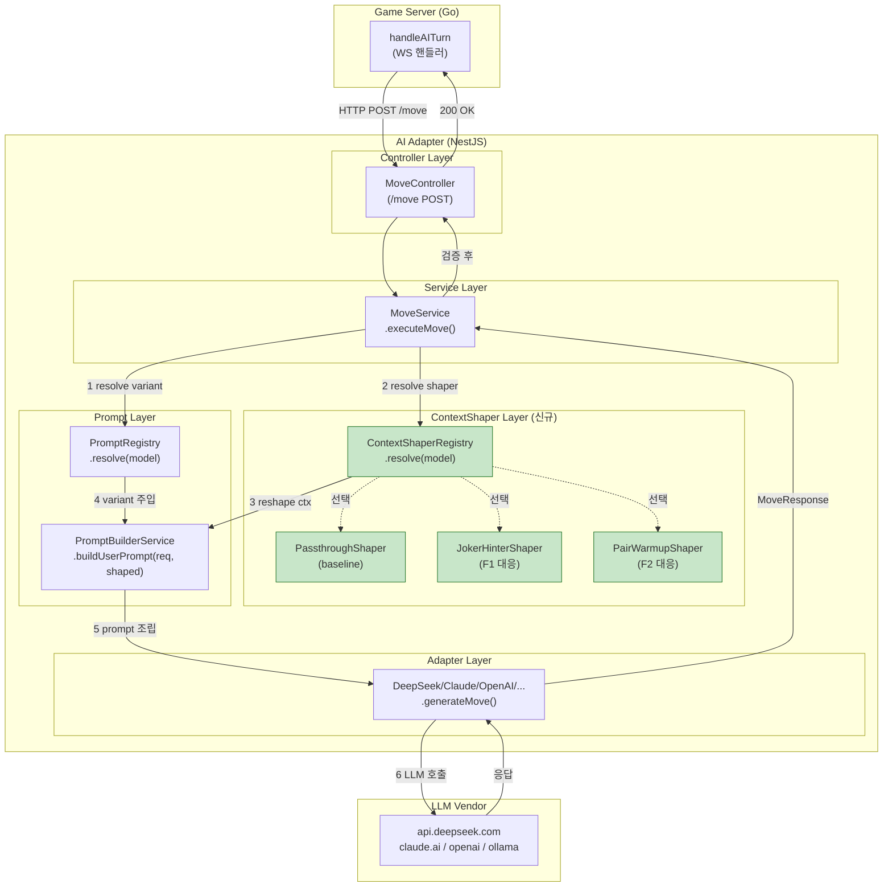
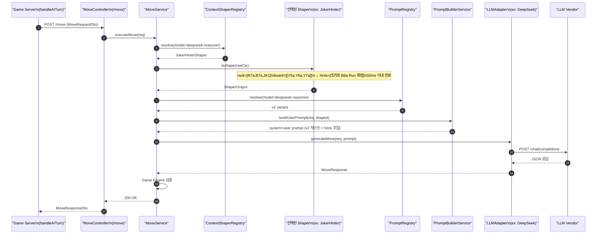
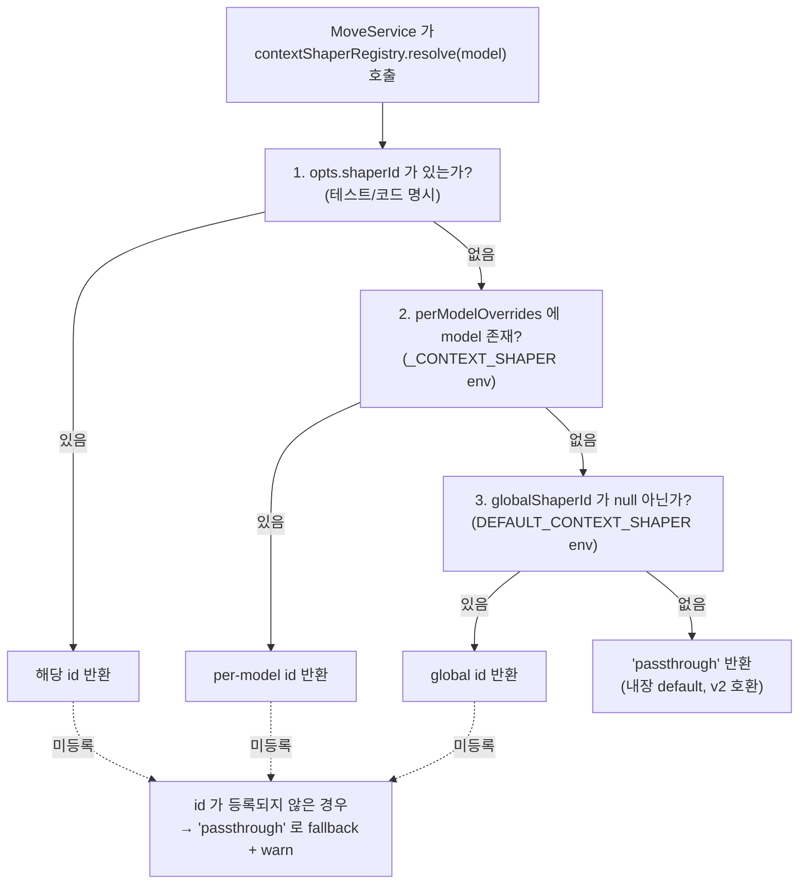

# 44. v6 ContextShaper 아키텍처 — 축 전환(Text → Context)

- 작성일: 2026-04-19 (Sprint 6 Day 9)
- 작성자: architect (Opus 4.7 xhigh) + ai-engineer (공동 집필 예정, §2/§7 AIE 보강)
- 리뷰: qa (§10 검증 기준 보강 예정), pm, node-dev
- 상태: 초안 (Draft — AIE/QA 보강 후 정식 승격)
- ADR 번호: ADR-044
- 연관 문서:
  - `docs/02-design/39-prompt-registry-architecture.md` (§4 resolve 로직 — orthogonal 확장의 숙주)
  - `docs/02-design/41-timeout-chain-breakdown.md` (§4 부등식 계약 — Shaper 예산 50ms 준수 필요)
  - `docs/02-design/42-prompt-variant-standard.md` (§2 표 B — variant × shaper 2차원 SSOT)
  - `docs/04-testing/60-round9-5way-analysis.md` (v2~v5 5-way 비교 실측)
  - `docs/04-testing/61-v2-prompt-bitwise-diff.md` (v2 legacy vs Registry resolve bitwise 동일 확증)
  - `docs/04-testing/62-deepseek-gpt-prompt-final-report.md` (Part 3 "5원칙" + "구분 불가 확증")
  - `work_logs/scrums/2026-04-19-01.md` (Day 9 킥오프 — Task #20)
  - `CLAUDE.md` Key Design Principle #7 (타임아웃 SSOT), #8 (프롬프트 변형 SSOT)

---

## 1. Executive Summary

v2/v3/v4/v4.1/v5 다섯 프롬프트 텍스트를 DeepSeek-Reasoner 에서 최대 7회까지 반복 실측한 결과, **place_rate 의 variant 간 차이는 Δ=0.04%p (N=3 평균 29.07% vs 29.03%)** 로 통계적 구분이 불가능함이 확증됐다(`docs/04-testing/62` Part 1). 즉 "프롬프트의 단어를 바꾸는 것" 은 더 이상 효과적인 최적화 축이 아니다. 다음 가설은 **"LLM 에게 같은 Rack/Board/History 를 어떻게 가공해 주느냐가 성능을 좌우한다"** 이며, 이를 구현하는 구조가 **ContextShaper** 이다. 본 ADR 은 v2 시스템/유저 프롬프트 텍스트를 **고정** 한 채, `Rack/Board/History` 를 LLM 관점에서 재가공하는 `ContextShaper` 계층을 `PromptRegistry` 와 **orthogonal(직교)** 로 추가하는 설계를 확정한다. 기존 variant Registry 는 그대로 두고, shaper 축을 2차원 키로 얹는다. 구현은 Phase 5 단계(Day 9~14)로 분할되며, 최초 N=1 pilot 은 비용 $0.04 이내에서 종료된다.

---

## 2. Problem Statement

> **AIE 보강 예정 (P0-2 공동 작업)**: Round 9/10 실측 로그에서 관찰된 v2 의 구체 fail 모드를 턴 단위로 인용하여 3~5 개 목록화. 본 초안에서는 Architect 가 설계 관점에서 포착한 **5 개 가설 구조 문제**를 제시하고, AIE 가 이 중 어느 것이 실측에서 확증되는지 Day 9 오후에 보강한다.

### 2.1 관찰된 현상 (실측 확증)

`docs/04-testing/60` + `docs/04-testing/62` 에 기록된 Round 9/10 DeepSeek-Reasoner 실측 요약:

| 지표 | v2 N=3 | v3 N=3 | Δ | 통계적 구분 |
|---|---|---|---|---|
| place_rate 평균 | 29.07% | 29.03% | **+0.04%p** | 불가 (σ > Δ) |
| tiles_placed 평균 | 32.33 | 29.33 | +3.0 | 불가 |
| fallback_count | 0 | 0 | 0 | — |
| avg_latency | 266s | 245s | +21s | 미세 |

"5원칙(명시성/범례/체크리스트/재시도지침/JSON강제)" 을 v2 부터 전부 갖춘 상태에서 텍스트 변주(체크리스트 추가, 재시도 포맷 변경, Thinking Budget 문구, 중문 번역)가 더 이상 place_rate 를 이동시키지 못한다.

### 2.2 가설 fail 모드 (Architect 관점 — AIE 검증 대기)

v2 프롬프트가 Rack/Board 를 그대로 **직렬화만** 하여 LLM 에 전달하는 구조에서 다음 5개 구조 문제가 후보로 식별된다.

| # | 가설 fail 모드 | 근거/메커니즘 | AIE 보강 요청 |
|---|---|---|---|
| F1 | **조커 활용 부족** | Rack 에 `JK1`/`JK2` 가 있어도 LLM 은 "어떤 Set/Run 의 어느 슬롯에 끼워야 최대 효용" 인지를 매턴 처음부터 사고해야 함. 조합 공간 폭발 → 탐색 실패 | Round 9/10 로그에서 조커 보유 턴 중 place 실패 건수 집계 |
| F2 | **Pair 힌트 실패** | Rack 의 동색 인접수(예: R7a, R8a) 가 Run 연장 후보인데, LLM 이 이를 "미완성" 으로 보고 대기만 하는 경향 | tilesFromRack=0 턴 중 rack 에 Pair 보유율 집계 |
| F3 | **Set finisher 놓침** | Rack 의 같은 숫자·다른 색(예: R7a, B7a) 2장 + Board 의 Y7a 가 있을 때, Set 3장 완성 수를 놓침. Board 의 기존 group 재활용 힌트 부재 | Board 의 3장 미완성 Group 과 rack tiles 의 교집합 계산 후 place 실패율 |
| F4 | **History 정보 과잉** | opponents.actionHistory 를 5턴 전부 나열 → 토큰 증가 + 신호 희석. 최근 2턴 가중이 필요 | token 수 vs place_rate 회귀 분석 |
| F5 | **Initial Meld 30점 탐색 피로** | 최초 등록 전 LLM 이 30점 조합을 매턴 0부터 탐색 → drawPileCount 가 많을수록 늦어짐 | initialMeldDone=false 턴의 평균 응답 시간 분포 |

> AIE 는 Day 9 오후 킥오프에서 이 표를 실측 기반으로 확증/기각한다. 확증된 3개가 §7 의 3 개 Shaper 구현 우선순위를 결정.

### 2.3 축 전환의 필연성

**"프롬프트 텍스트 레이어" 에서는 variant 간 Δ ≈ 0 이 확증됨** (`docs/04-testing/62` Part 1). 따라서 다음 축은 두 가지 중 하나다.

- **축 A** — 모델 자체 교체 (GPT-5 mini → Claude / DeepSeek-R1 등): 대전 스크립트 이미 다모델 지원. 별도 실험 트랙으로 존재.
- **축 B** — LLM 에게 주는 **컨텍스트의 사전 가공**: 본 ADR 의 대상. LLM 의 탐색 부담을 구조적으로 줄이는 시도.

축 B 는 텍스트 변주와 직교하므로, 성공 시 v2 텍스트 고정 상태에서 Δ > 2%p 이 관찰되면 원인 특정이 명확하다(교란 없음).

---

## 3. 설계 원칙

### Principle 1 — v2 텍스트 불변 (Confound Control)

본 축에서의 A/B 실험을 통해 "Shaper 효과"만 단독으로 측정하기 위해, `PromptVariant.systemPromptBuilder` / `userPromptBuilder` 의 출력 텍스트를 **Shaper 단독으로 변경하지 않는다**. v2 의 5원칙 구조는 고정. 다만 Shaper 가 `userPromptBuilder` 에 전달하는 **입력 데이터 (Rack/Board/History)** 를 가공한 후 넘기는 것은 허용.

### Principle 2 — Shaper 는 Rack/Board/History 만 가공

Shaper 의 책임 범위는 `GameStateDto.tableGroups / myTiles / opponents / turnNumber / drawPileCount / initialMeldDone / unseenTiles` 7개 필드와 그 파생 데이터 (예: "pair 힌트 리스트", "조커 후보 Set/Run 목록") 로 한정한다. 시스템 프롬프트, persona, difficulty, psychologyLevel, JSON 포맷 지시문은 **미변경**.

### Principle 3 — Registry Orthogonal (2차원 확장)

`PromptRegistry` 는 1차원 (variant id) Registry 로 유지. 새 Registry 를 만들지 않고, 별도 `ContextShaperRegistry` 를 추가하여 (variant × shaper) 2차원 결정 공간을 형성한다. env 우선순위는 기존 `<MODEL>_PROMPT_VARIANT` 와 동일 패턴의 `<MODEL>_CONTEXT_SHAPER` 를 추가.

```
active_config(model) = (variant_id, shaper_id)
  where variant_id = resolveVariant(model)   // 기존 로직 불변
        shaper_id  = resolveShaper(model)    // 신규
```

### Principle 4 — Pure Function (Stateless, 캐시 가능)

`ContextShaper.reshape(input): output` 은 **순수 함수**. 외부 상태 접근 금지, 내부 캐시 허용 (rack hash → hints). 테스트 가능성 + E2E 재현성 보장.

### Principle 5 — A/B Metrics 고정

실험 비교 지표는 3개로 고정. 임의 추가 금지 (P-hacking 방지).

- `place_rate` (primary)
- `fallback_count` (saturation test)
- `avg_latency_ms` (비용/응답성)

보조 지표: `tiles_placed`, `joker_utilization_rate`, `initial_meld_turn` (Shaper 별 가설 검증용). 이는 "참고" 용이며 GO 판단 기준이 아님.

---

## 4. 아키텍처

### 4.1 전체 흐름 — flowchart TB

기존 `PromptBuilderService` 를 감싸는 형태로 `ContextShaper` 계층을 얹는다. `PromptBuilderService.buildUserPrompt(request)` 가 호출되기 **전에** `ContextShaper.reshape(rawCtx)` 가 실행되어 `ShapedContext` 를 생성하고, `buildUserPrompt` 는 원본 `request` 대신 `request` + `ShapedContext` 를 받는 확장 signature 로 변환된다.



### 4.2 클래스 관계 — classDiagram


### 4.3 데이터 흐름 — sequenceDiagram



---

## 5. 인터페이스 사양

### 5.1 TypeScript 타입 정의 — 공개 API

아래 타입은 `src/ai-adapter/src/prompt/shaper/shaper.types.ts` (신규) 에 정의한다. `prompt/` 모듈 내 하위 디렉토리로 둠으로써 Registry 와의 인접성을 유지하되 책임은 분리.

```typescript
/** Shaper 식별자 — kebab-case, env 값과 동일 */
export type ShaperId =
  | 'passthrough'      // baseline (v2 동작 그대로)
  | 'joker-hinter'     // F1 — 조커 활용 사전 계산
  | 'pair-warmup';     // F2 — Pair 힌트 주입

/** Shaper 입력 — GameStateDto 에서 필요한 필드만 추출한 읽기 전용 snapshot */
export interface ShaperInput {
  readonly rack: readonly string[];              // 타일 코드 목록 (불변)
  readonly board: readonly ReadonlyTileGroup[];  // 테이블 그룹
  readonly history: readonly OpponentAction[];   // 최근 5턴 이내
  readonly meta: ShaperMeta;
}

export interface ShaperMeta {
  readonly turnNumber: number;
  readonly drawPileCount: number;
  readonly initialMeldDone: boolean;
  readonly difficulty: Difficulty;
  readonly modelType: ModelType;
}

export interface ReadonlyTileGroup {
  readonly tiles: readonly string[];
}

export interface OpponentAction {
  readonly playerId: string;
  readonly action: string;
  readonly turnNumber: number;
}

/** Shaper 출력 — PromptBuilderService 가 소비 */
export interface ShaperOutput {
  /** 가공된 Rack — 순서 변경/그룹핑 허용, 타일 추가·삭제 금지 */
  readonly rackView: readonly string[];
  /** 가공된 Board — 그룹 순서 재배치 허용, 내용 변경 금지 */
  readonly boardView: readonly ReadonlyTileGroup[];
  /** 가공된 History — 최근 2턴 가중, 절대 길이만 단축 가능 */
  readonly historyView: readonly OpponentAction[];
  /** 사전 계산된 힌트 목록 — PromptBuilder 가 userPrompt 의 `## 참고 힌트` 섹션에 주입 */
  readonly hints: readonly ShaperHint[];
}

export interface ShaperHint {
  /** 힌트 유형 — 'joker-candidate' | 'pair-extension' | 'set-finisher' 등 */
  readonly type: string;
  /** 힌트 본문 — 구조는 type 별 정의 */
  readonly payload: Readonly<Record<string, unknown>>;
  /** 신뢰도 0.0~1.0 — LLM 에게 `(신뢰도 H)` 로 표기 */
  readonly confidence: number;
}

/** Shaper 본체 */
export interface ContextShaper {
  readonly id: ShaperId;
  reshape(input: ShaperInput): ShaperOutput;
}
```

### 5.2 불변성 및 에러 처리

| 조항 | 규약 |
|---|---|
| **Immutability** | `ShaperInput` 필드는 전부 `readonly`. Shaper 내부에서 input 을 mutate 하면 안 됨 (Node.js 런타임에서 `Object.freeze(input)` 으로 강제 검증 — Phase 1 에서 Passthrough 구현 시 포함) |
| **Non-empty guarantee** | `reshape()` 는 항상 `rackView`, `boardView`, `historyView` 를 **빈 배열이라도 반환** 해야 한다. `undefined`/`null` 금지. `hints` 는 빈 배열 허용 |
| **Tile preservation** | `rackView` 는 `rack` 의 permutation 만 허용 (원소 집합 불변). `boardView` 는 그룹 순서 변경만 허용, 그룹 내 타일 변경 금지 |
| **Deterministic** | 동일 input → 동일 output (pure function). 난수 사용 금지 |
| **Exception** | Shaper 내부에서 throw 발생 시 → MoveService 가 catch → `PassthroughShaper` 로 fallback + warn 로그. 절대 요청을 실패시키지 않는다 (Principle 4 + §12 리스크 R1) |
| **Timeout** | 50ms 초과 시 MoveService 가 abort + Passthrough fallback (§8 참조) |

### 5.3 PromptBuilderService 확장

기존 `buildUserPrompt(request: MoveRequestDto): string` 은 **유지**. 신규 overload 를 추가한다.

```typescript
buildUserPrompt(request: MoveRequestDto, shaped?: ShaperOutput): string
```

- `shaped` 미전달(undefined) → 현 v2 동작 그대로 (100% 하위호환)
- `shaped` 전달 → `rackView`/`boardView`/`historyView` 를 기존 `gameState.myTiles` 등 대신 사용
- `shaped.hints` 가 비어있지 않으면 userPrompt 말미에 `## 참고 힌트 (Shaper: ${id})` 섹션 추가

---

## 6. Registry 확장

### 6.1 SSOT 정합성

`docs/02-design/42-prompt-variant-standard.md` §2 표 B 는 1차원 (model → variant) 매핑이다. ContextShaper 도입 후 2차원으로 확장되므로, **42번 문서 §2 에 컬럼 2개 추가** (모델별 ContextShaper + 결정 출처). 본 ADR 승격 시 42번 §8 변경 이력에 "2026-04-XX: shaper 축 추가" 한 줄 추가.

### 6.2 2차원 키

```
ActiveConfig = {
  model: ModelType,
  variant: VariantId,
  shaper: ShaperId,
}
```

Round 6 Phase 3 대조군 상태 (Day 9 기준):

| model | variant | shaper (신규) | 비고 |
|---|---|---|---|
| openai | v2 | passthrough | baseline 유지 — Shaper 실험 대상 아님 (GPT v2 고정 empirical 근거) |
| claude | v4 | passthrough | 현 운영 variant 유지 |
| deepseek-reasoner | v2 | passthrough → **joker-hinter** (Phase 4 실험) | **본 ADR 의 첫 실험 타깃** |
| deepseek-reasoner | v2 | passthrough → **pair-warmup** (Phase 5 실험) | 2차 실험 |
| dashscope | v4 | passthrough | DashScope API 발급 후 결정 |
| ollama | v2 | passthrough | 소형 모델, hints 토큰 예산 위험 |

### 6.3 env 우선순위 (KDP #8 준수)

기존 `<MODEL>_PROMPT_VARIANT` 우선순위 5단계를 그대로 복제한다. 신규 레지스트리 `ContextShaperRegistry.resolve()`:



**env 키** (6개, `PromptRegistry` 와 대칭):

- `OPENAI_CONTEXT_SHAPER`
- `CLAUDE_CONTEXT_SHAPER`
- `DEEPSEEK_CONTEXT_SHAPER`
- `DEEPSEEK_REASONER_CONTEXT_SHAPER`
- `DASHSCOPE_CONTEXT_SHAPER`
- `OLLAMA_CONTEXT_SHAPER`
- `DEFAULT_CONTEXT_SHAPER` (global)

**기본값** (내장 default — env 전부 미설정 시): **모든 모델 `passthrough`**. 이는 v2 baseline 호환을 보장하여 "rollout 직후 행동 변화 없음" 을 SSOT 로 고정.

### 6.4 Helm values 업데이트 (DevOps 보강)

`helm/charts/ai-adapter/values.yaml` 에 다음 블록 추가:

```yaml
# ContextShaper 설정 (docs/02-design/44 §6.3)
# 기본값 전부 'passthrough' — v2 동작 그대로
contextShaper:
  default: "passthrough"
  perModel:
    openai: ""              # 빈 값 = default 사용
    claude: ""
    deepseek: ""
    deepseekReasoner: ""    # Phase 4 에서 'joker-hinter' 로 변경 실험
    dashscope: ""
    ollama: ""
```

---

## 7. 최초 3개 Shaper 상세 사양

> **AIE 보강 예정 (P0-2 공동 작업)**: 각 Shaper 의 **구체 알고리즘**, **토큰 예산**, **예상 place_rate 상승폭** 을 AIE 가 Day 9 오후 킥오프에서 보강한다. 본 초안은 Architect 관점의 **interface 경계** 와 **책임 범위** 까지만 고정.

### 7.1 PassthroughShaper — baseline (Day 9 구현)

**목적**: v2 동작을 완벽 재현. A/B 실험의 대조군.

**알고리즘**:
```typescript
class PassthroughShaper implements ContextShaper {
  readonly id = 'passthrough' as const;

  reshape(input: ShaperInput): ShaperOutput {
    return {
      rackView: input.rack,           // 그대로
      boardView: input.board,         // 그대로
      historyView: input.history,     // 그대로
      hints: [],                      // 빈 배열
    };
  }
}
```

**토큰 예산**: 0 (hints 없음, view 그대로)

**검증 기준**: Passthrough 적용 후 userPrompt 출력이 **Shaper 미도입 상태와 bitwise 동일**. Phase 1 수용 기준 `diff -u`.

### 7.2 JokerHinterShaper — F1 대응 (Day 10~11 구현)

**목적**: Rack 에 `JK1`/`JK2` 가 포함된 경우, LLM 이 매턴 반복 탐색하는 "조커로 어떤 Set/Run 완성 가능한가" 를 사전 계산하여 `hints` 에 주입.

**알고리즘** (AIE 보강 예정):
1. `rack` 에서 조커 수 `J = (rack.filter(t => t.startsWith('JK'))).length`
2. `J === 0` 이면 `{hints: []}` 반환 (overhead 없음)
3. `J >= 1` 이면:
   - (a) rack 의 조커 외 타일로 "조커 1장만 끼우면 완성되는 Set" 목록 계산 (같은 숫자 2장 → Set 3장)
   - (b) rack 의 조커 외 타일로 "조커 1장만 끼우면 완성되는 Run" 목록 계산 (동색 연속 2장 또는 간격 1 → Run 3장)
   - (c) board 의 기존 그룹에 조커로 연장 가능한 후보 (3장 Group 에 같은 숫자 색 삽입, Run 끝/처음 연장)
4. 각 후보에 `confidence` 부여 (점수 합계 기반)
5. 최대 3개 후보만 hints 에 포함 (토큰 예산 제한)

**Hint 예시**:
```json
{
  "type": "joker-candidate",
  "payload": {
    "completed": ["R7a", "B7a", "JK1"],
    "rackTilesUsed": ["R7a", "B7a"],
    "score": 21,
    "category": "set-3"
  },
  "confidence": 0.9
}
```

**토큰 예산**: 최대 3 hints × 약 60 토큰 = **~180 토큰 증가**

**예상 효과** (AIE 가설): Rack 내 조커 보유 턴의 place 성공률 +5~10%p. 전체 평균으로 환산 시 +1~3%p.

### 7.3 PairWarmupShaper — F2 대응 (Day 10~11 구현)

**목적**: Rack 에 "동색 인접수 2장" (R7a + R8a 등) 이 있을 때, Board 의 기존 Run 에 연장 후보가 있으면 힌트 주입.

**알고리즘** (AIE 보강 예정):
1. rack 에서 pair 추출: 같은 색의 연속수 2장 or 같은 숫자 다른 색 2장
2. 각 pair 에 대해 board 순회:
   - (a) 동색 Run 의 시작/끝에 연장 가능한가? (rack 의 제3 타일로)
   - (b) 동숫자 Set 에 마지막 1장 채우기 가능한가?
3. "1장 더 draw 하면 완성되는 후보" 를 hints 에 주입 (psychologyLevel >= 2 에서만)

**Hint 예시**:
```json
{
  "type": "pair-extension",
  "payload": {
    "pair": ["R7a", "R8a"],
    "extensionCandidate": "R6a or R9a",
    "boardTarget": "기존 R-런 [R10a, R11a, R12a] 와 연결 불가, 독립 Run 필요"
  },
  "confidence": 0.7
}
```

**토큰 예산**: 최대 2 hints × 약 70 토큰 = **~140 토큰 증가**

**예상 효과** (AIE 가설): initialMeldDone=true 이후 연장 place 턴 +3~5%p.

### 7.4 Shaper 우선순위 근거 (F3~F5 는 후속)

AIE 가 §2.2 표에서 확증하는 순위에 따라 최초 3개 Shaper 를 결정. Architect 초안 기준은:

| 순위 | Shaper | 이유 |
|---|---|---|
| 1 | Passthrough | 대조군 필수 (Day 9 Phase 1 완료) |
| 2 | JokerHinter | 조커 활용은 **단일 턴 의사결정** — Shaper 가 포착 가능 |
| 3 | PairWarmup | Pair 는 **next turn 의사결정** — Shaper 가 예측 힌트 제공 |

F3(Set finisher), F4(History 절단), F5(Initial Meld 탐색) 은 Phase 6+ 또는 Sprint 7 으로 이월.

---

## 8. Timeout 체인 영향 검토 (CLAUDE.md KDP #7)

### 8.1 Shaper 예산

Shaper.reshape() 내부 계산은 **50ms 이내** 완료. 초과 시 MoveService 가 Promise.race() 로 abort 하고 `PassthroughShaper` 로 fallback. 50ms 는 부등식 계약에 영향 없는 수준:

```
기존 체인 (docs/02-design/41 §4):
py_ws(770s) > gs_ctx(760s) > http_client(760s) > istio_vs(710s)
  > adapter_internal(700s) > llm_vendor_floor

Shaper 추가 후:
py_ws(770s) > gs_ctx(760s) > http_client(760s) > istio_vs(710s)
  > adapter_internal(700s) > Shaper(0.05s) + llm_vendor_floor(~699s)
```

50ms 는 adapter_internal 의 0.007% 이므로 부등식 전체에 **영향 없음**. `docs/02-design/41` §3 레지스트리 수정 **불필요**.

### 8.2 구현 가드

```typescript
const SHAPER_TIMEOUT_MS = 50;

async executeMove(req: MoveRequestDto) {
  const shaper = this.shaperRegistry.resolve(req.modelType);
  const shaped = await Promise.race([
    Promise.resolve(shaper.reshape(rawCtx)),
    new Promise<ShaperOutput>((resolve) =>
      setTimeout(() => {
        this.logger.warn(`[Shaper] ${shaper.id} timeout 50ms → passthrough fallback`);
        resolve(passthroughShaper.reshape(rawCtx));
      }, SHAPER_TIMEOUT_MS)
    ),
  ]);
  // ...
}
```

### 8.3 토큰 예산 영향

hints 주입으로 prompt 토큰이 증가(~180 토큰 최대). DeepSeek-Reasoner 비용 $0.14/1M input tokens 기준, N=3 × 80턴 × 180 토큰 ≈ 43K 토큰 = **+$0.006** 수준. 비용 모니터링 범위 내.

---

## 9. 테스트 전략

### 9.1 Unit 테스트 (각 Shaper 단위)

- `src/ai-adapter/src/prompt/shaper/__tests__/passthrough.shaper.spec.ts`
  - input 과 output 의 bitwise 동일성
  - hints 가 빈 배열
  - Object.freeze(input) 후 reshape 실행 시 throw 없음

- `joker-hinter.shaper.spec.ts`
  - rack 에 JK 없음 → hints=[]
  - rack=[R7a, B7a, JK1] → hints 에 "R7a+B7a+JK1 완성" 포함
  - rack 에 JK 2개 → 최대 3 hints 제한 준수
  - confidence 0.0~1.0 범위 검증

- `pair-warmup.shaper.spec.ts`
  - rack=[R7a, R8a] → pair-extension hint
  - psychologyLevel < 2 → hints=[] (difficulty 게이트)

- `context-shaper-registry.spec.ts`
  - env 우선순위 5단계 (variant registry spec 재활용 템플릿)
  - 미등록 id → passthrough fallback + warn

### 9.2 Integration 테스트

- `PromptBuilderService.buildUserPrompt(req, shaped)` — shaped 주입 시 userPrompt 에 `## 참고 힌트` 섹션 포함
- Shaper 체인 E2E: MoveController → MoveService → Shaper → PromptBuilder → Adapter → Mock LLM

### 9.3 E2E 시나리오 (고정 입력 9개)

Rack/Board 3개 시나리오 × Shaper 3개 = 9 테스트. 각 시나리오에서 Shaper 별 userPrompt 출력을 snapshot 비교.

| 시나리오 | rack | board | 예상 hint (joker-hinter) |
|---|---|---|---|
| S1 "조커 단독" | [R7a, B7a, JK1] | [] | 1개 (R7a+B7a+JK1 Set) |
| S2 "조커 + Run" | [R6a, R7a, JK1, K12b, Y3a] | [[Y5a, Y6a, Y7a]] | 2개 (R run + Y run 연장) |
| S3 "조커 없음" | [R7a, B7a, K12b] | [] | 0개 (passthrough 와 동일) |

### 9.4 A/B 실측 프로토콜

- **Phase 4 N=1 pilot**: DeepSeek-Reasoner × v2 × (passthrough vs joker-hinter) 1 run 씩. 비용 $0.08. Shaper 효과 signal 확인.
- **Phase 5 N=3 확증**: signal 확인 시 N=3 배치. 비용 $0.24.
- **대전 스크립트**: `scripts/ai-battle-3model-r4.py` 에 `--shaper <id>` CLI 옵션 추가 (node-dev 담당).

---

## 10. 검증 기준

> **QA 보강 예정 (P1 공동 작업)**: 본 섹션은 Architect 초안. QA (Opus 4.7 xhigh) 가 Day 9 오후 Task #20 킥오프에서 통계 임계치, 검증 게이트, GO/No-Go 판단 기준을 보강한다. 초안 기준은 아래.

### 10.1 Phase 1 (Passthrough 구현) 검증

| 항목 | 기준 |
|---|---|
| userPrompt bitwise diff | Shaper 도입 전후 `diff -u` 출력 0 byte |
| Unit test | passthrough.shaper.spec.ts 100% PASS |
| Integration | 기존 ai-adapter 428 테스트 regression 0건 |

### 10.2 Phase 4 (JokerHinter N=1 pilot) 검증

| 항목 | 기준 (QA 보강 예정) |
|---|---|
| place_rate 변화 | passthrough vs joker-hinter **Δ > 2%p** → Phase 5 진입 |
| fallback_count | 두 조건 모두 0 (saturation 우려 없음) |
| avg_latency | joker-hinter 측 **+20% 이내** 허용 |
| hints 주입률 | 조커 보유 턴의 80%+ 에서 hints.length > 0 |

### 10.3 Phase 5 (N=3 확증) GO 조건

| 항목 | 기준 (QA 보강 예정) |
|---|---|
| place_rate Δ | **N=3 평균 Δ > 2%p** 이고 σ < Δ (통계적 구분 가능) |
| 비용 | N=3 × $0.039 × shaper 3개 = ~$0.35 한도 |
| Timeout | Shaper 50ms 예산 초과 건수 0 |

### 10.4 No-Go 조건

- Passthrough 와 Shaper 의 userPrompt diff 가 예상 외 (bitwise 불일치)
- Phase 4 N=1 에서 Δ < 1%p → 축 재검토 (§12 리스크 R2)
- Shaper 내부 throw 가 10% 이상 턴에서 발생 → 구현 재설계

---

## 11. 구현 Phase

| Phase | 기간 | 담당 | 산출물 | 게이트 |
|---|---|---|---|---|
| **Phase 1** | Day 9 (2026-04-19) | node-dev + architect | ContextShaper interface + PassthroughShaper + ContextShaperRegistry 스켈레톤. 428 regression 0건 | Code review + Phase 1 검증 기준 |
| **Phase 2** | Day 10~11 (04-20~21) | node-dev + ai-engineer | JokerHinterShaper + PairWarmupShaper 구현 (unit test 포함) | Unit 100% PASS |
| **Phase 3** | Day 11 (04-21) | node-dev + devops | Registry env 배선 + Helm values 업데이트 + ConfigMap patch | 라이브 printenv 검증 |
| **Phase 4** | Day 12 (04-22) | ai-engineer + qa | N=1 pilot (DeepSeek × v2 × passthrough/joker-hinter) | §10.2 기준 |
| **Phase 5** | Day 13~14 (04-23~24) | ai-engineer + qa | N=3 확증 + 리포트 | §10.3 GO 조건 |

총 6일 (Sprint 6 Day 9~14). Sprint 7 이월 가능성은 Phase 4 결과에 의존.

---

## 12. 리스크 + 완화책

| # | 리스크 | 완화책 |
|---|---|---|
| **R1** | Shaper 내부 로직 버그 → 요청 실패 | Passthrough fallback + Shaper 내부 try/catch. 요청 실패는 절대 발생 안 함 (§5.2) |
| **R2** | LLM 이 hints 를 무시 | A/B 결과에서 직접 확인. §10.2 Δ > 2%p 로 게이트. 효과 없으면 축 재검토 |
| **R3** | Prompt 길이 증가 → 비용 증가 | §8.3 추산 +$0.006/run. 모니터링 범위 내. 비용 $5/hr 한도 대비 0.001% |
| **R4** | Shaper 계산 지연 (조합 폭발) | 50ms timeout 가드 + Passthrough fallback (§8.2) |
| **R5** | variant × shaper 조합 폭발 (테스트 부담) | 최초 3개 Shaper × 1개 variant (v2) 만 실험. F3~F5 이월 |
| **R6** | Registry SSOT 동기화 실패 | 42번 §2 표 B 에 shaper 컬럼 추가 + 42번 §6 체크리스트 확장. §6.1 에 명시 |
| **R7** | 토큰 예산 초과로 DeepSeek context window 근접 | max 3 hints × 60 토큰 제한. hints 생성기가 토큰 카운터 확인 후 drop |
| **R8** | Passthrough 와 미도입 상태 bitwise 불일치 | Phase 1 수용 기준 `diff -u` 0 byte. Regression test 추가 |
| **R9** | env 키 충돌 (`*_PROMPT_VARIANT` 와 naming) | `*_CONTEXT_SHAPER` 로 명확 분리. logActiveConfiguration() 에 두 축 모두 출력 |

---

## 13. 미결 사항 (Day 9 오후 Task #20 킥오프 논의 대상)

1. **§2.2 의 가설 fail 모드 5개 중 실측 확증되는 3개는 무엇인가?** — AIE 가 Round 9/10 로그 재분석으로 결정
2. **§7.1/7.2/7.3 의 구체 알고리즘** — AIE 가 수도코드 수준으로 보강
3. **§10 검증 기준 통계 임계치** — QA 가 N 보강 전략 + σ 기반 통계 검증 설계
4. **Phase 구현 순서 확정** — node-dev 가 TypeScript interface 스케치 제시 후 3명 합의
5. **Sprint 6 vs Sprint 7 분할** — PM 이 로드맵으로 확정

---

## 14. 변경 이력

| 일자 | 변경 | 담당 | 근거 |
|---|---|---|---|
| 2026-04-19 | 초판 작성 (Draft) | architect (Opus 4.7 xhigh) | Day 9 스크럼 P0-2 지시, Day 8 All-Hands v6 GO 확정 |
| (예정) | §2, §7 AIE 보강 → §10 QA 보강 → 정식 승격 | ai-engineer, qa | Day 9 오후 Task #20 킥오프 |

---

> **본 문서의 위치**: `docs/02-design/42-prompt-variant-standard.md` (variant SSOT) 와 **수평 동격**. variant 축과 shaper 축의 2차원 결정 공간 중 shaper 축에 해당하는 SSOT. 42번과 44번은 함께 읽어야 active_config 의 전체 상태를 이해할 수 있다.
