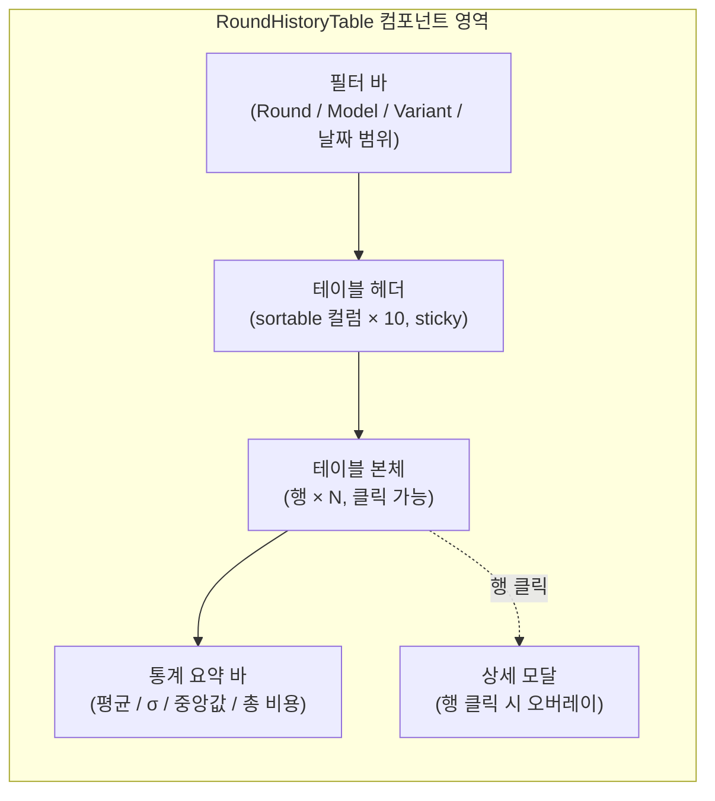
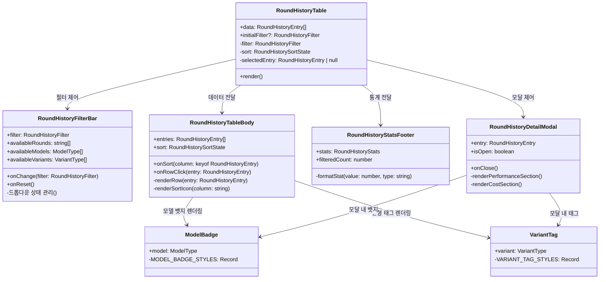
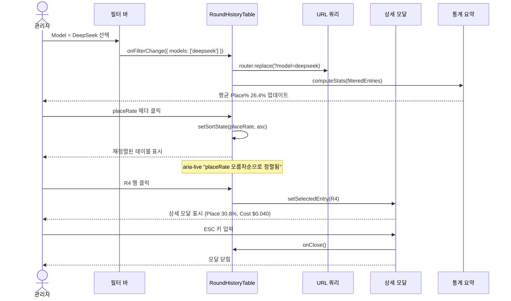

# 45. RoundHistoryTable PR 5 디자인 스펙

- **작성일**: 2026-04-19 (Sprint 6 Day 9)
- **작성자**: designer (UI/UX, claude-sonnet-4-6)
- **상태**: 확정 스펙 v1.0 — Frontend Dev 구현 준비 완료
- **연관 문서**:
  - `docs/02-design/07-ui-wireframe.md` (디자인 토큰 원본)
  - `docs/02-design/33-ai-tournament-dashboard-component-spec.md` (PR 4 ModelCardGrid 스펙)
  - `docs/04-testing/62-deepseek-gpt-prompt-final-report.md` (Part 1 전수 실측 표)
  - `docs/04-testing/60-round9-5way-analysis.md` (5-way 통합 분석)
  - `docs/02-design/42-prompt-variant-standard.md` (variant 운영 SSOT)

---

## 읽기 순서 가이드

Frontend Dev는 아래 순서로 문서를 읽고 그대로 구현한다.

1. **§1 개요** — 컴포넌트 목적과 사용자 시나리오 이해
2. **§2 데이터 모델** — TypeScript 인터페이스 확인 후 `lib/types.ts` 추가
3. **§3 레이아웃** — Mermaid 와이어프레임 기반 전체 구조 파악
4. **§4 컬럼 사양** — 각 컬럼 구현 상세
5. **§5 컬러/타이포** — 뱃지/태그/값 색상 스케일 적용
6. **§6 인터랙션** — 정렬/필터/모달/URL sync 구현
7. **§7 반응형** — 브레이크포인트별 숨김 우선순위
8. **§8 접근성** — ARIA 레이블, 키보드 네비게이션
9. **§9 성능** — TanStack Table 도입 근거
10. **§10 구현 힌트** — 파일 위치, 테스트 시나리오
11. **§11 Mermaid 다이어그램** — 컴포넌트 계층 + 인터랙션 플로우

---

## §1 개요

### 1.1 컴포넌트 목적

`RoundHistoryTable`은 RummiArena 관리자 대시보드(`/admin/tournament`)에 위치하는 테이블 컴포넌트다. Round 1~10에 걸쳐 수행된 모든 AI 프롬프트 변형 실험 결과를 **시계열 + 분포** 관점에서 한눈에 파악할 수 있도록 제공한다.

실험 결과 원본은 `docs/04-testing/62-deepseek-gpt-prompt-final-report.md` Part 1 전수 실측 표(17행)와 `docs/04-testing/60-round9-5way-analysis.md` 5-way 결과(7행)에 기록되어 있다. 관리자는 이 테이블을 통해 다음 질문에 즉시 답할 수 있어야 한다.

- "v2 vs v3 통계 유의성이 있는가?" (N=3 평균 비교)
- "fallback이 0인 조건은 어떤 variant/timeout 조합인가?"
- "비용 대비 성공률 효율이 가장 높은 Run은 무엇인가?"

### 1.2 사용자 시나리오

**시나리오 A — 전체 통람**
관리자 애벌레가 대시보드에 접속한다. RoundHistoryTable은 기본적으로 `roundId` 내림차순 정렬(최신 라운드 상단)으로 표시된다. 필터 없이 전체 17행을 확인하며 최신 Round 10 결과를 빠르게 파악한다.

**시나리오 B — variant 비교**
`Variant` 필터를 'v2'로 설정한다. v2 결과만 6행으로 좁혀진다. 하단 통계 요약에서 v2 N=3 평균 29.07% / σ 2.45%p를 즉시 확인한다. 동일하게 'v3'로 필터 변경하여 29.03% / σ 3.20%p와 비교한다.

**시나리오 C — 고성능 Run 식별**
`placeRate` 컬럼 헤더를 클릭하여 내림차순 정렬한다. 상위 4행(30.8% × 4)이 강조 녹색으로 표시된다. R4 v2 행을 클릭하여 상세 모달을 연다. 해당 Run의 turnlog 링크로 이동한다.

**시나리오 D — URL 공유**
특정 필터 상태(model=deepseek, variant=v2)를 동료와 공유하기 위해 URL을 복사한다. 수신자가 해당 URL로 접속하면 동일한 필터 상태가 복원된다.

---

## §2 데이터 모델

### 2.1 RoundHistoryEntry 인터페이스

```typescript
// src/admin/src/lib/types.ts 에 추가

export type ModelType = 'deepseek' | 'gpt-5-mini' | 'claude-sonnet-4' | 'ollama';
export type VariantType = 'v1' | 'v2' | 'v2-zh' | 'v3' | 'v4' | 'v4.1' | 'v5' | 'v5.1';
export type SortDirection = 'asc' | 'desc' | null;

export interface RoundHistoryEntry {
  roundId: string;           // "R4", "R5-Run1", "R10-v2-Run2"
  date: string;              // "2026-04-06" (ISO 8601 date)
  model: ModelType;
  variant: VariantType;
  runNumber: number;         // 1~N (동일 라운드 내 반복 순번)
  placeCount: number;        // 성공 내려놓기 횟수 (절댓값)
  tileCount: number;         // 내려놓은 타일 총수
  placeRate: number;         // 0.308 (소수, 백분율이 아님)
  fallbackCount: number;     // 강제 드로우 횟수
  avgLatencyMs: number;      // 평균 응답시간 (ms 단위)
  maxLatencyMs: number;      // 최대 응답시간 (ms 단위)
  elapsedSec: number;        // 대전 총 경과시간 (초)
  costUsd: number;           // 비용 (USD)
  codePathNote?: string;     // "hardcoded V2" | "Registry.resolve()" 등 선택 메모
  turnLogUrl?: string;       // 상세 턴 로그 링크 (없으면 undefined)
}

export interface RoundHistoryFilter {
  roundIds: string[];        // 선택된 roundId 목록 (빈 배열 = 전체)
  models: ModelType[];
  variants: VariantType[];
  dateFrom?: string;         // ISO date
  dateTo?: string;
}

export interface RoundHistorySortState {
  column: keyof RoundHistoryEntry | null;
  direction: SortDirection;
}

export interface RoundHistoryStats {
  count: number;
  avgPlaceRate: number;
  stdDevPlaceRate: number;
  medianPlaceRate: number;
  totalCostUsd: number;
  avgLatencyMs: number;
}
```

### 2.2 실측 데이터 상수 (초기 시드)

API 미완성 시 `src/admin/src/lib/roundHistoryData.ts`에 상수로 하드코딩하여 사용한다.
실측 기반 17행 + 5-way 보완 데이터 총 17개 엔트리를 제공한다.

```typescript
// 발췌 — 전체 데이터는 docs/04-testing/62 Part 1 참고
export const ROUND_HISTORY_SEED: RoundHistoryEntry[] = [
  {
    roundId: 'R2',
    date: '2026-03-31',
    model: 'deepseek',
    variant: 'v1',
    runNumber: 1,
    placeCount: 2,
    tileCount: 14,
    placeRate: 0.050,
    fallbackCount: 0,
    avgLatencyMs: 0,       // 미기록
    maxLatencyMs: 0,
    elapsedSec: 1995,
    costUsd: 0.040,
  },
  {
    roundId: 'R4',
    date: '2026-04-06',
    model: 'deepseek',
    variant: 'v2',
    runNumber: 1,
    placeCount: 12,
    tileCount: 32,
    placeRate: 0.308,
    fallbackCount: 0,
    avgLatencyMs: 0,       // 미기록
    maxLatencyMs: 0,
    elapsedSec: 5127,
    costUsd: 0.040,
    codePathNote: 'hardcoded V2 (registry 없음)',
  },
  // ... 이하 docs/04-testing/62 표 참고
];
```

---

## §3 레이아웃

### 3.1 전체 구조 (Mermaid 와이어프레임)



### 3.2 ASCII 와이어프레임 — 데스크톱 (lg+)

```
┌──────────────────────────────────────────────────────────────────────────┐
│  [Round ▼]  [Model ▼]  [Variant ▼]  [2026-03-31] ~ [2026-04-19]  [초기화] │
├──────────────────────────────────────────────────────────────────────────┤
│  Round↕  날짜↕    Model     Variant  Run  Place%↕  Fallback  Avg Lat  Max Lat  Cost↕ │
├──────────────────────────────────────────────────────────────────────────┤
│  R10    2026-04-18  [deep]  [v2]   2    30.8%     0      293s    471s    $0.039 │
│  R10    2026-04-18  [deep]  [v2]   3    30.8%     0      202s    693s    $0.039 │
│  R10    2026-04-18  [deep]  [v3]   3    33.3%     0      241s    674s    $0.039 │
│  ...                                                                     │
├──────────────────────────────────────────────────────────────────────────┤
│  총 12행  |  평균 Place% 26.4%  |  σ 3.8%p  |  중앙값 28.2%  |  총비용 $0.70 │
└──────────────────────────────────────────────────────────────────────────┘
```

### 3.3 ASCII 와이어프레임 — 모바일 (sm)

```
┌─────────────────────────────────┐
│  [Model ▼]  [Variant ▼]  [초기화] │
├─────────────────────────────────┤
│  ┌────────────────────────────┐ │
│  │ R10 · 2026-04-18          │ │
│  │ [deepseek]  [v2]  Run 2   │ │
│  │ Place 30.8%   Cost $0.039 │ │
│  └────────────────────────────┘ │
│  ┌────────────────────────────┐ │
│  │ R10 · 2026-04-18          │ │
│  │ [deepseek]  [v3]  Run 3   │ │
│  │ Place 33.3%   Cost $0.039 │ │
│  └────────────────────────────┘ │
│  ...                            │
├─────────────────────────────────┤
│  평균 26.4%  |  총비용 $0.70      │
└─────────────────────────────────┘
```

---

## §4 컬럼 사양

| # | 컬럼 키 | 표시명 | 너비(lg) | 정렬 | 포맷 | 정렬 가능 | 모바일 숨김 | 태블릿 숨김 |
|---|---------|--------|----------|------|------|-----------|-------------|-------------|
| 1 | `roundId` | Round | 80px | 좌 | "R4", "R5-Run1" | O | X | X |
| 2 | `date` | 날짜 | 110px | 좌 | "2026-04-06" | O | X | X |
| 3 | `model` | Model | 130px | 좌 | 뱃지 (§5.1) | X | X | X |
| 4 | `variant` | Variant | 80px | 중앙 | 태그 (§5.2) | X | O | X |
| 5 | `runNumber` | Run | 50px | 중앙 | "#1", "#2" | O | O | X |
| 6 | `placeRate` | Place% | 80px | 우 | "30.8%" — 소수 1자리 | O | X | X |
| 7 | `fallbackCount` | FB | 50px | 중앙 | 정수, 0이면 "—" | O | O | X |
| 8 | `avgLatencyMs` | Avg Lat | 80px | 우 | "293s" (÷1000, 소수 없음) | O | O | X |
| 9 | `maxLatencyMs` | Max Lat | 80px | 우 | "693s" | O | X | O |
| 10 | `costUsd` | Cost | 80px | 우 | "$0.039" — 소수 3자리 | O | X | O |

### 4.1 포맷 함수

```typescript
// src/admin/src/lib/formatters.ts

export const fmtPlaceRate = (v: number) =>
  v === 0 ? '—' : `${(v * 100).toFixed(1)}%`;

export const fmtLatency = (ms: number) =>
  ms === 0 ? '—' : `${Math.round(ms / 1000)}s`;

export const fmtCost = (usd: number) => `$${usd.toFixed(3)}`;

export const fmtFallback = (n: number) => (n === 0 ? '—' : String(n));
```

### 4.2 latencyMs 미기록 처리

R2, R3, R4 데이터는 `avgLatencyMs: 0`, `maxLatencyMs: 0`으로 저장하며 포맷터가 `"—"`로 표시한다. 테이블 정렬 시 0값은 최솟값으로 처리한다.

---

## §5 컬러/타이포

### 5.1 Model 뱃지

각 모델은 고정 색상 뱃지로 식별된다. 색약 접근성을 위해 배경색과 함께 모델명 약어를 텍스트로 표시한다.

| Model | 뱃지 텍스트 | TailwindCSS 클래스 | HEX 근사 |
|-------|-------------|---------------------|-----------|
| `deepseek` | DeepSeek | `bg-blue-700 text-blue-100` | #1d4ed8 |
| `gpt-5-mini` | GPT | `bg-green-700 text-green-100` | #15803d |
| `claude-sonnet-4` | Claude | `bg-orange-600 text-orange-100` | #ea580c |
| `ollama` | Ollama | `bg-purple-700 text-purple-100` | #7e22ce |

```tsx
// 뱃지 컴포넌트
const MODEL_BADGE_STYLES: Record<ModelType, string> = {
  'deepseek':       'bg-blue-700 text-blue-100',
  'gpt-5-mini':     'bg-green-700 text-green-100',
  'claude-sonnet-4':'bg-orange-600 text-orange-100',
  'ollama':         'bg-purple-700 text-purple-100',
};

export function ModelBadge({ model }: { model: ModelType }) {
  const label: Record<ModelType, string> = {
    'deepseek': 'DeepSeek',
    'gpt-5-mini': 'GPT',
    'claude-sonnet-4': 'Claude',
    'ollama': 'Ollama',
  };
  return (
    <span className={`px-2 py-0.5 rounded text-xs font-semibold ${MODEL_BADGE_STYLES[model]}`}>
      {label[model]}
    </span>
  );
}
```

### 5.2 Variant 태그

| Variant | 의미 | TailwindCSS 클래스 |
|---------|------|---------------------|
| `v1` | 초기 프롬프트 | `bg-slate-600 text-slate-200` |
| `v2` | 베이스라인 | `bg-slate-500 text-slate-100` |
| `v2-zh` | 중문 번역 | `bg-cyan-700 text-cyan-100` |
| `v3` | 개선 시도 | `bg-teal-700 text-teal-100` |
| `v4` | reasoning 지시 추가 | `bg-amber-600 text-amber-100` |
| `v4.1` | Thinking Budget 제거 | `bg-yellow-600 text-yellow-100` |
| `v5` | zero-shot | `bg-rose-700 text-rose-100` |
| `v5.1` | tilesFromRack 패치 | `bg-pink-700 text-pink-100` |

### 5.3 placeRate 값 컬러 스케일

| 범위 | 의미 | 셀 텍스트 색상 | 아이콘 |
|------|------|----------------|--------|
| 0% ~ 19.9% | 낮음 | `text-red-400` | — |
| 20% ~ 27.9% | 보통 | `text-yellow-400` | — |
| 28% ~ 100% | 높음 | `text-green-400 font-semibold` | — |

```typescript
export function placeRateColorClass(rate: number): string {
  if (rate >= 0.28) return 'text-green-400 font-semibold';
  if (rate >= 0.20) return 'text-yellow-400';
  return 'text-red-400';
}
```

### 5.4 타이포그래피

기존 `docs/02-design/07-ui-wireframe.md` §1.2 토큰 준수.

- 테이블 본문: `text-sm` (12px), `text-slate-200`
- 컬럼 헤더: `text-xs` (10px), `text-slate-400 uppercase tracking-wider`
- 통계 요약: `text-sm`, `text-slate-300`
- 뱃지/태그: `text-xs font-semibold`

---

## §6 인터랙션

### 6.1 컬럼 정렬

- 정렬 가능 컬럼 헤더에는 정렬 아이콘(ChevronUpDown → ChevronUp / ChevronDown)을 표시한다.
- 클릭 시 상태 전환: `null → 'asc' → 'desc' → null` (3단계 토글)
- 다중 정렬은 지원하지 않는다. 새 컬럼 클릭 시 기존 정렬 초기화.

```typescript
function handleSort(column: keyof RoundHistoryEntry) {
  setSortState(prev => {
    if (prev.column !== column) return { column, direction: 'asc' };
    if (prev.direction === 'asc') return { column, direction: 'desc' };
    if (prev.direction === 'desc') return { column: null, direction: null };
    return { column, direction: 'asc' };
  });
}
```

### 6.2 필터

- **Round 드롭다운**: 체크박스 멀티셀렉트. 전체 = 선택 없음.
- **Model 드롭다운**: 체크박스 멀티셀렉트. 뱃지 미리보기 포함.
- **Variant 드롭다운**: 체크박스 멀티셀렉트. 태그 미리보기 포함.
- **날짜 범위**: `<input type="date">` × 2. 시작일/종료일.
- **초기화 버튼**: 모든 필터와 정렬 상태를 기본값으로 초기화.

필터 적용 시 URL 쿼리 파라미터를 동기화한다 (§6.4 참조).

### 6.3 행 클릭 — 상세 모달

행 클릭 시 해당 `RoundHistoryEntry`의 상세 모달이 열린다.

모달 내용:
- roundId, date, model, variant, runNumber (헤더)
- placeRate, placeCount, tileCount (성과 섹션)
- fallbackCount, avgLatencyMs, maxLatencyMs, elapsedSec (성능 섹션)
- costUsd (비용 섹션)
- codePathNote (있을 때만 표시)
- turnLogUrl → "턴 로그 보기" 버튼 (없으면 비활성)

모달 닫기: ESC 키, 배경 클릭, 닫기 버튼.

### 6.4 URL 쿼리 동기화

```typescript
// 필터 상태 → URL 파라미터
// 예: /admin/tournament?model=deepseek&variant=v2&dateFrom=2026-04-01
const params = new URLSearchParams();
if (filter.models.length > 0) params.set('model', filter.models.join(','));
if (filter.variants.length > 0) params.set('variant', filter.variants.join(','));
if (filter.dateFrom) params.set('dateFrom', filter.dateFrom);
if (filter.dateTo) params.set('dateTo', filter.dateTo);
router.replace(`?${params.toString()}`, { scroll: false });

// URL 파라미터 → 필터 상태 (초기화)
const searchParams = useSearchParams();
const initialFilter: RoundHistoryFilter = {
  models: searchParams.get('model')?.split(',') as ModelType[] ?? [],
  variants: searchParams.get('variant')?.split(',') as VariantType[] ?? [],
  roundIds: [],
  dateFrom: searchParams.get('dateFrom') ?? undefined,
  dateTo: searchParams.get('dateTo') ?? undefined,
};
```

### 6.5 통계 요약 (하단 푸터)

필터 결과 행 집합에 대한 실시간 통계. 필터 변경 시 즉시 재계산.

```typescript
function computeStats(entries: RoundHistoryEntry[]): RoundHistoryStats {
  const rates = entries.map(e => e.placeRate);
  const avg = rates.reduce((a, b) => a + b, 0) / rates.length;
  const variance = rates.reduce((a, b) => a + (b - avg) ** 2, 0) / rates.length;
  const sorted = [...rates].sort((a, b) => a - b);
  const median = sorted[Math.floor(sorted.length / 2)];
  return {
    count: entries.length,
    avgPlaceRate: avg,
    stdDevPlaceRate: Math.sqrt(variance),
    medianPlaceRate: median,
    totalCostUsd: entries.reduce((a, e) => a + e.costUsd, 0),
    avgLatencyMs: entries
      .filter(e => e.avgLatencyMs > 0)
      .reduce((a, e, _, arr) => a + e.avgLatencyMs / arr.length, 0),
  };
}
```

---

## §7 반응형

### 7.1 브레이크포인트 전략

TailwindCSS 기본 브레이크포인트를 사용한다.

| 브레이크포인트 | 너비 | 표시 모드 |
|---------------|------|-----------|
| `sm` (기본 이하) | < 640px | 카드형 목록 |
| `md` | 640px ~ 1023px | 축소 테이블 (6컬럼) |
| `lg` | 1024px 이상 | 전체 테이블 (10컬럼) |

### 7.2 컬럼 가시성 규칙

| 컬럼 | sm (카드) | md (축소 테이블) | lg (전체) |
|------|-----------|-----------------|-----------|
| roundId | 카드 헤더 | O | O |
| date | 카드 헤더 | O | O |
| model | O | O | O |
| variant | O | O | O |
| runNumber | O | X | O |
| placeRate | O (강조) | O | O |
| fallbackCount | X | X | O |
| avgLatencyMs | X | X | O |
| maxLatencyMs | X | O | O |
| costUsd | O | O | O |

### 7.3 sm — 카드형 레이아웃

모바일(< 640px)에서는 테이블 대신 카드 목록으로 전환한다. 각 카드는 하나의 `RoundHistoryEntry`를 표시한다.

```
┌────────────────────────────────┐
│ R10 · 2026-04-18               │
│ [DeepSeek]   [v2]   Run #2    │
├────────────────────────────────┤
│ Place Rate     30.8%           │
│ Cost           $0.039          │
│ Max Latency    693s            │
└────────────────────────────────┘
```

구현 방식: `@container` 쿼리 또는 `hidden sm:table-row` 패턴. sm에서 `<tbody>` 숨기고 카드 `<div>` 목록 표시.

### 7.4 md — 축소 테이블

`maxLatencyMs`, `fallbackCount`, `avgLatencyMs`, `runNumber` 컬럼을 `hidden md:table-cell`로 숨긴다. 나머지 6컬럼을 수평 스크롤 없이 표시한다.

---

## §8 접근성

### 8.1 ARIA 레이블

```html
<table
  role="grid"
  aria-label="라운드 실험 이력 테이블"
  aria-rowcount="{total}"
  aria-colcount="10"
>
  <caption class="sr-only">
    RummiArena AI 프롬프트 실험 Round 1~10 결과. 모델, 변형, 성공률, 비용 포함.
  </caption>
  <thead>
    <tr>
      <th
        scope="col"
        aria-sort="{none|ascending|descending}"
        aria-label="라운드 ID, 클릭하여 정렬"
      >
        Round
        <span aria-hidden="true">{sortIcon}</span>
      </th>
      ...
    </tr>
  </thead>
  <tbody>
    <tr
      role="row"
      tabIndex={0}
      aria-label="R10 2026-04-18 DeepSeek v2 Run 2, Place Rate 30.8%"
      onClick={...}
      onKeyDown={(e) => e.key === 'Enter' && handleRowClick(entry)}
    >
      ...
    </tr>
  </tbody>
</table>
```

### 8.2 키보드 네비게이션

| 키 | 동작 |
|----|------|
| `Tab` | 필터 → 테이블 헤더 → 행 순서로 포커스 이동 |
| `Enter` / `Space` | 포커스된 행 클릭 (상세 모달 열기) |
| `Escape` | 열린 모달 닫기 |
| `←` / `→` | 모달 내 섹션 전환 (접근성 보조) |

### 8.3 스크린리더 지원

- `aria-live="polite"` 영역에 필터 결과 행 수를 동적으로 업데이트: "12개 결과 표시 중"
- 정렬 상태 변경 시 `aria-live="assertive"` 알림: "placeRate 내림차순으로 정렬됨"
- 모달 열릴 때 `role="dialog"`, `aria-modal="true"`, `aria-labelledby` 설정

### 8.4 색상 외 접근성

`placeRate` 컬러 스케일(§5.3)은 색상 단독 의존 방지를 위해 `aria-label`에 수치와 등급을 함께 명시한다.

```html
<td aria-label="Place Rate 30.8%, 상위 등급">
  <span class="text-green-400 font-semibold">30.8%</span>
</td>
```

---

## §9 성능

### 9.1 예상 데이터 규모

- Round 1~10 × 평균 N runs: 현재 **17행** (docs/04-testing/62 기준)
- 최대 예상: Round 15까지 확장 시 **40~60행**
- 가상화(virtual scrolling) 불필요. DOM 렌더링 부담 없음.

### 9.2 정렬/필터 전략

- **클라이언트 사이드**: 40~60행은 `Array.prototype.sort` 충분. `useMemo`로 정렬/필터 결과 메모이제이션.
- **API 호출 없이** 초기 SSR 데이터 기반 클라이언트 처리.

```typescript
const filteredAndSorted = useMemo(() => {
  let result = data.filter(e => {
    if (filter.models.length > 0 && !filter.models.includes(e.model)) return false;
    if (filter.variants.length > 0 && !filter.variants.includes(e.variant)) return false;
    if (filter.dateFrom && e.date < filter.dateFrom) return false;
    if (filter.dateTo && e.date > filter.dateTo) return false;
    return true;
  });
  if (sort.column && sort.direction) {
    result = [...result].sort((a, b) => {
      const av = a[sort.column!];
      const bv = b[sort.column!];
      const mul = sort.direction === 'asc' ? 1 : -1;
      if (typeof av === 'number' && typeof bv === 'number') return (av - bv) * mul;
      return String(av).localeCompare(String(bv)) * mul;
    });
  }
  return result;
}, [data, filter, sort]);
```

### 9.3 TanStack Table 권장 이유

- `@tanstack/react-table` v8: 헤드리스(headless) — TailwindCSS와 충돌 없음
- 소팅/필터링 내장 유틸 (`getCoreRowModel`, `getSortedRowModel`, `getFilteredRowModel`)
- 기존 admin에 recharts가 이미 설치되어 있어 번들 추가 최소화
- 대안 라이브러리(`react-table` v7, `ag-grid`)보다 번들 사이즈 작음

```typescript
import {
  useReactTable,
  getCoreRowModel,
  getSortedRowModel,
  flexRender,
} from '@tanstack/react-table';
```

---

## §10 구현 힌트 (Frontend Dev용)

### 10.1 파일 위치

```
src/admin/src/
├── app/tournament/
│   ├── page.tsx                    (기존 Server Component — RoundHistoryTable 삽입)
│   └── loading.tsx                 (기존 스켈레톤 — 테이블 스켈레톤 추가)
├── components/tournament/
│   ├── RoundHistoryTable.tsx       (신규 — 메인 컴포넌트)
│   ├── RoundHistoryFilterBar.tsx   (신규 — 필터 바)
│   ├── RoundHistoryTableBody.tsx   (신규 — 테이블 본체)
│   ├── RoundHistoryStatsFooter.tsx (신규 — 통계 요약 바)
│   ├── RoundHistoryDetailModal.tsx (신규 — 상세 모달)
│   ├── ModelBadge.tsx              (신규 — §5.1)
│   └── VariantTag.tsx              (신규 — §5.2)
├── lib/
│   ├── types.ts                    (수정 — RoundHistoryEntry 등 추가)
│   ├── formatters.ts               (수정 — fmtPlaceRate 등 추가)
│   ├── roundHistoryData.ts         (신규 — 시드 데이터)
│   └── roundHistoryUtils.ts        (신규 — computeStats, placeRateColorClass)
```

### 10.2 기존 컴포넌트 재사용

- `ModelCardGrid` (PR 4): `ModelBadge` 스타일을 일관되게 맞춘다. 동일 `MODEL_BADGE_STYLES` 상수 공유.
- admin 사이드바: `docs/02-design/33-ai-tournament-dashboard-component-spec.md` §2.3 참고.
- `slate-800/slate-700` 배경 패턴 유지 (기존 admin 디자인 시스템 일관성).

### 10.3 API 연동 (선택)

초기 구현은 시드 데이터(`roundHistoryData.ts`)를 사용한다. API 준비 완료 시 아래 엔드포인트로 교체한다.

```typescript
// GET /api/tournament/rounds?model=deepseek&variant=v2
// Response: { entries: RoundHistoryEntry[], total: number }
```

### 10.4 Playwright E2E 테스트 시나리오 3개

**시나리오 1 — 기본 렌더링 및 정렬**
```typescript
test('RoundHistoryTable 기본 렌더링 및 placeRate 정렬', async ({ page }) => {
  await page.goto('/admin/tournament');
  const table = page.getByRole('grid', { name: '라운드 실험 이력 테이블' });
  await expect(table).toBeVisible();

  // 기본 정렬: roundId 내림차순 (최신 상단)
  const firstRow = table.getByRole('row').nth(1); // thead 제외
  await expect(firstRow).toContainText('R10');

  // placeRate 오름차순 정렬
  await page.getByRole('columnheader', { name: /Place%/ }).click();
  const firstSortedRow = table.getByRole('row').nth(1);
  await expect(firstSortedRow).toContainText('5.0'); // R2 v1 최저값
});
```

**시나리오 2 — 필터 및 URL 쿼리 동기화**
```typescript
test('Model 필터 → URL 쿼리 동기화', async ({ page }) => {
  await page.goto('/admin/tournament');

  // DeepSeek 필터 선택
  await page.getByRole('button', { name: 'Model' }).click();
  await page.getByLabel('DeepSeek').check();
  await page.keyboard.press('Escape');

  // URL에 model 파라미터 반영
  await expect(page).toHaveURL(/model=deepseek/);

  // 필터된 행만 표시 (deepseek만)
  const badges = page.getByText('DeepSeek');
  const rowCount = await badges.count();
  expect(rowCount).toBeGreaterThan(0);

  // 다른 모델 뱃지 없음
  await expect(page.getByText('GPT')).not.toBeVisible();
});
```

**시나리오 3 — 행 클릭 → 상세 모달**
```typescript
test('행 클릭 시 상세 모달 열림', async ({ page }) => {
  await page.goto('/admin/tournament');

  // R4 행 클릭
  const r4Row = page.getByRole('row', { name: /R4/ }).first();
  await r4Row.click();

  // 모달 표시
  const modal = page.getByRole('dialog');
  await expect(modal).toBeVisible();
  await expect(modal).toContainText('30.8%');
  await expect(modal).toContainText('hardcoded V2');

  // ESC로 닫기
  await page.keyboard.press('Escape');
  await expect(modal).not.toBeVisible();
});
```

---

## §11 Mermaid 다이어그램

### 11.1 컴포넌트 계층 구조 (classDiagram)



### 11.2 사용자 인터랙션 플로우 (sequenceDiagram)



---

## 참고 데이터 요약 (2026-04-19 기준)

| 라운드 | 날짜 | 모델 | 변형 | Place% | FB | 비용 |
|-------|------|------|------|--------|----|------|
| R2 | 2026-03-31 | deepseek | v1 | 5.0% | 0 | $0.040 |
| R3 | 2026-04-03 | deepseek | v2 | 12.5% | — | — |
| R4 | 2026-04-06 | deepseek | v2 | 30.8% | 0 | $0.040 |
| R5 Run1 | 2026-04-10 | deepseek | v2 | 20.5% | 9 | $0.039 |
| R5 Run2 | 2026-04-10 | deepseek | v2 | 25.6% | 1 | $0.039 |
| R5 Run3 | 2026-04-10 | deepseek | v2 | 30.8% | 0 | $0.039 |
| R6 P2 | 2026-04-14 | deepseek | v4 | 25.95% | 일부 | — |
| R9 P1 | 2026-04-17 | deepseek | v2-zh | 23.1% | 0 | $0.039 |
| R9 P2 | 2026-04-17 | deepseek | v2 재측 | 25.6% | 0 | $0.039 |
| R9 P3 | 2026-04-18 | deepseek | v3 | 28.2% | 1 | $0.039 |
| R9 P4 | 2026-04-18 | deepseek | v4 무제한 | 20.5% | 0 | $0.039 |
| R10 v2 Run2 | 2026-04-18 | deepseek | v2 | 30.8% | 0 | $0.039 |
| R10 v2 Run3 | 2026-04-18 | deepseek | v2 | 30.8% | 0 | $0.039 |
| R10 v3 Run1 | 2026-04-18 | deepseek | v3 | 28.2% | 0 | $0.039 |
| R10 v3 Run2 | 2026-04-18 | deepseek | v3 | 25.6% | 0 | $0.039 |
| R10 v3 Run3 | 2026-04-18 | deepseek | v3 | 33.3% | 0 | $0.039 |

**v2 N=3 평균**: 29.07% / σ 2.45%p | **v3 N=3 평균**: 29.03% / σ 3.20%p
