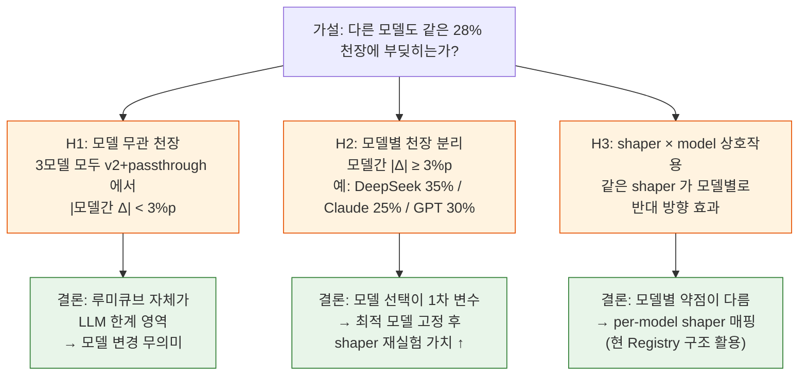
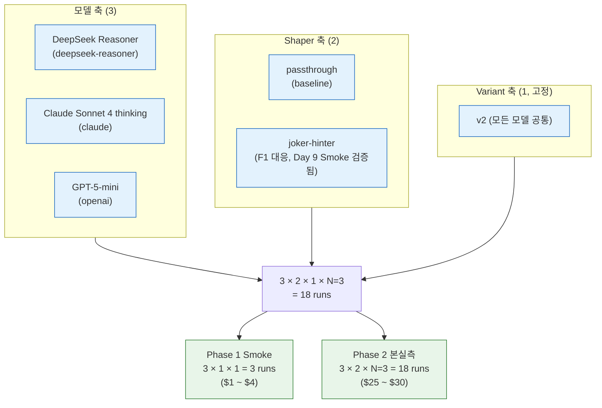
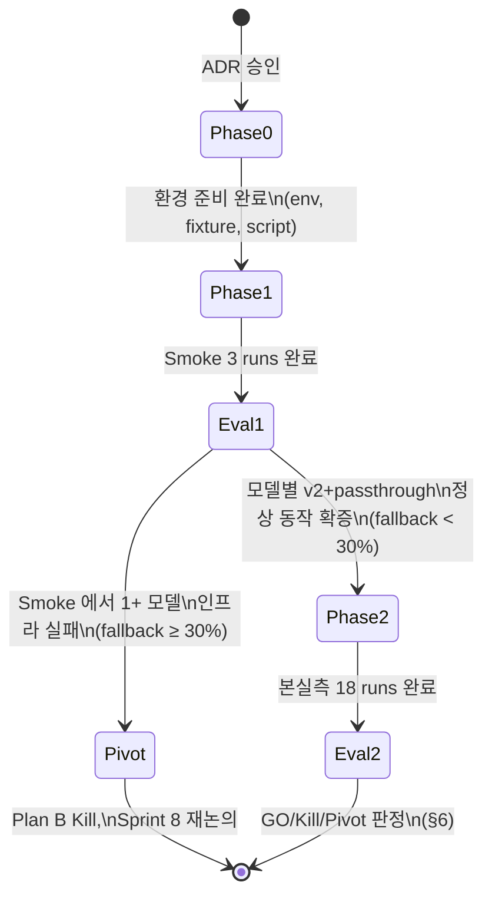
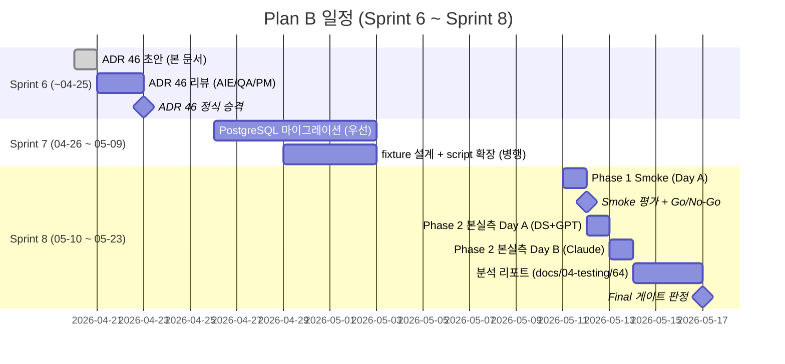

# 46. Plan B — 다중 모델 비교 재실험 (모델 축 전환)

- 작성일: 2026-04-20 (Sprint 6 Day 10)
- 작성자: architect (Opus 4.7 xhigh)
- 리뷰 예정: ai-engineer (가설 매트릭스 §2 보강), qa (실험 설계 §4 + 게이트 §6 보강), pm (Sprint 매핑 §7 확정)
- 상태: **초안 (Draft)** — Sprint 6 Day 11 P1, 실측 진입은 Sprint 8 후보
- ADR 번호: ADR-046
- 연관 문서:
  - `docs/02-design/44-context-shaper-v6-architecture.md` (ADR-044, v6 Kill 의 직접 선행 설계)
  - `docs/02-design/42-prompt-variant-standard.md` (variant SSOT, 본 ADR 의 v2 고정 근거)
  - `docs/02-design/41-timeout-chain-breakdown.md` (타임아웃 부등식 계약 — 모델별 budget 통일 검토)
  - `docs/04-testing/63-v6-shaper-final-report.md` (v6 Kill 직접 근거, Day 8/9~10 이중 확증)
  - `docs/04-testing/62-deepseek-gpt-prompt-final-report.md` (Day 8 텍스트 축 동일성 확증)
  - `docs/04-testing/46-multirun-3model-report.md` (Sprint 5 Round 4 3모델 N=3, 본 ADR 의 prior)
  - `docs/03-development/17-gpt5-mini-analysis.md` 부록 A (GPT-5-mini 내부 RLHF 메커니즘)
  - `work_logs/decisions/2026-04-19-task20-task21-roadmap.md` §7.1 (Plan B 발동 조건)
  - `CLAUDE.md` Key Design Principle #7 (타임아웃 SSOT), #8 (variant SSOT)

---

## 1. Executive Summary

Day 8 (`docs/04-testing/62`) 와 Day 9~10 (`docs/04-testing/63`) 두 축의 동시 확증으로, DeepSeek Reasoner 의 `place_rate` 가 v2 텍스트와 단순 컨텍스트(passthrough) 환경에서 이미 **28~29% 천장에 도달**했음이 확정됐다. 텍스트 축(v2~v5 6변형, Δ=0.04%p)과 구조 축(passthrough/joker-hinter/pair-warmup, |Δ|<2%p) 모두 baseline 의 1σ 안에 수렴했다. 이 결론은 단일 모델(DeepSeek Reasoner) 에 대한 것이므로, **남은 가설**은 다음 한 줄로 요약된다:

> **"같은 v2 텍스트 + 같은 ContextShaper 환경에서, 다른 모델(Claude Sonnet 4 thinking / DeepSeek Reasoner / GPT-5-mini)도 같은 28% 천장에 부딪히는가?"**

본 ADR 은 이 가설을 검증하는 **모델 축 비교 재실험(Plan B)** 의 설계를 확정한다. 핵심은 (a) 3 모델 × 2 shaper × N=3 = **18 runs** 의 직교 매트릭스, (b) v2 텍스트 + ContextShaper 인터페이스 + timeout 700s 의 **삼중 confound 통제**, (c) 비용 약 $36~38 (DeepSeek $0.04 + Claude $1.11 + GPT $0.15 가정) 을 일일 한도 $20 에 맞춰 **2일 분산 실행**, (d) **Sprint 6 안에는 ADR 만**, Sprint 7 은 PostgreSQL 마이그레이션 우선, **Sprint 8 후보** 로 실측 진입한다.

본 ADR 은 ADR-044 의 비대(1041줄) 를 반성한 결과로 **400~500줄 범위에 자기제약** 한다. 부록(원시 결과 표, t-test 계산 시트)은 본 ADR 에 포함하지 않고 실측 후 별도 리포트(예정 `docs/04-testing/64`) 로 분리한다.

---

## 2. 가설 매트릭스

### 2.1 3개 가설

### 2.2 가설 상세 + 사전 신념

| 가설 | 정의 | 사전 확률 (architect 추정) | 근거 |
|---|---|---|---|
| **H1** | 3모델 모두 v2+passthrough 에서 평균 28~31% 사이로 수렴, 모델간 \|Δ\| < 3%p | **40%** | Round 4 (`docs/04-testing/46`) DeepSeek 30.8% / GPT-5-mini 33.3%(불완전 N=2) / Claude 20.0%(N=1, WS_TIMEOUT) — 표면적 산포는 크지만 신뢰할 수 있는 N 부족. 만약 v6 처럼 천장이 모델 무관이면 H1 |
| **H2** | 모델별 천장 분리, 모델간 \|Δ\| ≥ 3%p | **45%** | Round 4 의 DeepSeek 30.8% vs Claude 20.0% Δ=10.8%p 가 noise 가 아니라 진짜라면 H2. GPT-5-mini 의 내부 RLHF (`docs/03-development/17` 부록 A) 가 추론 모델별 차이를 만든다는 메커니즘 가설 |
| **H3** | 같은 shaper 가 모델별로 반대 효과 (예: joker-hinter 가 DeepSeek -1%p, Claude +5%p) | **15%** | Round 4 데이터에서 모델별 fail mode 분포가 다르다는 정황 (DeepSeek 후반 추론 폭주 vs Claude WS_TIMEOUT). 시너지 가능성은 낮으나 무시 불가 |

**사후 분석 정책**: 18 run 결과로 H1/H2/H3 의 **사후 확률** 을 베이지안 갱신하지 않는다(과학철학적 부담). 대신 §6 GO/Kill/Pivot 임계치 하나로 결론을 단순화한다.

---

## 3. 설계 원칙

### Principle 1 — v2 텍스트 고정 (Confound Control, ADR-044 Principle 1 계승)

3 모델 모두 `globalVariantId='v2'` 또는 per-model override 로 **v2 단일 variant** 사용. ADR-044 가 확립한 "텍스트 축 고정" 원칙을 모델 축으로 확장. variant 가 모델별로 다르면 결과를 "모델 차이" 로 해석할 수 없다.

### Principle 2 — Shaper 인터페이스 통일

ADR-044 §5 의 `ContextShaper` 인터페이스는 모델 무관 동작이 보장되어 있다(Principle 4 "Pure Function"). 따라서 신규 어댑터 코드 없이 `<MODEL>_CONTEXT_SHAPER` 환경변수만 분기하면 된다. **신규 코드 변경 0**.

### Principle 3 — Timeout Budget 동등성

3 모델은 reasoning 속도가 다르나 (DeepSeek max 357s, Claude 추정 max 600s+, GPT max 240s 미만), 본 실험에서는 `AI_ADAPTER_TIMEOUT_SEC=700` 을 모든 모델에 공통 적용. **이유**: 천장이 timeout 에 의해 잘리면 "모델 한계" 가 아니라 "인프라 제약" 이 결과를 만든다(Sprint 6 Day 4 Run 3 사고 교훈, `docs/02-design/41` §1). 단, Open Question Q1 (§8) 에서 thinking budget 통일 가능성을 별도 검토.

### Principle 4 — N=3 + Pre-registration

가설 검증은 N=3 평균값 기준. **Pre-registration 원칙**: 본 ADR §6 의 임계치를 실측 시작 **전** 에 PM 승인으로 확정하고, 실측 후 임계치 변경 금지(P-hacking 방지). ADR-044 §10.3 의 GO/Kill/Pivot 구조 계승.

### Principle 5 — 비용 분산 (일일 한도 준수)

`DAILY_COST_LIMIT_USD=$20` 안에서 18 runs 를 분산 실행. §5 비용 추정 후 **2일 분산** 또는 **모델별 격일 실행** 으로 한도 위반 회피.

---

## 4. 실험 설계

### 4.1 매트릭스

### 4.2 조건 고정표

| 항목 | 값 | 근거 |
|---|---|---|
| 모델 | DeepSeek Reasoner / Claude Sonnet 4 thinking / GPT-5-mini | Round 4 비교 모델 + 운영 중인 cloud 3 모델 |
| Variant | **v2 (3모델 공통)** | Principle 1, ADR-042 §2 표 B (USE_V2_PROMPT=true 경로 또는 per-model override 로 통일) |
| Shaper | passthrough, joker-hinter (2개) | passthrough = ADR-044 baseline / joker-hinter = Day 9 Smoke 에서 N=3 안정 작동 확증된 유일 shaper. pair-warmup 은 N=1 만 유효해 제외 |
| N (per cell) | 3 | ADR-044 §10.2 σ=2.45%p 기준 |Δ|≥5%p 검출에 N=3 충분 |
| turn_limit | 80 | Round 4~10 동일 |
| timeout budget | **700s** (`AI_ADAPTER_TIMEOUT_SEC`) | Principle 3, 모델 무관 동등 |
| 초기 Rack/Board | **고정 fixture** | ADR-044 §10.4 와 동일 정책. `fixtures/sprint8-multimodel-init.json` (실측 착수 시 신규 생성) |
| AI 캐릭터 | difficulty=hard, character=calculator, psychologyLevel=1 | ADR-044 §10.4 와 동일 |
| temperature | default (모델별 vendor 권장값) | thinking budget 통일 시 Q1 에서 재검토 |
| 대전 상대 | Random Human (항상 DRAW) | Round 4 와 동일 — 단독 모델 측정 |
| 비용 한도 | $20/일, $5/시간/사용자 | `CLAUDE.md` MEMORY |

### 4.3 Phase 분할 + Go/No-Go

### 4.4 데이터 수집 항목

ADR-044 §10.1 의 metric 셋 계승.

- **Primary**: `place_rate` (모델별 N=3 평균)
- **Secondary**: `fallback_count`, `avg_latency_ms`, `max_latency_ms`, `cost_usd`, `first_meld_turn`, `tiles_placed`
- **Per-turn 로그**: `work_logs/battles/sprint8-plan-b/{model}-{shaper}-{run}/` 에 자동 덤프

---

## 5. 비용 추정

### 5.1 모델별 단가 (Round 4 실측 기준, `docs/04-testing/46`)

| 모델 | $/run (1 game, 80 turns) | 80턴 추정 근거 |
|---|---|---|
| DeepSeek Reasoner | **$0.04** | Round 4 실측, 80턴 완주 |
| Claude Sonnet 4 thinking | **$1.11** | Round 4 실측 (32턴 WS_TIMEOUT 기준 — 80턴 완주 시 약 $2.50 가능, 보수적으로 $2.00 가정) |
| GPT-5-mini | **$0.15** | Round 4 N=2 평균 (14턴 WS_CLOSED 기준 — 80턴 완주 시 약 $0.50 가능, 보수적으로 $0.40 가정) |

### 5.2 총비용

| Phase | runs | DeepSeek | Claude | GPT | 합계 |
|---|---|---|---|---|---|
| Phase 1 Smoke | 3 (각 1 run) | $0.04 | $2.00 | $0.40 | **$2.44** |
| Phase 2 본실측 | 18 (3 × 2 × N=3) | $0.24 | $12.00 | $2.40 | **$14.64** |
| **합계** | 21 | $0.28 | $14.00 | $2.80 | **$17.08** |

**보수적 상한**: 80턴 완주 시 Claude 비용 미상 → +50% 안전 마진 → **$25 ~ $30 추정**.

### 5.3 일일 한도 분산

`DAILY_COST_LIMIT_USD=$20`. Claude 가 $14 로 단독 한도 근접하므로:

- **Day A**: DeepSeek 9 runs ($0.12) + GPT 9 runs ($1.35) = $1.47 — 1일 처리
- **Day B**: Claude 9 runs ($9.00 ~ $13.50) — 1일 처리

→ **2일 분산** 으로 한도 위반 없이 완수 가능. Phase 1 Smoke 는 Day A 합류.

### 5.4 API 잔액 점검 (2026-04-20 기준, MEMORY)

- DeepSeek: $2.20 → 충분
- Claude: $29.59 → 충분 ($14 소모 후 $15 잔여)
- OpenAI: $17.92 → 충분

---

## 6. GO / Kill / Pivot 임계치

ADR-044 §10.3 의 정량 게이트 구조 재사용. 단, 본 ADR 은 **모델간 Δ** 가 1차 판단 기준.

### 6.1 Phase 1 Smoke 게이트 (3 runs 후)

| 판정 | 조건 | 후속 |
|---|---|---|
| **Proceed** | 3모델 모두 fallback < 30% **AND** 응답 latency < 600s | Phase 2 본실측 진입 |
| **Pivot** | 1+ 모델에서 fallback ≥ 30% | 인프라 점검 (timeout, prompt encoding) → Smoke 재실행 1회 |
| **Kill** | Pivot 후에도 동일 실패 | Plan B Kill, Sprint 8 재논의 |

### 6.2 Phase 2 본실측 게이트 (18 runs 후)

| 판정 | 조건 | 후속 (Sprint 8+) |
|---|---|---|
| **GO (H2 확증)** | 최대-최소 모델간 \|Δ\| ≥ 5%p **AND** N=3 t-test p < 0.1 | 최강 모델 고정 후 ADR-044 shaper 재실험 (Plan B 후속) |
| **GO (H3 확증)** | shaper × model 교호작용 검정 (2-way ANOVA) p < 0.1 | per-model shaper 매핑 설계 (ADR-044 Registry 의 perModelOverrides 활용) |
| **Pivot** | 3%p ≤ \|Δ_max\| < 5%p | N=5 추가 (각 모델 +2 run, 비용 +$10) → 재판정 |
| **Kill (H1 확증)** | 모델간 \|Δ\| < 3%p **AND** 모든 모델이 v2 baseline σ 1대역 안 | "루미큐브 = LLM 한계 영역" 결론 공식화. 모델 비교 트랙 종료. 다음 축은 Sprint 9+ 에서 (예: Multi-agent reasoning, Tool use) |

### 6.3 임계치 근거

- **5%p**: ADR-044 §10.3 와 동일 — Round 10 v2 σ=2.45%p 의 **2σ 초과**, noise 확률 < 5%
- **3%p**: 동일 σ 의 **1.2σ**, noise 확률 약 23% — pivot 으로 N 보강 정당화
- **N=3 t-test p < 0.1**: 통계적 유의성 (양측, 보수적)

---

## 7. Sprint 매핑 + Next Action

### 7.1 Sprint 매핑

- **Sprint 6 안**: 본 ADR 만 작성/승인. 실측 금지.
- **Sprint 7 안**: PostgreSQL 마이그레이션 (`prompt_variant_id` + `shaper_id` + `model_type`) 이 P0. 본 ADR 의 fixture 설계와 script `--shaper` 옵션은 병행 가능 (node-dev).
- **Sprint 8 후보**: 실측 착수. Day A + Day B 분산 실행.

### 7.2 Next Action — Sprint 8 킥오프 시

| 담당 | 작업 | 산출물 |
|---|---|---|
| **PM** | Sprint 8 킥오프에서 Plan B 우선순위 재확인 (PostgreSQL 마이그 완료 전제) | Sprint 8 plan |
| **architect** | 본 ADR 의 Open Questions §8 4건 결론 확정, ADR-046 정식 승격 (Status: Accepted) | ADR-046 v1.0 |
| **ai-engineer** | Phase 1 Smoke 결과 분석 → §6.1 Pivot 여부 판정. fixture 설계 (3모델 공정성: 단일 시드 vs 모델별 시드?) | `docs/04-testing/64` Part 1 (Phase 1 분석) |
| **node-dev** | `scripts/ai-battle-3model-r4.py` 에 `--shaper <id>` + `--variant <id>` CLI 옵션 추가 (ADR-044 §9.4 와 동일 인터페이스). 모델별 ConfigMap 분기 docs 추가 | PR 제목: `feat(scripts): plan-b multi-model 3x2 매트릭스 지원` |
| **devops** | Phase 2 Day A/B 분산 실행 자동화 (Daily cost limit guard + Slack 통보 카카오톡 통보) | `scripts/run-plan-b-phase2.sh` |
| **qa** | Pre-registration 게이트 (§6 임계치 변경 금지) 모니터링. Final 판정 시 t-test/ANOVA 계산 검증 | `work_logs/decisions/sprint8-plan-b-final.md` |

---

## 8. Open Questions

본 ADR 정식 승격 (Sprint 6 안) 전에 4건 결론 확정 필요.

### Q1. 모델별 thinking budget 통일 가능성

**문제**: DeepSeek Reasoner 는 `reasoning_tokens` 외부 제어 불가 (자율 확장, max 357s 관측). Claude thinking 은 `thinking_budget_tokens` 파라미터로 명시 제어 가능. GPT-5-mini 는 내부 RLHF 고정 (`docs/03-development/17` 부록 A).

**옵션**:
- A) 통일 시도 (Claude budget 을 DeepSeek 평균에 맞춤) → 모델별 본래 강점 왜곡 위험
- B) 통일 포기 (각 모델 vendor 권장 default 사용) → "모델 본연의 천장" 측정에 집중

**권장**: **B** (vendor default). 본 ADR 은 "각 모델이 본연의 설정에서 어디까지 가는가" 가 질문이므로 인위적 통일 불필요. ai-engineer 결론 대기.

### Q2. DeepSeek-R3 (차세대) 비용 변동 가능성

**문제**: Sprint 8 시점(2026-05-10 추정)에 DeepSeek 가 R3 출시 시 비용/성능 변동 가능. R2 (현재 deepseek-reasoner) 와 R3 중 어느 것을 측정할지.

**옵션**:
- A) Sprint 8 시점의 latest production model 사용
- B) ADR 작성 시점(2026-04-20) 의 deepseek-reasoner R2 고정 → 결과의 시간적 재현성 ↑

**권장**: **B** (R2 고정). 비교 baseline 의 안정성이 우선. R3 별도 트랙으로 분리.

### Q3. Claude Anthropic API 한도 (rate limit / RPM)

**문제**: 18 runs 중 Claude 9 runs 동시/순차 실행 시 anthropic API 의 분당 요청 한도(RPM) 또는 일일 한도 위반 가능성.

**조치**: Sprint 8 킥오프 1주 전(2026-05-03) 에 devops 가 Anthropic console 에서 한도 확인. 부족 시 Tier 상향 신청 또는 격일 분산.

### Q4. shaper 축 어디까지 확장할 것인가 (pair-warmup 재포함?)

**문제**: 현 매트릭스는 passthrough + joker-hinter 만. pair-warmup 은 Day 9 Smoke 에서 N=1 만 유효 (다른 2 run 은 DNS 장애 오염). 본 실험에 포함 시 매트릭스가 3 × 3 × N=3 = 27 runs 로 확대, 비용 +$8.

**옵션**:
- A) 현재대로 2 shaper (passthrough + joker-hinter) → 18 runs, $25~30
- B) 3 shaper 로 확대 → 27 runs, $35~45 → 일일 한도 +0.5일 추가

**권장**: **A** (현재대로). H1/H2/H3 가설 검증에는 2 shaper 면 충분. pair-warmup 은 H3 확증 시 별도 후속 실험으로 분리. ai-engineer 결론 대기.

---

## 9. 위험 + 완화

| 위험 | 영향 | 완화 |
|---|---|---|
| Claude 80턴 완주 비용 폭증 ($2.50/run × 9 = $22.50) | 일일 한도 위반 | 보수적 추정에 +50% 마진. Day B 단독 분산. Sprint 8 킥오프 시 잔액 재확인 |
| 모델 vendor 일시 장애 (Day 9~10 DNS 장애 재현) | run 오염 | `batch-battle` SKILL 의 DNS 검증(getent hosts) + cleanup 체크리스트 (리포트 63 Part 3 반성 반영) 적용 |
| GPT-5-mini 80턴 완주 미달성 (Round 4 N=2 모두 14턴/32턴 종료) | place_rate 측정 무효 | Phase 1 Smoke 에서 80턴 완주 우선 검증. 미달 시 timeout/script 조정 후 재실행. 그래도 실패 시 H2 의 GPT 결과는 "측정 불가" 로 기록 (Kill 아님) |
| Multi-day 실행 중 timeout 정책 변경 | 결과 불일치 | Day A/B 사이 ConfigMap 변경 금지 정책 (devops 확인) |
| Pre-registration 위반 (실측 후 임계치 조정 유혹) | P-hacking | qa 가 §6 임계치 변경 PR 모두 reject |

---

## 10. 변경 이력

| 일자 | 변경자 | 내용 |
|---|---|---|
| 2026-04-20 | architect | 초안 작성 (Day 11 P1, v6 Kill 직후) |
| (예정) | ai-engineer | §2 가설 매트릭스 사전 확률 보강, Q1/Q4 결론 |
| (예정) | qa | §6 임계치 통계 검증, t-test/ANOVA 계산 시트 추가 |
| (예정) | pm | §7 Sprint 8 킥오프 일정 확정 |

---

## 부록 — 자료 분리 정책

본 ADR 은 **400~500줄** 자기제약 (ADR-044 1041줄의 비대 반성). 다음 자료는 별도 파일로 분리:

- **실측 원시 결과 표** → `docs/04-testing/64-plan-b-multi-model-report.md` (Sprint 8 실측 후 신규)
- **t-test / ANOVA 계산 시트** → `work_logs/decisions/sprint8-plan-b-final.md` 부록
- **fixture 설계** → `src/ai-adapter/test/fixtures/sprint8-multimodel-init.json` (Sprint 7 말 신규)
- **script 변경** → ADR 미포함, PR description 에 변경점 기술

본 ADR 의 변경은 §1~§9 의 의사결정 변경에 한정한다.
