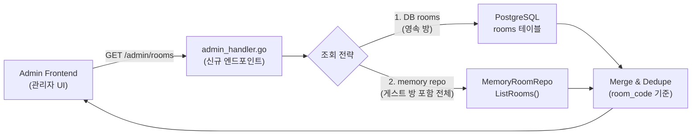

# 48. ADR-025 — 게스트 호스트 방의 rooms 테이블 영속 배제

- **ADR ID**: ADR-025
- **Status**: **Accepted** (2026-04-22)
- **Date**: 2026-04-22 (Sprint 7 D+1)
- **작성자**: architect (Opus 4.7 xhigh)
- **분류**: Persistence · Data Integrity · WONTFIX 정책
- **관련 WARN**: WARN-04 (PR #42 Dual-Write rooms 스킵 분기)
- **관련 PR**: PR #42 (D-03 Phase 1 Dual-Write)
- **관련 Issue**: #17 (rooms 테이블 Dual-Write 도입)
- **관련 문서**:
  - `docs/04-testing/74-warn-items-impact-assessment.md` (WARN triage, 본 ADR 발의 근거)
  - `docs/04-testing/71-pr41-42-regression-test-plan.md`
  - `docs/04-testing/72-pr41-42-regression-test-report.md`
  - `src/game-server/internal/service/room_converter.go:14-31` (`roomStateToModel` — 본 ADR 구현 지점)

---

## 1. 요약 (TL;DR)

**게스트 사용자(비-UUID `HostID`)가 생성한 방은 `rooms` 테이블에 기록하지 않는다.**
이 동작은 **버그가 아니라 FK 무결성 보호를 위한 의도된 설계**다. 미래 admin rooms 조회 UI 도입 시 "게스트 방 미표시" 는 설계 산출물로 간주하고, 운영 FAQ(`docs/06-operations/03-admin-faq.md`)로 완화한다.

---

## 2. Context (배경)

### 2.1 D-03 Phase 1 Dual-Write 도입 경과

Sprint 6 D-03 Phase 1(PR #42, 2026-04-20 merge)에서 `games.room_id` FK 정합성을 확보하기 위해 **`rooms` 테이블 Dual-Write** 가 도입되었다. 기존에는 `RoomState` 가 인메모리(memory repo) 에만 존재했으나, PR #42 이후 `CreateRoom` 경로에서 memory repo 와 PostgreSQL `rooms` 양쪽에 기록(best-effort) 한다.

### 2.2 게스트 사용자 `HostID` 형식 문제

RummiArena 는 두 가지 사용자 식별 경로를 가진다:

| 경로 | HostID 형식 | `users.id` 존재 여부 |
|------|------------|---------------------|
| Google OAuth 로그인 | UUID v4 (예: `3f2e9...`) | ✅ 있음 |
| 게스트 / QA 테스터 | 자유 문자열 (예: `qa-테스터-12`, `guest-a3f1`) | ❌ 없음 |

`rooms.host_user_id` 는 `users.id` 에 대한 FK 제약을 가진다. 게스트 `HostID` 를 그대로 INSERT 하면 **PostgreSQL foreign key violation** 으로 실패한다.

### 2.3 현재 구현 — `roomStateToModel` 의 방어 분기

`src/game-server/internal/service/room_converter.go:14-18`:

```go
func roomStateToModel(state *model.RoomState) *model.Room {
    // FK 방어: HostUserID → users.id 참조. 유효 UUID 아니면 DB 쓰기 스킵.
    if !isValidUUIDStr(state.HostID) {
        return nil
    }
    // ... UUID 유효한 경우에만 model.Room 반환
}
```

호출자(`RoomService`) 는 nil 을 받으면 DB INSERT 를 스킵한다. 결과적으로 **게스트 방은 memory repo 에만 존재**한다.

### 2.4 현재 영향 범위

- **공개 `ListRooms` (`room_handler.go:104-107`)**: memory repo 만 조회 — 게스트 방도 정상 노출 ✅
- **`admin_handler.go`**: **rooms 조회 엔드포인트 자체가 없음** — 영향 없음 ✅
- **`games.room_id` FK**: 게스트 방도 game 생성 시 `rooms` 에 없지만, PR #42 후속 단계에서 별도 처리(현 ADR 범위 밖)
- **미래 위험**: admin 대시보드에 rooms 조회 페이지 도입 시, DB 쿼리만으로는 게스트 방이 누락되어 **운영자가 일부 방만 본다**는 혼선 가능

---

## 3. Decision (결정)

**게스트 호스트(비-UUID `HostID`) 가 생성한 방은 `rooms` 테이블에 영속하지 않는다.**

- `roomStateToModel` 의 nil 반환 분기는 **영구 유지(Permanent WONTFIX)** 한다.
- 향후 admin rooms UI 를 도입할 때, 쿼리 로직은 **"DB rooms + memory repo"** 를 병행 조회하도록 설계한다(본 ADR §6 참조).
- 본 결정을 code comment, 테스트 주석, 운영 FAQ 3 지점에서 cross-reference 하여 지식 유실을 막는다.

### 3.1 영향 받는 파일(Reference Only)

| 파일 | 역할 | 수정 |
|------|------|------|
| `src/game-server/internal/service/room_converter.go` | `roomStateToModel` 방어 분기 | **유지** (변경 없음) |
| `docs/02-design/48-adr-025-guest-room-persistence.md` | 본 ADR | **신규** |
| `docs/06-operations/03-admin-faq.md` | 운영 FAQ | **신규 / 섹션 추가** |

> **주의**: 본 ADR 은 **설계 결정 문서**이며 코드 수정 지침이 아니다. 구현은 PR #42 시점에서 이미 완료됨.

---

## 4. Rationale (근거)

### 4.1 FK 무결성 최우선

`rooms.host_user_id → users.id` FK 는 "모든 방의 호스트는 등록된 사용자" 라는 도메인 불변식을 강제한다. 이 불변식을 깨뜨리면:

- ORM(GORM) eager loading 이 조용히 깨짐
- `JOIN users ON rooms.host_user_id = users.id` 쿼리가 게스트 방에서 row 누락
- 미래 사용자 통계(방 생성 수, 인기 호스트 TOP 10 등) 가 왜곡

### 4.2 게스트 세션의 본질적 일시성

- 게스트 계정은 **세션 종료 시 소멸**하도록 설계됨 (영속 프로필 없음)
- 게스트가 생성한 방도 **세션 연속성 밖에서 의미 없음**
- 운영 통계·복기·리더보드 대상이 아님

### 4.3 DB 복잡도 감소

- `users` 테이블에 pseudo-guest row 를 삽입하지 않아도 됨 → `users.id` 카디널리티 순수성 유지
- `users.email` unique 제약과 충돌 없음(게스트는 이메일 미발급)
- 백업·마이그레이션·GDPR 삭제 요청 시 처리 대상 축소

### 4.4 Dual-Write Best-Effort 원칙과 정합

PR #42 는 Dual-Write 를 **best-effort** 로 설계했다(DB 실패가 memory 쓰기를 막지 않음). 게스트 방 스킵은 이 원칙의 자연스러운 확장이다.

---

## 5. Alternatives Considered (대안 검토)

| 대안 | 점수 | 선택 여부 | 탈락/채택 사유 |
|------|-----:|:--------:|---------------|
| **(A) 게스트용 pseudo-user 자동 생성 후 rooms 기록** | 5.5/10 | ❌ | `users` 부피 증가(게스트 턴오버 큼), 통계 왜곡(DAU/MAU 오염), GDPR 처리 복잡 |
| **(B) `rooms.host_user_id` nullable 전환 + FK 유지** | 6.0/10 | ❌ | FK 의미 손실(호스트 없는 방 허용), nullable 이 기본 케이스인지 예외인지 모호, JOIN 쿼리 LEFT JOIN 전파 |
| **(C) 게스트 방은 DB 미기록 + ADR + FAQ** (현재 선택) | **8.5/10** | ✅ | FK 무결성 온전, DB 단순, 미래 UI 혼선은 FAQ 로 완화 가능 |
| (D) 별도 `guest_rooms` 테이블 | 4.0/10 | ❌ | 스키마 이중화, ORM 모델 분기, admin UI 도 이중 조회 — C 대비 이득 없음 |
| (E) Dual-Write 자체 롤백 | 3.0/10 | ❌ | D-03 Phase 1 목표(`games.room_id` FK 정합) 상실 |

### 평가 기준 (총 10점)

- FK 무결성 (3점) / DB 단순성 (2점) / 운영 관측성 (2점) / 롤백 용이성 (1.5점) / 구현 비용 (1.5점)

---

## 6. Consequences (결과)

### 6.1 Positive

- ✅ **FK 무결성 보장** — `rooms.host_user_id → users.id` 제약이 온전히 유지됨
- ✅ **DB 단순** — `users` 테이블에 게스트 noise 유입 없음
- ✅ **구현 비용 0** — PR #42 시점의 방어 분기가 그대로 ADR 화
- ✅ **롤백 불필요** — 의도된 동작 명문화로 "버그 아님" 판정 고정

### 6.2 Negative (완화 수단 병기)

| 부작용 | 완화 방안 |
|--------|----------|
| 미래 admin rooms 페이지에서 게스트 방 미표시 → 운영자 혼선 | **FAQ 필수 등재** (`docs/06-operations/03-admin-faq.md` §3). admin UI 구현 시 memory repo 병행 조회 로직 강제 |
| 게스트 방 행동 분석 불가 (쿼리 대상 없음) | 분석이 필요해지면 Sprint 8+ 에서 `guest_events` 로그성 테이블 별도 신설 검토 (현 시점 YAGNI) |
| code 수정자가 `roomStateToModel` nil 반환을 "누락" 으로 오해 | 함수 독스트링에 이미 명시(`room_converter.go:9-10`), 본 ADR 로 cross-reference 강화 |

### 6.3 미래 admin rooms UI 설계 지침

미래 admin 대시보드에 rooms 페이지를 도입할 때 따라야 할 규약:



- 반드시 **DB + memory 양쪽을 조회** 후 `room_code` 기준으로 머지
- 응답 DTO 에 `persisted: boolean` 필드를 추가하여 admin UI 가 게스트 방을 시각적으로 구분 가능하도록 함
- 구현 시 본 ADR 을 반드시 코드 주석에 인용

---

## 7. 검증 매트릭스

| 영역 | 검증 방법 | 현재 상태 |
|------|----------|----------|
| 현재 admin 대시보드 영향 | `admin_handler.go` rooms 엔드포인트 부재 확인 | ✅ 영향 없음 (grep 확인) |
| 공개 `ListRooms` 동작 | `room_handler.go:104-115` memory repo 조회 경로 | ✅ 게스트 방 노출 정상 |
| FK 위반 재현 방지 | `roomStateToModel` nil 분기 | ✅ `room_converter.go:15-17` 유지 |
| E2E 회귀 | `rooms_persistence_test.go` (PR #42 포함) | ✅ 3/3 PASS (리포트 72 §3) |
| DB 실측 | 16건 신규 games 모두 `room_id NOT NULL` | ✅ 리포트 72 §5 |

---

## 8. Open Questions (후속 검토)

1. **게스트 → 로그인 전환 시 방 승격(migration) 시나리오** — 현재 명세 없음. 필요성 증명 후 별도 ADR.
2. **admin rooms UI 도입 시점** — 미정. Sprint 8+ 백로그.
3. **게스트 방 TTL** — memory repo 에 timeout 기반 GC 가 있는지 별도 확인 필요 (본 ADR 범위 밖).

---

## 9. 결정 요약 (One-liner)

> **"게스트 방은 `rooms` 테이블에 쓰지 않는다. FK 무결성을 지키고, 미래 admin UI 는 memory repo 를 병행 조회한다."**

---

> **문서 이력**
>
> | 버전 | 날짜 | 작성자 | 내용 |
> |------|------|--------|------|
> | 1.0 | 2026-04-22 | architect (Opus 4.7 xhigh) | 초안 — WARN-04 Permanent WONTFIX 결정, ADR-025 발행 |
