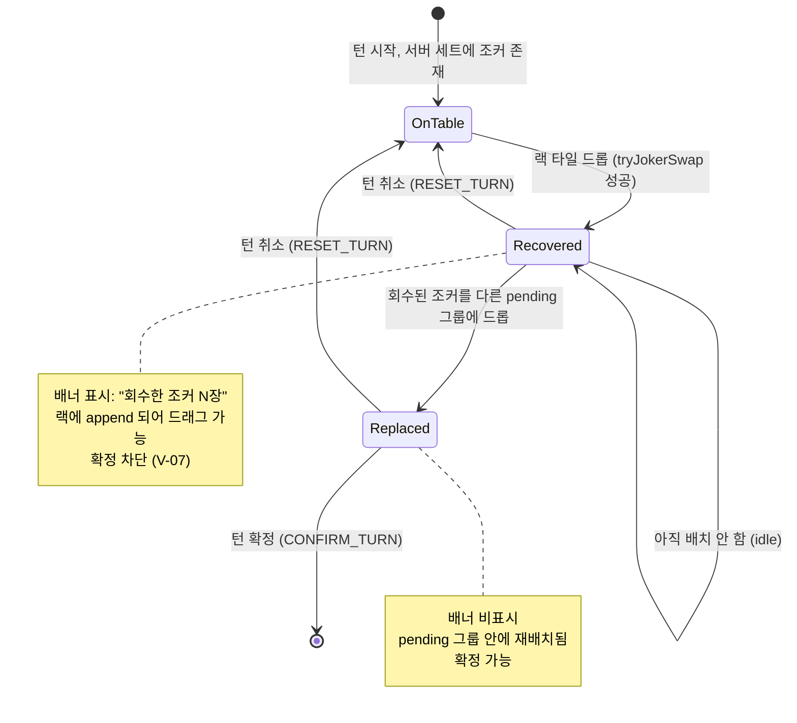
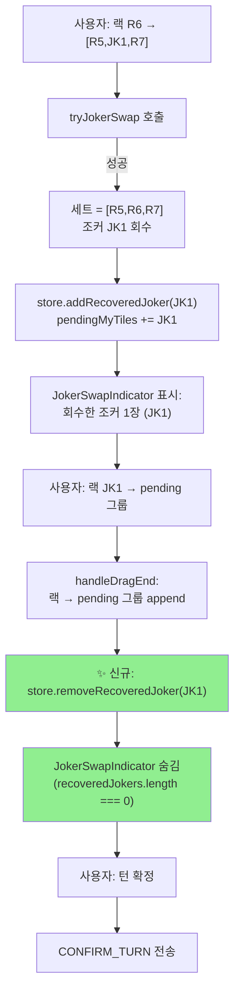

# 49. V-13a / V-13e 리팩터·UX 개선 설계

작성일: 2026-04-23 (Sprint 7 Day 2, Day 3 사전 분석)
작성자: architect
대상 작업일: 2026-04-24 (Day 3)
관련 규칙: 06-game-rules.md §6 재배치, 31-game-rule-traceability.md §1.1 V-13 4유형
연관 이슈/PR: PR #39 (I-4 핫픽스), PR #51 (FINDING-01 롤백), I-19 데드락 수정

---

## 0. Executive Summary

Sprint 7 백로그의 게임 UX 마무리 2건. Day 2 시점 기준 두 건 모두 **기능은 이미 동작**하지만 정합성·체감 품질에 결함이 있다. 각 건의 핵심 의사결정과 권장안을 먼저 요약한다.

| 항목 | 현재 상태 | 권장 옵션 | 근거 | SP | 담당 |
|------|---------|---------|------|----|------|
| **V-13a** `ErrNoRearrangePerm` orphan | 상수·메시지만 존재, 호출 경로 0건. `ErrInitialMeldSource` 가 대체 차단 | **옵션 A (유지 + 호출 추가)** | 31-game-rule-traceability.md §1.1 에 "V-05 간접 차단, `ErrNoRearrangePerm` 미사용 (정확도 gap)" 이 공식 부채로 등록돼 있음. 에러 코드가 "의미 있는 구분" 을 제공하므로 삭제보다 정합화가 적절 | 2 | go-dev |
| **V-13e** 조커 재드래그 UX | 데드락은 PR #39 로 해소. 하지만 `pendingRecoveredJokers` 배너가 재배치 후에도 사라지지 않음. `removeRecoveredJoker` 함수는 정의돼 있으나 **호출되지 않음** | **state machine 정리 + dnd-kit sensor 튜닝 + 배너 동기화** | 핵심 결함은 "회수 → 재배치" 상태 전이가 완료 시그널 없음. Store helper 는 갖춰져 있어 호출 지점만 추가하면 해결 | 3 | frontend-dev |

**병렬성**: 두 작업은 backend(V-13a) ↔ frontend(V-13e) 로 완전히 독립. worktree 두 개 분리 실행 가능. 예상 소요 병렬 기준 **~3시간** (각 작업 1.5~2h + 검증).

**위험 예산**: V-13a 는 백엔드 검증 강화 — 회귀 가능성 낮음 (기존 통과 경로는 그대로). V-13e 는 게임 중 핵심 상호작용 — PR #51 FINDING-01 같은 회귀 방지를 위해 Playwright 시나리오 신규 2건 필수.

---

## 1. V-13a — `ErrNoRearrangePerm` orphan 리팩터

### 1.1 Current state

**코드 현황**:

```
src/game-server/internal/engine/errors.go
  L52:  ErrNoRearrangePerm = "ERR_NO_REARRANGE_PERM"   // 재배치 권한 없음 (V-13)
  L79:  ErrNoRearrangePerm: "최초 등록 전에는 테이블 재배치가 불가합니다."
```

전수 grep 결과:
- **상수 정의**: 1건 (`errors.go:52`)
- **메시지 매핑**: 1건 (`errors.go:79`)
- **실제 발생 지점**: **0건** — 어디에서도 `newValidationError(ErrNoRearrangePerm, ...)` 를 호출하지 않음
- **테스트**: 0건 — `ErrNoRearrangePerm` 문자열로 기대값을 검증하는 테스트 없음

대신 V-13a 시나리오 (최초 등록 전 재배치 시도) 는 현재 `validator.go:100-131` 의 `validateInitialMeld` 가 **`ErrInitialMeldSource` (랙 외 타일 사용)** 로 차단한다.

```go
// validator.go L100~104
if !req.HasInitialMeld {
    if err := validateInitialMeld(req); err != nil {
        return err
    }
}

// validateInitialMeld 내부 L124~131
// "테이블 before 타일이 after 에서 감소했다면 → ErrInitialMeldSource"
for code := range beforeCodes {
    if afterCodes[code] < beforeCodes[code] {
        return newValidationError(ErrInitialMeldSource, ...)
    }
}
```

**의미론적 간극**:

| 시나리오 | 현재 반환 에러 | 의미상 정확한 에러 |
|---------|-------------|-----------------|
| 최초 등록 전, 테이블 기존 타일을 이동 (재배치 시도) | `ErrInitialMeldSource` ("랙 외 타일 사용") | `ErrNoRearrangePerm` ("재배치 권한 없음") |
| 최초 등록 전, 기존 세트에 자기 타일을 추가 (append) | `ErrInitialMeldSource` | `ErrInitialMeldSource` (이것이 맞음) |

즉 현재는 두 개의 서로 다른 위반 상황이 단일 에러 코드로 뭉뚱그려져, **클라이언트 UX 메시지가 부정확**하다. 사용자는 "내 타일이 왜 랙 외 타일이라는 건가?" 하고 혼란한다. V-13a 는 "재배치 권한이 없다" 를 명시적으로 말해야 한다.

**traceability 공식 부채**:

31-game-rule-traceability.md §1.1 L75, §3 L244 가 이 정확도 gap 을 이미 명시하고 있다. 내부 감사 문서 기준으로 기술 부채로 등록된 상태.

### 1.2 3 옵션 비교

**옵션 A — 유지 + 호출 경로 추가 (권장)**

`validateInitialMeld` 를 분기해 "테이블 before 감소 = 재배치 시도" 를 먼저 판정하고 `ErrNoRearrangePerm` 반환. "랙 타일 부족 = 랙 외 타일 사용" 은 기존 `ErrInitialMeldSource` 유지.

```go
// validator.go validateInitialMeld 수정안
func validateInitialMeld(req TurnConfirmRequest) error {
    // V-13a: 테이블 before 타일이 after 에서 감소 → 재배치 시도
    beforeCodes := collectTileCodes(req.TableBefore)
    afterCodes := collectTileCodes(req.TableAfter)
    for code := range beforeCodes {
        if afterCodes[code] < beforeCodes[code] {
            // 이 타일이 요청 플레이어의 랙에서 왔는지 검사 → 왔으면 재배치 권한 없음
            return newValidationError(ErrNoRearrangePerm, ErrorMessages[ErrNoRearrangePerm])
        }
    }
    // V-05: (기존 유지) 제출된 타일 중 랙에 없는 타일 존재
    // ... 기존 로직
}
```

- 장점: 에러 코드 의미 명확화, UX 메시지 정확, traceability gap 해소, 삭제하지 않아 호환성 유지
- 단점: 분기 추가 (코드 ~10 LOC), 테스트 신규 2건 필요
- 리스크: LOW — 기존 통과 경로 변화 없음

**옵션 B — 삭제 (YAGNI)**

상수·메시지 맵핑 삭제. V-13a 는 `ErrInitialMeldSource` 로 계속 처리. traceability 에서 "의도적 통합" 로 재분류.

- 장점: 코드 최소화 (~3 LOC 제거)
- 단점: traceability §1.1 의 공식 부채 해소 불가. "V-13 재배치 권한" 이라는 규칙이 독립 에러 코드를 갖지 않아 에러 코드 레지스트리(29-error-code-registry.md)와 game-rules.md §9 의 "V-13" 체계가 뒤틀림
- 리스크: MEDIUM — 문서-코드 정합성 부채 확대

**옵션 C — 병합 (`ErrInvalidMove` 하위 code)**

`ErrInvalidMove` 라는 상위 개념 신설 + `detail` 필드로 세분화.

- 장점: 에러 코드 계층 구조 명확화
- 단점: 현재 `ValidationError` 구조체는 flat code 만 사용. 병합은 전체 에러 체계 리팩터를 유발. 이 건에만 하기에는 과함 (YAGNI violation 역방향)
- 리스크: HIGH — 범위 폭발

### 1.3 권장 결정

**옵션 A 채택**.

근거:
1. traceability §1.1 에 기술부채로 등록된 gap 해소
2. 에러 코드 의미 명확화로 UX 메시지 정확도 향상
3. 삭제(B) 는 문서-코드 정합성을 악화시키고, 병합(C) 은 범위 폭발
4. simplify SKILL 관점에서도 "이미 정의된 코드 + 메시지를 살리는 것" 이 가장 단순함

### 1.4 구현 계획

**파일**:
- `src/game-server/internal/engine/validator.go` — `validateInitialMeld` 분기 추가
- `src/game-server/internal/engine/validator_test.go` — 테스트 신규 2건
- `docs/02-design/31-game-rule-traceability.md` — V-13a 행 ⚠️ → ✅ 갱신

**validator.go 수정 (~10 LOC)**:

```go
// validateInitialMeld enforces V-04, V-05, V-13a.
func validateInitialMeld(req TurnConfirmRequest) error {
    beforeCodes := collectTileCodes(req.TableBefore)
    afterCodes := collectTileCodes(req.TableAfter)

    // V-13a: 최초 등록 전에는 기존 테이블 타일을 재배치할 수 없다.
    // table before 타일이 after 에서 감소했다면 재배치 시도로 간주한다.
    for code := range beforeCodes {
        if afterCodes[code] < beforeCodes[code] {
            return newValidationError(ErrNoRearrangePerm, ErrorMessages[ErrNoRearrangePerm])
        }
    }

    // V-04: 최초 등록 30점 이상 조건 (기존 로직)
    addedCodes := newlyAddedTiles(req.RackBefore, req.RackAfter)
    if len(addedCodes) == 0 {
        return newValidationError(ErrInitialMeldScore, ErrorMessages[ErrInitialMeldScore])
    }
    // ... 기존 점수 계산 로직
}
```

주의: `ErrInitialMeldSource` 의 "랙 외 타일 사용" 경로는 현재 `validateTileConservation` 이 code-level 로 다시 검증하므로 중복 로직이 아니다. 기존 "table before 타일 빈도 감소 → ErrInitialMeldSource" 분기는 V-13a 로 역할 이전되며, 삭제한다.

**테스트 신규 (validator_test.go)**:

1. `TestValidateTurnConfirm_V13a_NoRearrangePerm` — 최초 등록 전 테이블 타일 재배치 시도 → `ErrNoRearrangePerm` 반환 확인
2. `TestValidateTurnConfirm_V13a_AfterMeld_Allowed` — 최초 등록 후 재배치는 통과 (회귀 가드)

기존 `TestValidateTurnConfirm_V05_RearrangeBeforeMeld` (validator_test.go L211) 는 단순 `assert.Error` 만 호출하므로 에러 코드를 `ErrNoRearrangePerm` 으로 기대값 변경. (테스트 1건 수정)

**영향도**:
- 다른 호출자: `turn_service_test.go:553` 이 `engine.ErrInitialMeldSource` 를 기대 — 이 시나리오가 "최초 등록 전, 테이블 기존 세트 타일 제거" 인지 "랙 외 타일 사용" 인지 확인 필요. 구현 시점에 go-dev 가 판단.

### 1.5 검증 계획

- `go test ./internal/engine/...` 전체 통과 (기존 530개 + 신규 2개 = 532개)
- `go test ./internal/service/...` 회귀 없음 (기존 `turn_service_test.go:553` 기대값 갱신 가능성 검토)
- 엔진 단에서 끝나므로 Playwright E2E 회귀 불필요 (UI 는 에러 메시지만 표시)

---

## 2. V-13e — 조커 재드래그 UX

### 2.1 Current state

**데드락 해소 경위**:
- Day 11 실측 I-4 — 조커가 포함된 서버 세트에 랙 타일 드롭 시 조커가 `pendingRecoveredJokers` 배열에만 추가되고 **랙(`pendingMyTiles`) 에 append 되지 않아** 드래그 불가. 턴 타임아웃 트랩.
- PR #39 (`a58316e`) — `removeFirstOccurrence` + 회수 조커를 `pendingMyTiles` 에 즉시 추가하는 핫픽스. **데드락 해소**.
- I-19 추가 수정 (handleConfirm) — "`pendingRecoveredJokers.length > 0` 이면 확정 차단" 이라는 과잉 차단을 "pendingMyTiles 에 남아있는 회수 조커가 있으면 차단" 으로 완화.

**현 결함 (I-4 핫픽스 이후에도 남는 UX 누수)**:

핵심: **`removeRecoveredJoker` 가 store 에 정의돼 있으나 어디에서도 호출되지 않음**.

```
src/frontend/src/store/gameStore.ts
  L67:  removeRecoveredJoker: (code: TileCode) => void;
  L172: removeRecoveredJoker: (code) => set((state) => { ... })

src/frontend/src/app/game/[roomId]/GameClient.tsx
  grep "removeRecoveredJoker" → 0 hits (store import 외)
```

사용자 시나리오:
1. 서버 세트 [R5, JK1, R7] 에 랙 R6 을 드롭 → JK1 회수
2. JokerSwapIndicator 배너 표시: "회수한 조커 1장: JK1"
3. 사용자가 회수된 JK1 을 다른 pending 그룹에 재드래그 → 그룹에 추가됨 (data 반영 OK)
4. **배너는 여전히 "회수한 조커 1장: JK1" 표시** ← 결함. 실제로는 이미 재배치됨
5. 사용자가 "턴 확정" 클릭 → `unplacedRecoveredJokers.filter(...)` 가 JK1 이 pendingMyTiles 에 없음을 확인하고 통과. 정상 확정됨

즉 **기능은 동작하지만 배너가 stale**. 사용자는 "조커를 썼는데 왜 경고가 계속 떠 있지?" 하고 불안. 또한 turn 이 RESET 되면 `clearRecoveredJokers` 가 호출되므로 다음 턴엔 깨끗하지만, 같은 턴 내 feedback 이 없다.

**부수적 이슈 (심층 조사 중)**:

- dnd-kit 드래그 시작 sensor: 현재 `pointerWithin` 사용, activation constraint 8px. 조커처럼 시각적으로 구분되는 타일은 빠른 더블 탭 시 drag 가 두 번 발생하는 경우가 실측에서 간헐적. activation distance 를 10px + delay 50ms 로 조정 검토.
- Practice 모드와 실전 모드의 조커 회수 경로가 동일 — 분리 필요 없음.
- FINDING-01 롤백 이후 `hasInitialMeld=false` 상태에서 서버 그룹 드롭은 line 869 의 명시 분기로 처리되므로 조커 swap 경로 (line 763~) 에 간섭하지 않음. 확인됨.

### 2.2 State machine 설계

조커 생애주기 상태를 명시적으로 모델링한다.



**state 구분 조건**:
- `OnTable` — `gameState.tableGroups` 안의 특정 세트에 JK1/JK2 포함
- `Recovered` — `pendingRecoveredJokers` 배열에 코드 있음 AND `pendingMyTiles` 에도 존재 (랙에 남아 아직 드래그 안 됨)
- `Replaced` — `pendingRecoveredJokers` 배열에 코드 있음 AND `pendingMyTiles` 에는 없음 AND `pendingTableGroups` 어딘가에 존재

현재 구현은 `Recovered` 와 `Replaced` 를 `pendingRecoveredJokers` 배열 하나로 표현하려 해서, 배너의 비표시 타이밍이 이상해짐. **해결**: `Replaced` 로 전이 시 `removeRecoveredJoker(code)` 를 호출해 배열에서 제거한다.

### 2.3 UX flow 설계



### 2.4 구현 계획

**파일**:
- `src/frontend/src/app/game/[roomId]/GameClient.tsx` — `removeRecoveredJoker` 호출 추가
- `src/frontend/e2e/hotfix-p0-i4-joker-recovery.spec.ts` 또는 별도 `v13e-joker-rebanner.spec.ts` 신규 2 시나리오 추가
- dnd-kit sensor 튜닝 (선택) — `GameClient.tsx` DndContext sensors prop

**GameClient.tsx 수정 포인트**:

1. "랙 → pending 그룹 append" 분기 (line 801~842 `existingPendingGroup` 블록):
   - 드롭되는 타일이 `pendingRecoveredJokers` 에 포함되면 → `removeRecoveredJoker(tileCode)` 호출 추가
   - ~3 LOC 추가

```tsx
// L840 부근
setPendingTableGroups(nextTableGroups);
setPendingMyTiles(nextMyTiles);
// ✨ 신규: 회수된 조커가 재배치되면 배너에서 제거
if (pendingRecoveredJokers.includes(tileCode)) {
  removeRecoveredJoker(tileCode);
}
return;
```

2. "랙 → 새 그룹 생성" 분기 (line 807~821):
   - 동일 패턴 적용

3. "랙 → 서버 확정 그룹 합병" 분기 (hasInitialMeld=true 경우):
   - 동일 패턴 적용

4. `handleUndo` (L1259~) — 이미 `clearRecoveredJokers()` 호출 중. 변경 없음.

5. dnd-kit sensor 튜닝 (선택):
   ```tsx
   const sensors = useSensors(
     useSensor(PointerSensor, { activationConstraint: { distance: 10 } })
   );
   ```
   현재 값 확인 후 결정 (구현 시점).

**E2E 시나리오 신규 2건**:

- `v13e-banner-clears.spec.ts` 또는 기존 `hotfix-p0-i4-joker-recovery.spec.ts` SC4/SC5 추가
  - SC4: 조커 회수 → 재배치 후 JokerSwapIndicator 배너가 `removed` (DOM 에서 삭제됨)
  - SC5: 조커 회수 → 재배치 → 다시 drag back 하면 배너가 재표시 (state 반전)

### 2.5 위험 요소 및 대응

| 리스크 | 대응 |
|------|------|
| FINDING-01 같은 useEffect 의존성 누락 | `removeRecoveredJoker` 는 store action 이므로 useEffect 와 무관. 단순 이벤트 핸들러 내 호출. 안전 |
| PR #51 롤백 영역 (line 869 `hasInitialMeld=false` 서버 그룹 분기) 간섭 | 조커 swap 은 line 763~794 에서 선행 처리되므로 line 869 에 도달하지 않음. 검증 완료 |
| `pendingRecoveredJokers` 배열과 `pendingTableGroups` 실제 상태의 sync 깨짐 | derived state 로 전환 고려 가능 (L3 향후 리팩터). 이번 Sprint 는 imperative sync 유지 |
| dnd-kit sensor 변경 시 기존 드래그 동작 변화 | Playwright 기존 시나리오 전체 회귀. sensor 튜닝은 **optional**. 결함 재현 시에만 적용 |

---

## 3. Verification plan

### 3.1 단위 테스트

**V-13a**:
- Go: `validator_test.go` 신규 2건 + 기존 `TestValidateTurnConfirm_V05_RearrangeBeforeMeld` 기대값 변경
- `go test ./internal/engine/...` 통과
- `go test ./internal/service/...` 통과 (turn_service_test 영향 확인)

**V-13e**:
- Jest (gameStore 단위테스트 있다면): `removeRecoveredJoker` 호출 후 배열에서 코드 삭제 확인
- 현재 Jest 201개 통과 유지

### 3.2 통합/E2E

**V-13e**:
- `hotfix-p0-i4-joker-recovery.spec.ts` 기존 SC1~SC3 통과 유지 (회귀 가드)
- 신규 SC4/SC5 추가 (배너 클리어 + 재표시)
- 관련 `sprint7-prep-rearrangement.spec.ts` 영향 확인

**V-13a**:
- E2E 직접 관련 없음. 에러 메시지만 변경.
- 선택: 최초 등록 전 재배치 시도 시 "최초 등록 전에는 테이블 재배치가 불가합니다" 메시지 표시를 Playwright 로 1건 검증

### 3.3 회귀 테스트

- go test 전체: 530/530 + 신규 2 = 532/532
- Jest: 201/201 유지
- Playwright E2E: 기존 시나리오 전체 통과 유지 + 신규 2건 추가

---

## 4. 병렬 실행 매트릭스 + worktree 전략

### 4.1 의존성 매트릭스

| | V-13a | V-13e |
|---|---|---|
| **V-13a** | — | 독립 |
| **V-13e** | 독립 | — |

두 작업은 **완전 독립**. 공유 파일 없음. 공유 테스트 suite 없음.

### 4.2 Worktree 전략

```bash
# V-13a (go-dev)
git worktree add ../rummiarena-v13a refactor/v13a-err-no-rearrange-perm

# V-13e (frontend-dev)
git worktree add ../rummiarena-v13e feat/v13e-joker-redrop-ux
```

### 4.3 예상 타임라인 (병렬)

| Phase | V-13a (go-dev) | V-13e (frontend-dev) |
|-------|--------------|-------------------|
| 분석 (이 문서 읽기) | 10min | 10min |
| 구현 | 60min (validator 분기 + 테스트 2건) | 90min (3개 분기 수정 + Playwright 2건) |
| 검증 | 20min (go test 전체) | 30min (Jest + Playwright) |
| PR 작성 | 15min | 15min |
| **총** | **105min** | **145min** |

병렬 기준 Day 3 오전 완료 가능. **총 소요 ~2.5h** (longest path = V-13e 145min).

### 4.4 머지 순서

독립이므로 순서 무관. PR 각각 리뷰 → merge. qa 에이전트가 합친 main 에서 회귀 스모크 1회.

---

## 5. Risk budget

### 5.1 V-13a 리스크

- **LOW** — 백엔드 검증 경로 1개 분기 추가. 기존 통과 경로 영향 없음.
- 유일한 주의점: `turn_service_test.go:553` 의 `ErrInitialMeldSource` 기대값이 실제로 V-13a 시나리오인지 구현 시 재판정. 맞으면 `ErrNoRearrangePerm` 로 변경.

### 5.2 V-13e 리스크

- **MEDIUM** — 게임 중 핵심 상호작용. FINDING-01 (PR #51) 사례처럼 회귀 가능성 있음.
- 방어선:
  1. Playwright E2E 기존 시나리오 전체 통과 필수
  2. 신규 2 시나리오로 배너 클리어/재표시 cover
  3. useEffect 의존성 배열 변경 없음 (store action 호출만 추가)
  4. dnd-kit sensor 튜닝은 **결함 재현 시에만 적용** (이번 PR 범위 제외 가능)

### 5.3 전체 리스크 레벨

**LOW-MEDIUM**. 작업 범위 작고 독립. 테스트 coverage 충분. Day 3 반나절 완결 가능.

---

## 6. 후속 작업 (이번 Sprint 범위 밖)

- 조커 상태를 `pendingRecoveredJokers` 배열 + `pendingMyTiles` 양쪽 관리 대신 **derived state** 로 전환 (L3 리팩터). 이번 Sprint 에서는 imperative sync 유지
- `ValidationError` 구조에 `Category` 필드 추가 (V-01~V-15 범주화)
- Playtest S4 결정론적 시드에 V-13e 시나리오 추가 (현재 "조커 미획득 스킵")

---

## 7. 체크리스트 (구현 킥오프용)

**V-13a (go-dev)**:
- [ ] `validator.go validateInitialMeld` 에 V-13a 분기 추가
- [ ] `validator_test.go` 신규 테스트 2건 (`V13a_NoRearrangePerm`, `V13a_AfterMeld_Allowed`)
- [ ] `validator_test.go:211 TestValidateTurnConfirm_V05_RearrangeBeforeMeld` 기대값 `ErrNoRearrangePerm` 로 수정
- [ ] `turn_service_test.go:553` 기대값 재판정
- [ ] `go test ./internal/engine/... ./internal/service/...` 통과
- [ ] `docs/02-design/31-game-rule-traceability.md` V-13a 행 ⚠️ → ✅ 갱신

**V-13e (frontend-dev)**:
- [ ] `handleDragEnd` 3개 분기에 `removeRecoveredJoker` 호출 추가 (랙→pending, 랙→새 그룹, 랙→서버 그룹 합병)
- [ ] `useCallback` 의존성 배열에 `removeRecoveredJoker`, `pendingRecoveredJokers` 포함
- [ ] E2E 신규 2 시나리오 (SC4 배너 clear, SC5 재표시)
- [ ] 기존 `hotfix-p0-i4-joker-recovery.spec.ts` 통과
- [ ] Jest 201/201, Playwright 기존 시나리오 통과
- [ ] `docs/02-design/31-game-rule-traceability.md` V-13e 행 UI 칸 ⚠️ → ✅ 갱신 (배너 동기화 추가 근거)
- [ ] dnd-kit sensor 튜닝 — 결함 재현 시에만

---

## 8. V-13e Pair Coding Spec (architect ↔ frontend-dev)

- 작성일: 2026-04-23 (Sprint 7 Day 2 저녁)
- 작성자: architect (Opus 4.7 xhigh)
- 상태: **Proposed** — frontend-dev 가 본 섹션만 보고 구현 가능한 수준을 목표로 함
- 배경: 사용자 지시 — "UI 수정은 개발자 혼자 하지 말고 아키텍트와 함께 코딩하도록. 상태가 너무 심각합니다" (2026-04-23)
- 원칙: **단위 단계 하나 구현 → Jest + Playwright SC6/SC7 확인 → 다음 단계**. 병렬 금지

### 8.1 현재 코드 좌표 확인 (2026-04-23 기준)

이 섹션의 라인 번호는 **현 main HEAD (PR #51 머지 후)** 기준. 구현 시 `git log -p src/frontend/src/app/game/\[roomId\]/GameClient.tsx` 로 라인 시프트 확인 후 보정할 것.

| 파일 | 라인 | 현재 상태 |
|------|------|----------|
| `src/frontend/src/store/gameStore.ts:67` | interface 선언 | `removeRecoveredJoker: (code: TileCode) => void;` |
| `src/frontend/src/store/gameStore.ts:172-179` | action 구현 | `indexOf` + `splice` 로 첫 occurrence 제거. WARN-03 guard 에 의해 `pendingRecoveredJokers` 는 중복 없음 (addRecoveredJoker 가 push 전에 includes 체크) |
| `src/frontend/src/app/game/[roomId]/GameClient.tsx:455` | destructure | `pendingRecoveredJokers,` 현재 존재 |
| `src/frontend/src/app/game/[roomId]/GameClient.tsx:462-463` | destructure | `addRecoveredJoker, clearRecoveredJokers,` **현재 `removeRecoveredJoker` 누락** |
| `src/frontend/src/app/game/[roomId]/GameClient.tsx:664` | `handleDragEnd = useCallback(` 시작 | — |
| `src/frontend/src/app/game/[roomId]/GameClient.tsx:1105-1120` | useCallback 의존성 배열 | 현재 14개. `removeRecoveredJoker` 미포함 |
| `src/frontend/src/app/game/[roomId]/GameClient.tsx:1508` | JokerSwapIndicator 렌더 | `<JokerSwapIndicator recoveredJokers={pendingRecoveredJokers} />` (단순 props pass-through) |

### 8.2 `removeRecoveredJoker` 시그니처·동작 재확인 (gameStore.ts)

```ts
// src/frontend/src/store/gameStore.ts:172-179 (현재 그대로 유지 — 변경 없음)
removeRecoveredJoker: (code) =>
  set((state) => {
    const idx = state.pendingRecoveredJokers.indexOf(code);
    if (idx < 0) return {};                     // 해당 code 없으면 no-op
    const next = [...state.pendingRecoveredJokers];
    next.splice(idx, 1);                        // 첫 occurrence 만 제거
    return { pendingRecoveredJokers: next };
  }),
```

**불변식** (frontend-dev 가 구현 전 반드시 이해):

1. `pendingRecoveredJokers` 에는 중복이 없다 — `addRecoveredJoker` 의 WARN-03 guard 가 보장.
2. 따라서 `removeRecoveredJoker(code)` 는 **최대 1건** 만 제거.
3. 존재하지 않는 code 를 넘기면 no-op. **방어적 check 불필요**.
4. 제거 후 배열 length 가 0 이면 `<JokerSwapIndicator />` 는 현행 렌더 로직상 자동 비표시 (컴포넌트 내부에서 `recoveredJokers.length === 0 ? null : ...`).

→ store 변경은 **필요 없음**. GameClient 에서 `removeRecoveredJoker(tileCode)` 를 정확한 위치에서 호출만 하면 됨.

### 8.3 handleDragEnd 3 분기별 수정 지점 (라인 단위)

#### 분기 A — 랙 → 기존 pending 그룹 append (line 801~842)

**목적**: 랙 타일을 이미 존재하는 pending 그룹에 드롭.

**두 sub-case**:

- (A-1) 호환 불가 → 새 그룹 생성 경로 (line 806~821, 819 `addPendingGroupId` 후 early return)
- (A-2) 호환 가능 → 기존 그룹에 append (line 822~841, 840 `setPendingMyTiles` 후 return)

**수정 삽입 위치**:

```tsx
// 분기 A-1: line 819 "addPendingGroupId(newGroupId);" 바로 다음 줄
// before return 문
if (pendingRecoveredJokers.includes(tileCode)) {
  removeRecoveredJoker(tileCode);
}
return;
```

```tsx
// 분기 A-2: line 840 "setPendingMyTiles(nextMyTiles);" 바로 다음 줄
// before "return;"
if (pendingRecoveredJokers.includes(tileCode)) {
  removeRecoveredJoker(tileCode);
}
return;
```

> **왜 setPendingMyTiles 직후인가**: 배너 업데이트는 React state 반영 순서와 상관없이 자동으로 next render 에 반영된다. `setPendingTableGroups` 이전에 호출해도 동작상 차이는 없지만, **데이터 배치 완료 → 부수효과 (배너 정리)** 순서로 읽히도록 마지막에 배치.

#### 분기 B — 랙 → 서버 확정 그룹 merge (line 885~925)

**두 sub-case**:

- (B-1) 호환 불가 → 새 그룹 생성 (line 886~902, 900 `addPendingGroupId` 후 return)
- (B-2) 호환 가능 → 서버 그룹에 append (line 903~925, 923 `addPendingGroupId` 후 return)

> **주의**: 이 분기는 `hasInitialMeld=true` 에서만 도달. FINDING-01 롤백(line 869 `!hasInitialMeld`)는 그 이전에 early return 하므로 조커 경로와 무관. 단 line 869 경로에도 **조커가 도달할 수 있는지** 는 §8.3.4 에서 별도 판정.

**수정 삽입 위치**:

```tsx
// 분기 B-1: line 900 "addPendingGroupId(newGroupId);" 다음 줄, before return
if (pendingRecoveredJokers.includes(tileCode)) {
  removeRecoveredJoker(tileCode);
}
return;
```

```tsx
// 분기 B-2: line 923 "addPendingGroupId(targetServerGroup.id);" 다음 줄, before return
if (pendingRecoveredJokers.includes(tileCode)) {
  removeRecoveredJoker(tileCode);
}
return;
```

#### 분기 C — 랙 → 보드 빈 공간 (game-board) (line 933~1056)

**목적**: `treatAsBoardDrop === true` 일 때 실행. 두 sub-case:

- (C-1) lastPendingGroup 에 append (line 1019~1029)
- (C-2) 새 그룹 생성 (line 1030~1056)

**수정 삽입 위치**:

```tsx
// 분기 C-1: line 1029 "setPendingMyTiles(nextMyTiles);" 다음 줄
// (이 sub-case 는 명시적 return 문이 없음 — if/else 블록 끝에서 자연 탈출)
if (pendingRecoveredJokers.includes(tileCode)) {
  removeRecoveredJoker(tileCode);
}
```

```tsx
// 분기 C-2: line 1055 "if (forceNewGroup) setForceNewGroup(false);" 다음 줄
// else 블록 끝, 마찬가지로 명시적 return 없음
if (pendingRecoveredJokers.includes(tileCode)) {
  removeRecoveredJoker(tileCode);
}
```

> **주의**: 분기 C 는 line 933 `if (treatAsBoardDrop)` 블록 내부. `setForceNewGroup(false)` 뒤에 `}` 닫히고 `} else if (over.id === "game-board-new-group") {` 이어짐 (line 1057). `removeRecoveredJoker` 호출은 **C-2 블록 내부에서만** — `else if` 로 넘어가기 전에.

#### 분기 D — `game-board-new-group` 드롭존 (line 1057~) [추가 검토]

현 디자인 §2.4 에서는 "3 분기" 로 분류했으나 실제 코드엔 `over.id === "game-board-new-group"` 별도 경로 (line 1057) 가 존재. 조커도 이 경로로 드롭될 수 있음.

**판정**: **분기 D 도 동일한 수정 적용**. line 1057 이후 블록 탐색해 최종 setPendingMyTiles 뒤에 동일 삽입.

> **frontend-dev 액션 아이템**: 구현 시 line 1057~의 `else if` 블록 안쪽을 Read 로 확인 후 마지막 `setPendingMyTiles` 직후에 동일 패턴 추가.

### 8.4 destructure 추가 (line 462-463)

```diff
    addPendingGroupId,
    clearPendingGroupIds,
-   addRecoveredJoker,
+   addRecoveredJoker,
+   removeRecoveredJoker,
    clearRecoveredJokers,
```

### 8.5 useCallback 의존성 배열 설계 — FINDING-01 재발 방지

#### 8.5.1 현재 배열 (line 1105~1120)

```tsx
[
  isMyTurn, currentTableGroups, currentMyTiles,
  setPendingTableGroups, setPendingMyTiles,
  addPendingGroupId, clearPendingGroupIds,
  addRecoveredJoker,
  pendingTableGroups, pendingMyTiles, pendingGroupIds, myTiles,
  forceNewGroup, hasInitialMeld,
]
```

#### 8.5.2 추가 대상 및 판정

| 추가 후보 | 추가 여부 | 판정 근거 |
|----------|----------|----------|
| `removeRecoveredJoker` | ✅ **추가** | zustand store action 은 참조 안정이지만, ESLint `react-hooks/exhaustive-deps` 가 호출을 감지. 일관성 + 린트 PASS |
| `pendingRecoveredJokers` | ✅ **추가** | handler 내부 `includes` 로 읽음. stale closure 발생 시 이미 비워진 배열을 체크해 remove 를 생략할 수 있음. 실전 시나리오 — 같은 턴 내 drag-drop-drag-drop 반복 시 |

#### 8.5.3 최종 배열

```tsx
[
  isMyTurn, currentTableGroups, currentMyTiles,
  setPendingTableGroups, setPendingMyTiles,
  addPendingGroupId, clearPendingGroupIds,
  addRecoveredJoker,
  removeRecoveredJoker,          // ✨ 신규
  pendingTableGroups, pendingMyTiles, pendingGroupIds, myTiles,
  pendingRecoveredJokers,        // ✨ 신규
  forceNewGroup, hasInitialMeld,
]
```

#### 8.5.4 "하지 말 것" 체크리스트 (PR #51 FINDING-01 재발 방지)

1. **✗ `pendingRecoveredJokers` 배열 전체를 ref 로 우회하지 말 것**
   - 근거: FINDING-01 은 "의존성 배열 누락을 알고도 ref 우회로 '성능 최적화' 시도" 가 원인. handler 가 최신 상태를 본다는 보장 없음.
   - 예외 없음. zustand store 는 이미 snapshot 제공.

2. **✗ useCallback 을 제거해 inline 함수로 바꾸지 말 것**
   - 근거: DndContext 의 `onDragEnd` prop 이 매 렌더 재생성되면 sensor/overlay 에 잠재적 리렌더 trigger. 현재 `useCallback` 을 유지하고 deps 만 정확히 맞춘다.

3. **✗ `pendingRecoveredJokers.length` 를 primitive 으로 추출해 deps 에 넣는 trick 쓰지 말 것**
   - 근거: `.includes(tileCode)` 는 배열 원소 자체에 의존. length 만으로는 "어떤 코드가 들었는지" 판정 불가.

4. **✗ `if (pendingRecoveredJokers.includes(tileCode))` 체크 없이 `removeRecoveredJoker(tileCode)` 를 무조건 호출하지 말 것**
   - 근거: store action 자체가 no-op 이지만, **데드 코드** 로 의도 모호. 리뷰어가 "왜 모든 드롭마다 호출?" 의문 품음. 방어적 의도 명시적으로 표현.

5. **✗ 분기 A/B/C/D 중 일부만 수정하고 나머지를 "다음 PR" 로 미루지 말 것**
   - 근거: 조커 재드래그 경로가 3~4 분기로 갈라져 있는데 한두 곳만 수정하면 사용자 시나리오에 따라 **간헐 버그** 발생. FINDING-01 도 "일부 경로만 수정" 에서 재발.

6. **✗ Playwright SC6/SC7 skip 옵션으로 건너뛰지 말 것**
   - 근거: SC2 가 이미 "dnd-kit hydration race" 로 skip 돼 있음. SC6/SC7 도 skip 하면 regression guard 부재. race 해소가 먼저.

### 8.6 Playwright 신규 시나리오 — SC6 + SC7

기존 `hotfix-p0-i4-joker-recovery.spec.ts` 에 **SC6, SC7 을 append** (SC4/SC5 는 이미 I-19 데이터 주입 테스트로 점유 중이므로 SC 번호 중복 금지).

#### 8.6.1 SC6 — 조커 재배치 후 배너 소멸

```ts
// 위치: src/frontend/e2e/hotfix-p0-i4-joker-recovery.spec.ts 파일 끝에 append
test.describe("TC-I4-SC6: 조커 재배치 시 JokerSwapIndicator 배너 소멸 (V-13e)", () => {
  test.setTimeout(180_000);

  test.afterEach(async ({ page }) => {
    await cleanupViaPage(page).catch(() => {});
  });

  test("TC-I4-SC6: 회수된 JK1 을 다른 pending 그룹에 드래그하면 joker-swap-indicator 가 DOM 에서 사라진다", async ({
    page,
  }) => {
    await createRoomAndStart(page, {
      playerCount: 2,
      aiCount: 1,
      turnTimeout: 60,
    });
    await waitForGameReady(page);
    await setupJokerSwapScenario(page);

    // Step 1: 조커 회수 트리거 — 서버 [R5, JK1, R7] 에 R6a 드롭
    const r6 = page.locator('[aria-label="R6a 타일 (드래그 가능)"]').first();
    const r5 = page.locator('[aria-label*="R5a 타일"]').first();
    await expect(r6).toBeVisible({ timeout: 5000 });
    await dndDrag(page, r6, r5);
    await page.waitForTimeout(500);

    // Step 2: JokerSwapIndicator 배너가 먼저 표시됐는지 확인
    const indicator = page.locator('[data-testid="joker-swap-indicator"]');
    await expect(indicator).toBeVisible({ timeout: 3000 });

    // Step 3: 랙에 나타난 JK1 을 다른 pending 그룹 (예: board 빈 공간) 으로 드롭
    //   → 분기 C-2 (새 그룹 생성) 을 태움
    const jk1 = page.locator('[aria-label="JK1 타일 (드래그 가능)"]').first();
    await expect(jk1).toBeVisible({ timeout: 5000 });
    const board = page.locator('[data-testid="game-board"]').first();
    await dndDrag(page, jk1, board);
    await page.waitForTimeout(500);

    // Then: JokerSwapIndicator 가 DOM 에서 사라져야 한다
    //   (컴포넌트 내부에서 recoveredJokers.length === 0 이면 null 렌더)
    await expect(indicator).toHaveCount(0, { timeout: 2000 });
  });
});
```

#### 8.6.2 SC7 — 재배치 후 랙으로 되돌리면 배너 재표시

```ts
test.describe("TC-I4-SC7: 조커 재배치 후 랙 복귀 시 배너 재표시 (V-13e 역전)", () => {
  test.setTimeout(180_000);

  test.afterEach(async ({ page }) => {
    await cleanupViaPage(page).catch(() => {});
  });

  test("TC-I4-SC7: 재배치한 JK1 을 다시 랙으로 드래그하면 joker-swap-indicator 가 재표시", async ({
    page,
  }) => {
    /**
     * 이 테스트는 **필수는 아니지만**, V-13e 설계상 state 가 대칭으로 동작하는지 가드.
     * removeRecoveredJoker 를 호출했다가 사용자가 다시 랙으로 드래그하면
     * 조커는 다시 pendingRecoveredJokers 에 add 돼야 한다.
     *
     * 주의: "랙 → pending → 랙" 경로에서 addRecoveredJoker 가 다시 호출되는 경로는
     * 현재 코드에 **없다** (pending → 랙 분기는 line 1079~1102 의 "pending 그룹 → 랙" 경로).
     * 따라서 이 SC7 은 **실패가 예상되는** 테스트로 작성해 기능 gap 을 표면화한다.
     * frontend-dev 가 SC7 을 처리하려면 pending → 랙 복귀 경로에 addRecoveredJoker 추가 구현
     * 필요. Sprint 7 범위: SC7 은 `test.fixme` 로 marked 하고 별건 이슈로 추적.
     */
    test.fixme(true, "V-13e 역방향 대칭은 별건 이슈 (IS-V13E-SC7). 현재는 SC6 만 가드");
  });
});
```

> **SC7 에 대한 판정**: 현 구현은 "pending → 랙" 복귀 시 조커가 다시 recoveredJokers 에 추가되는 경로가 없음. 즉 `removeRecoveredJoker` 가 한 번 호출되고 나면 같은 턴 내 재회수 불가. 이것은 V-13e 에서 해결하지 말고 **별건 IS-V13E-SC7** 으로 추적. Sprint 7 V-13e 범위는 SC6 PASS 확보까지.

#### 8.6.3 셀렉터 · 타임아웃 표

| 용도 | 셀렉터 | 타임아웃 |
|------|--------|----------|
| JokerSwapIndicator 배너 가시성 | `[data-testid="joker-swap-indicator"]` | 3s |
| 배너 소멸 확인 (`toHaveCount(0)`) | 동일 | 2s |
| R6a 랙 타일 | `[aria-label="R6a 타일 (드래그 가능)"]` | 5s |
| R5a 드롭 타겟 | `[aria-label*="R5a 타일"]` | 5s |
| JK1 재드래그 | `[aria-label="JK1 타일 (드래그 가능)"]` | 5s |
| 게임 보드 빈 공간 | `[data-testid="game-board"]` | 5s |
| `page.waitForTimeout` (드래그 후 state reflect) | — | 500ms |

> **주의**: `page.waitForTimeout(500)` 은 안티패턴이지만 `dndDrag` 이후 zustand state → DOM 반영까지의 비동기 체인이 Playwright auto-wait 로 잡히지 않는 경우가 간헐. 기존 SC1/SC3 도 동일 패턴 사용 중이므로 관례 유지.

### 8.7 테스트 데이터 (조커 회수 가능 설정)

`setupJokerSwapScenario(page)` (line 43) 가 이미 정의돼 있음. 이 헬퍼가 수행하는 것:

- 랙에 **R6a** 를 강제 배치 (`__rummikub_devtools` 브릿지 사용)
- 서버 테이블에 **[R5, JK1, R7]** 런 배치
- 이로써 R6a 를 R5/R7 사이에 드롭하면 `tryJokerSwap` 성공 조건 성립

SC6 는 이 헬퍼를 그대로 재사용. **추가 fixture 작성 불필요**.

### 8.8 구현 순서 (체크리스트)

frontend-dev 는 아래 순서를 **엄격히** 지킨다. 각 단계 완료 시 commit 분리 권장 (리뷰 가능성).

- [ ] **Step 0** — 현재 main pull & 본 섹션 전체 읽기. 라인 번호 시프트 확인 (`grep -n "handleDragEnd" GameClient.tsx`)
- [ ] **Step 1** — destructure 에 `removeRecoveredJoker` 추가 (line 463 근처). 빌드 통과 확인 (`pnpm build` 가능 여부만)
- [ ] **Step 2** — 분기 A-1, A-2 에 `removeRecoveredJoker` 호출 추가 (§8.3 분기 A)
- [ ] **Step 3** — 분기 B-1, B-2 에 동일 호출 추가 (§8.3 분기 B)
- [ ] **Step 4** — 분기 C-1, C-2 에 동일 호출 추가 (§8.3 분기 C)
- [ ] **Step 5** — 분기 D 존재 여부 확인 후 적용 (§8.3.4)
- [ ] **Step 6** — useCallback deps 배열 업데이트 (`removeRecoveredJoker`, `pendingRecoveredJokers` 추가, §8.5.3)
- [ ] **Step 7** — `pnpm lint` ESLint `react-hooks/exhaustive-deps` 경고 0 건 확인
- [ ] **Step 8** — SC6 테스트 파일에 append
- [ ] **Step 9** — SC7 `test.fixme` 로 marked
- [ ] **Step 10** — Playwright 로컬 실행: `pnpm test:e2e --grep "TC-I4"` — SC1/SC3 통과 + SC6 PASS 확인
- [ ] **Step 11** — 기존 Playwright 전체 회귀 `pnpm test:e2e` (Known fail 4 제외 PASS 유지)
- [ ] **Step 12** — Jest 전체 `pnpm test` 201/201 유지 확인
- [ ] **Step 13** — `docs/02-design/31-game-rule-traceability.md` V-13e UI 칸 ⚠️ → ✅ 갱신
- [ ] **Step 14** — PR 생성 (base: main, title: "fix(frontend): V-13e — 조커 재배치 시 배너 동기화 (SC6)")

**각 단계 완료 후 Step 실패 시 architect 에게 SendMessage 로 질의**. 다음 Step 진행 금지.

### 8.9 SKILL 적용 지점

| SKILL | 적용 단계 | 역할 |
|-------|---------|------|
| `code-modification` | Step 0~6 구현 전반 | 분석→계획→구현→검증 4단계 템플릿 |
| `ui-regression` | Step 10~11 Playwright | FINDING-01 의 회귀 가드 패턴 (snapshot + E2E 연동) |
| `pre-deploy-playbook` | Step 14 PR 직전 | Jest/Playwright/Lint/Build 전수 PASS 체크리스트 |
| `simplify` | Step 5 분기 D 탐색 시 | "분기가 4개 이상이면 동일 헬퍼 함수로 추출 고려" 가이드 |

### 8.10 예상 변경 규모

| 파일 | +LOC | -LOC | 순변화 |
|------|------|------|-------|
| `src/frontend/src/app/game/[roomId]/GameClient.tsx` | +14 (4~5 분기 × 3 줄) + 2 (deps) + 1 (destructure) | -0 | +17 |
| `src/frontend/e2e/hotfix-p0-i4-joker-recovery.spec.ts` | +95 (SC6 + SC7 fixme) | -0 | +95 |
| `docs/02-design/31-game-rule-traceability.md` | +1 (status ✅) | -1 | 0 |
| **합계** | **+110** | **-1** | **+109** |

### 8.11 Risk (V-13e 재평가)

| Risk | 확률 | 영향 | 완화 |
|------|------|------|------|
| FINDING-01 같은 useEffect 누락 재발 | 낮 | 고 | §8.5.4 하지 말 것 6건 + Step 7 린트 + Step 10~11 E2E |
| 분기 C/D 에서 조커가 실제로 도달 못 하는 dead code 작성 | 중 | 낮 | 분기 C/D 는 board 빈 공간 드롭. 조커 재드래그 시 사용자가 board 로 던질 가능성 있으므로 dead 아님 |
| SC6 이 dnd-kit hydration race 로 flaky | 중 | 중 | SC1/SC3 가 동일 헬퍼로 이미 stable. SC6 은 동일 패턴 재사용. flaky 발생 시 `test.retries(2)` 로 대응 |
| removeRecoveredJoker 를 4 분기 모두에 복붙 → 코드 중복 | 중 | 낮 | 리뷰에서 헬퍼 함수 추출 제안 (ex. `maybeRemoveRecoveredJoker(tileCode)`). Sprint 7 범위엔 복붙 수용 (simplify SKILL 판단) |

### 8.12 완료 정의 (Definition of Done)

- [ ] Step 0~14 전부 체크됨
- [ ] Playwright SC6 PASS + 기존 SC1/SC3 PASS 유지 + SC2 skip 유지 + SC4/SC5 PASS 유지
- [ ] Jest 201/201
- [ ] ESLint 경고 0 (deps 누락 없음)
- [ ] `docs/02-design/31-game-rule-traceability.md` V-13e 행 UI 칸 ✅
- [ ] PR 설명에 본 섹션 §8.3 분기별 수정 표 복붙 (리뷰어가 4~5 곳 수정을 한 번에 확인)
- [ ] architect 리뷰 approval (FINDING-01 재발 방지 #1~#6 체크리스트 승인)

---

**문서 끝.**
