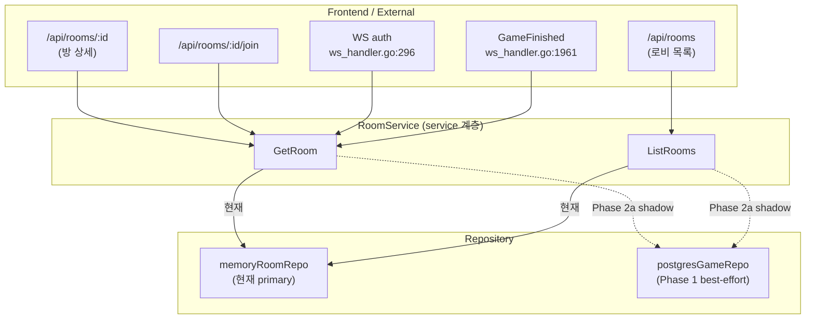
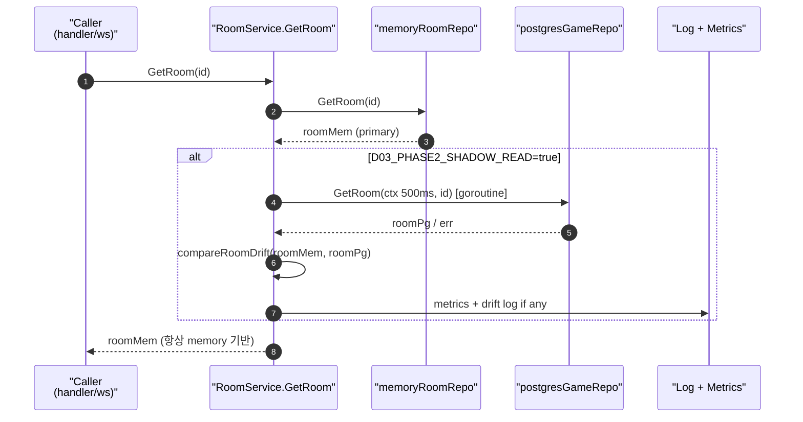
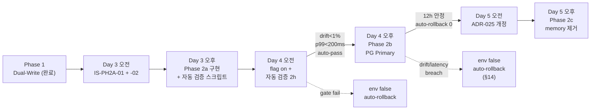
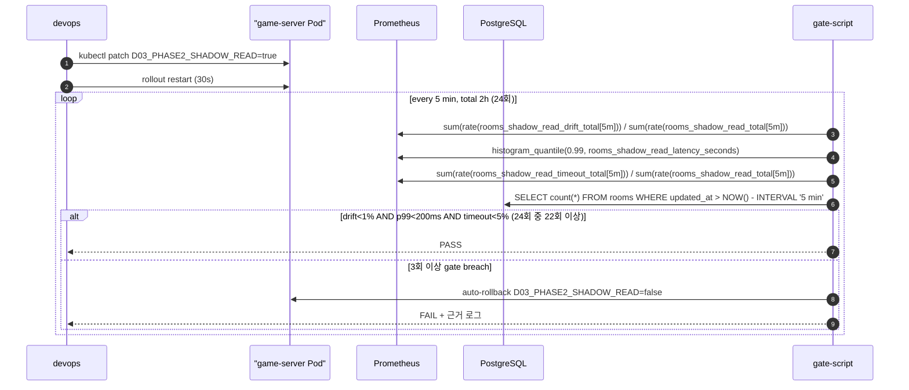
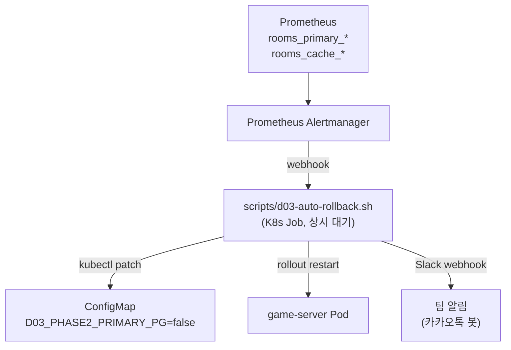

# 50. D-03 Phase 2 — rooms Read-Path Full Cutover 설계 (Phase 2a/2b/2c)

- 작성일: 2026-04-23 (Sprint 7 Day 2)
- 작성자: architect (Opus 4.7 xhigh)
- 상태: **Proposed — Sprint 7 내 전 Phase 완주**
- 연관 PR: #40 (ADR D-03), #42 (Phase 1 Dual-Write 구현), #50 (ADR-025 게스트 방)
- 연관 ADR: ADR D-03 (`work_logs/decisions/2026-04-22-rooms-postgres-phase1.md`), ADR-025 (`docs/02-design/48-adr-025-guest-room-persistence.md`)
- 분류: Persistence · Data Integrity · Read-Path Migration · **HIGH Risk**

---

## 1. Executive Summary

> **이 문서는 D-03 Phase 2 전체(2a/2b/2c) 의 Sprint 7 내 완주 설계**이다. 2026-04-23 사용자 지시로 "Week 2 후반 또는 Sprint 8" 이관 경로는 삭제됐다. Phase 2a Shadow Read 는 **자동화 검증 기반으로 48h 관찰을 축약** 하여, Day 4 오전에 2a 시작 → 자동 게이트 통과 시 Day 4 오후 2b → Day 5 2c 로 진행한다.

### 1.1 왜 HIGH Risk 인가

rooms 조회는 **실시간 게임 진행 경로 그 자체**다. 현재 메모리 정본에서 PostgreSQL 로 **primary read** 를 옮기는 순간:

1. 게임 시작 (`StartGame`), WebSocket 재연결 인증 (`ws_handler.go:296`), LeaveRoom 호스트 인계, FinishRoom 게임 종료 기록(`ws_handler.go:1961`) 이 전부 DB 가용성에 묶인다.
2. PostgreSQL p99 latency 가 Redis + memory repo 대비 **10~100배** 느리다 (측정값 없음, 설치 prepareForPhase2a 단계에서 실측 필수).
3. Phase 1 Dual-Write 는 **best-effort 3초 타임아웃** 이라서 **1주일 누적 드리프트 가능성** 이 실제로 존재한다. Shadow Read 없이 바로 cutover 하면 드리프트된 row 를 primary 로 믿고 잘못된 상태를 브로드캐스트할 수 있다.

### 1.2 Sprint 7 Day 3~5 실행 범위 (전 Phase 완주)

| 항목 | 실행 슬롯 | 담당 |
|---|---|---|
| **선행**: IS-PH2A-01 DeleteRoom dual-write 수정 | Day 3 오전 | go-dev |
| **선행**: IS-PH2A-02 `checkDuplicateRoom` 서비스 경유 리팩터 | Day 3 오전 | go-dev |
| Phase 2a — Shadow Read 구현 + 메트릭 | Day 3 오후 | go-dev + devops |
| Phase 2a Flag on + **자동 검증 스크립트** 실행 | Day 4 오전 (~2h 축약) | devops |
| **Phase 2b — Primary 역전** (read-through cache) | Day 4 오후 | go-dev + devops |
| Phase 2b 안정 게이트 (auto-rollback 준비) | Day 4 저녁 ~ Day 5 오전 (~12h) | devops + qa |
| **Phase 2c — memory rooms 제거** | Day 5 오후 | go-dev |
| ADR-025 개정 (게스트 방 DB 전환 또는 Redis cache 경로) | Day 5 오후 | architect + go-dev |

### 1.3 핵심 원칙

- **Feature flag `D03_PHASE2_SHADOW_READ` 기본값 `false`** — 배포 후 관리자가 명시적으로 on 으로 전환. 기본값 on 금지.
- **Shadow Read 는 관찰 전용** — 반환값은 여전히 memory repo 가 결정한다.
- **Drift 감지 시 로그 + 메트릭만 증가**, 반환값을 바꾸지 않는다.
- **Rollback 은 env 한 줄** — `D03_PHASE2_SHADOW_READ=false` 로 즉시 원복 가능.

---

## 2. Phase 1 현황 및 정합성 점검

### 2.1 Phase 1 실제 상태 (2026-04-23 기준)

| 항목 | 상태 | 근거 |
|------|------|------|
| `pgGameRepo` DI 연결 | ✅ | `main.go:103` `service.NewRoomService(roomRepo, gameStateRepo, pgGameRepo)` |
| CreateRoom dual-write | ✅ | `room_service.go:213` `pgBestEffortCreateRoom` |
| JoinRoom dual-write | ✅ | `room_service.go:294` `pgBestEffortUpdateRoom` |
| LeaveRoom dual-write | ✅ | `room_service.go:357` |
| StartGame dual-write | ✅ | `room_service.go:407` |
| FinishRoom dual-write | ✅ | `room_service.go:451` |
| **DeleteRoom dual-write** | ❌ | **누락** — `room_service.go:413-424` |
| 게스트 방 스킵 (ADR-025) | ✅ | `room_converter.go:16-18` |
| PostgreSQL rooms row 실측 | 2 rows (FINISHED) | `SELECT count(*) FROM rooms` |

> **Gap 발견**: `DeleteRoom` 이 dual-write 누락. 현재는 memory repo 만 삭제하고 PG 는 그대로 남는다. Phase 2a 에서 drift 감지 시 `delete` 된 room 이 PG 에 남아 false-positive 드리프트를 유발한다. **Day 3 구현 전 수정 필요** (별건 Issue 권장).

### 2.2 Dual-Write 정합성 점검 방법

Day 3 구현 **직전** 에 반드시 실행. Phase 2a 시작점의 baseline 을 확보한다.

```sql
-- PG 상태
SELECT status, count(*) FROM rooms GROUP BY status;
SELECT id, room_code, status, updated_at FROM rooms
  WHERE updated_at > NOW() - INTERVAL '48 hours'
  ORDER BY updated_at DESC;
```

```bash
# Memory repo 상태 (개수만 비교 가능 — 내부 구조 덤프 없음)
# game-server Pod 로그에서 최근 24h 내 CreateRoom / UpdateRoom / FinishRoom 호출 횟수 집계
kubectl logs -n rummikub deploy/game-server --since=24h \
  | grep -E "room_service: postgres (create|update) room" \
  | wc -l
```

**허용 기준** (Day 3 GO 조건):
- PG `rooms.count` ≥ 최근 24h 로그의 `CreateRoom` 횟수 (게스트 방 제외)
- best-effort 실패 로그 0 건 또는 < 전체의 1%
- PG updated_at 이 memory 기준 updated_at 대비 ±5 초 이내 (Phase 2a 관찰 시작 시점 기준)

---

## 3. Read Path 매핑

현재 모든 `GetRoom`/`ListRooms` 호출은 memory repo 를 경유한다. Phase 2 대상이 되는 호출 지점은 **6 개**다.



### 3.1 호출 사이트 인벤토리 (6 지점)

| # | 위치 | 호출 | 위험도 | Phase 2a 영향 |
|---|------|------|-------|---------------|
| 1 | `room_handler.go:108` `ListRooms` | `h.roomSvc.ListRooms()` | 중 | shadow 로 latency 관찰 |
| 2 | `room_handler.go:148` `GetRoom` | `h.roomSvc.GetRoom(id)` | 중 | shadow 로 drift 관찰 |
| 3 | `room_handler.go:181` `JoinRoom` (응답용) | `h.roomSvc.GetRoom(roomID)` | 중 | shadow |
| 4 | `ws_handler.go:296` WS auth | `h.roomSvc.GetRoom(conn.roomID)` | **고** | shadow only, **primary 전환 절대 금지** — WS 연결 실패 시 게임 자체 중단 |
| 5 | `ws_handler.go:1961` 게임 종료 기록 | `h.roomSvc.GetRoom(roomID)` | 중 | shadow |
| 6 | `room_service.go:475` `checkDuplicateRoom` (내부) | `s.roomRepo.GetRoom(existingRoomID)` | 중 | Phase 2a 범위 밖 — memory 직접 호출 (서비스 메서드 경유 안 함) |

> **중요**: #6 은 `roomRepo.GetRoom` 직접 호출이라 `RoomService.GetRoom` shadow 로직을 우회한다. Phase 2a 에서는 그대로 두고, Phase 2b 전에 리팩터하여 단일 진입점으로 모은다.

### 3.2 Shadow Read 시퀀스



### 3.3 Drift 비교 대상 필드

`compareRoomDrift` 가 체크할 필드 (Phase 1 에서 PG 에 쓰는 것만):

- `ID`, `RoomCode`, `Name`, `HostID`, `MaxPlayers`, `TurnTimeoutSec`, `Status`, `GameID`

**제외 필드**:
- `Players` — Phase 1 미매핑 (ADR D-03 §"Phase 1 미매핑")
- `CreatedAt`, `UpdatedAt` — 쓰기 시점 차이로 false-positive 대량 발생. drift 전용 gauge (`rooms_drift_updated_at_delta_seconds`) 로 별도 관찰
- `SeatStatus` — Phase 2b 에서 JSONB 컬럼 추가 검토

---

## 4. Phase 2 단계 정의

### 4.1 Phase 2a — Shadow Read (Day 3 구현 · Day 4 오전 flag on)

| 목적 | 증거 수집. PG 실제 응답 시간과 드리프트 빈도를 **staging+production 트래픽** 에서 측정 |
|------|---|
| Primary | memory repo (변경 없음) |
| Shadow | PostgreSQL (500ms timeout, goroutine 병렬 조회) |
| Feature flag | `D03_PHASE2_SHADOW_READ` (default false) |
| 기간 | **최소 2시간** (자동 검증 스크립트 §13 통과 시 조기 종료). 48h 관찰은 **자동화로 축약** |
| 성공 기준 | drift rate < 1%, PG p99 GetRoom < 200ms, shadow read 실패율 < 5% (자동 스크립트가 검증) |

### 4.2 Phase 2b — Primary 역전 (Sprint 7 Day 4 오후)

| 목적 | PostgreSQL 를 primary 로, memory 를 hot cache 로 |
|------|---|
| Primary | PostgreSQL (미스 또는 stale 시) + memory read-through cache |
| Cache TTL | PLAYING 방 24h, WAITING 방 1h |
| Feature flag | `D03_PHASE2_PRIMARY_PG` (default false, 2a 자동 게이트 통과 시 ArgoCD 에서 on) |
| 롤백 | env false → 메모리 primary 즉시 복구 (memory 는 dual-write 유지) + **auto-rollback 트리거** (§14) |
| 선행 조건 | Phase 2a 자동 검증 통과 + DeleteRoom dual-write 수정 (IS-PH2A-01) + `checkDuplicateRoom` 리팩터 (IS-PH2A-02) |

### 4.3 Phase 2c — Redis/memory rooms 제거 (Sprint 7 Day 5 오후)

| 목적 | memory rooms map 완전 제거. cache 는 Redis 로 통합 |
|------|---|
| 선행 조건 | Phase 2b 12h 이상 안정 (auto-rollback 0회) + ADR-025 개정 PR 병행 (§15) |
| 주의 | ADR-025 는 Phase 2c 실행 직전 반드시 개정 머지. memory 제거 시 게스트 방 `ListRooms` 대응 경로 확정 필요 |

### 4.4 단계 간 의존관계 (Sprint 7 Day 3~5 압축 경로)



---

## 5. Feature Flag & Config 설계

### 5.1 제안 변수

| 변수 | Phase | 기본값 | 역할 |
|------|-------|-------|------|
| `D03_PHASE2_SHADOW_READ` | 2a | `false` | Shadow read on/off |
| `D03_PHASE2_SHADOW_TIMEOUT_MS` | 2a | `500` | PG shadow GetRoom timeout |
| `D03_PHASE2_SHADOW_SAMPLE_RATE` | 2a | `1.0` | 0.0~1.0, 부하 조절용 (기본 전수) |
| `D03_PHASE2_PRIMARY_PG` | 2b | `false` | Day 4 오후 ArgoCD 에서 on 으로 전환 |
| `D03_PHASE2_CACHE_TTL_PLAYING_SEC` | 2b | `86400` | PLAYING 방 memory/Redis cache TTL |
| `D03_PHASE2_CACHE_TTL_WAITING_SEC` | 2b | `3600` | WAITING 방 cache TTL |
| `D03_PHASE2_AUTO_ROLLBACK_DRIFT_PCT` | 2b | `5` | drift 비율 ≥5% 10분 지속 시 auto-rollback |
| `D03_PHASE2_AUTO_ROLLBACK_P99_MS` | 2b | `500` | `GetRoom` p99 ≥500ms 5분 지속 시 auto-rollback |
| `D03_PHASE2_MEMORY_OFF` | 2c | `false` | memory rooms map 완전 제거. 켜진 후에는 Phase 2b 롤백 불가 |

### 5.2 ConfigMap 패치 (Day 3 ~ Day 5)

```yaml
# helm/charts/game-server/values.yaml (Day 3 배포, Day 4~5 단계별 patch)
config:
  # Day 3 배포 시 추가 (모두 false)
  D03_PHASE2_SHADOW_READ: "false"
  D03_PHASE2_SHADOW_TIMEOUT_MS: "500"
  D03_PHASE2_SHADOW_SAMPLE_RATE: "1.0"
  # Day 4 오후 PR 에 추가 (default false)
  D03_PHASE2_PRIMARY_PG: "false"
  D03_PHASE2_CACHE_TTL_PLAYING_SEC: "86400"
  D03_PHASE2_CACHE_TTL_WAITING_SEC: "3600"
  D03_PHASE2_AUTO_ROLLBACK_DRIFT_PCT: "5"
  D03_PHASE2_AUTO_ROLLBACK_P99_MS: "500"
  # Day 5 PR 에 추가 (default false)
  D03_PHASE2_MEMORY_OFF: "false"
```

> 배포 직후 flag 는 모두 `false` 상태. 실제 활성화 시점:
>
> | 시점 | 전환 | 명령 |
> |------|------|------|
> | Day 4 오전 | `D03_PHASE2_SHADOW_READ=true` | `kubectl patch configmap game-server-config -n rummikub --type merge -p '{"data":{"D03_PHASE2_SHADOW_READ":"true"}}'` + rollout restart |
> | Day 4 오후 (자동 검증 PASS 후) | `D03_PHASE2_PRIMARY_PG=true` | 동일 패턴 |
> | Day 5 오후 (12h 안정 + ADR-025 개정 머지 후) | `D03_PHASE2_MEMORY_OFF=true` | 동일 패턴. **이 전환 이후 Phase 2b 롤백 경로 소실됨** → §14.4 no-return gate 체크리스트 필수 |

### 5.3 main.go 주입 패턴 (제안 — 구현은 go-dev)

```go
// cmd/server/main.go (pseudocode)
phase2Cfg := service.Phase2ShadowConfig{
    Enabled:      os.Getenv("D03_PHASE2_SHADOW_READ") == "true",
    TimeoutMs:    envInt("D03_PHASE2_SHADOW_TIMEOUT_MS", 500),
    SampleRate:   envFloat("D03_PHASE2_SHADOW_SAMPLE_RATE", 1.0),
}
roomSvc := service.NewRoomService(roomRepo, gameStateRepo, pgGameRepo,
    service.WithShadowRead(phase2Cfg))
```

**주의**: 기존 `NewRoomService` 3-arg 시그니처를 깨지 않도록 `WithShadowRead` 는 **functional option** 으로 설계. 기존 테스트 17 건이 nil 패턴을 그대로 사용 가능.

---

## 6. 메트릭 & 로그 설계

### 6.1 Prometheus 메트릭 (신규)

| 메트릭 | 타입 | 라벨 | 용도 |
|--------|------|------|------|
| `rooms_shadow_read_total` | counter | `op` (get/list), `result` (match/drift/error/miss) | shadow read 횟수 |
| `rooms_shadow_read_drift_total` | counter | `field` (status/game_id/...) | 필드별 drift 빈도 |
| `rooms_shadow_read_latency_seconds` | histogram | `op` | PG p50/p95/p99 실측 |
| `rooms_shadow_read_timeout_total` | counter | `op` | 500ms 타임아웃 초과 횟수 |
| `rooms_shadow_updated_at_delta_seconds` | histogram | — | memory vs PG updated_at 차이 분포 |

### 6.2 로그 패턴

```
[WARN] rooms_phase2a: drift detected roomID=<id> field=status mem=PLAYING pg=WAITING
[INFO] rooms_phase2a: shadow read ok roomID=<id> op=get latency_ms=42
[ERROR] rooms_phase2a: shadow read timeout roomID=<id> op=get timeout_ms=500
```

`WARN` 은 SampleRate=1.0 에서 초당 수 건을 넘으면 로그 폭주. **drift 감지 시 roomID 별 1분 dedupe** 권장 (sync.Map + 1min TTL).

### 6.3 대시보드 (Grafana 제안 — Sprint 7 Week 2 추가)

- Panel 1: `rate(rooms_shadow_read_drift_total[5m])` — 드리프트 시간당 추이
- Panel 2: `histogram_quantile(0.99, rooms_shadow_read_latency_seconds)` — PG p99
- Panel 3: `rate(rooms_shadow_read_timeout_total[5m])` — 타임아웃 추이
- Alert: drift rate > 5/min 지속 10분 시 Slack 알림

---

## 7. Rollback 절차

### 7.1 Shadow Read 전면 해제 (즉시)

```bash
kubectl patch configmap game-server-config -n rummikub \
  --type merge -p '{"data":{"D03_PHASE2_SHADOW_READ":"false"}}'
kubectl rollout restart deploy/game-server -n rummikub
```

소요: ~30 초 (rollout 포함). Shadow 는 primary 결과에 영향 주지 않으므로 사용자 영향 **없음**.

### 7.2 PG 이상 탐지 시

- PG latency 급증 / timeout 폭증 시 flag 전환 전 `D03_PHASE2_SHADOW_READ=false` 로 관찰 중단
- Phase 2b 진입 전까지는 primary 에 영향 없으므로 **hot-fix 필요 없음**

### 7.3 Phase 2b (장래) 롤백

- `D03_PHASE2_PRIMARY_PG=false` 로 env 변경 → memory primary 복구
- memory 는 여전히 dual-write 로 최신 유지되므로 cutover 직전 상태로 복귀
- **전제**: Phase 2b 도입 시 memory 가 dual-write 로 계속 유지돼야 함. 이것이 Phase 2b 설계의 안전장치.

---

## 8. Day 3 (2026-04-24) 실행 범위 & 검증 게이트

### 8.1 범위 (Phase 2a 한정)

| 항목 | 담당 | 예상 LOC | 예상 시간 |
|------|------|---------|----------|
| `Phase2ShadowConfig` 구조체 + functional option | go-dev | +40 | 0.5h |
| `RoomService.GetRoom` shadow 로직 (+ goroutine + timeout) | go-dev | +60 | 1.0h |
| `RoomService.ListRooms` shadow (ID 집합 교차 비교) | go-dev | +70 | 1.0h |
| `compareRoomDrift` 헬퍼 + drift dedupe | go-dev | +50 | 1.0h |
| Prometheus 메트릭 정의 + 등록 | go-dev | +30 | 0.5h |
| Unit test (drift/timeout/sample rate 5~7 건) | go-dev | +120 | 1.5h |
| `main.go` env 주입 | go-dev | +15 | 0.25h |
| Helm values + ConfigMap patch | devops | +10 | 0.25h |
| K8s smoke: rollout + flag off 확인 | devops | — | 0.5h |
| `DeleteRoom` dual-write 갭 수정 (선행) | go-dev | +20 | 0.5h |
| 회귀 테스트 (Go 530 + Playwright 핵심) | qa | — | 0.5h |
| **합계** | **go-dev + devops + qa** | **~415 LOC** | **~7.5h (병렬 시 ~4h)** |

### 8.2 병렬성

```mermaid
gantt
    title Day 3 Phase 2a 작업 병렬화
    dateFormat HH:mm
    axisFormat %H:%M
    section go-dev
    DeleteRoom gap 수정      :a1, 09:00, 30m
    Shadow 로직 + option     :a2, after a1, 2h
    Drift + metrics         :a3, after a2, 1.5h
    Unit tests              :a4, after a3, 1.5h
    section devops
    Helm values              :b1, 09:00, 15m
    ConfigMap patch 준비     :b2, after b1, 15m
    Build + rollout 대기     :b3, after a4, 30m
    K8s smoke                :b4, after b3, 30m
    section qa
    회귀 스윕 검증 준비      :c1, 09:00, 30m
    rollout 후 회귀 실행     :c2, after b3, 30m
```



### 8.3 검증 게이트 (Day 3 GO/NO-GO)

**GO 조건** (모두 충족):
1. Go unit test: `go test ./... -count=1 -timeout 90s` 기존 530 + 신규 5~7 전부 PASS
2. Phase 1 정합성 baseline 확보: §2.2 쿼리 결과가 허용 기준 안
3. K8s rollout 후 `D03_PHASE2_SHADOW_READ=false` 상태에서 **기존 동작 100% 유지** (회귀 0건)
4. flag `true` 로 토글 후 10분 내 drift WARN 로그 0 건 또는 기대 수준
5. PG shadow read p99 latency < 500ms (timeout 내)

**NO-GO 조건** (하나라도 해당):
- Phase 1 drift baseline 이 5% 초과 → Phase 2a 전 Phase 1 수리 필요
- `DeleteRoom` gap 수정 후 회귀 테스트에서 LeaveRoom 등 연관 기능 깨짐
- PG shadow read 평균 latency > 300ms (인프라 상 Phase 2b 무리)

---

## 9. Phase 2b / 2c 전제 조건 (Sprint 7 Day 4~5)

### 9.1 Phase 2b 전제 조건 체크리스트 (Day 4 오후 진입 직전)

- [ ] Phase 2a **자동 검증 스크립트** (§13) 통과 (drift<1%, p99<200ms, 실패율<5%)
- [ ] PG p99 GetRoom < 200ms, p99 ListRooms < 400ms (staging 측정)
- [ ] IS-PH2A-01 DeleteRoom dual-write 머지 완료 (Day 3 오전)
- [ ] IS-PH2A-02 `checkDuplicateRoom` 리팩터 머지 완료 (Day 3 오전)
- [ ] **auto-rollback 트리거** (§14) 구현 + dry-run 검증 1회 (Day 4 점심 전)
- [ ] memory 는 dual-write 유지 (cutover 후에도 폴백 경로로 남김)

### 9.2 Phase 2c 전제 조건 (Day 5 오후 진입 직전)

- [ ] Phase 2b **12시간 이상** 안정 (auto-rollback 0회)
- [ ] Phase 2b 기간 내 drift 평균 < 0.5%, p99 GetRoom < 300ms
- [ ] **ADR-025 개정 PR** 머지 완료 (§15) — 게스트 방 경로 명확화
- [ ] 게스트 방 `ListRooms` 회귀 테스트 실패 0건 (Playwright + Go unit)
- [ ] memory off 이후 **롤백 경로 소실** 에 대한 사용자 명시 승인

### 9.3 파생 이슈 (Day 3~5 순차)

| ID | 제목 | 우선순위 | 실행 슬롯 |
|-----|------|----------|----------|
| IS-PH2A-01 | DeleteRoom dual-write 누락 수정 | P1 | Day 3 오전 (Phase 2a 착수 전 선행) |
| IS-PH2A-02 | `checkDuplicateRoom` → 서비스 메서드 경유 리팩터 | P1 | Day 3 오전 (Phase 2b 선행 필수) |
| IS-PH2A-03 | Grafana 대시보드 `rooms_shadow_*` + `rooms_primary_*` 패널 | P2 | Day 4 오전 |
| IS-PH2A-04 | memory repo `UpdatedAt` 갱신 정책 정렬 | P2 | Day 4 오전 |
| IS-PH2A-05 | auto-rollback 트리거 스크립트 (§14) | P1 | Day 4 점심 전 |
| IS-PH2A-06 | ADR-025 개정 (게스트 방 Phase 2c 경로) | P1 | Day 5 오전 (Phase 2c 선행 필수) |

---

## 10. Risk Budget

| Risk | 확률 | 영향 | 완화 전략 | 잔여 위험 |
|------|------|------|----------|----------|
| R1. PG shadow query 가 primary 성능 영향 | 중 | 중 | `goroutine + 500ms timeout + sample rate`. flag off 시 영향 제로 | 낮음 |
| R2. drift 로그 폭주 → Pod OOM | 중 | 중 | roomID 별 1분 dedupe, SampleRate 하향 가능 (1.0 → 0.1) | 낮음 |
| R3. Phase 1 drift baseline 높음 → Phase 2a 자체 오염 | 낮~중 | 고 | §2.2 baseline 쿼리로 Day 3 전 확인, 5% 초과 시 **NO-GO** | 중 (데이터 의존) |
| R4. DeleteRoom gap 이 Phase 2a 드리프트 false-positive 유발 | 높 | 중 | Day 3 첫 작업으로 gap 수정 (IS-PH2A-01) | 낮음 |
| R5. WS auth 경로(ws_handler.go:296) 가 shadow 부하로 간헐 slowdown | 낮 | 고 | WS auth 경로는 shadow SampleRate 0.1 적용 (별도 호출 지점 추적) | 낮음 |
| R6. Phase 2b 로 조급히 넘어가서 primary 전환 → 장애 | 중 | **치명** | **Day 3 에는 2a 만**. 2b 진입은 Week 2 후반 별도 PR + tabletop | 낮음 |
| R7. ADR-025 게스트 방 경로가 shadow 에서 drift 로 오탐 | 높 | 낮 | `compareRoomDrift` 가 `HostID UUID 유효성` 선검사, 게스트 방은 drift 판정 제외 | 낮음 |
| R8. Phase 2c memory 제거 시 게스트 방 ListRooms 회귀 | 중 | 고 | **본 문서 §9.2** Phase 2c 전 ADR-025 개정 필수 | 낮음 (Sprint 8 이슈) |

### 10.1 종합 위험도: **MEDIUM-HIGH** → Phase 2a 에 한정하면 **MEDIUM-LOW**

Phase 2a 만 실행하면 primary 가 바뀌지 않으므로 최악의 경우에도 flag off 로 30초 내 원복. **Day 3 실행 범위를 Phase 2a 로 제한하는 조건 하에 GO** 권장.

---

## 11. Sprint 7 Day 3~5 최종 권고

| 항목 | 권고 |
|------|------|
| Day 3 오전 선행 수정 (IS-PH2A-01/-02) | **GO** |
| Day 3 오후 Phase 2a 구현 + 자동 검증 스크립트 (§13) | **GO** |
| Day 4 오전 Phase 2a flag on + 자동 검증 2h | **GO** (PASS 시 Day 4 오후 진행) |
| Day 4 오후 Phase 2b Primary 역전 | **GO** (auto-rollback §14 선제 배치 필수) |
| Day 5 오전 ADR-025 개정 (IS-PH2A-06) | **GO** |
| Day 5 오후 Phase 2c memory 제거 | **GO** (2b 12h 안정 게이트 통과 조건) |
| Feature flag 기본값 | 모든 Phase flag `false` 배포 → 단계별 수동/자동 patch |
| 자동 검증 축약 | **48h → 2h Phase 2a, 12h Phase 2b** (자동 스크립트 통과 시 조기 전진) |
| No-return gate | `D03_PHASE2_MEMORY_OFF=true` 전환 전 §14.4 체크리스트 필수 |

---

## 12. 참조

- `docs/02-design/48-adr-025-guest-room-persistence.md` — 게스트 방 영속 배제 (Phase 2a compareRoomDrift 에서 선검사)
- `work_logs/decisions/2026-04-22-rooms-postgres-phase1.md` — Phase 1 원본 ADR
- `src/game-server/internal/service/room_service.go` — Phase 2a 구현 진입점 (532행, GetRoom 224행, ListRooms 233행)
- `src/game-server/internal/service/room_converter.go` — 정합성 비교에서 재사용
- `src/game-server/internal/repository/postgres_repo.go` — `GetRoom`/`ListRooms` 이미 구현 완료 (80/95 행)
- PR #40 (ADR), PR #42 (Phase 1 구현)

---

## 13. 자동 검증 스크립트 설계 (48h → 2h/12h 축약 근거)

### 13.1 목적

"48h 관찰 → 사람 판단" 패턴을 **자동화된 수치 게이트** 로 대체. Sprint 7 내 전 Phase 완주를 위한 시간 축약 도구. 사람은 **스크립트 PASS/FAIL** 만 확인.

### 13.2 실행 주체

| 스크립트 | 위치 (제안) | 실행 슬롯 | 실행자 |
|---------|-------------|----------|-------|
| `scripts/d03-phase2a-gate.sh` | 신규 | Day 4 오전, Phase 2a flag on 후 2h | devops |
| `scripts/d03-phase2b-gate.sh` | 신규 | Day 4 저녁 + Day 5 오전 (12h 중 4회) | devops |
| `scripts/d03-phase2c-precheck.sh` | 신규 | Day 5 오후 Phase 2c 직전 | devops + architect |

### 13.3 Phase 2a gate 스크립트 동작



### 13.4 수치 게이트 (Production 기준 강화)

| 메트릭 | Phase 2a 기준 | Phase 2b 기준 | 측정 창 | breach 정의 |
|--------|--------------|--------------|--------|------------|
| drift rate | < 1% | < 0.5% | 5분 이동평균 | 연속 3 window 초과 |
| PG p99 GetRoom | < 200ms | < 300ms | 5분 이동평균 | 연속 3 window 초과 |
| shadow/primary 실패율 | < 5% | < 1% | 5분 이동평균 | 연속 2 window 초과 |
| WS auth 경로 실패 증가율 | < 0.1% 증가 | < 0.1% 증가 | 10분 이동평균 | 1 window 초과 즉시 breach |
| Redis 가용성 | 변경 없음 | 변경 없음 | - | Pod `rummikub-redis` Ready=1 |

> 기존 1.0 버전의 `drift rate < 1%` 는 Phase 2a 기준으로만 적용. Phase 2b 는 **primary 가 PG** 이므로 drift 가 곧 **데이터 일관성 파괴** 이기 때문에 0.5% 로 하향.

### 13.5 스크립트 pseudocode (Phase 2a)

```bash
#!/bin/bash
# scripts/d03-phase2a-gate.sh
set -euo pipefail
NAMESPACE=rummikub
PROM_URL=http://prometheus.monitoring:9090
DURATION_MIN=120
WINDOW_MIN=5
BREACH_MAX=3
breaches=0

for ((i=0; i<DURATION_MIN/WINDOW_MIN; i++)); do
  drift=$(curl -sG "$PROM_URL/api/v1/query" \
    --data-urlencode 'query=sum(rate(rooms_shadow_read_drift_total[5m])) / sum(rate(rooms_shadow_read_total[5m]))' \
    | jq -r '.data.result[0].value[1] // "0"')
  p99=$(curl -sG "$PROM_URL/api/v1/query" \
    --data-urlencode 'query=histogram_quantile(0.99, sum(rate(rooms_shadow_read_latency_seconds_bucket[5m])) by (le))' \
    | jq -r '.data.result[0].value[1] // "0"')
  fail=$(curl -sG "$PROM_URL/api/v1/query" \
    --data-urlencode 'query=sum(rate(rooms_shadow_read_timeout_total[5m])) / sum(rate(rooms_shadow_read_total[5m]))' \
    | jq -r '.data.result[0].value[1] // "0"')

  if awk "BEGIN{exit !($drift >= 0.01 || $p99 >= 0.200 || $fail >= 0.05)}"; then
    breaches=$((breaches+1))
    echo "[WINDOW $i] BREACH drift=$drift p99=$p99 fail=$fail (breaches=$breaches)"
    if [ "$breaches" -ge "$BREACH_MAX" ]; then
      echo "FAIL — auto-rollback"
      kubectl patch configmap game-server-config -n "$NAMESPACE" \
        --type merge -p '{"data":{"D03_PHASE2_SHADOW_READ":"false"}}'
      kubectl rollout restart deploy/game-server -n "$NAMESPACE"
      exit 1
    fi
  else
    breaches=0
  fi
  sleep $((WINDOW_MIN*60))
done
echo "PASS"
```

### 13.6 Phase 2b gate 스크립트 차이점

| 항목 | 2a | 2b |
|------|----|----|
| 측정 대상 | `rooms_shadow_*` | `rooms_primary_*` (신규 메트릭) + `cache_hit_ratio` |
| 기준 강화 | drift<1%, p99<200ms | drift<0.5%, p99<300ms, cache hit>80% |
| 기간 | 2h | 12h |
| breach 시 | `D03_PHASE2_SHADOW_READ=false` | `D03_PHASE2_PRIMARY_PG=false` (§14 auto-rollback) |

---

## 14. Auto-rollback 트리거 설계 (Phase 2b 전용)

### 14.1 왜 Phase 2b 에만 auto-rollback?

- Phase 2a: primary 가 memory 이므로 shadow read 이상은 사용자 영향 없음. 사람 판단으로 충분.
- **Phase 2b**: primary 가 PG. PG 장애/지연이 곧 **게임 중단**. 사람이 수동 대응 전까지 수분~수십분 게임 불가 가능성 → 자동화 필수.
- Phase 2c: primary 가 PG + cache. 구조는 2b 와 동일하되 memory 폴백이 사라져 위험 증가. `memory_off=true` 이전 단계(`2b`)에서 **auto-rollback 이 실증** 돼야 진입.

### 14.2 Auto-rollback 컴포넌트



### 14.3 트리거 조건 (AND 로 묶지 말고 OR)

| 조건 | 임계값 | 창 | 액션 |
|------|-------|----|------|
| drift rate ≥ 5% | PromQL `rate(rooms_primary_drift_total[5m]) / rate(rooms_primary_read_total[5m])` | 10분 지속 | auto-rollback |
| PG `GetRoom` p99 ≥ 500ms | `histogram_quantile(0.99, rooms_primary_latency_seconds_bucket)` | 5분 지속 | auto-rollback |
| PG connection error rate ≥ 1% | `rate(rooms_primary_db_error_total[1m])` | 3분 지속 | auto-rollback |
| WS auth 실패 증가율 ≥ 1%p | `rate(ws_auth_fail_total[5m])` - baseline | 5분 지속 | auto-rollback |
| 관리자 수동 트리거 | `kubectl annotate deploy/game-server rollback=true` | 즉시 | auto-rollback |

### 14.4 No-return gate 체크리스트 (`D03_PHASE2_MEMORY_OFF=true` 전)

memory 제거는 **Phase 2b 롤백 경로를 영구히 차단** 한다. 전환 직전 반드시 확인:

- [ ] Phase 2b 가 **12시간 이상** 안정 (auto-rollback 0회)
- [ ] Phase 2b 기간 중 auto-rollback 트리거 1회 이상 **dry-run** (test drift 주입으로 정상 발동 확인)
- [ ] PG backup 최신 (24h 이내)
- [ ] PG HA (읽기 레플리카 최소 1대) Ready
- [ ] ADR-025 개정 PR 머지 (§15)
- [ ] 게스트 방 `ListRooms` 응답이 memory 없이도 정상 (Go unit + Playwright PASS)
- [ ] 사용자 (애벌레) 명시적 승인 — No-return 임을 공유

### 14.5 Auto-rollback script pseudocode

```bash
#!/bin/bash
# scripts/d03-auto-rollback.sh (alertmanager webhook 대응)
set -euo pipefail
REASON="$1"  # drift / latency / db_error / ws_auth / manual
NAMESPACE=rummikub
echo "[$(date -Is)] AUTO-ROLLBACK triggered reason=$REASON"
kubectl patch configmap game-server-config -n "$NAMESPACE" \
  --type merge -p '{"data":{"D03_PHASE2_PRIMARY_PG":"false"}}'
kubectl rollout restart deploy/game-server -n "$NAMESPACE"
kubectl rollout status deploy/game-server -n "$NAMESPACE" --timeout=120s
# Slack/카카오톡 알림 (KAKAO_WEBHOOK 환경변수)
curl -sS -X POST "$KAKAO_WEBHOOK" \
  -H 'Content-Type: application/json' \
  -d "{\"text\":\"D-03 Phase 2b auto-rollback: reason=$REASON\"}"
```

### 14.6 검증 방법 (dry-run)

Day 4 오후 Phase 2b 진입 **직후 1시간 이내** 에 auto-rollback 을 1회 dry-run 실행 (테스트용 drift 수동 주입):

```bash
# staging 환경에서
kubectl exec -n rummikub deploy/game-server -- \
  curl -X POST localhost:8080/internal/test/inject-drift
# 5분 대기 → Prometheus 알림 발생 → auto-rollback 실행 확인
# 완료 후 primary_pg=true 복원
```

> 이 endpoint (`/internal/test/inject-drift`) 는 production 빌드에서 `INTERNAL_TEST_ENDPOINTS=false` 로 기본 차단. staging 에서만 활성.

---

## 15. IS-PH2A-01 DeleteRoom dual-write 선수정 상세 diff 초안

### 15.1 현재 코드 (`src/game-server/internal/service/room_service.go:412-424`)

```go
// DeleteRoom 방을 삭제한다. 호스트만 삭제 가능하다.
func (s *roomService) DeleteRoom(roomID, hostUserID string) error {
    room, err := s.roomRepo.GetRoom(roomID)
    if err != nil {
        return &ServiceError{Code: "NOT_FOUND", Message: errMsgRoomNotFound, Status: 404}
    }

    if room.HostID != hostUserID {
        return &ServiceError{Code: "FORBIDDEN", Message: "방장만 방을 삭제할 수 있습니다.", Status: 403}
    }

    return s.roomRepo.DeleteRoom(roomID)
}
```

### 15.2 수정 후 (예상 diff — go-dev 구현 참조)

```go
// DeleteRoom 방을 삭제한다. 호스트만 삭제 가능하다.
// Phase 1 Dual-Write: PostgreSQL 에도 CANCELLED 상태로 기록한 뒤 memory 에서 삭제.
// 게스트 방은 PG 미기록이므로 roomStateToModel nil 반환 경로에서 조용히 건너뛴다.
func (s *roomService) DeleteRoom(roomID, hostUserID string) error {
    room, err := s.roomRepo.GetRoom(roomID)
    if err != nil {
        return &ServiceError{Code: "NOT_FOUND", Message: errMsgRoomNotFound, Status: 404}
    }

    if room.HostID != hostUserID {
        return &ServiceError{Code: "FORBIDDEN", Message: "방장만 방을 삭제할 수 있습니다.", Status: 403}
    }

    // Phase 1 Dual-Write: 삭제 전에 PG 상태를 CANCELLED 로 마킹 (soft-delete)
    // hard DELETE 는 별건. Phase 2b 이후 game_results FK 관계를 별도 ADR 에서 재검토
    room.Status = model.RoomStatusCancelled
    room.UpdatedAt = time.Now().UTC()
    s.pgBestEffortUpdateRoom(room)

    return s.roomRepo.DeleteRoom(roomID)
}
```

### 15.3 왜 soft-delete (CANCELLED) 인가

| 옵션 | 장단 | 선택 |
|------|------|------|
| A. PG 에서 hard DELETE | game_results 와 FK 깨질 위험. Phase 1 은 best-effort 라서 FK 관계 아직 확정 아님 | ❌ |
| B. PG 를 CANCELLED 로 soft-delete | 감사 추적 가능. Phase 2a drift 감지 시 false-positive 제거 | ✅ |
| C. PG 건드리지 않음 | 현재 상태 유지. Phase 2a shadow read drift 폭주 | ❌ |

### 15.4 회귀 테스트 (기존 테스트 영향)

| 테스트 | 영향 | 조치 |
|--------|------|------|
| `room_service_test.go` DeleteRoom 케이스 | PG mock 호출 추가 검증 | mock expectation +1 |
| `room_service_test.go` 호스트 아님 케이스 | 변화 없음 | - |
| `e2e/rooms_persistence_test.go` | soft-delete 관찰 가능성 추가 | CANCELLED row 1건 assertion 추가 |
| `handler_test.go` | 영향 없음 | - |

예상 테스트 증감: +5~7 assertions, 신규 테스트 0건.

### 15.5 Day 3 오전 실행 순서

1. go-dev: 위 diff 적용 (+ `roomStateToModel` 에서 CANCELLED 가 정상 처리되는지 확인)
2. go-dev: Go unit test (`go test ./internal/service/... -count=1`)
3. go-dev: e2e persistence test (`go test ./e2e/... -count=1 -timeout 90s`)
4. devops: staging 배포 smoke
5. qa: LeaveRoom → DeleteRoom (호스트 인계 포함) 시나리오 smoke

---

## 16. ADR-025 개정 경로 (Phase 2c 선행 필수)

### 16.1 기존 ADR-025 입장

`docs/02-design/48-adr-025-guest-room-persistence.md` 요약:
- 게스트 방 = PG 영속 배제, memory only
- admin rooms UI 는 "DB + memory 머지" 로 표시

### 16.2 Phase 2c 에서의 충돌

memory 가 완전히 제거되면 게스트 방은 **어디에도 없다**. `ListRooms` 호출 시:
- 게스트 인증자 본인의 방만 확인 가능해야 하는 요구 사항 존재 (admin 은 전체)
- Redis cache 도 Phase 2c 에서는 PG 의 cache 이므로 PG 에 없는 게스트 방은 표현 불가

### 16.3 개정안 3 옵션

| 옵션 | 설명 | 장 | 단 | 권장 |
|------|------|----|----|------|
| A. 게스트 방도 PG 영속 (ADR-025 뒤집기) | 게스트 UUID + partial profile row 생성 | 구조 단순 | ADR-025 초기 결정 번복, 게스트 테이블 스키마 추가 | ⭐ |
| B. Redis 에 게스트 방 전용 namespace | 게스트 방만 Redis, 인증자는 PG | 기존 ADR-025 유지 | cache/primary 구분 복잡, 조회 로직 분기 | - |
| C. 게스트 방 자체 지원 중단 | 모든 방은 인증자 전용 | 가장 단순 | UX 후퇴, 게스트 스모크 플로우 깨짐 | - |

### 16.4 권장 — 옵션 A

- ADR-025 는 "게스트 방 PG 배제" → "**게스트 방은 PG 에 `is_guest=true` 플래그 컬럼과 함께 영속**" 으로 개정
- `users` 테이블에 게스트용 partial row (email NULL 허용) 허용 또는 `guest_users` 별도 테이블 설계
- Phase 2c 진입 직전 (Day 5 오전) 마이그레이션 + ADR 동시 머지

### 16.5 Day 5 오전 실행 순서

1. architect: ADR-025 개정 PR (options 재검토 + 옵션 A 확정)
2. go-dev: PG 마이그레이션 `add_is_guest_column.sql` 작성
3. go-dev: `roomStateToModel` 가 게스트 방을 **nil 반환 대신** `is_guest=true` 로 기록하도록 수정
4. devops: staging 적용 → Playwright 게스트 플로우 PASS 확인
5. architect + go-dev: Phase 2c flag on

---

## 17. Sprint 7 Day 3~5 실행 타임라인 (압축)

```mermaid
gantt
    title D-03 Phase 2 Sprint 7 압축 실행
    dateFormat HH:mm
    axisFormat %H:%M
    section Day 3 (2026-04-24)
    IS-PH2A-01 DeleteRoom     :a1, 09:00, 30m
    IS-PH2A-02 checkDup 리팩터 :a2, after a1, 30m
    Phase 2a 구현             :a3, after a2, 4h
    Phase 2a 단위테스트       :a4, after a3, 1.5h
    Day 3 마감 PR             :a5, after a4, 1h
    section Day 4 (2026-04-25)
    Phase 2a flag on          :b1, 09:00, 15m
    자동검증 스크립트 2h      :b2, after b1, 2h
    auto-rollback dry-run     :b3, after b2, 30m
    Phase 2b 구현             :b4, after b3, 3h
    Phase 2b flag on          :b5, after b4, 15m
    Day 4 저녁 안정 관찰      :b6, after b5, 4h
    section Day 5 (2026-04-26)
    Phase 2b 안정 게이트       :c1, 08:00, 2h
    ADR-025 개정 + 마이그      :c2, after c1, 2h
    Phase 2c 구현              :c3, after c2, 2h
    Phase 2c flag on           :c4, after c3, 15m
    Sprint 7 마감              :c5, after c4, 1h
```



---

## 18. 종합 Risk (업데이트)

기존 §10 R1~R8 에 추가:

| Risk | 확률 | 영향 | 완화 | 잔여 |
|------|------|------|------|------|
| R9. 48h → 2h/12h 축약으로 증거 부족 | 중 | 고 | 자동 검증 게이트가 **기존 48h 사람 판단보다 엄격한 수치 기준** (§13.4). 실측 트래픽이 부족하면 gate 가 자동으로 PASS 보류 | 중 |
| R10. auto-rollback 오탐 → 불필요 재시작 | 중 | 중 | 5분/3분 지속 창으로 순간 스파이크 제외. dry-run 으로 오탐율 선검증 | 낮 |
| R11. ADR-025 개정이 Day 5 오전에 미완 | 중 | 고 | Day 5 오전 2h 블록. 실패 시 Phase 2c **HOLD** → Phase 2b 유지로 Sprint 7 마감 | 낮 |
| R12. `MEMORY_OFF=true` 이후 PG 장애 | 낮 | **치명** | Phase 2c 진입 no-return gate (§14.4) + PG HA 레플리카 Ready 필수 | 중 |
| R13. 게스트 방 PG 영속 전환 (ADR-025 옵션 A) 가 users 테이블 FK 깨짐 | 중 | 고 | `guest_users` 별도 테이블 또는 `users.email` nullable 마이그레이션. Day 5 오전 DB review | 낮 |

### 18.1 종합 위험도 재평가

Phase 2a 만: **MEDIUM-LOW** (1.0 버전과 동일)
Phase 2b 포함: **MEDIUM** (auto-rollback 으로 완화)
Phase 2c 포함 (전 Phase 완주): **MEDIUM-HIGH** — `MEMORY_OFF` no-return 특성 때문. 단 §14.4 게이트 + §15/§16 선행 조건으로 완화하면 **MEDIUM**.

---

> **문서 이력**
>
> | 버전 | 날짜 | 작성자 | 내용 |
> |------|------|--------|------|
> | 1.0 | 2026-04-23 | architect (Opus 4.7 xhigh) | 초안 — Phase 2a Shadow Read 한정 설계, Day 3 실행 범위 + Phase 2b/2c 로드맵 |
> | 2.0 | 2026-04-23 | architect (Opus 4.7 xhigh) | **Sprint 7 내 전 Phase 완주 확장**. 48h 관찰 → 자동 검증 게이트 축약 (§13). Phase 2b auto-rollback 트리거 (§14). IS-PH2A-01 diff 초안 (§15). ADR-025 개정 경로 (§16). Day 3~5 압축 타임라인 (§17) |
