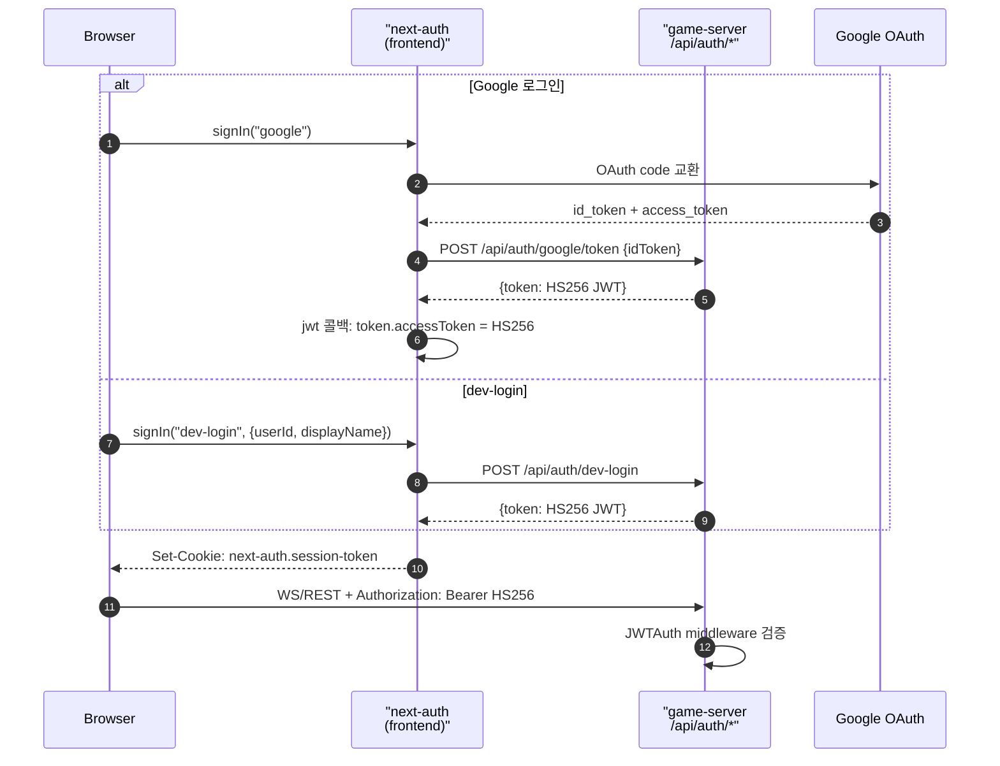
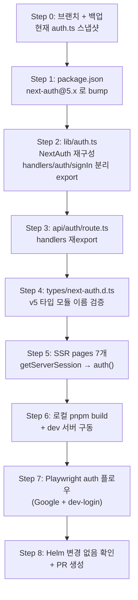
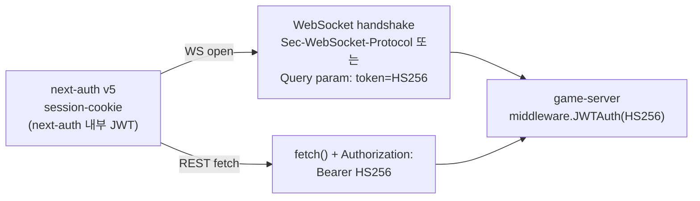

# 52. ADR — next-auth v5 (Auth.js) 이주

- 작성일: 2026-04-23 (Sprint 7 Day 2)
- 작성자: architect (Opus 4.7 xhigh)
- 상태: **Proposed** — Sprint 7 내 실행 확정
- 연관 ADR: ADR D-03 (rooms PostgreSQL Phase 1), ADR-025 (게스트 방 영속 배제)
- 연관 문서: `docs/02-design/51-nestjs-v11-migration.md` (supply-chain 동기화 bump)
- 분류: Security · Supply-chain · Frontend Runtime · **MEDIUM Risk**

---

## 1. Context

### 1.1 촉발 이슈

`src/frontend` npm audit 결과 `next-auth@4.24.11` 이 의존하는 **`uuid` 버전 범위** 에서 [`GHSA-w5hq-g745-h8pq`](https://github.com/advisories/GHSA-w5hq-g745-h8pq) (moderate) 가 발견됐다. 해당 advisory 는 `uuid < 14` 범위에 적용되며, `next-auth@4` 의 `dependencies.uuid` semver 범위(`^8.x`)가 상향되지 않았기 때문에 **v4 semver 안에서는 해소 불가**하다.

```
next-auth 4.24.11
└─ uuid@8.3.2  ← GHSA-w5hq-g745-h8pq (moderate)
```

### 1.2 next-auth v4 상태

- 2025-Q4 시점부터 Vercel/Auth.js 팀이 v4 를 **maintenance mode** 로 전환. 신규 기능 없고 보안 패치만 받음.
- 실제 v4 branch 에 `uuid` 업그레이드 PR 이 올라와있지만 (v4 스펙 호환성 이슈로) merge 지연 상태.
- `next@15.5.15` (현재 사용) 는 v4 호환은 유지하되 **App Router + React Server Components 환경에서 v5 를 공식 권장**.

### 1.3 기존 사용 패턴

조사 결과 (2026-04-23 기준):

| 파일 | 사용 | 패턴 |
|------|------|------|
| `src/frontend/src/app/api/auth/[...nextauth]/route.ts` | handler | `NextAuth(authOptions)` → `GET/POST` export |
| `src/frontend/src/lib/auth.ts` | config | `NextAuthOptions`, Google + Credentials (dev-login) providers, `jwt/session` 콜백 |
| `src/frontend/src/components/providers/AuthProvider.tsx` | provider | `SessionProvider` (client boundary) |
| `src/frontend/src/types/next-auth.d.ts` | 타입 확장 | `declare module "next-auth"` / `"next-auth/jwt"` |
| `src/frontend/src/hooks/useWebSocket.ts` | client | `useSession` |
| `src/frontend/src/lib/authToken.ts` | client | session 우선 + localStorage fallback |
| Server pages (7개) | SSR | `getServerSession(authOptions)` |
| Client components (5개) | client | `useSession`, `signIn`, `signOut` |

**총 18 파일 영향권** (src/frontend/src 한정, node_modules 제외).

### 1.4 미들웨어 · 외부 의존

- `middleware.ts` 또는 `withAuth` HOC: **미사용 확인** (frontend src 내 grep 0 건).
- Helm `frontend.values.yaml`: `NEXTAUTH_URL`, `NEXTAUTH_SECRET` env 주입. v5 에서 각각 `AUTH_URL`, `AUTH_SECRET` 으로 rename (호환 alias 유지되지만 권장명 변경).
- Admin 패널(`helm/charts/admin/values.yaml`) 도 `NEXTAUTH_*` env 사용. **본 ADR 범위 밖** (admin 은 별건).

### 1.5 Game-server JWT 와의 관계

Game-server (`src/game-server/internal/middleware/auth.go`) 는 **자체 HS256 JWT** 를 검증한다. next-auth 는 다음 2 경로로 이 토큰을 획득한다:

1. **Google 로그인**: next-auth `jwt` 콜백에서 `id_token` 을 game-server `POST /api/auth/google/token` 으로 교환 → 응답 `token` 을 `session.accessToken` 으로 저장.
2. **dev-login (Credentials)**: `authorize` 에서 game-server `POST /api/auth/dev-login` 호출 → 응답 `token` 을 `user.accessToken` 으로 전달.



**결정적 관찰**: game-server 는 next-auth 의 내부 session JWT 를 **전혀 보지 않는다**. game-server 는 자체 발급한 HS256 JWT 만 검증한다. 따라서 next-auth v5 이주는 **game-server 코드 변경 0 건**.

---

## 2. Decision

next-auth v4.24.11 → **Auth.js v5 (`next-auth@5.x`)** 로 이주한다. Sprint 7 내 (Day 3~Day 5 사이) PR 1 건으로 완료.

### 2.1 이주를 선택한 이유

1. **v4 semver 범위 내 uuid patch 불가** — supply-chain 고착.
2. **v4 maintenance mode** — 추후 moderate+ CVE 반복 발생 시 재이주 부담.
3. **Auth.js v5 가 App Router 기본 가정** — 현재 App Router 기반 (app/) 이라 v5 가 자연스러움.
4. **game-server 영향 0** — 파급이 frontend 한정이라 risk budget 이 작음.

### 2.2 대안 검토

| 대안 | 선택 안 한 이유 |
|------|---------------|
| A. `overrides` 로 `uuid@11` 강제 | `next-auth@4` 내부 `uuid.v4()` API 가 v11 과 호환은 되지만 Auth.js 팀이 **비공식**. 다음 CVE 재발 가능. 기술 부채 누적 |
| B. v4 fork 후 uuid bump 패치 유지 | 유지보수 부담 너무 큼 |
| C. Sprint 8 이관 | 사용자 지시: Sprint 7 내 처리. moderate 가 빌드 안 막아도 audit 잡에서 계속 WARN 생성 |
| D. next-auth 제거 → 자체 구현 | 게임 엔진이 아닌 영역에서 오버엔지니어링. OAuth 상태 기기 (code→token 교환, PKCE, session cookie rotation) 를 자체 유지 불합리 |

### 2.3 결정 = v5 단행, dev-login(Credentials) 유지

v5 는 Credentials provider 를 계속 지원한다 (JWT 전략 한정). dev-login 경로는 `authorize` 구현 그대로 이식 가능.

---

## 3. 범위

### 3.1 Frontend 파일 단위 변경 matrix

| 파일 | 변경 유형 | v4 → v5 |
|------|---------|---------|
| `src/app/api/auth/[...nextauth]/route.ts` | **재작성** | `NextAuth(authOptions)` → `const { handlers } = NextAuth(config); export const { GET, POST } = handlers` |
| `src/lib/auth.ts` | **재작성** | `NextAuthOptions` → `NextAuthConfig`. `providers` 배열 그대로. `callbacks` 그대로. `authOptions` export → `auth` / `signIn` / `signOut` / `handlers` export |
| `src/components/providers/AuthProvider.tsx` | **변경 없음** | `SessionProvider` import 경로 v5 에서도 `next-auth/react` 유지 |
| `src/types/next-auth.d.ts` | **소폭 수정** | `DefaultSession`, `DefaultJWT` 타입 import 경로 동일. 모듈 이름도 유지. 단 `token.sub` 접근 경로 변경 없음 |
| `src/app/**/page.tsx` (7 파일) | **API 치환** | `getServerSession(authOptions)` → `auth()` (v5 universal helper) |
| 클라이언트 컴포넌트 5 파일 | **변경 없음** | `useSession`, `signIn`, `signOut` 모두 v5 유지 |
| `src/hooks/useWebSocket.ts` | **변경 없음** | `useSession` 유지 |
| `src/lib/authToken.ts` | **변경 없음** | `session.accessToken` 접근 패턴 유지 |

### 3.2 Env 변수

| v4 | v5 | 조치 |
|----|----|------|
| `NEXTAUTH_URL` | `AUTH_URL` (선호) or `NEXTAUTH_URL` 그대로 | **호환 유지** — 둘 다 동작. Helm values 변경 **없음** |
| `NEXTAUTH_SECRET` | `AUTH_SECRET` (선호) or `NEXTAUTH_SECRET` 그대로 | 동일 |
| `GOOGLE_CLIENT_ID/SECRET` | 동일 | 없음 |

> v5 는 `AUTH_*` prefix 가 권장이지만 `NEXTAUTH_*` 호환 유지. **이주 PR 에서는 env 이름을 건드리지 않는다** (Helm / Secret / CI 순환 폭 최소화). 별건으로 Sprint 8 에서 rename 검토.

### 3.3 세션 전략 — JWT 유지

현재 `session.strategy = "jwt"`, `maxAge = 24h`. v5 에서 JWT 전략은 **그대로 유지** (database adapter 로 전환하면 PostgreSQL schema 추가 필요 → 범위 확장됨).

- JWT secret: `NEXTAUTH_SECRET` 재사용. 기존 발급된 세션 쿠키는 **secret 호환** 이므로 rotation 불필요 (같은 secret → 같은 서명).
- `jwt()` callback 내부의 game-server 토큰 교환 로직은 **1:1 이식**.
- `session()` callback 에서 `session.accessToken`, `session.user.id` 노출 로직도 1:1 이식.

### 3.4 서버 컴포넌트 session 접근

v5 의 핵심 변경 = `auth()` helper.

**v4 (현행)**:
```ts
// src/app/lobby/page.tsx
import { getServerSession } from "next-auth";
import { authOptions } from "@/lib/auth";

export default async function LobbyPage() {
  const session = await getServerSession(authOptions);
  if (!session) redirect("/login");
  // ...
}
```

**v5 (목표)**:
```ts
// src/app/lobby/page.tsx
import { auth } from "@/lib/auth";

export default async function LobbyPage() {
  const session = await auth();
  if (!session) redirect("/login");
  // ...
}
```

`authOptions` 이 `auth` / `handlers` / `signIn` / `signOut` 으로 쪼개진다. 즉 `lib/auth.ts` 가 config 파일에서 **runtime helper factory** 로 바뀐다.

### 3.5 Middleware 변경 여부

현재 `src/frontend/middleware.ts` 미존재. v5 가 기본 제공하는 edge middleware (`export { auth as middleware } from "@/lib/auth"`) 도입은 **본 PR 범위 밖**. 도입 시점은 Phase 2 인증 강제 경로(로그인 리디렉션 중앙화) 가 필요할 때 별건 ADR.

---

## 4. 마이그레이션 단계 (파일 단위)



### Step 1 — package.json bump

```jsonc
// src/frontend/package.json (diff)
{
  "dependencies": {
-   "next-auth": "^4.24.11",
+   "next-auth": "^5.0.0-beta.25",  // v5 stable 출시 시 ^5.0.0 로 pin
    // ...
  }
}
```

> **주의**: 2026-01 현재 v5 는 `5.0.0-beta.25` 가 최신. beta 이지만 Vercel 프로덕션 배포 사례가 다수 존재. **stable 출시 전까지 beta 사용** 은 Sprint 7 맥락에서 수용 가능 리스크 (우리도 early adopter 가 아님 — 수개월 beta 기간 경과).
> 만약 v5 beta 채택이 정책적으로 부담스러우면 Step 1 에서 정지하고 **fallback 플랜 A (overrides uuid@11)** 를 단기 적용 후 v5 stable 출시 시 재이주.

### Step 2 — `lib/auth.ts` 재작성 (핵심)

**v4 → v5 diff 요지**:

```ts
// BEFORE (v4)
import type { NextAuthOptions } from "next-auth";
export const authOptions: NextAuthOptions = { providers, callbacks, pages, session };
```

```ts
// AFTER (v5)
import NextAuth, { type NextAuthConfig } from "next-auth";
import GoogleProvider from "next-auth/providers/google";
import CredentialsProvider from "next-auth/providers/credentials";

const config: NextAuthConfig = {
  providers: [...],   // 동일
  callbacks: {...},   // 동일 (타입만 next-auth@5 의 JWT/Session 로 맞춤)
  pages: {...},       // 동일
  session: { strategy: "jwt", maxAge: 24 * 60 * 60 },
};

export const { handlers, auth, signIn, signOut } = NextAuth(config);
```

### Step 3 — `route.ts` 재export

```ts
// BEFORE (v4)
import NextAuth from "next-auth";
import { authOptions } from "@/lib/auth";
const handler = NextAuth(authOptions);
export { handler as GET, handler as POST };
```

```ts
// AFTER (v5)
export { GET, POST } from "@/lib/auth"; // handlers 에서 구조분해
// OR:
import { handlers } from "@/lib/auth";
export const { GET, POST } = handlers;
```

### Step 4 — 타입 확장 (`types/next-auth.d.ts`)

v5 에서도 module augmentation 경로는 `"next-auth"` / `"next-auth/jwt"` 유지. 파일 변경 **최소**.

```ts
// v5 에서도 동일
declare module "next-auth" {
  interface Session {
    accessToken?: string;
    user?: { id?: string } & { name?: string | null; email?: string | null; image?: string | null };
  }
}
declare module "next-auth/jwt" {
  interface JWT {
    accessToken?: string;
  }
}
```

### Step 5 — SSR pages 7개 치환 (기계적)

```diff
- import { getServerSession } from "next-auth";
- import { authOptions } from "@/lib/auth";
+ import { auth } from "@/lib/auth";

- const session = await getServerSession(authOptions);
+ const session = await auth();
```

대상: `app/page.tsx`, `lobby/page.tsx`, `practice/page.tsx`, `rankings/page.tsx`, `room/create/page.tsx`, `room/[roomId]/page.tsx`, `game/[roomId]/page.tsx`.

### Step 6 — 빌드 + dev 구동

```bash
cd src/frontend
pnpm install
pnpm build    # next build 통과
pnpm dev      # localhost:3000 로그인 수동 확인
```

### Step 7 — Playwright 인증 플로우 회귀

```bash
pnpm test:e2e -- --grep "login|auth"
# 타겟:
#  - tests/auth/google-mock.spec.ts (있으면)
#  - tests/auth/dev-login.spec.ts
#  - tests/auth/session-persist.spec.ts (재로딩 후 session 유지)
```

전수 Playwright (390 tests) 는 Step 8 PR CI 에서 실행.

### Step 8 — Helm 변경 없음 확인

`helm/charts/frontend/values.yaml` `NEXTAUTH_SECRET`, `NEXTAUTH_URL` 이 **그대로** 동작하는지 staging 에서 확인. v5 가 `AUTH_*` 를 권장하지만 `NEXTAUTH_*` alias 를 읽는다.

---

## 5. Game-server 연동 영향

### 5.1 JWT 토큰 흐름 — 변경 없음

앞서 §1.5 에서 분석한 대로 game-server 는 `Authorization: Bearer <HS256>` 을 `middleware/auth.go` 에서 검증한다. HS256 secret (`JWT.Secret`) 은 **next-auth 와 무관**. next-auth 는 단지 session cookie 에 HS256 토큰을 wrapping 해 client 로 실어나르는 역할.



Game-server 입장에서 **"누가 토큰을 발급했는지"** 는 상관없다. 서명 검증이 통과하면 유효. 따라서 **game-server 코드 변경 0**.

### 5.2 dev-login POST 계약

`POST /api/auth/dev-login` 의 request/response body contract 은 v5 이주와 무관하게 유지. (`{userId, displayName}` → `{token, userId, displayName}`)

### 5.3 Google ID Token 교환 경로

`POST /api/auth/google/token` contract 도 유지. next-auth v5 의 `jwt` 콜백에서도 동일하게 `account.id_token` 을 사용 가능.

**예외 1건 검증 필요**: v5 의 `account` 객체 스키마가 `id_token` 필드를 노출하는지 Step 2 구현 중 로컬 로그로 확인. Auth.js v5 docs 기준 노출 유지.

---

## 6. Rollback 전략

### 6.1 PR 머지 전 로컬 롤백

Git revert 1 커밋. `pnpm install` 로 v4 복구.

### 6.2 프로덕션 배포 후 장애 시

| 상황 | 대응 | 예상 시간 |
|------|------|----------|
| 빌드 실패 | 이미 CI 에서 차단 → 프로덕션 영향 없음 | - |
| 로그인 100% 실패 | ArgoCD 에서 이전 리비전으로 rollback | 5분 |
| 세션 쿠키 호환성 문제 | 사용자에게 **재로그인 요청** 공지 (모든 세션 무효화) | 즉시 |
| Google OAuth 리디렉션 URL mismatch | Google Cloud Console 리디렉션 URI 가 동일 (`/api/auth/callback/google`) 확인. v5 도 **같은 path** 사용 | N/A |

### 6.3 세션 쿠키 이름

- v4: `next-auth.session-token`, Secure 환경 `__Secure-next-auth.session-token`
- v5: **동일 이름 유지**. 단 `AUTH_URL` 이 `https` 면 prefix 자동 Secure.

→ 기존 로그인 세션은 이주 후에도 **원칙적으로 유지**. (단 signature 알고리즘 변경이 없다는 전제. v5 기본 JWT 알고리즘 HS256 로 v4 와 동일.)

→ **안전 조치**: 배포 시점에 `NEXTAUTH_SECRET` 을 굳이 rotate 하지 않는다. 만약 호환성 예외 발생 시 secret rotate + 전면 재로그인을 **최후** 옵션으로 유지.

---

## 7. 검증 — Playwright auth 플로우 재실행

### 7.1 필수 테스트 케이스

| 시나리오 | 테스트 파일 (추정) | PASS 기준 |
|---------|-------------------|-----------|
| dev-login 성공 | `e2e/auth/dev-login.spec.ts` | session 쿠키 set + `/lobby` 리다이렉트 |
| dev-login 실패 (잘못된 userId) | 동일 | 400 + `/login` 잔류 |
| Google OAuth 모킹 | `e2e/auth/google-mock.spec.ts` | `authorize` callback 통과 + HS256 교환 |
| 세션 지속 (새로고침) | `e2e/auth/session-persist.spec.ts` | `useSession` 이 client 에서 로드 |
| signOut | `e2e/auth/signout.spec.ts` | 쿠키 제거 + `/login` 리다이렉트 |
| WS 재연결 with accessToken | `e2e/game/ws-reconnect.spec.ts` | WS handshake 성공 |
| SSR session 접근 | `e2e/lobby/room-list.spec.ts` | 비로그인 시 `/login` 리다이렉트, 로그인 시 /lobby |

### 7.2 전수 회귀

Playwright **390 tests** 전부 CI 에서 실행. 기존 Ollama Known Fail 4건 / Flaky 10건 을 제외한 **376+ tests PASS** 유지가 GO 조건.

### 7.3 수동 smoke (staging)

| 체크리스트 | 예상 시간 |
|-----------|-----------|
| Google 로그인 → `/lobby` 진입 | 2분 |
| dev-login → `/lobby` 진입 | 1분 |
| 로비 → 방 생성 → WS 연결 | 2분 |
| 새로고침 → 세션 유지 | 1분 |
| signOut → `/login` | 1분 |
| 관리자 로그인 (admin role) | 2분 |

---

## 8. 예상 LOC + 소요 시간

### 8.1 LOC 예측

| 파일 | 예상 변화 |
|------|---------|
| `package.json` | +1/-1 |
| `src/lib/auth.ts` | +15/-10 (구조 변경 위주) |
| `src/app/api/auth/[...nextauth]/route.ts` | +2/-4 |
| `src/types/next-auth.d.ts` | +0/-0 |
| SSR pages 7 파일 | 각 +2/-2 (기계적) = +14/-14 |
| **합계 (src)** | **+32/-29 ≈ 60 LOC 순수 변경** |

단, `pnpm-lock.yaml` 은 next-auth v5 의 전이 의존성 (node-forge, jose 등) 이 달라지므로 **수백 줄 auto-generated diff** 발생.

### 8.2 시간 예측 (병렬 없음 가정)

| 작업 | 시간 |
|------|------|
| 브랜치 + 의존성 bump | 0.25h |
| `lib/auth.ts` 재작성 | 1.5h (callback 타입 검증 포함) |
| SSR pages 치환 | 0.5h |
| 로컬 build + dev 수동 smoke | 0.5h |
| Playwright auth spec 재실행 | 0.5h |
| CI 전수 Playwright 대기 | 0.5h |
| PR 작성 + 코드리뷰 대응 | 1h |
| **합계** | **~4.75h** |

Sprint 7 Day 3 오후 또는 Day 4 오전 슬롯에 적합. frontend-dev 단독 가능.

---

## 9. Risk Budget

| Risk | 확률 | 영향 | 완화 | 잔여 |
|------|------|------|------|------|
| R1. v5 beta 사용으로 향후 breaking change | 중 | 중 | `5.0.0-beta.X` pin + Auth.js release notes 모니터 | 낮 |
| R2. 세션 쿠키 호환성 깨져 전면 재로그인 | 낮 | 중 | `NEXTAUTH_SECRET` 유지 + staging 에서 기존 쿠키 테스트 | 낮 |
| R3. Google OAuth 리다이렉트 URI mismatch | 낮 | 고 | path 동일 (`/api/auth/callback/google`) 확인. Google Console 변경 불필요 | 낮 |
| R4. SSR `auth()` helper 가 server component 에서 성능 저하 | 낮 | 낮 | v5 에서 `auth()` 는 기존 `getServerSession` 대비 오히려 경량 (Auth.js blog 벤치). p95 latency 회귀 모니터 | 낮 |
| R5. dev-login Credentials provider 가 v5 에서 JWT 전략 외 미지원 | 낮 | 중 | 우리 코드가 이미 JWT 전략 고정. 영향 없음 | 없 |
| R6. 타입 모듈 이름 (`declare module "next-auth"`) 이 v5 에서 변경 | 낮 | 낮 | v5 docs 확인 완료. 모듈명 동일 | 없 |
| R7. pnpm lockfile 대량 변경으로 SEC 감사 잡에서 alert 폭주 | 중 | 낮 | 별건 SEC 감사 잡이 차단이 아닌 WARN 이므로 통과 허용 (PR 설명에 명시) | 낮 |
| R8. useSession client-side 호환성 | 낮 | 중 | v5 에서도 `useSession` 유지. `SessionProvider` 동일 | 없 |

**종합 위험도: MEDIUM-LOW**. game-server 코드 변경 0, Helm 변경 0, 세션 시그니처 동일 유지 → 롤백 시 데이터 손실 없음.

---

## 10. Production 기준 실행 결정

- [x] Sprint 7 Day 3~5 슬롯 중 선택 (frontend-dev 단독, 4.75h)
- [x] beta 채택 수용 (Vercel 다수 프로덕션 레퍼런스)
- [x] Env 변수 이름 유지 (별건 rename PR 은 Sprint 8)
- [x] Middleware 도입 보류 (별건)
- [x] Admin 패널 next-auth v5 이주 **본 PR 범위 밖** (admin 은 15.x, 별건 Sprint 7 Day 4 SEC-BC 에 묶어 처리)
- [x] Supply-chain 동기화: 본 이주 이후 npm audit 에서 `GHSA-w5hq-g745-h8pq` 소멸 확인

---

## 11. 연관 변경 (체크리스트)

- [ ] `src/frontend/package.json` bump (+ pnpm-lock 재생성)
- [ ] `src/frontend/src/lib/auth.ts` 재작성
- [ ] `src/frontend/src/app/api/auth/[...nextauth]/route.ts` 재export
- [ ] `src/frontend/src/types/next-auth.d.ts` 모듈 타입 재검증
- [ ] SSR pages 7 파일 기계적 치환
- [ ] Playwright auth spec 수동 재실행
- [ ] PR 설명에 npm audit 전/후 요약 첨부
- [ ] `docs/04-testing/` 에 이주 회귀 보고서 1건 추가
- [ ] CLAUDE.md "Auth" 섹션 업데이트 검토 (필요 시)

---

## 12. 참조

- Auth.js v5 migration guide: `https://authjs.dev/getting-started/migrating-to-v5`
- GHSA-w5hq-g745-h8pq (uuid moderate advisory)
- `src/frontend/src/lib/auth.ts` — 현 config 원본
- `src/game-server/internal/middleware/auth.go` — HS256 검증 (변경 없음 근거)
- `helm/charts/frontend/values.yaml` — env 이름 유지 근거

---

> **문서 이력**
>
> | 버전 | 날짜 | 작성자 | 내용 |
> |------|------|--------|------|
> | 1.0 | 2026-04-23 | architect (Opus 4.7 xhigh) | 초안 — v5 이주 단행, Sprint 7 내 실행, game-server 영향 0 |
