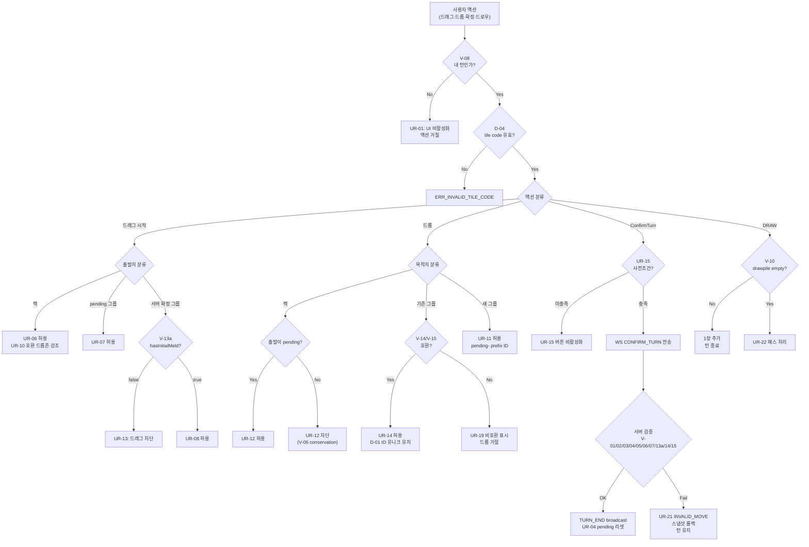

# 55 — 루미큐브 게임룰 정밀 Enumeration (SSOT)

- **작성**: 2026-04-25, game-analyst (general-purpose 임시 대행)
- **정본 출처**: 루미큐브 공식 룰 (`docs/02-design/Rummikub_Rules.pdf`) + `docs/02-design/06-game-rules.md` + `src/game-server/internal/engine/`
- **사용처**: architect (`58-ui-component-decomposition.md`), frontend-dev, go-dev, qa, designer (`57-game-rule-visual-language.md`), security
- **변경 절차**: 본 문서 변경 시 architect ADR + game-analyst 승인 필수. 모든 후속 산출물 (행동 매트릭스 56, 상태 머신 56b, 컴포넌트 분해 58, 시각 언어 57, 테스트 전략 88) 동시 업데이트.
- **충돌 해소 정책**: `dragEndReducer` 기존 reject 코드와 본 SSOT 충돌 시 → 본 SSOT 우선. 코드 측이 명세를 따라야 한다.
- **band-aid 검출**: "이 행동은 룰 V-X / UR-Y / D-Z 에 의해 차단" 형태로 commit message 가 룰 ID 매핑 가능해야 PR 머지 허용 (스탠드업 §3-3).

---

## 1. 룰 ID 체계

| 접두 | 영역 | 검증 위치 | 위반 결과 |
|------|------|----------|----------|
| **V-NN** | 서버 검증 룰 (Game Engine SSOT) | `internal/engine/validator.go ValidateTurnConfirm`, `internal/service/*` | 서버가 `ERR_*` 반환, 클라이언트는 스냅샷 롤백 |
| **UR-NN** | UI 인터랙션/표시 룰 | 프론트 (`GameClient`, dnd-kit, Zustand) | 드롭 거절 / 토스트 / 비활성화. **state 부패 절대 금지** |
| **D-NN** | 데이터 무결성 룰 (서버·클라 공통) | `gameStore`, `engine`, WS 페이로드 직렬화 | invariant 위반 → 코드 버그. band-aid 금지, 코드 수정 |

**번호 정책**:
- V-NN은 기존 `06-game-rules.md` §10 의 V-01~V-15 + V-13a~V-13e 분해를 **그대로 계승**한다 (호환성). 신규 V-16~V-19 만 본 문서에서 추가.
- UR-NN은 본 문서가 단일 발급원. 30개 이상 정의.
- D-NN은 본 문서가 단일 발급원. 12개 이상 정의.

---

## 2. 서버 검증 룰 (V-*)

### 2.1 V-01 — 세트 유효성 (그룹 또는 런)

| 항목 | 정의 |
|------|------|
| **정의** | 테이블 위 모든 세트는 유효한 그룹(같은 숫자, 다른 색, 3~4장) 또는 런(같은 색, 연속 숫자, 3~13장) 이어야 한다 |
| **검증 위치** | `engine/validator.go ValidateTable` → `ValidateTileSet` |
| **위반 예시** | `[R7a, B8a, K7b]` (그룹도 런도 아님), `[R3a, R5a, R6a]` (런 비연속) |
| **서버 응답** | `ERROR { code: ERR_INVALID_SET, message: "유효하지 않은 타일 조합..." }` |
| **UI 응답** | INVALID_MOVE 토스트 + 스냅샷 롤백 (UR-21) |
| **D 의존성** | D-04 (tile code 파싱), D-08 (조커 일관성) |

### 2.2 V-02 — 세트 크기 (3장 이상)

| 항목 | 정의 |
|------|------|
| **정의** | 모든 세트는 최소 3장 (그룹 최대 4장, 런 최대 13장) |
| **검증 위치** | `engine/validator.go:23 ValidateTileSet` (`len < 3` 즉시 거부) |
| **위반 예시** | `[R7a, B7a]` (2장) |
| **서버 응답** | `ERROR { code: ERR_SET_SIZE }` |
| **UI 응답** | INVALID_MOVE 토스트 + 롤백 |

### 2.3 V-03 — 랙에서 최소 1장 추가

| 항목 | 정의 |
|------|------|
| **정의** | 턴 확정 시 `tiles_after_count - tiles_before_count >= 1`. 단순 재배치 (랙 미사용) 금지 |
| **검증 위치** | `engine/validator.go:86-89` |
| **서버 응답** | `ERR_NO_RACK_TILE` |
| **UI 응답** | ConfirmTurn 버튼 disabled (UR-15) — 사전 차단. 우회 시 INVALID_MOVE |

### 2.4 V-04 — 최초 등록 30점

| 항목 | 정의 |
|------|------|
| **정의** | `hasInitialMeld == false` 인 플레이어가 처음 배치 시, **자신의 랙 타일만으로** 구성한 세트 합계 ≥ 30점. 조커는 대체 타일의 숫자값 (30 점 아님) |
| **검증 위치** | `engine/validator.go:122-162 validateInitialMeld` (`addedSet` 부분집합 세트만 점수 계산) |
| **서버 응답** | `ERR_INITIAL_MELD_SCORE` |
| **UI 응답** | UR-30 (초기 멜드 진척 표시: "현재 N점 / 30점") + INVALID_MOVE 토스트 |

### 2.5 V-05 — 최초 등록 시 랙 타일만 사용

| 항목 | 정의 |
|------|------|
| **정의** | 최초 등록 턴에 기존 테이블 타일을 재배치할 수 없다. `tableBefore[code] - tableAfter[code] > 0` 인 코드가 있으면 위반 |
| **검증 위치** | `engine/validator.go:128-132` (V-13a 분기로도 동작) |
| **서버 응답** | `ERR_NO_REARRANGE_PERM` (V-13a 분기 우선), `ERR_INITIAL_MELD_SOURCE` (legacy) |
| **UI 응답** | UR-13 (초기 멜드 전 서버 그룹 드래그 차단) |

### 2.6 V-06 — 타일 보존 (Conservation)

| 항목 | 정의 |
|------|------|
| **정의** | (i) `count(tableAfter) >= count(tableBefore)`, (ii) **코드 빈도 비교**: tableBefore 의 모든 tile code 가 tableAfter 에도 동일 빈도 이상 존재. 단 `JokerReturnedCodes` 는 차감 |
| **검증 위치** | `engine/validator.go:91-97, 111-119, validateTileConservation` |
| **위반 예시** | "테이블 그룹 → 랙으로 회수" (UI 가 절대 만들면 안 됨), "R7a 가 사라지고 B7a 가 추가됨" |
| **서버 응답** | `ERR_TABLE_TILE_MISSING` |
| **UI 응답** | UR-12 (서버 확정 그룹 → 랙 드롭 거절) **사전 차단**. 우회 시 INVALID_MOVE + 롤백 |
| **사고 매핑** | docs/04-testing/84 Turn#11 11s 그룹 소실 = **V-06 위반의 클라이언트 단독 표현**. 서버는 11턴 내내 healthy. |

### 2.7 V-07 — 조커 회수 후 즉시 사용

| 항목 | 정의 |
|------|------|
| **정의** | 조커 교체로 회수한 조커 코드는 같은 턴 내 `tableAfter` 에 다시 존재해야 함 |
| **검증 위치** | `engine/validator.go:107, 165-176 validateJokerReturned` |
| **서버 응답** | `ERR_JOKER_NOT_USED` |
| **UI 응답** | UR-25 (회수 조커 강조 표시 + ConfirmTurn 차단) |

### 2.8 V-08 — 자기 턴 확인

| 항목 | 정의 |
|------|------|
| **정의** | `currentPlayerSeat == requesterSeat` 일 때만 PLACE_TILES / CONFIRM_TURN / DRAW_TILE 수용 |
| **검증 위치** | `service/game_service.go ConfirmTurn` (seat 확인) |
| **서버 응답** | `ERR_NOT_YOUR_TURN` |
| **UI 응답** | UR-01 (다른 턴일 때 드래그/버튼 disabled) |

### 2.9 V-09 — 턴 타임아웃

| 항목 | 정의 |
|------|------|
| **정의** | 턴 타이머 만료 시 자동 드로우 1장 + 테이블 스냅샷 롤백 + 다음 플레이어로 advance |
| **검증 위치** | `service/turn_service.go HandleTimeout` |
| **서버 응답** | `TURN_END { reason: "TIMEOUT" }` 브로드캐스트 |
| **UI 응답** | UR-26 (타이머 0 도달 시 시각 강조), UR-04 (롤백 후 pending 0) |

### 2.10 V-10 — 드로우 파일 소진

| 항목 | 정의 |
|------|------|
| **정의** | `drawpile.empty()` 일 때 DRAW_TILE 은 패스(no-op)로 처리. 게임은 종료 안 함 |
| **검증 위치** | `engine/pool.go:49 Draw` + `ErrDrawPileEmpty` |
| **서버 응답** | `TURN_END { reason: "PASS_DRAW_EMPTY" }` |
| **UI 응답** | UR-22 (드로우 버튼 → "패스" 라벨 전환), UR-23 (드로우 파일 X 시각화) |

### 2.11 V-11 — 교착 상태 (Stalemate)

| 항목 | 정의 |
|------|------|
| **정의** | drawpile 소진 후 1라운드(player_count) 동안 전원 패스 → GAME_OVER. 점수 합산 비교 후 최저 점수 승리 |
| **검증 위치** | `service/game_service.go ConsecutivePassCount` |
| **서버 응답** | `GAME_OVER { reason: "ALL_PASS", scores: [...] }` |
| **UI 응답** | UR-27 (게임 종료 오버레이 + ALL_PASS 안내) |

### 2.12 V-12 — 승리 (랙 0장)

| 항목 | 정의 |
|------|------|
| **정의** | ConfirmTurn 후 `len(rack) == 0` 인 플레이어가 즉시 승리. 마지막 타일도 유효한 세트 일부여야 함 |
| **검증 위치** | `service/game_service.go:483-500` |
| **서버 응답** | `GAME_OVER { reason: "WIN", winnerSeat: N }` |
| **UI 응답** | UR-28 (승리 오버레이 + ELO 변동 표시) |

### 2.13 V-13a — 재배치 권한 (hasInitialMeld)

| 항목 | 정의 |
|------|------|
| **정의** | `hasInitialMeld == false` 인 플레이어는 서버 확정 그룹의 타일을 이동/병합/분리 불가 |
| **검증 위치** | `validator.go:128 validateInitialMeld` (V-13a 분기) — `ErrNoRearrangePerm` 직접 반환 |
| **서버 응답** | `ERR_NO_REARRANGE_PERM` |
| **UI 응답** | UR-13 (초기 멜드 전 서버 그룹 드래그 disabled) |

### 2.14 V-13b — 재배치 유형 1: 세트 분할 (Split)

| 항목 | 정의 |
|------|------|
| **정의** | 기존 세트에서 타일을 떼어내 다른 세트로 이동. 분할 후 양쪽 세트 모두 V-01/V-02 충족 |
| **검증** | V-01/V-02/V-06 종합 |
| **UI 응답** | UR-13 권한 통과 시 드래그 허용. 서버 사전검증 없이 commit 후 거부 가능 |

### 2.15 V-13c — 재배치 유형 2: 세트 합병 (Merge)

| 항목 | 정의 |
|------|------|
| **정의** | 두 세트를 합쳐 하나의 큰 세트로 (예: 그룹 3장 + 같은 숫자 1장 → 그룹 4장). 결과 V-01 충족 |
| **검증** | V-01 (4색 그룹) + V-06 |
| **UI 응답** | UR-14 (합병 가능한 그룹 사이 드롭존 강조) — `mergeCompatibility.ts:isCompatibleWithGroup` |

### 2.16 V-13d — 재배치 유형 3: 타일 이동 (Move)

| 항목 | 정의 |
|------|------|
| **정의** | 한 세트의 타일을 다른 세트로 옮김. 출발 세트 잔여 ≥ 3장 또는 즉시 보충 |
| **검증** | V-01/V-02/V-06 종합 |
| **UI 응답** | UR-13 권한 통과 시 허용. **반드시 같은 턴 내 모든 세트 V-01 회복 필수** |

### 2.17 V-13e — 재배치 유형 4: 조커 교체 (Joker Swap)

| 항목 | 정의 |
|------|------|
| **정의** | 테이블 세트의 조커를 자신의 랙 타일로 교체. 회수한 조커는 V-07 에 의해 같은 턴 내 재사용 필수 |
| **검증** | V-07 + V-13a + V-06 종합 |
| **UI 응답** | UR-25 (회수 조커 시각 강조 + 즉시 사용 안내) |

### 2.18 V-14 — 그룹 동색 중복 불가

| 항목 | 정의 |
|------|------|
| **정의** | 그룹 내 같은 색 두 장 금지 (`R7a, R7b` 같은 그룹 안 됨) |
| **검증 위치** | `engine/group.go` |
| **서버 응답** | `ERR_GROUP_COLOR_DUP` |

### 2.19 V-15 — 런 숫자 연속 (1↔13 순환 금지)

| 항목 | 정의 |
|------|------|
| **정의** | 런 숫자는 1~13 범위 내 단조 증가, `12-13-1` 순환 금지, 같은 숫자 중복 금지 |
| **검증 위치** | `engine/run.go checkRunDuplicates` + 순서 검증 |
| **서버 응답** | `ERR_RUN_SEQUENCE` / `ERR_RUN_RANGE` / `ERR_RUN_DUPLICATE` |

### 2.20 V-16 — 그룹 색상 enumeration 정합성 (NEW)

| 항목 | 정의 |
|------|------|
| **정의** | 모든 tile color 는 {R, B, Y, K} 4종 enum 만 허용. 그 외 값 (`"joker"` 라벨 등) 은 그룹 색상 검증 입력으로 사용 금지 |
| **검증 위치** | 본 SSOT 신설. 서버: `engine/tile.go ParseTileCode`. 클라: `mergeCompatibility.ts isCompatibleAsGroup` |
| **위반 예시** | `existingColors.has("joker")` 류 잘못된 비교 |
| **D 의존성** | D-04, D-09 |

### 2.21 V-17 — 그룹 ID 서버측 발급 (NEW)

| 항목 | 정의 |
|------|------|
| **정의** | 모든 테이블 그룹 ID 는 **서버에서 발급** (UUID v4). 클라이언트가 새 그룹을 만들 때는 임시 prefix `pending-` 만 사용. 서버 응답 후 서버 ID 로 교체 |
| **검증 위치** | 본 SSOT 신설. 서버: `service/game_service.go ConfirmTurn` 응답에서 그룹 id 부여. 클라: WS 수신 시 pending → 서버 id 매핑 |
| **위반 예시** | `ws_handler.go:1061 processAIPlace` 에서 `tableGroups[i].ID` 미할당 → AI 그룹이 빈 ID 로 적재 (스탠드업 §1 go-dev) |
| **D 의존성** | D-01 (그룹 ID 유니크), D-12 (pending → server ID 매핑) |

### 2.22 V-18 — 턴 스냅샷 무결성 (NEW)

| 항목 | 정의 |
|------|------|
| **정의** | 매 턴 시작 시 서버는 tableBefore 스냅샷을 Redis 에 저장. 모든 검증·롤백은 이 스냅샷 기준. 클라이언트가 스냅샷에 영향 줄 수 없음 |
| **검증 위치** | 본 SSOT 신설. 서버: `Redis: game:{gameId}:snapshot:{turnNum}` |
| **UI 응답** | UR-04 (턴 시작 시 클라이언트 pending 0 강제) |

### 2.23 V-19 — 메시지 시퀀스 단조성 (NEW)

| 항목 | 정의 |
|------|------|
| **정의** | WS 메시지 `seq` 는 연결 내 단조 증가. 서버는 역순 / 중복 seq 의 PLACE_TILES / CONFIRM_TURN 거부 |
| **검증 위치** | 본 SSOT 신설. 서버: `handler/ws_handler.go` seq 검증 추가 필요 |
| **서버 응답** | `ERROR { code: STALE_SEQ }` |
| **UI 응답** | UR-29 (재전송 안내) |

### 2.24 V-20 — 패널티 정책 (Penalty Policy) (NEW, 2026-04-28)

| 항목 | 정의 |
|------|------|
| **정의** | INVALID_MOVE 발생 시 (V-01~V-19 중 어느 한 룰이라도 위반) 행위자 종류에 따라 다른 패널티를 적용한다. **Human**: 테이블 스냅샷 복원 + DrawPile 에서 **3장** 추가 + 턴 종료. **AI**: 스냅샷 복원 + DrawPile 에서 **1장** 추가 + 턴 종료 (LLM 응답 무결성 보장 한계로 차등). 두 경우 모두 retry 없음 — 즉시 턴 advance |
| **검증 위치** | 본 SSOT 신설. `service/game_service.go:359-383` (Human ConfirmTurn 검증 실패 분기), `handler/ws_handler.go:1156-1174 forceAIDraw` (AI 분기) |
| **위반 분기 트리거** | V-01 ~ V-19 중 임의 룰의 서버 검증 실패 |
| **서버 응답** | `INVALID_MOVE { actor: "human"\|"ai", penaltyTiles: 3\|1, reason: ERR_* }` + `TURN_END { reason: "PENALTY", drawn: N }` |
| **UI 응답** | UR-21 INVALID_MOVE 토스트 + **UR-40** 패널티 안내 토스트 ("유효하지 않은 배치입니다. 보드가 원래 상태로 복원되고, 패널티로 N장을 드로우합니다.") + 스냅샷 복원 (UR-04 와 동일 cleanup) |
| **D 의존성** | **D-05** (DrawPile 차감 ↔ Rack 증가, 보드+랙+drawpile 합 = 106 invariant 유지). DrawPile 잔량 < 패널티 수량인 경우 **남아있는 만큼만** 지급 (정책 결정: 패널티 강제 종료 우선, V-10 패스 처리와 동일 정신) |
| **Rationale (Human ≠ AI 차등)** | Human 은 의도적 위반 가능 (시도-거부 학습) → 학습 비용으로 3장. AI 는 LLM 환각 / 포맷 오류일 가능성 높고, 강한 패널티 시 게임이 일방적으로 진행됨 (1장 == 정상 DRAW 와 동일) |

### 2.25 V-21 — Mid-Game 진입자 정책 (NEW, 2026-04-28)

| 항목 | 정의 |
|------|------|
| **정의** | 이미 진행 중인 게임에 새 플레이어가 합류하는 mid-game join. 정책: (i) DrawPile 에서 **14장 분배** (정상 게임 시작과 동일), (ii) `hasInitialMeld = false` 시작 (V-04 30점 의무 인계), (iii) **다음 라운드부터** turn rotation 자동 포함 (현재 진행 중인 라운드의 미진행 seat 가 아니라 새 seat 추가), (iv) DrawPile 잔량 < 14 인 경우 mid-game join 거부 (`DRAW_PILE_TOO_SMALL`) |
| **검증 위치** | 본 SSOT 신설. `service/game_service.go:858-907 AddPlayerMidGame` |
| **위반 예시** | DrawPile 12장 남은 상황에서 join 시도 → 거부. join 후 첫 턴 곧바로 V-04 면제 시도 → 거부 (UR-39 안내로 사전 차단) |
| **서버 응답** | OK: `PLAYER_JOIN { seat: N, isMidGame: true }`. 거부: `ERROR { code: DRAW_PILE_TOO_SMALL }` |
| **UI 응답** | UR-39 (mid-game 진입자 첫 턴 V-04+V-13a 안내 모달 1회) |
| **D 의존성** | **D-05** (보드+모든 랙+drawpile = 106), **D-06** (tile code 유일성). join 시 14장 차감을 정확히 D-05 invariant 안에서 처리 |

---

## 3. UI 인터랙션 룰 (UR-*)

### 3.1 턴 권한 / 활성화 룰

| ID | 정의 | 트리거 | 시각 표현 (designer 57 매핑) |
|----|------|--------|---------------------------|
| **UR-01** | 다른 플레이어 턴에는 모든 드래그 / ConfirmTurn / Draw 버튼 disabled | `currentPlayerSeat != mySeat` | 랙 dim 60% + 커서 not-allowed |
| **UR-02** | 내 턴 시작 시 랙·테이블 활성화 | TURN_START 수신 | 랙 highlight pulse 1회 |
| **UR-03** | AI 사고 중 표시 | AI_THINKING 수신 | 보드 상단 spinner |
| **UR-04** | 턴 시작 시 클라이언트 pending 0 강제 | TURN_START 수신 | pendingTableGroups = [] |
| **UR-05** | 턴 종료 직후 5초 간 다른 플레이어 차례 안내 표시 | TURN_END 수신 | 토스트 |

### 3.2 드래그 (시작) 룰

| ID | 정의 | 차단 조건 |
|----|------|----------|
| **UR-06** | 랙 타일 드래그 시작 가능 | `myTurn == true` |
| **UR-07** | pending 그룹 타일 드래그 가능 | `myTurn == true` (자신이 만든 pending 만) |
| **UR-08** | 서버 확정 그룹 타일 드래그 가능 | `myTurn == true` AND `hasInitialMeld == true` (V-13a) |
| **UR-09** | 조커 드래그 = 일반 타일과 동일 | 위 동일 |
| **UR-10** | 드래그 시작 시 호환 가능 드롭존 강조 | onDragStart 시점 `computeValidMergeGroups` 호출 |

### 3.3 드롭 (목적지) 룰

| ID | 정의 | 차단 조건 (band-aid 금지, 명세대로) |
|----|------|----------------------------------|
| **UR-11** | 랙 → 보드 새 그룹 드롭존 | 항상 허용 (단, V-04 30점 미달은 ConfirmTurn 시 거부) |
| **UR-12** | 보드 → 랙 드롭은 **출발이 pending 그룹일 때만** 허용 | 출발이 server-confirmed 면 V-06 위반 → 거절 |
| **UR-13** | 보드 → 보드 (다른 그룹) — 초기 멜드 전이면 출발이 server-confirmed 인 경우 차단 | V-13a |
| **UR-14** | 합병 가능한 그룹에만 드롭 허용 | `isCompatibleWithGroup(tile, targetGroup) == true` |
| **UR-15** | ConfirmTurn 버튼 활성화 | (i) `tilesAdded >= 1` (V-03) AND (ii) 클라이언트 사전검증 V-01/V-02/V-14/V-15 통과 AND (iii) 초기멜드 전이면 V-04 점수 ≥ 30 |
| **UR-16** | RESET_TURN 버튼 활성화 | `pendingTableGroups.length > 0 OR rack 변경됨` |
| **UR-17** | 드래그 취소(esc/onDragCancel) 시 원위치 복구 | 항상 허용 |

### 3.4 시각 강조 룰

| ID | 정의 |
|----|------|
| **UR-18** | 호환 드롭존 = 초록 보더 (designer 57 토큰 `--drop-compatible`) |
| **UR-19** | 비호환 드롭존 = 회색 / 빨강 (`--drop-incompatible`) |
| **UR-20** | pending 그룹 = 점선 보더 + "미확정" 라벨 |
| **UR-21** | INVALID_MOVE 토스트 = 빨강, ERR_* 메시지 표시 (designer 57 토큰 `--toast-error`) |
| **UR-22** | 드로우 파일 0 → 드로우 버튼 라벨 "패스" 로 변경 |
| **UR-23** | 드로우 파일 0 → 시각적 X 마크 |
| **UR-24** | V-04 진행 표시 ("현재 18점 / 30점") |
| **UR-25** | 회수 조커 펄스 강조 + "이번 턴에 사용해야 합니다" 안내 |
| **UR-26** | 타이머 ≤ 10초 → 빨강 펄스 |
| **UR-27** | GAME_OVER 오버레이 (`reason` 별 카피 분기: WIN / ALL_PASS / FORFEIT) |
| **UR-28** | 승리 오버레이 ELO 변동 표시 |

### 3.5 안내 / 토스트 룰

| ID | 정의 |
|----|------|
| **UR-29** | STALE_SEQ → "통신 지연 — 다시 시도해 주세요" |
| **UR-30** | V-04 미달 ConfirmTurn 시도 → "최초 등록은 30점 이상이어야 합니다" |
| **UR-31** | V-13a 위반 시도 → "최초 등록 후에 보드 재배치가 가능합니다" |
| **UR-32** | 재연결 진행 → "재연결 중..." (3.x 의 PLAYER_RECONNECT) |
| **UR-33** | 강제 드로우 (3회 무효 후) → "AI 가 드로우합니다" |

### 3.6 사용자 실측 사고 직접 매핑 UR

| ID | 정의 | 사고 |
|----|------|------|
| **UR-34** | **state 부패 토스트 금지** — invariant validator / source guard 류 토스트는 사용자에게 보여서는 안 됨. 부패는 코드 수정으로 해결 | 86 §3.1 (2차 사고) |
| **UR-35** | **드래그 false positive 차단 금지** — V-13a/V-13b/V-13c/V-13d/V-14/V-15 명세 외 사유로 드래그를 막아서는 안 됨 | 스탠드업 §0 (B10 차단 사고) |
| **UR-36** | **ConfirmTurn 사전검증은 V-01~V-15 클라 미러만 허용**. 임의 추가 게이트 금지 | 86 §4 source guard 사례 (band-aid 회피) |

### 3.7 패널티 / Mid-Game / RESET 분리 UR (NEW, 2026-04-28)

| ID | 정의 | 트리거 / 매핑 |
|----|------|--------------|
| **UR-37** | **PRE_MELD 시 서버 그룹 영역 드롭 안내** — `hasInitialMeld == false` 상태에서 사용자가 서버 확정 그룹 위에 랙 타일을 드롭하려 하면, V-13a 위반으로 차단(거부)하지 **않고** **새 pending 그룹을 자동 생성** 하는 흐름으로 우회한다. 동시에 ExtendLockToast "초기 등록 후에 보드 재배치가 가능합니다" 를 **턴 1회만** 표시 (UR-31 과 동일 카피, 빈도만 1회 한정). 사용자 의도 (랙 타일 배치) 가 보존되되 V-13a 위반 (서버 그룹 변형) 은 발생하지 않는다 | onDrop on server-group while PRE_MELD → fall-through to A1 (랙→새 그룹). 토스트는 turn 단위 중복 억제 |
| **UR-38** | **RESET vs Rollback 분리** — `RESET_TURN` 버튼 클릭은 사용자 자발적 취소이며 `pendingStore.reset()` 만 호출. `INVALID_MOVE` WS 수신은 서버 강제 롤백이며 `pendingStore.rollbackToServerSnapshot()` 을 호출. 두 경로는 **별개 트리거** 이지만 **effect (pending=0, 보드 = 마지막 healthy 스냅샷)** 는 동일. 코드에서 두 함수를 alias 처리하지 말 것 — 향후 패널티(V-20) 분기, 부분 롤백 등 진화 시 분리 필수 | A15 (RESET_TURN 버튼) → reset(). A21 (INVALID_MOVE WS) → rollbackToServerSnapshot() + UR-21 + UR-40 |
| **UR-39** | **Mid-Game 진입자 첫 턴 안내** — V-21 mid-game join 한 플레이어의 첫 턴 시작 시점에, V-04 (30점 초기 등록 의무) + V-13a (서버 그룹 재배치는 초기 멜드 후) 두 룰을 한 번에 안내하는 모달을 **1회만** 표시. 신규 사용자가 mid-game 합류 후 룰을 모른 채 V-20 패널티 폭주를 겪는 것 방지 | TURN_START 수신 시 `myMeta.isMidGameJoiner == true && myMeta.hasSeenJoinModal == false` 분기. 모달 닫기 시 hasSeenJoinModal = true (localStorage 또는 서버 user meta) |
| **UR-40** | **패널티 안내 토스트** — V-20 패널티 발생 시 표시할 토스트. 카피: "유효하지 않은 배치입니다. 보드가 원래 상태로 복원되고, 패널티로 N장을 드로우합니다." 여기서 N = Human 3 / AI 1. UR-21 INVALID_MOVE 빨강 토스트 위에 **append** 되는 추가 안내 (designer 57 토큰 `--toast-warning`). UR-33 강제 드로우 토스트와는 별개 — UR-33 은 LLM 응답 무효 후 빈 응답 처리, UR-40 은 V-20 패널티 명시적 적용 | INVALID_MOVE 페이로드의 `penaltyTiles` 필드 존재 시. 5초 자동 소멸. 사용자 dismiss 가능 |

---

## 4. 데이터 무결성 룰 (D-*)

| ID | 정의 | 위반 시 |
|----|------|--------|
| **D-01** | 그룹 ID 유니크 — 모든 `pendingTableGroups[].id` + `tableGroups[].id` 는 게임 내 유일 | 코드 버그. setter 단계에서 ID 충돌 시 새 ID 발급 (band-aid 아님 — 본질적 invariant 보호) |
| **D-02** | 동일 tile code 는 보드 위 1회만 등장 (V-06 의 클라 표현) | 코드 버그. 사고 84 직접 원인 |
| **D-03** | 빈 그룹 금지 — `group.tiles.length == 0` 인 그룹은 그룹 배열에서 즉시 제거 | 코드 버그 |
| **D-04** | tile code 형식 `^[RBYK](1[0-3]|[1-9])[ab]$|^JK[12]$` | 파싱 거부 (`ErrInvalidTileCode`) |
| **D-05** | 보드 + 모든 랙 + drawpile 의 tile code 합집합 = 정확히 106 | 서버 invariant. K8s 로그 alert |
| **D-06** | 같은 tile code (예: `R7a`) 는 게임 전체에 1장. 동일 색·숫자는 `a`/`b` 접미로 2장 |  game-server `pool.go` 보장 |
| **D-07** | `JK1`, `JK2` 는 정확히 2장만 존재 | 동상 |
| **D-08** | 조커는 그룹/런 검증 시 색·숫자 wildcard. 단 V-04 점수 계산은 추론된 숫자 사용 | `engine/validator.go inferJokerValue` |
| **D-09** | 색상 enum = {R, B, Y, K}. UI 가 그룹 색 비교 시 `existingColors.has(parsed.color)` 만 사용. `"joker"` 문자열 비교 금지 (V-16) | 코드 버그 |
| **D-10** | `tableGroup.type` 힌트는 참고용. 진실은 `tiles` 내용. 힌트와 내용 불일치 시 unknown 으로 강등 후 양쪽 검사 (mergeCompatibility.ts BUG-NEW-002 fix 정신) | 코드 정책 |
| **D-11** | WS 메시지 envelope `{type, payload, seq, timestamp}` 4 필드 모두 필수. 결손 시 거부 | `handler/ws_handler.go` |
| **D-12** | pending 그룹 ID prefix `pending-` → 서버 응답 후 서버 ID 로 매핑되어야 함. mapping 누락 시 ghost group | 코드 버그. V-17 의존 |

---

## 5. 사용자 실측 사고 ↔ 룰 매핑

| 사고 ID | 발생 | 직접 위반 룰 | 책임 | 재발 방지 |
|---------|------|-------------|------|----------|
| **INC-T11-DUP** (docs/04-testing/84) | 2026-04-24 21:50:08 | **D-02** (11B 가 12s/12s 두 그룹 동시 존재) → V-06 클라 단독 위반 | frontend (`handleDragEnd` table→table 분기 호환성 미검사) | UR-14 sufficient + D-01/D-02 setter 가드 + RED spec rule-ghost-box-absence |
| **INC-T11-IDDUP** (docs/04-testing/86 §3.1) | 2026-04-25 10:25 | **D-01** (그룹 ID 중복) → V-17 위반 (서버 ID 미할당 합병) | frontend store + 서버 (V-17) | V-17 서버측 ID 강제 + D-12 pending → server ID 매핑 |
| **INC-T11-FP-B10** (스탠드업 §0) | 2026-04-25 11:30 직전 | **UR-35** 위반 (source guard false positive) — 정상 V-13c (B10/B11/B12 런 합병) 차단 | frontend (band-aid source guard) | UR-34/UR-35/UR-36 (band-aid 토스트·게이트 금지) + 본 SSOT 룰 ID 외 차단 금지 |

---

## 6. 룰 결정 트리 — 사용자 행동 → 검사 순서

---

## 7. 룰 카운트 요약

| 카테고리 | 개수 | ID 범위 |
|---------|------|---------|
| 서버 검증 (V-*) | **25** | V-01 ~ V-15, V-13a~e (5), V-16~V-21 (6 신규: V-16~19 + V-20/V-21) |
| UI 인터랙션 (UR-*) | **40** | UR-01 ~ UR-40 (UR-37~40 신규) |
| 데이터 무결성 (D-*) | **12** | D-01 ~ D-12 |
| **합계** | **77** | (요구 60+ 충족) |

---

## 8. 변경 이력

- **2026-04-25 game-analyst (v1.0)**: 본 SSOT 발행. V-13a~e 분해 계승, V-16~V-19 신설, UR-* 36 정의, D-* 12 정의. 사용자 실측 사고 3건 매핑 완료. 후속 산출물 (56, 56b, 57, 58, 88) 의 입력으로 사용.
- **2026-04-28 game-analyst (v1.1)**: V-20 (패널티 정책: Human 3장 / AI 1장), V-21 (Mid-Game 진입자 14장 분배 + hasInitialMeld=false), UR-37 (PRE_MELD 시 서버 그룹 드롭 → 새 pending 그룹 fall-through), UR-38 (RESET vs Rollback 분리), UR-39 (Mid-Game 진입자 첫 턴 안내 모달), UR-40 (패널티 안내 토스트) 신규 등록. 룰 합계 71 → 77. 매트릭스 56 §3.4/§3.15/§3.16/§3.19 동시 갱신.
