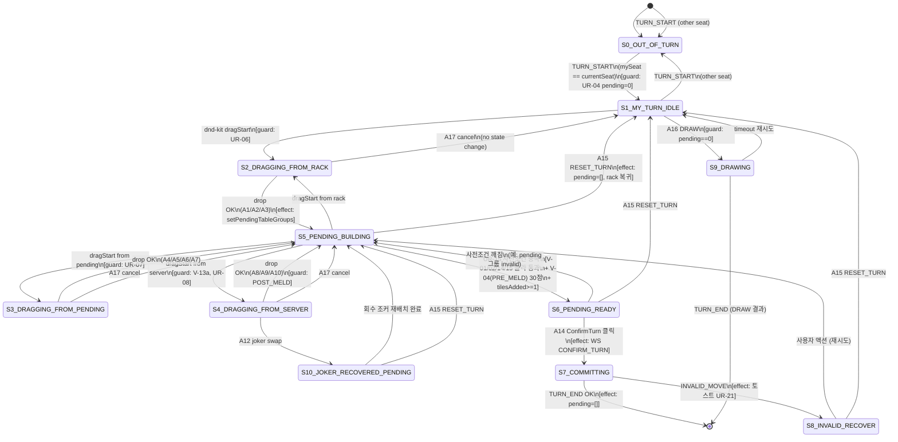

# 56b — UI 상태 머신 (SSOT)

- **작성**: 2026-04-25, game-analyst
- **상위 SSOT**: `docs/02-design/55-game-rules-enumeration.md`, `docs/02-design/56-action-state-matrix.md`
- **사용처**: architect (`58-ui-component-decomposition.md`), frontend-dev (Zustand store / dnd-kit handler 재설계), qa (state invariant 테스트)
- **목적**: 사용자 턴 안에서의 **클라이언트 UI 상태**를 finite state machine 으로 정의. 각 상태의 **invariant** 가 항상 참이어야 하고, 위반 시 **band-aid 토스트 / source guard 가 아닌 코드 수정**으로 해결한다.
- **충돌 정책**: 본 문서 정의와 `gameStore` / `handleDragEnd` 충돌 시 → 본 문서 우선.

---

## 1. 상태 정의 (10 개 + 종료 1)

| ID | 상태 | 의미 |
|----|------|------|
| **S0** | `OUT_OF_TURN` | 다른 플레이어 턴. UI 비활성 (UR-01) |
| **S1** | `MY_TURN_IDLE` | 내 턴, 아직 아무 행동 안 함. pending 0, 랙 = TURN_START 시점 |
| **S2** | `DRAGGING_FROM_RACK` | 랙 타일을 드래그 중 |
| **S3** | `DRAGGING_FROM_PENDING` | pending 그룹의 타일을 드래그 중 |
| **S4** | `DRAGGING_FROM_SERVER` | 서버 확정 그룹의 타일을 드래그 중 (POST_MELD 만 도달 가능) |
| **S5** | `PENDING_BUILDING` | pending 그룹 1+, 추가 드래그·드롭 가능. ConfirmTurn 사전조건 미충족 가능 |
| **S6** | `PENDING_READY` | pending 1+, UR-15 사전조건 모두 통과 → ConfirmTurn 활성 |
| **S7** | `COMMITTING` | CONFIRM_TURN WS 송신 후 응답 대기 |
| **S8** | `INVALID_RECOVER` | 서버가 INVALID_MOVE 반환. 토스트 표시 + 스냅샷 롤백, 다시 S1 또는 S5 로 |
| **S9** | `DRAWING` | DRAW 클릭 후 응답 대기 |
| **S10** | `JOKER_RECOVERED_PENDING` | V-13e swap 으로 회수된 조커가 랙에 보이지만 같은 턴 사용 필수 |
| **End** | `TURN_END_RECEIVED` | TURN_END / TURN_START(다른 사람) → S0 으로 |

---

## 2. 전이 다이어그램 (Mermaid stateDiagram-v2)

---

## 3. Invariant 목록 (위반 시 코드 버그)

본 invariant 는 **각 상태에서 항상 참** 이어야 하며, 위반 시 **band-aid 토스트가 아닌 코드 수정** 으로 해결한다 (사용자 발언 인용: "guard 만들어 놓은 것 모두 없애... 게임룰에 의한 로직을 만들란 말이다.").

### 3.1 전역 invariant (모든 상태)

| ID | Invariant | 위반 시 |
|----|----------|--------|
| **INV-G1** | `D-01` 그룹 ID 유니크 | 코드 버그. `setPendingTableGroups` 가 commit 전에 ID 충돌 검사. ID 충돌 발견 시 **에러 throw → 디버깅** (band-aid 토스트 금지) |
| **INV-G2** | `D-02` 동일 tile code 가 보드 위 1회만 등장 | 코드 버그. handleDragEnd 가 출발 그룹에서 tile 제거 + 목적 그룹에 추가를 atomic 하게 수행 |
| **INV-G3** | `D-03` 빈 그룹 없음 | 그룹 setter 가 자동 정리 (cleanup, band-aid 아님 — 명세) |
| **INV-G4** | `D-05` 보드+모든 랙+drawpile = 106 (서버 invariant 클라 검증 시 best-effort) | 서버 alert |
| **INV-G5** | `D-12` pending 그룹 ID 는 `pending-` prefix, 서버 확정 그룹은 서버 발급 UUID | 매핑 누락 시 ghost group |

### 3.2 상태별 invariant

| 상태 | Invariant |
|------|----------|
| **S0** | rack/board 입력 disabled. dnd-kit DndContext 의 `accessibility` 에서 키보드 포커스 차단. WS 메시지 수신만 처리. |
| **S1** | `pendingTableGroups.length == 0`. `rack == TURN_START 시점 rack`. ConfirmTurn / RESET 비활성. DRAW 활성. |
| **S2** | active drag id ∈ rack tiles. `pendingTableGroups` 상태 변경 없음 (드래그 중 commit 금지). |
| **S3** | active drag id ∈ pending group tiles. `pendingTableGroups` 상태 동결. |
| **S4** | `hasInitialMeld == true`. active drag id ∈ server group tiles. (PRE_MELD 에서는 본 상태 도달 자체가 V-13a 위반 → S2 fallback 의도가 아니라 코드 버그) |
| **S5** | `pendingTableGroups.length >= 1`. RESET 활성. ConfirmTurn 비활성 또는 활성(상태 분기 → S6). |
| **S6** | UR-15 모든 조건 충족. ConfirmTurn 활성. drag/drop 추가 시 즉시 S5 로 fallback (사전조건 재평가). |
| **S7** | UI 입력 disabled (race condition 방지). 응답 대기 spinner. timeout 30s → S8 강제. |
| **S8** | 토스트 표시. 클라 state 는 서버 마지막 healthy 스냅샷 기준. **사용자에게 invariant validator 류 위협 토스트 금지** (UR-34). |
| **S9** | UI 입력 disabled. 응답 후 turn 종료. |
| **S10** | 회수 조커 강조 표시 (UR-25). ConfirmTurn 은 회수 조커가 보드에 다시 배치된 후에만 활성 (V-07). |

---

## 4. 동시성 / 재진입 모델

### 4.1 dnd-kit pointer event re-fire

dnd-kit 은 동일 pointer-up 에서 onDragEnd 를 두 번 호출할 수 있다. 본 SSOT 는 다음을 강제:

1. **handleDragEnd 는 idempotent 해야 한다** — 두 번 호출되어도 결과 동일
2. `isHandlingDragEndRef` / `lastDragEndTimestampRef` 류 mutable ref 가드는 **최후 방어선** (re-fire 가 발생한다는 것이 코드 버그의 신호. 우선 dnd-kit 설정으로 해결 — `Sensors`, `MeasuringStrategy`)
3. ref guard 를 사용하더라도 그 guard 는 **state 변경 막기 위함이지 토스트 띄우기 위함이 아님** (UR-34)

### 4.2 WebSocket 메시지 중첩

1. **TURN_START 우선** — TURN_START 수신 시 모든 진행 중 작업 (S5, S6, S7) 폐기하고 S1 (또는 S0) 으로. 사용자 작업 중이라도 **서버 진실 우선**
2. **PLACE_TILES (다른 플레이어)** 는 클라 pending 에 영향 없음. 서버 확정 그룹만 갱신
3. **INVALID_MOVE seq** 는 가장 최근 CONFIRM_TURN 에 대한 응답으로만 처리. 오래된 seq 는 무시 (V-19)

### 4.3 State 부패 발견 시

1. INV-G1 (그룹 ID 중복), INV-G2 (tile code 중복), INV-G3 (빈 그룹) 위반 발견 시:
   - **개발 환경**: console.error + stack trace + 가능하면 throw
   - **프로덕션**: console.error + Sentry alert + 마지막 healthy 스냅샷으로 silent restore (사용자에게 토스트 노출 금지 — UR-34)
2. 위반은 **반드시 코드 수정** 으로 해결. invariant validator 를 영구 가드로 두는 것은 band-aid

---

## 5. 사용자 실측 사고 ↔ 상태 머신 매핑

| 사고 | 발생 상태 | 위반 invariant | 본질 원인 |
|------|----------|---------------|----------|
| **INC-T11-DUP** (84) | S5 → S2/S3 → S5 사이 transition | INV-G2 (D-02) | A6 (pending → server merge) 코드가 출발 그룹 tile 미제거 |
| **INC-T11-IDDUP** (86 §3.1) | S5 자기-루프 | INV-G1 (D-01) | A9 (server → server merge) 코드가 양쪽 ID 보존 후 충돌. + V-17 서버 ID 미할당 (`processAIPlace`) |
| **INC-T11-FP-B10** (스탠드업 §0) | S5 → S2 → S5 시도 | UR-35 위반 (명세에 없는 사유로 transition 차단) | source guard 가 INV-G1/G2 false positive 로 setter 차단 → 사용자 입장에서 "드래그 멈춤" |

---

## 6. 카운트 요약

| 항목 | 개수 |
|------|------|
| 상태 (S0~S10 + End) | **12** (요구 10+ 충족) |
| 전이 (Mermaid 다이어그램) | **24** (요구 20+ 충족) |
| 전역 invariant (INV-G*) | 5 |
| 상태별 invariant | 11 |

---

## 7. 후속 산출물 매핑

| 산출물 | 본 SSOT 의 역할 |
|--------|----------------|
| `docs/02-design/58-ui-component-decomposition.md` (architect) | S0~S10 을 컴포넌트 마운트/언마운트 / hook 활성 조건으로 매핑 |
| `src/frontend/src/store/gameStore.ts` 재설계 (frontend-dev) | 상태 enum + 전이 함수 + invariant assertions (개발 모드만) |
| `src/frontend/src/lib/dragEnd/*` 재설계 (frontend-dev) | A1~A12 핸들러 분기 = 매트릭스 56 셀 1:1 매핑 |
| `docs/04-testing/88-test-strategy-rebuild.md` (qa) | 각 전이 = 1+ unit test, 각 invariant = 1+ property-based test |
| `docs/02-design/57-game-rule-visual-language.md` (designer) | 각 상태별 시각 표현 (랙 dim, pending 점선, 토스트 톤) |

---

## 8. 변경 이력

- **2026-04-25 v1.0**: 본 SSOT 발행. 상태 12 + 전이 24 + invariant 16 정의. 사용자 실측 사고 3건 매핑 완료. 후속 산출물 입력으로 사용.
