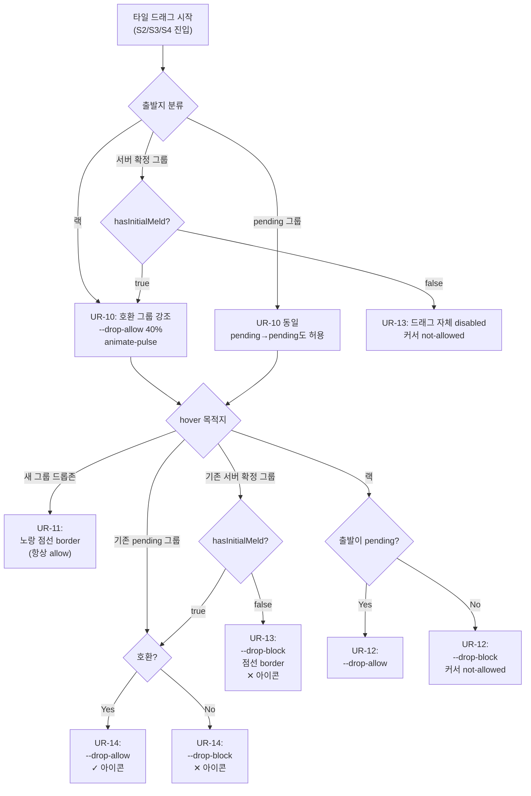
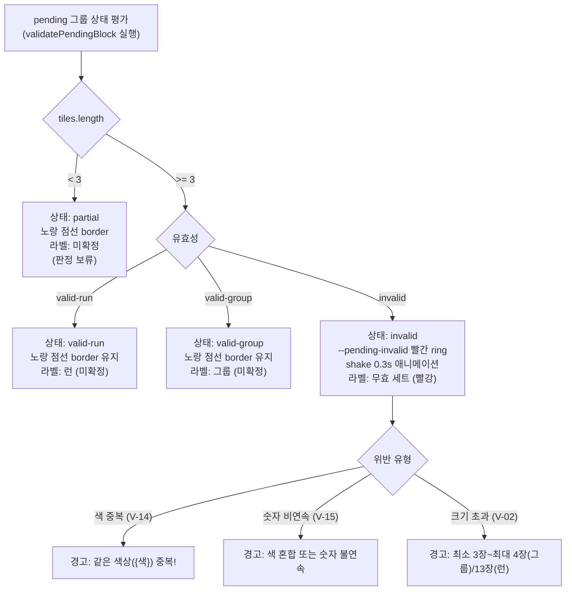
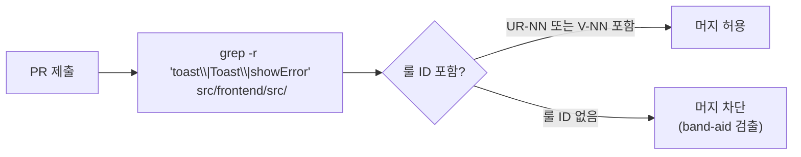
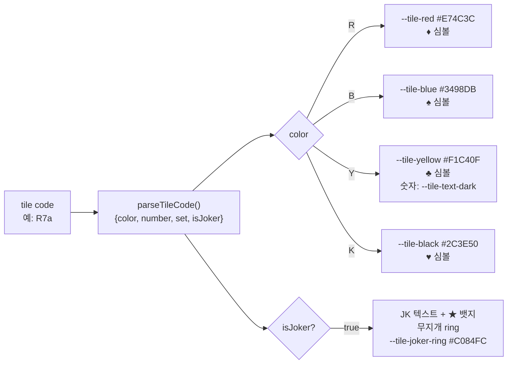
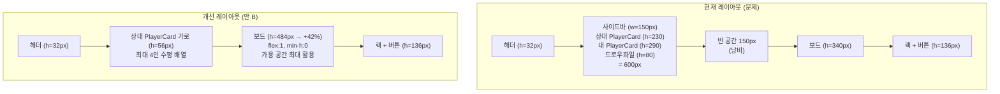

# 57 — 게임 룰 시각 언어 (Visual Language SSOT)

- **작성**: 2026-04-25, designer (claude-sonnet-4-6)
- **상위 SSOT**: `docs/02-design/55-game-rules-enumeration.md` (UR-01~UR-36), `docs/02-design/56b-state-machine.md` (S0~S10)
- **계승**: `docs/02-design/54-drop-zone-color-system.md` — 드롭존 3상태 색 토큰 (PR #73 산출물)
- **사용처**: frontend-dev (컴포넌트 props 주입), architect (컴포넌트 분해 58), qa (시각 회귀 테스트)
- **충돌 정책**: 본 문서 정의와 `GameBoard.tsx` / `Tile.tsx` 코드 충돌 시 → 본 문서 우선. 코드가 명세를 따른다.
- **band-aid 정책**: 토스트 / guard / 경고 메시지가 UR-ID 없이 코드에 등장하면 PR 머지 차단.

---

## 1. 디자인 토큰 전체 목록

### 1.1 기반 색상 토큰 (CSS 변수)

```
--tile-red:        #E74C3C   /* 빨강 타일 배경 */
--tile-blue:       #3498DB   /* 파랑 타일 배경 */
--tile-yellow:     #F1C40F   /* 노랑 타일 배경 */
--tile-black:      #2C3E50   /* 검정 타일 배경 */
--tile-text-light: #FFFFFF   /* 밝은 배경 위 숫자 (빨강/파랑/검정) */
--tile-text-dark:  #1A1A1A   /* 노랑 배경 위 숫자 */
--tile-joker-ring: #C084FC   /* 조커 무지개 링 (보라 기준) */

--board-bg:        #1A3328   /* 보드 배경 — 따뜻한 나무 계열 짙은 초록 */
--board-border:    #2A5A3A   /* 보드 경계선 */

--drop-allow:      #27AE60   /* 드롭 허용 — 초록 */
--drop-allow-bg:   rgba(39,174,96,0.12)
--drop-allow-border: rgba(39,174,96,0.70)
--drop-block:      #C0392B   /* 드롭 차단 — 빨간 */
--drop-block-bg:   rgba(192,57,43,0.12)
--drop-block-border: rgba(192,57,43,0.70)

--pending-border:  #F1C40F   /* pending 그룹 — 노랑 점선 */
--pending-bg:      rgba(241,196,15,0.10)
--pending-invalid: #E74C3C   /* pending 무효 — 빨간 ring + shake */

--toast-error:     #C0392B   /* INVALID_MOVE 토스트 배경 */
--toast-info:      #3498DB   /* 안내 토스트 배경 */
--toast-warn:      #E67E22   /* 경고 토스트 배경 */

--highlight-mine:   rgba(74,222,128,0.90)    /* 내가 놓은 타일 글로우 */
--highlight-opp:    rgba(251,146,60,0.90)    /* 상대가 놓은 타일 글로우 */

--timer-normal:    #3498DB   /* 타이머 기본 */
--timer-warn:      #F1C40F   /* 타이머 10초 이하 */
--timer-critical:  #E74C3C   /* 타이머 5초 이하 + 펄스 */

--state-connected: #3FB950   /* 연결됨 */
--state-disconn:   #F0883E   /* 연결 끊김 */
--state-forfeited: #484F58   /* 기권 */
--state-meld-done: #3FB950   /* 최초 등록 완료 */
--state-meld-none: rgba(231,76,60,0.50) /* 최초 등록 미완료 */
```

### 1.2 애니메이션 토큰

```
--dur-instant:  50ms    /* 즉각 피드백 (드롭존 hover) */
--dur-fast:    150ms    /* 상태 전환 */
--dur-normal:  300ms    /* 타일 등장/퇴장 */
--dur-slow:    500ms    /* 오버레이, 게임 종료 */
--ease-spring: spring stiffness=400 damping=20   /* 타일 드래그 */
--ease-out:    cubic-bezier(0,0,0.2,1)
--ease-bounce: cubic-bezier(0.68,-0.55,0.265,1.55)
```

### 1.3 접근성 심볼 (색약 보조)

| 색 | 코드 | 심볼 | 용도 |
|----|------|------|------|
| Red | R | ♦ | 타일 좌하단 |
| Blue | B | ♠ | 타일 좌하단 |
| Yellow | Y | ♣ | 타일 좌하단 |
| Black | K | ♥ | 타일 좌하단 |
| Joker | JK | ★ | 타일 우상단 |

---

## 2. UR-* 36개 시각 토큰 정의

### 2.1 그룹 A — 턴 권한 / 활성화 (UR-01~UR-05)

#### UR-01 — 다른 플레이어 턴: 전체 비활성

| 항목 | 값 |
|------|-----|
| **상태 매핑** | S0 `OUT_OF_TURN` |
| **랙 타일** | `opacity: 0.40` + `cursor: not-allowed` |
| **ConfirmTurn 버튼** | `disabled` + `opacity: 0.35` |
| **Draw 버튼** | `disabled` + `opacity: 0.35` |
| **보드 보더** | `--board-border` (기본, 변화 없음) |
| **props 주입** | `Tile draggable=false` / `GameBoard isMyTurn=false` |
| **메시지 카피** | 없음 (비활성 상태는 조용해야 함) |

#### UR-02 — 내 턴 시작: 랙 활성화 시각 신호

| 항목 | 값 |
|------|-----|
| **상태 매핑** | S0→S1 전이, TURN_START 수신 |
| **랙 컨테이너** | 1회 pulse 애니메이션 — `--highlight-mine` 테두리 0.6s fade in/out |
| **랙 타일** | `opacity: 1.0` + `cursor: grab` |
| **PlayerCard** | 현재 턴 뱃지 등장 (`spring` 100ms) |
| **메시지 카피** | 없음 (시각 신호만) |

#### UR-03 — AI 사고 중

| 항목 | 값 |
|------|-----|
| **상태 매핑** | `AI_THINKING` 이벤트 |
| **위치** | PlayerCard 하단, 보드 상단 status bar |
| **비주얼** | `w-1.5 h-1.5` 원형 dot, `--color-ai` 색, opacity 0.4↔1.0 1.2s 무한 |
| **카피** | "사고 중..." |
| **aria** | `role="status" aria-live="polite"` |

#### UR-04 — 턴 시작 시 pending 강제 초기화

| 항목 | 값 |
|------|-----|
| **상태 매핑** | S5/S6 → S1 강제 (TURN_START 수신) |
| **시각 효과** | pending 그룹이 있으면 `opacity: 0 scale(0.8)` 0.15s 퇴장 애니메이션 |
| **부작용** | 없음 — 상태만 초기화, 토스트 없음 (UR-34 준수) |

#### UR-05 — 턴 종료 직후 다음 플레이어 안내

| 항목 | 값 |
|------|-----|
| **상태 매핑** | TURN_END 수신 직후 5초 |
| **토스트 타입** | `--toast-info` / 5초 자동 닫힘 |
| **카피** | "{displayName}님의 차례입니다" |
| **룰 ID 명시** | UR-05 |

---

### 2.2 그룹 B — 드래그 시작 (UR-06~UR-10)

#### UR-06 — 랙 타일 드래그 허용

| 항목 | 값 |
|------|-----|
| **상태 매핑** | S1 → S2 전이 |
| **드래그 시작** | 타일 `scale(1.08) y(-2px)` spring 200ms |
| **DragOverlay** | 반투명 복사본 `opacity: 0.85` + `drop-shadow` |
| **커서** | `grabbing` |

#### UR-07 — pending 그룹 타일 드래그 허용

| 항목 | 값 |
|------|-----|
| **상태 매핑** | S5 → S3 전이 |
| **드래그 시작** | UR-06과 동일 |
| **pending 그룹** | 드래그 중 원위치 타일 `opacity: 0.35` ghost |

#### UR-08 — 서버 확정 그룹 타일 드래그 (POST_MELD만)

| 항목 | 값 |
|------|-----|
| **상태 매핑** | S5 → S4 전이 (`hasInitialMeld==true`인 경우만) |
| **전제 조건** | `hasInitialMeld==true` (PlayerCard "등록 완료" 상태) |
| **드래그 시작** | UR-06과 동일 |
| **PRE_MELD에서 시도** | UR-13 (드래그 자체가 disabled) |

#### UR-09 — 조커 드래그

| 항목 | 값 |
|------|-----|
| **상태 매핑** | UR-06/07/08과 동일 |
| **DragOverlay** | 조커 무지개 ring(`--tile-joker-ring`) 드래그 중에도 유지 |

#### UR-10 — 드래그 시작 시 호환 드롭존 강조

| 항목 | 값 |
|------|-----|
| **상태 매핑** | S2/S3/S4 진입 시 즉시 |
| **호환 그룹** | `ring-2` `--drop-allow` 40% opacity `animate-pulse` |
| **비호환 그룹** | `ring-1` `--drop-block` 20% opacity (드래그 중에만) |
| **비호환 이유 없음** | 드래그 중이 아닐 때는 모든 ring 제거 |
| **props 주입** | `GameBoard validMergeGroupIds={Set<string>}` |

---

### 2.3 그룹 C — 드롭 목적지 (UR-11~UR-17)

#### UR-11 — 랙 → 보드 새 그룹 드롭존

| 항목 | 값 |
|------|-----|
| **hover 상태** | 노랑 점선 보더 + `rgba(234,179,8,0.10)` bg + "새 그룹 생성" 라벨 |
| **색상 근거** | 새 그룹은 허용/차단이 아닌 "생성" 의미 → 노랑 구분 |
| **카피** | "+ 새 그룹 생성" |
| **V-04 미달 상황** | 드롭 자체는 허용 (서버 검증 시 차단). 드롭존은 항상 allow |

#### UR-12 — 보드 → 랙 드롭 (pending만 허용)

| 항목 | 값 |
|------|-----|
| **출발이 pending 그룹** | 랙 드롭존 `--drop-allow` 표시 |
| **출발이 서버 확정 그룹** | 랙 드롭존 `--drop-block` 표시 + 커서 `not-allowed` |
| **차단 시 카피** | 없음 (토스트 없음 — UR-12 는 드롭 거절로 조용히 처리) |

#### UR-13 — 서버 확정 그룹: PRE_MELD에서 드래그 차단

| 항목 | 값 |
|------|-----|
| **상태 매핑** | `hasInitialMeld==false`인 플레이어가 서버 확정 그룹 hover 시 |
| **타일** | `cursor: not-allowed` (droppable=false) |
| **그룹 컨테이너** | 드래그 시도 시 `--drop-block` 표시 (0.12s) |
| **토스트** | UR-31 발동 (별도 정의) |

#### UR-14 — 합병 가능 그룹만 드롭 허용

| 항목 | 값 |
|------|-----|
| **호환 그룹** | `ring-2` `--drop-allow` 70% + `--drop-allow-bg` (isOver 시) |
| **비호환 그룹** | `ring-2` `--drop-block` 70% + `--drop-block-bg` (isOver 시) |
| **아이콘** | 호환: 우상단 `✓` `--drop-allow` 색 / 비호환: `✕` `--drop-block` 색 |
| **색약 보조** | 실선 vs 점선 border 구분 |
| **sr-only** | 호환: "타일을 이 멜드에 이어붙일 수 있습니다" / 비호환: "이 멜드와 맞지 않습니다" |

#### UR-15 — ConfirmTurn 버튼 활성화 조건

| 항목 | 값 |
|------|-----|
| **비활성 상태 (S5)** | `opacity: 0.40` + `cursor: not-allowed` |
| **활성 상태 (S6)** | 완전 불투명 + `cursor: pointer` + 초록 ring pulse 1회 |
| **전환** | S5→S6: `opacity` 0.15s + ring pulse spring |
| **PRE_MELD + 점수 부족** | 버튼 하단에 UR-24 진척 바 표시 (별도 정의) |

#### UR-16 — RESET_TURN 버튼 활성화

| 항목 | 값 |
|------|-----|
| **pending 있을 때** | 완전 불투명 + `cursor: pointer` |
| **pending 없을 때** | `opacity: 0.30` + `cursor: not-allowed` |

#### UR-17 — 드래그 취소 (esc/onDragCancel)

| 항목 | 값 |
|------|-----|
| **시각 효과** | DragOverlay `opacity: 0 scale(0.9)` 150ms fade-out |
| **타일 복귀** | spring 애니메이션으로 원위치 |
| **부작용** | 없음 — 상태 변경 없음, 토스트 없음 |

---

### 2.4 그룹 D — 시각 강조 (UR-18~UR-26)

#### UR-18 — 호환 드롭존 색 토큰

| 항목 | 값 |
|------|-----|
| **CSS 변수** | `--drop-allow` `--drop-allow-bg` `--drop-allow-border` |
| **Tailwind 클래스** | `ring-2 ring-[#27ae60]/70 bg-[rgba(39,174,96,0.12)]` |
| **계승** | docs/02-design/54 §3.1 (PR #73) |

#### UR-19 — 비호환 드롭존 색 토큰

| 항목 | 값 |
|------|-----|
| **CSS 변수** | `--drop-block` `--drop-block-bg` `--drop-block-border` |
| **Tailwind 클래스** | `outline outline-2 outline-dashed outline-[#c0392b]/70 bg-[rgba(192,57,43,0.12)]` |
| **추가 패턴** | 대각선 해칭 `repeating-linear-gradient(-45deg, ...)` 색약 보조 |
| **계승** | docs/02-design/54 §3.1 (PR #73) |

#### UR-20 — pending 그룹 시각 표현

| 항목 | 값 |
|------|-----|
| **상태** | S5 `PENDING_BUILDING` |
| **그룹 컨테이너** | `opacity: 0.55` + 노랑 점선 border `border-dashed border-yellow-400` + `bg-yellow-400/10` |
| **라벨** | "런 (미확정)" / "그룹 (미확정)" / "미확정" — 노랑 색 `text-yellow-400 font-semibold` |
| **타일 수 배지** | 노랑 `bg-yellow-400/20 text-yellow-300` |
| **유효한 pending** | S6 → 라벨 색 유지, ConfirmTurn 버튼 활성화 |

#### UR-21 — INVALID_MOVE 토스트

| 항목 | 값 |
|------|-----|
| **색 토큰** | `--toast-error: #C0392B` |
| **형태** | 우상단 fixed, border-radius 8px, `drop-shadow` |
| **내용** | `[UR-ID/V-ID] {서버 ERR_* 메시지}` — 룰 ID 반드시 포함 |
| **예시** | "[V-01] 유효하지 않은 타일 조합 — 그룹 또는 런이어야 합니다" |
| **지속** | 4초 자동 닫힘 |
| **band-aid 금지** | 룰 ID 없는 INVALID_MOVE 토스트 코드 도입 금지 |

#### UR-22 — 드로우 파일 0: 버튼 라벨 변경

| 항목 | 값 |
|------|-----|
| **버튼 라벨** | "드로우 (1장)" → "패스" |
| **버튼 색** | 기본 → `--toast-warn` 계열 (구분 위해) |
| **아이콘** | 드로우 아이콘 → 패스 아이콘 (화살표 → 대시) |

#### UR-23 — 드로우 파일 소진 표시

| 항목 | 값 |
|------|-----|
| **위치** | 보드 드로우 파일 아이콘 위 |
| **시각** | X 마크 `text-danger` + `opacity: 0.80` |
| **카피** | "타일 소진" |

#### UR-24 — V-04 최초 등록 진척 표시

| 항목 | 값 |
|------|-----|
| **상태 매핑** | S5/S6 (PRE_MELD 플레이어만) |
| **형태** | ConfirmTurn 버튼 하단, 가로 진척 바 |
| **색** | 미달: `--toast-warn` / 30점 달성: `--drop-allow` |
| **카피** | "현재 {N}점 / 30점" |
| **달성 시** | 진척 바 완성 + ConfirmTurn 활성화 (UR-15 연동) |

#### UR-25 — 회수 조커 강조

| 항목 | 값 |
|------|-----|
| **상태 매핑** | S10 `JOKER_RECOVERED_PENDING` |
| **타일** | `--tile-joker-ring` 기반 pulse ring 무한 반복 |
| **안내 뱃지** | 랙 상단 "이번 턴에 사용해야 합니다" — `--toast-warn` 배경 |
| **ConfirmTurn** | V-07 미충족 시 비활성 (UR-15 연동) |

#### UR-26 — 타이머 경고

| 항목 | 값 |
|------|-----|
| **> 10초** | `--timer-normal: #3498DB` |
| **≤ 10초** | `--timer-warn: #F1C40F` + 숫자 pulse 1.0s |
| **≤ 5초** | `--timer-critical: #E74C3C` + 빠른 pulse 0.5s |
| **0초 도달** | 타이머 텍스트 shake 0.3s + 자동 드로우 실행 |

---

### 2.5 그룹 E — 게임 오버 / 특수 안내 (UR-27~UR-33)

#### UR-27 — 게임 종료 오버레이

| reason | 제목 카피 | 부제 카피 | 색 |
|--------|-----------|---------|-----|
| WIN | "{winnerName}님 승리!" | "ELO +{delta}" | `--highlight-mine` |
| ALL_PASS | "타일 소진 — 점수 비교" | "가장 낮은 점수 플레이어가 승리합니다" | `--toast-info` |
| FORFEIT | "{forfeiterName}님 기권" | "나머지 플레이어가 계속 진행합니다" | `--state-forfeited` |

**공통 형태**: 보드 위 full-overlay, `backdrop-filter: blur(4px)`, fade-in 0.5s, 닫기 버튼 포함.

#### UR-28 — 승리 오버레이 ELO 변동

| 항목 | 값 |
|------|-----|
| **상승** | "+{N}" `--highlight-mine` 색 + 위로 fly-in 애니메이션 |
| **하락** | "-{N}" `--timer-critical` 색 |
| **유지** | "±0" `--toast-info` 색 |

#### UR-29 — STALE_SEQ 안내

| 항목 | 값 |
|------|-----|
| **토스트 타입** | `--toast-warn` |
| **카피** | "[UR-29] 통신 지연 — 다시 시도해 주세요" |
| **지속** | 6초 |

#### UR-30 — V-04 미달 ConfirmTurn 시도

| 항목 | 값 |
|------|-----|
| **토스트 타입** | `--toast-error` |
| **카피** | "[V-04] 최초 등록은 30점 이상이어야 합니다 (현재 {N}점)" |
| **ConfirmTurn 버튼** | shake 애니메이션 0.3s |

#### UR-31 — V-13a 위반 시도

| 항목 | 값 |
|------|-----|
| **트리거** | PRE_MELD 상태에서 서버 확정 그룹 드래그 시도 |
| **토스트 타입** | `--toast-info` |
| **카피** | "[V-13a] 최초 등록 후에 보드 재배치가 가능합니다" |
| **지속** | 3초 |

#### UR-32 — 재연결 진행 중

| 항목 | 값 |
|------|-----|
| **위치** | 화면 상단 center bar |
| **카피** | "[UR-32] 재연결 중..." |
| **애니메이션** | dot ... 3개 순차 fade |
| **PlayerCard** | `--state-disconn` 색 dot + "끊김 (대기)" |

#### UR-33 — AI 강제 드로우

| 항목 | 값 |
|------|-----|
| **토스트 타입** | `--toast-info` |
| **카피** | "[UR-33] {aiName}이(가) 드로우합니다 (3회 무효 후)" |
| **지속** | 3초 |

---

### 2.6 그룹 F — 사용자 실측 사고 직접 매핑 UR (UR-34~UR-36)

#### UR-34 — state 부패 토스트 금지

| 항목 | 정의 |
|------|------|
| **금지 패턴** | "⚠ 상태 이상 감지", "invariant 오류", "소스 불일치" 류 토스트 일체 |
| **적용 범위** | 전체 frontend 코드베이스 |
| **위반 시** | PR 머지 차단 (band-aid 검출) |
| **대신** | 개발: console.error + throw / 프로덕션: Sentry + silent restore |
| **근거** | docs/04-testing/86 §3.1 (2차 사고) |

#### UR-35 — 드래그 false positive 차단 금지

| 항목 | 정의 |
|------|------|
| **금지 패턴** | V-13a/b/c/d/e, V-14, V-15 명세 외 사유로 드래그 막는 source guard 일체 |
| **예시** | "타일이 이미 다른 그룹에 있음" 류 guard (V-06/D-02 위반이면 코드 버그, guard가 아님) |
| **위반 시** | PR 머지 차단 |
| **근거** | 스탠드업 §0 (INC-T11-FP-B10 사고) |

#### UR-36 — ConfirmTurn 사전검증 범위 제한

| 항목 | 정의 |
|------|------|
| **허용** | V-01~V-15 클라이언트 미러 검증만 |
| **금지** | 임의 추가 게이트 ("그룹 ID 부재 확인", "소스 일치 확인" 등) |
| **위반 시** | PR 머지 차단 |
| **근거** | docs/04-testing/86 §4 source guard 사례 |

---

## 3. 드롭존 3상태 색 시스템 보강 (UX-004 계승)

### 3.1 전체 드롭존 상태 매트릭스



### 3.2 3상태 토큰 요약

| 상태 | 트리거 | border | bg | 아이콘 | border-style | 색약 보조 |
|------|--------|--------|----|--------|-------------|----------|
| Idle | 드래그 없음 | `--board-border` | `--board-bg` | 없음 | solid | 해당 없음 |
| Allow | hover + 호환 | `--drop-allow-border` | `--drop-allow-bg` | ✓ | solid 2px | 실선 + 체크 |
| Block | hover + 비호환 | `--drop-block-border` | `--drop-block-bg` | ✕ | dashed 2px | 점선 + X + 해칭 |

### 3.3 props 주입 방식 (컴포넌트 결합 없는 토큰 주입)

```
GameBoard props:
  validMergeGroupIds: Set<string>     -- UR-10/UR-14 호환 판정
  hasInitialMeld: boolean             -- UR-13/V-13a 차단 판정
  pendingGroupIds: Set<string>        -- UR-20 pending 표시
  invalidPendingGroupIds: Set<string> -- pending 무효 강조
  isDragging: boolean                 -- 드래그 중 상태 전달

DroppableGroupWrapper props (내부):
  isCompatible: boolean
  isPendingGroup: boolean
  hasInitialMeld: boolean
```

---

## 4. invalid 세트 표시 규칙 (V-01~V-15 위반)

### 4.1 시각 표현 결정 트리



### 4.2 위반별 시각 토큰

| 위반 룰 | 시각 표현 | 메시지 |
|---------|----------|--------|
| **V-01** (그룹/런 불일치) | 빨간 ring + shake + "무효 세트" | "색 혼합 또는 숫자 불연속" |
| **V-02** (세트 크기) | 빨간 ring + 타일 수 배지 강조 | "3장 이상이어야 합니다" |
| **V-14** (그룹 동색 중복) | 중복 타일 `ring-danger` + 경고 | "같은 색상({색}) 중복!" |
| **V-15** (런 비연속) | 비연속 타일 위치 표시 어려움 → 그룹 전체 경고 | "숫자가 연속되지 않습니다" |
| **V-04** (30점 미달) | ConfirmTurn 하단 진척 바 (UR-24) | "최초 등록은 30점 이상 (현재 N점)" |
| **V-13a** (재배치 권한) | 서버 확정 그룹 드래그 비활성 (UR-13) | "[V-13a] 최초 등록 후..." (UR-31) |

### 4.3 서버 응답 후 롤백 시 표시

서버가 INVALID_MOVE를 반환하면:

1. pending 그룹 전체 `invalidPendingGroupIds`에 추가
2. 모든 invalid 그룹 빨간 ring + shake 0.3s
3. UR-21 토스트 표시 (룰 ID 포함)
4. 상태 S7 → S8 (`INVALID_RECOVER`)
5. 사용자가 다시 드래그하거나 RESET 클릭 시 빨간 ring 해제

---

## 5. band-aid 토스트 금지 정책

### 5.1 토스트 허용 기준

토스트를 추가하려면 다음 3 조건을 모두 충족해야 한다.

1. **룰 ID 명시**: 코드 내 메시지 문자열에 `[UR-NN]` 또는 `[V-NN]` 포함
2. **SSOT 매핑**: 해당 룰 ID가 `docs/02-design/55-game-rules-enumeration.md`에 존재
3. **사용자 인지 목적**: 사용자가 어떤 행동을 수정해야 하는지 명확히 안내

### 5.2 토스트 금지 패턴 목록

| 금지 패턴 | 이유 | 대안 |
|-----------|------|------|
| "⚠ 상태 이상 감지" | UR-34 위반 — 구현 버그를 사용자에게 전가 | console.error + Sentry |
| "invariant 오류: 그룹 ID 중복" | UR-34 위반 | 코드 수정 (D-01 invariant) |
| "소스 타일을 찾을 수 없습니다" | UR-34/UR-35 위반 — source guard band-aid | handleDragEnd 로직 수정 |
| "타일이 이미 배치되었습니다" | UR-35 위반 — 명세 외 차단 | D-02 tile code 중복 코드 수정 |
| "유효하지 않은 그룹 ID" | UR-34/UR-36 위반 | V-17 서버 ID 할당 코드 수정 |
| 룰 ID 없는 임의 에러 문자열 | band-aid | 해당 UR/V ID 특정 후 재작성 |

### 5.3 PR 머지 게이트



---

## 6. 사용자 실측 사고 3건 — 시각 표현 부재 분석

### 6.1 INC-T11-DUP (docs/04-testing/84)

**사고**: Turn#11, B11 타일이 2개 그룹에 동시 등장 (D-02 위반)

**시각 표현 부재 항목:**
- D-02 위반 (tile code 중복)이 발생해도 사용자에게 아무 시각 신호 없음
- 결과: 사용자는 그룹 복제 상황을 인지하지 못하고 계속 진행

**부재 이유 분석:**
- D-02는 코드 버그 — 사용자 행동이 아닌 구현 오류
- 따라서 "시각 표현이 없는 것이 정상" (UR-34: 사용자에게 노출 금지)
- **근본 해결**: handleDragEnd의 atomic 이동 (출발 그룹 타일 제거 + 목적 그룹 추가 원자적 수행)
- **보완적 시각**: 개발 환경에서 D-02 위반 시 console.error + 화면 하단 개발자 overlay (프로덕션 미노출)

**UR 매핑 (신규 필요 없음, 코드 수정이 답):**
- D-02 setter guard → handleDragEnd 수정
- UR-14 드롭 호환성 검사가 `isCompatibleWithGroup` 정확히 동작하면 원천 방지 가능

### 6.2 INC-T11-IDDUP (docs/04-testing/86 §3.1)

**사고**: 그룹 ID 중복 (D-01 위반) → V-17 서버 ID 미할당 복합 사고

**시각 표현 부재 항목:**
- 그룹 ID 충돌이 발생해도 사용자에게 아무 시각 신호 없음
- ghost group (pending- prefix가 서버 ID로 교체 안 됨)이 화면에 잔존

**부재 이유 분석:**
- D-01 위반도 코드 버그 (UR-34)
- 단, V-17 ghost group 잔존은 사용자가 "왜 이 그룹이 계속 있지?" 인지 가능
- **보완적 시각 필요 (신규):** pending- prefix ID가 TURN_END 후에도 남아 있으면 그룹 dim 처리 + "확정 대기 중" 라벨

**권장 토큰 (UR-20 보강):**
- `pending-` ID가 서버 응답 후에도 남으면 `opacity: 0.25` + "서버 응답 대기" 라벨 (D-12 guard)

### 6.3 INC-T11-FP-B10 (스탠드업 §0)

**사고**: 정상 B10/B11/B12 런 합병이 source guard false positive로 차단됨 (UR-35 위반)

**시각 표현 부재 항목:**
- 드래그가 갑자기 막혔을 때 "왜 막혔는지" 표시 없음
- 사용자 입장: "B10을 왜 못 드래그하지?" — 원인 불명

**근본 원인:** source guard 토스트가 UR-34/UR-35 위반이므로 당연히 없음 (의도한 부재)

**그러나 사용자 인식 실패:** 사용자가 합법적 행동(V-13c 합병)을 시도했는데 차단되면 — 이것은 UI 버그의 무음 실패이므로 사용자 인지 불가

**권장:**
- UR-35 준수 = 명세 외 source guard 제거 → 드래그 자체가 막히지 않음
- 드래그 불가 이유가 V-13a 뿐이므로 UR-13 + UR-31만으로 충분

### 6.4 총평 — 시각 표현 부재 vs. 코드 버그 구분

| 항목 | 유형 | 시각 대응 |
|------|------|----------|
| D-01/D-02 (tile code/ID 중복) | 코드 버그 | UR-34 준수: 사용자 노출 없음. 개발자 console.error만 |
| V-17 ghost group 잔존 | 코드 버그 (WS handler) | UR-20 보강: pending- 미매핑 그룹 dim 처리 |
| UR-35 false positive 차단 | band-aid 코드 버그 | 코드 제거 = 시각 문제 해소 |
| V-13a PRE_MELD 드래그 차단 | 올바른 룰 적용 | UR-13 + UR-31로 이유 표시 (부재가 문제였음) |

**결론:** 사용자가 "왜 안 되는지 모르는" 상황은 2가지 유형으로 나뉜다.
1. **코드 버그의 무음 실패** (D-01/D-02): 토스트 금지, 코드 수정이 답
2. **올바른 룰 차단이지만 안내 부재** (V-13a): UR-13/UR-31 시각 표현 추가가 답

---

## 7. 모듈화 7원칙 self-check

### 7.1 검증 항목

| 원칙 | 항목 | 본 문서 준수 여부 | 근거 |
|------|------|-----------------|------|
| 1. SRP | 각 UR-*은 1개 시각 토큰 책임 | 통과 | UR-18/UR-19 별도 정의, UR-20/UR-21 별도 정의 |
| 2. 순수 함수 우선 | 토큰값은 상태와 무관한 순수 상수 | 통과 | CSS 변수로 정의, 상태에 따라 클래스만 전환 |
| 3. 의존성 주입 | 시각 토큰이 컴포넌트 props로 주입 가능 | 통과 | §3.3에서 props 인터페이스 명시 |
| 4. 계층 분리 | UI 토큰(CSS) ↔ 상태 판정(props) ↔ 룰 검증(함수) | 통과 | CSS 변수 = 표현, props = 상태, validatePendingBlock = 검증 |
| 5. 테스트 가능성 | 시각 상태는 props 입력 → DOM 클래스 출력으로 검증 가능 | 통과 | `isCompatible`, `hasInitialMeld` props = 결정적 입력 |
| 6. 수정 용이성 | UR-* 1개 변경 시 CSS 변수 1개 + 컴포넌트 1곳만 수정 | 통과 | `--drop-allow` 값 변경 → `GameBoard.tsx` 1곳 |
| 7. band-aid 금지 | 모든 토스트/guard에 룰 ID 필수 | 통과 | §5.1 기준 + PR 게이트 §5.3 |

### 7.2 컴포넌트 props 주입 가능성 검증

```
Tile 컴포넌트
  - invalid: boolean                    → --pending-invalid ring (UR-21)
  - highlightVariant: "mine"|"opponent" → --highlight-mine / --highlight-opp (UR-02)
  - draggable: boolean                  → cursor: grab / not-allowed (UR-01/06)

GameBoard 컴포넌트
  - validMergeGroupIds: Set<string>     → --drop-allow pulse (UR-10/14)
  - pendingGroupIds: Set<string>        → --pending-border (UR-20)
  - invalidPendingGroupIds: Set<string> → --pending-invalid ring (UR-21)
  - hasInitialMeld: boolean             → Block 상태 판정 (UR-13)
  - isDragging: boolean                 → 드롭존 활성화 여부 (UR-10)
  - isMyTurn: boolean                   → UR-01 비활성 / UR-06 활성

PlayerCard 컴포넌트
  - isCurrentTurn: boolean              → 황금 ring + "내 차례" 뱃지 (UR-02)
  - isAIThinking: boolean               → dot pulse (UR-03)
  - disconnectCountdown: number|undef  → --state-disconn 뱃지 (UR-32)
  - player.hasInitialMeld: boolean      → "등록 완료/전" dot (UR-13 연동)
```

---

## 8. 상태 머신 (S0~S10) 시각 표현 매핑

| 상태 | 랙 | 보드 | ConfirmTurn | RESET | 타이머 |
|------|-----|------|-------------|-------|--------|
| **S0** OUT_OF_TURN | dim 40% + not-allowed | 기본 | disabled 35% | disabled | 숨김 또는 비활성 |
| **S1** MY_TURN_IDLE | 완전 활성 + grab | 기본 | disabled 35% | disabled | 활성 (UR-26) |
| **S2** DRAGGING_FROM_RACK | 드래그 중 ghost | 드롭존 활성 (UR-10) | disabled | 활성 | 활성 |
| **S3** DRAGGING_FROM_PENDING | 드래그 중 ghost | 드롭존 활성 | disabled | 활성 | 활성 |
| **S4** DRAGGING_FROM_SERVER | 드래그 중 ghost | 드롭존 활성 | disabled | 활성 | 활성 |
| **S5** PENDING_BUILDING | 활성 | pending 노랑 점선 | disabled 40% | 활성 | 활성 |
| **S6** PENDING_READY | 활성 | pending 노랑 점선 | 활성 + ring pulse | 활성 | 활성 |
| **S7** COMMITTING | disabled (race방지) | 로딩 spinner | 로딩 중 | disabled | 활성 |
| **S8** INVALID_RECOVER | 활성 | invalid 빨간 ring | disabled | 활성 | 활성 |
| **S9** DRAWING | disabled | 기본 | disabled | disabled | 활성 |
| **S10** JOKER_RECOVERED_PENDING | 조커 pulse ring | pending 노랑 점선 | V-07 미충족: disabled | 활성 | 활성 |

---

## 9. 타일 디자인 시각 토큰 요약

### 9.1 색상 적용 규칙



### 9.2 b 세트 식별

- 동일 숫자 × 동일 색의 두 번째 세트 (`a`/`b` 접미)
- `b` 세트: 타일 우하단 2px dot `bg-current opacity-65`
- `a` 세트: dot 없음
- 크기 mini/icon에서는 dot 생략

### 9.3 invalid 타일 표시

- `invalid=true` prop: `ring-2 ring-danger` (빨간 ring)
- `selected=true` prop: 타일 `y(-6px)` 이동 + 우상단 `⬆` 뱃지 `--border-active`

---

---

## 11. 게임 보드 레이아웃 개선안

### 11.1 현 레이아웃 문제 분석

스크린샷 (`2026-04-25_102501.png`, `2026-04-25_102515.png`, `2026-04-25_102518.png`) 기준 박스 모델 측정:

```
┌─ 브라우저 viewport (1920×1080, 브라우저 UI 약 100px 소모) ─────────────┐
│ 실제 가용: 약 1920×950px                                                │
│                                                                          │
│ ┌─ 상단 헤더 바 (h≈30px) ──────────────────────────────────────────┐   │
│ │ Room ID    [타이머 바 + 초] [빈 공간]           [히스토리] [턴#]  │   │
│ └───────────────────────────────────────────────────────────────────┘   │
│                                                                          │
│ ┌─ 왼쪽 사이드바 ──┐ ┌─ 중앙 보드 영역 ───────────────┐ ┌─ 히스토리 ┐ │
│ │ wall (GPT-4o)    │ │                                │ │            │ │
│ │ [PlayerCard 1]   │ │  [빈 공간 약 150px 높이]        │ │            │ │
│ │ h≈230px          │ │                                │ │            │ │
│ │                  │ ├────────────────────────────────┤ │            │ │
│ │ 베진용 [내 차례]  │ │ [보드 영역: 타일 그룹들]       │ │            │ │
│ │ [PlayerCard 2]   │ │ 그룹 상단 위치: y≈250px        │ │            │ │
│ │ h≈290px          │ │                                │ │            │ │
│ │                  │ │ [나머지 보드: 빈 녹색 공간]    │ │            │ │
│ │ [드로우 파일]    │ │ 보드 전체 h≈340px              │ │            │ │
│ │ h≈80px           │ ├────────────────────────────────┤ │            │ │
│ └──────────────────┘ │ 타일 드래그... 안내 (h≈24px)  │ └────────────┘ │
│                       │ 내 파 (19장) · 30점 (h≈24px) │                │
│                       ├────────────────────────────────┤                │
│                       │ 내 타일 (19장) (h≈24px)       │                │
│                       │ [랙 타일 행] (h≈80px)         │                │
│                       ├────────────────────────────────┤                │
│                       │ [드로우] [초기화] [확정/확장] │                │
│                       │ h≈56px                         │                │
│                       └────────────────────────────────┘                │
└──────────────────────────────────────────────────────────────────────────┘
```

**문제 지점 3개:**

1. **왼쪽 사이드바 낭비**: PlayerCard 2개 (상대 + 내 것)가 세로 배열, 총 520px 소모. 상대 카드와 내 카드 사이 gap 과도.
2. **보드 상단 150px 빈 영역**: 플레이어 카드 영역 끝나는 지점과 보드 타일 시작 지점 불일치 — 보드 padding-top이 과도하거나 레이아웃 상 위 요소가 밀어낸 것.
3. **보드 자체 높이 낭비**: 보드 `min-h-[300px]` + `flex-1` 설정으로 타일이 상단 20%만 쓰고 나머지는 빈 녹색. 세로 300~400px 낭비.

### 11.2 개선 레이아웃 안 (3단계)

#### 안 A — 상단 플레이어 바 통합 (권장)

```
┌─ 헤더 바 (h=32px) ──────────────────────────────────────────────────────┐
│ Room ID   [====타이머 바====] 48s   [히스토리]  [턴#11]               │
├─────────────────────────────────────────────────────────────────────────┤
│ [상대 PlayerCard 가로] [상대 PlayerCard 가로] (h=56px, 콤팩트 horizontal) │
├──────────────────────────┬──────────────────────────────────────────────┤
│ 내 PlayerCard (좌 고정)   │  게임 보드 (flex-1, min-h=0)                │
│ w=160px h≈200px          │  타일 그룹이 상단부터 렌더됨                 │
│                          │  드롭존 포함 전체 영역 사용                  │
│ [드로우 파일 미니]        │                                              │
│                          │                                              │
├──────────────────────────┤                                              │
│                          │                                              │
│ [v 랙 스크롤 영역]        │                                              │
│ 내 타일 (19장)           │                                              │
│ [타일 행]               │                                              │
│                          │                                              │
│ [드로우][초기화][확정]    │                                              │
└──────────────────────────┴──────────────────────────────────────────────┘
```

#### 안 B — 플레이어 카드 가로 배열 + 보드 확장 (대안)

```
┌─ 헤더 (h=32px) ──────────────────────────────────────────────────────────┐
│  Room d330f59e   [=====타이머=====] 48s              [히스토리] [턴#11]  │
├──────────────────────────────────────────────────────────────────────────┤
│ ┌─상대1 (콤팩트)──┐  ┌─상대2───┐  ┌─상대3───┐       (h=64px 가로 배열)  │
│ │ A wall(GPT) 5장 │  │ ...     │  │ ...     │       연결됨● 등록 완료●  │
│ └─────────────────┘  └─────────┘  └─────────┘                          │
├──────────────────────────────────────────────────────────────────────────┤
│  게임 보드 (flex-1, overflow-auto, min-h=0)                             │
│ ┌──────────────────────────────────────────────────────────────────────┐ │
│ │ 그룹 3개  그룹 3개  런 3개  런 3개                                   │ │
│ │ [12][12][12]  [8][8][8]  [2][3][JK]  [2][3][4]                     │ │
│ │                                                                       │ │
│ │ (빈 공간 최소화 — flex-wrap + content-start)                         │ │
│ └──────────────────────────────────────────────────────────────────────┘ │
├──────────────────────────────────────────────────────────────────────────┤
│ 내 파 (19장) · 최초 등록 30점 이상 필요  [내 차례]  [↑ 정렬]           │
│ ┌──────────────────────────────────────────────────────────────────────┐ │
│ │ 내 타일: [9][4][13][10][12][4][4][4][7][12][11][2][6][5][3][9]... │ │
│ └──────────────────────────────────────────────────────────────────────┘ │
├──────────────────────────────────────────────────────────────────────────┤
│         [드로우]            [초기화]              [확정]                 │
└──────────────────────────────────────────────────────────────────────────┘
```

**안 B 권장 이유:**
- 상대 플레이어 카드를 가로 배열 → 사이드바 제거 → 보드가 전체 너비 사용
- 보드 `min-h: 0` + `flex: 1` → viewport 잔여 공간 모두 보드에 할당
- 내 PlayerCard는 랙 바 상단 인라인으로 통합

### 11.3 현 DOM 구조 분석 (라인 레벨은 frontend-dev 책임)

스크린샷 기준 추정 구조:

```
GameClient
  ├── 헤더 바 (Room ID + Timer + 히스토리 버튼)     ← h≈32px
  ├── main 영역 (flex-row)
  │   ├── 왼쪽 사이드바 (w≈150px)
  │   │   ├── PlayerCard 상대 (h≈230px)
  │   │   ├── PlayerCard 나 (h≈290px)             ← 합계 520px + gap
  │   │   └── 드로우 파일 표시
  │   └── 중앙 + 우측 (flex-col)
  │       ├── [빈 공간 150~200px]                  ← 문제: 이 공간이 낭비
  │       ├── GameBoard (flex-1)                   ← 보드는 아래에서 시작
  │       ├── 안내 텍스트
  │       ├── 랙 영역
  │       └── 버튼 행
  └── 히스토리 패널 (우측)
```

**빈 공간 발생 원인 가설** (frontend-dev가 코드에서 확인 필요):
- 사이드바의 두 PlayerCard 합계 높이(≈520px)가 중앙 영역의 `align-items` 기준점에 영향
- 또는 중앙 영역 상단에 `padding-top` 또는 투명한 wrapper div가 존재
- 또는 `justify-content: flex-end` 등 역방향 정렬이 있어 보드가 아래로 밀림

### 11.4 개선 spacing 토큰

```
--space-header-h:      32px    /* 헤더 고정 높이 */
--space-player-card-compact-h: 56px  /* 가로 배열 콤팩트 카드 높이 */
--space-player-card-full-h:   200px  /* 세로 배열 전체 카드 높이 */
--space-rack-h:        100px   /* 랙 영역 고정 높이 (타일 1행) */
--space-action-bar-h:   56px   /* 드로우/초기화/확정 버튼 행 */
--space-board-min-h:     0px   /* 보드 min-height — 가용 공간 모두 흡수 */

/* 보드 가용 높이 계산 (CSS calc) */
--board-available-h: calc(
  100vh
  - var(--space-header-h)          /* 헤더 */
  - var(--space-player-card-compact-h) /* 상대 카드 행 */
  - var(--space-rack-h)             /* 랙 */
  - var(--space-action-bar-h)       /* 버튼 행 */
  - 48px                            /* 안내 텍스트 + gap */
);
/* 예: 1080 - 32 - 56 - 100 - 56 - 48 = 788px → 보드 최대 사용 */
```

### 11.5 반응형 레이아웃 가이드라인

| 해상도 | 레이아웃 모드 | 플레이어 카드 | 보드 너비 |
|--------|-------------|-------------|---------|
| 1920×1080 | 안 B (가로 배열) | 가로 최대 4개, 각 w=220px | 100% - 패널 |
| 1440×900 | 안 B | 가로 최대 4개, 각 w=180px | 100% - 패널 |
| 1366×768 | 안 B (압축) | 가로 최대 4개, 각 w=160px, h=48px | 100% - 패널 (히스토리 패널 접힘) |

**1366×768 기준 계산:**
- 헤더: 32px / 상대 카드 행: 48px / 보드: 768 - 32 - 48 - 100 - 56 - 48 = **484px**
- 현재 보드 h: ~340px → 개선 후 484px (+42%)

### 11.6 Mermaid 레이아웃 다이어그램



### 11.7 구현 지시 (frontend-dev 책임)

본 섹션은 **레이아웃 명세**이며 코드 작성은 frontend-dev 담당. 라인 레벨 코드 작성 금지.

**변경 대상 파일**: `src/frontend/src/app/game/[roomId]/GameClient.tsx`

**지시 사항:**
1. 상대 PlayerCard를 사이드바에서 **상단 가로 행**으로 이동
2. 내 PlayerCard 정보(연결 상태, 등록 여부)를 **랙 바 상단 인라인**으로 통합 또는 상단 행에 포함
3. 사이드바 제거 또는 너비 0으로 축소 → 보드가 전체 너비 사용
4. 보드 컨테이너 `min-height: 0` + `flex: 1` 확인 → 가용 공간 모두 흡수
5. 보드 내부 `align-content: flex-start` (타일이 상단부터 배치)

**모듈화 7원칙 체크 (frontend-dev):**
- PlayerCard 컴포넌트: `variant="compact-horizontal"` prop으로 콤팩트 모드 전환 (SRP)
- 레이아웃 결정 로직은 GameClient가 아닌 레이아웃 컴포넌트로 분리

---

## 12. 변경 이력

- **2026-04-25 v1.0 designer**: 본 문서 발행. UR-* 36개 시각 토큰 정의. 드롭존 3상태 보강 (54 계승). invalid 세트 표시 규칙. 사용자 실측 사고 3건 분석. band-aid 토스트 금지 정책. 모듈화 7원칙 self-check 완료. 게임 보드 레이아웃 개선안 (§11) 추가.
