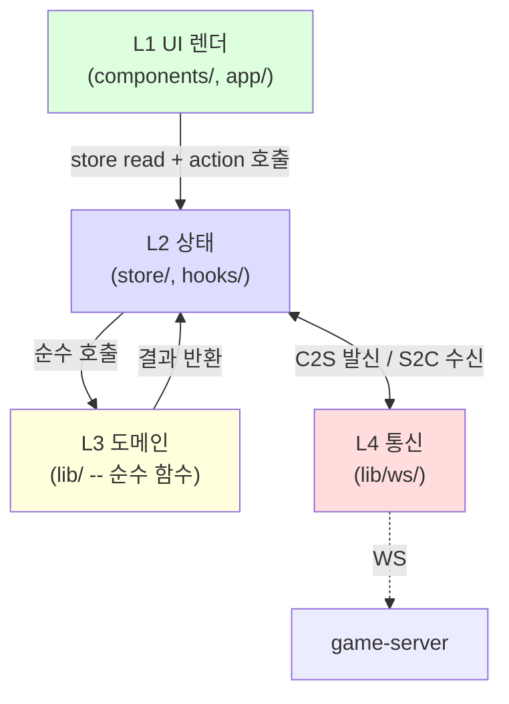
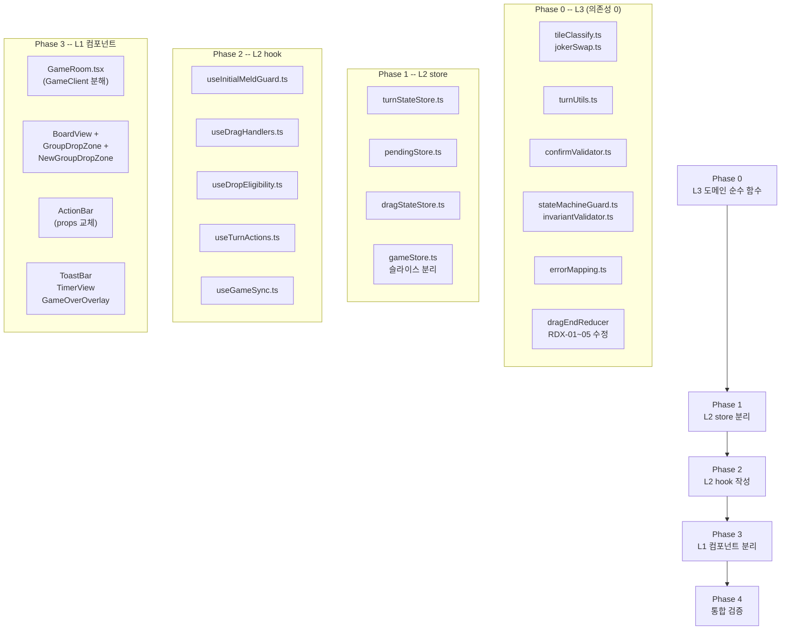

# 58 -- UI 컴포넌트 분해 구현 설계서

- **작성**: 2026-04-25, architect
- **상위 SSOT**:
  - `docs/02-design/55-game-rules-enumeration.md` (V-23 / UR-36 / D-12 = 71개 룰)
  - `docs/02-design/56-action-state-matrix.md` (A1~A21 행동 x 6차원 상태)
  - `docs/02-design/56b-state-machine.md` (S0~S10 상태 12 + 전이 24 + invariant 16)
  - `docs/02-design/60-ui-feature-spec.md` (F-NN 25개 카탈로그, P0 12개)
  - `docs/03-development/26-architect-impact.md` (4계층 ADR + 24개 컴포넌트 경계)
  - `docs/03-development/26b-frontend-source-review.md` (폐기 107 / 보존 1061 / 수정 1287)
- **목적**: "무엇을 만들 것인가"(분석 SSOT)와 "어떻게 구현할 것인가"(코드) 사이의 gap을 메운다. frontend-dev는 본 문서를 구현 blueprint로 사용한다. band-aid 양산을 구조적으로 차단한다.
- **충돌 정책**: 본 문서와 SSOT 55/56/56b/60 충돌 시 SSOT 우선. 본 문서와 코드 충돌 시 본 문서 우선 (코드가 본 문서를 따라야).
- **코드 수정 금지**: 본 문서는 설계 전용. 구현은 별도 dispatch.

---

## 1. 디렉터리 트리 (To-Be)

ADR 26에서 정의한 4계층(L1 UI / L2 상태 / L3 도메인 / L4 통신) 분리를 **실제 파일 경로**로 구체화한다. 각 파일의 1줄 설명과 책임 룰 ID를 명시한다.

### 1.1 To-Be 파일 트리

```
src/frontend/src/
|
|-- app/game/[roomId]/
|   |-- page.tsx                         # L1  라우트 entry (server component), 인증 redirect
|   |-- GameRoom.tsx                     # L1  게임 화면 합성 (DndContext + BoardView + RackView + ActionBar)
|
|-- components/game/
|   |-- BoardView.tsx                    # L1  보드 그리드 레이아웃 (그룹 배치 컨테이너)
|   |-- GroupDropZone.tsx                # L1  per-group 드롭존 + 시각 강조  [UR-14/18/19/20]
|   |-- NewGroupDropZone.tsx             # L1  "새 그룹 만들기" 드롭존  [UR-11]
|   |-- RackView.tsx                     # L1  플레이어 랙 (타일 배열 + 드래그 소스)
|   |-- ActionBar.tsx                    # L1  ConfirmTurn / RESET / DRAW 버튼 영역  [UR-15/16/22]
|   |-- TimerView.tsx                    # L1  턴 타이머 표시  [UR-26]
|   |-- ToastBar.tsx                     # L1  INVALID_MOVE / 안내 토스트  [UR-21/29/30]
|   |-- GameOverOverlay.tsx              # L1  게임 종료 오버레이  [UR-27/28]
|   |-- DrawPileVisual.tsx               # L1  드로우 파일 시각화  [UR-22/23]
|   |-- InitialMeldBanner.tsx            # L1  V-04 진행 표시 ("N점 / 30점")  [UR-24]
|   |-- JokerSwapIndicator.tsx           # L1  회수 조커 펄스 강조  [UR-25]
|   |-- ConnectionStatus.tsx             # L1  WS 재연결 인디케이터  [UR-32]
|   |-- PlayerCard.tsx                   # L1  (기존 보존)
|   |-- TurnHistoryPanel.tsx             # L1  (기존 보존)
|
|-- hooks/
|   |-- useDragHandlers.ts               # L2  onDragStart/End/Cancel 어댑터 (dragEndReducer 호출)  [A1~A12, UR-06/07/08/17]
|   |-- useDropEligibility.ts            # L2  드래그 중 호환 드롭존 집합 계산  [UR-10/14]
|   |-- useTurnActions.ts                # L2  handleConfirm / handleUndo / handleDraw 액션  [A14~A16]
|   |-- useGameSync.ts                   # L2  WS S2C -> store dispatch 연동  [A18~A21]
|   |-- useTurnTimer.ts                  # L2  턴 카운트다운  [UR-26]  (기존 보존 + 인터페이스 정리)
|   |-- useInitialMeldGuard.ts           # L2  hasInitialMeld SSOT 단일화  [V-13a]
|   |-- useWebSocket.ts                  # L2/L4 (기존 -- 점진 분리 대상, 1차에서는 보존)
|
|-- store/
|   |-- gameStore.ts                     # L2  서버 mirror 상태 (read-only from FE)  [D-01/D-02/D-12]
|   |-- pendingStore.ts                  # L2  pending 그룹 SSOT (FE 단독)  [UR-04/12, INV-G1/G2/G3]
|   |-- turnStateStore.ts                # L2  FSM S0~S10 상태 머신  [56b 전체]
|   |-- dragStateStore.ts                # L2  active drag id + hover target  [UR-06/07/08]
|   |-- wsStore.ts                       # L2  WS 연결 상태 + 에러  [UR-32]  (기존 보존)
|
|-- lib/
|   |-- dragEnd/
|   |   |-- dragEndReducer.ts            # L3  A1~A12 드래그 종료 순수 리듀서  [56 매트릭스 1:1]
|   |   |-- __tests__/                   # L3  by-action 단위 테스트 (기존 보존)
|   |-- mergeCompatibility.ts            # L3  드롭 호환성 판정  [V-14/15/16, UR-14]  (기존 보존)
|   |-- tileStateHelpers.ts              # L3  removeFirstOccurrence, detectDuplicateTileCodes  [D-02, INV-G2]
|   |-- tileClassify.ts                  # L3  classifySetType SSOT (신규 -- 중복 통합)  [D-10]
|   |-- jokerSwap.ts                     # L3  tryJokerSwap SSOT (신규 -- 중복 통합)  [V-07, V-13e]
|   |-- turnUtils.ts                     # L3  computeIsMyTurn, computeEffectiveMeld 순수 함수  [V-08, V-13a]
|   |-- confirmValidator.ts              # L3  ConfirmTurn 사전검증 (V-* 클라 미러)  [V-01/02/03/04/14/15, UR-36]
|   |-- stateMachineGuard.ts             # L3  S0~S10 전이 가드 (순수)  [56b 전이 24]
|   |-- invariantValidator.ts            # L3  INV-G1~G5 개발 모드 assert  [INV-G1~G5]
|   |-- errorMapping.ts                  # L3  ERR_* code -> 한글 메시지 매핑  [UR-21]
|   |-- ws/
|   |   |-- wsClient.ts                  # L4  WS 연결 / 재연결 / heartbeat singleton
|   |   |-- wsEnvelope.ts                # L4  envelope 직렬화 / seq 단조 증가  [D-11, V-19]
|   |-- tileDiff.ts                      # L3  (기존 보존)
|   |-- practice/                        # L3  (기존 보존)
```

### 1.2 신규 vs 기존 구분 요약

| 구분 | 파일 수 | 비고 |
|------|---------|------|
| **신규 생성** | 12 | pendingStore, turnStateStore, dragStateStore, useDragHandlers, useDropEligibility, useTurnActions, useGameSync, useInitialMeldGuard, tileClassify, jokerSwap, turnUtils, confirmValidator, stateMachineGuard, invariantValidator, errorMapping, wsClient, wsEnvelope |
| **기존 수정** | 8 | GameClient.tsx (분해), GameBoard.tsx (분리), gameStore.ts (슬라이스 분리), useWebSocket.ts (점진 위임), dragEndReducer.ts (RDX-01~05 보강), ActionBar.tsx, TimerView (=TurnTimer), globals.css |
| **기존 보존** | 11 | mergeCompatibility, tileStateHelpers, PlayerRack, PlayerCard, ConnectionStatus, ErrorToast, InitialMeldBanner, JokerSwapIndicator, TurnHistoryPanel, DraggableTile, Tile |
| **폐기** | 3 | GameClient.tsx 내 removeFirstOccurrence(89~92), classifySetType(64~83), tryJokerSwap(114~174) 중복 정의 |

### 1.3 계층 의존 규칙 (ESLint 강제 대상)



**금지 화살표**: L1 -> L3 (UI가 도메인 직접 호출 금지), L1 -> L4 (UI가 WS 직접 호출 금지), L3 -> L2 (도메인이 store 접근 금지), L3 -> L4 (도메인이 통신 접근 금지).

---

## 2. F-NN별 구현 명세

### 2.1 P0 12개 상세 명세

#### F-01 -- 내 턴 시작 인지

| 항목 | 내용 |
|------|------|
| **수정 대상 파일** | `useGameSync.ts` (신규), `turnStateStore.ts` (신규), `pendingStore.ts` (신규), `GameRoom.tsx` (신규) |
| **store 변경** | `turnStateStore.transition("TURN_START")` -> S0->S1. `pendingStore.reset()` (UR-04). `gameStore.setCurrentSeat(payload.seat)` |
| **컴포넌트 props** | `GameRoom`: `turnState: TurnState` (from turnStateStore). `RackView`: `disabled: boolean` (= turnState === "OUT_OF_TURN") |
| **hook 시그니처** | `useGameSync(roomId: string): void` -- WS S2C 수신 시 store dispatch. `useTurnTimer(): { remainingMs, isWarning, isCritical }` |
| **기존 코드 접점** | `useWebSocket.ts:199~216` TURN_START 핸들러. `GameClient.tsx:629~639` isMyTurn IIFE |
| **의존 F-NN** | 없음 (최초 진입점) |

#### F-02 -- 랙에서 보드 새 그룹 만들기

| 항목 | 내용 |
|------|------|
| **수정 대상 파일** | `useDragHandlers.ts` (신규), `dragEndReducer.ts` (기존 수정), `pendingStore.ts` (신규), `NewGroupDropZone.tsx` (기존 보존) |
| **store 변경** | `pendingStore.applyMutation(result)` -- dragEndReducer 결과를 atomic 적용. `pendingStore.groups` 에 `{id: "pending-{uuid}", tiles: [tileCode]}` 추가 |
| **컴포넌트 props** | `NewGroupDropZone`: `isActive: boolean` (= turnState in [S1, S5, S6]) |
| **hook 시그니처** | `useDragHandlers(): { handleDragStart, handleDragEnd, handleDragCancel }` |
| **기존 코드 접점** | `GameClient.tsx:1180~1211` (A1 분기), `dragEndReducer.ts:560~588` (rack->board:new-group) |
| **의존 F-NN** | F-01 (내 턴이어야 드래그 가능) |

#### F-03 -- 랙에서 기존 pending 그룹에 추가

| 항목 | 내용 |
|------|------|
| **수정 대상 파일** | `useDragHandlers.ts`, `dragEndReducer.ts`, `pendingStore.ts`, `GroupDropZone.tsx` (기존 수정) |
| **store 변경** | `pendingStore.applyMutation(result)` -- targetGroup.tiles에 tile 추가. ID 불변 (D-01) |
| **컴포넌트 props** | `GroupDropZone`: `isCompatible: boolean` (from useDropEligibility), `isPending: boolean` |
| **hook 시그니처** | `useDropEligibility(activeTile: TileCode | null): { validGroupIds: Set<string> }` |
| **기존 코드 접점** | `GameClient.tsx:925~973` (A2 분기), `dragEndReducer.ts:370~428` (rack->pending) |
| **의존 F-NN** | F-01, F-02 (pending 그룹이 먼저 존재해야) |

#### F-04 -- 랙에서 서버 확정 그룹에 extend

| 항목 | 내용 |
|------|------|
| **수정 대상 파일** | `useDragHandlers.ts`, `dragEndReducer.ts`, `pendingStore.ts`, `useInitialMeldGuard.ts` (신규), `GroupDropZone.tsx` |
| **store 변경** | `pendingStore.markServerGroupAsPending(serverId)` -- 서버 그룹 ID를 보존하면서 pending으로 마킹 (D-01, V-17). `pendingStore.applyMutation(result)` |
| **컴포넌트 props** | `GroupDropZone`: `isServerGroup: boolean`, `hasInitialMeld: boolean` (UR-13 disabled 결정) |
| **hook 시그니처** | `useInitialMeldGuard(): { hasInitialMeld: boolean, effectiveHasInitialMeld: boolean }` -- 7지점 참조를 단일 hook으로 통합 (W2-A 해소) |
| **기존 코드 접점** | `GameClient.tsx:1026~1072` (A3 분기), `dragEndReducer.ts:465~520` (rack->server-compat), `GameClient.tsx:491~495` effectiveHasInitialMeld useMemo |
| **의존 F-NN** | F-01, F-21 (호환 드롭존 시각 강조) |

#### F-05 -- pending 그룹 내 타일을 다른 곳으로 이동

| 항목 | 내용 |
|------|------|
| **수정 대상 파일** | `useDragHandlers.ts`, `dragEndReducer.ts` (RDX-01 수정: A5 pending->pending 호환성 검사 추가), `pendingStore.ts` |
| **store 변경** | `pendingStore.applyMutation(result)` -- src 그룹 tile 제거 + dest 그룹 tile 추가 **atomic** (INV-G2 보호). 빈 그룹 자동 제거 (INV-G3) |
| **컴포넌트 props** | `GroupDropZone`: 변경 없음 (기존 isCompatible prop 재사용) |
| **hook 시그니처** | 변경 없음 (useDragHandlers 내부 분기) |
| **기존 코드 접점** | `GameClient.tsx:802~878` (A4~A7 table 분기), `dragEndReducer.ts:196~293` (table->*) |
| **의존 F-NN** | F-02 또는 F-04 (pending 그룹이 존재해야) |

**주요 수정**: dragEndReducer RDX-01 -- A5(pending->pending) 분기에서 `isCompatibleWithGroup` 검사 추가. SSOT 56 3.6에서 COMPAT 시만 허용으로 명시.

#### F-06 -- 서버 확정 그룹 재배치 (split / merge / move)

| 항목 | 내용 |
|------|------|
| **수정 대상 파일** | `useDragHandlers.ts`, `dragEndReducer.ts` (RDX-02 수정: A4/A8 구현 추가), `pendingStore.ts`, `useInitialMeldGuard.ts` |
| **store 변경** | (i) `pendingStore.markServerGroupAsPending(srcId)` -- 출발 서버 그룹을 pending 전환. ID 보존 (V-17). (ii) `pendingStore.applyMutation(result)` -- tile 이동/분리/합병 |
| **컴포넌트 props** | `GroupDropZone`: `disabled: boolean` (= !hasInitialMeld, V-13a) |
| **hook 시그니처** | 변경 없음 |
| **기존 코드 접점** | `GameClient.tsx:833~877` (A8~A10 분기), `dragEndReducer.ts:239~293` (table->table) |
| **매핑 룰** | V-13a (재배치 권한), **V-13b (Split)**, **V-13c (Merge)**, **V-13d (Move)**, V-17 (그룹 ID 보존) |
| **의존 F-NN** | F-01, F-04 (hasInitialMeld 필수) |

**주요 수정**: dragEndReducer RDX-02 -- A4(pending->new group split) 및 A8(server->new group split) 분기 구현 추가. 현재 `table` 소스에서 `"game-board"` / `"game-board-new-group"` 드롭 시 `no-drop-position` reject 되는 것을 수정하여 새 pending 그룹 생성으로 처리.

#### F-09 -- ConfirmTurn (턴 확정)

| 항목 | 내용 |
|------|------|
| **수정 대상 파일** | `useTurnActions.ts` (신규), `confirmValidator.ts` (신규), `turnStateStore.ts`, `ActionBar.tsx` (기존 수정) |
| **store 변경** | `turnStateStore.transition("CONFIRM")` -> S6->S7. 서버 OK 시 `turnStateStore.transition("TURN_END")`, `pendingStore.reset()`. 서버 FAIL 시 `turnStateStore.transition("INVALID")` -> S8 |
| **컴포넌트 props** | `ActionBar`: `confirmEnabled: boolean` (= UR-15 사전조건), `onConfirm: () => void`, `onReset: () => void`, `onDraw: () => void` |
| **hook 시그니처** | `useTurnActions(): { handleConfirm, handleUndo, handleDraw, confirmEnabled: boolean, resetEnabled: boolean, drawEnabled: boolean }` |
| **기존 코드 접점** | `GameClient.tsx:1317~1425` handleConfirm. `GameClient.tsx:1342~1382` V-01/02/14/15 클라 미러 검증 인라인 |
| **의존 F-NN** | F-02~F-06 (pending이 존재해야), F-17 (V-04 점수 연동) |

**신규 파일 `confirmValidator.ts` 시그니처**:

```typescript
interface ValidationResult {
  valid: boolean;
  errorGroupId?: string;
  errorCode?: string;  // "ERR_SET_SIZE" | "ERR_INVALID_SET" | ...
}
function validateTurnPreCheck(
  pendingOnlyGroups: TableGroup[],
  hasInitialMeld: boolean,
  pendingPlacementScore: number,
  tilesAdded: number,
): ValidationResult;
```

이 함수는 V-01 (세트 유효성) / V-02 (세트 크기) / V-03 (최소 1장) / V-04 (30점) / V-14 (동색 중복) / V-15 (런 연속)의 **클라이언트 미러만** 수행한다. 그 외 게이트 추가는 UR-36에 의해 금지.

#### F-11 -- DRAW / 자동 패스

| 항목 | 내용 |
|------|------|
| **수정 대상 파일** | `useTurnActions.ts`, `ActionBar.tsx`, `DrawPileVisual.tsx` (기존 수정) |
| **store 변경** | `turnStateStore.transition("DRAW")` -> S1->S9. WS `DRAW_TILE` 발신 |
| **컴포넌트 props** | `ActionBar`: `drawEnabled: boolean` (= turnState === S1 && pendingCount === 0), `drawLabel: "드로우" | "패스"` (UR-22) |
| **hook 시그니처** | `useTurnActions` 내부의 `handleDraw()`. `drawEnabled` 은 pendingStore.groups.length === 0 일 때만 true |
| **기존 코드 접점** | `GameClient.tsx:1447~1455` handleDraw/handlePass |
| **의존 F-NN** | F-01 (내 턴이어야) |

#### F-13 -- INVALID_MOVE 회복

| 항목 | 내용 |
|------|------|
| **수정 대상 파일** | `useGameSync.ts`, `turnStateStore.ts`, `pendingStore.ts`, `ToastBar.tsx` (기존 수정, 기존 ErrorToast 개선), `errorMapping.ts` (신규) |
| **store 변경** | `turnStateStore.transition("INVALID")` -> S7->S8. `pendingStore.rollbackToServerSnapshot()` -- 서버 마지막 healthy 스냅샷으로 복원 |
| **컴포넌트 props** | `ToastBar`: `message: string` (errorMapping 결과), `variant: "error"` |
| **hook 시그니처** | `useGameSync` 내부 INVALID_MOVE 핸들러 |
| **기존 코드 접점** | `useWebSocket.ts:323~335` INVALID_MOVE 핸들러 |
| **의존 F-NN** | F-09 (CONFIRM 후 서버 응답) |

**신규 파일 `errorMapping.ts` 시그니처**:

```typescript
function resolveErrorMessage(code: string, fallback?: string): string;
```

현재 `useWebSocket.ts:49~79`의 `INVALID_MOVE_MESSAGES` 매핑을 별도 파일로 분리. UR-34 -- invariant validator 류 토스트는 이 매핑에 포함하지 않는다.

#### F-15 -- 턴 타이머 + 자동 드로우

| 항목 | 내용 |
|------|------|
| **수정 대상 파일** | `useTurnTimer.ts` (기존 수정), `TimerView.tsx` (기존 TurnTimer.tsx 개명/수정), `turnStateStore.ts` |
| **store 변경** | `gameStore.remainingMs` 카운트다운. 0 도달 시 서버 `TURN_END { reason: "TIMEOUT" }` 대기 |
| **컴포넌트 props** | `TimerView`: `remainingMs: number`, `isWarning: boolean` (<=10s), `isCritical: boolean` (<=5s) |
| **hook 시그니처** | `useTurnTimer(): { remainingMs, isWarning, isCritical, resetTimer(timeoutSec) }` |
| **기존 코드 접점** | `useTurnTimer.ts` 기존 hook. `GameClient.tsx` 내 타이머 관련 useEffect |
| **의존 F-NN** | F-01 (TURN_START에서 타이머 reset) |

#### F-17 -- V-04 초기 등록 진행 표시

| 항목 | 내용 |
|------|------|
| **수정 대상 파일** | `InitialMeldBanner.tsx` (기존 보존 + props 정리), `useInitialMeldGuard.ts` |
| **store 변경** | `pendingPlacementScore` 계산은 `pendingStore` 에서 derived selector로 |
| **컴포넌트 props** | `InitialMeldBanner`: `score: number`, `target: number` (= 30), `visible: boolean` (= !hasInitialMeld && turnState !== S0) |
| **hook 시그니처** | `useInitialMeldGuard().pendingPlacementScore: number` -- calculateScore(pendingOnlyGroups) 호출 |
| **기존 코드 접점** | `GameClient.tsx:666~672` pendingPlacementScore useMemo |
| **의존 F-NN** | F-02~F-04 (pending 그룹이 있어야 점수 계산 의미) |

#### F-21 -- 호환 드롭존 시각 강조

| 항목 | 내용 |
|------|------|
| **수정 대상 파일** | `useDropEligibility.ts` (신규), `GroupDropZone.tsx` (기존 수정), `mergeCompatibility.ts` (기존 보존) |
| **store 변경** | `dragStateStore.activeTile` 구독 -> `computeValidMergeGroups(activeTile, allGroups)` -> `validGroupIds: Set<string>` |
| **컴포넌트 props** | `GroupDropZone`: `dropState: "compatible" | "incompatible" | "neutral"` -- CSS 토큰 `--drop-allow` / `--drop-block` 적용 |
| **hook 시그니처** | `useDropEligibility(activeTile: TileCode | null): { validGroupIds: Set<string>, isEligible(groupId: string): boolean }` |
| **기존 코드 접점** | `GameClient.tsx:690~693` validMergeGroupIds useMemo |
| **의존 F-NN** | F-01 (드래그 시작 가능해야) |

### 2.2 P1 8개 요약 명세

| F-NN | 수정 대상 파일 | 핵심 store 변경 | 의존 F-NN |
|------|---------------|----------------|----------|
| **F-07** (조커 swap) | `useDragHandlers`, `dragEndReducer` (A12 분기 보존), `JokerSwapIndicator` | `pendingStore.applyMutation` + `pendingStore.addRecoveredJoker` | F-04 (POST_MELD) |
| **F-10** (RESET_TURN) | `useTurnActions`, `pendingStore`, `turnStateStore` | `pendingStore.reset()`, `turnStateStore.transition("RESET")` -> S1 | F-02~F-06 (pending 존재) |
| **F-12** (드래그 취소) | `useDragHandlers` | `dragStateStore.clearActive()`, **state 변경 0** (UR-17) | F-01 |
| **F-14** (관전) | `useGameSync`, `BoardView` | `gameStore.applyPlace(payload)` -- pending 영향 없음 | F-01 |
| **F-16** (게임 종료) | `useGameSync`, `GameOverOverlay` (기존 수정) | `gameStore.setEnd(payload)`, `turnStateStore.transition("GAME_OVER")` | 없음 |
| **F-18** (회수 조커 강조) | `JokerSwapIndicator` (기존 보존) | `pendingStore.recoveredJokers` 구독 | F-07 |
| **F-20** (WS 재연결) | `ConnectionStatus` (기존 보존), `useWebSocket` | `wsStore.status` 구독 | 없음 |
| **F-22/23** (로비/룸) | 기존 파일 보존 | 게임 도메인 외 | 없음 |

---

## 3. dragEndReducer <-> 매트릭스 56 셀 매핑표

### 3.1 A1~A12 함수 매핑

| A-ID | 행동 | dragEndReducer 분기 | 라인 범위 (현재) | 거취 | SSOT 56 셀 |
|------|------|---------------------|------------------|------|-----------|
| **A1** | 랙 -> 새 그룹 | `rack->board:new-group` / `rack->board-new-group:ok` | 560~619 | **보존** | 3.2: MY_TURN / * / 허용 |
| **A2** | 랙 -> pending 병합 | `rack->pending-compat:merge` | 405~428 | **보존** | 3.3: COMPAT 시 허용 |
| **A3** | 랙 -> 서버 extend | `rack->server-compat:merge` | 496~520 | **보존** | 3.4: POST_MELD+COMPAT 시 허용 |
| **A4** | pending -> 새 그룹 (split) | **미구현** | -- | **신규 작성** | 3.5: 항상 허용 |
| **A5** | pending -> pending 병합 | `table->table` 통합 분기 | 239~293 | **수정** (RDX-01: 호환성 검사 추가) | 3.6: COMPAT 시만 허용 |
| **A6** | pending -> 서버 확정 | `table->table` 통합 분기 | 239~293 | **보존** | 3.7: POST_MELD+COMPAT 시 허용 |
| **A7** | pending -> 랙 회수 | `table->rack:ok` | 207~237 | **보존** | 3.8: 항상 허용 |
| **A8** | 서버 -> 새 그룹 (split) | **미구현** | -- | **신규 작성** | 3.9: POST_MELD 시 허용 |
| **A9** | 서버 -> 서버 병합 | `table->table` 통합 분기 | 239~293 | **보존** | 3.10: POST_MELD+COMPAT 시 허용 |
| **A10** | 서버 -> pending | `table->table` 통합 분기 | 239~293 | **보존** | 3.11: POST_MELD+COMPAT 시 허용 |
| **A11** | 서버 -> 랙 (거절) | `table->rack:server-locked` | 207~210 | **보존** | 3.12: 전체 거절 (V-06) |
| **A12** | 조커 swap | `rack->joker-swap:ok` | 333~368 | **보존** | 3.13: POST_MELD 시 허용 |

### 3.2 폐기 / 보존 / 재작성 분류

| 코드 분기 | dragEndReducer 라인 | 분류 | 사유 |
|----------|---------------------|------|------|
| `classifySetType` (25~35) | 중복 정의 | **폐기** -> `lib/tileClassify.ts` import | RDX-05: D-10 단일 소스 원칙 |
| `tryJokerSwap` (46~102) | 중복 정의 | **폐기** -> `lib/jokerSwap.ts` import | RDX-05: V-13e 단일 소스 원칙 |
| `table->table` A5 분기 (239~293) | pending->pending 호환성 미검사 | **수정** | RDX-01: SSOT 56 3.6 COMPAT 시만 허용 |
| `table->game-board/game-board-new-group` 경로 | 미구현 | **신규 작성** | RDX-02: A4/A8 split via new group |
| `rack->rack` 분기 (300~330) | pending에서 tile 회수 로직 | **보존** | A7 의 대안 경로 (rack 소스 -> pending 회수) |
| `rack->server-preinitial` (432~463) | 새 그룹 생성 + warning | **보존** | V-13a PRE_MELD 시 올바른 처리 |
| 각 분기의 `detectDuplicateTileCodes` 방어선 | 모든 분기 | **보존** | INV-G2 최후 방어선 (UR-34 토스트와 분리) |

### 3.3 신규 작성 함수 시그니처

**A4 -- pending -> 새 그룹 (split via new)**:

```typescript
// dragEndReducer 내부 table 분기에 추가
// overId === "game-board" || overId === "game-board-new-group" 일 때
// source.kind === "table" && sourceIsPending

// 입력: source 그룹에서 tile 1개 분리, 새 pending 그룹 생성
// 출력: nextTableGroups (source 그룹 tile 제거 + 새 그룹 추가)
// 조건: hasInitialMeld 무관 (pending은 자기 것)
```

**A8 -- 서버 -> 새 그룹 (split server)**:

```typescript
// dragEndReducer 내부 table 분기에 추가
// overId === "game-board" || overId === "game-board-new-group" 일 때
// source.kind === "table" && !sourceIsPending

// 입력: source 서버 그룹에서 tile 1개 분리, 새 pending 그룹 생성
// 출력: nextTableGroups (source 그룹 pending 전환 + tile 분리 + 새 그룹)
// 조건: hasInitialMeld === true (V-13a)
```

**A5 호환성 검사 추가 (RDX-01)**:

```typescript
// 기존 table->table 분기에서
// targetIsPending === true 일 때에도 isCompatibleWithGroup 검사 추가
// 비호환 시 rejectWith("incompatible-merge", "table->table:incompatible-pending")
```

---

## 4. gameStore 변경 설계

### 4.1 현재 store 상태 스키마

현재 `gameStore.ts`는 단일 Zustand store에 다음 슬라이스가 혼재한다:

| 슬라이스 | 필드 | 성격 |
|---------|------|------|
| 서버 mirror | `gameState`, `players`, `myTiles`, `mySeat`, `turnNumber`, `hasInitialMeld` | 서버 진실 |
| pending (FE 단독) | `pendingTableGroups`, `pendingMyTiles`, `pendingGroupIds`, `pendingRecoveredJokers` | 현재 턴 입력값 |
| UI 보조 | `remainingMs`, `aiThinkingSeat`, `currentPlayerId`, `activeDragCode` | UI 표시 |
| 게임 종료 | `gameEnded`, `gameOverResult`, `gameStatus`, `endReason`, `winner` | 종료 상태 |
| 히스토리 | `turnHistory`, `lastTurnPlacement` | 하이라이트 |
| 연결 | `disconnectedPlayers`, `isDrawPileEmpty`, `deadlockReason` | 네트워크/교착 |

### 4.2 추가할 상태 필드

#### turnStateStore (신규)

```typescript
type TurnState =
  | "OUT_OF_TURN"           // S0
  | "MY_TURN_IDLE"          // S1
  | "DRAGGING_FROM_RACK"    // S2
  | "DRAGGING_FROM_PENDING" // S3
  | "DRAGGING_FROM_SERVER"  // S4
  | "PENDING_BUILDING"      // S5
  | "PENDING_READY"         // S6
  | "COMMITTING"            // S7
  | "INVALID_RECOVER"       // S8
  | "DRAWING"               // S9
  | "JOKER_RECOVERED"       // S10
  ;

interface TurnStateStore {
  state: TurnState;
  transition(action: TurnAction): void;
}

type TurnAction =
  | "TURN_START"        // -> S1 (내 턴) 또는 -> S0 (상대 턴)
  | "DRAG_START_RACK"   // S1/S5 -> S2
  | "DRAG_START_PENDING"// S5 -> S3
  | "DRAG_START_SERVER" // S5 -> S4 (POST_MELD만)
  | "DROP_OK"           // S2/S3/S4 -> S5
  | "DRAG_CANCEL"       // S2/S3/S4 -> S1 또는 S5
  | "PRE_CHECK_PASS"    // S5 -> S6
  | "PRE_CHECK_FAIL"    // S6 -> S5
  | "CONFIRM"           // S6 -> S7
  | "TURN_END_OK"       // S7 -> S0
  | "INVALID"           // S7 -> S8
  | "RESET"             // S5/S6/S8/S10 -> S1
  | "DRAW"              // S1 -> S9
  | "DRAW_OK"           // S9 -> S0
  | "JOKER_SWAP"        // S4 -> S10
  | "JOKER_PLACED"      // S10 -> S5
  | "GAME_OVER"         // * -> terminal
  ;
```

`transition(action)` 내부는 `stateMachineGuard.ts`의 순수 함수를 호출한다. 56b의 24개 전이를 switch exhaustiveness로 매핑.

#### pendingStore (신규)

```typescript
interface PendingDraft {
  groups: TableGroup[];           // pending 그룹 목록 (pending- prefix ID)
  pendingGroupIds: Set<string>;   // pending으로 마킹된 그룹 ID (서버 그룹 ID 포함)
  myTiles: TileCode[];            // 현재 턴 랙 상태 (tile 제거 반영)
  recoveredJokers: TileCode[];    // V-07 회수 조커
  turnStartRack: TileCode[];      // TURN_START 시점 랙 (RESET용 스냅샷)
  turnStartTableGroups: TableGroup[];  // TURN_START 시점 테이블 (rollback용)
}

interface PendingStore {
  draft: PendingDraft | null;     // null = pending 없음 (S1 상태)
  
  // 액션
  applyMutation(result: DragOutput): void;   // dragEndReducer 결과 atomic 적용
  markServerGroupAsPending(id: string): void; // 서버 그룹 -> pending 마킹
  reset(): void;                              // UR-04: 전체 초기화
  rollbackToServerSnapshot(): void;           // INVALID_MOVE 시 서버 스냅샷 복원
  
  // selector (derived)
  tilesAdded(): number;            // 랙에서 보드로 옮긴 타일 수
  pendingPlacementScore(): number; // V-04 점수 계산
  hasPending(): boolean;           // draft !== null && draft.groups.length > 0
}
```

#### dragStateStore (신규)

```typescript
interface DragStateStore {
  activeTile: TileCode | null;
  activeSource: DragSource | null;
  hoverTarget: string | null;
  
  setActive(tile: TileCode, source: DragSource): void;
  setHoverTarget(targetId: string | null): void;
  clearActive(): void;
}
```

### 4.3 기존 gameStore 수정

```typescript
// 제거할 필드 (pendingStore로 이전):
//   pendingTableGroups, pendingMyTiles, pendingGroupIds, pendingRecoveredJokers
//   resetPending() -> pendingStore.reset()로 위임
//   addPendingGroupId, clearPendingGroupIds, setPendingGroupIds
//   addRecoveredJoker, removeRecoveredJoker, clearRecoveredJokers

// 제거할 필드 (turnStateStore로 이전):
//   (현재 명시적 turnState 필드 없음 -- 새로 추가되는 것)

// 제거할 필드 (turnUtils.ts 순수 함수로 대체):
//   hasInitialMeld -> selectEffectiveMeld(players, mySeat) selector로 대체

// 보존할 필드:
//   room, mySeat, myTiles, gameState, players, remainingMs
//   aiThinkingSeat, currentPlayerId, turnNumber
//   gameEnded, gameOverResult, gameStatus, endReason, winner
//   disconnectedPlayers, isDrawPileEmpty, deadlockReason
//   turnHistory, lastTurnPlacement
```

### 4.4 selector 정의

```typescript
// gameStore selectors
function selectIsMyTurn(state: GameStore): boolean;          // V-08
function selectEffectiveMeld(state: GameStore): boolean;     // V-13a -- 7지점 통합
function selectCurrentSeat(state: GameStore): number;        // 현재 턴 seat
function selectMyPlayer(state: GameStore): Player | undefined;

// pendingStore selectors (derived)
function selectTilesAdded(state: PendingStore): number;      // V-03
function selectPendingPlacementScore(state: PendingStore): number; // V-04
function selectAllGroupsValid(state: PendingStore): boolean; // UR-15 사전조건
function selectConfirmEnabled(state: PendingStore, hasInitialMeld: boolean): boolean; // UR-15 종합

// turnStateStore selectors
function selectCanDrag(state: TurnStateStore): boolean;      // S1/S5/S6/S8에서만 true
function selectCanConfirm(state: TurnStateStore): boolean;   // S6에서만 true
function selectCanDraw(state: TurnStateStore): boolean;      // S1에서만 true
function selectCanReset(state: TurnStateStore): boolean;     // S5/S6/S8/S10에서만 true
```

---

## 5. WS 이벤트 <-> store 액션 매핑

### 5.1 S2C (서버 -> 클라이언트) 이벤트 매핑

| S2C 메시지 | store 액션 (순서대로) | 현재 useWebSocket.ts 핸들러 | 수정 사항 |
|-----------|---------------------|-----------------------------|----------|
| `AUTH_OK` | `gameStore.setMySeat(seat)` | 140~143행 | 보존 |
| `GAME_STATE` | (1) `gameStore.replace(payload)` (2) `pendingStore.reset()` (3) `turnStateStore.recompute()` | 146~197행 | `pendingStore.reset()` 추가, hasInitialMeld SSOT 동기화 보존 |
| `TURN_START` | (1) `pendingStore.reset()` (2) `turnStateStore.transition("TURN_START")` (3) `gameStore.setCurrentSeat(seat)` (4) `gameStore.setRemainingMs(timeoutSec*1000)` (5) `pendingStore.saveTurnStartSnapshot(rack, tableGroups)` | 199~216행 | `pendingStore` 스냅샷 저장 추가 |
| `TURN_END` | (1) `gameStore.applyTurnEnd(payload)` (2) `pendingStore.reset()` (3) `turnStateStore.transition("TURN_END_OK")` | 219~298행 | 기존 복잡한 setState 내부 로직 보존, pendingStore 위임 |
| `TILE_PLACED` | `gameStore.applyPlace(payload)` | 301~308행 | 보존 (pending 영향 없음) |
| `TILE_DRAWN` | `gameStore.applyDraw(payload)` | 310~321행 | 보존 |
| `INVALID_MOVE` | (1) `turnStateStore.transition("INVALID")` (2) `pendingStore.rollbackToServerSnapshot()` (3) `toastStore.show(resolveErrorMessage(code))` (4) WS `RESET_TURN` 발신 | 323~335행 | `pendingStore.rollbackToServerSnapshot` 교체, UR-34 강제 |
| `GAME_OVER` | (1) `gameStore.setEnd(payload)` (2) `turnStateStore.transition("GAME_OVER")` | 337~364행 | 보존 |
| `PLAYER_DISCONNECTED` | `gameStore.addDisconnectedPlayer(info)` | 383~404행 | 보존 |
| `PLAYER_RECONNECTED` | `gameStore.removeDisconnectedPlayer(seat)` | 406~418행 | 보존 |
| `PLAYER_FORFEITED` | `gameStore.applyForfeit(payload)` | 421~448행 | 보존 |
| `DRAW_PILE_EMPTY` | `gameStore.setIsDrawPileEmpty(true)` | 451~460행 | 보존 |
| `GAME_DEADLOCK_END` | `gameStore.setDeadlockReason(reason)` | 462~469행 | 보존 |
| `AI_THINKING` | `gameStore.setAiThinking(seat)` | 471~490행 | 보존 |
| `TIMER_UPDATE` | `gameStore.setRemainingMs(ms)` | 497행 이후 | 보존 |
| `ERROR` | `toastStore.show(message)` | (기존 setLastError) | errorMapping.ts 경유 |

### 5.2 C2S (클라이언트 -> 서버) 이벤트 매핑

| L2 action | C2S 메시지 | 호출 위치 | 변경 사항 |
|----------|-----------|----------|----------|
| `handleConfirm()` | `CONFIRM_TURN { tableGroups, tilesFromRack }` | `useTurnActions` | `turnStateStore.transition("CONFIRM")` 후 발신 |
| `handleDraw()` | `DRAW_TILE {}` | `useTurnActions` | `turnStateStore.transition("DRAW")` 후 발신 |
| `handleUndo()` | `RESET_TURN {}` | `useTurnActions` | `pendingStore.reset()` + `turnStateStore.transition("RESET")` |
| INVALID_MOVE 수신 후 | `RESET_TURN {}` | `useGameSync` | 서버 상태 복원 요청 (기존 C-1 보존) |

### 5.3 useWebSocket.ts 수정 핸들러 목록

| 핸들러 | 수정 유형 | 내용 |
|--------|---------|------|
| TURN_START | **수정** | `pendingStore.reset()` 위임 + `pendingStore.saveTurnStartSnapshot()` 추가 |
| TURN_END | **수정** | `pendingStore.reset()` 위임 |
| INVALID_MOVE | **수정** | `pendingStore.rollbackToServerSnapshot()` 교체, `turnStateStore.transition("INVALID")` 추가 |
| GAME_STATE | **수정** | `pendingStore.reset()` 위임 |
| GAME_OVER | **수정** | `turnStateStore.transition("GAME_OVER")` 추가 |
| 나머지 | 보존 | 변경 없음 |

---

## 6. 모듈화 7원칙 self-check

본 설계가 `/home/claude/.claude/plans/reflective-squishing-beacon.md`의 모듈화 7원칙을 준수하는지 점검한다.

### 6.1 원칙 1 -- SRP (단일 책임 원칙)

| 점검 항목 | 충족 | 근거 |
|----------|------|------|
| 1 파일 = 1 책임 | 충족 | GameClient.tsx 1830줄 monolith -> GameRoom.tsx(합성) + useDragHandlers(드래그) + useTurnActions(액션) + useGameSync(WS) + 개별 컴포넌트 12개로 분리. 각 파일 예상 < 200줄 |
| 1 함수 = 1 책임 | 충족 | handleDragEnd 484줄 -> dragEndReducer의 A1~A12 각 30줄 case + useDragHandlers 50줄 어댑터 |
| 1 store = 1 관심사 | 충족 | gameStore(서버 mirror) + pendingStore(FE 단독) + turnStateStore(FSM) + dragStateStore(드래그) 4분할 |

### 6.2 원칙 2 -- 순수 함수 우선

| 점검 항목 | 충족 | 근거 |
|----------|------|------|
| L3 전체 순수 | 충족 | dragEndReducer, mergeCompatibility, confirmValidator, stateMachineGuard, invariantValidator 모두 순수. store/WS/DOM import 금지 (ESLint) |
| 부작용 격리 | 충족 | 부작용은 L2 hook의 `pendingStore.applyMutation()`, `wsPublisher.send()`, `setState()` 에서만 발생 |

### 6.3 원칙 3 -- 의존성 주입

| 점검 항목 | 충족 | 근거 |
|----------|------|------|
| dragEndReducer 의존성 | 충족 | ADR 26 3.5에 의해 `dragEndReducer(input, deps)` 형태. `deps = { isCompatible, computeScore, generatePendingId }` 외부 주입. 테스트에서 mock 교체 가능 |
| `useGameStore.getState()` 직접 호출 제거 | 충족 | useDragHandlers가 hook 인자로 필요한 상태를 받아 dragEndReducer에 전달. 764행 직접 호출 소멸 |

### 6.4 원칙 4 -- 계층 분리

| 점검 항목 | 충족 | 근거 |
|----------|------|------|
| L1->L2->L3 단방향 | 충족 | 1.3 계층 의존 규칙. L1(컴포넌트)은 store read + action 호출만. L3은 어떤 store/WS도 모름 |
| import 규칙 ESLint 강제 | 충족 (설계) | `import/no-restricted-paths` 설정으로 L1->L3, L3->L2 차단. devops 작업 항목 |

### 6.5 원칙 5 -- 테스트 가능성

| 점검 항목 | 충족 | 근거 |
|----------|------|------|
| L3 jest 단위 | 충족 | dragEndReducer 기존 by-action 테스트 21개 보존 + RDX-01/02 추가. confirmValidator, stateMachineGuard 신규 테스트 |
| L2 store action | 충족 | pendingStore.applyMutation, turnStateStore.transition 각각 독립 테스트 |
| L1 self-play harness | 충족 | qa 88 Cat-A/B/C/D 시나리오가 L1~L4 통합 검증 |

### 6.6 원칙 6 -- 수정 용이성 (룰 1개 = 1~3 파일)

| 룰 변경 시나리오 | 영향 파일 수 | 영향 파일 |
|----------------|-------------|----------|
| V-01 (세트 유효성) 변경 | **2** | `confirmValidator.ts` + `GameBoard.tsx` (validatePendingBlock) |
| V-04 (30점) 변경 | **2** | `confirmValidator.ts` + `InitialMeldBanner.tsx` |
| V-13a (재배치 권한) 변경 | **2** | `useInitialMeldGuard.ts` + `GroupDropZone.tsx` |
| V-17 (서버 ID) 변경 | **2** | `pendingStore.ts` (ID 매핑) + `useGameSync.ts` (TURN_END 수신) |
| UR-14 (호환 검사) 변경 | **1** | `mergeCompatibility.ts` |
| UR-25 (조커 강조) 변경 | **1** | `JokerSwapIndicator.tsx` |
| UR-26 (타이머 경고) 변경 | **1** | `TimerView.tsx` |
| INV-G2 (tile 중복) 변경 | **1** | `dragEndReducer.ts` |

**모두 1~3 파일 이내**. 현행 effectiveHasInitialMeld 7지점 문제(W2-A) 해소.

### 6.7 원칙 7 -- band-aid 금지

| 점검 항목 | 충족 | 근거 |
|----------|------|------|
| 모든 컴포넌트/hook/모듈에 룰 ID 매핑 | 충족 | 1.1 디렉터리 트리 각 파일에 [V-/UR-/D-/INV-] 명시. 매핑 없는 신규 모듈 0개 |
| UR-34 (invariant 토스트 노출 금지) | 충족 | invariantValidator.ts는 dev-only assert. 프로덕션은 silent restore. 사용자 토스트는 errorMapping.ts의 ERR_* 만 허용 |
| UR-35 (명세 외 드래그 차단 금지) | 충족 | GroupDropZone.disabled는 V-13a 조건만. 추가 게이트 없음 |
| UR-36 (ConfirmTurn V-* 미러만) | 충족 | confirmValidator.ts는 V-01/02/03/04/14/15 미러만 구현. "임의 추가 게이트" 금지 |

### 6.8 self-check 결과

**7원칙 모두 충족**. 본 설계는 SSOT 55/56/56b/60과 정합하며, ADR 26의 4계층 분리를 실제 파일 구조로 구체화하고, 26b의 폐기/보존/수정 분류를 반영한다.

---

## 7. 구현 순서 권장 (architect -> PM dispatch용)

본 설계의 의존성 그래프에 기반한 구현 순서 권장. PM이 최종 판단.



**이유**: L3(순수 함수) -> L2(store) -> L2(hook) -> L1(컴포넌트) 순서로 bottom-up 구현해야 각 계층이 하위 계층 완성을 전제로 할 수 있다. Phase 0은 기존 코드에 영향 없이 병렬 작성 가능.

---

## 8. 변경 이력

- **2026-04-25 v1.0**: 본 설계서 발행. SSOT 55/56/56b/60 + ADR 26 + 소스 리뷰 26b 입력. 디렉터리 트리 12+8+11 파일, F-NN별 구현 명세 P0 12개 + P1 8개, dragEndReducer 매핑표 12 행동, gameStore 변경 설계 (3 store 신규), WS 이벤트 매핑 16개, 모듈화 7원칙 self-check 전항 충족.
