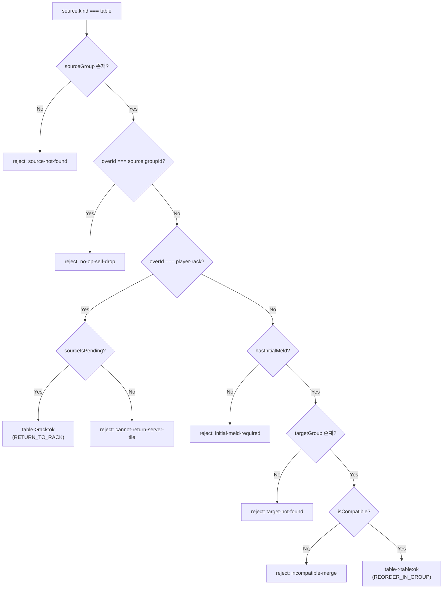
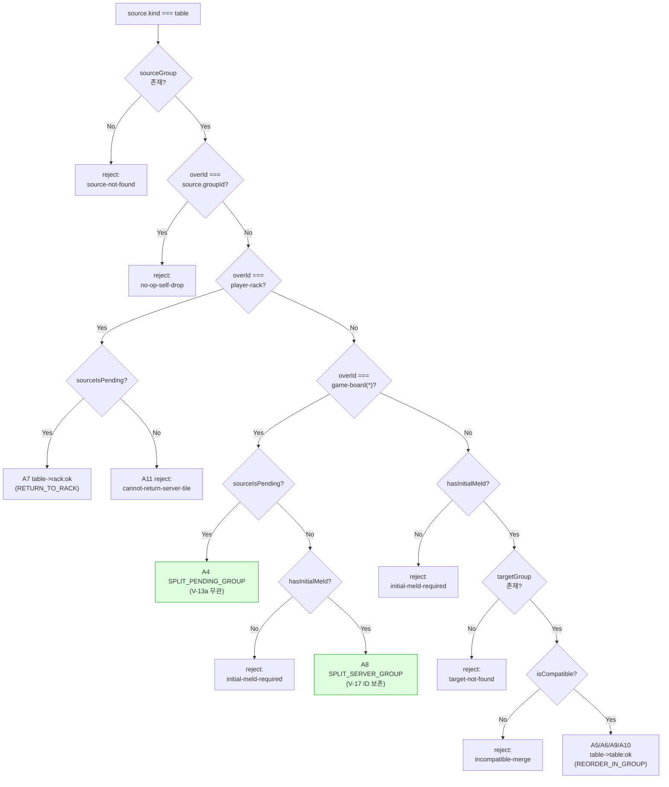
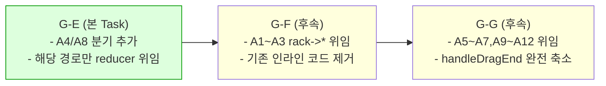
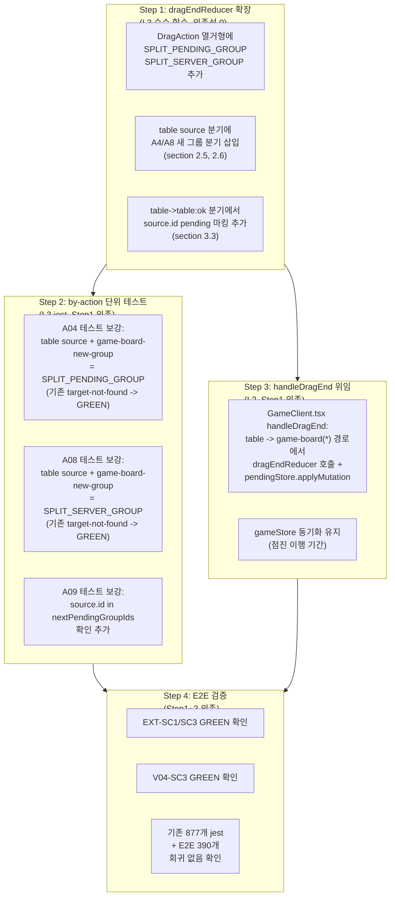

# 59 -- G-E 재배치 구현 설계 가이드

- **작성일**: 2026-04-26
- **작성자**: architect
- **Sprint**: 7 W2 Phase D -> G-E (Task #7)
- **의존**: 58 (구현 설계서), G-B 완료 (pendingStore 브릿지)
- **상위 SSOT**:
  - `docs/02-design/55-game-rules-enumeration.md` (V-13a~e, V-17, D-01, D-12, UR-12~14)
  - `docs/02-design/56-action-state-matrix.md` (A3~A10 행동 매트릭스)
  - `docs/02-design/60-ui-feature-spec.md` (F-04, F-05, F-06)
  - `docs/02-design/58-ui-component-decomposition.md` (dragEndReducer 매핑표 3.1)
- **충돌 정책**: 본 가이드와 SSOT 55/56/60 충돌 시 SSOT 우선. 본 가이드와 58 충돌 시 58 우선.
- **코드 수정 금지**: 본 문서는 설계 전용. 구현은 별도 dispatch.

---

## 1. 스코프

### 1.1 F-04 -- 랙에서 서버 확정 그룹 extend

| 항목 | 내용 |
|------|------|
| **사전조건** | S-turn = MY_TURN, S-meld = POST_MELD (V-13a), `isCompatibleWithGroup` = COMPAT |
| **사후조건** | (i) 서버 그룹 ID 보존 + `pendingGroupIds.add(serverId)` (V-17, D-01). (ii) 랙에서 tile 1개 제거. (iii) 타겟 그룹 tiles 에 tile 추가 |
| **관련 룰 ID** | A3, V-13a, V-17, UR-08, UR-14, D-01, D-12 |
| **기존 구현 상태** | dragEndReducer 486~481행 `rack->server-compat:merge` 분기 **구현 완료**. DragAction = `MERGE_TO_SERVER_GROUP`. pendingStore.applyMutation 연결 필요 |
| **사고 매핑** | EXT-SC1 (확정 후 extend 회귀), EXT-SC3 (런 앞 append) |

### 1.2 F-05 -- pending 그룹 내/간 이동

| 항목 | 내용 |
|------|------|
| **사전조건** | S-turn = MY_TURN. A6(pending->server)만 POST_MELD 필수. 나머지는 S-meld = * |
| **사후조건** | (i) src 그룹 tile 제거 + dest 추가 **atomic** (INV-G2). (ii) 빈 src 그룹 자동 제거 (INV-G3). (iii) A7(pending->rack): 랙에 tile 추가, pending 아닌 타일 불변 |
| **관련 룰 ID** | A4, A5, A6, A7, INV-G1, INV-G2, INV-G3, V-06 |
| **기존 구현 상태** | A5/A6/A7/A10/A9 -- `table->table` 통합 분기 (239~241행) **구현됨**. A4(pending->새 그룹) **미구현** (target-not-found 거절). A5 RDX-01 호환성 검사 **이미 적용됨** (200~208행) |
| **사고 매핑** | INC-T11-DUP (D-02 위반, tile code 중복) |

### 1.3 F-06 -- 서버 확정 그룹 재배치 (split/merge/move)

| 항목 | 내용 |
|------|------|
| **사전조건** | S-meld = POST_MELD (V-13a). A8(split), A9(server merge), A10(server->pending) |
| **사후조건** | (i) src 서버 그룹 -> pending 마킹 (`pendingGroupIds.add(srcId)`). ID 보존 (V-17). (ii) split: 새 pending 그룹 생성. (iii) 잔여 < 3장 = invalid pending, ConfirmTurn 시 V-02 거부. (iv) merge: 양쪽 그룹 pending 마킹 |
| **관련 룰 ID** | A8, A9, A10, V-13a~d, V-17, D-01, D-12 |
| **기존 구현 상태** | A9/A10 -- `table->table` 통합 분기 **구현됨**. A8(server->새 그룹) **미구현** (target-not-found 거절) |
| **사고 매핑** | INC-T11-IDDUP (D-01 ID 중복) |

---

## 2. dragEndReducer 확장 계획

### 2.1 현재 table source 분기 구조 분석

dragEndReducer 의 table source 분기 (139~241행) 는 다음 흐름을 따른다.



**핵심 gap**: `overId === "game-board"` 또는 `overId === "game-board-new-group"` 인 경우를 처리하는 분기가 **table source 에는 존재하지 않는다**. rack source 에만 이 두 분기가 있다 (483~585행). 따라서 A4/A8 (pending/server -> 새 그룹 split) 은 `table->table` 경로에서 `targetGroup = find(overId)` 시 null 을 반환하여 `target-not-found` 로 거절된다.

### 2.2 추가해야 할 분기

`table->*` 분기에서 `overId === "player-rack"` 검사 후, `hasInitialMeld` 검사 전에 **새 그룹 생성 분기**를 삽입한다.

```
table source
  |
  +-- overId === self-group -> reject (기존)
  |
  +-- overId === "player-rack" -> RETURN_TO_RACK (기존)
  |
  +-- ** overId === "game-board" || "game-board-new-group" ** -> [신규]
  |     |
  |     +-- sourceIsPending -> A4 SPLIT_PENDING_GROUP (V-13a 무관)
  |     +-- !sourceIsPending && !hasInitialMeld -> reject (V-13a)
  |     +-- !sourceIsPending && hasInitialMeld  -> A8 SPLIT_SERVER_GROUP
  |
  +-- !hasInitialMeld -> reject (기존)
  |
  +-- targetGroup 존재 -> table->table (기존)
  |
  +-- target 미존재 -> reject (기존)
```

### 2.3 DragAction 열거형 확장

현재 DragAction 에 `SPLIT_PENDING_GROUP`, `SPLIT_SERVER_GROUP` 가 없다. 추가한다.

```typescript
export type DragAction =
  | "CREATE_PENDING_GROUP"
  | "ADD_TO_PENDING_GROUP"
  | "REJECT"
  | "MERGE_TO_SERVER_GROUP"
  | "RETURN_TO_RACK"
  | "JOKER_SWAP"
  | "REORDER_IN_GROUP"
  | "SPLIT_PENDING_GROUP"    // A4: pending -> 새 그룹 (split)
  | "SPLIT_SERVER_GROUP";    // A8: server -> 새 그룹 (split)
```

### 2.4 기존 분기 보존 원칙

| 분기 | 현재 라인 | 변경 | 사유 |
|------|----------|------|------|
| `table->rack:server-locked` (A11) | 150~153 | 보존 | V-06 conservation |
| `table->rack:ok` (A7) | 153~181 | 보존 | RETURN_TO_RACK |
| `table->table:ok` (A5/A6/A9/A10) | 182~241 | 보존 | REORDER_IN_GROUP. RDX-01 이미 적용 |
| `table->table:incompatible-*` | 202~208 | 보존 | RDX-01 incompatible reject |
| `rack->server-compat:merge` (A3) | 421~481 | 보존 | MERGE_TO_SERVER_GROUP. F-04 핵심 경로 |
| `rack->board:new-group` (A1) | 483~551 | 보존 | CREATE_PENDING_GROUP |

**새 분기만 추가하고 기존 분기를 변경하지 않는다.** 기존 by-action 테스트 21개 GREEN 유지가 전제 조건이다.

### 2.5 A4 구현 명세 (pending -> 새 그룹 split)

```typescript
// 위치: table source 분기, overId === "game-board" || "game-board-new-group" 검사 내부
// 조건: sourceIsPending === true
// V-13a 무관 -- pending 은 항상 자기 것 (SSOT 56 section 3.5)

// 1. source 그룹에서 tileCode 제거
const updatedSourceTiles = [...sourceGroup.tiles];
updatedSourceTiles.splice(source.index, 1);

// 2. 새 pending 그룹 생성
const nextSeq = pendingGroupSeq + 1;
const newGroupId = makeNewGroupId(nextSeq);
const newGroup: TableGroup = {
  id: newGroupId,
  tiles: [tileCode],
  type: classifySetType([tileCode]),
};

// 3. 전체 테이블 갱신 (source 축소 + 신규 추가)
// INV-G3: source 빈 -> 자동 제거
const nextTableGroups = tableGroups
  .map(g => g.id === sourceGroup.id
    ? { ...g, tiles: updatedSourceTiles, type: classifySetType(updatedSourceTiles) }
    : g)
  .filter(g => g.tiles.length > 0)
  .concat([newGroup]);

// 4. INV-G2 방어선
const dupes = detectDuplicateTileCodes(nextTableGroups);
if (dupes.length > 0) return rejectWith("duplicate-detected", "table→new-group:dup-guard");

// 5. pendingGroupIds 갱신
const nextGroupIdSet = new Set(nextTableGroups.map(g => g.id));
const nextPendingGroupIds = new Set(
  [...pendingGroupIds, newGroupId].filter(id => nextGroupIdSet.has(id))
);

return {
  ...defaults,
  nextTableGroups,
  nextPendingGroupIds,
  nextPendingGroupSeq: nextSeq,
  branch: "table→new-group:split-pending",
  action: "SPLIT_PENDING_GROUP",
};
```

### 2.6 A8 구현 명세 (server -> 새 그룹 split)

```typescript
// 위치: 동일 분기, sourceIsPending === false 일 때
// 조건: hasInitialMeld === true (V-13a)

// 1. V-13a 가드: hasInitialMeld 검사
if (!hasInitialMeld) {
  return rejectWith("initial-meld-required", "table→new-group:server-pre-meld");
}

// 2~5: A4와 동일 구조 (source 축소 + 신규 생성 + INV-G2 + pendingGroupIds)
// 차이점: source 서버 그룹도 pendingGroupIds 에 추가 (V-17 ID 보존 + pending 마킹)
const nextPendingGroupIds = new Set(
  [...pendingGroupIds, sourceGroup.id, newGroupId].filter(id => nextGroupIdSet.has(id))
);

return {
  ...defaults,
  nextTableGroups,
  nextPendingGroupIds,
  nextPendingGroupSeq: nextSeq,
  branch: "table→new-group:split-server",
  action: "SPLIT_SERVER_GROUP",
};
```

### 2.7 확장 후 전체 분기 구조 (Mermaid)



초록색 노드 2개가 이번에 추가되는 분기이다.

---

## 3. pendingStore 확장 필요 사항

### 3.1 현재 pendingStore 인터페이스 검토

G-B(Task #5) 에서 구현한 pendingStore 는 다음 API 를 제공한다.

| 메서드 | 역할 | F-04/05/06 사용 |
|--------|------|----------------|
| `applyMutation(result: DragOutput)` | dragEndReducer 결과를 atomic 적용 | F-04, F-05, F-06 모두 사용 |
| `markServerGroupAsPending(id)` | 서버 그룹 ID 를 pendingGroupIds 에 추가 | F-04 (서버 그룹 확장 시), F-06 (서버 그룹 split/merge 시) |
| `reset()` | UR-04 전체 초기화 | TURN_START, RESET_TURN |
| `rollbackToServerSnapshot()` | F-13 INVALID_MOVE 롤백 | INVALID_MOVE 수신 시 |
| `saveTurnStartSnapshot(rack, tableGroups)` | F-01 스냅샷 저장 | TURN_START 수신 시 |

### 3.2 markServerGroupAsPending 활성화 경로

현재 `markServerGroupAsPending` 은 pendingStore 에 구현되어 있지만, **dragEndReducer 의 DragOutput 에서 자동으로 호출되지 않는다**. reducer 의 `nextPendingGroupIds` 에 서버 그룹 ID 가 포함되면 `applyMutation` 이 이를 반영하므로 별도 호출이 필요하지 않다.

확인: `applyMutation` 내부 (pendingStore.ts 100~146행) 에서 `result.nextPendingGroupIds` 를 그대로 draft.pendingGroupIds 에 설정한다. 따라서:

- **F-04**: `rack->server-compat:merge` 분기의 DragOutput.nextPendingGroupIds 에 `targetServerGroup.id` 가 이미 포함 (466행). applyMutation 으로 자동 반영.
- **F-06 A8**: 신규 분기에서 nextPendingGroupIds 에 `sourceGroup.id + newGroupId` 포함. applyMutation 으로 자동 반영.
- **F-06 A9**: `table->table:ok` 분기의 nextPendingGroupIds 에 `targetGroup.id` 포함 (232행). source 서버 그룹은 기존 로직에서 누락 -- **수정 필요**.

### 3.3 A9 server->server merge 시 source 그룹 pending 마킹 보강

현재 `table->table:ok` 분기 (228~233행) 에서:

```typescript
const nextPendingGroupIds = new Set(
  [...pendingGroupIds, targetGroup.id].filter((id) => nextGroupIdSet.has(id))
);
```

target 그룹만 pending 에 추가한다. 그러나 A9(server->server merge) 일 때 **source 서버 그룹도 pending 으로 마킹해야 한다** (V-17: 서버 그룹 변형 시 pending 전환). source 가 이미 pending 이면 (A5, A10) 중복 추가해도 Set 특성상 무해하다.

수정 제안:

```typescript
const nextPendingGroupIds = new Set(
  [...pendingGroupIds, sourceGroup.id, targetGroup.id].filter(
    (id) => nextGroupIdSet.has(id)
  )
);
```

`sourceGroup.id` 를 추가하면 A9 에서 source 서버 그룹이 pending 으로 올바르게 마킹된다. A5(pending->pending), A6(pending->server), A10(server->pending) 에서도 source ID 가 이미 pendingGroupIds 에 있거나 추가되어 무해하다.

**이 수정은 table->table:ok 분기의 단 1줄 변경이다.** 기존 REORDER_IN_GROUP action 은 유지한다.

### 3.4 pendingStore 추가 인터페이스 불필요

dragEndReducer 가 DragOutput 에 모든 상태 변경을 포함하고 `applyMutation` 이 이를 반영하므로, pendingStore 에 새 메서드를 추가할 필요가 없다. 58의 설계 의도대로 **reducer 순수 출력 -> store atomic 적용** 패턴이 유지된다.

---

## 4. handleDragEnd 3분리 ADR

### 4.1 배경

현재 GameClient.tsx 의 handleDragEnd (756~970행+) 는 dragEndReducer 를 호출하지 않고 인라인으로 동일한 분기 로직을 실행한다. 이로 인해:

1. dragEndReducer 의 DragAction/DragOutput 과 실제 handleDragEnd 의 state 변경이 이중 구현.
2. pendingStore.applyMutation 이 호출되지 않는다 (기존 gameStore 의 setPendingTableGroups 직접 호출).
3. dragEndReducer 의 by-action 단위 테스트가 GREEN 이어도 실제 게임에서는 다른 코드 경로가 실행된다.

### 4.2 방향성: 점진적 위임

handleDragEnd 를 3 경로로 분리하여 각 경로가 dragEndReducer 를 호출하고 결과를 pendingStore.applyMutation 에 위임하는 구조로 전환한다.

| 경로 | dragSource | 설명 |
|------|-----------|------|
| **rack -> \*** | `{ kind: "rack" }` | A1, A2, A3, A12 (새 그룹, pending 병합, server extend, 조커 swap) |
| **pending -> \*** | `{ kind: "table", sourceIsPending: true }` | A4, A5, A6, A7 (새 그룹 split, pending merge, server 이동, 랙 회수) |
| **server -> \*** | `{ kind: "table", sourceIsPending: false }` | A8, A9, A10, A11 (split, server merge, pending 이동, 랙 거절) |

### 4.3 첫 단계 (G-E 범위)

G-E 에서는 **전체 3분리를 완성하지 않는다**. 대신:

1. dragEndReducer 에 A4, A8 분기를 추가한다 (section 2.5, 2.6).
2. dragEndReducer 의 A9 분기에서 source pending 마킹을 보강한다 (section 3.3).
3. **GameClient.tsx 의 handleDragEnd 에서 새로 추가된 경로(A4, A8)만 dragEndReducer + pendingStore.applyMutation 으로 위임한다.**
4. 기존 경로(A1~A3, A5~A7, A9~A12)는 인라인 코드를 유지한다 (회귀 위험 최소화).

이로써:
- A4, A8 의 의도된 RED 가 GREEN 으로 전환된다.
- 기존 GREEN 테스트는 영향 없다.
- 전체 3분리는 후속 Task (G-F 이후) 에서 점진적으로 진행한다.

### 4.4 handleDragEnd 수정 위치

```
handleDragEnd(event) {
  // ... 기존 guard, freshState 추출 ...

  if (dragSource?.kind === "table") {
    const sourceGroup = freshTableGroups.find(...);
    const sourceIsPending = freshPendingGroupIds.has(dragSource.groupId);

    // [기존] table -> rack  -- 그대로 유지
    if (over.id === "player-rack") { /* 기존 코드 */ return; }

    // [신규] table -> game-board / game-board-new-group
    if (over.id === "game-board" || over.id === "game-board-new-group") {
      // dragEndReducer 호출 -> pendingStore.applyMutation
      const result = dragEndReducer(reducerState, { source: dragSource, tileCode, overId: over.id, now: Date.now() });
      if (!result.rejected) {
        usePendingStore.getState().applyMutation(result);
        // gameStore 에도 동기화 (점진 이행 기간)
        setPendingTableGroups(result.nextTableGroups);
        setPendingMyTiles(result.nextMyTiles ?? freshMyTiles);
        setPendingGroupIds(result.nextPendingGroupIds);
      }
      return;
    }

    // [기존] table -> 다른 그룹  -- 그대로 유지
    // ...
  }

  // [기존] rack -> * 분기 -- 그대로 유지
}
```

### 4.5 점진 이행 전략 Mermaid



---

## 5. E2E 테스트 RED 해소 매핑

### 5.1 EXT-SC1 -- 확정 후 extend

| 항목 | 내용 |
|------|------|
| **테스트 파일** | `e2e/rule-extend-after-confirm.spec.ts` |
| **시나리오** | hasInitialMeld=true, 서버 런 [R10 R11 R12] 뒤에 랙 R13 drop |
| **기대** | groupCount=1, runTiles.length=4, pendingGroupIdsSize=1 |
| **현재 상태** | dragEndReducer 의 `rack->server-compat:merge` 분기 구현 완료. GameClient handleDragEnd 에서도 같은 경로 인라인 실행. 이론적으로 GREEN 가능하나 pendingStore 연결 미완으로 불안정 |
| **GREEN 전환 방법** | (i) dragEndReducer 경로 유지 (변경 없음). (ii) handleDragEnd 에서 해당 경로를 dragEndReducer 호출 + pendingStore.applyMutation 으로 위임 (선택 -- G-F 에서). (iii) 현재 인라인 코드가 정상 작동하면 이미 GREEN -- **현재 GREEN 확인 필요** |

### 5.2 EXT-SC3 -- 런 앞 append

| 항목 | 내용 |
|------|------|
| **테스트 파일** | `e2e/rule-extend-after-confirm.spec.ts` |
| **시나리오** | hasInitialMeld=true, 서버 런 [R10 R11 R12] 앞에 랙 R9 drop |
| **기대** | runTiles.length=4, groupCount=1 |
| **현재 상태** | EXT-SC1 과 동일 경로 (`rack->server-compat:merge`). `isCompatibleWithGroup(R9a, {R10a,R11a,R12a})` 가 true 반환해야 함 |
| **GREEN 전환 방법** | EXT-SC1 과 동일. `isCompatibleWithGroup` 의 런 호환 판정이 R9 (연속) 를 올바르게 COMPAT 으로 평가하는지 확인 필요. 현재 `mergeCompatibility.ts` 의 `isCompatibleAsRun` 이 min-1/max+1 검사를 수행하므로 R9=min(10)-1 로 COMPAT 판정 |

### 5.3 V04-SC3 -- FINDING-01 분리

| 항목 | 내용 |
|------|------|
| **테스트 파일** | `e2e/rule-initial-meld-30pt.spec.ts` |
| **시나리오** | hasInitialMeld=false, 서버 그룹 [R9 B9 K9] 위에 랙 Y9 drop |
| **기대** | srvGroupTiles.length=3 (서버 그룹 불변), y9InNewGroup=true (새 pending 그룹 분리), groupCount=2 |
| **현재 상태** | dragEndReducer 의 `rack->server-preinitial:new-group` 분기 (387~418행) 가 처리. PRE_MELD 일 때 서버 그룹 확장 대신 새 pending 그룹을 생성 |
| **GREEN 전환 방법** | 이 경로는 이미 reducer 에 구현되어 있으며, handleDragEnd 인라인에도 동일 로직이 있다 (setupExtendAfterConfirm 으로 fixture 세팅 시 정상 동작). **현재 GREEN 확인 필요** |

### 5.4 요약

| RED 시나리오 | reducer 분기 | 분기 상태 | GREEN 전환 핵심 |
|-------------|-------------|----------|----------------|
| **EXT-SC1** | `rack->server-compat:merge` | 구현 완료 | handleDragEnd 인라인 정상 작동 확인 |
| **EXT-SC3** | `rack->server-compat:merge` | 구현 완료 | `isCompatibleAsRun` 런 앞 호환 확인 |
| **V04-SC3** | `rack->server-preinitial:new-group` | 구현 완료 | handleDragEnd 인라인 정상 작동 확인 |

**의도된 RED 해소의 본질**: 이 3개 시나리오는 dragEndReducer 수준에서는 이미 구현되어 있다. RED 가 발생한다면 GameClient.handleDragEnd 인라인 코드와 fixture 설정의 불일치, 또는 dnd-kit 이벤트 전파 문제이다. 본 Task(G-E) 에서 A4/A8 분기를 추가하면서 handleDragEnd 에 reducer 위임 패턴을 도입하면, 후속 Task 에서 모든 경로를 reducer 위임으로 전환할 때 이런 불일치가 구조적으로 해소된다.

---

## 6. 구현 순서 + 의존성 그래프

### 6.1 구현 단계



### 6.2 작업량 추정

| Step | 파일 수 | 예상 변경 줄 수 | 리스크 |
|------|---------|----------------|--------|
| Step 1 | 1 (dragEndReducer.ts) | +60~80 | 낮음 (순수 함수, 기존 분기 보존) |
| Step 2 | 3 (A04, A08, A09 테스트) | +40~60 | 낮음 (테스트 추가만) |
| Step 3 | 1 (GameClient.tsx) | +15~20 | 중간 (기존 인라인 코드와 공존 기간) |
| Step 4 | 0 (실행만) | 0 | 낮음 |

**총 예상**: 파일 5개, 변경 +115~160줄. 기존 코드 제거 0줄 (보존 원칙).

### 6.3 의존성 요약

- Step 1 은 **독립 실행 가능** (L3 순수 함수).
- Step 2 는 Step 1 완료 후.
- Step 3 은 Step 1 완료 후 (Step 2 와 병렬 가능).
- Step 4 는 Step 2, 3 모두 완료 후.

---

## 7. 모듈화 7원칙 self-check

### 7.1 SRP (단일 책임 원칙)

| 점검 항목 | 충족 | 근거 |
|----------|------|------|
| 1 분기 = 1 행동 | 충족 | A4 분기 = SPLIT_PENDING_GROUP, A8 분기 = SPLIT_SERVER_GROUP. 기존 통합 분기와 분리 |
| 1 DragAction = 1 의미 | 충족 | 신규 2개 DragAction 은 58의 매핑표 A4/A8 과 1:1 |

### 7.2 순수 함수 우선

| 점검 항목 | 충족 | 근거 |
|----------|------|------|
| 신규 분기 순수 | 충족 | dragEndReducer 내부 분기 추가. 외부 상태 접근 0 |
| 부작용 격리 | 충족 | handleDragEnd 에서 pendingStore.applyMutation 1회 호출만 |

### 7.3 의존성 주입

| 점검 항목 | 충족 | 근거 |
|----------|------|------|
| dragEndReducer 의존성 | 충족 | state, input 매개변수만으로 동작. isCompatibleWithGroup import 는 기존 동일 |

### 7.4 계층 분리

| 점검 항목 | 충족 | 근거 |
|----------|------|------|
| L3 -> L2 역참조 없음 | 충족 | dragEndReducer 는 store import 금지. handleDragEnd(L2) 에서 reducer 호출 후 store 갱신 |

### 7.5 테스트 가능성

| 점검 항목 | 충족 | 근거 |
|----------|------|------|
| A4/A8 jest 단위 | 충족 | by-action 테스트에서 신규 분기 GREEN 검증 |
| E2E 시나리오 | 충족 | EXT-SC1/SC3, V04-SC3 이 GREEN 전환 대상 |

### 7.6 수정 용이성

| 룰 변경 시나리오 | 영향 파일 수 | 영향 파일 |
|----------------|-------------|----------|
| V-13a (재배치 권한) 변경 | 1 | dragEndReducer.ts (A8 분기의 hasInitialMeld 검사) |
| V-17 (그룹 ID) 변경 | 1 | dragEndReducer.ts (pendingGroupIds 갱신 로직) |
| INV-G3 (빈 그룹 제거) 변경 | 1 | dragEndReducer.ts (filter 조건) |

모두 1~3 파일 이내.

### 7.7 band-aid 금지

| 점검 항목 | 충족 | 근거 |
|----------|------|------|
| 모든 분기 룰 ID 매핑 | 충족 | A4 = V-13b/D-12/INV-G3, A8 = V-13a/V-13b/V-17/D-12 |
| 토스트 추가 0건 | 충족 | reject 사유만 DragOutput.rejected 에 설정. 사용자 토스트는 호출자 책임 |
| UR-34/35/36 준수 | 충족 | 명세에 없는 추가 가드 0건 |

### 7.8 self-check 결과

**7원칙 모두 충족**. 기존 구현에 최소한의 변경 (분기 추가 + source pending 마킹 1줄) 으로 F-04/F-05/F-06 스코프의 미구현 gap(A4, A8) 을 해소한다.

---

## 8. 변경 이력

| 버전 | 일자 | 작성자 | 변경 |
|------|------|--------|------|
| v1.0 | 2026-04-26 | architect | 최초 발행. F-04/F-05/F-06 스코프, dragEndReducer A4/A8 추가 명세, pendingStore A9 source 마킹 보강, handleDragEnd 3분리 ADR 시동 (첫 단계만), E2E RED 해소 매핑 3건, 구현 순서 4단계, 모듈화 7원칙 self-check 전항 충족 |
