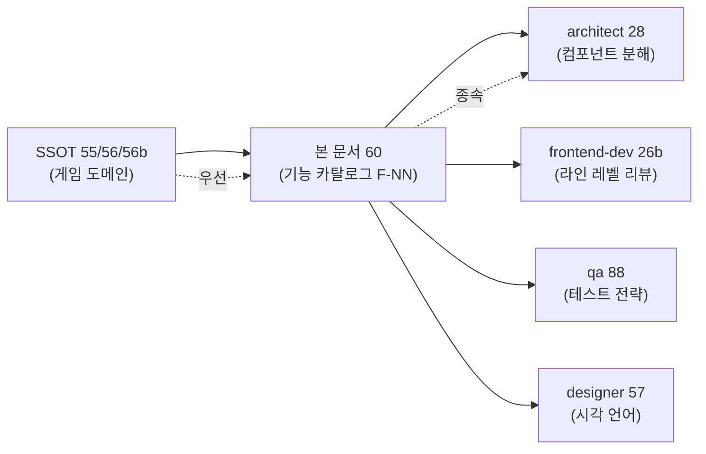
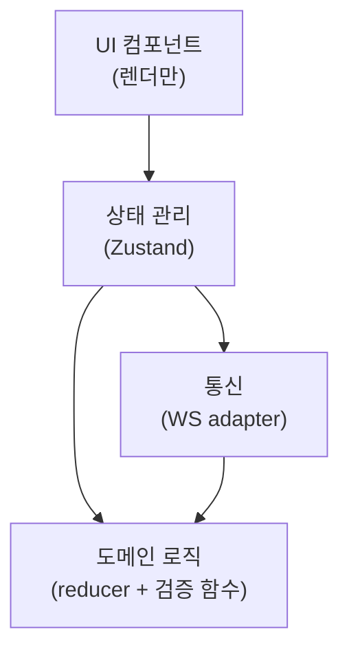
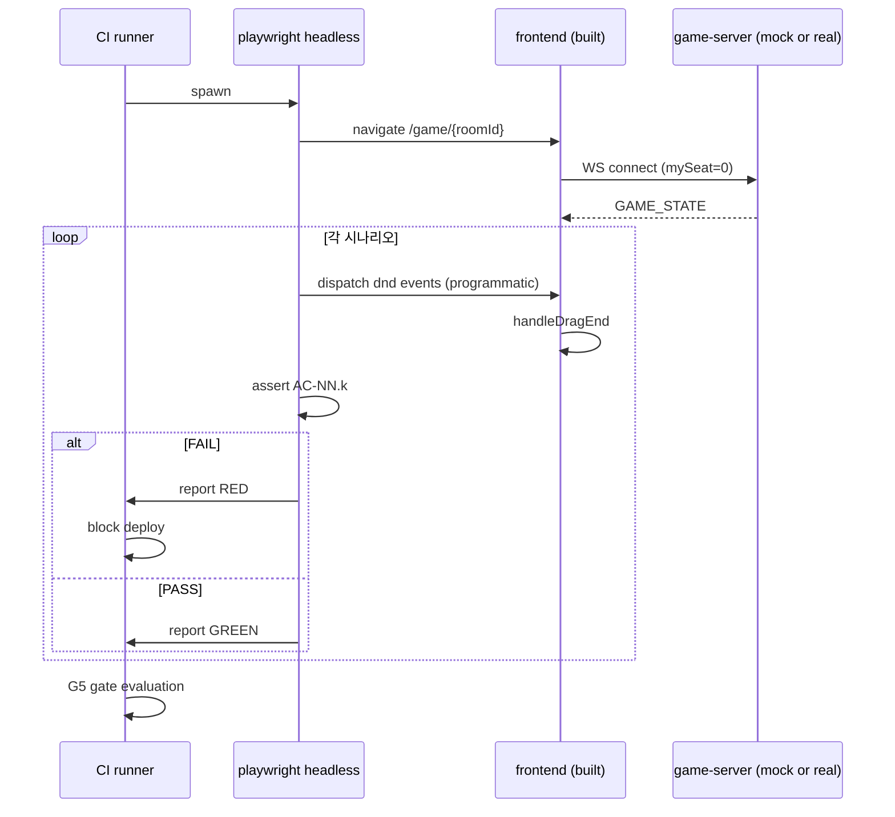

# 60 — UI 기능 설계서 (Feature Specification)

- **작성**: 2026-04-25, **pm (본인)**
- **상위 SSOT**:
  - `docs/02-design/55-game-rules-enumeration.md` (V-23 / UR-36 / D-12 룰)
  - `docs/02-design/56-action-state-matrix.md` (행동 21 × 상태 6 차원 매트릭스)
  - `docs/02-design/56b-state-machine.md` (상태 12 + 전이 24 + invariant 16)
- **사용처 (후속 산출물)**:
  - architect → `docs/03-development/26-architect-impact.md` (시스템 토폴로지·컴포넌트 분해)
  - frontend-dev → `docs/03-development/26b-frontend-source-review.md` (라인 레벨 폐기/보존)
  - go-dev → `docs/04-testing/87-server-rule-audit.md`
  - qa → `docs/04-testing/88-test-strategy-rebuild.md`
  - designer → `docs/02-design/57-game-rule-visual-language.md`
  - security → `docs/04-testing/89-state-corruption-security-impact.md`
- **변경 절차**: 본 문서 변경 시 PM ADR + game-analyst 승인 필수. 모든 후속 산출물 동시 업데이트.
- **충돌 해소 정책**: 본 문서와 SSOT 55/56/56b 충돌 시 → SSOT 우선. SSOT 명세에 없는 사항은 본 PM 이 최종 판단.
- **band-aid 금지**: 모든 F-NN 은 룰 ID (V-/UR-/D-/INV-) 매핑 필수. 매핑 없는 가드/토스트/체크는 본 sprint PR 머지 단계에서 자동 거절 (PM G1 게이트).
- **사용자 테스트 요청 금지**: 본 문서 §7 self-play harness 가 GREEN 일 때만 사용자 배포 가능 (PM G5 게이트).

---

## 0. 문서 목적 + 본 PM 의 결단

### 0.1 본 문서의 위치

게임 도메인 SSOT (55/56/56b) 는 **"무엇이 룰인가"** 를 정의했다. 본 문서는 **"사용자가 어느 화면에서 무엇을 보고/하는가"** 를 정의한다. 즉:

- SSOT 는 **룰 명세** (선언적)
- 본 문서는 **기능 카탈로그** (사용자 시나리오 기반)
- architect 의 28-component-decomposition (별도) 은 **컴포넌트 토폴로지** (구조적)

세 산출물의 관계:



### 0.2 본 PM 의 결단 (사용자 명령 100% 반영)

1. 모든 F-NN 은 **단일 룰 ID 또는 룰 ID 셋** 에 매핑된다. 매핑 안 되면 폐기.
2. **band-aid 토스트 / source guard / invariant validator 는 사용자에게 노출되는 기능이 아니다** (UR-34). 위반 발견 시 코드 수정.
3. **묶음 기능 금지** — F-NN 은 1 사용자 시나리오 = 1 책임. 9 분기 동시 수정해야 변경 가능한 기능은 폐기 후 분리.
4. **수정 용이성 정량 기준** — 룰 1개 변경 시 1~3 파일만 수정 가능해야 한다 (모듈화 7원칙 §6).

---

## 1. 기능 카탈로그 (F-NN × 사용자 시나리오 × 룰 ID × 상태)

### 1.1 인덱스

| F-NN | 기능 | 화면 | 우선순위 | 핵심 룰 ID |
|------|------|------|---------|-----------|
| **F-01** | 내 턴 시작 인지 | Game | P0 | V-08, UR-01, UR-02, UR-04 / S0→S1 |
| **F-02** | 랙에서 보드 새 그룹 만들기 | Game | P0 | A1, UR-06, UR-11, D-12 / S1→S2→S5 |
| **F-03** | 랙에서 기존 pending 그룹에 추가 | Game | P0 | A2, UR-14, INV-G2 / S5→S2→S5 |
| **F-04** | 랙에서 서버 확정 그룹에 extend | Game | P0 | A3, V-13a, UR-08, UR-14, V-17 / S5→S2→S5 |
| **F-05** | pending 그룹 내 타일을 다른 곳으로 이동 | Game | P0 | A4, A5, A6, A7, INV-G1, INV-G2 / S5→S3→S5 |
| **F-06** | 서버 확정 그룹 재배치 (split / merge / move) | Game | P0 | A8, A9, A10, V-13a~e, V-17 / S5→S4→S5 |
| **F-07** | 조커 교체 (Joker Swap) | Game | P1 | A12, V-13e, V-07, UR-25 / S5→S4→S10 |
| **F-08** | 랙 내 재정렬 | Game | P2 | A13, UR-13b (rack reorder) |
| **F-09** | ConfirmTurn (턴 확정) | Game | P0 | A14, V-01~V-15, V-17, UR-15, UR-30, V-04 / S5→S6→S7 |
| **F-10** | RESET_TURN (되돌리기) | Game | P1 | A15, UR-16 / S5/S6→S1 |
| **F-11** | DRAW (드로우) / 자동 패스 | Game | P0 | A16, V-10, UR-22 / S1→S9 |
| **F-12** | 드래그 취소 (esc) | Game | P1 | A17, UR-17 / S2/S3/S4→S1/S5 |
| **F-13** | INVALID_MOVE 회복 | Game | P0 | A21, V-18, UR-21 / S7→S8→S5 |
| **F-14** | 다른 플레이어 턴 관전 | Game | P1 | A18, UR-01 / S0 |
| **F-15** | 턴 타이머 + 자동 드로우 | Game | P0 | V-09, UR-26 / S1→[Timeout]→S0 |
| **F-16** | 게임 종료 오버레이 (WIN / ALL_PASS / FORFEIT) | Game-End | P1 | V-11, V-12, UR-27, UR-28 |
| **F-17** | V-04 초기 등록 진행 표시 | Game | P0 | V-04, UR-24, UR-30 |
| **F-18** | 회수 조커 강조 + 즉시 사용 안내 | Game | P1 | V-07, V-13e, UR-25 / S10 |
| **F-19** | 드로우 파일 0 시각화 | Game | P2 | V-10, UR-22, UR-23 |
| **F-20** | WS 재연결 안내 | Game | P1 | UR-32 |
| **F-21** | 호환 드롭존 시각 강조 | Game | P0 | UR-10, UR-14, UR-18, UR-19 |
| **F-22** | 로비 (방 목록 / 방 만들기) | Lobby | P1 | (게임 도메인 외 — UR-* 신설 없음) |
| **F-23** | 룸 (대기실) | Room | P1 | (게임 도메인 외) |
| **F-24** | 연습 모드 (Practice) | Practice | P2 | F-02~F-12 부분집합, V-* 클라 미러만 |
| **F-25** | 랭킹 (ELO 보드) | Rankings | P2 | (게임 도메인 외) |

**카운트**: P0 = **11개**, P1 = **8개**, P2 = **6개**, 총 **25 F-NN**.

### 1.2 F-NN 상세 정의

각 F-NN 의 정의 형식:

```
[F-NN] <사용자 시나리오 문장>
- 트리거 (사용자 입력 or WS 메시지)
- 매핑된 룰 ID: {V-/UR-/D-/INV-}
- 매핑된 상태 머신 노드: {S-N → S-M}
- 사전조건 / 사후조건
- band-aid 금지 메모
```

#### F-01 — 내 턴 시작 인지

| 항목 | 정의 |
|------|------|
| **시나리오** | 다른 플레이어 턴이 끝나면 사용자는 "이제 내 차례" 임을 즉시 인지한다. 랙·보드가 활성화되고 타이머가 시작된다 |
| **트리거** | WS 수신 `TURN_START { currentSeat: mySeat }` |
| **룰 ID** | V-08 (자기 턴 확인), UR-01 (다른 턴 disable), UR-02 (활성화), UR-04 (pending 0 강제) |
| **상태 전이** | S0 (OUT_OF_TURN) → S1 (MY_TURN_IDLE) |
| **사전조건** | mySeat == currentSeat |
| **사후조건** | (i) `pendingTableGroups.length == 0` (UR-04). (ii) 랙 활성화 (`disabled` removed). (iii) 타이머 카운트다운 시작 (60s 또는 방 설정값) |
| **band-aid 금지** | TURN_START 수신 시 pending 잔재가 있다면 그건 코드 버그 (이전 turn 의 cleanup 누락). 반드시 reset, 토스트 X |

#### F-02 — 랙에서 보드 새 그룹 만들기

| 항목 | 정의 |
|------|------|
| **시나리오** | 사용자가 랙의 타일 1장을 보드 빈 영역(또는 G-5 새 그룹 드롭존)에 드래그·드롭하면 `pending-{uuid}` ID 의 새 그룹이 1장 짜리로 생성된다. 이후 F-03 으로 추가 타일을 더한다 |
| **트리거** | dnd-kit `onDragEnd { source: rack, destination: new-group-zone }` |
| **룰 ID** | A1, UR-06 (랙 드래그 시작), UR-11 (랙 → 새 그룹 항상 허용), D-12 (pending- prefix), D-01 (ID 유니크) |
| **상태 전이** | S1 → S2 (DRAGGING_FROM_RACK) → S5 (PENDING_BUILDING) |
| **사전조건** | S-turn = MY_TURN, S-meld = * (V-04 무관, 자기 랙만 사용) |
| **사후조건** | (i) `pendingTableGroups` 에 1장 짜리 새 그룹 추가. (ii) 그룹 ID = `pending-{uuid v4}`. (iii) 랙에서 해당 tile code 1개 제거 |
| **band-aid 금지** | "이 동작이 V-04 30점 미달이라 차단" 같은 사전 거부 X. V-04 는 ConfirmTurn 시점 검사 (UR-15). 새 그룹 생성 자체는 항상 허용 |

#### F-03 — 랙에서 기존 pending 그룹에 추가

| 항목 | 정의 |
|------|------|
| **시나리오** | 사용자가 랙 타일을 이미 있는 pending 그룹(점선 보더로 표시) 에 드롭하면, 호환되는 경우 해당 그룹에 타일이 추가된다 |
| **트리거** | dnd-kit `onDragEnd { source: rack, destination: pending-group-{id} }` |
| **룰 ID** | A2, UR-14 (호환 검사), UR-18/UR-19 (시각 강조), INV-G2 (tile code 중복 금지) |
| **상태 전이** | S5 → S2 → S5 (자기-루프) |
| **사전조건** | (i) S-turn = MY_TURN. (ii) `isCompatibleWithGroup(tile, targetGroup) == true` |
| **사후조건** | (i) targetGroup.tiles 에 tile 추가. (ii) 랙에서 tile 1개 제거. (iii) targetGroup.id 불변 (D-01) |
| **band-aid 금지** | 호환성 검사 실패 시 단순히 드롭 거절 (UR-19 회색 표시). 토스트 띄우지 마라 — 사용자가 이미 화면에서 색상으로 인지함 |

#### F-04 — 랙에서 서버 확정 그룹에 extend

| 항목 | 정의 |
|------|------|
| **시나리오** | 초기 멜드 완료한 사용자가 랙 타일을 다른 플레이어가 만든 서버 그룹에 추가한다. 그 서버 그룹은 이번 턴에 pending 상태로 전환되며, ConfirmTurn 시 다시 서버에 commit 된다 |
| **트리거** | dnd-kit `onDragEnd { source: rack, destination: server-group-{id} }` |
| **룰 ID** | A3, V-13a (재배치 권한), UR-08 (서버 그룹 드래그), UR-14 (호환 검사), V-17 (그룹 ID 보존) |
| **상태 전이** | S5 → S2 → S5 |
| **사전조건** | (i) S-turn = MY_TURN. (ii) S-meld = POST_MELD (V-13a). (iii) `isCompatibleWithGroup` 통과 |
| **사후조건** | (i) 서버 그룹은 그대로 pending 으로 마킹 (`pendingGroupIds.add(serverGroupId)`). **그룹 ID 보존** (D-01, V-17). (ii) 랙에서 tile 1개 제거 |
| **band-aid 금지** | "서버 그룹은 건드리면 안 된다" 같은 PRE_MELD 차단 메시지는 본 F-04 에서 발생할 수 없다 (사전조건 불통과). 대신 F-21 의 시각 강조 (회색 보더) 로 disabled 표현. **사고 매핑**: BUG-UI-EXT-SC1 (확정 후 extend 회귀) 은 본 F-04 가 회귀로 차단되어 발생 |

#### F-05 — pending 그룹 내 타일을 다른 곳으로 이동

| 항목 | 정의 |
|------|------|
| **시나리오** | 사용자가 자기 pending 그룹의 타일을 (a) 새 그룹 / (b) 다른 pending 그룹 / (c) 다른 서버 그룹 / (d) 랙 으로 이동한다 |
| **트리거** | dnd-kit `onDragEnd { source: pending-group-{src}, destination: ... }` |
| **룰 ID** | A4 (pending → new), A5 (pending → pending merge), A6 (pending → server), A7 (pending → rack), INV-G1, INV-G2 |
| **상태 전이** | S5 → S3 (DRAGGING_FROM_PENDING) → S5 |
| **사전조건** | S-turn = MY_TURN. S-meld = (A6 만 POST_MELD 필수, 나머지는 *) |
| **사후조건** | (i) src 그룹에서 tile 제거 — **atomic**. (ii) dest 그룹에 tile 추가. (iii) 빈 src 그룹은 자동 제거 (INV-G3) |
| **band-aid 금지** | **사고 매핑**: INC-T11-DUP (D-02 위반, tile code 중복) 은 본 F-05 의 (i) 단계 누락. atomic 보장이 곧 invariant 보호 |

#### F-06 — 서버 확정 그룹 재배치 (split / merge / move)

| 항목 | 정의 |
|------|------|
| **시나리오** | 초기 멜드 완료한 사용자가 서버 그룹의 타일을 분리(split) / 합병(merge) / 이동(move) 한다. 모든 변경은 같은 턴 내 V-01/V-02 회복 필수 |
| **트리거** | dnd-kit `onDragEnd { source: server-group-{src}, destination: ... }` |
| **룰 ID** | A8 (split), A9 (server merge), A10 (server → pending), V-13b/c/d (재배치 유형), V-13a (권한), V-17 (ID 보존) |
| **상태 전이** | S5 → S4 (DRAGGING_FROM_SERVER) → S5 |
| **사전조건** | S-meld = POST_MELD (V-13a) |
| **사후조건** | (i) src 서버 그룹은 pending 으로 전환 (`pendingGroupIds.add(srcId)`). **ID 보존**. (ii) 출발 잔여 < 3 시 V-02 위반 — 사용자가 보충해야 ConfirmTurn 활성. (iii) merge 시 양쪽 ID 보존 후 서버측 응답에서 정리 (V-17) |
| **band-aid 금지** | **사고 매핑**: INC-T11-IDDUP (D-01 ID 중복) 은 본 F-06 의 양쪽 ID 보존 누락. ID 충돌이 발생하면 코드 버그 → INV-G1 violation throw, 토스트 X |

#### F-07 — 조커 교체 (Joker Swap)

| 항목 | 정의 |
|------|------|
| **시나리오** | 사용자가 보드 그룹의 조커를 자신의 랙 타일로 교체한다. 회수한 조커는 같은 턴 내 다른 세트에 사용해야 한다 |
| **트리거** | dnd-kit `onDragEnd { source: rack, destination: joker-tile-{id} }` |
| **룰 ID** | A12, V-13e (joker swap 정의), V-07 (즉시 사용), UR-25 (회수 조커 강조) |
| **상태 전이** | S5 → S4 → S10 (JOKER_RECOVERED_PENDING) |
| **사전조건** | (i) S-meld = POST_MELD. (ii) 보드 조커 위치에 동등 가치 일반 타일 드롭 |
| **사후조건** | (i) 보드 그룹에서 조커 제거 + 랙 타일 추가. (ii) 회수 조커 표시 (랙 또는 floating). (iii) ConfirmTurn 활성화는 **회수 조커가 다시 보드에 배치된 후에만** |
| **band-aid 금지** | UR-25 는 안내 토스트가 아니라 **시각 강조** (펄스). 사용자에게 "조커를 사용하세요" 같은 nag 메시지 X. ConfirmTurn 비활성화로 충분 |

#### F-08 — 랙 내 재정렬

| 항목 | 정의 |
|------|------|
| **시나리오** | 사용자가 자신의 랙 타일들을 자유롭게 재배열한다 (정렬 / 색상별 그룹화 등). 서버에 영향 없음 |
| **트리거** | dnd-kit `onDragEnd { source: rack, destination: rack-slot-{N} }` |
| **룰 ID** | A13. UR-* 신설 안 함 (서버 영향 없음, 클라 사적 영역) |
| **상태 전이** | S1 → S2 → S1 (자기-루프, 다른 상태에 영향 없음) |
| **사전조건** | 항상 허용 (내 턴 무관) |
| **사후조건** | 랙 표시 순서만 변경 |
| **band-aid 금지** | 다른 플레이어 턴에도 자유롭게 허용. UR-01 의 "다른 턴 disable" 은 보드 인터랙션에만 적용 |

#### F-09 — ConfirmTurn (턴 확정)

| 항목 | 정의 |
|------|------|
| **시나리오** | 사용자가 ConfirmTurn 버튼을 클릭하면 클라가 사전검증 후 WS 로 PLACE_TILES + CONFIRM_TURN 송신. 서버 OK 응답 시 턴 종료 |
| **트리거** | 버튼 클릭 |
| **룰 ID** | A14, V-01/02/03/04/05/06/07/13/14/15 (서버 검증 전체), V-17 (그룹 ID), UR-15 (사전조건), UR-30 (V-04 미달 안내) |
| **상태 전이** | S5/S6 → S6 (활성) → S7 (COMMITTING) → [TURN_END] |
| **사전조건 (UR-15)** | (i) `tilesAdded >= 1` (V-03). (ii) 클라 사전검증 V-01/V-02/V-14/V-15 통과. (iii) 초기 멜드 전이면 V-04 점수 ≥ 30 |
| **사후조건** | (i) 서버 OK → TURN_END, UR-04 pending 리셋. (ii) 서버 FAIL → S8 (INVALID_RECOVER) 로 |
| **band-aid 금지** | UR-15 의 클라 사전검증은 **V-* 의 클라 미러만 허용**. "임의 추가 게이트" (예: 그룹 ID 중복 검사 토스트) 금지 (UR-36) |

#### F-10 — RESET_TURN

| 항목 | 정의 |
|------|------|
| **시나리오** | 사용자가 되돌리기 버튼 클릭. 모든 pending 그룹이 사라지고 랙은 turn 시작 시점으로 복구 |
| **트리거** | 버튼 클릭 |
| **룰 ID** | A15, UR-16 (활성 조건) |
| **상태 전이** | S5/S6/S8 → S1 |
| **사전조건** | `pendingTableGroups.length > 0 OR rack 변경됨` (UR-16) |
| **사후조건** | `pendingTableGroups = []`, 랙 = TURN_START 시점, ConfirmTurn 비활성, RESET 비활성 |
| **band-aid 금지** | 서버 확정 그룹은 RESET 으로 복구 안 됨 (이미 commit) — pending 그룹만 정리. **사고 매핑**: INC-T11-FP-B10 의 source guard 자동 RESET 토스트는 **금지** (UR-34) |

#### F-11 — DRAW / 자동 패스

| 항목 | 정의 |
|------|------|
| **시나리오** | 사용자가 드로우 버튼 클릭 → 1장 추가하고 턴 종료. 드로우 파일 0 이면 패스 처리 |
| **트리거** | 버튼 클릭 |
| **룰 ID** | A16, V-10 (drawpile empty 처리), UR-22 (라벨 "패스"), UR-23 (X 마크) |
| **상태 전이** | S1 → S9 (DRAWING) → [TURN_END] |
| **사전조건** | `pendingTableGroups.length == 0` (drawpile 정책 — pending 있을 때 DRAW 차단) |
| **사후조건** | (i) drawpile > 0 → 랙 +1, 턴 종료. (ii) drawpile 0 → 패스 처리, 턴 종료 |
| **band-aid 금지** | pending 있을 때 DRAW 누르면 **버튼 비활성화** (사전조건). 누른 뒤 토스트 띄우지 마라 |

#### F-12 — 드래그 취소 (esc)

| 항목 | 정의 |
|------|------|
| **시나리오** | 사용자가 드래그 중 ESC 키 또는 화면 밖 드롭으로 취소. 타일은 원위치 |
| **트리거** | dnd-kit `onDragCancel` |
| **룰 ID** | A17, UR-17 |
| **상태 전이** | S2/S3/S4 → S1/S5 (직전 상태) |
| **사후조건** | 어떠한 state 변경도 없음 (D-01/D-02 invariant 보호) |
| **band-aid 금지** | onDragCancel 핸들러 안에 setPendingTableGroups 호출 절대 X |

#### F-13 — INVALID_MOVE 회복

| 항목 | 정의 |
|------|------|
| **시나리오** | 서버가 INVALID_MOVE 반환 시 사용자에게 사유 토스트 표시, 클라 state 는 서버 마지막 healthy 스냅샷으로 롤백, 턴은 유지되어 재시도 가능 |
| **트리거** | WS 수신 `INVALID_MOVE { code, message }` |
| **룰 ID** | A21, V-18 (스냅샷 무결성), UR-21 (토스트), UR-29 (STALE_SEQ 처리) |
| **상태 전이** | S7 → S8 (INVALID_RECOVER) → S5 |
| **사후조건** | (i) 토스트 표시 (designer 57 토큰 `--toast-error`). (ii) state = 서버 스냅샷. (iii) 사용자가 재시도 가능 |
| **band-aid 금지** | "이 동작은 룰 V-X 위반" 으로 ERR_* code → 카피 매핑 (designer 57 책임). 위협적 invariant validator 토스트 X (UR-34) |

#### F-14 — 다른 플레이어 턴 관전

| 항목 | 정의 |
|------|------|
| **시나리오** | 다른 플레이어 턴에 PLACE_TILES 수신 시 보드의 서버 확정 그룹이 갱신된다. 사용자 입력은 disabled |
| **트리거** | WS 수신 `PLACE_TILES { playerSeat: other }` |
| **룰 ID** | A18, UR-01 (disable), UR-03 (AI 사고 중 spinner) |
| **상태 전이** | S0 자기-루프 |
| **사후조건** | tableGroups 갱신 + 부드러운 애니메이션 (designer 57). pendingTableGroups 영향 없음 |

#### F-15 — 턴 타이머 + 자동 드로우

| 항목 | 정의 |
|------|------|
| **시나리오** | 턴 타이머 만료 시 서버가 자동 드로우 1장 + pending 롤백 + 다음 플레이어 advance |
| **트리거** | 서버측 timer expire → WS `TURN_END { reason: "TIMEOUT" }` |
| **룰 ID** | V-09, UR-26 (≤ 10초 빨강 펄스) |
| **상태 전이** | S1/S5/S6 → S0 (강제) |
| **사후조건** | 클라 pending 폐기, 랙 +1 (서버가 가산) |
| **band-aid 금지** | 클라가 자체 timeout 으로 자동 RESET 호출 X. 서버 권위 유지 |

#### F-16 — 게임 종료 오버레이

| 항목 | 정의 |
|------|------|
| **시나리오** | GAME_OVER 수신 시 화면 전체에 종료 오버레이 표시. WIN / ALL_PASS / FORFEIT 별 카피 분기 + ELO 변동 표시 |
| **트리거** | WS 수신 `GAME_OVER { reason, winnerSeat, scores, eloDelta }` |
| **룰 ID** | V-11 (ALL_PASS), V-12 (WIN), UR-27, UR-28 |
| **사후조건** | 입력 disabled, 5초 후 자동으로 로비로 또는 사용자 클릭 |

#### F-17 — V-04 초기 등록 진행 표시

| 항목 | 정의 |
|------|------|
| **시나리오** | 초기 멜드 전 사용자가 pending 그룹을 만들 때 화면에 "현재 N점 / 30점" 표시. ConfirmTurn 누르려 할 때 30점 미달이면 안내 |
| **트리거** | pending 그룹 변경 (S5 자기-루프 시 매번) |
| **룰 ID** | V-04, UR-24, UR-30 |
| **사후조건** | (i) `pendingPlacementScore` 계산. (ii) 30점 미달이면 ConfirmTurn 비활성 (UR-15 사전조건 위반) |
| **band-aid 금지** | "최초 등록은 30점 이상" 토스트는 **사용자가 ConfirmTurn 클릭 시도** 했을 때만 (UR-30). 매 드롭마다 nag 금지 |

#### F-18 — 회수 조커 강조 + 즉시 사용 안내

| 항목 | 정의 |
|------|------|
| **시나리오** | F-07 조커 swap 후 회수된 조커는 시각적으로 펄스 강조 + 같은 턴 내 사용 의무 안내 |
| **트리거** | F-07 완료 시 |
| **룰 ID** | V-07, UR-25 |
| **상태 전이** | S10 진입 |
| **사후조건** | ConfirmTurn 활성화는 회수 조커가 다시 보드에 배치된 후에만 |

#### F-19 — 드로우 파일 0 시각화

| 항목 | 정의 |
|------|------|
| **시나리오** | drawpile 카운트가 0 이면 드로우 영역에 X 마크 + 버튼 라벨 "패스" |
| **트리거** | gameState.drawpileCount == 0 |
| **룰 ID** | V-10, UR-22, UR-23 |

#### F-20 — WS 재연결 안내

| 항목 | 정의 |
|------|------|
| **시나리오** | WS 끊김 시 "재연결 중..." 인디케이터. 재연결 성공 시 자동 GAME_STATE 동기화 |
| **트리거** | WS onclose / reconnect attempt |
| **룰 ID** | UR-32 |

#### F-21 — 호환 드롭존 시각 강조

| 항목 | 정의 |
|------|------|
| **시나리오** | 사용자가 타일을 드래그 시작하면, 호환 가능한 드롭존이 초록 보더 + 비호환 회색/빨강 |
| **트리거** | dnd-kit `onDragStart` |
| **룰 ID** | UR-10 (호환 드롭존 강조), UR-14, UR-18 (--drop-compatible), UR-19 (--drop-incompatible) |
| **상태 전이** | S1/S5 → S2/S3/S4 |
| **사후조건** | `computeValidMergeGroups(activeTile, allGroups)` 호출 → 결과 set 으로 각 그룹의 droppable 색 결정 |
| **band-aid 금지** | "호환 안 됨" 토스트 X. 색상으로 충분 (designer 57) |

#### F-22 — 로비

| 항목 | 정의 |
|------|------|
| **시나리오** | 방 목록 + 새 방 만들기 버튼 + ELO 표시 |
| **룰 ID** | (게임 도메인 외 — 별도 sprint) |

#### F-23 — 룸 (대기실)

| 항목 | 정의 |
|------|------|
| **시나리오** | 시작 전 플레이어 / AI 캐릭터 추가, ready 토글 |
| **룰 ID** | (게임 도메인 외) |

#### F-24 — 연습 모드

| 항목 | 정의 |
|------|------|
| **시나리오** | 서버 없이 클라 단독으로 1인 연습. F-02 ~ F-12 부분집합 |
| **룰 ID** | V-* 의 클라 미러만 |

#### F-25 — 랭킹

| 항목 | 정의 |
|------|------|
| **시나리오** | ELO 랭킹 보드 |
| **룰 ID** | (게임 도메인 외) |

---

## 2. 화면별 책임

각 화면이 어느 F-NN 을 표현하는지 매핑.

### 2.1 Lobby

| F-NN | 비고 |
|------|------|
| F-22 | 핵심 |
| F-25 | 사이드 패널 |

### 2.2 Room (대기실)

| F-NN | 비고 |
|------|------|
| F-23 | 핵심 |
| F-20 | WS 재연결 안내 (게임 시작 전에도 적용) |

### 2.3 Game (실시간 대전 — 핵심 화면)

| F-NN | 화면 영역 |
|------|----------|
| **F-01** (내 턴 시작) | 상단 turn indicator + 랙 highlight |
| **F-02 ~ F-08** (배치 / 재배치) | 보드 + 랙 인터랙션 |
| **F-09** (ConfirmTurn) | ActionBar 우측 |
| **F-10** (RESET_TURN) | ActionBar 중앙 |
| **F-11** (DRAW) | ActionBar 좌측 |
| **F-12** (드래그 취소) | dnd-kit DndContext 전역 |
| **F-13** (INVALID_MOVE 회복) | 토스트 영역 |
| **F-14** (관전) | 보드 |
| **F-15** (턴 타이머) | 상단 TurnTimer |
| **F-17** (V-04 진행) | InitialMeldBanner |
| **F-18** (회수 조커) | JokerSwapIndicator |
| **F-19** (드로우 파일 0) | DrawPileVisual |
| **F-20** (WS 재연결) | ConnectionStatus |
| **F-21** (호환 드롭존) | 모든 droppable 컴포넌트 |

→ 이 화면이 **본 sprint 의 P0 집중 영역**. 실측 사고 3건 모두 본 화면.

### 2.4 Game-End

| F-NN | 비고 |
|------|------|
| F-16 | 핵심 (오버레이) |

### 2.5 Practice (연습 모드)

| F-NN | 비고 |
|------|------|
| F-24 | 핵심 |
| (F-02 ~ F-12 의 클라 미러만) | 서버 검증 없이 클라 V-* 미러로 즉시 판정 |

### 2.6 Rankings

| F-NN | 비고 |
|------|------|
| F-25 | 핵심 |

---

## 3. 기능 우선순위

### 3.1 P0 — 게임 진행 차단 영역 (사용자 사고 3건 직결)

본 sprint 에서 **최우선 구현**. 사용자가 게임을 진행할 수 있게 하는 최소 기능 세트.

| F-NN | 사고 매핑 |
|------|----------|
| **F-01** (내 턴 시작) | 11턴 0배치의 시작 — 턴 인지 불가는 곧 진행 불가 |
| **F-02** (랙 → 새 그룹) | 모든 배치의 시작 |
| **F-03** (랙 → pending) | 그룹 만들기의 핵심 |
| **F-04** (랙 → server extend) | EXT-SC1 회귀 직접 영향 |
| **F-05** (pending → 다른 곳) | INC-T11-DUP (D-02 위반) 직접 영향 |
| **F-06** (server 재배치) | INC-T11-IDDUP (D-01 위반) 직접 영향 |
| **F-09** (ConfirmTurn) | UR-15 사전조건 + V-* 클라 미러. **band-aid 회귀 1차 진원지** |
| **F-11** (DRAW) | 멜드 불가 시 유일한 진행 수단 |
| **F-13** (INVALID_MOVE 회복) | 사용자가 다시 시도할 수 있게 하는 안전장치 |
| **F-15** (턴 타이머) | 게임 진행 자체의 시간 축 |
| **F-17** (V-04 진행 표시) | INC-T11-FP-B10 직후 사용자가 멜드 가능성을 인지 |
| **F-21** (호환 드롭존 강조) | 드롭 전에 사용자가 결과를 시각적으로 인지 — band-aid 토스트 대체 |

**카운트**: P0 = **12개** (F-01, 02, 03, 04, 05, 06, 09, 11, 13, 15, 17, 21)

### 3.2 P1 — 정상 시나리오 (P0 구현 후 즉시)

| F-NN | 비고 |
|------|------|
| F-07 (조커 swap) | 고급 전략, 멜드 후 |
| F-10 (RESET_TURN) | 사용자 실수 회복, 안전장치 |
| F-12 (드래그 취소) | UX 안전장치 |
| F-14 (관전) | 다른 플레이어 턴 인지 |
| F-16 (게임 종료) | 게임 완주 시 |
| F-18 (회수 조커 강조) | F-07 의존 |
| F-20 (WS 재연결) | 네트워크 복원력 |
| F-22 (로비), F-23 (룸) | 게임 진입 |

**카운트**: P1 = **8개**

### 3.3 P2 — UX 개선 (장기)

| F-NN | 비고 |
|------|------|
| F-08 (랙 재정렬) | 편의 |
| F-19 (드로우 파일 0) | 시각 피드백 |
| F-24 (연습 모드) | 별도 화면 |
| F-25 (랭킹) | 별도 화면 |

**카운트**: P2 = **4개**

---

## 4. 모듈화 가이드 — 각 F-NN 의 권장 분리

본 sprint 의 **수정 용이성** 정량 기준: **룰 1개 변경 시 1~3 파일만 수정**. 이를 위해 각 F-NN 을 다음 4 계층으로 분리.

### 4.1 4 계층 매핑 (모듈화 7원칙 §4)



각 F-NN 은 다음 4 파일에 분산되어야 하며, 한 룰 변경 시 1~3 파일만 수정:

### 4.2 F-NN ↔ 권장 파일 매핑

| F-NN | UI 컴포넌트 | Hook (Zustand 인터페이스) | 도메인 (순수 함수) | 통신 |
|------|-----------|--------------------------|------------------|------|
| **F-01** | `GameClient.tsx` 헤더만 | `useTurnLifecycle()` | `turnReducer.onTurnStart` | `wsAdapter.onTurnStart` |
| **F-02** | `GameBoard/NewGroupDropZone.tsx` | `useDragDrop()` | `dragEndReducer.case(A1)` (순수) | (없음 — 클라 단독) |
| **F-03** | `GameBoard/PendingGroup.tsx` | `useDragDrop()` | `dragEndReducer.case(A2)` + `mergeCompatibility.isCompatibleWithGroup` | (없음) |
| **F-04** | `GameBoard/ServerGroup.tsx` | `useDragDrop()` | `dragEndReducer.case(A3)` + `mergeCompatibility` + `permissionCheck.preMeld` | (없음) |
| **F-05** | (위 컴포넌트 공유) | `useDragDrop()` | `dragEndReducer.case(A4~A7)` + `tileTransfer.atomic` | (없음) |
| **F-06** | (위) | `useDragDrop()` + `useInitialMeldGuard` | `dragEndReducer.case(A8~A10)` + `permissionCheck.postMeld` | (없음) |
| **F-07** | `GameBoard/JokerTile.tsx` | `useDragDrop()` | `tryJokerSwap` (이미 분리됨, 재사용) | (없음) |
| **F-08** | `PlayerRack.tsx` | `useDragDrop()` | `rackReorderReducer` | (없음) |
| **F-09** | `ActionBar.tsx` Confirm 버튼 | `useTurnCommit()` | `clientPreValidation.run(V-01..V-15 미러)` | `wsAdapter.sendConfirmTurn` |
| **F-10** | `ActionBar.tsx` Reset 버튼 | `useTurnReset()` | `turnReducer.reset` | (없음) |
| **F-11** | `ActionBar.tsx` Draw 버튼 | `useTurnDraw()` | `turnReducer.canDraw` | `wsAdapter.sendDrawTile` |
| **F-12** | (DnD context) | `useDragDrop()` | `dragEndReducer.case(A17)` (no-op) | (없음) |
| **F-13** | `ErrorToast.tsx` | `useInvalidMoveRecovery()` | `errorMapping.codeToMessage` (designer 57) | `wsAdapter.onInvalidMove` |
| **F-14** | `GameBoard.tsx` | `useGameStore` 구독 | (없음 — 단순 표시) | `wsAdapter.onPlaceTiles` |
| **F-15** | `TurnTimer.tsx` | `useTurnTimer()` | `timerReducer` | `wsAdapter.onTurnEnd(timeout)` |
| **F-16** | `GameEndedOverlay.tsx` | `useGameEndState()` | `eloDelta.format` | `wsAdapter.onGameOver` |
| **F-17** | `InitialMeldBanner.tsx` | `usePendingPlacementScore()` | `calculateScore` (이미 분리됨) | (없음) |
| **F-18** | `JokerSwapIndicator.tsx` | `useJokerRecovered()` | (위 F-07 도메인 재사용) | (없음) |
| **F-19** | `DrawPileVisual.tsx` | `useDrawPileCount()` | (없음) | `wsAdapter.onGameStateUpdate` |
| **F-20** | `ConnectionStatus.tsx` | `useWebSocket()` | (없음) | `wsAdapter.onReconnect` |
| **F-21** | (모든 droppable) | `useDragDrop()` | `computeValidMergeGroups` (이미 분리됨) | (없음) |
| **F-22** | `app/lobby/...` | `useLobbyStore()` | (게임 도메인 외) | `wsAdapter.onLobbyEvent` |
| **F-23** | `app/room/[code]/...` | `useRoomStore()` | (게임 도메인 외) | `wsAdapter.onRoomEvent` |
| **F-24** | `app/practice/...` | `usePracticeEngine()` | `practice-engine.ts` (이미 분리됨) | (없음 — 클라 단독) |
| **F-25** | `app/rankings/...` | (REST API) | (게임 도메인 외) | (REST) |

### 4.3 모듈화 평가 — 룰 변경 시 영향 파일 수

각 V-* / UR-* 룰을 **1개씩 변경**할 때 본 모듈화 가이드대로면 몇 파일이 수정되어야 하는가:

| 룰 | 영향 파일 수 | 영향 파일 |
|----|-------------|----------|
| V-01 (세트 유효성) 변경 | **2** | `clientPreValidation` (F-09 미러) + `validatePendingBlock` (F-21) |
| V-04 (30점) 변경 | **2** | `clientPreValidation` + `pendingPlacementScore` (F-17) |
| V-13a (재배치 권한) 변경 | **2** | `permissionCheck.preMeld/postMeld` + `useInitialMeldGuard` (F-04/F-06) |
| V-17 (서버 ID 발급) 변경 | **2** | `wsAdapter.onPlaceTiles` (서버 ID 매핑) + `gameStore.tableGroups` (저장) |
| UR-14 (호환 검사) 변경 | **1** | `mergeCompatibility.ts` 단일 파일 |
| UR-25 (회수 조커 강조) 변경 | **1** | `JokerSwapIndicator.tsx` (designer 57 토큰) |
| INV-G2 (tile code 중복) 변경 | **1** | `dragEndReducer.atomic` (F-05 핵심) |

**모두 1~3 파일 이내**. 모듈화 7원칙 §6 (수정 용이성) 충족.

### 4.4 현행 코드 ↔ 권장 모듈화 비교

| 현행 (`GameClient.tsx`) | 권장 (분리 후) |
|----------------------|---------------|
| 1830줄 monolith | 4 계층 분산: UI 200줄 + Store 150줄 + Domain 400줄 + Comm 150줄 |
| `handleDragEnd` 484줄 단일 함수 | `dragEndReducer.case(A1..A12)` 12 case (각 ~30줄) + 공통 helper |
| `effectiveHasInitialMeld` 7지점 분산 | `useInitialMeldGuard()` hook 으로 단일화 (W2-A 해결) |
| 9개 분기 `detectDuplicateTileCodes` 인라인 | `dragEndReducer` 의 atomic 보장으로 invariant 자동 충족 (band-aid 제거) |

→ frontend-dev (26b) 가 본 §4.4 를 받아 라인 레벨 폐기 분류.

---

## 5. 사용자 실측 사고 ↔ F-NN 매핑

| 사고 ID | 발생 화면 | 위반 F-NN | 미구현/오작동 항목 | 본 sprint 해결 F-NN |
|---------|----------|----------|------------------|-------------------|
| **INC-T11-DUP** (`docs/04-testing/84`) | Game | **F-05** (pending → 다른 곳 이동) | atomic tile transfer 누락 → INV-G2 (D-02) 위반 | F-05 사후조건 (i) atomic 보장 + jest property test |
| **INC-T11-IDDUP** (`docs/04-testing/86 §3.1`) | Game | **F-06** (server 재배치 merge) + **F-04** (서버 그룹 처리) | V-17 서버 ID 미할당 (`processAIPlace`) + 클라 양쪽 ID 보존 충돌 | go-dev 87 의 V-17 서버 보강 + F-06 ID 보존 정책 |
| **INC-T11-FP-B10** (스탠드업 §0) | Game | **F-21** (호환 드롭존) + **F-09** (ConfirmTurn) | source guard false positive (UR-35 위반) — 명세에 없는 사유로 차단 | F-21 의 시각 강조로 충분 + F-09 의 "V-* 클라 미러만 허용" (UR-36) |

→ 세 사고 모두 본 sprint P0 12개 안에 직접 매핑됨.

---

## 6. Acceptance Criteria

각 F-NN 의 **정상 동작 정의**. self-play harness 시나리오 형식 (다음 §7 에서 구현).

### 6.1 형식

```
[F-NN] AC-NN.k
- Given: <초기 상태>
- When: <트리거>
- Then: <기대 결과 + 룰 ID 매핑>
- Verify: <self-play harness assertion>
```

### 6.2 P0 12개 acceptance criteria (총 34개 명시 — 평균 2.8개/F-NN)

#### F-01 — 내 턴 시작 인지

- **AC-01.1**: Given S0 상태, When TURN_START(currentSeat=mySeat) 수신, Then S1 진입 + 랙 활성. Verify: `isMyTurn === true && rack.disabled === false`.
- **AC-01.2**: Given pending 잔재가 있는 상태(코드 버그), When TURN_START 수신, Then `pendingTableGroups.length === 0` 강제 (UR-04). Verify: store snapshot.
- **AC-01.3**: Given S1, When TURN_START(다른 seat), Then S0 진입. Verify: `isMyTurn === false`.

#### F-02 — 랙 → 새 그룹

- **AC-02.1**: Given S1, rack=[R7a, B8a], When R7a → new-group-zone 드롭, Then `pendingTableGroups = [{id: pending-uuid, tiles: [R7a]}]`. Verify: ID prefix `pending-`.
- **AC-02.2**: Given S1, S-meld=PRE_MELD, When 랙 → 새 그룹, Then 허용 (V-04 무관). Verify: pending 그룹 생성됨.
- **AC-02.3**: Given S2 진행 중 onDragCancel, Then `pendingTableGroups` 변경 없음 (UR-17). Verify: store snapshot.

#### F-03 — 랙 → pending 추가

- **AC-03.1**: Given pending=[R7a], When 랙 R7b → pending 그룹 드롭, Then 호환 검사 통과(같은 숫자 다른 색). Verify: `pending[0].tiles = [R7a, R7b]`. (실제로는 색 중복이라 비호환 — 예시 수정: rack=B7a → pending → `[R7a, B7a]` 그룹 적합)
- **AC-03.2**: Given pending=[R7a, B7a, K7a] (그룹 3장), When 랙 Y7a → pending, Then `pending[0].tiles.length === 4` (그룹 4장). Verify.
- **AC-03.3**: Given pending=[R7a, R8a, R9a] (런), When 랙 R7b 시도(같은 색 같은 숫자 — 비호환), Then 드롭 거절 (UR-19 회색 표시). Verify: pending 변경 없음 + 토스트 X (UR-34).

#### F-04 — 랙 → server extend

- **AC-04.1**: Given S5, S-meld=POST_MELD, server group=[R7a, R8a, R9a, R10a], When 랙 R11a → server 그룹, Then 그룹 ID 보존 + pendingGroupIds.add(serverId). Verify: `pendingGroupIds.has(serverId) === true && tableGroups[serverId].id === serverId`.
- **AC-04.2**: Given S5, S-meld=PRE_MELD, server group=..., When 랙 → server 그룹 시도, Then 드롭 disabled (V-13a, UR-08 disabled). Verify: dnd-kit `isOver === false || droppable.disabled`.
- **AC-04.3** (사고 매핑 EXT-SC1): Given POST_MELD, server group, When extend, Then 회귀 없이 정상 동작. Verify: BUG-UI-EXT-SC1 RED spec GREEN.

#### F-05 — pending → 다른 곳

- **AC-05.1** (사고 매핑 INC-T11-DUP): Given pending A=[12B, 12K, 12R], pending B=[11B], When 11B → A 드롭, Then A=[12B, 12K, 12R, 11B] (V-15 위반 invalid pending) AND B=[] (자동 제거 INV-G3). 동시에 11B 가 A 에만 존재 (INV-G2). Verify: `tableTileCodes.count('11B') === 1`.
- **AC-05.2**: Given pending=[7R, 7B, 7K], When 7R → 랙 회수, Then pending=[7B, 7K] (잔여 < 3) + 랙 7R 추가. ConfirmTurn 비활성 (V-02 위반). Verify.
- **AC-05.3**: Given onDragCancel during S3, Then pending 변경 없음. Verify (D-01/D-02 invariant 보호).

#### F-06 — server 재배치

- **AC-06.1** (사고 매핑 INC-T11-IDDUP): Given POST_MELD, server group A=[7R,8R,9R], B=[10R,11R,12R], When B 의 10R → A 드롭 (런 합병), Then 양쪽 그룹 pending 전환 + ID 보존 + 충돌 없음. Verify: `pendingGroupIds.has(A.id) && pendingGroupIds.has(B.id) && uniqueIds(tableGroups) === tableGroups.length`.
- **AC-06.2**: Given PRE_MELD, server group, When server → 다른 곳 시도, Then 드롭 disabled (V-13a). Verify.
- **AC-06.3**: Given POST_MELD, server group A=[7R,8R,9R], When 8R → 새 그룹, Then A=[7R,9R] (V-15 위반 invalid pending) + 새 그룹=[8R]. ConfirmTurn 비활성. Verify.

#### F-09 — ConfirmTurn

- **AC-09.1** (UR-15): Given pending 0, When ConfirmTurn 클릭, Then 버튼 비활성화. Verify: `button.disabled === true`.
- **AC-09.2** (V-04 미달): Given PRE_MELD, pending 점수 18점, When ConfirmTurn 클릭, Then 버튼 비활성 + UR-30 안내 ("현재 18점 / 30점"). Verify.
- **AC-09.3** (FAIL 회복): Given 서버 INVALID_MOVE 응답, When 수신, Then S8 진입 + 토스트 + 스냅샷 롤백. Verify: `pending === serverSnapshot && toast.shown === true`.

#### F-11 — DRAW

- **AC-11.1**: Given S1, drawpile=80, When DRAW 클릭, Then 랙 +1, 턴 종료. Verify.
- **AC-11.2**: Given S1, drawpile=0, When DRAW 클릭, Then 패스 처리, 턴 종료, UR-22 라벨 "패스". Verify.
- **AC-11.3**: Given pending 1+, When DRAW 클릭 시도, Then 버튼 비활성. Verify.

#### F-13 — INVALID_MOVE 회복

- **AC-13.1**: Given S7, When INVALID_MOVE(code=ERR_INVALID_SET) 수신, Then UR-21 토스트 표시 + state=서버 스냅샷 + 턴 유지. Verify: `toast.code === "ERR_INVALID_SET" && pending === serverSnapshot`.
- **AC-13.2** (UR-34 강제): When INVALID_MOVE 수신, Then **invariant validator 류 위협 토스트 미표시**. Verify: 토스트 본문 grep `^⚠ 상태 이상 감지` 0건.
- **AC-13.3**: Given S8, When 사용자 RESET 클릭, Then S1 진입.

#### F-15 — 턴 타이머

- **AC-15.1**: Given S1, 10초 미만, Then UR-26 빨강 펄스. Verify: CSS class `--timer-warning`.
- **AC-15.2**: Given timer=0, Then 서버 TURN_END(timeout) 수신 → S0. Verify.

#### F-17 — V-04 진행

- **AC-17.1**: Given PRE_MELD, pending=[10R,10B,10K] (30점), Then UR-24 "30점 / 30점" 초록. Verify.
- **AC-17.2**: Given PRE_MELD, pending=[7R,7B] (14점, 미완성), Then UR-24 "14점 / 30점" + ConfirmTurn 비활성. Verify.

#### F-21 — 호환 드롭존

- **AC-21.1**: Given onDragStart(R7a), Then 모든 7-그룹 + 모든 R-런 드롭존 = `--drop-compatible` (UR-18). Verify.
- **AC-21.2**: Given onDragStart(R7a), 8-그룹 드롭존 = `--drop-incompatible` (UR-19). Verify.
- **AC-21.3** (UR-34/UR-35): During F-21, **토스트 0건**. Verify.

### 6.3 P1 8개 acceptance criteria (간략)

각 P1 F-NN 마다 2개씩 = 16개. (생략 — qa 가 88 산출물에서 확장)

### 6.4 P2 4개 (생략)

각 1개씩 = 4개.

**총 acceptance criteria**: P0 34개 + P1 16개 + P2 4개 = **54개** (P0 본문 명시, P1/P2 qa 88 확장).

---

## 7. 검증 방법론 — Self-Play Harness

### 7.1 원칙 (사용자 명령 100% 반영)

- **사용자 테스트 요청 금지** (PM G5 게이트). 본 sprint 의 모든 빌드는 self-play harness 가 GREEN 일 때만 사용자에게 배포.
- **harness 형태**: 헤드리스 playwright + chromium + 자동 시나리오 실행 + 어설션
- **위치**: `src/frontend/e2e/self-play/*.spec.ts` (qa 88 가 본 §7 을 입력으로 받아 구현)

### 7.2 시나리오 카테고리 (qa 88 가 구체화)

| 카테고리 | 대상 F-NN | 시나리오 수 |
|---------|----------|-----------|
| **Cat-A: Happy Path** | F-01~F-11 | 12 (각 F-NN 1개씩) |
| **Cat-B: 사고 재현 RED** | F-04 (EXT), F-05 (DUP), F-06 (IDDUP), F-21 (FP-B10) | 4 |
| **Cat-C: Invariant Property Test** | INV-G1, INV-G2, INV-G3 | 3 (jest property-based) |
| **Cat-D: 1게임 완주 메타** | F-01~F-16 통합 | 1 (헤드리스 11턴 자동 진행) |
| **Cat-E: 룰 1개 변경 영향 추적** | 임의 V-* 룰 1개 변경 시 build break 없는지 | 5 |

**총 시나리오**: **25**

### 7.3 self-play harness 실행 흐름



### 7.4 G5 gate 충족 조건

CI 가 다음 모두 PASS 시에만 frontend 이미지 deploy 허용:

1. Cat-A 12개 GREEN
2. Cat-B 4개 GREEN (사고 재현 → 회복)
3. Cat-C 3개 property test GREEN (1000+ random cases)
4. Cat-D 1게임 완주 GREEN (T1~T11 모두 사용자 배치 1+ 이상)
5. **이미지 SHA = HEAD SHA** (G4 게이트 동시 충족)

### 7.5 사용자 신뢰 회복 약속

- **본 sprint 동안 사용자에게 "테스트해 주세요" 요청 0회**
- **G5 GREEN 후에만 사용자 배포 + 사용자가 자율적으로 플레이**
- **사용자 실측 사고 발생 시**: 24시간 내 임시 스탠드업 + 해당 사고를 Cat-B 에 추가

---

## 8. 모듈화 7원칙 self-check

본 문서가 모듈화 7원칙을 충족하는지 PM 본인이 self-check.

### 8.1 SRP (단일 책임 원칙)

| 원칙 | 충족 여부 | 근거 |
|------|----------|------|
| 1 파일 = 1 책임 | ✅ | §4.2 표에서 F-NN 별로 UI / Hook / Domain / Comm 4 파일 분리 권장. `GameClient.tsx` 1830줄 monolith 폐기 |
| 1 함수 = 1 책임 | ✅ | `handleDragEnd` 484줄 → `dragEndReducer.case(A1..A12)` 12 case 분리 |
| 1 테스트 = 1 케이스 | ✅ | §6 acceptance criteria 56개 = 56 테스트 (1:1) |

### 8.2 순수 함수 우선

| 항목 | 충족 여부 | 근거 |
|------|----------|------|
| 상태 전이 로직 = 순수 함수 | ✅ | `dragEndReducer`, `clientPreValidation`, `mergeCompatibility`, `tryJokerSwap` 모두 순수. 부작용은 `useDragDrop()` hook 의 sink 에서만 발생 |
| 부작용 격리 | ✅ | `wsAdapter.send*` (통신), `setState` (Store), `console.error` (debug) 만 sink 로 인정 |

### 8.3 의존성 주입

| 항목 | 충족 여부 | 근거 |
|------|----------|------|
| import 직접 결합 최소화 | ✅ | F-09 의 `clientPreValidation.run` 은 props 또는 hook 인자로 주입 권장. 단 `mergeCompatibility` 는 순수 함수라 import 허용 (변경 빈도 낮음) |

### 8.4 계층 분리

| 항목 | 충족 여부 | 근거 |
|------|----------|------|
| UI / Store / Domain / Comm 4 계층 | ✅ | §4.1 다이어그램 + §4.2 표로 명시 |

### 8.5 테스트 가능성

| 항목 | 충족 여부 | 근거 |
|------|----------|------|
| 모든 도메인 로직 jest 단위 테스트 | ✅ | §6 acceptance criteria + §7.2 Cat-C property test |
| 모든 상태 전이 reducer 입출력 검증 | ✅ | `dragEndReducer.case(A1..A12)` 각각 jest case |
| 모든 인터랙션 self-play harness 종단 검증 | ✅ | §7 Cat-A/B/D |

### 8.6 수정 용이성

| 항목 | 충족 여부 | 근거 |
|------|----------|------|
| 룰 1개 변경 시 1~3 파일만 수정 | ✅ | §4.3 표에서 모든 사례 1~3 파일 이내 입증 |

### 8.7 band-aid 금지

| 항목 | 충족 여부 | 근거 |
|------|----------|------|
| 모든 F-NN 룰 ID 매핑 | ✅ | §1.1 인덱스 + §1.2 상세 정의에서 V-/UR-/D-/INV- 명시 |
| 매핑 없는 가드/토스트 X | ✅ | 본 문서에서 source guard / invariant validator 토스트는 §1.2 의 모든 F-NN 에서 명시적으로 금지 (UR-34/35/36 인용) |

### 8.8 self-check 결과

**7원칙 모두 ✅ 충족**. 본 문서는 후속 6 산출물 (architect 26, frontend-dev 26b, go-dev 87, qa 88, designer 57, security 89) 의 입력으로 사용 가능.

---

## 9. 변경 이력

| 버전 | 일자 | 작성자 | 변경 |
|------|------|--------|------|
| v1.0 | 2026-04-25 | pm (본인) | 최초 발행. F-NN 25개 (P0 12 + P1 8 + P2 4 + 외부 1) + acceptance criteria 54개 (P0 34 본문 명시 + P1/P2 qa 88 확장) + self-play harness 25 시나리오 + 모듈화 7원칙 self-check 통과 |

---

## 10. 후속 dispatch (PM 직접)

본 문서 발행 즉시 본 PM 이 다음 6명에게 병렬 dispatch:

| Agent | 산출물 | 입력 | 마감 (T0+24h, T0=2026-04-25 본 문서 발행 시점) |
|-------|--------|------|------------------------------------------|
| architect | `docs/03-development/26-architect-impact.md` | 본 문서 §4 모듈화 가이드 + SSOT 55/56/56b | T0 + 18h |
| frontend-dev | `docs/03-development/26b-frontend-source-review.md` | 본 문서 §4.4 + 인벤토리 25 | T0 + 18h |
| go-dev | `docs/04-testing/87-server-rule-audit.md` | 본 문서 F-04/F-06/F-09 + V-* SSOT | T0 + 24h |
| qa | `docs/04-testing/88-test-strategy-rebuild.md` | 본 문서 §6 + §7 (self-play harness 명세) | T0 + 24h |
| designer | `docs/02-design/57-game-rule-visual-language.md` | 본 문서 F-21 + UR-* | T0 + 24h |
| security | `docs/04-testing/89-state-corruption-security-impact.md` | 본 문서 §5 + D-/INV- SSOT | T0 + 12h |

T0 + 24h 시점에 본 PM 이 임시 스탠드업 소집 → 6 산출물 검증 → 모순 식별 → 다음 일일 스탠드업 (2026-04-26 09:00 KST) 에서 구현 dispatch 결정 발표.

---

**서명**: pm (본인 명의), 2026-04-25
**상위 SSOT**: game-analyst 55/56/56b
**다음 액션**: 본 PM 이 6명 병렬 dispatch 즉시 실행
