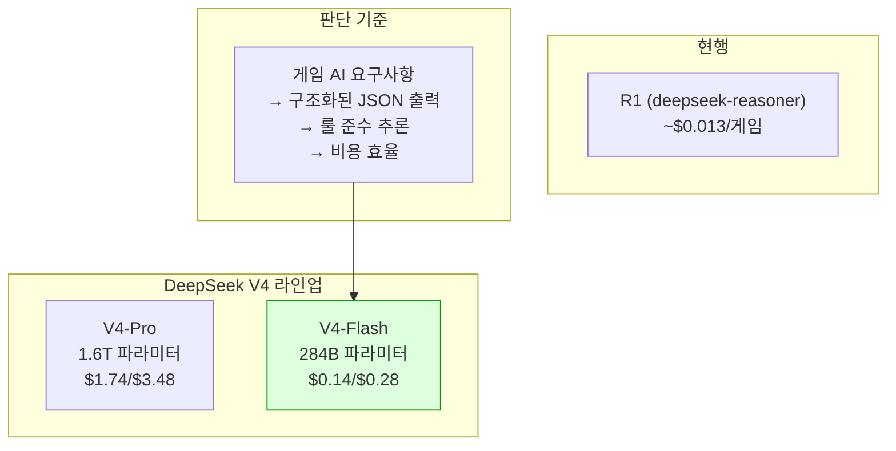
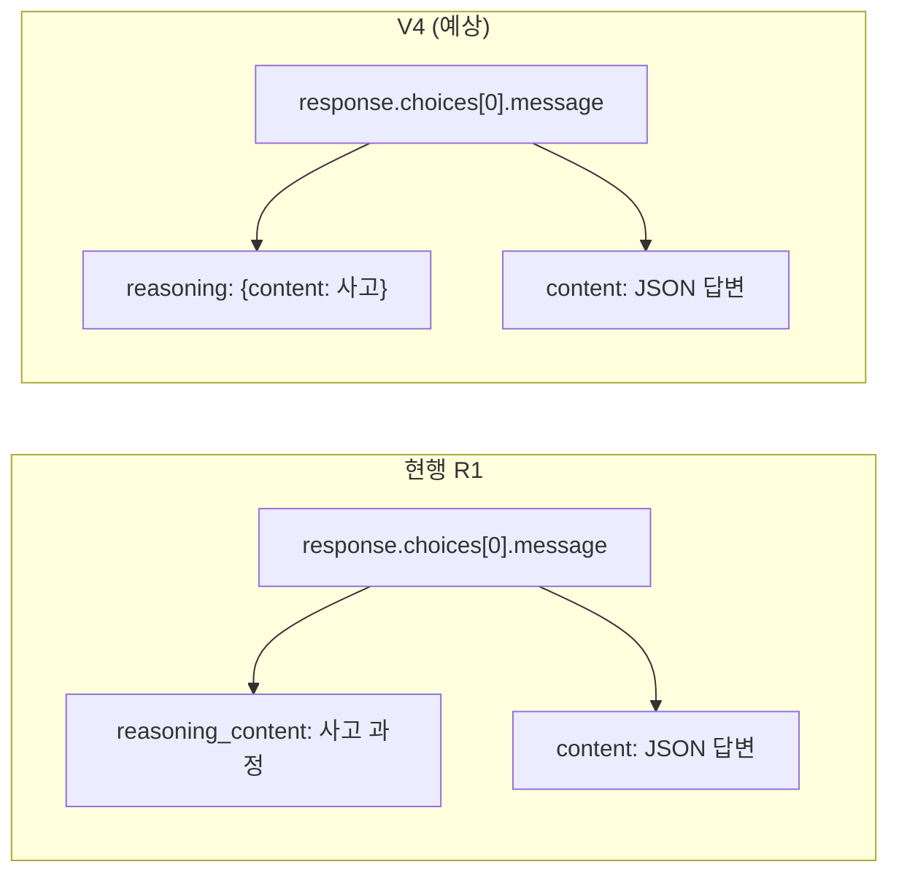
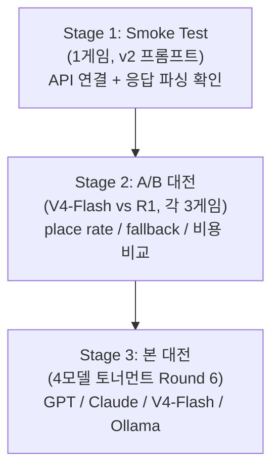

# 63. DeepSeek V4 모델 변경 계획

- **상태**: 계획 (Draft)
- **일자**: 2026-04-27
- **작성자**: Claude Opus 4.6 (1M context)
- **근거**: [DeepSeek V4 완전 분석 — 오픈소스 AI의 새로운 기준점](https://k82022603.github.io/posts/deepseek-v4-%EC%99%84%EC%A0%84-%EB%B6%84%EC%84%9D-%EC%98%A4%ED%94%88%EC%86%8C%EC%8A%A4-ai%EC%9D%98-%EC%83%88%EB%A1%9C%EC%9A%B4-%EA%B8%B0%EC%A4%80%EC%A0%90/)
- **관련 문서**:
  - `docs/02-design/42-prompt-variant-standard.md` — 프롬프트 variant SSOT
  - `docs/02-design/41-timeout-chain-breakdown.md` — 타임아웃 체인 SSOT
  - `docs/04-testing/47-ai-battle-round5-analysis.md` — Round 5 분석
  - `docs/04-testing/63-v6-context-shaper-comprehensive-report.md` — v6 종합 리포트

---

## 1. 배경

### 1.1 현재 DeepSeek 설정

| 항목 | 현재 값 |
|------|--------|
| **모델** | `deepseek-reasoner` (DeepSeek-R1) |
| **API URL** | `https://api.deepseek.com/v1` |
| **프롬프트 variant** | v4 (per-model override `DEEPSEEK_REASONER_PROMPT_VARIANT=v4`) |
| **Context Shaper** | passthrough |
| **타임아웃** | 700초 (AI_ADAPTER_TIMEOUT_SEC) |
| **ConfigMap** | `DEEPSEEK_DEFAULT_MODEL: deepseek-reasoner` |
| **최근 성적** | Round 5: place rate 30.8%, fallback 0, 게임당 $0.013 |

### 1.1b 모델명 호환성 (2026-04-27 확인)

> 출처: https://api-docs.deepseek.com/quick_start/pricing

| 레거시 모델명 | 실제 동작 | 상태 |
|--------------|----------|------|
| `deepseek-chat` | **V4-Flash non-thinking** 모드 | 향후 폐기 예정 (alias) |
| `deepseek-reasoner` | **V4-Flash thinking** 모드 | 향후 폐기 예정 (alias) |
| `deepseek-v4-flash` | V4-Flash (non-thinking 기본) | **신규 정식 ID** |
| `deepseek-v4-pro` | V4-Pro | **신규 정식 ID** |

**중요 시사점**: 기존 Round 5(deepseek-reasoner)의 30.8% 실측은, alias 전환 시점에 따라 **이미 V4-Flash thinking 모드**였을 가능성이 있다. R1 원본과의 직접 비교는 불가능하며, 기존 실측 데이터와 비교해야 한다.

### 1.2 DeepSeek V4 신규 라인업

| 항목 | V4-Pro | V4-Flash |
|------|--------|----------|
| **파라미터** | 1.6조 (활성 49B) | 2,840억 (활성 13B) |
| **컨텍스트** | 1M 토큰 | 1M 토큰 |
| **최대 출력** | 65,536 토큰 | 65,536 토큰 |
| **입력 가격** | $1.74/M토큰 | $0.14/M토큰 |
| **출력 가격** | $3.48/M토큰 | $0.28/M토큰 |
| **Codeforces** | 3206 | - |
| **MoE 활성화율** | ~3% | ~4.6% |
| **추론 모드** | thinking + non-thinking | thinking + non-thinking |
| **API 호환** | OpenAI ChatCompletions | OpenAI ChatCompletions |

### 1.3 V4 vs 현행 R1 비교

| 비교 항목 | DeepSeek-R1 (현행) | DeepSeek V4-Pro | DeepSeek V4-Flash |
|----------|-------------------|----------------|-------------------|
| **연산 효율** | 기준 | V3.2 대비 73% 절감 | V3.2 대비 90% 절감 |
| **KV 캐시** | 기준 | 90% 절감 | 93% 절감 |
| **추론** | reasoning_content 전용 필드 | thinking/non-thinking 선택 | thinking/non-thinking 선택 |
| **가격** | 추론 토큰 별도 과금 | 입력 $1.74 / 출력 $3.48 | 입력 $0.14 / 출력 $0.28 |
| **RummiArena 예상 비용** | ~$0.013/게임 | 추정 필요 | **~$0.003/게임 (예상)** |

---

## 2. 모델 선택

### 2.1 후보 모델



### 2.2 권장: V4-Flash

| 판단 기준 | V4-Pro | V4-Flash | 선택 |
|----------|--------|----------|------|
| **비용** | $1.74+$3.48 (R1보다 비쌀 수 있음) | $0.14+$0.28 (R1 대비 ~80% 절감) | **V4-Flash** |
| **추론 능력** | 최상위 (Opus 급) | 상위 모델에 준하는 성능 | V4-Flash로 충분 |
| **응답 속도** | 무거움 | 경량 MoE → 빠른 응답 | **V4-Flash** |
| **RummiArena 용도** | 과잉 스펙 | 적정 스펙 | **V4-Flash** |
| **일일 비용 한도** | $20 한도에서 적은 게임 수 | $20 한도에서 많은 게임 수 | **V4-Flash** |

**근거**: RummiArena의 게임 AI는 복잡한 멀티스텝 에이전트가 아니라 "현재 보드 상태 → 다음 수 결정"의 단일 추론이다. V4-Flash의 성능으로 충분하며, 비용 절감이 크다.

### 2.3 대안: V4-Pro 테스트도 포함

V4-Flash를 주력으로 채택하되, V4-Pro와의 A/B 비교 대전을 1회 실행하여 place rate 차이를 실측한다. 차이가 5%p 이내면 V4-Flash 확정.

---

## 3. 모델 교체 계획

### 3.1 변경 지점 (타임아웃 체인 SSOT 체크리스트 준수)

`docs/02-design/41-timeout-chain-breakdown.md` §5 체크리스트에 따라 전수 점검:

| # | 위치 | 현재 값 | 변경 값 | 비고 |
|---|------|--------|--------|------|
| 1 | `src/ai-adapter/src/adapter/deepseek.adapter.ts` L38 | `api.deepseek.com/v1` | `api.deepseek.com/v1` (동일) | V4도 동일 API URL 사용 |
| 2 | `src/ai-adapter/src/adapter/deepseek.adapter.ts` 모델명 | `deepseek-reasoner` | `deepseek-v4` 또는 `deepseek-v4-flash` | API 문서 확인 필요 |
| 3 | `helm/charts/ai-adapter/values.yaml` | `DEEPSEEK_DEFAULT_MODEL: deepseek-reasoner` | `DEEPSEEK_DEFAULT_MODEL: deepseek-v4-flash` | Helm 값 |
| 4 | K8s ConfigMap | `DEEPSEEK_DEFAULT_MODEL: deepseek-reasoner` | `DEEPSEEK_DEFAULT_MODEL: deepseek-v4-flash` | 배포 시 갱신 |
| 5 | `deepseek.adapter.ts` 응답 파싱 | `reasoning_content` 전용 필드 | `thinking` 모드 대응 필요 | **핵심 변경** |
| 6 | `deepseek.adapter.spec.ts` | `deepseek-reasoner`/`deepseek-chat` | V4 모델명으로 교체 | 테스트 |
| 7 | 타임아웃 | 700초 | **300~400초로 감소 가능** | V4 MoE 효율로 응답 빠를 것 예상 |

### 3.2 핵심 코드 변경: 응답 파싱

현행 `deepseek-reasoner`는 `reasoning_content` 필드에 사고 과정을, `content`에 최종 답을 반환한다. V4는 `thinking` 모드를 사용하므로 응답 구조가 다를 수 있다.



**사전 확인 필요**: V4 API 실제 응답 구조를 `curl` 테스트로 확인한 후 파싱 로직 결정.

### 3.3 프롬프트 variant 전략

`docs/02-design/42-prompt-variant-standard.md` §2 표 B 참조.

| 시나리오 | variant | 근거 |
|---------|---------|------|
| **초기 테스트** | v2 (베이스라인) | R1과 동일 조건으로 비교하기 위해 |
| **본 대전** | v4 (현행 유지) | R1에서 검증된 variant |
| **V4 최적화** | v5 (신규 작성 가능) | V4의 thinking 모드에 맞는 최적 프롬프트 |

초기에는 v2로 테스트하여 R1 대비 성능을 비교하고, 이후 V4에 최적화된 variant를 작성한다.

### 3.4 타임아웃 조정

V4 MoE 아키텍처는 활성 파라미터가 적어 응답이 빠를 것으로 예상. 부등식 계약 준수하면서 타임아웃 감소:

```
현행: script_ws(770) > gs_ctx(760) > http_client(760) > istio_vs(710) > adapter(700) > llm_vendor
조정: script_ws(470) > gs_ctx(460) > http_client(460) > istio_vs(410) > adapter(400) > llm_vendor
```

**단, 실측 후 조정**. 첫 대전에서는 현행 700초 유지, 응답 시간 통계 수집 후 감소.

---

## 4. 모델 테스트 계획

### 4.1 3단계 테스트



### 4.2 Stage 1: Smoke Test (30분)

| 항목 | 내용 |
|------|------|
| **목적** | API 연결 확인, 응답 파싱 정상 여부 |
| **모델** | V4-Flash |
| **프롬프트** | v2 (베이스라인) |
| **게임 수** | 1 |
| **성공 기준** | (1) API 200 응답, (2) JSON 파싱 성공, (3) 유효한 move 1회 이상 |
| **실행 방법** | `batch-battle` SKILL 단일 게임 모드 |

확인 사항:
- [ ] API URL 동일한지 (`api.deepseek.com/v1`)
- [ ] 모델명 정확한지 (V4 API 문서 확인)
- [ ] `reasoning_content` vs `reasoning` 필드 구조
- [ ] 토큰 사용량 및 과금 확인
- [ ] 응답 시간 기록

### 4.3 Stage 2: A/B 대전 (2시간)

| 항목 | V4-Flash | R1 (현행) |
|------|----------|----------|
| **게임 수** | 3 | 3 |
| **프롬프트** | v2 | v2 |
| **타임아웃** | 700초 (현행 유지) | 700초 |
| **측정 지표** | place rate, fallback rate, avg response time, cost | 동일 |

**성공 기준**:
- V4-Flash place rate ≥ R1 place rate - 5%p (즉 25.8% 이상이면 통과)
- V4-Flash fallback rate = 0
- V4-Flash cost < R1 cost

**실행**: `batch-battle` SKILL의 multirun 모드.

### 4.4 Stage 3: 본 대전 Round 6 (반나절)

| 모델 | 게임 수 | variant | 비고 |
|------|---------|---------|------|
| GPT (gpt-5-mini) | 3 | v2 | 기존 기준 |
| Claude (sonnet-4 thinking) | 3 | v4 | 기존 기준 |
| **DeepSeek V4-Flash** | 3 | v2 → v4 | 신규 |
| Ollama (qwen2.5:3b) | 3 | v2 | 베이스라인 |

**성공 기준**:
- V4-Flash가 R1 Round 5 대비 place rate 동등 이상 (30.8%)
- 비용 절감 실측 (게임당 $0.003 이하 목표)
- 전체 12게임 정상 완주

---

## 5. 작업 순서

| 순서 | 작업 | 담당 | 예상 시간 | 의존성 |
|------|------|------|----------|--------|
| 1 | V4 API 문서 확인 (모델명, 응답 구조) | ai-engineer | 30분 | 없음 |
| 2 | deepseek.adapter.ts 모델명 + 파싱 수정 | node-dev | 2시간 | #1 |
| 3 | deepseek.adapter.spec.ts 테스트 갱신 | node-dev | 1시간 | #2 |
| 4 | Stage 1 Smoke Test | qa | 30분 | #2, #3 |
| 5 | Helm values + ConfigMap 갱신 | devops | 30분 | #4 PASS |
| 6 | Stage 2 A/B 대전 (V4-Flash vs R1) | ai-engineer | 2시간 | #5 |
| 7 | 타임아웃 조정 판단 | architect | 30분 | #6 실측 데이터 |
| 8 | Stage 3 본 대전 Round 6 | ai-engineer | 반나절 | #7 |
| 9 | 결과 보고서 + variant 최적화 판단 | ai-engineer | 1시간 | #8 |

**총 예상**: 2~3일 (Sprint 7 잔여 5일 내 가능)

---

## 6. 리스크

| 리스크 | 영향 | 완화 |
|--------|------|------|
| V4 API 응답 구조 변경 | 파싱 실패, fallback 증가 | Stage 1 Smoke에서 사전 확인 |
| V4-Flash 추론 품질 부족 | place rate 하락 | Stage 2 A/B에서 R1과 비교, 미달 시 V4-Pro 전환 |
| V4 모델명 불확실 | API 호출 실패 | DeepSeek 공식 문서에서 정확한 모델 ID 확인 |
| 타임아웃 과소 설정 | 정상 응답 fallback 오분류 | 첫 대전은 700초 유지, 실측 후 조정 |
| API 잔액 부족 | 대전 중단 | 현재 ~$2.20 잔여, V4-Flash 저렴하므로 충분 예상 |

---

## 7. 롤백 계획

V4 전환 후 문제 발생 시:

```bash
# ConfigMap 롤백
kubectl patch configmap ai-adapter-config -n rummikub \
  --type merge -p '{"data":{"DEEPSEEK_DEFAULT_MODEL":"deepseek-reasoner"}}'
kubectl rollout restart deployment/ai-adapter -n rummikub
```

코드 롤백은 `DEEPSEEK_DEFAULT_MODEL` 환경변수만 변경하면 되므로 코드 revert 불필요.

---

## 8. 성공 기준 요약

| 지표 | R1 (현행) | V4-Flash (목표) |
|------|----------|----------------|
| **place rate** | 30.8% | ≥ 28% |
| **fallback rate** | 0% | 0% |
| **게임당 비용** | ~$0.013 | ≤ $0.005 |
| **평균 응답 시간** | ~120초 | ≤ 60초 (예상) |
| **타임아웃 초과** | 0% | 0% |
