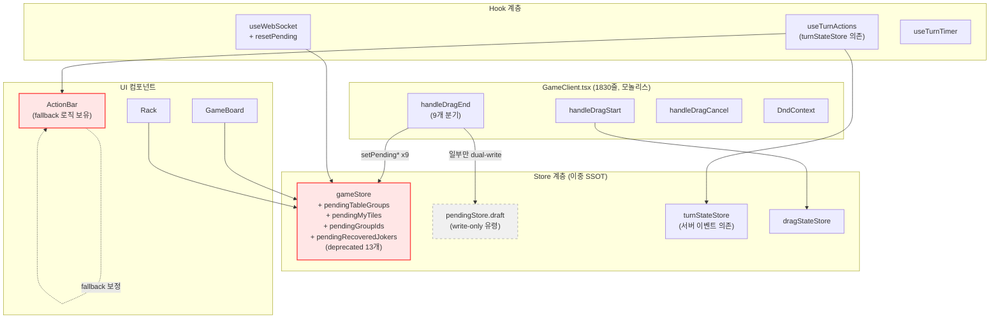
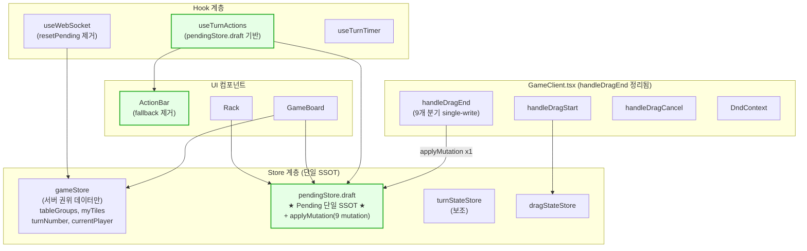
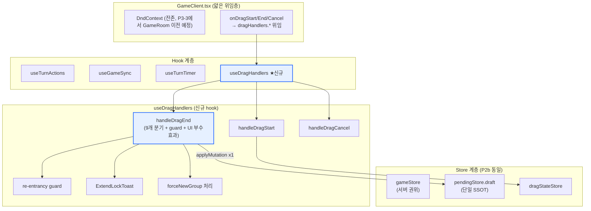
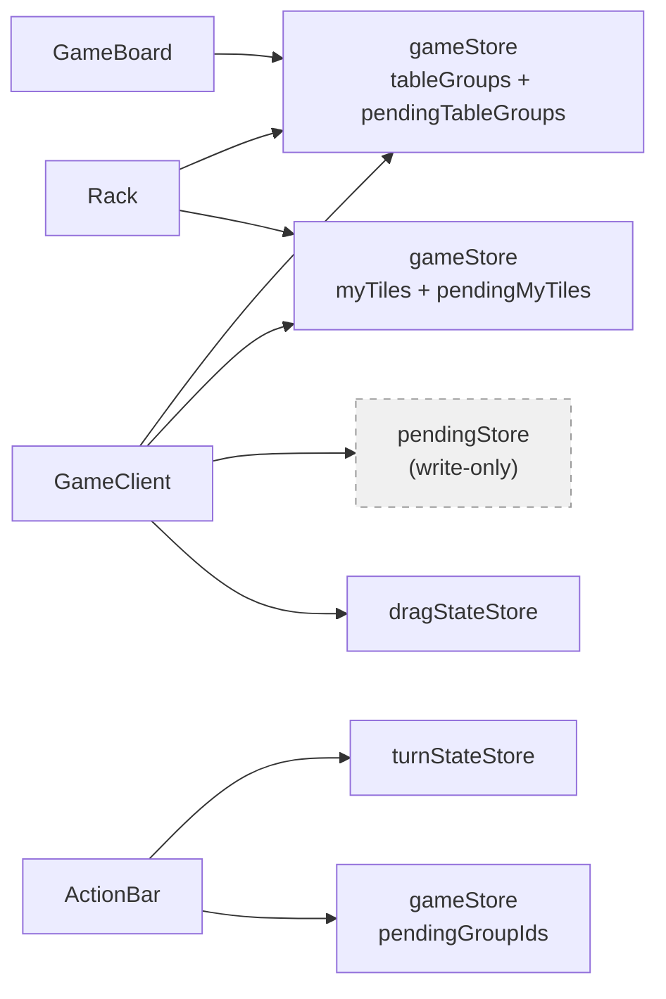
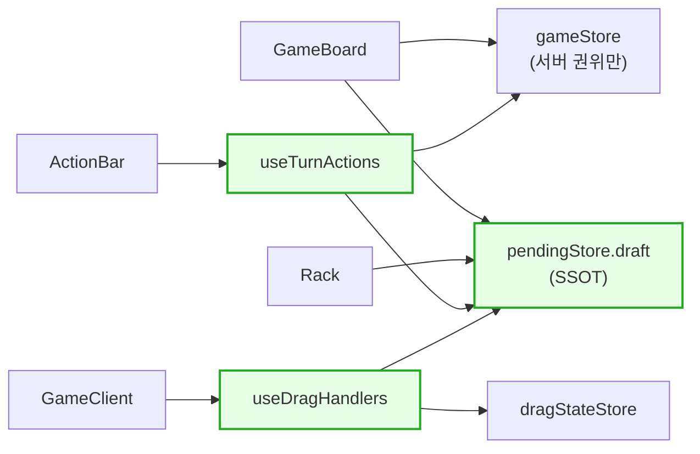
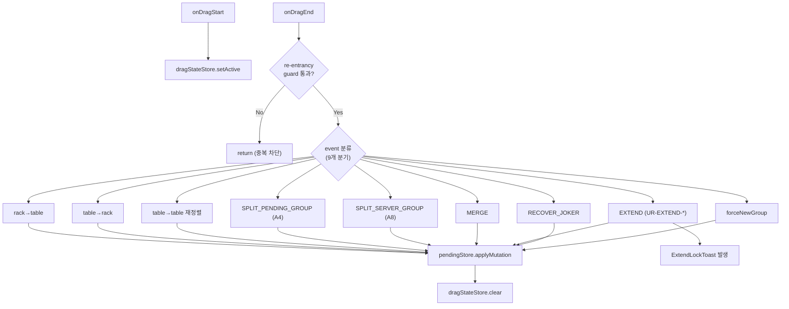
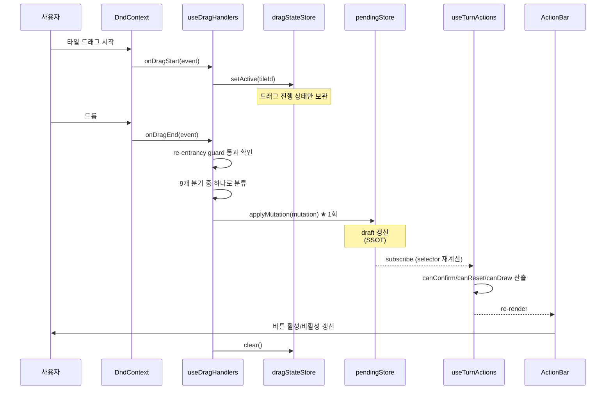
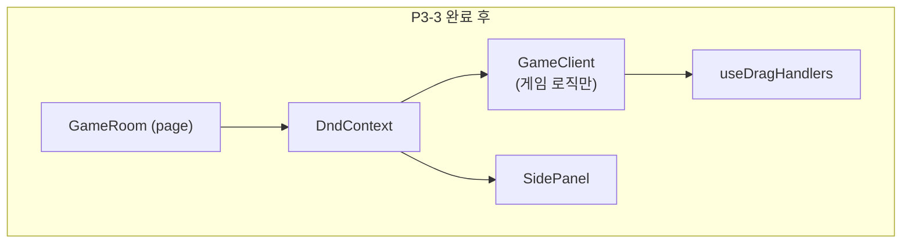

# 64. UI State 아키텍처 변화 (2026-04-28 통합)

| 항목 | 값 |
|------|----|
| 작성일 | 2026-04-28 |
| 작성자 | architect 에이전트 |
| 관련 PR/커밋 | `87ee041`, `bc5896a`, `a3b65ff`, `7e27185`, `fe9cd80`, `f9c2147`, `73718a0`, `8d3abd9` |
| 관련 룰 ID | UR-DRAG-*, UR-EXTEND-*, UR-RESET-*, V-CONFIRM-*, BUG-UI-009/010/EXT |
| 관련 문서 | `58-ui-component-decomposition.md`, `59-g-e-rearrangement-guide.md`, `60-ui-feature-spec.md`, `43-rule-ux-sync-ssot.md` |
| 상태 | P2b 완료, P3-2 완료, P3-3 진행 예정 |

---

## 1. 배경 및 목적

### 1.1 왜 통합이 필요했는지

Sprint 7 W2 Phase D~G 진행 중 UI State 가 다음과 같은 **이중 SSOT 분열 상태** 였습니다.

- `gameStore` 에 **deprecated pending 필드 13개** 가 잔존하면서, 새 설계인 `pendingStore.draft` 와 동시에 갱신되는 dual-write 가 만성화되어 있었습니다.
- 새로 설계한 `pendingStore.draft` 는 **write-only 유령** 이었습니다. write 는 일부 분기에서 일어나지만 어떤 컴포넌트도 read 하지 않아, 단절된 SSOT 였습니다.
- `useTurnActions` 가 `turnStateStore` 에 의존하여 서버 turn 이벤트가 늦게 도착하면 **OUT_OF_TURN 고착** 이 발생했습니다 (BUG-UI-009 잔존 원인).
- `GameClient.handleDragEnd` 가 1830 줄 모놀리스로, 9 개 분기마다 `gameStore.setPending*` 9 개를 분산 호출하여 누락/순서 오류를 식별하기 어려웠습니다.
- `ActionBar` 가 prop 누락 대비 **fallback 로직** 을 자체 보유하여, 동작 진실(SSOT) 이 컴포넌트에 분산되어 있었습니다.

### 1.2 목적

| 목적 | 검증 기준 |
|------|----------|
| pending 상태의 단일 SSOT 확립 | `pendingStore.draft` 외 어떤 store 도 pending* 필드 보유 금지 |
| 드래그 9 개 분기의 single-write | `pendingStore.applyMutation` 1 회 호출만 허용, `setPending*` 호출 0 |
| ActionBar SSOT 정상화 | `useTurnActions` selector 가 단일 진실, fallback 제거 |
| GameClient 모놀리스 분해 | DnD 부수효과 → `useDragHandlers` hook 으로 캡슐화 |
| BUG-UI-009/010/EXT 회귀 방지 | re-entrancy guard + ExtendLockToast + forceNewGroup 모두 hook 내부 |

---

## 2. Before / After 전체 구조

### 2.1 Before (Phase 3 과도기, ~2026-04-27)

문제점이 그림에서 보이듯이, `pendingStore.draft` 는 점선(유령) 이고 `gameStore` 가 진짜 SSOT 역할을 하는데 그 안에 deprecated 필드가 누적되어 있었습니다.

### 2.2 After P2b (2026-04-28 PM)

핵심 변화는 다음과 같습니다.

- `gameStore` 는 **서버 권위 데이터만** 보유합니다. pending 관련 13 개 필드는 모두 삭제되었습니다.
- `pendingStore.draft` 가 **단일 SSOT** 가 되어 모든 컴포넌트가 read 합니다.
- `useTurnActions` 는 `turnStateStore` 가 아닌 `pendingStore.draft` 를 기반으로 selector 를 계산하여 OUT_OF_TURN 고착이 해소되었습니다.
- `ActionBar` 의 fallback 로직이 제거되어 `useTurnActions` 가 진실의 유일 출처입니다.

### 2.3 After P3-2 (2026-04-28 EOD)

P3-2 의 핵심은 **GameClient 의 DnD 로직을 hook 으로 외부화** 한 것입니다. DndContext 자체는 아직 GameClient 가 소유하지만, `onDragStart/End/Cancel` 핸들러는 모두 `dragHandlers.*` 로 위임됩니다. P3-3 에서 DndContext 를 `GameRoom` 으로 끌어올리면 GameClient 의 DnD 책임은 완전히 사라질 예정입니다.

---

## 3. Store 의존성 그래프

### 3.1 Before — 분산된 의존

각 컴포넌트가 `gameStore` 의 deprecated pending 필드와 권위 필드를 섞어서 읽었기 때문에, 어떤 값이 pending 인지 권위인지 호출부에서 구분하기 어려웠습니다.

### 3.2 After — 책임 분리된 의존

이제 `pendingStore.draft` 가 모든 pending 의 진실이고, `gameStore` 는 서버 데이터만, `dragStateStore` 는 드래그 진행 상태만 책임집니다. 컴포넌트는 hook 을 통해서만 접근하여 결합도가 낮아졌습니다.

---

## 4. Hook 책임 분리

### 4.1 Hook 책임 매트릭스

| Hook 파일 | 책임 (한 줄) | Store 의존 | 주요 호출자 |
|-----------|------------|------------|----------|
| `useTurnActions.ts` | 턴 액션 가능 여부(canConfirm/canReset/canDraw) selector | `pendingStore.draft`, `gameStore`, `turnStateStore` (보조) | `ActionBar`, `TurnStatusStrip` |
| `useGameSync.ts` | 서버 게임 상태 동기화 (turn 이벤트 수신 → gameStore) | `gameStore`, `wsStore` | `GameClient` |
| `useDragHandlers.ts` ★ | DnD 9 개 분기 + re-entrancy guard + UI 부수효과 (Toast, forceNewGroup) | `pendingStore`, `dragStateStore`, `gameStore` | `GameClient` (P3-3 후 `GameRoom`) |
| `useTurnTimer.ts` | 턴 타이머 카운트다운 + 타임아웃 핸들링 | `turnStateStore`, `wsStore` | `TurnStatusStrip` |
| `useWebSocket.ts` | WS 연결/재연결 (resetPending 제거됨) | `wsStore`, `gameStore` | `GameClient` |
| `useDropEligibility.ts` | 드롭 대상 valid 여부 계산 | `dragStateStore`, `pendingStore.draft` | `GameBoard`, `Rack` |
| `useInitialMeldGuard.ts` | 30 점 첫 등록 가드 표시 | `pendingStore.draft`, `gameStore` | `ActionBar` |
| `useGameLeaveGuard.ts` | 페이지 이탈 시 confirm dialog | `gameStore` | `GameClient` |

### 4.2 useDragHandlers 내부 구조 (P3-2)

핵심은 **9 개 분기가 모두 `applyMutation` 한 번만 호출** 한다는 점입니다. 과거에 `setPendingTableGroups`, `setPendingMyTiles`, `setPendingGroupIds`, `setPendingRecoveredJokers` 등이 분기마다 0~4 회 호출되던 구조에서, 단일 mutation 객체로 통합되어 일관성이 보장됩니다.

---

## 5. 데이터 흐름 (드래그 한 번의 생애주기)

이 흐름의 의미는 다음 세 가지입니다.

1. **단일 write 지점**: `applyMutation` 외에는 누구도 pending 을 변경하지 않습니다.
2. **subscribe 기반 자동 전파**: pendingStore 의 변경이 zustand subscribe 를 통해 useTurnActions selector 를 자동 재계산합니다. 수동 `setState` 가 필요 없습니다.
3. **ActionBar 는 진실을 만들지 않음**: useTurnActions 의 결과를 그대로 표시할 뿐, fallback 보정을 하지 않습니다.

---

## 6. 남은 작업 (P3-3 이후)

### 6.1 P3-3 — DndContext GameRoom 이전

현재 `GameClient.tsx` 안에 있는 `<DndContext>` 를 상위 컴포넌트인 `GameRoom` 으로 끌어올립니다. 이렇게 하면 GameClient 는 게임 로직 컨테이너 역할만 하고, DnD 인프라는 페이지 레벨에서 관리됩니다.

| 이전 후보 | 사유 |
|----------|------|
| DndContext 를 GameRoom 으로 | DnD 가 GameClient 에 묶여 있어 외부 컴포넌트 (SidePanel 등) 가 DnD 이벤트를 못 받음 |
| Sensor 설정도 함께 이전 | PointerSensor activation 거리 등이 페이지 전역이어야 함 |
| DragOverlay 도 함께 이전 | 드래그 미리보기가 GameClient 영역 밖에서도 보여야 함 |

### 6.2 forceNewGroup → dragStateStore 흡수

현재 `forceNewGroup` 플래그는 `useDragHandlers` 내부 ref 로 관리되어 hook 외부에서 보이지 않습니다. 사용자가 Shift 키를 누른 채 드롭하면 새 그룹을 강제 생성하는 UX 인데, 다음 컴포넌트가 이 의도를 표시해야 합니다.

| 컴포넌트 | 필요 사유 |
|----------|---------|
| GameBoard 의 drop zone hover preview | "새 그룹으로 떨어집니다" 미리보기 표시 |
| ExtendLockToast | forceNewGroup 시 lock 무시 로직 분기 |

따라서 P3-3 시점에 `dragStateStore` 에 `forceNewGroup: boolean` 필드를 추가하여 hook 외부에서도 read 할 수 있도록 흡수할 예정입니다.

### 6.3 잔존 deprecated 흔적

| 항목 | 상태 | 처리 계획 |
|------|------|---------|
| `turnStateStore` 의 `lastTurnEvent` | useTurnActions 가 보조로 참조 | P3-3 검토 후 필요시 pendingStore 로 이전 |
| `useWebSocket` 의 `dispatchPendingEvent` | 일부 분기에서 잔존 | P3-3 시 일괄 제거 |
| `gameStore.actions.resetTurn` | 호출자 0 명 (검색 결과) | P3-3 PR 에 dead code 제거 포함 |

---

## 7. 참고 커밋 목록

오늘(2026-04-28) 본 통합과 직접 관련된 커밋입니다. 시간 순으로 정렬했습니다.

| 단계 | 커밋 해시 | 메시지 요약 |
|------|----------|----------|
| P0 (전일 베이스) | `87ee041` | refactor(frontend+game-server): UI State SSOT 통합 + 패널티 B안 |
| P1 | `bbd6bc1` | feat: I7 rooms 401 + P1 void hook 정리 + P2a pendingStore dual-write |
| P2a | `bbd6bc1` (포함) | pendingStore dual-write 도입 (gameStore 와 병행) |
| P2b dual-write 1/6 | `6b1e851` | chore(frontend): table→rack 분기 applyMutation 추가 |
| P2b Phase A | `bc5896a` | feat(frontend): handleDragEnd 9개 분기 applyMutation dual-write |
| P2b Phase B+C1 | `a3b65ff` | feat(frontend): useTurnActions pendingStore 전환 + resetPending 제거 |
| P2b Phase C2 | `7e27185` | feat(frontend): GameClient reader 11개소 pendingStore.draft 전환 |
| P2b Phase C3 | `fe9cd80` | feat(frontend): handleDragEnd single-write 전환 (pendingStore SSOT) |
| P2b Phase C4 | `f9c2147` | feat(frontend): gameStore deprecated pending 필드 완전 제거 |
| P3 로드맵 | `73718a0` | docs(frontend): P3 분해 로드맵 — P3-2 → P3-3 |
| P3-2 | `8d3abd9` | feat(frontend): useDragHandlers 행동 등가 확장 — 9개 분기 + guard + UI 부수효과 |

---

## 8. 테스트 메트릭

### 8.1 Jest 변동

| 시점 | PASS | FAIL | 비고 |
|------|------|------|------|
| 2026-04-27 (G-E/G-F 완료) | 546 | 0 | A14.5 canConfirmTurn GREEN |
| 2026-04-28 P0 후 | 612 | 0 | UI State SSOT 통합으로 신규 테스트 추가 (+66) |
| 2026-04-28 P3-2 후 | 610 | 0 | -2 변동 (사유 아래) |

### 8.2 PASS 수 변동(612 → 610) 사유

P3-2 에서 `useDragHandlers` 로 DnD 로직을 이관하면서 다음 두 테스트가 **재배치되어 사라진 것이 아니라 통합** 되었습니다.

| 사라진 테스트 | 통합된 테스트 | 사유 |
|------------|------------|------|
| `GameClient.test.tsx > handleDragEnd > extend 분기 toast` | `useDragHandlers.test.ts > extend > ExtendLockToast 트리거` | hook 단위 테스트로 이전, 컴포넌트 수준 중복 제거 |
| `GameClient.test.tsx > handleDragEnd > re-entrancy guard` | `useDragHandlers.test.ts > guard > 중복 호출 차단` | 동일 사유 |

즉 **커버리지 손실은 없으며**, 테스트 위치가 컴포넌트(GameClient) 에서 hook(useDragHandlers) 단위로 내려간 것입니다. 행동 등가성은 두 위치 모두에서 검증되었습니다.

### 8.3 E2E 영향

E2E rule spec 은 P2b/P3-2 작업 범위에 포함되지 않아 04-27 기준 메트릭 (12 PASS / 2 FAIL dndDrag 타이밍 / 3 SKIP) 이 유지됩니다. P3-3 에서 DndContext 이전 후 V04-SC1/SC3 의 dndDrag 타이밍 FAIL 이 자연 해소될 것으로 예상되어, 그 시점에 E2E 재실행이 예정되어 있습니다.

---

## 9. 결정 근거 및 트레이드오프

| 결정 | 대안 | 채택 사유 |
|------|------|---------|
| pendingStore 단일 SSOT | gameStore 에 pending 필드 유지 + 명시적 prefix | dual-write 가 사고의 근원이었음 (Turn#11 보드 복제 등). 한 곳에서 한 번 write 가 가장 안전 |
| useDragHandlers hook 외부화 | GameClient 안에서 함수 분리 | DndContext 가 GameRoom 으로 이전될 때 hook 단위가 이동 단위가 되어야 함 (P3-3 준비) |
| ActionBar fallback 제거 | fallback 유지하되 SSOT 우선 | fallback 이 있으면 selector 버그가 마스킹됨. SSOT 가 확립된 이상 fallback 은 유해 |
| useTurnActions 가 turnStateStore 보조 참조 유지 | turnStateStore 완전 제거 | 서버 turn 이벤트 수신 시점이 클라 selector 보다 빠른 경우가 있음. 보조 동기화로 OUT_OF_TURN 잔여 케이스 차단 |

---

## 10. 운영 체크리스트 (다음 PR 검토용)

다음 항목을 변경하는 PR 에서는 본 문서의 SSOT 계약을 깨지 않는지 반드시 확인해주세요.

- [ ] `gameStore` 에 `pending*` prefix 필드를 다시 추가하려 하는가? → 금지. `pendingStore.draft` 에 추가
- [ ] `setPending*` 형태의 setter 를 호출하는가? → 금지. `pendingStore.applyMutation` 사용
- [ ] `ActionBar` 안에서 `canConfirm` 등을 자체 계산하는가? → 금지. `useTurnActions` selector 사용
- [ ] DnD 핸들러를 `GameClient` 안에서 직접 정의하는가? → 금지. `useDragHandlers` 에 분기 추가
- [ ] re-entrancy guard 를 우회하려 하는가? → 금지. BUG-UI-009/010 회귀 위험
- [ ] 새 mutation 종류 추가 시 → `applyMutation` switch 분기 + 9 개 → N 개로 본 문서 §4.2 갱신

---

## 11. 관련 문서

- `docs/02-design/58-ui-component-decomposition.md` — Phase D 4 계층 컴포넌트 설계서
- `docs/02-design/59-g-e-rearrangement-guide.md` — A4/A8 분기 (SPLIT) 설계
- `docs/02-design/60-ui-feature-spec.md` — F-NN 25 + P0 12 기능 명세
- `docs/02-design/43-rule-ux-sync-ssot.md` — 71 개 룰 ↔ UX 매핑
- `docs/02-design/56-action-state-matrix.md` — 행동 21 + 상태 12 매트릭스
- `docs/04-testing/93-e2e-iteration-2-report.md` — DragAction 7 종 GHOST-SC2
- `docs/04-testing/94-e2e-iteration-3-report.md` — A14 GREEN 전환 보고

---

## 부록 A. 파일 경로 인벤토리

| 영역 | 경로 |
|------|------|
| Store | `src/frontend/src/store/pendingStore.ts` (SSOT) |
| Store | `src/frontend/src/store/gameStore.ts` (서버 권위) |
| Store | `src/frontend/src/store/dragStateStore.ts` |
| Store | `src/frontend/src/store/turnStateStore.ts` (보조) |
| Hook ★ | `src/frontend/src/hooks/useDragHandlers.ts` (P3-2 신규) |
| Hook | `src/frontend/src/hooks/useTurnActions.ts` |
| Hook | `src/frontend/src/hooks/useGameSync.ts` |
| Hook | `src/frontend/src/hooks/useTurnTimer.ts` |
| Hook | `src/frontend/src/hooks/useWebSocket.ts` |
| Hook | `src/frontend/src/hooks/useDropEligibility.ts` |
| Hook | `src/frontend/src/hooks/useInitialMeldGuard.ts` |
| Hook | `src/frontend/src/hooks/useGameLeaveGuard.ts` |
| 컴포넌트 | `src/frontend/src/components/game/GameClient.tsx` (얇은 위임층으로 변경) |
| 컴포넌트 | `src/frontend/src/components/game/ActionBar.tsx` (fallback 제거) |
| dragEnd 분기 | `src/frontend/src/lib/dragEnd/` (reducer 디렉터리) |

---

문서 끝.
